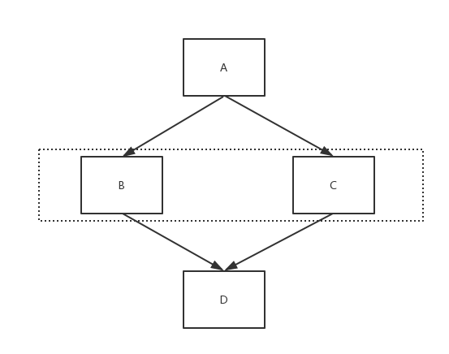
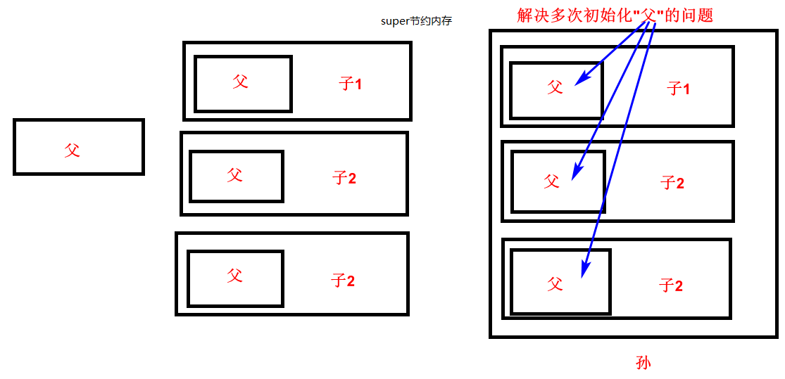
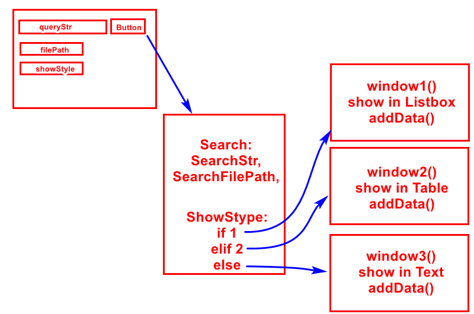

# Python Inheritance

<!-- TOC -->

- [Python Inheritance](#python-inheritance)
    - [init ParentClass with 3 methods](#init-parentclass-with-3-methods)
    - [multi-inheritance](#multi-inheritance)
    - [private variable](#private-variable)
    - [解决多次初始化](#解决多次初始化)
    - [多态](#多态)
    - [instance vs class](#instance-vs-class)
        - [instance method, `@classmethod`, `@staticmethod`](#instance-method-classmethod-staticmethod)
        - [class variable, instance variable](#class-variable-instance-variable)
        - [类方法vs实例方法vs静态方法](#类方法vs实例方法vs静态方法)
    - [inheritance with GUI](#inheritance-with-gui)
        - [DataSearch](#datasearch)
    - [Some example](#some-example)
        - [car store](#car-store)

<!-- /TOC -->

处理10亿级的数据，可能面试会问的问题：

- 内存不够怎么解决的
- 硬盘不够怎么解决的
- 多线程，线程冲突
- 多进程，进程通信
- 一台机器不够，分布式，分布式的架构

## init ParentClass with 3 methods

```python
class Mammal(object):
    def __init__(self):
        self.name="Mammal"
        self.eyes=2
    def Eat(self):
        print("I can eat")
    def Sleep(self):
        print("I can sleep")

class Person(Mammal):
    def __init__(self):
        # Mammal.__init__(self)#初始化父类，Mammal是一个class，所以需要self
        # super(Person, self).__init__()
        super().__init__()#一般使用这个,super()是一个instance
        self.name="Human"
    def Eat(self):
        print("I can eat KFC")

#继承的意义：代码重用(数据、函数重用)；重名情况下发生覆盖
person1=Person()
print(person1.name,person1.eyes)
person1.Eat()
person1.Sleep()
```

## multi-inheritance

继承自object的是新式类，不继承自object的是经典类;
- python3中默认都是新式类, 不论是否写`class XXX(object)`中的`(object)`
- python2中才有区别: 新式类采用广度优先继承, 经典类采用深度优先继承

以下图的4个class的`__init__(self, ...)`来分析



深度优先继承 vs 广度优先继承:
- 广度优先: 比如`class D(B, C)`, 如果D有`__init__`那么使用自己的`__init__`; 如果没有那么寻找`__init__`的顺序是**B→C→A**, 只要找到了`__init__`那么就不再寻找; 而且继承的前后顺序很重要, 如果是`class D(C, B)`, 那么寻找父类同名函数的顺序是**C→B→A**
- 深度优先: 比如`class D(B, C)`, 那么顺序是**B→A→C**

可以通过`__mro__`来查看搜索顺序, 同时配合深度优先、广度优先的堆栈、队列数据结构来理解；

```python
# class A: # 经典类
class A(object): # 新式类
    def __init__(self):
        print('initialize class A')

class B(A):
    def __init__(self):
        print('initialize class B')

class C(A):
    def __init__(self):
        print('initialize class C')

class D(B, C):
    def __init__(self):
        print('initialize class D')

d1=D() # 通过注释不同的__init__, 根据打印信息自行检验
print(D.__mro__)
# (<class '__main__.D'>, <class '__main__.B'>, <class '__main__.C'>, <class '__main__.A'>, <class 'object'>)
```

`super()`继承顺序, 也是按照广度优先来查找

```python
class B(object):
    def __init__(self):
        print('initialize class B')

class C(object):
    def __init__(self):
        print('initialize class C')

class D(B, C):
    def __init__(self):
        super().__init__()
        print('initialize class D')

d1=D()
# initialize class B
# initialize class D
```

```python
class B(object):
    pass

class C(object):
    def __init__(self):
        print('initialize class C')

class D(B, C):
    def __init__(self):
        super().__init__()
        print('initialize class D')

d1=D()
# initialize class C
# initialize class D
```

example1:

```python
class Person:
    def __init__(self, name, age):
        self.name=name
        self.age=age

class Relation(object):
    # 因为没有单独给name属性，Relation这个类不能单独使用，需要被有name属性的class所继承才不会报错
    def make_friends(self, other):
        print(f'{self.name} make friend with {other.name}')
        
class Man(Person, Relation):
    def __init__(self, name, age, weight):
        super().__init__(name, age)
        self.weight=weight

class Woman(Person, Relation):
    def __init__(self, name, age, height):
        super().__init__(name, age)
        self.height=height

m1=Man('grey', 26, 50)
w1=Woman('jane', 25, 160)
m1.make_friends(w1)# grey make friend with jane
```

```python
# 按照之前的思路理解改变Person, Relation的顺序
class Person:
    def __init__(self, name, age):
        self.name=name
        self.age=age

class Relation(object):
    # 因为没有单独给name属性，Relation这个类不能单独使用，需要被有name属性的class所继承才不会报错
    def make_friends(self, other):
        print(f'{self.name} make friend with {other.name}')
        
class Man(Relation, Person):
    def __init__(self, name, age, weight):
        # 因为Relation里面没有__init__, 所以找到的是Person的__init__
        super().__init__(name, age)
        self.weight=weight

class Woman(Relation, Person):
    def __init__(self, name, age, height):
        super().__init__(name, age)
        self.height=height

m1=Man('grey', 26, 50)
w1=Woman('jane', 25, 160)
m1.make_friends(w1)# grey make friend with jane
```

example2:

```python
#尽量不要使用相同的函数名，如果不是多态的话
class Base(object):
    def test(self):
        print("---base")

class A(Base):
    def test(self):
        print("---A")

class B(Base):
    def test(self):
        print("---B")

class C(A,B):
    pass

myC=C()
print(C.__mro__)#(<class '__main__.C'>, <class '__main__.A'>, <class '__main__.B'>, <class '__main__.Base'>, <class 'object'>);决定了继承方法的顺序,一个挨着一个区搜索test方法，这个使用C3算法做的
myC.test()#---A
```

```python
class BiologicalFather(object):
    def __init__(self):
        self.money=100000
        self.vehicle="bike"
        self.house="small house"
    def buy(self):
        print("I can buy cheap things")

class GanDie(object):
    def __init__(self):
        self.money=2e8
        self.vehicle="Lamborghini"
        self.house="big house"
    def buy(self):
        print("I can buy expensive things")

class BeautifulActress(BiologicalFather,GanDie):
    def __init__(self):
        BiologicalFather.__init__(self)
        GanDie.__init__(self)

jingtian=BeautifulActress()
print(jingtian.money,jingtian.vehicle,jingtian.house)#与两个初始化__init__()的顺序对应，后面的覆盖前面的,200000000.0 Lamborghini big house
jingtian.buy()#仍然按照广度优先寻找方法，先找到就停止寻找
```

example3: 充分理解[MRO](http://python.jobbole.com/85685/)(Method Resolution Order)

```python
class First(object):
    def __init__(self):
        print('First---1')
        # 有了这个super()才能继续按照MRO搜索, 进入Second
        super().__init__()
        print("First---2")

class Second(object):
    def __init__(self):
        print('Second---1')
        super().__init__()
        print("Second---2")

class Third(First, Second):
    def __init__(self):
        print('Third---1')
        super().__init__()
        print("Third---2")

t=Third()
# Third---1
# First---1
# Second---1
# Second---2
# First---2
# Third---2
# 可以看到super()前后语句的不同效果, 有堆栈效果
```

example4: 

```python
# without super()
class A(object):
    def __init__(self, name):
        self.name=name

class B(object):
    def __init__(self, age):
        self.age=age

class C(A, B):
    def __init__(self, name, age):
        A.__init__(self, name)
        B.__init__(self, age)

c=C('grey', 23)
print(c.name, c.age) # grey 23
```

```python
# with super(), 实现相同的逻辑
class A(object):
    def __init__(self, name, *args):
        self.name=name
        # 下面的super()十分关键, 有了这一个才能继续MRO的搜索; 否则停止搜索了
        # 这里拿掉了第一个参数，剩下一个进入B
        super().__init__(*args)

class B(object):
    def __init__(self, age, *args):
        self.age=age

class C(A, B):
    def __init__(self, *args):
        super().__init__(*args)

c=C('grey', 23)
# 
print(c.name, c.age) # grey 23
```

example5: better example， 仔细品味打印顺序，有堆栈结构

```python
class A(object):
  def __init__(self, a, *args, **kwargs):
    print("A", a)

class B(A):
  def __init__(self, b, *args, **kwargs):
    super().__init__(*args, **kwargs)
    print("B", b)

class C(A):
  def __init__(self, c, *args, **kwargs):
    super().__init__(*args, **kwargs)
    print("C", c)

class D(B, C):
  def __init__(self, d, *args, **kwargs):
    super().__init__(*args, **kwargs)
    print("D", d)


d1=D(a=1, b=2, c=3, d=4)
# A 1
# C 3
# B 2
# D 4
```

## private variable

```python
class Father(object):
    def __init__(self):
        self.__wife="Mother"

class Son(Father):
    def __init__(self):
        super().__init__()
    def Show(self):
        # print(self.__wife)#AttributeError: 'Son' object has no attribute '_Son__wife'#里面都不能访问，外部的更加不可能
        pass
#father
father1=Father()
# print(father1.__wife)#不能访问
print(dir(father1))#可以查看private variable, private method
print(father1._Father__wife)#强制访问,Mother
#son
son1=Son()
son1.Show()
print(dir(son1))
print(son1._Father__wife)#强制访问,Mother
```

所有的类都是默认继承于`object`，可以不用写

```python
class ClassX(object):
    pass

class ClassY:
    pass

instance1=ClassX()
print(dir(instance1))
instance2=ClassY()
print(dir(instance2))
#前两个结果一样
#比上面少了'__dict__', '__module__', '__weakref__'
print(dir(object))
```

```python
#一些继承自object的函数
class ClassX(object):
    '''
    This is the document of ClassX
    '''
    def __init__(self):
        self.name="ClassX"

print(ClassX.__doc__)#This is the document of ClassX
print(ClassX.__name__)#ClassX
print(ClassX.__module__)#__main__，属于__main__模块
print(__name__)#__main__,当前的东西的名称
print(ClassX.__base__)#<class 'object'>
print(ClassX.__bases__)#(<class 'object'>,)
print(ClassX.__dict__)#所有属性,方法的key-values pair
```

## 解决多次初始化



```python
#浪费内存的情况
class 爷:
    def __init__(self):
        print("爷构造了一次")

class 大儿子(爷):
    def __init__(self):
        爷.__init__(self)
        print("大儿子构造了1次")

class 二儿子(爷):
    def __init__(self):
        爷.__init__(self)
        print("二儿子构造了1次")

class 小儿子(爷):
    def __init__(self):
        爷.__init__(self)
        print("小儿子构造了1次")

class  媳妇(大儿子,二儿子,小儿子):
    def __init__(self):
        大儿子.__init__(self)
        二儿子.__init__(self)
        小儿子.__init__(self)

#
xf=媳妇()
```

```bash
#output
爷构造了一次
大儿子构造了1次
爷构造了一次
二儿子构造了1次
爷构造了一次
小儿子构造了1次
```

```python
#super()解决该问题
class 爷:
    def __init__(self):
        print("爷构造了一次")

class 大儿子(爷):
    def __init__(self):
        super().__init__()
        print("大儿子构造了1次")

class 二儿子(爷):
    def __init__(self):
        super().__init__()
        print("二儿子构造了1次")

class 小儿子(爷):
    def __init__(self):
        super().__init__()
        print("小儿子构造了1次")

class  媳妇(大儿子,二儿子,小儿子):
    def __init__(self):
        super().__init__()

xf=媳妇()
```

```bash
#output
爷构造了一次
小儿子构造了1次
二儿子构造了1次
大儿子构造了1次
```

## 多态

解决软件可拓展性, 弄一个父类，然后后面拓展的功能继承这个父类，那么就可以用一个父类的对象进行功能拓展了(比如工厂拓展业务线)

下面的例子比较的简单，并没有涉及Factory中不变的部分，所以即便是不继承Factory，也是可以得到结果；假如Factory中还有其他东西，三个process还是得继承

```python
class Factory(object):
    pass

class MakeOrange(Factory):
    def make(self):
        print("process orange")

class MakeApple(Factory):
    def make(self):
        print("process apple")

class MakeBanana(Factory):
    def make(self):
        print("process banana")

print(isinstance(MakeOrange(),Factory))#True
print(isinstance(MakeApple(),Factory))#True
print(isinstance(MakeBanana(),Factory))#True
#interface，鸭子类型的多态
def makeInterface(obj):
    obj.make()
#
process1=MakeOrange()
process2=MakeApple()
process3=MakeBanana()

myList=[]
myList.append(process1)
myList.append(process2)
myList.append(process3)
#
for i in range(3):
    makeInterface(myList[i])
```

```bash
#output
True
True
True
process orange
process apple
process banana
```

## instance vs class

### instance method, `@classmethod`, `@staticmethod`

[实例方法、类方法、静态方法区别](https://blog.csdn.net/lihao21/article/details/79762681)

staicmethod其实和外部函数差不多, 只不过通过实例、类来调用而已; 
> 比如某些module中的staicmethod, 只是通过模块名来组织成一个工具包而已;

```python
class A(object):
    def instance_method(self):
        print(f'para={self}')
    
    @classmethod
    def cls_method(cls):
        print(f'para={cls}')
    
    @staticmethod
    def static_method():
        print(f'nothing with class')

a=A()
# 实例方法
a.instance_method()
A.instance_method(a)

# 类方法
a.cls_method()
A.cls_method()

# 静态方法
a.static_method()
A.static_method()
```

```bash
# output
para=<__main__.A object at 0x00000214032DD438>
para=<__main__.A object at 0x00000214032DD438>

para=<class '__main__.A'>
para=<class '__main__.A'>

nothing with class
nothing with class
```

example1:

```python
class Animal(object):
    def __init__(self, name):
        self.name=name
    def talk(self):
        pass
    @staticmethod
    def animal_talk(animal):
        animal.talk()

class Dog(Animal):
    def talk(self):
        print('wang wang')

class Cat(Animal):
    def talk(self):
        print('miao miao')

d1=Dog('grey')
c1=Cat('Tom')

Animal.animal_talk(d1)
Animal.animal_talk(c1)
# wang wang
# miao miao
```

### class variable, instance variable

```python
#类属性、类方法实现多个对象数据共享
class Base(object):
    #类属性
    num=0
    def __init__(self,name):
        self.name=name #实例属性
        Base.num+=1
    
obj1=Base("grey")
obj2=Base("moris")
print(Base.num)#2
print(obj1.num)#2
print(obj2.num)#2
```

### 类方法vs实例方法vs静态方法

- 要操作类属性，就要用到类方法；
- 要操作实例属性，就要用到实例方法；
- 和实例属性、类属性关系不大，就用静态方法；

```python
class Base(object):
    #类属性
    num=0

    #实例方法
    def __init__(self,name):
        self.name=name#实例属性
        Base.num+=1
    
    #类方法,用于共享
    @classmethod #装饰器
    def add_num(cls):#用的是cls
        cls.num+=1
    
    @staticmethod #不写self,cls
    def printMenu():
        print("base begin")
    
obj1=Base("grey")
obj2=Base("moris")

print(Base.num)#2
print(obj1.num)#2

#class method
Base.add_num()
obj1.add_num()
print(Base.num)#4

#static method
Base.printMenu()
obj1.printMenu()
```

## inheritance with GUI

### DataSearch



```bash
#文件结构
myDir/
    ListboxView.py
    TextView.py
    TableView.py
    DataSearch.py
    SearchPanel.py
    main.py
```

在DataSearch与3个view之间加入一个`WindowBase`，让3个view继承`WindowBase`，实现多态，节约代码

```python
#WindowBase.py
import tkinter

class WindowBase(object):
    def __init__(self):
        #set Window
        self.viewWindow=tkinter.Tk()
        self.viewWindow.geometry("800x600+800+50")
    def Show(self):
        self.viewWindow.mainloop()
    def AddData(self, dataStr):
        pass#留着重写
```

```python
#ListboxView.py
import WindowBase
import tkinter

class ListboxView(WindowBase.WindowBase):
    def __init__(self):
        super().__init__()
        #set listbox
        self.listbox1=tkinter.Listbox(self.viewWindow)
        self.listbox1.pack(expand=True, fill='both')#完全填充viewWindow
    def AddData(self, dataStr):
        self.listbox1.insert(tkinter.END,dataStr)
```

```python
#TextView.py
import WindowBase
import tkinter

class TextView(WindowBase.WindowBase):
    def __init__(self):
        super().__init__()
        #set text
        self.text1=tkinter.Text(self.viewWindow)
        self.text1.pack(expand=True, fill='both')#完全填充viewWindow
    def AddData(self, dataStr):
        self.text1.insert(tkinter.END,dataStr)
```

```python
#TableView.py
import WindowBase
import tkinter
from tkinter import ttk

class TableView(WindowBase.WindowBase):
    def __init__(self):
        super().__init__()
        #set table
        self.table1=ttk.Treeview(self.viewWindow)
        self.table1["columns"]=("Column1","Column2","Column3")#Column1是keyword
        ## set table heading
        self.table1.heading("Column1",text="Account")
        self.table1.heading("Column2",text="Password")
        self.table1.heading("Column3",text="Email")
        self.table1["show"]="headings"
        self.table1.pack(expand=True, fill='both')
        # set the insert index
        self.insertIndex=0
    def AddData(self, dataStr):
        lineTuple=tuple(dataStr.split(" # "))
        self.table1.insert("",self.insertIndex,values=lineTuple)
        self.insertIndex+=1
```

```python
#DataSearch.py没变
import ListboxView
import TextView
import TableView
import codecs

class DataSearch(object):
    def __init__(self, path, viewerStyle):
        #open file
        self.file=codecs.open(path,"rb","utf-8","ignore")
        #instantiate a shower
        if viewerStyle==0:
            self.viewer=ListboxView.ListboxView()
        elif viewerStyle==1:
            self.viewer=TextView.TextView()
        else:
            self.viewer=TableView.TableView()
    def Search(self, searchStr):
        while True:
            line=self.file.readline()
            if line.find(searchStr)!=-1:
                self.viewer.AddData(line)
            if not line:
                break
    def ResultShow(self):
        self.viewer.Show()
    def __del__(self):
        self.file.close()
```

```python
#SearchPanel.py没变
import tkinter
from tkinter import ttk
import DataSearch

class SearchPanel(object):
    def __init__(self):
        #set mainwindow
        self.win=tkinter.Tk()
        self.win.geometry("400x50+300+50")
        
        #set entry
        self.entry1=tkinter.Entry(self.win,width=40)
        self.entry1.place(x=50,y=10)

        #set button
        self.button1=tkinter.Button(self.win,text="Search",command=self.Search)
        self.button1.place(x=300,y=5)

        #set style combobox
        self.combobox1=ttk.Combobox(self.win,width=2)
        self.combobox1["values"]=(0,1,2)
        self.combobox1.current(0)
        self.combobox1.place(x=0,y=10)
    def Show(self):
        self.win.mainloop()
    def Search(self):
        datasearcher=DataSearch.DataSearch("simpleCSDN.txt",self.combobox1.current())
        datasearcher.Search(self.entry1.get())
        datasearcher.ResultShow()

#for test
searchpanel=SearchPanel()
searchpanel.Show()
```

对于爆破密码的例子，将其中的Crack独立出去，也继承自`CrackBase`,然后写上其他的Crack Oracle, Crack mariaDB,....

## Some example

### car store

每次添加一辆车，需要在CarStore添加elif，耦合太强

```python
class CarStore(object):
	def order(self, car_type):
		if car_type=="索纳塔":
			return Suonata()
		elif car_type=="名图":
			return Mingtu()

class Car(object):
	def move(self):
		print("车在移动....")
	def music(self):
		print("正在播放音乐....")
	def stop(self):
		print("车在停止....")

class Suonata(Car):
	pass

class Mingtu(Car):
	pass

car_store = CarStore()
car = car_store.order("索纳塔")
car.move()
car.music()
car.stop()
```

使用函数完成解开耦合

```python
class CarStore(object):
	def order(self, car_type):
		return select_car_by_type(car_type)

def select_car_by_type(car_type):
	if car_type=="索纳塔":
		return Suonata()
	elif car_type=="名图":
		return Mingtu()
	elif car_type=="ix35":
		return Ix35()

class Car(object):
	def move(self):
		print("车在移动....")
	def music(self):
		print("正在播放音乐....")
	def stop(self):
		print("车在停止....")

class Suonata(Car):
	pass

class Mingtu(Car):
	pass

class Ix35(Car):
	pass

car_store = CarStore()
car = car_store.order("索纳塔")
car.move()
car.music()
car.stop()
```

使用class解开耦合,简单工厂模式

```python
class CarStore(object):
	def __init__(self):
		self.factory = Factory()

	def order(self, car_type):
		return self.factory.select_car_by_type(car_type)

class Factory(object):
	def select_car_by_type(self, car_type):
		if car_type=="索纳塔":
			return Suonata()
		elif car_type=="名图":
			return Mingtu()
		elif car_type=="ix35":
			return Ix35()

class Car(object):
	def move(self):
		print("车在移动....")
	def music(self):
		print("正在播放音乐....")
	def stop(self):
		print("车在停止....")

class Suonata(Car):
	pass

class Mingtu(Car):
	pass

class Ix35(Car):
	pass

car_store = CarStore()
car = car_store.order("索纳塔")
car.move()
car.music()
car.stop()
```

多种类型的店铺，用到继承; 实现多态；

父类定义方法，多个子类去实现该方法，也就是**工厂方法模式**

```python
class Store(object):
	def select_car(self):
		pass
	def order(self, car_type):
		return self.select_car(car_type)

#BMW
class BMWCarStore(Store):
	def select_car(self, car_type):
		return BMWFactory().select_car_by_type(car_type)

class BMWFactory(object):
	def select_car_by_type(self, car_type):
		pass

#Another CarStore
class CarStore(Store):
	def select_car(self, car_type):
		return Factory().select_car_by_type(car_type)

class Factory(object):
	def select_car_by_type(self, car_type):
		if car_type=="索纳塔":
			return Suonata()
		elif car_type=="名图":
			return Mingtu()
		elif car_type=="ix35":
			return Ix35()

class Car(object):
	def move(self):
		print("车在移动....")
	def music(self):
		print("正在播放音乐....")
	def stop(self):
		print("车在停止....")

class Suonata(Car):
	pass

class Mingtu(Car):
	pass

class Ix35(Car):
	pass

car_store = CarStore()
car = car_store.order("索纳塔")
bmw_store = BMWCarStore()
bmw = bmw_store.order("720li")
car.move()
car.music()
car.stop()
```