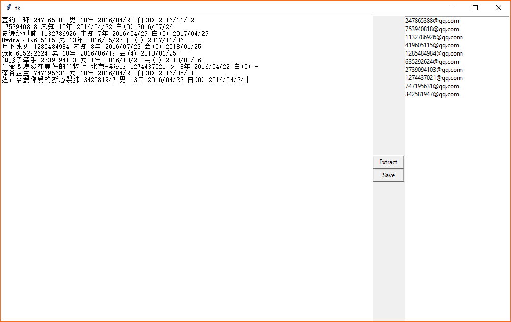

# Python Regular Expression

<!-- TOC -->

- [Python Regular Expression](#python-regular-expression)
    - [regex table](#regex-table)
    - [Attention](#attention)
        - [about `(?:)`](#about-)
        - [`(?#)`, `(?imx:...)`,`(?=...)`, `(?!...)`, `(?<=...)`, `(?<!...)`](#-imx---)
        - [`(?(group) yes_pattern|no_pattern`](#group-yes_patternno_pattern)
        - [`\b`, `\B`](#\b-\b)
        - [about escaping `\\`](#about-escaping-\\)
        - [about `^`](#about-^)
        - [about `|`](#about-)
        - [`expand()`](#expand)
        - [`re.pattern`](#repattern)
    - [QQ or phone-number](#qq-or-phone-number)
    - [match, search, findall](#match-search-findall)
        - [match 搜索(bad)](#match-搜索bad)
        - [match 挖掘，分割](#match-挖掘分割)
        - [search 搜索](#search-搜索)
        - [search 挖掘](#search-挖掘)
        - [match, search summary](#match-search-summary)
        - [findall](#findall)
        - [finditer](#finditer)
    - [`re.split`](#resplit)
    - [re.subn(), re.sub()](#resubn-resub)
    - [Detail](#detail)
        - [[]](#)
        - [多次](#多次)
            - [`*`,>=0次](#0次)
            - [`+`,>=1次](#1次)
            - [`?`,0 or 1次](#0-or-1次)
            - [greedy](#greedy)
        - [逻辑与分组](#逻辑与分组)
        - [Tag](#tag)
    - [GUI 提取qq,email,phone](#gui-提取qqemailphone)

<!-- /TOC -->

regex可以实现**搜索、匹配、切割、截取、替换**

## regex table

[Official Table](https://docs.python.org/3/library/re.html) vs [3rd Table](https://www.cnblogs.com/huxi/archive/2010/07/04/1771073.html)

symbols|details
---|---
`.`|匹配除`\n`的任意字符, 若`flags=re.DOTALL`, 也会匹配`\n`
`*`|匹配前面的字符或者子表达式 $0\leqslant times$
`*?`|惰性匹配上一个
`+`|匹配前一个字符或子表达式 $1\leqslant times$
`+?`|惰性匹配上一个
`?`|匹配前一个字符或子表达式 $times=0, 1$
`{m}`|匹配前一个字符或子表达式 $times = m$
`{m,n}`|匹配前一个字符或子表达式 $m\leqslant times\leqslant n$
`{m,}`|匹配前一个字符或者子表达式 $m\leqslant times$
`{,n}`|匹配前一个字符或者子表达式 $0\leqslant times\leqslant n$
`{m,}?`|前一个的惰性匹配
`^`|匹配字符串的开头
`$`|匹配字符串结束
`|`| or
`()`| group
`[ ]`|匹配内部的任一字符或子表达式
`[^]`|对字符集和取非 
`-`|定义一个区间
`\d`|匹配任意数字`[0-9]`
`\D`|`[^0-9]`, `[^\d]`
`\t`|匹配tab
`\s`|匹配空白字符`[<space>\t\r\n\f\v]`
`\S`|[^\s]
`\w`|匹配任意数字字母下划线`[a-zA-Z0-9_]`
`\W`|`[^\w]`
`\b`|`\W`与`\w`的边界，该字符的长度为0
`\B`|匹配非边界
`\A`|匹配整个字符串的开头，即使在`re.M`模式下，也不会匹配其它行的行首
`\Z`|匹配整个字符串的结尾，即使在`re.M`模式下，也不会匹配其它行的结尾
`\1, \2, ....\9`|代指第1, 2, ...9个分组

## Attention

regex分类:
- 功能字符 `.` `*` `+` `|` `?` `^` `$` `\`
- 分界符 `()` `[]` `{}`
- 预定义转义字符 `\d` `\D` `\s` `\S` `\w`  `\W`
- 特殊字符 `#` `!` `:` `-`

### about `(?:)`

无捕获组: 相较于`()`, 不将组的结果挖出来

```python
import re

str1='I have a cat'
pat1=r'I have a (?:dog|cat)'
pat2=r'I have a (dog|cat)'
pat3=r'I have a dog|cat' # 要么I have a dog, 要么cat

print(re.match(pat1, str1).group()) # I have a cat
# print(re.match(pat1, str1).group(1)) # no such group

print(re.match(pat2, str1).group()) # I have a cat
print(re.match(pat2, str1).group(1)) # cat

print(re.match(pat3, str1)) # None
```

### `(?#)`, `(?imx:...)`,`(?=...)`, `(?!...)`, `(?<=...)`, `(?<!...)`

- `(?#...)`: 注释
- `(?imx:...)`: option flag, `re.I`, `re.M`, `re.X`


```python
import re

str1='hello123grey'
pat1=r'\d+(?# get the number in string)'

re.match(pat1, str1)
```

```python
import re
#m=re.search(r"(abc){2}","abcabc")
#m=re.search(r"(abc|xyz){2}","abcxyz")  abc|xyz取一个，连续两次
#m=re.search(r"(?:abc){2}","abcabc") #?:不捕捉模式
#m=re.search(r"((?i)abc){2}","abcAbc")#(?i)忽略大小写
#m=re.search(r"(abc(?#你妹)){2}","abcabc") #?#注释
#m=re.search(r"a(?=bc)","abc")  #后面必须=bc才能匹配a
#m=re.search(r"a(?!bc)","acb") #后面必须!=bc才能匹配a
#m=re.search(r"(?<=bc)a","cba")#qian面必须=bc才能匹配a
#m=re.search(r"(?<!bc)a","bxa")#qian面必须!=bc才能匹配a
```

```python
# 挖出注释的内容
import re
 
str1='/*comment1*/ /*comment2*/'
pat1=re.compile(r'(?<=/\*).+?(?=\*/)')
pat1.findall(str1) # ['comment1', 'comment2']
```

### `(?(group) yes_pattern|no_pattern`

```python
import re

str1='<usr1@mail1> usr2@maill2 <usr3@mail3>'
# 如果第一组匹配成功， 那么(?(1)>)采用>来匹配，如果匹配失败，采用''
pat1=re.compile(r'(<)?(\w+@\w+)(?(1)>|)')

pat1.findall(str1) # [('<', 'usr1@mail1'), ('', 'usr2@maill2'), ('<', 'usr3@mail3')]
```

### `\b`, `\B`

> 匹配完的字符串不会包括那个分界的字符。而如果用`\s`来匹配的话，则匹配出的字符串中会包含那个分界符

- `\b`作为`\w`和`\W`的边界,左右两边必须不同
- `\B`不作为`\w`和`\W`的边界，左右两部是同类的\w或者\W

```python
import re

str1='abc abcde bc bcd'
pat1=r'\bbc\b'
pat2=r'\sbc\s'
pat3=r'\Bbc\w+'

print(re.findall(pat1, str1)) # ['bc']
print(re.findall(pat2, str1)) # [' bc ']
print(re.findall(pat3, str1)) # ['bcde']
```

```python
import re

str1='grey'
str2='!^&*'
print(re.search(r'\Bre\B', str1)) # re
print(re.search(r'\B\B', str2)) # &
```

### about escaping `\\`

```python
import re

print(re.match('\d+', '123grey'))# <_sre.SRE_Match object; span=(0, 3), match='123'>
# 标准写法
print(re.match('\\d+', '123grey')) 
print(re.match(r'\d+', '123grey'))

# 表示字符串中的\需要\\\\
# print(re.match('\d+\\', '123\grey')) # error
print(re.match('\\d+\\\\', '123\grey')) # <_sre.SRE_Match object; span=(0, 4), match='123\\'>
print(re.match(r'\d+\\', '123\grey'))
```

### about `^`

- `^`位于`[]`的开头表示取反: `[^a-z]`
- `^`位于`[]`的内部表示普通符号: `[a-z^]`

### about `|`

- `[], {}`外部的`|`, `^`要转义, 比如`re.search(r'[a-z]+\^\|', 'apple^|')`

### `expand()`

```python
import re

str1='Tom 24 88888888'
pat1=re.compile(r'(?P<name>\w+) (?P<age>\d+) (?P<phone>\d+)')

m=pat1.match(str1)
m.expand(r'name is \g<1> , age is \g<age> , tel is \3') # 'name is Tom , age is 24 , tel is 88888888'
```

### `re.pattern`

```python
import re

str1='Tom 24 88888888'
pat1=re.compile(r'(?P<name>\w+) (?P<age>\d+) (?P<phone>\d+)')

print(pat1.pattern) # (?P<name>\w+) (?P<age>\d+) (?P<phone>\d+)
m=pat1.match(str1)
print(m.re.pattern) # (?P<name>\w+) (?P<age>\d+) (?P<phone>\d+)
```

## QQ or phone-number

正则表达式的意义：缩减代码量

```python
#不使用regexpr, 十分麻烦
def   checkQQ(QQstr):
    if len(QQstr)<5: #判断长度
        return False
    if QQstr[0]<'1'  or QQstr[0]>'9':#判断第一个字符1-9
        return False
    for i  in range(1,len(QQstr)): #剩下的每一个字符都在0-9
        if QQstr[i] < '0' or QQstr[i] > '9':
            return False
    return True

print(checkQQ("1892"))
print(checkQQ("112321321321892"))
```

```python
#没有限制长度的qq
import re

print(re.match("[1-9][0-9]{4,}","12341"))#<_sre.SRE_Match object; span=(0, 5), match='12341'>
print(re.match("[1-9][0-9]{4,}","1234"))#None
print(re.match("[1-9][0-9]{4,}","1234a"))#None

reg1=re.compile('[1-9][0-9]{4,}')
print(reg1.match('12341')) # #<_sre.SRE_Match object; span=(0, 5), match='12341'>
match_obj=reg1.match('123789a')
if match_obj:
    print(match_obj.group())
```

```python
#movile phone-number
import re

print(re.match("^(13[0-9]|14[5|7]|15[0|1|2|3|5|6|7|8|9]|18[0|1|2|3|5|6|7|8|9])\d{8}$","13121428742"))#
print(re.match("^(13[0-9]|14[5|7]|15[0|1|2|3|5|6|7|8|9]|18[0|1|2|3|5|6|7|8|9])\d{8}$","18844091035"))#
```

- simple QQ: `^[1-9]\d{4,}$`
- simple mobile: `^1[34578]\d{9}$`
- simple phone: `^0[1-9]\d{1,2}-[1-9]\d{6,7}$`
- simple ip address: `^\d{1,3}.\d{1,3}.\d{1,3}.\d{1,3}$`(有另外的限制，不超过255)
- ip address: `^((\d|[1-9]\d|1(\d){2}|2[0-4]\d|25[0-5]).){3}(\d|[1-9]\d|1(\d){2}|2[0-4]\d|25[0-5])$`
- year: `(18\d{2})|(19\d{2})|(20[0-1]\d)`
- month: `(1[0-2]|0[1-9])`
- day: `[0][1-9]|[1-2][0-9]|3[0-1]`
- year-month-day: `^((18\d{2})|(19\d{2})|(20[0-1]\d))-(1[0-2]|0[1-9])-([0][1-9]|[1-2][0-9]|3[0-1])$`
- email: `\w(.|\w)+@(\w+.){1,3}\w+`(不合适，因为`_`不能当开头)
- email: `\w(.|\w)+@\w+(.\w+){1,3}`(不合适，因为`_`不能当开头)

其中复杂的ip按照下面的顺序写的

- 0-9
- 10-99
- 100-199
- 200-249
- 250-255

```python
#email example
import  re
regex1=re.compile(r"\w(.|_|\w)+@(\w+.){1,3}\w+")
# regex1=re.compile(r"\w(.|_|\w)+@\w+(.\w+){1,3}")
print(regex1.match("vip.gewei@pku.edu.cn"))
print(regex1.match("gewei@163.com"))
print(regex1.match("pku_gewei@mails.pku.edu.cn"))
print(regex1.match("gewei1112@pku.edu.cn"))
print(regex1.match("111gewei1112@pku.edu.cn"))
print(regex1.match("_gewei1112@pku.edu.cn"))
```

```bash
#output
<_sre.SRE_Match object; span=(0, 20), match='vip.gewei@pku.edu.cn'>
<_sre.SRE_Match object; span=(0, 13), match='gewei@163.com'>
<_sre.SRE_Match object; span=(0, 26), match='pku_gewei@mails.pku.edu.cn'>
<_sre.SRE_Match object; span=(0, 20), match='gewei1112@pku.edu.cn'>
<_sre.SRE_Match object; span=(0, 23), match='111gewei1112@pku.edu.cn'>
<_sre.SRE_Match object; span=(0, 21), match='_gewei1112@pku.edu.cn'>
```

洋葱浏览器(Tor browser),深网(deep web, 暗网), tor browser可以访问

## match, search, findall

### match 搜索(bad)

```python
import re

print(re.match("abc","abc"))#<_sre.SRE_Match object; span=(0, 3), match='abc'>
print(re.match("abc","xabc"))#None
print(re.match("abc","abcx"))#<_sre.SRE_Match object; span=(0, 3), match='abc'>
```

```python
import re
#match严格匹配，从一个一个开始，"abc"在"abcdefgabc"出现一次
matchobj=re.match("abc","abcdefgabc")
print(matchobj,type(matchobj)) #
print(matchobj.group(0)) #挖掘的第一个匹配
```

```bash
#output
<_sre.SRE_Match object; span=(0, 3), match='abc'> <class '_sre.SRE_Match'>
abc
```

### match 挖掘，分割

```python
import re
# (.*)
# .    任意字符不包含换行
# *    0次或者多次
line="gaoqinghua is a boy not a gril"
matchobj=re.match(r"(.*) is (.*) not (.*)",line)
print(matchobj) #详细的匹配
#挖掘
print(matchobj.group(0))
print(matchobj.group(1))
print(matchobj.group(2))
print(matchobj.group(3))
```

```bash
#output
#比如第一个例子，没有regex，只能看看group(0)是否匹配，而有了regex可以用group(1),group(2)挖掘匹配项
<_sre.SRE_Match object; span=(0, 30), match='gaoqinghua is a boy not a gril'>
gaoqinghua is a boy not a gril
gaoqinghua
a boy
a gril
```

```python
#切割字符串
import re
#切割
line="827007914----8421411penghueix"
matchobj=re.match(r"(.*)----(.*)",line)#r为转义
print(matchobj)
print(matchobj.group(0))
print(matchobj.group(1))
print(matchobj.group(2))
```

```bash
#output
<_sre.SRE_Match object; span=(0, 29), match='827007914----8421411penghueix'>
827007914----8421411penghueix
827007914
8421411penghueix
```

处理大数据的时候，为了加快，需要先编译regex

```python
import re
#切割
line="827007914----8421411penghueix"
pat=re.compile(r"(.*)----(.*)")#预编译
matchobj=pat.match(line)#match的第二种风格
# matchobj=re.match(pat,line)#或者这样
print(matchobj)
print(matchobj.group())#默认是0
print(matchobj.group(0))
print(matchobj.group(1))
print(matchobj.group(2))
```

```bash
#output
同上
```

batch rename files example:

```python
import os, re

regex=re.compile(r'\w+ (.*)')
for filename in os.listdir('.'):
    matchobj=regex.match(filename)
    if matchobj:
        newfilename=matchobj.group(1)
        os.rename(filename, filename)
```

### search 搜索

```python
#match vs search
import re
#match
print(re.match("abc","abc xyz"))
print(re.match("xyz","abc xyz"))#匹配从第一个开始，

#search
print(re.search("abc","abc xyz")) #包含就可以
print(re.search("xyz","abc xyz"))
```

```bash
#output
<_sre.SRE_Match object; span=(0, 3), match='abc'>
None
<_sre.SRE_Match object; span=(0, 3), match='abc'>
<_sre.SRE_Match object; span=(4, 7), match='xyz'>
```

### search 挖掘

```python
import re
searchobj=re.search(r"(.*)-is-(.*)","abc xyz-is-go")
print(searchobj)
print(searchobj.group(0))
print(searchobj.group(1))
print(searchobj.group(2))
```

```bash
#output
<_sre.SRE_Match object; span=(0, 13), match='abc xyz-is-go'>
abc xyz-is-go
abc xyz
go
```

### match, search summary

`match`,`search`只能处理第一个，如果要知道全部的，需要用到`findall`, 而且

`match()`只检测RE是不是在string的开始位置匹配， `search()`会扫描整个string查找匹配

```python
import re

regex1=re.compile("the")
print(regex1.match("hello the world"))
print(regex1.search("hello the world"))
print(regex1.match("the world"))
print(regex1.search("the world"))
```

```bash
#output
None
<_sre.SRE_Match object; span=(6, 9), match='the'>
<_sre.SRE_Match object; span=(0, 3), match='the'>
<_sre.SRE_Match object; span=(0, 3), match='the'>
```

example: 从<https://qun.qq.com>上面的群管理复制数据，然后搜索第一个qq号

```python
import re

myStr="""豆约卜环 247865388 男 10年 2016/04/22 白(0) 2016/11/02 
👁 753940818 未知 10年 2016/04/22 白(0) 2016/07/26 
史诗级过肺 1132786926 未知 7年 2016/04/29 白(0) 2017/04/29 
Hydra 419605115 男 13年 2016/05/27 白(0) 2017/11/06 
月下冰刃 1285484984 未知 8年 2016/07/23 会(5) 2018/01/25 
yxk 635292624 男 10年 2016/06/19 会(4) 2018/01/25 
和影子牵手 2739094103 女 1年 2016/10/22 会(3) 2018/02/06 
生命要浪费在美好的事物上 北京-郝sir 1274437021 女 8年 2016/04/22 白(0)
深谷芷兰 747195631 女 10年 2016/04/23 白(0) 2016/05/21 
妞，爷爱你爱的撕心裂肺 342581947 男 13年 2016/04/23 白(0) 2016/04/24
"""

searchObj=re.search(r"[1-9]\d{4,}",myStr)
print(searchObj)#<_sre.SRE_Match object; span=(5, 14), match='247865388'>
print(searchObj.group())#247865388
print(searchObj.group(0))#247865388
```

### findall

```python
#find all QQ
import re

myStr="""豆约卜环 247865388 男 10年 2016/04/22 白(0) 2016/11/02 
👁 753940818 未知 10年 2016/04/22 白(0) 2016/07/26 
史诗级过肺 1132786926 未知 7年 2016/04/29 白(0) 2017/04/29 
Hydra 419605115 男 13年 2016/05/27 白(0) 2017/11/06 
月下冰刃 1285484984 未知 8年 2016/07/23 会(5) 2018/01/25 
yxk 635292624 男 10年 2016/06/19 会(4) 2018/01/25 
和影子牵手 2739094103 女 1年 2016/10/22 会(3) 2018/02/06 
生命要浪费在美好的事物上 北京-郝sir 1274437021 女 8年 2016/04/22 白(0)
深谷芷兰 747195631 女 10年 2016/04/23 白(0) 2016/05/21 
妞，爷爱你爱的撕心裂肺 342581947 男 13年 2016/04/23 白(0) 2016/04/24
"""

searchObjList=re.findall(r"[1-9]\d{4,}",myStr)
print(searchObjList)
```

```bash
#output
['247865388', '753940818', '1132786926', '419605115', '1285484984', '635292624', '2739094103', '1274437021', '747195631', '342581947']
```

```python
#find all phone
import re

myStr="""曹　艳	Caoyan	6895	13811661805	caoyan@baidu.com
曹　宇	Yu Cao	8366	13911404565	caoyu@baidu.com
曹　越	Shirley Cao	6519	13683604090	caoyue@baidu.com
曹　政	Cao Zheng	8290	13718160690	caozheng@baidu.com
查玲莉	Zha Lingli	6259	13552551952	zhalingli@baidu.com
查　杉	Zha Shan	8580	13811691291	zhashan@baidu.com
查　宇	Rachel	8825	13341012971	zhayu@baidu.com
柴桥子	John	6262	13141498105	chaiqiaozi@baidu.com
常丽莉	lily	6190	13661003657	changlili@baidu.com
车承轩	Che Chengxuan	6358	13810729040	chechengxuan@baidu.com
陈　洁	Che	13811696984	chenxi_cs@baidu.com
陈　超	allen	8391	13810707562	chenchao@baidu.com
陈朝辉		13714189826	chenchaohui@baidu.com
陈　辰	Chen Chen	6729	13126735289	chenchen_qa@baidu.com
陈　枫	windy	8361	13601365213	chenfeng@baidu.com
陈海腾	Chen Haiteng	8684	13911884480	chenhaiteng@baidu.com
陈　红	Hebe	8614	13581610652	chenhong@baidu.com
陈后猛	Chen Houmeng	8238	13811753474	chenhoumeng@baidu.com
陈健军	Chen Jianjun	8692	13910828583	chenjianjun@baidu.com
陈　景	Chen Jing	6227	13366069932	chenjing@baidu.com
陈竞凯	Chen Jingkai	6511	13911087971	jchen@baidu.com
陈　坤	Isa13810136756	chenlei@baidu.com
陈　林	Lin Chen	6828	13520364278	chenlin@baidu.com
"""

searchObjList=re.findall(r"1[34578]\d{9}",myStr)
print(searchObjList,len(searchObjList))
```

```bash
#output
['13811661805', '13911404565', '13683604090', '13718160690', '13552551952', '13811691291', '13341012971', '13141498105', '13661003657', '13810729040', '13811696984', '13810707562', '13714189826', '13126735289', '13601365213', '13911884480', '13581610652', '13811753474', '13910828583', '13366069932', '13911087971', '13810136756', '13520364278'] 23
```

```python
#find all email
##复杂的表达式，必须预编译,否则弄不出来
import re

myStr="""曹　艳	Caoyan	6895	13811661805	caoyan@baidu.com
曹　宇	Yu Cao	8366	13911404565	caoyu@baidu.com
曹　越	Shirley Cao	6519	13683604090	caoyue@baidu.com
曹　政	Cao Zheng	8290	13718160690	caozheng@baidu.com
查玲莉	Zha Lingli	6259	13552551952	zhalingli@baidu.com
查　杉	Zha Shan	8580	13811691291	zhashan@baidu.com
查　宇	Rachel	8825	13341012971	zhayu@baidu.com
柴桥子	John	6262	13141498105	chaiqiaozi@baidu.com
常丽莉	lily	6190	13661003657	changlili@baidu.com
车承轩	Che Chengxuan	6358	13810729040	chechengxuan@baidu.com
陈　洁	Che	13811696984	chenxi_cs@baidu.com
陈　超	allen	8391	13810707562	chenchao@baidu.com
陈朝辉		13714189826	chenchaohui@baidu.com
陈　辰	Chen Chen	6729	13126735289	chenchen_qa@baidu.com
陈　枫	windy	8361	13601365213	chenfeng@baidu.com
陈海腾	Chen Haiteng	8684	13911884480	chenhaiteng@baidu.com
陈　红	Hebe	8614	13581610652	chenhong@baidu.com
陈后猛	Chen Houmeng	8238	13811753474	chenhoumeng@baidu.com
陈健军	Chen Jianjun	8692	13910828583	chenjianjun@baidu.com
陈　景	Chen Jing	6227	13366069932	chenjing@baidu.com
陈竞凯	Chen Jingkai	6511	13911087971	jchen@baidu.com
陈　坤	Isa13810136756	chenlei@baidu.com
陈　林	Lin Chen	6828	13520364278	chenlin@baidu.com
"""

regex_mail=re.compile(r"[A-Z0-9._%+-]+@[A-Z0-9.-]+.[A-Z]{2,4}",re.IGNORECASE)#忽略大小写
searchObjList=regex_mail.findall(myStr)
print(searchObjList,len(searchObjList))
```

```bash
#output
['caoyan@baidu.com', 'caoyu@baidu.com', 'caoyue@baidu.com', 'caozheng@baidu.com', 'zhalingli@baidu.com', 'zhashan@baidu.com', 'zhayu@baidu.com', 'chaiqiaozi@baidu.com', 'changlili@baidu.com', 'chechengxuan@baidu.com', 'chenxi_cs@baidu.com', 'chenchao@baidu.com', 'chenchaohui@baidu.com', 'chenchen_qa@baidu.com', 'chenfeng@baidu.com', 'chenhaiteng@baidu.com', 'chenhong@baidu.com', 'chenhoumeng@baidu.com', 'chenjianjun@baidu.com', 'chenjing@baidu.com', 'jchen@baidu.com', 'chenlei@baidu.com', 'chenlin@baidu.com'] 23
```

### finditer

```python
#finditer
import  re
for  data  in  re.finditer("\\d+","A11B22C33D44E55F61"):#筛选
    print(data.group(),end=',')
print("\n-------------------------")
for  data  in  re.finditer("[a-zA-Z]+","Ac11b22C33D44E55F61"):#筛选
    print(data.group(0),end=',')#也可以用group(0)
print("\n-------------------------")
for  data  in  re.finditer("法轮功","法轮功1234abcdefg法轮功"):#筛选
    print(data.group(),end=',')
print("\n-------------------------")
for  data  in  re.finditer("[法轮功]","法轮功1234a法律bcdefg法轮功"):#误伤
    print(data.group(),end=',')
print("\n-------------------------")
for  data  in  re.finditer("[^法轮功]","法轮功1234a法律bcdefg法轮功"):#误伤
    print(data.group(),end=',')
```

```bash
#output
11,22,33,44,55,61,
-------------------------
Ac,b,C,D,E,F,
-------------------------
法轮功,法轮功,
-------------------------
法,轮,功,法,法,轮,功,
-------------------------
1,2,3,4,a,律,b,c,d,e,f,g,
```

## `re.split`

```python
import re

reg1=re.compile(r"\d+")
res=reg1.split("grey12alpha45beta3james")
print(res)# ['grey', 'alpha', 'beta', 'james']
```

```python
#通常的split
line="127740	1小姐	女	22	166	本科	未婚	合肥	山羊座	编辑	普通话	安徽,浙江,江苏,上海	面议元/天	初次接触	商务伴游,私人伴游,交友伴游,景点伴游	本人今年22岁，半年前大学毕业，平时在上海工作，放假时回安徽。有意可以联系我哦。另外我是大叔控。。。	0:00—23:00	15755106787	1718560307@qq.com	http://www.banyou.com/	1718560307"

lineList=line.split("\t")
print(lineList)
```

```bash
#ouput
['127740', '1小姐', '女', '22', '166', '本科', '未婚', '合肥', '山羊座', '编辑', '普通话', '安徽,浙江,江苏,上海', '面议元/天', '初次接触', '商务伴游,私人伴游,交友伴游,景点伴游', '本人今年22岁，半年前大学毕业，平时在上海工作，放假时回安徽。有意可以联系我哦。另外我是大叔控。。。', '0:00—23:00', '15755106787', '1718560307@qq.com', 'http://www.banyou.com/', '1718560307']
```

通常的`split()`只能处理都是同样的分隔符的情况，如果有的间隔一个空格，有的间隔多个空格，普通的`split()`无能为力，所以用`re.split()`

```python
#by re.split()
import re

line="127740	1小姐	 女	22	166	本科	未婚	合肥	山羊座	编辑	普通话	安徽,浙江,江苏,上海	面议元/天	初次接触	商务伴游,私人伴游,交友伴游,景点伴游	本人今年22岁，半年前大学毕业，平时在上海工作，放假时回安徽。有意可以联系我哦。另外我是大叔控。。。	0:00—23:00	15755106787	1718560307@qq.com	http://www.banyou.com/	1718560307"

lineList=re.split(r"\s+",line)#一个或者多个空白
print(lineList)
```

```bash
#output
['127740', '1小姐', '女', '22', '166', '本科', '未婚', '合肥', '山羊座', '编辑', '普通话', '安徽,浙江,江苏,上海', '面议元/天', '初次接触', '商务伴游,私人伴游,交友伴游,景点伴游', '本人今年22岁，半年前大学毕业，平时在上海工作，放假时回安徽。有意可以联系我哦。另外我是大叔控。。。', '0:00—23:00', '15755106787', '1718560307@qq.com', 'http://www.banyou.com/', '1718560307']
```

```python
#多种间隔符号，切割
import re

line="a,b c;d"

lineList=re.split(r"[\s\,\;]",line)
print(lineList)#['a', 'b', 'c', 'd']
```

## re.subn(), re.sub()

```python
import re

reg1=re.compile(r"\d+")
res=reg1.sub('|',"grey12alpha45beta3james")
print(res) # grey|alpha|beta|james
```

```python
import  re
dangerousStr="全能神abc全能神123全能神jke全能神"
safestrlast=re.subn("全能神","宇宙真理",dangerousStr) #替换
# safestrlast2=re.subn("全能神","",safestr) #删除
print(safestrlast)
print(safestrlast[0])
print(safestrlast[1])
```

```bash
#output
('宇宙真理abc宇宙真理123宇宙真理jke宇宙真理', 4)
宇宙真理abc宇宙真理123宇宙真理jke宇宙真理
4
```

```python
import  re
safestr="132  21323   213 213   123"
safestrlast=re.subn(r"\d+","ABC",safestr) #统计数字出现的次数
print(safestrlast)
print(safestrlast[0])
print(safestrlast[1])
```

```python
#不统计次数
import  re
safestr="132  21323   213 213   123"
safestrlast=re.sub("\\d+","ABC",safestr) #删除,没有次数统计
print(safestrlast)
```

```bash
#output
ABC  ABC   ABC ABC   ABC
```

```python
# sub with function
import re

# remove comment
phone='010-62755406 # 这是一个电话号码'
num=re.sub(r'#.*', '', phone)
print(num) # 010-62755406

pure_num=re.sub(r'\D','', phone)
print(pure_num) # 01062755406

# 每个数字乘以2
def func(matched):
    value=eval(matched.group())
    return str(value*2)

modify_num=re.sub(r'(\d+)', func, 'a12b123c56')
print(modify_num) # a24b246c112
```

## Detail

### []

```python
import  re
regex=re.compile("[0-9][a-z]",re.IGNORECASE)#[][]代表两个字符
print(regex.match("3c"))#<_sre.SRE_Match object; span=(0, 2), match='3c'>
print(regex.match("3C"))#<_sre.SRE_Match object; span=(0, 2), match='3C'>
print(regex.match("c3"))#None
```

### 多次

#### `*`,>=0次

```python
import  re
regex=re.compile(r"\d*")
print(regex.match("8"))
print(regex.match("81"))
print(regex.match("81w"))
print(regex.match("81asds13213"))
print(regex.match("asds13213"))#*因为可以是0次
print(regex.match("13213"))
```

```bash
#output
<_sre.SRE_Match object; span=(0, 1), match='8'>
<_sre.SRE_Match object; span=(0, 2), match='81'>
<_sre.SRE_Match object; span=(0, 2), match='81'>
<_sre.SRE_Match object; span=(0, 2), match='81'>
<_sre.SRE_Match object; span=(0, 0), match=''>
<_sre.SRE_Match object; span=(0, 5), match='13213'>
```

#### `+`,>=1次

```python
import  re
regex=re.compile(r"\d+")
print(regex.match("8"))
print(regex.match("81"))
print(regex.match("81w"))
print(regex.match("81asds13213"))
print(regex.match("asds13213"))#*因为可以是0次
print(regex.match("13213"))
```

```bash
#output
<_sre.SRE_Match object; span=(0, 1), match='8'>
<_sre.SRE_Match object; span=(0, 2), match='81'>
<_sre.SRE_Match object; span=(0, 2), match='81'>
<_sre.SRE_Match object; span=(0, 2), match='81'>
None
<_sre.SRE_Match object; span=(0, 5), match='13213'>
```

#### `?`,0 or 1次

```python
# 找出整数和科学计数法的整数
import re

str1='123 10e3 20e4e4 2E10 30ee5'
pat1=re.compile(r'\b\d+[eE]?\d*\b')
pat1.findall(str1) # ['123', '10e3', '2E10']
```

#### greedy

[贪婪匹配 vs 惰性匹配](http://www.nowamagic.net/librarys/veda/detail/1038)

贪婪匹配尽可能长的字符串匹配，惰性匹配尽可能短的字符串匹配

贪婪匹配|惰性匹配|匹配描述
---|---|---
`?`|`??`|匹配 0 个或 1 个
`+`|`+?`|匹配 1 个或多个
`*`|`*?`|匹配 0 个或多个
`{n}`|`{n}?`|匹配 n 个
`{n,m}`|`{n,m}?`|匹配 n 个或 m 个
`{n,}`|`{n,}?`|匹配 n 个或多个

```python
#example
import  re
regex1=re.compile(r"^(\d+)(0*)$")
regex2=re.compile(r"^(\d+?)(0*)$")
print(regex1.search("8848000").groups())#默认是贪婪模式,('8848000', '')
print(regex2.search("8848000").groups())#惰性模式,('8848', '000')
```

```python
import re
 
str1='/*comment1*/ /*comment2*/'
pat1=re.compile(r'/\*.*\*/')
pat1.findall(str1) # ['/*comment1*/ /*comment2*/']

pat2=re.compile(r'/\*.*?\*/')
pat2.findall(str1) # ['/*comment1*/', '/*comment2*/']
```

### 逻辑与分组

```python
#or
import  re
regex1=re.compile("abc|xyz")
print(regex1.search("xyz"))#<_sre.SRE_Match object; span=(0, 3), match='xyz'>
```

```python
#分组
import  re
regex1=re.compile("abc{2,}")
regex2=re.compile("(abc){2,}")
print(regex1.search("abccccc"))
print(regex2.search("abcabcxyz"))
```

```bash
#output
<_sre.SRE_Match object; span=(0, 7), match='abccccc'>
<_sre.SRE_Match object; span=(0, 6), match='abcabc'>
```

### Tag

```python
import re

reg1=re.compile(r"(?P<name>\w*?) is (?P<gender>.*?), age is (?P<age>\d+)")
res=reg1.match("grey is male, age is 23")
res.groupdict() # {'name': 'grey', 'gender': 'male', 'age': '23'}
```

```python
# 匹配分组的电话
import re

str1='13444422222'
pat1=r'1[3458](\d)\1{3}(\d)\2{4}'
pat2=r'1[3458](\d){4}(\d){5}'

print(re.match(pat1, str1).group()) # 13444422222
print(re.match(pat1, str1).group(1)) # 4
print(re.match(pat1, str1).group(2)) # 2

print(re.match(pat2, str1).group()) # 13444422222
print(re.match(pat2, str1).group()) # 4444
print(re.match(pat2, str1).group()) # 22222
```

```python
import  re
pat1=re.compile(r"<[a-zA-Z]*>.*</[a-zA-Z]*>")
pat2=re.compile(r"<([a-zA-Z]*)>.*</\1>")#\1代替前面的标签

pat3=re.compile(r"<[a-zA-Z]*><[a-zA-Z]*>.*</[a-zA-Z]*></[a-zA-Z]*>")
pat4=re.compile(r"<([a-zA-Z]*)><([a-zA-Z]*)>.*</\2></\1>")#标签对称，用的是编号
pat5=re.compile(r"<(?P<html>([a-zA-Z]*))><(?P<title>([a-zA-Z]*))>.*</(?P=title)></(?P=html)>")#标签对称,用名称来匹配，奇怪的方式，用得少

print(pat1.match("<title>百度一下，你就知道 </title>"))
print(pat2.match("<title>百度一下，你就知道 </title>"))
print(pat3.match("<HTML><title>百度一下，你就知道 </title></HTML>"))
print(pat4.match("<HTML><title>百度一下，你就知道 </title></HTML>"))
print(pat5.match("<HTML><title>百度一下，你就知道 </title></HTML>"))
```

## GUI 提取qq,email,phone

根据提取的qq，`"+@qq.com"`,然后发邮件

设计一个工具提取BAT的邮箱，手机号，固定电话，保存，增加发送邮件，短信



```python
#从qun.qq.com粘贴的东西，按钮点击提取到listbox,然后保存为文件，每一个都是xxx@qq.com
import tkinter
import re
import codecs

myQQList=[]

def ExtractQQ():
    global myQQList
    textStr=text1.get("0.0","end")
    regex1=re.compile("[1-9]\d{4,}")
    myList=regex1.findall(textStr)
    for item in myList:
        item+="@qq.com"
        myQQList.append(item)
        listbox1.insert(tkinter.END,item)
def Save2File():
    file=codecs.open("result.txt","wb")
    if myQQList!=None:
        for item in myQQList:
            file.write((item+"\n").encode("utf-8"))
    file.close()

#set root window
root=tkinter.Tk()
root.geometry("1000x600+10+10")
root.rowconfigure(0,weight=1)
root.rowconfigure(1,weight=1)
root.columnconfigure(0,weight=10)
root.columnconfigure(1,weight=1)
root.columnconfigure(2,weight=5)
#Add a Text
text1=tkinter.Text(root)
text1.grid(row=0,rowspan=2,column=0,sticky=tkinter.N+tkinter.W+tkinter.S+tkinter.E)

#Add 2 buttons
btn1=tkinter.Button(root,text="Extract",command=ExtractQQ)
btn2=tkinter.Button(root,text="Save",command=Save2File)
btn1.grid(row=0,column=1,sticky=tkinter.W+tkinter.E+tkinter.S)
btn2.grid(row=1,column=1,sticky=tkinter.W+tkinter.E+tkinter.N)

#Add a listbox
listbox1=tkinter.Listbox(root)
listbox1.grid(row=0,rowspan=2,column=2,sticky=tkinter.N+tkinter.W+tkinter.S+tkinter.E)

#text1 get focus
text1.focus_set()

root.mainloop()
```