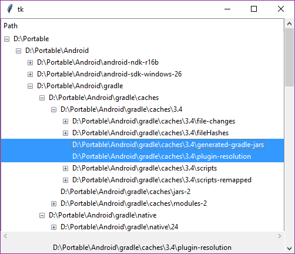

# Python Traverse

- [Python Traverse](#python-traverse)
  - [线性递归](#%e7%ba%bf%e6%80%a7%e9%80%92%e5%bd%92)
  - [树形递归](#%e6%a0%91%e5%bd%a2%e9%80%92%e5%bd%92)
  - [stack模拟recursive](#stack%e6%a8%a1%e6%8b%9frecursive)
    - [深度遍历 vs 广度遍历](#%e6%b7%b1%e5%ba%a6%e9%81%8d%e5%8e%86-vs-%e5%b9%bf%e5%ba%a6%e9%81%8d%e5%8e%86)
  - [web crawler](#web-crawler)
    - [BFS](#bfs)
    - [DFS](#dfs)
  - [python crawler with finance](#python-crawler-with-finance)
    - [get data](#get-data)
    - [download from page](#download-from-page)
    - [延时处理信息](#%e5%bb%b6%e6%97%b6%e5%a4%84%e7%90%86%e4%bf%a1%e6%81%af)
    - [实时处理](#%e5%ae%9e%e6%97%b6%e5%a4%84%e7%90%86)

## 线性递归

```python
#simpel recursive
def go():
    print("Hello, world")
    go()
#打印一些之后，stack overflow
go()#RecursionError: maximum recursion depth exceeded while calling a Python object
```

```python
#调用结构
def go(num):
    if num==0:
        return
    else:
        print("head",num)#放在上面是逆序
        go(num-1)
        print("foot",num)#放在下面是顺序

go(5)
```

```bash
#output
head 5
head 4
head 3
head 2
head 1
foot 1
foot 2
foot 3
foot 4
foot 5
```

```python
#recursive sum=1+2+3+4+5,线性递归
def RecursiveSum(num):
    if num==1:
        return 1
    else:
        return num+RecursiveSum(num-1)

print(RecursiveSum(100))#5050
```

```python
#recursive factorial=nx(n-1)x(n-2),线性递归
def RecursiveSum(num):
    if num==0:
        return 1
    elif num==1:
        return 1
    else:
        return num*RecursiveSum(num-1)

print(RecursiveSum(5))
```

## 树形递归

树结构:

- 搜索一个磁盘的所有文件，看看有没有`google.txt`:一个磁盘中的文件夹未知，每一个文件夹下面还有文件夹
- 爬虫对于一个网站，一个链接上面有好几个链接，好几个链接后面又有好几个链接；如果有快捷方式，那么就是图结构，用树结构来处理

```python
#fibonacci,树形递归, 上台阶
#指数性增长
def myFibonacci(n):
    if n==0:
        return 1
    elif n==1:
        return 1
    else:
        return myFibonacci(n-1)+myFibonacci(n-2)

for i in range(10):
    print(myFibonacci(i),end=' ')
```

```bash
#output
1 1 2 3 5 8 13 21 34 55
```

```python
#线性迭代，fibonacci
def fibIter(x,y,z):
    if z==0:
        return y
    else:
        return fibIter(x+y,x,z-1)

for i in range(10):
    print(fibIter(1,0,i),end=' ')
```

```bash
#output
0 1 1 2 3 5 8 13 21 34
```

```python
#遍历一个目录，without recursive
import os

dirPath=r"D:\PM Players\MPC-HC64"
fileList=os.listdir(dirPath)
# print(fileList)
for item in fileList:
    if os.path.isdir(dirPath+'\\'+item):
        print("%6s:%s"%("dir",item))
    elif os.path.isfile(dirPath+'\\'+item):
        print("%6s:%s"%("file",item))
    elif os.path.islink(dirPath+'\\'+item):
        print("%6s:%s"%("link",item))
    else:
        print("%6s:%s"%("others",item))
```

```bash
#output
  file:Authors.txt
  file:COPYING.txt
  file:d3dcompiler_47.dll
  file:d3dx9_43.dll
   dir:Lang
  file:mpc-hc64.exe
  file:mpciconlib.dll
   dir:Shaders
```

```python
#遍历一个目录，with recursive,深度遍历
import os

def TraverseDir(dirPath):
    fileList=os.listdir(dirPath)
    for item in fileList:
        path=os.path.join(dirPath,item)
        if os.path.isdir(path):
            print("\n%6s:%s"%("dir",path))
            TraverseDir(path)
        elif os.path.isfile(path):
            print("%6s:%s"%("file",path))
        elif os.path.islink(path):
            print("%6s:%s"%("link",path))
        else:
            print("%6s:%s"%("others",path))

TraverseDir(r"D:\PM Players\MPC-HC64")
```

```bash
#output
  file:D:\PM Players\MPC-HC64\Authors.txt
  file:D:\PM Players\MPC-HC64\COPYING.txt
  file:D:\PM Players\MPC-HC64\d3dcompiler_47.dll
  file:D:\PM Players\MPC-HC64\d3dx9_43.dll

   dir:D:\PM Players\MPC-HC64\Lang
  file:D:\PM Players\MPC-HC64\Lang\mpcresources.zh_CN.dll
  file:D:\PM Players\MPC-HC64\Lang\mpcresources.zh_TW.dll
  file:D:\PM Players\MPC-HC64\mpc-hc64.exe
  file:D:\PM Players\MPC-HC64\mpciconlib.dll

   dir:D:\PM Players\MPC-HC64\Shaders
  file:D:\PM Players\MPC-HC64\Shaders\0-255 to 16-235.hlsl
  file:D:\PM Players\MPC-HC64\Shaders\16-235 to 0-255 [SD].hlsl
  file:D:\PM Players\MPC-HC64\Shaders\16-235 to 0-255 [SD][HD].hlsl
  file:D:\PM Players\MPC-HC64\Shaders\BT.601 to BT.709.hlsl
  file:D:\PM Players\MPC-HC64\Shaders\Contour.hlsl
  file:D:\PM Players\MPC-HC64\Shaders\Deinterlace (blend).hlsl
  file:D:\PM Players\MPC-HC64\Shaders\Denoise.hlsl
  file:D:\PM Players\MPC-HC64\Shaders\Edge sharpen.hlsl
  file:D:\PM Players\MPC-HC64\Shaders\Emboss.hlsl
  file:D:\PM Players\MPC-HC64\Shaders\Grayscale.hlsl
  file:D:\PM Players\MPC-HC64\Shaders\Invert.hlsl
  file:D:\PM Players\MPC-HC64\Shaders\LCD angle correction.hlsl
  file:D:\PM Players\MPC-HC64\Shaders\Letterbox.hlsl
  file:D:\PM Players\MPC-HC64\Shaders\Nightvision.hlsl
  file:D:\PM Players\MPC-HC64\Shaders\Procamp.hlsl
  file:D:\PM Players\MPC-HC64\Shaders\Sharpen complex 2.hlsl
  file:D:\PM Players\MPC-HC64\Shaders\Sharpen complex.hlsl
  file:D:\PM Players\MPC-HC64\Shaders\Sharpen.hlsl
  file:D:\PM Players\MPC-HC64\Shaders\Sphere.hlsl
  file:D:\PM Players\MPC-HC64\Shaders\Spotlight.hlsl
  file:D:\PM Players\MPC-HC64\Shaders\Wave.hlsl
  file:D:\PM Players\MPC-HC64\Shaders\YV12 chroma upsampling.hlsl
```

```python
#显示层次感
import os

def TraverseDir(dirPath,space):#space永远缩进
    fileList=os.listdir(dirPath)
    for item in fileList:
        path=os.path.join(dirPath,item)
        if os.path.isdir(path):
            print('\n'+' '*space+"%6s:%s"%("dir",path))
            TraverseDir(path,space+4)
        elif os.path.isfile(path):
            print(' '*space+"%6s:%s"%("file",path))
        elif os.path.islink(path):
            print(' '*space+"%6s:%s"%("link",path))
        else:
            print(' '*space+"%6s:%s"%("others",path))
    print('\n',end='')

TraverseDir(r"D:\PM Players\MPC-HC64",0)
```

```bash
#output
  file:D:\PM Players\MPC-HC64\Authors.txt
  file:D:\PM Players\MPC-HC64\COPYING.txt
  file:D:\PM Players\MPC-HC64\d3dcompiler_47.dll
  file:D:\PM Players\MPC-HC64\d3dx9_43.dll

   dir:D:\PM Players\MPC-HC64\Lang
      file:D:\PM Players\MPC-HC64\Lang\mpcresources.zh_CN.dll
      file:D:\PM Players\MPC-HC64\Lang\mpcresources.zh_TW.dll

  file:D:\PM Players\MPC-HC64\mpc-hc64.exe
  file:D:\PM Players\MPC-HC64\mpciconlib.dll

   dir:D:\PM Players\MPC-HC64\Shaders
      file:D:\PM Players\MPC-HC64\Shaders\0-255 to 16-235.hlsl
      file:D:\PM Players\MPC-HC64\Shaders\16-235 to 0-255 [SD].hlsl
      file:D:\PM Players\MPC-HC64\Shaders\16-235 to 0-255 [SD][HD].hlsl
      file:D:\PM Players\MPC-HC64\Shaders\BT.601 to BT.709.hlsl
      file:D:\PM Players\MPC-HC64\Shaders\Contour.hlsl
      file:D:\PM Players\MPC-HC64\Shaders\Deinterlace (blend).hlsl
      file:D:\PM Players\MPC-HC64\Shaders\Denoise.hlsl
      file:D:\PM Players\MPC-HC64\Shaders\Edge sharpen.hlsl
      file:D:\PM Players\MPC-HC64\Shaders\Emboss.hlsl
      file:D:\PM Players\MPC-HC64\Shaders\Grayscale.hlsl
      file:D:\PM Players\MPC-HC64\Shaders\Invert.hlsl
      file:D:\PM Players\MPC-HC64\Shaders\LCD angle correction.hlsl
      file:D:\PM Players\MPC-HC64\Shaders\Letterbox.hlsl
      file:D:\PM Players\MPC-HC64\Shaders\Nightvision.hlsl
      file:D:\PM Players\MPC-HC64\Shaders\Procamp.hlsl
      file:D:\PM Players\MPC-HC64\Shaders\Sharpen complex 2.hlsl
      file:D:\PM Players\MPC-HC64\Shaders\Sharpen complex.hlsl
      file:D:\PM Players\MPC-HC64\Shaders\Sharpen.hlsl
      file:D:\PM Players\MPC-HC64\Shaders\Sphere.hlsl
      file:D:\PM Players\MPC-HC64\Shaders\Spotlight.hlsl
      file:D:\PM Players\MPC-HC64\Shaders\Wave.hlsl
      file:D:\PM Players\MPC-HC64\Shaders\YV12 chroma upsampling.hlsl
```

## stack模拟recursive

相当于可以拓展stack的容量，非递归的版本效率高一些

```bash
#stack recursive
def StackRecursive(num):
    myList=[]
    myList.append(num)
    while len(myList)!=0:
        data=myList.pop()
        print(data,end=',')
        if data==0:
            break
        else:
            myList.append(data-1)

StackRecursive(5)#5,4,3,2,1,0,
```

```python
#stack sum 5+4+3+2+1
#先进先出
def StackRecurSum(num):
    myList=[]
    myList.append(num)
    res=0
    while len(myList)!=0:
        data=myList.pop()
        res+=data
        if data==0:
            break
        else:
            myList.append(data-1)
    return res

print(StackRecurSum(100))#5050
```

### 深度遍历 vs 广度遍历

[图的非递归遍历](https://zhuanlan.zhihu.com/p/27829340)

[Others](http://x-wei.github.io/dfs-summary.html)

[二叉树的深度优先遍历、广度优先遍历和非递归遍历](http://www.cnblogs.com/way_testlife/archive/2010/10/07/1845264.html)

$$
\begin{cases}
    \text{深度优先遍历}\begin{cases}
    \text{递归实现}\begin{cases}
    \text{前序遍历}\\
    \text{中序遍历}\\
    \text{后续遍历}
\end{cases}\\
    \text{栈实现}\begin{cases}
    \text{前序遍历}\\
    \text{中序遍历}\\
    \text{后续遍历}
\end{cases}
\end{cases}\\
    \text{广度优先遍历}\begin{cases}
    \text{队列实现}\\
    \text{双栈实现}
\end{cases}
\end{cases}
$$

```bash
#二叉树
#深度遍历(Depth-first-Search),前序便利效率最高
1. 先把根结点放到一个栈S中。
2. 当S不为空时，就从栈顶pop一个结点，然后分别将它的右孩子，左孩子先后push到栈S里。如果子结点为空，则什么也不做。
3. 重复第2步，直到栈S为空。
```

```bash
#图或者tree
#深度遍历(Depth-first-Search),前序便利效率最高
1. 先把根结点放到一个栈S中。
2. 当S不为空时，就从栈顶pop一个结点N，并且访问这个结点，而且将这个结点标记为已经访问过。
3. 然后分别将结点 N 的所有孩子从后向前push到栈S里。并且将这些孩子都标为已入栈。
4. 重复第2步，直到栈S为空。
```

```bash
#广度遍历(BFS),JVM实现中基本上已经把广度优先搜索舍弃了
1. 先把根结点push到一个队列Q尾部。
2. 当Q不为空,就从队首pop一个节点，并访问pop的节点，标记为已访问。
3. 然后分别将它的所有子节点push进入队列。
4. 重复第2步，直到Q为empty
```

```python
#stack实现遍历目录
#缺点，同一个文件文件夹下的不对应:比如lang文件夹下的跑到了最后面
#本质原因:过早的出栈;可以用后序遍历解决，略
#如果只是遍历，这是没有关系的
import os

def TraverseDirStack(dirPath):
    myStack=[]
    myStack.append(dirPath)
    while len(myStack)!=0:
        dirPath=myStack.pop()
        fileList=os.listdir(dirPath)
        for item in fileList:
            newPath=os.path.join(dirPath,item)
            if os.path.isdir(newPath):
                print("\n%6s:%s"%("dir",newPath))
                myStack.append(newPath)
            elif os.path.isfile(newPath):
                print("%6s:%s"%("file",newPath))
            elif os.path.islink(newPath):
                print("%6s:%s"%("link",newPath))
            else:
                print("%6s:%s"%("others",newPath))
    print('\n',end='')
TraverseDirStack(r"D:\PM Players\MPC-HC64")
```

```bash
#output
  file:D:\PM Players\MPC-HC64\Authors.txt
  file:D:\PM Players\MPC-HC64\COPYING.txt
  file:D:\PM Players\MPC-HC64\d3dcompiler_47.dll
  file:D:\PM Players\MPC-HC64\d3dx9_43.dll

   dir:D:\PM Players\MPC-HC64\Lang
  file:D:\PM Players\MPC-HC64\mpc-hc64.exe
  file:D:\PM Players\MPC-HC64\mpciconlib.dll

   dir:D:\PM Players\MPC-HC64\Shaders
  file:D:\PM Players\MPC-HC64\Shaders\0-255 to 16-235.hlsl
  file:D:\PM Players\MPC-HC64\Shaders\16-235 to 0-255 [SD].hlsl
  file:D:\PM Players\MPC-HC64\Shaders\16-235 to 0-255 [SD][HD].hlsl
  file:D:\PM Players\MPC-HC64\Shaders\BT.601 to BT.709.hlsl
  file:D:\PM Players\MPC-HC64\Shaders\Contour.hlsl
  file:D:\PM Players\MPC-HC64\Shaders\Deinterlace (blend).hlsl
  file:D:\PM Players\MPC-HC64\Shaders\Denoise.hlsl
  file:D:\PM Players\MPC-HC64\Shaders\Edge sharpen.hlsl
  file:D:\PM Players\MPC-HC64\Shaders\Emboss.hlsl
  file:D:\PM Players\MPC-HC64\Shaders\Grayscale.hlsl
  file:D:\PM Players\MPC-HC64\Shaders\Invert.hlsl
  file:D:\PM Players\MPC-HC64\Shaders\LCD angle correction.hlsl
  file:D:\PM Players\MPC-HC64\Shaders\Letterbox.hlsl
  file:D:\PM Players\MPC-HC64\Shaders\Nightvision.hlsl
  file:D:\PM Players\MPC-HC64\Shaders\Procamp.hlsl
  file:D:\PM Players\MPC-HC64\Shaders\Sharpen complex 2.hlsl
  file:D:\PM Players\MPC-HC64\Shaders\Sharpen complex.hlsl
  file:D:\PM Players\MPC-HC64\Shaders\Sharpen.hlsl
  file:D:\PM Players\MPC-HC64\Shaders\Sphere.hlsl
  file:D:\PM Players\MPC-HC64\Shaders\Spotlight.hlsl
  file:D:\PM Players\MPC-HC64\Shaders\Wave.hlsl
  file:D:\PM Players\MPC-HC64\Shaders\YV12 chroma upsampling.hlsl
  file:D:\PM Players\MPC-HC64\Lang\mpcresources.zh_CN.dll
  file:D:\PM Players\MPC-HC64\Lang\mpcresources.zh_TW.dll
```

```python
#引入对齐，并没有解决上面的问题
import os

def TraverseDirStack(weightedDirPath):#[path,weight]
    myStack=[]
    myStack.append(weightedDirPath)
    while len(myStack)!=0:
        weightedDirPath=myStack.pop()
        dirPath=weightedDirPath[0]
        space=weightedDirPath[1]
        fileList=os.listdir(dirPath)
        for item in fileList:
            newPath=os.path.join(dirPath,item)
            if os.path.isdir(newPath):
                print('\n'+' '*space+"%6s:%s"%("dir",newPath))
                myStack.append([newPath,space+4])
            elif os.path.isfile(newPath):
                print(' '*space+"%6s:%s"%("file",newPath))
            elif os.path.islink(newPath):
                print(' '*space+"%6s:%s"%("link",newPath))
            else:
                print(' '*space+"%6s:%s"%("others",newPath))
    print('\n',end='')
TraverseDirStack([r"D:\PM Players\MPC-HC64",0])
```

```bash
#output
  file:D:\PM Players\MPC-HC64\Authors.txt
  file:D:\PM Players\MPC-HC64\COPYING.txt
  file:D:\PM Players\MPC-HC64\d3dcompiler_47.dll
  file:D:\PM Players\MPC-HC64\d3dx9_43.dll

   dir:D:\PM Players\MPC-HC64\Lang
  file:D:\PM Players\MPC-HC64\mpc-hc64.exe
  file:D:\PM Players\MPC-HC64\mpciconlib.dll

   dir:D:\PM Players\MPC-HC64\Shaders
      file:D:\PM Players\MPC-HC64\Shaders\0-255 to 16-235.hlsl
      file:D:\PM Players\MPC-HC64\Shaders\16-235 to 0-255 [SD].hlsl
      file:D:\PM Players\MPC-HC64\Shaders\16-235 to 0-255 [SD][HD].hlsl
      file:D:\PM Players\MPC-HC64\Shaders\BT.601 to BT.709.hlsl
      file:D:\PM Players\MPC-HC64\Shaders\Contour.hlsl
      file:D:\PM Players\MPC-HC64\Shaders\Deinterlace (blend).hlsl
      file:D:\PM Players\MPC-HC64\Shaders\Denoise.hlsl
      file:D:\PM Players\MPC-HC64\Shaders\Edge sharpen.hlsl
      file:D:\PM Players\MPC-HC64\Shaders\Emboss.hlsl
      file:D:\PM Players\MPC-HC64\Shaders\Grayscale.hlsl
      file:D:\PM Players\MPC-HC64\Shaders\Invert.hlsl
      file:D:\PM Players\MPC-HC64\Shaders\LCD angle correction.hlsl
      file:D:\PM Players\MPC-HC64\Shaders\Letterbox.hlsl
      file:D:\PM Players\MPC-HC64\Shaders\Nightvision.hlsl
      file:D:\PM Players\MPC-HC64\Shaders\Procamp.hlsl
      file:D:\PM Players\MPC-HC64\Shaders\Sharpen complex 2.hlsl
      file:D:\PM Players\MPC-HC64\Shaders\Sharpen complex.hlsl
      file:D:\PM Players\MPC-HC64\Shaders\Sharpen.hlsl
      file:D:\PM Players\MPC-HC64\Shaders\Sphere.hlsl
      file:D:\PM Players\MPC-HC64\Shaders\Spotlight.hlsl
      file:D:\PM Players\MPC-HC64\Shaders\Wave.hlsl
      file:D:\PM Players\MPC-HC64\Shaders\YV12 chroma upsampling.hlsl
      file:D:\PM Players\MPC-HC64\Lang\mpcresources.zh_CN.dll
      file:D:\PM Players\MPC-HC64\Lang\mpcresources.zh_TW.dll
```

```python
#广度遍历，队列
import os
from collections import deque

def TraverseDirDeque(dirPath):
    myDeque=deque([])
    myDeque.append(dirPath)
    while len(myDeque)!=0:
        dirPath=myDeque.popleft()
        fileList=os.listdir(dirPath)
        for item in fileList:
            newPath=os.path.join(dirPath,item)
            if os.path.isdir(newPath):
                print("%6s:%s"%("dir",newPath))
                myDeque.append(newPath)
            elif os.path.isfile(newPath):
                print("%6s:%s"%("file",newPath))
            elif os.path.islink(newPath):
                print("%6s:%s"%("link",newPath))
            else:
                print("%6s:%s"%("others",newPath))
        print()

TraverseDirDeque(r"D:\PM Players\MPC-HC64")
```

```bash
#output
  file:D:\PM Players\MPC-HC64\Authors.txt
  file:D:\PM Players\MPC-HC64\COPYING.txt
  file:D:\PM Players\MPC-HC64\d3dcompiler_47.dll
  file:D:\PM Players\MPC-HC64\d3dx9_43.dll
   dir:D:\PM Players\MPC-HC64\Lang
  file:D:\PM Players\MPC-HC64\mpc-hc64.exe
  file:D:\PM Players\MPC-HC64\mpciconlib.dll
   dir:D:\PM Players\MPC-HC64\Shaders

  file:D:\PM Players\MPC-HC64\Lang\mpcresources.zh_CN.dll
  file:D:\PM Players\MPC-HC64\Lang\mpcresources.zh_TW.dll

  file:D:\PM Players\MPC-HC64\Shaders\0-255 to 16-235.hlsl
  file:D:\PM Players\MPC-HC64\Shaders\16-235 to 0-255 [SD].hlsl
  file:D:\PM Players\MPC-HC64\Shaders\16-235 to 0-255 [SD][HD].hlsl
  file:D:\PM Players\MPC-HC64\Shaders\BT.601 to BT.709.hlsl
  file:D:\PM Players\MPC-HC64\Shaders\Contour.hlsl
  file:D:\PM Players\MPC-HC64\Shaders\Deinterlace (blend).hlsl
  file:D:\PM Players\MPC-HC64\Shaders\Denoise.hlsl
  file:D:\PM Players\MPC-HC64\Shaders\Edge sharpen.hlsl
  file:D:\PM Players\MPC-HC64\Shaders\Emboss.hlsl
  file:D:\PM Players\MPC-HC64\Shaders\Grayscale.hlsl
  file:D:\PM Players\MPC-HC64\Shaders\Invert.hlsl
  file:D:\PM Players\MPC-HC64\Shaders\LCD angle correction.hlsl
  file:D:\PM Players\MPC-HC64\Shaders\Letterbox.hlsl
  file:D:\PM Players\MPC-HC64\Shaders\Nightvision.hlsl
  file:D:\PM Players\MPC-HC64\Shaders\Procamp.hlsl
  file:D:\PM Players\MPC-HC64\Shaders\Sharpen complex 2.hlsl
  file:D:\PM Players\MPC-HC64\Shaders\Sharpen complex.hlsl
  file:D:\PM Players\MPC-HC64\Shaders\Sharpen.hlsl
  file:D:\PM Players\MPC-HC64\Shaders\Sphere.hlsl
  file:D:\PM Players\MPC-HC64\Shaders\Spotlight.hlsl
  file:D:\PM Players\MPC-HC64\Shaders\Wave.hlsl
  file:D:\PM Players\MPC-HC64\Shaders\YV12 chroma upsampling.hlsl
```

```python
#广度遍历，修饰缩进
import os
from collections import deque

def TraverseDirDeque(weightedDirPath):
    myDeque=deque([])
    myDeque.append(weightedDirPath)
    while len(myDeque)!=0:
        weightedDirPath=myDeque.popleft()
        fileList=os.listdir(weightedDirPath[0])
        space=weightedDirPath[1]
        for item in fileList:
            print(' '*space,end='')
            newPath=os.path.join(weightedDirPath[0],item)
            if os.path.isdir(newPath):
                print("%6s:%s"%("dir",newPath))
                myDeque.append([newPath,space+4])
            elif os.path.isfile(newPath):
                print("%6s:%s"%("file",newPath))
            elif os.path.islink(newPath):
                print("%6s:%s"%("link",newPath))
            else:
                print("%6s:%s"%("others",newPath))

TraverseDirDeque([r"D:\PM Players\MPC-HC64",0])
```

```bash
#output
  file:D:\PM Players\MPC-HC64\Authors.txt
  file:D:\PM Players\MPC-HC64\COPYING.txt
  file:D:\PM Players\MPC-HC64\d3dcompiler_47.dll
  file:D:\PM Players\MPC-HC64\d3dx9_43.dll
   dir:D:\PM Players\MPC-HC64\Lang
  file:D:\PM Players\MPC-HC64\mpc-hc64.exe
  file:D:\PM Players\MPC-HC64\mpciconlib.dll
   dir:D:\PM Players\MPC-HC64\Shaders
      file:D:\PM Players\MPC-HC64\Lang\mpcresources.zh_CN.dll
      file:D:\PM Players\MPC-HC64\Lang\mpcresources.zh_TW.dll
      file:D:\PM Players\MPC-HC64\Shaders\0-255 to 16-235.hlsl
      file:D:\PM Players\MPC-HC64\Shaders\16-235 to 0-255 [SD].hlsl
      file:D:\PM Players\MPC-HC64\Shaders\16-235 to 0-255 [SD][HD].hlsl
      file:D:\PM Players\MPC-HC64\Shaders\BT.601 to BT.709.hlsl
      file:D:\PM Players\MPC-HC64\Shaders\Contour.hlsl
      file:D:\PM Players\MPC-HC64\Shaders\Deinterlace (blend).hlsl
      file:D:\PM Players\MPC-HC64\Shaders\Denoise.hlsl
      file:D:\PM Players\MPC-HC64\Shaders\Edge sharpen.hlsl
      file:D:\PM Players\MPC-HC64\Shaders\Emboss.hlsl
      file:D:\PM Players\MPC-HC64\Shaders\Grayscale.hlsl
      file:D:\PM Players\MPC-HC64\Shaders\Invert.hlsl
      file:D:\PM Players\MPC-HC64\Shaders\LCD angle correction.hlsl
      file:D:\PM Players\MPC-HC64\Shaders\Letterbox.hlsl
      file:D:\PM Players\MPC-HC64\Shaders\Nightvision.hlsl
      file:D:\PM Players\MPC-HC64\Shaders\Procamp.hlsl
      file:D:\PM Players\MPC-HC64\Shaders\Sharpen complex 2.hlsl
      file:D:\PM Players\MPC-HC64\Shaders\Sharpen complex.hlsl
      file:D:\PM Players\MPC-HC64\Shaders\Sharpen.hlsl
      file:D:\PM Players\MPC-HC64\Shaders\Sphere.hlsl
      file:D:\PM Players\MPC-HC64\Shaders\Spotlight.hlsl
      file:D:\PM Players\MPC-HC64\Shaders\Wave.hlsl
      file:D:\PM Players\MPC-HC64\Shaders\YV12 chroma upsampling.hlsl
```

拓展：一个网页上面有很多的链接，通过上面的遍历方法，将email提取出来

路径遍历+GUI



```python
import tkinter
import tkinter.ttk
import os

class TreeWin(object):
    def __init__(self,filePath):
        # root windows
        self.root=tkinter.Tk()
        self.root.geometry("500x400+200+300")
        # tree, scrollbar
        self.tree=tkinter.ttk.Treeview(self.root)
        self.ysb=tkinter.ttk.Scrollbar(self.root,orient="vertical",command=self.tree.yview)
        self.xsb=tkinter.ttk.Scrollbar(self.root,orient="horizontal",command=self.tree.xview)
        self.tree.configure(yscroll=self.ysb.set, xscroll=self.xsb.set)
        # label
        self.label1 = tkinter.Label(self.root, text="choose a file or dir on above!")
        # pack tree, ysb, xsb
        self.ysb.pack(side="right",fill="y")
        self.label1.pack(side="bottom", fill='x')
        self.xsb.pack(side="bottom",fill="x")

        self.tree.pack(expand=True, fill="both")
        # load tree
        rootId=self.tree.insert("",tkinter.END,text=filePath,open=True)
        self.loadTree(rootId,filePath)
        # add heading to tree
        self.tree.heading("#0", text="Path",anchor='w')#默认anchor='c'
        # bind event to tree
        self.tree.bind("<<TreeviewSelect>>", self.setLabelText)
    # method
    def show(self):
        self.root.mainloop()
    def loadTree(self,parentId,filepath):
        assert os.path.isdir(filepath)==True# filepath必须是dir
        for item in os.listdir(filepath):
            absoultePath=os.path.join(filepath,item)
            myId=self.tree.insert(parentId,tkinter.END,text=absoultePath,open=False)
            if os.path.isdir(absoultePath):
                self.loadTree(myId,absoultePath)
    def setLabelText(self,event):#多选的时候，text是最后一个;这里还可以嵌入，点击后打开文件，或者弄一个text用于打开文本后编辑
        for item in self.tree.selection():
            self.label1.config(text=self.tree.item(item)["text"])

myWin=TreeWin(r'D:\Portable')
myWin.show()
```

```python
#another method
self.e=tkinter.StringVar()
self.entry=tkinter.Label(self.root,textvariable=self.e)
self.e.set("Choose a file or directory")
# Another method for setLabelText
def  setLabelText(self,event):
    self.select=event.widget.selection() #选择
    for idx  in self.select:
        print(self.tree.item(idx)["text"])
        self.e.set(self.tree.item(idx)["text"])
```

## web crawler

```python
# 打开网页
import urllib.request #请求

#一次全部读取
#mystr=urllib.request.urlopen("http://www.baidu.com").read()
#print(mystr.decode("utf-8"))

#每行读取一行
for  line  in urllib.request.urlopen("http://bbs.tianya.cn/m/post-140-393974-5.shtml"):
    print(line.decode("utf-8"))
```

```python
# 提取邮箱
import urllib.request# 请求
import re

mailregex=re.compile(r"[A-Z0-9._%+-]+@[A-Z0-9.-]+\.[A-Z]{2,4}",re.IGNORECASE)

# mystr=urllib.request.urlopen("http://bbs.tianya.cn/m/post-140-393974-6.shtml").read()
# mylist=mailregex.findall(mystr.decode("utf-8"))
# print(mylist)

# 按行读取
for  line  in urllib.request.urlopen("http://bbs.tianya.cn/m/post-140-393974-6.shtml"):
    mylist=mailregex.findall(line.decode("utf-8"))
    if  mylist:
        print(mylist)
```

```python
# find QQ
import urllib.request #请求
import re

QQregex=re.compile(r"[1-9]\d{4,10}")

for  line  in urllib.request.urlopen("http://bbs.tianya.cn/m/post-140-393974-6.shtml"):
    line=line.decode("utf-8")
    if  line.find("QQ")!=-1  or  line.find("Qq")!=-1  or  line.find("qq")!=-1 :
        mylist = QQregex.findall(line)
        if mylist:
            print(mylist)
```

```python
# 挖http
import urllib.request #请求
import re
#(http://\S*?)[\"] 提取不带"
#http://\S*?[\"]  提取的时候带"
#\S非空字符 *0-多个 ?非贪婪  \"|>|)三个符号其中之一为结束
httpregex=re.compile(r"(https?://\S*)[\"|>|)]",re.IGNORECASE)
for  line  in urllib.request.urlopen("https://www.wosign.com/news/index1.htm"):
    line=line.decode("utf-8")
    mylist = httpregex.findall(line)
    if mylist:
        print(mylist)
```

相对路径的提取需要**字符串拼接**

```python
import urllib.request
import re

def getUrlSource(url):#得到网页的source
    try:
        return urllib.request.urlopen(url).read().decode("utf-8")
    except:
        return ""
def getMailList(myStr):#获取mail list
    mail_regex = re.compile(r"\w(?:\.|\w)+@\w+(?:.\w+){1,3}")
    try:
        return mail_regex.findall(myStr)
    except:
        return []
def getHTTPList(myStr):#获取完整http
    http_regex=re.compile(r"(https?://\S+)[\"|\)]",re.IGNORECASE)
    try:
        return  http_regex.findall(myStr)
    except:
        return []
def getHostName(httpStr):#获取hostname
    hostname_regex=re.compile(r"(https?://\S+)/",re.IGNORECASE)
    try:
        return hostname_regex.findall(httpStr)
    except:
        return []
def getRefList(myStr):#获取hostname后面的东西
    ref_regex=re.compile(r'href="(/m\S+)[\"|\)]',re.IGNORECASE)
    try:
        return ref_regex.findall(myStr)
    except:
        return []
def HostnameAdd2Ref(hostname,refList):
    completelist=[]
    for item in refList:
        completelist.append(hostname+item)
    return completelist
def getFinalHTTPList(httplist,combinedHttplist):
    finalHTTPList=[]
    finalHTTPList.extend(httplist)
    finalHTTPList.extend(combinedHTTPList)
    return finalHTTPList

mySource=getUrlSource("http://bbs.tianya.cn/m/post-140-393974-5.shtml")

# # get mail list
# myMailList=getMailList(mySource)
# print(myMailList)

# get 完整http
myHTTPList=getHTTPList(mySource)
# print(myHTTPList)
# get hostname
hostName=getHostName(myHTTPList[0])
# get Ref
refLocationList=getRefList(mySource)
# get combined list
combinedHTTPList=HostnameAdd2Ref(hostName[0],refLocationList)
# 最终的http(最初完整的+合成的)
finalHTTPList=getFinalHTTPList(myHTTPList,combinedHTTPList)
print(finalHTTPList)
```

```python
#过滤list
#删除一个list中不符合标准的，要先深拷贝
#待删除元素的list
myList1=['http://www.baidu.com','http://www.google.com','ftp://110.1120.154.1','what the hell']
myTempList=myList1.copy()
for item in myTempList:
    if item.find('http://')!=-1:
        myList1.remove(item)
print(myList1)
print(myTempList)
```

```bash
#output
['ftp://110.1120.154.1', 'what the hell']
['http://www.baidu.com', 'http://www.google.com', 'ftp://110.1120.154.1', 'what the hell']
```

### BFS

广度遍历可以做到分布式，但是需要做好通信；

深度遍历容易出现死循环，需要引入visited的list，而且是一直往下挖，不适合获取数据；可以用于查看网站有多少层；

```python
import urllib.request
import re
from collections import deque

def getUrlSource(url):#得到网页的source
    try:
        return urllib.request.urlopen(url).read().decode("utf-8")
    except:
        return ""
def getMailList(myStr):#获取mail list
    mail_regex = re.compile(r"(\w(?:\.|\w)+@\w+(?:.\w+){1,3})[<]")
    try:
        return mail_regex.findall(myStr)
    except:
        return []
def getHTTPList(myStr):#获取完整http
    http_regex=re.compile(r"(https?://\S+)[\"|\)]",re.IGNORECASE)
    try:
        return  http_regex.findall(myStr)
    except:
        return []
def getHostName(httpStr):#获取hostname
    hostname_regex=re.compile(r"(https?://\S+)/",re.IGNORECASE)
    try:
        return hostname_regex.findall(httpStr)
    except:
        return []
def getRefList(myStr):#获取hostname后面的东西
    ref_regex=re.compile(r'href="(/m\S+)[\"|\)]',re.IGNORECASE)
    try:
        return ref_regex.findall(myStr)
    except:
        return []
def HostnameAdd2Ref(hostname,refList):
    completelist=[]
    for item in refList:
        completelist.append(hostname+item)
    return completelist
def getFinalHTTPList(httplist,combinedHttplist):
    finalHTTPList=[]
    finalHTTPList.extend(httplist)
    finalHTTPList.extend(combinedHttplist)
    return finalHTTPList
# BFS
def BFS(urlStr):
    urlDeque=deque([])
    urlDeque.append(urlStr)
    while len(urlDeque)!=0:
        url=urlDeque.popleft()
        # print(url)
        page_source=getUrlSource(url)

        # print email mail
        print(getMailList(page_source))

        # # get all HTTP list
        myHTTPList=getHTTPList(page_source)
        if len(myHTTPList)>0:
            combinedHTTPList = HostnameAdd2Ref(getHostName(myHTTPList[0])[0], getRefList(page_source))
            AllHTTPList = getFinalHTTPList(myHTTPList, combinedHTTPList)
            for item in AllHTTPList:
                 if item not in urlDeque:
                    urlDeque.append(item)

BFS("http://bbs.tianya.cn/m/post-140-393974-5.shtml")
```

### DFS

```python
import urllib.request
import re

def getUrlSource(url):#得到网页的source
    try:
        return urllib.request.urlopen(url).read().decode("utf-8")
    except:
        return ""
def getMailList(myStr):#获取mail list
    mail_regex = re.compile(r"(\w(?:\.|\w)+@\w+(?:.\w+){1,3})[<]")
    try:
        return mail_regex.findall(myStr)
    except:
        return []
def getHTTPList(myStr):#获取完整http
    http_regex=re.compile(r"(https?://\S+)[\"|\)]",re.IGNORECASE)
    try:
        return  http_regex.findall(myStr)
    except:
        return []
def getHostName(httpStr):#获取hostname
    hostname_regex=re.compile(r"(https?://\S+)/",re.IGNORECASE)
    try:
        return hostname_regex.findall(httpStr)
    except:
        return []
def getRefList(myStr):#获取hostname后面的东西
    ref_regex=re.compile(r'href="(/m\S+)[\"|\)]',re.IGNORECASE)
    try:
        return ref_regex.findall(myStr)
    except:
        return []
def HostnameAdd2Ref(hostname,refList):
    completelist=[]
    for item in refList:
        completelist.append(hostname+item)
    return completelist
def getFinalHTTPList(httplist,combinedHttplist):
    finalHTTPList=[]
    finalHTTPList.extend(httplist)
    finalHTTPList.extend(combinedHttplist)
    return finalHTTPList
# DFS
def DFS(urlStr):
    visitedurlList=[]
    urlStack=[]
    urlStack.append(urlStr)
    while len(urlStack)!=0:
        url=urlStack.pop()
        # print(url)
        if url not in visitedurlList:
            page_source=getUrlSource(url)

            # print email mail
            print(getMailList(page_source))

            # # get all HTTP list
            myHTTPList=getHTTPList(page_source)
            if len(myHTTPList)>0:
                combinedHTTPList = HostnameAdd2Ref(getHostName(myHTTPList[0])[0], getRefList(page_source))
                AllHTTPList = getFinalHTTPList(myHTTPList, combinedHTTPList)
                for item in AllHTTPList:
                    if item not in urlStack:
                        urlStack.append(item)
            visitedurlList.append(url)

DFS("http://bbs.tianya.cn/m/post-140-393974-5.shtml")
```

## python crawler with finance

### get data

- 没有括号，抓取全部
- 有括号`()`，抓取括号内部
- 内容有括号，要转义字符`\(`, `\)`

```python
import urllib.request
import re


def get_page(url):
    # 一些国企用的是gbk,一般互联网企业用的utf-8
    url_source = urllib.request.urlopen(url).read().decode("gbk")
    return url_source


def get_code(url_source):
    #<a target="_blank" href="http://quote.eastmoney.com/sh603638.html">艾迪精密(603638)</a>
    # 加括号表示提取的位置
    code_regex = r'<a target="_blank" href="http://quote.eastmoney.com/(s[h|z](.+?)).html">'
    pat = re.compile(code_regex)
    code_list = pat.findall(url_source)
    return code_list


url = "http://quote.eastmoney.com/stocklist.html"
url_source = get_page(url)
code_list = get_code(url_source)
print(code_list)
```

```bash
# (s[h|z](.+?)) output
[('sh201000', '201000'), ('sh201001', '201001'), ....]
# (s[h|z](.+?)) output
['sh201000', 'sh201001', ....]
```

```bash
# code_regex = r'<a target="_blank" href="http://quote.eastmoney.com/(s[h|z].+?).html">(\S+?)\('
#output
[('sh201000', 'R003'), ('sh201001', 'R007'), ('sh201002', 'R014'), ...]
```

### download from page

```python
#example
import urllib.request

url = "http://p0.ifengimg.com/pmop/2018/0302/2100A5B5E570A42D2149F96FC77CBC20D68AD937_size88_w945_h580.jpeg"
urllib.request.urlretrieve(url, "./test.jpg")
```

```python
import urllib.request

# 邪恶的接口，可以直接download
# 1代表深圳，0代表上海
# 下载的是300133,是从20180202到以前的所有数据
url = r"http://quotes.money.163.com/service/chddata.html?code=1300133&end=20180202&fields=TCLOSE;HIGH;LOW;TOPEN;LCLOSE;CHG;PCHG;TURNOVER;VOTURNOVER;VATURNOVER;TCAP;MCAP"
urllib.request.urlretrieve(url, "./3001332.csv")
```

### 延时处理信息

```python
import urllib.request
import re
import os
import pickle


def get_page(url):
    # 一些国企用的是gbk,一般互联网企业用的utf-8
    url_source = urllib.request.urlopen(url).read().decode("gbk")
    return url_source


def get_code(url_source):
    #<a target="_blank" href="http://quote.eastmoney.com/sh603638.html">艾迪精密(603638)</a>
    # 加括号表示提取的位置
    code_regex = r'<a target="_blank" href="http://quote.eastmoney.com/(s[h|z].+?).html">(\S+?)\('
    pat = re.compile(code_regex)
    code_list = pat.findall(url_source)
    return code_list


def down_stock_data(code, name, date):
    # create dir to store for different date
    # 完全没有必要，因为存的是从上市到date的所有数据
    store_path = f"./stockData/{date}"
    if not os.path.exists(store_path):
        os.makedirs(store_path)
    shOrsz = 3  # 任意的一个值
    if code[0:2] == "sh":  # 上海股市代号为0
        shOrsz = 0
    elif code[0:2] == "sz":  # 深圳股市代号为1
        shOrsz = 1

    if shOrsz != 3:
        # 拼接url
        # url = r"http://quotes.money.163.com/service/chddata.html?code=1300133&end=20180202&fields=TCLOSE;HIGH;LOW;TOPEN;LCLOSE;CHG;PCHG;TURNOVER;VOTURNOVER;VATURNOVER;TCAP;MCAP"
        url = f"http://quotes.money.163.com/service/chddata.html?code={shOrsz}{code[2:]}&end={date}&fields=TCLOSE;HIGH;LOW;TOPEN;LCLOSE;CHG;PCHG;TURNOVER;VOTURNOVER;VATURNOVER;TCAP;MCAP"
        # 不能用name作为文件名，因为name里面居然有一个(*ST联谊)，命名文件不能用（*），所以最好用数据库
        # temp_name = name.replace('*', '[star]')
        filename = f"{store_path}/{code}.csv"
        try:
            urllib.request.urlretrieve(url, filename)
        except Exception as e:
            file = open(f"./stockData/{date}-errors.txt", "a+")
            file.write(f"code={code} error={e};\n")
            file.close()


url = "http://quote.eastmoney.com/stocklist.html"
url_source = get_page(url)
code_list = get_code(url_source)
# print(len(code_list))  # 4686

# save code_list to file
list_file = open("./stockData/stock_tuple_list.dat", "wb")
pickle.dump(code_list, list_file)
list_file.close()

for item in code_list:
    # print(item[0], item[1])
    # 周六、周日不开始，所以时间要选好
    down_stock_data(item[0], item[1], "20180302")
print("===finished===")
```

### 实时处理

```python
# 创业板
# 有些页码，在Chrome的F12看得见，view Source看不见，这是动态加载的，需要用到selenium获得F12能够看见的page source
# 这个例子会有firefox的GUI，要用到无界面的firefox，下文例子
from selenium import webdriver

browser = webdriver.Firefox(
    firefox_binary=r"D:\Browser\Firefox\Firefox\firefox.exe",
    executable_path=r"D:\Browser\WebDriver\geckodriver.exe")
browser.get("http://quote.stockstar.com/stock/gem_3_1_1.html")
# browser.get("http://quote.stockstar.com/stock/stock_index.htm")
print(browser.page_source)
```

```csharp
//c# to get 动态source
//1. Nuget install Selenium.WebDriver.PhantomJS.CrossPlatform
//2. 下载phantomjs
using System;
using OpenQA.Selenium;
using OpenQA.Selenium.PhantomJS;

namespace ConsoleApp1
{
    class Program
    {
        static void Main(string[] args)
        {
            var browser = new PhantomJSDriver(@"D:\Browser\WebDriver");
            browser.Url = "https://www.regulations.gov/document?D=APHIS-2013-0013-0083";
            browser.Navigate();
            var source = browser.PageSource;
            Console.WriteLine(source);
        }
    }
}
```

```csharp
//c# to get 动态source
//1. 先下载geckodriver,然后，后面的和上面差不多
using System;
using OpenQA.Selenium;
using OpenQA.Selenium.Firefox;

namespace ConsoleApp1
{
    class Program
    {
        static void Main(string[] args)
        {
            var firefoxOption = new FirefoxOptions() { BrowserExecutableLocation = @"D:\Browser\Firefox\Firefox\firefox.exe" };
            FirefoxDriver browser = new FirefoxDriver(@"D:\Browser\WebDriver", firefoxOption);
            browser.Url = "https://www.regulations.gov/document?D=APHIS-2013-0013-0083";
            browser.Navigate();
            var source = browser.PageSource;
            Console.WriteLine(source);
        }
    }
}
```

实际列子

```python
#headless的firefox比PhantomJs快
from selenium import webdriver

firefox_option = webdriver.FirefoxOptions()
firefox_option.binary = r"D:\Browser\Firefox\Firefox\firefox.exe"
firefox_option.add_argument("--headless")
browser = webdriver.Firefox(firefox_options=firefox_option,
                            executable_path=r"D:\Browser\WebDriver\geckodriver.exe", timeout=0)
browser.get("http://quote.stockstar.com/stock/gem_3_1_1.html")
print(browser.page_source)
#这个一定要有
browser.quit()
```

```python
#分析多页动态数据
from selenium import webdriver
import pickle
import re


def get_pagesourcelist(url_list):
    '''用Headless的firefox来获取动态网页的pagesource'''
    # browser setting
    firefox_option = webdriver.FirefoxOptions()
    firefox_option.binary = r"D:\Browser\Firefox\Firefox\firefox.exe"
    firefox_option.add_argument("--headless")
    browser = webdriver.Firefox(firefox_options=firefox_option,
                                executable_path=r"D:\Browser\WebDriver\geckodriver.exe", timeout=0)
    # get source list
    page_sourcelist = []
    for item in url_list:
        browser.get(item)
        page_sourcelist.append(browser.page_source)
    browser.quit()
    return page_sourcelist


def get_pagenumberMax(page_source):
    pat = re.compile(r'<em>(\d+)</em>')
    page_numberList = pat.findall(page_source)
    return eval(page_numberList[-1])


def get_urllist(url, page_nubmerMax):
    url_list = []
    for i in range(page_nubmerMax):
        # f'http://quote.stockstar.com/stock/gem_3_1_2.html'
        url_list.append(f'{url[:-6]}_3_1_{i+1}.html')
    return url_list


def get_paegdatas(url_list):
    # get sources
    source_list = get_pagesourcelist(url_list)
    # prepare
    data_list = []
    tbody_pat = re.compile(
        r'<tbody class="tbody_right" id="datalist">([\s\S]+?)</tbody>')
    data_pat = re.compile(r'>(\S+?)<')
    for source in source_list:
        # get tbody
        tbody_content = tbody_pat.findall(source)
        # get data, 这是一个list
        data = data_pat.findall(tbody_content[0])
        # 删除多余的元素
        data_copy = data.copy()
        for item in data_copy:
            if item == '</td>' or item == '</tr>':
                data.remove(item)
        data_list.append(data)
    return data_list  # list里面有list


def print_data_list(urllist, data_list):
    '''print data list with list'''
    for i in range(len(urllist)):
        print(urllist[i], end='')
        for item in data_list[i]:
            if data_list[i].index(item) % 12 == 0:
                print()
            print(f"{item:<{9}}", end="")  # 每个占10个，左对齐
            # print("{:<9}".format(item), end='')
        print('\n')  # 两个换行


def main():
    '''main'''
    main_urllist = [
        "http://quote.stockstar.com/stock/gem.shtml", ]  # 这里只提取创业板的所有pages
    main_pagesource = get_pagesourcelist(main_urllist)[0]
    sub_urllist = get_urllist(
        main_urllist[0], get_pagenumberMax(main_pagesource))
    sub_data_list = get_paegdatas(sub_urllist)
    print_data_list(sub_urllist, sub_data_list)


if __name__ == '__main__':
    main()
```

上面的例子，还可以通过多线程进行改进

```python
#现在反爬虫比较多，要用urllib不太好，直接用selenium就行了
#要用urllib,一般要伪装
import urllib
import urllib.request
import random

user_agent = ["Mozilla/5.0 (Windows NT 10.0; WOW64)", 'Mozilla/5.0 (Windows NT 6.3; WOW64)',
              'Mozilla/5.0 (Windows NT 6.1) AppleWebKit/537.11 (KHTML, like Gecko) Chrome/23.0.1271.64 Safari/537.11',
              'Mozilla/5.0 (Windows NT 6.3; WOW64; Trident/7.0; rv:11.0) like Gecko',
              'Mozilla/5.0 (Windows NT 5.1) AppleWebKit/537.36 (KHTML, like Gecko) Chrome/28.0.1500.95 Safari/537.36',
              'Mozilla/5.0 (Windows NT 6.1; WOW64; Trident/7.0; SLCC2; .NET CLR 2.0.50727; .NET CLR 3.5.30729; .NET CLR 3.0.30729; Media Center PC 6.0; .NET4.0C; rv:11.0) like Gecko)',
              'Mozilla/5.0 (Windows; U; Windows NT 5.2) Gecko/2008070208 Firefox/3.0.1',
              'Mozilla/5.0 (Windows; U; Windows NT 5.1) Gecko/20070309 Firefox/2.0.0.3',
              'Mozilla/5.0 (Windows; U; Windows NT 5.1) Gecko/20070803 Firefox/1.5.0.12',
              'Opera/9.27 (Windows NT 5.2; U; zh-cn)',
              'Mozilla/5.0 (Macintosh; PPC Mac OS X; U; en) Opera 8.0',
              'Opera/8.0 (Macintosh; PPC Mac OS X; U; en)',
              'Mozilla/5.0 (Windows; U; Windows NT 5.1; en-US; rv:1.8.1.12) Gecko/20080219 Firefox/2.0.0.12 Navigator/9.0.0.6',
              'Mozilla/4.0 (compatible; MSIE 8.0; Windows NT 6.1; Win64; x64; Trident/4.0)',
              'Mozilla/4.0 (compatible; MSIE 8.0; Windows NT 6.1; Trident/4.0)',
              'Mozilla/5.0 (compatible; MSIE 10.0; Windows NT 6.1; WOW64; Trident/6.0; SLCC2; .NET CLR 2.0.50727; .NET CLR 3.5.30729; .NET CLR 3.0.30729; Media Center PC 6.0; InfoPath.2; .NET4.0C; .NET4.0E)',
              'Mozilla/5.0 (Windows NT 6.1; WOW64) AppleWebKit/537.1 (KHTML, like Gecko) Maxthon/4.0.6.2000 Chrome/26.0.1410.43 Safari/537.1 ',
              'Mozilla/5.0 (compatible; MSIE 10.0; Windows NT 6.1; WOW64; Trident/6.0; SLCC2; .NET CLR 2.0.50727; .NET CLR 3.5.30729; .NET CLR 3.0.30729; Media Center PC 6.0; InfoPath.2; .NET4.0C; .NET4.0E; QQBrowser/7.3.9825.400)',
              'Mozilla/5.0 (Windows NT 6.1; WOW64; rv:21.0) Gecko/20100101 Firefox/21.0 ',
              'Mozilla/5.0 (Windows NT 6.1; WOW64) AppleWebKit/537.1 (KHTML, like Gecko) Chrome/21.0.1180.92 Safari/537.1 LBBROWSER',
              'Mozilla/5.0 (compatible; MSIE 10.0; Windows NT 6.1; WOW64; Trident/6.0; BIDUBrowser 2.x)',
              'Mozilla/5.0 (Windows NT 6.1; WOW64) AppleWebKit/536.11 (KHTML, like Gecko) Chrome/20.0.1132.11 TaoBrowser/3.0 Safari/536.11']


def get_source(url):
    request = urllib.request.Request(
        url, headers={'User-Agent': random.choice(user_agent)})
    responser = urllib.request.urlopen(request)
    source = responser.read().decode("gbk")
    return source


print(get_source('http://quote.stockstar.com/fund/stock.shtml'))
```