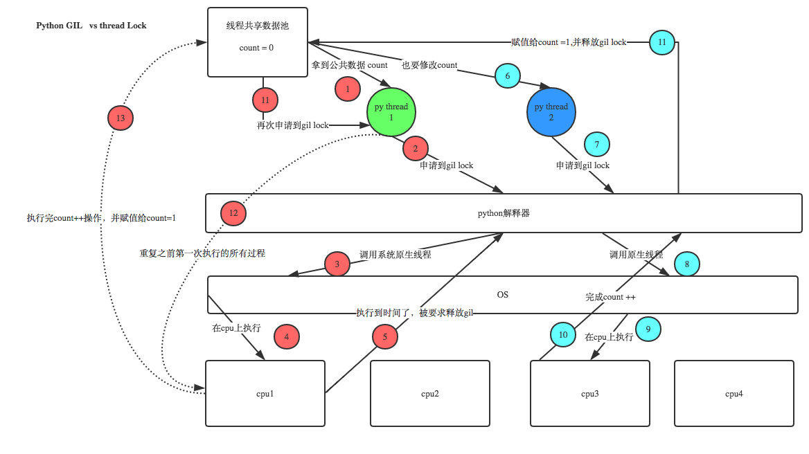
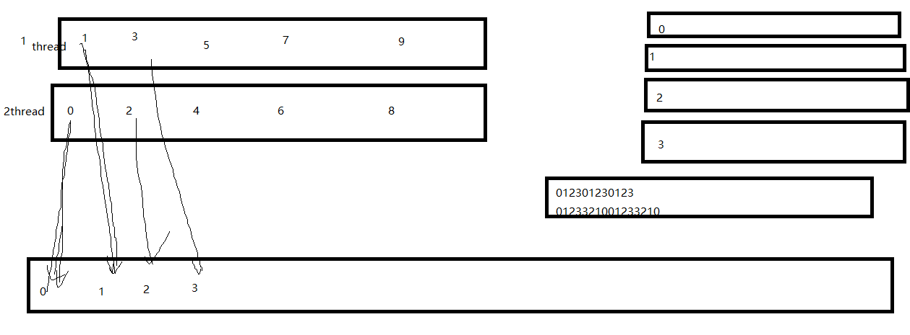
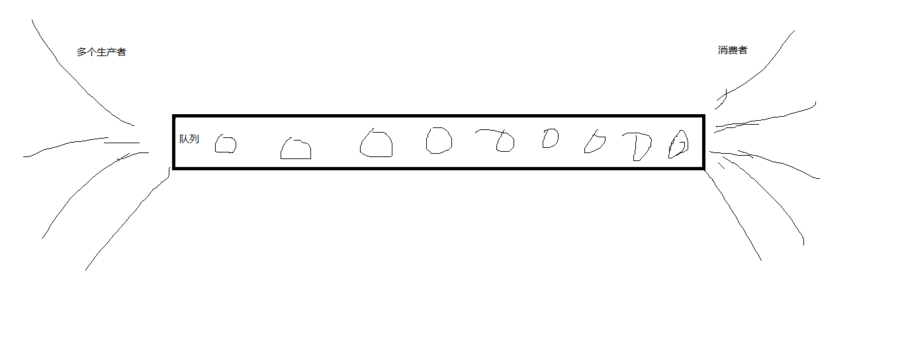

# python threads

- [python threads](#python-threads)
    - [Introduction](#introduction)
    - [Thread Synchronization](#thread-synchronization)
        - [threading.Lock()](#threadinglock)
        - [threading.RLock()](#threadingrlock)
    - [semaphore(信号量)](#semaphore%E4%BF%A1%E5%8F%B7%E9%87%8F)
    - [凑几个然后执行](#%E5%87%91%E5%87%A0%E4%B8%AA%E7%84%B6%E5%90%8E%E6%89%A7%E8%A1%8C)
    - [线程通信 Event](#%E7%BA%BF%E7%A8%8B%E9%80%9A%E4%BF%A1-event)
    - [Condition](#condition)
        - [线程调度](#%E7%BA%BF%E7%A8%8B%E8%B0%83%E5%BA%A6)
    - [Queue](#queue)
    - [Productor & Customer](#productor--customer)
    - [Thread Pool](#thread-pool)
    - [定时线程](#%E5%AE%9A%E6%97%B6%E7%BA%BF%E7%A8%8B)
    - [`with`](#with)
    - [前台进程&后台进程](#%E5%89%8D%E5%8F%B0%E8%BF%9B%E7%A8%8B%E5%90%8E%E5%8F%B0%E8%BF%9B%E7%A8%8B)

## Introduction

多线程模块: (threading常用)
- python2: thread, threading
- python3: _thread, threading

_thread 提供了低级的、原始的线程以及一个简单的锁。threading是对低级_thread的封装，还有提供其他的[methods](https://docs.python.org/3/library/threading.html)

使用threading的两种方式:
- 函数调用：用于较为简单的多线程
- 继承调用：用于较为复杂的多线程

Example1: single-thread vs multi-threads

```python
# single thread
from win32api import MessageBox
import win32con

# 0代表系统，1代表窗口的style（0,1,2,3,4,5,6)
MessageBox(0, "this is content", "this is caption", win32con.MB_OKCANCEL)
MessageBox(0, 'this is content', "this is caption", 0)
MessageBox(0, 'this is content', "this is caption", 3)
MessageBox(0, 'this is content', "this is caption", 6)
```

```python
# multi threads without args, 函数调用
import threading
from win32api import MessageBox

def show():
    MessageBox(0, 'This is content', 'this caption', 1)


for i in range(5):
    t1=threading.Thread(target=show)
    t1.start()

# threading模块，主线程会等待所有子线程结束之后再结束, 也就是t1.daemon==False
# _thread模块，不会，所以要么用死循环while True: pass卡住，要么用MessageBox卡住
# 如果t1.setDaemon(True)效果和_thread一样
```

```python
# multi threads with args，函数调用
import threading
from win32api import MessageBox


for i in range(5):
    t1=threading.Thread(target=MessageBox, args=(0, "this is content", f"caption{i+1}", 1))
    t1.start()
```

```python
import threading
from win32api import MessageBox


for i in range(5):
    t1=threading.Thread(target=MessageBox, args=(0, "this is content", f"caption{i+1}", 1))
    t1.start()

print(threading.current_thread().name) # MainThread
print(threading.active_count()) # 6
```

Example2: 继承调用

```python
# method1
import threading
from win32api import MessageBox


class MyThread(threading.Thread):
    def __init__(self, caption):
        # threading.Thread.__init__(self)
        # super(Mythread, self).__init__()
        super().__init__()
        self.caption = caption

    def run(self): # run只有self这一个参数
        MessageBox(0, "this is content", self.caption, 1)


for i in range(3):
    MyThread(f'caption-{i+1}').start()
```

```python
# method2: 利用self._args或者self._kwargs
import threading
from win32api import MessageBox


class MyThread(threading.Thread):
    def run(self):
        MessageBox(0, "this is content", self._kwargs['caption'], 1)


for i in range(3):
    MyThread(kwargs={'caption':f'caption-{i+1}'}).start()
```

```python
# 为了方便后期处理，一般这么写
import threading
from win32api import MessageBox


class MyThread(threading.Thread):
    def run(self):
        MessageBox(0, "this is content", self._kwargs['caption'], 1)


thread_list=[MyThread(kwargs={'caption':f'caption-{i+1}'}) for i in range(3)]
for t in thread_list:
    t.start()
```

```python
# method3: 不常用的方法
import threading
from win32api import MessageBox

class MyThread(threading.Thread):
    def __init__(self, func, caption):
        super().__init__(group=None, target=func, args=(0, 'this is content', caption, 1))

for i in range(3):
    MyThread(MessageBox, f'caption-{i+1}').start()
```

Example3: other applications

```python
#骚扰局域网
import socket
import threading

mystr = "1_lbt4_10#32899#002481627512#0#0#0:1289671407:Grey:HostName:288:你好，骚年!"


def go(i):
    udp = socket.socket(socket.AF_INET, socket.SOCK_DGRAM)
    udp.connect((f"192.168.128.{255-i}", 2425))
    udp.send(mystr.encode("gbk"))
    print(f"192.168.128.{255-i}", end=' ')


for i in range(255):
    threading.Thread(go, args=(i, ))
```

```python
#假装多个用户发
import socket
import _thread


def go(i):
    mystr = f"1_lbt4_10#32899#002481627512#0#0#0:1289671407:User-{i}:HostName:288:你好，骚年!"
    udp = socket.socket(socket.AF_INET, socket.SOCK_DGRAM)
    udp.connect(("192.168.128.1", 2425))
    udp.send(mystr.encode("gbk"))


for i in range(6):  # 6个线程，相当于6个用户同时发给feiQ;1000个用户，可以撑死feiQ
    _thread.start_new_thread(go, (i,))

while True:
    pass
```

```python
# threading.Timer()
import threading

def test(name):
    print('--->', name)

t1=threading.Timer(interval=2, function=test, args=('t1', ))
t2=threading.Timer(interval=2, function=test, args=('t2', ))
t1.start()
t2.start()
t1.cancel() # t1线程，2s内如果用cancel()取消，那么t1将不执行
```

```bash
# output
---> t2
```

Example4: `join([timeout=None])`

timeout参数，超时就不等了

```python
import threading
from win32api import MessageBox


class MyThread(threading.Thread):
    def run(self):
        MessageBox(0, "this is content", self._kwargs['caption'], 1)


thread_list=[MyThread(kwargs={'caption':f'caption-{i+1}'}) for i in range(3)]
for t in thread_list:
    t.start()
    t.join() # 没有并发，主线程等待每一个线程结束
```

```python
import threading
from win32api import MessageBox


class MyThread(threading.Thread):
    def run(self):
        MessageBox(0, "this is content", self._kwargs['caption'], 1)


thread_list=[MyThread(kwargs={'caption':f'caption-{i+1}'}) for i in range(3)]
for t in thread_list:
    t.start()

for t in thread_list:
    t.join() # 本质上主线程卡着，等待thread_list[0]结束，然后主线程卡着，等待thread_list[1]结束...;用于汇总所有线程的数据；相当于单线程
```

```python
import threading
import time

def go(name, seconds):
    print(f'{name} will wait {seconds}s')
    time.sleep(seconds)
    print(f'{name} finished!')


thread_list=[threading.Thread(target=go, args=(f'p{i+1}', i+1)) for i in range(4)]
for t in thread_list:
    t.start()
print('summarize...')
for i, t in enumerate(thread_list):
    print(f'===>{i+1}')
    t.join(timeout=0.5)
print('do something')
```

```bash
# output
p1 will wait 1s
p2 will wait 2s
p3 will wait 3s
p4 will wait 4s
summarize...
===>1
===>2
p1 finished!
===>3
===>4
p2 finished!
do something
p3 finished!
p4 finished!
```

## Thread Synchronization

- 多个线程共同对某个数据修改，为了保证数据正确，需要**线程同步**(同：协同)。
- 让多个线程有序地完成一些事情，也需要线程同步

线程同步的方法：
- 互斥锁: Lock, RLock
- 信号量: Semaphore
- 条件变量: Condition

同步的方法：使用`threading.Lock()`，`threading.RLock()`对象，将要冲突的部分放在`acquire()`和`release()`之间

```python
import threading

num = 0

def modify_num():
    global num
    for i in range(1000000):
        num += 1
    print(num)

threading.Thread(target=modify_num).start()
threading.Thread(target=modify_num).start()
````

```bash
#output, 发生冲突，也可以用这种方式创建随机数
1122886
1293707
```

> Problem: 既然已经有GIL，同一时刻只有一个线程在运行，为何还会出现线程冲突  
>   
> GIL保证同一时刻只有一个线程在运行；互斥锁保证只有获取mutex的线程能够修改数据。

### threading.Lock()

```python
#加锁，共享资源一次只能有一个线程对它操作
import threading

num = 0
mutex = threading.Lock()

class MyThread(threading.Thread):
    def run(self):
        global num
        mutex.acquire()  # 表示独占，没有acquire的thread，都等着
        for _ in range(1000000):
            num += 1
        mutex.release()
        print(num)

thread_list = [MyThread() for _ in range(5)]
for t in thread_list:
    t.start()
```

```bash
#output
1000000
2000000
3000000
4000000
5000000
```

```python
#死锁
import threading
import time

boy_mutex = threading.Lock()
girl_mutex = threading.Lock()


class BoyThread(threading.Thread):
    def run(self):
        if boy_mutex.acquire():
            print("boy say sorry-1", self.name)
            time.sleep(1)  # 为了给时间让下面的girl_mutex acquire的锁，那么，这个线程就会一直卡在if语句那儿
            if girl_mutex.acquire():
                print("boy say sorry-2")
                girl_mutex.release()
            boy_mutex.release()


class GirlThread(threading.Thread):
    def run(self):
        if girl_mutex.acquire():
            print("girl say sorry-1", self.name)
            if boy_mutex.acquire():
                print("girl say sorry-2")
                boy_mutex.release()
            girl_mutex.release()


boy_thread = BoyThread()
girl_thread = GirlThread()

boy_thread.start()
girl_thread.start()
```

```bash
#output
boy say sorry-1 Thread-1
girl say sorry-1 Thread-2
```

```python
#解开死锁
import threading
import time

boy_mutex = threading.Lock()
girl_mutex = threading.Lock()


class BoyThread(threading.Thread):
    def run(self):
        if boy_mutex.acquire():
            print("boy say sorry-1", self.name)
            boy_mutex.release()
            time.sleep(1)
            if girl_mutex.acquire():
                print("boy say sorry-2")
                girl_mutex.release()


class GirlThread(threading.Thread):
    def run(self):
        if girl_mutex.acquire():
            print("girl say sorry-1", self.name)
            girl_mutex.release()
            if boy_mutex.acquire():
                print("girl say sorry-2")
                boy_mutex.release()


boy_thread = BoyThread()
girl_thread = GirlThread()

boy_thread.start()
girl_thread.start()

boy_thread.join()
girl_thread.join()
```

```bash
#output
boy say sorry-1 Thread-1
girl say sorry-1 Thread-2
girl say sorry-2
boy say sorry-2
```

### threading.RLock()

递归锁: recursive lock
> RLock内部维护着一个Lock和一个counter变量，counter记录了acquire的次数，从而使得资源可以被多次acquire。直到一个线程所有的acquire都被release，其他的线程才能获得资源。

```python
import threading

num = 0
mutex = threading.Lock()


class MyThread(threading.Thread):
    def run(self):
        global num
        if mutex.acquire():  # 1表示独占，没有acquire的thread，都等着
            for i in range(1000000):
                num += 1
                print(num, self.name)
                # 反复加锁，出现的死锁
                if mutex.acquire():
                    num += 1000
                    mutex.release()
            mutex.release()
        print(num)


thread_list = []
for i in range(5):
    thread_list.append(MyThread())
    thread_list[i].start()

for i in range(5):
    thread_list[i].join()
```

```bash
#output
1 Thread-1
```

```python
import threading

num = 0
mutex = threading.RLock()


class MyThread(threading.Thread):
    def run(self):
        global num
        if mutex.acquire():  # 1表示独占，没有acquire的thread，都等着
            num += 1
            print(num, self.name)
            # 反复加锁，用Rlock来克服
            if mutex.acquire():
                num += 1000
                mutex.release()
            mutex.release()
        print(num, self.name)


thread_list = []
for i in range(5):
    thread_list.append(MyThread())
    thread_list[i].start()

for i in range(5):
    thread_list[i].join()
```

```bash
#outpout
1 Thread-1
1001 Thread-1
1002 Thread-2
2002 Thread-2
2003 Thread-3
3003 Thread-3
3004 Thread-4
4004 Thread-4
4005 Thread-5
5005 Thread-5
```

```python
import threading
import time


def run1():
    print("grab the first part data")
    lock.acquire()
    global num
    num += 1
    lock.release()
    return num


def run2():
    print("grab the second part data")
    lock.acquire()
    global num2
    num2 += 1
    lock.release()
    return num2


def run3():
    lock.acquire()
    res = run1()
    print('--------between run1 and run2-----')
    res2 = run2()
    lock.release()
    print(res, res2)


if __name__ == '__main__':

    num, num2 = 0, 0
    lock = threading.RLock()
    for i in range(10):
        t = threading.Thread(target=run3)
        t.start()

while threading.active_count() != 1:
    print(threading.active_count())
else:
    print('----all threads done---')
    print(num, num2)
```

## semaphore(信号量)

semaphore通过一个计数器限制可以同时运行的线程数量。计数器表示的是还可以运行的数量，acquire()减小计数，release()增加计数。
> 互斥锁只是信号量的特殊情况   
> 因为CPython存在GIL(同一时刻只有一个线程运行)，所以CPython的semaphore并不是表示允许N个线程并行运行，表示运行N个线程并发运行。

一个服务器假设只能处理1000个线程(假设一个线程服务一个人)，那么超过1000的人就要排队；

比如，每个page有100个url; 那么第二层就是10000个url了；每个url创建一个thread去玩，就不现实了(内存有限)；要限定线程的数量，也就是**信号量**

```python
import threading
import time

sem = threading.Semaphore(2)


def task():
    sem.acquire()
    for i in range(10):
        print(threading.current_thread().name, i)
        time.sleep(1)
    sem.release()


if __name__ == "__main__":
    for i in range(4):
        threading.Thread(target=task).start()
```

```python
import threading
import time

sem=threading.Semaphore(2)

def show():
    with sem:
        for i in range(10):
            print(threading.current_thread().name,i)
            time.sleep(1)

for i in range(4):
    threading.Thread(target=show).start()
```

```python
使用with后不管with中的代码出现什么错误，都会进行对当前对象进行清理工作。

例如file的file.close()方法，无论with中出现任何错误，都会执行file.close()方法

其次with只有特定场合下才能使用。，这个特定场合只的是那些支持了上下文管理器的对象。

file
decimal.Context
thread.LockType
threading.Lock
threading.RLock
threading.Condition
threading.Semaphore
threading.BoundedSemaphore
```

## 凑几个然后执行

比如服务器资源有限，凑够100个再执行；比如来了10000个，要100个、100个的执行；

```python
import threading
import time

barrier=threading.Barrier(2)#凑一对才能执行

def show():
    print(threading.current_thread().name,"start")
    time.sleep(2)
    barrier.wait()
    print(threading.current_thread().name,"end")

for i in range(3):
    threading.Thread(target=show).start()

while True:
    pass
```

```bash
#output, 只能是2的倍数，最后一个没有凑够
Thread-1 start
Thread-2 start
Thread-3 start
Thread-2 end
Thread-1 end
```

## 线程通信 Event

`threading.Event`通过内部的标记来进程同步，wait()会阻塞进程，直到标记变成True
- set()将标记变成True
- clear()将标记变成False

线程同步：资源只能在一个时候由一个线程访问；

线程通信：一个线程把事情办完了，通知其他线程（这个时候，线程是有序的，一个完成`e.set()`通知其他的）；(其他线程随机的抢，然后又只有一个抢到；)

线程同步的时候，无法确定是谁抢到资源；但是线程通信却可以；

```python
import threading
import time

def goEvent():
    e=threading.Event()
    def go():
        e.wait()
        e.clear()
        print("go go go")
    threading.Thread(target=go).start()
    return e

e=goEvent()#内部开启了一个线程，并返回了一个e
time.sleep(3)
e.set()#e.wait()卡住的地方开始执行
```

```python
# 反复通信的例子
# 应用：一个线程读文件；另一个线程负责分析文件；
# 分析完毕，调用e.set()，让读文件继续进行；

import threading
import time

def goEvent():
    e=threading.Event()
    def go():
        for i in range(5):
            e.wait()
            e.clear() #必须有，用来重置，否则，下面一次性执行完，不会停顿两次
            print(f"{i} go go go")
    threading.Thread(target=go).start()
    return e

e=goEvent()
time.sleep(3)
e.set()
time.sleep(2)
e.set()
```

```bash
#ouput
0 go go go
1 go go go
```

```python
# 实际编程会为每一个线程准备一个Event(), 为了避免没有及时clear()造成意外
import threading
import time

class MyThread(threading.Thread):
    def run(self):
        print(self.name, 'waits')
        self._args[0].wait()
        print(self.name, 'ends')

e = threading.Event()
for i in range(4):
    t = MyThread(args=(e, )) # 所有的线程同一个event
    t.start()
time.sleep(1)
e.set()
```

```bash
# output
Thread-1 waits
Thread-2 waits
Thread-3 waits
Thread-4 waits
Thread-2 ends
Thread-1 ends
Thread-4 ends
Thread-3 ends
```

example: traffic light vs cars

```python
import threading
import time
import random


def light():
    if not event.is_set():
        event.set() # 绿灯

    count = 0
    while True:
        if count < 10:
            print('\033[42;1m--green light on---\033[0m')
        elif count < 13:
            print('\033[43;1m--yellow light on---\033[0m')
        elif count < 20:
            event.clear()
            print('\033[41;1m--red light on---\033[0m')
        else:
            count = 0
            event.set()  # 打开绿灯
        time.sleep(1)
        count += 1


def car(n):
    while True:
        time.sleep(random.randrange(10))
        if event.is_set():  # 绿灯
            print(f"car{n}  is running..")
        else:
            print(f"car{n} sees the red light..")
            event.wait()
            print(f'\033[34;1m green light is on, car{n} start going...\033[0m')


if __name__ == '__main__':
    event = threading.Event()
    Light = threading.Thread(target=light)
    Light.start()
    for i in range(3):
        t = threading.Thread(target=car, args=(i,))
        t.start()
```

example: 自动门

```python
import threading
import time
import random


def door():
    while True:
        if door_swiping_event.is_set(): 
            time.sleep(1.5) # 门被打开，保持1.5s
            print("\033[31;1mdoor closed...., swipe to open.\033[0m")
            door_swiping_event.clear()
        else:
            door_swiping_event.wait() # 门关着，刷卡可以打开
            print("\033[32;1mdoor opening....\033[0m")


def staff(n):
    time.sleep(random.randrange(5))
    print(f"staff{n} is comming...")

    while not door_swiping_event.is_set(): # 门关着
        print(f"staff{n} sees door got closed, swipping the card.....")
        door_swiping_event.set()
        time.sleep(0.5)
    else:
        print(f"\033[34;1mstaff{n} passing.....\033[0m")
        

if __name__ == "__main__":
    door_swiping_event = threading.Event()  # 设置事件

    # 自动门
    door_thread = threading.Thread(target=door)
    door_thread.start()

    # 员工
    for i in range(10):
        p = threading.Thread(target=staff, args=(i,))
        p.start()
```

## Condition

这个是最常用的，既解决通信，也解决同步; 除了提供与Lock类似的acquire和release方法外，还提供了wait和notify方法。可以看作是Lock/RLock与Event的合体。

wait(), notify()分别类似yield和send()

线程先acquire一个条件变量，然后判断条件，根据条件要么wait(), 要么notify()其他线程，其他处于wait状态的线程接到通知后会重新判断条件

可以认为Condition对象维护了一个锁（Lock/RLock)和一个waiting池。线程通过acquire获得Condition对象，当调用wait方法时，线程会释放Condition内部的锁并进入blocked状态，同时在waiting池中记录这个线程。当调用notify方法时，Condition对象会从waiting池中挑选一个线程，通知其调用acquire方法尝试取到锁。

> 只有acquire锁的线程才能调用wait(), notify()，所以必须在锁release()之前调用wait(), notify()

Condition对象的构造函数可以接受一个Lock/RLock对象作为参数，如果没有指定，则Condition对象会在内部自行创建一个RLock。

除了notify方法外，Condition对象还提供了notifyAll方法，可以通知waiting池中的所有线程尝试acquire内部锁。notifyAll的作用在于防止有线程永远处于沉默状态。

```python
#go1干到i=2;等待go2()把活干完，再通知go1
import threading
import time

def go1():
    with condition:
        for i in range(5):
            time.sleep(1)
            print(threading.current_thread().name,i)
            if i==2:
                condition.wait() #等待notify(),go2()执行完之后，才来执行这个

def go2():
    with condition:
        for i in range(5):
            time.sleep(1)
            print(threading.current_thread().name,i)
        condition.notify()

condition=threading.Condition() #线程条件变量

threading.Thread(target=go1).start()
threading.Thread(target=go2).start()

while True:
    pass
```

```bash
#output
Thread-1 0
Thread-1 1
Thread-1 2
Thread-2 0
Thread-2 1
Thread-2 2
Thread-2 3
Thread-2 4
Thread-1 3
Thread-1 4
```

```python
import threading
import time

def go1():
    with condition:
        for i in range(5):
            time.sleep(1)
            print(threading.current_thread().name,i)
            if i==2:
                condition.wait() #等待notify(),go2()执行完之后，才来执行这个

def go2():
    with condition:
        for i in range(5):
            time.sleep(1)
            print(threading.current_thread().name,i)
        condition.notify()

condition=threading.Condition() #线程条件变量

threading.Thread(target=go2).start()
threading.Thread(target=go1).start()

while True:
    pass
```

```bash
#output
Thread-1 0
Thread-1 1
Thread-1 2
Thread-1 3
Thread-1 4
Thread-2 0
Thread-2 1
Thread-2 2
```

当有一个thread获取condition的时候，就锁定；其他的都在等待；

当获得condition的thread碰到`condition.wait()`;这个线程卡住；

让其他的线程争抢，获得condition；假设另一个线程其中`condition.notify()`或者`condition.notifyall()`了，`condition.wait()`继续执行；

```python
import threading
import time

def go1():
    with condition:
        for i in range(5):
            time.sleep(1)
            print(threading.current_thread().name,i)
            if i==2:
                condition.wait() #等待notify(),go2()执行完之后，才来执行这个

def go2():
    with condition:
        for i in range(5):
            time.sleep(1)
            print(threading.current_thread().name,i)
        condition.notify_all()

def go3():
    with condition:
        for i in range(5):
            time.sleep(1)
            print(threading.current_thread().name,i)
            if i==1:
                condition.wait()

condition=threading.Condition() #线程条件变量

threading.Thread(target=go1).start()
threading.Thread(target=go3).start()
threading.Thread(target=go2).start()

while True:
    pass
```

```python
Thread-1 0
Thread-1 1
Thread-1 2
Thread-2 0
Thread-2 1
Thread-3 0
Thread-3 1
Thread-3 2
Thread-3 3
Thread-3 4
Thread-2 2
Thread-2 3
Thread-2 4
Thread-1 3
Thread-1 4
```

```python
# example: condition with Producer & Consumer
# 如果总数<1000,那么每个生产者每次生产100个；如果总数>100， 每个消费者每次消费3个
import threading
import time


class Producer(threading.Thread):
    def run(self):
        global count
        while True:
            with con:
                if count > 1000:
                    con.wait()
                else:
                    count = count+100
                    print(self.name, 'produce 100, count=', count)
                    con.notify()
            time.sleep(1)


class Consumer(threading.Thread):
    def run(self):
        global count
        while True:
            with con:
                if count < 100:
                    con.wait()
                else:
                    count = count-3
                    print(self.name, 'consume 3, count=', count)
                    con.notify()
            time.sleep(1)


count = 500
con = threading.Condition()
for i in range(5):
    c = Consumer()
    c.start()
for i in range(2):
    p = Producer()
    p.start()
```

```bash
# output
Thread-1 consume 3, count= 497
Thread-2 consume 3, count= 494
Thread-3 consume 3, count= 491
Thread-4 consume 3, count= 488
Thread-5 consume 3, count= 485
Thread-6 produce 100, count= 585
Thread-7 produce 100, count= 685
Thread-1 consume 3, count= 682
Thread-4 consume 3, count= 679
Thread-3 consume 3, count= 676
Thread-2 consume 3, count= 673
Thread-7 produce 100, count= 773
Thread-6 produce 100, count= 873
Thread-5 consume 3, count= 870
....
```

### 线程调度



多个线程交替进行；第二个图是google面试；

```python
import threading

def write_even(num_list):
    with condition:
        for i in range(0,10,2):
            num_list.append(i)
            condition.wait()
            condition.notify()

def write_odd(num_list):
    with condition:
        for i in range(1,10,2):
            num_list.append(i)
            condition.notify()
            condition.wait()

list1=[]
condition=threading.Condition()

thread_list=[]
#顺序对调会卡死
thread_list.append(threading.Thread(target=write_even, args=(list1,)))
thread_list.append(threading.Thread(target=write_odd, args=(list1,)))

for item in thread_list:
    item.start()

for i in range(2):
    thread_list[i].join()
print(list1)
```

```bash
#output
[0, 1, 2, 3, 4, 5, 6, 7, 8, 9]
```

两个线程之间跳转，只需1种condition;三个线程之间跳转需要2种condition

- notify()的时候只是作准备，不会失去condition的lock；
- 而到了其中一个wait()的时候，失去对codition的lock，给其他的来争抢；
- 线程执行完毕，也会失去condition的lock；

[good example](http://blog.csdn.net/hephec/article/details/37958795)


```python
#调度三个
import threading

def write_a(num_list):
    with condition_a:
        for i in range(5):
            num_list.append('A')
            condition_a.wait()
            condition_a.notify()


def write_b(num_list):
    with condition_a:
        with condition_b:
            for i in range(5):
                num_list.append('B')
                condition_b.wait()
                condition_b.notify()
                condition_a.notify()
                condition_a.wait()


def write_c(num_list):
    with condition_b:
        for i in range(5):
            num_list.append('C')
            condition_b.notify()
            condition_b.wait()


list1=[]
#因为3个线程之间跳转需要2个condition
condition_a=threading.Condition()
condition_b=threading.Condition()

thread_list=[]
thread_list.append(threading.Thread(target=write_a, args=(list1,)))
thread_list.append(threading.Thread(target=write_b, args=(list1,)))
thread_list.append(threading.Thread(target=write_c, args=(list1,)))

for item in thread_list:
    item.start()

for i in range(3):
    thread_list[i].join()
print(list1)
```

```bash
#output
['A', 'B', 'C', 'A', 'B', 'C', 'A', 'B', 'C', 'A', 'B', 'C', 'A', 'B', 'C']
```

```python
#4线程调度
import threading

def write_a(num_list):
    with condition_a:
        for i in range(5):
            num_list.append('A')
            condition_a.wait()
            condition_a.notify()


def write_b(num_list):
    with condition_a:
        with condition_b:
            for i in range(5):
                num_list.append('B')
                condition_b.wait()
                condition_b.notify()
                condition_a.notify()
                condition_a.wait()


def write_c(num_list):
    with condition_b:
        with condition_c:
            for i in range(5):
                num_list.append('C')
                condition_c.wait()
                condition_c.notify()            
                condition_b.notify()
                condition_b.wait()

def write_d(num_list):
    with condition_c:
        for i in range(5):
            num_list.append('D')
            condition_c.notify()
            condition_c.wait()

list1=[]
#因为4个线程之间跳转需要3个condition
condition_a=threading.Condition()
condition_b=threading.Condition()
condition_c=threading.Condition()

thread_list=[]
thread_list.append(threading.Thread(target=write_a, args=(list1,)))
thread_list.append(threading.Thread(target=write_b, args=(list1,)))
thread_list.append(threading.Thread(target=write_c, args=(list1,)))
thread_list.append(threading.Thread(target=write_d, args=(list1,)))

for item in thread_list:
    item.start()

for i in range(4):
    thread_list[i].join()

for i in range(len(list1)):
    print(list1[i],end='')
    if i%4==3:
        print(end=' , ')
```

```bash
#output
ABCD , ABCD , ABCD , ABCD , ABCD , 
```

```python
import threading

def write_a(num_list):
    with condition_a:
        for i in range(5):
            num_list.append('A')
            condition_a.wait()
            condition_a.notify()
            num_list.append('A')


def write_b(num_list):
    with condition_a:
        with condition_b:
            for i in range(5):
                num_list.append('B')
                condition_b.wait()
                condition_b.notify()
                num_list.append('B')
                condition_a.notify()
                condition_a.wait()


def write_c(num_list):
    with condition_b:
        with condition_c:
            for i in range(5):
                num_list.append('C')
                condition_c.wait()
                condition_c.notify()
                num_list.append('C')           
                condition_b.notify()
                condition_b.wait()

def write_d(num_list):
    with condition_c:
        for i in range(5):
            num_list.append('D')
            condition_c.notify()
            num_list.append('D')
            condition_c.wait()

list1=[]
#因为4个线程之间跳转需要3个condition
condition_a=threading.Condition()
condition_b=threading.Condition()
condition_c=threading.Condition()

thread_list=[]
thread_list.append(threading.Thread(target=write_a, args=(list1,)))
thread_list.append(threading.Thread(target=write_b, args=(list1,)))
thread_list.append(threading.Thread(target=write_c, args=(list1,)))
thread_list.append(threading.Thread(target=write_d, args=(list1,)))

for item in thread_list:
    item.start()

for i in range(4):
    thread_list[i].join()
for i in range(len(list1)):
    print(list1[i],end='')
    if i%4==3:
        print(end=' , ')
```

```bash
#output
ABCD , DCBA , ABCD , DCBA , ABCD , DCBA , ABCD , DCBA , ABCD , DCBA , 
```

## Queue

队列的作用：解耦、提高效率

队列与列表的区别：列表一般读取数据后，列表本身不变；队列读取一个数据之后，队列就少了一个数据
> 列表也可以通过`pop()`来实现队列的功能

python的queue模块提供了`Queue`(first in first out), `LifoQueue`(last in first out), `PriorityQueue`都是线程安全的，可用于多线程。

example1: priority Queue

```python
import queue

pq=queue.PriorityQueue()

pq.put((3, 'james'))
pq.put((1, 'grey'))
pq.put((10, 'moris'))

print(pq.get()) # (1, 'grey')
print(pq.get()) # (3, 'james')
print(pq.get()) # (10, 'moris')
```

Queue常用的方法：
- `put()`: 如果`q.full()==True`,   `put()`就会卡住, 如果强行用`put_nowait()`就会报错`queue.Full`
- `get()`：如果`q.empty()==True`, `get()`就会卡住, 如果强行行`get_nowait()`就会报错`queue.Empty`
> `q.put_nowait()`等价于`q.put(block=False)`; `q.get_nowait()`等价于`q.get(block=False)`
## Productor & Customer



生产者把东西生产出来，放到队列尾部；在队列头部，消费者争抢东西，出现线程冲突；python用**同步机制**自己实现一个队列，生产者只要往队列里面塞，就行了，队列自己保证线程同步(不冲突)，这种设计模式：生产者-消费者模式

多个生产者生产，多个消费者拿东西；队列满了就不生产；队列空了，就不拿

```python
#1个队列，两个方法
import threading
import queue
import time
import random


class Producer(threading.Thread):
    def __init__(self, index, queue1):
        super().__init__()
        self.index = index
        self.queue1 = queue1

    def run(self):
        while True:
            time.sleep(2)  # 2s生产一个
            num = random.randint(1, 100000)  # 生产出来的随机编号
            self.queue1.put(f"Producer {self.index}'s {num}")
            print(f"Producer {self.index} product {num}")


class Consumer(threading.Thread):
    def __init__(self, index, queue1):
        super().__init__()
        self.index = index
        self.queue1 = queue1

    def run(self):
        while True:
            time.sleep(1)
            item = self.queue1.get()
            if item is None:  # 空队列，is 是判断id的
                break
            print(f"Consumer {self.index} get:{item}")


queue1 = queue.Queue(10)  # 10代表容量，如果是0代表无限

for i in range(3):
    Producer(i, queue1).start()

for i in range(5):
    Consumer(i, queue1).start()
```

```bash
#ouput
Producer 1 product 92282
Consumer 0 get:Producer 1's 92282
Producer 0 product 56927
Consumer 1 get:Producer 0's 56927
Producer 2 product 50644
Consumer 4 get:Producer 2's 50644
Producer 0 product 41137
Consumer 3 get:Producer 0's 41137
Producer 1 product 82870
Consumer 2 get:Producer 1's 82870
Producer 2 product 44497
Consumer 4 get:Producer 2's 44497
Producer 1 product 68818
Consumer 0 get:Producer 1's 68818
Producer 0 product 50563
Consumer 1 get:Producer 0's 50563
Producer 2 product 78167
Consumer 3 get:Producer 2's 78167
......
```

```python
# mainthread as producer
import queue
import threading
import time


class myThread (threading.Thread):
    def run(self):
        print(self.name, 'begins')
        self.process_data(self._args[0])
        print(self.name, 'ends')

    def process_data(self, q):
        while not exitFlag:
            with mutex:
                if not q.empty():
                    print(self.name, 'processing', q.get())


exitFlag = 0
q = queue.Queue(10)
mutex = threading.Lock()
nameList = ["One", "Two", "Three", "Four", "Five"]

threads = [myThread(args=(q, )) for _ in range(3)]
for t in threads:
    t.start()

time.sleep(1)  # 因为q.empty()==True, 所以最先抢到mutex的是主线程
with mutex:
    for word in nameList:
        q.put(word)  # 主线程充当一次性生产者

# 等待队列清空
while not q.empty():
    pass
# 通知线程是时候退出
exitFlag = 1

# 等待所有线程完成
for t in threads:
    t.join()
print("main thread ends")
```

```bash
# output
Thread-1 begins
Thread-2 begins
Thread-3 begins
Thread-2 processing One
Thread-2 processing Two
Thread-2 processing Three
Thread-2 processing Four
Thread-2 processing Five
Thread-2 ends
Thread-3 ends
Thread-1 ends
main thread ends
```

应用：创建多个线程抓邮箱，将邮箱用标签标记，然后生产者端，用多个线程根据标签写入文件；不用考虑线程冲突，十分方便；

example3: normal producer&consumer

```python
import queue
import threading
import time

q = queue.Queue(3)

def Producer(name):
    count = 1
    while True:
        for i in range(5):
            q.put(f"{name}'s Bread{i}")
            print(f'Batch{count}: {name} product Bread{i}')
        count += 1

def Consumer(name):
    while True:
        time.sleep(1)
        print(f'{name} get {q.get()}')

threading.Thread(target=Producer, args=('Grey', )).start()
threading.Thread(target=Consumer, args=('James', )).start()
```

```bash
Batch1: Grey product Bread0
Batch1: Grey product Bread1
Batch1: Grey product Bread2 # q is full
James get Grey's Bread0
Batch1: Grey product Bread3
James get Grey's Bread1
Batch1: Grey product Bread4
James get Grey's Bread2
Batch2: Grey product Bread0
James get Grey's Bread3
Batch2: Grey product Bread1
James get Grey's Bread4
Batch2: Grey product Bread2
James get Grey's Bread0
Batch2: Grey product Bread3
James get Grey's Bread1
Batch2: Grey product Bread4
James get Grey's Bread2
```

example4: `q.task_done()` and `q.join()`

```python
import queue
import threading
import time

q = queue.Queue(3)

def Producer(name):
    count = 1
    while True:
        for i in range(5):
            q.put(f"{name}'s Bread{i}")
            print(f'Batch{count}: {name} product Bread{i}')
        q.join() # put完毕之后调用join(), 等待所有的put都被掏空
        count += 1

def Consumer(name):
    while True:
        time.sleep(1)
        print(f'{name} get {q.get()}')
        q.task_done() # get一个就调用一次task_done()

threading.Thread(target=Producer, args=('Grey', )).start()
threading.Thread(target=Consumer, args=('James', )).start()
```

```bash
Batch1: Grey product Bread0
Batch1: Grey product Bread1
Batch1: Grey product Bread2 # q is full
James get Grey's Bread0
Batch1: Grey product Bread3
James get Grey's Bread1
Batch1: Grey product Bread4 # producer join, wait all data be done
James get Grey's Bread2
James get Grey's Bread3
James get Grey's Bread4
Batch2: Grey product Bread0
Batch2: Grey product Bread1
Batch2: Grey product Bread2
James get Grey's Bread0
Batch2: Grey product Bread3
James get Grey's Bread1
Batch2: Grey product Bread4
James get Grey's Bread2
James get Grey's Bread3
James get Grey's Bread4
```

example5: `q.task_done()` and `q.join()` in multi-threadings

```python
# 修改example3为多线程
for i in range(2):
    threading.Thread(target=Producer, args=(f'Pro{i}',)).start()
for j in range(5):
    threading.Thread(target=Consumer, args=(f'Con{j}',)).start()
```

```bash
Batch1: Pro0 product Bread0
Batch1: Pro0 product Bread1
Batch1: Pro0 product Bread2
Con1 get Pro0's Bread0
Con0 get Pro0's Bread1
Batch1: Pro1 product Bread0
Batch1: Pro1 product Bread1
Con2 get Pro0's Bread2
Con3 get Pro1's Bread0
Con4 get Pro0's Bread3
Batch1: Pro1 product Bread2
Batch1: Pro1 product Bread3
Batch1: Pro0 product Bread3
Con1 get Pro1's Bread1
Con3 get Pro1's Bread2
Batch1: Pro1 product Bread4
Batch1: Pro0 product Bread4
Con2 get Pro0's Bread4
Con0 get Pro1's Bread3
Con4 get Pro1's Bread4
Batch2: Pro1 product Bread0
Batch2: Pro1 product Bread1
Batch2: Pro1 product Bread2
```

## Thread Pool

example1: python3 ThreadPoolExecutor
> 并发

```python
from concurrent.futures import ThreadPoolExecutor

def task(i):
    return i**3

if __name__ == "__main__":
    po=ThreadPoolExecutor(max_workers=2)
    result=po.map(task, range(10)) # type is generator

    for i in result:
        print(i, end=',')
```

example2: python3 ThreadPool
> 并行

```python
from multiprocessing.pool import ThreadPool

def task(i):
    return i**3

if __name__ == "__main__":
    po=ThreadPool(processes=2)
    result=po.map(task, range(10))
    print(result)
```

## 定时线程

```python
import threading
import time
import os


def go():
    os.system("calc")


timer_thread = threading.Timer(5, go)  # 第5s运行go
timer_thread.start()

i = 0
while True:
    time.sleep(1)
    print(f"{i} second ellipse")
    i += 1
```

```python
#先延时5s,然后每3s打开一个calc
#主线程作为计时器
import threading
import time
import os


def go():
    while True:
        time.sleep(3)
        os.system("calc")


timer_thread = threading.Timer(5, go)  # 第5s运行go
timer_thread.start()

i = 0
while True:
    time.sleep(1)
    print(f"{i} second ellipse")
    i += 1
```

## `with`

之前用`Lock`的可以用`with`来解决， 而不用`acquire(), release()`

with: 自动加锁，自动释放；

```python
import threading

num = 0
mutex = threading.Lock()


class MyThread(threading.Thread):
    def run(self):
        global num
        with mutex:
            for i in range(1000000):
                num += 1
            print(num)


thread_list = []
for i in range(5):
    thread_list.append(MyThread())
    thread_list[i].start()

for i in range(5):
    thread_list[i].join()
```

## 前台进程&后台进程

- 前台进程：主线程必须等我；
- 后台进程：主线程不用等我；或者叫做守护进程，主人死了，仆人殉葬。

`threading.Thread`默认是前台进程，主线程必须等待前台线程；`_thread`默认是后台进程；

```python
import threading
import win32api


class MyThread(threading.Thread):
    def run(self):
        win32api.MessageBox(0, "content", "caption", 6)


thread_list=[]
for i in range(5):
    thread_list.append(MyThread())
    # thread_list[i].setDaemon(False)#可加可不加
    thread_list[i].start()
# # pycharm中不加join()也可以让主线程等待MyThrad
# for item in thread_list:
#     item.join()
```

```python
import threading
import win32api


class MyThread(threading.Thread):
    def run(self):
        win32api.MessageBox(0, "content", "caption", 6)


thread_list=[]
for i in range(5):
    thread_list.append(MyThread())
    thread_list[i].setDaemon(True)#变成后台进程
    thread_list[i].start()
```