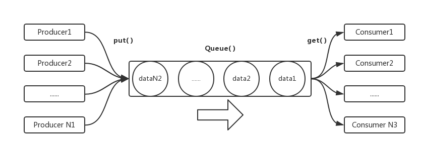

# python threads

- [python threads](#python-threads)
    - [single thread vs multithreads](#single-thread-vs-multithreads)
    - [基于class的多线程](#%E5%9F%BA%E4%BA%8Eclass%E7%9A%84%E5%A4%9A%E7%BA%BF%E7%A8%8B)
        - [`join()`](#join)
    - [线程冲突 线程同步](#%E7%BA%BF%E7%A8%8B%E5%86%B2%E7%AA%81-%E7%BA%BF%E7%A8%8B%E5%90%8C%E6%AD%A5)
        - [threading.Lock()](#threadinglock)
        - [threading.RLock()](#threadingrlock)
    - [python thread的3中风格](#python-thread%E7%9A%843%E4%B8%AD%E9%A3%8E%E6%A0%BC)
    - [信号量](#%E4%BF%A1%E5%8F%B7%E9%87%8F)
    - [凑几个然后执行](#%E5%87%91%E5%87%A0%E4%B8%AA%E7%84%B6%E5%90%8E%E6%89%A7%E8%A1%8C)
    - [线程通信](#%E7%BA%BF%E7%A8%8B%E9%80%9A%E4%BF%A1)
    - [线程condition](#%E7%BA%BF%E7%A8%8Bcondition)
        - [线程调度](#%E7%BA%BF%E7%A8%8B%E8%B0%83%E5%BA%A6)
    - [Productor & Customer](#productor-customer)
    - [Thread pool](#thread-pool)
    - [定时线程](#%E5%AE%9A%E6%97%B6%E7%BA%BF%E7%A8%8B)
    - [`with`](#with)
    - [前台进程&后台进程](#%E5%89%8D%E5%8F%B0%E8%BF%9B%E7%A8%8B%E5%90%8E%E5%8F%B0%E8%BF%9B%E7%A8%8B)
    - [TLS](#tls)
    - [Thread summary](#thread-summary)

## single thread vs multithreads

```python
#single thread
import win32api
import win32con

# 0代表系统，1代表窗口的style（0,1,2,3,4,5,6)
win32api.MessageBox(0, "this is content", "this is caption", win32con.MB_OKCANCEL)
win32api.MessageBox(0, "this is content", "this is caption", 0)
win32api.MessageBox(0, "this is content", "this is caption", 3)
win32api.MessageBox(0, "this is content", "this is caption", 6)
```

```python
#不带参数
import win32api
import win32con
import _thread


def show():
    win32api.MessageBox(0, "this is content", "this is caption", win32con.MB_OKCANCEL)


for i in range(5):
    _thread.start_new_thread(show, ())

show()  # 也是为了卡住主线程，也可以用while True来卡住
```

```python
#multithread
import win32api
import win32con
import _thread


def show(content, caption, style):
    win32api.MessageBox(0, content, caption, style)


for i in range(5):
    _thread.start_new_thread(show, ('this is content', f'this is window {i+1}', i))

show("main thread", "main", 0)
```

每一个`exe`就是一个进程**process**，每个进程里面还有线程**thread**

```python
#骚扰局域网
import socket
import _thread

mystr = "1_lbt4_10#32899#002481627512#0#0#0:1289671407:Grey:HostName:288:你好，骚年!"


def go(i):
    udp = socket.socket(socket.AF_INET, socket.SOCK_DGRAM)
    udp.connect((f"192.168.128.{255-i}", 2425))
    udp.send(mystr.encode("gbk"))
    print(f"192.168.128.{255-i}", end=' ')


for i in range(255):  # 255个线程，所以瞬间完成了
    _thread.start_new_thread(go, (i,))

while True:
    pass
```

```python
#假装多个用户发
import socket
import _thread


def go(i):
    mystr = f"1_lbt4_10#32899#002481627512#0#0#0:1289671407:User-{i}:HostName:288:你好，骚年!"
    udp = socket.socket(socket.AF_INET, socket.SOCK_DGRAM)
    udp.connect(("192.168.128.1", 2425))
    udp.send(mystr.encode("gbk"))


for i in range(6):  # 6个线程，相当于6个用户同时发给feiQ;1000个用户，可以撑死feiQ
    _thread.start_new_thread(go, (i,))

while True:
    pass
```

## 基于class的多线程

```python
#基于class的多线程
import threading
import win32api


class MyThread(threading.Thread):
    def run(self):
        win32api.MessageBox(0, "Content", "caption", 1)


thread1 = MyThread()
thread2 = MyThread()

thread1.start()
thread2.start()

while True:
    pass
```

```python
#基于class的多线程
import threading
import win32api


class MyThread(threading.Thread):
    def run(self):#override
        win32api.MessageBox(0, "Content", "caption", 1)


thread_list = []
for i in range(4):
    thread_list.append(MyThread())
for i in range(4):
    thread_list[i].start()

while True:
    pass
```

### `join()`

```python
#顺序风格
import threading
import win32api


class MyThread(threading.Thread):
    def run(self):
        win32api.MessageBox(0, "Content", "caption", 1)


thread_list = []
for i in range(4):
    thread_list.append(MyThread())
for i in range(4):
    thread_list[i].start()
    thread_list[i].join()#主线程等待这个线程执行完，所以只有一个，解决线程冲突
```

```python
import threading
import win32api


class MyThread(threading.Thread):
    def run(self):
        win32api.MessageBox(0, "Content", "caption", 1)


thread_list = []
for i in range(4):
    thread_list.append(MyThread())
for i in range(4):
    thread_list[i].start()
for i in range(4):
    thread_list[i].join()  # 本质上主线程卡着，等待thread_list[0]结束，然后主线程卡着，等待thread_list[1]结束...;用于汇总所有线程的数据
```

```python
#上面简化
import threading
import win32api


class MyThread(threading.Thread):
    def run(self):
        win32api.MessageBox(0, "Content", "caption", 1)


thread_list = []
for i in range(4):
    thread_list.append(MyThread())
    thread_list[i].start()
for i in range(4):
    thread_list[i].join()  # 本质上主线程卡着，等待thread_list[0]结束，然后主线程卡着，等待thread_list[1]结束...
```

## 线程冲突 线程同步

同时访问同一个资源

```python
#函数类型的多线程，只能解决简单的问题，复杂的问题要用到class
import _thread

num = 0


def add():
    global num
    for i in range(1000000):
        num += 1
    print(num)


_thread.start_new_thread(add, ())
_thread.start_new_thread(add, ())

while True:
    pass
````

```bash
#output, 发生冲突
1122886
1293707
```

```python
import threading

num = 0


class MyThread(threading.Thread):
    def run(self):
        global num
        for i in range(1000000):
            num += 1
        print(num)


thread_list = []
for i in range(5):
    thread_list.append(MyThread())
    thread_list[i].start()

for i in range(5):
    thread_list[i].join()
```

```bash
#output，可以用来创建随机数
1255331
1401144
1680444
1892049
2265680
```

```python
#相当于单线程
import threading

num = 0


class MyThread(threading.Thread):
    def run(self):
        global num
        for i in range(1000000):
            num += 1
        print(num)


thread_list = []
for i in range(5):
    thread_list.append(MyThread())
    thread_list[i].start()

# for i in range(5):
    thread_list[i].join()
```

```bash
#output
1000000
2000000
3000000
4000000
5000000
```

### threading.Lock()

```python
#加锁，共享资源一次只能有一个线程对它操作
import threading

num = 0
mutex = threading.Lock()


class MyThread(threading.Thread):
    def run(self):
        global num
        if mutex.acquire():  # 1表示独占，没有acquire的thread，都等着
            for i in range(1000000):
                num += 1
            mutex.release()
        print(num)


thread_list = []
for i in range(5):
    thread_list.append(MyThread())
    thread_list[i].start()

for i in range(5):
    thread_list[i].join()
```

```bash
#output
1000000
2000000
3000000
4000000
5000000
```

```python
#死锁
import threading
import time

boy_mutex = threading.Lock()
girl_mutex = threading.Lock()


class BoyThread(threading.Thread):
    def run(self):
        if boy_mutex.acquire():
            print("boy say sorry-1", self.name)
            time.sleep(1)  # 为了给时间让下面的girl_mutex acquire的锁，那么，这个线程就会一直卡在if语句那儿
            if girl_mutex.acquire():
                print("boy say sorry-2")
                girl_mutex.release()
            boy_mutex.release()


class GirlThread(threading.Thread):
    def run(self):
        if girl_mutex.acquire():
            print("girl say sorry-1", self.name)
            if boy_mutex.acquire():
                print("girl say sorry-2")
                boy_mutex.release()
            girl_mutex.release()


boy_thread = BoyThread()
girl_thread = GirlThread()

boy_thread.start()
girl_thread.start()

boy_thread.join()
girl_thread.join()
```

```bash
#output
boy say sorry-1 Thread-1
girl say sorry-1 Thread-2
```

```python
#解开死锁
import threading
import time

boy_mutex = threading.Lock()
girl_mutex = threading.Lock()


class BoyThread(threading.Thread):
    def run(self):
        if boy_mutex.acquire():
            print("boy say sorry-1", self.name)
            boy_mutex.release()
            time.sleep(1)  # 为了给时间让下面的girl_mutex acquire的锁，那么，这个线程就会一直卡在if语句那儿
            if girl_mutex.acquire():
                print("boy say sorry-2")
                girl_mutex.release()


class GirlThread(threading.Thread):
    def run(self):
        if girl_mutex.acquire():
            print("girl say sorry-1", self.name)
            girl_mutex.release()
            if boy_mutex.acquire():
                print("girl say sorry-2")
                boy_mutex.release()


boy_thread = BoyThread()
girl_thread = GirlThread()

boy_thread.start()
girl_thread.start()

boy_thread.join()
girl_thread.join()
```

```bash
#output
boy say sorry-1 Thread-1
girl say sorry-1 Thread-2
girl say sorry-2
boy say sorry-2
```

### threading.RLock()

```python
import threading

num = 0
mutex = threading.Lock()


class MyThread(threading.Thread):
    def run(self):
        global num
        if mutex.acquire():  # 1表示独占，没有acquire的thread，都等着
            for i in range(1000000):
                num += 1
                print(num, self.name)
                # 反复加锁，出现的死锁
                if mutex.acquire():
                    num += 1000
                    mutex.release()
            mutex.release()
        print(num)


thread_list = []
for i in range(5):
    thread_list.append(MyThread())
    thread_list[i].start()

for i in range(5):
    thread_list[i].join()
```

```bash
#output
1 Thread-1
```

```python
import threading

num = 0
mutex = threading.RLock()


class MyThread(threading.Thread):
    def run(self):
        global num
        if mutex.acquire():  # 1表示独占，没有acquire的thread，都等着
            num += 1
            print(num, self.name)
            # 反复加锁，用Rlock来克服
            if mutex.acquire():
                num += 1000
                mutex.release()
            mutex.release()
        print(num, self.name)


thread_list = []
for i in range(5):
    thread_list.append(MyThread())
    thread_list[i].start()

for i in range(5):
    thread_list[i].join()
```

```bash
#outpout
1 Thread-1
1001 Thread-1
1002 Thread-2
2002 Thread-2
2003 Thread-3
3003 Thread-3
3004 Thread-4
4004 Thread-4
4005 Thread-5
5005 Thread-5
```

## python thread的3中风格

1. `import _thread`的函数方法，对于简单的问题可以解决
2. `import threading`的class法, override run的方法; 用的最多
3. 构造函数法，修改`__init__`的方法

```python
import threading
import win32api

# anonymous
threading.Thread(target=win32api.MessageBox, args=(0, 'content', 'caption', 0)).start()
threading.Thread(target=win32api.MessageBox, args=(0, 'content', 'caption', 0)).start()
threading.Thread(target=win32api.MessageBox, args=(0, 'content', 'caption', 0)).start()

while True:
    pass
```

```python
import threading
import win32api

class MyThread(threading.Thread):
    def __init__(self, func, content, caption, style):
        super().__init__(group=None,target=func,args=(0, content,caption,style))


MyThread(win32api.MessageBox,"content","caption",1).start()
MyThread(win32api.MessageBox,"content","caption",1).start()
MyThread(win32api.MessageBox,"content","caption",1).start()

while True:
    pass
```

```python
import threading
import win32api

class MyThread(threading.Thread):
    def __init__(self, num):
        super().__init__()
        self.num=num
    def run(self):
        win32api.MessageBox(0,"content",f"caption {self.num}",1)

MyThread(1).start()
MyThread(2).start()
MyThread(3).start()

while True:
    pass
```

```python
import time
import threading


class Test(threading.Thread):
    def __init__(self, name, delay):
        super().__init__()
        self.name = name
        self.delay = delay

    def run(self):
        print(f"{self.name} delay for {self.delay} seconds")
        time.sleep(self.delay)
        c = 0
        while True:
            print(f"This is thread {self.name} on line {c}")
            c += 1
            if c == 3:
                print(f"End of thread {self.name}")
                break


t1 = Test('Thread1', 5)
t2 = Test('Thread2', 3)
t1.start()
t2.start()
```

```bash
#output
Thread1 delay for 5 seconds
Thread2 delay for 3 seconds
This is thread Thread2 on line 0
This is thread Thread2 on line 1
This is thread Thread2 on line 2
End of thread Thread2
This is thread Thread1 on line 0
This is thread Thread1 on line 1
This is thread Thread1 on line 2
End of thread Thread1
```

ddos 压力测试；

## 信号量

一个服务器假设只能处理1000个线程(假设一个线程服务一个人)，那么超过1000的人就要排队；

比如，每个page有100个url; 那么第二层就是10000个url了；每个url创建一个thread去玩，就不现实了(内存有限)；要限定线程的数量，也就是**信号量**

```python
import threading
import time

sem=threading.Semaphore(2)

def show():
    with sem:
        for i in range(10):
            print(threading.current_thread().name,i)
            time.sleep(1)

for i in range(4):
    threading.Thread(target=show).start()

while True:
    pass
```

```python
使用with后不管with中的代码出现什么错误，都会进行对当前对象进行清理工作。

例如file的file.close()方法，无论with中出现任何错误，都会执行file.close()方法

其次with只有特定场合下才能使用。，这个特定场合只的是那些支持了上下文管理器的对象。

file
decimal.Context
thread.LockType
threading.Lock
threading.RLock
threading.Condition
threading.Semaphore
threading.BoundedSemaphore
```

## 凑几个然后执行

比如服务器资源有限，凑够100个再执行；比如来了10000个，要100个、100个的执行；

```python
import threading
import time

barrier=threading.Barrier(2)#凑一对才能执行

def show():
    print(threading.current_thread().name,"start")
    time.sleep(2)
    barrier.wait()
    print(threading.current_thread().name,"end")

for i in range(3):
    threading.Thread(target=show).start()

while True:
    pass
```

```bash
#output, 只能是2的倍数，最后一个没有凑够
Thread-1 start
Thread-2 start
Thread-3 start
Thread-2 end
Thread-1 end
```

## 线程通信

线程同步：资源只能在一个时候由一个线程访问；

线程通信：一个线程把事情办完了，通知其他线程（这个时候，线程是有序的，一个完成`e.set()`通知其他的）；(其他线程随机的抢，然后又只有一个抢到；)

线程同步的时候，无法确定是谁抢到资源；但是线程通信却可以；

```python
import threading
import time

def goEvent():
    e=threading.Event()
    def go():
        e.wait()
        e.clear()
        print("go go go")
    threading.Thread(target=go).start()
    return e

e=goEvent()#内部开启了一个线程，并返回了一个e
time.sleep(3)
e.set()#e.wait()卡住的地方开始执行
```

```python
# 反复通信的例子
# 应用：一个线程读文件；另一个线程负责分析文件；
# 分析完毕，调用e.set()，让读文件继续进行；

import threading
import time

def goEvent():
    e=threading.Event()
    def go():
        for i in range(5):
            e.wait()
            e.clear() #必须有，用来重置，否则，下面一次性执行完，不会停顿两次
            print(f"{i} go go go")
    threading.Thread(target=go).start()
    return e

e=goEvent()
time.sleep(3)
e.set()
time.sleep(2)
e.set()
```

```bash
#ouput
0 go go go
1 go go go
```

## 线程condition

这个是最常用的，既解决通信，也解决同步

```python
#go1干到i=2;等待go2()把活干完，再通知go1
import threading
import time

def go1():
    with condition:
        for i in range(5):
            time.sleep(1)
            print(threading.current_thread().name,i)
            if i==2:
                condition.wait() #等待notify(),go2()执行完之后，才来执行这个

def go2():
    with condition:
        for i in range(5):
            time.sleep(1)
            print(threading.current_thread().name,i)
        condition.notify()

condition=threading.Condition() #线程条件变量

threading.Thread(target=go1).start()
threading.Thread(target=go2).start()

while True:
    pass
```

```bash
#output
Thread-1 0
Thread-1 1
Thread-1 2
Thread-2 0
Thread-2 1
Thread-2 2
Thread-2 3
Thread-2 4
Thread-1 3
Thread-1 4
```

```python
import threading
import time

def go1():
    with condition:
        for i in range(5):
            time.sleep(1)
            print(threading.current_thread().name,i)
            if i==2:
                condition.wait() #等待notify(),go2()执行完之后，才来执行这个

def go2():
    with condition:
        for i in range(5):
            time.sleep(1)
            print(threading.current_thread().name,i)
        condition.notify()

condition=threading.Condition() #线程条件变量

threading.Thread(target=go2).start()
threading.Thread(target=go1).start()

while True:
    pass
```

```bash
#output
Thread-1 0
Thread-1 1
Thread-1 2
Thread-1 3
Thread-1 4
Thread-2 0
Thread-2 1
Thread-2 2
```

当有一个thread获取condition的时候，就锁定；其他的都在等待；

当获得condition的thread碰到`condition.wait()`;这个线程卡住；

让其他的线程争抢，获得condition；假设另一个线程其中`condition.notify()`或者`condition.notifyall()`了，`condition.wait()`继续执行；

```python
import threading
import time

def go1():
    with condition:
        for i in range(5):
            time.sleep(1)
            print(threading.current_thread().name,i)
            if i==2:
                condition.wait() #等待notify(),go2()执行完之后，才来执行这个

def go2():
    with condition:
        for i in range(5):
            time.sleep(1)
            print(threading.current_thread().name,i)
        condition.notify_all()

def go3():
    with condition:
        for i in range(5):
            time.sleep(1)
            print(threading.current_thread().name,i)
            if i==1:
                condition.wait()

condition=threading.Condition() #线程条件变量

threading.Thread(target=go1).start()
threading.Thread(target=go3).start()
threading.Thread(target=go2).start()

while True:
    pass
```

```python
Thread-1 0
Thread-1 1
Thread-1 2
Thread-2 0
Thread-2 1
Thread-3 0
Thread-3 1
Thread-3 2
Thread-3 3
Thread-3 4
Thread-2 2
Thread-2 3
Thread-2 4
Thread-1 3
Thread-1 4
```

### 线程调度


多个线程交替进行；第二个图是google面试；

```python
import threading

def write_even(num_list):
    with condition:
        for i in range(0,10,2):
            num_list.append(i)
            condition.wait()
            condition.notify()

def write_odd(num_list):
    with condition:
        for i in range(1,10,2):
            num_list.append(i)
            condition.notify()
            condition.wait()

list1=[]
condition=threading.Condition()

thread_list=[]
#顺序对调会卡死
thread_list.append(threading.Thread(target=write_even, args=(list1,)))
thread_list.append(threading.Thread(target=write_odd, args=(list1,)))

for item in thread_list:
    item.start()

for i in range(2):
    thread_list[i].join()
print(list1)
```

```bash
#output
[0, 1, 2, 3, 4, 5, 6, 7, 8, 9]
```

两个线程之间跳转，只需1种condition;三个线程之间跳转需要2种condition

- notify()的时候只是作准备，不会失去condition的lock；
- 而到了其中一个wait()的时候，失去对codition的lock，给其他的来争抢；
- 线程执行完毕，也会失去condition的lock；

[good example](http://blog.csdn.net/hephec/article/details/37958795)


```python
#调度三个
import threading

def write_a(num_list):
    with condition_a:
        for i in range(5):
            num_list.append('A')
            condition_a.wait()
            condition_a.notify()


def write_b(num_list):
    with condition_a:
        with condition_b:
            for i in range(5):
                num_list.append('B')
                condition_b.wait()
                condition_b.notify()
                condition_a.notify()
                condition_a.wait()


def write_c(num_list):
    with condition_b:
        for i in range(5):
            num_list.append('C')
            condition_b.notify()
            condition_b.wait()


list1=[]
#因为3个线程之间跳转需要2个condition
condition_a=threading.Condition()
condition_b=threading.Condition()

thread_list=[]
thread_list.append(threading.Thread(target=write_a, args=(list1,)))
thread_list.append(threading.Thread(target=write_b, args=(list1,)))
thread_list.append(threading.Thread(target=write_c, args=(list1,)))

for item in thread_list:
    item.start()

for i in range(3):
    thread_list[i].join()
print(list1)
```

```bash
#output
['A', 'B', 'C', 'A', 'B', 'C', 'A', 'B', 'C', 'A', 'B', 'C', 'A', 'B', 'C']
```

```python
#4线程调度
import threading

def write_a(num_list):
    with condition_a:
        for i in range(5):
            num_list.append('A')
            condition_a.wait()
            condition_a.notify()


def write_b(num_list):
    with condition_a:
        with condition_b:
            for i in range(5):
                num_list.append('B')
                condition_b.wait()
                condition_b.notify()
                condition_a.notify()
                condition_a.wait()


def write_c(num_list):
    with condition_b:
        with condition_c:
            for i in range(5):
                num_list.append('C')
                condition_c.wait()
                condition_c.notify()            
                condition_b.notify()
                condition_b.wait()

def write_d(num_list):
    with condition_c:
        for i in range(5):
            num_list.append('D')
            condition_c.notify()
            condition_c.wait()

list1=[]
#因为4个线程之间跳转需要3个condition
condition_a=threading.Condition()
condition_b=threading.Condition()
condition_c=threading.Condition()

thread_list=[]
thread_list.append(threading.Thread(target=write_a, args=(list1,)))
thread_list.append(threading.Thread(target=write_b, args=(list1,)))
thread_list.append(threading.Thread(target=write_c, args=(list1,)))
thread_list.append(threading.Thread(target=write_d, args=(list1,)))

for item in thread_list:
    item.start()

for i in range(4):
    thread_list[i].join()

for i in range(len(list1)):
    print(list1[i],end='')
    if i%4==3:
        print(end=' , ')
```

```bash
#output
ABCD , ABCD , ABCD , ABCD , ABCD , 
```

```python
import threading

def write_a(num_list):
    with condition_a:
        for i in range(5):
            num_list.append('A')
            condition_a.wait()
            condition_a.notify()
            num_list.append('A')


def write_b(num_list):
    with condition_a:
        with condition_b:
            for i in range(5):
                num_list.append('B')
                condition_b.wait()
                condition_b.notify()
                num_list.append('B')
                condition_a.notify()
                condition_a.wait()


def write_c(num_list):
    with condition_b:
        with condition_c:
            for i in range(5):
                num_list.append('C')
                condition_c.wait()
                condition_c.notify()
                num_list.append('C')           
                condition_b.notify()
                condition_b.wait()

def write_d(num_list):
    with condition_c:
        for i in range(5):
            num_list.append('D')
            condition_c.notify()
            num_list.append('D')
            condition_c.wait()

list1=[]
#因为4个线程之间跳转需要3个condition
condition_a=threading.Condition()
condition_b=threading.Condition()
condition_c=threading.Condition()

thread_list=[]
thread_list.append(threading.Thread(target=write_a, args=(list1,)))
thread_list.append(threading.Thread(target=write_b, args=(list1,)))
thread_list.append(threading.Thread(target=write_c, args=(list1,)))
thread_list.append(threading.Thread(target=write_d, args=(list1,)))

for item in thread_list:
    item.start()

for i in range(4):
    thread_list[i].join()
for i in range(len(list1)):
    print(list1[i],end='')
    if i%4==3:
        print(end=' , ')
```

```bash
#output
ABCD , DCBA , ABCD , DCBA , ABCD , DCBA , ABCD , DCBA , ABCD , DCBA , 
```

## Productor & Customer



生产者把东西生产出来，放到队列尾部；在队列头部，消费者争抢东西，出现线程冲突；python用**同步机制**自己实现一个队列，生产者只要往队列里面塞，就行了，队列自己保证线程同步(不冲突)，这种设计模式：生产者-消费者模式

多个生产者生产，多个消费者拿东西；队列满了就不生产；队列空了，就不拿

```python
#1个队列，两个方法
import threading
import queue
import time
import random


class Producer(threading.Thread):
    def __init__(self, index, queue1):
        super().__init__()
        self.index = index
        self.queue1 = queue1

    def run(self):
        while True:
            time.sleep(2)  # 2s生产一个
            num = random.randint(1, 100000)  # 生产出来的随机编号
            self.queue1.put(f"Producer {self.index}'s {num}")
            print(f"Producer {self.index} product {num}")


class Consumer(threading.Thread):
    def __init__(self, index, queue1):
        super().__init__()
        self.index = index
        self.queue1 = queue1

    def run(self):
        while True:
            time.sleep(1)
            item = self.queue1.get()
            if item is None:  # 空队列，is 是判断id的
                break
            print(f"Consumer {self.index} get:{item}")


queue1 = queue.Queue(10)  # 10代表容量，如果是0代表无限

for i in range(3):
    Producer(i, queue1).start()

for i in range(5):
    Consumer(i, queue1).start()
```

```bash
#ouput
Producer 1 product 92282
Consumer 0 get:Producer 1's 92282
Producer 0 product 56927
Consumer 1 get:Producer 0's 56927
Producer 2 product 50644
Consumer 4 get:Producer 2's 50644
Producer 0 product 41137
Consumer 3 get:Producer 0's 41137
Producer 1 product 82870
Consumer 2 get:Producer 1's 82870
Producer 2 product 44497
Consumer 4 get:Producer 2's 44497
Producer 1 product 68818
Consumer 0 get:Producer 1's 68818
Producer 0 product 50563
Consumer 1 get:Producer 0's 50563
Producer 2 product 78167
Consumer 3 get:Producer 2's 78167
......
```

应用：创建多个线程抓邮箱，将邮箱用标签标记，然后生产者端，用多个线程根据标签写入文件；不用考虑线程冲突，十分方便；

## Thread pool

使用**线程池**的前提是，它们之间没有冲突；

```python
import time
import threadpool #要另外pip安装


def show(name):
    print(f"Hello, {name}")
    time.sleep(3)


name_list = ["grey", "chris", "moris", "james", "jane"]
pool = threadpool.ThreadPool(10)  # volume=10
request_list = threadpool.makeRequests(show, name_list)

start_time = time.time()
# begin run in pool
for item in request_list:
    pool.putRequest(item)
pool.wait()
end_time = time.time()
print(end_time - start_time)
```

```bash
#ouput
Hello, grey
Hello, chris
Hello, moris
Hello, james
Hello, jane
3.0023624897003174
```

## 定时线程

```python
import threading
import time
import os


def go():
    os.system("calc")


timer_thread = threading.Timer(5, go)  # 第5s运行go
timer_thread.start()

i = 0
while True:
    time.sleep(1)
    print(f"{i} second ellipse")
    i += 1
```

```python
#先延时5s,然后每3s打开一个calc
#主线程作为计时器
import threading
import time
import os


def go():
    while True:
        time.sleep(3)
        os.system("calc")


timer_thread = threading.Timer(5, go)  # 第5s运行go
timer_thread.start()

i = 0
while True:
    time.sleep(1)
    print(f"{i} second ellipse")
    i += 1
```

## `with`

之前用`Lock`的可以用`with`来解决， 而不用`acquire(), release()`

with: 自动加锁，自动释放；

```python
import threading

num = 0
mutex = threading.Lock()


class MyThread(threading.Thread):
    def run(self):
        global num
        with mutex:
            for i in range(1000000):
                num += 1
            print(num)


thread_list = []
for i in range(5):
    thread_list.append(MyThread())
    thread_list[i].start()

for i in range(5):
    thread_list[i].join()
```

## 前台进程&后台进程

- 前台进程：主线程必须等我；
- 后台进程：主线程不用等我；

`threading.Thread`默认是前台进程，主线程必须等待前台线程；`_thread`默认是后台进程；

```python
import threading
import win32api


class MyThread(threading.Thread):
    def run(self):
        win32api.MessageBox(0, "content", "caption", 6)


thread_list=[]
for i in range(5):
    thread_list.append(MyThread())
    # thread_list[i].setDaemon(False)#可加可不加
    thread_list[i].start()
# # pycharm中不加join()也可以让主线程等待MyThrad
# for item in thread_list:
#     item.join()
```

```python
import threading
import win32api


class MyThread(threading.Thread):
    def run(self):
        win32api.MessageBox(0, "content", "caption", 6)


thread_list=[]
for i in range(5):
    thread_list.append(MyThread())
    thread_list[i].setDaemon(True)#变成后台进程
    thread_list[i].start()
```

## TLS

全局变量可以用于线程之间传递数据，可以用`Event`来控制；

TLS: 每个线程独立的变量；

```python
import threading

data = threading.local()  # data是一个object, 为每一个线程提供独立存储空间


def printData(func, x):
    data.x = x  # data动态绑定，线程独立
    print(threading.current_thread().name, data.x, id(data.x))
    for i in range(5):
        data.x = func(data.x)
        print(threading.current_thread().name, data.x, id(data.x))


threading.Thread(target=printData, args=(lambda x: x + 1, 1)).start()
threading.Thread(target=printData, args=(lambda y: y + '1', '1')).start()
```

```bash
#ouput
Thread-1 1 1485598176
Thread-1 2 1485598208
Thread-1 3 1485598240
Thread-1 4 1485598272
Thread-1 5 1485598304
Thread-1 6 1485598336
Thread-2 1 2589563256032
Thread-2 11 2589594063624
Thread-2 111 2589563601672
Thread-2 1111 2589594063624
Thread-2 11111 2589563601672
Thread-2 111111 2589594063624
```

## Thread summary

```bash
思考
1.163数据，假定100个163文件，并发100个线程 ，统计每个文件的行数，归并，统计100个文件多少行。
2.5个线程，每个线程读取文件， 归并一个文件，调度，每个文件轮流写一行   1234512345--------------------(condition)
3.生产者消费者模式，抓取邮箱的多线程，限定最多1000个线程(信号量)，写入到queue,队列的数据保存到文件。开一个url，就开一个线程(信号量来限制)；抓邮箱；找到之后写入队列；
4.暴力破解密码，并发100个线程，密码字典，解决访问密码字典冲突，每个线程轮流读1行，破解成功，通知其他小弟退出。
5.内存搜索开房数据，10个线程搜索，搜索完了结果归并。
```

- 线程同步：一个获取资源，其他争抢(用lock, rlock,condition)
- 线程通信：轮流来(condition)