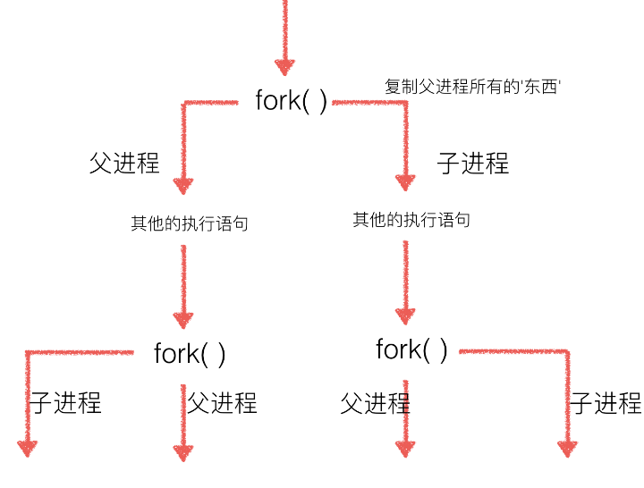

# Python Process

<!-- TOC -->

- [Python Process](#python-process)
    - [Introduction](#introduction)
    - [multiprocess global varibale](#multiprocess-global-varibale)
    - [multiprocessing](#multiprocessing)
        - [process `join()`](#process-join)
    - [进程同步(Lock, RLock)](#进程同步lock-rlock)
    - [进程共享](#进程共享)
    - [进程队列, 比pip弱](#进程队列-比pip弱)
        - [两个队列，可以实现双向共享](#两个队列可以实现双向共享)
        - [进程队列高级用法](#进程队列高级用法)
    - [`multiprocessing.Value` & `multiprocessing.Array`](#multiprocessingvalue--multiprocessingarray)
    - [`multiprocessing.List` & `multiprocessing.dict`](#multiprocessinglist--multiprocessingdict)
    - [csv related](#csv-related)
    - [多线程，多进程应用](#多线程多进程应用)
    - [常见问题](#常见问题)

<!-- /TOC -->

## Introduction

服务器有人访问的时候一般是多进程，但是用户太多，压力太大，会选择优化的方法；

Python的**多线程是鸡肋**，推荐使用**多进程**

- 并发：多线程，GIL(Global Interpreter Locker)一小段一小段时间循环切换;
- 并行：多进程

应用场景：

- 计算(CPU)密集：多进程；计算、深度学习训练、科学计算、内存检索开房数据
- IO密集: 多线程；网络下载、网络等待、文件操作

```python
#in linux的fork()
#执行到fork()创建子进程，分配新资源，fork前面的数据拷贝到子进程，后面的代码也拷贝到子进程
#父进程结束时，子进程并不会随父进程立刻结束。同样，父进程不会等待子进程执行完。
#而multiprocessing, Process创建的进程必须执行完，主程序才会结束
import os

print("this is mainprocess",os.getpid())
print('='*20)
sub_pid=os.fork() #sub_pid指向子进程，常常用于区分父子进程
if sub_pid==0:
    print("This is subprocess",os.getpid(),f"sub_pid={sub_pid}")
else:
    print("This is mainprocess",os.getpid(),f"sub_pid={sub_pid}")
```

```bash
#ouput
this is mainprocess 3353
====================
This is mainprocess 3353 sub_pid=3357
This is subprocess 3357 sub_pid=0
```

```python
# in linux
# 创建进程，会将os.fork()后面的复制一遍，然后创建进程
import os

print(os.getpid())
print('='*20)
sub_pid=os.fork()
print(os.getppid(), os.getpid(), sub_pid)
```

```bash
#ouput
2562
====================
2545 2562 2563
2562 2563 0
#其中2545是vscode
```

## multiprocess global varibale

父子进程虽然可以拷贝使用全局变量，但是不共享，互相独立；

```python
#in linux
import os

global_num=100
print('='*20)
sub_pid=os.fork()
if sub_pid==0:
    # this is subprocess
    global_num+=100
    print(global_num)
else:
    # this is mainprocess
    global_num+=10
    print(global_num)
```

```bash
#ouput
====================
110
200
```

```python
#in linux
import os

print('='*20)
sub_pid1=os.fork()
if sub_pid1==0:
    print(f"{os.getpid()}'s A")
else:
    print(f"{os.getpid()}'s B")

sub_pid2=os.fork()
if sub_pid2==0:
    print(f"{os.getpid()}'s C")
else:
    print(f"{os.getpid()}'s D")
```

```bash
====================
4088's B
4088's D
4089's A
4090's C
4089's D
4091's C
```



```python
#in linux
import subprocess

#Execute a child program in a new process.
process1=subprocess.Popen(args=['gedit',], shell=True)
process1.wait()
print(process1.pid)
print(process1.returncode)
```

```bash
#ouput
4212
0
```

```python
#in linux
import subprocess
import signal

def go(arg1, arg2):
    print('signal is over')

signal.signal(signal.SIGINT, go)

process1=subprocess.Popen(args=['ping www.10tiao.com',], shell=True)
process1.wait() #等待，会卡出程序
print(process1.pid)
print(process1.returncode)
```

```bash
#output, 只是对于黑窗口界面
意外中断，会得到信号
```

## multiprocessing

python中的这个标准库，是跨平台的；

多进程必须要`main()`否则无法区分主进程和次进程；

```python
import os
import multiprocessing


def printInfo(myStr):
    print(myStr, os.getppid(), os.getpid())


if __name__ == '__main__':
    printInfo("main")
    p1 = multiprocessing.Process(target=printInfo, args=("p1",))
    p1.start()
```

```bash
#ouput
main 5612 7608
p1 7608 232
```

```python
if __name__ == '__main__':
    printInfo("main")
    p1 = multiprocessing.Process(target=printInfo, args=("p1",))
    p1.start()
    p1.join()#等待子线程完成，主线程再执行后面的代码
```

### process `join()`

一般的情况下，主线程会等待子线程执行完毕之后再执行；也就是默认是前台进程；但是要汇总数据的时候必须要用到`join()`,换了一个地方提前等；

process的`terminate()`不管怎样，直接结束进程；

```python
import os
import multiprocessing


def printInfo(myStr):
    print(myStr, os.getppid(), os.getpid())


if __name__ == '__main__':
    printInfo("main")
    process_list = []
    for i in range(4):
        process_list.append(multiprocessing.Process(target=printInfo, args=(f"subprocess-{i}",)))
    for process in process_list:
        process.start()
        process.join()#注释掉就是无序进行
```

```bash
#output, 有序进行
main 6252 6640
subprocess-0 6640 7296
subprocess-1 6640 4208
subprocess-2 6640 7376
subprocess-3 6640 640
```

```python
if __name__ == '__main__':
    printInfo("main")
    process_list = []
    for i in range(4):
        process_list.append(multiprocessing.Process(target=printInfo, args=(f"subprocess-{i}",)))
    for process in process_list:
        process.start()
    for process in process_list:#主线程等待，所有的process执行完
        process.join()
```

## 进程同步(Lock, RLock)

当10个进程往一个文件写数据，就需要同步，一个一个来；

```python
import os
import multiprocessing
import time


def printInfo(myStr, lock):
    with lock:
        print(myStr, os.getppid(), os.getpid())
        time.sleep(1)


if __name__ == '__main__':
    lock = multiprocessing.RLock()
    process_list = []
    for i in range(10):
        process_list.append(multiprocessing.Process(target=printInfo, args=(f"subprocess-{i}", lock)))
    for process in process_list:
        process.start()
```

```bash
#ouput
虽然是乱序执行，但是挨个挨个执行

多进程：并行，乱序执行
多进程加锁：串行，乱序执行
多进程start()之后join()：串行，有序执行
```

## 进程共享

- 进程通信：一个人把活干完了，通知其他人；
- 进程共享：多个人把活干完了，进行汇总；

```python
import multiprocessing

data_list = []


def printInfo(myStr):
    global data_list
    data_list.append(myStr)
    print(data_list, id(data_list))


if __name__ == '__main__':
    process_list = []
    for i in range(5):
        process_list.append(multiprocessing.Process(target=printInfo, args=(f"subprocess-{i}", )))
    for process in process_list:
        process.start()
```

```bash
#ouput
每一个process都是深拷贝了全局变量
['subprocess-1'] 1692912442824
['subprocess-2'] 2687036874184
['subprocess-4'] 2084312702408
['subprocess-3'] 1857526881736
['subprocess-0'] 2413416340936
```

```python
import multiprocessing
import os


def func(conn, name):
    print("This is sub,", os.getpid(), conn.recv())
    conn.send([f"message from {name}", 'c'])
    conn.close()


if __name__ == '__main__':
    conn_a, conn_b = multiprocessing.Pipe()  # 2 pip connection
    # print(conn_a, type(conn_a))
    p1 = multiprocessing.Process(target=func, args=(conn_a, 'p1'))
    p1.start()
    # main send something to p1
    conn_b.send("message from main")
    print("This is main,", os.getpid(), conn_b.recv())
    p1.join()
```

```bash
#output
This is sub, 1672 message from main
This is main, 9536 ['message from p1', 'c']
```

## 进程队列, 比pip弱

这个队列进行了特殊的加工，队列只有一个方向(单向共享)：

- 父进程插入， 子进程取出
- 子进程插入，父进程取出

```python
import multiprocessing


def func(myq):
    print("this is subprocess", id(myq))
    print(myq.get())


if __name__ == '__main__':
    queue = multiprocessing.Queue()
    queue.put(['a', 'b', 'c'])
    p1 = multiprocessing.Process(target=func, args=(queue,))
    p1.start()
    p1.join()
```

```bash
#父进程插入，子进程取出
this is subprocess 1855322249424
['a', 'b', 'c']
```

```python
import multiprocessing


def func(myq):
    print("this is subprocess", id(myq))
    myq.put([1, 2, 3])


if __name__ == '__main__':
    queue = multiprocessing.Queue()
    p1 = multiprocessing.Process(target=func, args=(queue,))
    p1.start()
    p1.join()
    print(queue.get())
```

```bash
#outpout
#子进程插入，父进程取出
this is subprocess 2014321694928
[1, 2, 3]
```

### 两个队列，可以实现双向共享

但是会卡住，出现意外

### 进程队列高级用法

汇总多个进程的结果，需要队列

```python
import multiprocessing


def add_data(queue, data):
    queue.put(data)  # son2father
    print(f"put {data} in {multiprocessing.current_process()}")


if __name__ == '__main__':
    queue1 = multiprocessing.Queue()
    data_list = []
    for i in range(5):
        p = multiprocessing.Process(target=add_data, args=(queue1, i))
        p.start()
        data_list.append(queue1.get())#会在这个地方卡住，所以多进程没什么用

    print(f"main: final data={data_list}")
```

```bash
#output,
同步的，挨个挨个运行，没什么卵用
```

```python
#提高速度的做法
import multiprocessing


def add_data(queue, data):
    queue.put(data)  # son2father
    print(f"put {data} in {multiprocessing.current_process()}")


if __name__ == '__main__':
    queue_list = []
    process_list = []
    data_list = []
    for i in range(60):
        queue_list.append(multiprocessing.Queue())
        process_list.append(multiprocessing.Process(target=add_data, args=(queue_list[i], i)))
        process_list[i].start()
    for queue in queue_list:
        data_list.append(queue.get())

    print(f"main: final data={data_list}")
```

```bash
#output
非常快的完成
```

## `multiprocessing.Value` & `multiprocessing.Array`

可以线程共享的Value和Array

Type|meaning
---|---
'c'|char character
'b'|signed char int
'B'|unsigned char int
'u'|Py_UNICODE Unicode character
'h'|signed short int
'H'|unsigned short int
'i'|signed int int
'I'|unsigned int long
'l'|signed long int
'L'|unsigned long long
'f'|float float
'd'|double float

```python
import multiprocessing


def func(num):
    num.value += 1


if __name__ == '__main__':
    num_list = []
    process_list = []
    for i in range(60):
        num_list.append(multiprocessing.Value('i', i))  # i mean signed integer
        process_list.append(multiprocessing.Process(target=func, args=(num_list[i],)))
        process_list[i].start()
    for process in process_list:
        process.join()
    for num in num_list:
        print(num.value, end=',')
```

```bash
#output
1,2,3,4,5,6,7,8,9,10,11,12,13,14,15,16,17,18,19,20,21,22,23,24,25,26,27,28,29,30,31,32,33,34,35,36,37,38,39,40,41,42,43,44,45,46,47,48,49,50,51,52,53,54,55,56,57,58,59,60,
```

```python
import multiprocessing


def func(array):
    for i in range(len(array)):
        array[i] += 10


if __name__ == '__main__':
    array_list = []
    process_list = []
    for i in range(6):
        array_list.append(multiprocessing.Array('i', [x for x in range(i)]))  # i mean signed integer
        process_list.append(multiprocessing.Process(target=func, args=(array_list[i],)))
        process_list[i].start()
    for process in process_list:
        process.join()
    array_list[2][0] = 111
    print(array_list[2][0])
    for array in array_list:
        print(array[:], end=',')
```

```bash
#ouput
111
[],[10],[111, 11],[10, 11, 12],[10, 11, 12, 13],[10, 11, 12, 13, 14],
```

## `multiprocessing.List` & `multiprocessing.dict`

本质是共享内存；

```python
import multiprocessing


def func(mydict, mylist):
    mydict["name"] = "grey"
    mylist.append(110)


if __name__ == '__main__':
    with multiprocessing.Manager() as MG:
        mydict = MG.dict()
        mylist = MG.list(range(5))

        p = multiprocessing.Process(target=func, args=(mydict, mylist))
        p.start()
        p.join()
        print(mydict, mylist)
```

```bash
#output
{'name': 'grey'} [0, 1, 2, 3, 4, 110]
```

```python
#没有with，效果一样，方便书写
if __name__ == '__main__':
    mydict = multiprocessing.Manager().dict()
    mylist = multiprocessing.Manager().list(range(5))

    p = multiprocessing.Process(target=func, args=(mydict, mylist))
    p.start()
    p.join()
    print(mydict, mylist)
```

## csv related

read csv

```python
import csv
import codecs

path = r"./res/sz002040.csv"
csv_reader = csv.reader(codecs.open(path, 'rb', encoding='gbk'))  # 比较通用
# csv_reader = csv.reader(codecs.open(path, 'r'))
for line in csv_reader:
    print(line)
```

write csv

```python
import csv

# newline是为了去掉两行之间的空行，显得紧凑
with open('./test.csv', 'w', newline='') as data_csv:
    csv_writer=csv.writer(data_csv, dialect='excel')
    csv_writer.writerow([x for x in range(10)])
    csv_writer.writerow(['a', 'b', 'c', 'd'])
```

## 多线程，多进程应用

单线程统计文件的行数

```python
#单线程
import threading
import csv


class MyCountThread(threading.Thread):
    def __init__(self, path):
        super().__init__()
        self.path = path
        self.lines_count = -1

    def run(self):
        with open(self.path, 'r') as data_csv:
            csv_reader = csv.reader(data_csv)
            lines = 0
            for line in csv_reader:
                lines += 1
            self.lines_count = lines


path = "./res/sz002040.csv"
thread1 = MyCountThread(path)
thread1.start()
thread1.join() #这里必须加上join()，因为主线程等待子线程结束才会结束，子线程虽然是前台模式；如果没有join()主线程打印完下一行后才会等待
print(thread1.lines_count)
```

```bash
#ouptut
3150
```

多线程统计文件的行数

```python
#多线程
import threading
import csv
import os


class MyCountThread(threading.Thread):
    def __init__(self, path):
        super().__init__()
        self.path = path
        self.lines_count = -1

    def run(self):
        with open(self.path, 'r') as data_csv:
            csv_reader = csv.reader(data_csv)
            lines = 0
            for line in csv_reader:
                lines += 1
            self.lines_count = lines


filename_list = os.listdir("./res")
thread_list = []
line_count_list = []  # 记录所有线程的统计结果
for filename in filename_list:
    my_thread = MyCountThread(f"./res/{filename}")
    thread_list.append(my_thread)
    my_thread.start()

for my_thread in thread_list:
    my_thread.join()
    line_count_list.append(my_thread.lines_count)
print(line_count_list)
# 求平均数、方差、后面就是数学方面的东西
```

```bash
#output
[3150, 3134, 3127, 3123, 3117]
```

单进程统计文件的行数, 可以用主进程来做，为了举例子，采用了multiprocessing

```python
import csv
import multiprocessing


def get_lines_count(path):
    with open(path, 'r') as data_csv:
        csv_reader = csv.reader(data_csv)
        lines = 0
        for line in csv_reader:
            lines += 1
        print(multiprocessing.current_process(), lines)


if __name__ == '__main__':
    path = "./res/sz002040.csv"
    process1 = multiprocessing.Process(target=get_lines_count, args=(path, ))
    process1.start()
    process1.join()
```

```bash
#output
<Process(Process-1, started)> 3150
```

多进程统计文件行数

```python
import os
import csv
import multiprocessing


def get_lines_count(path, data):
    with open(path, 'r') as data_csv:
        csv_reader = csv.reader(data_csv)
        for line in csv_reader:
            data.value += 1
    # print(multiprocessing.current_process(), data.value)


if __name__ == '__main__':
    filename_list = os.listdir("./res")
    process_list = []
    data_list = []  # 存多进程共享数据
    for i in range(len(filename_list)):
        data_list.append(multiprocessing.Value('i', 0))
        process = multiprocessing.Process(target=get_lines_count, args=(f"./res/{filename_list[i]}", data_list[i]))
        process_list.append(process)
        process.start()
    for process in process_list:
        process.join()
    for data in data_list:
        print(data.value, end=',')
```

```bash
#ouput
3150,3134,3127,3123,3117,
```

```python
import os
import csv
import multiprocessing


def get_lines_count(path, my_list):
    with open(path, 'r') as data_csv:
        csv_reader = csv.reader(data_csv)
        lines = 0
        for line in csv_reader:
            lines += 1
        my_list.append(lines)


if __name__ == '__main__':
    filename_list = os.listdir("./res")
    process_list = []
    data_list = multiprocessing.Manager().list()
    for i in range(len(filename_list)):
        process = multiprocessing.Process(target=get_lines_count, args=(f"./res/{filename_list[i]}", data_list))
        process_list.append(process)
        process.start()
    for process in process_list:
        process.join()
    for data in data_list:
        print(data, end=',')
```

```bash
#ouput
3123,3127,3117,3134,3150,
```

求每个公司的平均市值：

```python
#修改的部分
def get_lines_count(path, my_list):
    with open(path, 'r') as data_csv:
        csv_reader = csv.reader(data_csv)
        lines = 0
        market_capitalization = 0
        # 第一条数据不算
        for line in csv_reader:
            lines += 1
            if lines != 1:
                market_capitalization += eval(line[13])
        my_list.append(market_capitalization / lines)
```

## 常见问题

- 有一个检索到了，告诉其他的结束；
- 多个线程的归并结果；

```python
#单线程test
path = "./res/bigDataMail.txt"
data = open(path, 'rb').readlines()
search_str = "@qq.com"
for line in data:
    linestr = line.decode(encoding='ansi')
    if linestr.find(search_str) != -1:
        print(linestr, end='')
```

```python
#多线程查找一个字符串
import threading


class FindStr(threading.Thread):
    def __init__(self, data_list, index_start, index_end, search_str):
        super().__init__()
        self.data_list = data_list
        self.index_start = index_start
        self.index_end = index_end
        self.search_str = search_str

    def run(self):
        for i in range(self.index_start, self.index_end):
            linestr = self.data_list[i].decode('ansi')
            if linestr.find(self.search_str) != -1:
                print(linestr, threading.current_thread(), self.getName())


path = "./res/bigDataMail.txt"
data_list = open(path, 'rb').readlines()
length = len(data_list)
search_str = "737849559@qq.com"
# 10 threads
N = 10
every_piece = length // (N - 1)
last_piece = length - every_piece * (N - 1)
thread_list = []
# first N-1
for i in range(0, N - 1):
    thread_list.append(FindStr(data_list, i * every_piece, (i + 1) * every_piece, search_str))
    thread_list[i].start()
# last one
thread_list.append(FindStr(data_list, every_piece * (N - 1), length, search_str))
thread_list[N-1].start()
# join no need
```

```bash
#ouput
737849559@qq.com	wxq7758258
 <FindStr(Thread-9, started 7260)> Thread-9
```

```python
#用全局变量通知，找到了就所有线程退出
import threading


class FindStr(threading.Thread):
    def __init__(self, data_list, index_start, index_end, search_str):
        super().__init__()
        self.data_list = data_list
        self.index_start = index_start
        self.index_end = index_end
        self.search_str = search_str

    def run(self):
        global global_found
        print(self.getName(), "start")
        for i in range(self.index_start, self.index_end):
            if global_found:
                break
            linestr = self.data_list[i].decode('ansi')
            if linestr.find(self.search_str) != -1:
                print(self.getName(), linestr, end='')
                global_found = True
                break
        print(self.getName(), "end")


# 全局变量通信
global_found = False
path = "./res/bigDataMail.txt"
data_list = open(path, 'rb').readlines()
length = len(data_list)
search_str = "737849559@qq.com"
# 10 threads
N = 10
every_piece = length // (N - 1)
last_piece = length - every_piece * (N - 1)
thread_list = []
# first N-1
for i in range(0, N - 1):
    thread_list.append(FindStr(data_list, i * every_piece, (i + 1) * every_piece, search_str))
    thread_list[i].start()
# last one
thread_list.append(FindStr(data_list, every_piece * (N - 1), length, search_str))
thread_list[N - 1].start()
# join no need
```

```bash
#ouput
Thread-1 start
Thread-2 start
Thread-3 start
Thread-4 start
Thread-5 start
Thread-6 start
Thread-7 start
Thread-8 start
Thread-9 start
Thread-10 start
Thread-10 end
Thread-9 737849559@qq.com	wxq7758258
Thread-9 end
Thread-7 end
Thread-3 end
Thread-4 end
Thread-1 end
Thread-6 end
Thread-5 end
Thread-2 end
Thread-8 end
```

```python
# 多线程检索并保存
# 因为冲突，所以要线程同步
# 检索式并发的，写入是挨个挨个的
import threading


class FindStr(threading.Thread):
    def __init__(self, data_list, index_start, index_end, search_str, save_file):
        super().__init__()
        self.data_list = data_list
        self.index_start = index_start
        self.index_end = index_end
        self.search_str = search_str
        self.find_list = []
        self.save_file = save_file

    def run(self):
        print(self.getName(), "start")
        for i in range(self.index_start, self.index_end):
            linestr = self.data_list[i].decode('ansi')
            if linestr.find(self.search_str) != -1:
                self.find_list.append(linestr)
        print(self.getName(), "finish search")
        # 当都找完了，当获得lock的时候，其他线程可能还在运行，但是没有到with这一块卡住；
        global mutex
        with mutex:
            for line in self.find_list:
                self.save_file.write(line.encode('utf-8'))
        print(self.getName(), "finish write to file")


mutex = threading.Lock()
save_file = open('./res/sina_cn.txt', 'wb')

path = "./res/bigDataMail.txt"
data_list = open(path, 'rb').readlines()
length = len(data_list)
search_str = "@sina.cn"
# 10 threads
N = 10
every_piece = length // (N - 1)
last_piece = length - every_piece * (N - 1)
thread_list = []
# first N-1
for i in range(0, N - 1):
    thread_list.append(FindStr(data_list, i * every_piece, (i + 1) * every_piece, search_str, save_file))
    thread_list[i].start()
# last one
thread_list.append(FindStr(data_list, every_piece * (N - 1), length, search_str, save_file))
thread_list[N - 1].start()
# join need
for thread in thread_list:
    thread.join()
save_file.close()
```

```python
#先保存到每个对象里面最后一次性写入
import threading


class FindStr(threading.Thread):
    def __init__(self, data_list, index_start, index_end, search_str):
        super().__init__()
        self.data_list = data_list
        self.index_start = index_start
        self.index_end = index_end
        self.search_str = search_str
        self.find_list = []

    def run(self):
        print(self.getName(), "start")
        for i in range(self.index_start, self.index_end):
            linestr = self.data_list[i].decode('ansi')
            if linestr.find(self.search_str) != -1:
                self.find_list.append(linestr)
        print(self.getName(), "end")


save_file = open('./res/ispeak.txt', 'wb')
path = "./res/bigDataMail.txt"
data_list = open(path, 'rb').readlines()
length = len(data_list)
search_str = "@ispeak.com"
# 10 threads
N = 10
every_piece = length // (N - 1)
last_piece = length - every_piece * (N - 1)
thread_list = []
# first N-1
for i in range(0, N - 1):
    thread_list.append(FindStr(data_list, i * every_piece, (i + 1) * every_piece, search_str))
    thread_list[i].start()
# last one
thread_list.append(FindStr(data_list, every_piece * (N - 1), length, search_str))
thread_list[N - 1].start()
# join need
final_list = []
for thread in thread_list:
    thread.join()
    final_list += thread.find_list
for item in final_list:
    save_file.write(item.encode('utf-8'))
save_file.close()
```

```python
#为了说明，lock只是锁住lock代码后面的，前面的运行不会被其他线程的lock锁住
import time
import threading


class MyThread(threading.Thread):
    def __init__(self, mylist):
        super().__init__()
        self.mylist = mylist

    def run(self):
        print(self.getName(), "start")
        for item in self.mylist:
            time.sleep(2)
            print(self.getName(), item)
        print(self.getName(), "finish loop")
        global mutex
        with mutex:
            print(self.getName(), '*' * 20)
            time.sleep(10)
        print(self.getName(), "end")


mutex = threading.Lock()
thread_list = []
data_list = ['a', 'b']
for i in range(3):
    thread_list.append(MyThread(data_list))
    thread_list[i].start()
```

```bash
#output
Thread-1 start
Thread-2 start
Thread-3 start
Thread-1 a
Thread-3 a
Thread-2 a
Thread-2 b
Thread-2 finish loop
Thread-2 ********************
Thread-1 b
Thread-1 finish loop
Thread-3 b
Thread-3 finish loop
Thread-2 end
Thread-1 ********************
Thread-1 end
Thread-3 ********************
Thread-3 end
```