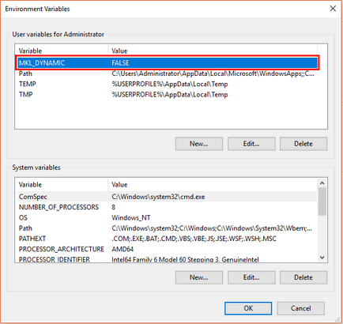
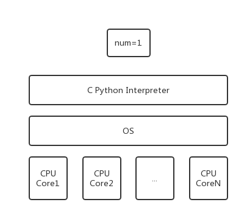

# Python Process

<!-- TOC -->

- [Python Process](#python-process)
  - [Introduction](#introduction)
    - [Concurrency & Parallelism](#concurrency--parallelism)
    - [process vs thread](#process-vs-thread)
    - [CPython GIL](#cpython-gil)
  - [multiprocess global varibale](#multiprocess-global-varibale)
  - [multiprocessing](#multiprocessing)
  - [ThreadPool vs ProcessPool](#threadpool-vs-processpool)
  - [进程同步(Lock, RLock)](#%e8%bf%9b%e7%a8%8b%e5%90%8c%e6%ad%a5lock-rlock)
  - [进程共享](#%e8%bf%9b%e7%a8%8b%e5%85%b1%e4%ba%ab)
  - [`multiprocessing.Pipe()`](#multiprocessingpipe)
  - [`multiprocessing.Queue()`](#multiprocessingqueue)
  - [`multiprocessing.Value` & `multiprocessing.Array`](#multiprocessingvalue--multiprocessingarray)
  - [``Manager()``](#manager)
  - [csv related](#csv-related)
  - [多线程，多进程应用](#%e5%a4%9a%e7%ba%bf%e7%a8%8b%e5%a4%9a%e8%bf%9b%e7%a8%8b%e5%ba%94%e7%94%a8)
  - [常见问题](#%e5%b8%b8%e8%a7%81%e9%97%ae%e9%a2%98)

<!-- /TOC -->

## Introduction

### Concurrency & Parallelism

- 并发(Concurrent)：多个事件在**同一时间段内**发生，每一个时刻只有发生多个事件中的一个
- 并行(Parallel)：多个事件在**同一时刻**发生

单核cpu的多进程、多线程都是并发，多核cpu才能实现并行。[Example](https://blog.csdn.net/qq_33530388/article/details/62448212)

> Intel超线程技术(Hyper Threading)：在一个物理核心的基础上虚拟出两个逻辑核心，操作系统只认逻辑核心，比如4核8线程的i7，任务管理器显示的是8核CPU。下文的多核都是指多逻辑核心。4核8线程肯定比不上8核8线程，一个明显的例子就是密集计算的时候，4核8线程的任务管理器显示为50%占用，实际占用其实到了80-90%.

```python
# 4核8线程电脑上的Anaconda
import mkl
print(mkl.get_max_threads()) # 4

# python使用numpy运算的本质是调用了mkl的库
# 而mkl采用多线程不受gil的限制，我的默认mkl的thread默认是4，而电脑是4核8线程
# 所以mkl可以将cpu占用到50%，切换为8可能提升性能
mkl.set_num_threads(8)
import numpy as np

a = np.random.rand(10000,1000)
b = np.random.rand(100,10000)
c = a.dot(b)
```

[mkl](https://software.intel.com/en-us/mkl-windows-developer-guide-mkl-dynamic)默认采用的是environment variable`MKL_DYNAMIC=True`，要充分利用所有的核心，就要设置environment variable

```bash
# linux commandline, reboot
export MKL_DYNAMIC=FALSE

# windows commandline, reboot
setx MKL_DYNAMIC FALSE
```



### process vs thread

[进程 vs 线程](https://www.jianshu.com/p/ba7aa11d1488)，详见《Modern Operating System》Chapter2, 8

- 进程不能单独执行，只是资源的集合。
- 进程要操作CPU，必须要先创建一个线程。 
- 不同的进程，内存是独立的
- 在同一个进程里的线程，是同享同一块内存空间的
- 创建新线程很简单，创建新进程需要对其父进程进行一次克隆，所以启动线程比启动进程快，运行速度没有可比性
- 同一进程内的线程之间可以互相通信；两个进程通信需要中间代理，另外父进程可以操作子进程

> 进程是资源分配、调度的基本单位。比如notepad.exe要以一个整体的形式暴露给OS进行管理，其中包含了对各种资源的调用，内存的管理，网络接口的调用等，这个整体的形式就是进程。  
> 线程是CPU调度、分派的基本单位。cpu只能看见线程。是OS最小的调度单位，是一串指令的集合。进程要用CPU，必须先创建一个线程，才能执行。

[Process vs Thread](http://www.cnblogs.com/alex3714/articles/5230609.html)

进程: 由program data, associated data, pcb(process control block)组成。线程在program data中，由thread control block, user stack, kernel stack构成。

> OS通过dispatcher来将cpu core, memory, io等资源分配给一个进程。而cpu core只能看见进程内部的线程， 如果发现多个线程，就往其他的cpu core上分配任务。OS再将空闲cpu core, memory, io分配给下一个进程。多个process的状态根据优先级等不断切换。

并行策略：
- 多线程并行：将该process中的threads分配到不同的core上面，实现并行
- 多进程并行：multicore的cpu有多种架构模型，调度模型也不同，一般认为多进程是准并行的。
- 系统级别的并行

[线程与进程的优缺点](https://www.liaoxuefeng.com/wiki/0014316089557264a6b348958f449949df42a6d3a2e542c000/0014319292979766bd3285c9d6b4942a8ea9b4e9cfb48d8000)

### CPython GIL

> Python因为GIL的存在造成**多线程无法并行**，所以需要使用**多进程并行**

GIL(Global Interpreter Lock)不是python的语法特征，它是实现CPython解释器时引用的一个应用。IronPython, Jython, Pypy中就没有GIL。

GIL造成线程无法并行的原因: 比如Python开了多个线程并分配到多个cpu core, 每个线程执行代码的流程(获取GIL→执行代码→释放GIL)，所以当一个cpu core获得GIL其他的都在等待，相当于只有一个cpu core在执行，无法并行。

Python多进程可以并行的原因: 每一个进程只有一个线程， 虽然每个进程都有GIL但是进程之间互不干扰，仅仅针对多核CPU

Python多进程，多线程应用场景:

- 计算密集：计算、深度学习训练、科学计算、内存检索开房数据
- IO密集: 网络下载、网络等待、文件操作; 因为没有获得GIL的线程如果是在等待IO的话，也是可以节约时间的。

> CPython的多线程只是调用OS的原生线程，CPython的多进程也只是调用OS的原生进程；  
> CPython多进程的坏处在于多个进程数据不共享，用Queue, Pipe来进程通信，效率也是低的。

注意:
- 一个无法并行的程序，去掉GIL也无法提升性能。比如一个单线程死循环，python代码占用cpu与cpp代码占用cpu差别不大；多线程死循环，python代码占用cpu还是1/8，cpp代码占用就可以到100%。
- 一个无法并行的程序，Python代码提升性能只能靠更高频率的cpu
- numpy等科学计算库能够提升cpu占用的原因: python调用的c模块，C/CPP模块并不受到GIL影响，C/CPP模块内部开多线程就可以占用cpu到100%。

```python
#in linux的fork()
#执行到fork()创建子进程，分配新资源，fork前面的数据拷贝到子进程，后面的代码也拷贝到子进程
#父进程结束时，子进程并不会随父进程立刻结束。同样，父进程不会等待子进程执行完。
#而multiprocessing, Process创建的进程必须执行完，主程序才会结束
import os

print("this is mainprocess",os.getpid())
print('='*20)
sub_pid=os.fork() #sub_pid指向子进程，常常用于区分父子进程
if sub_pid==0:
    print("This is subprocess",os.getpid(),f"sub_pid={sub_pid}")
else:
    print("This is mainprocess",os.getpid(),f"sub_pid={sub_pid}")
```

```bash
#ouput
this is mainprocess 3353
====================
This is mainprocess 3353 sub_pid=3357
This is subprocess 3357 sub_pid=0
```

```python
# in linux
# 创建进程，会将os.fork()后面的复制一遍，然后创建进程
import os

print(os.getpid())
print('='*20)
sub_pid=os.fork()
print(os.getppid(), os.getpid(), sub_pid)
```

```bash
#ouput
2562
====================
2545 2562 2563
2562 2563 0
#其中2545是vscode
```

example: process start thread

```python
import multiprocessing as mp
import threading
import os

def go():
    print(f'{mp.current_process().name},thread No.{threading.get_ident()}')  # 线程号

def task():
    print(f'{os.getpid()}:{mp.current_process().name}, Parent PID={os.getppid()}')
    threading.Thread(target=go).start()

if __name__ == "__main__":
    print(os.getpid())
    for i in range(4):
        mp.Process(target=task).start()
```

> Linux所以的进程都是根进程PID=1的进程直接或者间接启动的

```bash
6448
5012:Process-1, Parent PID=6448
2848:Process-3, Parent PID=6448
5500:Process-4, Parent PID=6448
Process-3,thread No.3404
Process-1,thread No.5740
Process-4,thread No.3456
6288:Process-2, Parent PID=6448
Process-2,thread No.6340
```

[Understanding GIL](http://www.dabeaz.com/python/UnderstandingGIL.pdf)
>   
> 无论CPU多少核心，同一时刻只有一个线程执行

因为python是调用OS的原生线程，直接在N个CPU上启动N个线程，这N个线程共用同一片内存，如果要对num进行+1操作，就会存在线程冲突问题，然而由于python只是调用OS的原生线程(不是自己实现的)，相当于只是传递上下文给该原生线程，解释器无法在该原生线程内部解决线程冲突，所以为了保证线程安全，就造了GIL在原生线程外部统一管理，同一时刻只让某一个线程能够接触num，那么Python多线程就是并发，不是并行。

因为Java, C#自己实现了多线程，没有调用OS原生线程，所以JPython, IronPython不存在GIL; 

Pypy运行速度快的原因采用了JIT(提前预编译一部分), Pypy去掉GIL只是顺带的优点;有人将CPython去掉GIL结果性能降低。

## multiprocess global varibale

父子进程虽然可以拷贝使用全局变量，但是不共享，互相独立；

```python
#in linux
import os

global_num=100
print('='*20)
sub_pid=os.fork()
if sub_pid==0:
    # this is subprocess
    global_num+=100
    print(global_num)
else:
    # this is mainprocess
    global_num+=10
    print(global_num)
```

```bash
#ouput
====================
110
200
```

```python
#in linux
import os

print('='*20)
sub_pid1=os.fork()
if sub_pid1==0:
    print(f"{os.getpid()}'s A")
else:
    print(f"{os.getpid()}'s B")

sub_pid2=os.fork()
if sub_pid2==0:
    print(f"{os.getpid()}'s C")
else:
    print(f"{os.getpid()}'s D")
```

```bash
====================
4088's B
4088's D
4089's A
4090's C
4089's D
4091's C
```


```python
#in linux, subprocess执行外部程序shell
import subprocess

#Execute a child program in a new process.
process1=subprocess.Popen(args=['gedit',], shell=True)
process1.wait()
print(process1.pid)
print(process1.returncode)
```

```bash
#ouput
4212
0
```

[Python's signal](https://www.jianshu.com/p/c8edab99173d)

```python
#in linux
import subprocess
import signal

def go(arg1, arg2):
    print('signal is over')

signal.signal(signal.SIGINT, go)

process1=subprocess.Popen(args=['ping www.10tiao.com',], shell=True)
process1.wait() #等待，会卡出程序
print(process1.pid)
print(process1.returncode)
```

```bash
#output, 只是对于黑窗口界面
意外中断，会得到信号，比如ctrl+c
```

## multiprocessing

可以使用`subprocess`包来创建子进程，但这个包有两个很大的局限性：
- 我们总是让subprocess运行外部的程序，而不是运行一个Python脚本内部编写的函数。
- 进程间只通过管道进行文本交流。
以上限制了我们将subprocess包应用到更广泛的多进程任务。

`multiprocessing.Process`与`threading.Thread`十分类似，可以利用multiprocessing.Process对象来创建一个进程。该进程可以运行在Python程序内部编写的函数。
也有`start()`, `run()`, `join()`，也有Lock, Event, Semaphore, Condition来进程同步。

multiprocessing的api使用注意:
- multiprocessing提供了threading包中没有的IPC(比如Pipe和Queue)，效率上更高。应优先考虑Pipe和Queue，避免使用Lock/Event/Semaphore/Condition等同步方式 (因为它们占据的不是用户进程的资源)。
- 多进程应该避免共享资源。在多线程中，我们可以比较容易地共享资源，比如使用全局变量或者传递参数。在多进程情况下，由于每个进程有自己独立的内存空间，以上方法并不合适。此时我们可以通过共享内存和Manager的方法来共享资源。但这样做提高了程序的复杂度，并因为同步的需要而降低了程序的效率。
- Process.PID中保存有PID，如果进程还没有start()，则PID为None。
- 在UNIX平台上，当某个进程终结之后，该进程需要被其父进程调用wait，否则进程成为僵尸进程(Zombie)。所以，有必要对每个Process对象调用join()方法 (实际上等同于wait)。对于多线程来说，由于只有一个进程，所以不存在此必要性。

> 如果一个进程已经终止了,但是其父进程还没有获取其状态,那么这个进程就称之为僵尸进程

python中的这个标准库，是跨平台的；

多进程必须要有`if __name__=="__main__"`，进程每次将自己复制一遍，如果没有的话，无法区分主进程和次进程；

```python
import os
import threading
import multiprocessing


def worker(sign, mutex):
    with mutex:
        print(sign, os.getpid())


if __name__ == '__main__':
    print('main process', os.getpid())

    # multithreads
    thread_lock = threading.Lock()
    thread_list = []
    for i in range(4):
        t = threading.Thread(target=worker, args=(f't-{i}', thread_lock))
        thread_list.append(t)
        t.start()

    for t in thread_list:
        t.join()
    
    # multiprocess
    process_lock=multiprocessing.Lock()
    process_list=[]
    for i in range(4):
        p=multiprocessing.Process(target=worker, args=(f'p-{i}', process_lock))
        process_list.append(t)
        p.start()
    
    for p in process_list:
        p.join()
```

```bash
# output,所有Thread的PID都与主程序相同，而每个Process都有一个不同的PID
main process 13640
t-0 13640
t-1 13640
t-2 13640
t-3 13640
p-0 6268
p-3 9280
p-1 11176
p-2 7376
```

```python
import multiprocessing


def inputQ(i, q):
    info = f"process-{i}'s {i}"
    q.put(info)


def outputQ(c, q, lock):
    info = q.get()
    # 为了不让print乱七八糟
    with lock:
        print(f'process-{c} get: {info}')


if __name__ == '__main__':
    input_processes = []
    output_processes = []
    lock = multiprocessing.Lock()
    q = multiprocessing.Queue(3)

    for i in range(5):
        p = multiprocessing.Process(target=inputQ, args=(i, q))
        p.start()
        input_processes.append(p)

    for c in 'ABCD':
        p = multiprocessing.Process(target=outputQ, args=(c, q, lock))
        p.start()
        output_processes.append(p)

    for p in input_processes:
        p.join()

    q.close()

    for p in output_processes:
        p.join()
```

```bash
# output
process-B get: process-1's 1
process-C get: process-4's 4
process-A get: process-2's 2
process-D get: process-3's 3
```

```python
# 用lock进程同步
import multiprocessing

def func(i, lock):
    with lock:
        print(f'process-{i}')


if __name__ == '__main__':
    lock=multiprocessing.Lock()
    for i in range(4):
        multiprocessing.Process(target=func, args=(i, lock)).start()
```

```bash
# output, 没有lock，下面的print，乱糟糟
process-0
process-2
process-1
process-3
```

```python
import os
import multiprocessing


def printInfo(myStr):
    print(myStr, os.getppid(), os.getpid())


if __name__ == '__main__':
    printInfo("main")
    p1 = multiprocessing.Process(target=printInfo, args=("p1",))
    p1.start()
```

```bash
#ouput
main 5612 7608
p1 7608 232
```

```python
if __name__ == '__main__':
    printInfo("main")
    p1 = multiprocessing.Process(target=printInfo, args=("p1",))
    p1.start()
    p1.join()#等待子线程完成，主线程再执行后面的代码
```

一般的情况下，主线程会等待子线程执行完毕之后再执行；也就是默认是前台进程；但是要汇总数据的时候必须要用到`join()`,换了一个地方提前等；

process的`terminate()`不管怎样，直接结束进程；

```python
import os
import multiprocessing


def printInfo(myStr):
    print(myStr, os.getppid(), os.getpid())


if __name__ == '__main__':
    printInfo("main")
    process_list = []
    for i in range(4):
        process_list.append(multiprocessing.Process(target=printInfo, args=(f"subprocess-{i}",)))
    for process in process_list:
        process.start()
        process.join()#注释掉就是无序进行
```

```bash
#output, 有序进行
main 6252 6640
subprocess-0 6640 7296
subprocess-1 6640 4208
subprocess-2 6640 7376
subprocess-3 6640 640
```

```python
if __name__ == '__main__':
    printInfo("main")
    process_list = []
    for i in range(4):
        process_list.append(multiprocessing.Process(target=printInfo, args=(f"subprocess-{i}",)))
    for process in process_list:
        process.start()
    for process in process_list:#主线程等待，所有的process执行完
        process.join()
```

## ThreadPool vs ProcessPool

example: multitask by ProcessPool

```py
from concurrent import futures
import multiprocessing
import time

def func():
    for j in range(11, 16):
        print(multiprocessing.current_process().name, j)
        time.sleep(1)

if __name__ == "__main__":
    # 直接启动8个进程
    po=multiprocessing.Pool(8, initializer=func)
    po.close()
    po.join()
 
if __name__ == "__main__":
    # 线程池8个，只启动4个
    po=multiprocessing.Pool(8)
    for i in range(4):
        po.apply_async(func)
    po.close()
    po.join()

if __name__ == "__main__":
    # 启动8个进程
    executor=futures.ProcessPoolExecutor(max_workers=8)
    for _ in range(8):
        # submit是async
        executor.submit(func)

if __name__ == "__main__":
    # 直接启动8个进程
    executor=futures.ProcessPoolExecutor(max_workers=8, initializer=func)
    executor.submit(None)
```

example: multitask by ThreadPool

```py
from concurrent import futures
from multiprocessing import pool
import threading
import time

def func():
    for j in range(11, 16):
        print(threading.current_thread().name, j)
        time.sleep(1)

if __name__ == "__main__":
    # 直接启动8个并发的线程
    po=pool.ThreadPool(8, initializer=func)
    po.close()
    po.join()

if __name__ == "__main__":
    # 进程池8个，只启动4个并发的线程
    po=pool.ThreadPool(8)
    for _ in range(4):
        po.apply_async(func)
    po.close()
    po.join()

if __name__ == "__main__":
    # 启动8个并发的线程，但不能initializer直接启动8个线程
    executor=futures.ThreadPoolExecutor(max_workers=8)
    for _ in range(8):
        executor.submit(func)
```

## 进程同步(Lock, RLock)

当10个进程往一个文件写数据，就需要同步，一个一个来；
> 无法通过Lock来实现，只能使用`multiprocessing.Pool()`

```python
import os
import multiprocessing
import time


def printInfo(myStr, lock):
    with lock: # 如果没有lock，就是一下都打印出来
        print(myStr, os.getppid(), os.getpid())
        time.sleep(1)


if __name__ == '__main__':
    lock = multiprocessing.RLock()
    process_list = []
    for i in range(10):
        process_list.append(multiprocessing.Process(target=printInfo, args=(f"subprocess-{i}", lock)))
    for process in process_list:
        process.start()
```

```bash
#ouput
虽然是乱序执行，但是挨个挨个执行

多进程：并行，乱序执行
多进程加锁：串行，乱序执行
多进程start()之后join()：串行，有序执行
```

## 进程共享

- 进程通信：一个人把活干完了，通知其他人；
- 进程共享：多个人把活干完了，进行汇总；

Linux进程间通信方式:
1. 管道通信: pipe可用于具有"血缘"关系进程间(也就是父子进程或者兄弟进程)的通信。named pipe除具有管道所具有的功能外，还允许无"血缘"关系进程间的通信
2. 信号通信: sinal是在软件层次上对中断机制的一种模拟，它是比较复杂的通信方式，用于通知进程有某事件发生。
3. 信号量通信: semaphore主要作为进程之间及同一进程的不同线程之间的同步和互斥手段
4. 消息队列通信: Message queue克服了前几种通信方式中信息量有限的缺点，具有写权限的进程可以按照一定的规则向消息队列中添加消息;对消息队列具有读权限的进程则可以从消息队列中读取消息。
5. 共享内存通信: Shared Memory可以说这是最有效的进程间通信方式。它使得多个进程可以访问同一块内存空间，不同进程可以及时看到对方进程中对共享内存中数据的更新。这种通信方式需要依靠某种同步机制，如互此锁和信号量等。
6. socket通信: socket可用于网络中不同机器之间的进程间通信

> 多进程共享资源必然会带来进程间相互竞争。而这种竞争又会造成race condition，我们的结果有可能被竞争的不确定性所影响。如果需要，我们依然可以通过共享内存和Manager对象这么做

python进程通信的方式: 因为是两片内存，所以本质都是需要第三方的
- `Pipe()`: 用于两个进程之间通信
- `Queue()`: 在Pipe()基础上发展而来，用于多个进程通信，比Pipe()慢
- `Value()`, `Array()`,  `Manage()`: 内存共享

## `multiprocessing.Pipe()`

Pipe本质上类似socket, 一个`send()`一个`recv()`

```python
import multiprocessing

def func1(pipe):
    for i in range(5):
        pipe.send(i)
        print(f'func1 receive: {pipe.recv()}')


def func2(pipe):
    for i in range(5):
        pipe.send(i**2)
        print(f'func2 receive {pipe.recv()}')


if __name__ == '__main__':
    pipe = multiprocessing.Pipe()
    p1 = multiprocessing.Process(target=func1, args=(pipe[0], ))
    p2 = multiprocessing.Process(target=func2, args=(pipe[1], ))

    p1.start()
    p2.start()
```

```bash
# output
func2 receive 0
func1 receive: 0
func1 receive: 1
func2 receive 1
func2 receive 2
func1 receive: 4
func1 receive: 9
func2 receive 3
func1 receive: 16
func2 receive 4
```

```python
import multiprocessing


def func(conn, name):
    print(f"This is {name}, receive >", conn.recv())
    conn.send([f"message1 from {name}", 3.14])
    conn.close()


if __name__ == '__main__':
    conn_a, conn_b = multiprocessing.Pipe()  # pipe的两端
    p1 = multiprocessing.Process(target=func, args=(conn_a, 'p1'))
    p1.start()
    # main send something to p1
    conn_b.send("message from main")
    print("This is main,", conn_b.recv())
```

```bash
# output
This is p1, receive > message from main
This is main, ['message1 from p1', 3.14]
```

```python
import multiprocessing

data_list = []


def printInfo(myStr):
    global data_list
    data_list.append(myStr)
    print(data_list, id(data_list))


if __name__ == '__main__':
    process_list = []
    for i in range(5):
        process_list.append(multiprocessing.Process(target=printInfo, args=(f"subprocess-{i}", )))
    for process in process_list:
        process.start()
```

```bash
#ouput
每一个process都是深拷贝了全局变量
['subprocess-1'] 1692912442824
['subprocess-2'] 2687036874184
['subprocess-4'] 2084312702408
['subprocess-3'] 1857526881736
['subprocess-0'] 2413416340936
```

## `multiprocessing.Queue()`

`multiprocessing.Queue()`允许多个进程`put()`，多个进程从中`get()`对象
> `multiprocessing.Queue()`只能单向共享，即一端`put()`, 一端`get()`

`multiprocessing.Queue()`进程共享的原理：
> 父进程有一个Queue()，将Queue()克隆一份传入子进程，两个进程的Queue()分别对应各自的内存。  
> 如果要通信(交换数据)，必须通过第三方，一般是通过pickle序列化的方式实现  
> 比如父进程put, 子进程get：父进程先put之后，数据被`multiprocessing.Queue()`序列化到第三方，然后子进程中的`multiprocessing.Queue()`将第三方的数据反序列化，然后子进程才能get

example: 父进程`put()`， 子进程`get()`
> 因为不同进程内存不共享，所有Queue()必须作为参数传入子进程  
> `queue.Queue()`不能传递给子进程的，会报`pickle`错误；必须是`multiprocessing.Queue()`
> 如果Queue()作为全局变量进入子进程，`q.get()`就会卡住  
> 如果Queue()不能作为外部变量传入子进程，因为不是同一片内存  

```python
import multiprocessing as mp

def func(q):
    print(f'{mp.current_process().name}, {id(q)}, {q.get()}')

if __name__ == '__main__':
    q = mp.Queue()
    q.put(['a', 'b', 'c'])
    print(f'{mp.current_process().name}, {id(q)}')
    p1 = mp.Process(target=func, args=(q,))
    p1.start()
    p1.join()
```

```bash
MainProcess, 2317838698816
Process-1, 1653170021656, ['a', 'b', 'c']
```

example: 线程`Queue()`内存共享，作为外部变量传入线程

```python
import threading
import queue

def task():
    print(f'{threading.current_thread().name}, {id(q)}, {q.get()}')

if __name__ == "__main__":
    q=queue.Queue()
    q.put([1, 2, 3])
    print(f'{threading.current_thread().name}, {id(q)}')
    t=threading.Thread(target=task)
    t.start()
    t.join()
```

```bash
MainThread, 2160337471360
Thread-1, 2160337471360, [1, 2, 3]
```

example: 子进程`put()`，父进程`get()`
> 进程`Queue()`，不是同一片内存，所以id不同

```python
import multiprocessing as mp

def func(q):
    print(f'{mp.current_process().name}, {id(q)}')
    q.put([1, 2, 3])

if __name__ == '__main__':
    q=mp.Queue()
    p = mp.Process(target=func, args=(q,))
    p.start()
    p.join()
    print(q.get(), id(q))
```

```bash
Process-1, 2505827656984
[1, 2, 3] 2091788978328
```

example: 线程`Queue()`, 同一片内存中，所以id先相同

```python
import threading
import queue

def task(q):
    print(f'{threading.current_thread().name}, {id(q)}')
    q.put([1, 2, 3])

if __name__ == "__main__":
    q=queue.Queue()
    t=threading.Thread(target=task, args=(q, ))
    t.start()
    t.join()
    print(q.get(), id(q))
```

```bash
Thread-1, 1748042524544
[1, 2, 3] 1748042524544
```

两个队列，可以实现双向共享,但是会卡住，出现意外

进程队列高级用法：汇总多个进程的结果，需要队列

```python
import multiprocessing


def add_data(queue, data):
    queue.put(data)  # son2father
    print(f"put {data} in {multiprocessing.current_process()}")


if __name__ == '__main__':
    queue1 = multiprocessing.Queue()
    data_list = []
    for i in range(5):
        p = multiprocessing.Process(target=add_data, args=(queue1, i))
        p.start()
        data_list.append(queue1.get())#会在这个地方卡住，所以多进程没什么用

    print(f"main: final data={data_list}")
```

```bash
#output,
同步的，挨个挨个运行，没什么卵用
```

```python
#提高速度的做法
import multiprocessing


def add_data(queue, data):
    queue.put(data)  # son2father
    print(f"put {data} in {multiprocessing.current_process()}")


if __name__ == '__main__':
    queue_list = []
    process_list = []
    data_list = []
    for i in range(60):
        queue_list.append(multiprocessing.Queue())
        process_list.append(multiprocessing.Process(target=add_data, args=(queue_list[i], i)))
        process_list[i].start()
    for queue in queue_list:
        data_list.append(queue.get())

    print(f"main: final data={data_list}")
```

```bash
#output
非常快的完成
```

## `multiprocessing.Value` & `multiprocessing.Array`

可以线程共享的Value和Array

[Type Code](https://docs.python.org/3.7/library/array.html)

| Type code | C Type             | Python Type       | Minimum size in bytes |
| --------- | ------------------ | ----------------- | --------------------- |
| 'b'       | signed char        | int               | 1                     |
| 'B'       | unsigned char      | int               | 1                     |
| 'u'       | Py_UNICODE         | Unicode character | 2                     |
| 'h'       | signed short       | int               | 2                     |
| 'H'       | unsigned short     | int               | 2                     |
| 'i'       | signed int         | int               | 2                     |
| 'I'       | unsigned int       | int               | 2                     |
| 'l'       | signed long        | int               | 4                     |
| 'L'       | unsigned long      | int               | 4                     |
| 'q'       | signed long long   | int               | 8                     |
| 'Q'       | unsigned long long | int               | 8                     |
| 'f'       | float              | float             | 4                     |
| 'd'       | double             | float             | 8                     |

```python
# 内存不共享的多进程
from multiprocessing import Process
import time
li = []

def foo(i):
    li.append(i)
    print("say hi", li)

if __name__ == '__main__':
    p_list = []
    for i in range(4):
        p = Process(target=foo, args=(i,))
        p.start()
        p_list.append(p)

    for p in p_list:
        p.join()

    print(li)
```

```bash
# output
say hi [0]
say hi [2]
say hi [3]
say hi [1]
[]
```

```python
import multiprocessing
import time

def func1(num, arr):
    num.value = 3.14
    arr[0] = 111

if __name__ == '__main__':
    num = multiprocessing.Value('d', 0)
    arr = multiprocessing.Array('i', range(10))
    p1 = multiprocessing.Process(target=func1, args=(num, arr))
    p1.start()
    p1.join()

    # 子进程修改数据，主进程打印数据
    print(num.value)
    print(arr[:])
```

```python
import multiprocessing


def func(num, arr, li):
    num.value = 3.14
    arr[0] = 222
    li.append('hello')


if __name__ == '__main__':
    server = multiprocessing.Manager()
    num = server.Value('d', 0)
    arr = server.Array('i', range(10))
    li = server.list()

    p = multiprocessing.Process(target=func, args=(num, arr, li))
    p.start()
    p.join()

    print(num.value, num)
    print(list(arr), arr)
    print(li)
```

```bash
# output
3.14 Value('d', 3.14)
[222, 1, 2, 3, 4, 5, 6, 7, 8, 9] array('i', [222, 1, 2, 3, 4, 5, 6, 7, 8, 9])
['hello']
```

```python
from multiprocessing import Process, Array

def Foo(i, temp):
    temp[i] = 100+i
    for item in temp:
        print(i, '----->', item)

if __name__ == '__main__':
    temp = Array('i', [11, 22, 33])
    for i in range(3):
        p = Process(target=Foo, args=(i, temp))
        p.start()
```

```bash
# output
2 -----> 11
2 -----> 22
2 -----> 102
0 -----> 100
0 -----> 22
0 -----> 102
1 -----> 100
1 -----> 101
1 -----> 102
```

```python
import multiprocessing


def func(num):
    num.value += 1


if __name__ == '__main__':
    num_list = []
    process_list = []
    for i in range(60):
        num_list.append(multiprocessing.Value('i', i))  # i mean signed integer
        process_list.append(multiprocessing.Process(target=func, args=(num_list[i],)))
        process_list[i].start()
    for process in process_list:
        process.join()
    for num in num_list:
        print(num.value, end=',')
```

```bash
#output
1,2,3,4,5,6,7,8,9,10,11,12,13,14,15,16,17,18,19,20,21,22,23,24,25,26,27,28,29,30,31,32,33,34,35,36,37,38,39,40,41,42,43,44,45,46,47,48,49,50,51,52,53,54,55,56,57,58,59,60,
```

```python
import multiprocessing


def func(array):
    for i in range(len(array)):
        array[i] += 10


if __name__ == '__main__':
    array_list = []
    process_list = []
    for i in range(6):
        array_list.append(multiprocessing.Array('i', [x for x in range(i)]))  # i mean signed integer
        process_list.append(multiprocessing.Process(target=func, args=(array_list[i],)))
        process_list[i].start()
    for process in process_list:
        process.join()
    array_list[2][0] = 111
    print(array_list[2][0])
    for array in array_list:
        print(array[:], end=',')
```

```bash
#ouput
111
[],[10],[111, 11],[10, 11, 12],[10, 11, 12, 13],[10, 11, 12, 13, 14],
```

## ``Manager()``

Manager对象类似于服务器与客户之间的通信 (server-client)，与我们在Internet上的活动很类似。我们用一个进程作为服务器，建立Manager来真正存放资源。其它的进程可以通过参数传递或者根据地址来访问Manager，建立连接后，操作服务器上的资源。在防火墙允许的情况下，我们完全可以将Manager运用于多计算机，从而模仿了一个真实的网络情境。

> Manager()本质是共享内存；

`Manager()` will support types list, dict, Namespace, Lock, RLock, Semaphore, BoundedSemaphore, Condition, Event, Barrier, Queue, Value and Array. 

```python
import multiprocessing


def func(mydict, mylist):
    mydict["name"] = "grey"
    mylist.append(110)


if __name__ == '__main__':
    with multiprocessing.Manager() as MG:
        mydict = MG.dict()
        mylist = MG.list(range(5))

        p = multiprocessing.Process(target=func, args=(mydict, mylist))
        p.start()
        p.join()
        print(mydict, mylist)
```

```bash
#output
{'name': 'grey'} [0, 1, 2, 3, 4, 110]
```

```python
#没有with，效果一样，方便书写
if __name__ == '__main__':
    mydict = multiprocessing.Manager().dict()
    mylist = multiprocessing.Manager().list(range(5))

    p = multiprocessing.Process(target=func, args=(mydict, mylist))
    p.start()
    p.join()
    print(mydict, mylist)
```

## csv related

read csv

```python
# method1: csv package
import csv

with open('csv/000001.csv') as file:
    csv_reader=csv.reader(file)

    for item in csv_reader:
        print(item) # item是list
```

```python
# method2: pandas
import pandas as pd

data=pd.read_csv('csv/000001.csv', encoding='gbk')
print(data)
```

write csv

```python
import csv

# newline是为了去掉两行之间的空行，显得紧凑
with open('test.csv', 'w', newline='') as file:
    csv_writer=csv.writer(file)
    csv_writer.writerow([x for x in range(4)])
    csv_writer.writerow(['a', 'b', 'c', 'd'])
```

## 多线程，多进程应用

单线程统计文件的行数

```python
#单线程
import threading
import csv


class MyCountThread(threading.Thread):
    def __init__(self, path):
        super().__init__()
        self.path = path
        self.lines_count = -1

    def run(self):
        with open(self.path, 'r') as data_csv:
            csv_reader = csv.reader(data_csv)
            lines = 0
            for _ in csv_reader:
                lines += 1
            self.lines_count = lines


path = "./res/sz002040.csv"
thread1 = MyCountThread(path)
thread1.start()
thread1.join() #这里必须加上join()，因为主线程等待子线程结束才会结束，子线程虽然是前台模式；如果没有join()主线程打印完下一行后才会等待
print(thread1.lines_count) # 3150
```

多线程统计文件的行数

```python
#多线程
import threading
import csv
import os


class MyCountThread(threading.Thread):
    def __init__(self, path):
        super().__init__()
        self.path = path
        self.lines_count = -1

    def run(self):
        with open(self.path, 'r') as data_csv:
            csv_reader = csv.reader(data_csv)
            lines = 0
            for _ in csv_reader:
                lines += 1
            self.lines_count = lines


filename_list = os.listdir("./res")
thread_list = []
line_count_list = []  # 记录所有线程的统计结果
for filename in filename_list:
    my_thread = MyCountThread(f"./res/{filename}")
    thread_list.append(my_thread)
    my_thread.start()

for my_thread in thread_list:
    my_thread.join()
    line_count_list.append(my_thread.lines_count)
print(line_count_list) # [3150, 3134, 3127, 3123, 3117]
# 求平均数、方差、后面就是数学方面的东西
```

单进程统计文件的行数, 可以用主进程来做，为了举例子，采用了multiprocessing

```python
import csv
import multiprocessing


def get_lines_count(path):
    with open(path, 'r') as data_csv:
        csv_reader = csv.reader(data_csv)
        lines = 0
        for line in csv_reader:
            lines += 1
        print(multiprocessing.current_process(), lines)


if __name__ == '__main__':
    path = "./res/sz002040.csv"
    process1 = multiprocessing.Process(target=get_lines_count, args=(path, ))
    process1.start()
    process1.join()
```

```bash
#output
<Process(Process-1, started)> 3150
```

多进程统计文件行数

```python
# with Value()
import os
import csv
import multiprocessing


def get_lines_count(path, data):
    with open(path, 'r') as data_csv:
        csv_reader = csv.reader(data_csv)
        for _ in csv_reader:
            data.value += 1


if __name__ == '__main__':
    filename_list = os.listdir("./res")
    p_list = []
    data_list = []  # 存多进程共享数据
    for i, filename in enumerate(filename_list):
        data_list.append(multiprocessing.Value('i', 0))
        p = multiprocessing.Process(target=get_lines_count, args=(f"./res/{filename}", data_list[i]))
        p_list.append(p)
        p.start()
    for p in p_list:
        p.join()
    for data in data_list:
        print(data.value, end=',')
    # 3150,3134,3127,3123,3117,
```

```python
# with Manager().list()
import os
import csv
import multiprocessing


def get_lines_count(path, my_list):
    with open(path) as file:
        csv_reader = csv.reader(file)
        lines = 0
        for _ in csv_reader:
            lines += 1
        my_list.append(lines)


if __name__ == '__main__':
    filename_list = os.listdir("./res")
    p_list = []

    with multiprocessing.Manager() as m:
        data_list=m.list()

        for i, filename in enumerate(filename_list):
            p = multiprocessing.Process(target=get_lines_count, args=(f"./res/{filename_list[i]}", data_list))
            p_list.append(p)
            p.start()
        for p in p_list:
            p.join()
        print(data_list) # [3123,3127,3117,3134,3150]
```

```python
# with Manager().dict()
import os
import csv
import multiprocessing


def get_lines_count(filename, my_dict):
    with open(f'./res/{filename}') as file:
        csv_reader = csv.reader(file)
        lines = 0
        for _ in csv_reader:
            lines += 1
        my_dict[filename] = lines


if __name__ == '__main__':
    filename_list = os.listdir("./res")
    p_list = []

    with multiprocessing.Manager() as m:
        data_dict = m.dict()

        for i, filename in enumerate(filename_list):
            p = multiprocessing.Process(target=get_lines_count, args=(filename, data_dict))
            p_list.append(p)
            p.start()
        for p in p_list:
            p.join()
        print(data_dict) # {'000003.csv': 2771, '000004.csv': 4887, '000002.csv': 4881, '000001.csv': 4880, '000005.csv': 4882}
```

求每个公司的平均市值：一般pandas更快

```python
#修改的部分
def get_lines_count(path, my_list):
    with open(path, 'r') as data_csv:
        csv_reader = csv.reader(data_csv)
        lines = 0
        market_capitalization = 0
        # 第一条数据不算
        for line in csv_reader:
            lines += 1
            if lines != 1:
                market_capitalization += eval(line[13])
        my_list.append(market_capitalization / lines)
```

## 常见问题

- 有一个检索到了，告诉其他的结束；
- 多个线程的归并结果；

```python
#单线程test
path = "./res/bigDataMail.txt"
data = open(path, 'rb').readlines()
search_str = "@qq.com"
for line in data:
    linestr = line.decode(encoding='ansi')
    if linestr.find(search_str) != -1:
        print(linestr, end='')
```

```python
#多线程查找一个字符串
import threading


class FindStr(threading.Thread):
    def __init__(self, data_list, index_start, index_end, search_str):
        super().__init__()
        self.data_list = data_list
        self.index_start = index_start
        self.index_end = index_end
        self.search_str = search_str

    def run(self):
        for i in range(self.index_start, self.index_end):
            linestr = self.data_list[i].decode('ansi')
            if linestr.find(self.search_str) != -1:
                print(linestr, threading.current_thread(), self.getName())


path = "./res/bigDataMail.txt"
data_list = open(path, 'rb').readlines()
length = len(data_list)
search_str = "737849559@qq.com"
# 10 threads
N = 10
every_piece = length // (N - 1)
last_piece = length - every_piece * (N - 1)
thread_list = []
# first N-1
for i in range(0, N - 1):
    thread_list.append(FindStr(data_list, i * every_piece, (i + 1) * every_piece, search_str))
    thread_list[i].start()
# last one
thread_list.append(FindStr(data_list, every_piece * (N - 1), length, search_str))
thread_list[N-1].start()
# join no need
```

```bash
#ouput
737849559@qq.com	wxq7758258
 <FindStr(Thread-9, started 7260)> Thread-9
```

```python
#用全局变量通知，找到了就所有线程退出
import threading


class FindStr(threading.Thread):
    def __init__(self, data_list, index_start, index_end, search_str):
        super().__init__()
        self.data_list = data_list
        self.index_start = index_start
        self.index_end = index_end
        self.search_str = search_str

    def run(self):
        global global_found
        print(self.getName(), "start")
        for i in range(self.index_start, self.index_end):
            if global_found:
                break
            linestr = self.data_list[i].decode('ansi')
            if linestr.find(self.search_str) != -1:
                print(self.getName(), linestr, end='')
                global_found = True
                break
        print(self.getName(), "end")


# 全局变量通信
global_found = False
path = "./res/bigDataMail.txt"
data_list = open(path, 'rb').readlines()
length = len(data_list)
search_str = "737849559@qq.com"
# 10 threads
N = 10
every_piece = length // (N - 1)
last_piece = length - every_piece * (N - 1)
thread_list = []
# first N-1
for i in range(0, N - 1):
    thread_list.append(FindStr(data_list, i * every_piece, (i + 1) * every_piece, search_str))
    thread_list[i].start()
# last one
thread_list.append(FindStr(data_list, every_piece * (N - 1), length, search_str))
thread_list[N - 1].start()
# join no need
```

```bash
#ouput
Thread-1 start
Thread-2 start
Thread-3 start
Thread-4 start
Thread-5 start
Thread-6 start
Thread-7 start
Thread-8 start
Thread-9 start
Thread-10 start
Thread-10 end
Thread-9 737849559@qq.com	wxq7758258
Thread-9 end
Thread-7 end
Thread-3 end
Thread-4 end
Thread-1 end
Thread-6 end
Thread-5 end
Thread-2 end
Thread-8 end
```

```python
# 多线程检索并保存
# 因为冲突，所以要线程同步
# 检索式并发的，写入是挨个挨个的
import threading


class FindStr(threading.Thread):
    def __init__(self, data_list, index_start, index_end, search_str, save_file):
        super().__init__()
        self.data_list = data_list
        self.index_start = index_start
        self.index_end = index_end
        self.search_str = search_str
        self.find_list = []
        self.save_file = save_file

    def run(self):
        print(self.getName(), "start")
        for i in range(self.index_start, self.index_end):
            linestr = self.data_list[i].decode('ansi')
            if linestr.find(self.search_str) != -1:
                self.find_list.append(linestr)
        print(self.getName(), "finish search")
        # 当都找完了，当获得lock的时候，其他线程可能还在运行，但是没有到with这一块卡住；
        global mutex
        with mutex:
            for line in self.find_list:
                self.save_file.write(line.encode('utf-8'))
        print(self.getName(), "finish write to file")


mutex = threading.Lock()
save_file = open('./res/sina_cn.txt', 'wb')

path = "./res/bigDataMail.txt"
data_list = open(path, 'rb').readlines()
length = len(data_list)
search_str = "@sina.cn"
# 10 threads
N = 10
every_piece = length // (N - 1)
last_piece = length - every_piece * (N - 1)
thread_list = []
# first N-1
for i in range(0, N - 1):
    thread_list.append(FindStr(data_list, i * every_piece, (i + 1) * every_piece, search_str, save_file))
    thread_list[i].start()
# last one
thread_list.append(FindStr(data_list, every_piece * (N - 1), length, search_str, save_file))
thread_list[N - 1].start()
# join need
for thread in thread_list:
    thread.join()
save_file.close()
```

```python
#先保存到每个对象里面最后一次性写入
import threading


class FindStr(threading.Thread):
    def __init__(self, data_list, index_start, index_end, search_str):
        super().__init__()
        self.data_list = data_list
        self.index_start = index_start
        self.index_end = index_end
        self.search_str = search_str
        self.find_list = []

    def run(self):
        print(self.getName(), "start")
        for i in range(self.index_start, self.index_end):
            linestr = self.data_list[i].decode('ansi')
            if linestr.find(self.search_str) != -1:
                self.find_list.append(linestr)
        print(self.getName(), "end")


save_file = open('./res/ispeak.txt', 'wb')
path = "./res/bigDataMail.txt"
data_list = open(path, 'rb').readlines()
length = len(data_list)
search_str = "@ispeak.com"
# 10 threads
N = 10
every_piece = length // (N - 1)
last_piece = length - every_piece * (N - 1)
thread_list = []
# first N-1
for i in range(0, N - 1):
    thread_list.append(FindStr(data_list, i * every_piece, (i + 1) * every_piece, search_str))
    thread_list[i].start()
# last one
thread_list.append(FindStr(data_list, every_piece * (N - 1), length, search_str))
thread_list[N - 1].start()
# join need
final_list = []
for thread in thread_list:
    thread.join()
    final_list += thread.find_list
for item in final_list:
    save_file.write(item.encode('utf-8'))
save_file.close()
```

```python
#为了说明，lock只是锁住lock代码后面的，前面的运行不会被其他线程的lock锁住
import time
import threading


class MyThread(threading.Thread):
    def __init__(self, mylist):
        super().__init__()
        self.mylist = mylist

    def run(self):
        print(self.getName(), "start")
        for item in self.mylist:
            time.sleep(2)
            print(self.getName(), item)
        print(self.getName(), "finish loop")
        global mutex
        with mutex:
            print(self.getName(), '*' * 20)
            time.sleep(10)
        print(self.getName(), "end")


mutex = threading.Lock()
thread_list = []
data_list = ['a', 'b']
for i in range(3):
    thread_list.append(MyThread(data_list))
    thread_list[i].start()
```

```bash
#output
Thread-1 start
Thread-2 start
Thread-3 start
Thread-1 a
Thread-3 a
Thread-2 a
Thread-2 b
Thread-2 finish loop
Thread-2 ********************
Thread-1 b
Thread-1 finish loop
Thread-3 b
Thread-3 finish loop
Thread-2 end
Thread-1 ********************
Thread-1 end
Thread-3 ********************
Thread-3 end
```