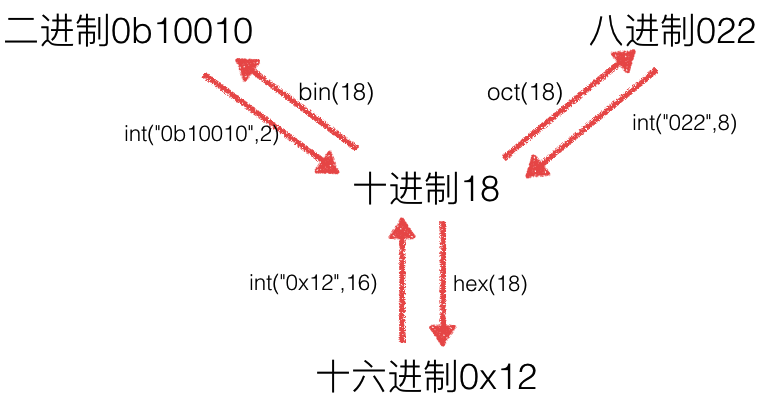

# python bitOperation

- [python bitOperation](#python-bitoperation)
    - [原码，反码，补码](#%E5%8E%9F%E7%A0%81%EF%BC%8C%E5%8F%8D%E7%A0%81%EF%BC%8C%E8%A1%A5%E7%A0%81)
    - [进制转换](#%E8%BF%9B%E5%88%B6%E8%BD%AC%E6%8D%A2)
    - [bit operation](#bit-operation)

## 原码，反码，补码

- 正数：原码，反码，补码都一样
- 负数：原码到补码，除去符号位，按位取反，+1; 补码到原码，除去符号位，按位取反，+1(可逆操作)

## 进制转换



```python
num = 18
# 下面三个都是<class 'str'>
# 十进制转其他进制
bin_num = bin(num)
oct_num = oct(num)
hex_num = hex(num)
print(num, bin_num, oct_num, hex_num)
print(repr(num), repr(bin_num), repr(oct_num), repr(hex_num))
# 其他进制转十进制
print(int(bin_num, 2), int(oct_num, 8), int(hex_num, 16))
```

```bash
#output
18 0b10010 0o22 0x12
18 '0b10010' '0o22' '0x12'
18 18 18
```

## bit operation

`&, |, ~, ^, <<, >>`

左移，右移能够快速乘2,除2；`~`实现让`~9==-10`,因为操作的是补码

```python
a1 = 10
a2 = a1 << 1
a1 <<= 1
print(a1, a2)  # 20,20

b1 = -10
b2 = b1 << 1
b1 <<= 1
print(b1, b2)  # -20,-20
```

```python
# 位运算实现2x3
a1 = 2
# 优先级
a2 = (a1 << 1) + a1
a3 = a1 << 1 + a1
print(a2, a3)  # 6, 16
```