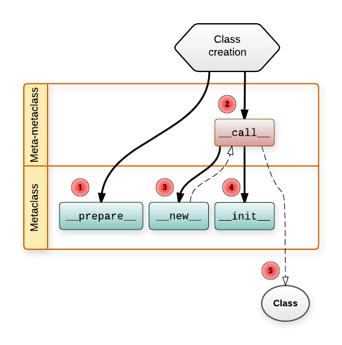

# Python Decorator

<!-- TOC -->

- [Python Decorator](#python-decorator)
    - [Closures(闭包)](#closures闭包)
    - [decorator](#decorator)
    - [decorator with parameters](#decorator-with-parameters)
        - [`property`](#property)
        - [decorator with `help`](#decorator-with-help)
    - [静态语言vs动态语言](#静态语言vs动态语言)
    - [`__slots__`](#__slots__)
    - [metaclass(元类)](#metaclass元类)
        - [`__metaclass__`](#__metaclass__)
        - [metaclass application](#metaclass-application)
    - [Reflection](#reflection)

<!-- /TOC -->

## Closures(闭包)

```python
def test1():
    print("---test1---")

test1()
test2=test1
print(test1,test2)
test2()
```

```bash
#output
---test1---
<function test1 at 0x000002DB79D6AB70> <function test1 at 0x000002DB79D6AB70>
---test1---
```

在函数内部再定义一个函数，并且这个函数用到了外边函数的变量，那么将这个函数以及用到的一些变量称之为闭包

```python
def test(number):
    print("---1---")
    
    #这就是一个闭包
    def test_in(number_in):
        print("Hello,---2---")
        return number+number_in
    print("---3---")
    return test_in

#闭包的应用，有一个默认的值
ret = test(20)
print(ret(100))
print(ret(200))
```

```bash
---1---
---3---
Hello,---2---
120
Hello,---2---
220
```

```python
def counter(start=0):
    count=[start]
    def incr():
        count[0] += 1
        return count[0]
    return incr

c1=counter(5)
print(c1())#6
print(c1())#7
print(c1())#8
```

```python
def counter(start=0):
    def incr():
        nonlocal start
        start += 1
        return start
    return incr

c1 = counter(5)
print(c1())
print(c1())

c2 = counter(50)
print(c2())
print(c2())

#保存了结果，类似global，可以修改
print(c1())
print(c1())

print(c2())
print(c2())
```

```bash
#output
6
7
51
52
8
9
53
54
```

```python
def line_conf(a, b):
    def line(x):
        return a*x + b
    return line

#内存中开辟了两个空间
line1 = line_conf(1, 1)
line2 = line_conf(4, 5)
print(line1(5))#6
print(line2(5))#25
```

```python
x=0
def grandpa():
    x=1
    def dad():
        x=2
        def son():
            x=3
            print(x)
        son()
    dad()

# 使用的局部变量3
grandpa() # 3
```

Closure summary:

1. 闭包似优化了变量，原来需要类对象完成的工作，闭包也可以完成
2. 由于闭包引用了外部函数的局部变量，则外部函数的局部变量没有及时释放，消耗内存

## decorator

decorator本质是函数, 装饰其他函数(为其他函数添加附加功能). 对使用者而言, decorator相当于是透明的(使用者不知道是否加入了装饰器)

decorator原则: 
- 不能修改被修改函数的源码
- 不能修改函数的调用方式

python解释器执行的时候，认为函数就是一个变量名指向了函数体；相当于新建了一个变量，没有用；可以中途换指向

```python
#避免这种情况
def test1():
    print("---test1---")
def test1():
    print("---test2---")

test1()#---test2---
```

写代码要遵循**开放封闭原则**，虽然在这个原则是用的面向对象开发，但是也适用于函数式编程，简单来说，它规定已经实现的功能代码不允许被修改，但可以被扩展，即：

- 封闭：已实现的功能代码块
- 开放：对扩展开发

可以加东西，不要修改已经弄好的；

```python
#without decoration
def w1(func):
    def inner():
        print("---added function---")
        func()
    return inner

#下面几个不让动
def func1():
    print("---test1---")

def func2():
    print("---test2---")

def func3():
    print("---test3---")

func1=w1(func1)
func2=w1(func2)
func3=w1(func2)

#consume the functions
func1()
func2()
func3()
```

这个就是装饰器模式：用w1给func1,func2,func3装饰一下

```python
#with decoration, 只是为了简化上面的代码
def w1(func):
    def inner():
        print("---added function---")
        func()
    return inner

#下面几个不让动
@w1 #等价于func1=w1(func1)
def func1():
    print("---test1---")

@w1
def func2():
    print("---test2---")

@w1
def func3():
    print("---test3---")

func1()
func2()
func3()
```

```bash
#output
---added function---
---test1---
---added function---
---test2---
---added function---
---test3---
```

多个装饰器的例子：

```python
#定义函数：完成包裹数据
def makeBold(fn):
    print("---bold begin---")
    def wrapped():
        print("---bold wrap---")
        return "<b>" + fn() + "</b>"
    print("---bold end---")    
    return wrapped

#定义函数：完成包裹数据
def makeItalic(fn):
    print("---italic begin---")
    def wrapped():
        print("---italic wrap---")
        return "<i>" + fn() + "</i>"
    print("---italic end---")
    return wrapped

@makeBold
def test1():
    return "hello world-1"

@makeItalic
def test2():
    return "hello world-2"

@makeBold
@makeItalic
def test3():
    return "hello world-3"
```

```bash
#即便是没有调用test1(),test2(),test3()
---bold begin---
---bold end---
---italic begin---
---italic end---
---italic begin---
---italic end---
---bold begin---
---bold end---
```

```python
#定义函数：完成包裹数据
def makeBold(fn):
    print("---bold begin---")
    def wrapped():
        print("---bold wrap---")
        return "<b>" + fn() + "</b>"
    print("---bold end---")    
    return wrapped

#定义函数：完成包裹数据
def makeItalic(fn):
    print("---italic begin---")
    def wrapped():
        print("---italic wrap---")
        return "<i>" + fn() + "</i>"
    print("---italic end---")
    return wrapped

@makeBold
@makeItalic
def test3():
    return "hello world-3"

#开始调用
print("="*15)
print(test3())
```

```bash
#output, 存在堆栈结构
---italic begin---
---italic end---
---bold begin---
---bold end---
===============
---bold wrap---
---italic wrap---
<b><i>hello world-3</i></b>
```

不使用装饰器，来得到相同的结果

```python
#定义函数：完成包裹数据
def makeBold(fn):
    print("---bold begin---")
    def wrapped():
        print("---bold wrap---")
        return "<b>" + fn() + "</b>"
    print("---bold end---")    
    return wrapped

#定义函数：完成包裹数据
def makeItalic(fn):
    print("---italic begin---")
    def wrapped():
        print("---italic wrap---")
        return "<i>" + fn() + "</i>"
    print("---italic end---")
    return wrapped

def test3():
    return "hello world-3"

#先调用的是makeItalic()
test3=makeItalic(test3)
test3=makeBold(test3)

#开始调用
print("="*15)
print(test3())
```

```bash
#output，装饰的时候是从下往上，调用的时候从上往下
---italic begin---
---italic end---
---bold begin---
---bold end---
===============
---bold wrap---
---italic wrap---
<b><i>hello world-3</i></b>
```

## decorator with parameters

1.1无参数的函数

```python
from time import ctime, sleep

def timefun(func):
    def wrappedfunc():
        print(f"{func.__name__} called at {ctime()}")
        func()
    return wrappedfunc

@timefun
def foo():
    print("I am foo")

foo()
sleep(2)
foo()
```

```bash
#output
foo called at Mon Mar 12 17:28:27 2018
I am foo
foo called at Mon Mar 12 17:28:29 2018
I am foo
```

```python
import time

def decorator(func):
    def wrapper(*args,**kwargs):
        start=time.time()
        func(*args,**kwargs)
        stop=time.time()
        print(f'run time is {stop-start}')
    return wrapper
 
@decorator
def test(list_test):
    for i in list_test:
        time.sleep(0.1)
        print(f'---{i}---')
  
 
# test这个时候本质是在执行wrapper()
# decorator(test)(range(10)) 
test(range(10))
print(test(range(10)))# None
```

2.带参数的函数

```python
from time import ctime, sleep

def timefun(func):
    def wrappedfunc(a, b):
        print(f"{func.__name__} called at {ctime()}")
        print(a, b)
        func(a, b)
    return wrappedfunc

@timefun
def foo(a, b):
    print(a+b)

foo(3,5)
sleep(2)
foo(2,4)
```

```bash
#output
foo called at Mon Mar 12 17:33:42 2018
3 5
8
foo called at Mon Mar 12 17:33:44 2018
2 4
6
```

3.不定长参数的函数装饰

```python
from time import ctime, sleep

def timefun(func):
    def wrappedfunc(*args, **kwargs):
        print(f"{func.__name__} called at {ctime()}")
        func(*args, **kwargs)#这里要拆包
    return wrappedfunc

@timefun
def foo(a, b, c):
    print(a+b+c)

foo(3,5,7)
sleep(2)
foo(2,4,9)
```

```bash
#output
foo called at Mon Mar 12 17:38:58 2018
15
foo called at Mon Mar 12 17:39:00 2018
15
```

4.带return函数的装饰

```python
# method1:
import time

def decorator(func):
    def wrapper(*args,**kwargs):
        start=time.time()
        func(*args,**kwargs)
        stop=time.time()
        print(f'run time is {stop-start}')
        return sum(*args)
    return wrapper
 
@decorator
def test(list_test):
    for i in list_test:
        time.sleep(0.1)
        print(f'---{i}---')
  
# test(range(10))
print(test(range(10)))# 45
```

```python
# method2:
import time

def decorator(func):
    def wrapper(*args,**kwargs):
        start=time.time()
        res=func(*args,**kwargs)
        stop=time.time()
        print(f'run time is {stop-start}')
        return res
    return wrapper
 
@decorator
def test(list_test):
    for i in list_test:
        time.sleep(0.1)
        print(f'---{i}---')
    return sum(list_test)
  
# test(range(10))
print(test(range(10)))
```

```python
from time import ctime, sleep

def timefun(func):
    def wrappedfunc():
        print(f"{func.__name__} called at {ctime()}")
        func()
    return wrappedfunc

@timefun
def foo():
    print("I am foo")

@timefun
def getInfo():
    return '----hahah---'

foo()
print(getInfo())
```

```bash
#output, 没有拿到最里面的结果
foo called at Mon Mar 12 17:42:37 2018
I am foo
getInfo called at Mon Mar 12 17:42:37 2018
None
```

```python
from time import ctime, sleep

def timefun(func):
    def wrappedfunc():
        print(f"{func.__name__} called at {ctime()}")
        return func() #修改这个地方
    return wrappedfunc

@timefun
def foo():
    print("I am foo")

@timefun
def getInfo():
    return '----hahah---'

foo()
print(getInfo())
```

```bash
#output
foo called at Mon Mar 12 17:45:36 2018
I am foo
getInfo called at Mon Mar 12 17:45:36 2018
----hahah---
```

比较通用的装饰器结构

```python
def func(functionName):
    def func_in(*args, **kwargs):
        print("-----新功能放在这儿，比如记录日志-----")
        ret = functionName(*args, **kwargs)
        return ret
    return func_in
```

5.装饰器带参数,在原有装饰器的基础上，设置外部变量

无参数的decorator需要两层嵌套, 带参数的decorator需要三层嵌套;

```python
from time import ctime, sleep

def timefun_arg(pre="hello"):
    def timefun(func):
        def wrappedfunc():
            print(f"{func.__name__} called at {ctime()},pre={pre}")
            return func()
        return wrappedfunc
    return timefun

@timefun_arg("itcast")
def foo():
    print("I am foo")

@timefun_arg("python")
def too():
    print("I am too")

foo()
sleep(2)
foo()

too()
sleep(2)
too()
```

```bash
#可以理解为
timefun=timefun_arg("itcast")
foo=timefun(foo)
foo()
#或者
foo()==timefun_arg("itcast")(foo)()
#output
foo called at Mon Mar 12 18:00:27 2018,pre=itcast
I am foo
foo called at Mon Mar 12 18:00:29 2018,pre=itcast
I am foo
too called at Mon Mar 12 18:00:29 2018,pre=python
I am too
too called at Mon Mar 12 18:00:31 2018,pre=python
I am too
```

6.类装饰器

装饰器函数其实是这样一个接口约束，它必须接受一个`callable`对象作为参数，然后返回一个`callable对`象。在Python中一般callable对象都是函数，但也有例外。只要某个对象重写了 `__call__()` 方法，那么这个对象就是callable的。

```python
class Test():
    def __call__(self):
        print('call me!')

t = Test()
t()  # call me
```

```python
#without decoration
class Test(object):
    def __init__(self, func):
        print("---initializing---")
        print(f"func name is {func.__name__}")
        self.__func = func
    def __call__(self):
        print("---装饰器中的功能---")
        self.__func()

def func1():
    print("---do func1---")

func1=Test(func1)
#开始调用
print("="*15)
func1()
````

```python
#with decoration
class Test(object):
    def __init__(self, func):
        print("---initializing---")
        print(f"func name is {func.__name__}")
        self.__func = func
    def __call__(self):
        print("---装饰器中的功能---")
        self.__func()

@Test
def func1():
    print("---do func1---")

#开始调用
print("="*15)
func1()
```

```bash
#output
---initializing---
func name is func1
===============
---装饰器中的功能---
---do func1---
```

### `property`

`property`本质是一个重写了`__call__`方法的class

```python
class Person:
    @property
    def eat(self):
        print('eating....')
    
    def talk(self):
        print('talking...')

p1=Person()
p1.eat # eating...
p1.talk() #talking...
```

property for getter-setter:

```python
# with getter-setter pair
class Student(object):
    def __init__(self):
        self.__age=22
    def getAge(self):
        return self.__age
    def setAge(self, value):
        if isinstance(value,int):
            self.__age=value
        else:
            print('not a integer age')

stu1=Student()
print(stu1.getAge())#22
stu1.setAge(20)
print(stu1.getAge())#20
```

```python
# with property instance
class Student(object):
    def __init__(self):
        self.__age=22
    def getAge(self):
        return self.__age
    def setAge(self, value):
        if isinstance(value,int):
            self.__age=value
        else:
            print('not a integer age')
    # 简化调用的时候书写getter,setter
    Age=property(getAge,setAge)

stu1=Student()
print(stu1.Age)#22,会调用getAge函数
stu1.Age=20
print(stu1.Age)#20
```

```python
# with propety decorator
class Student(object):
    def __init__(self):
        self.__age=22
    
    @property
    def Age(self):
        return self.__age
    @Age.setter
    def Age(self, value):
        if isinstance(value,int):
            self.__age=value
        else:
            print('not a integer age')

stu1=Student()
print(stu1.Age)#22
stu1.Age=20
print(stu1.Age)#20
```

具体的演化方式:

```python
# step1
class Student(object):
    def __init__(self):
        self.__age=22
    def getAge(self):
        return self.__age
    def setAge(self, value):
        if isinstance(value,int):
            self.__age=value
        else:
            print('not a integer age')
    #创建一个property()对象p1
    #p1两个函数p1.getter(),p1.setter()分别包装了getAge,和setAge;分别返回property对象
    p1=property()
    getAge=p1.getter(getAge)
    setAge=p1.setter(setAge)

stu1=Student()
print(stu1.getAge)#这里直接就调用了getAge函数
stu1.setAge=20#这里调用了setAge函数
print(stu1.getAge)#20
```

```python
#装饰成这个样子
class Student(object):
    def __init__(self):
        self.__age=22
    p1=property()
    @p1.getter
    def getAge(self):
        return self.__age
    @p1.setter
    def setAge(self, value):
        if isinstance(value,int):
            self.__age=value
        else:
            print('not a integer age')
```

```python
# step2
class Student(object):
    def __init__(self):
        self.__age=22
    def getAge(self):
        return self.__age
    def setAge(self, value):
        if isinstance(value,int):
            self.__age=value
        else:
            print('not a integer age')
    p1=property()
    p2=p1.getter(getAge)#对getter就是对p1本身的操作，返回property对象
    Age=p2.setter(setAge)# property对象

stu1=Student()
print(stu1.Age)#22
stu1.Age=20
print(stu1.Age)#20
```

```python
#装饰成这个样子
class Student(object):
    def __init__(self):
        self.__age=22
    p1=property()
    @p1.getter
    def p2(self):
        return self.__age
    @p2.setter
    def Age(self, value):
        if isinstance(value,int):
            self.__age=value
        else:
            print('not a integer age')

stu1=Student()
print(stu1.Age)#22
stu1.Age=20
print(stu1.Age)#20
```

```python
# step3, 使用了property的__init__
class Student(object):
    def __init__(self):
        self.__age=22
    def getAge(self):
        return self.__age
    def setAge(self, value):
        if isinstance(value,int):
            self.__age=value
        else:
            print('not a integer age')
    p1=property(getAge)
    Age=p1.setter(setAge)
```

```python
class Student(object):
    def __init__(self):
        self.__age=22
    @property
    def Age(self):
        return self.__age
    @Age.setter
    def Age(self, value):
        if isinstance(value,int):
            self.__age=value
        else:
            print('not a integer age')
    ## 等价形式
    # Age=property(Age)
    # Age=Age.setter(Age)
stu1=Student()
print(stu1.Age)#22
stu1.Age=20
print(stu1.Age)#20
```

```python
# property deleter
class Student(object):
    def __init__(self):
        self.__age=22
    @property
    def Age(self):
        return self.__age
    @Age.setter
    def Age(self, value):
        if isinstance(value,int):
            self.__age=value
        else:
            print('not a integer age')
    @Age.deleter
    def Age(self):
        del self.__age
        print('delete __age attribute')
stu1=Student()
stu1.Age=20
print(stu1.Age)# 20
# 如果没有@Age.deleter, 下面报错
del stu1.Age # delete __age attribute
```

example1: read-only property

```python
class Flight(object):
    def __init__(self,name):
        self.flight_name = name

    def checking_status(self):
        print(f"checking flight {self.flight_nama} status")
        return  1

    @property
    def flight_status(self):
        status = self.checking_status()
        if status == 0 :
            print("flight got canceled...")
        elif status == 1 :
            print("flight is arrived...")
        elif status == 2:
            print("flight has departured already...")
        else:
            print("cannot confirm the flight status...,please check later")


f = Flight("CA980")
# property主要是对后台进行封装，暴露合适的接口给用户
# property在后台进行各种处理
f.flight_status
```

### decorator with `help`

装饰后的函数, help信息为`wrapper()`的信息; 将元信息复制给装饰后的函数

```python
import functools

def outer(func):
    @functools.wraps(func)
    def inner(*args, **kwargs):
        print(inner.__doc__)  # None
        return func()
    return inner

@outer
def function():
    """
    Hello, It is function document:)
    """
    print('func')

help(function) # Hello, It is function document:)
```

## 静态语言vs动态语言

- 静态语言，不允许在运行过程中修改代码;C,C++,C#
- 动态语言，可以在运行过程中修改代码;PHP,Ruby,Python

比如

```python
def printInfo():
    print("Hello")

a=100
a=printInfo#直接从一种类型指向另一种类型
```

```python
import types

class Student():
    def __init__(self, name, age):
        self.name=name
        self.__age=age

def go():
    print("gogogo")

def eat(self):
    print(self.name+" eating")

#动态添加属性
stu1=Student("grey",44)
stu1.sex="man"
stu1.weight=100

#甚至添加类属性
Student.AvergeScores=90

#参数必须是空的，才能这么做
stu1.run=go
stu1.run()#gogoto

# method1:
xxx=types.MethodType(eat,stu1)
xxx()#grey eating
stu1.eatEat=types.MethodType(eat,stu1)
stu1.eatEat()#grey eating

# method2:
types.MethodType(eat,stu1)
stu1.eatEat=eat
stu1.eatEat(stu1)#grey eating
```

```python
#动态添加静态方法
import types

class Student():
    def __init__(self, name, age):
        self.name=name
        self.__age=age

@staticmethod
def Laugh():
    print("hahaha")

Student.Haha=Laugh
Student.Haha()#hahaha
```

```python
#动态添加类方法
import types

class Student():
    def __init__(self, name, age):
        self.name=name
        self.__age=age

@classmethod
def Laugh(cls):
    print("hahaha")

Student.Haha=Laugh
Student.Haha()#hahaha
```

summary:

- 给instance添加属性，添加实例方法
- 给class添加属性，添加静态方法，类方法

比如天猫的客户端没有更新，但是页面的按钮经常更新，应该是先下载了代码，然后动态加载进去了；

## `__slots__`

只允许对Person实例添加name和age属性：为了达到限制的目的，Python允许在定义class的时候，定义一个特殊的`__slots__`变量，来限制该class实例能添加的属性：

```python
class Student():
    __slots__=("name","age")

stu1=Student()
stu1.name="grey"
try:
    stu1.score=100
except Exception as e:
    print(e)
```

```bash
#output
'Student' object has no attribute 'score'
```

## metaclass(元类)

metaclass主要是为了实现**动态创建类型**; Java/CPP没有metaclass;

- 类实例化得到对象
- metaclass实例化得到类, `type`就是最基本的metaclass; 想要动态创建类型需要继承`type`

[`object` vs `type`](https://www.zhihu.com/question/38791962)
- `type`继承自`object`
- `object`是`type`的实例


- `object`代表的是继承关系的最顶层, 图中实线;
- `type`代表的类型与实例的关系的最顶层, 图中虚线;

> 通过`__bases__`获取类型的继承关系  
> 通过`__class__`获取类型与实例的关系, 或者通过`type()`

```python
# object, type的实现

# object's class is type
object.__class__ = type
# type inherit from object;
# type's class is type
type.__bases__ = (object,)
type.__class__ = type(object)
```

```python
# simple example
class Person:
    pass

p1=Person()

print(p1, p1.__class__) # ...

print(Person, Person.__class__, Person.__bases__)
# <class '__main__.Person'> <class 'type'> (<class 'object'>,)

print(object, object.__class__, object.__bases__)
# <class 'object'> <class 'type'> ()

print(type, type.__class__, type.__bases__)
# <class 'type'> <class 'type'> (<class 'object'>,)
```

```python
# 创建类的两种方式
# method1:
class Foo:
    def __init__(self, name):
        self.name=name
    def func1(self):
        pass
# instantialization
foo=Foo('grey')
foo.func1()

# method2: 利用type动态创建类型
def __init__(self, name):
    self.name=name

def func2(self):
    pass

# 默认是新式类，可以不写object
Bar=type('Bar', (object, ), {'__init__':__init__, 'func2':func2})
bar=Bar('james')
bar.func2()
```

stackoverflow最高票[metaclass example](https://stackoverflow.com/questions/100003/what-are-metaclasses-in-python)

### `__metaclass__`

Python会沿着**MRO**寻找`__metaclass__`属性(该属性是`type`的subclass)，如果找到了，Python就会用它来创建类Foo，如果没有找到，就会用`type`来创建这个类;

> python3中的`__metaclass__`取消了，放在了继承括号里面

```python
# 如果只是为了显示metaclass, 使用__init__
class my_meta(type):
    def __init__(cls, name, bases, attrs):
        print(f"defining class: {cls}")
        print(f"class name: {name}")
        print(f"bases: {bases}")
        print("attributs:")
        for key in attrs:
            print(f"    {key}:{attrs[key]}")

# python3
class A(object, metaclass=my_meta):
    foo='bar'

# python2
class B(object):
    __metaclass__=my_meta
    foo='bar'
```

```bash
# output
defining class: <class '__main__.A'>
class name: A
bases: (<class 'object'>,)
attributs:
    __module__:__main__
    __qualname__:A
    foo:bar
```

```python
# 如果想修改新class的一些属性, 用__new__
class my_meta(type):
    def __new__(cls, name, bases, attrs):
        new_attrs={}
        for key in attrs:
            if not key.startswith('__'):
                new_attrs[key.upper()]=attrs[key]+1
        # return type(name, bases, new_attrs)
        # return type.__new__(cls, name, bases, new_attrs)
        return super().__new__(cls, name, bases, new_attrs)

class Foo(object, metaclass=my_meta):
    bar=200

print(hasattr(Foo, 'bar')) # False
print(hasattr(Foo, 'BAR')) # True
print(Foo.BAR) # 201
```

### metaclass application

meataclass实现简易[ORM](https://www.liaoxuefeng.com)

metaclass实现[singleton](https://stackoverflow.com/questions/6760685/creating-a-singleton-in-python)

[understanding metaclass](https://blog.ionelmc.ro/2015/02/09/understanding-python-metaclasses/)

>   
> 

```python
# 为了证明instance-creation图
class my_meta(type):
    def __call__(cls, *args, **kwargs):
        print('my_meta.__call__ is called')
        obj=cls.__new__(cls, *args, **kwargs)
        cls.__init__(obj, *args, **kwargs)
 
    def __new__(cls, name, bases, attrs):
        print('my_meta.__new__ is called')
        return super().__new__(cls, name, bases, attrs)

class A(metaclass=my_meta):
    def __new__(cls, *args, **kwargs):
        print('A.__new__ is called')
        return super().__new__(cls)
    def __init__(self, name, age):
        print('A.__init__ is called')
        self.name=name
        self.age=age

a=A('grey', 20) # my_meta的__call__就发生在这个括号的位置
```

```bash
# output
# 在a之前发生
my_meta.__new__ is called

# a的时候发生
my_meta.__call__ is called
A.__new__ is called
A.__init__ is called
```


```python
# 一般做法
class my_meta(type):
    def __call__(cls, *args, **kwargs):
        print('my_meta.__call__ is called')
        # 如果注释下面, A.__new__, A.__init__不会被调用
        return super().__call__(*args, **kwargs)    
 
    def __new__(cls, name, bases, attrs):
        print('my_meta.__new__ is called')
        return super().__new__(cls, name, bases, attrs)

class A(metaclass=my_meta):
    def __new__(cls, *args, **kwargs):
        print('A.__new__ is called')
        return super().__new__(cls)
    def __init__(self, name, age):
        print('A.__init__ is called')
        self.name=name
        self.age=age

a=A('grey', 20) 
```

```bash
# output
# 在a之前发生
my_meta.__new__ is called

# a的时候发生
my_meta.__call__ is called
A.__new__ is called
A.__init__ is called
```

## Reflection

通过字符串映射或修改程序运行时的状态、属性、方法:
- `getattr`
- `hasattr`
- `setattr`
- `delattr`

```python
# simple example
class A:
    def __init__(self, name):
        self.name=name
    
    def eat(self, what):
        print(f"{self.name } is eating {what}")


# example1
a0=A('chris')
# hasattr
print(hasattr(a0, 'name')) # True
# getattr
print(getattr(a0, 'name')) # chris
# setattr
setattr(a0, 'age', 20)
print(a0.age) # 20
# delattr
delattr(a0, 'name')


# example2
def drink(self, what):
    print(f"{self.name} is drinking {what}")

a1=A('grey')
choice=input('Enter action:\n>>')

if hasattr(a1, choice):
    attr=getattr(d, choice) # method object
    attr('chicken')
elif choice=='drink':
    setattr(a1, choice, drink) # 得到的函数名是choice, 不是drink
    getattr(a1, choice)(a1, 'cola')
else:
    print('do nothing')
```