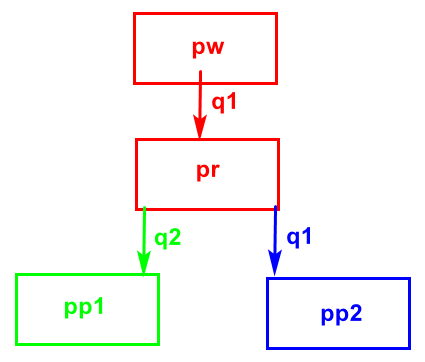

# python multiTasks

<!-- TOC -->

- [python multiTasks](#python-multitasks)
    - [about CPU](#about-cpu)
    - [`multiprocessing.Pool()`](#multiprocessingpool)
    - [processing communication](#processing-communication)
        - [Queue](#queue)
        - [pool Queue](#pool-queue)
    - [Thread](#thread)
    - [线程(tid) vs 进程(pid)](#%E7%BA%BF%E7%A8%8Btid-vs-%E8%BF%9B%E7%A8%8Bpid)
        - [利用lock来协调线程的顺序](#%E5%88%A9%E7%94%A8lock%E6%9D%A5%E5%8D%8F%E8%B0%83%E7%BA%BF%E7%A8%8B%E7%9A%84%E9%A1%BA%E5%BA%8F)
    - [Producer & Consumer](#producer--consumer)
    - [`threading.local()`](#threadinglocal)
    - [异步](#%E5%BC%82%E6%AD%A5)
    - [GIL](#gil)

<!-- /TOC -->

## about CPU

单核cpu的多任务机制：

- 时间片轮转(雨露均沾)
- 优先级调度(系统程序的优先级高)

[程序vs进程](http://blog.csdn.net/fuqin163/article/details/1546919)：

- 可执行的代码(一堆二进制代码)称为**程序**
- 正在运行的代码称为**进程**，一个进程，包括代码、数据和分配给进程的资源

[线程vs进程](https://www.cnblogs.com/tiankong101/p/4229584.html)

- 同样是对cpu的时间片切割，进程的时间片比较大；进程就是包换上下文切换的程序执行时间总和 =` CPU加载上下文+CPU执行+CPU保存上下文`，多进程就是cpu对多个进程的时间片雨露均沾；
- 线程就是对`cpu执行`那一段进行进一步的时间片的切割，多线程就是cpu对该进程中的多个线程的时间片雨露均沾；

一台电脑上的进程通信：

- 文件读写
- 命名管道(pipe)，无名管道
- 消息队列
- 内存映射

不在同一台电脑上面的就需要用到网络，网络的目的就在于进程通信；比如两个人的QQ通信，本质上是进程通信，只不过需要网络

```python
#fork炸弹, in linux
import os

while True:
    os.fork()
print("hahah")
```

## `multiprocessing.Pool()`

- apply_async(func[, args[, kwds]]) ：使用非阻塞方式调用func（并行执行，堵塞方式必须等待上一个进程退出才能执行下一个进程），args为传递给func的参数列表，kwds为传递给func的关键字参数列表；需要`join()`, 否则直接结束
- apply(func[, args[, kwds]])：使用阻塞方式调用func。可以不join()， 反正是串行。
- close()：关闭Pool，使其不再接受新的任务；
- terminate()：不管任务是否完成，立即终止；
- join()：主进程阻塞，等待子进程的退出， 必须在close或terminate之后使用；

进程池一开始就建立，最后才销毁，避免频繁分配，提高了效率；

> 线程用semaphore来锁定线程的数量，进程用pool或者barrier来锁定进程数量

> `imap()`比`map()`高效, [details](https://stackoverflow.com/questions/26520781/multiprocessing-pool-whats-the-difference-between-map-async-and-imap)

```python
import multiprocessing as mp

def func(x): return x**3

if __name__ == "__main__":
    data=range(10)
    po=mp.Pool() # 进程数目为cpu core的数目
    # res=po.map(func, data) # type is list
    res=po.imap(func, data) # type is IMapIterator, 不支持lambda expr
    for item in res:
        print(item, end=';') # 0;1;8;27;64;125;216;343;512;729;
```

```python
# Barrier进程锁定
import multiprocessing

def func(x, barrier):
    print(x, '*****')
    barrier.wait()
    print(x**3)

if __name__ == '__main__':
    b = multiprocessing.Barrier(3)
    p_list = []
    for i in range(10):
        p = multiprocessing.Process(target=func, args=(i, b))
        p.start()
        p_list.append(p)
    for p in p_list:
        p.join()
```

```bash
# output
2 *****
0 *****
3 *****
27
0
8
6 *****
5 *****
8 *****
512
125
216
1 *****
7 *****
4 *****
64
343
1
9 ***** # 凑够3个才能运行，所以这里卡住了
```

```python
from multiprocessing import Pool
import time


def func(name, x):
    print(f'{name} waits...')
    time.sleep(2)
    return x**3


if __name__ == '__main__':
    p = Pool()
    for i in range(5):
        res = p.apply_async(func, args=(f'process-{i}', i))
        print(res.get()) # 不要使用.get()因为会block进程，无法并行

    p.close()
    p.join()
```

```bash
# output
process-0 waits...
0
process-1 waits...
1
process-2 waits...
8
process-3 waits...
27
process-4 waits...
64
```

example: `apply_async()`收集结果

```python
from multiprocessing import Pool
import time


def func(name, x):
    print(f'{name} waits...')
    time.sleep(2)
    return x**3


if __name__ == '__main__':
    p = Pool()
    r_list=[]
    for i in range(5):
        res = p.apply_async(func, args=(f'process-{i}', i))
        r_list.append(res)
    p.close()
    p.join()
    for r in r_list:
        print(r.get(), end=';')
```

```bash
process-0 waits...
process-1 waits...
process-2 waits...
process-3 waits...
process-4 waits...
0;1;8;27;64;
```

```python
#这个必须要join，一般的multiprocessing不用，这个是pool，需要
import multiprocessing
import time
import os
import random


def worker(num):
    t_start = time.time()
    print(f'{multiprocessing.current_process().name} run {num}, pid={os.getpid()}')
    time.sleep(random.randint(1, 3))
    t_stop = time.time()
    print(f'{multiprocessing.current_process().name} finish{num} last {t_stop-t_start:.2}s')


if __name__ == '__main__':
    print(f'{multiprocessing.current_process().name} running, pid={os.getpid()}')
    po = multiprocessing.Pool(3)
    for i in range(5):
        po.apply_async(worker, args=(i,))
    #将任务添加进入pool的时候，没有阻塞
    #运行开始后，最开始有5-3个任务是阻塞的，如果之前的三个进程有两个运行完，会里面去执行剩下的两个任务
    #这个地方，子进程已经开始运行了
    print('---start---')
    po.close()
    po.join()
    print('---end---')
```

```bash
#output
MainProcess running, pid=5896
---start---
SpawnPoolWorker-3 run 0, pid=5520
SpawnPoolWorker-2 run 1, pid=6980
SpawnPoolWorker-1 run 2, pid=5712
SpawnPoolWorker-3 finish0 last 2.0s
SpawnPoolWorker-3 run 3, pid=5520
SpawnPoolWorker-1 finish2 last 2.0s
SpawnPoolWorker-1 run 4, pid=5712
SpawnPoolWorker-1 finish4 last 1.0s
SpawnPoolWorker-2 finish1 last 3.0s
SpawnPoolWorker-3 finish3 last 3.0s
---end---
```

```python
from multiprocessing import Pool
import os
import time


def worker(name):
    print(name, 'begins')
    time.sleep(1)
    print(name, 'ends')


if __name__ == '__main__':
    print('Main Process', os.getpid())
    p = Pool(4)
    for i in range(5):
        # apply_async的时候，进程已经开始
        p.apply_async(worker, args=(f'task-{i}',))

    p.close()  # join()之前必须有close(), close()之后不能apply了
    p.join()  # wait all subprocess to finish
    print('All subprocesses done.')
```

```bash
# output
Main Process 1528
task-0 begins
task-1 begins
task-2 begins
task-3 begins
task-0 ends
task-4 begins
task-1 ends
task-2 ends
task-3 ends
task-4 ends
All subprocesses done.
```

```python
#阻塞模式
import multiprocessing
import os,time,random

def worker(msg):
    t_start = time.time()
    print(f'{multiprocessing.current_process().name} start, pid={os.getpid()}')
    time.sleep(random.random()*2) #random.random()随机生成[0,1)之间的浮点数
    t_stop = time.time()
    print(f'{multiprocessing.current_process().name} end, last {t_stop-t_start}s')

def main():
    po=multiprocessing.Pool(3) #定义一个进程池，最大进程数3
    for i in range(5):
        po.apply(worker,(i,))

    print("----start----")
    po.close() #关闭进程池，关闭后po不再接收新的请求
    po.join() #等待po中所有子进程执行完成，必须放在close语句之后
    print("-----end-----")

if __name__ == '__main__':
    main()
```

```bash
#output
SpawnPoolWorker-1 start, pid=4128
SpawnPoolWorker-1 end, last 1.9540388584136963s
SpawnPoolWorker-3 start, pid=6940
SpawnPoolWorker-3 end, last 0.42764997482299805s
SpawnPoolWorker-2 start, pid=8856
SpawnPoolWorker-2 end, last 1.5248692035675049s
SpawnPoolWorker-1 start, pid=4128
SpawnPoolWorker-1 end, last 1.9222514629364014s
SpawnPoolWorker-3 start, pid=6940
SpawnPoolWorker-3 end, last 0.037207603454589844s
----start----
-----end-----
```

multiprocesing summary:

- fork()的主进程不会等待子进程，会出现孤儿进程；
- multiprocessing的主进程会等待子进程，但是要写main；
- multiprocessing.Pool的主进程不会等待进程池；
- threading的主线程会等待子线程；


进程数不是越多越好，因为切换的时间会变长，所以进程数是根据硬件配置已经用户情况来的；

- in linux, `fork()`
- multiprocessing.Process(), 指定target
- 继承multiprocesing.Process, 重写run方法
- multiprocessing.Pool()

压力测试：模拟10000个用户的点击，程序不挂，就通过了

## processing communication

### Queue

`Queue.put(item,[block[, timeout]])`：将item消息写入队列，block默认值为True；

- 如果block使用默认值，且没有设置timeout（单位秒），消息列队如果已经没有空间可写入，此时程序将被阻塞（停在写入状态）；如果设置了timeout，则会等待timeout秒，若还没空间，则抛出"Queue.Full"异常；
- 如果block值为False，消息列队如果没有空间可写入，则会立刻抛出"Queue.Full"异常；
- Queue.put_nowait(item)：相当Queue.put(item, False)；

`Queue.get([block[, timeout]])`：获取队列中的一条消息，然后将其从列队中移除，block默认值为True；

- 如果block使用默认值，且没有设置timeout（单位秒），消息列队如果为空，此时程序将被阻塞（停在读取状态）；如果设置了timeout，则会等待timeout秒，若还没读取到任何消息，则抛出"Queue.Empty"异常；
- 如果block值为False，消息列队如果为空，则会立刻抛；出"Queue.Empty"异常；
- Queue.get_nowait()：相当Queue.get(False)；

```python
import multiprocessing

q = multiprocessing.Queue(3)
q.put('message 1')
q.put('message 2')
print(q.full(), q.qsize())
q.put('message 3')
print(q.full(), q.qsize())
try:
    q.put('message 4', True, 1)
except:
    print(f'queue is full, now size={q.qsize()}')

try:
    q.put_nowait('message 5')
except:
    print(f'queue is full, now size={q.qsize()}')

if not q.full():
    q.put_nowait('message 6')

if not q.empty():
    for i in range(q.qsize()):
        print(q.get_nowait())
```

```bash
#output
False 2
True 3
queue is full, now size=3
queue is full, now size=3
message 1
message 2
message 3
```

多个Queue



```python
import multiprocessing
import os, time, random


def write(q1):
    for value in ['A', 'B', 'C']:
        print(f'{multiprocessing.current_process().name} Put {value} to queue...')
        q1.put(value)
        time.sleep(random.random())


def read(q1, q2, q3):
    while True:
        if not q1.empty():
            value = q1.get(True)
            q2.put(value)
            q3.put(value)
            print(f'{multiprocessing.current_process().name} Get {value} from queue.')
            time.sleep(random.random())
        else:
            break


def print_style1(q2):
    while True:
        if not q2.empty():
            value = q2.get(True)
            print(f'style1 print ---{value}---')
        else:
            break


def print_style2(q3):
    while True:
        if not q3.empty():
            value = q3.get(True)
            print(f'style2 print ***{value}***')
        else:
            break


if __name__ == '__main__':
    q1 = multiprocessing.Queue()  # 从pw到pr
    q2 = multiprocessing.Queue()  # 从pr到pp1
    q3 = multiprocessing.Queue()  # 从pr到pp2

    pw = multiprocessing.Process(target=write, args=(q1,))
    pr = multiprocessing.Process(target=read, args=(q1, q2, q3))
    pp1 = multiprocessing.Process(target=print_style1, args=(q2,))
    pp2 = multiprocessing.Process(target=print_style2, args=(q3,))
    #
    # write
    pw.start()
    pw.join()  # 这个地方就卡住了
    # read
    pr.start()
    pr.join()
    #
    pp1.start()
    pp2.start()
```

```bash
#output
Process-1 Put A to queue...
Process-1 Put B to queue...
Process-1 Put C to queue...
Process-2 Get A from queue.
Process-2 Get B from queue.
Process-2 Get C from queue.
style2 print ***A***
style1 print ---A---
style2 print ***B***
style1 print ---B---
style2 print ***C***
style1 print ---C---
```

### pool Queue

如果要使用Pool创建进程，就需要使用multiprocessing.Manager()中的Queue()，而不是multiprocessing.Queue()，否则会得到一条如下的错误信息：

RuntimeError: Queue objects should only be shared between processes through inheritance.

```python
import multiprocessing
import os, time, random


def writer(q):
    print(f'writer process{os.getpid()} start, parent process={os.getppid()}')
    for i in "grey":
        print(f'writer process{os.getpid()} put {i} in queue')
        q.put(i)


def reader(q):
    print(f'reader process{os.getpid()} start, parent process={os.getppid()}')
    for i in range(q.qsize()):
        print(f'reader process {os.getpid()} get {q.get()} for queue')


if __name__ == '__main__':
    print(f'main process {os.getpid()} begins!')
    q = multiprocessing.Manager().Queue()
    po = multiprocessing.Pool()
    # 要用同步的，否则发生争抢出错
    po.apply(writer, (q,))
    po.apply(reader, (q,))
    po.close()
    po.join()
    print('finished')
```

```bash
#output
main process 8400 begins!
writer process9688 start, parent process=8400
writer process9688 put g in queue
writer process9688 put r in queue
writer process9688 put e in queue
writer process9688 put y in queue
reader process8088 start, parent process=8400
reader process 8088 get g for queue
reader process 8088 get r for queue
reader process 8088 get e for queue
reader process 8088 get y for queue
finished
```

```python
#两个进程池, 每个进程池只有一个单一的功能
import multiprocessing
import os, time, random


def writer(q, data_str):
    print(f'writer process{os.getpid()} start')
    for i in data_str:
        time.sleep(random.random() * 2)
        print(f'writer process{os.getpid()} put {i} in queue')
        q.put(i)


def print_queue(q):
    # 故意进程池po2中的发生争抢
    # 即便是发生争抢，仍然能够完整打印所有的数据
    while True:
        if not q.empty():
            time.sleep(random.random() * 2)
            # 有可能发生，一个进程正在sleep,另一个进程掏空了q,然后而get()的block==True,导致阻塞
            print(f'process {os.getpid()} get {q.get_nowait()}')
        else:
            break


if __name__ == '__main__':
    q1 = multiprocessing.Manager().Queue()
    # 一个pool里面一般只做一件相同的事情
    po1 = multiprocessing.Pool(3)
    po1.apply_async(writer, (q1, "abc"))
    po1.apply_async(writer, (q1, "1234"))
    po1.apply_async(writer, (q1, "789"))
    po1.close()
    po1.join()
    # print data in two style, 结果在q1中
    po2 = multiprocessing.Pool(3)
    po2.apply_async(print_queue, (q1,))
    po2.apply_async(print_queue, (q1,))
    po2.apply_async(print_queue, (q1,))
    po2.close()
    po2.join()
    print('finished')
```

```bash
#output
writer process5956 start
writer process2356 start
writer process2060 start
writer process2060 put 1 in queue
writer process2356 put 7 in queue
writer process2060 put 2 in queue
writer process2060 put 3 in queue
writer process5956 put a in queue
writer process5956 put b in queue
writer process2356 put 8 in queue
writer process2060 put 4 in queue
writer process5956 put c in queue
writer process2356 put 9 in queue
process 3040 get 1
process 1760 get 7
process 3040 get 2
process 3040 get 3
process 2000 get a
process 1760 get b
process 1760 get 8
process 1760 get 4
process 3040 get c
process 2000 get 9
finished
```

先写核心功能，然后写进度条等次要的功能

```python
#Example: 多进程拷贝文件
import os
import multiprocessing


def copy_file(old_filename, new_filename):
    fr = open(old_filename, 'rb')
    fw = open(new_filename, 'wb')
    fw.write(fr.read())
    fr.close()
    fw.close()


def main():
    old_dir = 'res'
    new_dir = old_dir + '-copy'
    # mkdir
    os.mkdir(new_dir)
    # get old_dir
    file_list = os.listdir(old_dir)
    # using pool
    po = multiprocessing.Pool(8)
    for filename in file_list:
        po.apply_async(copy_file, (f'{old_dir}/{filename}', f'{new_dir}/{filename}'))
    po.close()
    po.join()


if __name__ == '__main__':
    main()
```

```python
#with progress bar
import os
import multiprocessing


def copy_file(old_filename, new_filename, q):
    fr = open(old_filename, 'rb')
    fw = open(new_filename, 'wb')
    fw.write(fr.read())
    fr.close()
    fw.close()
    q.put(new_filename)


def main():
    old_dir = 'res'
    new_dir = old_dir + '-copy'
    # mkdir
    os.mkdir(new_dir)
    # get old_dir
    # 没有文件夹没有递归
    file_list = os.listdir(old_dir)
    # using pool
    po = multiprocessing.Pool(8)
    q = multiprocessing.Manager().Queue()
    for filename in file_list:
        po.apply_async(copy_file, (f'{old_dir}/{filename}', f'{new_dir}/{filename}', q))
    po.close()
    # for progress bar
    num = 0
    all_num = len(file_list)
    while num < all_num:
        q.get()
        num += 1
        print(f'{num/all_num:>10.2%} finished')


if __name__ == '__main__':
    main()
```

## Thread


比方：多进程就是分配了多个方块(资源)，多线程就是生成了多个箭头(进行调度)

每一个进程里面有一个主线程，然后还可以生出子线程；

而且主线程会等待所有的子线程结束(前台线程)

```python
#查看thread数量
import threading
import time


def sing():
    for i in range(3):
        print(f'sing the {i} song')
        time.sleep(1)


def dance():
    for i in range(3):
        print(f'dance the {i} dancing')
        time.sleep(1)


if __name__ == '__main__':
    t1 = threading.Thread(target=sing)
    t2 = threading.Thread(target=dance)

    t1.start()
    t2.start()

    while True:
        # 统计线程数量
        length = len(threading.enumerate())
        print(f'current thread numbers={length}')
        if length <= 1:
            break
        time.sleep(0.5)
    t1.join()
    t2.join()
    print('finished')
```

```bash
#output
sing the 0 song
dance the 0 dancing
current thread numbers=3
current thread numbers=3
sing the 1 song
dance the 1 dancing
current thread numbers=3
current thread numbers=3
sing the 2 song
dance the 2 dancing
current thread numbers=3
current thread numbers=3
current thread numbers=2
current thread numbers=1
finished
```

## 线程(tid) vs 进程(pid)

主进程会等待子进程；主线程也会等待子线程；

- 子进程结束，父进程对其收尸之前，该子进程为**僵尸进程**
- 父进程结束，子进程没有结束，该子进程为**孤儿进程**
- 子线程结束，父线程对其收尸之前，该子线程为**僵尸线程**
- 父线程结束，子线程没有结束，该子进程为**孤儿线程**

```python
#linux 孤儿进程
import os, time
ret=os.fork()
if ret==0:
    print("son===")
    time.sleep(5)
    print("son over===")
else:
    print('father')
    time.sleep(1)
print('over')#父进程死了，子进程没有死，这个打印两遍
```

linux操作系统，pid=0的负责切换任务，pid=1负责直接间接生成进程；而pid=1是所有孤儿进程的收容所，处理孤儿进程；

- 进程是**系统**进行**资源分配和调度**的一个独立单位.
- 线程是进程的一个实体,是**CPU调度和分派**的基本单位,它是比进程更小的能独立运行的基本单位.线程自己基本上不拥有系统资源,只拥有一点在运行中必不可少的资源(如程序计数器,一组寄存器和栈),但是它可与同属一个进程的其他的线程共享进程所拥有的全部资源.

汇编、C可以不依赖操作系统而执行(单片机)；

线程和进程在使用上各有优缺点：线程执行开销小，但不利于资源的管理和保护；而进程正相反。[进程与线程的一个简单解释](http://www.ruanyifeng.com/blog/2013/04/processes_and_threads.html)

破解线程争抢：

- 原子变量：对一个变量值得读取修改回写变成一个不可打断的操作，保证数据准确；
- 锁：同步(协同)
- 轮询：永无休止的判断条件是否满足，效率低

```python
#method1 避免线程争抢：轮询
import threading
import time

g_num = 0
g_flag = 1

def test1():
    global g_num
    global g_flag
    if g_flag == 1:
        for i in range(1000000):
            g_num += 1
        g_flag = 0
    print("---test1---g_num=%d" % g_num)


def test2():
    global g_num
    # 轮询
    while True:
        if g_flag != 1:
            for i in range(1000000):
                g_num += 1
            break
    print("---test2---g_num=%d" % g_num)


p1 = threading.Thread(target=test1)
p2 = threading.Thread(target=test2)
p1.start()
p2.start()
p1.join()
p2.join()
print("---g_num=%d---" % g_num)
```

```bash
#output
---test1---g_num=1000000
---test2---g_num=2000000
---g_num=2000000---
```

```python
#method2: 互斥锁，用的是通知机制，不是轮询策略
#略，参见1.15
#加锁的策略，尽可能短的占用代码块，加锁加的越少越好；加锁代码块越小，多线程越明显；加锁代码块越大，单线程越明显；
```

修改全局变量才需要加锁，只读全局变量的时候，不用加锁；非共享的数据，不需要加锁；

- 不同的进程中，全局变量是各自的，函数中的局部变量也是各自的；
- 不同的线程中，全局变量是共享的，函数总的局部变量是各自的；

```python
#多个线程即便是用的同一个函数来执行任务，局部变量不共享
import threading
import time


def test(sleep_time):
    print(f'{threading.current_thread().name} running')
    num = 100
    time.sleep(sleep_time)
    num = num + 100
    print(f'num={num}')


thread1 = threading.Thread(target=test, args=(1,))
thread2 = threading.Thread(target=test, args=(3,))
thread1.start()
thread2.start()
```

```bash
#output
Thread-1 running
Thread-2 running
num=200
num=200
```

```python
#不同的thread对象，数据肯定是不共享的
import threading
import time


class MyThread(threading.Thread):
    def __init__(self, num, sleep_time):
        super().__init__()
        self.num = num
        self.sleep_time = sleep_time

    def run(self):
        print(f'{self.name} running')
        self.num += 100
        time.sleep(self.sleep_time)
        print(f'num={self.num}')


if __name__ == '__main__':
    thread1 = MyThread(100, 1)
    thread2 = MyThread(100, 3)
    thread1.start()
    thread2.start()
```

```bash
#output
Thread-1 running
Thread-2 running
num=200
num=200
```

```python
#同一个函数针对不同的thread进行处理,bad idea
import threading
import time


def test():
    thread_name = threading.current_thread().name
    print(f'{thread_name} running')
    num = 100
    if thread_name == "Thread-1":
        num += 100
    else:
        time.sleep(2)
    print(f'{thread_name}, num={num}')


if __name__ == '__main__':
    thread1 = threading.Thread(target=test)
    thread2 = threading.Thread(target=test)
    thread1.start()
    thread2.start()
```

```bash
#output
Thread-1 running
Thread-1, num=200
Thread-2 running
Thread-2, num=100
```

多线程共享数据：

- 全局变量
- 把list当作参数传入每个线程的函数中

锁的好处：确保了**某段关键代码**只能由一个线程从头到尾完整地执行
 
锁的坏处：

- 阻止了多线程并发执行，包含锁的某段代码实际上只能以单线程模式执行，效率就大大地下降了(可以把计算模块放在锁的外部，共享的时候才用到lock)
- 由于可以存在多个锁，不同的线程持有不同的锁，并试图获取对方持有的锁时，可能会造成死锁

解决死锁：

- 添加超时时间 `lock1.acquire(blocking=True, timeout=2)`
- 银行家算法，协调好顺序

### 利用lock来协调线程的顺序

- 同步：同步就是协同步调，按预定的先后次序进行运行
- 异步：先后执行顺序随机

```python
#三个线程打印123 123 123
import threading


def task1():
    for i in range(5):
        if lock1.acquire():
            print('1 ', end=',')
            lock2.release()


def task2():
    for i in range(5):
        if lock2.acquire():
            print('2 ', end=',')
            lock3.release()


def task3():
    for i in range(5):
        if lock3.acquire():
            print('3 ', end=',')
            lock1.release()


lock1 = threading.Lock()
lock2 = threading.Lock()
lock3 = threading.Lock()
thread1=threading.Thread(target=task1)
thread2=threading.Thread(target=task2)
thread3=threading.Thread(target=task3)
# 主线程获得lock2,lock3
lock2.acquire()
lock3.acquire()
#
thread1.start()
thread2.start()
thread3.start()
```

```bash
#output
1 ,2 ,3 ,1 ,2 ,3 ,1 ,2 ,3 ,1 ,2 ,3 ,1 ,2 ,3 ,
```

## Producer & Consumer

本质是在生产者和消费者之间架设缓冲(queue.Queue)，解决速度不匹配的问题；也可以解耦；

作为缓冲：队列、文件(读取完毕，立马删除)

```python
#线程的生产者-消费者模式；
#进程也可以用进程通信实现
import threading
import time

# #python2中
# from Queue import Queue
# python3中
from queue import Queue


class Producer(threading.Thread):
    def run(self):
        global queue
        count = 0
        while True:
            if queue.qsize() < 500:
                for i in range(100):
                    count += 1
                    msg = f'product-{count} by {self.name}!'
                    queue.put(msg)
                    print(msg)
            time.sleep(0.5)


class Consumer(threading.Thread):
    def run(self):
        global queue
        while True:
            if queue.qsize() > 100:
                for i in range(3):
                    msg = f'{self.name} consume "{queue.get()}"'
                    print(msg)
            time.sleep(1)


if __name__ == '__main__':
    queue = Queue()
    for i in range(100):
        #put对于数据类型没有要求
        queue.put(f'Initial product-{i}')
    for i in range(2):
        p = Producer()
        p.start()
    for i in range(5):
        c = Consumer()
        c.start()
```

## `threading.local()`

让函数使用外部的变量：

-  全局的方式
-  传入参数

让函数返回到外部：

- `return`
- 全局的方式

```python
#传入参数的方法， 写函数麻烦，发生了并发
import random
import threading
import time


class Student(object):
    def __init__(self, name):
        self.name = name


def do_task1(stu):
    time.sleep(random.random())
    print(f'stu={stu.name} say Hello')


def do_task2(stu):
    time.sleep(random.random())
    print(f'stu={stu.name} say Sorry')


def test(name):
    stu = Student(name)
    do_task1(stu)
    do_task2(stu)


if __name__ == '__main__':
    thread1 = threading.Thread(target=test, args=("grey",))
    thread2 = threading.Thread(target=test, args=("james",))
    thread3 = threading.Thread(target=test, args=("chris",))
    thread4 = threading.Thread(target=test, args=("moris",))
    thread1.start()
    thread2.start()
    thread3.start()
    thread4.start()
```

```bash
#output
stu=grey say Hello
stu=moris say Hello
stu=james say Hello
stu=chris say Hello
stu=grey say Sorry
stu=james say Sorry
stu=chris say Sorry
stu=moris say Sorry
```

```python
#全局变量法, 缺点是本质上没有并发，挨个挨个
import random
import threading
import time


class Student(object):
    def __init__(self, name):
        self.name = name


g_stu = None


def do_task1():
    time.sleep(random.random())
    print(f'stu={g_stu.name} say Hello')


def do_task2():
    time.sleep(random.random())
    print(f'stu={g_stu.name} say Sorry')


def test(name):
    global g_stu
    with mutex:
        g_stu = Student(name)
        do_task1()
        do_task2()


if __name__ == '__main__':
    mutex=threading.Lock()
    thread1 = threading.Thread(target=test, args=("grey",))
    thread2 = threading.Thread(target=test, args=("james",))
    thread3 = threading.Thread(target=test, args=("chris",))
    thread4 = threading.Thread(target=test, args=("moris",))
    thread1.start()
    thread2.start()
    thread3.start()
    thread4.start()
```

```bash
#output
stu=grey say Hello
stu=grey say Sorry
stu=james say Hello
stu=james say Sorry
stu=chris say Hello
stu=chris say Sorry
stu=moris say Hello
stu=moris say Sorry
```

传入参数比较麻烦，有多少变量要用，就要传多少；单纯用全局变量，有可能线程之间产生冲突，需要加锁；
所以折合一下，用的全局的dict

```python
#全局dict
import random
import threading
import time

class Student(object):
    def __init__(self, name):
        self.name = name


g_dict = {}


def do_task1():
    stu = g_dict[threading.current_thread().name]
    time.sleep(random.random())
    print(f'stu={stu.name} say Hello')


def do_task2():
    stu = g_dict[threading.current_thread().name]
    time.sleep(random.random())
    print(f'stu={stu.name} say Sorry')


def test(name):
    stu = Student(name)
    g_dict[threading.current_thread().name] = stu
    do_task1()
    do_task2()


if __name__ == '__main__':
    thread1 = threading.Thread(target=test, args=("grey",))
    thread2 = threading.Thread(target=test, args=("james",))
    thread3 = threading.Thread(target=test, args=("chris",))
    thread4 = threading.Thread(target=test, args=("moris",))
    thread1.start()
    thread2.start()
    thread3.start()
    thread4.start()
```

```bash
#output
stu=moris say Hello
stu=grey say Hello
stu=chris say Hello
stu=grey say Sorry
stu=moris say Sorry
stu=james say Hello
stu=chris say Sorry
stu=james say Sorry
```

更进一步，使用`threading.local()`,使得不同线程对同一个全局变量local_school的操作, 为不同线程提供独立的存储空间。

```python
import random
import threading
import time


class Student(object):
    def __init__(self, name):
        self.name = name

#全局的，类似g_dict
local_school = threading.local()


def do_task1():
    stu = local_school.stu
    time.sleep(random.random())
    print(f'stu={stu.name} say Hello')


def do_task2():
    stu = local_school.stu
    time.sleep(random.random())
    print(f'stu={stu.name} say Sorry')


def test(name):
    local_school.stu = Student(name) #不同线程虽然stu同名，但是变量相互对立，不会相互影响
    do_task1()
    do_task2()


if __name__ == '__main__':
    thread1 = threading.Thread(target=test, args=("grey",))
    thread2 = threading.Thread(target=test, args=("james",))
    thread3 = threading.Thread(target=test, args=("chris",))
    thread4 = threading.Thread(target=test, args=("moris",))
    thread1.start()
    thread2.start()
    thread3.start()
    thread4.start()
```

```bash
#output
stu=chris say Hello
stu=chris say Sorry
stu=moris say Hello
stu=moris say Sorry
stu=grey say Hello
stu=james say Hello
stu=grey say Sorry
stu=james say Sorry
```

```python
import threading

data = threading.local()  # data是一个object, 为每一个线程提供独立存储空间


def printData(func, x):
    data.x = x  # data动态绑定，线程独立
    print(threading.current_thread().name, data.x, id(data.x))
    for i in range(5):
        data.x = func(data.x)
        print(threading.current_thread().name, data.x, id(data.x))


threading.Thread(target=printData, args=(lambda x: x + 1, 1)).start()
threading.Thread(target=printData, args=(lambda y: y + '1', '1')).start()
```

```bash
#ouput
Thread-1 1 1485598176
Thread-1 2 1485598208
Thread-1 3 1485598240
Thread-1 4 1485598272
Thread-1 5 1485598304
Thread-1 6 1485598336
Thread-2 1 2589563256032
Thread-2 11 2589594063624
Thread-2 111 2589563601672
Thread-2 1111 2589594063624
Thread-2 11111 2589563601672
Thread-2 111111 2589594063624
```

## 异步

异步的好处：不用去等一个事件的发生，该干什么干什么，当发生的时候得到通知再去处理；

- 同步：同步就是协同步调，按预定的先后次序进行运行
- 异步：先后执行顺序随机

```python
#使用进程池多进程的例子
#解释回掉函数
#发生回掉的时候，主进程分出一个线程来进行回掉
import multiprocessing
import threading
import time


def test():
    process_thread_name = f'{multiprocessing.current_process().name},{threading.current_thread().name}'
    print(f'{process_thread_name} running')
    for i in range(3):
        print(f'---{i}---')
        time.sleep(1)
    print(f'{process_thread_name} end!')
    return f"{process_thread_name}'s result" #返回值给了test2


def test2(args):
    print(f'{multiprocessing.current_process().name},{threading.current_thread().name} call test2')
    print(f'test2 args={args}')


if __name__ == '__main__':
    po = multiprocessing.Pool(3)
    po.apply_async(func=test, callback=test2)
    po.close()
    po.join()  # 主进程卡在这里
    print(f'{multiprocessing.current_process().name},{threading.current_thread().name} end!')
```

如果调用callback的是子进程那么就毫无意义，因为完全可以直接在子进程中做；所以callback肯定是mainprocess调用的；

> callback的好处：  
> 方案1：主进程已经连接了数据库，那么子进程完成一个任务就callback一次，写log  
> 方案2：子进程完成一个任务，直接自己再连接数据库写入log  
> 采用方案1， 因为只需要连接一次数据库，不用子进程频繁连接数据库

```bash
#output
SpawnPoolWorker-1,MainThread running
---0---
---1---
---2---
SpawnPoolWorker-1,MainThread end!
MainProcess,Thread-3 call test2
test2 args=SpawnPoolWorker-1,MainThread's result
MainProcess,MainThread end!
```

```python
#用线程池ThreadPool来看
from multiprocessing.pool import ThreadPool
import multiprocessing
import threading
import time


def test():
    process_thread_name = f'{multiprocessing.current_process().name},{threading.current_thread().name}'
    print(f'{process_thread_name} running')
    for i in range(3):
        print(f'---{i}---')
        time.sleep(1)
    print(f'{process_thread_name} end!')
    return f"{process_thread_name}'s result"


def test2(args):
    print(f'{multiprocessing.current_process().name},{threading.current_thread().name} call test2')
    print(f'test2 args={args}')


if __name__ == '__main__':
    po = ThreadPool(3)
    po.apply_async(func=test, callback=test2)
    po.close()
    po.join()  # 主进程卡在这里
    print(f'{multiprocessing.current_process().name},{threading.current_thread().name} end!')
```

```bash
#output
MainProcess,Thread-1 running
---0---
---1---
---2---
MainProcess,Thread-1 end!
MainProcess,Thread-6 call test2
test2 args=MainProcess,Thread-1's result
MainProcess,MainThread end!
```

```bash
# callback用于汇总数据
from multiprocessing import Pool

def Foo(i):
    print(f'p-{i}')
    return i+100

def Bar(return_value):
    # Foo返回值作为Bar的参数
    print('return=', return_value)
    data.append(return_value)

if __name__ == '__main__':
    data = []
    pool = Pool(4)
    for i in range(6):
        pool.apply_async(func=Foo, args=(i,), callback=Bar)
    pool.close()
    pool.join()
    print(data)
```

```bash
# output
p-0
p-1
return= 100
p-2
return= 101
p-3
return= 102
p-4
return= 103
p-5
return= 104
return= 105
[100, 101, 102, 103, 104, 105]
```

前端会用到异步，比如网页局部刷新(Ajax)

## GIL

GIL: global interpreter lock(全局解释器锁)

GIL保证了，不论是多少个核，只有一个线程是占用cpu，也就是python的多线程是假的；

```python
#单核cpu的电脑, cpu一下占满了
#2核cpu的电脑，两个cpu分别占50%，用htop查看
while True:
    pass
```

```python
#单核cpu的电脑，两个死循环，肯定也是cpu占满
#2核cpu的电脑，两个cpu分别占50%，就是因为GIL
import threading

def test():
    while True:
        pass

thread1=threading.Thread()
thread1.start()

test()
```

```python
#可以用多进程破解这个问题
#两个cpu都占满了,所以多进程效率高
import multiprocessing

def test():
    while True:
        pass

process1=multiprocessing.Process()
process1.start()

test()
```

同用克服GIL:

- 能用线程的用进程解决，虽然通信费劲
- 用c语言写关键模块

```c
//用c语言来克服
//in linux
void DeadLoop()
{
    while(1)
    {
        ;
    }
}   
//gcc loop.c -shared -o libdeadloop.so
```

```python
#in linux
from ctypes import *
import threading

# 加载动态库
lib = cdll.LoadLibrary("./libdeadloop.so")

# 创建一个子线程，让其执行c语言的函数(死循环)
thread1 = threading.Thread(target=lib.DeadLoop)
thread1.start()

# 主线程也可以调用c的死循环
# lib.DeadLoop()
while True:
    pass
```
