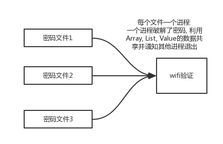
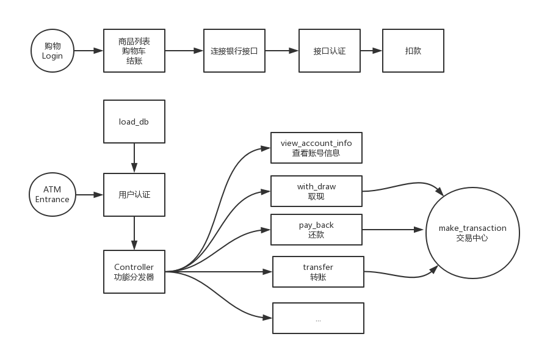

# Python Examples

<!-- TOC -->

- [Python Examples](#python-examples)
    - [Add number to image](#add-number-to-image)
    - [get random serial](#get-random-serial)
    - [count world](#count-world)
    - [batch change images's resolution](#batch-change-imagess-resolution)
    - [count code](#count-code)
    - [generate verify code](#generate-verify-code)
    - [network](#network)
        - [http request](#http-request)
        - [socket](#socket)
    - [python extending](#python-extending)
        - [python extending with c](#python-extending-with-c)
        - [python extending with .so file](#python-extending-with-so-file)
        - [python extending with c++](#python-extending-with-c)
        - [python extending with cython](#python-extending-with-cython)
    - [rename mulitiple files](#rename-mulitiple-files)
    - [wifi example](#wifi-example)
        - [windows wifi crack](#windows-wifi-crack)
        - [linux wifi crack](#linux-wifi-crack)
        - [another examples](#another-examples)
    - [print example](#print-example)
    - [progress bar](#progress-bar)
    - [start program](#start-program)
    - [python with office](#python-with-office)
    - [python with pdf](#python-with-pdf)
    - [sqlite3](#sqlite3)
    - [data](#data)
    - [SMTP](#smtp)
        - [simple email](#simple-email)
        - [email with attachment](#email-with-attachment)
    - [email with image](#email-with-image)

<!-- /TOC -->

## Add number to image

`conda install pillow`

```python
from PIL import Image, ImageFont, ImageDraw

im=Image.open('Pig.png')
# print(im.size)
draw=ImageDraw.Draw(im)

font_size=min(im.size)//5
# font=ImageFont.truetype(r'C:\Windows\Fonts\arial.ttf', font_size)
font=ImageFont.truetype('arial.ttf', font_size)

draw.text((im.size[0]-font_size, 0), '8', font=font, fill=(255,0,0))
im.save('modified.png', 'png')
```

## get random serial

Method1:

```python
import string, random

def get_random():
    # 返回字母与数字的随机组合，共4个字符
    return ''.join(random.sample(string.ascii_letters + string.digits, 4))

def concatenate(group):
    return '-'.join([get_random() for _ in range(group)])

def generate(N):
    return [concatenate(4) for _ in range(N)]

print(generate(3))
# ['QOk9-cMdw-B7Y3-ijsV', 'cofO-XYnZ-2nGs-idxW', 'LqsF-yVpI-uSGH-FCIp']
```

Method2: `pip install rstr`

```python
from rstr import xeger

def concatenate(group):
    return xeger(r'[A-Za-z0-9]{4}(-[A-Za-z0-9]{4})'+f'{{{group-1}}}')

def generate(N):
    return [concatenate(4) for _ in range(N)]

generate(3)
#['frjD-Mby3-QeXC-kRVp', 'bEjp-36b7-BUIh-gMib', 'PwEf-ndLn-nUI3-3jMe']
```

## count world

single file:

```python
import re
from collections import Counter

def get_word_frequency(file_path):
    regex=re.compile(r'[A-Za-z]+')
    with open(file_path) as file:
        words_list=regex.findall(file.read())
        print(words_list)
        # return Counter(words_list)
        # sort with freq
        return Counter(words_list).most_common()    

get_word_frequency('songLyric.txt')
```

multiple files:

```python
import re, os
from collections import Counter

def get_word_frequency(file_name):
    regex=re.compile(r'[A-Za-z]+')
    with open(file_name) as file:
        words_list=regex.findall(file.read())
        return Counter(words_list)

black_list=['the', 'in', 'of', 'and', 'to', 'has', 'that', 's' 'is', 'are', 'a', 'with', 'as', 'an', 'I']

def run(file_dir):
    os.chdir(file_dir)
    total_counter=Counter()
    
    for filename in os.listdir('.'):
        if filename.endswith('.txt'):
            total_counter+=get_word_frequency(filename)
    for word in black_list:
        total_counter[word]=0
    return total_counter.most_common()

run(r'D:\SomeLyrics')
```

## batch change images's resolution

```python
import os
from PIL import Image

def process_img(source_dir, dest_dir, filename, img_type):
    imtype='jpeg' if img_type=='.jpg' else 'png'
    im=Image.open(source_dir + filename)
    rate=max(im.size[0]/1920.0 if imsize[0]>1920 else 0, im.size[1]/1080.0 if imsize[1]>1080 else 0)
    if rate:
        im.thumbnail((im.size[0]/rate, im.size[1]/rate))
    im.save(dest_dir+file_name, imtype)

def run(file_dir, dest_dir):
    os.chdir(file_dir)
    for filename in os.listdir('.'):
        file_ext=os.path.splitext(filename)[1]
        if filename.endswith('.png') or filename.endswith('.jpg'):
            process_img(file_dir, dest_dir, file_name, file_ext)

run(r'D:\src_img', r'D:\dest_img')
```

## count code

```python
import os, re

def analyze_code(filename):
    """open a .py file, count all_lines, comment_lines, blank_lines"""
    total_lines, comment_lines, blank_lines = 0, 0, 0
    with open(filename) as file:
        lines = file.readlines()
        total_lines = len(lines)
        line_index = 0
        while line_index < total_lines:
            line = lines[line_index]
            if re.match(r'\s*#', line):
                comment_lines += 1
            elif re.match(r'\s*"""', line) or re.match(r"\s*'''", line):
                # 其中的""", '''也是注释
                comment_lines += 1
                while not re.match(r'.*"""', line) or not re.match(r".*'''", line):
                    line = lines[line_index]
                    comment_lines += 1
                    line_index += 1
            elif line == '\n':
                blank_lines += 1
            line_index += 1

        print(f'{filename} contains:')
        print(f'total lines:{total_lines}')
        print(f'comment lines: {comment_lines}, ratio={comment_lines/total_lines:.2%}')
        print(f'blank lines: {blank_lines}, ratio={blank_lines/total_lines:.2%}')
        return total_lines, comment_lines, blank_lines


def run(file_dir):
    os.chdir(file_dir)
    total_lines, comment_lines, blank_lines = 0, 0, 0
    for filename in os.listdir('.'):
        if filename.endswith('.py'):
            single_file = analyze_code(filename)
            total_lines += single_file[0]
            comment_lines += single_file[1]
            blank_lines += single_file[2]
    print(f'total lines:{total_lines}')
    print(f'comment lines: {comment_lines}, ratio={comment_lines/total_lines:.2%}')
    print(f'blank lines: {blank_lines}, ratio={blank_lines/total_lines:.2%}')            

run('D:\\pythonfiles')
```

## generate verify code

example1: simple code

```python
import random
checkcode = ''
for i in range(4):
    current = random.randrange(0,4)
    if current != i:
        temp = chr(random.randint(65,90))
    else:
        temp = random.randint(0,9)
    checkcode += str(temp)
print checkcode
```

example2: simple english code

```python
import string, random
from PIL import Image, ImageDraw, ImageFilter, ImageFont

def get_random_string():
    return [random.choice(string.ascii_letters+string.digits) for _ in range(4)]

def get_random_color():
    return (random.randint(30, 100), random.randint(30, 100),random.randint(30, 100))

def get_verify_code():
    width, height=240, 60
    im=Image.new('RGB', (width, height), (180, 180, 180))
    font=ImageFont.truetype('arial.ttf', 40)
    draw=ImageDraw.Draw(im)
    
    # add string
    code_string=get_random_string()
    for index, ch in enumerate(code_string):
        draw.text((60*index+10, 0), ch, font=font, fill=get_random_color())
    
    # add noise
    for _ in range(random.randint(1500, 3000)):
        draw.point((random.randint(0, width), random.randint(0, height)), fill=get_random_color())
    
    # blur image
    img=im.filter(ImageFilter.BLUR)
    
    # img.show()
    img.save(''.join(code_string)+'.png', 'png')

get_verify_code()
```

```python
# draw line
draw.line((0,0,50,100), fill=get_random_color())
# draw arc
draw.arc((0,0,50,50),0,360,fill=get_random_color())
```

example3: complex english code

```python
import string
import random
from PIL import Image, ImageDraw, ImageFilter, ImageFont

# another method draw text
def get_random_string(character_number):
    string_list = [random.choice(string.ascii_letters+string.digits)
                   for _ in range(character_number)]
    return ''.join(string_list)

def draw_random_line(draw, width, height):
    begin = (random.randint(0, width), random.randint(0, height))
    end = (random.randint(0, width), random.randint(0, height))
    draw.line([begin, end], fill=get_random_color(), width=3)

def get_random_color():
    return (random.randint(30, 100), random.randint(30, 100), random.randint(30, 100))

def get_verify_code():
    width, height = 240, 60
    # RGBA可以显示透明
    im = Image.new('RGBA', (width, height), (180, 180, 180))
    draw = ImageDraw.Draw(im)

    # draw text
    text = get_random_string(4)
    font = ImageFont.truetype('arial.ttf', 40)
    font_width, font_height = font.getsize(text)
    draw.text(((width-font_width)/2, (height-font_height)/2),
              text, font=font, fill=get_random_color())

    # draw lines
    line_numbers = random.randint(1, 6)
    for _ in range(line_numbers):
        draw_random_line(draw, width, height)

    # add noise
    for _ in range(random.randint(1500, 3000)):
        draw.point((random.randint(0, width), random.randint(
            0, height)), fill=get_random_color())

    # blur image
    img = im.filter(ImageFilter.BLUR)
    # transform
    image = img.transform((width+30, height+20),
                          Image.AFFINE,
                          (1, -0.5, 0, -0.2, 0.9, 0),
                          Image.BILINEAR)

    # img.show()
    image.save(''.join(text)+'.png', 'png')


get_verify_code()
```

example4: chinese code

```python
# 一般将常用字存在一个list，这种方法不推荐
def get_random_string(character_number):
    # 汉字unicode编码范围
    string_list = [chr(random.randint(0x4E00, 0x9FFF))
                   for _ in range(character_number)]
    return ''.join(string_list)

# 同时要修改为带有中文的字体
font = ImageFont.truetype('simfang.ttf', 40)
```

example5: 3rd captcha
> `pip install captcha`

```python
from captcha.image import ImageCaptcha

text='我和阿下'
image = ImageCaptcha(fonts=['simfang.ttf',])
image.write(text,'out.png')
```

## network

一般要么是基于原生socket请求, 要么就是http请求;

### http request

现在一般用的requests, 而不用urllib; [requests vs urllib](https://www.cnblogs.com/znyyy/p/7868511.html)

`pip install requests`

http中包含了get, post
- get: 下载得到网页的内容(地址栏上面)
- post: 提交表单给网站后台(F12, 在request里面)

### socket

高并发服务器一般用的是socket

```python
# tcp/ip server
import socket
# ip+port可以唯一确定互联网中的进程
myhost='' # 多个网卡的时候会绑定多个网卡
port=9990
# 第一参数是IP协议， 第二个参数是TCP协议
sock_obj=socket.socket(socket.AF_INET, socket.SOCK_STREAM)
sock_obj.bind((myhost, port))
sock_obj.listen(128) # 同时可以有128个

while True:
    conn, addr = sock_obj.accept()
    print(f'{addr} is online...')
    while True:
        data=conn.recv(1024).decode('gbk')
        print(data)
        if not data:
            break
        reply=('echo'+data).encode('gbk')
        conn.send(reply)
    conn.close()
```

要么使用[NetAssistant](http://www.cmsoft.cn/reslink.php?id=205)来连接上面的服务器， 要么使用Linux上面的`nc 222.29.69.149 9990`来连接

或者将上面的代码拷贝到阿里云服务器上: `scp myserver.py grey@39.106.18.97:/home/grey/`, 并且配置规则，允许端口;就可以作为服务器了

查看端口占用情况`netstat -apn|grep 999`

单客户端服务器(断开client的时候有bug)

```python
# python已经封装的服务器
from socketserver import TCPServer, BaseRequestHandler
# 出错处理
import traceback

class my_string_request_handler(BaseRequestHandler):
    def handle(self):
        while True:
            # 客户端端口时，抛出异常
            try:
                # 读取1024Bytes，去掉前后的空白
                data=self.request.recv(1024).strip()
                if not data:
                    break
                print(f'{self.client_address}: {data}')
                self.request.sendall(data.upper())
            except:
                traceback.print_exc()
                break

addr=('', 9990)
server=TCPServer(addr, my_base_request_handler)
server.serve_forever()
```

多客户端服务器(多线程并发服务器)

```python
from socketserver import ThreadingTCPServer, StreamRequestHandler
import traceback

class my_base_request_handler(StreamRequestHandler):
    def handle(self):
        while True:
            # 客户端端口时，抛出异常
            try:
                data=self.rfile.readline().strip()
                if not data:
                    break
                print(f'{self.client_address}: {data}')
                self.wfile.write(data.upper())
            except:
                traceback.print_exc()
                break

addr=('', 9990)
server=ThreadingTCPServer(addr, my_string_request_handler)
server.serve_forever()
```

## python extending

why:
- 性能
- 源代码的私密性

procedure:
- write c/c++ code
- python类型适配, 包装c/c++ code
- 编译、测试

一般网络开发: 业务逻辑， 性能计算， 存储(与数据库交互); 除了性能，其他用python都是极好的;

常考:字符串解析+数据结构算法(crud, sort)
- 字符串逆序
- 字符串查找子串
- crud, sort

### python extending with c

```bash
./
    fac.c
    facHead.h
    kkkwrapper.c
    setup.py
```

step1: write c/c++ code

```c
//fac.c
#include<stdio.h>
#include<stdlib.h>
#include<string.h>
int fac(int n)
{
   if(n<2)
       return 1;
   return n*fac(n-1);
}

//字符串反转
char *reverse(char *s)
{
  char t,*p=s,*q=(s+(strlen(s)-1));
  while(s && (p<q))
  {
   t=*p;
   *p++=*q;
   *q--=t;
  }
  return s;
}

int test(void)
//int main()
//main()是为了测试 gcc test.c -o testc
// ./testc
{
  char s[1024];
  printf("4!==%d\n",fac(4));
  printf("8!==%d\n",fac(8));

  strcpy(s,"mynameid kkk");
  printf("reversing,get '%s'\n",reverse(s));
  return 0;
}
```

step2: write header file

```c
//facHead.h
#ifndef KKK_H_
#define KKK_H_

int fac(int n);
char *reverse(char *s);
int test(void);

#endif
```

step3:手写包裹函数(包裹函数名不严格限制)

必须借助中间的东西才能访问c/c++库;
- `#include <Python.h>`
- 为每一个函数增加一个`PyObject *Module_func()`的包裹函数
- 为module增加一个PyMethod DefModuleMethods[]的数组
- 增加module的初始化函数`void initModule()`

```c
//kkkwrapper.c for python2
#include "facHead.h"
#include "Python.h"
#include <stdlib.h>
#include <string.h>

static PyObject *kkk_fac(PyObject *self,PyObject *args)
{
  int num;
  if(!PyArg_ParseTuple(args,"i",&num)) //python类型变成c类型
      return NULL;
  return (PyObject *)Py_BuildValue("i",fac(num));//c返回类型变成python类型
}

static PyObject *kkk_rever(PyObject *self,PyObject *args)
{
  char *src;
  char *mstr;
  PyObject *retVal;

  if(!PyArg_ParseTuple(args,"s",&src))
      return NULL;

  mstr=malloc(strlen(src)+1);
  strcpy(mstr,src);
  reverse(mstr);
  retVal=(PyObject *)Py_BuildValue("ss",src,mstr);
  free(mstr);

  return retVal;
}

static PyObject *kkk_test(PyObject *self,PyObject *args)
{
  test();
  return (PyObject *)Py_BuildValue("");
  //return Py_None;
}

static PyMethodDef kkkMethods[]=
{
  {"fac",kkk_fac,METH_VARARGS},
  {"rever",kkk_rever,METH_VARARGS},
  {"test",kkk_test,METH_VARARGS},
  {NULL,NULL},
};

//初始化操作
void initkkk(void)
{
  Py_InitModule("kkk",kkkMethods);
}
```

```c
//kkkwrapper.c for python3
#include "facHead.h"
#include "Python.h"
#include <stdlib.h>
#include <string.h>

static PyObject *kkk_fac(PyObject *self,PyObject *args)
{
  int num;
  if(!PyArg_ParseTuple(args,"i",&num))//python类型变成c类型
      return NULL;
  return (PyObject *)Py_BuildValue("i",fac(num));//c类型变成python类型
}

static PyObject *kkk_rever(PyObject *self,PyObject *args)
{
  char *src;
  char *mstr;
  PyObject *retVal;

  if(!PyArg_ParseTuple(args,"s",&src))
      return NULL;

  mstr=malloc(strlen(src)+1);
  strcpy(mstr,src);
  reverse(mstr);
  retVal=(PyObject *)Py_BuildValue("ss",src,mstr);
  free(mstr);

  return retVal;
}

static PyObject *kkk_test(PyObject *self,PyObject *args)
{
  test();
  return (PyObject *)Py_BuildValue("");
}
//==============================
static PyMethodDef kkkMethods[]=
{
  {"fac",kkk_fac,METH_VARARGS},
  {"rever",kkk_rever,METH_VARARGS},
  {"test",kkk_test,METH_VARARGS},
  {NULL,NULL},
};

static struct PyModuleDef kkk =
{
    PyModuleDef_HEAD_INIT,
    "kkk", //name of module
    "this is c/++ moudle for python",//module documentation, may be NULL
    -1,/* size of per-interpreter state of the module, or -1 if the module keeps state in global variables. */
    kkkMethods
};

//初始化操作
PyMODINIT_FUNC PyInit_kkk(void)
{
    return PyModule_Create(&kkk);
}
```

python与c/c++数据转换

格式代码|python类型|c类型
---|---|---
s|str|char *
z|str/None|char */NULL
i|int|int
l|long|long
c|str|char
d|float|double
D|complex|Py_Complex*
O|any|PyObject*
S|str|PyStringObject

step4: 编译安装到python环境

- 创建setup.py
- 运行setup.py编译、链接c的扩展代码
- import
- 测试

```python
# setup.py
from distutils.core import setup, Extension
module_name='kkk'
kkk_module=Extension(module_name, sources=['kkkwrapper.c', 'fac.c'])
setup(name=module_name,
      version='0.1.0',
      description='c/cpp module for python test',
      ext_modules=[kkk_module])
```

`python setup.py build`会生成**kkk.cpython-36m-x86_64-linux-gnu.so**文件; 将该文件拷贝到任意位置, 然后同目录下使用**ipython**测试

```python
# in ipython
import kkk
kkk.test()
kkk.fac(5)
kkk.rever('hello')
```

如果有需要的话, `python setup.py install`, 可以在任意位置`import kkk`; 或者发布给其他人
`python setup.py sdist`

>recommened: `pip install .`来代替`python setup.py install`

### python extending with .so file

```bash
./
    libfac.so
    facHead.h
    kkkwrapper.c
    setup.py
```

其中`gcc -o libfac.so -shared -fPIC fac.c`生成了`libfac.so`; 名字必须是lib开头;

并且`export LD_LIBRARY_PATH=.`

```python
# setup.py
from distutils.core import setup, Extension
module_name='kkk'
kkk_module=Extension(module_name,
                    sources=['kkkwrapper.c'],
                    libraries=["fac"],
                    library_dirs=["."])
setup(name=module_name,
      version='0.1.0',
      description='c/cpp module for python test',
      ext_modules=[kkk_module])
```

`python setup.py build`得到的`kkk.cpython-36m-x86_64-linux-gnu.so`; 将`kkk.cpython-36m-x86_64-linux-gnu.so`与`libfac.so`拷贝到当前目录， 才能用**ipython**

比较麻烦; 

>推荐做法是用`cdll.LoadLibrary()`, [tuturial](http://intermediate-and-advanced-software-carpentry.readthedocs.io/en/latest/c++-wrapping.html)

```python
from ctypes import cdll
kkk=cdll.LoadLibrary('./libfac.so') # 写上路径，否则不在当前目录查找
kkk.test()
```

### python extending with c++

pass

### python extending with cython

```bash
./
    facHead.h
    fac.c
    kkkwrapper.pyx
    setup.py
```

```python
# kkkwrapper.pyx
cdef extern from "facHead.h":
    int fac(int n)
    char* reverse(char* s)
    int test()


def rever_fn(s):
    return reverse(s)
def fac_fn(n):
    return fac(n)
def test_fn():
    return test()
```

```python
# setup.py
from distutils.core import setup
from distutils.extension import Extension
from Cython.Build import cythonize

ext_modules = [
    Extension("kkk",sources=["kkkwrapper.pyx", 'fac.c'],)
]

setup(name="kkk",ext_modules=cythonize(ext_modules))
```

```python
In []: import kkk

In []: kkk.fac_fn(5)
Out[]: 120

In []: kkk.test_fn()
4!==24
8!==40320
reversing,get 'kkk diemanym'

# cython严格区分string, bytes;
In []: kkk.rever_fn(b'hello')
Out[]: b'olleh'
```

## rename mulitiple files

```python
import os, re

# # method1
# regex=re.compile(r'wlm\d{4} ')

# for filename in os.listdir('.'):
#     if regex.match(filename):
#         os.rename(filename, filename[8:])

# method2:
for filename in os.listdir('.'):
    if filename.startswith('wlm'):
        os.rename(filename, filename[8:])
```

## wifi example

### windows wifi crack

`pip install pywifi`, `pip install pytest`

step1: test

```python
# 采用的pywifi的test case
"""
Test cases for pywifi.
"""

import pytest
import sys
import time
import platform
import logging

import pywifi
from pywifi import const

# 输出日志
pywifi.set_loglevel(logging.INFO)


def test_interfaces():
    wifi = pywifi.PyWiFi()

    assert wifi.interfaces()  # 抓取网卡接口

    if platform.system().lower() == 'windows':
        assert wifi.interfaces()[0].name() == \
               'Intel(R) Dual Band Wireless-AC 7260'
    elif platform.system().lower() == 'linux':
        assert wifi.interfaces()[0].name() == 'wlx000c433243ce'


def test_scan():
    wifi = pywifi.PyWiFi()  # 初始化wifi

    iface = wifi.interfaces()[0]  # 第一个无线网卡
    iface.scan()  # 扫描
    time.sleep(5)
    bsses = iface.scan_results()  # 扫描结果
    assert bsses

    # for obj in bsses:
    #     print(obj)  # 每一个wifi创建一个object


def test_add_network_profile():
    wifi = pywifi.PyWiFi()

    iface = wifi.interfaces()[0]

    profile = pywifi.Profile()
    profile.ssid = 'testap'
    profile.auth = const.AUTH_ALG_OPEN
    profile.akm.append(const.AKM_TYPE_WPA2PSK)
    profile.cipher = const.CIPHER_TYPE_CCMP
    profile.key = '12345678'

    iface.remove_all_network_profiles()

    assert len(iface.network_profiles()) == 0

    iface.add_network_profile(profile)
    profiles = iface.network_profiles()

    assert profiles is not None
    assert profiles[0].ssid == "testap"
    assert const.AKM_TYPE_WPA2PSK in profiles[0].akm
    assert const.AUTH_ALG_OPEN == profiles[0].auth


def test_status():
    wifi = pywifi.PyWiFi()

    iface = wifi.interfaces()[0]
    assert iface.status() in \
           [const.IFACE_DISCONNECTED, const.IFACE_INACTIVE]


def test_connect():
    wifi = pywifi.PyWiFi()

    iface = wifi.interfaces()[0]

    iface.disconnect()
    time.sleep(1)
    assert iface.status() in \
           [const.IFACE_DISCONNECTED, const.IFACE_INACTIVE]

    profile = pywifi.Profile()
    profile.ssid = 'Mi Phone'  # 用的手机热点
    profile.auth = const.AUTH_ALG_OPEN
    profile.akm.append(const.AKM_TYPE_WPA2PSK)
    profile.cipher = const.CIPHER_TYPE_CCMP
    profile.key = 'grey631331'

    iface.remove_all_network_profiles()
    tmp_profile = iface.add_network_profile(profile)

    iface.connect(tmp_profile)
    time.sleep(10)
    assert iface.status() == const.IFACE_CONNECTED

    iface.disconnect()
    time.sleep(1)
    assert iface.status() in \
           [const.IFACE_DISCONNECTED, const.IFACE_INACTIVE]


def test_disconnect():
    wifi = pywifi.PyWiFi()

    iface = wifi.interfaces()[0]
    iface.disconnect()

    assert iface.status() in \
           [const.IFACE_DISCONNECTED, const.IFACE_INACTIVE]


if __name__ == '__main__':
    # # 先测试扫描
    # test_scan()
    # 再开热点，测试连接
    test_connect()
```

step2: 核心代码
```python
import time
import pywifi
from pywifi import const


def test_scan():
    wifi = pywifi.PyWiFi()  # 初始化wifi

    iface = wifi.interfaces()[0]  # 第一个无线网卡
    iface.scan()  # 扫描
    time.sleep(5)
    bsses = iface.scan_results()  # 扫描结果

    for obj in bsses:
        print(obj, obj.ssid)  # 每一个wifi创建一个object


def test_connect():
    wifi = pywifi.PyWiFi()

    iface = wifi.interfaces()[0]

    iface.disconnect()
    time.sleep(1)

    profile = pywifi.Profile()
    profile.ssid = 'Mi Phone'  # 用的是手机热点
    profile.auth = const.AUTH_ALG_OPEN
    profile.akm.append(const.AKM_TYPE_WPA2PSK)
    profile.cipher = const.CIPHER_TYPE_CCMP
    profile.key = 'grey631331'

    iface.remove_all_network_profiles()
    tmp_profile = iface.add_network_profile(profile)

    iface.connect(tmp_profile)
    time.sleep(10)
    is_connected = False
    if iface.status() == const.IFACE_CONNECTED:
        is_connected = True
        print('connect success!')

    iface.disconnect()

    if is_connected:
        return is_connected

    time.sleep(1)
    if iface.status() in [const.IFACE_DISCONNECTED, const.IFACE_INACTIVE]:
        print('connect failed')

    return is_connected


if __name__ == '__main__':
    test_scan()
    # test_connect()
```

思路:
1. `test_scan`获取所有的ssid
1. 每一个密码文件一个进程，通过Array, List, Value进行进程通信; 有破解的通知其他进程退出
1. 密码读入list, 对list分段，多线程爆破;　有破解的通知其他线程推出



### linux wifi crack

虚拟机没有物理网卡，需要usb网卡;

windows vs linux wifi:
- windows每次需要建文件所以比linux慢
- windows有安全设定，会很慢

```python
# 这个windows上也能用,建议在linux上使用
from pywifi import *
import time
import sys


def scans(face, timeout):
    # 开始扫描
    face.scan()
    time.sleep(timeout)
    # 在若干秒后获取扫描结果
    return face.scan_results()


def go(i, face, x, key, ts):
    # 显示对应网络名称，考虑到部分中文名啧显示bssid
    showID = x.bssid if len(x.ssid) > len(x.bssid) else x.ssid
    print("wifiname", showID)
    # 迭代字典并进行爆破
    for n, k in enumerate(key):
        x.key = k.strip()
        # 移除所有热点配置
        face.remove_all_network_profiles()
        # 讲封装好的目标尝试连接
        face.connect(face.add_network_profile(x))
        # 初始化状态码，考虑到用0会发生些逻辑错误
        code = 10
        t1 = time.time()
        # 循环刷新状态，如果置为0则密码错误，如超时则进行下一个
        while code != 0:
            time.sleep(10)
            code = face.status()
            now = time.time() - t1
            if now > ts:
                break
            # print ("\r%-*s| %-*s| %s |%*.2fs| %-*s |  %-*s %*s-------"%(6,i,18,showID,code,5,now,7,x.signal,10,len(key)-n,10,k.replace("\n","")))
            # print "code=",code
            if code == 4:
                print("password----OK", n, k)
                face.disconnect()
                return "密码破解%-*s| %s | %*s |%*s\n" % (20, x.ssid, x.bssid, 3, x.signal, 15, k)
    return False


def main():
    # 扫描时常
    scantimes = 3
    # 单个密码测试延迟
    testtimes = 10
    keys = ["302....8", "grey631331", "12345678"]
    print("|KEYS %s" % (len(keys)))
    # 实例化一个pywifi对象
    wifi = PyWiFi()
    # 选择定一个网卡并赋值于iface
    iface = wifi.interfaces()[0]
    # 通过iface进行一个时常为scantimes的扫描并获取附近的热点基础配置
    scanres = scans(iface, scantimes)
    # 统计附近被发现的热点数量
    nums = len(scanres)
    print("|SCAN GET %s" % (nums))
    print("%s\n%-*s| %-*s| %-*s| %-*s | %-*s | %-*s %*s \n%s" % (
        "-" * 70, 6, "WIFIID", 18, "SSID OR BSSID", 2, "N", 4, "time", 7, "signal", 10, "KEYNUM", 10, "KEY", "=" * 70))
    # 将每一个热点信息逐一进行测试
    print("start")
    for i, x in enumerate(scanres):
        # 测试完毕后，成功的结果讲存储到files中
        try:
            res = go(nums - i, iface, x, keys, testtimes)
            print(res)
        except:
            print("触发异常")
    print("end")


main()
```

### another examples

模拟实现一个ATM + 购物商城程序

1. 额度 15000或自定义
1. 实现购物商城，买东西加入 购物车，调用信用卡接口结账
1. 可以提现，手续费5%
1. 每月22号出账单，每月10号为还款日，过期未还，按欠款总额 万分之5 每日计息
1. 支持多账户登录
1. 支持账户间转账
1. 记录每月日常消费流水
1. 提供还款接口
1. ATM记录操作日志 
1. 提供管理接口，包括添加账户、用户额度，冻结账户等。。。
1. 用户认证用装饰器

[Hint](https://github.com/triaquae/py3_training/tree/master/atm)



## print example

```python
def printStar(n):
    i=0
    while i<n:
        j=0
        while j<i:
            print("*",end='')
            j+=1
        print("")
        i+=1
    return

printStar(6)
```

```bash
# output
*
**
***
****
*****
```

```python
# 猜拳游戏
import random

while True:
    #player is a string
    str = input('请输入：剪刀(0)  石头(1)  布(2):')

    # or
    # num=int(player)
    player=eval(str)

    computerPlayer=random.randint(0,2)
    # for test
    # print("player=%d,computer=%d"%(player,computerPlayer))
    if ((player==0) and (computerPlayer==2)) or ((player==1) and (computerPlayer==0)) or ((player==2) and (computerPlayer==1)):
        print("you win")
        break
    elif player==computerPlayer:
        print("平局")
    else:
        print("failed")
```

## progress bar


```python
# tqdm module
from time import sleep
from tqdm import tqdm
for i in tqdm(range(10)):
    sleep(0.1)

# 100%|██████████████████████| 10/10 [00:01<00:00,  9.77it/s]
```

```python
import time, sys
N=10
for i in range(N):
    sys.stdout.write(f'\r{(i+1)/N:.2%}')
    time.sleep(0.1)

# 85.00%
```

```python
import time, sys
N=10
for i in range(N):
    sys.stdout.write(f'\r{i+1}/{N}')
    time.sleep(0.1)

# 7/10
```

## start program

```python
# method1: startfile
import os

os.startfile(r"D:\Cent\chrome.exe")

# method2: system
os.system(r"D:\Cent\chrome.exe")

# method3: openbrowser
import webbrowser
webbrowser.open("https://www.baidu.com")
```

## python with office

`pip install python-docx`

读写Office文档(word, exce, powerpoint):
- 官方COM接口: 能够使用到几乎Office所有的功能，并且由于COM的跨语言特性，知识迁移非常容易；缺点在于仅限于Windows + Office平台，操作系统和软件缺一不可
- 直接读写接口: 优点在于跨平台，只要Python能够支持的平台基本上都可以，不需要Windows也不需要Office软件；缺点在于只能够使用一些基本的功能

> 采用官方COM接口: `pywin32`+MSDN;  
> 采用直接读写接口: ...

example1: read docx

```python
from docx import Document

def read_full_text(filename):
    doc=Document(filename)
    
    full_text=[]
    for p in doc.paragraphs:
        full_text.append(p.text)
    return '\n'.join(full_text)

print(read_full_text('doc1.docx'))
```

```python
def read_full_text(filename):
    doc=Document(filename)
    
    full_text=[]
    for p in doc.paragraphs:
        full_text.append(f'  {p.text}') # 每行缩进两个空格
    return '\n\n'.join(full_text) # 行间空格
```

example2: write docx

```python
from docx import Document

# new a file
doc=Document()
doc.add_paragraph('This is 1st paragraph')
p_obj1=doc.add_paragraph('This is 2nd paragraph')
p_obj2=doc.add_paragraph('This is 3rd paragraph')
p_obj1.add_run('behind p_obj1')
doc.save('doc2.docx')
```

example3: read xlsx

```python
import xlrd

wb = xlrd.open_workbook('filename.xlsx')
sheet = wb.sheet_by_name('Sheet1')
data_list = sheet.col_values(0) # 第一列的数据
```

## python with pdf

`pip install pypdf2`

```python
import PyPDF2

pdfFileObj = open('meetingminutes.pdf', 'rb')
pdfReader = PyPDF2.PdfFileReader(pdfFileObj)
pdfReader.numPages
pageObj = pdfReader.getPage(0)
pageObj.extractText()
```

## sqlite3

example1: create sqlite3 db & create table

```python
import sqlite3
from sqlite3 import Error

def create_connection(db_file):
    """ create a database connection to a SQLite database """
    try:
        conn = sqlite3.connect(db_file)
        return conn
    except Error as e:
        print(e)

def creat_table(conn, sql):
    try:
        c=conn.cursor()
        c.execute(sql)
    except Error as e:
        print(e)

# 下面一长串代码可以在Navicat中复制得到
sql_create_tb1='''CREATE TABLE "FunderManage" (
  "id" INTEGER NOT NULL,
  "FundManagerName" text NOT NULL,
  "EstablishedDate" TEXT NOT NULL,
  "ManageScale" TEXT NOT NULL,
  "RegisterAddr" TEXT NOT NULL,
  "FundNumber" text NOT NULL,
  "RegisterMoney" TEXT NOT NULL,
  "Shareholder" TEXT NOT NULL,
  "FundName" TEXT NOT NULL,
  "FundScale" TEXT NOT NULL,
  "FundDuration" TEXT NOT NULL,
  "FundRegisterAddr" TEXT NOT NULL,
  "ManagementFee" TEXT NOT NULL,
  "IncomeDistribution" TEXT NOT NULL,
  "GPPromised" TEXT NOT NULL,
  "MinimunMoney" TEXT NOT NULL,
  "CoreMemberCollaboration" TEXT NOT NULL,
  "InvestStrategy" TEXT,
  "InvestStage" TEXT NOT NULL,
  "InvestIndustry" TEXT NOT NULL,
  "RecruitmentWin" TEXT,
  "RecruitmentMoney" TEXT,
  "RecruitmentSum" TEXT NOT NULL,
  " InvestmentMeeting" TEXT NOT NULL,
  "RiskCtrlSystem" TEXT NOT NULL,
  "InvestedManagement" TEXT NOT NULL,
  "IncentiveMechanism" TEXT NOT NULL,
  "FundHighlight" TEXT NOT NULL,
  "Suggestion" TEXT,
  PRIMARY KEY ("id")
);'''

database='FangYuan.db'
conn=create_connection(database)
if conn:
    creat_table(conn, sql_create_tb1)
else:
    print('Error')
conn.close()
```

example2: docx with sqlite3

```bash
./
    FangDB.py
    MyProcessing.py
```

```python
# FangDB.py
import sqlite3
from sqlite3 import Error

sql_create_tb1 = '''CREATE TABLE "FunderManage" (
  "id" INTEGER NOT NULL,
  "FundManagerName" text NOT NULL,
  "EstablishedDate" TEXT NOT NULL,
  "ManageScale" TEXT NOT NULL,
  "RegisterAddr" TEXT NOT NULL,
  "FundNumber" text NOT NULL,
  "RegisterMoney" TEXT NOT NULL,
  "Shareholder" TEXT NOT NULL,
  "FundName" TEXT NOT NULL,
  "FundScale" TEXT NOT NULL,
  "FundDuration" TEXT NOT NULL,
  "FundRegisterAddr" TEXT NOT NULL,
  "ManagementFee" TEXT NOT NULL,
  "IncomeDistribution" TEXT NOT NULL,
  "GPPromised" TEXT NOT NULL,
  "MinimunMoney" TEXT NOT NULL,
  "CoreMemberCollaboration" TEXT NOT NULL,
  "InvestStrategy" TEXT,
  "InvestStage" TEXT NOT NULL,
  "InvestIndustry" TEXT NOT NULL,
  "RecruitmentWin" TEXT,
  "RecruitmentMoney" TEXT,
  "RecruitmentSum" TEXT NOT NULL,
  "InvestmentMeeting" TEXT NOT NULL,
  "RiskCtrlSystem" TEXT NOT NULL,
  "InvestedManagement" TEXT NOT NULL,
  "IncentiveMechanism" TEXT NOT NULL,
  "FundHighlight" TEXT NOT NULL,
  "Suggestion" TEXT,
  PRIMARY KEY ("id")
);'''
sql_create_tb2 = '''CREATE TABLE "CoreMember" (
  "id" INTEGER NOT NULL,
  "main_id" INTEGER NOT NULL,
  "Name" TEXT NOT NULL,
  "Position" TEXT NOT NULL,
  "EngagedDate" TEXT NOT NULL,
  "Resume" TEXT NOT NULL,
  PRIMARY KEY ("id")
);'''
sql_create_tb3 = '''CREATE TABLE "HistoryGrade" (
  "id" INTEGER NOT NULL,
  "main_id" INTEGER NOT NULL,
  "Name" TEXT NOT NULL,
  "Established" TEXT NOT NULL,
  "Scale" TEXT NOT NULL,
  "Reward" TEXT NOT NULL,
  "ExpectedReward" TEXT NOT NULL,
  "IRR" TEXT NOT NULL,
  "MOC" TEXT NOT NULL,
  "DPI" TEXT NOT NULL,
  PRIMARY KEY ("id")
);'''
sql_create_tb4 = '''CREATE TABLE "HistoryExample" (
  "id" INTEGER NOT NULL,
  "main_id" INTEGER NOT NULL,
  "Company" TEXT NOT NULL,
  "InvestDate" TEXT NOT NULL,
  "InitInvestStage" TEXT NOT NULL,
  "InitInvestMoney" TEXT NOT NULL,
  "CurrentValuation" TEXT NOT NULL,
  "RewareRatio" TEXT NOT NULL,
  "IRR" TEXT,
  "Industry" TEXT NOT NULL,
  "Location" TEXT NOT NULL,
  "Notes" TEXT NOT NULL,
  PRIMARY KEY ("id")
);'''
sql_create_tb5 = '''CREATE TABLE "Reserve" (
  "id" INTEGER NOT NULL,
  "main_id" INTEGER NOT NULL,
  "Company" TEXT NOT NULL,
  "InvestData" TEXT NOT NULL,
  "InvestStage" TEXT NOT NULL,
  "InvestMoney" TEXT NOT NULL,
  "InvestValuation" TEXT NOT NULL,
  "Industry" TEXT NOT NULL,
  "InBeijing" TEXT NOT NULL,
  "Notes" TEXT,
  PRIMARY KEY ("id")
);'''
sql_create_tb6 = '''CREATE TABLE "Recruitment" (
  "id" INTEGER NOT NULL,
  "main_id" INTEGER NOT NULL,
  "Name" TEXT NOT NULL,
  "Type" TEXT NOT NULL,
  "Money" TEXT NOT NULL,
  "Process" TEXT NOT NULL,
  "Notes" TEXT,
  PRIMARY KEY ("id")
);'''


def create_connection(db_file):
    """ create a database connection to a SQLite database """
    try:
        conn = sqlite3.connect(db_file)
        return conn
    except Error as e:
        print(e)
    return None


def creat_table(conn, sql):
    '''create a table in database connection'''
    try:
        c = conn.cursor()
        c.execute(sql)
    except Error as e:
        print(e)


def create_db_tb(database):
    '''create database with 6 tables'''
    conn = create_connection(database)
    if conn:
        creat_table(conn, sql_create_tb1)
        creat_table(conn, sql_create_tb2)
        creat_table(conn, sql_create_tb3)
        creat_table(conn, sql_create_tb4)
        creat_table(conn, sql_create_tb5)
        creat_table(conn, sql_create_tb6)
    else:
        print('Create Tables error')
    return conn


def insert_funder_manage(conn, data):
    '''insert FunderManage'''
    sql = ''' INSERT INTO FunderManage(FundManagerName,EstablishedDate,ManageScale,RegisterAddr,FundNumber,RegisterMoney,
              Shareholder,FundName,FundScale,FundDuration,FundRegisterAddr,ManagementFee,
              IncomeDistribution,GPPromised,MinimunMoney,CoreMemberCollaboration,InvestStrategy,
              InvestStage,InvestIndustry,RecruitmentWin,RecruitmentMoney,RecruitmentSum,
              InvestmentMeeting,RiskCtrlSystem,InvestedManagement,IncentiveMechanism,FundHighlight,Suggestion)
              VALUES(?,?,?,?,?,?,?,?,?,?,?,?,?,?,?,?,?,?,?,?,?,?,?,?,?,?,?,?) '''
    cur = conn.cursor()
    cur.execute(sql, data)
    return cur.lastrowid


def insert_core_members(conn, members):
    '''insert core_member'''
    sql = ''' INSERT INTO CoreMember(main_id, Name, Position, EngagedDate, Resume)
              VALUES(?,?,?,?,?) '''
    cur = conn.cursor()
    cur.executemany(sql, members)
    return cur.lastrowid


def insert_history_grade(conn, grades):
    '''insert history grade'''
    sql = ''' INSERT INTO HistoryGrade(main_id,Name,Established,Scale,Reward,ExpectedReward,IRR,MOC,DPI)
              VALUES(?,?,?,?,?,?,?,?,?) '''
    cur = conn.cursor()
    cur.executemany(sql, grades)
    return cur.lastrowid


def insert_history_examples(conn, examples):
    '''insert history examples'''
    sql = ''' INSERT INTO HistoryExample(main_id,Company,InvestDate,InitInvestStage,InitInvestMoney,CurrentValuation,RewareRatio,IRR,Industry,Location,Notes)
              VALUES(?,?,?,?,?,?,?,?,?,?,?) '''
    cur = conn.cursor()
    cur.executemany(sql, examples)
    return cur.lastrowid


def insert_reserve(conn, reserves):
    '''insert reserve'''
    sql = ''' INSERT INTO Reserve(main_id,Company,InvestData,InvestStage,InvestMoney,InvestValuation,Industry,InBeijing,Notes)
              VALUES(?,?,?,?,?,?,?,?,?) '''
    cur = conn.cursor()
    cur.executemany(sql, reserves)
    return cur.lastrowid


def insert_recruitment(conn, recruitments):
    '''insert recruitment'''
    sql = ''' INSERT INTO Recruitment(main_id,Name,Type,Money,Process,Notes)
              VALUES(?,?,?,?,?,?) '''
    cur = conn.cursor()
    cur.executemany(sql, recruitments)
    return cur.lastrowid
```

```python
# MyProcessing.py
import os
import csv
from docx import Document
import FangDB


def iter_uqique_cell(row):
    '''generate cells in row sipping duplicated one'''
    prior_tc = None
    for cell in row.cells:
        this_tc = cell._tc
        if this_tc is prior_tc:
            continue
        prior_tc = this_tc
        yield cell


def get_docx_list():
    docx_list = []
    for filename in os.listdir('./Docx'):
        if filename.endswith('.docx'):
            docx_list.append(filename)
    return docx_list


def read_docx(filename):
    '''read docx: filename to a list'''
    doc = Document(filename)
    t1 = doc.tables[0]
    all_cells = []
    for row in t1.rows:
        for cell in iter_uqique_cell(row):
            all_cells.append(cell.text.strip())
    return all_cells


def cells2database(all_cells, conn):
    '''insert all_cells to database'''
    # 1.基金管理人基本信息
    FundManagerName = all_cells[2]
    EstablishedDate = all_cells[4]
    ManageScale = all_cells[6]
    RegisterAddr = all_cells[8]
    FundNumber = all_cells[10]
    RegisterMoney = all_cells[12]
    Shareholder = all_cells[14]

    # 2.基金基本条款
    FundName = all_cells[17]
    FundScale = all_cells[19]
    FundDuration = all_cells[21]
    FundRegisterAddr = all_cells[23]
    ManagementFee = all_cells[25]
    IncomeDistribution = all_cells[27]
    GPPromised = all_cells[29]
    MinimunMoney = all_cells[31]

    # 3.核心成员
    start_index = all_cells.index('名字')+4
    end_index = all_cells.index('核心团队合作情况')
    core_members = all_cells[start_index: end_index]
    CoreMemberCollaboration = all_cells[end_index+1]

    # 4.投资策略
    start_index = all_cells.index('投资策略')
    InvestStrategy = all_cells[start_index+1]
    InvestStage = all_cells[start_index+3]
    InvestIndustry = all_cells[start_index+5]

    # 5.历史业绩
    start_index = all_cells.index('5、历史业绩')+9
    end_index = all_cells.index('6、历史投资项目举例')
    history_grade = all_cells[start_index: end_index]

    # 6.历史投资项目举例
    start_index = all_cells.index('6、历史投资项目举例')+11
    end_index = all_cells.index('7、储备项目')
    history_example = all_cells[start_index: end_index]

    # 7. 储备项目
    start_index = all_cells.index('7、储备项目')
    end_index = all_cells.index('8、融资情况')
    reserve = all_cells[start_index+9: end_index]

    # 8.融资情况
    start_index = all_cells.index('8、融资情况')
    RecruitmentWin = all_cells[start_index+2]
    RecruitmentMoney = all_cells[start_index+4]
    end_index = all_cells.index('合计：')
    recruitment = all_cells[start_index+10: end_index]
    # RecruitmentSum=all_cells[end_index+1: end_index+5]
    RecruitmentSum = all_cells[end_index+2]

    # 9.风控以及中后台
    start_index = all_cells.index('9、风控以及中后台')
    InvestmentMeeting = all_cells[start_index+2]
    RiskCtrlSystem = all_cells[start_index+4]
    InvestedManagement = all_cells[start_index+6]

    # 10. 收益分配及激励机制
    IncentiveMechanism = all_cells[start_index+8]

    # 11.基金主要亮点
    FundHighlight = all_cells[start_index+10]

    # 12.管理机构合作建议
    Suggestion = all_cells[start_index+12]

    # write to dabase
    data = (FundManagerName, EstablishedDate, ManageScale, RegisterAddr, FundNumber, RegisterMoney,
            Shareholder, FundName, FundScale, FundDuration, FundRegisterAddr, ManagementFee,
            IncomeDistribution, GPPromised, MinimunMoney, CoreMemberCollaboration, InvestStrategy,
            InvestStage, InvestIndustry, RecruitmentWin, RecruitmentMoney, RecruitmentSum,
            InvestmentMeeting, RiskCtrlSystem, InvestedManagement, IncentiveMechanism, FundHighlight, Suggestion)

    with conn:
        data_id = FangDB.insert_funder_manage(conn, data)

        members = [(data_id,)+tuple(core_members[i: i+4])
                   for i in range(0, len(core_members), 4)]
        grades = [(data_id,)+tuple(history_grade[i: i+8])
                  for i in range(0, len(history_grade), 8)]
        examples = [(data_id,)+tuple(history_example[i: i+10])
                    for i in range(0, len(history_example), 10)]
        reserves = [(data_id,)+tuple(reserve[i: i+8])
                    for i in range(0, len(reserve), 8)]
        recruitments = [(data_id,)+tuple(recruitment[i: i+5])
                        for i in range(0, len(recruitment), 5)]

        FangDB.insert_core_members(conn, members)
        FangDB.insert_history_grade(conn, grades)
        FangDB.insert_history_examples(conn, examples)
        FangDB.insert_reserve(conn, reserves)
        FangDB.insert_recruitment(conn, recruitments)


def write_csv(conn):
    sql = '''SELECT FunderManage.FundManagerName,
    FunderManage.EstablishedDate,
    FunderManage.ManageScale,
    FunderManage.RegisterAddr,
    FunderManage.FundNumber,
    FunderManage.RegisterMoney,
    FunderManage.Shareholder,
    FunderManage.FundName,
    FunderManage.FundScale,
    FunderManage.FundDuration,
    FunderManage.FundRegisterAddr,
    FunderManage.ManagementFee,
    FunderManage.IncomeDistribution,
    FunderManage.GPPromised,
    FunderManage.MinimunMoney,
    CoreMember.Name, CoreMember.Position, CoreMember.EngagedDate,CoreMember.Resume,
    FunderManage.CoreMemberCollaboration,
    FunderManage.InvestStrategy,
    FunderManage.InvestStage,
    FunderManage.InvestIndustry,
    HistoryGrade.Name,HistoryGrade.Established,HistoryGrade.Scale,HistoryGrade.Reward,HistoryGrade.ExpectedReward,HistoryGrade.IRR,HistoryGrade.MOC,HistoryGrade.DPI,
    HistoryExample.Company,HistoryExample.InvestDate,HistoryExample.InitInvestStage,HistoryExample.InitInvestMoney,HistoryExample.CurrentValuation,HistoryExample.RewareRatio,HistoryExample.IRR,HistoryExample.Industry,HistoryExample.Location,HistoryExample.Notes,
    Reserve.Company,Reserve.InvestData,Reserve.InvestStage,Reserve.InvestMoney,Reserve.InvestValuation,Reserve.Industry,Reserve.InBeijing,Reserve.Notes,
    FunderManage.RecruitmentWin,
    FunderManage.RecruitmentMoney,
    Recruitment.Name,Recruitment.Type,Recruitment.Money,Recruitment.Process,Recruitment.Notes,
    FunderManage.RecruitmentSum,
    FunderManage.InvestmentMeeting,FunderManage.RiskCtrlSystem,FunderManage.InvestedManagement,
    FunderManage.IncentiveMechanism,
    FunderManage.FundHighlight,
    FunderManage.Suggestion
    FROM FunderManage
    LEFT JOIN CoreMember ON CoreMember.main_id=FunderManage.id
    LEFT JOIN HistoryGrade ON HistoryGrade.main_id=FunderManage.id
    LEFT JOIN HistoryExample ON HistoryExample.main_id=FunderManage.id
    LEFT JOIN Reserve ON Reserve.main_id=FunderManage.id
    LEFT JOIN Recruitment ON Recruitment.main_id=FunderManage.id'''
    cur = conn.cursor()
    output = cur.execute(sql)
    with open('output.csv', 'w',encoding='utf8', newline='') as file:
        writer = csv.writer(file,delimiter=';')
        writer.writerows(output)


def main():
    # create connection and tables
    conn = FangDB.create_db_tb('FangYuan.db')

    # open docxs in current dir
    docx_list = get_docx_list()
    for index, docx in enumerate(docx_list):
        all_cells = read_docx(f'./Docx/{docx}')
        print('success',index, docx)
        try:
            cells2database(all_cells, conn)
        except Exception as e:
            print('failed',docx, e)
            with open('error.log', 'a', encoding='utf8') as file:
                file.write(f'{docx} format error\n')

    # # write to csv
    # write_csv(conn)

    # close conn
    conn.close()
    # # remove .db file
    # os.remove('FangYuan.db')


if __name__ == '__main__':
    main()
```

example3: sqlalchemy with pandas

Anaconda默认自带`sqlalchemy`

```python
import pandas as pd
from sqlalchemy import create_engine

engine=create_engine('sqlite:///test.db')
df = pd.DataFrame({'name' : ['User 1', 'User 2', 'User 3'], 'age':[20, 26, 22]})
df.append({'name':'james', 'age':29}, ignore_index=True)
print(df)

# dataframe to table
df.to_sql('table_name', con=engine, if_exists='append', index_label='id')
```

```bash
# result
    name    age
0   User1   20
1   User2   26
2   User3   22
3   james   29
```

## data

[新浪财经](https://www.jianshu.com/p/172214aa5961), [一些接口](https://blog.csdn.net/luanpeng825485697/article/details/78442062)

可以利用之前在东方财富网弄到的股票代码来遍历这些接口；

## SMTP

### simple email

```python
# plain email
import smtplib
from email.mime.text import MIMEText

sender = 'vip.gewei@foxmail.com'
receivers = ['gewei@pku.edu.cn', 'pku_gewei@163.com']

msg = MIMEText('This is my content!')
msg['From'] = f'Wei Ge<{sender}>'  # Wei Ge表示显示的名字
msg['To'] = ';'.join(receivers)
msg['Subject'] = 'This is subject'

try:
    mail_server = smtplib.SMTP_SSL()
    mail_server.connect('smtp.qq.com', 465)
    # # 或者采用
    # mail_server=smtplib.SMTP()
    # mail_server.connect('smtp.qq.com', 25)

    user_name = sender
    user_pwd = 'xxxxxxxxxx'
    mail_server.login(user_name, user_pwd)

    mail_server.sendmail(sender, receivers, msg.as_bytes())
except Exception as e:
    print('send mail failed:', e)
else:
    print('send mail success!')
```

```python
# email 增加称呼
import smtplib
from email.mime.text import MIMEText

sender = 'vip.gewei@foxmail.com'
receivers = ['gewei@pku.edu.cn', 'pku_gewei@163.com']

# 增加开头的称呼
receiver_names = []
for r in receivers:
    at_index = r.index('@')
    receiver_names.append(r[:at_index])
content_begins = ', '.join(receiver_names)

msg = MIMEText(f'Dear {content_begins}, \n\nThis is my content!')
msg['From'] = f'Wei Ge<{sender}>'  # Wei Ge表示显示的名字
msg['To'] = ';'.join(receivers)
msg['Subject'] = 'This is subject'

try:
    mail_server = smtplib.SMTP_SSL()
    mail_server.connect('smtp.qq.com', 465)

    user_name = sender
    user_pwd = 'xxxxxxxxxx'
    mail_server.login(user_name, user_pwd)

    mail_server.sendmail(sender, receivers, msg.as_bytes())
except Exception as e:
    print('send mail failed:', e)
else:
    print('send mail success!')
```

```python
# html email
content="""
<p>Dear <strong>Grey</strong>:</p>
<p>&nbsp;&nbsp;&nbsp; This is my first <span style="color: #ff0000;">mail</span> to you!</p>
<p>Yours sincerely</p>
<p>James</p>"""

msg=MIMEText(content, 'html')
```

### email with attachment

```python
import smtplib
from email.mime.text import MIMEText
from email.mime.multipart import MIMEMultipart

sender = 'vip.gewei@foxmail.com'
receivers = ['gewei@pku.edu.cn', 'pku_gewei@163.com']

msg = MIMEMultipart()
msg['From'] = f'Wei Ge<{sender}>'  # Wei Ge表示显示的名字
msg['To'] = ';'.join(receivers)
msg['Subject'] = 'This is subject'
msg.attach(MIMEText('This is content!'))

attachment1 = MIMEText(open('Test.py', 'rb').read(), 'base64', 'utf8')
attachment1['Content-Type'] = 'application/octet-stream'
attachment1["Content-Disposition"] = 'attachment; filename="Test.py"'
attachment2 = MIMEText(open('Hello.txt', 'rb').read(), 'base64', 'utf8')
attachment2['Content-Type'] = 'application/octet-stream'
attachment2["Content-Disposition"] = 'attachment; filename="Hello.txt"'
msg.attach(attachment1)
msg.attach(attachment2)


try:
    mail_server = smtplib.SMTP_SSL()
    mail_server.connect('smtp.qq.com', 465)
    # # 或者采用
    # mail_server=smtplib.SMTP()
    # mail_server.connect('smtp.qq.com', 25)

    user_name = sender
    user_pwd = 'xxxxxxxxxxx'
    mail_server.login(user_name, user_pwd)

    mail_server.sendmail(sender, receivers, msg.as_bytes())
except Exception as e:
    print('send mail failed:', e)
else:
    print('send mail success!')
```

## email with image

```python
import smtplib
from email.mime.text import MIMEText
from email.mime.multipart import MIMEMultipart
from email.mime.image import MIMEImage


sender = 'vip.gewei@foxmail.com'
receivers = ['gewei@pku.edu.cn', 'pku_gewei@163.com']

msg = MIMEMultipart()
msg['From'] = f'Wei Ge<{sender}>'
msg['To'] = ';'.join(receivers)
msg['Subject'] = 'This is subject'

part = MIMEMultipart()
content = """
<p>Python Email Test...</p>
<p>Picture: </p>
<p></p>
"""
part.attach(MIMEText(content, 'html', 'utf8'))
msg.attach(part)

with open('Pig.png', 'rb') as file:
    img = MIMEImage(file.read())
    img.add_header('Content-ID', '<image1>')
    msg.attach(img)

try:
    mail_server = smtplib.SMTP_SSL()
    mail_server.connect('smtp.qq.com', 465)

    user_name = sender
    user_pwd = 'xxxxxxxxxxxxx'
    mail_server.login(user_name, user_pwd)

    mail_server.sendmail(sender, receivers, msg.as_bytes())
except Exception as e:
    print('send mail failed:', e)
else:
    print('send mail success!')
```