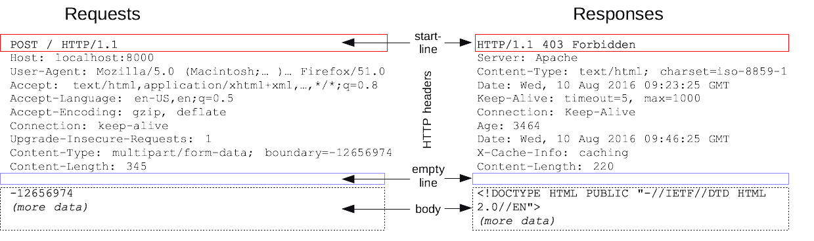

# Simple Spider

<!-- TOC -->

- [Simple Spider](#simple-spider)
    - [Introdution](#introdution)
    - [HTTP request/response](#http-requestresponse)
    - [proxy & architecture](#proxy--architecture)
    - [`urllib`](#urllib)
    - [`requests`](#requests)
    - [`BeautifulSoup`](#beautifulsoup)
        - [BeautifulSoup selector](#beautifulsoup-selector)
    - [selenium](#selenium)
        - [selenium + chrome](#selenium--chrome)
        - [selenium + phantomjs](#selenium--phantomjs)
        - [selenium with firefox](#selenium-with-firefox)
        - [selenium keys & click](#selenium-keys--click)
    - [login with cookie](#login-with-cookie)
        - [method1: only with session](#method1-only-with-session)
        - [method2&3: cookie with request](#method23-cookie-with-request)
    - [word cloud](#word-cloud)
    - [Periodic Sign Task](#periodic-sign-task)
    - [XPath](#xpath)
    - [OCR vs verify code](#ocr-vs-verify-code)

<!-- /TOC -->

## Introdution

复杂的涉及分布式爬虫+ Elasticsearch

友情链接作用：搜索引擎，会访问友情链接，所以为了让自己的搜索结果靠前，需要和其他网站大量交换友情链接

应用场景:
- 咨询报告
- 抢票、投票作弊器
- 预测（股市、票房）
- 国民情感分析
- 社交关系网络
- 政府部分舆情监测

浏览器输入网址后的动作:
- 浏览器首先访问的是DNS服务器，查找域名对应的IP地址
- 向IP对应的服务器发送请求(get, post)
- 服务器响应请求，发回response
- 浏览器渲染response

> 爬虫其实就是为了得到response; 然后进一步得到数据

> 浏览器和服务器要发送、接受数据，就需要遵循HTTP或HTTPS协议，协议规定了request, response的各种格式

## HTTP request/response

[HTTP request/response](https://blog.csdn.net/lzghxjt/article/details/51458540)

HTTP request messages:
> 

HTTP response messages:
> 

HTTP request/response:
> 

## proxy & architecture

淘宝买一个**vps秒换ip**, 将写好的程序挪到那个vps上运行就行。

Some reference:
- [抓取证券之星的股票数据](http://www.cnblogs.com/sjzh/archive/2016/09/24/5899716.html)
- [抓取代理IP并多线程验证](https://www.cnblogs.com/sjzh/p/5990152.html)
- [基础爬虫架构及爬取证券之星全站行情数据](https://www.cnblogs.com/sjzh/p/7657882.html)

example1: 随机切换User-Agent

```python
import json
import pickle
import random
import multiprocessing
import requests
from bs4 import BeautifulSoup

url = 'http://quote.stockstar.com/webhandler/rank.ashx'
user_agents = [
    "Mozilla/5.0 (Windows NT 10.0; WOW64; rv:53.0) Gecko/20100101 Firefox/53.0",
    "Mozilla/5.0 (Windows NT 10.0; WOW64; rv:54.0) Gecko/20100101 Firefox/54.0",
    "Mozilla/5.0 (Windows NT 10.0; WOW64; rv:55.0) Gecko/20100101 Firefox/55.0",
    "Mozilla/5.0 (Windows NT 10.0; WOW64; rv:56.0) Gecko/20100101 Firefox/56.0",
    "Mozilla/5.0 (Windows NT 10.0; WOW64; rv:57.0) Gecko/20100101 Firefox/57.0",
    "Mozilla/5.0 (Windows NT 10.0; WOW64; rv:58.0) Gecko/20100101 Firefox/58.0",
    "Mozilla/5.0 (Windows NT 10.0; WOW64; rv:59.0) Gecko/20100101 Firefox/59.0",
    "Mozilla/5.0 (Windows NT 10.0; WOW64; rv:60.0) Gecko/20100101 Firefox/60.0",
    "Mozilla/5.0 (Windows NT 10.0; WOW64; rv:61.0) Gecko/20100101 Firefox/61.0",
    "Mozilla/5.0 (Windows NT 10.0; WOW64; rv:62.0) Gecko/20100101 Firefox/62.0",
]


def add_data(queue, page_number):
    params = {
        'type': 'a',
        'sortfield': 3,
        'direction': 1,
        'pageid': page_number
    }
    headers = {"User-Agent": random.choice(user_agents)}
    try:
        res = requests.get(url, params=params, headers=headers)
        print(f'page-{page_number} is got')
        temp_dict = json.loads(res.text[12:-1]) # response是变量，并不是json
        queue.put(temp_dict['html'])
    except Exception as e:
        print(f'page={page_number}', e)


if __name__ == '__main__':
    queue_list = []
    process_list = []
    data_list = []
    for i in range(118): # 总共118页，为了便于理解，这里没有进行进程分组
        queue_list.append(multiprocessing.Queue())
        process_list.append(multiprocessing.Process(
            target=add_data, args=(queue_list[i], i+1)))
        process_list[i].start()
    for queue in queue_list:
        data_list.append(queue.get())
    # pickle.dump(data_list, open('data.dat', 'wb'))
    print('===finished capture data===')

    # write to file(也可以写入数据库)
    with open('final.txt', 'w', encoding='utf8') as file:
        for html in data_list:
            soup=BeautifulSoup(html, features='lxml')
            for i, td in enumerate(soup.select('td')):
                file.write(f'{td.string:>12}')
                if (i+1) % 13 ==0:
                    file.write('\n')
            file.write('\n')
```

example2: www.kuaidaili.com抓取代理ip
> [免费代理IP地址列表](https://www.jianshu.com/p/93fd64a2747b)

```python
# www.kuaidaili.com
import time
import requests
from bs4 import BeautifulSoup

headers = {
    "User-Agent": "Mozilla/5.0 (Windows NT 10.0; WOW64; rv:61.0) Gecko/20100101 Firefox/61.0",
}
# www.kuaidaili.com必须使用Session才能克服反爬虫
session = requests.Session()

htmls = []
for page_number in range(1, 6):
    url = f'https://www.kuaidaili.com/free/inha/{page_number}/'
    try:
        res = session.get(url, headers=headers)
        htmls.append(res.text)
    except Exception as e:
        print(f'page={page_number}', e)
    time.sleep(0.5)
else:
    print('finished capture response')

all_ips = []
all_ports = []
all_types = []

for html in htmls:
    soup = BeautifulSoup(html, features="lxml")
    for td in soup.select('td[data-title="IP"]'):
        all_ips.append(td.string)
    for td in soup.select('td[data-title="PORT"]'):
        all_ports.append(td.string)
    for td in soup.select('td[data-title="类型"]'):
        all_types.append(td.string)

all_addr = []
for item in zip(all_types, all_ips, all_ports):
    all_addr.append(f'{item[0]}://{item[1]}:{item[2]}')

print(all_addr)
```

example3: www.xicidaili.com抓取代理ip

```python
import requests
from bs4 import BeautifulSoup

headers = {
    "User-Agent": "Mozilla/5.0 (Windows NT 10.0; WOW64; rv:61.0) Gecko/20100101 Firefox/61.0",
}
session = requests.Session()
htmls = []

for page_number in range(1, 6):
    url = f'http://www.xicidaili.com/nn/{page_number}'
    try:
        res = session.get(url, headers=headers)
        htmls.append(res.text)
    except Exception as e:
        print(f'page={page_number}', e)
else:
    print('finished capture response')


all_ips = []
all_ports = []
all_types = []

for html in htmls:
    soup=BeautifulSoup(html, features='lxml')
    for td in soup.select('tr > td:nth-of-type(2)'):
        all_ips.append(td.string)
    for td in soup.select('tr > td:nth-of-type(3)'):
        all_ports.append(td.string)
    for td in soup.select('tr > td:nth-of-type(6)'):
        all_types.append(td.string)

all_addr = []
for item in zip(all_types, all_ips, all_ports):
    all_addr.append(f'{item[0]}://{item[1]}:{item[2]}')

print(len(all_addr))
```

example4: 同example3的套路

```python
url = f'http://www.ip3366.net/free/'

params = {
    "stype": 1,
    "page": page_number
}

# 后面只需要微调
```

```python
url=f'http://www.mimiip.com/gngao/{page_number}'
# 后面微调
```

```python
url=f'http://www.66ip.cn/areaindex_1/{page_number}.html'
# 后面微调
```

example5: with regex

```python
import re
import requests

headers = {
    "User-Agent": "Mozilla/5.0 (Windows NT 10.0; WOW64; rv:61.0) Gecko/20100101 Firefox/61.0",
}
session = requests.Session()

home_url='http://www.xsdaili.com'
pat0=re.compile(r'<a href="/dayProxy/ip/(\d+)\.html">')
res0=session.get(home_url, headers=headers)
url=f'http://www.xsdaili.com/dayProxy/ip/{pat0.search(res0.text)}.html'

res=session.get(url, headers=headers)
pat=re.compile(r'(\d+\.\d+\.\d+\.\d+:\d+)@(\w+)#')
all_ip_port=pat.findall(res.text)

all_addr=[]
for item in all_ip_port:
    all_addr.append(f'{item[1]}://{item[0]}')

print(all_addr)
```

example6: check ip

```python
import re
import multiprocessing
import requests

# get proxy ip
headers = {
    "User-Agent": "Mozilla/5.0 (Windows NT 10.0; WOW64; rv:61.0) Gecko/20100101 Firefox/61.0",
}
session = requests.Session()

home_url = 'http://www.xsdaili.com'
res0 = session.get(home_url, headers=headers)
pat0 = re.compile(r'<a href="/dayProxy/ip/(\d+)\.html">')
url = f'http://www.xsdaili.com/dayProxy/ip/{pat0.search(res0.text)}.html'

res = session.get(url, headers=headers)
pat = re.compile(r'(\d+\.\d+\.\d+\.\d+:\d+)@(\w+)#')
all_ip_port = pat.findall(res.text)

all_addr = []
for item in all_ip_port:
    all_addr.append(f'{item[1]}://{item[0]}')

all_proxies = []
for addr in all_addr:
    # 每一个dict就是一个proxies
    all_proxies.append({'https': addr})

# 多进程check proxies
test_url = 'http://quote.stockstar.com/stock'


def check_ip(proxies, q):
    try:
        session.get(test_url, headers=headers, proxies=proxies)
        q.put(proxies['https'])
        print(f'{proxies} is good')
    except Exception as e:
        print(f'{proxies} is bad', e)


if __name__ == '__main__':
    queue_list = []
    process_list = []
    for i, proxies in enumerate(all_proxies):
        queue_list.append(multiprocessing.Queue())
        process_list.append(multiprocessing.Process(
            target=check_ip, args=(proxies, queue_list[i])))
    for process in process_list:
        process.start()
    # write to file
    with open('good_ip.txt', 'w') as file:
        for queue in queue_list:
            file.write(f'{queue.get()}\n')
    # # 主进程默认会等待，下面可以不写
    # for process in process_list:
    #     process.join()
```

example7: 一个简单的爬虫框架

```python
import os
from multiprocessing import Pool
import random
import re
import time
import requests
import pandas as pd
from bs4 import BeautifulSoup
import sqlalchemy

'''
1.url获取器: get_catalog, get_urls
2.url管理器: url_manager
3.html下载器: spider_proxy, html_downloader
4.html解析器: html_parser
5.数据存储器: data_saver
6.爬虫管理器: spider_manager
'''


class catalog_getter(object):
    '''左边栏菜单'''

    def __init__(self):
        self.catalog = None

    def save_catalog(self):
        '''证券之星左侧导航的内容和网址并保存为csv'''
        headers = {
            "User-Agent": "Mozilla/5.0 (Windows NT 10.0; WOW64; rv:61.0) Gecko/20100101 Firefox/62.0",
        }
        session = requests.Session()
        res = session.get('http://quote.stockstar.com/', headers=headers)
        html = res.content.decode('gbk')
        soup = BeautifulSoup(html, features='html5lib')

        # 一级菜单列表+二级菜单列表
        catalog1 = pd.DataFrame(columns=["cata1", "cata2", "url2"])
        catalog2 = pd.DataFrame(columns=["url2", "cata3", "url3"])

        for submenu in soup.select('.subMenuBox .list'):
            for dl in submenu.select('.subNav dl'):
                cata2 = dl.dt.a.string.strip(' ·\n\r\t')
                url2 = dl.dt.a["href"]
                catalog1 = catalog1.append(
                    {"cata1": submenu.a.string, "cata2": cata2, "url2": url2}, ignore_index=True)
                for li in dl.select('dd li'):
                    cata3 = li.a.string.strip('·')
                    catalog2 = catalog2.append(
                        {"url2": url2, "cata3": cata3, "url3": li.a["href"]}, ignore_index=True)

        # 合并成完整菜单列表
        self.catalog = pd.merge(catalog1, catalog2, on='url2', how='left')
        self.catalog.to_csv('catalog.csv', index=False)

    def load_catalog(self):
        '''导入csv'''
        if 'catalog.csv' not in os.listdir():
            self.save_catalog()
            print('catalog.csv generated')
        else:
            print('catalog.csv already exists')
            self.catalog = pd.read_csv('catalog.csv')
        print('catalog.csv loaded')

    def get_info(self, index):
        '''创建每行的行名，作为存入数据库的表名，并获取每行终端的网址链接'''
        if str(self.catalog.loc[index]['cata3']) == 'nan':
            table_name = self.catalog.loc[index]['cata1'] + \
                '_' + self.catalog.loc[index]['cata2']
            url = f'http://quote.stockstar.com{self.catalog.loc[index]["url2"]}'
        else:
            table_name = self.catalog.loc[index]['cata1'] + '_' + \
                self.catalog.loc[index]['cata2'] + '_' + \
                self.catalog.loc[index]['cata3']
            url = f'http://quote.stockstar.com{self.catalog.loc[index]["url3"]}'
        return table_name, url


class urls_getter(object):
    '''获取每个menu的链接列表'''

    def __init__(self, url):
        self.url = url

    def get_urllist(self):
        headers = {
            "User-Agent": "Mozilla/5.0 (Windows NT 10.0; WOW64; rv:61.0) Gecko/20100101 Firefox/62.0",
        }
        session = requests.Session()
        res = session.get(self.url, headers=headers)
        html = res.content.decode('gbk')
        soup = BeautifulSoup(html, features='html5lib')

        page_size = int(soup.select_one(
            '#ClientPageControl1_hdnPageSize')['value'])
        total_count = int(soup.select_one(
            '#ClientPageControl1_hdnTotalCount')['value'])
        # ceiling division
        page_count = (total_count+page_size-1)//page_size
        # http://quote.stockstar.com/stock/sha_3_1_2.html中3, 1, 2分别是是sort_field, direction, page_index
        sort_field = int(soup.select_one(
            '#ClientPageControl1_hdnSortField')['value'])
        direction = int(soup.select_one(
            '#ClientPageControl1_hdnDirection')['value'])

        # construct urllist
        dot_index = self.url.rindex('.')
        url_prefix = self.url[:dot_index]
        urllist = [
            f'{url_prefix}_{sort_field}_{direction}_{i+1}.html' for i in range(page_count)]
        return urllist


class url_manager(object):
    def __init__(self):
        # 未爬
        self.new_urls = set()
        # 已爬
        self.old_urls = set()

    def has_new_url(self):
        '''判断是否有未爬取的URL'''
        return len(self.new_urls) > 0

    def get_new_url(self):
        '''获取一个未爬取的URL'''
        new_url = self.new_urls.pop()
        self.old_urls.add(new_url)
        return new_url

    def add_new_urls(self, urls):
        '''将新的URL列表添加到未爬取的URL集合中'''
        if urls is None or len(urls) == 0:
            return
        for url in urls:
            if url is None:
                return
            if url not in self.new_urls and url not in self.old_urls:
                self.new_urls.add(url)


class spider_proxy(object):
    '''获取有效proxies并保存'''

    @staticmethod
    def get_proxies():
        '''get proxy ips'''
        headers = {
            "User-Agent": "Mozilla/5.0 (Windows NT 10.0; WOW64; rv:61.0) Gecko/20100101 Firefox/61.0",
        }
        session = requests.Session()
        home_url = 'http://www.xsdaili.com'

        res0 = session.get(home_url, headers=headers)
        pat0 = re.compile(r'<a href="/dayProxy/ip/(\d+)\.html">')
        url = f'http://www.xsdaili.com/dayProxy/ip/{pat0.search(res0.text)}.html'

        res = session.get(url, headers=headers)
        pat = re.compile(r'(\d+\.\d+\.\d+\.\d+:\d+)@(\w+)#')
        all_ip_port = pat.findall(res.text)

        all_proxies = []
        for item in all_ip_port:
            all_proxies.append({'https': f'{item[1]}://{item[0]}'})
        print('get all_proxies')
        return all_proxies


class html_downloader(object):
    '''get html text'''

    def __init__(self, all_proxies):
        self.all_proxies = all_proxies

    def download(self, url):
        headers = {
            "User-Agent": "Mozilla/5.0 (Windows NT 10.0; WOW64; rv:61.0) Gecko/20100101 Firefox/61.0",
        }
        session = requests.Session()
        proxies = random.choice(self.all_proxies)

        print(proxies)

        try:
            res = session.get(url, headers=headers, proxies=proxies)
            html = res.content.decode('gbk')
            time.sleep(0.5)
        except Exception as e:
            print(f'get "{url}" error"', e)

        # 一般返回的比较短都是被forbidden
        if len(html) > 100:
            return html
        else:
            return None


class html_parser(object):
    '''解析html获取数据'''

    def __init__(self, html):
        self.html = html
        self.soup = BeautifulSoup(self.html, features='html5lib')

    def get_date(self):
        pat = re.compile(r'数据时间：(.*?)<')
        try:
            # 刨除后面的时间，只留下2018-09-14这样的日期
            date_string = pat.search(self.html).group(1)[:10]
        except Exception as e:
            print(f'get date error', e)
            return ''
        return date_string

    def get_header(self):
        '''获取表的标题'''
        header_name = []
        try:
            for td in self.soup.select('thead.tbody_right td'):
                header_name.append(td.string)
            header_name.append('数据时间')
        except Exception as e:
            print('get header name error', e)
            header_name = []
        finally:
            return header_name

    def get_datalist(self):
        '''获取表的数据'''
        header_name = self.get_header()
        # 如果表标题长度与数据长度不一致
        if len(header_name)-1 != len(self.soup.select('#datalist tr:nth-of-type(1) > td')):
            return [], []

        datalist = []
        date = self.get_date()
        try:
            for tr in self.soup.select('#datalist tr'):
                row = []
                for td in tr.select('td'):
                    row.append(td.string)
                row.append(date)
                datalist.append(row)
        except Exception as e:
            print('get datalist error', e)
            datalist = []
        return header_name, datalist

    def get_dataframe(self):
        '''用pandas组合成一个table'''
        header_name, datalist = self.get_datalist()
        table = pd.DataFrame(datalist, columns=header_name)
        return table


class data_saver(object):
    '''将数据存入sqlite3数据库'''

    def __init__(self, engine, table, table_name):
        self.engine = engine
        # table本质是pandas.DataFrame()
        self.table = table
        self.table_name = table_name

    def sava_to_db(self):
        # DataFrame的to_sql()方法
        self.table.to_sql(name=self.table_name, con=self.engine,
                          if_exists='append', index_label='id')


class spider_manager(object):
    '''爬虫调度器'''

    def __init__(self, engine, table_name, all_proxies):
        self.engine = engine
        self.table_name = table_name
        self.urlman = url_manager()
        self.downloader = html_downloader(all_proxies)

    def crawl_single(self, url):
        '''爬取单一网址'''
        html=self.downloader.download(url)
        parser=html_parser(html)
        if parser.get_header():
            table=parser.get_dataframe()
            saver=data_saver(self.engine, table, self.table_name)
            saver.sava_to_db()
            print(f"{url} saved to {self.table_name}")

    def crawl_menu(self, urllist):
        '''爬取一个menu'''
        self.urlman.add_new_urls(urllist)

        # pool = Pool(10)
        while self.urlman.has_new_url():
            new_url = self.urlman.get_new_url()
            # apply_async的时候已经开始运行了
            # pool.apply_async(func=self.crawl_single, args=(new_url, ))
            self.crawl_single(new_url)

        # pool.close()
        # pool.join()  # 主进程卡在这里


if __name__ == '__main__':
    obj = catalog_getter()
    obj.load_catalog()

    engine = sqlalchemy.create_engine("sqlite:///Data.db")
    all_proxies=spider_proxy.get_proxies()

    for index, row in obj.catalog.iterrows():
        table_name, url = obj.get_info(index)
        urlsGetter = urls_getter(url)
        urllist = urlsGetter.get_urllist()
        print(f"{index}:{table_name}'s urllist got")

        spider_man = spider_manager(engine, table_name, all_proxies)
        spider_man.crawl_menu(urllist)
        print(f"{index}: {table_name} crawled")
```

## `urllib`

python3中urllib, urllib2合并为[urllib](https://docs.python.org/3/howto/urllib2.html#urllib-howto); 现在一般用的requests, 而不用urllib; [requests vs urllib](https://www.cnblogs.com/znyyy/p/7868511.html)

```python
import urllib.request

with urllib.request.urlopen("https://www.python.org/") as response:
   html = response.read().decode('utf8')
   print(response.getcode()) # 200
```

`response.getcode()` return:
- 2开头，网页正常
- 4开头，网页不存在
- 5开头，服务器bug

```python
# download response-body
import urllib.request

with urllib.request.urlopen('https://www.python.org/') as response:
    with open('test.html', 'wb') as file:
        file.write(response.read())
```

```python
# douyu example: 很容易被forbidden
import re
import time
import urllib.request

def get_img(html):
    regex=re.compile(r'data-original="(.*?\.jpg)"')
    img_urls=regex.findall(html)
    imgs_sum=len(img_urls)
    for index, img_url in enumerate(img_urls):
        print(f'downing image-{index}/{imgs_sum}')
        with urllib.request.urlopen(img_url) as response, open(f'./imgs/image-{index}.jpg', 'wb') as file:
            file.write(response.read())
            # time.sleep(1)

# add agent
opener=urllib.request.build_opener()
opener.addheaders = [('User-agent', "Mozilla/5.0 (Windows NT 10.0; WOW64; rv:61.0) Gecko/20100101 Firefox/61.0")]
with opener.open('https://www.douyu.com/g_yz') as response:
    html=response.read().decode('utf8')

# begin
get_img(html)
```

```python
import urllib

params=urllib.urlencode({'t':1,'eggs':2,'bacon':0})

# urllib get
f1=urllib.urlopen("http://python.org/query?%s" % params)
print(f1.read())

# urllib post
f2=urllib.urlopen("http://python.org/query",parmas)
print(f2.read())
```

```python
# urllib download file
urllib.urlretrieve('https://rpic.douyucdn.cn/20180831104533_small.jpg', './images/1.jpg')
```

## `requests`

`pip install requests`, 如果对性能有要求可以采用`pip install pycurl`

> [requests vs pycurl](https://github.com/yudazilian/Pycurl-vs-Requests)

```python
import requests

r=requests.get('https://www.python.org/')
html=r.text
# binary_html=r.content
print(r.status_code) # 200
```

```python
# 没有forbidden
# douyu 单页
import re
import requests

def get_img(html):
    regex=re.compile(r'data-original="(.*?\.jpg)"')
    img_urls=regex.findall(html)
    img_sum=len(img_urls)
    for index, img_url in enumerate(img_urls):
        print(f'downing image-{index}/{img_sum}')
        r=requests.get(img_url)
        with open(f'./imgs/image-{index}.jpg', 'wb') as file:
            file.write(r.content)

html=requests.get('https://www.douyu.com/g_yz').text
get_img(html)
```

```python
# with agent & session
import re
import requests

def get_img(html):
    regex=re.compile(r'data-original="(.*?\.jpg)"')
    img_urls=regex.findall(html)
    img_sum=len(img_urls)
    for index, img_url in enumerate(img_urls):
        print(f'downing image-{index}/{img_sum}')
        r=requests.get(img_url)
        with open(f'./imgs/image-{index}.jpg', 'wb') as file:
            file.write(r.content)

headers={
    "User-Agent": "Mozilla/5.0 (Windows NT 10.0; WOW64; rv:61.0) Gecko/20100101 Firefox/61.0",
}
session=requests.Session()
r=session.get('https://www.douyu.com/g_yz', headers=headers)
get_img(r.text)
```

斗鱼多页: 通过F12/ViewSource得知[斗鱼](https://www.douyu.com/g_yz)采用了JS生成pagenator, 然后切换页码的时候采用的Ajax; 所以点击翻页地址栏不变;

F12/Network/XHR, 点击切换页码，发现了两个request(一个post, 一个get), post请求的`FormData`里面包含了`pg`, get请求的[url](https://www.douyu.com/gapi/rkc/directory/2_201/2)为json;

所以两个思路: (采用思路一)
- 直接通过get的url,获取json
- 通过`requests`模块的`post`方法来翻页


```python
# 斗鱼多页
import re
import os
import sys
import requests

if 'imgs' not in os.listdir():
    os.mkdir('imgs')

html=requests.get('https://www.douyu.com/g_yz').text
# 通过html的<script>xxx</script>获取页码

regex=re.compile(r'count: "(\d+)"')
total_pages=eval(regex.search(html).group(1))# 4

# 这个地方可以采用多进程进行，分配任务; 为了简单没有采用
json_urls=[f'https://www.douyu.com/gapi/rkc/directory/2_201/{i+1}' for i in range(total_pages)]

# 通过分析json的结构得到
img_urls=[]
for url in json_urls:
    r=requests.get(url)
    temp_dict=r.json()
    for item in temp_dict['data']['rl']:
        img_urls.append(item['rs16'])

# download all imgs
def get_img(img_urls):
    img_sum=len(img_urls)
    for index, url in enumerate(img_urls):
        # vscode, jupyter通用的进度条
        sys.stdout.write(f'\r{index+1}/{img_sum}')
        r=requests.get(url)
        with open(f'./imgs/image-{index}.jpg', 'wb') as file:
            file.write(r.content)

get_img(img_urls)
```

[头条街拍](https://www.jianshu.com/p/d67b1d4b99ad)

```python
import re
import os
import sys
import requests

# download imgs
def get_img(img_urls, img_dir):
    img_sum=len(img_urls)
    for index, url in enumerate(img_urls):
        sys.stdout.write(f'\r{index+1}/{img_sum}')
        r=requests.get(url)
        with open(f'./{img_dir}/image-{index}.jpg', 'wb') as file:
            file.write(r.content)

# begin
if 'imgs' not in os.listdir():
    os.mkdir('imgs')

url='https://www.toutiao.com/search_content'
offset=0

while True:
    # query param
    param={'offset':offset, 'format':'json', 'keyword':'街拍', 'autoload':'true', 'count':20, 'cur_tab':3, 'from':'gallery'}
    res=requests.get(url, param)
    data=res.json().get('data')
    if not data:
        # data为空的时候表示没有链接了
        break
    
    # get image urls
    img_urls=[]
    for article in data:
        img_list=article.get('image_list')
        if img_list:
            for img in img_list:
                origin_url=img['url'].replace('list', 'origin')
                complete_url=f'http:{origin_url}'
                img_urls.append(complete_url)
    
    # download imgages
    img_dir=f'imgs/offset{offset}'
    os.mkdir(img_dir)
    get_img(img_urls, img_dir)
    
    # offset + 20
    offset+=20
```

[九派新闻](https://ask.hellobi.com/blog/linjichu/sitemap/)

```python
import requests

param={'page':1, 'pageSize':15, 'type':1}
url='http://appjph.jiupaicn.com/app/content/recommend_pc/list'
res=requests.get(url, param)
data=res.json().get('resultData')

news_urls=[]

for item in data:
    title=item.get('title')
    if title:
        new_url=f'http://jphao.jiupaicn.com/index.php?m=content&c=jiupaihao&a=article&id={item.get("id")}&memberId={item.get("memberId")}'
        news_urls.append(new_url)
```

## `BeautifulSoup`

`pip install beautifulsoup4`

[Official Document](https://beautifulsoup.readthedocs.io/zh_CN/latest/)

```python
# 获取html的所有img_url
import requests
from bs4 import BeautifulSoup

html=requests.get('https://www.douyu.com/g_yz').text
soup=BeautifulSoup(html)

img_urls=[]
for item in soup.find_all('img', {'class': 'JS_listthumb'}):
    img_urls.append(item['data-original'])

print(img_urls)
```

[Python Salary](https://ask.hellobi.com/blog/linjichu/6479)

```python
import requests
from bs4 import BeautifulSoup

params={'query':'Python', 'scity':101010100, 'page':1} # 101010100代表北京
headers={
    "User-Agent": "Mozilla/5.0 (Windows NT 10.0; WOW64; rv:61.0) Gecko/20100101 Firefox/61.0",
}
url='https://www.zhipin.com/job_detail/'
res=requests.get(url,params, headers=headers)
data=res.text
soup=BeautifulSoup(data)

# for item in soup.find_all('span', class_='red'):
for item in soup.find_all('span', {'class': 'red'}):
    print(item.get_text())
```

### BeautifulSoup selector

```python
import requests
from bs4 import BeautifulSoup

html=requests.get('https://www.douyu.com/g_yz').text

soup=BeautifulSoup(html)
# format html
# print(soup.prettify())

# Select by tag
# get text stirng: soup.tag
# 获取第一个
print(soup.title) # <title>This is title</title>
print(soup.div.a) # <a class="head-logo fl" href="/"></a>
print(soup.title.string)
print(soup.name) # [document]
print(soup.title.name) # title
print(soup.div.attrs) # {'id': 'container', 'class': ['container']}
print(soup.a['href']) # ...


# CSS选择器
print(soup.select('title')) # 标签选择器
print(soup.select('.container .a-pop .list-wrap')) # class选择器
# print(soup.select('#main-col')) # id选择器
# print(soup.select('body #main-col')) # 三者组合

# 特殊
print(soup.select('head > title')) # 子标签选择器
# print(soup.select('div[class="container"]'))
# print(soup.select('a[name="grey"]'))
```

## selenium

### selenium + chrome

> 先要下载[chromedriver](http://chromedriver.chromium.org/downloads)

```python
from selenium import webdriver

options = webdriver.ChromeOptions()
options.binary_location = 'D:/Cent/chrome.exe'
driver = webdriver.Chrome('chromedriver.exe', chrome_options=options)

url = 'http://www.cmsoft.cn/'
driver.get(url)
page_source = driver.page_source
driver.close()

print(page_source) # 包含了动态生成的html
```

### selenium + phantomjs

先要下载[phantomjs](http://phantomjs.org/)

```python
from selenium import webdriver

driver=webdriver.PhantomJS('phantomjs.exe')

url = 'http://www.cmsoft.cn/'
driver.get(url)
page_source = driver.page_source
driver.close()

print(page_source)
```

```python
# phantom with user-agents
from selenium import webdriver
from selenium.webdriver.common.desired_capabilities import DesiredCapabilities

dcap = dict(DesiredCapabilities.PHANTOMJS)
dcap["phantomjs.page.settings.userAgent"] = ("Mozilla/5.0 (Windows NT 6.1; WOW64; rv:50.0) Gecko/20100101 Firefox/50.0", )
driver = webdriver.PhantomJS('phantomjs.exe', desired_capabilities=dcap)

url = 'http://www.cmsoft.cn/'
driver.get(url)
page_source = driver.page_source
driver.close()

print(page_source)
```

### selenium with firefox

```python
from selenium import webdriver

options=webdriver.FirefoxOptions()
options.add_argument('--headless')

# firefox alreaddy in environment variable
driver=webdriver.Firefox(firefox_options=options)

url='https://www.baidu.com'
driver.get(url)
page_source = driver.page_source

driver.save_screenshot('hello.png')
driver.close()
```

### selenium keys & click

> 可用于点击登陆，自动注册，也可用于普通的点击`next`翻页

example1: selenium send keys

```python
from selenium import webdriver
from selenium.webdriver.common.keys import Keys

options = webdriver.ChromeOptions()
options.binary_location = 'D:/Cent/chrome.exe'

driver = webdriver.Chrome('chromedriver.exe', chrome_options=options)
driver.get('https://www.baidu.com/')

kw=driver.find_element_by_id('kw') # F12找到输入框的位置
kw.send_keys('python3')
kw.send_keys(Keys.RETURN)

print(driver.page_source)

driver.close()
```

example2: selenium click

```python
from selenium import webdriver
from selenium.webdriver.common.keys import Keys

options = webdriver.ChromeOptions()
options.binary_location = 'D:/Cent/chrome.exe'

driver = webdriver.Chrome('chromedriver.exe', chrome_options=options)
driver.get('https://www.baidu.com/')
kw=driver.find_element_by_id('kw')
kw.send_keys('python3')

btn=driver.find_element_by_id('su')
btn.click()

print(driver.page_source)
driver.close()
```

## login with cookie

[requests模拟登录的原理](https://blog.csdn.net/zwq912318834/article/details/79571110)

[requests模拟登录的三种方法](https://blog.csdn.net/hui1788/article/details/79944102):
- method1利用session模拟登陆
- method2将cookie放在headers中一起发送请求就可以了
- method3将cookie值拿出来直接在requests中发送就可以了，不过在发送时我们需要把cookie字符串转化为字典。

### method1: only with session

> 标准做法是用Fiddler来抓取post的内容: Find: post→Inspector→TextView  
> Fiddler也可以获取header: 一般写上User-Agent, Refer就行了  
> Fiddler抓https的时候,同时开python爬虫，可能报错，python需要忽略ssl安全: `requests.get('xxx', verify=False)`

```python
# method1: only with session, 不稳定
import requests

headers = {
    "User-Agent": "Mozilla/5.0 (Windows NT 10.0; WOW64; rv:61.0) Gecko/20100101 Firefox/61.0",
}

# login
s = requests.session()
login_url = 'https://passport.baidu.com/'
username = 'XXXXXX'
password = 'YYYYYY'
raw_post = {"username": username, "password": password}
s.post(login_url, headers=headers, data=raw_post)

# visited other sites
url = 'https://www.baidu.com/'
r = s.get(url, headers=headers)
print(r.content.decode('utf8'))
```

### method2&3: cookie with request

F12/Network/Headers/RequestHeaders/Cookie复制字符串
> 

```python
# method2: cookie in header, 最简单
import requests

cookie_str = 'BIDUPSID=9E547011EFA2D219E2FEC5BEDF7B9475; PSTM=1537057280; BD_UPN=12314753; BAIDUID=4594E9308E15EE0085797C1212051F67:FG=1; BDUSS=WdCMGQwRFJHUHo1YjFoa3VXa1JIRDQ0bjRNUmMzTXd-TU5rd2ljLUVlSG1OOGRiQVFBQUFBJCQAAAAAAAAAAAEAAAC6p~WiQWxwaGFHcmV5AAAAAAAAAAAAAAAAAAAAAAAAAAAAAAAAAAAAAAAAAAAAAAAAAAAAAAAAAAAAAAAAAAAAAAAAAOaqn1vmqp9bd; cflag=15%3A3; delPer=1; BD_HOME=1; H_PS_PSSID=1438_26965_21116_22157; sug=3; sugstore=0; bdime=0; ORIGIN=2; ISSW=1'
headers = {
    "User-Agent": "Mozilla/5.0 (Windows NT 10.0; WOW64; rv:61.0) Gecko/20100101 Firefox/61.0",
    "Cookie": cookie_str
}
url = 'https://www.baidu.com/'


r = requests.get(url, headers=headers)
print(r.content.decode('utf8'))
```

```python
# method3: cookie in requests
import requests

headers={
    "User-Agent": "Mozilla/5.0 (Windows NT 10.0; WOW64; rv:61.0) Gecko/20100101 Firefox/61.0",
}
url='https://www.baidu.com/'


cookie_str='BIDUPSID=9E547011EFA2D219E2FEC5BEDF7B9475; PSTM=1537057280; BD_UPN=12314753; BAIDUID=4594E9308E15EE0085797C1212051F67:FG=1; BDUSS=WdCMGQwRFJHUHo1YjFoa3VXa1JIRDQ0bjRNUmMzTXd-TU5rd2ljLUVlSG1OOGRiQVFBQUFBJCQAAAAAAAAAAAEAAAC6p~WiQWxwaGFHcmV5AAAAAAAAAAAAAAAAAAAAAAAAAAAAAAAAAAAAAAAAAAAAAAAAAAAAAAAAAAAAAAAAAAAAAAAAAOaqn1vmqp9bd; cflag=15%3A3; delPer=1; BD_HOME=1; H_PS_PSSID=1438_26965_21116_22157; sug=3; sugstore=0; bdime=0; ORIGIN=2; ISSW=1'
cookie_dict={item.split('=')[0]:item.split('=')[1] for item in cookie_str.split('; ')}

r=requests.get(url, headers=headers, cookies=cookie_dict)
print(r.content.decode('utf8'))
```

## word cloud

因为英文单词之间有空格分隔，中文没有， 所以需要用[jieba](https://github.com/fxsjy/jieba)来分开词语。然后用[wordcloud](https://github.com/amueller/word_cloud)来生成词云

- `pip install jieba`
- `pip install wordcloud`

```python
# english simple
from wordcloud import WordCloud
import matplotlib.pyplot as plt

file_content=open('alice.txt').read()
wc=WordCloud(width=1000, height=860).generate(file_content)

plt.imshow(wc)
plt.axis('off')
plt.show()

wc.to_file('test.png')
```

```python
# english with picture example
from wordcloud import WordCloud
import matplotlib.pyplot as plt
import numpy as np
from PIL import Image

file_content=open('alice.txt').read()
alice_coloring=np.array(Image.open('alice_color.png'))

wc=WordCloud(width=1000, height=860, mask=alice_coloring).generate(file_content)    
plt.imshow(wc)
plt.axis('off')
plt.show()

wc.to_file('test.png')
```

```python
# chinese with picture example
import jieba
from wordcloud import WordCloud
import matplotlib.pyplot as plt
import numpy as np
from PIL import Image

file_content=open('xiao.txt', encoding='utf8').read()
seg_list=jieba.cut(file_content, cut_all=False)
# 构造成类似英文分隔
text=' '.join(seg_list)

alice_coloring=np.array(Image.open('alice_color.png'))

# 必须有font_path, 使用的是环境变量中的Microsoft Yahei或者font_path='simkai.ttf'
wc=WordCloud(width=1000, height=860, mask=alice_coloring,font_path="msyh.ttc").generate(text)

plt.imshow(wc)
plt.axis('off')
plt.show()

wc.to_file('test.png')
```

## Periodic Sign Task

Linux: `nohup python task.py &`
> kill task: `lsof nohup.out`, `kill -9 32767`

```python
# task.py
import re
import time
import threading
import requests

file = open('log.txt', 'w')

# Construct headers
headers = {
    "User-Agent": "Mozilla/5.0 (Windows NT 10.0; WOW64; rv:61.0) Gecko/20100101 Firefox/61.0",
    # Copy Cookie from browser
    "Cookie": 'xxxx'
}


def task():
    # get normal coin
    sign_url = 'https://www.pdawiki.com/forum/dsu_paulsign-sign.html'
    r1 = requests.get(sign_url, headers=headers)
    pat1 = re.compile('formhash=(.+)"')

    data = {
        "formhash": pat1.search(r1.text).group(1),
        "qdxq": 'kx',
        "qdmode": 1,
        "todaysay": '我又来签到了',
        "fastreply": 0,
    }

    post_url = 'https://www.pdawiki.com/forum/plugin.php?id=dsu_paulsign:sign&operation=qiandao&infloat=1&inajax=1'
    r2 = requests.post(post_url, headers=headers, data=data)

    if r2.text.find('恭喜你签到成功'):
        file.write(f'心情签到成功:{time.ctime()}\n')
        file.flush()

    # get another 20 coins
    panel_url = 'https://www.pdawiki.com/forum/plugin.php?id=nimba_days:html&formhash=8b7c3748&infloat=yes&handlekey=nimba_days&inajax=1&ajaxtarget=fwin_content_nimba_days'
    r3 = requests.get(panel_url, headers=headers)
    pat2 = re.compile(r"NimbaAjax\('(.+)'\);return false;")
    coin_url = f'https://www.pdawiki.com/forum/{pat2.search(r3.text).group(1)}'
    r4 = requests.get(coin_url, headers=headers)

    if r4.text.find('积分奖励领取成功'):
        file.write(f'20金币签到成功:{time.ctime()}\n')
        file.flush()

    # periodic task
    threading.Timer(24*3600, task).start()

task()
```

## XPath

BeautifulSoup, XPath适合于表格的数据提取; regex适合精确的提取小部分位置的数据；
> BeautifulSoup比xpath慢，BeautifulSoup更加user-friendly

example1: xpath selector

```python
from lxml import etree

html='''
<div>
<ul>
    <li class="item-0"><a href="link1.html">0 item</a></li>
    <li class="item-1"><a href="link2.html">1 item</a></li>
    <li class="item-inactive"><a href="link3.html">2 item</li>
    <li class="item-3"><a href="link4.html">3 item</a></li>
    <li class="item-4"><a href="link5.html">4 item</a></li>    
</ul>
<ul>
    <li class="item-10"><a href="link11.html">10 item</a></li>
    <li class="item-11"><a href="link12.html">11 item</a></li>
    <li class="item-inactive"><a href="link13.html">12 item</li>
    <li class="item-13"><a href="link14.html">13 item</a></li>
    <li class="item-14"><a href="link15.html">14 item</a></li>    
</ul>
</div>
'''

tree=etree.HTML(html) # or lxml.etree.parse('index.html') # parse file

for ul in tree.xpath('//ul'):
    for a in ul.xpath('.//li/a'):
        print(a.text, end=';')
# 0 item;1 item;2 item;3 item;4 item;10 item;11 item;12 item;13 item;14 item;

print(tree.xpath('//li/@class'))
# ['item-0', 'item-1', 'item-inactive', 'item-3', 'item-4', 'item-10', 'item-11', 'item-inactive', 'item-13', 'item-14']

print(tree.xpath('//li/a/@href'))
print(tree.xpath('//ul/li//@href'))
# ['link1.html', 'link2.html', 'link3.html', 'link4.html', 'link5.html', 'link11.html', 'link12.html', 'link13.html', 'link14.html', 'link15.html']

print(tree.xpath('//li/a/text()')) # text is particular
# ['0 item', '1 item', '2 item', '3 item', '4 item', '10 item', '11 item', '12 item', '13 item', '14 item']

print(tree.xpath('//li/a/@href="link3.html"')) # True

# get the first one
print(tree.xpath('//li[1]/a/@href'))
# ['link1.html', 'link11.html']

# get the last one
print(tree.xpath('//li[last()]'))
# [<Element li at 0x23231e04c08>, <Element li at 0x23231e040c8>]
print(tree.xpath('//li[last()]/a/@href'))
# ['link5.html', 'link15.html']

# match: *表示匹配所有
tree.xpath('//*[@class="item-inactive"]/a/@href')
# ['link3.html', 'link13.html']
```

example2: xpath get proxy ip

```python
import requests
from lxml import etree

headers = {
    "User-Agent": "Mozilla/5.0 (Windows NT 10.0; WOW64; rv:61.0) Gecko/20100101 Firefox/61.0",
}

html=requests.get('http://www.ip3366.net/free/', headers=headers).content.decode('gbk')
tree=etree.HTML(html)
tree.xpath('//tr/td/text()')
```

## OCR vs verify code

[tesseract](https://github.com/tesseract-ocr/tesseract)使用: `tesseract.exe c:\3.jpg c:\result`, 将识别的结果放到了`c:\result.txt`
> [tesseract for chinese](https://www.cnblogs.com/wzben/p/5930538.html), 或者用[baiduAI](https://ai.baidu.com/)  
> 人工智能: 人工训练出来的智能

```python
import subprocess

p=subprocess.Popen(['C:\\Program Files (x86)\\Tesseract-OCR' 'c:\\3.jpg' 'c:\result'], 
                    stdout=subprocess.PIPE,
                    stderr=subprocess.PIPE)
p.wait()
with open('c"\\result.txt', 'r') as file:
    print(file.read())
```