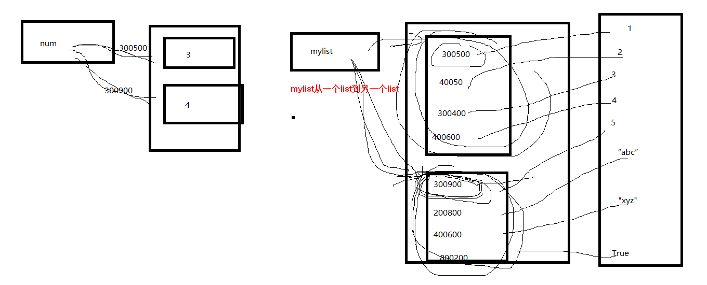
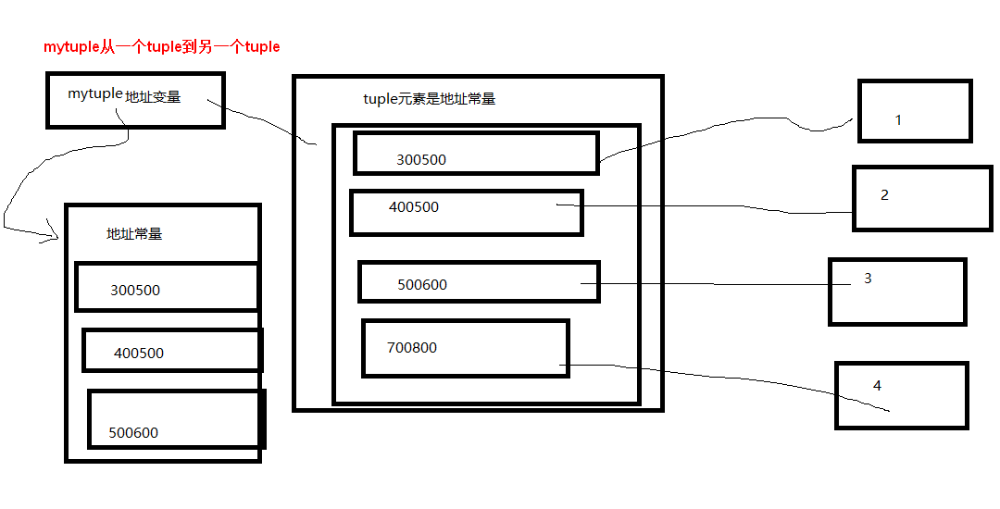
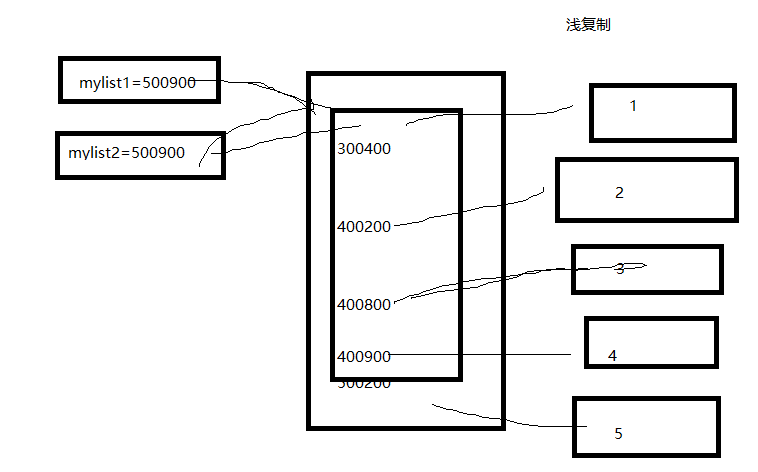
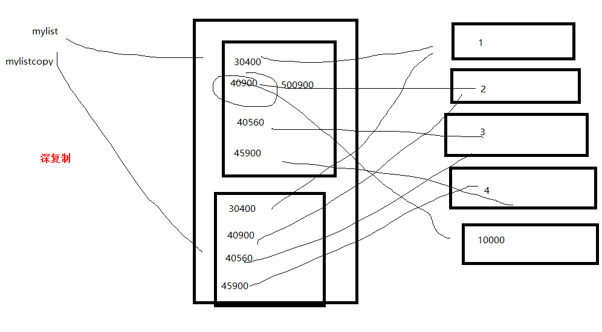

# python data structrue

<!-- TOC -->

- [python data structrue](#python-data-structrue)
    - [list](#list)
        - [深浅复制](#深浅复制)
        - [`copy()` vs `copy.deepcopy()`](#copy-vs-copydeepcopy)
    - [tuple](#tuple)
    - [语音识别，语音对话](#语音识别语音对话)
        - [text to speech](#text-to-speech)
        - [speech to text](#speech-to-text)
    - [set](#set)
    - [Dictionary](#dictionary)
    - [iterator & generator](#iterator--generator)
        - [generator](#generator)
            - [`next()` vs `send()`](#next-vs-send)
        - [iterator](#iterator)
        - [Iterable](#iterable)
    - [语音](#语音)
    - [Stack & Queue](#stack--queue)
    - [about list](#about-list)

<!-- /TOC -->

python可以无限嵌套(如果能嵌套的话)

## list

list是一个多变量组成的集合，每个变量存储不同的地址(每个变量可以不同类型)

list的本质：地址变量集合

```python
#列表去重复
list1=[11,22,33,11,22,33]
list2=[]
for item in list1:
    if item not in list2:
        list2.append(item)
print(list2)#[11,22,33]
```

```python
#列表去重复
list1=[11,22,33,11,22,33]
temp_set=set(list1)
list2=list(temp_set)
print(list2)#[33,11,22]
```

```python
#myList
myList=[]
print(myList,type(myList),id(myList))

myList=[1,2,3]
print(myList,type(myList),id(myList))
for item in myList:
    print(id(item))

myList=[1,1.2,"grey",True]
print(myList,type(myList),id(myList))
for item in myList:
    print(id(item))
```

```bash
#output
[] <class 'list'> 1772761795336
[1, 2, 3] <class 'list'> 1772761793352
1722183136
1722183168
1722183200
[1, 1.2, 'grey', True] <class 'list'> 1772761795336
1722183136
1772756148944
1772761956680
1721692384
```

```python
#-1等价于length-1
myList=[1,2,1.2,"grey"]
print(myList[-1])#grey
print(myList[len(myList)-1])#grey
```

修改链表的数据必须要用**索引法**不能用**元素法**

```python
myList=[x for x in range(10)]
#元素法只适合只读,item是副本
for item in myList:
    if item==3:
        item=333
print(myList)#元素法改不动，该变的只是item的值,[0, 1, 2, 3, 4, 5, 6, 7, 8, 9]
#下标法适合修改,myList[i]是原本
for i in range(len(myList)):
    if myList[i]==3:
        myList[i]=333
print(myList)#[0, 1, 2, 333, 4, 5, 6, 7, 8, 9]
```

```python
# num=10
# del num#del内存回收
# print(num)

#对于List的情况
myList=[x for x in range(10)]
#index method
for i in range(len(myList)):
    if i==3:
        del myList[i]
        break#没有break会index越界
print(myList)#[0, 1, 2, 4, 5, 6, 7, 8, 9]
del myList[0]
print(myList)#[1, 2, 4, 5, 6, 7, 8, 9]

#元素法修改的是副本,对list没影响
for item in myList:
    if item==3:
        del item

print(myList)#[1, 2, 4, 5, 6, 7, 8, 9]
```

list运算：`in, not in, +, *, len()`

多维链表

```python
myList1=[x for x in range(1,5)]
myList2=[x for x in range(11,15)]
myList3=[x for x in range(21,25)]
myList4=[11,22,33,['a','b','c']]

myList=[myList1,myList2,myList3,myList4]
print(myList)
for item in myList:
    for i in item:
        print(i,end=' ')
    print()
```

```bash
#output
[[1, 2, 3, 4], [11, 12, 13, 14], [21, 22, 23, 24], [11, 22, 33, ['a', 'b', 'c']]]
1 2 3 4 
11 12 13 14 
21 22 23 24 
11 22 33 ['a', 'b', 'c'] 
```

```python
#三维数据
myList=[]
myList.append([x for x in range(5)])
myList.append([x for x in range(5)])
myList.append([x for x in range(5)])
myList.append([x for x in range(5)])
# print(myList)

my3DList=[]
my3DList.append(myList)
my3DList.append(myList)
my3DList.append(myList)
# print(my3DList)
for item in my3DList:
    print(item)

myAno3DList=[]
for i in range(3):
    myAnoList=[]
    for j in range(4):
        myAnoList.append([x for x in range(i*100+j*10,i*100+j*10+5)])
    myAno3DList.append(myAnoList)
# print(myAno3DList)
for item in myAno3DList:
    print(item)

for i in range(len(myAno3DList)):
    for j in range(len(myAno3DList[i])):
        for k in range(5):
            print(myAno3DList[i][j][k],end=',')

print()
print(min(min(min(myAno3DList))))#0
print(max(max(max(myAno3DList))))#234
```

```bash
#output
[[0, 1, 2, 3, 4], [0, 1, 2, 3, 4], [0, 1, 2, 3, 4], [0, 1, 2, 3, 4]]
[[0, 1, 2, 3, 4], [0, 1, 2, 3, 4], [0, 1, 2, 3, 4], [0, 1, 2, 3, 4]]
[[0, 1, 2, 3, 4], [0, 1, 2, 3, 4], [0, 1, 2, 3, 4], [0, 1, 2, 3, 4]]
[[0, 1, 2, 3, 4], [10, 11, 12, 13, 14], [20, 21, 22, 23, 24], [30, 31, 32, 33, 34]]
[[100, 101, 102, 103, 104], [110, 111, 112, 113, 114], [120, 121, 122, 123, 124], [130, 131, 132, 133, 134]]
[[200, 201, 202, 203, 204], [210, 211, 212, 213, 214], [220, 221, 222, 223, 224], [230, 231, 232, 233, 234]]
0,1,2,3,4,10,11,12,13,14,20,21,22,23,24,30,31,32,33,34,100,101,102,103,104,110,111,112,113,114,120,121,122,123,124,130,131,132,133,134,200,201,202,203,204,210,211,212,213,214,220,221,222,223,224,230,231,232,233,234,
0
234
```

```python
#一些list方法
myList=[x**2 for x in range(10)]
myList.append(8)
myList.append(8)
print(myList.count(8))#2
print(myList.index(4))#2
myList.reverse()
print(myList)#[8, 8, 81, 64, 49, 36, 25, 16, 9, 4, 1, 0]
myList.sort()
print(myList)#[0, 1, 4, 8, 8, 9, 16, 25, 36, 49, 64, 81]
myList.sort(reverse=True)
print(myList)#[81, 64, 49, 36, 25, 16, 9, 8, 8, 4, 1, 0]
for i in range(3):
    myList.pop()
print(myList)#[81, 64, 49, 36, 25, 16, 9, 8, 8]
myList.remove(8)
print(myList)#[81, 64, 49, 36, 25, 16, 9, 8]
myList.insert(2,"google")
print(myList)#[81, 64, 'google', 49, 36, 25, 16, 9, 8]
myList2=myList.copy()
myList.clear()
print(myList)#[]
del myList
# print(myList)#error
print(myList2)#[81, 64, 'google', 49, 36, 25, 16, 9, 8]
```

### 深浅复制

本质上，list的每一个元素都是一个指针，指针指向不同的不同常量的地址

list的`copy()`只copy第一层: list中的list保存的是指针;

浅copy的4种是实现方法:
- `list2=list1.copy()`
- `list2=copy.copy(list1)`
- `list2=list1[:]`, view
- `list2=list(list1)`

```python
list1=[i for i in range(6)]
list1.append(['grey', 'alpha'])
list2=list1.copy()
print(list1, list2)

list1[0]=111
print(list1, list2)

list1[6][1]='beta'
print(list1, list2)
```

```bash
# result
[0, 1, 2, 3, 4, 5, ['grey', 'alpha']] [0, 1, 2, 3, 4, 5, ['grey', 'alpha']]
[111, 1, 2, 3, 4, 5, ['grey', 'alpha']] [0, 1, 2, 3, 4, 5, ['grey', 'alpha']]
[111, 1, 2, 3, 4, 5, ['grey', 'beta']] [0, 1, 2, 3, 4, 5, ['grey', 'beta']]
```

```python
# 真正的深复制
import copy

list1=[i for i in range(6)]
list1.append(['grey', 'alpha'])
# list2=copy.copy(list1)# 相当于list1.copy()
list2=copy.deepcopy(list1)
print(list1, list2)

list1[0]=111
print(list1, list2)

list1[6][1]='beta'
print(list1, list2)
```

```bash
# res
[0, 1, 2, 3, 4, 5, ['grey', 'alpha']] [0, 1, 2, 3, 4, 5, ['grey', 'alpha']]
[111, 1, 2, 3, 4, 5, ['grey', 'alpha']] [0, 1, 2, 3, 4, 5, ['grey', 'alpha']]
[111, 1, 2, 3, 4, 5, ['grey', 'beta']] [0, 1, 2, 3, 4, 5, ['grey', 'alpha']]
```

```python
#深浅复制
myList=[x for x in range(10)]
myList2=myList#浅复制
myList3=myList.copy()#深复制
myList4=myList[:]
myList.sort(reverse=True)
print(myList)#[9, 8, 7, 6, 5, 4, 3, 2, 1, 0]
print(myList2)#[9, 8, 7, 6, 5, 4, 3, 2, 1, 0]
print(myList3)#[0, 1, 2, 3, 4, 5, 6, 7, 8, 9]
print(myList4)#[0, 1, 2, 3, 4, 5, 6, 7, 8, 9]
#常量的地址并没有改变；myList,myList2中的保存常量的变量地址是相同的；myList3中保存常量的变量地址与myList,myList2不同
print(id(myList),id(myList2))
for item in myList2:
    print(id(item),end=',')
print()
print(id(myList3))
print(id(myList3[0]))

for item in myList3:
    print(id(item),end=',')
```

```bash
#output
[9, 8, 7, 6, 5, 4, 3, 2, 1, 0]
[9, 8, 7, 6, 5, 4, 3, 2, 1, 0]
[0, 1, 2, 3, 4, 5, 6, 7, 8, 9]
[0, 1, 2, 3, 4, 5, 6, 7, 8, 9]
1541145185032 1541145185032
1722183392,1722183360,1722183328,1722183296,1722183264,1722183232,1722183200,1722183168,1722183136,1722183104,
1541145183048
1722183104
1722183104,1722183136,1722183168,1722183200,1722183232,1722183264,1722183296,1722183328,1722183360,1722183392,
```

```python
import copy

a = [11, 22, 33]
b = copy.deepcopy(a)
print(id(a), id(b))  # 2364359790088 2364359849608
```

### `copy()` vs `copy.deepcopy()`

`deepcopy` should recurse copying those `mutable` elements. `copy` just 完成一层拷贝；对于不可变类型(immutable)，相当于`=`也就是浅拷贝；

```python
#对于可变数据类型list
import copy

a = [11, 22, 33]
b = [44, 55, 66]
c1 = [a, b]

c2 = c1.copy()  # 继承了copy.copy()
c3 = copy.deepcopy(c1)  # 递归，深拷贝所有层
c4 = copy.copy(c1)

print(id(c1), id(a), id(b))
print(id(c2), id(c2[0]), id(c2[1]))
print(id(c3), id(c3[0]), id(c3[1]))
print(id(c4), id(c4[0]), id(c4[1]))
```

```bash
#output
1739077331144 1739079437896 1739079497416
1739077330952 1739079437896 1739079497416
1739079260872 1739079129160 1738961701384
1738961701320 1739079437896 1739079497416
```

```python
#对于不可变数据类型tuple, copy,deepcopy它们id都是一样的
import copy

a = [11, 22, 33]
b = [44, 55, 66]
c1 = (a, b)

# c2 = c1.copy() #AttributeError: 'tuple' object has no attribute 'copy'
c3 = copy.deepcopy(c1)
c4 = copy.copy(c1)

print(id(c1), id(a), id(b))
# print(id(c2[0]), id(c2[1]))
print(id(c3), id(c3[0]), id(c3[1]))
print(id(c4), id(c4[0]), id(c4[1]))
```

```bash
#output
1915292176008 1915292175944 1915292235464
1915292175112 1915290069000 1915291867208
1915292176008 1915292175944 1915292235464
```

```python
import copy

a1 = 100
a2 = copy.copy(a1)
a3 = copy.deepcopy(a1)
a4 = 100
print("number:")
print(id(a1), id(a2), id(a3))
print(id(a4))

tuple1 = (1, 2, 3)
tuple2 = copy.copy(tuple1)
tuple3 = copy.deepcopy(tuple1)
tuple4 = (1, 2, 3)
print("tuple:")
print(id(tuple1), id(tuple2), id(tuple3))
print(id(tuple4))

l1 = [11, 22, 33]
l2 = copy.copy(l1)
l3 = copy.deepcopy(l1)
l4 = [11, 22, 33]
print("list:")
print(id(l1), id(l2), id(l3))
print(id(l4))
```

```bash
#ouput
number:
2001631808 2001631808 2001631808
2001631808
tuple:
1639659913576 1639659913576 1639659913576
1639659913720
list:
1639777652360 1639777711880 1639775545736
1639775545544
```

## tuple

在一个list中的是地址变量，在一个tuple中的地址常量；内部不能修改，可以将tuple指向其他的tuple

```python
myTuple1=(1,2,3,4,5)
myTuple2=1,2,3,4,5
myTuple3=(1)
myTuple4=(1,)
myTuple5=1
myTuple6=1,
print(type(myTuple1),type(myTuple2))#<class 'tuple'> <class 'tuple'>
print(type(myTuple3),type(myTuple4))#<class 'int'> <class 'tuple'>
print(type(myTuple5),type(myTuple6))#<class 'int'> <class 'tuple'>
```

list中不改变元素的方法，tuple都有；list改变元素的方法，tuple都没有

tuple与list的内存结构对比









```python
# python3神奇的用法
a, *b, c=range(6)
print(a) # 0
print(b) # [1, 2, 3, 4]
print(c) # 5
```

## 语音识别，语音对话

### text to speech

本质是调用了win10的easy to access中的text to speech

```python
#先安装pywin32
#需要administrator权限
import win32com.client
speaker=win32com.client.Dispatch("SAPI.SPVOICE")#window的发音接口(Easy access)
for i in range(1,10):
    speaker.Speak("I love you")
```

### speech to text

也就是通过win10的speech recognition来实现的

```python
#语音识别框架
from win32com.client import constants
import os
import win32com.client
import pythoncom
class SpeechRecognition:
    def __init__(self, wordsToAdd):
        self.speaker = win32com.client.Dispatch("SAPI.SpVoice")
        self.listener = win32com.client.Dispatch("SAPI.SpSharedRecognizer")
        self.context = self.listener.CreateRecoContext()
        self.grammar = self.context.CreateGrammar()
        self.grammar.DictationSetState(0)
        self.wordsRule = self.grammar.Rules.Add("wordsRule", constants.SRATopLevel + constants.SRADynamic, 0)
        self.wordsRule.Clear()
        [self.wordsRule.InitialState.AddWordTransition(None, word) for word in wordsToAdd]
        self.grammar.Rules.Commit()
        self.grammar.CmdSetRuleState("wordsRule", 1)
        self.grammar.Rules.Commit()
        self.eventHandler = ContextEvents(self.context)
        self.say("Started successfully")
    def say(self, phrase):
        self.speaker.Speak(phrase)
class ContextEvents(win32com.client.getevents("SAPI.SpSharedRecoContext")):
    def OnRecognition(self, StreamNumber, StreamPosition, RecognitionType, Result):
        newResult = win32com.client.Dispatch(Result)
        print("小伙子你在说 ", newResult.PhraseInfo.GetText())

if __name__ == '__main__':
    wordsToAdd = ["关机", "取消关机", "记事本", "画图板","写字板"]
    speechReco = SpeechRecognition(wordsToAdd)
    while True:
        pythoncom.PumpWaitingMessages()
```

```python
#语音控制
from win32com.client import constants
import os
import win32com.client
import pythoncom
class SpeechRecognition:
    def __init__(self, wordsToAdd):
        self.speaker = win32com.client.Dispatch("SAPI.SpVoice")
        self.listener = win32com.client.Dispatch("SAPI.SpSharedRecognizer")
        self.context = self.listener.CreateRecoContext()
        self.grammar = self.context.CreateGrammar()
        self.grammar.DictationSetState(0)
        self.wordsRule = self.grammar.Rules.Add("wordsRule", constants.SRATopLevel + constants.SRADynamic, 0)
        self.wordsRule.Clear()
        [self.wordsRule.InitialState.AddWordTransition(None, word) for word in wordsToAdd]
        self.grammar.Rules.Commit()
        self.grammar.CmdSetRuleState("wordsRule", 1)
        self.grammar.Rules.Commit()
        self.eventHandler = ContextEvents(self.context)
        self.say("Started successfully")
    def say(self, phrase):
        self.speaker.Speak(phrase)
class ContextEvents(win32com.client.getevents("SAPI.SpSharedRecoContext")):
    def OnRecognition(self, StreamNumber, StreamPosition, RecognitionType, Result):
        newResult = win32com.client.Dispatch(Result)
        print("小伙子你在说 ", newResult.PhraseInfo.GetText())
        speechstr=newResult.PhraseInfo.GetText()#识别的文本
        if  speechstr=="关机":
            os.system("shutdown -s -t 300")
        elif  speechstr=="取消关机":
            os.system("shutdown -a")
        elif speechstr=="记事本":
            os.system("notepad")
        elif speechstr=="写字板":
            os.system("write")
        elif speechstr=="画图板":
            os.system("mspaint")
        elif speechstr=="关闭记事本":
            os.system("taskkill /f   /im  notepad.exe")
        elif  speechstr=="设置":
            os.system("msconfig")
        else:
            print("我没听到你说啥半月刊")


if __name__ == '__main__':
    wordsToAdd = ["关机", "取消关机", "记事本", "画图板","写字板","设置","关闭记事本"]
    speechReco = SpeechRecognition(wordsToAdd)
    while True:
        pythoncom.PumpWaitingMessages()
```

```python
#语音对话
from win32com.client import constants
import os
import win32com.client
import pythoncom

speaker = win32com.client.Dispatch("SAPI.SPVOICE")


class SpeechRecognition:
    def __init__(self, wordsToAdd):
        self.speaker = win32com.client.Dispatch("SAPI.SpVoice")
        self.listener = win32com.client.Dispatch("SAPI.SpSharedRecognizer")
        self.context = self.listener.CreateRecoContext()
        self.grammar = self.context.CreateGrammar()
        self.grammar.DictationSetState(0)
        self.wordsRule = self.grammar.Rules.Add("wordsRule", constants.SRATopLevel + constants.SRADynamic, 0)
        self.wordsRule.Clear()
        [self.wordsRule.InitialState.AddWordTransition(None, word) for word in wordsToAdd]
        self.grammar.Rules.Commit()
        self.grammar.CmdSetRuleState("wordsRule", 1)
        self.grammar.Rules.Commit()
        self.eventHandler = ContextEvents(self.context)
        self.say("Started successfully")
    def say(self, phrase):
        self.speaker.Speak(phrase)
class ContextEvents(win32com.client.getevents("SAPI.SpSharedRecoContext")):
    def OnRecognition(self, StreamNumber, StreamPosition, RecognitionType, Result):
        newResult = win32com.client.Dispatch(Result)
        print("小伙子你在说 ", newResult.PhraseInfo.GetText())
        speechstr=newResult.PhraseInfo.GetText()
        if  speechstr=="赵大海":
            speaker.Speak("赵大海，你愿意抱着凤姐，面朝大海，春暖花开")
        elif  speechstr=="你好":
            speaker.Speak("好你妹")
        elif  speechstr=="国庆快乐":
            speaker.Speak("国庆快乐，快乐的要死")
        elif  speechstr=="新年快乐":
            speaker.Speak("新年happy")
        elif  speechstr=="赵琳":
            speaker.Speak("来自唐山的大美女，")
        elif  speechstr=="王涛":
            speaker.Speak("你的波涛涌用")
        elif  speechstr=="彭彪":
            speaker.Speak("彭彪你身上很多彪子吗")
        elif  speechstr=="马剑":
            speaker.Speak("马剑为什么你不学刀枪非要学剑")
        elif  speechstr=="孟勋":
            speaker.Speak("孟勋，你要建立不世的功勋么")
        elif  speechstr=="徐振涛":
            speaker.Speak("涛哥，你的波涛汹涌")
        elif  speechstr=="陈小平":
            speaker.Speak("小平，你好，为啥你不姓徐")
        else:
            pass

if __name__ == '__main__':

    speaker.Speak("语音识别开启")
    wordsToAdd = ["赵大海",
                  "你好",
                  "国庆快乐",
                  "新年快乐",
                  "王涛",
                  "赵琳",
                  "彭彪",
                  "马剑",
                  "孟勋"  ,
                   "徐振涛",
                  "陈小平"]
    speechReco = SpeechRecognition(wordsToAdd)
    while True:
        pythoncom.PumpWaitingMessages()
```

```python
#语音翻译
from win32com.client import constants
import os
import win32com.client
import pythoncom

speaker = win32com.client.Dispatch("SAPI.SPVOICE")


class SpeechRecognition:
    def __init__(self, wordsToAdd):
        self.speaker = win32com.client.Dispatch("SAPI.SpVoice")
        self.listener = win32com.client.Dispatch("SAPI.SpSharedRecognizer")
        self.context = self.listener.CreateRecoContext()
        self.grammar = self.context.CreateGrammar()
        self.grammar.DictationSetState(0)
        self.wordsRule = self.grammar.Rules.Add("wordsRule", constants.SRATopLevel + constants.SRADynamic, 0)
        self.wordsRule.Clear()
        [self.wordsRule.InitialState.AddWordTransition(None, word) for word in wordsToAdd]
        self.grammar.Rules.Commit()
        self.grammar.CmdSetRuleState("wordsRule", 1)
        self.grammar.Rules.Commit()
        self.eventHandler = ContextEvents(self.context)
        self.say("Started successfully")
    def say(self, phrase):
        self.speaker.Speak(phrase)
class ContextEvents(win32com.client.getevents("SAPI.SpSharedRecoContext")):
    def OnRecognition(self, StreamNumber, StreamPosition, RecognitionType, Result):
        newResult = win32com.client.Dispatch(Result)
        print("小伙子你在说 ", newResult.PhraseInfo.GetText())
        speechstr=newResult.PhraseInfo.GetText()
        if  speechstr=="赵大海":
            speaker.Speak("zhaodahai  love  fengjie")
        elif  speechstr=="你好":
            speaker.Speak("hello world")
        elif  speechstr=="国庆快乐":
            speaker.Speak("Happy   nationalday")
        elif  speechstr=="新年快乐":
            speaker.Speak("happy  New Year")
        elif  speechstr=="赵琳":
            speaker.Speak("a  beauty baby")
        elif  speechstr=="王涛":
            speaker.Speak("a  little boy")
        elif  speechstr=="彭彪":
            speaker.Speak("a  boy  can  coding")
        elif  speechstr=="马剑":
            speaker.Speak("shit,  horse")
        elif  speechstr=="孟勋":
            speaker.Speak("go go  go")
        elif  speechstr=="徐振涛":
                speaker.Speak("a  boy  in the  sky")
        elif  speechstr=="陈小平":
            speaker.Speak("strong  man  ")
        else:
            pass

if __name__ == '__main__':

    speaker.Speak("语音识别开启")
    wordsToAdd = ["赵大海",
                  "你好",
                  "国庆快乐",
                  "新年快乐",
                  "王涛",
                  "赵琳",
                  "彭彪",
                  "马剑",
                  "孟勋"  ,
                   "徐振涛",
                  "陈小平"]
    speechReco = SpeechRecognition(wordsToAdd)
    while True:
        pythoncom.PumpWaitingMessages()
```

```python
#语音控制qq
from win32com.client import constants
import os
import win32com.client
import pythoncom
import  win32com
import  win32con
import  win32gui
speaker = win32com.client.Dispatch("SAPI.SPVOICE")


class SpeechRecognition:
    def __init__(self, wordsToAdd):
        self.speaker = win32com.client.Dispatch("SAPI.SpVoice")
        self.listener = win32com.client.Dispatch("SAPI.SpSharedRecognizer")
        self.context = self.listener.CreateRecoContext()
        self.grammar = self.context.CreateGrammar()
        self.grammar.DictationSetState(0)
        self.wordsRule = self.grammar.Rules.Add("wordsRule", constants.SRATopLevel + constants.SRADynamic, 0)
        self.wordsRule.Clear()
        [self.wordsRule.InitialState.AddWordTransition(None, word) for word in wordsToAdd]
        self.grammar.Rules.Commit()
        self.grammar.CmdSetRuleState("wordsRule", 1)
        self.grammar.Rules.Commit()
        self.eventHandler = ContextEvents(self.context)
        self.say("Started successfully")
    def say(self, phrase):
        self.speaker.Speak(phrase)
class ContextEvents(win32com.client.getevents("SAPI.SpSharedRecoContext")):
    def OnRecognition(self, StreamNumber, StreamPosition, RecognitionType, Result):
        newResult = win32com.client.Dispatch(Result)
        print("小伙子你在说 ", newResult.PhraseInfo.GetText())
        speechstr=newResult.PhraseInfo.GetText()
        if  speechstr=="关闭":
            os.system("taskkill /f  /im QQ.exe")

            pass
        elif  speechstr=="往上":
            pass
        elif  speechstr=="往下":
            pass
        elif  speechstr=="往左":
            pass
        elif  speechstr=="往右":
            pass
        elif speechstr == "滚出来":
            QQ=win32gui.FindWindow("TXGuiFoundation","QQ")
            win32gui.ShowWindow(QQ,win32con.SW_SHOW)
            pass
        elif speechstr == "躲起来":
            QQ = win32gui.FindWindow("TXGuiFoundation", "QQ")
            win32gui.ShowWindow(QQ, win32con.SW_HIDE)
            pass
        else:
            pass

if __name__ == '__main__':

    speaker.Speak("语音识别开启")
    wordsToAdd = ["关闭",
                  "往上",
                  "往下",
                  "往左",
                  "往右",
                  "滚出来",
                  "躲起来"
                  ]
    speechReco = SpeechRecognition(wordsToAdd)
    while True:
        pythoncom.PumpWaitingMessages()
```

## set

常常用来去重复；交集获得老顾客(老顾客少，融资困难)

元素不能重复，只能用**元素法**、**enumerate**来遍历

常用的运算：`-, &, |, !=, ==, in ,not in`, `^`(并集-交集)

```python
set1={11,22,33,11,22,33}
print(set1)#{33,11,22}
```

```python
#some introduction
mySet1={1,2,3}
print(mySet1,type(mySet1))#{1, 2, 3} <class 'set'>
mySet2={}
print(mySet2,type(mySet2))#{} <class 'dict'>
mySet3=set()
mySet4=set(x for x in range(10))
print(mySet3,type(mySet3))#set() <class 'set'>
print(mySet4,type(mySet4))#{0, 1, 2, 3, 4, 5, 6, 7, 8, 9} <class 'set'>
mySet5=set((1,2,3,4))
print(mySet5,type(mySet5))#{1, 2, 3, 4} <class 'set'>
mySet6=set({"a":1,"b":2,"c":3})#dict to set
print(mySet6,type(mySet6))#{'c', 'b', 'a'} <class 'set'>
mySet7=set("grey")
print(mySet7,type(mySet7))#{'e', 'y', 'r', 'g'} <class 'set'>
mySet8=mySet7
mySet9=set(mySet7)
mySet7.clear()
print(mySet8)#set(),浅复制
print(mySet9)#{'y', 'g', 'r', 'e'},深复制
```

```python
mySet1=set([x for x in range(5)])
mySet1.add(111)#没有append，只有add
print(mySet1)#{0, 1, 2, 3, 4, 111}
mySet1.update([x for x in range(10)])#小括号里面放list,tuple,dict
print(mySet1)#{0, 1, 2, 3, 4, 5, 6, 7, 8, 9, 111},这个通常用于打碎字符串,去重复，做统计
mySet1.remove(4)
print(mySet1)#{0, 1, 2, 3, 5, 6, 7, 8, 9, 111}
#遍历集合
for item in mySet1:
    print(item,end=',')#0,1,2,3,5,6,7,8,9,111,
print()
#enumerate遍历
for idx,iddata in enumerate(mySet1):#enumerate生成索引
    print(idx,iddata)
```

```python
#convert
mySet1={1,2,3,4,5,6,7}
myList1=[mySet1]
myList2=list(mySet1)
myTuple1=tuple(mySet1)
print(myList1)#[{1, 2, 3, 4, 5, 6, 7}]
print(myList2)#[1, 2, 3, 4, 5, 6, 7]
print(myTuple1)#(1, 2, 3, 4, 5, 6, 7)
```

```python
#set没有index，无法修改；而且元素法是副本，无法修改
#即便采用的是enumerate法，也是无法修改的
#如果要修改，先转换为list
```

```python
#如果myset中没有14
#myset.remove(14)抛出exception
#mset.discard(14)直接ignore
#myset.pop
#convert
mySet1={7,6,5,4,3,2,1}
mySet2={1,2,3,4,5,6,7}
mySet3=mySet1#浅复制
mySet4=mySet1.copy()#深复制
for i in range(3):
    mySet1.pop()
    mySet2.pop()
print(mySet1)#{4, 5, 6, 7}
print(mySet2)#{4, 5, 6, 7}
print(mySet3)#{4, 5, 6, 7}
print(mySet4)#{1, 2, 3, 4, 5, 6, 7}
```

```python
mySet1={1,2,3}
mySet2={1,2,3,4,5,6}
print(mySet1 in mySet2)#False
print(5 in mySet2)#True,in只能用于单个元素
print(mySet1.difference(mySet2))#set()
print(mySet2.difference(mySet1))#{4, 5, 6}
#不能在set中包含set,list，但是可以tuple
# mySet3={mySet1,mySet2}
# mySet4={[1,2,3],[2,3,4,]}
mySet5={(1,2,3),(2,3,4,)}
```

```python
#set的关系运算
mySet1={1,2,3}
mySet2={0,1,2}
mySet3={1,2,3,4,5,6}
print(mySet3>=mySet1)#True,其实表示的包含关系
print(mySet3<mySet1)#False
print(mySet3>mySet2)#False
print(mySet3<mySet2)#False
print(mySet1!=mySet2)#True
print(mySet1==mySet2)#False
```

```python
#frozenset在set基础上，不能add()也不能remove()
#也只能用元素法和enumerate法
```

## Dictionary

```python
myDict1={"a":1,"ab":2,"abc":3}
print(myDict1)
for i in myDict1:
    print(i,myDict1[i])

for i in myDict1.keys():
    print(i,myDict1[i])

for i in myDict1.values():
    print(i)

for item in myDict1.items():
    print(item,end=' ')
    print(item[0],item[1])
```

```python
myDict1={"a":1,"ab":2,"abc":3}
print("a" in myDict1)

myKey="grey"
if myKey in myDict1:
    myDict1[myKey]+=1
else:
    myDict1[myKey]=1#不存在则添加

print(myDict1)#{'a': 1, 'ab': 2, 'abc': 3, 'grey': 1}
del myDict1["abc"]
print(myDict1)
myDict1.clear()
print(myDict1)
del myDict1
# print(myDict1)#error
```

```python
#dictionay 方法
myDict1={"a":1,"ab":2,"abc":3}
print(len(myDict1))
myStr=str(myDict1)
print(myStr[2])#a
myDict2=myDict1#浅复制
myDict3=dict(myDict1)#深复制
myDict4=myDict1.copy()#深复制
myDict1["grey"]=10#没有则添加，有则修改
print(myDict2)#{'a': 1, 'ab': 2, 'abc': 3, 'grey': 10}
print(myDict3)#{'a': 1, 'ab': 2, 'abc': 3}

print(myDict1.get("hahaha"))#没有不报错只是返回None
# print(myDict1["hehehe"])#没有会报错

print(myDict1.keys(),type(myDict1.keys()))#dict_keys(['a', 'ab', 'abc', 'grey']) <class 'dict_keys'>
print(myDict1.values(),type(myDict1.values()))#dict_values([1, 2, 3, 10]) <class 'dict_values'>
print(myDict1.items(),type(myDict1.items()))#dict_items([('a', 1), ('ab', 2), ('abc', 3), ('grey', 10)]) <class 'dict_items'>

#字典拼接
myDict5={"what":555,"why":666}
myDict1.update(myDict5)
print(myDict1)#{'a': 1, 'ab': 2, 'abc': 3, 'grey': 10, 'what': 555, 'why': 666}
```

```python
#set default
myDict1={"a":1,"ab":2,"abc":3}
myDict1.setdefault("grey",None)#如果不存在添加默认值None；如果存在，不动
print(myDict1)#{'a': 1, 'ab': 2, 'abc': 3, 'grey': None}
myDict1.setdefault("ab",56)
print(myDict1)#{'a': 1, 'ab': 2, 'abc': 3, 'grey': None}
```

```python
myDict1=dict.fromkeys([4,5,6], 'grey')
# 正常用法
print(myDict1)

# 类似深浅复制的坑， 全部更改
myDict2=dict.fromkeys([7, 8, 9], [1, {'key1':'value1', }, 22])
print(myDict2)
myDict2[8][1]['key1']='hello'
print(myDict2)
```

```python
myDict1={1:'grey', 2:'alpha', 3:'beta'}
# dict loop

for key in myDict1:
    print(key, myDict1[key])

# items()会转换成list, 所以效率低
for key, value in myDict1.items():
    print(key, value)
```

```python
# 层级菜单
menu = {
    '北京':{
        '海淀':{
            '五道口':{
                'soho':{},
                '网易':{},
                'google':{}
            },
            '中关村':{
                '爱奇艺':{},
                '汽车之家':{},
                'youku':{},
            },
            '上地':{
                '百度':{},
            },
        },
        '昌平':{
            '沙河':{
                '老男孩':{},
                '北航':{},
            },
            '天通苑':{},
            '回龙观':{},
        },
        '朝阳':{},
        '东城':{},
    },
    '上海':{
        '闵行':{
            "人民广场":{
                '炸鸡店':{}
            }
        },
        '闸北':{
            '火车战':{
                '携程':{}
            }
        },
        '浦东':{},
    },
    '山东':{},
}


exit_flag = False
current_layer = menu
layers = []

while not exit_flag:
    for k in current_layer:
        print(k)
    choice = input(">>:")
    if choice == 'b' and len(layers)>0:
        current_layer = layers[-1]
        layers.pop()
    elif choice == 'q':
        exit_flag=True
    elif choice not in current_layer:
        continue
    else:
        layers.append(current_layer)
        current_layer = current_layer[choice]
```

set,dict能够快速找到元素：利用了hash原理

set和dict都不能嵌套set,dict,list可以tuple,因为不能hash处理(hash要求唯一性，不允许重复)

dict:
- 不允许同一个键出现两次。创建时如果同一个键被赋值两次，前一个被覆盖
- 键必须不可变，所以可以用数，字符串或元组充当，所以用列表就不行

## iterator & generator


generator是一个特殊的iterator;

iteraotor可以用与list,tuple,set,dict

```python
#for list
myList1=[x for x in range(10)]
myIterator=iter(myList1)
for i in range(len(myList1)):
    print(next(myIterator),end=' ')#iterator记录索引，next一次，前进一次
print()
myIterator=iter(myList1)
for i in myIterator:
    print(i,end=' ')
```

```python
myTuple1=tuple([x for x in range(10)])
myIterator=iter(myTuple1)
for i in myIterator:
    print(i,end=',')#0,1,2,3,4,5,6,7,8,9,
print()
myDict1={"a":1,"b":2,"c":3}
myIterator=iter(myDict1)
for i in myIterator:
    print(i,myDict1[i])
```

```python
# myList1=[x for x in range(100000000)]#非常占用内存，需要用到列表生成器
myList2=[x**2 for x in range(10) if x>5]
print(myList2)
```

generator依赖iterator来下一步，下一步

```python
#generator
myGenerator=(x**2 for x in range(100000000))#这里如果是[]不是generator,会疯狂占用内存，()则不会
print(myGenerator,type(myGenerator))#<generator object <genexpr> at 0x00000196BC91A3B8> <class 'generator'>
for i in range(10):
    print(next(myGenerator),end=' ')#0 1 4 9 16 25 36 49 64 81 
print()
# generator is iterable
for i in myGenerator:
    print(i,end=' ')
```

如果是`[]`那么就是一次性跑完，加入内存；如果是generator那么就是跑一步等一步；

同理，让函数跑一步等一步，用`yield`

```python
def go():
    print(1)
    print(2)
    print(3)
    print(4)

#这里的goG()只能通过next()来调用，goG()不做任何事情
def goG():
    print(1)
    yield 11
    print(2)
    yield 22
    print(3)
    yield 33
    print(4)

print(go,type(go))#<function go at 0x00000216CF85E0D0> <class 'function'>
print(goG,type(goG))#<function goG at 0x00000216CF85E158> <class 'function'>
print(go(),type(go()))#None <class 'NoneType'>
print(goG(),type(goG()))#<generator object goG at 0x000002542D45A518> <class 'generator'>
myGenerator=goG()
for i in range(3):
    print(next(myGenerator))#执行一句，返回yield的值
#output
# 1
# 11
# 2
# 22
# 3
# 33
```

```python
"""
#bad method,浪费内存
def CreateList():
    myList=[x for x in range(10000)]
    return myList

print(CreateList())
"""

def AnoCreateList():
    for i in range(1000):
        print(i,end=' ')
        yield i

myGenerator=AnoCreateList()#一次跑一个，用多少跑多少，用循环跑10次
for i in range(10):
    next(myGenerator)#0 1 2 3 4 5 6 7 8 9 
```

用途：用于读取大文件，读一行，处理之后再读下一个(以防止文件太大，内存不够)

```python
#simple example
def go():
    for i in range(1,101,2):
        yield i

myGenerator=go()
for i in range(10):
    print(next(myGenerator),end=' ')#1 3 5 7 9 11 13 15 17 19 
```

### generator

创建generator, method1:`(x for x in range(1000))`

```python
generator1=(x for x in range(1000000000))
print(next(generator1))

generator2=(x for x in range(6))
for x in generator2:
    print(x,end=', ')
```

创建generator, method2: `yield`

```python
#without generator
def fibnacci(times):
    n=0
    a,b=0,1
    while n<times:
        print(b)
        a,b=b,a+b
        n+=1

fibnacci(6)
```

```python
#with generator
def fibnacci(times):
    n=0
    a,b=0,1
    while n<times:
        #只是修改了这里。yield的时候，函数运行会卡在这里；等待下一个next
        yield b
        a,b=b,a+b
        n+=1

generator1=fibnacci(6)#这是一个generator object
#等价的next()方法
print(next(generator1))#1
print(generator1.__next())#1
```

generator其实一直处于循环中，所以只有到`StopIteration`的时候才能退出循环，拿到`return`

```python
def fibnacci(times):
    n=0
    a,b=0,1
    while n<times:
        yield b
        a,b=b,a+b
        n+=1
    return 'finished'

gen1=fibnacci(6)
while True:
    try:
        print(gen1.__next__())
    except StopIteration as e:
        print('return valuse is:', e.value)
        break
```

```bash
# res
1
1
2
3
5
8
return valuse is: finished
```

#### `next()` vs `send()`

都可以让generator动起来，一个不传参数，一个传参数

```python
def CreateNum(times):
    i=0
    while i<times:
        temp=yield i**2
        print(temp)
        i+=1

generator1=CreateNum(6)
print(generator1.__next__())
print(generator1.__next__())
print(generator1.__next__())
```

```bash
#output
0
None#因为__next__()的传入的是None
1
None
4
```

```python
def CreateNum(times):
    i=0
    while i<times:
        temp=yield i**2
        print(temp)
        i+=1

generator1=CreateNum(6)
print(generator1.__next__())#卡住
#send不能作为第一个
res=generator1.send("Hello")#send导致开始动起来, temp=="Hello"，然后卡住
print(res)#1
```

```python
def CreateNum(times):
    i=0
    while i<times:
        temp=yield i**2
        print(temp)
        i+=1

generator1=CreateNum(6)
#写上None可以作为第一个
print(generator1.send(None))
print(generator1.send("hello"))
print(generator1.__next__())
```

```bash
#output
0
hello
1
None
4
```

```python
def CreateNum(times):
    i=0
    while i<times:
        if i==0:
            temp=yield i**2
        else:
            yield i**3
        print(temp)
        i+=1

generator1=CreateNum(6)
print(generator1.send(None))
print(generator1.send("hello"))
print(generator1.__next__())
print(generator1.__next__())
```

```bash
0
hello
1
hello
8
hello
27
```

```python
# 单线程并发，不是并行; 这种就是异步IO的雏形
import time
def consumer(name):
    print(f"{name}准备吃包子啦!")
    while True:
       baozi = yield
       print(f"包子[{baozi}]来了,被[{name}]吃了!")
 
def producer(name):
    c1 = consumer('A')
    c2 = consumer('B')
    c1.__next__()
    c2.__next__()
    print("老子开始准备做包子啦!")
    for i in range(5):
        time.sleep(1)
        print("做了1个包子， 分两半!")
        c1.send(i)
        c2.send(i)
 
producer("alex")
```

nginx采用epoll效率高, 底层原理和上面的例子类似, 单线程的并发量比多线程还要高, 也就是采用了携程;

三种多任务的实现方式：

- 协程：最快
- 线程
- 进程

```python
#an example, 交替进行函数，多任务的一种实现方式
def test1():
    while True:
        print("---test1---")
        yield None

def test2():
    while True:
        print("---test2---")
        yield None

generator1=test1()
generator2=test2()
while True:
    generator1.__next__()
    generator2.__next__()
```

### iterator

迭代器是一个可以记住遍历的位置的对象。迭代器对象从集合的第一个元素开始访问，直到所有的元素被访问完结束。迭代器只能往前不会后退。也就是可以使用`next()`方法的

可迭代对象(i terable): 可以使用for循环的

- 一类是集合数据类型，如 list 、 tuple 、 dict 、 set 、 str 等；
- 一类是 Generator对象 ，包括生成器和带 yield 的generator function。
- 一类是 Iterator对象

这些可以直接作用于 for 循环的对象统称为可迭代对象(**Iterable**对象)

```python
#判断是否是可迭代对象
from collections import Iterable

def CreateNum(times):
    i=0
    while i<times:
        temp=yield i**2
        print(temp)
        i+=1

#全部都是True
print(isinstance([],Iterable))
print(isinstance((),Iterable))
print(isinstance({},Iterable))
print(isinstance(set(),Iterable))
print(isinstance("grey",Iterable))
#
generator1=(x for x in range(100))
generator2=CreateNum(6)
print(isinstance(generator1,Iterable))
print(isinstance(generator2,Iterable))
```

判断是否是**迭代器(Iterator)**:能够使用`next()`的都是Iterator的对象

```python
In [56]: from collections import Iterator

In [57]: isinstance((x for x in range(10)), Iterator)
Out[57]: True

In [58]: isinstance([], Iterator)
Out[58]: False

In [59]: isinstance({}, Iterator)
Out[59]: False

In [60]: isinstance('abc', Iterator)
Out[60]: False

In [61]: isinstance(100, Iterator)
Out[61]: False
```

generator(对象)一定是Iterator(class)对象，但list 、 dict 、 str 虽然是 Iterable ，却不是 Iterator

把 list 、 dict 、 str 等 Iterable 变成 Iterator 可以使用 iter() 函数：


```python
#Iterable, Iterator, Generator继承关系
class Iterator(Iterable):
class Generator(Iterator):
```

```python
In [62]: isinstance(iter([]), Iterator)
Out[62]: True

In [63]: isinstance(iter('abc'), Iterator)
Out[63]: True
```

```python
list1=[11,22,33]
iterator1=iter(list1)
for i in iterator1:
    print(i,end=', ')
```

```python
#可以使用next()了
from collections import Iterable
list1=[11,22,33]
iterator1=iter(list1)
print(iterator1.__next__())
print(iterator1.__next__())
print(iterator1.__next__())
print(isinstance(iterator1,Iterable))
```

```bash
11
22
33
True
```

### Iterable


可以放在`for ... in`后面的都是`Iterable`; 凡是有`__next__()`的都是`Iterator`; `Generator`是特殊的`Iterator`

Iterator可以表示无限大的数据流, 而list是有限制的;

```python
from collections import Iterable, Iterator, Generator

gen1=(x for x in range(10))
print(isinstance(gen1, Iterable))# True
print(isinstance(gen1, Iterator))# True
print(isinstance(gen1, Generator))# True

list1=[x for x in range(10)]
print(isinstance(list1, Iterable))# True
print(isinstance(list1, Iterator))# False
print(isinstance(list1, Generator))# False

# for range
file=open('temp.txt', 'w')
print(isinstance(file, Iterable))# True
print(isinstance(file, Iterator))# True
print(isinstance(file, Generator))# False
```

## 语音

```python
#语音控制游戏，本质是语音控制keyboard_event
from win32com.client import constants
import os
import win32com.client
import pythoncom
import win32api
import win32con
import time
class SpeechRecognition:
    def __init__(self, wordsToAdd):
        self.speaker = win32com.client.Dispatch("SAPI.SpVoice")
        self.listener = win32com.client.Dispatch("SAPI.SpSharedRecognizer")
        self.context = self.listener.CreateRecoContext()
        self.grammar = self.context.CreateGrammar()
        self.grammar.DictationSetState(0)
        self.wordsRule = self.grammar.Rules.Add("wordsRule", constants.SRATopLevel + constants.SRADynamic, 0)
        self.wordsRule.Clear()
        [self.wordsRule.InitialState.AddWordTransition(None, word) for word in wordsToAdd]
        self.grammar.Rules.Commit()
        self.grammar.CmdSetRuleState("wordsRule", 1)
        self.grammar.Rules.Commit()
        self.eventHandler = ContextEvents(self.context)
        self.say("Started successfully")
    def say(self, phrase):
        self.speaker.Speak(phrase)
class ContextEvents(win32com.client.getevents("SAPI.SpSharedRecoContext")):
    def OnRecognition(self, StreamNumber, StreamPosition, RecognitionType, Result):
        newResult = win32com.client.Dispatch(Result)
        print("小伙子你在说 ", newResult.PhraseInfo.GetText())
        speechstr=newResult.PhraseInfo.GetText()
        if  speechstr=="趴下":
            win32api.keybd_event(89, 0, 0, 0)  # 键盘按下
            time.sleep(0.1)
            win32api.keybd_event(89, 0, win32con.KEYEVENTF_KEYUP, 0)  # 键盘松开
        elif  speechstr=="起来":
            win32api.keybd_event(32, 0, 0, 0)  # 键盘按下
            time.sleep(0.1)
            win32api.keybd_event(32, 0, win32con.KEYEVENTF_KEYUP, 0)  # 键盘松开
        elif speechstr == "旋风斩":
            #ads left
            win32api.keybd_event(65, 0, 0, 0)  # 键盘按下
            time.sleep(0.1)
            win32api.keybd_event(65, 0, win32con.KEYEVENTF_KEYUP, 0)  # 键盘松开
            win32api.keybd_event(68, 0, 0, 0)  # 键盘按下
            time.sleep(0.1)
            win32api.keybd_event(68, 0, win32con.KEYEVENTF_KEYUP, 0)  # 键盘松开
            win32api.keybd_event(83, 0, 0, 0)  # 键盘按下
            time.sleep(0.1)
            win32api.keybd_event(83, 0, win32con.KEYEVENTF_KEYUP, 0)  # 键盘松开
            win32api.mouse_event(win32con.MOUSEEVENTF_LEFTDOWN, 0, 0, 0, 0)
            win32api.mouse_event(win32con.MOUSEEVENTF_LEFTUP, 0, 0, 0, 0)
            
        elif speechstr == "功盖三国":
            win32api.keybd_event(65, 0, 0, 0)  # 键盘按下
            time.sleep(0.1)
            win32api.keybd_event(65, 0, win32con.KEYEVENTF_KEYUP, 0)  # 键盘松开
            win32api.keybd_event(68, 0, 0, 0)  # 键盘按下
            time.sleep(0.1)
            win32api.keybd_event(68, 0, win32con.KEYEVENTF_KEYUP, 0)  # 键盘松开
            win32api.keybd_event(87, 0, 0, 0)  # 键盘按下
            time.sleep(0.1)
            win32api.keybd_event(87, 0, win32con.KEYEVENTF_KEYUP, 0)  # 键盘松开
            win32api.mouse_event(win32con.MOUSEEVENTF_LEFTDOWN, 0, 0, 0, 0)
            win32api.mouse_event(win32con.MOUSEEVENTF_LEFTUP, 0, 0, 0, 0)

        elif speechstr == "太岁":
            win32api.keybd_event(65, 0, 0, 0)  # 键盘按下
            time.sleep(0.1)
            win32api.keybd_event(65, 0, win32con.KEYEVENTF_KEYUP, 0)  # 键盘松开
            win32api.keybd_event(68, 0, 0, 0)  # 键盘按下
            time.sleep(0.1)
            win32api.keybd_event(68, 0, win32con.KEYEVENTF_KEYUP, 0)  # 键盘松开
            win32api.mouse_event(win32con.MOUSEEVENTF_LEFTDOWN, 0, 0, 0, 0)
            win32api.mouse_event(win32con.MOUSEEVENTF_LEFTUP, 0, 0, 0, 0)

        elif speechstr == "阎罗":
            win32api.keybd_event(68, 0, 0, 0)  # 键盘按下
            time.sleep(0.1)
            win32api.keybd_event(68, 0, win32con.KEYEVENTF_KEYUP, 0)  # 键盘松开
            win32api.keybd_event(65, 0, 0, 0)  # 键盘按下
            time.sleep(0.1)
            win32api.keybd_event(65, 0, win32con.KEYEVENTF_KEYUP, 0)  # 键盘松开
            win32api.mouse_event(win32con.MOUSEEVENTF_LEFTDOWN, 0, 0, 0, 0)
            win32api.mouse_event(win32con.MOUSEEVENTF_LEFTUP, 0, 0, 0, 0)

        else:
            print("你妹的说啥，没听清楚")

if __name__ == '__main__':
    wordsToAdd = ["趴下", "起来", "旋风斩", "功盖三国","太岁","阎罗"]
    speechReco = SpeechRecognition(wordsToAdd)
    while True:
        pythoncom.PumpWaitingMessages()
```

```python
#组合键win+D
import win32con
import win32api
import time
#第一个参数，键盘对应数字，查表
#第二个，第四个没用
#第三个参数，0代表按下，win32con.KEYEVENTF_KEYUP松开
while True:
    win32api.keybd_event(91, 0, 0, 0)  # 键盘按下 91win
    time.sleep(0.1)
    win32api.keybd_event(68, 0, 0, 0)  # 键盘按下  68  D
    time.sleep(0.1)
    win32api.keybd_event(68, 0, win32con.KEYEVENTF_KEYUP, 0)  # 键盘松开  D 68
    win32api.keybd_event(91, 0, win32con.KEYEVENTF_KEYUP, 0)  # 键盘松开
```

```python
#键盘简单例子
import win32con
import win32api
import time
win32api.keybd_event(91,0,0,0) #键盘按下
time.sleep(0.1)
win32api.keybd_event(91,0,win32con.KEYEVENTF_KEYUP,0)#键盘松开

'''
这个函数模拟了键盘行动
参数表
参数 类型及说明
bVk Byte，欲模拟的虚拟键码
bScan Byte，键的OEM扫描码
dwFlags Long，零；或设为下述两个标志之一
KEYEVENTF_EXTENDEDKEY 指出是一个扩展键，而且在前面冠以0xE0代码
KEYEVENTF_KEYUP 模拟松开一个键
dwExtraInfo Long，通常不用的一个值。api函数GetMessageExtraInfo可取得这个值。允许使用的值取决于特定的驱动程序
注解
这个函数支持屏幕捕获（截图）。在win95和nt4.0下这个函数的行为不同
'''
```

```python
#mouse simple example
import win32con
import win32api
import time
win32api.SetCursorPos([30,30]) #设置鼠标位置
time.sleep(0.1)
win32api.mouse_event(win32con.MOUSEEVENTF_RIGHTDOWN,0,0,0,0)
win32api.mouse_event(win32con.MOUSEEVENTF_RIGHTUP,0,0,0,0)
'''
win32api.mouse_event(win32con.MOUSEEVENTF_LEFTDOWN,0,0,0,0)
win32api.mouse_event(win32con.MOUSEEVENTF_LEFTUP,0,0,0,0)
time.sleep(0.1)
win32api.mouse_event(win32con.MOUSEEVENTF_LEFTDOWN,0,0,0,0)
win32api.mouse_event(win32con.MOUSEEVENTF_LEFTUP,0,0,0,0)

常量，剩余四个参数设定为0，
MOUSEEVENTF_LEFTDOWN 模拟鼠标左键按下
MOUSEEVENTF_LEFTUP 模拟鼠标左键抬起
MOUSEEVENTF_RIGHTDOWN 模拟鼠标右键按下
MOUSEEVENTF_RIGHTUP 模拟鼠标右键按下
MOUSEEVENTF_MIDDLEDOWN 模拟鼠标中键按下
MOUSEEVENTF_MIDDLEUP 模拟鼠标中键按下
'''
```

```python
#语音控制优化,函数封装
from win32com.client import constants
import os
import win32com.client
import pythoncom
import win32api
import win32con
import time

def  旋风斩():
    # ads left
    win32api.keybd_event(65, 0, 0, 0)  # 键盘按下
    time.sleep(0.1)
    win32api.keybd_event(65, 0, win32con.KEYEVENTF_KEYUP, 0)  # 键盘松开
    win32api.keybd_event(68, 0, 0, 0)  # 键盘按下
    time.sleep(0.1)
    win32api.keybd_event(68, 0, win32con.KEYEVENTF_KEYUP, 0)  # 键盘松开
    win32api.keybd_event(83, 0, 0, 0)  # 键盘按下
    time.sleep(0.1)
    win32api.keybd_event(83, 0, win32con.KEYEVENTF_KEYUP, 0)  # 键盘松开
    win32api.mouse_event(win32con.MOUSEEVENTF_LEFTDOWN, 0, 0, 0, 0)
    win32api.mouse_event(win32con.MOUSEEVENTF_LEFTUP, 0, 0, 0, 0)

def  功盖三国():
    win32api.keybd_event(65, 0, 0, 0)  # 键盘按下
    time.sleep(0.1)
    win32api.keybd_event(65, 0, win32con.KEYEVENTF_KEYUP, 0)  # 键盘松开
    win32api.keybd_event(68, 0, 0, 0)  # 键盘按下
    time.sleep(0.1)
    win32api.keybd_event(68, 0, win32con.KEYEVENTF_KEYUP, 0)  # 键盘松开
    win32api.keybd_event(87, 0, 0, 0)  # 键盘按下
    time.sleep(0.1)
    win32api.keybd_event(87, 0, win32con.KEYEVENTF_KEYUP, 0)  # 键盘松开
    win32api.mouse_event(win32con.MOUSEEVENTF_LEFTDOWN, 0, 0, 0, 0)
    win32api.mouse_event(win32con.MOUSEEVENTF_LEFTUP, 0, 0, 0, 0)


def  太岁():
    win32api.keybd_event(65, 0, 0, 0)  # 键盘按下
    time.sleep(0.1)
    win32api.keybd_event(65, 0, win32con.KEYEVENTF_KEYUP, 0)  # 键盘松开
    win32api.keybd_event(68, 0, 0, 0)  # 键盘按下
    time.sleep(0.1)
    win32api.keybd_event(68, 0, win32con.KEYEVENTF_KEYUP, 0)  # 键盘松开
    win32api.mouse_event(win32con.MOUSEEVENTF_LEFTDOWN, 0, 0, 0, 0)
    win32api.mouse_event(win32con.MOUSEEVENTF_LEFTUP, 0, 0, 0, 0)


def  阎罗():
    win32api.keybd_event(68, 0, 0, 0)  # 键盘按下
    time.sleep(0.1)
    win32api.keybd_event(68, 0, win32con.KEYEVENTF_KEYUP, 0)  # 键盘松开
    win32api.keybd_event(65, 0, 0, 0)  # 键盘按下
    time.sleep(0.1)
    win32api.keybd_event(65, 0, win32con.KEYEVENTF_KEYUP, 0)  # 键盘松开
    win32api.mouse_event(win32con.MOUSEEVENTF_LEFTDOWN, 0, 0, 0, 0)
    win32api.mouse_event(win32con.MOUSEEVENTF_LEFTUP, 0, 0, 0, 0)


class SpeechRecognition:
    def __init__(self, wordsToAdd):
        self.speaker = win32com.client.Dispatch("SAPI.SpVoice")
        self.listener = win32com.client.Dispatch("SAPI.SpSharedRecognizer")
        self.context = self.listener.CreateRecoContext()
        self.grammar = self.context.CreateGrammar()
        self.grammar.DictationSetState(0)
        self.wordsRule = self.grammar.Rules.Add("wordsRule", constants.SRATopLevel + constants.SRADynamic, 0)
        self.wordsRule.Clear()
        [self.wordsRule.InitialState.AddWordTransition(None, word) for word in wordsToAdd]
        self.grammar.Rules.Commit()
        self.grammar.CmdSetRuleState("wordsRule", 1)
        self.grammar.Rules.Commit()
        self.eventHandler = ContextEvents(self.context)
        self.say("Started successfully")

    def say(self, phrase):
        self.speaker.Speak(phrase)


class ContextEvents(win32com.client.getevents("SAPI.SpSharedRecoContext")):
    def OnRecognition(self, StreamNumber, StreamPosition, RecognitionType, Result):
        newResult = win32com.client.Dispatch(Result)
        print("小伙子你在说 ", newResult.PhraseInfo.GetText())
        speechstr = newResult.PhraseInfo.GetText()
        if speechstr == "趴下" or  speechstr=="装死":
            win32api.keybd_event(89, 0, 0, 0)  # 键盘按下
            time.sleep(0.1)
            win32api.keybd_event(89, 0, win32con.KEYEVENTF_KEYUP, 0)  # 键盘松开
        elif speechstr == "起来":
            win32api.keybd_event(32, 0, 0, 0)  # 键盘按下
            time.sleep(0.1)
            win32api.keybd_event(32, 0, win32con.KEYEVENTF_KEYUP, 0)  # 键盘松开
        elif speechstr == "旋风斩" or  speechstr=="旋风刀":
            旋风斩()
        elif speechstr == "功盖三国"  or speechstr=="装逼剑" :
            功盖三国()
        elif speechstr == "太岁":
            太岁()
        elif speechstr == "阎罗":
            阎罗()
        else:
            print("你妹的说啥，没听清楚")


if __name__ == '__main__':
    wordsToAdd = ["趴下", "起来", "旋风斩", "功盖三国", "太岁", "阎罗"]
    speechReco = SpeechRecognition(wordsToAdd)
    while True:
        pythoncom.PumpWaitingMessages()
```

## Stack & Queue

```python
#边吃边吐，正序,queue
myList=[]
for i in range(10):
    myList.append(i)#进
    print(myList,end=" ")
    num=myList.pop()
    print(num)
```

```bash
#output
[0] 0
[1] 1
[2] 2
[3] 3
[4] 4
[5] 5
[6] 6
[7] 7
[8] 8
[9] 9
```

```python
#吃完再吐，逆序，stack
myList=[]
for i in range(10):
    myList.append(i)#进
    print(myList)
for i in range(10):
    num=myList.pop()#出
    print(myList,end=" ")
    print(num)#边吃边吐
```

```bash
#output
[0]
[0, 1]
[0, 1, 2]
[0, 1, 2, 3]
[0, 1, 2, 3, 4]
[0, 1, 2, 3, 4, 5]
[0, 1, 2, 3, 4, 5, 6]
[0, 1, 2, 3, 4, 5, 6, 7]
[0, 1, 2, 3, 4, 5, 6, 7, 8]
[0, 1, 2, 3, 4, 5, 6, 7, 8, 9]
[0, 1, 2, 3, 4, 5, 6, 7, 8] 9
[0, 1, 2, 3, 4, 5, 6, 7] 8
[0, 1, 2, 3, 4, 5, 6] 7
[0, 1, 2, 3, 4, 5] 6
[0, 1, 2, 3, 4] 5
[0, 1, 2, 3] 4
[0, 1, 2] 3
[0, 1] 2
[0] 1
[] 0
```

python的数据结构都在**collections**中

```python
#deque边进边出
import collections
myQueue=collections.deque()
for i in range(10):
    myQueue.append(i)
    print(myQueue,end=" ")
    #num=myQueue.pop()#from right
    num=myQueue.popleft()
    print(num)
```

```bash
#output
deque([0]) 0
deque([1]) 1
deque([2]) 2
deque([3]) 3
deque([4]) 4
deque([5]) 5
deque([6]) 6
deque([7]) 7
deque([8]) 8
deque([9]) 9
```

```python
#deque一次性进，左边出(popleft())
import collections
myQueue=collections.deque()
for i in range(5):
    myQueue.append(i)
    print(myQueue)
for i in range(5):
    num=myQueue.popleft()
    print(myQueue,end=" ")
    print(num)
```

```bash
#output
deque([0])
deque([0, 1])
deque([0, 1, 2])
deque([0, 1, 2, 3])
deque([0, 1, 2, 3, 4])
deque([1, 2, 3, 4]) 0
deque([2, 3, 4]) 1
deque([3, 4]) 2
deque([4]) 3
deque([]) 4
```

```python
#deque一次性进，右边出(pop())
import collections
myQueue=collections.deque()
for i in range(5):
    myQueue.append(i)
    print(myQueue)
for i in range(5):
    num=myQueue.pop()
    print(myQueue,end=" ")
    print(num)
```

```bash
#output
deque([0])
deque([0, 1])
deque([0, 1, 2])
deque([0, 1, 2, 3])
deque([0, 1, 2, 3, 4])
deque([0, 1, 2, 3]) 4
deque([0, 1, 2]) 3
deque([0, 1]) 2
deque([0]) 1
deque([]) 0
```

```python
#上面的import也可以改成
from collections import deque
myQueue=deque()
```

```python
#NewFolder有A.py,B.py
#A.py中有一个go()函数
#B.py要用A.py中的go()
import NewFolder.A

for i in range(10):
    NewFolder.A.go()
```

```python
#或者采用这种方法
from NewFolder.A import go
##如果引用的重名了，后面import的会覆盖前面import的同名函数

for i in range(10):
    go()
```

自己的`.py`文件不要和系统自带的重名(比如，不能取名为`os.py`;

```python
#错误示范
##自己写一个os.py
import os
os.system("calc")
```

## about list

```python
#一般形式
myList1=[x**2 for x in range(1,10,2)]
print(myList1)
#一般形式+判断
myList2=[x**2 for x in range(10) if x>4]
print(myList2)
#生成嵌套列表
myList3=[[x,x**2,x**3] for x in range(10) if x>3]
print(myList3)
#两个变量，一个式子
myList4=[x*y for x in range(5) if x>2 for y in range(5) if y>2]
print(myList4)
#两个变量，两个式子
myList5=[[x*y,x/y] for x in range(5) if x>2 for y in range(5) if y>2]
print(myList5)
#常用的例子，生成二维矩阵
myList6=[[x,y] for x in range(3) for y in range(3)]
print(myList6)
#三个变量,生成矩阵
myList7=[[x,y,z] for x in range(2) for y in range(3) for z in range(4)]
print(myList7)
#一些特殊
myList8=[[x,y] for x in [1,3,8] for y in [9,7]]
print(myList8)
myList9=[str(x+y) for x in range(2) for y in range(3) ]
print(myList9)
```

```bash
#output
[1, 9, 25, 49, 81]
[25, 36, 49, 64, 81]
[[4, 16, 64], [5, 25, 125], [6, 36, 216], [7, 49, 343], [8, 64, 512], [9, 81, 729]]
[9, 12, 12, 16]
[[9, 1.0], [12, 0.75], [12, 1.3333333333333333], [16, 1.0]]
[[0, 0], [0, 1], [0, 2], [1, 0], [1, 1], [1, 2], [2, 0], [2, 1], [2, 2]]
[[0, 0, 0], [0, 0, 1], [0, 0, 2], [0, 0, 3], [0, 1, 0], [0, 1, 1], [0, 1, 2], [0, 1, 3], [0, 2, 0], [0, 2, 1], [0, 2, 2], [0, 2, 3], [1, 0, 0], [1, 0, 1], [1, 0, 2], [1, 0, 3], [1, 1, 0], [1, 1, 1], [1, 1, 2], [1, 1, 3], [1, 2, 0], [1, 2, 1], [1, 2, 2], [1, 2, 3]]
[[1, 9], [1, 7], [3, 9], [3, 7], [8, 9], [8, 7]]
['0', '1', '2', '1', '2', '3']
```

```python
#simple example
myList=[[x,y] for x in range(1,10) for y in range(1,10)]
for i in range(len(myList)):
    print(myList[i],end=" ")
    if (i+1)%9==0:
        print()
```

```bash
#output
[1, 1] [1, 2] [1, 3] [1, 4] [1, 5] [1, 6] [1, 7] [1, 8] [1, 9]
[2, 1] [2, 2] [2, 3] [2, 4] [2, 5] [2, 6] [2, 7] [2, 8] [2, 9]
[3, 1] [3, 2] [3, 3] [3, 4] [3, 5] [3, 6] [3, 7] [3, 8] [3, 9]
[4, 1] [4, 2] [4, 3] [4, 4] [4, 5] [4, 6] [4, 7] [4, 8] [4, 9]
[5, 1] [5, 2] [5, 3] [5, 4] [5, 5] [5, 6] [5, 7] [5, 8] [5, 9]
[6, 1] [6, 2] [6, 3] [6, 4] [6, 5] [6, 6] [6, 7] [6, 8] [6, 9]
[7, 1] [7, 2] [7, 3] [7, 4] [7, 5] [7, 6] [7, 7] [7, 8] [7, 9]
[8, 1] [8, 2] [8, 3] [8, 4] [8, 5] [8, 6] [8, 7] [8, 8] [8, 9]
[9, 1] [9, 2] [9, 3] [9, 4] [9, 5] [9, 6] [9, 7] [9, 8] [9, 9]
```

```python
myList=[]
#3行4列matrix
for i in range(3):
    myList.append([4*i+j for j in range(4)])
    print(myList[i])
```

```python
#或者这样
myList=[]
#3行4列matrix
for i in range(3):
    myList.append([4*i+j for j in range(4)])

for item in myList:
    print(item)
```

```bash
#output
[0, 1, 2, 3]
[4, 5, 6, 7]
[8, 9, 10, 11]
```