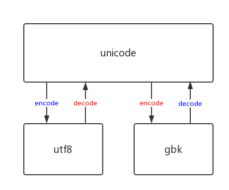
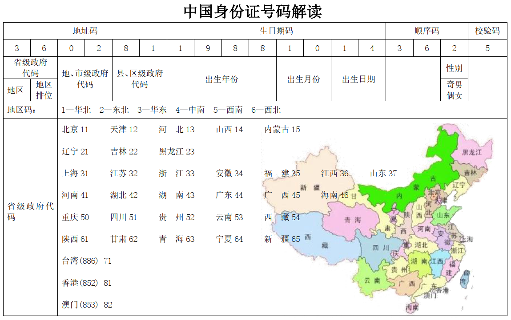
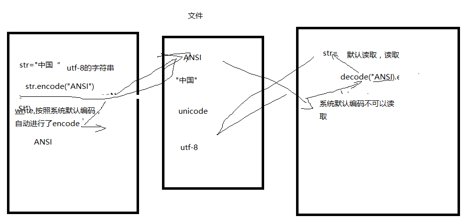

# Python Input & output

<!-- TOC -->

- [Python Input & output](#python-input--output)
    - [encode, decode](#encode-decode)
    - [`repr()` vs `str()`](#repr-vs-str)
    - [file operation](#file-operation)
    - [文件缓存区](#文件缓存区)
    - [文件指针](#文件指针)
    - [pickle & json](#pickle--json)
    - [数据清洗](#数据清洗)
        - [QQ Example](#qq-example)
        - [kaifang Example](#kaifang-example)
        - [csdn examples](#csdn-examples)

<!-- /TOC -->

## encode, decode



python3的字符串编码始终是unicode, 可以直接encode到gbk, utf8的二进制;

如果该py文件编码为utf8, 那么开头就要`#-*-coding:utf8-*-`; 如果文件编码是gbk, 那么文件开头就要`#-*-coding:gbk-*-`; 不论文件编码是啥，字符串的编码都是`unicode`

```python
# unicode_str=u'你好' # 默认是u''
unicode_str='你好'
print(unicode_str)

utf8_str=unicode_str.encode('utf8')
print(utf8_str)

gbk_str=unicode_str.encode('gbk')
print(gbk_str)
```

## `repr()` vs `str()`

`repr()` 输出对 Python比较友好，而`str()`的输出对用户比较友好;对于数值类型，没有差别

```python
myStr1="Hello,Python"
print(str(myStr1))
print(repr(myStr1))
#repr()可以观察转义字符
myStr2="Hello\n"
print(str(myStr2))
print(repr(myStr2))
```

```bash
#output
Hello,Python
'Hello,Python'
Hello

'Hello\n'
```

```python
#repr可以处理任意类型，并且标识出类型;但是str就不行
print(repr(str))
print(repr(int))
print(repr("1"))
print(repr(1))
print(str("1"))
print(str(1))
```

```bash
#output
<class 'str'>
<class 'int'>
'1'
1
1
1
```

```python
print("1".rjust(5),"grey")
print("1".ljust(5),"grey")

for x in range(5):
    print(repr(x).rjust(5),repr(x**2).rjust(5),repr(x**3).rjust(5))
```

```bash
#output
    1 grey
1     grey
    0     0     0
    1     1     1
    2     4     8
    3     9    27
    4    16    64
```

## file operation

注意: `tty`文件就是设备文件可以用`isatty(), readable(), seekable()`来判断, 

```python
# read line by line
with open(r"C:\Users\Administrator\Documents\new.txt","r") as file:
    for line in file:
        print(line, end='')
```

```python
#write english,r是为了避免转义字符
myFile=open(r"C:\Users\Administrator\Documents\new.txt","w")
myFile.write("grey")
myFile.close()
```

```python
#read english
myFile=open(r"C:\Users\Administrator\Documents\new.txt","r")
myStr=myFile.read()
print(myStr)
myFile.close()
```

```python
#write chinese,要用wb,并且encode()
myFile=open(r"C:\Users\Administrator\Documents\newBChinese.txt","wb")#写入文件的是二进制
myFile.write("你好abc".encode('utf-8'))#因为是写，索引encode()
myFile.close()
```

```python
#read chiese,要用rb,并且要decode()
myFile=open(r"C:\Users\Administrator\Documents\newBChinese.txt","rb")#读出来的是二进制
myStr=myFile.read()#这里的myStr是<class "bytes">
print(myStr.decode("utf-8"))
# print(myStr.decode("gbk","ignore"))#强行用gbk来decode()
myFile.close()
```

通常中文版的操作系统中默认是**gbk**的encode,decode

所以有下面的两种情况

```python
#write english,r是为了避免转义字符
myFile=open(r"C:\Users\Administrator\Documents\newGBK.txt","w")
myFile.write("你好abc")
myFile.close()
```

```python
#read english
myFile=open(r"C:\Users\Administrator\Documents\newGBK.txt","r")
myStr=myFile.read()
print(myStr)#你好abc
myFile.close()
```

```python
# 修改文件
# method1: 全部读入内存，然后查找、修改
# method2: 逐行边读边查找，修改;
import sys

find_str=sys.argv[1]
replace_str=sys.argv[2]

with open('untitled1.txt', 'r') as file_old, open('untitled2.txt','w'): as file_new:
    for line in file_old:
        if find_str in line:
            line=line.replace(find_str, replace_str)
        file_new.write(line)
```

其实用文本程序(notepad,vscode,atom)打开文件，该程序看到的也是二进制；但是这些程序支持多种decode的方式(根据文件头来decode)。只有像上面那种强行用一种decode的方式打开不同encode的文件，才会乱码

- encode,decode采用的方式不同，会出错
- 比如`utf-8`中的某些字符`gbk`没有
- 强行解码也是可以的(要用`ignore`)，一般都是乱码(除了英文，english一般在任何方式中都是1byte来表示)

## 文件缓存区

```python
# 进度条
import sys, time

for i in range(50):
    sys.stdout.write('#')
    sys.stdout.flush()
    time.sleep(0.1)
```

```python
import time
myFile=open(r"C:\Users\Administrator\Documents\new.txt","w")
myFile.write("Hello,grey")#write写入的内存的缓冲区，没有实时地写入硬盘
time.sleep(4)#这个时候，文件并没有写入，只是存在于缓存区
myFile.close()#close()之后，缓冲区的东西才会push进入硬盘中
```

```python
import time
myFile=open(r"C:\Users\Administrator\Documents\new.txt","w")
myFile.write("Hello,grey")
myFile.flush()#这个时候已经写入硬盘了
time.sleep(4)
myFile.close()
```

一些函数：

```python
myFile.read(10)#读10个
myFile.readline()
myFile.readlines()#放入list
```

windows cmd下的type是读取文件`type myText.txt` or `more myText.txt`

```python
#二进制的读取、print
myFile=open(r"C:\Users\Administrator\Documents\codeRain.txt","r")
for binary_line in myFile:
    print(binary_line)#每一行都是二进制的
myFile.close()
```

```python
with open('untitled.txt','r+', encoding='utf8') as file:
    file.readline()
    file.readline()
    file.readline()
    # 坑: 下面的内容不是从文件指针的地方覆盖地写, 与c/c++不同; 而是直接在末尾写
    file.write("="*20)
```

```python
with open('untitled.txt','r+', encoding='utf8') as file:
    file.seek(10)
    # 下面的内容写诗正常的
    file.write("="*20)
```

## 文件指针

```python
myFile=open(r"C:\Users\Administrator\Documents\apple.txt","rb")
myStr=myFile.readline()#read 1st line
print(myStr.decode("utf-8"))#I went down to the river,
myFile.close()
```

```python
#seek()
myFile=open(r"C:\Users\Administrator\Documents\apple.txt","r")
myFile.seek(10,0)#15 is offset,0 is begin，1 is current,2 is end
myStr=myFile.readline()#read 1st line
print(myStr)#n to the river,
myFile.close()
```

```python
myFile.seek(0,0)#跳到开头
```

```python
#tell()
myFile=open(r"C:\Users\Administrator\Documents\number.txt","r")
myStr=myFile.readline()
print(len(myStr),myFile.tell())#11 12
print(myStr)#1234567890 
myFile.close()
```

```bash
#txt content
1234567890
12345678
123456
```

```python
#改成rb
myFile=open(r"C:\Users\Administrator\Documents\number.txt","rb")
```

```bash
#output
12 12
b'1234567890\r\n'
```

```python
file=open('test.txt', 'w')
file.write('hello, world')
file.close()

# open again
file=open('test.txt', 'r+')
buf=file.read() # 文件指针已经到了末尾
print(buf) # hello, world

file.write('hello, grey')
file.flush()
file.seek(0)
buf=file.read()
print(buf) # hello, worldhello, grey

file.seek(0)
file.write('1234')
file.flush()
file.seek(0)
print(file.read()) # 1234o, worldhello, grey
file.close()
```

C语言中的`FILE`结构体包含了: mode(`r`, `w`, `r+`..), 读写指针的位置, 缓存区地址指针, 文件描述符; python只是对于C的二次封装;

```c
#include <stdio.h>

int main(){
    printf("hello");
    // 如果没有fflush, 什么都不会打印出来
    // stdout就是显示器，也是一个文件
    fflush(stdout);
    while(1){
        ;
    }
    print("world");
    return 0;
}
```

刷新缓冲区的情况:
- 手动`fflush()`
- 缓冲区满，自动刷新, 一般是8192Bytes(8M)
- 文件关闭时候，自动刷新

```c
# include <stdio.h>
# include <stdlib.h>

int main(){
    print("hello");
    // 文件关闭自动刷新
    // exit(0)
    fclose(stdout);
    
    while(1){
        ;
    }
    print("world");
    return 0;
}
```

## pickle & json

pickle vs json:
- pickle: bytes与python类型直接转换: `dumps`, `dump`, `loads`, `load`
- json: 字符串与python类型之间转换: `dumps`, `dump`, `loads`, `load`

上面的python类型只能是数据类型，不能是类似`<function>`这种类型

`json`只能处理str, list, tuple, set, dict这中简单的; `json`主要是不同语言中的交换数据, 主要用的是dictionary; `xml`被`json`淘汰;`pickle`是python专用的;

```python
# pickle
import pickle

data1=[1, 2, 3, 4, 5]
data2='grey'

# dumps
pickle1_repr=pickle.dumps(data1)
pickle2_repr=pickle.dumps(data2)
print(pickle1_repr, pickle2_repr)

# loads
data1_frompickle1=pickle.loads(pickle1_repr)
data2_frompickle2=pickle.loads(pickle2_repr)
print(data1_frompickle1, data2_frompickle2)

# dump: 二进制文件
with open('temp1.dat', 'wb') as file1, open('temp2.dat', 'wb') as file2:
    pickle.dump(data1, file1)
    pickle.dump(data2, file2)
# load
with open('temp1.dat', 'rb') as file1, open('temp2.dat', 'rb') as file2:
    data3=pickle.load(file1)
    data4=pickle.load(file2)
print(data3, data4)
```

```python
# json
import json

data1=[1, 2, 3, 4, 5]
data2='grey'

# dumps: 返回值是str
json1_repr=json.dumps(data1)
json2_repr=json.dumps(data2)
print(json1_repr, json2_repr) 

# loads： 返回值是原类型
data1_fromjson1=json.loads(json1_repr)
data2_fromjson2=json.loads(json2_repr)
print(data1_fromjson1, data2_fromjson2)

# dump: 文本文件
with open('temp1.dat', 'w') as file1, open('temp2.dat', 'w') as file2:
    json.dump(data1, file1)
    json.dump(data2, file2)
# load： 返回值是原类型
with open('temp1.dat', 'r') as file1, open('temp2.dat', 'r') as file2:
    data3=json.load(file1)
    data4=json.load(file2)
print(data3, data4) 
```

```python
#查询dangdang的数据，并简单统计
import codecs

def  loaddata():
    filepath = r"C:\dangdang.txt"
    file = codecs.open(filepath, "rb", encoding="gbk", errors="ignore")
    global datalist #引用全局
    datalist=file.readlines() #读取文件到list,疯狂占用内存
    file.close()
def  search(namestr):
    savefilepath="C:\\data\\"+namestr+".txt"
    savefile=open(savefilepath,"wb")
    numbers=0#统计查询的人的记录数
    for  line  in datalist:
        if line.find(namestr)!=-1:
            print(line,end="") #显示数据
            numbers +=1
            savefile.write(line.encode("utf-8"))#写入
    savefile.write(("数量"+str(numbers)).encode("utf-8"))
    savefile.close()

#program begin
datalist=[]
print("load  file start")
loaddata()
print("load  file end")
while True:
    searchname=input("要查询的数据")
    search(searchname)
```

## 数据清洗

### QQ Example

```python
#简单分析数据
#会报错，因为有垃圾数据
import codecs
filePath=r"C:\1E~001.txt"
file=codecs.open(filePath,"rb","gbk","ignore")
myBigList=file.readlines()
#
saveFilePath=r"C:\data\QQIds.txt"
for line in myBigList:
    qqIdList=line.split("----")
    print(qqIdList[1])
```

```python
#简单分析垃圾，爬虫爬的数据也要经过这样的方式进行数据清洗
import codecs
filePath=r"C:\1E~001.txt"
file=codecs.open(filePath,"rb","gbk","ignore")
myBigList=file.readlines()
#
saveFilePath=r"C:\data\QQIds.txt"
for line in myBigList:
    qqIdList=line.split("----")
    if len(line)>50:
        print(line)#打印垃圾数据，用来分析
    if len(qqIdList)==2:
        print(qqIdList[1])
```

```python
#初步清洗
#好的数据保存到一个文件；坏的数据保存到另一个文件
import codecs
filePath=r"C:\1E~001.txt"
file=codecs.open(filePath,"rb","gbk","ignore")
myBigList=file.readlines()
#
saveGoodFilePath=r"C:\data\QQGoodIds.txt"
saveBadFilePath=r"C:\data\QQBadIds.txt"

goodFile=open(saveGoodFilePath,"wb")
badFile=open(saveBadFilePath,"wb")

for line in myBigList:
    if len(line)>50 or len(line)<15:
        badFile.write(line.encode("gbk"))
        pass#bad qqid
    else:
        qqIdList=line.split("----")
        if len(qqIdList)==2:
            goodFile.write(line.encode("utf-8"))
            print(qqIdList[1])
        else:
            badFile.write(line.encode("utf-8"))
            pass#bad qqid

goodFile.close()
badFile.close()
```

windows用`type myData.txt`来查看大数据文本；也可以用`more myData.txt`一个`Enter`看一条

根据md5加密后的结果，利用彩虹表可以还原出明文；

```python
#从清洗的QQGoodIds中提取每一行的第二个
#第一个是qq号，第二个是密码
import codecs
filePath=r"C:\data\QQGoodIds.txt"
file=codecs.open(filePath,"rb","utf-8","ignore")
#
saveColumn2FilePath=r"C:\data\QQ2ndColumn.txt"
Column2File=open(saveColumn2FilePath,"wb")

for line in file:
    tempList=line.split("----")
    Column2File.write(tempList[1].encode("utf-8"))

file.close()
Column2File.close()
```

```python
#数据排序
filepath=r"C:\data\QQ2ndColumn.txt"
file=open(filepath,"rb")
mylist=file.readlines() #读取所有
mylist.sort()#排序,在内存中
file.close()
#将内存中的数据写入文件
savefilepath=r"C:\data\QQ2ndColumnSort.txt"
savefile=open(savefilepath,"wb")
for  line in  mylist:
    savefile.write(line)
savefile.close()
```

```python
#count every item times
filepath=r"C:\data\QQ2ndColumnSort.txt"
file=open(filepath,"rb")
mylist=file.readlines() #读取所有
length=len(mylist)
file.close()

savefilepath=r"C:\data\QQ2ndColumnSortCount.txt"
savefile=open(savefilepath,"wb")

i=0
while i<length-1:
    times=1
    passwordstr=mylist[i]
    while i+1<=length-1  and mylist[i].decode("utf-8")==mylist[i+1].decode("utf-8"):
        times+=1
        i+=1
    #print(times, passwordstr)
    savefile.write((str(times)+" "+passwordstr.decode("utf-8")).encode("utf-8"))
    i+=1

savefile.close()
```

both `list.sort()` and `sorted()` added a key parameter to specify a function to be called on each list element prior to making comparisons.

```python
#根据上面统计的次数来排序
file =open(r"C:\data\QQ2ndColumnSortCount.txt","rb")
mylist=file.readlines() #读取内存
file.close()

newlist=[] #存储账户密码与次数
for  line in mylist:
    line=line.decode("utf-8")#二进制转化为文本
    linelist=line.split(' ')#文本的切糕
    newlist.append(linelist)
#[["1","12321"],["2"，"123213"]]
#newlist.sort(key=operator.itemgetter(0)) #根据第一个排序
newlist.sort(key=lambda x:int(x[0]), reverse=True) #次数转化为整数排序  x=["1","12321"]

savefilepath=r"C:\data\QQ2ndColumnSortCountLast.txt"
savefile=open(savefilepath,"wb")
for data  in newlist:
    savefile.write((data[0]+" "+data[1]).encode("utf-8"))
savefile.close()
print("save ")
```

```python
#把5，6，7位qq号分别写到不同文件
#轻量级的贝叶斯分类器
QQlist=[5,6,7,8,9,10,11,"小垃圾"]

filepath=r"C:\data\QQGoodIds.txt"
file=open(filepath,"rb")
mylist=file.readlines()
file.close()

filelist=[]
for  i  in QQlist:
    QQfilepath="C:\\data\\"+str(i)+"位QQ.txt"
    QQfile = open(QQfilepath, "wb")
    filelist.append(QQfile)

for  line  in  mylist:
    bakline=line#指向原来的内存
    line=line.decode("utf-8")
    linelist=line.split("----")
    length=len(linelist[0] )#取账号的长度
    if length==5:
        filelist[0].write(bakline)
    elif length==6:
        filelist[1].write(bakline)
    elif length == 7:
        filelist[2].write(bakline)
    elif length == 8:
        filelist[3].write(bakline)
    elif length == 9:
        filelist[4].write(bakline)
    elif length == 10:
        filelist[5].write(bakline)
    elif length == 11:
        filelist[6].write(bakline)
    else:
        filelist[7].write(bakline)

for  QQfile  in filelist:
    QQfile.close()
```

### kaifang Example



```python
#Step1:数据清洗
#只是获取了18位的身份证，15位的是另外的解释
import codecs
filepath=r"C:\Data\kaifangX.txt"
file=codecs.open(filepath,"rb","gbk","ignore")#按照指定编码
mylist=file.readlines()#返回一个list,读取到内存
file.close()

savegoodfilepath=r"C:\Data\kaifangXGood18.txt"
savebadfilepath=r"C:\Data\kaifangXBad.txt"
filegood=open(savegoodfilepath,"wb")
filebad=open(savebadfilepath,"wb")
for  line  in  mylist:
    linelist=line.split(",")
    if  len(linelist)>=2:
        if len(linelist[1])==18:
            #good
            filegood.write(line.encode("utf-8"))
            pass
        else:
            #bad
            filebad.write(line.encode("utf-8"))
            pass
    else:
        #bad
        filebad.write(line.encode("utf-8"))
        pass


filebad.close()
filegood.close()
```

```python
#6大区域划分,同样的思路，可以统计省份、市、区
import codecs
filepath=r"C:\Data\kaifangXGood18.txt"
file=codecs.open(filepath,"rb","utf-8","ignore")#按照指定编码
mylist=file.readlines()#返回一个list,读取到内存
file.close()

area=[[1,"华北"],[ 2,"东北" ],[3,"华东"],[4,"中南"],[5,"西南"],[6,"西北"]]
areafilelist=[]
length=len(area)#长度
for  data in area:
    kffilepath="C:\\Data\\地区\\"+data[1]+".txt"
    kffile=open(  kffilepath,"wb")
    areafilelist.append(kffile)

for  line  in  mylist:
    linelist=line.split(",") #字符串切割
    chstr=linelist[1][0] #取出一个字符
    for  i  in range(length):
        if  chstr==str(area[i][0]):
            areafilelist[i].write(line.encode("utf-8"))
            break

for  kffile in areafilelist:#关闭文件
    kffile.close()
```

```python
#省份划分
import codecs
filepath=r"C:\Data\kaifangXGood18.txt"
file=codecs.open(filepath,"rb","utf-8","ignore")#按照指定编码
mylist=file.readlines()#返回一个list,读取到内存
file.close()

area=[[11,"北京"],[12,"天津"],[13,"河北"],[14,"山西"],[15,"内蒙古"],[21,"辽宁"],[22,"吉林"],[23,"黑龙江"],[31,"上海"],[32,"江苏"],[33,"浙江"],[34, "安徽"],[35,"福建"],[36,"江西"],[37,"山东"],[41,"河南"],[42,"湖北"],[43, "湖南"],[44,"广东"],[45,"广西"],[46,"海南"],[50,"重庆"],[51, "四川"],[52,"贵州"],[53,"云南"],[54,"西藏"],[61,"陕西"],[62, "甘肃"],[63,"青海"],[64,"宁夏"],[65,"新疆"],[71,"台湾"],[81, "香港"],[82,"澳门"]]
areafilelist=[]
length=len(area)#长度
for  data in area:
    kffilepath="C:\\Data\\省份\\"+data[1]+".txt"
    kffile=open(  kffilepath,"wb")
    areafilelist.append(kffile)

for  line  in  mylist:
    linelist=line.split(",") #字符串切割
    chstr=linelist[1][0:2] #取出2个字符；不包括2
    for  i  in range(length):
        if  str(area[i][0])==chstr:
            areafilelist[i].write(line.encode("utf-8"))
            break

for  kffile in areafilelist:#关闭文件
    kffile.close()
```

```python
#划分年龄、星座、属相
import codecs
filepath=r"C:\Data\kaifangXGood18.txt"
file=codecs.open(filepath,"rb","utf-8","ignore")#按照指定编码
mylist=file.readlines()#返回一个list,读取到内存
file.close()

area=[x  for x in range(1900,2018)]
areafilelist=[]
length=len(area)#长度
for  data in area:
    kffilepath="C:\\Data\\age\\"+str(data)+".txt"#比如, 1993.txt
    kffile=open(  kffilepath,"wb")
    areafilelist.append(kffile)

for  line  in  mylist:
    linelist=line.split(",") #字符串切割
    chstr=linelist[1][6:10] #取出4个字符
    for  i  in range(length):
        if  str(area[i])==chstr:
            areafilelist[i].write(line.encode("utf-8"))
            break

print("over")
for  kffile in areafilelist:#关闭文件
    kffile.close()
```

```python
#按照月份划分
import codecs
filepath=r"C:\Data\kaifangXGood18.txt"
file=codecs.open(filepath,"rb","utf-8","ignore")#按照指定编码
mylist=file.readlines()#返回一个list,读取到内存
file.close()

area=["%02d"%x for x in range(1,13)]
# area=["01","02","03","04","05","06","07","08","09","10","11","12"]
areafilelist=[]
length=len(area)#长度
for  data in area:
    kffilepath="C:\\Data\\month\\"+str(data)+"月.txt"
    kffile=open(  kffilepath,"wb")
    areafilelist.append(kffile)

for  line  in  mylist:
    linelist=line.split(",") #字符串切割
    chstr=linelist[1][10:12] #取出2个字符
    for  i  in range(length):
        if  str(area[i])==chstr:
            areafilelist[i].write(line.encode("utf-8"))
            break

for  kffile in areafilelist:#关闭文件
    kffile.close()
```

```python
#按照day划分
import codecs
filepath=r"C:\Data\kaifangXGood18.txt"
file=codecs.open(filepath,"rb","utf-8","ignore")#按照指定编码
mylist=file.readlines()#返回一个list,读取到内存
file.close()

area=["%02d"%x for x in range(1,32)]#01~31
areafilelist=[]
length=len(area)#长度
for  data in area:
    kffilepath="C:\\Data\\day\\"+str(data)+"日.txt"
    kffile=open(  kffilepath,"wb")
    areafilelist.append(kffile)

for  line  in  mylist:
    linelist=line.split(",") #字符串切割
    chstr=linelist[1][12:14] #取出2个字符
    for  i  in range(length):
        if  str(area[i])==chstr:
            areafilelist[i].write(line.encode("utf-8"))
            break

for  kffile in areafilelist:#关闭文件
    kffile.close()
```

文件缓冲区是为了保护磁盘，集中在一起，一次写入，一次读取；不是实时地写入；

```python
#一些注意事项
#文件的utf-8与系统的utf-8不同
file=open(r"C:\Data\grey.txt",'w')
myStr="你好,China"#字符串默认是utf-8
file.write(myStr)#自动转码，这是系统指定的，比如中文系统自动转码为gbk(也就是notepad中的ANSI)
file.close()

anotherFile=open(r"C:\Data\grey.txt",'r')
anotherStr=anotherFile.read()#也是按照系统指定的编码读取(默认为gbk也就是notepad中的ANSI)
print(anotherStr)
anotherFile.close()
```



所以，写文件的时候，自己指定一种机制(也就是上面的`import codecs`);都是读写二进制

### csdn examples

```python
#制作概率密码字典
#首先需要进行排序，方便统计次数
filepath=r"C:\Users\Tsinghua-yincheng\Desktop\day12up\csdnpassword.txt"
file=open(filepath,"rb")
mylist=file.readlines() #读取所有
mylist.sort()#排序
file.close()

print("sort ")
savefilepath=r"C:\Users\Tsinghua-yincheng\Desktop\day12up\csdnpasswordsort.txt"
savefile=open(savefilepath,"wb")
for  line in  mylist:
    savefile.write(line)
savefile.close()
print("save ")
```

```python
#排序逻辑
mylist=["a","a","b","c","c","c","d","d","d","d"]
length=len(mylist)#求长度

i=0
while i<length-1:#遍历列表
    times=1 #次数
    passwordstr=mylist[i]#记录密码
    while  i+1<=length-1  and mylist[i]==mylist[i+1]:#i+1不能越界
        times+=1  #次数+1
        i+=1      #i前进
    print(times,passwordstr)
    i+=1
```

```python
#统计密码次数
filepath=r"C:\data\csdnpasswordsort.txt"
file=open(filepath,"rb")
mylist=file.readlines() #读取所有
length=len(mylist)
file.close()

savefilepath=r"C:\data\csdnpasswordsorttimes.txt"
savefile=open(savefilepath,"wb")

i=0
while i<length-1:
    times=1
    passwordstr=mylist[i]#这里还是二进制
    while i+1<=length-1  and mylist[i].decode("utf-8")==mylist[i+1].decode("utf-8"):
        times+=1
        i+=1
    savefile.write((str(times)+" "+passwordstr.decode("utf-8")).encode("utf-8"))
    i+=1

savefile.close()
```

```python
#对统计完次数的密码，进行次数排序
'''
func=lambda:print("hello world")
func()

(lambda:print("hello world"))()
'''
import operator
file =open(r"C:\data\csdnpasswordsorttimes.txt","rb")
mylist=file.readlines() #读取内存
file.close()

newlist=[] #存储账户密码与次数
for  line in mylist:
    line=line.decode("utf-8")#二进制转化为文本
    linelist=line.split(' ')#文本的切糕
    newlist.append(linelist)
#[["1","12321"],["2"，"123213"]]
#newlist.sort(key=operator.itemgetter(0)) #根据第一个排序
newlist.sort(key=lambda x:int(x[0]),reverse=True) #次数转化为整数排序  x=["1","12321"]

savefilepath=r"C:\data\csdnpasswordsorttimesLast.txt"
savefile=open(savefilepath,"wb")
for data  in newlist:
    savefile.write((data[0]+" "+data[1]).encode("utf-8"))
savefile.close()
```
最后读取`C:\data\csdnpasswordsorttimesLast.txt`分理出第二列，然后就可以用来作为破解密码词典了

