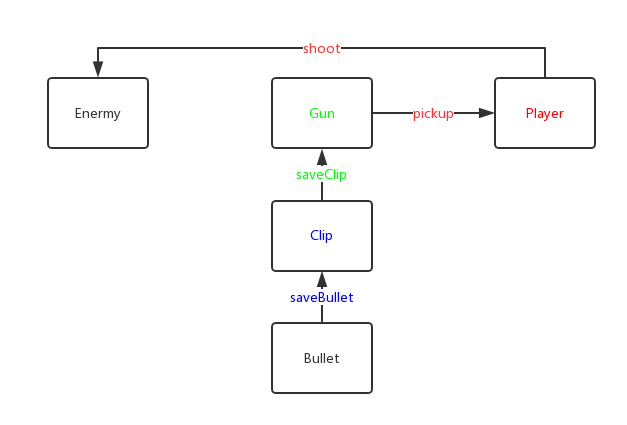
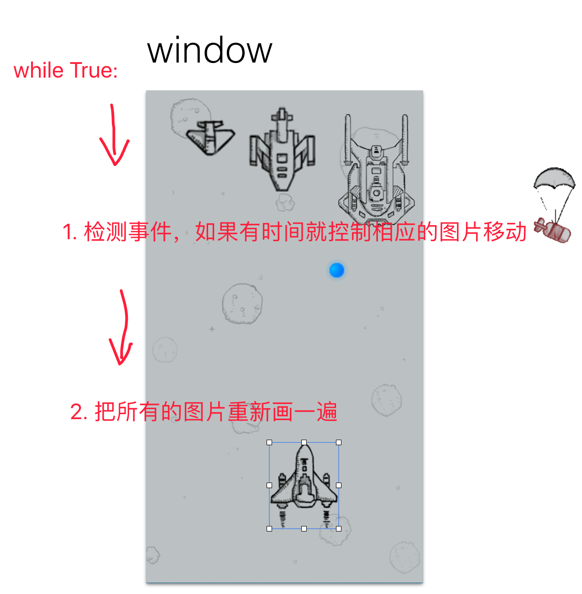
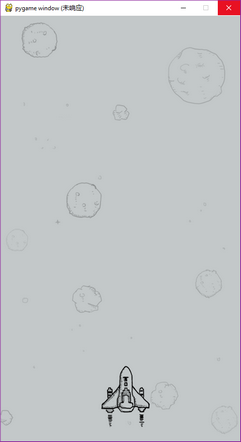
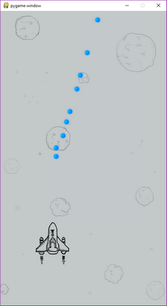
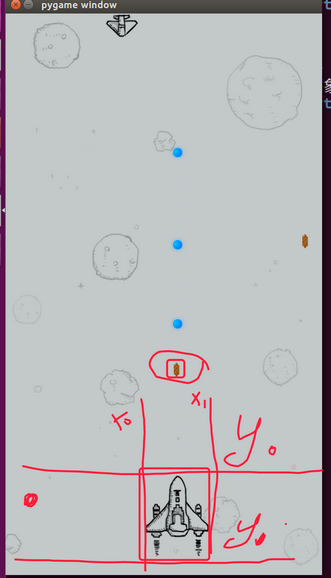

# Python OOP example

- [Python OOP example](#python-oop-example)
    - [fps game](#fps-game)
        - [Final code](#final-code)
    - [飞机大战](#%E9%A3%9E%E6%9C%BA%E5%A4%A7%E6%88%98)
        - [new window & load pic](#new-window-load-pic)
        - [key listen](#key-listen)
        - [change to OOP](#change-to-oop)
        - [plane fire](#plane-fire)
        - [enermy move & 子弹边界消失](#enermy-move-%E5%AD%90%E5%BC%B9%E8%BE%B9%E7%95%8C%E6%B6%88%E5%A4%B1)
        - [enemyPlane fire](#enemyplane-fire)
        - [抽取基类](#%E6%8A%BD%E5%8F%96%E5%9F%BA%E7%B1%BB)
        - [爆炸效果](#%E7%88%86%E7%82%B8%E6%95%88%E6%9E%9C)
    - [python Review](#python-review)

## fps game



```python
def main():
    pass
    #1. create playerInstance

    #2. create enermyInstance
    
    #3. create gunInstance

    #4. creat clipInstance(弹夹)

    #5. create bulletInstance

    #6. playerInstance put bulletInstance to clipInstance

    #7. playerInstance put clipInstance to gunInstance

    #8. playerInstance pick up the gunInstance

    #9. playerInstance shoot enermyInstance

if __name__ == '__main__':
    main()
```

First Test:

```python
class Player(object):
    def __init__(self, name):
        self.name = name

    def reloadBullet(self, clip_temp, bullet_temp):
        """bullet2clip"""
        clip_temp.saveBullet(bullet_temp)

    def reloadClip(self, gun_temp, clip_temp):
        """clip2gun"""
        gun_temp.saveClip(clip_temp)


class Gun(object):
    def __init__(self, name):
        self.name = name
        self.__clip = None

    def saveClip(self, clip_temp):
        """gun save clip"""
        self.__clip = clip_temp

    def __str__(self):
        if self.__clip:
            # 巧妙地用到了clip中的__str__
            return f"gunInfo:{self.name} with {self.__clip}"
        else:
            return f"gunInfo:{self.name} without clip"


class Clip(object):
    def __init__(self, max_bullets):
        self.max_bullets = max_bullets
        self.bullet_list = []

    def saveBullet(self, bullet_temp):
        """clip save bullet"""
        self.bullet_list.append(bullet_temp)

    def __str__(self):
        return f"current Clip:{len(self.bullet_list)}/{self.max_bullets}"


class Bullet(object):
    def __init__(self, damage):
        self.damage = damage


class Enermy(object):
    def __init__(self, name):
        self.name = name


def main():
    # 1.create playerInstance
    player1 = Player("grey")
    # 2. create enermyInstance
    enermy1 = Enermy("zoombie")
    # 3.create gunInstance
    ak471 = Gun("AK47")
    # 4. creat clipInstance(弹夹)
    clip1 = Clip(20)
    for i in range(12):
        # 5. create bulletInstance
        bullet1 = Bullet(10)  # 杀伤力
        # 6. playerInstance put bulletInstance to clipInstance
        player1.reloadBullet(clip1, bullet1)
    # 7. playerInstance put clipInstance to gunInstance
    player1.reloadClip(ak471, clip1)
    # test1
    print(clip1)
    # test2
    print(ak471)
    # 8. playerInstance pick up the gunInstance

    # 9. playerInstance shoot enermyInstance


if __name__ == '__main__':
    main()
```

```bash
#output
current Clip:12/20
gunInfo:AK47 with current Clip:12/20
```

Second Test:

```python
class Player(object):
    def __init__(self, name):
        self.name = name
        self.gun = None
        self.hp = 100

    def reloadBullet(self, clip_temp, bullet_temp):
        """bullet2clip"""
        clip_temp.saveBullet(bullet_temp)

    def reloadClip(self, gun_temp, clip_temp):
        """clip2gun"""
        gun_temp.saveClip(clip_temp)

    def pickup(self, gun_temp):
        """playerPickupGun"""
        self.gun = gun_temp

    def __str__(self):
        if self.gun:
            return f"{self.name}'s HP={self.hp}, gun={self.gun}"
        else:
            return f"{self.name}'s HP={self.hp}, without gun"


class Gun(object):
    def __init__(self, name):
        self.name = name
        self.__clip = None

    def saveClip(self, clip_temp):
        """gun save clip"""
        self.__clip = clip_temp

    def __str__(self):
        if self.__clip:
            # 巧妙地用到了clip中的__str__
            return f"{self.name}, {self.__clip}"
        else:
            return f"{self.name} without clip"


class Clip(object):
    def __init__(self, max_bullets):
        self.max_bullets = max_bullets
        self.bullet_list = []

    def saveBullet(self, bullet_temp):
        """clip save bullet"""
        self.bullet_list.append(bullet_temp)

    def __str__(self):
        return f"clip={len(self.bullet_list)}/{self.max_bullets}"


class Bullet(object):
    def __init__(self, damage):
        self.damage = damage


class Enermy(object):
    def __init__(self, name):
        self.name = name


def main():
    # 1.create playerInstance
    player1 = Player("grey")
    # 2. create enermyInstance
    enermy1 = Enermy("zoombie")
    # 3.create gunInstance
    ak47 = Gun("AK47")
    # 4. creat clipInstance(弹夹)
    clip1 = Clip(20)
    for i in range(12):
        # 5. create bulletInstance
        bullet1 = Bullet(10)  # 杀伤力
        # 6. playerInstance put bulletInstance to clipInstance
        player1.reloadBullet(clip1, bullet1)
    # 7. playerInstance put clipInstance to gunInstance
    player1.reloadClip(ak47, clip1)
    # # test1
    # print(clip1)
    # # test2
    # print(ak47)
    # 8. playerInstance pick up the gunInstance
    player1.pickup(ak47)
    # test3
    print(player1)
    # 9. playerInstance shoot enermyInstance


if __name__ == '__main__':
    main()
```

```bash
#output
grey's HP=100, gun=AK47, clip=12/20
```

Test shoot:

```python
class Player(object):
    def __init__(self, name):
        self.name = name
        self.gun = None
        self.hp = 100

    def reloadBullet(self, clip_temp, bullet_temp):
        """bullet2clip"""
        clip_temp.saveBullet(bullet_temp)

    def reloadClip(self, gun_temp, clip_temp):
        """clip2gun"""
        gun_temp.saveClip(clip_temp)

    def pickup(self, gun_temp):
        """playerPickupGun"""
        self.gun = gun_temp

    def __str__(self):
        if self.gun:
            return f"{self.name}'s HP={self.hp}, gun={self.gun}"
        else:
            return f"{self.name}'s HP={self.hp}, without gun"

    def shoot(self, player_temp):
        """let the gun lanch bullet to hit enermy"""
        self.gun.fire(player_temp)

    def dropHP(self, damage_temp):
        self.hp -= damage_temp


class Gun(object):
    def __init__(self, name):
        self.name = name
        self.__clip = None

    def saveClip(self, clip_temp):
        """gun save clip"""
        self.__clip = clip_temp

    def __str__(self):
        if self.__clip:
            # 巧妙地用到了clip中的__str__
            return f"{self.name}, {self.__clip}"
        else:
            return f"{self.name} without clip"

    def fire(self, player_temp):
        """gun get a bullet from clip, the bullet hit enermy"""
        # get a bullet
        bullet_temp = self.__clip.popBullet()
        # hit enermy
        if bullet_temp:
            bullet_temp.hit(player_temp)
        else:
            print("no bullet left in clip")


class Clip(object):
    def __init__(self, max_bullets):
        self.max_bullets = max_bullets
        self.bullet_list = []

    def saveBullet(self, bullet_temp):
        """clip save bullet"""
        self.bullet_list.append(bullet_temp)

    def __str__(self):
        return f"clip={len(self.bullet_list)}/{self.max_bullets}"

    def popBullet(self):
        """pop the top bullet(先进后出)"""
        if self.bullet_list:
            return self.bullet_list.pop()
        else:
            return None


class Bullet(object):
    def __init__(self, damage):
        self.damage = damage

    def hit(self, player_temp):
        player_temp.dropHP(self.damage)


def main():
    # 1.create playerInstance
    player1 = Player("grey")
    # 2. create enermyInstance
    enermy1 = Player("Zoombie")
    # 3.create gunInstance
    ak47 = Gun("AK47")
    # 4. creat clipInstance(弹夹)
    clip1 = Clip(20)
    for i in range(12):
        # 5. create bulletInstance
        bullet1 = Bullet(13)  # 杀伤力
        # 6. playerInstance put bulletInstance to clipInstance
        player1.reloadBullet(clip1, bullet1)
    # 7. playerInstance put clipInstance to gunInstance
    player1.reloadClip(ak47, clip1)
    # # test1
    # print(clip1)
    # # test2
    # print(ak47)
    # 8. playerInstance pick up the gunInstance
    player1.pickup(ak47)
    # test3
    print(player1)
    # test4
    print(enermy1)
    # 9. playerInstance shoot enermyInstance
    player1.shoot(enermy1)
    # test5
    print(player1)
    print(enermy1)


if __name__ == '__main__':
    main()
```

```bash
#output
grey's HP=100, gun=AK47, clip=12/20
Zoombie's HP=100, without gun
grey's HP=100, gun=AK47, clip=11/20
Zoombie's HP=87, without gun
```

### Final code

```python
import time


class Player(object):
    def __init__(self, name):
        self.name = name
        self.gun = None
        self.hp = 100

    def reloadBullet(self, clip_temp, bullet_temp):
        """bullet2clip"""
        clip_temp.saveBullet(bullet_temp)

    def reloadClip(self, gun_temp, clip_temp):
        """clip2gun"""
        gun_temp.saveClip(clip_temp)

    def pickup(self, gun_temp):
        """playerPickupGun"""
        self.gun = gun_temp

    def __str__(self):
        if self.hp > 0:
            if self.gun:
                return f"{self.name}'s HP={self.hp}, gun={self.gun}"
            else:
                return f"{self.name}'s HP={self.hp}, without gun"
        else:
            return f"{self.name} is dead!"

    def shoot(self, player_temp):
        """let the gun lanch bullet to hit enermy"""
        self.gun.fire(player_temp)

    def dropHP(self, damage_temp):
        self.hp -= damage_temp


class Gun(object):
    def __init__(self, name):
        self.name = name
        self.__clip = None

    def saveClip(self, clip_temp):
        """gun save clip"""
        self.__clip = clip_temp

    def __str__(self):
        if self.__clip:
            # 巧妙地用到了clip中的__str__
            return f"{self.name}, {self.__clip}"
        else:
            return f"{self.name} without clip"

    def fire(self, player_temp):
        """gun get a bullet from clip, the bullet hit enermy"""
        # get a bullet
        bullet_temp = self.__clip.popBullet()
        # hit enermy
        if bullet_temp:
            bullet_temp.hit(player_temp)
        else:
            print("no bullet left in clip")


class Clip(object):
    def __init__(self, max_bullets):
        self.max_bullets = max_bullets
        self.bullet_list = []

    def saveBullet(self, bullet_temp):
        """clip save bullet"""
        self.bullet_list.append(bullet_temp)

    def __str__(self):
        return f"clip={len(self.bullet_list)}/{self.max_bullets}"

    def popBullet(self):
        """pop the top bullet(先进后出)"""
        if self.bullet_list:
            return self.bullet_list.pop()
        else:
            return None


class Bullet(object):
    def __init__(self, damage):
        self.damage = damage

    def hit(self, player_temp):
        player_temp.dropHP(self.damage)


def main():
    # 1.create playerInstance
    player1 = Player("grey")
    # 2. create enermyInstance
    enermy1 = Player("Zoombie")
    # 3.create gunInstance
    ak47 = Gun("AK47")
    # 4. creat clipInstance(弹夹)
    clip1 = Clip(20)
    for i in range(12):
        # 5. create bulletInstance
        bullet1 = Bullet(33)  # 杀伤力
        # 6. playerInstance put bulletInstance to clipInstance
        player1.reloadBullet(clip1, bullet1)
    # 7. playerInstance put clipInstance to gunInstance
    player1.reloadClip(ak47, clip1)
    # 8. playerInstance pick up the gunInstance
    player1.pickup(ak47)
    # 9. playerInstance shoot enermyInstance
    for i in range(6):
        print(f"{player1}|{enermy1}")
        player1.shoot(enermy1)
        time.sleep(1)


if __name__ == '__main__':
    main()
```

```bash
#output
grey's HP=100, gun=AK47, clip=12/20|Zoombie's HP=100, without gun
grey's HP=100, gun=AK47, clip=11/20|Zoombie's HP=67, without gun
grey's HP=100, gun=AK47, clip=10/20|Zoombie's HP=34, without gun
grey's HP=100, gun=AK47, clip=9/20|Zoombie's HP=1, without gun
grey's HP=100, gun=AK47, clip=8/20|Zoombie is dead!
grey's HP=100, gun=AK47, clip=7/20|Zoombie is dead!
```

## 飞机大战

其中的Resource是在虚拟机中安装Android,再安装一个**飞机大战**的app，最后获取root权限，在目录中直接拷贝它的Resource

```python
# 对于任何2D games
import pygame
```



### new window & load pic

- 集成显卡：屏幕的东西实际是在内存中
- 独立显卡：屏幕的东西存在自己的芯片里面，所以释放了内存，游戏效率更高

```python
import pygame
import time

def main():
    # 1.new a window. depth=32表示层级，depth=0表示surface
    screen = pygame.display.set_mode((480, 852), 0, 32)
    # 2. load a background pic
    background = pygame.image.load("./res/background.png")
    # 3. load a plane pic
    hero1 = pygame.image.load("./res/hero1.png")
    # 4. set pic in screen, 卡住，不让退出
    while True: ##cpu占用很大，所以放了了一time.sleep(0.01)
        screen.blit(background, (0, 0))
        screen.blit(hero1, (200, 700))
        pygame.display.update()##把内存的东西显示到屏幕
        time.sleep(0.01)


if __name__ == '__main__':
    main()
```

通过控制上面的`blit(xxx,(x,y))`可以控制飞机走奇怪的形状



### key listen

```python
import pygame


def main():
    # 1.new a window. depth=32表示层级，depth=0表示surface
    screen = pygame.display.set_mode((480, 852), 0, 32)
    # 2. load a background pic
    background = pygame.image.load("./res/background.png")
    # 3. load a plane pic
    hero1 = pygame.image.load("./res/hero1.png")
    hero_x = 200
    hero_y = 700
    # 4. set pic in screen, 卡住，不让退出
    while True:
        screen.blit(background, (0, 0))
        screen.blit(hero1, (hero_x, hero_y))
        # 获取事件，比如按键等
        for event in pygame.event.get():
            # 判断是否是点击了退出按钮
            if event.type == pygame.QUIT:
                print("exit")
                exit()
            # 判断是否是按下了键
            elif event.type == pygame.KEYDOWN:
                if event.key == pygame.K_a or event.key == pygame.K_LEFT:
                    hero_x -= 10
                elif event.key == pygame.K_d or event.key == pygame.K_RIGHT:
                    hero_x += 10
                elif event.key == pygame.K_w or event.key == pygame.K_UP:
                    hero_y -= 10
                elif event.key == pygame.K_w or event.key == pygame.K_DOWN:
                    hero_y += 10
                elif event.key == pygame.K_SPACE:
                    print('space')
        pygame.display.update()


if __name__ == '__main__':
    main()
```

- break:循环结束
- return:函数结束
- exit():程序结束

### change to OOP

```python
import pygame


class HeroPlane(object):
    def __init__(self, screen):
        self.x = 200
        self.y = 700
        self.screen = screen
        self.image = pygame.image.load("./res/hero1.png")
    def display(self):
        self.screen.blit(self.image, (self.x, self.y))

def main():
    # 1.new a window. depth=32表示层级，depth=0表示surface
    screen = pygame.display.set_mode((480, 852), 0, 32)
    # 2. load a background pic
    background = pygame.image.load("./res/background.png")
    # 3. new a hero instance
    hero1 = HeroPlane(screen)
    # 4. set pic in screen, 卡住，不让退出
    while True:
        screen.blit(background, (0, 0))
        hero1.display()
        # 获取事件，比如按键等
        for event in pygame.event.get():
            # 判断是否是点击了退出按钮
            if event.type == pygame.QUIT:
                print("exit")
                exit()
            # 判断是否是按下了键
            elif event.type == pygame.KEYDOWN:
                if event.key == pygame.K_a or event.key == pygame.K_LEFT:
                    hero1.x -= 10
                elif event.key == pygame.K_d or event.key == pygame.K_RIGHT:
                    hero1.x += 10
                elif event.key == pygame.K_w or event.key == pygame.K_UP:
                    hero1.y -= 10
                elif event.key == pygame.K_w or event.key == pygame.K_DOWN:
                    hero1.y += 10
                elif event.key == pygame.K_SPACE:
                    print('space')
        pygame.display.update()


if __name__ == '__main__':
    main()
```

```python
#封装x,y;分离出键盘控制
import pygame


class HeroPlane(object):
    def __init__(self, screen):
        self.__x = 200
        self.__y = 700
        self.screen = screen
        self.image = pygame.image.load("./res/hero1.png")

    def display(self):
        self.screen.blit(self.image, (self.__x, self.__y))

    def move_left(self, delta_x):
        self.__x -= delta_x

    def move_right(self, delta_x):
        self.__x += delta_x

    def move_up(self, delta_y):
        self.__y -= delta_y

    def move_down(self, delta_y):
        self.__y += delta_y


def KeysControl(hero):
    for event in pygame.event.get():
        # 判断是否是点击了退出按钮
        if event.type == pygame.QUIT:
            print("exit")
            exit()
        # 判断是否是按下了键
        elif event.type == pygame.KEYDOWN:
            if event.key == pygame.K_a or event.key == pygame.K_LEFT:
                hero.move_left(10)
            elif event.key == pygame.K_d or event.key == pygame.K_RIGHT:
                hero.move_right(10)
            elif event.key == pygame.K_w or event.key == pygame.K_UP:
                hero.move_up(10)
            elif event.key == pygame.K_w or event.key == pygame.K_DOWN:
                hero.move_down(10)
            elif event.key == pygame.K_SPACE:
                print('space')


def main():
    # 1.new a window. depth=32表示层级，depth=0表示surface
    screen = pygame.display.set_mode((480, 852), 0, 32)
    # 2. load a background pic
    background = pygame.image.load("./res/background.png")
    # 3. new a hero instance
    hero1 = HeroPlane(screen)
    # 4. set pic in screen, 卡住，不让退出
    while True:
        screen.blit(background, (0, 0))
        hero1.display()
        KeysControl(hero1)
        pygame.display.update()


if __name__ == '__main__':
    main()
```

### plane fire

```python
import pygame
import time

class Bullet(object):
    def __init__(self,screen, x, y):
        self.__x=x
        self.__y=y
        self.screen=screen
        self.image=pygame.image.load("./res/bullet.png")
    def display(self):
        self.screen.blit(self.image,(self.__x,self.__y))
    def move(self):
        self.__y-=5


class HeroPlane(object):
    def __init__(self, screen):
        self.__x = 200
        self.__y = 700
        self.screen = screen
        self.image = pygame.image.load("./res/hero1.png")
        self.bullet_list=[]

    def display(self):
        self.screen.blit(self.image, (self.__x, self.__y))
        for item in self.bullet_list:
            item.display()
            item.move()

    def move_left(self, delta_x):
        self.__x -= delta_x

    def move_right(self, delta_x):
        self.__x += delta_x

    def move_up(self, delta_y):
        self.__y -= delta_y

    def move_down(self, delta_y):
        self.__y += delta_y

    def fire(self):
        self.bullet_list.append(Bullet(self.screen,self.__x+40,self.__y-20))

def KeysControl(hero):
    for event in pygame.event.get():
        # 判断是否是点击了退出按钮
        if event.type == pygame.QUIT:
            print("exit")
            exit()
        # 判断是否是按下了键
        elif event.type == pygame.KEYDOWN:
            if event.key == pygame.K_a or event.key == pygame.K_LEFT:
                hero.move_left(10)
            elif event.key == pygame.K_d or event.key == pygame.K_RIGHT:
                hero.move_right(10)
            elif event.key == pygame.K_w or event.key == pygame.K_UP:
                hero.move_up(10)
            elif event.key == pygame.K_w or event.key == pygame.K_DOWN:
                hero.move_down(10)
            elif event.key == pygame.K_SPACE:
                hero.fire()


def main():
    # 1.new a window. depth=32表示层级，depth=0表示surface
    screen = pygame.display.set_mode((480, 852), 0, 32)
    # 2. load a background pic
    background = pygame.image.load("./res/background.png")
    # 3. new a hero instance
    hero1 = HeroPlane(screen)
    # 4. set pic in screen, 卡住，不让退出
    while True:
        screen.blit(background, (0, 0))
        hero1.display()
        KeysControl(hero1)
        pygame.display.update()
        time.sleep(0.01)


if __name__ == '__main__':
    main()
```



### enermy move & 子弹边界消失

```python
#一个关于list的remove坑
list1=[x for x in range(5)]
print(list1)#[0, 1, 2, 3, 4]
for item in list1:
    if item==2 or item==3:#删除连续的两个，会出现漏删第二个
        list1.remove(item)
print(list1)#[0, 1, 3, 4]
```

```python
#修改做法
list1=[x for x in range(5)]
list2=[]
print(list1)#[0, 1, 2, 3, 4]
for item in list1:
    if item==2 or item==3:#删除连续的两个，会出现漏删第二个
        list2.append(item)
for item in list2:
    list1.remove(item)
print(list1)#[0,1,4]
```

```python
import pygame
import time
import random


class Bullet(object):
    def __init__(self, screen, x, y):
        self.__x = x
        self.__y = y
        self.screen = screen
        self.image = pygame.image.load("./res/bullet.png")

    def display(self):
        self.screen.blit(self.image, (self.__x, self.__y))

    def move(self):
        self.__y -= 5

    def check_boundary(self):
        if self.__y < 0:
            return True
        else:
            return False


class HeroPlane(object):
    def __init__(self, screen):
        self.__x = 200
        self.__y = 700
        self.screen = screen
        self.image = pygame.image.load("./res/hero1.png")
        self.bullet_list = []

    def display(self):
        bullet2del=[]
        for item in self.bullet_list:
            if item.check_boundary():
                bullet2del.append(item)
        for item in bullet2del:
            self.bullet_list.remove(item)
        # display
        self.screen.blit(self.image, (self.__x, self.__y))
        for item in self.bullet_list:
            item.display()
            item.move()

    def move_left(self, delta_x):
        self.__x -= delta_x

    def move_right(self, delta_x):
        self.__x += delta_x

    def move_up(self, delta_y):
        self.__y -= delta_y

    def move_down(self, delta_y):
        self.__y += delta_y

    def fire(self):
        self.bullet_list.append(Bullet(self.screen, self.__x+40, self.__y-20))

class EnermyPlane(object):
    def __init__(self, screen):
        self.__x = 0
        self.__y = 0
        self.screen = screen
        self.image = pygame.image.load("./res/enemy0.png")
        # self.bullet_list=[]
        self.__direction = "right"

    def display(self):
        self.screen.blit(self.image, (self.__x, self.__y))
        # for item in self.bullet_list:
        #     item.display()
        #     item.move()

    def move(self):
        # how to move
        if self.__direction == "right":
            self.__x += random.randint(1, 5)  # 不规则移动
            # self.__x += 3
        elif self.__direction == "left":
            self.__x -= random.randint(1, 5)
        # when to change direction
        if self.__x+self.image.get_rect().size[0] > 480:
            self.__direction = "left"
        elif self.__x < 0:
            self.__direction = "right"

    # def fire(self):
    #     self.bullet_list.append(Bullet(self.screen,self.__x+40,self.__y-20))


def KeysControl(hero):
    for event in pygame.event.get():
        # 判断是否是点击了退出按钮
        if event.type == pygame.QUIT:
            print("exit")
            exit()
        # 判断是否是按下了键
        elif event.type == pygame.KEYDOWN:
            if event.key == pygame.K_a or event.key == pygame.K_LEFT:
                hero.move_left(10)
            elif event.key == pygame.K_d or event.key == pygame.K_RIGHT:
                hero.move_right(10)
            elif event.key == pygame.K_w or event.key == pygame.K_UP:
                hero.move_up(10)
            elif event.key == pygame.K_w or event.key == pygame.K_DOWN:
                hero.move_down(10)
            elif event.key == pygame.K_SPACE:
                hero.fire()


def main():
    # 1.new a window. depth=32表示层级，depth=0表示surface
    screen = pygame.display.set_mode((480, 852), 0, 32)
    # 2. load a background pic
    background = pygame.image.load("./res/background.png")
    # 3. new a hero instance
    hero1 = HeroPlane(screen)
    # 4. new a enermy instance
    enermy1 = EnermyPlane(screen)
    # 5. set pic in screen, 卡住，不让退出
    while True:
        screen.blit(background, (0, 0))
        hero1.display()
        enermy1.display()
        enermy1.move()
        KeysControl(hero1)
        pygame.display.update()
        time.sleep(0.01)


if __name__ == '__main__':
    main()
```

### enemyPlane fire

```python
import pygame
import time
import random


class BulletBase(object):
    def __init__(self, screen, x, y):
        self.x = x
        self.y = y
        self.screen = screen
        self.image = None

    def display(self):
        self.screen.blit(self.image, (self.x, self.y))

    def move(self):
        pass

    def check_boundary(self):
        pass


class Bullet(BulletBase):
    def __init__(self, screen, x, y):
        super().__init__(screen, x, y)
        self.image = pygame.image.load("./res/bullet.png")

    def move(self):
        self.y -= 5

    def check_boundary(self):
        if self.y < 0:
            return True
        else:
            return False


class EnemyBullet(BulletBase):
    def __init__(self, screen, x, y):
        super().__init__(screen, x, y)
        self.image = pygame.image.load("./res/bullet1.png")

    def move(self):
        self.y += 5

    def check_boundary(self):
        if self.y > 850:
            return True
        else:
            return False


class HeroPlane(object):
    def __init__(self, screen):
        self.__x = 200
        self.__y = 700
        self.screen = screen
        self.image = pygame.image.load("./res/hero1.png")
        self.bullet_list = []

    def display(self):
        # remove top boundary bullets
        bullet2del = []
        for item in self.bullet_list:
            if item.check_boundary():
                bullet2del.append(item)
        for item in bullet2del:
            self.bullet_list.remove(item)
        # display
        self.screen.blit(self.image, (self.__x, self.__y))
        for item in self.bullet_list:
            item.display()
            item.move()

    def move_left(self, delta_x):
        self.__x -= delta_x

    def move_right(self, delta_x):
        self.__x += delta_x

    def move_up(self, delta_y):
        self.__y -= delta_y

    def move_down(self, delta_y):
        self.__y += delta_y

    def fire(self):
        self.bullet_list.append(Bullet(self.screen, self.__x+40, self.__y-20))


class EnermyPlane(object):
    def __init__(self, screen):
        self.__x = 0
        self.__y = 0
        self.screen = screen
        self.image = pygame.image.load("./res/enemy0.png")
        self.bullet_list = []
        self.__direction = "right"

    def display(self):
        # remove bottom boundary bullets
        bullet2del = []
        for item in self.bullet_list:
            if item.check_boundary():
                bullet2del.append(item)
        for item in bullet2del:
            self.bullet_list.remove(item)
        # dispaly
        self.screen.blit(self.image, (self.__x, self.__y))
        for item in self.bullet_list:
            item.display()
            item.move()

    def move(self):
        # how to move
        if self.__direction == "right":
            self.__x += random.randint(1, 5)  # 不规则移动
            # self.__x += 3
        elif self.__direction == "left":
            self.__x -= random.randint(1, 5)
        # when to change direction
        if self.__x+self.image.get_rect().size[0] > 480:
            self.__direction = "left"
        elif self.__x < 0:
            self.__direction = "right"

    def fire(self):
        rand_num = random.randint(1, 100)
        if rand_num % 30 == 0:  # 减小到1/30频率
            self.bullet_list.append(EnemyBullet(
                self.screen, self.__x+25, self.__y+40))
        # time.sleep(1)#会卡住程序，不能用


def KeysControl(hero):
    for event in pygame.event.get():
        # 判断是否是点击了退出按钮
        if event.type == pygame.QUIT:
            print("exit")
            exit()
        # 判断是否是按下了键
        elif event.type == pygame.KEYDOWN:
            if event.key == pygame.K_a or event.key == pygame.K_LEFT:
                hero.move_left(10)
            elif event.key == pygame.K_d or event.key == pygame.K_RIGHT:
                hero.move_right(10)
            elif event.key == pygame.K_w or event.key == pygame.K_UP:
                hero.move_up(10)
            elif event.key == pygame.K_w or event.key == pygame.K_DOWN:
                hero.move_down(10)
            elif event.key == pygame.K_SPACE:
                hero.fire()


def main():
    # 1.new a window. depth=32表示层级，depth=0表示surface
    screen = pygame.display.set_mode((480, 852), 0, 32)
    # 2. load a background pic
    background = pygame.image.load("./res/background.png")
    # 3. new a hero instance
    hero1 = HeroPlane(screen)
    # 4. new a enermy instance
    enermy1 = EnermyPlane(screen)
    # 5. set pic in screen, 卡住，不让退出
    while True:
        screen.blit(background, (0, 0))
        hero1.display()
        enermy1.display()
        enermy1.move()
        enermy1.fire()
        KeysControl(hero1)
        pygame.display.update()
        time.sleep(0.01)


if __name__ == '__main__':
    main()
```

### 抽取基类

```python
import pygame
import time
import random


class BaseBullet(object):
    def __init__(self, screen, x, y, image):
        self.screen = screen
        self.x = x
        self.y = y
        self.image = pygame.image.load(image)

    def display(self):
        self.screen.blit(self.image, (self.x, self.y))

    def move(self):
        pass

    def check_boundary(self):
        pass


class HeroBullet(BaseBullet):
    def __init__(self, screen, x, y):
        super().__init__(screen, x, y, "./res/bullet.png")

    def move(self):
        self.y -= 5

    def check_boundary(self):
        if self.y < 0:
            return True
        else:
            return False


class EnemyBullet(BaseBullet):
    def __init__(self, screen, x, y):
        super().__init__(screen, x, y, "./res/bullet1.png")

    def move(self):
        self.y += 5

    def check_boundary(self):
        if self.y > 850:
            return True
        else:
            return False


class BasePlane(object):
    def __init__(self, screen, x, y, image):
        self.screen = screen
        self.x = x
        self.y = y
        self.image = pygame.image.load(image)
        self.bullet_list = []

    def display(self):
        bullet2del = []
        for item in self.bullet_list:
            if item.check_boundary():
                bullet2del.append(item)
        for item in bullet2del:
            self.bullet_list.remove(item)
        # display
        self.screen.blit(self.image, (self.x, self.y))
        for item in self.bullet_list:
            item.display()
            item.move()

    def move(self):
        pass

    def fire(self):
        pass


class HeroPlane(BasePlane):
    def __init__(self, screen):
        super().__init__(screen, 200, 700, "./res/hero1.png")

    def move(self, direction):
        if direction == "right":
            self.x += 10
        elif direction == "left":
            self.x -= 10
        elif direction == "up":
            self.y -= 10
        elif direction == "down":
            self.y += 10

    def fire(self):
        self.bullet_list.append(HeroBullet(self.screen, self.x+40, self.y-20))


class EnermyPlane(BasePlane):
    def __init__(self, screen):
        super().__init__(screen, 0, 0, "./res/enemy0.png")
        self.__direction = "right"

    def move(self):
        # how to move
        if self.__direction == "right":
            self.x += random.randint(1, 5)  # 不规则移动
            # self.x += 3
        elif self.__direction == "left":
            self.x -= random.randint(1, 5)
        # when to change direction
        if self.x+self.image.get_rect().size[0] > 480:
            self.__direction = "left"
        elif self.x < 0:
            self.__direction = "right"

    def fire(self):
        rand_num = random.randint(1, 100)
        if rand_num % 30 == 0:  # 减小到1/30频率
            self.bullet_list.append(EnemyBullet(
                self.screen, self.x+25, self.y+40))
        # time.sleep(1)#会卡住程序，不能用


def KeysControl(hero):
    for event in pygame.event.get():
        # 判断是否是点击了退出按钮
        if event.type == pygame.QUIT:
            print("exit")
            exit()
        # 判断是否是按下了键
        elif event.type == pygame.KEYDOWN:
            if event.key == pygame.K_a or event.key == pygame.K_LEFT:
                hero.move("left")
            elif event.key == pygame.K_d or event.key == pygame.K_RIGHT:
                hero.move("right")
            elif event.key == pygame.K_w or event.key == pygame.K_UP:
                hero.move("up")
            elif event.key == pygame.K_w or event.key == pygame.K_DOWN:
                hero.move("down")
            elif event.key == pygame.K_SPACE:
                hero.fire()


def main():
    # 1.new a window. depth=32表示层级，depth=0表示surface
    screen = pygame.display.set_mode((480, 852), 0, 32)
    # 2. load a background pic
    background = pygame.image.load("./res/background.png")
    # 3. new a hero instance
    hero1 = HeroPlane(screen)
    # 4. new a enermy instance
    enermy1 = EnermyPlane(screen)
    # 5. set pic in screen, 卡住，不让退出
    while True:
        screen.blit(background, (0, 0))
        hero1.display()
        enermy1.display()
        enermy1.move()
        enermy1.fire()
        KeysControl(hero1)
        pygame.display.update()
        time.sleep(0.01)


if __name__ == '__main__':
    main()
```

甚至是`BasePlane`与`BaseBullet`可以抽象出基类来


### 爆炸效果



- 用两个x,两个y判断，是否在红色框框中；
- 爆炸效果的原理是:换图片

下面只是演示，按**B**爆炸的情况

```python
import pygame
import time
import random


class BaseBullet(object):
    def __init__(self, screen, x, y, image):
        self.screen = screen
        self.x = x
        self.y = y
        self.image = pygame.image.load(image)

    def display(self):
        self.screen.blit(self.image, (self.x, self.y))

    def move(self):
        pass

    def check_boundary(self):
        pass


class HeroBullet(BaseBullet):
    def __init__(self, screen, x, y):
        super().__init__(screen, x, y, "./res/bullet.png")

    def move(self):
        self.y -= 5

    def check_boundary(self):
        if self.y < 0:
            return True
        else:
            return False


class EnemyBullet(BaseBullet):
    def __init__(self, screen, x, y):
        super().__init__(screen, x, y, "./res/bullet1.png")

    def move(self):
        self.y += 5

    def check_boundary(self):
        if self.y > 850:
            return True
        else:
            return False


class BasePlane(object):
    def __init__(self, screen, x, y, image):
        self.screen = screen
        self.x = x
        self.y = y
        self.image = pygame.image.load(image)
        self.bullet_list = []

    def display(self):
        bullet2del = []
        for item in self.bullet_list:
            if item.check_boundary():
                bullet2del.append(item)
        for item in bullet2del:
            self.bullet_list.remove(item)
        # display
        self.screen.blit(self.image, (self.x, self.y))
        for item in self.bullet_list:
            item.display()
            item.move()

    def move(self):
        pass

    def fire(self):
        pass


class HeroPlane(BasePlane):
    def __init__(self, screen):
        super().__init__(screen, 200, 700, "./res/hero1.png")
        self.hitted=False
        self.bomb_list=[]
        self.__create_images()
        self.image_num=0#用来记录while True的次数,当次数达到一定值时才显示一张爆炸的图,然后清空,,当这个次数再次达到时,再显示下一个爆炸效果的图片
        self.image_index=0##用来记录当前要显示的爆炸效果的图片的序号
    def display(self):
        bullet2del = []
        for item in self.bullet_list:
            if item.check_boundary():
                bullet2del.append(item)
        for item in bullet2del:
            self.bullet_list.remove(item)
        for item in self.bullet_list:
            item.display()
            item.move()
        #change
        if self.hitted==True:
            self.screen.blit(self.bomb_list[self.image_index],(self.x,self.y))
            self.image_num+=1
            if self.image_num==7:
                self.image_num=0
                self.image_index+=1
            if self.image_index>3:
                time.sleep(2)
                exit()
        else:
            self.screen.blit(self.image, (self.x, self.y))
        for item in self.bullet_list:
            item.display()
            item.move()

    def move(self, direction):
        if direction == "right":
            self.x += 10
        elif direction == "left":
            self.x -= 10
        elif direction == "up":
            self.y -= 10
        elif direction == "down":
            self.y += 10

    def fire(self):
        self.bullet_list.append(HeroBullet(self.screen, self.x+40, self.y-20))

    def bomb(self):
        self.hitted = True
    def __create_images(self):
        self.bomb_list.append(pygame.image.load("./res/hero_blowup_n1.png"))
        self.bomb_list.append(pygame.image.load("./res/hero_blowup_n2.png"))
        self.bomb_list.append(pygame.image.load("./res/hero_blowup_n3.png"))
        self.bomb_list.append(pygame.image.load("./res/hero_blowup_n4.png"))


class EnermyPlane(BasePlane):
    def __init__(self, screen):
        super().__init__(screen, 0, 0, "./res/enemy0.png")
        self.__direction = "right"

    def move(self):
        # how to move
        if self.__direction == "right":
            self.x += random.randint(1, 5)  # 不规则移动
            # self.x += 3
        elif self.__direction == "left":
            self.x -= random.randint(1, 5)
        # when to change direction
        if self.x+self.image.get_rect().size[0] > 480:
            self.__direction = "left"
        elif self.x < 0:
            self.__direction = "right"

    def fire(self):
        rand_num = random.randint(1, 100)
        if rand_num % 30 == 0:  # 减小到1/30频率
            self.bullet_list.append(EnemyBullet(
                self.screen, self.x+25, self.y+40))
        # time.sleep(1)#会卡住程序，不能用


def KeysControl(hero):
    for event in pygame.event.get():
        # 判断是否是点击了退出按钮
        if event.type == pygame.QUIT:
            print("exit")
            exit()
        # 判断是否是按下了键
        elif event.type == pygame.KEYDOWN:
            if event.key == pygame.K_a or event.key == pygame.K_LEFT:
                hero.move("left")
            elif event.key == pygame.K_d or event.key == pygame.K_RIGHT:
                hero.move("right")
            elif event.key == pygame.K_w or event.key == pygame.K_UP:
                hero.move("up")
            elif event.key == pygame.K_w or event.key == pygame.K_DOWN:
                hero.move("down")
            elif event.key == pygame.K_SPACE:
                hero.fire()
            elif event.key == pygame.K_b:
                hero.bomb()


def main():
    # 1.new a window. depth=32表示层级，depth=0表示surface
    screen = pygame.display.set_mode((480, 852), 0, 32)
    # 2. load a background pic
    background = pygame.image.load("./res/background.png")
    # 3. new a hero instance
    hero1 = HeroPlane(screen)
    # 4. new a enermy instance
    enermy1 = EnermyPlane(screen)
    # 5. set pic in screen, 卡住，不让退出
    while True:
        screen.blit(background, (0, 0))
        hero1.display()
        enermy1.display()
        enermy1.move()
        enermy1.fire()
        KeysControl(hero1)
        pygame.display.update()
        time.sleep(0.01)


if __name__ == '__main__':
    main()
```


## python Review

python操作文件比较少，一般都是使用数据库；

```bash
1. 标识符、关键字

	if/else/elif/break/continue/for/while/and/or/not/in/True/
	False/try/except/finally/as/import/from/def/class/return/None
	global/lambda

2. 变量、输入、输出

	a = 100 引用

	a = 4
	b = 5

	c = a
	a = b
	b = c

	a = a+b
	b = a-b
	a = a-b

	a,b = b,a

	python2
	a = input()

	#3+4----->a = 7

	raw_input()

	python3
	a = input()

	#3+4 ---->a = "3+4"

	#100--->a = "100"

	int("100")--->100
	str(100)---->"100"
	33670--->str(33670)--->"33670"--->len("33670")--->5

3. 字符串、列表、元组、字典、集合、列表生成式、类型转换

	"aaa"
	'sdfsdf'

	a = "abcd"
	a[:3]---->"abc"
	a[::-1]---->"dcba"

	[1,2,3,1,1,1]--->增删改查

	(1,2,3,1,1,1)-->只读

	{1,2,3,1,1,1}---->{1,2,3} 集合---元素不重复

	字典---->{key:value, key2:value}

	可变类型：列表、字典、集合
	不可变类型：数字、字符串、元组


	["aa","ddd"]

	{"name":"asdf","age":10}

	[{"name":"xxx","family":[{"小姑":"aa","family":["a","b","cc"]},"bb","ccc"]},{},{}]


	a = [111,22,33,1,111,111,111,343]
	b = set(a)
	c = list(b)
	d = tuple(a)

	"a"+"b"---->"ab"


4. 切片

顺序、选择、循环

5. if
	
	if 条件:
		xxxx


	if 条件:
		xxxx
	else:
		xxxx2


	if 条件1:
		xxx1
	elif 条件2:
		xxx2:
	elif 条件3:
		xxxx3
		.....
	else:
		xxxx


	if xxx:
		xxx
		xxx
		xx
		if yyy:
			yyyyy1

6. while
	
	i = 0
	while i<100:
		xxxx
		xxx
		xxx
		i+=1

	i = 100
	while i>0:
		print(i)
		i-=1

	while True:
		pass


	while xxx:
		while yyy:
			pass

7. for

	a = [111,22,33]
	for i in a:
		xxxxx


8. 各种嵌套


9. 函数、参数、返回值、全局/局部变量、多个return、一个return返回多个值

	def xxx(形参):
		。。。。。
		return 0
		return 1

		....
		return (0,1)
		return [0,1]

	xxx(实参)


	结束一个函数:return
	结束一个循环:break/continue
	结束一个程序:exit()


	def test(a,b,c=100,*args,**kwargs):
		pass

	test(b=11,a=22,100,200,300,400,mm=100,nn=20)


	num = 100
	def test():
		global num
		num=200


10. 类、对象


	class Animal(父类):

		类属性
		num = 100
		
		实例方法
		def __init__(self):
			self.xxx = 100 实例属性
			父类名字.父类方法(self)
			super().父类的方法名()
			super(当前类的名字Animal,self).父类的方法名()
		
		实例方法
		def tset(self):
			Animal.num = 300

		类方法
		@classmethod
		def xxx(cls):
			cls.num = 200

		静态方法
		@staticmethod
		def yyy():
			pass


	a = Animal()
	b = a

	del a----->不会调用__del__
	del b----->调用__del__方法


11. 异常


	try:

		xxxx

	except 异常的名字:
		异常的处理。。。。
	else:
		没有异常的时候执行
	finally:
		不管有没有产生异常，都会执行

12. 模块、包

	import 模块、包xxxx
	xxxx.功能()

	from 模块 import test1,test2
	test1()

	from .... import *


	if __name__ =="__main__":
		xxx
```