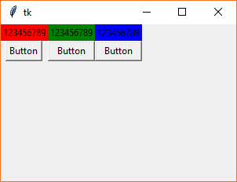

# Python GUI

- [Python GUI](#python-gui)
    - [GUI](#gui)
        - [Treeview](#treeview)
        - [搜索数据图形化](#%E6%90%9C%E7%B4%A2%E6%95%B0%E6%8D%AE%E5%9B%BE%E5%BD%A2%E5%8C%96)
    - [display in different view](#display-in-different-view)
    - [beautify GUI](#beautify-gui)
    - [GUI layout](#gui-layout)
        - [绝对坐标布局](#%E7%BB%9D%E5%AF%B9%E5%9D%90%E6%A0%87%E5%B8%83%E5%B1%80)
        - [相对布局](#%E7%9B%B8%E5%AF%B9%E5%B8%83%E5%B1%80)
        - [表格布局](#%E8%A1%A8%E6%A0%BC%E5%B8%83%E5%B1%80)
    - [Mouse Event](#mouse-event)
    - [Keyboard event](#keyboard-event)

## GUI

消息机制：每创建一个窗体，就将该窗体加入操作系统的链表上；操纵系统有一个死循环，每隔一段很短的时间检查鼠标、键盘；当发送消息的时候，由操作系统沿着链表通知对应的窗体

使用**spy.exe**可以发送各种消息

回掉函数：将函数指针作为另外一个函数的参数，由另外一个函数调用(另外一个函数可以是系统的，也可以是自己的)

```python
import tkinter
win=tkinter.Tk() #构造窗体
win.mainloop() #进入消息循环
```

```python
#button
import tkinter
import os

def  go():
    os.system("shutdown -s  -t   200")

win=tkinter.Tk()
win.geometry("500x400+300+0")
button=tkinter.Button(win,text="ShutDown",command=go) #收到消息执行这个函数
button.pack()#加载到窗体
button1=tkinter.Button(win,text="Hello",command= lambda :print("hello world"),width=50,height=5) #收到消息执行这个函数
button1.pack()#加载到窗体
win.mainloop() #进入消息循环
```

```python
#label
import tkinter

win=tkinter.Tk()
win.geometry("500x400+0+300")
#label1
label1=tkinter.Label(win,text="This is a label")
label1.pack()
#label2
label2=tkinter.Label(win,anchor=tkinter.N,bg="yellow",fg="red",text="Another label",width=50)
label2.pack()
win.mainloop()
```

```python
#entery1发送到entry2
import tkinter

win=tkinter.Tk()
win.geometry("500x400+0+300")
#entry1
entry1=tkinter.Entry(win,show="*",width="50",bg="yellow")#密码框
entry1.pack()
#entry2
entry2=tkinter.Entry(win,width="50",bg="yellow")#普通textbox
entry2.pack()
#button
button1=tkinter.Button(win,text="Send Text to Console",command=lambda : [entry2.delete(0,tkinter.END),entry2.insert(0,entry1.get())])
button1.pack()
win.mainloop()
```

```python
#listbox
import tkinter

win=tkinter.Tk()
win.geometry("500x400+0+300")
#listbox
myListBox=tkinter.Listbox(win,width=50)
myListBox.pack()
for item in range(10):
    myListBox.insert(tkinter.END,item)

win.mainloop()
```

```python
#combobox
import tkinter
from tkinter import ttk #ttk是对tkinter的进一步扩充，加了更多的controls

win=tkinter.Tk()
win.geometry("500x400+0+300")
#combobox
combobox1=ttk.Combobox(win)
combobox1["value"]=tuple(x for x in range(10))
combobox1.current(3)
combobox1.pack()

win.mainloop()
```

```python
#Text
import tkinter

win=tkinter.Tk()
#Text
text=tkinter.Text(win)
text.insert(tkinter.INSERT,"grey\n")
text.insert(tkinter.INSERT,"james\n")
text.insert(tkinter.INSERT,"chris\n")
text.place(x=100,y=0)#取代pack()
win.mainloop()
```

### Treeview

```python
#Treeveiw01
import tkinter
from tkinter import ttk

win=tkinter.Tk()
#Treeview
tree1=ttk.Treeview(win)
tree1["columns"]=("Column1","Column2","Column3")#Column1是keyword

#set every column width
for i in range(3):
    tree1.column("Column"+str(i+1),width=100)

#set every column heading
tree1.heading("Column1",text="Name")
tree1.heading("Column2",text="Age")
tree1.heading("Column3",text="Email")

#insert data
tree1.insert("",0,values=("grey",18,"grey@163.com"))
tree1.insert("",1,values=("james",23,"james@163.com"))

tree1["show"]="headings"#不显示第一列的空列
tree1.pack()
win.mainloop()
```


```python
#Treeview02
import tkinter
from tkinter import ttk

win=tkinter.Tk()
#Treeview
tree1=ttk.Treeview(win)
tree1["columns"]=("Column1","Column2","Column3")#Column1是keyword

#set every column width
for i in range(3):
    tree1.column("Column"+str(i+1),width=100)

#set every column heading
tree1.heading("Column1",text="Name")
tree1.heading("Column2",text="Age")
tree1.heading("Column3",text="Email")

#insert data
#data1
tree1.insert("",0,text="data0",values=("grey",18,"grey@163.com"))
#data2-group
tree1.insert("",1,"group1",text="Group A")
tree1.insert("group1",0,text="data11",values=("james",18,"james@163.com"))
tree1.insert("group1",1,text="data12",values=("chris",20,"chris@163.com"))
tree1.insert("group1",2,text="data13",values=("moris",18,"moris@163.com"))

tree1.pack()
win.mainloop()
```


```python
#Treeview03
import tkinter
from tkinter import ttk

win=tkinter.Tk()
#Treeview
tree1=ttk.Treeview(win)

#insert data
#data1
tree1.insert("",0,text="data0")
#data2-group
tree1.insert("",1,"group1",text="Group A",values=(1))#这里的values的作用好像文件夹保存体积，或者节点的权重
tree1.insert("group1",0,text="data11")
tree1.insert("group1",1,text="data12")
tree1.insert("group1",2,text="data13")

tree1.pack()
win.mainloop()
```


### 搜索数据图形化


```bash
#文件结构
myDir/
    ShowResult.py
    FindData.py
    ShowView.py
    mainFile.py
```


```python
#ShowResult.py
import tkinter

class ShowInListBox(object):
    def __init__(self):
        #set window
        self.resWindow=tkinter.Tk()
        self.resWindow.geometry("800x600+800+50")
        #set listbox
        self.listbox1=tkinter.Listbox(self.resWindow)
        self.listbox1.pack(expand=True, fill='both')#完全填充resWindow
    def Show(self):
        self.resWindow.mainloop()
    def AddData(self, dataStr):
        self.listbox1.insert(tkinter.END,dataStr)
```

```python
#FindData.py
import codecs
import ShowResult

class DataFind(object):
    def __init__(self, path):
        #open file
        self.file=codecs.open(path,"rb","utf-8","ignore")
        #instantiate a result shower
        self.resShower=ShowResult.ShowInListBox()
    def Search(self, searchStr):
        while True:
            line=self.file.readline()
            #搜到的结果显示
            if line.find(searchStr)!=-1:
                # print(line,end="")
                self.resShower.AddData(line)
            #到结尾都没有搜到
            if not line:
                break
    def ShowSearch(self):
        self.resShower.Show()
    def __del__(self):
        self.file.close()
```

```python
#SearchView.py
import tkinter
import FindData

class SearchView(object):
    def __init__(self):
        #set mainwindow
        self.win=tkinter.Tk()
        self.win.geometry("400x50+300+50")
        
        #set entry
        self.entry1=tkinter.Entry(self.win,width=40)
        self.entry1.place(x=50,y=10)

        #set button
        self.button1=tkinter.Button(self.win,text="Search",command=self.Search)
        self.button1.place(x=300,y=5)
    def Show(self):
        self.win.mainloop()
    def Search(self):
        dataFinder=FindData.DataFind("nasa.txt")
        dataFinder.Search(self.entry1.get())
        dataFinder.ShowSearch()
```

```python
#mainFile.py
import SearchView

mySearchViewer=SearchView.SearchView()
mySearchViewer.Show()
```

## display in different view

上面的例子还可以改善

- 用combobox来控制采用listbox, text, table来显示结果
- 用openfiledialog来打开文件

架构师：整理项目中的几百个class, 明确几百个class的关系，告诉程序员怎么设计，指导程序员怎么设计,比如下面的架构图


一共需要5个class,完成的顺序是**从底向上**，因为不依赖于其他class

```bash
#文件结构
myDir/
    ListboxView.py
    TextView.py
    TableView.py
    DataSearch.py
    SearchPanel.py
    main.py
```


```python
#ListboxView.py
import tkinter

class ListboxView(object):
    def __init__(self):
        #set window
        self.viewWindow=tkinter.Tk()
        self.viewWindow.geometry("800x600+800+50")
        #set listbox
        self.listbox1=tkinter.Listbox(self.viewWindow)
        self.listbox1.pack(expand=True, fill='both')#完全填充viewWindow
    def Show(self):
        self.viewWindow.mainloop()
    def AddData(self, dataStr):
        self.listbox1.insert(tkinter.END,dataStr)

# #for test
# listboxviewer=ListboxView()
# listboxviewer.AddData("hello\n")
# listboxviewer.AddData("hello\n")
# listboxviewer.Show()
```

```python
#TextView.py
import tkinter

class TextView(object):
    def __init__(self):
        #set window
        self.viewWindow=tkinter.Tk()
        self.viewWindow.geometry("800x600+800+50")
        #set text
        self.text1=tkinter.Text(self.viewWindow)
        self.text1.pack(expand=True, fill='both')#完全填充viewWindow
    def Show(self):
        self.viewWindow.mainloop()
    def AddData(self, dataStr):
        self.text1.insert(tkinter.END,dataStr)

# #for test
# textviewer1=TextView()
# textviewer1.AddData("Hello\n")
# textviewer1.AddData("Hello\n")
# textviewer1.Show()
```

```python
#TableView.py
import tkinter
from tkinter import ttk

class TableView(object):
    def __init__(self):
        #set window
        self.viewWindow=tkinter.Tk()
        self.viewWindow.geometry("800x600+800+50")
        #set table
        self.table1=ttk.Treeview(self.viewWindow)
        self.table1["columns"]=("Column1","Column2","Column3")#Column1是keyword
        ## set table heading
        self.table1.heading("Column1",text="Account")
        self.table1.heading("Column2",text="Password")
        self.table1.heading("Column3",text="Email")
        self.table1["show"]="headings"
        self.table1.pack(expand=True, fill='both')
        # set the insert index
        self.insertIndex=0
    def Show(self):
        self.viewWindow.mainloop()
    def AddData(self, dataStr):
        lineTuple=tuple(dataStr.split(" # "))
        self.table1.insert("",self.insertIndex,values=lineTuple)
        self.insertIndex+=1

# #for Test
# tableviewer=TableView()
# tableviewer.AddData("zdg # 12344321 # zdg@csdn.net")
# tableviewer.AddData("LaoZheng # 670203313747 # chengming_zheng@163.com")
# tableviewer.Show()
```

```python
#DataSearch.py
import ListboxView
import TextView
import TableView
import codecs

class DataSearch(object):
    def __init__(self, path, viewerStyle):
        #open file
        self.file=codecs.open(path,"rb","utf-8","ignore")
        #instantiate a shower
        if viewerStyle==0:
            self.viewer=ListboxView.ListboxView()
        elif viewerStyle==1:
            self.viewer=TextView.TextView()
        else:
            self.viewer=TableView.TableView()
    def Search(self, searchStr):
        while True:
            line=self.file.readline()
            if line.find(searchStr)!=-1:
                self.viewer.AddData(line)
            if not line:
                break
    def ResultShow(self):
        self.viewer.Show()
    def __del__(self):
        self.file.close()

# #for test
# datasearcher=DataSearch("simpleCSDN.txt",2)
# datasearcher.Search("@163.com")
# datasearcher.ResultShow()
```

```python
#SearchPanel.py
import tkinter
from tkinter import ttk
import DataSearch

class SearchPanel(object):
    def __init__(self):
        #set mainwindow
        self.win=tkinter.Tk()
        self.win.geometry("400x50+300+50")
        
        #set entry
        self.entry1=tkinter.Entry(self.win,width=40)
        self.entry1.place(x=50,y=10)

        #set button
        self.button1=tkinter.Button(self.win,text="Search",command=self.Search)
        self.button1.place(x=300,y=5)

        #set style combobox
        self.combobox1=ttk.Combobox(self.win,width=2)
        self.combobox1["values"]=(0,1,2)
        self.combobox1.current(0)
        self.combobox1.place(x=0,y=10)
    def Show(self):
        self.win.mainloop()
    def Search(self):
        datasearcher=DataSearch.DataSearch("simpleCSDN.txt",self.combobox1.current())
        datasearcher.Search(self.entry1.get())
        datasearcher.ResultShow()

# #for test
# searchpanel=SearchPanel()
# searchpanel.Show()
```

```python
#main.py
import SearchPanel
#for test
searchpanel=SearchPanel.SearchPanel()
searchpanel.Show()
```

如果要读取不同的文件，表头的列数肯定是不同的，要采用`if else`来实现；

如果修改了table, 需要写入文件，再弄一个save按钮；

为了防止别人看见，文件加密解密写入和读取；

## beautify GUI

`tkinter.PhotoImage` class can read **GIF** and **PGM/PPM** images from files, 所以采用其他的办法

```python
#bad method
import tkinter

win=tkinter.Tk()
photo=tkinter.PhotoImage(file="1.gif")
label=tkinter.Label(win,image=photo)#图片
label.pack()
win.mainloop()
```

```bash
#install Pillow
pip3 install Pillow --user
```

```python
#good method
import tkinter
from PIL import ImageTk,Image

win=tkinter.Tk()
myImage=Image.open("wallheaven.jpg")
myPhoto=ImageTk.PhotoImage(myImage)
label=tkinter.Label(win,image=myPhoto)#图片
label.pack()
win.mainloop()
```

[`os` vs `sys`](http://blog.csdn.net/smf0504/article/details/54021857)

```python
#font
import tkinter

win=tkinter.Tk()
label1=tkinter.Label(win,text="你好",font=("楷体",24),bg="red",fg="yellow")
label1.pack()
win.mainloop()
```

## GUI layout

### 绝对坐标布局


```python
#不会用到
import tkinter

win=tkinter.Tk()
#group1
label01=tkinter.Label(win,text="123456789",bg="red")
label02=tkinter.Label(win,text="123456789",bg="green")
label03=tkinter.Label(win,text="123456789",bg="blue")
#group2
label11=tkinter.Label(win,text="123456789",bg="red")
label12=tkinter.Label(win,text="123456789",bg="green")
label13=tkinter.Label(win,text="123456789",bg="blue")

#绝对布局,不随窗口改变大小,默认是NW,指的是用control上的哪个位置作为(x,y)的坐标
label01.place(x=10,y=10,anchor=tkinter.NW)
label02.place(x=10,y=30,anchor=tkinter.NW)
label03.place(x=10,y=50,anchor=tkinter.NW)

label11.place(x=150,y=10,anchor=tkinter.CENTER)
label12.place(x=150,y=30,anchor=tkinter.CENTER)
label13.place(x=150,y=50,anchor=tkinter.CENTER)

win.mainloop()
```

### 相对布局

相对布局只是解决了放大缩小，控件大小变化的问题


```python
import tkinter

win=tkinter.Tk()
win.geometry("500x400+300+0")
#group1
label01=tkinter.Label(win,text="123456789",bg="red")
label02=tkinter.Label(win,text="123456789",bg="green")
label03=tkinter.Label(win,text="123456789",bg="blue")
#group2
label11=tkinter.Label(win,text="123456789",bg="red")
label12=tkinter.Label(win,text="123456789",bg="green")
label13=tkinter.Label(win,text="123456789",bg="blue")

#相对布局，用的是pack()
label01.pack()
label02.pack()
label03.pack()

#fill:X,Y,BOTH; 
#side:LEFT,RIGHT,TOP,BOTTOM;
#expand:True,False
label11.pack(fill=tkinter.X)
label12.pack(fill=tkinter.Y,side=tkinter.LEFT)
label13.pack(fill=tkinter.BOTH,expand=True)
win.mainloop()
```

### 表格布局



```python
#simple example
import tkinter

win=tkinter.Tk()
win.geometry("300x200+300+0")
#group1
label01=tkinter.Label(win,text="123456789",bg="red")
label02=tkinter.Label(win,text="123456789",bg="green")
label03=tkinter.Label(win,text="123456789",bg="blue")
#group2
btn1=tkinter.Button(win,text="Button")
btn2=tkinter.Button(win,text="Button")
btn3=tkinter.Button(win,text="Button")


#表格布局
label01.grid(row=0,column=0)
label02.grid(row=0,column=1)
label03.grid(row=0,column=2)
#with sticky
btn1.grid(row=1,column=0)
btn2.grid(row=1,column=1,sticky=tkinter.N+tkinter.S+tkinter.E+tkinter.W)
btn3.grid(row=1,column=2,sticky=tkinter.N+tkinter.S+tkinter.E+tkinter.W)

win.mainloop()
```


```python
#grid with expand
import tkinter

#Create & Configure root 
root = tkinter.Tk()
root.geometry("300x300+300+300")

tkinter.Grid.rowconfigure(root, 0, weight=1)
tkinter.Grid.columnconfigure(root, 0, weight=1)

#Create & Configure frame 
frame=tkinter.Frame(root)
frame.grid(row=0, column=0, sticky=tkinter.N+tkinter.S+tkinter.E+tkinter.W)

#Create a 5x10 (rows x columns) grid of buttons inside the frame
for row_index in range(5):
    tkinter.Grid.rowconfigure(frame, row_index, weight=1)
    for col_index in range(5):
        tkinter.Grid.columnconfigure(frame, col_index, weight=1)
        btn = tkinter.Button(frame,text="(%d,%d)"%(row_index,col_index)) #create a button inside frame 
        btn.grid(row=row_index, column=col_index, sticky=tkinter.N+tkinter.S+tkinter.E+tkinter.W)

root.mainloop()
```

## Mouse Event


```python
import tkinter

root = tkinter.Tk()
root.geometry("300x300+300+300")

#2x1 root grid
tkinter.Grid.rowconfigure(root, 0, weight=3)
tkinter.Grid.rowconfigure(root, 1, weight=1)
tkinter.Grid.columnconfigure(root, 0, weight=1)

#Create & Configure label
label=tkinter.Label(root,bg="yellow",fg="blue")
label.grid(row=1,column=0,sticky=tkinter.N+tkinter.S+tkinter.E+tkinter.W)

#Create & Configure frame 
frame=tkinter.Frame(root)
frame.grid(row=0, column=0, sticky=tkinter.N+tkinter.S+tkinter.E+tkinter.W)
#bind event
#Button-1,Button-2,Button-3
frame.bind("<Button-1>",lambda event: label.config(text="%d,%d"%(event.x,event.y)))

root.mainloop()
```

## Keyboard event


```python
import tkinter

root = tkinter.Tk()
root.geometry("300x300+300+300")

#2x1 root grid
tkinter.Grid.rowconfigure(root, 0, weight=3)
tkinter.Grid.rowconfigure(root, 1, weight=1)
tkinter.Grid.columnconfigure(root, 0, weight=1)

#Create & Configure label
label=tkinter.Label(root,bg="yellow",fg="blue")
label.grid(row=1,column=0,sticky=tkinter.N+tkinter.S+tkinter.E+tkinter.W)

#Create & Configure frame 
frame=tkinter.Frame(root)
frame.grid(row=0, column=0, sticky=tkinter.N+tkinter.S+tkinter.E+tkinter.W)
#bind keyboard event
frame.focus_set()
frame.bind("<Key>",lambda event: label.config(text="Pressed "+event.keysym))

root.mainloop()
```


```python
#mouse motion
import tkinter

root = tkinter.Tk()
root.geometry("300x300+300+300")

#2x1 root grid
tkinter.Grid.rowconfigure(root, 0, weight=3)
tkinter.Grid.rowconfigure(root, 1, weight=1)
tkinter.Grid.columnconfigure(root, 0, weight=1)

#Create & Configure label
label=tkinter.Label(root,bg="yellow",fg="blue")
label.grid(row=1,column=0,sticky=tkinter.N+tkinter.S+tkinter.E+tkinter.W)

#Create & Configure frame 
frame=tkinter.Frame(root)
frame.grid(row=0, column=0, sticky=tkinter.N+tkinter.S+tkinter.E+tkinter.W)
#监控鼠标位置
frame.bind("<Motion>",lambda event: label.config(text="Cursor Move to %d,%d"%(event.x,event.y)))

root.mainloop()
```

键盘操作按钮位置


```python
#键盘操作按钮位置
import tkinter

#lambda or using the function
def moveX(event):
    if event.keysym=="Right":
        new_x=btn1.winfo_x()+10
        new_y=btn1.winfo_y()
        btn1.place(x=new_x,y=new_y)
    elif event.keysym=="Left":
        new_x=btn1.winfo_x()-10
        new_y=btn1.winfo_y()
        btn1.place(x=new_x,y=new_y)
    elif event.keysym=="Up":
        new_x=btn1.winfo_x()
        new_y=btn1.winfo_y()-10
        btn1.place(x=new_x,y=new_y)
    elif event.keysym=="Down":
        new_x=btn1.winfo_x()
        new_y=btn1.winfo_y()+10
        btn1.place(x=new_x,y=new_y)
    label.config(text="Current place is (%d,%d)"%(btn1.winfo_x(),btn1.winfo_y()))

root = tkinter.Tk()
root.geometry("300x300+300+300")

#2x1 root grid
tkinter.Grid.rowconfigure(root, 0, weight=3)
tkinter.Grid.rowconfigure(root, 1, weight=1)
tkinter.Grid.columnconfigure(root, 0, weight=1)

#Create & Configure label
label=tkinter.Label(root,bg="yellow",fg="blue")
label.grid(row=1,column=0,sticky=tkinter.N+tkinter.S+tkinter.E+tkinter.W)

#Create & Configure frame 
frame=tkinter.Frame(root)
frame.grid(row=0, column=0, sticky=tkinter.N+tkinter.S+tkinter.E+tkinter.W)
btn1=tkinter.Button(frame,text="Hello")
btn1.place(x=10,y=20)
frame.bind("<Key>",moveX)
frame.focus_set()

root.mainloop()
```