# Network Protocol

<!-- TOC -->

- [Network Protocol](#network-protocol)
    - [TCP/IP协议簇](#tcpip协议簇)
    - [端口(port)](#端口port)
    - [ip addr](#ip-addr)
    - [socket](#socket)
    - [wireshark](#wireshark)
    - [tftp](#tftp)
    - [udp brodcast](#udp-brodcast)
    - [tcp](#tcp)
        - [tcp QQ chat](#tcp-qq-chat)
    - [网络通信过程](#网络通信过程)
        - [Packet Tracer](#packet-tracer)
        - [Router 组网](#router-组网)
        - [服务器组网](#服务器组网)
            - [HTTP & DNS server](#http--dns-server)
            - [DHCP Server](#dhcp-server)
            - [Summary](#summary)
        - [TCP三次握手](#tcp三次握手)
            - [TCP summary](#tcp-summary)
            - [tcp长连接、短连接](#tcp长连接短连接)
            - [maximum segment lifetime(MSL, 最长报文段寿命)](#maximum-segment-lifetimemsl-最长报文段寿命)
            - [listent的队列长度](#listent的队列长度)
    - [常见网络攻击](#常见网络攻击)
    - [家庭上网](#家庭上网)
    - [并发服务器(tcp)](#并发服务器tcp)
        - [单进程服务器](#单进程服务器)
        - [多进程服务器](#多进程服务器)
        - [多线程服务器](#多线程服务器)
        - [单进程并发服务器](#单进程并发服务器)
        - [单进程服务器 select版](#单进程服务器-select版)
        - [单进程服务器, epoll服务器](#单进程服务器-epoll服务器)
        - [协程(coroutine)服务器](#协程coroutine服务器)
        - [gevent TCP服务器](#gevent-tcp服务器)

<!-- /TOC -->

## TCP/IP协议簇

协议就是为了完成进程通信的规范；

实际代码开发，从下往上按照4层：链路层→网络层→传输层→应用层

理论标准，从下往上按照7层(OSI mode)：链路层拆开：物理层→数据链路层；应用层拆开：会话层→表示层→应用层

**OSI model** vs **TCP/IP model** vs **TCP/IP Suite**
> 

OSI示意图: 网络层的IP协议表示两者之间是连着的，但是不能相互发数据，往上的传输层才能表示能够进行数据传输(TCP, UDP)。ICMP是网络层的，发`ping`包用的。
> 两个人都在服务区相当于是网络层(两者之间有物理连接)；两个人接通电话相当于是传输层；两个人说英文、中文相当是应用层。

> 

通信过程: 没经过一层就在原数据的基础上增加一些东西，接收方接收之后解包

> 比如http服务: 先是raw_data进行http协议的打包，然后进入下一层继续打包，一直变成二进制，然后传递给对方；对方然后解包

OSI Model下的通信过程
> 

TCP/IP Model下的通信过程
> 

socket是对TCP/IP协议的封装，Socket本身并不是协议，而是一个调用接口（API），通过Socket，我们才能使用TCP/IP协议。操作系统提供了socket接口(api)；应用层可以和传输层通过Socket接口，区分来自不同应用程序进程或网络连接的通信；python的socket模块本质是时对操作系统的socket进一步封装。
> Socket本质就是对网络传输行为(TCP, UDP有不同的传输行为，下图以TCP为例: 建立连接，send, receive，断开连接)的封装，通过这个封装我们可以无视网路层、链路层和传输层的是怎么做的。 我只要告诉它，我要用到的协议类型是TCP还是UDP。 

TCP时序图:
> 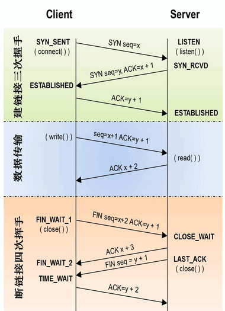

UDP时序图: 无连接，只有发送、接收

## 端口(port)

局域网最简单的组建方式：交换机

端口是为了区分数据给哪个进程，所以给进程添加了一个数字(端口,$2^{16}$个，从$0-65535$)；


在一台机器上，可以通过pid通信(比如本地的QQ通过pid发消息给wexin)；但是不同机器发送方不知道接收方的pid(而且pid不同时间开启，是不同的)

端口号划分：

- well-known ports: $0-1023$
- dynamic ports: $1024-65535$

进程|port
---|---
http|80
ftp|25
ssh|22
smtp|21

```bash
#查看ports
#in linux
netstat -an
#in windows
netstat
```

## ip addr

全世界共有$2^{32}$个ipv4地址

每一个IP地址包括两部分：网络地址和主机地址

网络地址相同表示处于同一个网络里面；

对于C类ip地址，而每一个Bytes的0和255不让用，所以只能容纳254台机器：(主机地址最小的和最大的地址不让用)

- 0: 用来表示当前ip的网络号(因为除开这个，剩下的就是网络地址了)
- 255: 用来表示广播地址

ipv6是用`:`分隔开，20个16进制数，每4个一组

- 单播：一对一
- 多播：固定几个人能够收到(D类地址用于多播:比如视频会议)
- 广播：同一个网络地址的可以收到

公有ip vs 私有ip:

- 公有ip: 比如百度查的ip，全球可以访问
- 私有ip: 比如ipconfig查的，外网无法使用

自检：

`127.0.0.1`: 即便是拔网线，也能ping通，测试本机网络通信协议是否好使

## socket

`http`, `smtp`, ...都是基于`socket`
> `socket`只干两件事情: `send`, `receive`

本机的进程通信用的是队列、命名管道、文件；不同机器间的通信用到的就是socket

它能实现不同主机间的进程间通信，我们网络上各种各样的服务大多都是基于 Socket 来完成通信的

本机进程默认无法通信，实现进程通信
- 文件读写 
- 可以`socket.AF_UNIX`unix本机进程间通信，本质是socket相当于文件

`socket.SOCK_RAW`原始套接字，普通的套接字无法处理ICMP、IGMP等网络报文，而SOCK_RAW可以；其次，SOCK_RAW也可以处理特殊的IPv4报文；此外，利用原始套接字，可以通过IP_HDRINCL套接字选项由用户伪造IP头，进行洪水攻击

> 洪水攻击: 用伪造的ip发SYN, 然后服务器回复SYN+ACK，因为是伪造的，三次握手的最后一次无法实现，那么服务器处于SYN.RCVD等待；如果伪造的ip太多，那么服务器假死。

```python
#socket和之前进程通信的队列是同样的功能
import socket

# tcp socket, 打电话
s1 = socket.socket(socket.AF_INET, socket.SOCK_STREAM)
#AF_INET就是ipv4协议, 用于 Internet 进程间通信
print(s1)

# upd socket, 类比 写信，局域网的几乎不可能丢包
s2 = socket.socket(socket.AF_INET, socket.SOCK_DGRAM)
print(s2)
```

```python
#udp简单例子, 发给网络助手
import socket

# upd socket
# data gram, 数据报
s2 = socket.socket(socket.AF_INET, socket.SOCK_DGRAM)

target_addr = ('222.29.69.115', 8080)#资源栋楼的ip和端口，用的是http://forum.armfly.com/forum.php?mod=viewthread&tid=30223 软件
data = "helllo, this is grey".encode('utf-8')
##简单的做法
# data = b"helllo, this is grey"
s2.sendto(data, target_addr)
s2.close()
```

```python
# tcp 简单例子，发给网络助手
import socket

tcp_socket=socket.socket()
tcp_socket.connect(('222.29.69.149', 9999))
tcp_socket.send(b'helo, world')

data=tcp_socket.recv(1024)
print(data)
tcp_socket.close()
```

```bash
#用网络调试助手发送消息给feiq.exe
#网络助手设置成udp
192.168.128.1 :2425
#内容如下
#版本号:包编号:发送者姓名:发送者机器名:命令字:内容
#这个就是FeiQ自己的协议,也就是应用层的协议，FeiQ只能用于局域网
1:1238605487:user:machine:32:hello
```

```python
#python发给feiq
s2 = socket.socket(socket.AF_INET, socket.SOCK_DGRAM)
target_addr = ('192.168.128.1', 2425)
data = "1:1238605487:user:machine:32:hello".encode('utf-8')
# udp发3条，每一条都要写ip和port
s2.sendto(data, target_addr)
s2.sendto(data, target_addr)
s2.sendto(data, target_addr)
s2.close()
```

同一个OS中端口不允许相同；除非其他程序释放端口，这个程序才能使用；

那个**网络助手**程序可以监听FeiQ的数据，就是将端口设置成2425；其他人原来发给你FeiQ的，都会在网络助手上面显示

全球web服务器的port都是80, 所有的远程链接都是22；

udp客户端不用绑定port, 系统随机分配；而udp服务器一般需要绑定port

```python
#网络调试助手收到消息后回复python
import socket

udp_socket = socket.socket(socket.AF_INET, socket.SOCK_DGRAM)
target_addr = ('222.29.69.115', 8080)
send_data = "Hello, this is grey".encode('utf-8')
udp_socket.sendto(send_data, target_addr)
# receive data， 这里没有绑定本机的port，但是网络调试助手看得到这边的ip和动态的port
recv_data = udp_socket.recvfrom(1024)
print(recv_data)
print(recv_data[0].decode('gbk'))
udp_socket.close()
```

```bash
#output
(b'Hello, this is \xcd\xf8\xc2\xe7\xb5\xf7\xca\xd4\xd6\xfa\xca\xd6\r\n', ('222.29.69.115', 8080))
Hello, this is 网络调试助手
```

```python
#关于绑定port的例子， 发送方一般不绑定，接收方才需要绑定
#网络调试助手知道这边的ip
import socket

udp_socket = socket.socket(socket.AF_INET, socket.SOCK_DGRAM)
# bind_addr = ('10.128.160.66', 7788)  # 一定是绑定自己的ip
bind_addr = ('', 7788)  # ip地址和端口号，ip一般不用写，表示本机ip
udp_socket.bind(bind_addr)
recv_data = udp_socket.recvfrom(1024)
print(recv_data)
print(recv_data[0].decode('gbk'))
udp_socket.close()
```

```bash
#output
(b'Hello, this is \xcd\xf8\xc2\xe7\xb5\xf7\xca\xd4\xd6\xfa\xca\xd6\r\n', ('222.29.69.115', 8080))
Hello, this is 网络调试助手
```

如果有两个网卡都连了网，但是不确定是用的哪个上网；网络上有路由选择，来选择快的；所以一个电脑可以有多个ip地址；那么有一个人往这两个ip中任意一个发送消息，你都收得到

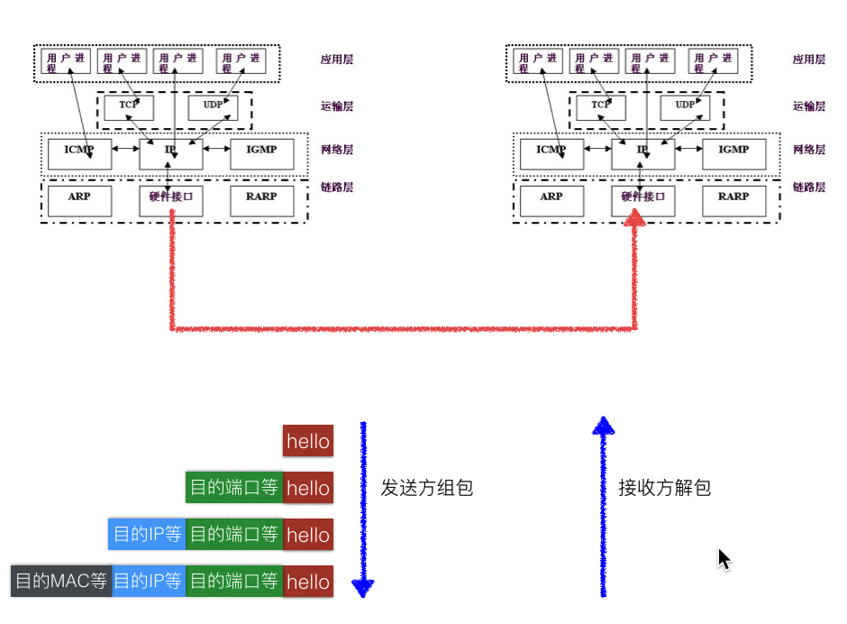

```python
#python制作udp echo服务器，将对方发来的消息重新发给对方
#ping别人ip的时候，人家也是这么干的
import socket

udp_socket = socket.socket(socket.AF_INET, socket.SOCK_DGRAM)
udp_socket.bind(('', 7788))
while True:
    rev_tuple = udp_socket.recvfrom(1024)
    rev_data = rev_tuple[0].decode('gbk')
    send_data = f'return your message:"{rev_data}"'.encode('gbk')
    udp_socket.sendto(send_data, rev_tuple[1])
udp_socket.close()
```

网络通信：

- 单工：听广播
- 半双工：对讲机
- 全双工：电话

所以socket都是全双工(udp, tcp)


游戏左下角的公共聊天室

```python
import time
import socket

udp_socket = socket.socket(socket.AF_INET, socket.SOCK_DGRAM)
udp_socket.bind(('', 7788))
while True:
    rev_data, source_addr = udp_socket.recvfrom(1024)
    print(f'{time.ctime()},{source_addr}:{rev_data.decode("gbk")}')
```

QQ交互信心的流程：

- 发送方发给tecent的服务器
- 服务器保存发送来的信息(ip1, port1)
- 如果对方的QQ登陆，会将(ip2, port2)发送给tecent服务器；
- tecent服务器将信息发送到(ip2, port2)

```python
#没有中央服务器的聊天器 with 网络调试助手
#需要多线程, 因为接受和发送都会卡住
import time
import socket
import threading
import sys


def receive_data(udp_socket):
    while True:
        content, source_addr = udp_socket.recvfrom(1024)
        content_text = content.decode('gbk')
        sys.stdout.write('\r')
        print(f'>>{time.ctime()}|{source_addr}=====>{content_text}',end='\n<<')


def send_data(udp_socket, target_addr):
    while True:
        content = input('<<')
        udp_socket.sendto(content.encode("gbk"), target_addr)


def main():
    udp_socket = socket.socket(socket.AF_INET, socket.SOCK_DGRAM)
    udp_socket.bind(('', 8899))
    target_addr = ('222.29.69.115', 8080)
    receive_thread = threading.Thread(target=receive_data, args=(udp_socket,))
    send_thread = threading.Thread(target=send_data, args=(udp_socket, target_addr))
    # begin
    receive_thread.start()
    send_thread.start()
    receive_thread.join()
    send_thread.join()


if __name__ == '__main__':
    main()
```

```bash
#output
>>Mon Mar 19 21:09:08 2018|('222.29.69.115', 8080)=====>我在资源东楼
>>Mon Mar 19 21:09:08 2018|('222.29.69.115', 8080)=====>我在资源东楼
<<好的
<<好的
<<
```

```python
#进度条的写法
import time
import sys

for i in range(100):
    sys.stdout.write('\r')  # 拉到一行最前面
    sys.stdout.write(f'{(i+1)/100:.2%}|{(i//5)*"#"}')
    sys.stdout.flush()
    time.sleep(0.1)
sys.stdout.write('\n')
```

```bash
#output, 强制退出的结果
49.00%|#########
Process finished with exit code 1
```

## wireshark

wireshark类似于听诊器。流经本电脑的数据都可以得到；

255.255.255.255是受限广播；192.168.128.255也是广播(主机号全为1的就是广播ip)；

wireshark抓包如下图，得到的从上往下xxxx, 链路层，网络层，传输层，应用层；
如果是纯红、黑色，表示包有错误；

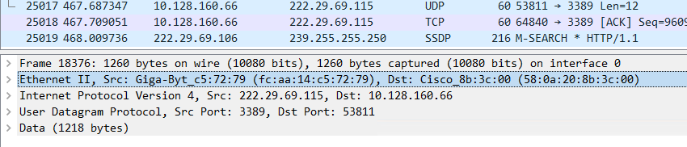

ARP：根据ip地址去要mac地址

监听网络的极端手段：wireshark; 爬虫没有爬出视频的下载地址，用这个可以解析出来

wireshark, 过滤

```bash
#ip,port,协议过滤
ip.dst==10.128.160.66

udp.port==2425

ip.dst==10.128.160.66 and udp.port==2425
```

## tftp

TFTP（Trivial File Transfer Protocol,简单文件传输协议）

- C/S架构: Client/Server, 比如QQ, wechat
- B/S架构: Browser/Server, 比如网页

比如资源楼的tftpd64打开，那么它就是一个server；那么在寝室写的python程序去下载server提供的资源就是client

大端、小端：`0x1122`其中11是高位数据，22是低位数据；网络上传输的都是大端

- 大端：内存低地址存高位数据
- 小端：内存高地址存高位数据

发送数据之前要对数据打包(比如开头的必须要2bytes)，所以要pack

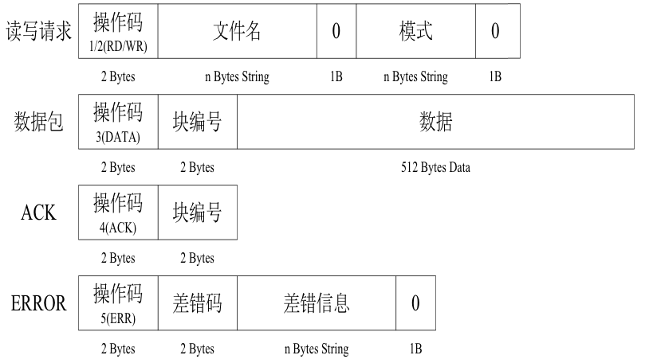

发送数据之前要pack, 解析数据之前要unpack

```python
# 组织数据
import struct
import socket

file_name = "图片.jpg"
file_name = file_name.encode('gbk')
# 必须是byte
# !表示该数据用于网络传输
# H表示用两个字节表示后面的1
# {}s表示字节的长度
# b表示一个byte
# # 1表示读请求
# # 0表示读写请求的格式
# # 'octet'表示模式
send_data = struct.pack(f"!H{len(file_name)}sb5sb", 1, file_name, 0, b'octet', 0)
# print(send_data)  # b'\x00\x01\xe5\x9b\xbe\xe7\x89\x87.jpg\x00octet\x00'

# send
udp_socket = socket.socket(socket.AF_INET, socket.SOCK_DGRAM)
udp_socket.sendto(send_data, ('222.29.69.115', 69))  # tftp's port=69
udp_socket.close()

# unpack data for test
data_text = struct.unpack(f'!H{len(file_name)}s', send_data[:2+len(file_name)])
print(data_text)  # (1, b'\xcd\xbc\xc6\xac.jpg'),也就是上面pack进去的1
```

```python
#tftp下载器, 不稳定，网络上面传输经常出问题，局域网还好
import sys
import socket
import struct
import os


# command mode
def cmd_check():
    if len(sys.argv) != 2:
        print('-' * 30)
        print(f'tips:\nEnter command like this python3 xxx.py 222.29.69.115')
        print('-' * 30)
        exit()
    else:
        # return ip address
        return sys.argv[1]


def receive_file(udp_socket):
    # receive file
    flag = True  # 如果下载错误，删掉创建的文件
    package_num = 1
    recv_file = None
    while True:
        recv_data, recv_addr = udp_socket.recvfrom(1024)
        operation_code, current_package_num = struct.unpack("!HH", recv_data[:4])
        if operation_code == 5:
            print(f'Error package-{current_package_num}')
            flag = False
            break
        elif operation_code == 3:
            if current_package_num == 1:
                recv_file = open('test.zip', 'ab')
            if package_num == current_package_num:
                recv_file.write(recv_data[4:])
                print(f'Received package-{package_num}')
                # say received
                ack_buf = struct.pack(f'!HH', 4, package_num)
                udp_socket.sendto(ack_buf, recv_addr)
                # 来自于协议中用两个字节保存number
                # 如果一个下载的文件特别大，即接收到的数据包编号超过了2个字节的大小
                # 那么会从0继续开始，所以这里需要判断，如果超过了65535 那么就改为0
                if package_num == 65535:
                    package_num = -1
                package_num += 1
            if len(recv_data) < 512 + 2 + 2:
                break
    recv_file.close()
    if flag:
        print('download all!')
    else:
        print('download error')
        os.unlink('test.zip')  # 删除创建的错误文件


def download_file(ip_addr, file_name):
    # send request
    file_name = file_name.encode('gbk')
    udp_socket = socket.socket(socket.AF_INET, socket.SOCK_DGRAM)
    send_data = struct.pack(f'!H{len(file_name)}sb5sb', 1, file_name, 0, b'octet', 0)
    udp_socket.sendto(send_data, (ip_addr, 69))
    receive_file(udp_socket)
    udp_socket.close()


def main():
    # ip_addr = cmd_check()
    ip_addr = '10.128.160.66'
    file_name = "test.zip"
    download_file(ip_addr, file_name)


if __name__ == '__main__':
    main()
```

## udp brodcast

udp才会有广播，tcp没有广播；

- 单播：点对点
- 多播：点对多
- 广播：点对所有

```python
import socket

udp_socket = socket.socket(socket.AF_INET, socket.SOCK_DGRAM)
# 有下面这句话才能广播
udp_socket.setsockopt(socket.SOL_SOCKET, socket.SO_BROADCAST, 1)
# 广播的原理：将东西发给广播地址(一般是交换机)，然后广播地址给其他所有人发
udp_socket.sendto(b"Hello, this is grey", ('<broadcast>', 2425))  # 自动识别广播地址，更加通用；发给所有feiQ;也可以多开网络调试助手测试
# udp_socket.sendto("Hello, this is grey", ('xxx.xxx.xxx.255', 7788))#或者这么写
# 网卡(链路层)接受信号
# 网络层判断ip, 传输层判断port
# 广播用的不好会产生广播风暴，但是路由器可以隔离广播风暴

while True:
    recv_data, recv_addr = udp_socket.recvfrom(1024)
    print(f'receive {recv_data} from {recv_addr}')
```

电脑一连网络，就会给交换机广播，然后机房的某个设备(路由器)收到了，然后该设备给你分配ip

## tcp

- TCP: Transmission Control Protocol(传输控制协议)；稳定,速度是udp的1/3, web服务器都是tcp
- UDP: User Datagram Protocol(用户数据报协议)；不稳定

tcp, udp C/S比较

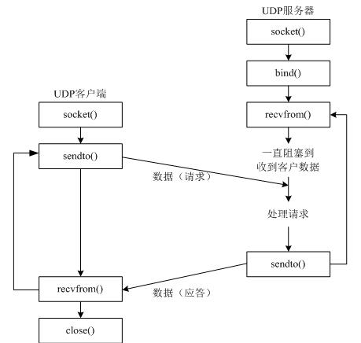

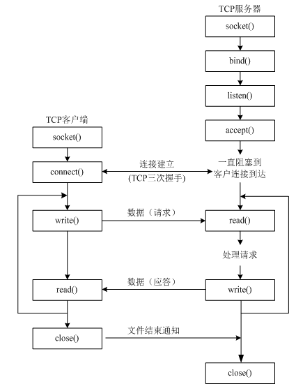

一般99%都是tcp;

服务器：socket创建出来的object默认是主动的，也即是主动打电话的，加入`listen()`将这个对象由主动变成被动；`accept()`进入等待；`read()`对应udp的`recvfrom()`, `write()`对应udp的`sendto()`

客户端：`connect()`主要是给别人打电话

```python
#tcp server, 用网络调试助手开客户端测试
#tcp server最难
import socket

tcp_socket = socket.socket(socket.AF_INET, socket.SOCK_STREAM)
tcp_socket.bind(('', 8899))
# 最多5个客户端(比如10086可以同时接受很多人的电话，然后切换给客服，作用类似), 但是一般自己决定不了，OS算的
tcp_socket.listen(5)
# 如果有新的客户端来链接服务器，那么就产生一个新的套接字专门为这个客户端服务器
# newSocket用来为这个客户端服务
# tcpSerSocket就可以省下来专门等待其他新客户端的链接
# 下面是等待建立连接， 会卡住
new_socket, client_addr = tcp_socket.accept()
print(new_socket, client_addr)
# receive， 会卡住
recv_data = new_socket.recv(1024)
print(recv_data.decode('gbk'))
new_socket.send("拜拜".encode('gbk'))
# close
new_socket.close()
tcp_socket.close()
```

```bash
#output
<socket.socket fd=540, family=AddressFamily.AF_INET, type=SocketKind.SOCK_STREAM, proto=0, laddr=('10.128.160.66', 8899), raddr=('222.29.69.115', 54809)> ('222.29.69.115', 54809)
你好
```

```python
# tcp client,用网络测试助手开服务器测试
import socket

tcp_socket = socket.socket(socket.AF_INET, socket.SOCK_STREAM)
tcp_socket.connect(('222.29.69.115', 8899))
# 用send不用sendto，因为上面已经建立了连接
tcp_socket.send('你好，这是客户端'.encode('gbk'))
# receive
recv_data = tcp_socket.recv(1024)
print(recv_data.decode('gbk'))#你好，这是服务器
tcp_socket.close()
```

### tcp QQ chat

```python
#socket是全双工了，这里相当于模拟了半双工
#而且是单任务的，一次只能一个new_socket；
# 也就是一次只能接一个client，连接第二个必须断开第一个client
#把new_socket放到进程中去
#tcp server，单双工，收的时候发不了；发的时候收不了
import socket

tcp_socket = socket.socket()
tcp_socket.bind(('localhost', 7788))
tcp_socket.listen(10)#变被动
while True:
    new_socket, client_info = tcp_socket.accept()
    print('new client connected')
    while True:
        recv_data = new_socket.recv(1024).decode('utf-8')
        if recv_data: 
            # Linux下如果客户端Ctrl+C断开，那么recv_data为""，并且死循环
            # windows下会假死
            print(f'>>{recv_data}')
        else:
            # 如果Client挂了，那么结束这个new_socket
            print('client has lost')
            break
        send_data="Hello, this is server"
        new_socket.send(('>>'+send_data).encode('utf-8'))
        print('<<'+send_data)
    new_socket.close()
tcp_socket.close()
```

```python
#tcp client
import socket

tcp_socket = socket.socket()
tcp_socket.connect(('localhost', 7788))
while True:
    send_data = input("<<")
    if send_data:
        tcp_socket.send(send_data.encode('utf-8'))
    else:
        # 发不了""，所以干脆continue或者break
        print('you send empty! will continue')
        continue
    recv_data = tcp_socket.recv(1024).decode('utf-8')
    print(recv_data)
tcp_socket.close()
```

```bash
#output
#in client
<<这是客户端
>>Hello, this is server
<<这是我
>>Hello, this is server
<<

#in server
>>这是客户端
<<Hello, this is server
>>这是我
<<Hello, this is server
```

```python
# ssh服务器
import os
import socket

tcp_socket = socket.socket()
tcp_socket.bind(('localhost', 7788))
tcp_socket.listen(10)  # 变被动
while True:
    new_socket, client_info = tcp_socket.accept()
    print('new client connected')
    while True:
        # 假装一次能够收10k
        recv_data = new_socket.recv(10240).decode('utf-8')
        if recv_data:
            # Linux下如果客户端Ctrl+C断开，那么recv_data为""，并且死循环
            # windows下会假死
            print(f'>>{recv_data}')
        else:
            # 如果Client挂了，那么结束这个new_socket
            print('client has lost')
            break
        send_data = os.popen(recv_data).read()
        new_socket.send(('>>'+send_data).encode('utf-8'))
        print('<<'+send_data)
    new_socket.close()
tcp_socket.close()
```

```python
# 文件传输server
import os
import socket

tcp_socket = socket.socket()
tcp_socket.bind(('localhost', 7788))
tcp_socket.listen(10)  # 变被动

while True:
    new_socket, client_info = tcp_socket.accept()
    print('new client connected')
    while True:
        recv_data = new_socket.recv(1024).decode('utf-8')
        if recv_data:
            # Linux下如果客户端Ctrl+C断开，那么recv_data为""，并且死循环
            # windows下会假死
            print(f'>>{recv_data}')
        else:
            # 如果Client挂了，那么结束这个new_socket
            print('client has lost')
            break
        
        file=open('test.mp4', 'rb') # 60M
        send_data=file.read()
        new_socket.send(send_data)
        print('<< server finish sending')
    new_socket.close()
tcp_socket.close()
```

```python
# 文件传输client
import socket

tcp_socket = socket.socket()
tcp_socket.connect(('localhost', 7788))
while True:
    send_data = input("<<")
    if send_data:
        tcp_socket.send(send_data.encode('utf-8'))
    else:
        # 发不了""，所以干脆continue或者break
        print('you send empty! will continue')
        continue
    recv_data = tcp_socket.recv(1024*1024*100)
    # 虽然是60M, 但是server一次只能发32k
    with open('movie.mp4', 'wb') as file:
        file.write(recv_data)
tcp_socket.close()
```

> 文件传输server有一个最大的send大小32k, 文件传输client也有一个最大的recv限制

```python
# 文件传输server，循环发送sendall()
import os
import socket

tcp_socket = socket.socket()
tcp_socket.bind(('localhost', 7788))
tcp_socket.listen(10)  # 变被动

while True:
    new_socket, client_info = tcp_socket.accept()
    print('new client connected')
    while True:
        recv_data = new_socket.recv(1024).decode('utf-8')
        if recv_data:
            print(f'>>{recv_data}')
        else:
            print('client has lost')
            break
        
        file=open('test.mp4', 'rb') # 60M
        send_data=file.read()
        new_socket.sendall(send_data) # 循环发送
        print('<< server finish sending')
    new_socket.close()
tcp_socket.close()
```

```python
# 文件传输client, 循环接收
import socket

tcp_socket = socket.socket()
tcp_socket.connect(('localhost', 7788))

file=open('movie.mp4', 'wb')

while True:
    send_data = input("<<")
    if send_data:
        tcp_socket.send(send_data.encode('utf-8'))
    else:
        # 发不了""，所以干脆continue或者break
        print('you send empty! will continue')
        continue
    recv_data = tcp_socket.recv(1024*1024)
    file.write(recv_data)
    file.flush()

file.close
tcp_socket.close()
```

```python
#修改为多进程server
#多线程、多进程往往用于网络
import socket
import multiprocessing

def client_deal(new_socket):
    while True:
        recv_data = new_socket.recv(1024).decode('gbk')
        if len(recv_data) > 0:
            print(f'>>{recv_data}')
        else:
            break
        send_data="Hello, this is server"
        new_socket.send(('>>'+send_data).encode('gbk'))
        print('<<'+send_data)
    new_socket.close()


def main():
    tcp_socket = socket.socket(socket.AF_INET, socket.SOCK_STREAM)
    tcp_socket.bind(('', 7788))
    tcp_socket.listen(10)
    while True:
        new_socket, client_info = tcp_socket.accept()
        p=multiprocessing.Process(target=client_deal, args=(new_socket,))
        p.start()
    tcp_socket.close()

if __name__ == '__main__':
    main()
```

```bash
#output
#in client1
<<这是客户端1
>>Hello, this is server
<<这是客户端1
>>Hello, this is server
<<

#in client2
<<你好，这是客户端2
>>Hello, this is server
<<你好，这是客户端2
>>Hello, this is server
<<

#in server
>>你好，这是客户端2
<<Hello, this is server
>>你好，这是客户端2
<<Hello, this is server
>>这是客户端1
<<Hello, this is server
>>这是客户端1
<<Hello, this is server
```

## 网络通信过程

### Packet Tracer

[Internet Protocol](http://www.ruanyifeng.com/blog/2012/05/internet_protocol_suite_part_i.html)

如果两台电脑直接用网线链接，但是通过子网掩码按位与之后不是同一个网络号(不在同一个网段)，也是无法通信的；

HUB: 类似usb扩展坞, 太low了, 被交换机取代

交换机: 单层交换机、两层交换机、三层交换机(弄虚拟局域网);用packetTracer连接好了之后，要等待它从橙色变成绿色

一般买的路由器都有交换机的功能；

HUB vs 交换机:

- hub对于任何数据包都以broadcast的形式发送; 所以容易让网络拥堵
- 交换机具有学习的功能，没学习之前是广播，学习完毕之后，就是单播；解决网络拥堵的问题；

MAC address: `98-E7-F4-58-E9-1C`, 6bytes, 一个byte用两个hex表示, 前三个字节表示厂商，后三个表示型号；虚拟机平时所说的copy就会产生新的MAC, move则不会产生新的MAC

因为IP数据包是放在以太网数据包里发送的，所以我们必须同时知道两个地址，一个是对方的MAC地址，另一个是对方的IP地址.而交换机可以记录MAC地址，进而不会广播；

先发送一个`ARP`协议的包(包内容如下图, 图中`type=0x806`表示扔给ARP而不是扔给网络层的IP....)，来获取MAC地址;利用获取的MAC地址,用`ICMP`协议,  `ping 192.168.2.2`, 而且`type=0x800`, windows默认ping4次(因为已经弄到了MAC, 后面就不需要ARP了)

- ARP: 根据ip找mac地址(广播的形式问，单播的形式回复); 
- RARP: 根据mac找ip;
- ICMP: ping;


网卡有MAC, 电脑有逻辑ip, 进程有port; 共同保证了唯一性;

网络地址帮助我们确定计算机所在的子网络，MAC地址则将数据包送到该子网络中的目标网卡。因此，从逻辑上可以推断，必定是先处理网络地址，然后再处理MAC地址。

一个网卡允许两个MAC地址的包通过:`FF-FF-FF-FF-FF-FF`的广播MAC地址的包, 带有自己MAC地址的包；这是发生在链路层的过滤；

网络层会允许两个ip地址的包通过:`XXX.XXX.XXX.255`的广播ip地址的包, 带有自己ip地址的包；

传输层的port会过滤不是该进程的port

获取MAC地址:

- 第一种情况，如果两台主机不在同一个子网络，那么事实上没有办法得到对方的MAC地址，只能把数据包传送到两个子网络连接处的"网关"（gateway），让网关去处理。
- 第二种情况，如果两台主机在同一个子网络，那么我们可以用ARP协议，得到对方的MAC地址。

"传输层"的功能，就是建立**端口到端口**的通信。相比之下，"网络层"的功能是建立**主机到主机**的通信。只要确定主机和端口，我们就能实现程序之间的交流。因此，Unix系统就把主机+端口，叫做"套接字"（socket）。有了它，就可以进行网络应用程序开发了。

"应用层"的作用，就是规定应用程序的数据格式。

windows的cmd下`arp -a`可以获得和本机进行过沟通的ip以及其MAC, 可以进行ARP攻击(针对dynamic的ip),整个windows可能假死,要重启 360防不住，必须是ARP专业防火墙:

局域网中, 把MAC地址修改为别人的MAC地址，那么交换机就会把原本发给别人的包，发给我;

ARP有一个缓存列表，存了ip和MAC地址, 过一段时间会清空, 当再发生通信的时候, 会重新获取;

### Router 组网

前面都是局域网通过HUB, Switcher来组网, 小网络;

类似十字路口的路标，走一段看一下: 路由，确定路径的设备，而路由器最核心的功能是链接网络;

不同的网段需要用到网关;

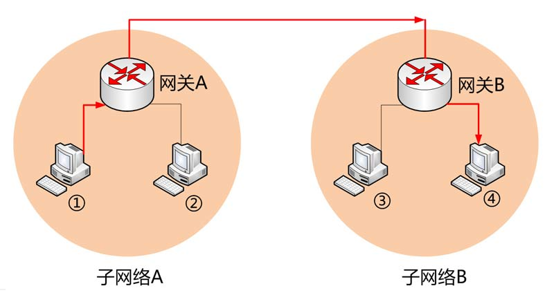

**网关**一个大概念，不具体特指一类产品，只要连接两个不同的网络的设备都可以叫网关；而**路由器**么一般特指能够实现路由寻找和转发的特定类产品，路由器很显然能够实现网关的功能

路由器至少有两个网卡, 假如有要连接两个网段，其中一个网卡的网段在网段1，另一个网卡的网段在网段2

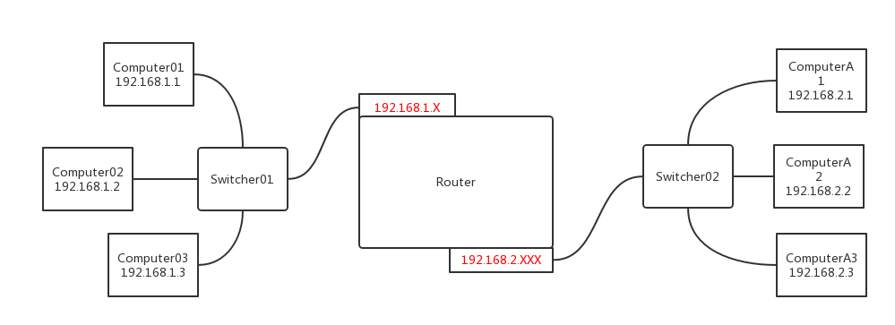

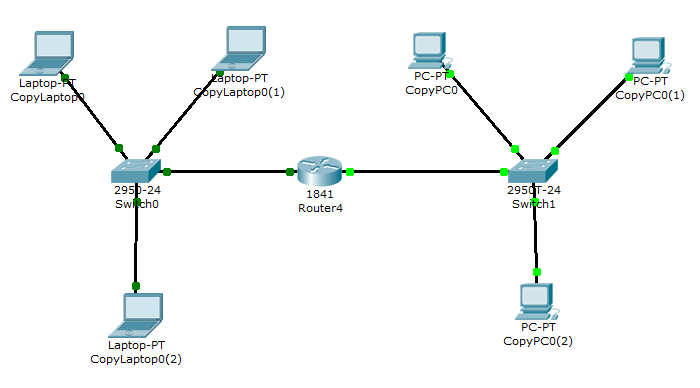

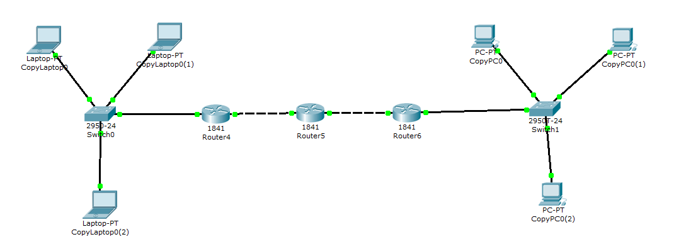

设置注意事项:

- 路由器的Port Status要Check `On`
- 终端设备要填写网关地址为路由器地址


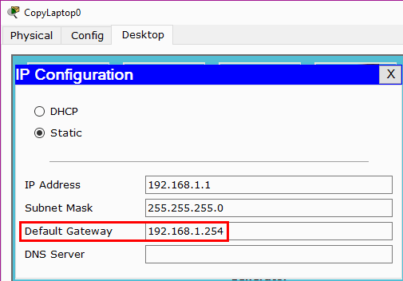

从一个子网ping另一个子网中的ip, 数据包里面的MAC地址经过一个网关设备就会变化，而数据包里面的ip地址不会变化:

- ip地址: 标记逻辑上的地址
- mac地址:标记实际转发时，数据的地址
- netmask:和ip一起来确定网络号
- default gateway: 发送的数据不在同一个网段内，会将这个数据转发给默认网关

### 服务器组网

实际开发的时候，一般需要两台服务器(http的服务器, dns的服务器)

服务器: 就是没有显示器的主机, 配置高(网卡很好, 内存大, cpu频率高, 硬盘大)

而一般服务器提供的就是HTTP, DHCP, TFTP, DNS, FTP, EMAIL的功能


DNS是解析域名的协议(将域名解析为ip地址), 而且一个服务器可以有多个域名;

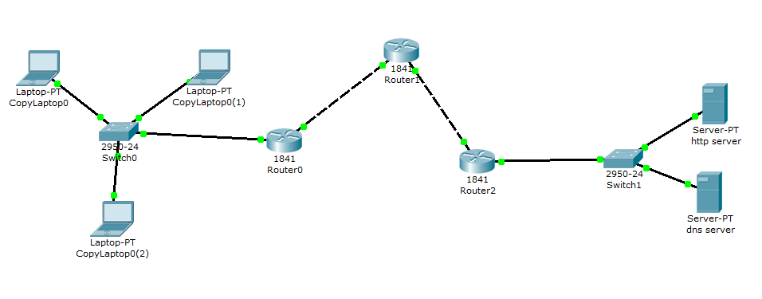

#### HTTP & DNS server

给别人提供的内容, 可以直接通过ip地址`192.168.2.4`访问


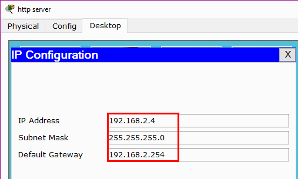

加入**DNS服务器**之后, 可以通过域名`gewei.com`, `baidu.com`来访问;DNS的服务器是UDP服务器

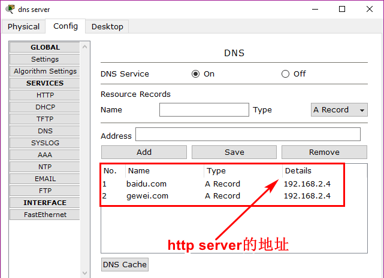

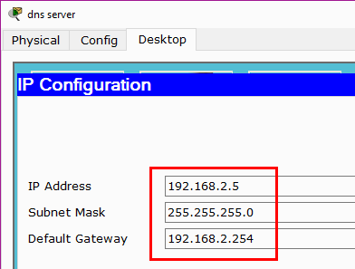

#### DHCP Server

DHCP Server提供自动分配ip的服务, 然后每个终端修改为DHCP获取ip即可

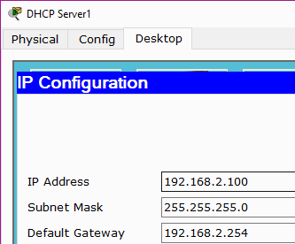

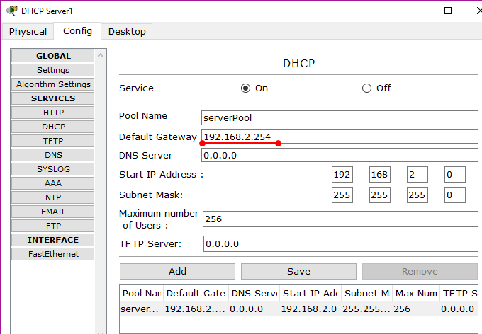

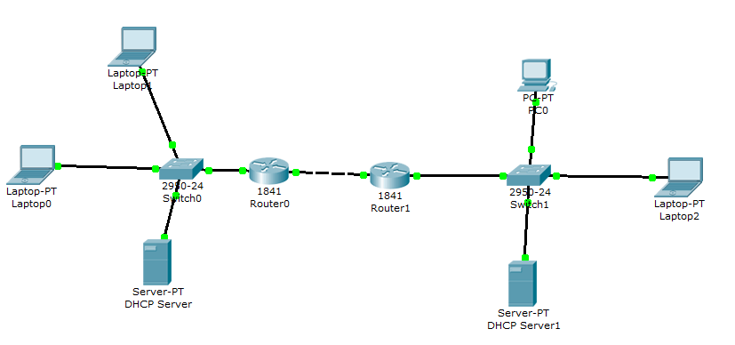

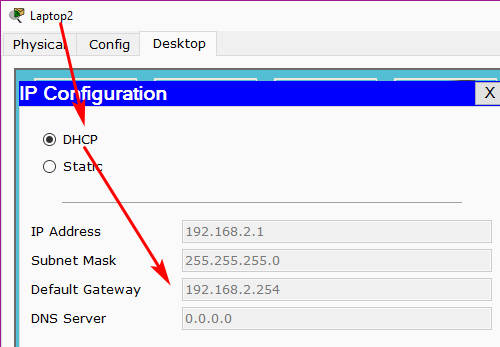

#### Summary

打开浏览器访问`baidu.com`的过程, 假设所有的都是第一次使用,所以要获取MAC地址

首先确定本机有没有设置网关: 

- 没有,那么无法访问;
- 有,ARP获取网关的MAC地址;

然后判断是以ip地址访问还是以域名访问: 

- ip地址访问, 那么3次握手, 发送请求数据,对方的服务器把数据拿给我，可以在浏览器访问; 
- 域名访问, 那么
    - 先要解析出`baidu.com`对应的ip地址
        - ARP获取默认网关的MAC地址
        - 组织数据发给默认网关(ip还是dns的ip, MAC地址是默认网关的地址)
        - 默认网关拥有转发数据的能力，把数据转发给路由器
        - 路由器根据路由协议，选择一个合适路径转发给目的网关
        - 目的网关把数据转发给DNS服务器
        - DNS服务器查询解析出`baidu.com`对应的ip地址, 原路返回给client
    - 得到`baidu.com`对应的ip之后
        - client发送tcp的3次握手,进行连接
        - client发送http协议的请求数据给web服务器(也就是解析出来的ip)
        - web服务器收到数据请求之后, 查询自己的服务器得到相应的结果, 原路返回数据给client的浏览器
        - 浏览器通过渲染，显示页面
        - 浏览器关闭tcp连接，即4次挥手

### TCP三次握手

三次握手: 也就是`tcp_socket.connect()`时候发生的事情;

简单理解三次握手:
- A: 你在吗？(SYN)
- B: 我在(ACK)，有什么事情吗？(SYN)
- A: 我要给你发数据(ACK)

简单理解四次挥手:
- A: 我没有数据发了(ACK), 我可以关闭连接了吗？(FIN)
- B: 你可以关闭了(ACK)
- B: 那我能关闭了吗？(FIN)
- A: 你可以关闭了(ACK)

三次握手过程:

- client发送0给server, 并且在自己+1
- server收到发过来的0,+1, 并且同另外一个`SEQUE NUM:0`一起发回client, 表示自己准备好了
- client收到的1与自己的1比较, 相同, 在服务器的0加1发回server，表示自己准备好了, 建立成功

物理过程:

- client发送`SEQUENCE NUM:0 ACK NUM:0`给server, 标记为`SYN`(请求)
- server返回`SEQUENCE NUM:0 ACK NUM:1`给client, 标记为`SYN+ACK`(请求+确认)
- client发送`SEQUENCE NUM:1 ACK NUM:1`给server, 标记为`ACK`,三次握手完成;后面紧跟着HTTP的请求包
- server收到HTTP包, 然后发两个包给client
    - `SEQUENCE NUM:1 ACK NUM:2`的包
    - 被请求的HTTP数据包
- client收到两个包，发送`SEQUENCE NUM:2 ACK NUM:2`,确认收到HTTP数据包

TCP在一定时间内收不到ACK包，会重发

TCP vs UDP:

- 不管是client→server, 还是server→client发送数据包，对方都会返回一个ACK包,如果没有收到ACK包那么就会重发
- UDP没有这个过程, 所以不稳定

三次握手:

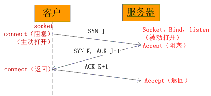

四次挥手:


客户端下线: 会调用`close()`,发送一个包(通常是浏览器收到数据完毕了,然后自动`close()`)

服务器如何知道客户端下线: `recv()`解阻塞,并且得到数据长度为0; 并且发送一个包

然后server将`new_socket.close()`,发送一个包

最后client发送一个包;

如果不掉用close, 那么port就会一直占用，不给别人用;

#### TCP summary

三个阶段:

- 建立链接: 三次握手
- 数据传输: 会有应答
- 断开链接: 四次挥手

#### tcp长连接、短连接

tcp1.1是长链接, tcp1.0是短链接;

- 短链接: 打开浏览器，访问完页面, 自动会close()
- 长链接：打开浏览器, 看视频, 也就是第二阶段特别长

`socket.send()`的时候不用写地址: 因为链接已经建立, 地址在底层的IP协议数据包里面有;

`Reply from 192.168.2.1 bytes=32 time=107ms TTL=128`, 其中TTL表示最大的路由次数, 每经过一次路由器数值减1，变成0了就不传递了；局域网内部是不经过路由器的所以是128

360wifi有一个致命的弱点: TTL-1, 所以容易被封;

#### maximum segment lifetime(MSL, 最长报文段寿命)

1个msl一般1-2min:client与server之间传递的时间

2MSL: 客户端从TIME_WAIT到CLOSED的时间长度：2-4min

谁先close()谁最后就等2MSL;

所以如果server有时候出现绑定失败，等个5min就可以用了(避免这种情况); client不出现这个问题的原因是client不需要bind()


#### listent的队列长度

linux中`tcp_socket.listen(5)`中的参数手动设定, 毫无意义, 因为它内核自动的有一个值, 所以linux适合web服务器; windows, mac有效果;

linux内核: 完成任务切换，创建进程的核心代码;

listen中的参数表示已经建立链接和半链接的总数;

如果当前已建立链接数和半链接数以达到设定值，那么新客户端就不会connect成功，而是等待服务器

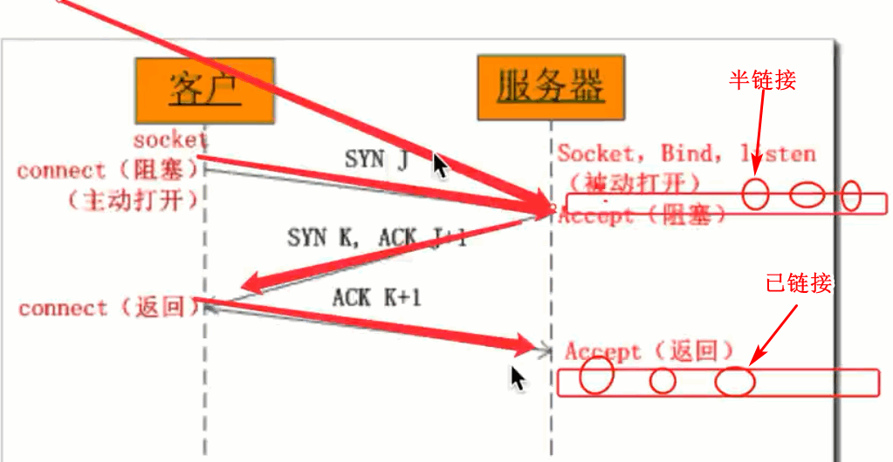

```python
#in windows
#server
import socket
import time

tcp_socket=socket.socket(socket.AF_INET, socket.SOCK_STREAM)
tcp_socket.bind(('',7788))
tcp_socket.listen(5)
while True:
    new_socket, client_info=tcp_socket.accept()
    print(client_info)
    time.sleep(1)
```

```python
#in windows
#client
import socket

for i in range(20):
    tcp_socket = socket.socket(socket.AF_INET, socket.SOCK_STREAM)
    tcp_socket.connect(('127.0.0.1', 7788))
    print(i)
```

## 常见网络攻击

- Dos, DDos: Dos是拒绝服务攻击，而DDOS是分布式拒绝服务攻击
- dns劫持，配合钓鱼网站(要么攻击国家的dns, 让房客用自己的dns服务器)
- dns欺骗, 伪造dns应答包,主动不停给别人发(UDP广播),然后另一台电脑钓鱼
- arp攻击

不管是windows还是mac,linux: `nslooup baidu.com`都是有用的;

cdn: 网站上的东西,全国各地都放一份,即内容分发

ARP攻击: 要用到python的原始套接字(raw  socket)

## 家庭上网

其实只有一个公有ip,就是路由器的ip, 比如`135.2.1.1`

而路由器能够让好几台电脑上网的原因是将`192.168.1.1:7788`, `192.168.1.2:8899`, `192.168.1.3:7799`进行处理，成`135.2.1.1:2233`, `135.2.1.1:2244`, `135.2.1.1:2255`进而可以上网了

然而家里搭建的服务器，从外网访问不了, 因为从里向外可以被路由器记录一次，然从外往里，路由器找不到;但是可以用花生壳映射解决, 一般都是直接买阿里云，那个做法不太好，因为24h开机

国外的路由器就是路由器，连接不同的网段; 中国玩出花样各种功能都有, 应该叫做`NAT`(网络地址转换器)

## 并发服务器(tcp)

### 单进程服务器

```python
#一个时间点只能服务一个client, 没有用
import socket

tcp_socket=socket.socket(socket.AF_INET, socket.SOCK_STREAM)
#服务器先结束，要立即运行服务器避免等待2MSL就加这一句，避免"Address already in use"
tcp_socket.setsockopt(socket.SOL_SOCKET, socket.SO_REUSEADDR, 1)
tcp_socket.bind(('',7788))
tcp_socket.listen(5)
while True:
    new_socket, client_info=tcp_socket.accept()
    try:
        while True:
            recv_data=new_socket.recv(1024).decode('gbk')
            if len(recv_data)>0:
                print(f'>>{client_info}:{recv_data}')
            else:
                break
    finally:
        new_socket.close()
tcp_socket.close()
```

### 多进程服务器

```python
import socket
import multiprocessing


def client_deal(new_socket):
    while True:
        recv_data = new_socket.recv(1024).decode('gbk')
        if len(recv_data) > 0:
            print(f'>>{recv_data}')
        else:
            break
        send_data = "Hello, this is server"
        new_socket.send(('>>'+send_data).encode('gbk'))
        print('<<'+send_data)
    new_socket.close()


def main():
    tcp_socket = socket.socket(socket.AF_INET, socket.SOCK_STREAM)
    tcp_socket.setsockopt(socket.SOL_SOCKET, socket.SO_REUSEADDR, 1)
    tcp_socket.bind(('', 7788))
    tcp_socket.listen(10)
    try:
        while True:
            new_socket, client_info = tcp_socket.accept()
            p = multiprocessing.Process(target=client_deal, args=(new_socket,))
            p.start()
            #因为已经向子进程中copy了一份（引用），并且父进程中这个套接字也没有用处了
            #所以关闭
            new_socket.close()
            #如果把tcp_socket.close()放在这里，那么server不能接收新的链接
    finally:
        tcp_socket.close()


if __name__ == '__main__':
    main()
```

### 多线程服务器

```python
import socket
import threading


def client_deal(new_socket):
    while True:
        recv_data = new_socket.recv(1024).decode('gbk')
        if len(recv_data) > 0:
            print(f'>>{recv_data}')
        else:
            break
        send_data = "Hello, this is server"
        new_socket.send(('>>'+send_data).encode('gbk'))
        print('<<'+send_data)
    new_socket.close()


def main():
    tcp_socket = socket.socket(socket.AF_INET, socket.SOCK_STREAM)
    tcp_socket.setsockopt(socket.SOL_SOCKET, socket.SO_REUSEADDR, 1)
    tcp_socket.bind(('', 7788))
    tcp_socket.listen(10)
    try:
        while True:
            new_socket, client_info = tcp_socket.accept()
            p = threading.Thread(target=client_deal, args=(new_socket,))
            p.start()
            #因为线程中共享这个套接字，如果关闭了会导致这个套接字不可用，
            #但是此时在线程中这个套接字可能还在收数据，因此不能关闭
            #而进程中因为每个进程拷贝了数据，可以关闭
            #new_socket.close() 
    finally:
        tcp_socket.close()


if __name__ == '__main__':
    main()
```

Copy-On-Write(写时拷贝):OS创建子进程的时候，知道很浪费资源，所以并不是完全重新拷贝一份，而是万不得已的时候才会拷贝；

### 单进程并发服务器

```python
#not complete server
import socket

server_socket=socket.socket(socket.AF_INET, socket.SOCK_STREAM)
server_socket.bind(('',7788))
server_socket.listen(10)
#非堵塞
server_socket.setblocking(False)
while True:
    #cpu占用很高
    try:
        #新来一个client，之前的client会断开
        client_socket, client_info=server_socket.accept()
    except Exception as e:
        pass
    else:
        print(f'{client_info} is created!')
```

```python
import socket

server_socket=socket.socket(socket.AF_INET, socket.SOCK_STREAM)
server_socket.bind(('',7788))
server_socket.listen(10)
#非堵塞
server_socket.setblocking(False)
#
g_client_list=[]
while True:
    #cpu占用很高
    try:
        client_socket, client_info=server_socket.accept()
    except Exception as e:
        pass
    else:
        print(f'{client_info} is online!')
        client_socket.setblocking(False)
        g_client_list.append((client_socket, client_info))
    #get data
    #不适合大型服务器，因为如果client非常多,遍历次数太多,延时明显
    #10个8个还行
    for client_socket, client_info in g_client_list:
        try:
            recv_data=client_socket.recv(1024).decode('gbk')
        except Exception as e:
            pass
        else:
            if len(recv_data)>0:
                print(f'{client_info}:{recv_data}')
            else:
                client_socket.close()
                g_client_list.remove((client_socket, client_info))
                print(f'{client_info} is offline')
```

### 单进程服务器 select版

IO多路复用：不采用多进程、多线程而完成服务器并发;

select和上面的单进程非阻塞核心原理是一样的; select可以直接完成对socket的检测(上面的例子是用for循环来检测);而且是底层的操作，效率比for高;

在多路复用的模型中，比较常用的有select模型和epoll模型。这两个都是系统接口，由操作系统提供。当然，Python的select模块进行了更高级的封装。

select目前几乎在所有的平台上支持，其良好跨平台支持也是它的一个优点。

```python
import select
import socket

server_socket = socket.socket(socket.AF_INET, socket.SOCK_STREAM)
server_socket.bind(('', 7788))
server_socket.listen(10)

inputs = [server_socket, ]

while True:
    # 第一个参数表示select检测列表中的socket是否可以收数据；
    # 第二个参数表示select检测列表中的socket是否可以发数据；
    # 第三个参数表示select检测列表中的socket是否产生了异常；
    # 如果第一个参数的列表没有元素，默认blocking
    readable, writeable, exceptional = select.select(inputs, [], [])

    for sock in readable:
        if sock == server_socket:
            client_socket, client_info = server_socket.accept()
            print('create one socket')
            inputs.append(client_socket)
        else:
            recv_data = sock.recv(1024).decode('gbk')
            if recv_data:
                sock.send(recv_data.encode('gbk'))  # echo server
                print(f'>>{recv_data}')
            else:
                inputs.remove(sock)
                sock.close()
server_socket.close()
```

```python
#带有写功能的select服务器
#下面的异常很少有可能被执行到
import socket
import queue
import select

message_dict = {}
input_list = []
output_list = []


def main():
    server_socket = socket.socket(socket.AF_INET, socket.SOCK_STREAM)
    server_socket.bind(('', 7788))
    server_socket.listen(10)
    input_list.append(server_socket)
    client_dict = {}

    while True:
        readable, writable, exceptional = select.select(
            input_list, output_list, input_list)
        for sock in readable:
            if sock == server_socket:
                client_sock, client_info = server_socket.accept()
                client_dict[client_sock]=client_info
                print(f'client{client_info} connected!')
                input_list.append(client_sock)
                message_dict[client_sock] = queue.Queue()
            else:
                try:
                    recv_data = sock.recv(1024).decode('gbk')
                    if recv_data:
                        print(f'receive "{recv_data}" from {client_dict[sock]}')
                        message_dict[sock].put(recv_data)
                        # add to output_list
                        if sock not in output_list:
                            output_list.append(sock)
                except ConnectionResetError:
                    # 客户端断开连接了，将客户端的监听从input列表中移除
                    print(f' client {client_dict[sock]} disconnected')
                    input_list.remove(sock)
                    del message_dict[sock]
                    # # 下一个循环, 下面这个会自动关闭的
                    # sock.close()
        # 处理完添加
        for sock in output_list:
            try:
                if not message_dict[sock].empty():
                    send_data = message_dict[sock].get()
                    sock.send((send_data+' checked').encode('gbk'))
                else:
                    output_list.remove(sock)
            except ConnectionResetError:
                print(f'client {client_dict[sock]} disconnected!')
                del message_dict[sock]
                output_list.remove(sock)
    server_socket.close()


if __name__ == '__main__':
    main()
```

select的缺点:

- select的一个缺点在于单个进程能够监视的文件描述符的数量存在最大限制; 比如Fedora `cat /proc/sys/fs/file-max`结果是596752
- 对socket进行扫描时是依次扫描的，即采用轮询的方法，效率较低。
- 当套接字比较多的时候，每次select()都要通过遍历FD_SETSIZE个Socket来完成调度，不管哪个Socket是活跃的，都遍历一遍。这会浪费很多CPU时间

### 单进程服务器, epoll服务器

- select服务器有上限的限制, 以**轮询机制**进行检测
- poll没有上限的限制,原理和select几乎一样, 以**轮询机制**进行检测
- epoll在poll的基础上使用的是**事件通知机制**

通知机制 vs 轮询机制:

- 老师逐个点名, 让他们问问题: 轮询机制, 主动问你
- 老师让有问题的举手, 让他们问问题: 通知机制, 你主动修改, 也就是事件机制

`select.epoll()`只有linux才有

```python
#in linux, window报错
In [1]: import sys

In [2]: sys.stdin #键盘
Out[2]: <_io.TextIOWrapper name='<stdin>' mode='r' encoding='UTF-8'>

In [3]: sys.stdout #屏幕
Out[3]: <_io.TextIOWrapper name='<stdout>' mode='w' encoding='UTF-8'>

In [4]: sys.stderr #屏幕
Out[4]: <_io.TextIOWrapper name='<stderr>' mode='w' encoding='UTF-8'>

In [5]: sys.stdin.fileno()
Out[5]: 0

In [6]: sys.stdout.fileno()
Out[6]: 1

In [7]: sys.stderr.fileno()
Out[7]: 2

#如果是C语言而打开的文件对应的fileno()为3, python是其他的值
```

- EPOLLIN （可读）
- EPOLLOUT （可写）
- EPOLLET （ET模式，效率高，只处理一次, Set Edge Trigger behavior, the default is Level Trigger behavior）
- EPOLLLT (LT模式，没有弄完，反复通知)

如果是select.select()那么轮询所有的客户端, 看看是否能够读;
如果是my_epoll.poll()那么直接获取可读的所有客户端(因为一旦客户端可读,自己主动加入某个表中);

```python
#in linux
import socket
import select

server_socket = socket.socket(socket.AF_INET, socket.SOCK_STREAM)
server_socket.setsockopt(socket.SOL_SOCKET, socket.SO_REUSEADDR, 1)
server_socket.bind(('', 7788))
server_socket.listen(10)
my_epoll = select.epoll()
# file number
my_epoll.register(server_socket.fileno(), select.EPOLLIN | select.EPOLLET)

client_socket_dict = {}
client_info_dict = {}

while True:
    # 类似之前select.select()
    # 只是select()是轮询实现的, poll()是事件通知机制决定的
    epoll_list = my_epoll.poll()
    # fd文件描述符，通俗的理解就是套接字对应的数字编号,也就是所谓fileno()的返回值
    for fd, events in epoll_list:
        if fd == server_socket.fileno():
            client_socket, client_info = server_socket.accept()
            print(f'client {client_info} connected!')
            client_socket_dict[client_socket.fileno()] = client_socket
            client_info_dict[client_socket.fileno()] = client_info
            my_epoll.register(client_socket.fileno(),
                              select.EPOLLIN | select.EPOLLET)
        elif events == select.EPOLLIN:
            recv_data = client_socket_dict[fd].recv(1024).decode('gbk')
            if recv_data:
                print(f'>>receive "{recv_data}" from {client_info_dict[fd]}')
            else:
                my_epoll.unregister(fd)
                client_socket_dict[fd].close()
                print(f'{client_info_dict[fd]} disconnected!')
```

不管是自定义的, select, poll还是epoll, 都是三个过程:

- 创建监听套接字
- 通过某种方式来检测，哪些套接字可以进行收发
- 对上面检测出来的套接字进行收发数据的处理

### 协程(coroutine)服务器

进程里面有线程，线程里面可能有协程；协程效率最高；

通俗的理解：在一个线程中的某个函数，可以在任何地方保存当前函数的一些临时变量等信息，然后切换到另外一个函数中执行，注意不是通过调用函数的方式做到的，并且切换的次数以及什么时候再切换到原来的函数都由开发者自己确定; 只要这个过程中保存或恢复 CPU上下文那么程序还是可以运行的

- 线程: 线程切换从系统层面远不止保存和恢复 CPU上下文这么简单。 操作系统为了程序运行的高效性每个线程都有自己缓存Cache等等数据，操作系统还会帮你做这些数据的恢复操作。 所以线程的切换非常耗性能.
- 协程: 协程的切换只是单纯的操作CPU的上下文，所以一秒钟切换个上百万次系统都抗的住

CPU密集 vs IO密集:

- 多进程适合CPU密集
- 多线程、协程适合IO密集

协程的本质是`yield`

```python
import time

def test_a():
    while True:
        print('---A---')
        yield
        time.sleep(0.5)

def test_b(a):
    while True:
        print('---B---')
        a.__next__()
        time.sleep(0.5)

def main():
    generator1=test_a()
    test_b(generator1)


if __name__ == '__main__':
    main()
```

```bash
#output
---B---
---A---
---B---
---A---
---B---
---A---
---B---
---A---
```

```python
#升级封装上面的yield到greenlet
#greenlet源码是用C语言写的
#协程是开发者调度的(有规律)，而线程是cpu调度的(无规律)
import greenlet
import time

def test_a():
    while True:
        print('---A---')
        gr2.switch()
        time.sleep(0.5)

def test_b():
    while True:
        print('---B---') 
        gr1.switch()
        time.sleep(0.5)

gr1=greenlet.greenlet(test_a)
gr2=greenlet.greenlet(test_b)
#begin
gr1.switch()
```

```bash
#output
---A---
---B---
---A---
---B---
---A---
---B---
---A---
```

python还有一个比greenlet更强大的并且能够自动切换任务的模块gevent;
升级封装greenlet到gevent

gevent其原理是当一个greenlet遇到IO(指的是input output 输入输出，比如网络、文件操作等)操作时，比如访问网络，就自动切换到其他的greenlet，等到IO操作完成，再在适当的时候切换回来继续执行

```python
#gevent依次执行
import gevent

def func(n):
    for i in range(n):
        print(f'{i}=====>{gevent.getcurrent()}')

g1=gevent.spawn(func,5)
g2=gevent.spawn(func,5)
g3=gevent.spawn(func,5)
g1.join()
g2.join()
g3.join()
```

```bash
#output
0=====><Greenlet at 0x1f6d2369f20: func(5)>
1=====><Greenlet at 0x1f6d2369f20: func(5)>
2=====><Greenlet at 0x1f6d2369f20: func(5)>
3=====><Greenlet at 0x1f6d2369f20: func(5)>
4=====><Greenlet at 0x1f6d2369f20: func(5)>
0=====><Greenlet at 0x1f6d247f178: func(5)>
1=====><Greenlet at 0x1f6d247f178: func(5)>
2=====><Greenlet at 0x1f6d247f178: func(5)>
3=====><Greenlet at 0x1f6d247f178: func(5)>
4=====><Greenlet at 0x1f6d247f178: func(5)>
0=====><Greenlet at 0x1f6d247f210: func(5)>
1=====><Greenlet at 0x1f6d247f210: func(5)>
2=====><Greenlet at 0x1f6d247f210: func(5)>
3=====><Greenlet at 0x1f6d247f210: func(5)>
4=====><Greenlet at 0x1f6d247f210: func(5)>
```

```python
#gevent切换执行
import gevent

def func(n):
    for i in range(n):
        print(f'{i}=====>{gevent.getcurrent()}')
        #只是添加了一句
        #如果一个gevent碰到了耗时操作，会自动把控制权交出去(switch)
        #比如网络等待, IO等
        gevent.sleep(1)

g1=gevent.spawn(func,5)
g2=gevent.spawn(func,5)
g3=gevent.spawn(func,5)
g1.join()
g2.join()
g3.join()
```

```bash
#output
0=====><Greenlet at 0x1a41ca39f20: func(5)>
0=====><Greenlet at 0x1a41cb70178: func(5)>
0=====><Greenlet at 0x1a41cb70210: func(5)>
1=====><Greenlet at 0x1a41ca39f20: func(5)>
1=====><Greenlet at 0x1a41cb70210: func(5)>
1=====><Greenlet at 0x1a41cb70178: func(5)>
2=====><Greenlet at 0x1a41ca39f20: func(5)>
2=====><Greenlet at 0x1a41cb70178: func(5)>
2=====><Greenlet at 0x1a41cb70210: func(5)>
3=====><Greenlet at 0x1a41ca39f20: func(5)>
3=====><Greenlet at 0x1a41cb70210: func(5)>
3=====><Greenlet at 0x1a41cb70178: func(5)>
4=====><Greenlet at 0x1a41ca39f20: func(5)>
4=====><Greenlet at 0x1a41cb70178: func(5)>
4=====><Greenlet at 0x1a41cb70210: func(5)>
```

实际代码里，我们不会用gevent.sleep()去切换协程，而是在执行到IO操作时，gevent自动切换，代码如下

`tornado`框架就是用协程gevent来做的

```python
#gevent并发下载器
import gevent
from gevent import monkey
from urllib import request

# 有IO才需要这一句
monkey.patch_all()


def my_downloader(url):
    try:
        print(f'GETing {url}')
        page_source = request.urlopen(url).read()
        print(f'{len(page_source)} bytes received from {url}')
    except Exception:
        print(f'{url} 有反爬虫')


gevent.joinall([
    gevent.spawn(my_downloader, 'http://www.fortunechina.com/'),
    gevent.spawn(my_downloader, 'http://tea.share2china.com/'),
    gevent.spawn(my_downloader, 'https://golangbot.com/')
])
```

```bash
#output
GETing http://www.fortunechina.com/
GETing http://tea.share2china.com/
GETing https://golangbot.com/
http://tea.share2china.com/有反爬虫
39256 bytes received from http://www.fortunechina.com/
32053 bytes received from https://golangbot.com/
```

### gevent TCP服务器

多线程有多个箭头，协程只有一个箭头;

gevent不能使用`time.sleep()`会崩, 而要使用`gevent.sleep()`

```python
import gevent
#使用的是重写的socket, 耗时的recv(), accept()都被重写了
from gevent import socket, monkey

monkey.patch_all()#这句话本质是将下面的代码都改了，动态修改
client_dict = {}


def handle_request(sock):
    while True:
        #当这个函数耗时的时候，就切换给tcp_server()
        recv_data = sock.recv(1024).decode('gbk')
        if not recv_data:
            print(f'{client_dict[sock]} disconnected!')
            sock.close()
            break
        print(f'>>{client_dict[sock]}:{recv_data}')
        sock.send((recv_data+' checked').encode('gbk'))


def tcp_server(port):
    server_socket = socket.socket()
    server_socket.bind(('', port))
    server_socket.listen(10)
    while True:
        #重写了的socket, 一旦耗时就切换，如果只有一个协程，就不切换，死等
        client_socket, client_info = server_socket.accept()
        client_dict[client_socket] = client_info
        print(f'{client_info} connected!')
        gevent.spawn(handle_request, client_socket)


def main():
    tcp_server(7788)


if __name__ == '__main__':
    main()
```

```bash
#output
('222.29.69.115', 61736) connected!
('222.29.69.115', 61737) connected!
>>('222.29.69.115', 61736):Hello
>>('222.29.69.115', 61737):world
```