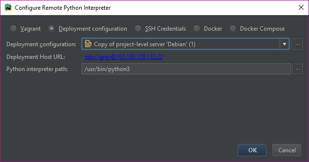
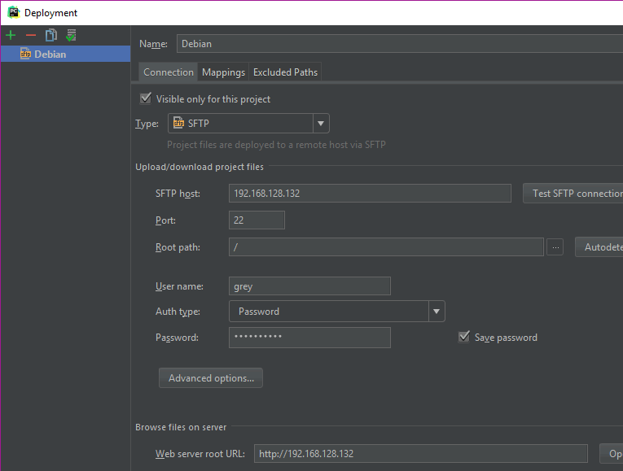
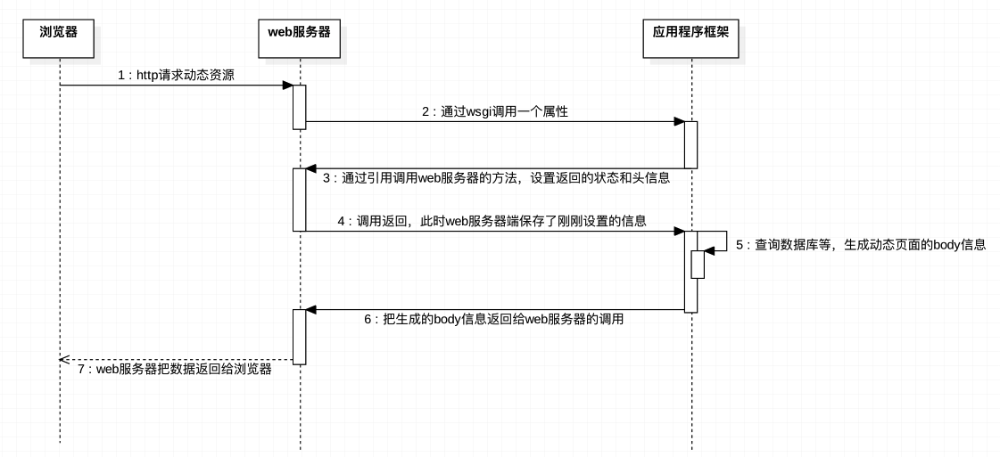
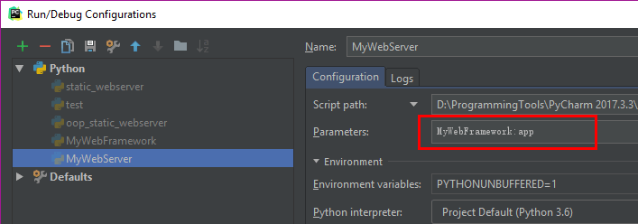

# Python Web

<!-- TOC -->

- [Python Web](#python-web)
    - [web server | browser](#web-server--browser)
    - [HTTP](#http)
    - [web静态服务器-显示固定的页面(多进程)](#web静态服务器-显示固定的页面多进程)
    - [web动态服务器](#web动态服务器)
        - [oop-dynamic-webserver with framework](#oop-dynamic-webserver-with-framework)

<!-- /TOC -->

##  web server | browser

对于应用层而言，下面三个合起来看就是一个快递公司

| Level  | Function                                                               |
| ------ | ---------------------------------------------------------------------- |
| 应用层 | 解决要传递什么数据,封装传输的数据格式(比如QQ自己的格式,tftp报文的格式) |
| 传输层 | 按照什么一个方式去传递数据(UDP, TCP)                                   |
| 网络层 | 获取对方的位置(所以有一个IP协议)                                       |
| 链路层 | 具体的传输工具                                                         |

socket是操作系统提供的一个API, 用来去使用TCP, UDP; 所以三次握手，四次挥手是OS做的; 但是socket只是内核的附加功能，可以砍掉;

在服务器的py文件中，必须要使用返回的`client_socket`，而不能自己建一个client_socket, 因为`client_socket`涉及一些底层的数据`ACK, SEQ`无法通过python的自己新建一个而初始化; 返回的`client_socket`有和特定client的通信的状态;

应用层协议: 太多了, ssh, smtp, ftp, pop3, tftp, http(最为广泛)

## HTTP

HTML: 超文本标记语言

早期单纯的传递文本太过单调，所以传递HTML(既有内容, 还有格式. 文本样式, 图片, 超链接; ), 而使用的协议就是HTTP协议(现在的HTTP不仅可以传递HTML,CSS,JS,JSon,xml,图片,etc)

浏览器：渲染HTML, 显示各种效果; 就是靠**浏览器引擎**程序去解析字符串，并且显示出来，程序算法的优劣体现了渲染的快慢和效果; 而且提供了是否支持HTML的某些标签(比如IE各种不支持`<h5>header5</h5>`)

浏览器内核又可以分成两部分：**渲染引擎**(layout engineer 或者 Rendering Engine)和**JS引擎**(V8 JS引擎是google拯救了JS引擎); 甚至可以分离出来的V8(`node.js`)做后端服务器

| 浏览器内核 | 代表              |
| ---------- | ----------------- |
| Trident    | IE                |
| Gecko      | Firefox           |
| Webkit     | Safari,old Chrome |
| Blink      | Chrome, Opera     |

```html
<htm>
    <head>
        <title>Untitled</title>
    </head>
    <body>
        <!-- 把style提取单独放起来，那么就是css文件 -->
        <h1 style="color:red;">Hello, world</h1>
        <p>This is paragraph!</p>
    </body>
</htm>
```

| web lang   | functin                                     |
| ---------- | ------------------------------------------- |
| HTML       | 超文本                                      |
| CSS        | Style, 现在的CSS3可以做特效, js也可以做特效 |
| Javascript | 动态效果,点击,etc, 让浏览器产生行为         |

浏览器其实也起到了socket的作用(作为客户端):

```bash
# Chrome的console
# F12 console 
console.log("Hello")
```

HTTP请求方式(用户想让服务器执行什么行为):

- GET: 获取服务器数据
- POST: 修改服务器数据
- PUT: 让服务器保存数据
- DELETE: 让服务器删除数据
- OPTION: 询问服务器的某种支持特性, 已经服务器的参数
- HEAD: 返回报文头

HTTP: 就是规定了GET,POST,HOST, Content-Length都是什么意思;

```bash
# Chrome的Network/www.baidu.com/Headers/Request Headers
# 下面的就是HTTP报文,每一行以\r\n结尾

#报文的起始行
GET / HTTP/1.1
#报文的请求头
Host: www.baidu.com
Connection: keep-alive
Cache-Control: max-age=0
Upgrade-Insecure-Requests: 1
User-Agent: Mozilla/5.0 (Windows NT 10.0; Win64; x64) AppleWebKit/537.36 (KHTML, like Gecko) Chrome/64.0.3282.140 Safari/537.36
Accept: text/html,application/xhtml+xml,application/xml;q=0.9,image/webp,image/apng,*/*;q=0.8
Accept-Encoding: gzip, deflate, br
Accept-Language: en-US,en;q=0.9,zh-CN;q=0.8,zh;q=0.7,zh-TW;q=0.6
Cookie: BAIDUID=41BBE4332D01057BBA09F47A253F4EC1:FG=1; BIDUPSID=41BBE4332D01057BBA09F47A253F4EC1; PSTM=1521648570; BD_UPN=12314753; BDUSS=00OEFrdWxXR012ZDVTZ1NqUjh5R0ZvdEZYMU1YaDJjQ0ZIUXFtVkVMM1ZFZHBhQVFBQUFBJCQAAAAAAAAAAAEAAAC6p~WiQWxwaGFHcmV5AAAAAAAAAAAAAAAAAAAAAAAAAAAAAAAAAAAAAAAAAAAAAAAAAAAAAAAAAAAAAAAAAAAAAAAAANWEslrVhLJaRk; ORIGIN=2; ISSW=1; BD_CK_SAM=1; PSINO=1; pgv_pvi=5775247360; pgv_si=s360282112; locale=zh; H_PS_PSSID=1448_21114_17001_20930; BD_HOME=1; sugstore=0
Content-Length: #请求体的长度
#每个header最末尾会有单独一行只有\r\n的东西, 用来分割请求头和请求体
#请求体可以是二进制(图片、视频),也可以是HTML,也可以是纯文本(username, password)
```

```bash
# 所谓的服务器开发就是在socket的recv()和send()之间开发
# Chrome的Network/www.baidu.com/Headers/Reponse Headers
# 下面的就是HTTP报文,每一行以\r\n结尾

#报文起始行
# recv()和send()执行情况用status code描述
# status code: http://tool.oschina.net/commons?type=5
# 2XX 成功执行, OK是辅助描述信息
# 3xx 请求的在别的地方，需要跳转
# 4xx 客户端出错
# 5xx 服务器出错
HTTP/1.1 200 OK
#响应头
Bdpagetype: 2
Bdqid: 0xbe9ad45700040ff0
Bduserid: 2734008250
Cache-Control: private
Connection: Keep-Alive
Content-Encoding: gzip
Content-Type: text/html;charset=utf-8
Date: Sun, 25 Mar 2018 05:09:51 GMT
Expires: Sun, 25 Mar 2018 05:09:51 GMT
Server: BWS/1.1
Set-Cookie: BDSVRTM=319; path=/
Set-Cookie: BD_HOME=1; path=/
Set-Cookie: H_PS_PSSID=1448_21114_17001_20930; path=/; domain=.baidu.com
Strict-Transport-Security: max-age=172800
X-Ua-Compatible: IE=Edge,chrome=1
Transfer-Encoding: chunked
```

- URL: Uniform Resource Locator, 表明这个文件位于服务器的哪个位置，也就是用位置来标识
- URI: Uniform Resource Identifier, 为了能够唯一找到，要标识, URL是URI的子集;
- URN: Uniform Resource Name, 用名字标识，比URL好(url稍微改位置就用不了了), 没什么人用, 未来趋势

前端可以向后端传数据：

- 放到请求体中,比如POST方式
- `GET`方式不能有请求体, 要传递参数就要用`?`来参数传递, 比如`https://www.onelook.com/?w=hello&ls=a`;具体的页面就是`https://www.onelook.com`,资源的位置是`/`, 而参数`?w=hello&ls=a`放到了请求头的`Query String: ?w=hello&ls=a`里面;无论GET,POST都可以用`?`传递参数
- `Query String: ?key1=value1&key2=value2&key3=value3`标准格式

HTTP无状态(长链接和短链接),要通过别的方式来解决:

- HTTP/1.0的时候都是短链接, server收到请求然后发送立马关闭client_socket, 即便同一个用户访问server同一个资源,也是两个client_socket; 服务器并不知道两次访问的前后关系,所以是**无状态**
- HTTP/1.1虽然复用连接通道,比如同一个client_socket发了两个请求头请求两个url, server不将两次的请求关联起来;

除了网站网页使用HTTP协议, 现在的APP与server通信，也是用HTTP协议传输HTTP报文, 只是数据放到了请求体中而已;

服务器开发:(django, tornado)的服务器开发只是对用户HTTP报文进行处理，要么返回网页，要么返回特殊格式的数据

爬虫(Spider)本质上也是起到浏览器的作用: 发送请求给server, 处理返回的报文; 关键问题是解决**重复爬取**和**漏爬**


比如baidu的spider就是爬取全网的数据，并建立与关键词的联系,搜索的时候,按照权重显示出来;

## web静态服务器-显示固定的页面(多进程)

先写注释，一步一步来

```python
import socket
import multiprocessing


def handle_client(cli_socket, cli_info):
    """handle client request"""
    request_data = cli_socket.recv(1024)
    print(f'>>{request_data}')

    response_start_line = 'HTTP/1.1 200 OK\r\n'
    response_headers = 'Server: MyServer\r\n'
    response_body = 'Hello, This is MyServer!'
    response_data = response_start_line + response_headers + '\r\n' + response_body
    print(f'<<{response_data}')

    cli_socket.send(bytes(response_data, "utf-8"))
    cli_socket.close()
    print(f'{cli_info} disconnected!')


if __name__ == '__main__':
    server_socket = socket.socket()
    server_socket.bind(('', 7788))
    server_socket.listen(128)
    while True:
        client_socket, client_info = server_socket.accept()
        print(f'{client_info} connected!')
        p = multiprocessing.Process(target=handle_client, args=(client_socket, client_info))
        p.start()
        client_socket.close()
```

```bash
#output
#用浏览器访问127.0.0.1:7788, 可以看到结果
#而且可以用F12/network/127.0.0.1查看报文细节
('127.0.0.1', 61210) connected!
>>b'GET / HTTP/1.1\r\nHost: 127.0.0.1:7788\r\nUser-Agent: Mozilla/5.0 (Windows NT 10.0; Win64; x64; rv:59.0) Gecko/20100101 Firefox/59.0\r\nAccept: text/html,application/xhtml+xml,application/xml;q=0.9,*/*;q=0.8\r\nAccept-Language: en-US,en;q=0.5\r\nAccept-Encoding: gzip, deflate\r\nConnection: keep-alive\r\nUpgrade-Insecure-Requests: 1\r\nCache-Control: max-age=0\r\n\r\n'
<<HTTP/1.1 200 OK
Server: MyServer

Hello, This is MyServer!
('127.0.0.1', 61210) disconnected!
```

在上面例子基础上给用户提供静态文件

```python
import socket
import multiprocessing
import re

HOME_ROOT_DIR = './html'


def handle_client(cli_socket, cli_info):
    """handle client request"""
    request_data = cli_socket.recv(1024)
    # 处理请求
    request_lines = request_data.splitlines()
    # 解析用户请求的文件名
    request_start_line = request_lines[0]
    file_name = re.match(r"\w+ +(/[^ ]*) ", request_start_line.decode("utf-8")).group(1)

    if '/' == file_name:
        file_name = '/index.html'

    try:
        file = open(HOME_ROOT_DIR + file_name, 'rb')
    except IOError:
        response_start_line = 'HTTP/1.1 404 Not Found\r\n'
        response_headers = 'Server: MyServer\r\n'
        response_body = 'the file is not found!'
    else:
        file_data = file.read()
        response_start_line = 'HTTP/1.1 200 OK\r\n'
        response_headers = 'Server: MyServer\r\n'
        response_body = file_data.decode('utf-8')
        file.close()
    response_data = response_start_line + response_headers + '\r\n' + response_body
    print(f'<<{response_data}')

    cli_socket.send(bytes(response_data, "utf-8"))
    cli_socket.close()
    print(f'{cli_info} disconnected!')


if __name__ == '__main__':
    server_socket = socket.socket()
    server_socket.setsockopt(socket.SOL_SOCKET, socket.SO_REUSEADDR, 1)
    server_socket.bind(('', 7788))
    server_socket.listen(128)
    while True:
        client_socket, client_info = server_socket.accept()
        print(f'{client_info} connected!')
        p = multiprocessing.Process(target=handle_client, args=(client_socket, client_info))
        p.start()
        client_socket.close()
```

```bash
#分别在浏览器输入
#127.0.0.1:7788
#127.0.0.1:7788/index.html
#127.0.0.1:7788/index.c
#output
('127.0.0.1', 62532) connected!
<<HTTP/1.1 200 OK
Server: MyServer

<!DOCTYPE html>
<html lang="en">
<head>
    <meta charset="UTF-8">
    <title>Title</title>
</head>
<body>
    <h1>This is header 1</h1>
    <p>This is content on myserver!</p>
</body>
</html>
('127.0.0.1', 62532) disconnected!
('127.0.0.1', 62545) connected!
<<HTTP/1.1 200 OK
Server: MyServer

<!DOCTYPE html>
<html lang="en">
<head>
    <meta charset="UTF-8">
    <title>Title</title>
</head>
<body>
    <h1>This is header 1</h1>
    <p>This is content on myserver!</p>
</body>
</html>
('127.0.0.1', 62545) disconnected!
('127.0.0.1', 62552) connected!
<<HTTP/1.1 404 Not Found
Server: MyServer

the file is not found!
('127.0.0.1', 62552) disconnected!
```

```python
#in windows
In [1]: file1=open('w_test','w')

In [2]: file1.write('hello\nworld')
#'w'的时候默认加入了\r
Out[2]: 11

In [3]: file1.close()

In [4]: file2=open('w_test','rb')

In [5]: file2.read()
Out[5]: b'hello\r\nworld'
```

Deployment: 部署,大家写好代码, 要把代码同步到服务器中去运行;Deployment/Upload

可以同步到本地NAT的VMWare的虚拟机上面, 因为主机可以ping VMWare的虚拟机




SSH Credentials不提供Upload功能;




浏览器发生的事情:

- 先请求`www.baidu.com`
- 根据得到的HTML文件，再去请求里面的图片地址, CSS, js.....

`Ctrl+Z`只是把程序放到了后台，可以用`bg`查看，可以用`fg`调到前台;`Ctrl+C`才是真正结束;

```python
#OOP webServer
import socket
import multiprocessing
import re


class HTTPServer(object):
    """custom http server class"""

    def __init__(self):
        self.HOME_ROOT_DIR = './html'
        self.server_socket = socket.socket()
        self.server_socket.setsockopt(socket.SOL_SOCKET, socket.SO_REUSEADDR, 1)

    def start(self):
        self.server_socket.listen(128)
        while True:
            client_socket, client_info = self.server_socket.accept()
            print(f'{client_info} connected!')
            p = multiprocessing.Process(target=self.handle_client, args=(client_socket, client_info))
            p.start()
            client_socket.close()

    def handle_client(self, cli_socket, cli_info):
        """handle client request"""
        request_data = cli_socket.recv(1024)
        # 处理请求
        request_lines = request_data.splitlines()
        # 解析用户请求的文件名
        request_start_line = request_lines[0]
        file_name = re.match(r"\w+ +(/[^ ]*) ", request_start_line.decode("utf-8")).group(1)

        if '/' == file_name:
            file_name = '/index.html'

        try:
            file = open(self.HOME_ROOT_DIR + file_name, 'rb')
        except IOError:
            response_start_line = 'HTTP/1.1 404 Not Found\r\n'
            response_headers = 'Server: MyServer\r\n'
            response_body = 'the file is not found!'
        else:
            file_data = file.read()
            response_start_line = 'HTTP/1.1 200 OK\r\n'
            response_headers = 'Server: MyServer\r\n'
            response_body = file_data.decode('utf-8')
            file.close()
        response_data = response_start_line + response_headers + '\r\n' + response_body
        print(f'<<{response_data}')

        cli_socket.send(bytes(response_data, "utf-8"))
        cli_socket.close()
        print(f'{cli_info} disconnected!')

    def bind(self, server_info):
        self.server_socket.bind(server_info)


if __name__ == '__main__':
    http_server = HTTPServer()
    http_server.bind(('', 7788))
    http_server.start()
```

## web动态服务器

如果要动态显示, 之前的`127.0.0.1:7788/index.html`后面的index.html本质上应该是一个程序,实时更新，有时甚至还有参数;

WSGI接口要求，自己的程序要求是**可被调用的**, 而且接收两个参数

```python
def application(environ, start_response):
    #environ: web服务器解析好的,关于用户的请求;一个包含所有HTTP请求信息的dict对象
    #start_response: 一个发送HTTP响应的函数, 是web服务器定义的
    #application是就是后端的程序的行为, start_process是web服务器的行为

    #这个地方的参数必须是响应头
    start_response('200 OK', [('Content-Type', 'text/html')])
    #return的只能是响应体
    return 'Hello World!'
```

可被调用的:

- 函数
- 在class中的`__call__(self)`方法

```bash
#结构
html/
    index.html
wsgi/
    say_hello.py
    show_pic.py
    show_time.py

oop_dynamic_webserver.py
pic.jpg
```

```python
#oop_dynamic_webserver.py
import socket
import multiprocessing
import re
import sys


class HTTPServer(object):
    """custom http server class"""

    def __init__(self):
        self.server_socket = socket.socket()
        self.server_socket.setsockopt(socket.SOL_SOCKET, socket.SO_REUSEADDR, 1)
        self.response_headers = None

    def start(self):
        self.server_socket.listen(128)
        while True:
            client_socket, client_info = self.server_socket.accept()
            print(f'{client_info} connected!')
            p = multiprocessing.Process(target=self.handle_client, args=(client_socket, client_info))
            p.start()
            client_socket.close()

    def start_response(self, status_code, headers):
        response_headers = f'HTTP/1.1 {status_code}\r\n'
        # headers is a [(),(),()]
        for header in headers:
            response_headers += '%s: %s\r\n' % header
        self.response_headers = response_headers

    def handle_client(self, cli_socket, cli_info):
        """handle client request"""
        request_data = cli_socket.recv(1024)
        # 处理请求, 按行分割
        request_lines = request_data.splitlines()
        # 解析用户请求的文件名
        request_start_line = request_lines[0]
        # /,/index.html,/index.c, /show_time.py, /show_pic.py, /say.hello.py
        # 127.0.0.1:7788 默认为127.0.0.1:7788/
        file_name = re.match(r"\w+ +(/[^ ]*) ", request_start_line.decode("utf-8")).group(1)
        # GET, POST, PUT,...
        request_method = re.match(r"(\w+) ", request_start_line.decode("utf-8")).group(1)

        # 动态服务 '/show_time.py'
        if file_name.endswith('.py'):
            # web服务器解析好的,关于用户的请求
            environ = {"PATH_INFO": file_name, "METHOD": request_method}
            try:
                # import show_time
                module = __import__(file_name[1:-3])
            except ModuleNotFoundError:
                self.response_headers = 'HTTP/1.1 404 Not Found\r\n'
                response_body = b'no such module'
            else:
                response_body = module.application(environ, self.start_response)
            response_data = self.response_headers.encode('utf-8') + b'\r\n' + response_body
        else:
            if '/' == file_name:
                file_name = '/index.html'
            try:
                file = open(HOME_ROOT_DIR + file_name, 'rb')
            except IOError:
                response_start_line = b'HTTP/1.1 404 Not Found\r\n'
                response_headers = b'Server: MyServer\r\n'
                response_body = b'the file is not found!'
            else:
                response_start_line = b'HTTP/1.1 200 OK\r\n'
                response_headers = b'Server: MyServer\r\n'
                response_body = file.read()
                file.close()
            response_data = response_start_line + response_headers + b'\r\n' + response_body

        cli_socket.send(response_data)
        cli_socket.close()
        print(f'{cli_info} disconnected!')

    def bind(self, server_info):
        self.server_socket.bind(server_info)


HOME_ROOT_DIR = './html'
WSGI_DIR = './wsgi'

if __name__ == '__main__':
    # 当前目录找完之后去./wsgi
    sys.path.insert(1, WSGI_DIR)
    http_server = HTTPServer()
    http_server.bind(('', 7788))
    http_server.start()
```

```python
#say_hello.py
def application(environ, start_response):
    start_response('200 OK', [('Content-Type', 'text/plain')])
    return b'Hello, this is plain'
```

```python
#show_time.py
import time


# 这个application就是接口，其他类似的功能也是这么做的
def application(environ, start_response):
    start_response('200 OK', [('Content-Type', 'text/plain'), ])
    return time.ctime().encode('utf-8')
```

```python
#show_pic.py
def application(environ, start_response):
    file = open('pic.jpg', 'rb')
    pic = file.read()
    start_response('200 OK', [('Content-Type', 'image/jpeg'), ])
    file.close()
    return pic
```

```bash
#output
#本地浏览器测试
127.0.0.1:7788
127.0.0.1:7788/
127.0.0.1:7788/index.html
127.0.0.1:7788/index.c
127.0.0.1:7788/say_hello.py
127.0.0.1:7788/show_time.py
127.0.0.1:7788/show_pic.py
127.0.0.1:7788/show_noexist.py
#资源东楼浏览器测试
10.128.160.66:7788/show_pic.py
```



更加科学的做法是, 整个网址只是调用一个my_web.py的`application()`作为唯一入口，然后在my_web.py做映射，根据不同的`PATH_INFO`来选择调用不同的的函数; 顺着这个思路，也就成了框架;

```python
#my_web.py
def application(env, start_response):
    #路由列表
    urls=[('/say_hello', say_hello), ('/show_time', show_time), ('/show_pic', show_pic)]
    path=env.get("PATH_INFO")
    for url, app in urls:
        if path==url:
            app()

def say_hello():
    pass

def show_time():
    pass

def show_pic():
    pass
```

一般封装成class

```python
my_dict={"grey":11, "james":12}
print(my_dict["chris"])#报错
print(my_dict.get("chris"))#None
print(my_dict.get("chris","hello"))#没有的话默认值为 hello
```

### oop-dynamic-webserver with framework

```bash
#结构
html/
    index.html

MyWebFramework.py
oop_dynamic_webserver.py
pic.jpg
```

```python
#oop_dynamic_webserver.py
import socket
import multiprocessing
import re


class HTTPServer(object):
    """custom http server class"""

    def __init__(self, app):
        self.application = app
        self.server_socket = socket.socket()
        self.server_socket.setsockopt(socket.SOL_SOCKET, socket.SO_REUSEADDR, 1)
        self.response_headers = None

    def start(self):
        self.server_socket.listen(128)
        while True:
            client_socket, client_info = self.server_socket.accept()
            print(f'{client_info} connected!')
            p = multiprocessing.Process(target=self.handle_client, args=(client_socket, client_info))
            p.start()
            client_socket.close()

    def start_response(self, status_code, headers):
        response_headers = f'HTTP/1.1 {status_code}\r\n'
        # headers is a [(),(),()]
        for header in headers:
            response_headers += '%s: %s\r\n' % header
        self.response_headers = response_headers

    def handle_client(self, cli_socket, cli_info):
        """handle client request"""
        request_data = cli_socket.recv(1024)
        # 处理请求, 按行分割
        request_lines = request_data.splitlines()
        # 解析用户请求的文件名
        request_start_line = request_lines[0]
        # /,/index.html,/index.c, /show_time.py, /show_pic.py, /say.hello.py
        # 127.0.0.1:7788 默认为127.0.0.1:7788/
        file_name = re.match(r"\w+ +(/[^ ]*) ", request_start_line.decode("utf-8")).group(1)
        # GET, POST, PUT,...
        request_method = re.match(r"(\w+) ", request_start_line.decode("utf-8")).group(1)

        env = {'PATH_INFO': file_name, 'METHOD': request_method}
        response_body = self.application(env, self.start_response)
        response_data = self.response_headers.encode('utf-8') + b'\r\n' + response_body

        cli_socket.send(response_data)
        cli_socket.close()
        print(f'{cli_info} disconnected!')

    def bind(self, server_info):
        self.server_socket.bind(server_info)


HTML_DIR = './html'
```

```python
#MyWebFramework.py
import time
import oop_dynamic_webserver


class Application(object):
    """框架的核心"""

    def __init__(self, url_list):
        self.urls = url_list

    def __call__(self, env, start_response):
        path = env.get("PATH_INFO", '/')  # 没有"PATH_INFO"就默认为 '/'
        for url, handler in self.urls:
            if path == url:
                # 路由分发, 返回值就是response_body
                return handler(env, start_response)
        # 未找到路由信息，404错误, header
        start_response('404 Not Found', [('Content-Type', 'text/plain')])
        # return response_body 二进制描述
        return b'not found!'


# 各种功能
def show_time(env, start_response):
    start_response('200 OK', [('Content-Type', 'text/plain'), ])
    return time.ctime().encode('utf-8')


def say_hello(env, start_response):
    start_response('200 OK', [('Content-Type', 'text/plain')])
    return b'Hello, this is plain'


def show_pic(env, start_response):
    file = open('pic.jpg', 'rb')
    pic = file.read()
    start_response('200 OK', [('Content-Type', 'image/jpeg'), ])
    file.close()
    return pic


def show_html(env, start_response):
    file_name = env.get('PATH_INFO')
    if '/' == file_name:
        file_name = '/index.html'
    try:
        file = open(oop_dynamic_webserver.HTML_DIR + file_name, 'rb')
    except IOError:
        start_response('404 Not Found', [(b'Server', b'MyServer')])
        return b'the file is not found!'
    else:
        start_response('200 OK', [(b'Server', b'MyServer')])
        response_body = file.read()
        file.close()
        return response_body


if __name__ == '__main__':
    urls = [('/ctime', show_time), ('/sayhello', say_hello), ('/pic', show_pic), ('/index.html', show_html),
            ('/', show_html)]
    app = Application(urls)
    http_server = oop_dynamic_webserver.HTTPServer(app)
    http_server.bind(('', 7788))
    http_server.start()
```

```bash
#output
#测试
#127.0.0.1
#127.0.0.1/
#127.0.0.1/index.html
#127.0.0.1/index.c
#127.0.0.1/ctime
#127.0.0.1/sayhello
#127.0.0.1/pic
#127.0.0.1/picx
```

对于django, flask框架, webserver.py怎么写的不需要关心, MyFramework.py也不要关心;
他们把urls提到文件中了,urls中的函数放到了xxxview.py中,这才是重点关注的;

一般服务器都是在命令行启动， 而且应该是Server作为主要的



```bash
D:\ProgrammingTools\Python36\python.exe "D:/ProgrammingTools/PyCharm 2017.3.3/PycharmProjects/untitled/MyWebServer.py" MyWebFramework:app
```

```python
# MyFramework.py
import time


class Application(object):
    """框架的核心"""

    def __init__(self, url_list):
        self.urls = url_list

    def __call__(self, env, start_response):
        # /, /static/index.html, /sayhello
        path = env.get("PATH_INFO", '/')  # 没有"PATH_INFO"就默认为 '/'

        if '/' == path or '/static' == path:
            path = '/static/index.html'
        # 静态文件都是/static/index.html这样访问
        if path.startswith('/static'):
            file_name = path[7:]
            try:
                file = open(HTML_DIR + file_name, 'rb')
            except IOError:
                start_response('404 Not Found', [(b'Server', b'MyServer')])
                return b'the file is not found!'
            else:
                start_response('200 OK', [(b'Server', b'MyServer')])
                response_body = file.read()
                file.close()
                return response_body
        else:
            # 动态文件这么访问
            for url, handler in self.urls:
                if path == url:
                    # 路由分发, 返回值就是response_body
                    return handler(env, start_response)
            # 未找到路由信息，404错误, header
            start_response('404 Not Found', [('Content-Type', 'text/plain')])
            # return response_body 二进制描述
            return b'not such module!'


# 各种功能, 必须返回二进制数据
def show_time(env, start_response):
    start_response('200 OK', [('Content-Type', 'text/plain'), ])
    return time.ctime().encode('utf-8')


def say_hello(env, start_response):
    start_response('200 OK', [('Content-Type', 'text/plain')])
    return b'Hello, this is plain'


def show_pic(env, start_response):
    file = open('pic.jpg', 'rb')
    pic = file.read()
    start_response('200 OK', [('Content-Type', 'image/jpeg'), ])
    file.close()
    return pic


# 用后面的webserver直接调用框架的对象
HTML_DIR = './html'
urls = [('/ctime', show_time), ('/sayhello', say_hello), ('/pic', show_pic)]
app = Application(urls)
```

```python
#MyWebServer.py
import socket
import multiprocessing
import re
import sys


class HTTPServer(object):
    """custom http server class"""

    def __init__(self, app):
        self.application = app
        self.server_socket = socket.socket()
        self.server_socket.setsockopt(socket.SOL_SOCKET, socket.SO_REUSEADDR, 1)
        self.response_headers = None

    def start(self):
        self.server_socket.listen(128)
        while True:
            client_socket, client_info = self.server_socket.accept()
            print(f'{client_info} connected!')
            p = multiprocessing.Process(target=self.handle_client, args=(client_socket, client_info))
            p.start()
            client_socket.close()

    def start_response(self, status_code, headers):
        response_headers = f'HTTP/1.1 {status_code}\r\n'
        # headers is a [(),(),()]
        for header in headers:
            response_headers += '%s: %s\r\n' % header
        self.response_headers = response_headers

    def handle_client(self, cli_socket, cli_info):
        """handle client request"""
        request_data = cli_socket.recv(1024)
        # 处理请求, 按行分割, request_body没有数据
        request_lines = request_data.splitlines()
        # 解析用户请求的文件名
        request_start_line = request_lines[0]
        # /,/index.html,/index.c, /show_time.py, /show_pic.py, /say.hello.py
        # 127.0.0.1:7788 默认为127.0.0.1:7788/
        file_name = re.match(r"\w+ +(/[^ ]*) ", request_start_line.decode("utf-8")).group(1)
        # GET, POST, PUT,...
        request_method = re.match(r"(\w+) ", request_start_line.decode("utf-8")).group(1)

        env = {'PATH_INFO': file_name, 'METHOD': request_method}
        response_body = self.application(env, self.start_response)
        response_data = self.response_headers.encode('utf-8') + b'\r\n' + response_body

        cli_socket.send(response_data)
        cli_socket.close()
        print(f'{cli_info} disconnected!')

    def bind(self, server_info):
        self.server_socket.bind(server_info)


if __name__ == '__main__':
    if len(sys.argv) < 2:
        sys.exit('python3 MyWebServer.py MyWebFramework:app')
    #两个字符串
    module_name, app_name = sys.argv[1].split(':')
    module = __import__(module_name)
    #直接获取MyWebFramework.py中的app对象
    app = getattr(module, app_name)
    http_server = HTTPServer(app)
    http_server.bind(('', 7788))
    http_server.start()
```

如果重新写一个`DjangoFramework`, 那么可以`python3 MyWebServer.py DjangoFramework:django_app`