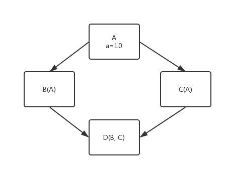

# Python Regex

- [Python Regex](#python-regex)
    - [class继承方式](#class%E7%BB%A7%E6%89%BF%E6%96%B9%E5%BC%8F)
    - [`re.match()`](#rematch)
    - [`re.search()`](#research)
    - [贪婪 vs 非贪婪](#%E8%B4%AA%E5%A9%AA-vs-%E9%9D%9E%E8%B4%AA%E5%A9%AA)

## class继承方式



python2的旧式类是深度遍历去找a: 先找B然后再找B的parent
python3的新式类是广度遍历去找a: 先找B,c层, 然后再找B的parent层

如何去找a: class和object分别有一个`__dict__`,其中的key-value分别存着属性和方法; 对于一个instance,先找object的`__dict__`再找class的`__dict__`

```python
class Test(object):
    def __init__(self):
        pass

    def __getattr__(self, item):
        print(item + ' ', end='')
        return self

    def __str__(self):
        return ''


obj = Test()
print(getattr(obj, 'think'))
print(getattr(obj, 'china'))
print(getattr(obj, 'different'))
print(obj.think.china.different)
```

```bash
#output
think 
china 
different 
think china different 
```

`__getattr__` vs `__getattribute__`

当使用`.`来找属性的时候, `__getattribute__`去`__dict__`中去找属性，找不到, 然后调用`__getattr__`方法;

```python
class Test(object):
    def __init__(self):
        self.num = 100

    def __getattr__(self, item):
        print(item + ' ', end='')
        return self
    
    def __getattribute__(self, item):
        return self.num 
        # 这个不要出现，因为会无限递归
        # self.num的时候会发生self.__getatrrtribute__("num")

    def __str__(self):
        return ''
```

## `re.match()`

从第一个字符开始匹配第一个match的字符串

```python
#re.match
# 从头开始匹配第一个
import re

pattern = r'hello'
my_str1 = 'hello'
my_str2 = 'hello world'
my_str3 = 'hello world hello'
my_str4 = 'world hello'
res1 = re.match(pattern, my_str1)
res2 = re.match(pattern, my_str2)
res3 = re.match(pattern, my_str3)
res4 = re.match(pattern, my_str4)

print(res1, res1.group())
print(res2, res2.group())
print(res3, res3.group())
print(res4)
```

```bash
#output
<_sre.SRE_Match object; span=(0, 5), match='hello'> hello
<_sre.SRE_Match object; span=(0, 5), match='hello'> hello
<_sre.SRE_Match object; span=(0, 5), match='hello'> hello
None
```

```python
# . 匹配一个任意字符除了\n的字符
import re

pattern = r'...'  # 除了\n
my_str1 = 'hello'
my_str2 = 'hello world'
my_str3 = 'hello world hello'
my_str4 = 'world hello'
res1 = re.match(pattern, my_str1)
res2 = re.match(pattern, my_str2)
res3 = re.match(pattern, my_str3)
res4 = re.match(pattern, my_str4)

print(res1, res1.group())
print(res2, res2.group())
print(res3, res3.group())
print(res4)
```

```bash
#output
<_sre.SRE_Match object; span=(0, 3), match='hel'> hel
<_sre.SRE_Match object; span=(0, 3), match='hel'> hel
<_sre.SRE_Match object; span=(0, 3), match='hel'> hel
<_sre.SRE_Match object; span=(0, 3), match='wor'>
```

```python
# \s 匹配一个空白字符: \t, space, \n \r
# \S 匹配一个非空白字符
# \d 匹配一个数字
# \D 匹配一个非数字
# \w 匹配一个单词(a-z, A-Z, 0-9, _)
# \w 匹配一个非单词(a-z, A-Z, 0-9, _)
## count
import re

res = re.match(r'\d*', 'abc')
print("hello"+res.group()+'world')  # helloworld
print('a'==''+'a')#True
```

symbol|count
---|---
`*`|$0\leqslant times$
`+`|$1\leqslant times$
`?`|$0\leqslant times \leqslant1$
`{m}`|$m=times$
`{m, }`|$m\leqslant times$
`{m, n}`|$m\leqslant times\leqslant n$

```python
# for phone
import re

pattern=re.compile(r'1[35678]\d{9}')
res=re.match(pattern, '13810455459666')
print(res, res.group())
#<_sre.SRE_Match object; span=(0, 11), match='13810455459'> 13810455459
```

```python
print('abc',end='')
print(r'\nabc',end='') # r meas raw, 输入是什么样的，打印就是什么样的
print('\nabc',end='')
print('\\nabc')
print('='*10)
print(r'\n123')
print(repr(r'\n123'))
#所以regex的一定要写r
```

```bash
#output
abc\nabc
abc\nabc
==========
\n123
'\\n123'
```

symbol|boundary
---|---
`^`|begin,对于match没有作用, 方括号内部表示取反
`$`|end
`b`|边界的右边是`\W`
`B`|边界的右边是`\w`

```python
# for phone
import re

pattern=re.compile(r'^1[35678]\d{9}$')
res=re.match(pattern, '13810455459666')
print(res)#None
```

```python
import re

pattern1=re.compile(r'\w+ea\b')
print(re.match(pattern1, 'tea'))#<_sre.SRE_Match object; span=(0, 3), match='tea'>
print(re.match(pattern1, 'teach'))#None
print(re.match(pattern1, 'tea me'))#<_sre.SRE_Match object; span=(0, 3), match='tea'>
print(re.match(pattern1, 'tea*'))#<_sre.SRE_Match object; span=(0, 3), match='tea'>
print(re.match(pattern1, 'tea\t'))#<_sre.SRE_Match object; span=(0, 3), match='tea'>
print('='*20)
pattern2=re.compile(r'\btea\b')
print(re.match(pattern2, ' tea '))#None
print('='*20)
pattern3=re.compile(r'.+\btea\b')#\b只是表示边界，不表示其他，所以前面的也需要匹配
print(re.match(pattern3, ' tea '))#<_sre.SRE_Match object; span=(0, 4), match=' tea'>
print('-'*30)
pattern4=re.compile(r'.+tea\B')
print(re.match(pattern4, 'green tea '))#None
print(re.match(pattern4, 'green tear'))#<_sre.SRE_Match object; span=(0, 9), match='green tea'>
print(re.match(pattern4, 'green teaR'))#<_sre.SRE_Match object; span=(0, 9), match='green tea'>
print(re.match(pattern4, 'green tea888'))#<_sre.SRE_Match object; span=(0, 9), match='green tea'>
print(re.match(pattern4, 'green teaR=_'))#<_sre.SRE_Match object; span=(0, 9), match='green tea'>
print('='*20)
pattern5=re.compile(r'\Btea\B')
print(re.match(pattern5, 'teacher'))#None
print(re.match(pattern5, 'math teacher'))#None
print(re.search(pattern5, 'greenteacher'))#<_sre.SRE_Match object; span=(5, 8), match='tea'>
```

symbol|group
---|---
`|`|or
`(xxx)`|括号内作为一个分组
`\num`|引用group(num)的字符串
`(?P<name>)`|Parameter, 分组别名，用于groupdict
`(?P=name)`|引用别名为name的group

```python
# |
import re

pattern1 = re.compile(r'100$|[1-9]\d?$|0$')
print(re.match(pattern1, '200'))  # None
print(re.match(pattern1, '01'))  # None
print(re.match(pattern1, '1000'))  # None
print('='*20)
pattern2 = re.compile(r'100$|\d?\d$')
print(re.match(pattern2, '200'))  # None
print(re.match(pattern2, '01'))  # <_sre.SRE_Match object; span=(0, 2), match='01'>
print(re.match(pattern2, '1'))  # <_sre.SRE_Match object; span=(0, 1), match='1'>
print(re.match(pattern2, '1000'))  # None
print(re.match(pattern2, '001'))  # None
```

```python
#()
import re

pattern1 = re.compile(r'/(\w+)/(\w+)/(\w+)')
res=re.match(pattern1, '/earth/china/beijing/haidian')
print(res.group())#/earth/china/beijing
print(res.group(0))#/earth/china/beijing
print(res.group(1))#earth
print(res.group(2))#china
print(res.group(3))#beijing
print(res.groups())#('earth', 'china', 'beijing')
print('='*20)
pattern2 = re.compile(r'/(?P<addr1>\w+)/(?P<addr2>\w+)/(?P<addr3>\w+)')
res2=re.match(pattern2, '/earth/china/beijing/haidian')
print(res2.groupdict())#{'addr1': 'earth', 'addr2': 'china', 'addr3': 'beijing'}
```

```python
# \num
import re

pattern1 = re.compile(r'<(.+)><(.+)>.+<(/\2)><(/\1)>')# \1表示group(1)
res=re.match(pattern1, '<html><h1>Hello, grey</h1></html> hahaha')
print(res)#<_sre.SRE_Match object; span=(0, 33), match='<html><h1>Hello, grey</h1></html>'>
print(res.groups())#('html', 'h1', '/h1', '/html')
```

```python
# (?P=name)
import re

pattern1 = re.compile(r'<(?P<tag1>.+)><(?P<tag2>.+)>.+</(?P=tag2)></(?P=tag1)>')# \1表示group(1)
res=re.match(pattern1, '<html><h1>Hello, grey</h1></html> hahaha')
print(res)
print(res.groups())#('html', 'h1', '/h1', '/html')
print(res.groupdict())
```

```python
#example: email
import re

pattern1=re.compile(r'\w+@\w+(.\w+)+')
print(re.match(pattern1, 'gewei@pku.edu.cn'))
print(re.match(pattern1, 'pku_gewei@163.com'))
```

## `re.search()`

从头查找第一个匹配的

从头查找所有匹配的: `re.findall()`

批量替换: `re.sub()`

```python
import re

res1=re.search(r'(\d+).+(\d+)', 'price=11111, num=222')
print(res1.group(0))#11111, num=222
print(res1.group(1))#11111
print(res1.group(2))#2
print("-"*20)
res2=re.search(r'\d+', 'price=11111, num=222')
print(res1.group())#11111
print('='*20)
res3=re.findall(r'\d+', 'price=11111, num=222')
print(res3)#['11111', '222']
```

```python
import re

def add_one(num_str):
    return f'{1+eval(num_str.group())}'

res1=re.sub(r'\d+', '998', 'price=10000, num=19')
print(res1)#price=998, num=998

res2=re.sub(r'\d+', lambda num_str: f'{1+eval(num_str.group())}', 'price=10000, num=19')
print(res2)#price=10001, num=20
```

三引号: 保留字符串的原始格式，不用处理`',",换行`问题; python对于`#`注释不去理睬, 但是对于`"""`还是会在内存中生成的(太大了会影响python interpreter的效率), 为了`__doc__`

```python
import re

my_str = """<div>
        <p>岗位职责：</p>
<p>完成推荐算法、数据统计、接口、后台等服务器端相关工作</p>
<p><br></p>
<p>必备要求：</p>
"""

#只剩下文字
res1 = re.sub(r'</?.+?>', '', my_str)  # 非贪婪模式
res2=re.sub(r'</?\w+>','', my_str)
print(res1)
print(res2)
```

```python
# re.split()
import re

my_str='cpp;csharp,c:java-go,kotlin_js|D'
res1=re.split(r';|,|:|-|,|_|\|', my_str)
print(res1)#['cpp', 'csharp', 'c', 'java', 'go', 'kotlin', 'js', 'D']
```

## 贪婪 vs 非贪婪

在`*,?,+,{m,n}`后面加上`?`，使贪婪变成非贪婪

```python
import re

s="This is a number 234-235-22-423"
#greedy
res1=re.match(r".+(\d+-\d+-\d+-\d+)",s)
print(res1.group(1))#4-235-22-423
#not greedy
res2=re.match(r".+?(\d+-\d+-\d+-\d+)",s)
print(res2.group(1))#234-235-22-423
```

```python
import re

s = 'http://www.interoem.com/messageinfo.asp?id=35'
# 去掉后面的东西
res = re.sub(r'(http://.+?/).*', lambda sub_str: sub_str.group(1), s)
print(res)  # http://www.interoem.com/
```

```python
#查找所有单词
import re

s = 'hello world ha ha'
res = re.split(r' +', s)
print(res)  # ['hello', 'world', 'ha', 'ha']
res2 = re.findall(r'\w+', s)
print(res2)#['hello', 'world', 'ha', 'ha']
res3=re.findall(r'\b[a-zA-Z]+\b', s)
print(res3)#['hello', 'world', 'ha', 'ha']
```