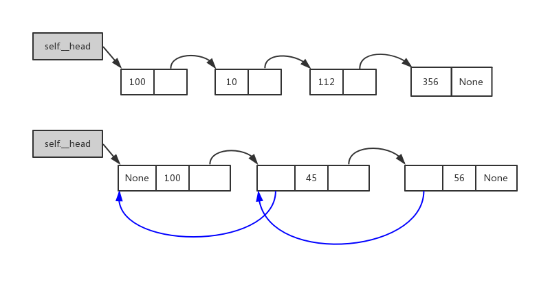
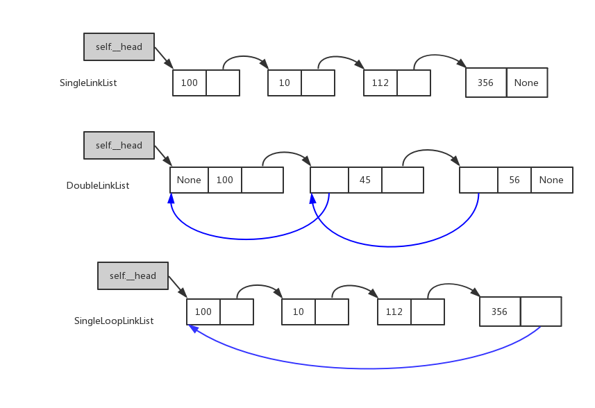
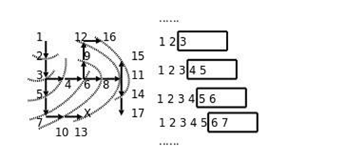

# Python Datastructures & Algorithm

- [Python Datastructures & Algorithm](#python-datastructures--algorithm)
  - [Introduction](#introduction)
  - [时间复杂度](#%e6%97%b6%e9%97%b4%e5%a4%8d%e6%9d%82%e5%ba%a6)
  - [顺序表](#%e9%a1%ba%e5%ba%8f%e8%a1%a8)
  - [链表](#%e9%93%be%e8%a1%a8)
    - [单向链表](#%e5%8d%95%e5%90%91%e9%93%be%e8%a1%a8)
    - [双向链表](#%e5%8f%8c%e5%90%91%e9%93%be%e8%a1%a8)
    - [单向循环链表(Single Cycle LinkList)](#%e5%8d%95%e5%90%91%e5%be%aa%e7%8e%af%e9%93%be%e8%a1%a8single-cycle-linklist)
    - [双向循环链表](#%e5%8f%8c%e5%90%91%e5%be%aa%e7%8e%af%e9%93%be%e8%a1%a8)
    - [summary](#summary)
  - [stack](#stack)
  - [queue](#queue)
    - [单端队列](#%e5%8d%95%e7%ab%af%e9%98%9f%e5%88%97)
    - [双端队列](#%e5%8f%8c%e7%ab%af%e9%98%9f%e5%88%97)
  - [hash table](#hash-table)

## Introduction

数据结构就是设计数据以何种方式组织并存储在计算机中。
> 比如：列表、集合与字典等都是一种数据结构。N.Wirth: “程序=数据结构+算法”


## 时间复杂度

函数调用不能认为是基本操作，而是对基本操作的封装，计算时间复杂度的时候需要考虑函数内部的情况；

`timeit`模块可以用来测试一小段Python代码的执行速度；

```python
import timeit


def append_test():
    list_temp = []
    for i in range(10000):
        list_temp.append(i)


def add_test():
    list_temp = []
    for i in range(10000):
        list_temp += [i, ]
        # list_temp = list_temp + [i, ] # 效率比上面的低，十分慢


def generator_test():
    list_temp = [x for x in range(10000)]


def generator_trans_test():
    list_temp = list(range(10000))


def insert_test():
    list_temp = []
    for i in range(10000):
        list_temp.insert(0, i)  # 倒序而已


def extend_test():
    list_temp = []
    for i in range(10000):
        list_temp.extend([i, ])


# timeit测试的时候并不是在当前文件中执行;所以参数是字符串;而且是在别的地方运算的，所以需要import
timer1 = timeit.Timer('append_test()', 'from __main__ import append_test')
# 测试100次
print(f'{timer1.timeit(1000):>8.4f} cost by append')
timer2 = timeit.Timer('add_test()', 'from __main__ import add_test')
print(f'{timer2.timeit(1000):>8.4f} cost by add')
timer3 = timeit.Timer('generator_test()', 'from __main__ import generator_test')
print(f'{timer3.timeit(1000):>8.4f} cost by generator')
timer4 = timeit.Timer('generator_trans_test()', 'from __main__ import generator_trans_test')
print(f'{timer4.timeit(1000):>8.4f} cost by transform')
timer5 = timeit.Timer('extend_test()', 'from __main__ import extend_test')
print(f'{timer5.timeit(1000):>8.4f} cost by extend')
timer6 = timeit.Timer('insert_test()', 'from __main__ import insert_test')
print(f'{timer6.timeit(1000):>8.4f} cost by insert')
```

```bash
#output
  1.0130 cost by append
  0.9431 cost by add
  0.4621 cost by generator
  0.2741 cost by transform
  1.3409 cost by extend
 22.7166 cost by insert
```

```python
#pop最后一个元素的效率远远高于pop第一个元素
import timeit

list1 = list(range(2000000))
timer1 = timeit.Timer("list1.pop(0)", "from __main__ import list1")
print(f'{timer1.timeit(1000):>8.4f} cost by pop_begin')
timer2 = timeit.Timer("list1.pop()", "from __main__ import list1")
print(f'{timer2.timeit(1000):>8.4f} cost by pop_end')
```

```bash
#output
  1.1288 cost by pop_begin
  0.0001 cost by pop_end
```

python list时间复杂度:

Operation|Big-O Efficiency|Explanation
---|---|---
indexx[ ]|$O(1)$|直接计算偏移量
index assignment|$O(1)$
len()|$O(1)$|直接访问顺序表头
append|$O(1)$
pop()|$O(1)$
pop(i)|$O(n-i)$|有返回值
del l[i]|$O(n-i)$|无返回值
remove|$O(n)$|无返回值
insert(i, item)|$O(n-i)$
iteration|$O(n)$
contains(in)|$O(n)$
get slice [x:y]|$O(k)$
del slice|$O(n)$|pop所有
set slice|$O(n+k)$|先pop所有，然后添加k个
reverse|$O(n)$
concatenate|$O(k)$
sort|$O(nlogn)$|depends on sort-Algorithm
multiply|$O(nk)$
extend()|$O(k)$

python dict时间复杂度:

Operation|Big-O Efficiency
---|---
iteration|$O(n)$
copy|$O(n)$
get item|$O(1)$
set item|$O(1)$
delete item|$O(1)$
contains(in)|$O(1)$

## 顺序表

python中的顺序表将表头和数据区分离(list的id不变)，然后数据区部分还是外置的(不同类型都可以添加)

## 链表

### 单向链表

```python
class Node(object):
    def __init__(self, elem):
        self.elem = elem
        self.next = None


class SingleLinkList(object):
    """单链表"""

    def __init__(self, node=None):
        self.__head = node

    def is_empty(self):
        return self.__head == None

    def length(self):
        # cursor
        cur = self.__head
        count = 0
        while cur != None:
            count += 1
            cur = cur.next
        return count

    def travel(self):
        cur = self.__head
        while cur != None:
            print(cur.elem, end=' ')
            cur = cur.next
        print()

    def add(self, item):
        '''add to begin'''
        node = Node(item)
        node.next = self.__head
        self.__head = node

    def append(self, item):  # 传进来的应该是数据而不是node
        """add to end"""
        node = Node(item)
        if self.is_empty():
            self.__head = node
        else:
            cur = self.__head
            while cur.next != None:
                cur = cur.next
            cur.next = node

    def insert(self, pos, item):
        if pos <= 0:
            self.add(item)
        elif pos >= self.length():
            self.append(item)
        else:
            node = Node(item)
            cur = self.__head
            current_pos = 0
            while current_pos != pos-1:
                current_pos += 1
                cur = cur.next
            node.next = cur.next
            cur.next = node

    def remove(self, item):
        """只是删除第一个"""
        pre = None
        cur = self.__head
        while cur != None:
            if cur.elem == item:
                if cur == self.__head:
                    """如果是开头"""
                    self.__head = cur.next
                else:
                    pre.next = cur.next
                return
            pre = cur
            cur = cur.next
        print(f"{item} not exist")

    def search(self, item):
        cur = self.__head
        while cur != None:
            if cur.elem == item:
                return True
            cur = cur.next
        return False


def main():
    list1 = SingleLinkList()
    list1.append(100)
    list1.append(200)
    list1.add(111)
    print(list1.length())
    list1.travel()
    list1.insert(2, 222)
    list1.travel()
    print(list1.search(333))
    list1.remove(111)
    list1.travel()
    list1.remove(222)
    list1.travel()


if __name__ == '__main__':
    main()
```

```bash
#output
3
111 100 200
111 100 222 200
False
100 222 200
100 200
```

### 双向链表



```python
class Node(object):
    def __init__(self, item):
        self.elem = item
        self.pre = None
        self.next = None


class DoubleLinkList(object):
    """双链表"""

    def __init__(self, node=None):
        self.__head = node

    def is_empty(self):
        return self.__head is None

    def length(self):
        cur = self.__head
        count = 0
        while cur != None:
            count += 1
            cur = cur.next
        return count

    def travel(self):
        cur = self.__head
        while cur != None:
            print(cur.elem, end=' ')
            cur = cur.next
        print()

    def add(self, item):
        node = Node(item)
        self.__head.pre = node
        node.next = self.__head
        self.__head = node

    def append(self, item):
        node = Node(item)
        if self.is_empty():
            self.__head = node
        else:
            cur = self.__head
            while cur.next != None:
                cur = cur.next
            cur.next = node
            node.pre = cur

    def insert(self, pos, item):
        if pos <= 0:
            self.add(item)
        elif pos >= self.length():
            self.append(item)
        else:
            cur = self.__head
            current_pos = 0
            while current_pos != pos:
                current_pos += 1
                cur = cur.next
            node = Node(item)
            # add node
            node.next = cur
            node.pre = cur.pre
            # break
            cur.pre.next = node
            cur.pre = node

    def search(self, item):
        cur = self.__head
        while cur != None:
            if cur.elem == item:
                return True
            cur = cur.next
        return False

    def remove(self, item):
        """只是删除找到的第一个"""
        cur = self.__head
        while cur != None:
            if cur.elem == item:
                if cur == self.__head:
                    """如果是开头"""
                    self.__head = cur.next
                    if cur.next:
                        #链表只有一个node
                        self.__head.pre = None
                else: 
                    cur.pre.next = cur.next
                    if cur.next:
                        # 尾节点
                        cur.next.pre = cur.pre
                return
            cur = cur.next
        print(f"{item} not exist")


def main():
    list1 = DoubleLinkList()
    list1.append(100)
    list1.append(200)
    list1.add(111)
    print(list1.length())
    list1.travel()
    list1.insert(2, 222)
    list1.travel()
    print(list1.search(333))
    list1.remove(111)
    list1.travel()
    list1.remove(222)
    list1.travel()


if __name__ == '__main__':
    main()
```

```bash
#output
3
111 100 200
111 100 222 200
False
100 222 200
100 200
```

### 单向循环链表(Single Cycle LinkList)



```python
class Node(object):
    def __init__(self, elem):
        self.elem = elem
        self.next = None


class SingleLinkList(object):
    """单向循环链表"""

    def __init__(self, node=None):
        self.__head = node
        if node:
            node.next = node

    def is_empty(self):
        return self.__head == None

    def length(self):
        # cursor
        if self.is_empty():
            return 0
        # not empty list
        cur = self.__head
        count = 1
        while cur.next != self.__head:
            count += 1
            cur = cur.next
        return count

    def travel(self):
        if self.is_empty():
            return
        cur = self.__head
        while cur.next != self.__head:
            print(cur.elem, end=' ')
            cur = cur.next
        # 注意最后一个node被遗漏
        print(cur.elem)

    def add(self, item):
        '''add to begin'''
        node = Node(item)
        if self.is_empty():
            node.next = node
            self.__head = node
            return
        # 先找到尾节点
        cur = self.__head
        while cur.next != self.__head:
            cur = cur.next
        cur.next = node
        node.next = self.__head
        self.__head = node

    def append(self, item):  # 传进来的应该是数据而不是node
        """add to end"""
        node = Node(item)
        if self.is_empty():
            node.next = node
            self.__head = node
            return
        cur = self.__head
        while cur.next != self.__head:
            cur = cur.next
        cur.next=node
        node.next=self.__head

    def insert(self, pos, item):
        # 中间位置与单链表相同，不需要改
        if pos <= 0:
            self.add(item)
        elif pos >= self.length():
            self.append(item)
        else:
            node = Node(item)
            cur = self.__head
            current_pos = 0
            while current_pos != pos-1:
                current_pos += 1
                cur = cur.next
            node.next = cur.next
            cur.next = node

    def remove(self, item):
        """只是删除第一个"""
        if self.is_empty():
            print(f"{item} not exist")
            return
        pre = None
        cur = self.__head
        while cur.next != self.__head:
            if cur.elem == item:
                if cur == self.__head:
                    """如果是开头"""
                    # 先找到尾部节点
                    rear=self.__head
                    while rear.next!=self.__head:
                        rear=rear.next
                    self.__head = cur.next
                    rear.next=self.__head
                else:
                    # 中间部分和单链表一样
                    pre.next = cur.next
                return
            pre = cur
            cur = cur.next
        if cur.elem==item:
            if cur==self.__head:
                # only one node
                self.__head=None
            else:
                pre.next=self.__head
            return
        print(f"{item} not exist")

    def search(self, item):
        if self.is_empty():
            return False
        cur = self.__head
        while cur.next != self.__head:
            if cur.elem == item:
                return True
            cur = cur.next
        if cur.elem==item:
            return True
        else:
            return False


def main():
    list1 = SingleLinkList()
    list1.append(100)
    list1.append(200)
    list1.add(111)
    print(list1.length())
    list1.travel()
    list1.insert(2, 222)
    list1.travel()
    print(list1.search(333))
    list1.remove(111)
    list1.travel()
    list1.remove(222)
    list1.travel()


if __name__ == '__main__':
    main()
```

```bash
#output
3
111 100 200
111 100 222 200
False
100 222 200
100 200
```

### 双向循环链表


### summary

对于链表的操作，要考虑

- `self.__head==None`
- 只有一个node
- 最后一个node
- 中间node的情况

甚至上，链表也可以像顺序表一样增加表头信息(表节点)；一般是紧挨着head,然后真正的都在这个表节点的后面

线性表:

- 顺序表
- 链表

## stack

如果将上面的线性表只允许一端操作，禁用其他的操作，那么就可以构成一个stack

顺序表和链表解决存储，而stack, queue是容器;

stack的操作:

- push(item)
- pop()
- peek(), 返回栈顶元素
- is_empty()
- size()

```python
#顺序表实现stack
class Stack(object):
    """借助list来实现stack"""

    def __init__(self):
        self.__list = []

    def push(self, item):
        # 可以选择头部插入，但是list是顺序表实现的，所以使用append效率更高
        # 如果是单链表，选择头部插入效率更高
        self.__list.append(item)

    def pop(self):
        if self.__list:
            return self.__list.pop()
        else:
            return None

    def peek(self):
        if self.__list:
            return self.__list[-1]
        else:
            return None

    def is_empty(self):
        return self.__list == []

    def size(self):
        return len(self.__list)


def main():
    s = Stack()
    print(f'is_empty={s.is_empty()}')
    for i in range(6):
        s.push(i)
    print(s.peek())
    print(f'is_empty={s.is_empty()}, size={s.size()}')
    while not s.is_empty():
        print(s.pop(), end=',')


if __name__ == '__main__':
    main()
```

```bash
#output
is_empty=True
5
is_empty=False, size=6
5,4,3,2,1,0,
```

example: 给一个字符串，其中包含小括号、中括号、大括号，求该字符串中的括号是否匹配

|example| result|
|----------|-----|
| ( ) ( ) [ ] { } | 匹配  |
| ( [ { ( ) } ] ) | 匹配  |
| [ ] (      | 不匹配 |
| [ ( ] )     | 不匹配 |

```py
def check_bracket(s):
    stack = []
    for char in s:
        if char in {'(', '[', '{'}: # this is a set
            stack.append(char)
        elif char == ')':
            if len(stack) > 0 and stack[-1] == '(':
                stack.pop()
            else:
                return False
        elif char == ']':
            if len(stack) > 0 and stack[-1] == '[':
                stack.pop()
            else:
                return False
        elif char == '}':
            if len(stack) > 0 and stack[-1] == '{':
                stack.pop()
            else:
                return False
    if len(stack) == 0:
        return True
    else:
        return False


print(check_bracket('(hello)[world]{{[]}}')) # True
```

example: 迷宫问题，stack实现，即深度搜索
给一个二维列表，表示迷宫（0表示通道，1表示围墙）。给出算法，求一条走出迷宫的路径。
- 在一个迷宫节点(x,y)上，可以进行四个方向的探查：maze[x-1][y], maze[x+1][y], maze[x][y-1], maze[x][y+1]
- 思路：从一个节点开始，任意找下一个能走的点，当找不到能走的点时，退回上一个点寻找是否有其他方向的点。
- 方法：创建一个空栈，首先将入口位置进栈。当栈不空时循环：获取栈顶元素，寻找下一个可走的相邻方块，如果找不到可走的相邻方块，说明当前位置是死胡同，进行回溯（就是讲当前位置出栈，看前面的点是否还有别的出路）

```py
maze = [
    [1, 1, 1, 1, 1, 1, 1, 1, 1, 1],
    [1, 0, 0, 1, 0, 0, 0, 1, 0, 1],
    [1, 0, 0, 1, 0, 0, 0, 1, 0, 1],
    [1, 0, 0, 0, 0, 1, 1, 0, 0, 1],
    [1, 0, 1, 1, 1, 0, 0, 0, 0, 1],
    [1, 0, 0, 0, 1, 0, 0, 0, 0, 1],
    [1, 0, 1, 0, 0, 0, 1, 0, 0, 1],
    [1, 0, 1, 1, 1, 0, 1, 1, 0, 1],
    [1, 1, 0, 0, 0, 0, 0, 1, 0, 1],
    [1, 1, 1, 1, 1, 1, 1, 1, 1, 1]
]

directions = [lambda x, y: (x + 1, y), # go downn
              lambda x, y: (x - 1, y), # go up
              lambda x, y: (x, y - 1), # go left
              lambda x, y: (x, y + 1)] # go right

def find_path(x1, y1, x2, y2):
    # (x1, y1)起点; (x2, y2)终点
    stack = []
    stack.append((x1, y1))
    while len(stack) > 0:
        curNode = stack[-1] # 栈顶
        if curNode[0] == x2 and curNode[1] == y2:
            # 到达终点
            for p in stack:
                print(p)
            return True
        for direction in directions: # 按照right, left, up, down的规则运动
            nextNode = direction(*curNode)
            if maze[nextNode[0]][nextNode[1]] == 0:
                # 找到了下一个
                stack.append(nextNode)
                maze[nextNode[0]][nextNode[1]] = -1  # 标记为已经走过，防止死循环
                break
        else:  # 四个方向都没找到
            maze[curNode[0]][curNode[1]] = -1  # 死路一条,下次别走了
            stack.pop()  # 回溯
    print("没有路")
    return False

find_path(1, 1, 8, 8)
```

## queue

### 单端队列

```python
class Queue(object):
    """借助list来实现queue"""

    def __init__(self):
        self.__list = []

    def enqueue(self, item):
        # 头部添加，尾部取；尾部添加，头部取；都是可以得因为总是一个O(1),一个O(n)
        # 具体看那个操作更加频繁，如果尾部添加更加频繁用list, 头部添加更加频繁用链表
        self.__list.append(item)

    def dequeue(self):
        #判断可以省略，因为list内部会返回None
        if self.__list:
            return self.__list.pop(0)
        else:
            return None

    def is_empty(self):
        return self.__list == []

    def size(self):
        return len(self.__list)


def main():
    q = Queue()
    print(f'is_empty={q.is_empty()}')
    for i in range(6):
        q.enqueue(i)
    print(f'is_empty={q.is_empty()}, size={q.size()}')
    while not q.is_empty():
        print(q.dequeue(), end=',')


if __name__ == '__main__':
    main()
```

```bash
#output
is_empty=True
is_empty=False, size=6
0,1,2,3,4,5,
```

example: 迷宫问题队列实现，即广度搜索
> 
- 思路：从一个节点开始，寻找所有下面能继续走的点。继续寻找，直到找到出口。
- 方法：创建一个空队列，将起点位置进队。在队列不为空时循环：出队一次。如果当前位置为出口，则结束算法；否则找出当前方块的4个相邻方块中可走的方块，全部进队。

```py
from collections import deque

mg = [
    [1, 1, 1, 1, 1, 1, 1, 1, 1, 1],
    [1, 0, 0, 1, 0, 0, 0, 1, 0, 1],
    [1, 0, 0, 1, 0, 0, 0, 1, 0, 1],
    [1, 0, 0, 0, 0, 1, 1, 0, 0, 1],
    [1, 0, 1, 1, 1, 0, 0, 0, 0, 1],
    [1, 0, 0, 0, 1, 0, 0, 0, 0, 1],
    [1, 0, 1, 0, 0, 0, 1, 0, 0, 1],
    [1, 0, 1, 1, 1, 0, 1, 1, 0, 1],
    [1, 1, 0, 0, 0, 0, 0, 1, 0, 1],
    [1, 1, 1, 1, 1, 1, 1, 1, 1, 1]
]

directions = [lambda x, y: (x + 1, y),  # go down
              lambda x, y: (x - 1, y),  # go up
              lambda x, y: (x, y - 1),  # go left
              lambda x, y: (x, y + 1)]  # go right


def print_path(path):
    curNode = path[-1]
    realpath = []
    print('迷宫路径为：')
    while curNode[2] != -1: # 没有回到起点
        realpath.append(curNode[:2])
        curNode = path[curNode[2]]
    realpath.append(curNode[:2])  # 加入起点
    realpath.reverse()
    print(realpath)


def find_path(x1, y1, x2, y2):
    queue = deque()
    path = []
    queue.append((x1, y1, -1))  # 最后一个参数是为了记录每个节点的父亲所在层级
    mg[x1][y1] = -1  # 标记起点走过
    while len(queue) > 0:
        curNode = queue.popleft()
        path.append(curNode)
        if curNode[0] == x2 and curNode[1] == y2:
            # 到达终点
            print(path)
            print_path(path)  # 根据父节点，不断回溯
            return True
        for direction in directions: # 搜索pop出来节点的4个方向，这4个方向属于同一个层级
            nextNode = direction(curNode[0], curNode[1])
            if mg[nextNode[0]][nextNode[1]] == 0:  # 找到下一个方块
                # print(path, (*nextNode, len(path) - 1))
                queue.append((*nextNode, len(path) - 1))
                mg[nextNode[0]][nextNode[1]] = -1  # 标记为已经走过
    return False


find_path(1, 1, 8, 8)
```

### 双端队列

相当于两个stack底部拼接在一起;

```python
class Deque(object):
    """借助list来实现deque"""

    def __init__(self):
        self.__list = []

    def add_front(self, item):
        self.__list.insert(0, item)

    def add_rear(self, item):
        self.__list.append(item)

    def remove_front(self):
        return self.__list.pop(0)

    def remove_rear(self):
        return self.__list.pop()

    def is_empty(self):
        return self.__list == []

    def size(self):
        return len(self.__list)


def main():
    q = Deque()
    print(f'is_empty={q.is_empty()}')
    for i in range(6):
        q.add_rear(i)
    for i in range(11, 55, 11):
        q.add_front(i)
    print(f'is_empty={q.is_empty()}, size={q.size()}')
    while not q.is_empty():
        print(q.remove_front(), end=',')
    # while not q.is_empty():
    #     print(q.remove_rear(), end=',')

if __name__ == '__main__':
    main()
```

```bash
#output
is_empty=True
is_empty=False, size=10
44,33,22,11,0,1,2,3,4,5,
```

## hash table

哈希表查找:
- 哈希表（Hash Table，又称为散列表），是一种线性表的存储结构。通过把每个对象的关键字k作为自变量，通过一个哈希函数h(k)，将k映射到下标h(k)处，并将该对象存储在这个位置。
- 例如：数据集合{1,6,7,9}，假设存在哈希函数h(x)使得h(1) = 0, h(6) = 2, h(7) = 4, h(9) = 5，那么这个哈希表被存储为[1,None, 6, None, 7, 9]。
- 当我们查找元素6所在的位置时，通过哈希函数h(x)获得该元素所在的下标（h(6) = 2），因此在2位置即可找到该元素。即O(1)复杂度

哈希冲突：由于哈希表的下标范围是有限的，而元素关键字的值是接近无限的，因此可能会出现h(102) = 56， h(2003) = 56这种情况。此时，两个元素映射到同一个下标处，造成哈希冲突。

[解决哈希冲突的四种方法](https://www.cnblogs.com/higerMan/p/11907117.html): 厉害的hash函数基本不冲突

在Python中的字典：`A={'name': 'Alex', 'age':18, 'gender':' Man}`
- 使用哈希表存储字典，通过哈希函数将字典的键映射为下标。假设h('name') = 3, h('age') = 1, h('gender') = 4，则哈希表存储为[None, 18, None, 'Alex', 'Man']
- 在字典键值对数量不多的情况下，几乎不会发生哈希冲突，此时查找一个元素的时间复杂度为O(1)。
- 能够被改变的变量(unhashable)不能作为dict的key, 因为dict的key要求hashable