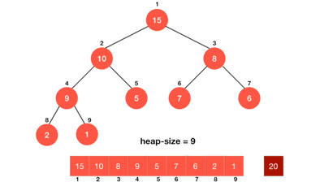

# Python Algorithm

- [Python Algorithm](#python-algorithm)
  - [Time & Space Complecity](#time--space-complecity)
  - [Search](#search)
  - [Sort](#sort)
    - [Bubble Sort](#bubble-sort)
    - [Selection sort](#selection-sort)
    - [Insertion Sort](#insertion-sort)
    - [Quick sort](#quick-sort)
    - [heap sort](#heap-sort)
    - [merge sort](#merge-sort)
    - [Shell Sort](#shell-sort)
    - [sort sunnmary](#sort-sunnmary)
  - [Tree](#tree)
    - [BFS](#bfs)
    - [DFS](#dfs)
    - [tree summary](#tree-summary)

## Time & Space Complecity

时间复杂度：用来评估算法运行效率
> 常见时间复杂度: `O(1)<O(logn)<O(n)<O(nlogn)<O(n2)<O(n2logn)<O(n3)`  
> eg. quick-sort: `O(nlogn)`

直接判断时间复杂度:
- 循环减半: O(logn)
- x重循环嵌套: O(n^x)

```py
# O(logn)
n=128

while n>1:
    print(n)
    n=n//2
```

空间复杂度：用来评估算法内存占用大小
- 创建一个变量: O(1)
- 创建一个列表: O(n)
- 创建一个二维列表: O(n2)

## Search

Problem:
- 列表查找：从列表中查找指定元素
  - 输入：列表、待查找元素
  - 输出：元素下标或未查找到元素

Solutions:
- 顺序查找
  - 从列表第一个元素开始，顺序进行搜索，直到找到为止。
    - 最劣时间复杂度$O(n)$
    - 最优时间复杂度$O(1)$
- 二分查找
  - 从有序列表的候选区data[0:n]开始，通过对待查找的值与候选区中间值的比较，可以使候选区减少一半。
    - 序列必须有序
    - 支持下标索引(顺序表)
    - 最劣时间复杂度$O(logn)$
    - 最优时间复杂度$O(1)$

example: 递归与尾递归

```py
# 有一个进入然后返回的过程
def recursive_sum(x):
    return x if x==0 else x+recursive_sum(x-1)

# 只有进入过程，没有返回过程
def tail_recursive_sum(x, result=0):
    if x==0:
        return result
    else:
        return tail_recursive_sum(x-1, result+x)

print(recursive_sum(5))
print(tail_recursive_sum(5))
```

example: 比较顺序查找、二分查找循环实现、二分查找递归实现的运行效率

```py
import time

def calc_time(func):
    def wrapper(*args, **kwargs):
        t1=time.time()
        result=func(*args, **kwargs)
        t2=time.time()
        print(f'{func.__name__} running time: {t2-t1} s')
        return result
    return wrapper

@calc_time
def linear_search(data_set, val):
    for i, d in enumerate(data_set):
        if d==val:
            return i

@calc_time
def bin_search(data_set, val):
    """非递归实现"""
    low = 0
    high = len(data_set)-1

    while low <= high:
        mid = (low+high)//2
        if data_set[mid] == val:
            return mid
        elif val < data_set[mid]:
            high = mid-1
        else:
            low = mid+1
        # print(f'{low},{high}')
    return False

def _recur_bin_search(data_set, val):
    """
    递归实现
    缺点1: 是无法定位目标val的index
    缺点2: 频繁创建list导致内存占用大，还占用了大量运行时间
    """

    n = len(data_set)

    # 递归终止条件
    if n == 0:
        return False
    
    mid = n//2
    # print(f'mid={mid}')
    if data_set[mid] == val:
        return data_set[mid]
    elif val < data_set[mid]:
        return _recur_bin_search(data_set[:mid], val)
    else:
        return _recur_bin_search(data_set[mid+1:], val)

@calc_time
def recur_bin_search(data_set, val):
    # 递归不能加装饰器，所以需要新函数
    return _recur_bin_search(data_set, val)


data=list(range(200000000))
print(linear_search(data, 173320))
print(bin_search(data, 173320))
print(recur_bin_search(data, 173320))
# 速度: bin_search> linear_search > recur_bin_search
```

example: search struct

```py
import time
import random

def generate_data(n):
    result = []
    ids = list(range(1001, 1001+n))
    a1 = ['zhao', 'qian', 'sun', 'li']
    a2 = ['li', 'hao', '', '']
    a3 = ['qiang', 'guo']
    for i in ids:
        name = random.choice(a1)+random.choice(a2)+random.choice(a3)
        student = {'id': i, 'age': random.randint(18, 60), 'name': name}
        result.append(student)
    return result

def bin_search(data_set, val):
    """非递归实现"""
    low = 0
    high = len(data_set)-1

    while low <= high:
        mid = (low+high)//2
        if data_set[mid]['id'] == val:
            return data_set[mid]
        elif val < data_set[mid]['id']:
            high = mid-1
        else:
            low = mid+1
    return False

data = generate_data(1000)
print(bin_search(data, 2000))
```

## Sort

排序算法分类:
- easy: 重点在于**有序区**和**无序区**
  - bubble sort
  - selection sort
  - insertion sort
- 常用
  - quick sort
  - heap sort
  - merge sort
- rarely used
  - shell sort: 希尔排序
  - raidx sort: 基数排序
  - bucket sort: 桶排序

### Bubble Sort

> 

```py
import random
import time

def calc_time(func):
    def wrapper(*args, **kwargs):
        t1=time.time()
        result=func(*args, **kwargs)
        t2=time.time()
        print(f'{func.__name__} running time: {t2-t1} s')
        return result
    return wrapper

@calc_time
def bubble_sort(data_set):
    '''时间复杂度是O(n^2)'''
    n=len(data_set)
    for i in range(n-1): # n个元素，只需要n-1趟
        for j in range(n-1-i): # 第1趟循环到index=n-2就ok, 所以是range(n-1-i)
            if data_set[j]>data_set[j+1]:
                data_set[j], data_set[j+1]=data_set[j+1], data_set[j]

@calc_time
def bubble_sort_x(data_set):
    '''
    针对初始就有序的序列进行优化
    最好时间复杂度为O(n), 只扫描一遍
    最坏时间复杂度为O(n^2)
    '''
    n=len(data_set)
    for i in range(n-1):
        exchange=False
        for j in range(n-1-i):
            if data_set[j]>data_set[j+1]:
                data_set[j], data_set[j+1]=data_set[j+1], data_set[j]
                exchange=True
        if not exchange:
            break


# example1: sort
data=list(range(10))
random.shuffle(data)
print(data)
bubble_sort_x(data)
print(data)


# # example2: 比较优化前后版本的效率
# data1=list(range(10000))
# data2=data1.copy() # deep copy

# bubble_sort(data1)
# print(data1)
# bubble_sort_x(data2)
# print(data2)
```

### Selection sort

认为一个序列分成两部分，前部分是排号顺序的，后部分是待遍历的；先找到最小值
- 最优时间复杂度$O(n^2)$, 没有办法优化
- 最劣时间复杂度$O(n^2)$

```py
import random
import time

def calc_time(func):
    def wrapper(*args, **kwargs):
        t1 = time.time()
        result = func(*args, **kwargs)
        t2 = time.time()
        print(f'{func.__name__} running time: {t2-t1} s')
        return result
    return wrapper

@calc_time
def selection_sort(data_set):
    n = len(data_set)
    for i in range(n-1):
        min_loc = i
        for j in range(i+1, n):
            if data_set[j] < data_set[min_loc]:
                min_loc = j
        if min_loc != i:  # 加入这一条能够将不稳定的选择排序变为稳定的
            data_set[i], data_set[min_loc] = data_set[min_loc], data_set[i]

data = list(range(10))
random.shuffle(data)
print(data)
selection_sort(data)
print(data)
```

### Insertion Sort

认为一个序列分成两部分,每次从后部分挑一个到前面部分按顺序的位置
> 
- 最优时间复杂度$O(n)$，已经处于有序状态
- 最劣时间复杂度$O(n^2)$
- 排序算法稳定

```py
import random
import time


def calc_time(func):
    def wrapper(*args, **kwargs):
        t1 = time.time()
        result = func(*args, **kwargs)
        t2 = time.time()
        print(f'{func.__name__} running time: {t2-t1} s')
        return result
    return wrapper


@calc_time
def insertion_sort_1(data_set):
    '''method1'''
    n = len(data_set)
    # 从第二个位置，即下标为1的元素开始向前插入
    for i in range(1, n):
        for j in range(i, 0, -1):  # 从右往左判断
            if data_set[j] < data_set[j-1]:
                data_set[j], data_set[j-1] = data_set[j-1], data_set[j]
            else: #这一句是优化，如果判断不成立，再往前的就不用比较了，因为肯定是大于它们的
                break


@calc_time
def insertion_sort_2(data_set):
    '''method2: 优化版本，因为没有进入循环而进行while判断，当有序时，时间复杂度为O(n)'''
    n = len(data_set)
    for i in range(1, n):
        tmp = data_set[i]
        j = i - 1
        while j >= 0 and data_set[j] > tmp:
            data_set[j+1] = data_set[j]
            j = j - 1
        data_set[j + 1] = tmp


data1 = list(range(10000000))
# random.shuffle(data1)
data2=data1.copy()
# print(data1, data2)
insertion_sort_1(data1)
insertion_sort_2(data2)
# print(data1, data2)
```

### Quick sort

关键: 整理分区+递归
> 好写的排序算法里最快的, 快的排序算法里最好写的
- 排序不稳定, 因为有多个相同的元素的时候，会出现左右移动的情况
- 最优时间复杂度O(nlogn), 每一层是n, 共logn层,所以时间复杂度为O(nlogn), 正好mid_value是中间值的情况
- 最劣时间复杂度O(n^2), 正好是顺序导致无法整理分区，每一层为n, 共n层

快排思路：
> 
- 取一个元素p（第一个元素），使元素p归位；
- 列表被p分成两部分，左边都比p小，右边都比p大；
- 递归完成排序。
  > 

```py
import random
import time
import sys

# 调整递归深度
sys.setrecursionlimit(10000)

def calc_time(func):
    def wrapper(*args, **kwargs):
        t1 = time.time()
        result = func(*args, **kwargs)
        t2 = time.time()
        print(f'{func.__name__} running time: {t2-t1} s')
        return result
    return wrapper

def _quck_sort(data_set, left, right):
    if left < right: # 递归终止条件 left >= right
        mid = partition(data_set, left, right)
        _quck_sort(data_set, left, mid-1)
        _quck_sort(data_set, mid+1, right)

def partition(data_set, left, right):
    tmp = data_set[left]
    while left < right:
        # 下面两个循环使得tmp的左边都<tmp, tmp的右边>=tmp
        # 如果逆序: data_set[right]<tmp, 下面data_set[left]>=tmp
        while left < right and data_set[right] >= tmp:
            right -= 1
        data_set[left] = data_set[right]
        
        while left < right and data_set[left] < tmp:
            left += 1
        data_set[right] = data_set[left]
    
    data_set[left] = tmp
    return left # 此时left==right

@calc_time
def quick_sort(data_set):
    return _quck_sort(data_set, 0, len(data_set)-1)

@calc_time
def sys_sort(data_set):
    '''python自带的sort是Timsort平均复杂度也是O(nlogn)，但是因为调用c, 比自己实现的快速排序要更快'''
    data_set.sort()

data1 = list(range(10000))
random.shuffle(data1)
data2= data1.copy()
print(id(data1)==id(data2)) # False, because is deep copy

quick_sort(data1)
sys_sort(data2)
# print(data1, data2)
```

### heap sort

1. 建立堆
1. 得到堆顶元素，为最大元素
1. 去掉堆顶，将堆最后一个元素放到堆顶，此时可通过**一次调整**重新使堆有序。
1. 堆顶元素为第二大元素。
1. 重复步骤3，直到堆变空。

建立堆
> 

堆排序:(直接取出堆顶最大)
> 

堆排序:为了节约内存，交换堆顶最大和完全二叉树最后一个
> 

```py
import random
import time

def calc_time(func):
    def wrapper(*args, **kwargs):
        t1 = time.time()
        result = func(*args, **kwargs)
        t2 = time.time()
        print(f'{func.__name__} running time: {t2-t1} s')
        return result
    return wrapper

def sift(data_set, low, high):
    i = low
    j = 2 * i + 1
    tmp = data_set[i]
    while j <= high:  # 孩子在堆里
        if j < high and data_set[j] < data_set[j+1]:  # 如果有右孩子且比左孩子大
            j += 1  # j指向右孩子
        if data_set[j] > tmp:  # 孩子比最高领导大
            data_set[i] = data_set[j]  # 孩子填到父亲的空位上
            i = j  # 孩子成为新父亲
            j = 2 * i + 1  # 新孩子
        else:
            break
    data_set[i] = tmp  # 最高领导放到父亲位置

@calc_time
def heap_sort(data_set):
    n = len(data_set)
    # 初次建堆
    for i in range(n // 2 - 1, -1, -1):
        sift(data_set, i, n - 1)
    # 每次调整之后，将堆顶从树的最后节点一直往前放
    for i in range(n-1, -1, -1):  # i指向未排序堆部分的最后
        data_set[0], data_set[i] = data_set[i], data_set[0]  # 堆顶逐步换到后面
        sift(data_set, 0, i - 1)  # 调整出新堆顶最大


data1 = list(range(10))
random.shuffle(data1)

print(data1)
heap_sort(data1)
print(data1)
```

example: 逆序heap sort

```py
def sift(data, low, high):
    '''一次调整'''
    i = low
    j = 2 * i + 1
    tmp = data[i]
    while j <= high:
        if j < high and data[j] > data[j + 1]:
            j += 1
        if tmp > data[j]:
            data[i] = data[j]
            i = j
            j = 2 * i + 1
        else:
            break
    data[i] = tmp
```

三者速度比较:
quick-sort>merge-sort>heap-sort

### merge sort

核心思想：先拆开再合并(合并时候，用到了两个游标，然后互相比较)；也要用到递归

拆开时候需要$logn$次，每次切片需要n次，合并的时候需要合并$logn$次，但是对于每次合并，都需要循环添加到新的list, 所以每一循环n次，时间复杂度$2nlogn$也就是$O(nlogn)$

- 最优时间复杂度$O(nlogn)$
- 最劣时间复杂度$O(nlogn)$
- 排序算法稳定
- 时间上是小的复杂度，空间上要另外有一片空间

```python
def merge_sort(a_list):
    n = len(a_list)
    # 递归终止条件
    if n <= 1:
        return a_list

    # 拆分, 用新的子序列来处理，而不是在原来的本身处理
    mid_index = n//2
    # 归并之后形成的有序的子序列
    left_list = merge_sort(a_list[:mid_index])
    right_list = merge_sort(a_list[mid_index:])
    
    # 合并
    lp, rp = 0, 0
    result = []
    while lp < len(left_list) and rp < len(right_list):
        if left_list[lp] <= right_list[rp]:
            result.append(left_list[lp]) # 这样做是逆序的
            lp += 1
        else:
            result.append(right_list[rp])
            rp += 1
    # 补充剩下的部分
    result+=left_list[lp:]        
    result+=right_list[rp:]
    return result        


list1 = []
for i in range(10):
    list1.append(10-i)
print(list1)
print('='*30)
sorted_list=merge_sort(list1)
print(sorted_list)  
```

```bash
#output
[10, 9, 8, 7, 6, 5, 4, 3, 2, 1]
==============================
[1, 2, 3, 4, 5, 6, 7, 8, 9, 10]
```

```python
# 优化代码
def merge_sort(a_list):
    n = len(a_list)
    # 递归终止条件
    if n <= 1:
        return a_list

    # 拆分, 用新的子序列来处理，而不是在原来的本身处理
    mid_index = n//2
    # 归并之后形成的有序的子序列
    left_list = merge_sort(a_list[:mid_index])
    right_list = merge_sort(a_list[mid_index:])
    return merge(left_list, right_list)

def merge(left_list, right_list):
    # 合并
    lp, rp = 0, 0
    result = []
    while lp < len(left_list) and rp < len(right_list):
        if left_list[lp] <= right_list[rp]:
            result.append(left_list[lp]) # 这样做是逆序的
            lp += 1
        else:
            result.append(right_list[rp])
            rp += 1
    # 补充剩下的部分
    result+=left_list[lp:]        
    result+=right_list[rp:]
    return result        


list1 = []
for i in range(10):
    list1.append(10-i)
print(list1)
print('='*30)
sorted_list=merge_sort(list1)
print(sorted_list)
```

### Shell Sort

核心思想是gap的设置;分组;在插入排序基础上修改而来

-  最坏时间复杂度$O(n^2)$, gap=1的时候
-  最优时间复杂度$O(n^{1.3})$, 统计结果
-  排序算法不稳定

```python
# 在插入排序基础上直接修改
def shell_sort(a_list):
    n = len(a_list)
    gap = n//2
    while gap != 0:
        for i in range(gap, n):
            j = i
            while j > 0:
                if a_list[j] < a_list[j-gap]:
                    a_list[j], a_list[j-gap] = a_list[j-gap], a_list[j]
                    j -= gap
                else:
                    break
        gap //= 2


list1 = []
for i in range(10):
    list1.append(10-i)
print(list1)
shell_sort(list1)
print(list1)
print('='*30)
shell_sort(list1)
print(list1)
```

### sort sunnmary

排序算法的稳定性: 同一序列的两个相同数值，排序完毕后，相对位置是否发生变化

| Name           | Average | Best  | Worst | Memory  | Stable  |
|----------------|---------|-------|-------|---------|---------|
| bubble sort    | n^2     | n     | n^2   | 1       | Yes     |
| insertion sort | n^2     | n     | n^2   | 1       | Yes     |
| selection sort | n^2     | n^2   | n^2   | 1       | depends |
| quick sort     | nlogn   | nlogn | n^2   | logn    | depends |
| heap sort      | nlogn   | nlogn | nlogn | 1       | No      |
| merge sort     | nlogn   | nlogn | nlogn | depends | Yes     |
| Timsort        | nlogn   | n     | nlogn | n       | Yes     |
| Introsort      | nlogn   | nlogn | nlogn | logn    | No      |


如果list本身是逆序，那么quick-sort就是最坏情况，logn无法发生作用，时间复杂度为O(n2)

因为quick-sort的时候需要用递归，而递归需要stack, 最好的情况递归深度为logn,最坏的情况需要n;

merger-sort时候需要子序列，而子序列和原序列一样大，所以是n;

quick-sort最平衡,所以要掌握; python默认sort也是quick-sort;

## Tree

排序二叉树用的就是二分查找的方法

树的顺序存储比较少，而链式存储比较常见;

树的实现需要队列，从右边加入，从左边读取;实现广度遍历;

### BFS

```python
class Node(object):
    def __init__(self, item):
        self.elem = item
        self.lchild = None
        self.rchild = None


class Tree(object):
    def __init__(self):
        self.root = None

    def add(self, item):
        node = Node(item)
        if self.root is None:
            self.root = node
            return

        queue = [self.root, ]  # bool([None, ])结果是True

        while queue:
            cur_node = queue.pop(0)
            if cur_node.lchild is None:
                cur_node.lchild = node
                return
            else:
                queue.append(cur_node.lchild)

            if cur_node.rchild is None:
                cur_node.rchild = node
                return
            else:
                queue.append(cur_node.rchild)

    def breadth_travel(self):
        if self.root is None:
            return
        queue = [self.root, ]
        while queue:
            cur_node = queue.pop(0)
            print(f'current elem={cur_node.elem}')
            if cur_node.lchild:
                queue.append(cur_node.lchild)
            if cur_node.rchild:
                queue.append(cur_node.rchild)

    def deepth_travel(self):
        pass


def main():
    tree = Tree()
    for i in range(10):
        tree.add(i)
    tree.breadth_travel()


if __name__ == '__main__':
    main()
```

```bash
#output
current elem=0
current elem=1
current elem=2
current elem=3
current elem=4
current elem=5
current elem=6
current elem=7
current elem=8
current elem=9
```

### DFS

```python
class Node(object):
    def __init__(self, item):
        self.elem = item
        self.lchild = None
        self.rchild = None


class Tree(object):
    def __init__(self):
        self.root = None

    def add(self, item):
        node = Node(item)
        if self.root is None:
            self.root = node
            return

        queue = [self.root, ]  # bool([None, ])结果是True

        while queue:
            cur_node = queue.pop(0)
            if cur_node.lchild is None:
                cur_node.lchild = node
                return
            else:
                queue.append(cur_node.lchild)

            if cur_node.rchild is None:
                cur_node.rchild = node
                return
            else:
                queue.append(cur_node.rchild)

    def breadth_travel(self):
        if self.root is None:
            return
        queue = [self.root, ]
        while queue:
            cur_node = queue.pop(0)
            print(f'current elem={cur_node.elem}')
            if cur_node.lchild:
                queue.append(cur_node.lchild)
            if cur_node.rchild:
                queue.append(cur_node.rchild)

    def pre_order(self, node):
        """根左右，先序遍历"""
        # 递归终止条件
        if node is None:
            return
        print(node.elem, end=',')
        self.pre_order(node.lchild)
        self.pre_order(node.rchild)

    def mid_order(self, node):
        """左根右，中序遍历"""
        # 递归终止条件
        if node is None:
            return
        self.mid_order(node.lchild)
        print(node.elem, end=',')
        self.mid_order(node.rchild)

    def pos_order(self, node):
        """左右根，后序遍历"""
        # 递归终止条件
        if node is None:
            return
        self.pos_order(node.lchild)
        self.pos_order(node.rchild)
        print(node.elem, end=',')

def main():
    tree = Tree()
    for i in range(10):
        tree.add(i)
    tree.pre_order(tree.root)
    print()
    tree.mid_order(tree.root)
    print()
    tree.pos_order(tree.root)
    


if __name__ == '__main__':
    main()
```

```bash
#output
0,1,3,7,8,4,9,2,5,6,
7,3,8,1,9,4,0,5,2,6,
7,8,3,9,4,1,5,6,2,0,
```

### tree summary

广度遍历:

- 已知一个tree→广度遍历
- 已知一个广度遍历的结果→获得tree的结构

深度遍历:

- 已知一个tree→前中后序遍历
- 单独知道前中后序遍历中的一个不能得到tree的结构
- 前中序遍历→获得tree的结构
- 中后序遍历→获得tree的结构
- 前后序遍历→无法获得tree的结构, 因为左右子树分不开

那么可以先通过前中序的遍历结果得到tree的结构，然后写出后序遍历的结果；