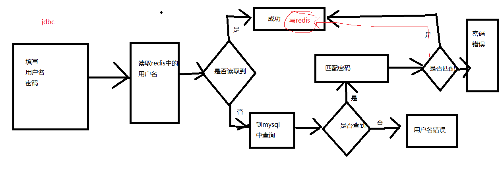

# Python with Redis

- [Python with Redis](#python-with-redis)
  - [Introduction](#introduction)
  - [remote redis](#remote-redis)
    - [redis with auth](#redis-with-auth)
  - [string](#string)
  - [key](#key)
  - [hash](#hash)
  - [list](#list)
  - [set](#set)
  - [zset](#zset)
  - [发布、订阅](#%e5%8f%91%e5%b8%83%e8%ae%a2%e9%98%85)
  - [主从配置](#%e4%b8%bb%e4%bb%8e%e9%85%8d%e7%bd%ae)
  - [redis with python](#redis-with-python)
    - [封装](#%e5%b0%81%e8%a3%85)
  - [用户登录](#%e7%94%a8%e6%88%b7%e7%99%bb%e5%bd%95)

## Introduction

也是一种NoSQL, 内存级的存储, 以key-value为特色, 也会定时将内存数据存到物理磁盘上；

```bash
# xbuntu install redis
sudo apt install redis-server

# service redis start
sudo systemctl start redis-server
sudo systemctl restart redis-server
sudo systemctl enable redis-server
ps ajx|grep redis
# /usr/bin/redis-server 127.0.0.1:6379
# 阿里云需要/etc/redis/redis.config设置 bind 127.0.0.1
# 阿里云需要/etc/redis/redis.config设置 bind 0.0.0.0 for remote access

# 直接运行redis-server会直接运行，阻塞当前终端
redis-server

# 启动客户端
redis-cli
```

redis配置(`sudo vim /etc/redis/redis.conf`)守护进程:

- 如果以守护进程运行，则不会在命令行阻塞，类似于服务(推荐)`daemonize yes`
- 如果以非守护进程运行，则当前终端被阻塞，无法使用

无论是修改了什么配置，都需要`service redis restart`

redis默认是16个数据库(0-15), 没有名字，是按照数字来排的，默认用的是0数据库；

redis是key-value的数据，所以每个数据都是一个key-value;

键的类型是**字符串**, 值的类型分为五种:

- 字符串string
- 哈希hash
- 列表list
- 集合set
- 有序集合zset

[用法](http://redis.cn/commands.html)

## remote redis

[Tutorial](https://blog.csdn.net/zyz511919766/article/details/42268219)

`sudo vim /etc/redis/redis.conf`注释`bind 127.0.0.1`,将`protected_mode no`即可无密码远程访问redis

### redis with auth

`sudo vim /etc/redis/redis.conf`注释`bind 127.0.0.1`,将`requirepass 13810455459`

```bash
redis-cli
127.0.0.1:6379> auth 13810455459
127.0.0.1:6379> ping
PONG
```

```bash
redis-cli -a 13810455459
# or
redis-cli -h 127.0.0.1 -p 6379 -a 13810455459
```

可以直接在GUI(RedisDesktopManager)里面用ip和密码登录

redis没有查询功能，只能key-value

## string

- string是redis最基本的类型，不仅仅是字符串
- 最大能存储512MB数据
- string类型是二进制安全的，即可以为任何数据，比如数字、图片、序列化对象等

```bash
# set
redis_test:0>set key1 value1
# redis_test:0>set 'key1' 'value1'
"OK"
# 设置key-value的有效时间，2s有效
redis_test:0>setex key2 2 value2
"OK"
redis_test:0>mset key4 value4 key5 vaule5
"OK"


# get
redis_test:0>get key4
"value4"
redis_test:0>get key2
null
redis_test:0>get key3
null
redis_test:0>mget key4 key5
 1)  "value4"
 2)  "vaule5"


# 运算，数据是数字
redis_test:0>set num1 10
"OK"
redis_test:0>set num2 20
"OK"
redis_test:0>incr num1
"11"
redis_test:0>incrby num2 100
"120"
redis_test:0>decr num1
"10"
redis_test:0>decrby num2 100
"20"


# strlen, append
redis_test:0>strlen key1
"6"
redis_test:0>append key1 world
"11"
redis_test:0>get key1
"value1world"
```

## key

```bash
# key pattern， 查找键，参数支持正则
redis_test:0>keys *
 1)  "key5"
 2)  "key1"
 3)  "key4"
 4)  "num2"
 5)  "num1"

redis_test:0>keys 'key*'
 1)  "key5"
 2)  "key1"
 3)  "key4"


# exists
redis_test:0>exists key2
"0"
redis_test:0>exists key1
"1"

# type, string不仅仅是指字符串
redis_test:0>type key1
"string"
redis_test:0>type num1 #用的string表示数值
"string"

# del
redis_test:0>del key5
"1"
redis_test:0>exists key5
"0"

# expire
redis_test:0>expire key4 2
"1"
redis_test:0>exists key4
"0"

# 查看有效时间
redis_test:0>ttl key1
"-1"
redis_test:0>expire num1 5
"1"
redis_test:0>ttl nuim1 # 这个是不断变化的
"-2"
```

## hash

hash用于存储对象，对象的格式为键值对

```bash
redis_test:0>hset key11 name chris
"1"
redis_test:0>hmset key22 name moris gender 1
"OK"
redis_test:0>hget key11 name
"chris"
redis_test:0>hmget key22 name gender
 1)  "moris"
 2)  "1"
redis_test:0>hgetall key22
 1)  "name"
 2)  "moris"
 3)  "gender"
 4)  "1"
redis_test:0>hkeys key22
 1)  "name"
 2)  "gender"
redis_test:0>hlen key22
"2"
redis_test:0>hvals key22
 1)  "moris"
 2)  "1"

redis_test:0>type key11
"hash"
redis_test:0>type key22
"hash"

redis_test:0>hexists key22 gender
"1"
redis_test:0>hstrlen key22 name
"5"
redis_test:0>hdel key11 name
"1"
```

## list

- 列表的元素类型为string
- 按照插入顺序排序
- 在列表的头部或者尾部添加元素

```bash
# push
redis_test:0>lpush list1 10 20 30
"3"
redis_test:0>rpush list2 chris james tim
"3"
redis_test:0>lpush list3 hello 10 20 world
"4"

# insert
redis_test:0>linsert list1 before 20 111
"4"
redis_test:0>linsert list1 before 20 222
"5"

# lrange
redis_test:0>lset list1 2 2020
"OK"
redis_test:0>lrange list1 0 4
 1)  "30"
 2)  "111"
 3)  "2020"
 4)  "222"
 5)  "10"

redis_test:0>lrange list2 0 -1
 1)  "chris"
 2)  "james"
 3)  "tim"

# pop
redis_test:0>lpop list1
"30"
redis_test:0>rpop list1
"10"
redis_test:0>lrange list1 0 4
 1)  "111"
 2)  "2020"
 3)  "222"

# trim
redis_test:0>llen list1
"3"
redis_test:0>lindex list1 1
"2020"
redis_test:0>ltrim list1 1 2
"OK"
redis_test:0>lrange list1 0 1
 1)  "2020"
 2)  "222"
```

## set

- 无序集合
- 元素为string类型
- 元素具有唯一性，不重复

```bash
sadd set0 grey grey james james 3 3 3
(integer) 3 # 唯一性
```

```bash
redis_test:0>smembers set1
 1)  "10"
 2)  "20"
 3)  "30"
 4)  "40"
redis_test:0>smembers set2
 1)  "20"
 2)  "10"
 3)  "a"
 4)  "b"
redis_test:0>scard set1
"4"
redis_test:0>scard set2
"4"
redis_test:0>sinter set1 set2
 1)  "10"
 2)  "20"
redis_test:0>sdiff set1 set2
 1)  "30"
 2)  "40"
redis_test:0>sdiff set2 set1
 1)  "a"
 2)  "b"
redis_test:0>sunion set1 set2
 1)  "10"
 2)  "a"
 3)  "30"
 4)  "40"
 5)  "20"
 6)  "b"
redis_test:0>sismember set1 10
"1"
```

## zset

- sorted set，有序集合
- 元素为string类型
- 元素具有唯一性，不重复
- 每个元素都会关联一个double类型的score，表示权重，通过权重将元素从小到大排序
- 元素的score可以相同

```bash
redis_test:0>zadd z1 1.1 hello 2.2 world 3.2 james
"3"
redis_test:0>zrange z1 0 -1
 1)  "hello"
 2)  "world"
 3)  "james"
ZRANGE z1 0 -1 withscores
1) "hello"
2) "1.1000000000000001"
3) "world"
4) "2.2000000000000002"
5) "james"
6) "3.2000000000000002"

redis_test:0>zcard z1
"3"
redis_test:0>zcount z1 0 3
"2"
redis_test:0>zscore z1 world
"2.2000000000000002"

127.0.0.1:6379> zadd z1 4.2 world
(integer) 0
127.0.0.1:6379> zrange z1 0 -1
1) "hello"
2) "james"
3) "world"

127.0.0.1:6379> zadd math 10 grey 87 james 55 alpha
(integer) 3
127.0.0.1:6379> zadd physics 88 grey 89 james 25 alpha
(integer) 3
127.0.0.1:6379> zinterstore total_score 2 math physics
(integer) 3
127.0.0.1:6379> zrange total_score 0 -1 withscores
1) "alpha"
2) "80"
3) "grey"
4) "98"
5) "james"
6) "176"
```

## 发布、订阅

发布订阅来自一种设计模式**发布订阅**

redis实现的就是类似这种模式，而不是**请求模式(对应短链接)**；当服务器有新的消息，会自动推送到订阅的客户端(对应长链接)；

推送的消息格式分三个部分：消息类型+channel+相关的内容

消息类型：subscribe, unsubscribe, message

所以服务器给客户端发的消息有三种组合：

- 当订阅完成之后，服务器返回给客户端: subscribe+channel+现在订阅该channel的数量
- unsubscribe+channel+现在订阅该channel的数量
- 服务器推送消息的时候消息格式: message+channel+消息的内容

因为默认有16个数据库，用`select 0`,`select 1`...`select 15`切换

打开3个terminal, terminal1, terminal2,terminal3登录redis-cli

```bash
# terminal1, 然后就阻塞了，等待别人发消息到channel1
127.0.0.1:6379> subscribe channel1 # 空格可以订阅多个频道
Reading messages... (press Ctrl-C to quit)
1) "subscribe"
2) "channel1"
3) (integer) 1
```

```bash
# terminal2
127.0.0.1:6379> subscribe channel1
Reading messages... (press Ctrl-C to quit)
1) "subscribe"
2) "channel1"
3) (integer) 1
```

```bash
# terminal3
127.0.0.1:6379> publish channel1 hello
(integer) 2
127.0.0.1:6379> 
```

发送给channel1之后，terminal1, terminal2发生变化

```bash
# terminal1
127.0.0.1:6379> subscribe channel1
Reading messages... (press Ctrl-C to quit)
1) "subscribe"
2) "channel1"
3) (integer) 1
1) "message"
2) "channel1"
3) "hello"
```

```bash
# terminal2
127.0.0.1:6379> subscribe channel1
Reading messages... (press Ctrl-C to quit)
1) "subscribe"
2) "channel1"
3) (integer) 1
1) "message"
2) "channel1"
3) "hello"
```

## 主从配置

一个master可以拥有多个slave，一个slave又可以拥有多个slave，如此下去，形成了强大的多级服务器集群架构

以xbuntu(192.168.128.133)的redis为主，debian(192.168.128.2)的redis为从，在xshell中来实验；

修改debian配置文件`sudo vim /etc/redis/redis.conf`注释`bind 127.0.0.1`, `requirepass 13121428742`, `slaveof 192.168.128.133 6379`,`materauth 13810455459`

```bash
# in xbuntu
service redis start
# in debian
service redis start
```

```bash
# in xbuntu
redis-cli -h 192.168.128.133 -a 13810455459
192.168.128.133:6379> keys *
1) "list2"
2) "num2"
3) "list3"
4) "set1"
5) "z1"
6) "key22"
7) "list1"
8) "key1"
9) "set2"

192.168.128.133:6379> set newKey newTest
```

```bash
# in deiban
redis-cli -h 192.168.128.132 -a 13121428742
192.168.128.132:6379> keys *
1) "list1"
2) "list3"
3) "z1"
4) "set1"
5) "key22"
6) "key1"
7) "num2"
8) "list2"
9) "set2"
192.168.128.132:6379> keys *
 1) "list1"
 2) "list3"
 3) "z1"
 4) "set1"
 5) "key22"
 6) "key1"
 7) "num2"
 8) "newKey"
 9) "list2"
10) "set2"
```

## redis with python

`pip install redis`

```python
import redis

# method1,立即读写
try:
    r = redis.StrictRedis(host='192.168.128.133', port=6379, password=13810455459)
except Exception as e:
    print(e)

r.set('newkey11', 'newValue11')
print(r.get('newKey'))
print(r.get('newkey11'))

# method2, 使用pipeline多次写入之后再确认，避免反复访问服务器，读取的时候可以直接用上面的r.get()立马得到
pipe = r.pipeline()
pipe.set('newkey111', 'newvalue111')
pipe.set('newkey222', 'newvalue222')
res = pipe.get('newkey11')
pipe.execute()
print(res)
```

```bash
#output
b'newTest'
b'newValue11'
StrictPipeline<ConnectionPool<Connection<host=192.168.128.133,port=6379,db=0>>>
```

### 封装

连接redis服务器部分是一致的，这里将string类型的读写进行封装

```python
import redis


class RedisHelper(object):
    def __init__(self, host, port, pwd):
        self.__redis = redis.StrictRedis(host=host, port=port, password=pwd)

    def get(self, key):
        if self.__redis.exists(key):
            return self.__redis.get(key)
        else:
            return ''

    def set(self, key, value):
        self.__redis.set(key, value)


if __name__ == '__main__':
    redis_helper = RedisHelper('192.168.128.133', '6379', '13810455459')
    redis_helper.set('newkey999', 'newvalue999')
    print(redis_helper.get('newkey999'))
```

```bash
# output
b'newvalue999'
```

## 用户登录

- 输入用户名、密码
- 密码加密
- 判断redis中是否记录了用户名，如果有则成功
- 如果redis中没有用户名，则到mysql中查询
- 从mysql中查询成功后，将用户名记录到redis中

mysql虽然也能搭建集群，但是没有redis灵活；主要是把数据弄到redis；



```bash
# mysqlHelper.py
import MySQLdb
import random


class MysqlHelper(object):
    def __init__(self, host, port, db, user, passwd, charset='utf8'):
        self.host = host
        self.port = port
        self.db = db
        self.user = user
        self.passwd = passwd
        self.charset = charset

    def open(self):
        self.conn = MySQLdb.connect(host=self.host, port=self.port, db=self.db,
                                    user=self.user, passwd=self.passwd, charset=self.charset)
        self.cursor = self.conn.cursor()

    def close(self):
        self.cursor.close()
        self.conn.close()

    def cud(self, sql, params):
        try:
            self.open()
            self.cursor.execute(sql, params)
            self.conn.commit()
        except Exception as e:
            print(f'error:{e}')
        finally:
            self.close()

    def retrive(self, sql, params=[]):
        try:
            self.open()
            self.cursor.execute(sql, params)
            res = self.cursor.fetchall()

            self.conn.commit()
            return res
        except Exception as e:
            print(f'error: {e}')
        finally:
            self.close()


if __name__ == '__main__':
    helper = MysqlHelper('192.168.128.133', 3306, 'python3',
                         'root', '13810455459', 'utf8')
    args = ['person-5', '0']
    print(helper.retrive('select * from students where name=%s and gender=%s', args))

    another_args = ['grey', 1, '1991-5-6']
    helper.cud(
        "insert into students(name,gender,birthday) values(%s,%s,%s)", another_args)
```

```bash
# redisHelper.py
import redis


class RedisHelper(object):
    def __init__(self, host, port, pwd):
        self.__redis = redis.StrictRedis(host=host, port=port, password=pwd)

    def get(self, key):
        if self.__redis.exists(key):
            return self.__redis.get(key)
        else:
            return None

    def set(self, key, value):
        self.__redis.set(key, value)


if __name__ == '__main__':
    redis_helper = RedisHelper('192.168.128.133', 6379, '13810455459')
    redis_helper.set('newkey999', 'newvalue999')
    print(redis_helper.get('newkey999'))
```

```bash
# 登录实例
# 第一次运行的时候只是放到了redis,第二次直接从redis中去query
import mysqlHelper
import redisHelper
import hashlib

# userName and userPassword
uname, raw_pwd = 'grey', '13810455459'.encode('utf8')
# encrypt raw_pwd
upwd = hashlib.sha1(raw_pwd).hexdigest()
# print(upwd)

# two helper
redis_helper = redisHelper.RedisHelper('192.168.128.133', 6379, '13810455459')
mysql_helper = mysqlHelper.MysqlHelper('192.168.128.133', 3306, 'Account', 'root', '13810455459')

# redis是否存在
redis_res = redis_helper.get(uname)
# print(redis_res)  # b'3952ae4a3fa496ae7c818f016e699b80195a9a37'
if redis_res is None:
    # redis中没有先去mysql中找
    sql = 'select upwd from pwd where uname=%s'
    mysql_res = mysql_helper.retrive(sql, [uname, ])
    if len(mysql_res) == 0:
        print('user name error!')
    else:
        # 只要mysql有返回信息(正确的用户名和密码)，就应该存到redis
        redis_helper.set(uname, mysql_res[0][0])
        if mysql_res[0][0] == upwd:
            print('user,password exist in mysql')
        else:
            print('password error!')
else:
    # redis已经存在，直接获取
    print('user,password exist redis')
    if redis_res.decode() == upwd:
        print('login')
    else:
        print('password error!')
```

进一步优化的时候，在注册环节就加入redis, 但是这样会让redis保存太久，不合适；

mysql连接多个redis, 但是redis不能一下子加入进来，因为一下子加进来，多个redis最开始也会大量访问mysql；所以一般对于taobao，会提前一个月逐渐加入服务器；一般都是一次加入1/10服务器；双11的时候全部提供服务,挂了就重启，平时的时候大量的服务器做主从；