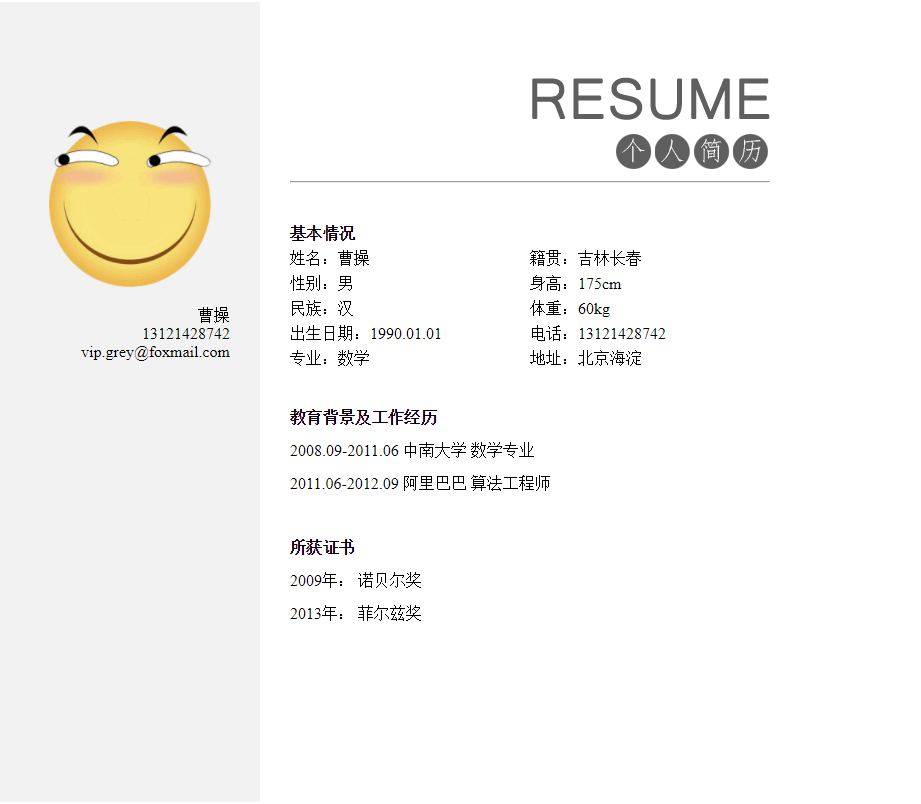
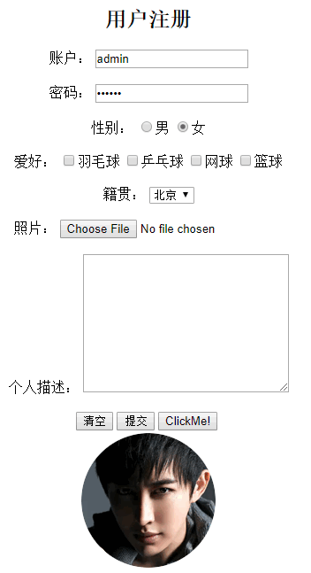

# HTML

- [HTML](#html)
    - [introduction](#introduction)
    - [some tags](#some-tags)
    - [pic & link](#pic-link)
    - [list](#list)
    - [table](#table)
    - [about传统布局](#about%E4%BC%A0%E7%BB%9F%E5%B8%83%E5%B1%80)
    - [form(表单)](#form%E8%A1%A8%E5%8D%95)
    - [inline frame(iframe, 内嵌框架)](#inline-frameiframe-%E5%86%85%E5%B5%8C%E6%A1%86%E6%9E%B6)

早期的美工分化成两个：

- 专门做界面设计，不管页面的制作：UI设计师
- 专门做页面的整体布局，页面效果(动态效果、前后台数据交互)：前端开发工程师

## introduction

`<!DOCTYPE html>`没有的话，会以最低版本的浏览器解析，各种不兼容

```html
<!DOCTYPE html>
<html lang="zh-CN">
<!-- <html lang="en"> -->
<!-- 默认是lang="en" -->
<head>
    <meta charset="utf-8" />
    <title>Page Title</title>
</head>
<body>
    this is body
</body>
</html>
```

html书写规范:

- 所有的标签必须小写`<html></html>`
- 所有的属性必须用双引号括起来`<div class="aa"></div>`
- 所有标签必须闭合`<br />`
- img必须要加alt属性(对图片的描述)``, alt属性是给百度或者google的爬虫查看的

## some tags

搜索引擎会根据结构做索引；

常用的html字符实体：`&nbsp;`, `&lt;`, `&gt;`

```html
<!DOCTYPE html>
<html>
<head>
    <meta charset="utf-8" />
    <title>Page Title</title>
</head>
<body>
    <h1>This is header1</h1>
    <p>This is a paragrah! This is a paragrah!<br/>
        This is a paragrah!This is a paragrah!<br/>
        This is a paragrah!This is a paragrah!</p>
    
    <h2>This is header2</h2>
    <p>This is a paragrah! This is a paragrah! This is a paragrah!</p>
    <h3>This is header3</h3>
    <h4>This is header4</h4>
    <h5>This is header5</h5>
    <h6>This is header6</h6>
    <p>
    <!-- &nbsp; 多个空格用样式来做 -->
        多个空格只是当成一个空格，需要用&nbsp;&nbsp;&nbsp;实现三个空格<br />
        左尖括号&lt;<br />
        右尖括号&gt;
    </p>
</body>
</html>
```

- em标签 行内元素，表示语气中的强调词: 斜体
- i标签 行内元素，原本没有语义，w3c强加了语义，表示专业词汇: 斜体
- b标签 行内元素，原本没有语义，w3c强加了语义，表示文档中的关键字或者产品名: 加粗
- strong标签 行内元素，表示非常重要的内容: 加粗

```html
<!DOCTYPE html>
<html>
<head>
    <meta charset="utf-8" />
    <title>Page Title</title>
</head>
<body>
    <p>
        1、不过数字也显示有不少<b>应用</b>已废弃，其中包括曾流行一时的游戏Flappy Bird。2017年，<i>苹果</i>也从应用商店中删除了一些低质量的应用，包括存在抄袭行为的应用。 
    </p>     
    <p>
        2、不过数字也显示有不少应用已废弃，其中包括曾流行一时的游戏Flappy Bird。2017年，苹果也从<strong>应用商店</strong>中删除了一些低质量的应用，包括存在抄袭行为的应用。 
    </p>
    <!-- p与p直接有空行；div与div之间没有空行 -->
    <!-- 给特定的一小段加样式用到了span -->
    <!-- div和span没有实际的意义，但是用的很广泛 -->
    <!-- div: division -->
    <div>
        3、不过数字也显示有不少应用已废弃，
        <span>其中包括曾流行一时的游戏Flappy Bird。</span>
        2017年，苹果也从应用商店中删除了一些低质量的应用，包括存在抄袭行为的应用。 
    </div>
    <div>
        4、不过数字也显示有不少应用已废弃，其中包括曾流行一时的游戏<em>Flappy Bird</em>。2017年，苹果也从应用商店中删除了一些低质量的应用，包括存在抄袭行为的应用。 
    </div>
</body>
</html>
```

语义化tag, 方便搜索引擎:

- h1: header1
- p: paragraph
- ul, li: unordered list; list item
- a: hyperlink
- dl,dt,dd: definition list; definition term; definition description

```bash
# vscode 写法
dl>(dt+dd*2)*3
# 然后tab
```

```html
<!-- output, 添加一些东西 -->
<dl>
    <dt>2016</dt>
    <dd>2016-01</dd>
    <dd>2016-02</dd>
    <dt>2017</dt>
    <dd>2017-01</dd>
    <dd>2017-02</dd>
    <dt>2018</dt>
    <dd>2018-01</dd>
    <dd>2018-02</dd>
</dl>
```


## pic & link

```html
<!DOCTYPE html>
<html lang="en">
<head>
    <meta charset="UTF-8">
    <title>Page Title</title>
</head>
<body>
    <!-- 要用相对路径 -->
    
    <!--  -->
</body>
</html>
```

```html
<!DOCTYPE html>
<html lang="en">
<head>
    <meta charset="UTF-8">
    <title>Page Title</title>
</head>
<body>
    <a href="./index.html" title="go to index">toIndex</a>
    <br />
    <a href="https://www.baidu.com" title="go to baidu">Baidu</a>
    <br />
    <a href="https://music.163.com" title="go to 163"></a>
    <br />
    <!-- #是调到页面顶部 -->
    <a href="#">Go to Top</a>
    <br />
    <!-- 缺省值也表示调到顶部 -->
    <a href="">Go to Top</a>
    <br />
    <!-- 什么都不做 -->
    <a href="javascript:;">真正缺省值</a>
</body>
</html>
```

```html
<!-- 页面内跳转 -->
<!DOCTYPE html>
<html lang="en">
<head>
    <meta charset="UTF-8">
    <title>Document</title>
</head>
<body>
    <a href="#h11">Header1</a><br>
    <a href="#h12">Header2</a><br>
    <a href="#h13">Header3</a><br>

    <h1 id="h11">Header1</h1>
    <p>
        因有媒体报道称苹果公司计划最早2020年开始使用自产芯片，<br><br>
        取代英特尔公司（Intel Corp.）的处理器，<br><br>
        标准普尔500指数中的半导体板块下跌超过5%，为两年来最大跌幅。<br><br>
        该板块中的15只成分股下跌至少3%，其中英特尔下跌了7.7%，是2016年1月以来的最大跌幅。
        <br><br>
        <br><br>
        <br><br>
        <br><br>
        <br><br>
        <br><br>
    </p>

    <h1 id="h12">Header2</h1>
    <p>
        因有媒体报道称苹果公司计划最早2020年开始使用自产芯片，<br><br>
        取代英特尔公司（Intel Corp.）的处理器，<br><br>
        标准普尔500指数中的半导体板块下跌超过5%，为两年来最大跌幅。<br><br>
        该板块中的15只成分股下跌至少3%，其中英特尔下跌了7.7%，是2016年1月以来的最大跌幅。
        <br><br>
        <br><br>
        <br><br>
        <br><br>
        <br><br>
        <br><br>
    </p> 

    <h1 id="h13">Header3</h1>
    <p>
        因有媒体报道称苹果公司计划最早2020年开始使用自产芯片，<br><br>
        取代英特尔公司（Intel Corp.）的处理器，<br><br>
        标准普尔500指数中的半导体板块下跌超过5%，为两年来最大跌幅。<br><br>
        该板块中的15只成分股下跌至少3%，其中英特尔下跌了7.7%，是2016年1月以来的最大跌幅。
        <br><br>
        <br><br>
        <br><br>
        <br><br>
        <br><br>
        <br><br>
    </p>    
</body>
</html>
```

```html
<!-- 页面内跳转method2 -->
<!DOCTYPE html>
<html lang="en">
<head>
    <meta charset="UTF-8">
    <title>Document</title>
</head>
<body>
   <h1 id="h11">Header1</h1>
   <a href="#h11">Header1</a>
   <a href="#h12">Header2</a>
   <a href="#h13">Header3</a>
    <p>
        因有媒体报道称苹果公司计划最早2020年开始使用自产芯片，<br><br>
        取代英特尔公司（Intel Corp.）的处理器，<br><br>
        标准普尔500指数中的半导体板块下跌超过5%，为两年来最大跌幅。<br><br>
        该板块中的15只成分股下跌至少3%，其中英特尔下跌了7.7%，是2016年1月以来的最大跌幅。
        <br><br>
        <br><br>
        <br><br>
        <br><br>
        <br><br>
        <br><br>
    </p>

    <h1 id="h12">Header2</h1>
    <a href="#h11">Header1</a>
    <a href="#h12">Header2</a>
    <a href="#h13">Header3</a>
    <p>
        因有媒体报道称苹果公司计划最早2020年开始使用自产芯片，<br><br>
        取代英特尔公司（Intel Corp.）的处理器，<br><br>
        标准普尔500指数中的半导体板块下跌超过5%，为两年来最大跌幅。<br><br>
        该板块中的15只成分股下跌至少3%，其中英特尔下跌了7.7%，是2016年1月以来的最大跌幅。
        <br><br>
        <br><br>
        <br><br>
        <br><br>
        <br><br>
        <br><br>
    </p> 

    <h1 id="h13">Header3</h1>
    <a href="#h11">Header1</a>
    <a href="#h12">Header2</a>
    <a href="#h13">Header3</a>
    <p>
        因有媒体报道称苹果公司计划最早2020年开始使用自产芯片，<br><br>
        取代英特尔公司（Intel Corp.）的处理器，<br><br>
        标准普尔500指数中的半导体板块下跌超过5%，为两年来最大跌幅。<br><br>
        该板块中的15只成分股下跌至少3%，其中英特尔下跌了7.7%，是2016年1月以来的最大跌幅。
        <br><br>
        <br><br>
        <br><br>
        <br><br>
        <br><br>
        <br><br>
    </p>    
</body>
</html>
```

```html
<!DOCTYPE html>
<html lang="en">
<head>
    <meta charset="UTF-8">
    <title>Document</title>
</head>
<body>
    <!-- 默认是open in this tab;target="_self" -->
    <!-- open in new tab -->
    <a href="https://www.baidu.com" title="go to baidu" target="_blank">baidu</a>
</body>
</html>
```

## list

共三种列表：

- oredered list
- unordered list
- definition list

```html
<!DOCTYPE html>
<html lang="en">
<head>
    <meta charset="UTF-8">
    <title>Document</title>
</head>
<body>
    <!-- 下面的三个都是按照语义的方式进行书写 -->
    <!-- 1.ordered list -->
    <!-- ol>li*3 -->
    <ol>
        <li>go home</li>
        <li>eat dinner</li>
        <li>go to sleep</li>
    </ol>

    <!-- 2.unordered list -->
    <ul>
        <li>learning python</li>
        <li>learning cpp</li>
        <li>learning css</li>
    </ul>

    <!-- 经常使用, 出现的小圆点后面用样式去掉, 也是用样式把下划线去掉 -->
    <!-- ul>(li>a)*3 -->
    <ul>
        <li><a href="https://wwww.baidu.com">baidu</a></li>
        <li><a href="https://www.google.com">google</a></li>
        <li><a href="https://www.amazon.com">amazon</a></li>
    </ul>

     <!-- 3.definition list -->
     <!-- 可以用来组织层次关系，也可以用了解释概念 -->
    <dl>
        <dt>湖北省</dt>
        <dd>武汉市</dd>
        <dd>咸宁市</dd>
        <dt>湖南省</dt>
        <dd>长沙市</dd>
        <dd>岳阳市</dd>
        <dt>吉林省</dt>
        <dd>长春市</dd>
        <dd>四平市</dd>
    </dl>

    <!-- 结构上的理解，不像上面的三个那样包含语义 -->
    <!-- div>div*3 -->
    <div>
        <div>div11</div>
        <div>div12</div>
        <div>div13</div>
    </div>
    <!-- div>(div>div*2)*3 -->
    <div>
        <div>
            <div>武汉市</div>
            <div>咸宁市</div>
        </div>
        <div>
            <div>长沙市</div>
            <div>岳阳市</div>
        </div>
        <div>
            <div>长春市</div>
            <div>四平市</div>
        </div>
    </div>
</body>
</html>
```

## table

- th: table header
- tr: table row
- td: table data
- caption: table caption

```html
<!DOCTYPE html>
<html lang="en">
<head>
    <meta charset="UTF-8">
    <title>Document</title>
</head>
<body>
    <h2>Experiment</h2>
    <!-- method1 -->
    <!-- table>(tr>td*3)*2 -->
    <table>
        <!-- 最后添加caption -->
        <caption>Fe irradiation</caption>
        <tr>
            <td>Energy</td>
            <td>Flux</td>
            <td>Fluence</td>
        </tr>
        <tr>
            <td>3.3</td>
            <td>6.5E-4</td>
            <td>6.5E16</td>
        </tr>
    </table>
    <br>
    
    <!-- method2, 默认没有border, 默认表格的width, height根据文字而来-->
    <table border="1" width="600" height="100">
        <caption>Fe irradiation</caption>
        <!-- tr>th*3 -->
        <tr>
            <th>Energy</th>
            <th>Flux</th>
            <th>Fluence</th>
        </tr>
        <tr  align="right">
            <td>3.3</td>
            <td>6.5E-4</td>
            <td>6.5E16</td>
        </tr>
        <tr  align="right">
            <td>2.6</td>
            <td>6.5E-5</td>
            <td>6.5E17</td>
        </tr>
    </table>
    
    <!-- 单元格合并 -->
    <h2>resume</h2>
    <table border="1" width="800" height="420">
        <tr align="left">
            <th colspan="5">基本情况</th>
        </tr>
        <tr>
            <td width="18%">姓名</td>
            <td width="18%"></td>
            <td width="18%">性别</td>
            <td width="18%"></td>
            <td width="28%" rowspan="5"></td>
        </tr>
        <tr>
            <td>民族</td>
            <td></td>
            <td>出生日期</td>
            <td></td>
        </tr>
        <tr>
            <td>政治面貌</td>
            <td></td>
            <td>健康状况</td>
            <td></td>
        </tr>
        <tr>
            <td>籍贯</td>
            <td></td>
            <td>学历</td>
            <td></td>
        </tr>
        <tr>
            <td>Email</td>
            <td></td>
            <td>Phone</td>
            <td></td>
        </tr>
    </table>
</body>
</html>
```

```html
<!DOCTYPE html>
<html lang="en">
<head>
    <meta charset="UTF-8">
    <title>Document</title>
</head>
<body>
    <!-- cellpadding: 格子与文字距离 -->
    <!-- cellspacing: 格子与格子距离 -->
    <table border="1" cellpadding="30" cellspacing="10">
        <tr>
            <td>123</td>
            <td>123</td>
            <td>123</td>
            <td>123</td>
        </tr>
        <tr>
            <td>456</td>
            <td>456</td>
            <td>456</td>
            <td>456</td>
        </tr>
        <tr>
            <td>789</td>
            <td>789</td>
            <td>789</td>
            <td>789</td>
        </tr>
        <tr>
            <td>369</td>
            <td>369</td>
            <td>369</td>
            <td>369</td>
        </tr>
    </table>
</body>
</html>
```

## about传统布局

传统布局中，表格只是作为骨架(现在用的是**盒子模型**):

- 定义表格宽高，将border、cellpadding、cellspacing全部设置为0，制作的时候`border="1"`, 做完了再删除`border="0"`
- 单元格里面嵌套表格
- 单元格中的元素和嵌套的表格用align和valign设置对齐方式
- 通过属性或者css样式设置单元格中元素的样式

UI设计师将一个效果图弄成图片，然后前端根据图片来做东西；

HTML中的属性是没有单位的，比如没有类似px的东西



```html
<!DOCTYPE html>
<html lang="en">

<head>
    <meta charset="UTF-8">
    <title>简历</title>
</head>

<body>
    <!-- table的center是对于浏览器的居中 -->
    <table border="0" width="800" height="800" cellpadding="0" cellspacing="0" align="center">
        <tr>
            <td width="260" valign="top" bgcolor="#f2f2f2">
                <table width="260" border="0" cellpadding="0" cellspacing="0">
                    <tr height="100"></tr>
                    <tr align="right">
                        <td width="230">
                            
                        </td>
                        <td width="30"></td>
                    </tr>
                    <tr align="right">
                        <td>曹操</td>
                        <td></td>
                    </tr>
                    <tr align="right">
                        <td>13121428742</td>
                        <td></td>
                    </tr>
                    <tr align="right">
                        <td>vip.grey@foxmail.com</td>
                        <td></td>
                    </tr>
                </table>
            </td>
            <td width="30"></td>
            <td width="480" valign="top">
                <table border="0" cellpadding="0" cellspacing="0" width="480">
                    <tr height="75"></tr>
                    <tr align="right">
                        <td></td>
                    </tr>
                </table>
                <!-- Horizontal ruler: 一条横线 -->
                <hr>
                <table border="0" cellpadding="0" cellspacing="0" width="480" height="180">
                    <tr height="30"></tr>
                    <tr align="left">
                        <th>基本情况</th>
                    </tr>
                    <tr>
                        <td width="50%">姓名：曹操</td>
                        <td width="50%">籍贯：吉林长春</td>
                    </tr>
                    <tr>
                        <td>性别：男</td>
                        <td>身高：175cm</td>
                    </tr>
                    <tr>
                        <td>民族：汉</td>
                        <td>体重：60kg</td>
                    </tr>
                    <tr>
                        <td>出生日期：1990.01.01</td>
                        <td>电话：13121428742</td>
                    </tr>
                    <tr>
                        <td>专业：数学</td>
                        <td>地址：北京海淀</td>
                    </tr>
                </table>
                <table border="0" cellpadding="0" cellspacing="0" width="480" height="130">
                    <tr height="30"></tr>
                    <tr align="left">
                        <th>教育背景及工作经历</th>
                    </tr>
                    <tr>
                        <td>2008.09-2011.06 中南大学 数学专业</td>
                    </tr>
                    <tr>
                        <td>2011.06-2012.09 阿里巴巴 算法工程师</td>
                    </tr>
                </table>
                <table border="0" cellpadding="0" cellspacing="0" width="480" height="130">
                    <tr height="30"></tr>
                    <tr align="left">
                        <th>所获证书</th>
                    </tr>
                    <tr>
                        <td>2009年： 诺贝尔奖</td>
                    </tr>
                    <tr>
                        <td>2013年： 菲尔兹奖</td>
                    </tr>
                </table>
            </td>
            <td width="30"></td>
        </tr>
    </table>
</body>

</html>
```

## form(表单)

表单用于搜集不同类型的用户输入，表单由不同类型的标签组成，实现一个特定功能的表单区域；

一个form就是一个表单域



```html
<!DOCTYPE html>
<html lang="en">
<head>
    <meta charset="UTF-8">
    <title>表单</title>
</head>
<body>
    <!-- 默认提交是method="GET", 通过地址栏提交 -->
    <!-- POST提交不会显示到地址栏，藏在HTTP的报文中，通过F12可以查看Headers可以找到 -->
    <!-- GET提交数据量小，不敏感的信息；POST提交数据量大的，敏感的信息 -->
    <form action="https://www.baidu.com" align="center" method="POST">
        <h2>用户注册</h2>
        <div>
            <!-- for与input的id一致，点击label文字，会激活input -->
            <!-- 单选、多选用的多 -->
            <label for="username">账户：</label>
            <!-- 输入的时候得到的就是value,默认设置value为admin -->
            <input type="text" name="uname" id="username" value="admin">
        </div>
        <br>
        <div>
            <label for="pwd">密码：</label>
            <input type="password" name="upwd" id="pwd" value="123456">
        </div>
        <br>
        <div>
            <label>性别：</label>
            <!-- 点击男激活radio -->
            <input type="radio" name="gender" id="male" value="1"><label for="male">男</label>
            <input type="radio" name="gender" id="female" value="0" checked="checked">女
        </div>
        <br>
        <div>
            <label>爱好：</label>
            <input type="checkbox" name="hobby" value="badmintoon" id="badmin"><label for="badmin">羽毛球</label>
            <input type="checkbox" name="hobby" value="pingpong" id="pingp"><label for="pingp">乒乓球</label>
            <input type="checkbox" name="hobby" value="tennis">网球
            <input type="checkbox" name="hobby" value="basketball">篮球
        </div>
        <br>
        <div>
            <label>籍贯：</label>
            <select name="hometown">
                <option value="0">北京</option>
                <option value="1">上海</option>
                <option value="2">重庆</option>
                <option value="3">天津</option>
            </select>
        </div>
        <br>
        <div>
            <label>照片：</label>
            <input type="file" name="avatar">
        </div>
        <br>
        <div>
            <label>个人描述：</label>
            <textarea name="self_description" cols="30" rows="10"></textarea>
        </div>
        <br>
        <input type="reset" value="清空">
        <input type="submit" value="提交">
        <input type="button" value="ClickMe!">
        <!-- hidden只是用来存储value用的，不显示 -->
        <!-- 先从数据库拿一些数据存在页面上的hid，然后别人提交的时候，连同hid的数据一起拿回数据库 -->
        <!-- 如果是GET提交的话，地址栏会显示hid的value -->
        <input type="hidden" name="hid" value="10000">
        <br>
        <!-- 点击图片也可以提交，有bug，会提交两次，少用 -->
        <input type="image" src="./res/person.png" alt="person">
    </form>

</body>
</html>
```

点击**提交**之后的地址栏:

`https://www.baidu.com/?uname=admin&upwd=123456&gender=0&hometown=0&avatar=&self_description=&my_hidden=`

这种是`get`方式提交(**通过地址栏提交**，即默认就是**method="GET"**): 通过地址栏把输入的数据的名称(`name`)和值(`value`)直接传到网址里面去(`?`隔开)；这么提交之后，可以通过后台程序读取地址栏数据，将提交的`name-value`存到数据库中；

## inline frame(iframe, 内嵌框架)

一个页面里面可以嵌入另外一个页面：比如`its.pku.edu.cn`交钱的时候嵌入了支付宝

```html
<!DOCTYPE html>
<html lang="en">

<head>
    <meta charset="UTF-8">
    <title>Document</title>
</head>

<body>
    <a href="https://www.baidu.com" target="baidu_frame">Baidu</a>
    <a href="https://mail.163.com" target="baidu_frame">netease</a>
    <a href="http://www.itcast.cn/" target="baidu_frame">itcase</a>
    <br>
    <iframe src="https://www.baidu.com" name="baidu_frame" frameborder="0" scrolling="no" width="800" height="500"></iframe>
    <br>
    <iframe src="https://mail.163.com" name="neteast_frame" frameborder="0" width="800" height="500"></iframe>
</body>

</html>
```

内嵌框架最常用的功能：封装起来做无刷新提交；