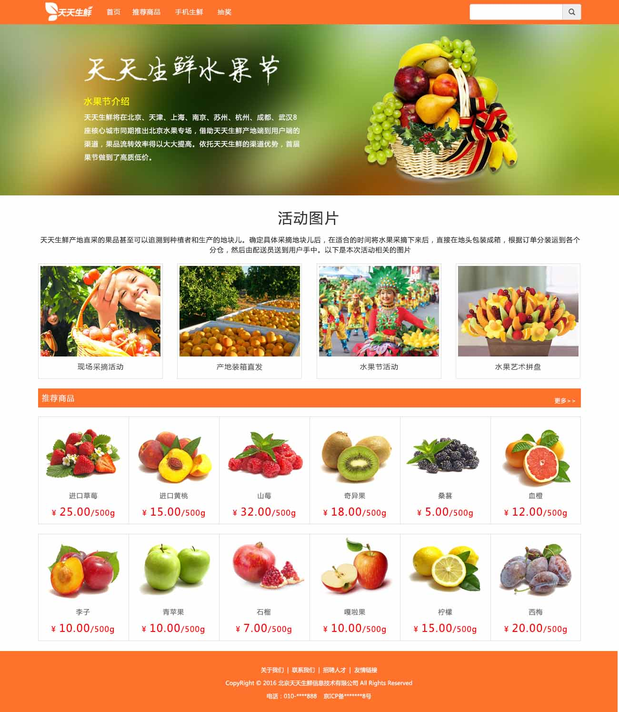
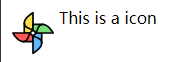

# bootstrap with example

<!-- TOC -->

- [bootstrap with example](#bootstrap-with-example)
    - [front-end optimization](#front-end-optimization)
        - [less task](#less-task)
        - [less 嵌套](#less-嵌套)
    - [performance optimization](#performance-optimization)
        - [coding optimization](#coding-optimization)
            - [html code optimization](#html-code-optimization)
            - [css code optimization](#css-code-optimization)
            - [javascript code optimization](#javascript-code-optimization)

<!-- /TOC -->

专题效果图:



其中的商品图片(草莓、黄桃...)都是假的，是后台推送的图片；切一个做个表示

背景图一般都是特别大的(1920x1080), 适配多种屏幕, 需要单独做；

Example1: some theme

```bash
css/
    bootstrap.min.css
    index.css
fonts/
    ...
images/
    ...
js/
    bootstrap.ming.js
    jquery-1.12.4.min.js
index.html
```

```html
<!-- index.html -->
<!DOCTYPE html>
<html lang="en">

<head>
    <meta charset="UTF-8">
    <meta name="viewport" content="width=device-width, initial-scale=1.0">
    <meta http-equiv="X-UA-Compatible" content="ie=edge">
    <title>Some Theme</title>
    <script src="js/jquery-1.12.4.min.js"></script>
    <script src="js/bootstrap.min.js"></script>
    <link rel="stylesheet" href="css/bootstrap.min.css">
    <link rel="stylesheet" href="css/index.css">
    <script>
    </script>
</head>

<body>
    <!-- 导航栏 -->
    <div class="navbar navbar-inverse navbar-static-top">
        <div class="container">
            <button class="navbar-toggle" data-toggle="collapse" data-target="#mymenu">
                <span class="icon-bar"></span>
                <span class="icon-bar"></span>
                <span class="icon-bar"></span>
            </button>
            <div class="navbar-header">
                <a href="#" class="navbar-brand">
                    
                </a>
            </div>
            <div class="collapse navbar-collapse" id="mymenu">
                <ul class="nav navbar-nav">
                    <li>
                        <a href="">首页</a>
                    </li>
                    <li>
                        <a href="">推荐商品</a>
                    </li>
                    <li>
                        <a href="">手机生鲜</a>
                    </li>
                    <li>
                        <a href="">抽奖</a>
                    </li>
                </ul>
                <form class="navbar-form navbar-right">
                    <div class="form-group">
                        <div class="input-group">
                            <input type="text" name="" id="" class="form-control">
                            <span class="input-group-btn">
                                <button class="btn btn-default">
                                    <span class="glyphicon glyphicon-search"></span>
                                </button>
                            </span>
                        </div>
                    </div>
                </form>
            </div>
        </div>
    </div>
    <!-- 巨幕，为了显示banner -->
    <div class="jumbotron">
        <div class="container">
            <div class="row">
                <div class="col-lg-5 col-lg-offset-1 col-md-5 col-md-offset-1">
                    <div class="banner_title">
                        
                    </div>
                    <h3 class="active_title">水果节介绍</h3>
                    <p class="active_detail">天天生鲜将在北京、天津、上海、南京、苏州、杭州、成都、武汉8座核心城市同期推出北京水果专场，借助天天生鲜产地端到用户端的渠道，果品流转效率得以大大提高。依托天天生鲜的渠道优势，首届果节做到了高质低价。</p>
                </div>
                <!-- sm, xs的时候隐藏 -->
                <div class="col-lg-4 col-lg-offset-1 col-md-4 col-md-offset-1 hidden-sm hidden-xs">
                    
                </div>
            </div>
        </div>
    </div>
    <!-- 活动图片等文字 -->
    <div class="container">
        <h3 class="text-center active_pic_title">活动图片</h3>
        <p class="text-center active_pic_detail">天天生鲜产地直采的果品甚至可以追溯到种植者和生产的地块儿。确定具体采摘地块儿后，在适合的时间将水果采摘下来后，直接在地头包装成箱，根据订单分装运到各个分仓，然后由配送员送到用户手中。以下是本次活动相关的图片</p>
    </div>
    <!-- 4张图片 -->
    <div class="container">
        <div class="row">
            <div class="col-lg-3 col-md-3 col-sm-6">
                <div class="thumbnail">
                    
                    <h4>现场采摘活动</h4>
                </div>
            </div>
            <div class="col-lg-3 col-md-3 col-sm-6">
                <div class="thumbnail">
                    
                    <h4>现场采摘活动</h4>
                </div>
            </div>
            <div class="col-lg-3 col-md-3 col-sm-6">
                <div class="thumbnail">
                    
                    <h4>现场采摘活动</h4>
                </div>
            </div>
            <div class="col-lg-3 col-md-3 col-sm-6">
                <div class="thumbnail">
                    
                    <h4>现场采摘活动</h4>
                </div>
            </div>
        </div>
    </div>
    <!-- 推荐商品标题 -->
    <div class="container">
        <div class="common_title">
            <!-- pull-lef, pull-right就是左右浮动 -->
            <h3 class="pull-left">推荐商品</h3>
            <a href="" class="pull-right">更过&gt;</a>
        </div>
    </div>
    <!-- 一堆商品 -->
    <div class="container">
        <div class="row goods_list">
            <div class="goods col-lg-2 col-md-3  col-sm-4 col-xs-6">
                <a href="">
                    
                </a>
                <h4>进口草莓</h4>
                <p class="goods_price">¥
                    <em>25.00</em>/500g</p>
            </div>
            <div class="goods col-lg-2 col-md-3  col-sm-4 col-xs-6">
                <a href="">
                    
                </a>
                <h4>进口草莓</h4>
                <p class="goods_price">¥
                    <em>25.00</em>/500g</p>
            </div>
            <div class="goods col-lg-2 col-md-3  col-sm-4 col-xs-6">
                <a href="">
                    
                </a>
                <h4>进口草莓</h4>
                <p class="goods_price">¥
                    <em>25.00</em>/500g</p>
            </div>
            <div class="goods col-lg-2 col-md-3  col-sm-4 col-xs-6">
                <a href="">
                    
                </a>
                <h4>进口草莓</h4>
                <p class="goods_price">¥
                    <em>25.00</em>/500g</p>
            </div>
            <div class="goods col-lg-2 col-md-3  col-sm-4 col-xs-6">
                <a href="">
                    
                </a>
                <h4>进口草莓</h4>
                <p class="goods_price">¥
                    <em>25.00</em>/500g</p>
            </div>
            <div class="goods col-lg-2 col-md-3  col-sm-4 col-xs-6">
                <a href="">
                    
                </a>
                <h4>进口草莓</h4>
                <p class="goods_price">¥
                    <em>25.00</em>/500g</p>
            </div>
            <div class="goods col-lg-2 col-md-3  col-sm-4 col-xs-6">
                <a href="">
                    
                </a>
                <h4>进口草莓</h4>
                <p class="goods_price">¥
                    <em>25.00</em>/500g</p>
            </div>
            <div class="goods col-lg-2 col-md-3  col-sm-4 col-xs-6">
                <a href="">
                    
                </a>
                <h4>进口草莓</h4>
                <p class="goods_price">¥
                    <em>25.00</em>/500g</p>
            </div>
            <div class="goods col-lg-2 col-md-3  col-sm-4 col-xs-6">
                <a href="">
                    
                </a>
                <h4>进口草莓</h4>
                <p class="goods_price">¥
                    <em>25.00</em>/500g</p>
            </div>
            <div class="goods col-lg-2 col-md-3  col-sm-4 col-xs-6">
                <a href="">
                    
                </a>
                <h4>进口草莓</h4>
                <p class="goods_price">¥
                    <em>25.00</em>/500g</p>
            </div>
            <div class="goods col-lg-2 col-md-3  col-sm-4 col-xs-6">
                <a href="">
                    
                </a>
                <h4>进口草莓</h4>
                <p class="goods_price">¥
                    <em>25.00</em>/500g</p>
            </div>
            <div class="goods col-lg-2 col-md-3  col-sm-4 col-xs-6">
                <a href="">
                    
                </a>
                <h4>进口草莓</h4>
                <p class="goods_price">¥
                    <em>25.00</em>/500g</p>
            </div>
        </div>
    </div>
</body>

</html>
```

```css
/* index.css */

body {
    font-family: 'Microsoft Yahei';
}

/* 通过F12去看，不适合，直接复制修改 */

.navbar-brand {
    padding: 5px 15px;
}

.navbar-inverse {
    background-color: #ff722b;
    border-color: #ff722b;
}

.navbar-inverse .navbar-nav>li>a {
    color: #fff;
}

.navbar-inverse .navbar-toggle {
    border-color: #fff;
}

.navbar-inverse .navbar-collapse,
.navbar-inverse .navbar-form {
    border-color: #fff;
}

.navbar {
    margin-bottom: 0px;
}

.jumbotron {
    background: url(../images/banner_bg.jpg) center center no-repeat;
    padding: 24px 0;
    margin-bottom: 0;
}

.banner_title {
    margin-top: 40px;
}

/* 当隐藏fruit.jpg的时候，让banner_title.jpg往上一些 */

@media (max-width: 992px) {
    /* <992发生改变 */
    .banner_title {
        margin-top: 0px;
    }
}

.active_title {
    font-size: 18px;
    color: #ff0;
    margin-top: 20px;
}

/* 提高权重，所以写两个 */

.jumbotron .active_detail {
    font-size: 14px;
    color: #fff;
    line-height: 28px;
}

/* 中间的文字 */

.active_pic_title {
    font-size: 30px;
    color: #333;
    margin: 32px auto 15px;
}

.active_pic_detail {
    font-size: 14px;
    color: #333;
    margin-bottom: 20px;
}

.thumbnail h4 {
    text-align: center;
    font-size: 15px;
    color: #333;
}

.thumbnail {
    max-width: 260px;
    /* thumbnail相对容器居中 */
    margin: 0 auto 20px;
}

.common_title {
    /* 需要有一个高度来撑开 */
    height: 40px;
    background-color: #ff722b;
}

.common_title h3 {
    font: 16px/40px 'Microsoft Yahei';
    color: #fff;
    margin: 0;
    text-indent: 20px;
}

.common_title a {
    font-size: 12px;
    color: #fff;
    margin: 15px 10px 0 0;
}

.goods {
    border: 1px solid #ddd;
    margin-top: 20px;
    /* 边界合并, 最右边那个用用media查询来做 */
    border-right-color: #fff;
}

/* 补充最右边那个border */

.goods_list .goods:nth-child(2n) {
    /* 最小的情况 */
    border-right-color: #ddd;
}

@media (min-width: 768px) {
    /* 如果width>=768px, 采用下面的样式 */
    .goods_list .goods:nth-child(2n) {
        border-right-color: #fff;
    }
    .goods_list .goods:nth-child(3n) {
        border-right-color: #ddd;
    }
}

@media (min-width: 992px) {
    /* 如果width>=992px, 采用下面的样式 */
    .goods_list .goods:nth-child(2n) {
        border-right-color: #fff;
    }
    .goods_list .goods:nth-child(3n) {
        border-right-color: #fff;
    }
    .goods_list .goods:nth-child(4n) {
        border-right-color: #ddd;
    }
}

@media (min-width: 1200px) {
    .goods_list .goods:nth-child(2n) {
        border-right-color: #fff;
    }
    .goods_list .goods:nth-child(3n) {
        border-right-color: #fff;
    }
    .goods_list .goods:nth-child(4n) {
        border-right-color: #fff;
    }
    .goods_list .goods:nth-child(6n) {
        border-right-color: #ddd;
    }
}

.goods_list {
    /* 因为左右超出了，有-15的margin */
    margin: 0;
}

.goods h4 {
    font-size: 14px;
    color: #666;
    text-align: center;
}

.goods img {
    margin: 0 auto;
}

.goods .goods_price {
    font-size: 16px;
    color: #f00;
    text-align: center;
}

.goods .goods_price em {
    font-style: normal;
    font-size: 22px;
}
```

## front-end optimization

[`less`](http://lesscss.cn/), `sass`, `stylus`是css预处理语言(三个其实都是同一个东西)，它们有类似css的语法，为css赋予了动态语言的特性、如变量、继承、运算、函数等。以`.less`, `.scss`, `.styl`文件形式出现，最终编译成css文件, 这么做是为了css的编写和维护

类似的js可以用coffe写，html可以用jade来写;

编译的方法有[软件编译](http://koala-app.com/index-zh.html)，或者用nodejs程序(grunt, gulp)

现在主流是用[`gulp`](https://www.gulpjs.com.cn/docs/getting-started/):

- 压缩js代码（gulp-uglify）
- less的编译（gulp-less）
- css的压缩 （gulp-minify-css）
- 自动添加css3前缀（gulp-autoprefixer）
- 文件改名字 (gulp-rename)

测试:

- 安装Nodejs
- 全局安装gulp: `npm install --global gulp`
- 项目安装gulp: `npm install --save-dev gulp`
- 新建`gulpfile.js`: 内容如下
    ```js
    // gulpfile.js
    var gulp=require('gulp');

    gulp.task('info', function () {
        console.log('hello, world!');
    });
    ```
- 运行`gulp info`, 得到`hello, world!`

### less task

```bash
# 最开始的文件目录
src/
    js/
    html/
    css/
        test.less
gulpfile.js
```

```less
// test.less
// 不使用less
.box{
    width: 200px;
    height: 200px;
    background-color: gold;
}

// 采用less
@w: 200px;
// 利于工程复用，下面这个最终编译结果就是类似上面的
.box2{
    width: @w;
    height: @w;
    background-color: gold;
}

// 定义一个函数
.box_func(@w:100px, @h:100px, @bw:1px){
    width: @w;
    height: @h;
    border: @bw solid gold;
}

.box3{
    .box_func(200px, 300px, 2px);
    color: red;
    // 加入css3, 通过gulp会自动添加前缀
    transform: rotate(30deg);
    transition: all 1s ease;
}
```

一般都不用正常的格式写，然后用gulp编译成正常格式到过dist文件夹

- 安装Nodejs
- 全局安装gulp: `npm install --global gulp`
- 项目安装gulp: `npm install --save-dev gulp`
- 安装各种插件: 
    - `npm install gulp-uglify`
    - `npm install gulp-less`
    - `npm install gulp-autoprefixer`
    - `npm install gulp-minify-css`
    - `npm install gulp-rename`
- `gulpfile.js`: 内容如下
    ```js
    const gulp=require('gulp');
    const uglify=require('gulp-uglify');
    const less=require('gulp-less');
    const prefix=require('gulp-autoprefixer');
    const cssmin=require('gulp-minify-css');
    const rename=require('gulp-rename');
    
    gulp.task('less_task', function () {
       return gulp.src('src/css/*.less')
       .pipe(less())
       .pipe(prefix())
       .pipe(cssmin())
       .pipe(rename({suffix: ".min"}))
       .pipe(gulp.dest('dist/css/'))
    });
    ```
- 运行`gulp less_task`, 得到

```bash
dist/
    css/
        test.min.css
src/
    js/
    html/
    css/
        test.less
gulpfile.js
```

```css
/* test.min.css */
.box,.box2{width:200px;height:200px;background-color:gold}.box3{width:200px;height:300px;border:2px solid gold;color:red;-webkit-transform:rotate(30deg);transform:rotate(30deg);transition:all 1s ease}
```

### less 嵌套

```less
// // 普通写法
// .list{
//     list-style: none;
// }
// .list li{
//     height: 30px;
//     background-color: gold;
// }

// .list li a{
//     float: left;
// }

// .list li a:hover{
//     color: red;
// }

// less写法
.list{
    list-style: none;
    li{
        height: 30px;
        background-color: gold;
        a{
            float: left;
            &:hover{
                color: red;
            }
        }
    }
}
```

编译结果

```css
.list{list-style:none}.list li{height:30px;background-color:gold}.list li a{float:left}.list li a:hover{color:red}
```

## performance optimization

前端性能优化

- 代码压缩(成一行，去掉空格，方便传输)，合并(多个文件会请求多次，合并成一个请求次数少)
- picutre, js, css等静态资源使用和主站不同的域名地址存储，但是域也不能太多(下一条), 减少cookie携带传输
- 权衡DNS查找次数(使用不同域名会增加DNS查找)
- 内容分发网络CDN(多个地方存数据，提高速度)
- 为文件设置(Last-Modified, Expires, Etag), 要是文件没有改变就用本地的缓存就行了(运维的工作)
- 使用GZip压缩传输(节约40%流量)：最基本的方法
- 避免不必要的重定向(加"/")，该补充`/`的地址，就补充`/`,比如`https://www.baidu.com/`

### coding optimization

#### html code optimization

- 使用结构清晰，简单(方便生成结构树快点)；语义化标签(为了SEO)
- 避免空的src和href
- 不要在HTML中缩放图片(browser不用计算了): 实际开发一般牺牲这一条

#### css code optimization

- 精简css选择器(越短越好，不要超过4层；而且浏览器是倒着解析css选择器的{从有向左}) 
- 把CSS放到顶部(浏览器读了样式然后渲染，如果放在后面，需要返回去渲染)
- 避免@import方式引入其他样式文件(被淘汰了)
- css中使用base64图片数据取代图片文件，减少请求数，类似字体图标；在线转base64网站：http://tool.css-js.com/base64.html
- 使用字体图标，适用于单色图标；图标库网站(比bootstrap好看)：https://fontawesome.com，在线制作网站(iconfront可以定制)：http://www.iconfont.cn/
- 使用css动画来取代javascript动画(css3在页面虚拟层，没有动页面的结构；js会动页面结构，性能低)
- 使用css sprite(使用雪碧图，降低请求)
- 使用svg图形(因为svg很小)
- 避免使用CSS表达式：e.g. `{star : expression(onfocus=this.blur)}`
- 避免使用滤镜；透明度使用了滤镜(`filter`)

Example: base64



```html
<!-- using base64 -->
<!DOCTYPE html>
<html lang="en">

<head>
    <meta charset="UTF-8">
    <meta name="viewport" content="width=device-width, initial-scale=1.0">
    <meta http-equiv="X-UA-Compatible" content="ie=edge">
    <title>Document</title>
    <style>
        .icon {
            height: 50px;
            text-indent: 50px;
            background: url('data:image/png;base64,iVBORw0KGgoAAAANSUhEUgAAADAAAAAwCAYAAABXAvmHAAAGrUlEQVRoQ+2Zf1DUZRrAP192gdXll8KKnSKKBMsywZk/ylMTK3XUkHLmmpKrhNG8Ejs7b7y6GW2sZnTuyjuPwh/ljTg0JRaD3N0eaKaWIhyXIYloJQbohOIJ6A6/9se3eReWX+7CruySO9P7137f7/s+z/P5Ps/7PO/7roSXN8nL7edngAE8uAzYAVQCD3vK057wwGjgXeCpLqPPA3HeAjAROApMnPtAGN/VGLhS3+Y1AFMlif9IEmGvr4uTXn0hBt3CI1yoNngFwCygKGCkYkTB7gd95s3UWCNGO/9TrwCYApwKD/NXfpYzS6G7N6g73L0BIBT4WuXvM7Y0b66UoA3us1a9AeAtYP3ONxNZ/fSk2xLN3Q4g0uWVafeF+JblJynspcm7HSAZKMj+y/08u2yC3TR/twPsBFafLkhiSnyIVwKcBH6l/8dMFs0NtwswYXYRdT+0Xu+qzI6KcSQgBJQB2UC1K1V7KFuJAiB58zotm9Zq7er01x6kwyi7Yg+SUjotm+SNgN6ZiUMB+Cuw7hdjVHxZkMRYjeo2fQJANSaQxdsW93lXV1rHyW0nUfgp0D2hQ6PV4Kv25VrlNaryq+S25jZhVyGQBtQPBDIUgG3Ay0J42Gg/Pn5nBmL/07sJgIDIUaz8bGV3t+GqgV2zd+Gn9iM1L5XRUSKZ9TRTm4nivxdTmlWKLMuNyDwCfOUIYsgAf/5jPJszz9PSauaJBffw0nOTu0HsARRuKKTiowpSdqQQuyTW4cetLanlkxWfWIytxiZkZgAX7Q0eMsCl4wtQKiRe217FBwcv095hITpSzbPLIng98wJBE3s8YLhmYOeDOwmLCWNF4YpBQ1yE2v6n98sWs+UyMtOBq/0nuQVg4viRVrnNt4xk59WSlXNJbOKsfcETgnn+i+eRJImSrBI+3/o5ye8kE7fUuSNCeU45h/50SIgqBx4AOnpDuBXAJvj7yy0sSi/l/MVma9dY3VhS3kshb2UeTTVNrC1fi1KlHNQDtgH69XrOHjgrHv9mW3e2d24HkGWZaY8f56vKZhYv7sw+er2e0JhQrl+4TuLyRBZuXei08WKgucPMvuR9NFQ1iMf7ACuNaP0B9gCTnZQuxo0PDFDiI/WIaWk1YTTJpKens2ePEAdpaWns3bvX+luj06AKuj3lDqZTZK/GS41i2JfANEcA4uX90QEBjBsxYjCZt71v7OigorkzbDIyMsjMzLT+XrNmDVlZWaBQ4qtS98yTLRhbbonny46yjB0jrgFPOgLQCfckhoRIZfPn4+vj4xLEqrIy3q+uJjYwkHpJYnlqKkajkf25uShGT+CxXV/3kWeov0T+c1GiT9SU9S4pcxBCons78FL6pEnsmSHSr3Ot3WwmND+fyWo1B+fM4fETJzjT1GSdHDguhke2HCIgXGx7epqnAESAngJ+uWPqVH4bHe0UwYc1NSwvKWFLQgKvxMWJKopPbm733OBIHdGLVjF5QRp+6s6Tm6cAhOxwCcoUkjT+SFKS9NCYMYNCTCkq4tzNm9QmJxOu6lykfrm5+GoiiF6YTvXhbKvBPr7+THo4lYRnNiObjR4JIZuxUQJCrVSG/GvOHJ+5A0AcqKvjyeJiVkZF8d50UTA7m/+BA6jGxbD0/Srr89WK41z457vUfvExSpWa+F9v4My+TW5fA72/dqIERxWSNGqDVsvG+HhUir6nx29u3WLWkSO0mEx8t2QJ9/TKXv0BbIJ/OP0pJ7Y8RfvN/9u63LqI+4eLOGzkAI+O8vOTfxMZKSUEB2Mwmznb1EROTQ3tFgubdDrmhfc92Mw/doyR42O7PdBbcOuNev794hTaGq27ZbE1//2gcWpngCuVeJEStpogwRVFQRFauwBCRsUHb1DRGULicJTiilzbWFcAutdG135EVGKxO6wZQHFGUIQ21LYG+o+78l89RzcuEd3ieDp7uABc0XM+KEIb6wig4VwJRS/PFPJEiD7jiuCheMAVPQMCXDyczam3rOcC4QanzsD9ld9JCLkNQJ8x3Xzj2/8ZgXHADVcE/+Qe+Fa/m9Ltq4UdbwN/uBPjxZyfxAM3LpZT+LuZssXYJnKo2N93FwRXQYYdoOn7Sg5vmGdsb26wAGIFO7xxcAZmWAHqzxzl2KalFlOboVVcinX9HeWMnQ7HDAtA8u5Kzu7fQsW+15AtlkaQHwVOD8nyrskeBxipiYhVayJoOFcsVIqiJy6q7N7x3AmQxwEA2+3Vh8CLQOcpx03N0wAngHuBVV37HTeZ3SPG0wBuN3i4K/HPAIN9gR8BTJNVTw6LRz0AAAAASUVORK5CYII=') left center no-repeat;
        }
    </style>
</head>

<body>
    <div class="icon">This is a icon</div>
</body>

</html>
```

#### javascript code optimization

- 减少引用库的个数
- js模块化开发, 使用requirejs或seajs异步加载js:中国大多用的seajs,国外多用requirejs;把目标js当作是模块，通过seajs去加载
- JS放到页面底部引入(因为js是阻塞加载；一般被牺牲掉)
- 避免全局查找
- 减少属性查找
- 使用原生方法; (一般被牺牲掉)
- 用switch语句代替复杂的if else语句
- 减少语句数，比如说多个变量声明可以写成一句`var a=123, b=456`
- 使用字面量表达式来初始化数组或者对象
- 使用DocumentFragments或innerHTML取代复杂的元素注入：能用html不要用`appendTo`
- 使用**事件代理**(事件委托):必须要说
- 避免多次访问dom选择集；
- 高频触发事件设置使用函数节流，如：onmousemove、onmouseover
- 使用Web Storage缓存数据
- 使用Array的join方法来代替字符串的“+”连接(先将要连接的字符串放进数组)

Example: 避免全局查找，用一个范围来限制，提高加载速度

```html
<!DOCTYPE html>
<html lang="en">

<head>
    <meta charset="UTF-8">
    <meta name="viewport" content="width=device-width, initial-scale=1.0">
    <meta http-equiv="X-UA-Compatible" content="ie=edge">
    <title>Document</title>
    <script src="js/jquery-1.12.4.min.js"></script>
    <script>
        $(function () {
            // 第二个加载更快
           $('span')
           $('.box1 span')
        });
    </script>
</head>
<body>
    <div class="box1">
        <span>This is a span!</span>
    </div>
</body>
</html>
```

Example: 使用字面量表达式来初始化数组或者对象

```js
// 第二种更快
var arr = new Array(1, 2, 3);
var arr2= [1, 2, 3];
```

Example: 避免多次访问dom选择集

```js
$('.box1').css();
$('.box1').animate();

// 上面的多次访问dom, 优化方法
var $box1=$('.box1');
$box1.css();
$box1.animate();
```

Example: 使用Array的join方法来代替字符串的“+”连接

```js
var str1="hello";
var str2="world";

var str3=str1+str2;
// 优化方法
var arr=[str1, str2];
var str4=arr.join('');
```