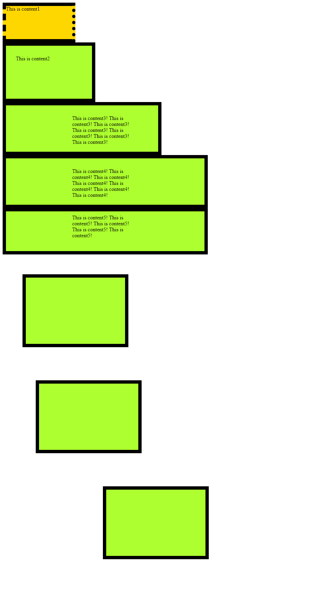
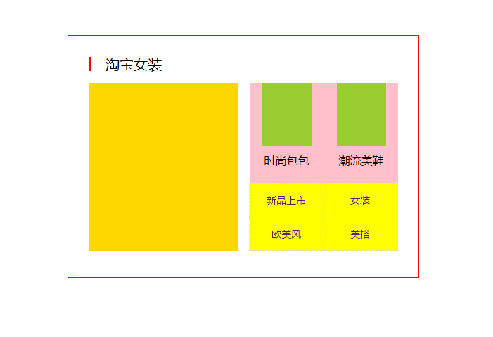

# CSS

- [CSS](#css)
    - [CSS add to HTML](#css-add-to-html)
    - [CSS Text Style](#css-text-style)
    - [CSS Color](#css-color)
    - [CSS Selectors](#css-selectors)
    - [CSS Table Style](#css-table-style)
    - [CSS Box Model](#css-box-model)
        - [box example](#box-example)
    - [CSS element overflow](#css-element-overflow)
    - [CSS elements](#css-elements)
        - [inline](#inline)
        - [inline-block](#inline-block)
        - [compare block|inline|inline-block](#compare-blockinlineinline-block)
        - [css inline-block example](#css-inline-block-example)
    - [CSS Float](#css-float)
    - [CSS Position](#css-position)
    - [CSS background](#css-background)
        - [float and background examples](#float-and-background-examples)

Cascading Style Sheets: 为了让网页元素的样式更加丰富，也为了让网页的内容和样式能拆分开；

CSS(**层叠样式表**)：如果是同一个东西的样式，后面的会覆盖前面的，也叫做**层叠**

html只负责文档的结构和内容，表现形式完全交给CSS，html文档变得更加简洁

## CSS add to HTML

- 内联式: 不推荐
- 嵌入式: 一般是用于首页，加载速度更快；比如tmall
- 外联式: 一般的网页

```html
<!-- 内联式; 不推荐 -->
<!DOCTYPE html>
<html lang="en">

<head>
    <meta charset="UTF-8">
    <title>Document</title>
</head>

<body>
    <p style="color:blue;font-size: 20px;font-family:'Microsoft Yahei';line-height: 36px">
        谷歌素有愚人节推出恶搞活动的传统，今年的创意就是找威利，<br>
        而且这次是在谷歌地图上寻找，对一些人来说，这更像勾起童年的美好回忆。<br>
        威利来自上世纪90年代风行一时的系列童书《威利在哪里》（Where’s Waldo）。<br>
        作者马丁·汉德福德是英国插画作家，他笔法极为细腻，<br>
        绘图色彩丰富，加上善用滑稽梗，吸引了大批年轻粉丝。 
    </p>
    <p>
        此次谷歌地图模仿了《威利在哪里》系列童书中原画形象，<br>
        但是将书中人物设置为现实世界某个地理位置的标签，<br>
        比如澳大利亚的一片沙滩、智利的一道滑雪斜坡。<br>
        玩家用滚轮滑动图片可以找出藏在其中的威利和朋友们。<br>
        只有找到当前页张地图里的威利，用户才能进入下一张图。<br>
        谷歌的版本无疑给寻找过程增加了一些乐趣，<br>
        比如玩家可以回顾在之前的图中找到过哪些角色。 
    </p>
</body>

</html>
```

```html
<!DOCTYPE html>
<html lang="en">

<head>
    <meta charset="UTF-8">
    <title>Document</title>
    <!-- 将样式写到head -->
    <style>
        /* 通用的一个标签选择器div */
        div{
            color:blue;
            font-size: 20px;
            font-family:'Microsoft Yahei';
            line-height: 36px
        }
        div#special {
           color: inherit;
        }
    </style>
</head>

<body>
    <div>
        谷歌素有愚人节推出恶搞活动的传统，今年的创意就是找威利，<br>
        而且这次是在谷歌地图上寻找，对一些人来说，这更像勾起童年的美好回忆。<br>
        威利来自上世纪90年代风行一时的系列童书《威利在哪里》（Where’s Waldo）。<br>
        作者马丁·汉德福德是英国插画作家，他笔法极为细腻，<br>
        绘图色彩丰富，加上善用滑稽梗，吸引了大批年轻粉丝。 
    </div>
    <br>
    <div id="special">
        此次谷歌地图模仿了《威利在哪里》系列童书中原画形象，<br>
        但是将书中人物设置为现实世界某个地理位置的标签，<br>
        比如澳大利亚的一片沙滩、智利的一道滑雪斜坡。<br>
        玩家用滚轮滑动图片可以找出藏在其中的威利和朋友们。<br>
        只有找到当前页张地图里的威利，用户才能进入下一张图。<br>
        谷歌的版本无疑给寻找过程增加了一些乐趣，<br>
        比如玩家可以回顾在之前的图中找到过哪些角色。 
    </div>
</body>

</html>
```

```html
<!-- 外联式 -->
<!DOCTYPE html>
<html lang="en">
<head>
    <meta charset="UTF-8">
    <title>Document</title>
    <link rel="stylesheet" href="css/main.css">
</head>
<body>
    <div>
        谷歌素有愚人节推出恶搞活动的传统，今年的创意就是找威利，<br>
        而且这次是在谷歌地图上寻找，对一些人来说，这更像勾起童年的美好回忆。<br>
        威利来自上世纪90年代风行一时的系列童书《威利在哪里》（Where’s Waldo）。<br>
        作者马丁·汉德福德是英国插画作家，他笔法极为细腻，<br>
        绘图色彩丰富，加上善用滑稽梗，吸引了大批年轻粉丝。 
    </div>
    <br>
    <div id="special">
        此次谷歌地图模仿了《威利在哪里》系列童书中原画形象，<br>
        但是将书中人物设置为现实世界某个地理位置的标签，<br>
        比如澳大利亚的一片沙滩、智利的一道滑雪斜坡。<br>
        玩家用滚轮滑动图片可以找出藏在其中的威利和朋友们。<br>
        只有找到当前页张地图里的威利，用户才能进入下一张图。<br>
        谷歌的版本无疑给寻找过程增加了一些乐趣，<br>
        比如玩家可以回顾在之前的图中找到过哪些角色。 
    </div>
</body>
</html>
```

```css
/* 通用的一个标签选择器div */
div{
    color:blue;
    font-size: 20px;
    font-family:'Microsoft Yahei';
    line-height: 36px
}
div#special {
   color: inherit;
}
```

```css
/* 完善上面的css */
div{
    color:blue;
    font-size: 20px;
    font-family:'Microsoft Yahei';
    font-style: italic;
    font-weight: bold;
    line-height: 36px;
    text-decoration: underline;
    text-indent: 48px;
    text-align: center
}
div#special {
   color: inherit;
   font:italic bold 18px/28px 'KaiTi';
   line-height: 28px;
   text-decoration: none;
   text-indent: inherit;
   text-align: center;
}
```

## CSS Text Style

```html
<!DOCTYPE html>
<html lang="en">
<head>
    <meta charset="UTF-8">
    <title>Document</title>
    <style>
        /* 通用的一个标签选择器div */
        div{
            color:blue;
            /* font顺序：style,weight,size/height,family */
            /* 最重要的要保证size/height family的顺序 */
            font: normal bold 20px/36px 'KaiTi';
            /* 两倍font-size，也就是两个汉字 */
            text-indent: 40px;
            /* text-align: left;默认就是left */
        }
        em{
            /* <em>默认的font-style:italic */
            font-style: normal;
            font-weight: normal;
        }
        span{
            /* 利用span产生斜体 */
            font-style: italic;
        }
        h2{
            /* h样式默认是bold, 让它不bold */
            /* font-weight: normal; */

            /* font默认是normal, 可以用font让它不bold */
            /* font:24px/36px 'FangSong' */
            /* 1em=16px */
            font:2em 'FangSong';
            text-align: center;
        }
        a{
            /* 去掉链接的下划线 */
            font: 1.5em 'FangSong';
            text-decoration: none;
        }
    </style>
</head>
<body>
    <h2>文本样式实例</h2>
    <a href="http://www.baidu.com">百度网</a>
    <a href="http://music.163.com">网易</a>
    <a href="http://www.10tiao.com">十条</a>
    <div>
        <em>谷歌素有愚人节推出恶搞活动的传统</em> ，今年的创意就是找威利，<br>
        而且这次是在谷歌地图上寻找，对一些人来说，这更像勾起童年的美好回忆。<br>
        威利来自上世纪90年代风行一时的系列童书《威利在哪里》（Where’s Waldo）。<br>
        作者马丁·汉德福德是英国插画作家，他笔法极为细腻，<br>
        绘图色彩丰富，加上善用滑稽梗，<span>吸引了大批年轻粉丝。</span>
    </div>
    
</body>
</html>
```

## CSS Color

4种常用 表示法：

- 颜色名：`color:red;`, `color:green;`, `color:blue;`
- rgb表示: `color:rgb(255, 0, 0);`
- rgba表示: a表示透明度alpha, `color: rgba(255, 0, 0, 0.5);`
- Hex colorr: `color: #ff0000;`简化为`color: #f00;`, 又比如`background-color: #fff;`本质就是将RGB数值变成16进制而已；

## CSS Selectors

CSS选择器种类：

- 标签选择器(element selector)：之前的例子就是这个，扩展性不高，不自由；此种选择器影响范围大，建议尽量应用在层级选择器中
- id selector：不推荐，就是上面的`div#special`
- class selector: 用的最多，可以把1个样式运用到多个元素；1个元素可以运用多个样式；`div.myfont`,`.myfont`
- 层级选择器: `.list li`, `.list li .partial_link`, `.list li a`
- 组选择器(grouping selector)
- 伪类及伪元素选择器: 表示状态
- CSS3中更加花哨的选择器

```html
<!-- 标签选择器、id选择器、class选择器 -->
<!DOCTYPE html>
<html lang="en">
<head>
    <meta charset="UTF-8">
    <title>Document</title>
    <style>
        *{
            /* tag选择器 */
            /* 匹配所有tag, 范围太大，用不到 */
            /* 在原字体的基础上变成1.2倍 */
            font-size: 1.2em;
            margin: 0;
            padding: 0;
        }
        div{
            /* tag选择器 */
            /* 此种选择器影响范围大，建议尽量应用在层级选择器中 */
            color: blue;
        }
        /* div#special{ 可以简写为以下 */
        #special{
            /* id选择器，后面的样式覆盖前面的样式，所以是red */
            /* 一个样式设置项只能对应于页面上一个元素 */
            color: red;
        }
        .myfont{
            /* 类选择器 */
            font-family: 'FangSong';
            color: purple;
        }
        div.myfont-height{
            line-height: 36px;
        }

    </style>
</head>
<body>
    <h2>文本样式实例</h2>
    <a class="myfont" href="http://www.baidu.com">百度网</a>
    <a class="myfont" href="http://music.163.com">网易</a>
    <a class="myfont" href="http://www.10tiao.com">十条</a>
    <div>
        <em>谷歌素有愚人节推出恶搞活动的传统</em> ，今年的创意就是找威利，<br>
        而且这次是在谷歌地图上寻找，对一些人来说，这更像勾起童年的美好回忆。<br>
        威利来自上世纪90年代风行一时的系列童书《威利在哪里》（Where’s Waldo）。<br>
        作者马丁·汉德福德是英国插画作家，他笔法极为细腻，<br>
        绘图色彩丰富，加上善用滑稽梗，<span>吸引了大批年轻粉丝。</span>
    </div>
    <br>
    <!-- 页面上不允许有两个相同的id出现(不规范)，虽然相同的id可以实现一个id选择器实现多个元素样式更改 -->
    <!-- id选择器的权重比class选择器大，所以还是红色 -->
    <div id="special" class="myfont">
        上述小游戏先在桌面版谷歌地图本中上线，<br>
        玩家可以通过应用边缘弹出的威利图像进入游戏。<br>
        据美国科技媒体The Verge报道，<br>
        上周六智能手机的安卓和iOS系统里也已上线，将持续一周
    </div>
    <br>
    <div class="myfont">
        此次谷歌地图模仿了《威利在哪里》系列童书中原画形象，<br>
        但是将书中人物设置为现实世界某个地理位置的标签，<br>
        比如澳大利亚的一片沙滩、智利的一道滑雪斜坡。<br>
        玩家用滚轮滑动图片可以找出藏在其中的威利和朋友们。<br>
        只有找到当前页张地图里的威利，用户才能进入下一张图。<br>
        谷歌的版本无疑给寻找过程增加了一些乐趣，<br>
        比如玩家可以回顾在之前的图中找到过哪些角色。
    </div>
    <br>
    <!-- 一个元素用多个class选择器； -->
    <div class="myfont myfont-height">
        两周前，谷歌地图启用了一款全新功能。通过目前谷歌最先进的技术，<br>
        用户终于能解决一直以来最想知道的问题：威利在哪里？
    </div>
</body>
</html>
```

```html
<!-- 层级选择器 -->
<!DOCTYPE html>
<html lang="en">
<head>
    <meta charset="UTF-8">
    <title>Document</title>
    <style>
        .paragraph{
            font-size: 18px;
            text-indent: 36px
        }
        .paragraph em{
            font-style: normal;
            color: pink;
        }
        .list{
            /* 去掉list前面的小点 */
            list-style: none;
        }
        .list li{
            height: 24px;
        }
        .list li .partial_link{
            /* 去掉部分下划线 */
            text-decoration: none;
        }
        .list li a{
            font-family: 'Times New Roman', Times, serif;
            font-size: 20px;
        }
    </style>
</head>
<body>
    <div class="paragraph">
        两周前，<em>谷歌地图</em>启用了一款全新功能。通过目前谷歌最先进的技术，<br>
        用户终于能解决一直以来最想知道的问题：威利在哪里？<br>
    </div>
    <br>
    <p class="paragraph">
        谷歌素有愚人节推出恶搞活动的传统，今年的创意就是找威利，<br>
        而且这次是在谷歌地图上寻找，对一些人来说，这更像勾起童年的美好回忆。<br>
        威利来自上世纪90年代风行一时的系列童书<em>《威利在哪里》</em>（Where’s Waldo）。<br>
        作者马丁·汉德福德是英国插画作家，他笔法极为细腻，绘图色彩丰富，<br>
        加上善用滑稽梗，吸引了大批年轻粉丝。
    </p>
    <br>
    <div>
        <!--这里面的em的样式没有被改变 -->
        此次<em>谷歌地图</em>模仿了《威利在哪里》系列童书中原画形象，<br>
        但是将书中人物设置为现实世界某个地理位置的标签，<br>
        比如澳大利亚的一片沙滩、智利的一道滑雪斜坡。<br>
        玩家用滚轮滑动图片可以找出藏在其中的威利和朋友们。<br>
        只有找到当前页张地图里的威利，用户才能进入下一张图。<br>
    </div>
    <br>
    <ul class="list">
        <li><a href="https://www.baidu.com">baidu</a></li>
        <li><a class="partial_link" href="https://www.google.com">google</a></li>
        <li><a class="partial_link" href="https://www.amazon.com">amazon</a></li>
    </ul>
</body>
</html>
```

层级选择器中，层级越多，解析越慢，不要超过4层；

预览HTML+CSS最好的vscode插件是`live server`，然后再chrome或者firefox安装live-server插件: 可以自动在浏览器preview;

也可以用Chrome的F12查看css文件；比如查看`taobao`，taobao前端做得很好；

- vscode的multi-line edit: `Alt`+Click
- vscode的multi-line  : `Alt`+Click

```html
<!-- 修改之前的简历的样式 -->
<style>
    body{
       font-family: 'Microsoft YaHei';
        }
    .title1{
        color: #5f5f5f;
        font-size: 24px;
        line-height: 36px;
        }
    .title2{
        color: #a7a6a6;
        line-height: 24px;
    }
    .title3{
        color: #5f5f5f;
        font-size: 18px;
    }
</style>
```

```html
<!DOCTYPE html>
<html lang="en">

<head>
    <meta charset="UTF-8">
    <title>简历</title>
    <style>
        body{
           font-family: 'Microsoft YaHei';
           margin: 0;
            }
        /* .left_table tr th{可以简化 */
        .left_table th{
            color: #5f5f5f;
            font-size: 24px;
            line-height: 36px;
            }
        .left_table td{
            color: #a7a6a6;
            line-height: 24px;
        }
        .right_tables th{
            color: #5f5f5f;
            font-size: 18px;
        }
        .right_tables td{
            color: #5f5f5f;
            line-height: 30px;
        }
        .right_tables span{
            font-weight: bold;
        }
    </style>
</head>

<body>
    <!-- table的center是对于浏览器的居中 -->
    <table border="0" width="800" height="800" cellpadding="0" cellspacing="0" align="center">
        <tr>
            <td width="260" valign="top" bgcolor="#f2f2f2">
                <table class="left_table" width="260" border="0" cellpadding="0" cellspacing="0">
                    <tr height="100"></tr>
                    <tr align="right">
                        <td width="230">
                            
                        </td>
                        <td width="30"></td>
                    </tr>
                    <tr align="right">
                        <th>曹操</th>
                    </tr>
                    <tr align="right">
                        <td>13121428742</td>
                        <td></td>
                    </tr>
                    <tr align="right">
                        <td>vip.grey@foxmail.com</td>
                        <td></td>
                    </tr>
                </table>
            </td>
            <td width="30"></td>
            <td width="480" valign="top">
                <table border="0" cellpadding="0" cellspacing="0" width="480">
                    <tr height="75"></tr>
                    <tr align="right">
                        <td></td>
                    </tr>
                </table>
                <!-- Horizontal ruler: 一条横线 -->
                <hr>
                <table class="right_tables" border="0" cellpadding="0" cellspacing="0" width="480" height="180">
                    <tr height="30"></tr>
                    <tr align="left">
                        <th>基本情况</th>
                    </tr>
                    <tr>
                        <td width="50%"><span>姓名：</span>曹操</td>
                        <td width="50%"><span>籍贯：</span>吉林长春</td>
                    </tr>
                    <tr>
                        <td><span>性别：</span>男</td>
                        <td><span>身高：</span>175cm</td>
                    </tr>
                    <tr>
                        <td><span>民族：</span>汉</td>
                        <td><span>体重：</span>60kg</td>
                    </tr>
                    <tr>
                        <td><span>出生日</span>期：1990.01.01</td>
                        <td><span>电话：</span>13121428742</td>
                    </tr>
                    <tr>
                        <td><span>专业：</span>数学</td>
                        <td><span>地址：</span>北京海淀</td>
                    </tr>
                </table>
                <table class="right_tables" border="0" cellpadding="0" cellspacing="0" width="480" height="130">
                    <tr height="30"></tr>
                    <tr align="left">
                        <th>教育背景及工作经历</th>
                    </tr>
                    <tr>
                        <td>2008.09-2011.06 中南大学 数学专业</td>
                    </tr>
                    <tr>
                        <td>2011.06-2012.09 阿里巴巴 算法工程师</td>
                    </tr>
                </table>
                <table class="right_tables" border="0" cellpadding="0" cellspacing="0" width="480" height="130">
                    <tr height="30"></tr>
                    <tr align="left">
                        <th>所获证书</th>
                    </tr>
                    <tr>
                        <td>2009年： 诺贝尔奖</td>
                    </tr>
                    <tr>
                        <td>2013年： 菲尔兹奖</td>
                    </tr>
                </table>
            </td>
            <td width="30"></td>
        </tr>
    </table>
</body>

</html>
```

```html
<!-- 组选择器 -->
<!DOCTYPE html>
<html lang="en">
<head>
    <meta charset="UTF-8">
    <title>Document</title>
    <style>
        h2, p{
            font-size:30px;
            color: aqua; 
        }
        .box1,.box2,.box3{
            /* grouping selector */
            font-size: 20px;
            text-indent: 40px;
        }
        .box1{
            color: red;
        }
        .box2{
            color: green;
        }
        .box3{
            color: blue;
        }
    </style>
</head>
<body>
    <div class="box1">this is line 1</div>
    <div class="box2">this is line 2</div>
    <div class="box3">this is line 3</div>
    <br>
    <h2>This is header2</h2>
    <p>
        This is paragrph
    </p>
</body>
</html>
```

```html
<!-- 伪类选择器 -->
<!DOCTYPE html>
<html lang="en">
<head>
    <meta charset="UTF-8">
    <title>Document</title>
    <style>
        li a{
            font-size: 20px;
            text-decoration: none;
        }
        li a:hover{
            color: gold;
            text-decoration: underline;
        }
        a:visited, a:visited *{
            /* visited grey */
            /* 因为a里面可能包含em等等，em可能有自己的颜色，需要将它们全部变灰，所以有'*' */
            color: grey;
        }
        p:hover{
            /* 所有的标签都可以加hover */
            color: red;

        }
    </style>
</head>
<body>
    <ul>
        <li><a href="http://www.baidu.com" target="_blank">baidu</a></li>
        <li><a href="http://www.google.com" target="_blank">google</a></li>
        <li><a href="http://www.amazon.com" target="_blank">amazon</a></li>
    </ul>
    <br>
    <p>
        This is a paragraph!
    </p>
</body>
</html>
```

```html
<!-- 伪元素选择器 -->
<!DOCTYPE html>
<html lang="en">
<head>
    <meta charset="UTF-8">
    <title>Document</title>
    <style>
        /* 加入的文字无法选中 */
        /* 甚至可以加一点符号、图标 */
        .box1::before{
            content: "Add before===";
            color: lightcoral
        }
        .box2::after{
            content: "===Add after";
            color: blueviolet;
        }
    </style>
</head>
<body>
    <div>
        <div class="box1">This is line11</div>
        <div class="box1">This is line12</div>
        <div class="box1">This is line13</div>
    </div>
    <br>
    <div>
        <div class="box2">This is line21</div>
        <div class="box2">This is line22</div>
        <div class="box2">This is line23</div>
    </div>
</body>
</html>
```

## CSS Table Style

```html
<!DOCTYPE html>
<html lang="en">
<head>
    <meta charset="UTF-8">
    <title>Document</title>
    <style>
        .exp_table{
            width: 600px;
            height: 200px;
            /* border来自盒子模型 */
            border: 1px solid blue;
            border-collapse: collapse;
            font-family: 'KaiTi'
        }
        .exp_table th, .exp_table td{
            border: 1px solid #333;
            text-align: center;
        }
        .exp_table th{
            background-color: darkviolet;
            color: #fff;
        }
    </style>
</head>
<body>
    <table class="exp_table">
        <tr>
            <th>Energy</th>
            <th>Flux</th>
            <th>Fluence</th>
        </tr>
        <tr>
            <td>3.3</td>
            <td>6.5E-4</td>
            <td>6E16</td>
        </tr>
    </table>
</body>
</html>
```

## CSS Box Model


把元素(元素就是标签，也叫做盒子)叫做盒子，设置对应的样式分别为：盒子的边框(border)、盒子内的内容和边框之间的间距(padding)、盒子与盒子之间的间距(margin)

传统布局太麻烦，现在是用CSS盒子模型；

思想：

- 盒子模型布局：盒子拼盒子；就像用盆栽拼图案，树可以移动；
- 传统table布局：先划分好，再往里面填东西，类似种树；每一个树不能移动

```html
<!DOCTYPE html>
<html lang="en">
<head>
    <meta charset="UTF-8">
    <title>Document</title>
    <style>
        /* for border */
        .box1{
            width: 200px;
            height: 100px;
            background: gold;
            /* border, 在原来box的基础上再添加10px高度，可以简写*/
            /* border-top-width: 10px;
            border-top-style: solid;
            border-top-color: #000; */
            border-top: 10px solid #000;
            border-left: 10px dashed #000;
            /* 不同浏览器中的dotted不一样，一般都是用图片来做，让它们一样 */
            border-right: 10px dotted #000;
            border-bottom: 10px solid #000;
        }
        /* for padding */
        .box2{
            /* 这里的width, height其实是内容的尺寸 */
            width: 200px;
            height: 100px;
            background: greenyellow;
            /* 四个方向统一的border */
            border: 10px solid #000;
            /* padding, 会把盒子撑大, 四个方向一样 */
            padding: 30px
        }
        .box3{
            width: 200px;
            height: 100px;
            background: greenyellow;
            border: 10px solid #000;
            /* top,right,bottom,left */
            padding: 30px 60px 10px 200px;
        }
        .box4{
            width: 200px;
            height: 100px;
            background: greenyellow;
            border: 10px solid #000;
            /* top,left/right,bottom*/
            padding: 30px 200px 10px;            
        }
        .box5{
            width: 200px;
            height: 100px;
            background: greenyellow;
            border: 10px solid #000;
            /* top/bottem,left/right*/
            padding: 10px 200px;                  
        }
        /* margin不属于盒子，是盒子与盒子之间的关系；或者盒子与浏览器窗口直接的关系 */
        /* for margin, 盒子不能贴合浏览器的原因是因为<body>的margin:8px */
        /* 可以用F12查看盒子模型 */
        /* 对于左上角的box可以设置margin-top, margin-left为0来贴合浏览器 */
        /* 对于下面的box可以设置margin-top, margin-left为0来贴合上面的box */
        .box6{
            width: 200px;
            height: 100px;
            background: greenyellow;
            border: 10px solid #000;
            padding: 50px;
            margin: 60px;
        }
        .box7{
            width: 200px;
            height: 100px;
            background: greenyellow;
            border: 10px solid #000;
            padding: 50px;
            margin: 100px;
        }
        .box8{
            width: 200px;
            height: 100px;
            background: greenyellow;
            border: 10px solid #000;
            padding: 50px;
            margin: 100px auto;
        }
    </style>
</head>
<body>
    <div class="box1">This is content1</div>
    <div class="box2">This is content2</div>
    <div class="box3">
        This is content3!
        This is content3!
        This is content3!
        This is content3!
        This is content3!
        This is content3!
        This is content3!
    </div>
    <div class="box4">
        This is content4!
        This is content4!
        This is content4!
        This is content4!
        This is content4!
        This is content4!
        This is content4!
    </div>
    <div class="box5">
        This is content5!
        This is content5!
        This is content5!
        This is content5!
        This is content5!
    </div>
    <!-- 这两个盒子相距100px,这是margin的合并效果，只在垂直方向，左右没有合并，取两个margin的大者 -->
    <!-- 三种解决办法： -->
    <!-- 1. 利用这种特性 -->
    <!-- 2. 每一个盒子至设置margin-top -->
    <!-- 3. 将元素进行浮动或者定位-->
    <div class="box6"></div>
    <div class="box7"></div>
    <!-- 设置左右居中, 利用auto -->
    <div class="box8"></div>
</body>
</html>
```



- 盒子宽度 = width + padding左右 + border左右
- 盒子高度 = height + padding上下 + border上下

### box example


```html
<!DOCTYPE html>
<html lang="en">
<head>
    <meta charset="UTF-8">
    <title>Document</title>
    <style>
        .box1{
            width: 385px;
            height: 35px;
            /* border */
            border-top: 1px solid #f00;
            border-bottom: 3px solid #666;
            /* text */
            font-family: 'Microsoft Yahei';
            line-height: 20px;
            color: #333;
            /* 采用了不好的方式来做padding */
            padding-top: 15px;
            padding-left: 15px;
        }
        .box2{
            width: 400px;
            height: 50px;
            /* border */
            border-top: 1px solid #f00;
            border-bottom: 3px solid #666;
            /* text */
            font-family: 'Microsoft Yahei';
            line-height: 20px;
            color: #333;
            /* 推荐这样的垂直居中 */
            text-indent: 15px;
            line-height: 50px;
        }
    </style>
</head>
<body>
    <div class="box1">新闻标题</div>
    <br>
    <br>
    <div class="box2">新闻标题</div>
</body>
</html>
```

利用margin上下的合并

```html
<!DOCTYPE html>
<html lang="en">
<head>
    <meta charset="UTF-8">
    <title>Document</title>
    <style>
        .box1{
            width: 600px;
            /* 对于一个box里面含有文本，一般不设置高度，让文本自己来撑开 */
            /* height: 400px; */
            border: 1px solid #333;
            /* 左右居中 */
            margin: 50px auto;
        }
        .box1 div{
            /* 字号默认是16px, 所以缩减两个就是32px */
            text-indent: 32px;
            /* 巧妙地利用了margin上下合并的特性，实现段前、段后 */
            margin: 30px 20px;
        }
    </style>
</head>
<body>
    <!-- .box1作为快捷键直接生成div -->
    <div class="box1">
        <div>
            因有媒体报道称苹果公司计划最早2020年开始使用自产芯片，
            取代英特尔公司（Intel Corp.）的处理器，标准普尔500指数中的半导体板块下跌超过5%，
            为两年来最大跌幅。该板块中的15只成分股下跌至少3%，其中英特尔下跌了7.7%，
            是2016年1月以来的最大跌幅。 
        </div>
        <div>
            因有媒体报道称苹果公司计划最早2020年开始使用自产芯片，
            取代英特尔公司（Intel Corp.）的处理器，标准普尔500指数中的半导体板块下跌超过5%，
            为两年来最大跌幅。该板块中的15只成分股下跌至少3%，其中英特尔下跌了7.7%，
            是2016年1月以来的最大跌幅。 
        </div>
        <div>
            因有媒体报道称苹果公司计划最早2020年开始使用自产芯片，
            取代英特尔公司（Intel Corp.）的处理器，标准普尔500指数中的半导体板块下跌超过5%，
            为两年来最大跌幅。该板块中的15只成分股下跌至少3%，其中英特尔下跌了7.7%，
            是2016年1月以来的最大跌幅。 
        </div>
    </div>
</body>
</html>
```


margin-top 塌陷, margin-left,margin-right,margin-bottom没有这个现象；

在两个盒子嵌套时候，内部的盒子设置的margin-top会加到外边的盒子上，导致内部的盒子margin-top设置失败，解决方法如下：

- 外部盒子设置一个边框
- 外部盒子设置 overflow:hidden
- 使用伪元素类：

```html
<!DOCTYPE html>
<html lang="en">
<head>
    <meta charset="UTF-8">
    <title>Document</title>
    <style>
        .box_out1{
            width: 300px;
            height: 200px;
            background: gold;
        }
        .box_in{
            width: 100px;
            height: 100px;
            background: #0f0;
            margin-top: 50px;
        }
        /* 解决办法1: 设置border， 不推荐 */
        /* 左边会有1px的距离 */
        .box_out2{
            width: 298px;
            height: 198px;
            background:gold;
            border: 1px solid gold;
        }
        .box_in2{
            width: 100px;
            height: 100px;
            background: #0f0;
            margin-top: 49px;
        }
        /* 解决办法2：外部盒子设置 overflow:hidden */
        /* 如果盒子里面的元素严格在盒子里面 */
        .box_out3{
            width: 300px;
            height: 200px;
            background: gold;
            overflow: hidden;
        }
        /* 解决办法3：使用伪元素类 */
        /* 最常用的办法, 相当于给盒子加了边框 */
        .clearfix::before{
            content: "";
            display: table;
        }
        /* 不能用line-height, 因为是针对文本的 */
    </style>
</head>
<body>
    <div class="box_out1">
        <div class="box_in"></div>
    </div>
    <br>
    <div class="box_out2">
        <div class="box_in2"></div>
    </div>
    <br>
    <div class="box_out3">
            <div class="box_in"></div>
    </div>
    <br>
    <div class="box_out1 clearfix">
            <div class="box_in"></div>
    </div>
</body>
</html>
```


## CSS element overflow

当子元素的尺寸超过父元素的尺寸时，需要设置父元素显示溢出的子元素的方式，设置的方法是通过overflow属性来设置。

overflow的设置项： 

- visible 默认值。内容不会被修剪，会呈现在元素框之外。
- hidden 内容会被修剪，并且其余内容是不可见的，此属性还有清除浮动、清除margin-top塌陷的功能。
- scroll 内容会被修剪，但是浏览器会显示滚动条以便查看其余的内容。
- auto 如果内容被修剪，则浏览器会显示滚动条以便查看其余的内容。
- inherit 规定应该从父元素继承 overflow 属性的值。

```html
<!DOCTYPE html>
<html lang="en">
<head>
    <meta charset="UTF-8">
    <title>Document</title>
    <style>
        .container{
            width:500px;
            height: 300px;
            border: 1px solid #000;
            margin: 50px auto;
            overflow: auto;
        }
        .box_in{
            width: 400px;
            height: 600px;
            background: gold;
        }
    </style>
</head>
<body>
    <div class="container">
        <div class="box_in">
            因有媒体报道称苹果公司计划最早2020年开始使用自产芯片，
            取代英特尔公司（Intel Corp.）的处理器，
            标准普尔500指数中的半导体板块下跌超过5%，为两年来最大跌幅。
            该板块中的15只成分股下跌至少3%，其中英特尔下跌了7.7%，是2016年1月以来的最大跌幅。 
        </div>
    </div>
</body>
</html>
```


## CSS elements

块元素、内联元素、内联块元素: block, inline, inline-block

### inline

```html
<!DOCTYPE html>
<html lang="en">
<head>
    <meta charset="UTF-8">
    <title>Document</title>
    <style>
        body{
            margin: 0px;
        }
        div{
            background: gold;
            text-align: center;
            margin: 10px 0;
        }
        .box1{
            width: 200px;
        }
        .box2{
            width: 300px;
        }
        .con1{
            width: 300px;
            height: 200px;
            border: 1px solid #000;
        }
        .con2{
            width: 300px;
            height: 200px;
            border: 1px solid #000;
        }
        .con1 a{
            background: greenyellow;
            /* 不支持width, height */
            /* width: 200px;
            height: 100px; */
            /* 不支持margin-top, margin-bottom; padding-top, padding-bottom, 左右支持*/
            margin-left: 30px;
        }
        .con2 a{
            background: greenyellow;
            /* 不支持width, height */
            /* width: 200px;
            height: 100px; */
            /* 不支持margin-top, margin-bottom; padding-top, padding-bottom, 左右支持*/
            margin-left: 30px;
            /* padding左右失效，设置的5px没用；padgind 对应的文本位置没变，但是渲染的bug导致，显示问题 */
            padding: 5px 30px;
        }
    </style>
</head>
<body>
    <!-- 块元素 -->
    <!-- div p ul li h1-h6 dl dt dd -->
    <div>这是1个块元素block</div>
    <div class="box1">这是第2个block</div>
    <div class="box2">这是第3个block</div>
    <!-- 内联元素: 不支持width, height; 完全靠文字来撑开 -->
    <!-- a span em b strong i -->
    <div class="con1">
        <a href="#">这是第1个inline</a>
        <a href="#">这是第2个inline</a>
        <a href="#">这是第3个inline</a>
        <a href="#">这是第4个inline</a>
        <a href="#">这是第5个inline</a>
    </div>
    <div class="con2">
            <a href="#">这是第1个inline</a>
            <a href="#">这是第2个inline</a>
            <a href="#">这是第3个inline</a>
            <a href="#">这是第4个inline</a>
            <a href="#">这是第5个inline</a>
        </div>
</body>
</html>
```


解决inline间隙的方法:

- 去掉内联元素之间的换行(不推荐，不方便)
- 将内联元素的父级设置font-size为0，内联元素自身再设置font-size

```html
<!DOCTYPE html>
<html lang="en">
<head>
    <meta charset="UTF-8">
    <title>Document</title>
    <style>
        .con1{
            width: 400px;
            height: 100px;
            border: 1px solid #333;
        }
        .con1 a{
            background: gold;
        }
        .con2{
            width: 400px;
            height: 100px;
            border: 1px solid #333;
        }
        .con2 a{
            background: gold;
        }
        .con3{
            width: 400px;
            height: 100px;
            border: 1px solid #333;
            /*  */
            font-size: 0
        }
        .con3 a{
            background: gold;
            font-size: 16px;
        }
    </style>
</head>
<body>
    <div class="con1">
        <a href="#">这是第1个</a>
        <a href="#">这是第2个</a>
        <a href="#">这是第3个</a>
        <a href="#">这是第4个</a>
    </div>
    <!-- 解决办法1：去掉换行, bad -->
    <div class="con2">
        <a href="#">这是第1个</a><a href="#">这是第2个</a><a href="#">这是第3个</a><a href="#">这是第4个</a>
    </div>
    <!-- 解决办法2：父font-size=0, 子font-size找回 -->
    <div class="con3">
        <a href="#">这是第1个</a>
        <a href="#">这是第2个</a>
        <a href="#">这是第3个</a>
        <a href="#">这是第4个</a>
    </div>
</body>
</html>
```


```html
<!DOCTYPE html>
<html lang="en">
<head>
    <meta charset="UTF-8">
    <title>Document</title>
    <style>
        .con1{
            width: 400px;
            height: 100px;
            border: 1px solid #333;
            /* 内容在一行，中间有空格 */
            /* 子元素是内联元素，父元素可以用text-align属性设置子元素水平对齐方式，用line-height属性值设置垂直对齐方式 */
            /* 水平居中 */
            text-align: center;
            /* 垂直居中 */
            line-height: 100px;
        }
        .con1 a{
            background: gold;
        }
    </style>
</head>
<body>
    <div class="con1">
        <a href="#">这是第1个</a>
        <a href="#">这是第2个</a>
        <a href="#">这是第3个</a>
        Hello
    </div>
</body>
</html>
```


### inline-block

可以用display属性将block或者inline转化成这种inline-block;

display属性是用来设置元素的类型及隐藏的，常用的属性有：

- none 元素隐藏且不占位置
- block 元素以块元素显示
- inline 元素以内联元素显示
- inline-block 元素以内联块元素显示

```html
<!DOCTYPE html>
<html lang="en">
<head>
    <meta charset="UTF-8">
    <title>Document</title>
    <style>
        .con1{
            width: 500px;
            height: 300px;
            border: 1px solid #333;
        }
        .con1 a{
            /* 盒子并在一行 */
            /* 代码换行，盒子会产生间距 */
            background: gold;
            display: inline-block;
            /* 可以设置width height padding margin */
            width: 150px;
            height: 50px;
            /* margin, inline-block没有margin上下的合并 */
            margin: 10px;
            padding: 10px;
        }
        .con1 span{
            background: greenyellow;
            display: inline-block;
            /* 如果没有设置宽高，宽高由内容决定 */
        }
        .con2{
            width: 500px;
            height: 300px;
            border: 1px solid #333;
            /* 去掉小空格 */
            font-size: 0;
        }
        .con2 a{
            background: gold;
            display: inline-block;
            width: 150px;
            height: 50px;
            font-size: 16px;
        }
        .con2 span{
            background: greenyellow;
            display: inline-block;
            font-size: 16px;
        }
        .con3{
            width: 500px;
            height: 300px;
            border: 1px solid #333;
            /* 去掉小空格 */
            font-size: 0;
            /* 水平居中 */
            text-align: center;
            /* 垂直居中, 选择子代的height; 之前的inline是选择父代的height */
            line-height:50px;
        }
        .con3 a{
            background: gold;
            display: inline-block;
            width: 150px;
            height: 50px;
            font-size: 16px;
        }
    </style>
</head>
<body>
    <div class="con1">
        <a href="#">这是第1个</a>
        <a href="#">这是第2个</a>
        <a href="#">这是第3个</a>
        <a href="#">这是第4个</a>
        Hello
        <span>World!</span>
    </div>
    <br>
    <div class="con2">
        <a href="#">这是第1个</a>
        <a href="#">这是第2个</a>
        <a href="#">这是第3个</a>
        <a href="#">这是第4个</a>
        <span>World!</span>
    </div>
    <br>
    <div class="con3">
        <a href="#">这是第1个</a>
        <a href="#">这是第2个</a>
        <a href="#">这是第3个</a>
        <a href="#">这是第4个</a>
    </div>
</body>
</html>
```


### compare block|inline|inline-block

块元素:

- 支持全部的样式
- 如果没有设置宽度，默认的宽度为父级宽度100%
- 盒子占据一行、即使设置了宽度

内联元素:

- 支持部分样式（不支持宽、高、margin上下、padding上下）
- 宽高由内容决定
- 盒子并在一行
- 代码换行，盒子之间会产生间距
- 子元素是内联元素，父元素可以用text-align属性设置子元素水平对齐方式，用line-height属性值设置垂直对齐方式

内联块元素:

- 支持全部样式
- 如果没有设置宽高，宽高由内容决定
- 盒子并在一行
- 代码换行，盒子会产生间距
- 子元素是内联块元素，父元素可以用text-align属性设置子元素水平对齐方式，用line-height属性值设置子元素垂直对齐方式

实际开发中display转换

- inline→inline-block比较少；inline→block比较多
- block不用转换到inline, inline-block

### css inline-block example


```html
<!DOCTYPE html>
<html lang="en">
<head>
    <meta charset="UTF-8">
    <title>Document</title>
    <style>
        /* ul li都是block */
        .menu{
            width: 694px;
            height: 50px;
            margin: 50px auto;
            /* list-style: none; */
            /* 去掉ul默认的40px的padding */
            padding: 0;
            /* 去掉li的小间隔 */
            font-size: 0;
        }
        .menu li{
            display: inline-block;
            width: 98px;
            height: 48px;
            border: 1px solid gold;
            /* margin负值让元素位移及边框合并 */
            margin-right: -1px;

            text-align: center;
            line-height: 48px;

            font-size: 16px;
        }
        .menu li:hover{
            background-color: orange;
        }
        .menu a{
            text-decoration: none;
            font-family: 'Microsoft Yahei';
            color: pink;
        }
        .menu a:hover{
            color: red;
        }
    </style>
</head>
<body>
    <ul class="menu">        
        <li><a href="">首页</a></li>
        <li><a href="">公司简介</a></li>
        <li><a href="">解决方案</a></li>
        <li><a href="">公司新闻</a></li>
        <li><a href="">行业动态</a></li>
        <li><a href="">招贤纳才</a></li>
        <li><a href="">联系我们</a></li>
    </ul>
</body>
</html>
```


可以用简单的方法，不做SEO优化，不管SEO; 管SEO，要用ul>li

```html
<!DOCTYPE html>
<html lang="en">
<head>
    <meta charset="UTF-8">
    <title>Document</title>
    <style>
        .pagination{
            width:958px;
            height: 31px;    
            margin: 50px auto;
            padding: 0;
            border: 1px solid #333;
            /*  */
            text-align: center;
            padding-top: 9px;
        }
        .pagination li{
            display: inline-block;
            background-color: gold;
            padding: 5px 10px;
            font-size: 12px;
            line-height: 12px;
        }
        .pagination a{
            text-decoration: none;
            font-family: 'Microsoft Yahei';
            color: #333;
        }
        .pagination a:hover{
            color: #fff;
        }
    </style>
</head>
<body>
    <ul class="pagination">
        <li><a href="">上一页</a></li>
        <li><a href="">1</a></li>
        <li><a href="">2</a></li>
        <li><a href="">3</a></li>
        <li><a href="">4</a></li>
        ...
        <li><a href="">17</a></li>
        <li><a href="">18</a></li>
        <li><a href="">19</a></li>
        <li><a href="">20</a></li>
        <li><a href="">下一页</a></li>
    </ul>
</body>
</html>
```

简单的做法

```html
<!DOCTYPE html>
<html lang="en">
<head>
    <meta charset="UTF-8">
    <title>Document</title>
    <style>
        .pagenation{
            width: 958px;
            height: 31px;
            border: 1px solid #ddd;
            margin: 50px auto;

            font-size: 0;
            text-align: center;
            /* 因为ah会继承了父类pagenation的line-height, 所以行不通*/
            /* line-height本质是在文字上下加padding*/
            padding-top: 9px;
        }
        .pagenation a{
            display: inline-block;
            background-color: gold;
            padding: 5px 10px;

            text-decoration: none;
            font-size: 12px;
            line-height: 12px;
            font-family: 'Microsoft Yahei';
            margin: 0 5px;
        }
        .pagenation a:hover{
            background-color: red;
            color: #fff;
        }
        .pagenation span{
            font-size: 12px;
        }
    </style>
</head>
<body>
    <div class="pagenation">
        <a href="">上一页</a>
        <a href="">1</a>
        <a href="">2</a>
        <a href="">3</a>
        <a href="">4</a>
        <span>...</span>
        <a href="">17</a>
        <a href="">18</a>
        <a href="">19</a>
        <a href="">20</a>
        <a href="">下一页</a>
    </div>
</body>
```

```css
/* 或者用margin来调节line-height效果 */
.pagenation{
    width: 958px;
    height: 40px;
    border: 1px solid #ddd;
    margin: 50px auto;
    font-size: 0;
    text-align: center;
}
.pagenation a{
    display: inline-block;
    background-color: gold;
    padding: 5px 10px;
    text-decoration: none;
    font-size: 12px;
    line-height: 12px;
    font-family: 'Microsoft Yahei';
    /* 这个地方调节 */
    margin: 9px 5px;
}
.pagenation a:hover{
    background-color: red;
    color: #fff;
}
.pagenation span{
    font-size: 12px;
}
```


```html
<!DOCTYPE html>
<html lang="en">
<head>
    <meta charset="UTF-8">
    <title>Document</title>
    <style>
        .pagination{
            width:958px;
            height: 40px;
            margin: 50px auto;
            border: 1px solid #333;
            padding: 0;

            /* 因为文字没有设置上下的padding，line-height的本质是修改padding，所以可以用line-height */
            /* 如果文字设置了padding, 那么再设置line-height就会多 */
            text-align: center;
            line-height: 40px;

            font-size: 0;
        }
        .pagination li{
            display: inline-block;
            font-size: 14px;
        }
        .pagination a{
            text-decoration: none;
            font-family: 'Microsoft Yahei';
            color: #333;
        }
        .pagination a:hover{
            color: red;
        }
        .pagination span{
            margin: 0 20px;
        }
    </style>
</head>
<body>
    <ul class="pagination">
        <li><a href="">首页</a></li>
        <li><span>|</span></li>
        <li><a href="">网站建设</a></li>
        <li><span>|</span></li>
        <li><a href="">程序开发</a></li>
        <li><span>|</span></li>
        <li><a href="">网络营销</a></li>
        <li><span>|</span></li>
        <li><a href="">企业VI</a></li>
        <li><span>|</span></li>
        <li><a href="">案例展示</a></li>
        <li><span>|</span></li>
        <li><a href="">联系我们</a></li>
    </ul>    
</body>
</html>
```

## CSS Float

浮动的特性：

- 浮动让**inline**或**block**自动转化为**inline-block**
- 浮动的元素会向左或向右浮动，碰到**父元素边界、浮动元素、未浮动的元素**才停下来(一般都是把所有元素都浮动，部分浮动部分不浮动用来做一些效果，容易混淆)
- 相邻浮动的块元素可以并在一行，超出父级宽度就换行
- 浮动、非浮动混合使用，实现文字绕图
- 浮动元素之间没有垂直margin的合并(因为inline-block不合并)


```html
<!DOCTYPE html>
<html lang="en">
<head>
    <meta charset="UTF-8">
    <title>Document</title>
    <style>
        .box1, .box2, .box3{
            width: 100px;
            height: 100px;
            font: 20px/100px 'Microsoft Yahei';
            background-color: gold;
            text-align: center;
            margin: 50px;
        }
        .box1, .box3{
            float: left;
        }
        .box2{
            float: right ;
        }
    </style>
</head>
<body>
    <!-- box1 碰到父类元素body停下来 -->
    <div class="box1">box 1</div>
    <!-- 因为float, 将a这个转换为inline-block, 可以设置width, height -->
    <a href="" class="box1">a link</a>    
    <div class="box1">box 1</div>    
    <div class="box1">box 1</div>
    <!-- 超出父类元素的宽度，自动换行 -->
    <div class="box1">box 1</div>    
    <div class="box2">box 2</div>
    <!-- box3碰到浮动元素停下来 -->
    <div class="box3">box 3</div>
</body>
</html>
```

浮动元素的margin上下不合并；


```html
<!DOCTYPE html>
<html lang="en">
<head>
    <meta charset="UTF-8">
    <title>Document</title>
    <style>
        .con{
            width: 400px;
            height: 400px;
            border: 1px solid #333;
            margin: 50px auto;
        }
        .pic{
            width: 100px;
            height: 100px;
            margin: 0 10px 10px 0;
            background-color: gold;
            float: left;
        }
        .para{
            width: 400px;
            height: 150px;
            color: #fff;
            background-color: yellowgreen;
        }
    </style>
</head>
<body>
    <div class="con">
        <!-- 非浮动元素与浮动元素弄在一起 -->
        <!-- 非浮动元素会占据浮动元素的位置 -->
        <div class="pic"></div>
        <div class="para"></div>
        <br>
        <!-- 浮动元素与非浮动元素混合使用的情形比较少，比如文字绕图的效果 -->
        <!-- 真正使用的时候是：要么都是非浮动；要么都是浮动 -->
        <!-- 非浮动元素的文字会避开浮动元素，形成文字绕图的效果 -->
        <div class="pic"></div>
        <div class="para">
            因有媒体报道称苹果公司计划最早2020年开始使用自产芯片，
            取代英特尔公司（Intel Corp.）的处理器，标准普尔500指数中的半导体板块下跌超过5%，
            为两年来最大跌幅。该板块中的15只成分股下跌至少3%，其中英特尔下跌了7.7%，
            是2016年1月以来的最大跌幅。
        </div>
    </div>
</body>
</html>
```


```html
<!DOCTYPE html>
<html lang="en">
<head>
    <meta charset="UTF-8">
    <title>Document</title>
    <style>
        .con, .float_con{
            width: 300px;
            /* 不给高度，自动根据内容伸缩 */
            margin: 50px auto;
            border: 1px solid #333;
            font-size: 0;
        }
        .con a{
            display: inline-block;
            width: 50px;
            height: 50px;
            margin: 20px;
            background-color: gold;
            font-size: 16px;
            
            text-align: center;
            line-height: 50px;

            text-decoration: none;
        }
        .float_con a{
            float: left;
            width: 50px;
            height: 50px;
            margin: 20px;
            background-color: gold;
            font-size: 16px;
            
            text-align: center;
            line-height: 50px;

            text-decoration: none;
        }
    </style>
</head>
<body>
        <!-- 父元素不给高度 -->
        <!-- inline-block可以撑开父元素 -->
       <div class="con">
           <a href="">1</a>
           <a href="">2</a>
           <a href="">3</a>
           <a href="">4</a>
           <a href="">5</a>
           <a href="">6</a>
           <a href="">7</a>
           <a href="">8</a>
       </div>
       <!-- 父元素不给高度 -->
       <!-- 父元素内部的所有元素都是浮动元素，无法撑开父元素，需要清除浮动 -->
       <div class="float_con">
            <a href="">1</a>
            <a href="">2</a>
            <a href="">3</a>
            <a href="">4</a>
            <a href="">5</a>
            <a href="">6</a>
            <a href="">7</a>
            <a href="">8</a>
        </div> 
</body>
</html>
```


```html
<!DOCTYPE html>
<html lang="en">
<head>
    <meta charset="UTF-8">
    <title>Document</title>
    <style>
        .float_con1, .float_con2, .float_con3{
            width: 300px;
            margin: 50px auto;
            border: 1px solid #333;
            font-size: 0;

        }
        .float_con1{
            /* 清除浮动metho1: overflow, 有一个定位的问题，不用定位用这个方法就OK */
            /* overflow还可以margin-top的塌陷问题 */
            overflow: hidden;
        }
        .float_con1 a, .float_con2 a, .float_con3 a{
            float: left;
            width: 50px;
            height: 50px;
            margin: 20px;
            background-color: gold;
            font-size: 16px;
            
            text-align: center;
            line-height: 50px;

            text-decoration: none;
        }
        .clearfix::after{
            content:"";
            /* 清除浮动method3：既可以清除浮动*/
            /* 和method2的原理是一样的 */
            display: table;
            clear: both;
            /* 原理：在盒子的后面插入""，样式为clear:both */
        }
    </style>
</head>
<body>
       <div class="float_con1">
            <a href="">1</a>
            <a href="">2</a>
            <a href="">3</a>
            <a href="">4</a>
            <a href="">5</a>
            <a href="">6</a>
            <a href="">7</a>
            <a href="">8</a>
        </div> 
        <div class="float_con2">
            <a href="">1</a>
            <a href="">2</a>
            <a href="">3</a>
            <a href="">4</a>
            <a href="">5</a>
            <a href="">6</a>
            <a href="">7</a>
            <a href="">8</a>
            <!-- 多一个div，后台程序不懂会删掉它 -->
            <!-- 清除浮动method2:在最后一个子元素的后面加一个空的div，给它样式属性 clear:both（不推荐） -->
            <div style="clear: both"></div>
        </div>
        <div class="float_con3 clearfix">
            <a href="">1</a>
            <a href="">2</a>
            <a href="">3</a>
            <a href="">4</a>
            <a href="">5</a>
            <a href="">6</a>
            <a href="">7</a>
            <a href="">8</a>
        </div>  
</body>
</html>
```


```css
/* 既可以清除浮动，由可以解决margin-top塌陷*/
.clearfix::after .clearfix::before{
    display: table;
    content: "";
}
.clearfix::after{
    clear: both;
}
.clearfix{
    /* 为了兼容IE */
    zoom: 1;
}
```

```html
<!DOCTYPE html>
<html lang="en">
<head>
    <meta charset="UTF-8">
    <title>Document</title>
    <style>
        .con1, .con2, .con3{
            width: 300px;
            /* 给了高度，不用撑开，所以不用清除浮动；不给height需要clearfix */
            height: 100px;
            margin: 50px auto;
            border: 1px solid #333;
        }
        .con1 span, .con2 span, .con3 span{
            background-color: gold;
        }
        /* 解决inline小空格 */
        .con2{
            font-size: 0;
        }
        .con2 span{
            font-size: 16px;
        }
        /* 可以用float清除inline之间的间隙 */
        /* 虽然转换成了inline-block, 但是缺不像li那样有间隔 */
        .con3 span{
            float: left;
        }

    </style>
</head>
<body>
    <div class="con1">
        <span>span1</span>
        <span>span2</span>
        <span>span3</span>
        <span>span4</span>
        <span>span5</span>
    </div>    
    <div class="con2">
        <span>span1</span>
        <span>span2</span>
        <span>span3</span>
        <span>span4</span>
        <span>span5</span>
    </div> 
    <div class="con3">
        <span>span1</span>
        <span>span2</span>
        <span>span3</span>
        <span>span4</span>
        <span>span5</span>
    </div> 
</body>
</html>
```


## CSS Position

比float更加打乱元素的排列；

定位之后要进行偏移；

定位策略：

- `relative`: 相对于原来的位置进行定位，原来的位置还是占用的
- `absolute`: 相对于父元素，直到<body>
- `fixed`: 相对于浏览器
- `static`: 默认值
- `inherit`：很少用到

最常用的：父级containter设置成relative, 里面的元素为abosulte

```html
<!DOCTYPE html>
<html lang="en">
<head>
    <meta charset="UTF-8">
    <title>Document</title>
    <style>
        .con{
            width: 500px;
            height: 350px;
            border: 1px solid #333;
            margin: 50px auto;

            position: relative;
            /* 父级采用了定位就可以，一般都是relative */
            /* position: absolute; */
            /* position: fixed; */
        }
        .con div{
            width: 200px;
            height: 100px;
            margin: 10px;
            background-color: gold;

            text-align: center;
            line-height: 100px;
        }
        body .box1{
            /* 因为上面的background-color的权重(深度)是两个: .con div */
            /* 单纯用.box1来修改background-color的话权重不够，所以要用 body .box1 */
            /* 层级相同那么，后面的style覆盖前面的style */
            background-color: yellowgreen;
            
            /* 原来的box1没有还占用，因为box2没有排到最上面 */
            /* 而且margin是起作用的 */
            position: relative;
            left: 100px;
            top: 50px;

        }
        .box2{
            /* 绝对定位的时候，需要con的position: relative;*/
            /*如果没有设置的话，就是相对于更上级的进行定位，最上级的是body，最上级的body有8px的margin */
            /* 绝对定位的元素，不占有原来的位置，比如box3就会跳到box2的位置 */
            /* 绝对定位：元素脱离文档流，不占据文档流的位置 */
            /* 相对于上一个设置了相对或者绝对或者固定定位的父级元素来进行定位，如果找不到，则相对于body元素进行定位 */
            position: absolute;
            left: 200px;
        }
        body .box3{
            background-color: pink;
        }
        body .box4{
            background-color: lightskyblue;
            /* 相对于浏览器的定位 */
            position: fixed;
            right: 50px;
            top: 200px;
        }
    </style>
</head>
<body>
    <div class="con">
        <div class="box1">box1</div>
        <div class="box2">box2</div>
        <div class="box3">box3</div>
        <div class="box4">box4</div>
    </div>    
</body>
</html>
```


**绝对定位**和**固定定位**的block和inline会自动转化为inline-block;

```html
<!DOCTYPE html>
<html lang="en">
<head>
    <meta charset="UTF-8">
    <title>Document</title>
    <style>
        div{
            background-color: gold;
        }
        .box2{
            /* box2采用定位之后，block变成了inline-block */
            position: absolute;
        }
        .box3, .box4, .box5{
            width: 200px;
            height: 100px;
            margin: 50px;
            position: relative;

            z-index: -1;
        }
        .box4{
            background-color: pink;
            left:50px;
            top: -80px;

            z-index: -2;
        }
        .box5{
            /* box5最后写，所以默认在最上面, 通过z-index变成了最下面 */
            background-color: yellow;
            left: 100px;
            top: -160px;

            z-index: -3;
        }
    </style>
</head>
<body>
    <div class="box1">This is box1</div>    
    <div class="box2">This is box2</div>
    <div class="box3">3</div>
    <div class="box4">4</div>
    <div class="box5">5</div>
</body>
</html>
```


## CSS background

```html
<!DOCTYPE html>
<html lang="en">
<head>
    <meta charset="UTF-8">
    <title>Document</title>
    <style>
        .box1{
            width: 320px;
            height: 240px;
            border: 1px solid #333;
            background-color: gold;
            /* 这里的图片只是作为背景，不占内容位置 */
            background-image: url(res/bg.jpg);

            font-size: 40px;
            color: blue;
            text-align: center;
            line-height: 240px;
        }
        .box2{
            width: 320px;
            height: 240px;
            border: 1px solid #333;
            background-color: gold;

            font-size: 40px;
            color: blue;
        }
    </style>
</head>
<body>
    <div class="box1">
        Box1
    </div>
    <div class="box2">
        <!-- 图片只是作为内容，会占位置 -->
        Box2
    </div>
</body>
</html>
```


```html
<!DOCTYPE html>
<html lang="en">
<head>
    <meta charset="UTF-8">
    <title>Document</title>
    <style>
        .box1, .box2, .box3,.box4, .box5{
            width: 320px;
            height: 160px;
            border: 1px solid #333;
            background-color: gold;
            background-image: url(res/bg.jpg);
            /* 默认background-repeat: repeat; */

            font-size: 40px;
            color: blue;
            text-align: center;
            line-height: 240px;
        }
        .box2{
            background-repeat: repeat-x;
        }
        .box3{
            background-repeat: no-repeat;
        }
        .box4{
            background-repeat: no-repeat;
            /* 一共9中特定位置left center right;top center bottem */
            background-position: right bottom;
        }
        .box5{
            background-repeat: no-repeat;
            /* 动图片不动containter, 而且以左上角为(0,0) */
            /* container遮住图片了 */
            background-position: -30px 30px;
        }
    </style>
</head>
<body>
    <div class="box1"></div>
    <div class="box2"></div>
    <div class="box3"></div>
    <div class="box4"></div>
    <div class="box5"></div>
    
</body>
</html>
```


background简写：`background: gold url(res/bg.jpg) no-repeat -30px 30px`

background-attachment：滚动页面的时候，background是否跟着一起滚; 不常用；

比如`background-attachment: fixed;`，背景不动，文字可以滚动；

### float and background examples


```html
<!DOCTYPE html>
<html lang="en">
<head>
    <meta charset="UTF-8">
    <title>Document</title>
    <style>
        .pagination{
            width:960px;
            height: 40px;
            padding: 0;
            margin: 50px auto;
            background-color: #55a8ea;
            
            font-size: 0;
        }
        .pagination li{
            display: inline-block;
            width: 100px;
            height: 40px;

            text-align: center;
            line-height: 40px;
            
            font-size: 14px;
        }
        .pagination li:hover{
            background-color: #00619f;
        }
        .pagination a{
            text-decoration: none;
            font-family: 'Microsoft Yahei';
            color: #fff;
        }
    </style>
</head>
<body>
    <ul class="pagination">
        <li><a href="">首页</a></li>
        <li><a href="">网站建设</a></li>
        <li><a href="">程序开发</a></li>
        <li><a href="">网络营销</a></li>
        <li><a href="">企业VI</a></li>
        <li><a href="">案例展示</a></li>
        <li><a href="">联系我们</a></li>
    </ul>    
</body>
</html>
```

用float来做：

```html
<!DOCTYPE html>
<html lang="en">
<head>
    <meta charset="UTF-8">
    <title>Document</title>
    <style>
        .menu{
            /* 用float的时候，不能忽略list-style; 可以自动去掉小间隔 */
            list-style: none;
            width:960px;
            height: 40px;
            padding: 0;
            margin: 50px auto;
            background-color: #55a8ea;

            position: relative;
        }
        .menu li{
            float: left;
            width: 100px;
            height: 40px;

            text-align: center;
            line-height: 40px;
        }
        .menu li:hover{
            background-color: #00619f;
        }
        .menu .curr{
            background-color: #00619f;
        }
        .menu a{
            text-decoration: none;
            font-family: 'Microsoft Yahei';
            font-size: 14px;
            color: #fff;
        }
        .menu .new{
            width: 33px;
            height: 20px;   
            /* 如果添加的是gif，还可以动 */
            background: url(res/new.png) no-repeat;

            position: absolute;
            /* 通过chrome的F12来修改left, 实时显示 */
            left: 432px;
            top: -9px;
        }
        .menu .new:hover{
            /* 覆盖掉之前的li:hover属性 */
            background: url(res/new.png) no-repeat;
        }
    </style>
</head>
<body>
    <ul class="menu">
        <li class="curr"><a href="">首页</a></li>
        <li><a href="">网站建设</a></li>
        <li><a href="">程序开发</a></li>
        <li><a href="">网络营销</a></li>
        <li><a href="">企业VI</a></li>
        <li><a href="">案例展示</a></li>
        <li><a href="">联系我们</a></li>
        <li class="new"></a></li>
    </ul>    
</body>
</html>
```

图片分两种：

- 装饰性图片： 用background来做
- 内容性图片： 用``来做, 方便搜索引擎来查；


```html
<!DOCTYPE html>
<html lang="en">
<head>
    <meta charset="UTF-8">
    <title>Document</title>
    <style>
        .news_list_con{
            width: 600px;
            height: 290px;
            border: 1px solid #333;
            margin:50px auto;

            /* 将ul中超出的部分遮住 */
            overflow: hidden;
        }
        .news_list_con h3{
            /* h3是block */
            width: 560px;
            height: 50px;
            border-bottom: 1px solid #ddd;
            /* 去掉默认的margin */
            margin: 0 auto;
        }
        .news_list_con h3 span{
            /* span是inline, 转换为inline-block才能width, height */
            display: inline-block;
            height: 50px;
            border-bottom: 2px solid red;
            padding: 0 10px;

            font:18px/50px 'Microsoft Yahei';
            
            /* 因为现在的span总高度是52px, 可能被header裁切掉，所以将span相对自己定位，相当于飘起来 */
            /* 保持原来的位置不会被裁切掉 */
            position: relative;
        }
        /* ul */
        .news_list_con ul{
            list-style:none;
            padding: 0;
            width: 560px;
            /* 290-52 */
            height: 238px;

            margin: 7px auto;
        }
        .news_list_con ul li{
            /* 238//6 */
            height: 38px;
            border-bottom: 1px solid #ddd;
        }
        .news_list_con ul a{
            float: left;
            /* 变成了inline-block */
            height: 38px;
            font: 14px/38px 'Microsoft Yahei';
            text-decoration: none;
        }
        .news_list_con ul a::before{
            content:". ";
        }
        .news_list_con ul a:hover{
            color: red;
        }
        .news_list_con ul span{
            float: right;
            height: 38px;
            font:14px/38px 'Microsoft Yahei';
        }
    </style>
</head>
<body>
    <div class="news_list_con">
        <h3><span>新闻列表</span></h3>
        <ul>
            <li><a href="">新闻条目1</a><span>2018-03-06</span></li>
            <li><a href="">新闻条目2</a><span>2018-03-06</span></li>
            <li><a href="">新闻条目3</a><span>2018-03-06</span></li>
            <li><a href="">新闻条目4</a><span>2018-03-06</span></li>
            <li><a href="">新闻条目5</a><span>2018-03-06</span></li>
            <li><a href="">新闻条目6</a><span>2018-03-06</span></li>
        </ul>
    </div>
</body>
</html>
```


```html
<!DOCTYPE html>
<html lang="en">
<head>
    <meta charset="UTF-8">
    <title>Document</title>
    <style>
        /* 样式重置 */
        body,ul,h3{
            margin: 0;
            padding: 0;
        }
        ul{
            list-style: none;
        }
        .clearfix::before, .clearfix::after{
            content: "";
            display: table;
        }
        .clearfix::after{
            clear: both;
        }
        .clearfix{
            zoom: 1;
        }
        /* 之前都是准备工作 */
        .pic_list_con{
            width: 958px;
            border: 1px solid #333;
            margin: 50px auto;
            
            /* 遮住ul超出的部分 */
            overflow: hidden;
        }    
        .pic_list_con h3{
            width: 918px;
            height: 50px;
            border-bottom: 1px solid #ddd; 
            margin: 0 auto;
        }
        .pic_list_con h3 span{
            display: inline-block;
            height: 50px;
            border-bottom: 2px solid red;
            font:18px/50px 'Microsoft Yahei';
            padding: 0 15px; 
        }
        /* ul */
        .pic_list_con ul{
            /* 最后不能排到一行所以增加了一个918+29大约5 */
            width: 958px;
            /* background-color: gold; */
            /*38-25=13px*/
            margin:20px 0px 13px 20px;
        }
        .pic_list_con li{
            /* 浮动之后，图片无法撑开父级 */
            float: left;
            width: 160px;
            height: 68px;
            
            margin: 0 29px 25px 0;
        }
    
    </style>
</head>
<body>
    <div class="pic_list_con">
         <h3><span>图片列表</span></h3>
        <ul class="clearfix">
            <li><a href=""></a></li>
            <li><a href=""></a></li>
            <li><a href=""></a></li>
            <li><a href=""></a></li>
            <li><a href=""></a></li>
            <li><a href=""></a></li>
            <li><a href=""></a></li>
            <li><a href=""></a></li>
            <li><a href=""></a></li>
            <li><a href=""></a></li>
        </ul>
    </div>
</body>
</html>
```


```html
<!DOCTYPE html>
<html lang="en">
<head>
    <meta charset="UTF-8">
    <title>Document</title>
    <style>
        .news_list_con{
            width: 600px;
            height: 290px;
            border: 1px solid #333;
            margin:50px auto;

            /* 将ul中超出的部分遮住 */
            overflow: hidden;
        }
        .news_list_con h3{
            /* h3是block */
            width: 560px;
            height: 50px;
            border-bottom: 1px solid #ddd;
            /* 去掉默认的margin */
            margin: 0 auto;
        }
        .news_list_con h3 span{
            /* span是inline, 转换为inline-block才能width, height */
            float: left;
            height: 50px;
            border-bottom: 2px solid red;
            padding: 0 10px;

            font:18px/50px 'Microsoft Yahei';
            
            /* 因为现在的span总高度是52px, 可能被header裁切掉，所以将span相对自己定位，相当于飘起来 */
            /* 保持原来的位置不会被裁切掉 */
            position: relative;
        }
        .news_list_con h3 a{
            float: right;
            color: #666;
            text-decoration: none;
            font:14px/14px 'Microsoft Yahei';
            /* 靠下一点更好看 */
            margin-top: 25px;
        }
        .news_list_con h3 a:hover{
            color: red;
        }
        /* ul */
        .news_list_con ul{
            list-style:none;
            padding: 0;
            width: 560px;
            /* 290-52 */
            height: 238px;

            margin: 7px auto;
        }
        .news_list_con ul li{
            /* 238//6 */
            height: 38px;
            border-bottom: 1px solid #ddd;

            /* 文字把图片遮住了，给a一个indent */
            background: url(res/dot.gif) no-repeat left center;
        }
        .news_list_con ul a{
            float: left;
            /* 变成了inline-block */
            height: 38px;
            font: 14px/38px 'Microsoft Yahei';
            text-decoration: none;

            text-indent: 30px;
            background: url(res/icon.jpg) no-repeat 5px center;
        }
        .news_list_con ul a:hover{
            color: red;
        }
        .news_list_con ul span{
            float: right;
            height: 38px;
            font:14px/38px 'Microsoft Yahei';
        }
    </style>
</head>
<body>
    <div class="news_list_con">
        <h3><span>新闻列表</span><a href="">更多&gt;&gt;</a></h3>
        <ul>
            <li><a href="">新闻条目1</a><span>2018-03-06</span></li>
            <li><a href="">新闻条目2</a><span>2018-03-06</span></li>
            <li><a href="">新闻条目3</a><span>2018-03-06</span></li>
            <li><a href="">新闻条目4</a><span>2018-03-06</span></li>
            <li><a href="">新闻条目5</a><span>2018-03-06</span></li>
            <li><a href="">新闻条目6</a><span>2018-03-06</span></li>
        </ul>
    </div>
</body>
</html>
```



```html
<!DOCTYPE html>
<html lang="en">
<head>
    <meta charset="UTF-8">
    <title>Document</title>
    <style>
        body,ul,h3,h4{
            margin: 0;
            padding: 0;
        }
        ul{
            list-style: none;
        }
        /* begin */
        .goods_list_con{
            width: 498px;
            height: 343px;
            border: 1px solid red;
            margin: 50px auto;
        }
        .goods_list_con h3{
            width: 436px;
            height: 20px;
            margin: 30px auto 0;
            border-left: 4px solid red;
            text-indent: 20px;
            font:20px/20px 'Microsoft Yahei';
        }
        .pic{
            width: 212px;
            height: 239px;
            background-color: gold;
            margin: 17px 0 0 29px;
            float: left;
        }
        .goods_list{
            width: 211px;
            height: 239px;
            background-color: cyan;
            margin: 17px 29px 0 0;
            float: right;
        }
        .pic_con1, .pic_con2{
            width: 105px;
            height: 142px;
            background-color: pink;
        }
        .pic_con1{
            float: left;
        }
        .pic_con2{
            float: right;
        }
        .pic_con1 a, .pic_con2 a{
            display: block;
            width: 70px;
            height: 90px;
            background-color: yellowgreen;
            /* 有上面的block才能这样居中，inline-block不行 */
            margin: 0 auto;
        }
        .pic_con1 h4, .pic_con2 h4{
            font:16px/40px 'Microsoft Yahei';
            text-align: center;
        }
        .goods_list ul{
            width: 211px;
            height: 97px;
            background-color: yellow;
            /* 必须要float, 否则占据上面元素的位置，形成环绕 */
            float: left;
        }
        .goods_list li{
            float: left;
            width: 104px;
            height: 47px;
            border: 1px dashed #ddd;
            margin-left: -1px;
            margin-bottom: -1px;
            
            text-align: center;
        }
        .goods_list li a{
            display: inline-block;
            width: 104px;
            text-decoration: none;
            /* 47px用于垂直居中 */
            font:14px/47px 'Microsoft Yahei';
        }
        .goods_list li a:hover{
            background-color: orange;
            color: red;
        }
    </style>
</head>
<body>
    <div class="goods_list_con">
        <h3>淘宝女装</h3>
        <div class="pic"></div>
        <div class="goods_list">
            <div class="pic_con1">
                <a href=""></a>
                <h4>时尚包包</h4>
            </div>
            <div class="pic_con2">
                <a href=""></a>
                <h4>潮流美鞋</h4>
            </div>
            <ul>
                <li><a href="">新品上市</a></li>
                <li><a href="">女装</a></li>
                <li><a href="">欧美风</a></li>
                <li><a href="">美搭</a></li>
            </ul>
        </div>
    </div>
</body>
</html>
```