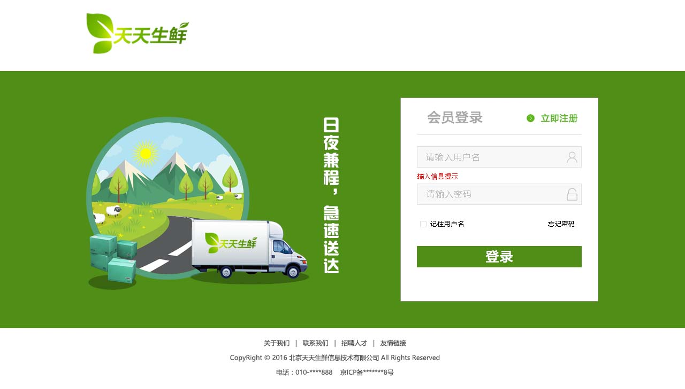

# PhotoShop

- [PhotoShop](#photoshop)
    - [Introduction](#introduction)
    - [PS](#ps)
        - [select tool](#select-tool)
        - [crop](#crop)
        - [measure size](#measure-size)
        - [batch crop images](#batch-crop-images)
    - [procedure](#procedure)
    - [begin to write html](#begin-to-write-html)
        - [tian tian example](#tian-tian-example)

## Introduction

CEO的产品idea(产品大概功能、用户规模、上市)→产品经理构思产品，用Acxure画产品原型图→CEO大概看一下草图，通过→可以干

产品经理把原型图给UI设计师→UI设计师用PS设计效果图→产品经理通过→PS效果图给前端开发工程师,做成页面→给后台配置数据库

这个就是全栈工程；

## PS

Photoshop保存为web格式，体积可以缩小得更小；`File/Export/Save for web`; 现在已经被`File/Export as`代替

gif有透明和不透明，没有半透明；png有半透明；svg用来做单色的图标，效果特别好(矢量图)，用于地图、图标、科学示意图；

要用flash必须要装插件，然后各种病毒，不支持搜索引擎；

双击**放大镜**,100%(Ctrl+0); 双击**Hand**,fit view(Ctrl+1)

### select tool

工具属性选择: autoselect: layer; 不推荐；而采用`Ctrl+Select`或者选中图层来移动；

Select/Transform Selection: 变换选区的形状；

可以用矩形选择框配合info来看尺寸大小；

如果ruler贴不齐图形，Ctrl+select选择所在图层，然后就可以贴齐了；然后就可以用选区来查看宽高了；



### crop

单张图片切图可以采用: crop tool, selection tool

crop tool不常用，因为不是太精确；

常用的方式： 用selection tool选择一块区域，然后使用Image/Crop进行裁剪，最后Export;

canvas size vs image size:

- 画布大小改变，图像的内容不会改变；
- 图像大小改变，就会修改图像的内容：image size变大, 图像要计算补充数据；image size变小, 图像要丢掉数据；

### measure size

slice tool: 测量尺寸，批量切图；

测量方法: marquee+info Panel; slice tool(切片工具)

slice tool测量: 先用slice tool画一个矩形，然后用同组的slice select tool双击切的区域，即可

### batch crop images

slice select tool删除切片: 选择，然后delete

## procedure

前端页面开发流程：

- 创建页面项目目录
- 使用Photoshop对效果图切图，切出网页制作中需要的小图片
- 将装饰类图像合并，制作成雪碧图
- 结合Photoshop和代码编辑器，参照效果图，进行html和css代码书写，制作页面

创建页面项目目录

```bash
web/
    css
    # images目录可以不创建，因为photoshop保持到web目录的时候会自动创建images目录
    images
    js
```

然后把切好的图放到images目录中；切片的时候也可以用Alt来复制选择的区域；Alt+Shift来指定垂直或者水平复制选择的区域

商品的图片是从数据库读取的，所以不用切；

不想看到切片信息：View/Show/Slices

切好之后，对于透明背景的图片，Ctrl+click背景，跳到背景所在的layer, 然后隐藏该图层；

最后，Export/Save for web, 通过切片选择工具选择，然后有透明的图片选择**png-24**(png-8其实就是gif)，一般图片保持jpg

最后，Save, 确保是**All User Slices**

如果对于每一个image都采用一个http请求的话，要三次握手、四次挥手，浪费时间；所以采用将经常不变的images(或者用于**装饰**的图，如果是logo要作为**内容**，方便搜索引擎搜到，不能这么做)合并成一张图；然后根据css的`background-position`来显示不同的位置；这种把多张小图合并成一个图，合并的图就叫做Sprite(雪碧图)，用于性能优化(因为图片已经弄下来了，直接读取cache比较快)；

比如, 下面的图片, 用fixed marquee+guide line让它们每个相隔50px


能够用样式做的，就用样式，不同图片做(比如切出一个透明的图片，后面的背景用css做)；

比如登陆页，需要切出并制作雪碧图如下：


最终得到了`res/web`下的所有图片:


## begin to write html

开始写html

```bash
./
    css
        reset.css
    images
    index.html
```

```css
/* reset.css */

body, ul, p, h1, h2, h3, h4, h5, h6, dl, dd, input, input, select, form{
    /* 用到的标签就写，不用的不写，不要拷贝网上的reset.css, 浪费性能 */
    /* select是下拉框 */
    margin: 0;
    padding: 0;
}

h1, h2, h3, h4, h5, h6{
    /* 自定义h的font-size */
    /* 会继承body的font-size, 然后乘以100% */
    font-size: 100%;
}

ul{
    list-style: none;
}

em{
    font-style: normal;
}

a{
    text-decoration: none;
}

img{
    /* IE下，用a保住img，会有一个紫色边框 */
    border: none;
}

/* 清除margin-top塌陷 */
.clearfix::before, .clearfix::after{
    content: "";
    display: table;
}

/* 清除浮动 */
.clearfix::after{
    clear: both;
}

.clearfix{
    zoom: 1;
}

.fl{
    float: left;
}

.fr{
    float: right;
}
```

```css
/* 登录与未登录的切换，本质是用js的判断语句，根据数据库的返回来做的 */
/* 在如下两种状态之间切换 */

/* 状态1： 未登录 */
<div class="user_login_link fl" style="display: block;">
    <a href="">登录</a>
    <span>|</span>
    <a href="">注册</a>
</div>
<div class="user_welcome fl" style="display: none;">
    欢迎您：<em>张三</em>
</div>

/* 状态2： 登陆 */
<div class="user_login_link fl" style="display: none;">
    <a href="">登录</a>
    <span>|</span>
    <a href="">注册</a>
</div>
<div class="user_welcome fl" style="display: block;">
    欢迎您：<em>张三</em>
</div>
```

在Chrome的Inspect中查看样式， 如果有删除线，那么就是失效的，以此来检验语法的正确性；

### tian tian example

```bash
./
    css
        reset.css
        index.css
    images
    index.html
```

```html
<!-- index.html -->

<!DOCTYPE html>
<html lang="en">
<head>
    <meta charset="UTF-8">
    <title>天天生鲜-首页</title>
    <link rel="stylesheet" href="css/reset.css">
    <link rel="stylesheet" href="css/index.css">
</head>
<body>
    <!-- 顶部状态栏 -->
    <div class="header_con">
        <div class="header">
            <div class="welcome fl">欢迎来到天天生鲜！</div>
            <div class="user_info fr">
                <div class="user_login_link fl">
                    <a href="">登录</a>
                    <span>|</span>
                    <a href="">注册</a>
                </div>
                <div class="user_welcome fl">
                    欢迎您：<em>张三</em>
                </div>
                <div class="user_shopping fl">
                    <span>|</span>
                    <a href="">我的购物车</a>
                    <span>|</span>
                    <a href="">我的订单</a>
                </div>
            </div>
        </div>
    </div>
    <!-- logo, search, cart -->
    <div class="logo_bar">
        <!-- 浮动的时候可以避免盒子嵌套的时候的margin-top塌陷 -->
        <!-- logo的margin-top给父级 -->
        <div class="fl logo">
            <a href=""></a>
        </div>
        <div class="fl search">
            <!-- 如果要用form表单提交的话，要用form表单包起来 -->
            <!-- form的提交是有刷新的提交，点击之后页面会刷新一遍，不好 -->
            <!-- 更好的用法是用Ajax提交 -->
            <!-- 所以这里就不包起来 -->
            <input type="text" class="fl input_text" name="" id="" placeholder="输入想搜的内容">
            <input type="button" class="fr input_button" value="搜索">
        </div>
        <div class="fr cart">
            <a class="fl" href="">我的购物车</a>
            <span class="fl">0</span>
        </div>
    </div>
    <!-- 横向的菜单 -->
    <div class="sub_menu_con">
        <div class="sub_menu">
            <h1 class="fl">全部商品分类</h1>
            <ul class="fl">
                <li><a href="">首页</a></li>
                <li><a href="">手机生鲜</a></li>
                <li><a href="">抽奖</a></li>
            </ul>
        </div>
    </div>
    <!-- 中间区域的菜单以及幻灯片 -->
    <div class="center_con">
        <!-- 每个li给右箭头图标 -->
        <!-- 每个a给icon图标 -->
        <ul class="fl main_menu">
            <li><a href="" class="fruit">新鲜水果</a></li>
            <li><a href="" class="seafood">海鲜水产</a></li>
            <li><a href="" class="meat">猪牛羊肉</a></li>
            <li><a href="" class="egg">禽类蛋品</a></li>
            <li><a href="" class="vegetable">新鲜蔬菜</a></li>
            <li><a href="" class="frozen">速冻食品</a></li>
        </ul>
        <div class="fl slide"></div>
        <div class="fr advertisement"></div>
    </div>
</body>
</html>
```

```css
/* reset.css */

body, ul, p, h1, h2, h3, h4, h5, h6, dl, dd, input, input, select, form{
    /* 用到的标签就写，不用的不写，不要拷贝网上的reset.css, 浪费性能 */
    /* select是下拉框 */
    margin: 0;
    padding: 0;
}

h1, h2, h3, h4, h5, h6{
    /* 自定义h的font-size */
    /* 会继承body的font-size, 然后乘以100% */
    font-size: 100%;
}

ul{
    list-style: none;
}

em{
    font-style: normal;
}

a{
    text-decoration: none;
}

img{
    /* IE下，用a保住img，会有一个紫色边框 */
    border: none;
}

/* 清除margin-top塌陷 */
.clearfix::before, .clearfix::after{
    content: "";
    display: table;
}

/* 清除浮动 */
.clearfix::after{
    clear: both;
}

.clearfix{
    zoom: 1;
}

.fl{
    float: left;
}

.fr{
    float: right;
}
```

```css
/* index.css */

body{
    font-family: 'Microsoft Yahei';
    color: #666;
    font-size: 12px;
}
/* 顶部状态条样式 */
.header_con{
    height: 29px;
    background-color: #f7f7f7;
    border-bottom: 1px solid #ddd;
}
.header{
    width: 1200px;
    height: 29px;
    margin: 0 auto;
}
.welcome{
    line-height: 29px;
}
.user_login_link, .user_welcome, .user_shopping{
    height: 29px;
    line-height: 29px;
}
.user_login_link a, .user_shopping a{
    /* 没有继承body的设置，需要单独设置 */
    color: #666;
}
.user_login_link a:hover, .user_shopping a:hover{
    color: #f80;
}
.user_login_link span, .user_shopping span{
    margin: 0 15px;
    color: #cecece;
}
.user_welcome{
    /* 默认隐藏用户名，显示登录|注册 */
    display: none;
}
.user_welcome em{
    color: #f80;
}
/* logo、搜索、购物车样式 */
.logo_bar{
    width: 1200px;
    height: 115px;
    /* background-color: gold; */
    margin: 0 auto;
}
.logo{
    width: 151px;
    height: 59px;
    margin: 29px 0 0 17px;
}
.search{
    width: 616px;
    height: 38px;
    border: 1px solid #37ab40;
    margin: 34px 0 0 123px;
    /* 通过chrome的inspect来调节得到8px 9px */
    background: url(../images/icons.png) 8px 9px no-repeat;
}
.search .input_text{
    width: 470px;
    height: 38px;
    border: 0;
    margin-left: 37px;
    /* 去掉chrome浏览器，点击搜索框外面高亮的框 */
    outline: none;
}
.search .input_button{
    width: 100px;
    height: 38px;
    background-color: #37ab40;
    border: 0;

    font:14px/38px 'Microsoft Yahei';
    color: #fff;

    /* 设置鼠标的形状 */
    cursor: pointer;
}
.cart{
    width: 200px;
    height: 40px;
    margin-top: 34px;
    
}
.cart a{
    /* 因为float, 所以可以width, height */
    width: 158px;
    height: 38px;
    border: 1px solid #ddd;
    
    text-indent: 56px;
    font: 14px/38px 'Microsoft Yahei';
    color: #37ab40;
    
    /* 最后一个是背景色，如果用background-color会被覆盖 */
    background: url(../images/icons.png) 17px -43px no-repeat #f7f7f7;
}
.cart span{
    width: 40px;
    height: 40px;
    background-color: #f80;

    font: bold 18px/40px 'Microsoft Yahei';
    color: #fff;
    text-align: center;
}
/* 横向的菜单 */
.sub_menu_con{
    height: 40px;
    border-bottom: 2px solid #37ab40;
}
.sub_menu_con .sub_menu{
    width: 1200px;
    height: 40px;
    margin: 0 auto;
}
.sub_menu h1{
    width: 200px;
    height: 40px;
    background-color: #37ab40;
    
    font: 14px/40px 'Microsoft Yahei';
    color: #fff;

    text-align: center;
}
.sub_menu ul{
    overflow: hidden;
}
.sub_menu li{
    /* 排成一行 */
    float: left;
    
    height: 14px;
    padding: 0 25px;
    /* 之前用span做间隔|, 现在用border来做| */
    border-left: 1px solid #666;
    /* 用overflow将最左边的竖线干掉 */
    margin-left: -1px;
    margin-top: 13px;
}
.sub_menu li a{
    font: 14px/14px 'Microsoft Yahei';
    color: #666;
}
.sub_menu li a:hover{
    color: #f80;
}
/* 中间区域的菜单以及幻灯片 */
.center_con{
    width: 1200px;
    height: 270px;
    /* background-color: cyan; */
    margin: 0 auto;
}
.center_con .main_menu{
    width: 200px;
    height: 270px;
    /* background-color: gold; */

    overflow: hidden;
}
.center_con .main_menu li{
    width: 198px;
    height: 44px;
    border: 1px solid #eee;
    
    /* 通过 边界合并 达到效果 */
    margin-top: -1px;
    background: url(../images/icons.png) 166px -385px no-repeat;
}
.center_con .main_menu li a{
    display: block;
    width: 198px;
    height: 44px;
    font: 14px/44px 'Microsoft Yahei';
    color: #333;
    text-indent: 71px;

    background: url(../images/icons.png) 33px 0px no-repeat;
}
.center_con .main_menu li .fruit{
    background-position: 33px -90px;
}
.center_con .main_menu li .seafood{
    background-position: 33px -140px;
}
.center_con .main_menu li .meat{
    background-position: 33px -190px;
}
.center_con .main_menu li .egg{
    background-position: 33px -240px;
}
.center_con .main_menu li .vegetable{
    background-position: 33px -290px;
}
.center_con .main_menu li .frozen{
    background-position: 33px -338px;
}
```