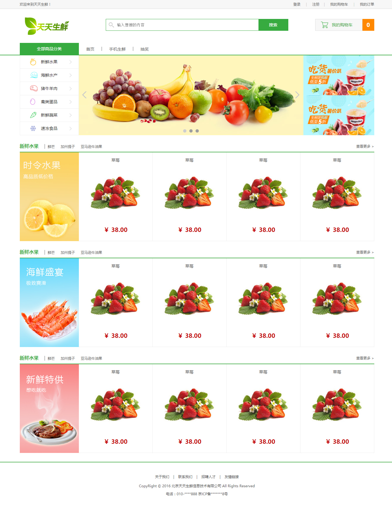

# Index example and Login example

- [HTML5+CSS3](#html5css3)
    - [About the index.html](#about-the-indexhtml)
    - [About the login.html](#about-the-loginhtml)

## About the index.html

```bash
./
    css
        reset.css
        index.css
    images
    index.html
```



```html
<!-- index.html -->
<!DOCTYPE html>
<html lang="en">
<head>
    <meta charset="UTF-8">
    <title>天天生鲜-首页</title>
    <link rel="stylesheet" href="css/reset.css">
    <link rel="stylesheet" href="css/index.css">
</head>
<body>
    <!-- 顶部状态栏 -->
    <div class="header_con">
        <div class="header">
            <div class="welcome fl">欢迎来到天天生鲜！</div>
            <div class="user_info fr">
                <div class="user_login_link fl">
                    <a href="">登录</a>
                    <span>|</span>
                    <a href="">注册</a>
                </div>
                <div class="user_welcome fl">
                    欢迎您：<em>张三</em>
                </div>
                <div class="user_shopping fl">
                    <span>|</span>
                    <a href="">我的购物车</a>
                    <span>|</span>
                    <a href="">我的订单</a>
                </div>
            </div>
        </div>
    </div>

    <!-- logo, search, cart -->
    <div class="logo_bar">
        <!-- 浮动的时候可以避免盒子嵌套的时候的margin-top塌陷 -->
        <!-- logo的margin-top给父级 -->
        <div class="fl logo">
            <a href=""></a>
        </div>
        <div class="fl search">
            <!-- 如果要用form表单提交的话，要用form表单包起来 -->
            <!-- form的提交是有刷新的提交，点击之后页面会刷新一遍，不好 -->
            <!-- 更好的用法是用Ajax提交 -->
            <!-- 所以这里就不包起来 -->
            <input type="text" class="fl input_text" name="" id="" placeholder="输入想搜的内容">
            <input type="button" class="fr input_button" value="搜索">
        </div>
        <div class="fr cart">
            <a class="fl" href="">我的购物车</a>
            <span class="fl">0</span>
        </div>
    </div>
    <!-- 横向的菜单 -->
    <div class="sub_menu_con">
        <div class="sub_menu">
            <h1 class="fl">全部商品分类</h1>
            <ul class="fl">
                <li><a href="">首页</a></li>
                <li><a href="">手机生鲜</a></li>
                <li><a href="">抽奖</a></li>
            </ul>
        </div>
    </div>

    <!-- 中间区域的菜单以及幻灯片 -->
    <div class="center_con">
        <!-- 每个li给右箭头图标 -->
        <!-- 每个a给icon图标 -->
        <ul class="fl main_menu">
            <li><a href="" class="fruit">新鲜水果</a></li>
            <li><a href="" class="seafood">海鲜水产</a></li>
            <li><a href="" class="meat">猪牛羊肉</a></li>
            <li><a href="" class="egg">禽类蛋品</a></li>
            <li><a href="" class="vegetable">新鲜蔬菜</a></li>
            <li><a href="" class="frozen">速冻食品</a></li>
        </ul>
        <div class="fl slide_con">
            <ul class="slide">
                <!-- 暂时只给一个slide, 等学了js再做 -->
                <li><a href=""></a></li>
                <li><a href=""></a></li>
                <li><a href=""></a></li>
            </ul>
            <!-- 一个元素叠加到另一个上面，要用到定位 -->
            <div class="slide_pre"></div>
            <div class="slide_next"></div>
            <!-- 三个点 -->
            <ul class="slide_points">
                <li class="active"></li>
                <li></li>
                <li></li>
            </ul>
        </div>
        <!-- 广告区 -->
        <div class="fr advertisement">
            <!-- 类似inline-block, 因为摆不到一行，所以自动换行了 -->
            <a href=""></a>
            <a href=""></a>
        </div>
    </div>

    <!-- 正文的内容 -->
    <div class="common_model_con">
        <div class="common_title">
            <h3 class="fl">新鲜水果</h3>
            <ul class="fl">
                <li><a href="">鲜芒</a></li>
                <li><a href="">加州提子</a></li>
                <li><a href="">亚马逊牛油果</a></li>
            </ul>
            <a class="fr more" href="">查看更多 &gt;</a>
        </div>
        <div class="common_goods_list">
            <div class="fl goods_banner"></div>
            <ul class="fl goods_list">
                <li>
                    <h4>草莓</h4>
                    <a href=""></a>
                    <p>￥ 38.00</p>
                </li>
                <li>
                    <h4>草莓</h4>
                    <a href=""></a>
                    <p>￥ 38.00</p>
                </li>
                <li>
                    <h4>草莓</h4>
                    <a href=""></a>
                    <p>￥ 38.00</p>
                </li>
                <li>
                    <h4>草莓</h4>
                    <a href=""></a>
                    <p>￥ 38.00</p>
                </li>
            </ul>
        </div>
    </div>
    <!-- 正文的内容 -->
    <div class="common_model_con">
        <div class="common_title">
            <h3 class="fl">新鲜水果</h3>
            <ul class="fl">
                <li><a href="">鲜芒</a></li>
                <li><a href="">加州提子</a></li>
                <li><a href="">亚马逊牛油果</a></li>
            </ul>
            <a class="fr more" href="">查看更多 &gt;</a>
        </div>
        <div class="common_goods_list">
            <div class="fl goods_banner"></div>
            <ul class="fl goods_list">
                <li>
                    <h4>草莓</h4>
                    <a href=""></a>
                    <p>￥ 38.00</p>
                </li>
                <li>
                    <h4>草莓</h4>
                    <a href=""></a>
                    <p>￥ 38.00</p>
                </li>
                <li>
                    <h4>草莓</h4>
                    <a href=""></a>
                    <p>￥ 38.00</p>
                </li>
                <li>
                    <h4>草莓</h4>
                    <a href=""></a>
                    <p>￥ 38.00</p>
                </li>
            </ul>
        </div>
    </div>
    <!-- 正文的内容 -->
    <div class="common_model_con">
        <div class="common_title">
            <h3 class="fl">新鲜水果</h3>
            <ul class="fl">
                <li><a href="">鲜芒</a></li>
                <li><a href="">加州提子</a></li>
                <li><a href="">亚马逊牛油果</a></li>
            </ul>
            <a class="fr more" href="">查看更多 &gt;</a>
        </div>
        <div class="common_goods_list">
            <div class="fl goods_banner"></div>
            <ul class="fl goods_list">
                <li>
                    <h4>草莓</h4>
                    <a href=""></a>
                    <p>￥ 38.00</p>
                </li>
                <li>
                    <h4>草莓</h4>
                    <a href=""></a>
                    <p>￥ 38.00</p>
                </li>
                <li>
                    <h4>草莓</h4>
                    <a href=""></a>
                    <p>￥ 38.00</p>
                </li>
                <li>
                    <h4>草莓</h4>
                    <a href=""></a>
                    <p>￥ 38.00</p>
                </li>
            </ul>
        </div>
    </div>
    
    <!-- 版权信息 -->
    <!-- 国内服务器挂一个网站需要有一个 备案号；国外无所谓 -->
    <div class="footer">
        <div class="links">
            <a href="">关于我们</a>
            <span>|</span>
            <a href="">联系我们</a>
            <span>|</span>
            <a href="">招聘人才</a>
            <span>|</span>
            <a href="">友情链接</a>
        </div>
        <p>
            CopyRight © 2016 北京天天生鲜信息技术有限公司 All Rights Reserved<br>
            电话：010-****888 京ICP备*******8号
        </p>
    </div>
</body>
</html>
```

```css
/* reset.css */
/* 参见上一节 */
```

```css
/* index.css */
body{
    font-family: 'Microsoft Yahei';
    color: #666;
    font-size: 12px;
}


/* 顶部状态条样式 */
.header_con{
    height: 29px;
    background-color: #f7f7f7;
    border-bottom: 1px solid #ddd;
}
.header{
    width: 1200px;
    height: 29px;
    margin: 0 auto;
}
.welcome{
    line-height: 29px;
}
.user_login_link, .user_welcome, .user_shopping{
    height: 29px;
    line-height: 29px;
}
.user_login_link a, .user_shopping a{
    /* 没有继承body的设置，需要单独设置 */
    color: #666;
}
.user_login_link a:hover, .user_shopping a:hover{
    color: #f80;
}
.user_login_link span, .user_shopping span{
    margin: 0 15px;
    color: #cecece;
}
.user_welcome{
    /* 默认隐藏用户名，显示登录|注册 */
    display: none;
}
.user_welcome em{
    color: #f80;
}


/* logo、搜索、购物车样式 */
.logo_bar{
    width: 1200px;
    height: 115px;
    /* background-color: gold; */
    margin: 0 auto;
}
.logo{
    width: 151px;
    height: 59px;
    margin: 29px 0 0 17px;
}
.search{
    width: 616px;
    height: 38px;
    border: 1px solid #37ab40;
    margin: 34px 0 0 123px;
    /* 通过chrome的inspect来调节得到8px 9px */
    background: url(../images/icons.png) 8px 9px no-repeat;
}
.search .input_text{
    width: 470px;
    height: 38px;
    border: 0;
    margin-left: 37px;
    /* 去掉chrome浏览器，点击搜索框外面高亮的框 */
    outline: none;
}
.search .input_button{
    width: 100px;
    height: 38px;
    background-color: #37ab40;
    border: 0;

    font:14px/38px 'Microsoft Yahei';
    color: #fff;

    /* 设置鼠标的形状 */
    cursor: pointer;
}
.cart{
    width: 200px;
    height: 40px;
    margin-top: 34px;
    
}
.cart a{
    /* 因为float, 所以可以width, height */
    width: 158px;
    height: 38px;
    border: 1px solid #ddd;
    
    text-indent: 56px;
    font: 14px/38px 'Microsoft Yahei';
    color: #37ab40;
    
    /* 最后一个是背景色，如果用background-color会被覆盖 */
    background: url(../images/icons.png) 17px -43px no-repeat #f7f7f7;
}
.cart span{
    width: 40px;
    height: 40px;
    background-color: #f80;

    font: bold 18px/40px 'Microsoft Yahei';
    color: #fff;
    text-align: center;
}


/* 横向的菜单 */
.sub_menu_con{
    height: 40px;
    border-bottom: 2px solid #37ab40;
}
.sub_menu_con .sub_menu{
    width: 1200px;
    height: 40px;
    margin: 0 auto;
}
.sub_menu h1{
    width: 200px;
    height: 40px;
    background-color: #37ab40;
    
    font: 14px/40px 'Microsoft Yahei';
    color: #fff;

    text-align: center;
}
.sub_menu ul{
    overflow: hidden;
}
.sub_menu li{
    /* 排成一行 */
    float: left;
    
    height: 14px;
    padding: 0 25px;
    /* 之前用span做间隔|, 现在用border来做| */
    border-left: 1px solid #666;
    /* 用overflow将最左边的竖线干掉 */
    margin-left: -1px;
    margin-top: 13px;
}
.sub_menu li a{
    font: 14px/14px 'Microsoft Yahei';
    color: #666;
}
.sub_menu li a:hover{
    color: #f80;
}


/* 中间区域的菜单、幻灯片、广告 */
.center_con{
    width: 1200px;
    height: 270px;
    /* background-color: cyan; */
    margin: 0 auto;
}
.center_con .main_menu{
    width: 200px;
    height: 270px;
    /* background-color: gold; */

    overflow: hidden;
}
.center_con .main_menu li{
    width: 198px;
    height: 44px;
    border: 1px solid #eee;
    
    /* 通过 边界合并 达到效果 */
    margin-top: -1px;
    background: url(../images/icons.png) 166px -385px no-repeat;
}
.center_con .main_menu li a{
    display: block;
    width: 198px;
    height: 44px;
    font: 14px/44px 'Microsoft Yahei';
    color: #333;
    text-indent: 71px;

    background: url(../images/icons.png) 33px 0px no-repeat;
}
.center_con .main_menu li .fruit{
    background-position: 33px -90px;
}
.center_con .main_menu li .seafood{
    background-position: 33px -140px;
}
.center_con .main_menu li .meat{
    background-position: 33px -190px;
}
.center_con .main_menu li .egg{
    background-position: 33px -240px;
}
.center_con .main_menu li .vegetable{
    background-position: 33px -290px;
}
.center_con .main_menu li .frozen{
    background-position: 33px -338px;
}

/* 幻灯片slide */
.slide_con{
    width: 760px;
    height: 270px;
    position: relative;
}
.slide_pre, .slide_next{
    width: 15px;
    height: 23px;
    position: absolute;
    left: 11px;
    top: 122px;
    cursor: pointer;
    background: url(../images/icons.png) -1px -451px no-repeat;
}
.slide_next{
    left: 732px;
    background: url(../images/icons.png) -1px -501px no-repeat;
}
.slide_points{
    position: absolute;
    left: 0;
    bottom: 9px;
    /* 定位的话，自动转换为inline-block */
    /* 不定位的话，就是block，width就是100% */
    width: 100%;
    height: 11px;
    /* background-color: red; */
    
    /* 如果是一个居中的话，采用margin:0 auto; */
    /* 如果是多个剧中的话, 采用text-align: center; */
    text-align: center;
    
    /* 去掉inline-block的小空格 */
    font-size: 0;
}
.slide_points li{
    width: 11px;
    height: 11px;   
    display: inline-block;
    background-color: #9f9f9f;
    margin: 0 5px;
    
    /* CSS3的效果，IE没有这个只能看方的points */
    border-radius: 50%;
}
.slide_points .active{
    background-color: #cecece;
}

/* 广告 */
.advertisement{
    width: 240px;
    height: 270px;
}

.advertisement a{
    /* 解决图片之间的空格method1 */
    float: left;
    /* 因为float, 自动转换成inline-block, 所以可以设置width, height */
    width: 240px;
    height: 135px;
}

.advertisement a img{
    /* 同样也是图片之间有空格method2 */
    /* 或者说解决图片下方出现3px的空白的bug */
    display: block;
}


/* 正文的内容 */
.common_model_con{
    width: 1200px;
    height: 340px;
    margin: 18px auto;
    /* background-color: cyan; */
}

.common_model_con .common_title{
    height: 38px;
    border-bottom: 2px solid #42ad46;
}

.common_title h3{
    font: bold 16px/38px 'Microsoft Yahei';
    color: #37ab40;
}

.common_title ul{
    /* background-color: gold; */
    margin:12px 0 0 20px;
    border-left: 1px solid #666;
}

.common_title li{
    float: left;
    margin: 0 10px;
}

.common_title li a{
    font:12px/12px 'Microsoft Yahei';
    color: #666;
}

.common_title li a:hover{
    color: #f80;
}

.common_title .more{
   height: 38px; 
   line-height: 38px;
   color: #666;
}

.common_model_con .common_goods_list{
    width: 1200px;
    height: 300px;
    /* background-color: cyan; */
}

.common_goods_list .goods_banner{
    width: 200px;
    height: 300px;

}

.common_goods_list .goods_list{
    width: 1000px;
    height: 300px;
}

.goods_list li{
    float: left;
    width: 249px;
    height: 299px;

    /* 每一个右、下都有边框 */
    border-right: 1px solid #ededed;
    border-bottom: 1px solid #ededed;

    /* 多个项目剧中排列 */
    text-align: center;
}

.goods_list li h4{
    height: 52px;
    font: 14px/52px 'Microsoft Yahei';
}

.goods_list li p{
    height: 52px;
    font: bold 20px/52px 'Microsoft Yahei';
    color: #c40000;
}

.goods_list li:hover{
    width: 248px;
    height: 298px;
    border: 1px solid #ff0;
}

/* 底部的版权信息 */
.footer{
    height: 145px;
    border-top: 2px solid #4ab14e;
    margin-top: 30px;

    text-align: center;
}

.footer .links{
    /* 因为父级已经有了border, 所以不会margin-top塌陷 */
    margin-top: 40px;
}

.footer .links a{
    color: #4e4e4e;
}

.footer .links a:hover{
    color: #f80;
}

.footer .links span{
    color: #4e4e4e;
    margin: 0 10px;
}

.footer p{
    margin-top: 10px;
    color: #4e4e4e;
    line-height: 27px;
}
```

## About the login.html

登录页和首页的主要区别是，首页没有表单(可能有比如搜索框); 只要这两个会做，其他的都是so easy; 比如注册页，也是很容易的；


```bash
./
    css
        reset.css
        index.css
        loign.css
    images
    index.html
    login.html
```

```html
<!-- login.html -->

<!DOCTYPE html>
<html lang="en">
<head>
    <meta charset="UTF-8">
    <title>天天生鲜-登录页</title>
    <link rel="stylesheet" href="css/reset.css">
    <link rel="stylesheet" href="css/login.css">
</head>
<body>
    <!-- header -->
    <div class="login_header clearfix">
        <a href=""></a>
    </div>

    <!-- 中间区域 -->
    <div class="login_form_con">
        <div class="login_form">
            
            <p>
                日夜兼程·急速送达
            </p>
            <div class="fr form_input_con">
                <div class="form_title">
                    <h1>会员登录</h1>
                    <a href="">立即注册</a>
                </div>
                <!-- 要提交的东西用form包起来 -->
                <form>
                    <div class="form_group">
                        <input class="form_text" type="text" name="uname" placeholder="用户名">
                        <span class="error">文字提示</span>
                    </div>
                    <div class="form_group">
                        <input class="form_pwd" type="password" name="upwd" placeholder="密码">
                        <span class="error">文字提示</span>
                    </div>
                    <div class="form_group">
                        <!-- 浮动的时候label更加方便和check的方框对齐 -->
                        <input class="fl form_check" type="checkbox" name="remember" id="remember_id">
                        <!-- 点击记住用户名的时候也可以check -->
                        <label class="fl" for="remember_id">记住用户名</label>
                        <a class="fr find_pwd" href="">忘记密码</a>
                    </div>
                    <input class="form_submit" type="submit" value="登 录">
                </form>
            </div>
        </div>
    </div>

    <!-- 版权信息 -->
    <!-- 国内服务器挂一个网站需要有一个 备案号；国外无所谓 -->
    <div class="footer">
            <div class="links">
                <a href="">关于我们</a>
                <span>|</span>
                <a href="">联系我们</a>
                <span>|</span>
                <a href="">招聘人才</a>
                <span>|</span>
                <a href="">友情链接</a>
            </div>
            <p>
                CopyRight © 2016 北京天天生鲜信息技术有限公司 All Rights Reserved<br>
                电话：010-****888 京ICP备*******8号
            </p>
        </div>
</body>
</html>
```

```css
/* login.css */

body{
    font-family: 'Microsoft Yahei';
    color: #666;
    font-size: 12px;
}

.login_header{
    width: 953px;
    height: 133px;
    margin: 0 auto;

    /* background-color: cyan; */
}
.login_header a{
    display: block;
    margin-top: 28px;
}
.login_form_con{
    height: 480px;
    background-color: #518e17;
    border-top: 1px solid #79a652;
    border-bottom: 1px solid #79a652;
}
.login_form{
    width: 953px;
    height: 482px;
    margin: 0 auto;
}

.login_form img{
    float: left;
    margin: 92px 0 0 15px;
}
.login_form p{
    float: left;
    width: 30px;
    height: 300px;

    color: #fff;
    font: 30px/36px 'Microsoft Yahei';
    text-align: center;

    margin: 87px 0 0 114px;
}

/* form input */
.login_form .form_input_con{
    width: 368px;
    height: 378px;
    background-color: #fff;
    border: 1px solid #c6c6c5;
    margin-top: 50px;
}
.form_input_con .form_title{
    width: 300px;
    height: 70px;
    border-bottom: 1px solid #e0e0e0;
    margin: 0 auto;
}
.form_title h1{
    float: left;
    /* 自动变成了inline-block */
    height: 70px;
    font: 24px/70px 'Microsoft Yahei';
    color: #a8a8a8;
    margin-left: 44px;
    /* background-color: gold; */
}
.form_title a{
    float: left;
    background-color: gold;
    width: 100px;
    height: 16px;
    font: 16px/16px 'Microsoft Yahei';
    color: #5fb42a;
    text-indent: 25px;
    background: url(../images/icons.png) -1px -551px no-repeat;
    margin: 33px 0 0 36px;
}
.form_input_con form{
    width: 308px;
    height: 221px;
    margin: 20px auto;
}
.form_input_con form .form_group{
    width: 308px;
    height: 68px;
}
form .form_text, form .form_pwd{
    width: 306px;
    height: 38px;
    border: 1px solid #e0e0e0;
    /* 去掉focus的时候高亮边框 */
    outline: none;
    /* 输入的时候不要顶格 */
    text-indent: 10px;

    background: url(../images/icons.png) 275px -592px no-repeat #f8f8f8;
}
form .form_pwd{
    /* 用新颖的方法来实现 */
    background-position: 275px -642px;
}
.form_group .error{
    /* 出错的时候文字提示默认是藏起来的; 然后用程序来控制 */
    font: 12px/28px 'Microsoft Yahei';
    color: #ff5400;
    display: none;
}
form .form_check{
    /* 用了float，可以精确的调节margin */
    margin: 2px 10px 0 0;
}
form .find_pwd{
    color: #4b4b4b;
}
form .find_pwd:hover{
    color: #f80;
}
form .form_submit{
    width: 308px;
    height: 40px;
    background-color: #47aa34;
    border: 0;

    color: #fff;
    font: 24px/40px 'Microsoft Yahei';

    cursor: pointer;
}

/* 底部的版权信息 */
.footer{
    height: 145px;
    /* border-top: 2px solid #4ab14e; */
    /* margin-top: 30px; */

    text-align: center;

    font-size: 12px;
    font-family: 'Microsoft Yahei';
}

.footer .links{
    /* 因为父级已经有了border, 所以不会margin-top塌陷 */
    margin-top: 40px;
}

.footer .links a{
    color: #4e4e4e;
}

.footer .links a:hover{
    color: #f80;
}

.footer .links span{
    color: #4e4e4e;
    margin: 0 10px;
}

.footer p{
    margin-top: 10px;
    color: #4e4e4e;
    line-height: 27px;
}
```