#  CSS3

- [CSS3](#css3)
    - [about CSS3 and html5](#about-css3-and-html5)
    - [CSS3 Specificity](#css3-specificity)
    - [CSS3 selector](#css3-selector)
        - [`nth-child`](#nth-child)
        - [`nth-of-type`](#nth-of-type)
        - [`empty`, `enabled`, `disabled`, `checked`, `not`](#empty--enabled--disabled--checked--not)
        - [`:target` selector](#target-selector)
        - [`>`, `+`, `~` selector](#selector)
        - [Attribute selectors](#attribute-selectors)
    - [CSS radius, shadow, rgba](#css-radius--shadow--rgba)
        - [radius & shadow](#radius-shadow)
        - [rgba](#rgba)
    - [CSS3 transition](#css3-transition)
    - [CSS3 transform](#css3-transform)
        - [translat, rotate, scale, skew](#translat--rotate--scale--skew)
        - [perspective, rotateX](#perspective--rotatex)
    - [CSS3 Animation](#css3-animation)
        - [walking example](#walking-example)
        - [multi-state animation](#multi-state-animation)
        - [loading animation example](#loading-animation-example)
    - [CSS3 browser prefix](#css3-browser-prefix)
    - [HTML5 not important](#html5-not-important)
        - [H5 New tags](#h5-new-tags)
        - [H5 new forms](#h5-new-forms)
        - [H5 audio & video](#h5-audio-video)
    - [H5 for app](#h5-for-app)
        - [viewport](#viewport)
        - [retina](#retina)
        - [layout](#layout)
            - [Flow layout](#flow-layout)
            - [Responsive layout](#responsive-layout)
            - [applayout: flow+responsive](#applayout--flowresponsive)
            - [applayout: rem layout](#applayout--rem-layout)
            - [rem example](#rem-example)

## about CSS3 and html5

新东西：css3的动画效果；H5的页面(可以放到浏览器、微信、嵌入H5页面到android or ios)；

## CSS3 Specificity

CSS3权重问题: CSS写的比较好的时候没有这个问题，修改的时候(或者css复杂的时候)会出现

不同权重的等级:

- `!important`, 权重为10000
- `style="xxx"`, 权重为1000
- `#xxx_id`, 权重为100
- 类、伪类(`:hover`)、属性选择器, 权重为10
- 标签选择器、伪元素选择器(`::after`, `::before`), 权重为1
- 通用选择器（`*`）、子选择器（`>`）、相邻选择器（`+`）、同胞选择器（`~`）、权重值为0

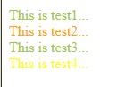

```html
<!DOCTYPE html>
<html lang="en">
<head>
    <meta charset="UTF-8">
    <title>Test</title>
    <style>
        /* test1 */
        div{
            /* 权重1 */
            color: red;
        }
        .test_div{
            /* 权重10 */
            color: yellow;
        }
        #box1{
            /* 权重100 */
            color: yellowgreen;
        }
        /* test2 */
        #box2{
            /* 权重100 */
            color: yellowgreen;
        }
        /* test3 */
        #box3{
             /* 权重10000+100 */
             color: yellowgreen !important;
        }
        /* test4 */
        body .con1{
            /* 有多少个层级，每一个层级权重相加 */
            /* 权重1+10=11 */
            color: yellow;
        }
        .con2{
            /* 权重10 */
            color: pink;
        }
    </style>
</head>
<body>
    <!-- test1 -->
    <div id="box1" class="test_div">
        This is test1...
    </div>
    <!-- test2 -->
    <!-- 内联样式，权重1000 -->
    <div id="box2" style="color: orange;">
        This is test2...
    </div>
    <!-- test3 -->
    <div id="box3" style="color: orange">
        This is test3...
    </div>
    <!-- 权重值一样的，后面的覆盖前面的 -->
    <!-- test4 -->
    <div class="con1 con2">
        This is test4...
    </div>
</body>
</html>
```

注意事项：

```html
<style type="text/css">
    /* 如果div和后面的没有空格，那么div只是修饰用的，计算权重的时候表示一级 */
    #content div.main_content h2{
        color:red;    
    }
    /* 如果div和后面的有空格，那么就是两级，和上面不是一回事 */
    #content div .main_content h2{
        color:blue;
    }
    /* 和第一种情况是一回事，但是没有第一种权重高 */
    #content .main_content h2{
        color:blue;
    }
</style>

<div id="content">
    <div class="main_content">
        <h2>这是一个h2标题</h2>
    </div>
</div>
<!-- 
第一条样式的权重计算： 100+1+10+1，结果为112；
第二条样式的权重计算： 100+10+1，结果为111；
h2标题的最终颜色为red
-->
```

## CSS3 selector

思想： 把样式变复杂，把结构边简单(稍加了一些id, class)

### `nth-child`

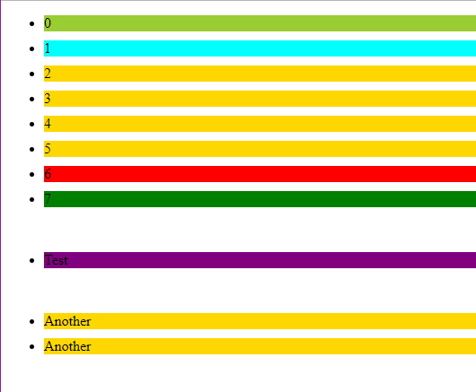

```html
<!DOCTYPE html>
<html lang="en">
<head>
    <meta charset="UTF-8">
    <title>Document</title>
    <style>
        li{
            background-color: gold;
            margin-bottom: 10px;
        }
        /* nth-child */
        .test1 li:first-child{
            background-color: yellowgreen;
        }
        .test1 li:last-child{
            background-color: green;
        }
        .test1 li:nth-child(2){
            background-color: cyan;
        }
        .test1 li:nth-last-child(2){
            background-color: red;
        }
        /* only-child */
        /* 两个条件: */
        /* 1. 容器里面只有一个元素 */
        /* 2. 该元素还要是li才行 */
        .test2 li:only-child{
            background-color: purple;
        }
    </style>
</head>
<body>
    <ul class="test1">
        <li>0</li>
        <li>1</li>
        <li>2</li>
        <li>3</li>
        <li>4</li>
        <li>5</li>
        <li>6</li>
        <li>7</li>
    </ul>
    <br>
    <ul class="test2">
        <li>Test</li>
    </ul>
    <br>
    <ul class="test2">
        <li>Another</li>
        <li>Another</li>
    </ul>
</body>
</html>
```

黑魔法：修改偶数行的样式

```html
<!DOCTYPE html>
<html lang="en">
<head>
    <meta charset="UTF-8">
    <title>Document</title>
    <style>
        li{
            background-color: gold;
            margin-bottom: 10px;
        }
        /* 2n-1, 2n, 2n+1, 3n*/
        li:nth-child(2n){
            background-color: cyan;
        }
    </style>
</head>
<body>
    <ul>
        <li>0</li>
        <li>1</li>
        <li>2</li>
        <li>3</li>
        <li>4</li>
        <li>5</li>
        <li>6</li>
        <li>7</li>
    </ul>
</body>
</html>
```

### `nth-of-type`

区别`.con1 div:nth-child(3)`, `.con2 div:nth-of-type(3)`:

- `.con1 div:nth-child(3)`表示先找到.con1的第3个child，如果该元素是div，那么修改它的样式；否则不修改
- `.con2 div:nth-of-type(3)`表示找到.con2的第3个类型为div的元素，并修改样式；

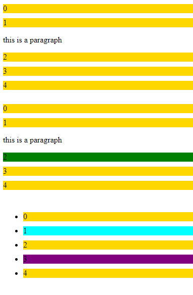

```html
<!DOCTYPE html>
<html lang="en">
<head>
    <meta charset="UTF-8">
    <title>Document</title>
    <style>
        .test1 div, .test2 div, .test3 li{
            background-color: gold;
            margin-bottom: 10px;
        }
        /* nth-child */
        .test1 div:nth-child(3){
            background-color: green;
        }
        /* nth-of-type */
        .test2 div:nth-of-type(3){
            background-color: green;
        }
        /* 如果一个容器里面的类型都是一样的 */
        /* nth-child与nth-of-type没有差别 */
        .test3 li:nth-child(2){
            background-color: cyan;
        }
        .test3 li:nth-last-of-type(2){
            background-color: purple;
        }
    </style>
</head>
<body>
    <div class="test1">
        <div>0</div>
        <div>1</div>
        <p>this is a paragraph</p>
        <div>2</div>
        <div>3</div>
        <div>4</div>
    </div>
    <br>
    <div class="test2">
        <div>0</div>
        <div>1</div>
        <p>this is a paragraph</p>
        <div>2</div>
        <div>3</div>
        <div>4</div>
    </div>
    <br>
    <ul class="test3">
        <li>0</li>
        <li>1</li>
        <li>2</li>
        <li>3</li>
        <li>4</li>
    </ul>
</body>
</html>
```

所以`:only-child`与`:only-of-type`也是不同的；

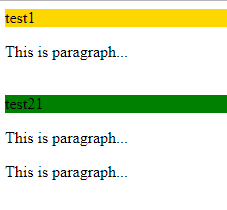

```html
<!DOCTYPE html>
<html lang="en">
<head>
    <meta charset="UTF-8">
    <title>Document</title>
    <style>
        .test1 div, .test2 div{
            background-color: gold;
            margin-bottom: 10px;
        }
        /* only-child */
        /* 只能有一个child */
        .test1 div:only-child{
            background-color: cyan;
        }
        /* only-of-type */
        /* 只能有一个div, 可以有其他类型的 */
        .test2 div:only-of-type{
            background-color: green;
        }
    </style>
</head>
<body>
    <div class="test1">
        <div>test1</div>
        <p>This is paragraph...</p>
    </div>
    <br>
    <div class="test2">
        <div>test21</div>
        <p>This is paragraph...</p>
        <p>This is paragraph...</p>
    </div>
</body>
</html>
```

### `empty`, `enabled`, `disabled`, `checked`, `not`

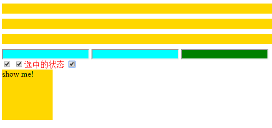

```html
<!DOCTYPE html>
<html lang="en">
<head>
    <meta charset="UTF-8">
    <title>Document</title>
    <style>
        div:empty{
            background-color: gold;
            height: 20px;
            margin-bottom: 10px;
        }
        input:disabled{
            background-color: cyan;
        }
        input:enabled{
            background-color: green;
        }
        /* 如果checked, 那么改变紧挨着checkbox的label的样式 */
        /* 有交互效果 */
        input:checked + label{
            color: red;
        }
        /* checkbox with div */
        .box1{
            width: 100px;
            height: 100px;
            background-color: gold;
            /* 默认不显示 */
            display: none;
        }
        input:checked + div{
            /* 勾选的时候就显示box1，类型js效果 */
            display: block;
        }
    </style>
</head>
<body>
    <div>
        <div></div>
        <div></div>
        <div></div>
    </div>
    <div class="con">
        <input type="text" name="" id="" disabled>
        <input type="text" name="" id="" disabled="disabled">
        <input type="text" name="" id="">
        <br>
        <input type="checkbox" name="" id="" checked>
        <input type="checkbox" name="" id=""><label for="">选中的状态</label>
        <input type="checkbox" name="" id=""><div class="box1">show me!</div>
    </div>
</body>
</html>
```

```html
<!-- not -->
<!DOCTYPE html>
<html lang="en">
<head>
    <meta charset="UTF-8">
    <meta name="viewport" content="width=device-width, initial-scale=1.0">
    <meta http-equiv="X-UA-Compatible" content="ie=edge">
    <title>Document</title>
    <style>
        /* 选择.menu下面不是li的元素*/
        .menu :not(li){
            background-color: gold;
        }
    </style>
</head>
<body>
    <ul class="menu">
        <li>0</li>
        <li>1</li>
        <span>Hello</span>
        <li>2</li>
        <li>3</li>
    </ul>
</body>
</html>
```

### `:target` selector

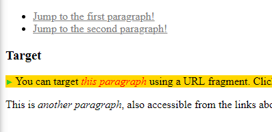

```html
<!DOCTYPE html>
<html lang="en">
<head>
    <meta charset="UTF-8">
    <meta name="viewport" content="width=device-width, initial-scale=1.0">
    <meta http-equiv="X-UA-Compatible" content="ie=edge">
    <title>Document</title>
    <style>
        p:target {
          background-color: gold;
        }

        /* Add a pseudo-element inside the target element */
        p:target::before {
          font: 70% sans-serif;
          content: "►";
          color: limegreen;
          margin-right: .25em;
        }

        /* Style italic elements within the target element */
        p:target i {
          color: red;
        }
    </style>
</head>
<body>

    <ul>
     <li><a href="#p1">Jump to the first paragraph!</a></li>
     <li><a href="#p2">Jump to the second paragraph!</a></li>
    </ul>
    
    <h3>Target</h3>
    <p id="p1">You can target <i>this paragraph</i> using a
      URL fragment. Click on the link above to try out!</p>
    <p id="p2">This is <i>another paragraph</i>, also accessible
      from the links above. Isn't that delightful?</p>
</body>
</html>
```

### `>`, `+`, `~` selector

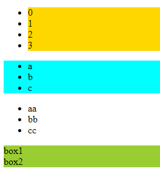

```html
<!DOCTYPE html>
<html lang="en">
<head>
    <meta charset="UTF-8">
    <meta name="viewport" content="width=device-width, initial-scale=1.0">
    <meta http-equiv="X-UA-Compatible" content="ie=edge">
    <title>Document</title>
    <style>
        /* menu1下面的所有子级元素 */
        .menu1 > li{
            background-color: gold;
        }
        /* 紧挨着.menu1的同级ul */
        .menu1 + ul{
            background-color: cyan;
        }
        /* .menu3后面的所有同级元素 */
        .menu3 ~ div{
            background-color: yellowgreen;
        }
    </style>
</head>
<body>
    <ul class="menu1">
        <li>0</li>
        <li>1</li>
        <li>2</li>
        <li>3</li>
    </ul>
    <ul class="menu2">
        <li>a</li>
        <li>b</li>
        <li>c</li>
    </ul>
    <ul class="menu3">
        <li>aa</li>
        <li>bb</li>
        <li>cc</li>
    </ul>
    <div>box1</div>
    <div>box2</div>
</body>
</html>
```

### Attribute selectors

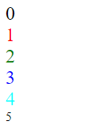

```html
<!DOCTYPE html>
<html lang="en">
<head>
    <meta charset="UTF-8">
    <meta name="viewport" content="width=device-width, initial-scale=1.0">
    <meta http-equiv="X-UA-Compatible" content="ie=edge">
    <title>Document</title>
    <style>
        div[data-attr]{
            font-size: 24px;
        }
        div[data-attr='he']{
            color: red;
        }
        div[data-attr^='hel']{
            color: green;
        }
        div[data-attr$='ee']{
            color: blue;
        }
        div[data-attr*='core']{
            color: aqua;
        }
    </style>
</head>
<body>
    <div data-attr='hero'>0</div>
    <div data-attr='he'>1</div>
    <div data-attr='hello'>2</div>
    <div data-attr='shee'>3</div>
    <div data-attr='coreshell'>4</div>
    <div class="test">5</div>
</body>
</html>
```

## CSS radius, shadow, rgba

### radius & shadow

然而现在追求扁平化，不要圆角；不要阴影；

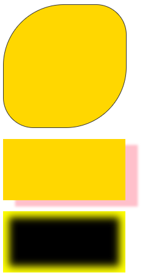

```html
<!DOCTYPE html>
<html lang="en">
<head>
    <meta charset="UTF-8">
    <title>Document</title>
    <style>
        .box1{
            width: 200px;
            height: 200px;
            background-color: gold;
            border: 1px solid #333;

            /* top-left */
            /* 分别对应a b */
            /* border-top-left-radius: 100px 50px; */
            /* border-top-left-radius: 100px; */
            /* border-radius: 100px; */
            /* 圆 */
            /* border-radius: 50%; */
            border-radius: 100px 50px 100px 50px;
        }
        .box2{
            width: 200px;
            height: 100px;
            background-color: gold;
            /* 阴影左移20px, 下移10px, 羽化5px, spread 0px, pink */
            box-shadow: 20px 10px 5px 0 pink;
        }
        .box3{
            /* 向内部扩张的shadow用来做内发光 */
            width: 200px;
            height: 100px;
            background-color: black;
            box-shadow: 0px 0px 20px 10px yellow inset;
        }
    </style>
</head>
<body>
    <div class="box1"></div>
    <br>
    <div class="box2"></div>
    <br>
    <div class="box3"></div>
</body>
</html>
```

### rgba

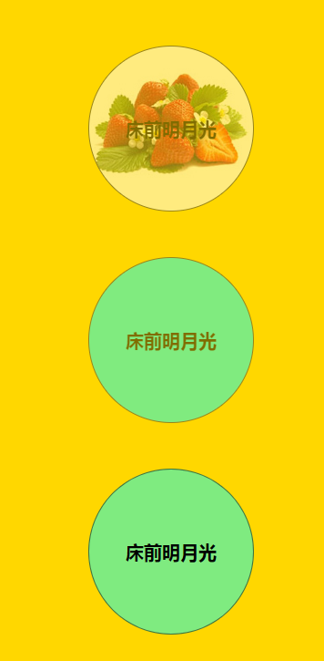

```html
<!DOCTYPE html>
<html lang="en">
<head>
    <meta charset="UTF-8">
    <title>Document</title>
    <style>
        body{
            background-color: gold;
        }
        .box1{
            width: 180px;
            height: 180px;
            border: 1px solid #333;
            margin: 50px auto;

            background: url(images/goods_pic.jpg) no-repeat;
            border-radius: 50%;

            /* 旧方法设置透明度 */
            opacity: 0.5;
            /* 下面这一句为了兼容IE */
            /* filter: alpha(opacity=50) */
            
            /* 文字也会变得透明，看不清 */
            text-align: center;
            font:bold 20px/180px 'Microsoft Yahei';
        }
        .box2{
            width: 180px;
            height: 180px;
            border: 1px solid #333;
            margin: 50px auto;

            background-color: cyan;
            border-radius: 50%;
            opacity: 0.5;

            text-align: center;
            font:bold 20px/180px 'Microsoft Yahei'; 
        }
        .box3{
            width: 180px;
            height: 180px;
            border: 1px solid rgba(0, 0, 0, 0.5);
            margin: 50px auto;
            
            /* 只是背景色变透明，文字不变，图片不能rgba */
            background-color: rgba(0, 255, 255, 0.5);
            border-radius: 50%;

            text-align: center;
            font:bold 20px/180px 'Microsoft Yahei'; 
        }
    </style>
</head>
<body>
    <div class="box1">床前明月光</div>
    <div class="box2">床前明月光</div>
    <div class="box3">床前明月光</div>
</body>
</html>
```

## CSS3 transition

CSS3的transition动画需要触发，animation动画不用触发；

transition只能是一维的动画，比如位移，颜色；

```html
<!DOCTYPE html>
<html lang="en">
<head>
    <meta charset="UTF-8">
    <title>Document</title>
    <style>
        .box1{
            width: 100px;
            height: 100px;
            background-color: gold;
            
            /* transition: property duration timing-function delay 同时设置四个属性 */
            transition: width 500ms ease,
            height 500ms ease 500ms,
            background-color 1s ease 0ms,
            border-radius 500ms ease 1s;
        }
        .box2{
            width: 100px;
            height: 100px;
            background-color: gold;
            /* 所有属性一起变 */
            /* ease比较符合人们的感觉 */
            transition: all 1s ease;
        }
        .box1:hover, .box2:hover{
            width: 500px;
            height: 300px;
            background-color: cyan;
            border-radius: 50%;
        }
    </style>
</head>
<body>
    <div class="box1"></div>
    <br>    
    <div class="box2"></div>    
</body>
</html>
```

[DIY变化曲线](https://matthewlein.com/tools/ceaser): 如果对于宽度，先变短，然后快速变长，最后退回来一点；也就是**位移vs time**

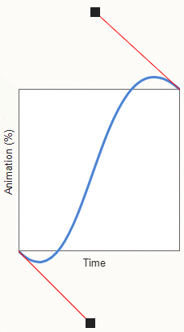

```css
.box3{
    width: 100px;
    height: 50px;
    background-color: gold;
    transition: width 3s cubic-bezier(0.445, -0.445, 0.490, 1.510);
}
.box3:hover{
    width: 500px;
}
```

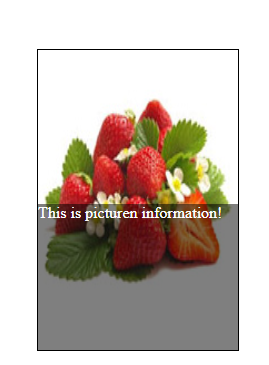

```html
<!DOCTYPE html>
<html lang="en">
<head>
    <meta charset="UTF-8">
    <title>Document</title>
    <style>
        .box{
            width: 200px;
            height: 300px;
            margin: 50px auto;
            border: 1px solid #000;
            position: relative;

            /* 最后，设计完了之后要隐藏 */
            overflow: hidden;
        }
        .box img{
            width: 200px;
            height: 300px;
        }
        .box .pic_info{
            width: 200px;
            height: 200px;
            
            /* rgba的最后一个蚕食是不透明度 */
            background-color: rgba(0, 0, 0, 0.5);
            color: #fff;
            
            position: absolute;
            /* 开始的时候将其定位到底下，动画的时候定位到上面 */
            left: 0px;
            top: 300px;

            transition: all 1s ease;
        }
        .box:hover .pic_info{
            top: 100px;
        }
    </style>
</head>
<body>
    <div class="box">
        
        <div class="pic_info">This is picturen information!</div>
    </div>    
</body>
</html>
```

## CSS3 transform

transform本质上和设置width, height是一样的

### translat, rotate, scale, skew

translate和position类似，比position性能高(用的浏览器的方式进行元素位移)；

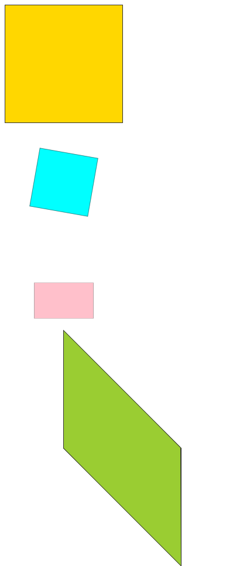

```html
<!DOCTYPE html>
<html lang="en">
<head>
    <meta charset="UTF-8">
    <title>Document</title>
    <style type="text/css">
        .box0, .box1, .box2, .box3{
            width: 200px;
            height: 200px;
            background-color: gold;
            border: 1px solid #333;

            transition: all 1s ease;
        }
        .box1:hover{
            /* 用浏览器加了一个虚拟层来渲染效果，不影响文档流 */
            /* 原来的位置还是占着 */
            /* 后面用js也可以做，会影响文档流 */
            transform: rotate(10deg) scale(0.5);
            background-color: cyan;
        }
        .box2:hover{
            transform: scale(0.5,0.3);
            /* transform: scale(0.5); */
            background-color:pink;
        }
        .box3:hover{
            /* skew, y轴绕中心，向上移动，直到和之前的x成45deg */
            transform: translate(100px,50px) skew(0deg,45deg);
            background-color: yellowgreen;
        }
    </style>
</head>
<body>
    <div class="box0"></div>
    <div class="box1"></div>
    <div class="box2"></div>
    <div class="box3"></div>
</body>
</html>
```

### perspective, rotateX

perspective的本质：近大远小；

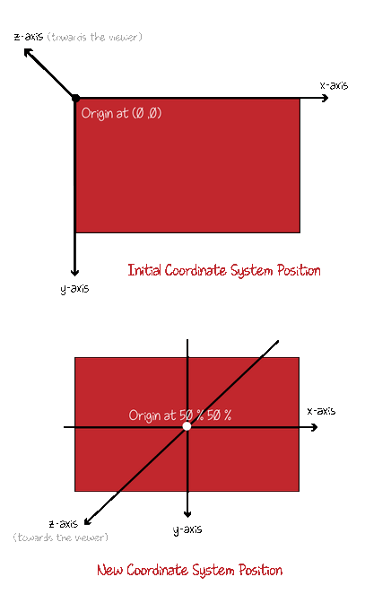

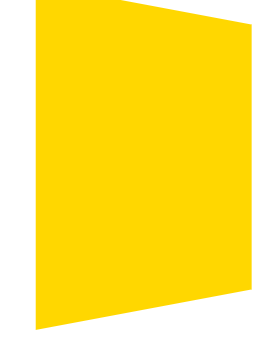

```html
<!DOCTYPE html>
<html lang="en">
<head>
    <meta charset="UTF-8">
    <title>Document</title>
    <style>
        .box1{
            width: 300px;
            height: 300px;
            background-color: gold;

            transition: all 500ms ease;
            
            /* 默认根据下面的会自动选择flat or preserve-3D */
            /* transform-style: preserve-3d; */

            /* 没有设置初始值，会出现突然的变化，所以也需要设置 */
            /* 顺时针方向 */
            transform: perspective(800px) rotateY(0deg);
        }
        .box1:hover{
            /* 要用rotateX必须要设置透视距离，经验值800px */
            transform: perspective(800px) rotateY(45deg);
        }
    </style>
</head>
<body>
    <div class="box1"></div>    
</body>
</html>
```

可以设置`transform-origin`

```css
.box1{
    width: 300px;
    height: 300px;
    background-color: gold;
    transition: all 500ms ease;
    
    /* transform-origin: 10% 10%; */
    transform-origin: left top;
    transform: perspective(800px) rotateY(0deg);
}
.box1:hover{
    transform: perspective(800px) rotateY(45deg);
}
```

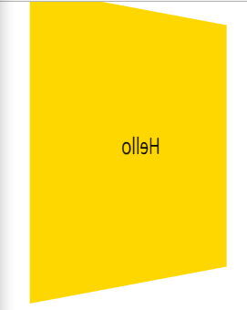

```html
<!DOCTYPE html>
<html lang="en">
<head>
    <meta charset="UTF-8">
    <title>Document</title>
    <style>
        .box1{
            width: 300px;
            height: 300px;
            background-color: gold;

            transition: all 500ms ease;
            transform: perspective(800px) rotateY(0deg);
            /* 默认是visible, 转过180deg可以看见背面 */
            /* backface-visibility: hidden; */

            text-align: center;
            font:24px/300px 'Microsoft Yahei';
        }
        .box1:hover{
            transform: perspective(800px) rotateY(225deg);
        }
    </style>
</head>
<body>
    <div class="box1">Hello</div>    
</body>
</html>
```

`body`的区域就是将所有element放进去之后的区域，并不是浏览器的窗口区域；

```html
<!-- 正面为图，背面为字 -->

<!DOCTYPE html>
<html lang="en">
<head>
    <meta charset="UTF-8">
    <title>Document</title>
    <style>
        .con{
            width: 180px;
            height: 180px;
            position: relative;

            transform: perspective(800px) rotateY(0deg);
        }
        .pic, .info{
            width: 180px;
            height: 180px;
            position: absolute;
            left: 0;
            top: 0;

            backface-visibility: hidden;
            transform: perspective(800px) rotateY(0deg);
            transition: all 1s ease;
        }
        .info{
            background-color: gold;
            text-align: center;
            font:24px/180px 'Microsoft Yahei';

            transform: translateZ(10px) rotateY(180deg);
        }
        .con:hover .pic{
            transform: translateZ(10px) rotateY(180deg);
        }
        .con:hover .info{
            transform: translateZ(10px) rotateY(0deg);
        }
    </style>
</head>
<body>
    <div class="con">
        <div class="pic"></div>
        <div class="info">Hello</div>
    </div>    
</body>
</html>
```

## CSS3 Animation

transition需要触发，animation不需要触发

`animation:name duration timing-function delay iteration-count direction;`

```html
<!DOCTYPE html>
<html lang="en">
<head>
    <meta charset="UTF-8">
    <title>Document</title>
    <style>
        .box1{
            width: 100px;
            height: 100px;
            background-color: gold;
            
            /* alternate表示原路返回 */
            /* 6表示3个来回 */
            /* animation: animation01 1s ease 6 alternate; */
            /* animation: animation01 1s ease 0s 6 alternate; */
            animation: animation01 1s ease 0s infinite alternate;

            /* 一开始静止，hover之后running */
            animation-play-state: paused;
        }
        .box1:hover{
            animation-play-state: running;
        }
        @keyframes animation01 {
            from{
                width: 100px;
            }
            to{
                width: 500px;
            }
        }
    </style>
</head>
<body>
    <div class="box1"></div>
</body>
</html>
```

animation-fill-mode 动画前后的状态:

- none 不改变默认行为
- forwards 当动画完成后，保持最后一帧(根据重复的次数，选择from或者to中的一个)
- backwards 在 animation-delay 所指定的一段时间内，动画的第一帧(from里面的内容)
- both: forwards+bacwards

### walking example

用图片做动画：可以用内容图片(`position`)来做，或者背景图片(`background-position`)来做；

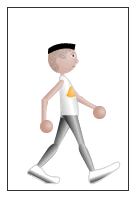

```html
<!DOCTYPE html>
<html lang="en">
<head>
    <meta charset="UTF-8">
    <title>Document</title>
    <style>
        .box1{
            /* 8帧都在一个960x182的png上 */
            width: 120px;
            height: 182px;
            border: 1px solid #333;
            
            /* 一桢的动画要藏起其他的地方 */
            overflow: hidden;

            position: relative;
        }
        .box1 img{
            position: absolute;
            left: 0;
            top: 0;

            animation: walking 2s steps(8) infinite;
        }

        @keyframes walking {
            from{
                left: 0px;
            }
            to{
                left: -960px;
            }
        }
    </style>
</head>
<body>
    <div class="box1"></div>    
</body>
</html>
```

### multi-state animation

```css
.box1{
    width: 100px;
    height: 100px;
    background-color: gold;
    animation: moving 1s infinite;
}
@keyframes moving {
    0%{
        transform: translateY(0px)
    }
    20%{
        transform: translateY(0px)
    }
    50%{
        transform: translateY(300px)
    }
    80%{
        transform: translateY(0px)
    }
    /* 相当于运行了800ms其他200ms时间都是等待 */
}
```

```css
<style>
    .box1{
        width: 100px;
        height: 100px;
        background-color: gold;
        animation: moving 1s both;
    }
    @keyframes moving {
        0%{
            transform: translateY(0px)
        }
        20%{
            /* 200ms的时候的动作 */
            transform: translateY(0px)
        }
        50%{
            /* 500ms的时候的动作 */
            transform: translateY(300px)
        }
        100%{
            /* 这个是给auto-fill-mode的both最后一帧用的 */
            transform: translateY(0px);
            border-radius: 50%;
            background-color: red;
        }
    }
</style>
```

### loading animation example

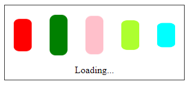

```html
<!DOCTYPE html>
<html lang="en">
<head>
    <meta charset="UTF-8">
    <title>Document</title>
    <style>
        .box1{
            width: 300px;
            height: 125px;
            border: 1px solid #333;
        }
        .box1 p{
            text-align: center;
            margin: 0;
        }
        .box1 div{
            width: 30px;
            height: 70px;
            float: left;
            margin: 15px;
            border-radius: 10px;
        }
        .box1 div:nth-child(1){
            background-color: red;
            animation: loading 500ms ease 0s infinite alternate;
        }
        .box1 div:nth-child(2){
            background-color: green;
            /* 延迟是为了有错开的效果 */
            animation: loading 500ms ease 100ms infinite alternate;
        }
        .box1 div:nth-child(3){
            background-color: pink;
            animation: loading 500ms ease 200ms infinite alternate;
        }
        .box1 div:nth-child(4){
            background-color: greenyellow;
            animation: loading 500ms ease 300ms infinite alternate;
        }
        .box1 div:nth-child(5){
            background-color: cyan;
            animation: loading 500ms ease 400ms infinite alternate;
        }

        @keyframes loading {
            from{
                transform: scaleY(1)
            }
            to{
                transform: scaleY(0.5)
            }
        }
    </style>
</head>
<body>
    <div class="box1">
        <div></div>
        <div></div>
        <div></div>
        <div></div>
        <div></div>
        <p>Loading...</p>
    </div>
</body>
</html>
```

## CSS3 browser prefix

用的是vscode的**autoprefixer**, 只能对于css文件作用; 可以对**setting.json**修改支持的浏览器`["last 2 versions", "> 5%"]`

但是最好的办法还是直接用**gulp**来执行命令

```css
/* 未加前 */
.box1{
    width: 200px;
    height: 150px;   
    background-color: gold;
    transform: scale(0.5);
}
```

```css
/* F1, autoprefixer, 加入后 */
.box1{
    width: 200px;
    height: 150px;   
    background-color: gold;
    -webkit-transform: scale(0.5);
            transform: scale(0.5);
}
```

## HTML5 not important

### H5 New tags

新增的H5标签, PC端不用(因为又可能不兼容)，即便是引入`<script type="text/javascript" src="//cdn.bootcss.com/html5shiv/r29/html5.js"></script>`， 效果也不是很好，用于面试

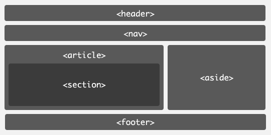

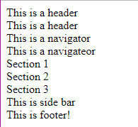

```html
<!DOCTYPE html>
<html lang="en">
<head>
    <meta charset="UTF-8">
    <title>Document</title>
</head>
<body>
    <!-- header, 方便搜索引擎，相当于用div -->
    <header>This is a header</header>    
    <div class="headder">This is a header</div>

    <!-- nav -->
    <nav>This is a navigator</nav>
    <div class="nav">This is a navigateor</div>

    <!-- article, section -->
    <article>
        <section>Section 1</section>
        <section>Section 2</section>
        <section>Section 3</section>
    </article>

    <!-- side bar -->
    <aside>This is side bar</aside>

    <!-- footer, 页脚的版权信息 -->
    <footer>
        This is footer!
    </footer>
</body>
</html>
```

### H5 new forms

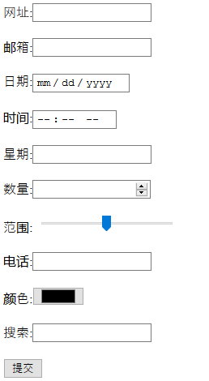

```html
<!DOCTYPE html>
<html lang="en">
<head>
    <meta charset="UTF-8">
    <title>Document</title>
</head>
<body>
    <form action="">
        <!-- 这些东西在不同浏览器看到的效果不一样 -->
        <!-- 产品设计的时候不允许这样，界面要统一 -->
        <!-- 而且不好用样式来控制它们，需要自己做效果 -->
        <label>网址:</label><input type="url" name="" required><br><br> 
        <label>邮箱:</label><input type="email" name="" required><br><br> 
        <label>日期:</label><input type="date" name=""><br><br> 
        <label>时间:</label><input type="time" name=""><br><br> 
        <label>星期:</label><input type="week" name=""><br><br> 
        <label>数量:</label><input type="number" name=""> <br><br>
        <label>范围:</label><input type="range" name=""><br><br> 
        <label>电话:</label><input type="tel" name=""><br><br> 
        <label>颜色:</label><input type="color" name=""><br><br> 
        <label>搜索:</label><input type="search" name=""><br><br>
        <input type="submit" value="提交">
    </form>
</body>
</html>
```

新增常用表单控件属性：

- placeholder 设置文本框默认提示文字
- autofocus 自动获得焦点
- autocomplete 联想关键词

```html
<!DOCTYPE html>
<html lang="en">
<head>
    <meta charset="UTF-8">
    <title>Document</title>
</head>
<body>
    <!-- autocomplete就是输入框的联想词 -->
    <!-- 联想之前的用户名，或者根据之前输入的内容联想，比如odaydown的联想词功能 -->
    <!-- 百度的autocomplete也是off, 它是根据数据库读取然后返回的值 -->
    <input type="text" placeholder="用户名" autofocus="autofocus" autocomplete="off">
</body>
</html>
```

### H5 audio & video

html5增加了audio和video标签，提供了在页面上插入音频和视频的标准方法。

支持的格式:

- audio: mp3(wav经过3次压缩得到mp3), wav, ogg
- video: mp4, webM, ogg(然而国内用的是flv格式)

```html
<!DOCTYPE html>
<html lang="en">
<head>
    <meta charset="UTF-8">
    <title>Document</title>
</head>
<body>
    <!-- audio的图标在不同浏览器中的样子是不一样的，所以不能用于网页上面 -->
    <!-- firefox可以调节播放速度,chorme不行 -->
    <!-- preload是预先加载 -->
    <!-- 默认静音 -->
    <audio src="media/audio.mp3" autoplay controls loop preload="auto" muted>
        
    </audio>
</body>
</html>
```

```html
<!-- 第一个不兼容播放第二个wav -->
<!-- 防止格式不兼容 -->
<audio  autoplay controls loop preload>
    <source src="media/audio.mp3" type="">
    <source src="media/audio02.wav" type="">
</audio>
```

```html
<!DOCTYPE html>
<html lang="en">
<head>
    <meta charset="UTF-8">
    <title>Document</title>
</head>
<body>
    <!-- firefox不支持这种视频 -->
    <video autoplay controls loop preload="auto" muted width="400" height="300">
        <source src="media/movie.mp4" type="">
    </video>
</body>
</html>
```

因为国内用的都是flv, 所以用的都是第三方播放器，用他们写好的js播放器来播放(既兼容flv,又兼容h5): 

- cyberplayer: baidu的
- tencentplayer
- youkuplayer

## H5 for app

H5的页面放到很多地方可以放到wechat, android, ios，甚至直接打包成app

- Native App
- Hybrid App: Native+H5
- Web App: 完全使用H5界面+js框架(angular io)来开发的app, H5的终极目标

对于Web App的js框架

- angular是一个框架，angular io是针对移动端的框架；
- react, react native分别针对pc, mobile

Native App比Web App稍微快，然而现在性能都不是问题；

### viewport

```html
<!DOCTYPE html>
<html lang="en">
<head>
    <meta charset="UTF-8">
    <title>Document</title>
    <style>
        body{
            margin: 0;
        }
        .header{
            height: 50px;
            background-color: gold;
            text-align: center;
            font: 30px/50px 'Microsoft Yahei';
        }        
    </style>
</head>
<body>
    <div class="header">页面头部</div>
</body>
</html>
```

比如同样一个东西，用F12查看手机端的效果，会比直接调节浏览器尺寸到相同的时候小；

因为移动端过程：现在虚拟的浏览器(viewport, height=980px)中渲染，然后根据屏幕尺寸整体缩放到手机屏幕上；所以需要将viewport设置成手机屏幕的宽度，就不会缩放了；

需要这么一句`<meta name="viewport" content="width=device-width, initial-scale=1.0">`, 快捷键`meta:vp`

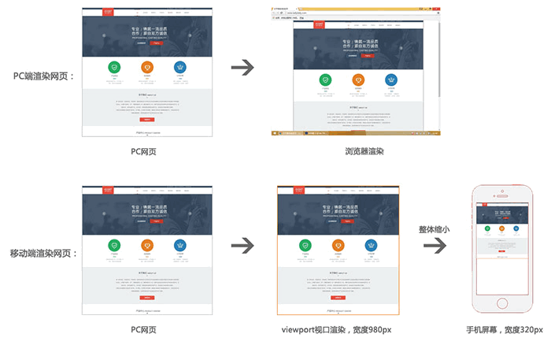

### retina

retina屏幕和普通屏幕显示效果一样，多大就显示多大；

视网膜屏(retina): DPR:2(甚至有DPR:3); 像素密度比一般屏幕大一倍；所以一个图像的像素要对应4个屏幕像素(图像发虚)；其实也可以不解决这个问题(顶多是iphone发虚而已，iphone上显示的大小还是正常，其他的设备正常)

为了解决这个问题，用大一倍的图片，然后用css压缩图片尺寸到目标尺寸；比如为了在retina上面显示1600x900图片，需要3200x1800的图片

```html
<!DOCTYPE html>
<html lang="en">
<head>
    <meta charset="UTF-8">
    <meta name="viewport" content="width=device-width, initial-scale=1.0">
    <meta http-equiv="X-UA-Compatible" content="ie=edge">
    <title>Document</title>
    <style>
        .retina_pic{
            width: 300px;
            height: 215px;
        }
    </style>
</head>
<body>
    
    
</body>
</html>
```

DRP:3的retina屏幕直接用DPR:2的图来代替，人眼无法看出发虚的现象；

css2无法做到缩放background的大小，css3是用`background-size`实现了background的缩放；

background-size:

- length：用长度值指定背景图像大小。不允许负值。
- percentage：用百分比指定背景图像大小。不允许负值。
- auto：背景图像的真实大小。
- cover：将背景图像等比缩放到完全覆盖容器，背景图像有可能超出容器。
- contain：将背景图像等比缩放到宽度或高度与容器的宽度或高度相等，背景图像始终在容器内。

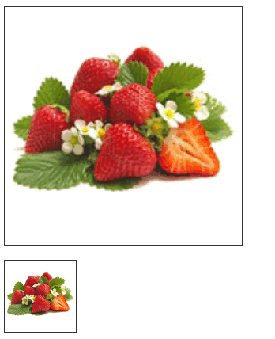

```html
<!DOCTYPE html>
<html lang="en">
<head>
    <meta charset="UTF-8">
    <meta name="viewport" content="width=device-width, initial-scale=1.0">
    <meta http-equiv="X-UA-Compatible" content="ie=edge">
    <title>Document</title>
    <style>
        /* 背景图的原始尺寸180px 180px */
        .box1{
            width: 300px;
            height: 300px;
            border: 1px solid #333;
            background: url(images/goods_pic.jpg) no-repeat;

            background-size: 300px 300px;
        }
        .box2{
            /* 一般都是缩小来适配的 */
            width: 90px;
            height: 90px;
            border: 1px solid #333;
            background: url(images/goods_pic.jpg) no-repeat;

            background-size: 100% 100%;
        }
    </style>
</head>
<body>
    <div class="box1"></div>
    <br>
    <div class="box2"></div>
</body>
</html>
```

### layout

页面适配方案：

- 全适配(PC+mobile): 流式布局+响应式布局(比如框架bootstrap)
- 移动端适配
    - 流式布局+少量响应式
    - 基于rem的布局(常用)
    - 弹性盒模型(Flex Box)

[bootstrap](http://www.bootcss.com/): 根据不同的宽度会变化布局

淘宝的做法：做了两套页面，pc一套, mobile一套;

#### Flow layout

流式布局：高度不管，宽度用百分比做

如果没有border

```html
<!DOCTYPE html>
<html lang="en">
<head>
    <meta charset="UTF-8">
    <meta name="viewport" content="width=device-width, initial-scale=1.0">
    <meta http-equiv="X-UA-Compatible" content="ie=edge">
    <title>Document</title>
    <style>
        body{
            margin: 0;
        }
        ul{
            list-style: none;
            padding: 0;
        }
        .menu{
            height: 50px;
        }
        .menu li{
            float: left;
            background-color: gold;

            width: 25%;
            height: 50px;
            text-align: center;
            line-height: 50px;
        }
    </style>
</head>
<body>
    <ul class="menu">
        <li><a href="">菜单文字</a></li>
        <li><a href="">菜单文字</a></li>
        <li><a href="">菜单文字</a></li>
        <li><a href="">菜单文字</a></li>
    </ul>
</body>
</html>
```

如果有border, 解决办法1:`calc()`

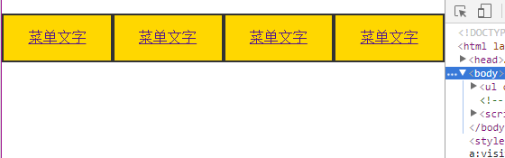

```css
body{
    margin: 0;
}
ul{
    list-style: none;
    padding: 0;
}
.menu{
    height: 50px;
}
.menu li{
    float: left;
    background-color: gold;
    border: 2px solid #333;
    width: calc(25% - 4px);
    height: 50px;
    text-align: center;
    line-height: 50px;
}
```

如果有border, 解决办法2:`box-sizing`

box-sizing:

- content-box 默认的盒子尺寸计算方式
- border-box 置盒子的尺寸计算方式为从边框开始

```css
body{
    margin: 0;
}
ul{
    list-style: none;
    padding: 0;
}
.menu{
    height: 50px;
}
.menu li{
    box-sizing: border-box;
    float: left;
    background-color: gold;
    border: 2px solid #333;
    width: 25%;
    height: 50px;
    text-align: center;
    line-height: 50px;
}
```

#### Responsive layout

响应式布局：根据**媒体查询**给不同的样式

```html
<!DOCTYPE html>
<html lang="en">
<head>
    <meta charset="UTF-8">
    <meta name="viewport" content="width=device-width, initial-scale=1.0">
    <meta http-equiv="X-UA-Compatible" content="ie=edge">
    <title>Document</title>
    <style>
        body{
            margin: 0;
        }
        ul{
            list-style: none;
            padding: 0;
        }
        .con{
            border: 1px solid #333;
            overflow: hidden;
        }
        .con li{
            float: left;
            background-color: gold;
            width: 23%;
            height: 200px;
            margin: 30px 1%;
            text-align: center;
            line-height: 200px;
        }
        @media (max-width: 800px) {
            /* width<800px, 一行只排两个 */
            .con li{
                width: 46%;
                margin: 30px 2%;
            }
        }
        @media (max-width: 500px) {
            /* width<500px 一行只有一个 */
            .con li{
                width: 90%;
                margin: 30px 5%;
            }
        }
    </style>
</head>
<body>
    <ul class="con">
        <li><a href="">菜单文字</a></li>
        <li><a href="">菜单文字</a></li>
        <li><a href="">菜单文字</a></li>
        <li><a href="">菜单文字</a></li>
    </ul>
</body>
</html>
```

#### applayout: flow+responsive

一般UI设计师对于app的效果图的宽度都是750px(也就是iphone的375px的两倍，方便retina适配)

流式布局只能宽度的缩放，高度无法改变；rem可以做到width, height同时缩放；

app flow layout:(用得比较少，现在主流是rem)


```bash
mobile/
    css
        reset.css
        index.css
    images
    index.html
```

```html
<!-- index.html -->
<!DOCTYPE html>
<html lang="en">
<head>
    <meta charset="UTF-8">
    <meta name="viewport" content="width=device-width, initial-scale=1.0">
    <meta http-equiv="X-UA-Compatible" content="ie=edge">
    <link rel="stylesheet" href="css/reset.css">
    <link rel="stylesheet" href="css/index.css">
    <title>天天生鲜-首页</title>
</head>
<body>
    <!-- 因为一般mobile是2倍的图，所以高度要做50%，宽度不用管 -->
    <div class="main_wrap">
        <!-- header -->
       <div class="header clearfix">
            <a class="logo" href=""></a>
            <a class="search" href=""></a>
       </div>
        <!--center  -->
       <div class="center_wrap">
           <!-- center slide -->
           <div class="slide">
               
           </div>
           <!-- center menu -->
           <ul class="menu">
                <li>
                    <a href=""></a>
                    <h2>水果</h2>
                </li>
                <li>
                    <a href=""></a>
                    <h2>海鲜</h2>
                </li>
                <li>
                    <a href=""></a>
                    <h2>肉类</h2>
                </li>
                <li>
                    <a href=""></a>
                    <h2>禽蛋</h2>
                </li>
                <li>
                    <a href=""></a>
                    <h2>蔬菜</h2>
                </li>
                <li>
                    <a href=""></a>
                    <h2>速冻</h2>
                </li>
                <li>
                    <a href=""></a>
                    <h2>热卖</h2>
                </li>
                <li>
                    <a href=""></a>
                    <h2>新品</h2>
                </li>
            </ul>
            <!-- center detail -->
            <div class="common_model_con clearfix">
                <div class="common_title">
                    <h3 class="fl">新鲜水果</h3>
                    <a class="fr" href="">更多 &gt;</a>
                </div>
                <div class="common_goods_list">
                    <div class="banner"><a href=""></a></div>
                    <ul class="goods_list">
                        <li>
                            <a href="">
                                
                            </a>
                            <h4>新西兰皇家...</h4>
                            <div class="price">
                                <div>
                                    <p>12/提</p>
                                    <span>￥68.00</span>
                                </div>
                                <a href=""></a>
                            </div>
                        </li>
                        <li>
                            <a href="">
                                
                            </a>
                            <h4>新西兰皇家...</h4>
                            <div class="price">
                                <div>
                                    <p>12/提</p>
                                    <span>￥68.00</span>
                                </div>
                                <a href=""></a>
                            </div>
                        </li>
                        <li>
                            <a href="">
                                
                            </a>
                            <h4>新西兰皇家...</h4>
                            <div class="price">
                                <div>
                                    <p>12/提</p>
                                    <span>￥68.00</span>
                                </div>
                                <a href=""></a>
                            </div>
                        </li>
                    </ul>
                </div>
            </div>
       </div>
       <!-- footer -->
       <div class="footer">
           <ul class="footer_menu">
               <li>
                   <a href=""></a>
                   <h2>首页</h2>
               </li>
               <li>
                   <a href=""></a>
                   <h2>分类</h2>
               </li>
               <li>
                   <a href=""></a>
                   <h2>购物车</h2>
               </li>
               <li>
                   <a href=""></a>
                   <h2>我的</h2>
               </li>
           </ul>
       </div>
    </div>
</body>
</html>
```

```css
/* reset.css */
body{
    font-family: 'Microsoft Yahei';
}
body,p,h1,h2,h3,h4,h5,h6,ul,dl,dd,input,form,select{
    margin: 0;
    padding: 0;
}
h1,h2,h3,h4,h5,h6{
    /* 可以继承body全局的字体大小 */
    font-size: 100%;
}
ul{
    list-style: none;
}
a{
    text-decoration: none;
}
img{
    border: 0;
}
em{
    font-style: normal;
}
/* 清除margin-top塌陷 */
.clearfix:before{
    content: "";
    display:table;
}
/* 清除浮动，撑不开 */
.clearfix::after{
    content: "";
    display: table;
    clear: both;
}
/* 兼容id */
.clearfix{
    zoom: 1;
}
.fl{
    float: left;
}
.fr{
    float: right;
}
```

```css
/* index.css */
/* 定大的布局，三块 */
/* header,center,footer */
.main_wrap{
    /* bug: 底部菜单positiion:fixed在wechat点击可能失效，所以要用absolute */
    position: absolute;
    background-color: gold;
    /* 通过下面这种方式，使得main_wrap覆盖整个body */
    /* 可以不用设置width, height */
    left: 0;
    right: 0;
    top: 0;
    bottom: 0;
}
.header{
    height: 50px;
    /* width继承main_wrap的100% */
    background-color: #37ab40;

    /* 为了给search定位 */
    position: relative;
}
.center_wrap{
    position: absolute;
    left: 0;
    right: 0;
    top: 50px;
    bottom: 50px;
    background-color: #efefef;
    /* 这个区域可以滚动，所以需要设置 */
    /* 横向没有滚动条，纵向长了之后自动出现滚动条 */
    overflow-x: hidden;
    overflow-y: auto;
}
.footer{
    position: absolute;
    /* fixed, absolute定位之后变成了inline-block,width由内容决定 */
    height: 50px;
    width: 100%;
    bottom: 0;
    background-color: #fff;

}


/* header */
.header .logo{
    display: block;
    width: 89px;
    height: 36px;
    margin: 7px auto; 
}
.header .logo img{
    /* 图片给with or height中的任意一个，另一个自动缩放 */
    width: 100%;
}
.header .search{
    position: absolute;
    width: 27px;
    height: 27px;

    right: 15px;
    top: 12px;
    /* 不用float的原因是logo不是float */
    background: url(../images/icons.png) left top no-repeat;
    background-size: 60px 840px;
}


/* center */
/* center menu */
.center_wrap .slide img{
    width: 100%;
}
.menu{
    height: 173px;
    background-color: #fff;
    margin-top: 10px;
    padding-top: 12px;
}
.menu li{
    float: left;
    width: 25%;
    height: 81px;
    /* background-color: yellowgreen; */
}
.menu li h2{
    height: 26px;
    font: bold 13px/26px 'Microsoft Yahei';
    text-align: center;
}
.menu li a{
    display: block;
    width: 55px;
    height: 55px;
    margin: 0 auto;
    
    background: url(../images/icons.png) left -60px no-repeat;
    background-size: 60px 840px;
}
.menu li:nth-child(2) a{
    background-position: left -120px;
}
.menu li:nth-child(3) a{
    background-position: left -180px;
}
.menu li:nth-child(4) a{
    background-position: left -240px;
}
.menu li:nth-child(5) a{
    background-position: left -300px;
}
.menu li:nth-child(6) a{
    background-position: left -360px;
}
.menu li:nth-child(7) a{
    background-position: left -420px;
}
.menu li:nth-child(8) a{
    background-position: left -480px;
}


/* center detail */
.common_model_con{
    height: 320px;
    margin: 10px auto;
    padding: 0 10px;
    background-color: #fff;
}
.common_model_con .common_title{
    height: 16px;
    margin: 10px auto;
    border-left: 4px solid #FCD361;
}
.common_model_con .common_title h3{
    height: 16px;
    font: bold 14px/16px 'Microsoft Yahei';
    color: #FCD361;
    text-indent: 8px;
}
.common_model_con .common_title a{
    font: 12px/16px 'Microsoft Yahei';
    color: #949392;
}
.common_model_con .common_goods_list{
    height: 284px;
}
.banner img{
    width: 100%;
}
/* goods list */
.goods_list{
    margin: 10px auto;
}
.goods_list li{
    float: left;
    width: 28%;
    /* background-color: yellowgreen; */
    margin: 0 2.5%;
}
.goods_list li:nth-child(1){
    border-right: 1px solid #f6f6f6;
}
.goods_list li:nth-child(2){
    border-right: 1px solid #f6f6f6;
}
.goods_list li a{
    display: block;
    margin: 0 auto;
}
.goods_list li img{
    width: 100%;
}
.goods_list h4{
    font: 14px/16px 'Microsoft Yahei';
    color: #7a7a7a;
}
.goods_list .price{
    margin-top: 10px;
    position: relative;
}
.price div{
    float: left;
    font: 12px/12px 'Microsoft Yahei';
}
.price dive p{
    color: #949392;
}
.price div span{
    color: red;
}


.goods_list div a{
    display: block;
    float: right;
    width: 40px;
    height: 40px;
    
    background: url(../images/icons.png) left -540px no-repeat;
    background-size: 60px 840px;
} 

/* footer */
.footer_menu{
    height: 40px;
    margin: 5px auto;
}
.footer_menu li{
    float: left;
    width: 25%;
    /* background-color: yellowgreen; */
}
.footer_menu li h2{
    height: 10px;
    color: #949392;
    font:10px/10px 'Microsoft Yahei';
    text-align: center;
}
.footer_menu li a{
    display: block;
    width: 30px;
    height: 30px;
    margin: 0 auto;

    background: url(../images/icons.png) left -600px no-repeat;
    background-size: 60px 840px;
}
.footer_menu li:nth-child(2) a{
    background-position: left -660px;
}
.footer_menu li:nth-child(3) a{
    background-position: left -720px;
}
.footer_menu li:nth-child(4) a{
    background-position: left -780px;
}
```

#### applayout: rem layout

chrome有一个最小字体限制(12px)，所以即便是设置了10px还是按照12px来渲染；

what is **em**: 如果一个`{}`内设置了`font-size:20px`, 那么`1em=20px`;是相对于自身的一个单位

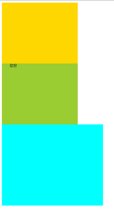

```html
<!DOCTYPE html>
<html lang="en">
<head>
    <meta charset="UTF-8">
    <meta name="viewport" content="width=device-width, initial-scale=1.0">
    <meta http-equiv="X-UA-Compatible" content="ie=edge">
    <title>Document</title>
    <style>
        .box1{
            width: 300px;
            height: 240px;
            background-color: gold;
            font-size: 15px;

        }
        .box2{
            /* 这里的1em=15px */
            /* 默认字体为16px, 所以默认1em=16px */
            /* 所以调节font-size相当于可以改变盒子的height, width,margin.... */
            width: 20em;
            height: 16em;
            background-color: yell owgreen;
            font-size: 15px;
            
            /* em的用途最主要在text-indent */
            text-indent: 2em;
        }
        .box3{
            width: 20em;
            height: 16em;
            background-color: cyan;
            font-size: 20px;
        }
    </style>
</head>
<body>
    <div class="box1"></div>
    <div class="box2">你好</div>
    <div class="box3"></div>
</body>
</html>
```

**em**是相对自身的一个量，如果有一个全局的**em**，那么可以通过修改`font-size`来修改所有的width, height, margin, padding; 于是便产生了**rem**, 调节一个`font-size`可以影响到所有的大小

rem指的是参照根节点的文字大小，根节点指的是html标签(`<html></html>`)，设置html标签的文字大小

为了实现动态地根据设备的尺寸调节`font-size`, 进而调节所有的大小，那么需要一个js

```js
// set_root.js
// 也是以iphone的为基准来弄的
(function(){
	var calc = function(){
		var docElement = document.documentElement;
		var clientWidthValue = docElement.clientWidth > 750 ? 750 : docElement.clientWidth;
		docElement.style.fontSize = 20*(clientWidthValue/375) + 'px';
	}
	calc();
	window.addEventListener('resize',calc);
})();
```

```html
<!-- 用之前的mobile的例子做实验 -->
<!DOCTYPE html>
<html lang="en">
<head>
    <meta charset="UTF-8">
    <meta name="viewport" content="width=device-width, initial-scale=1.0">
    <meta http-equiv="X-UA-Compatible" content="ie=edge">
    <link rel="stylesheet" href="css/reset.css">
    <link rel="stylesheet" href="css/index.css">
    <!-- 这样引入 -->
    <script src="js/set_root.js"></script>
    <title>天天生鲜-首页</title>
</head>
```

`.less`, `.sass`是`.css`预编译的结果，性能更高；

#### rem example

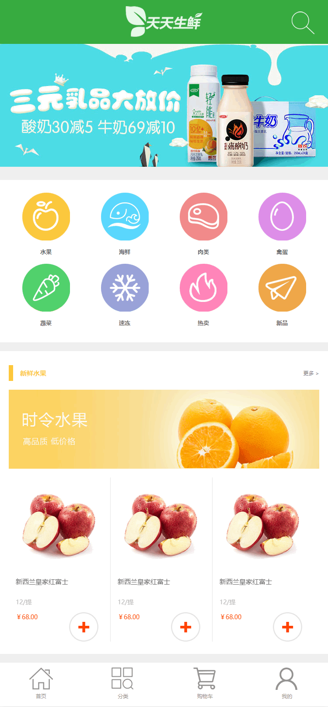

```bash
rem/
    css
        reset.css
        index.css
    images
    js
        # set_root.js的作用就是动态修改html标签的font-size
        set_root.js
    index.html
```

```html
<!-- index.html -->

<!DOCTYPE html>
<html lang="en">
<head>
    <meta charset="UTF-8">
    <meta name="viewport" content="width=device-width, initial-scale=1.0">
    <meta http-equiv="X-UA-Compatible" content="ie=edge">
    <link rel="stylesheet" href="css/reset.css">
    <link rel="stylesheet" href="css/index.css">
    <script src="js/set_root.js"></script>
    <title>天天生鲜-首页</title>
</head>
<body>
    <div class="main_wrap">
        <!-- header -->
        <div class="header clearfix">
            <a href="" class="logo"></a>
            <a href="" class="search"></a>
        </div>
        <!-- center -->
        <div class="center_wrap">
            <!-- slide -->
            <div class="slide">
                
            </div>
            <!-- menu -->
            <div class="menu_con clearfix">
                <ul class="menu">
                    <li>
                        <a href=""></a>
                        <h2>水果</h2>
                    </li>
                    <li>
                        <a href=""></a>
                        <h2>海鲜</h2>
                    </li>
                    <li>
                        <a href=""></a>
                        <h2>肉类</h2>
                    </li>
                    <li>
                        <a href=""></a>
                        <h2>禽蛋</h2>
                    </li>
                    <li>
                        <a href=""></a>
                        <h2>蔬菜</h2>
                    </li>
                    <li>
                        <a href=""></a>
                        <h2>速冻</h2>
                    </li>
                    <li>
                        <a href=""></a>
                        <h2>热卖</h2>
                    </li>
                    <li>
                        <a href=""></a>
                        <h2>新品</h2>
                    </li>
                </ul>
            </div>
            <!-- model -->
            <div class="common_model clearfix">
                <div class="common_title">
                    <h3 class="fl">新鲜水果</h3>
                    <a href="" class="fr">更多 &gt;</a>
                </div>
                <div class="banner"></div>
                <ul class="goods_list">
                    <li>
                        <a href="" class="goods_pic"></a>
                        <h4 class="goods_name">新西兰皇家红富士</h4>
                        <p class="goods_unit">12/提</p>
                        <p class="goods_price">￥68.00</p>
                        <a class="add_cart" href=""></a>
                    </li>
                    <li>
                        <a href="" class="goods_pic"></a>
                        <h4 class="goods_name">新西兰皇家红富士</h4>
                        <p class="goods_unit">12/提</p>
                        <p class="goods_price">￥68.00</p>
                        <a class="add_cart" href=""></a>
                    </li>
                    <li>
                        <a href="" class="goods_pic"></a>
                        <h4 class="goods_name">新西兰皇家红富士</h4>
                        <p class="goods_unit">12/提</p>
                        <p class="goods_price">￥68.00</p>
                        <a class="add_cart" href=""></a>
                    </li>                        
                </ul>
            </div>
            <!-- 多个model的时候，会margin合并，还是有好处的 -->
            <div class="common_model clearfix">
                <div class="common_title">
                    <h3 class="fl">新鲜水果</h3>
                    <a href="" class="fr">更多 &gt;</a>
                </div>
                <div class="banner"></div>
                <ul class="goods_list">
                    <li>
                        <a href="" class="goods_pic"></a>
                        <h4 class="goods_name">新西兰皇家红富士</h4>
                        <p class="goods_unit">12/提</p>
                        <p class="goods_price">￥68.00</p>
                        <a class="add_cart" href=""></a>
                    </li>
                    <li>
                        <a href="" class="goods_pic"></a>
                        <h4 class="goods_name">新西兰皇家红富士</h4>
                        <p class="goods_unit">12/提</p>
                        <p class="goods_price">￥68.00</p>
                        <a class="add_cart" href=""></a>
                    </li>
                    <li>
                        <a href="" class="goods_pic"></a>
                        <h4 class="goods_name">新西兰皇家红富士</h4>
                        <p class="goods_unit">12/提</p>
                        <p class="goods_price">￥68.00</p>
                        <a class="add_cart" href=""></a>
                    </li>                        
                </ul>
            </div>
        </div>
        <!-- footer -->
        <div class="footer">
            <ul>
                <li>
                    <a href=""></a>
                    <h2>首页</h2>
                </li>
                <li>
                    <a href=""></a>
                    <h2>分类</h2>
                </li>
                <li>
                    <a href=""></a>
                    <h2>购物车</h2>
                </li>
                <li>
                    <a href=""></a>
                    <h2>我的</h2>
                </li>
            </ul>
        </div>
    </div>
</body>
</html>
```

```css
/* reset.css */

body{
    font-family: 'Microsoft Yahei';
}
body,p,h1,h2,h3,h4,h5,h6,ul,dl,dd,input,form,select{
    margin: 0;
    padding: 0;
}
h1,h2,h3,h4,h5,h6{
    /* 可以继承body全局的字体大小 */
    font-size: 100%;
}
ul{
    list-style: none;
}
a{
    text-decoration: none;
}
img{
    border: 0;
}
em{
    font-style: normal;
}
/* 清除margin-top塌陷 */
.clearfix:before{
    content: "";
    display:table;
}
/* 清除浮动，撑不开 */
.clearfix::after{
    content: "";
    display: table;
    clear: both;
}
/* 兼容id */
.clearfix{
    zoom: 1;
}
.fl{
    float: left;
}
.fr{
    float: right;
}
```

```css
/* index.css */

body{
    font-family: 'Microsoft Yahei';
}
.main_wrap{
    position: absolute;
    background-color: gold;
    left: 0;
    right: 0;
    top: 0;
    bottom: 0;
    /* max-width */
    max-width: 750px;
    margin: 0 auto;
}
.header{
    /* photoshop一般给的都是2倍的图 */
    /* js代码以20px为基准，所以可以直接根据photoshop测量值除以40，得到rem */
    /* 除以40可以通过插件px to rem来做 */
    height: 2.5rem;
    background-color: #37ab40;

    position: relative;
}
.center_wrap{
    position: absolute;
    left: 0;
    right: 0;
    top: 2.5rem;
    bottom: 2.5rem;
    background-color: #efefef;
    overflow-x: hidden;
    overflow-y: auto;
}
.footer{
    position: absolute;
    width: 100%;
    height: 2.5rem;
    bottom: 0;
    background-color: #fff;
}

/* header */
.header .logo{
    display: block;
    width: 4.45rem;
    height: 1.8rem;
    margin: 00.35rem auto;
}
.header .logo img{
    width: 100%;
}
.header .search{
    position: absolute;
    width: 1.35rem;
    height: 1.35rem;
    right: 0.75rem;
    top: 0.625rem;
    background: url(../images/icons.png) left top no-repeat;
    background-size: 3rem 42rem;
}

/* center */
.slide img{
    width: 100%;
}
.menu_con{
    height: 9.25rem;
    background-color: #fff;
    margin-top: 0.5rem;
}
.menu_con .menu{ 
    width: 16.25rem;
    height: 8.1rem;
    margin: 0.7rem auto 0;
    /* background-color: gold; */
}
.menu li{
    float: left;
    width: 2.75rem;
    height: 4.05rem;
    margin-right: 1.75rem;
}
.menu li:nth-child(4n){
    margin-right: 0;
}
.menu li a{
    display: block;
    width: 2.75rem;
    height: 2.75rem;

    background: url(../images/icons.png) left -3rem no-repeat;
    background-size: 3rem 42rem;
}
.menu li:nth-child(2) a{
    background-position: left -6rem;
}
.menu li:nth-child(3) a{
    background-position: left -9rem;
}
.menu li:nth-child(4) a{
    background-position: left -12rem;
}
.menu li:nth-child(5) a{
    background-position: left -15rem;
}
.menu li:nth-child(6) a{
    background-position: left -18rem;
}
.menu li:nth-child(7) a{
    background-position: left -21rem;
}
.menu li:nth-child(8) a{
    background-position: left -24rem;
}
.menu li h2{
    text-align: center;
    height: 1.3rem;
    /* 字体不要缩放，会产生模糊与锯齿 */
    font: bold 13px/1.3rem 'Microsoft Yahei';
    color: #666;
}
/* center model */
.common_model{
    margin: 0.5rem auto;
    background-color: #fff;
}
.common_title{
    width: 17.75rem;
    height: 0.9rem;
    margin: 0.8rem auto 0;
}
.common_title h3{
    border-left: 0.25rem solid #fbc83d;
    font: bold 15px/0.9rem 'Microsoft Yahei';
    color: #fbc83d;
    text-indent: 0.4rem;
}
.common_title a{
    font: 12px/0.9rem 'Microsoft Yahei';
    color: #7f7f7f;
}
.banner{
    width: 17.75rem;
    height: 4.5rem;
    margin: 0.5rem auto 0;
}
.banner img{
    width: 100%;
}
/* goods list */
.goods_list{
    /* background-color: gold; */
    width: 17.75rem;
    height: 9.35rem;
    margin: 0.5rem auto 0.7rem;
}
.goods_list li{
    float: left;
    width: 5.8rem;
    height: 9.35rem;
    border-right: 1px solid #e7e7e7;

    position: relative;    
}
.goods_list li:last-child{
    border-right: 0;
}
.goods_list li .goods_pic{
    display: block;
    width: 4.5rem;
    height: 4.5rem;
    margin: 0.5rem auto 0;
}
.goods_pic img{
    width: 100%;
}
.goods_list li .goods_name{
    width: 5rem;
    font: 15px/15px 'Microsoft Yahei';
    color: #666;
    margin: 0.75rem auto 0;

    /* 文本省略号 */
    overflow: hidden;
    white-space: nowrap;
    text-overflow: ellipsis;
}
.goods_list .goods_unit{
    width: 5rem;
    font: 12px/12px 'Microsoft Yahei';
    color: #bbb;
    margin: 0.8rem auto 0;
}
.goods_list .goods_price{
    width: 5rem;
    font: 12px/12px 'Microsoft Yahei';
    color: #f40;
    margin: 0.5rem auto 0;
}
.goods_list .add_cart{
    position: absolute;   
    right: 0.675rem;
    bottom: 0;
    width: 1.7rem;
    height: 1.7rem;
    /* background-color: gold; */

    background: url(../images/icons.png) left -27rem no-repeat;
    background-size: 3rem 42rem;
}
/* 小屏幕的字体不调节，大屏幕的字体变大 */
@media (min-width:375px){
    /* greater than 375，变成14px */
    .goods_list .goods_price{
        font: 14px/14px 'Microsoft Yahei';
    }
    .goods_list .goods_unit{
        font: 14px/14px 'Microsoft Yahei';
    }
}


/* footer */
.footer ul{
    height: 2.5rem;
}
.footer li{
    float: left;
    width: 25%;
    height: 2.5rem;
}
.footer li a{
    display: block;
    width: 1.375rem;
    height: 1.3rem;
    margin: 0.25rem auto 0;
    /* background-color: gold; */
    background: url(../images/icons.png) left -30rem no-repeat;
    background-size: 3rem 42rem;
}
.footer li:nth-child(2) a{
    background-position: left -33rem;
}
.footer li:nth-child(3) a{
    background-position: left -36rem;
}
.footer li:nth-child(4) a{
    background-position: left -39rem;
}
.footer li h2{
    font: 12px/12px 'Microsoft Yahei';
    color: #949392;
    text-align: center;
    margin-top: 0.2rem;
}
```

```js
// set_root.js
// 动态在html标签加入style='font-size=xxx px'
// 当浏览器的width>750, font-size就不变了，就是40px

(function(){
	var calc = function(){
		var docElement = document.documentElement;
		var clientWidthValue = docElement.clientWidth > 750 ? 750 : docElement.clientWidth;
		docElement.style.fontSize = 20*(clientWidthValue/375) + 'px';
	}
	calc();
	window.addEventListener('resize',calc);
})();
```