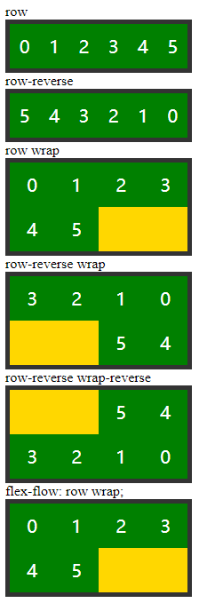
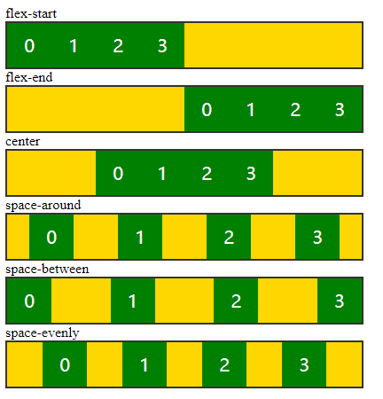
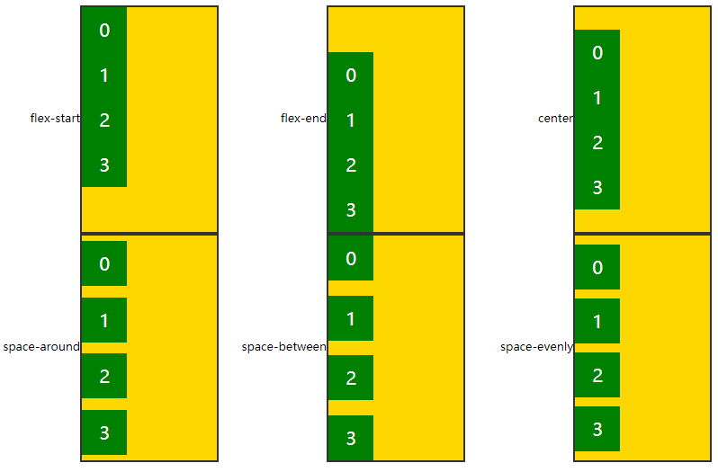
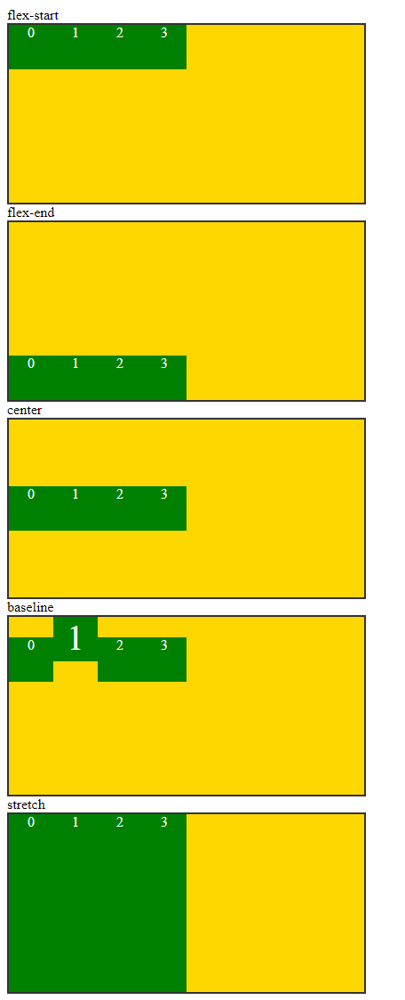
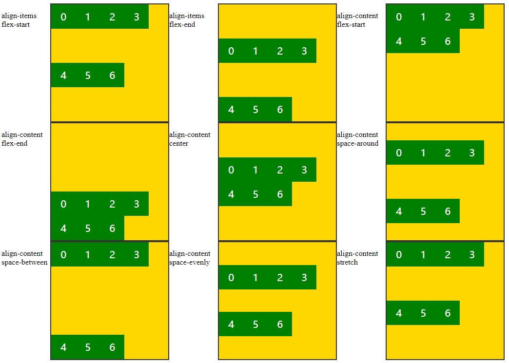
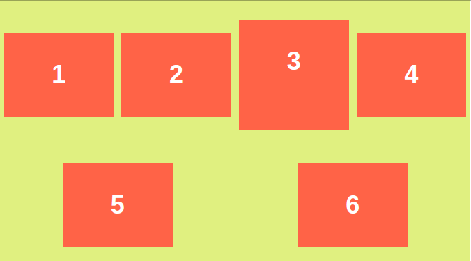
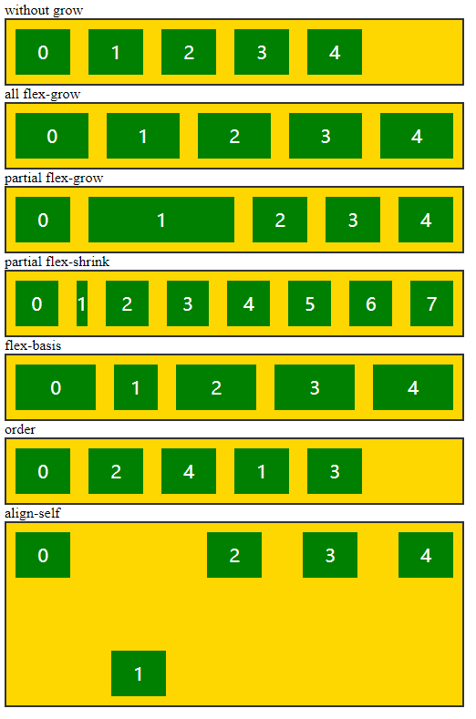
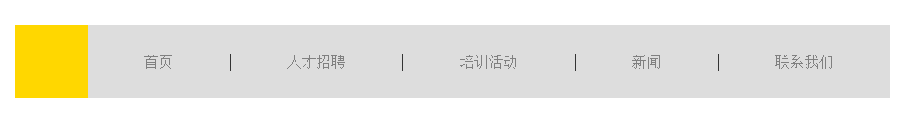

# CSS3 Flex-box layout(not important)

- [CSS3 Flex-box layout(not important)](#css3-flex-box-layoutnot-important)
    - [容器属性](#)
        - [单个元素排列的解决：flex-direction, flex-flow](#flex-direction--flex-flow)
        - [水平排列的解决：`justify-content`,利用了默认`flex-direction: row;`](#justify-content-flex-direction--row)
        - [垂直排列的解决：`justify` 需要另外`flex-direction: right;`](#justify-flex-direction--right)
        - [解决单行垂直整体排列的问题：`align-items`](#align-items)
        - [多行元素整体垂直方向的排列：`align-content`；](#align-content)
    - [条目属性](#)
    - [examples-menu](#examples-menu)

flex-box很强大，有一些无法实现rem layout, 稍微差一点; 经历了3次改版，坑；

主要还是利用**属性**来布局：

- 容器属性：父级的属性
- 条目属性：子元素的属性

将一个容器中的block变成横向排列:

- `float: left;` or `float: right`
- `display: inline-block;`
- `flow-direction: row;` or `flow-direction: row-reverse;`

## 容器属性

### 单个元素排列的解决：flex-direction, flex-flow



```html
<!DOCTYPE html>
<html lang="en">
<head>
    <meta charset="UTF-8">
    <meta name="viewport" content="width=device-width, initial-scale=1.0">
    <meta http-equiv="X-UA-Compatible" content="ie=edge">
    <title>Document</title>
    <style>
        ul{
            /* 父级：容器 */
            margin: 0;
            padding: 0;
            list-style: none;
            /* 没有给高度，所以是被撑开的 */
            width: 200px;
            border: 5px solid #333;
            background-color: gold;
        }
        ul li{
            /* 子级：条目 */
            width: 50px;
            height: 50px;
            /* margin: 10px; */

            text-align: center;
            font: 20px/50px 'Microsoft Yahei';
            color: #fff;
            background-color: green;
        }
        /* body different child */
        ul:nth-of-type(1){
            /* 声明用flex */
            /* 这个地方相当于转换成了inline-block, 但是没有小空格 */
            display: flex;
            /* 容器属性 */
            /* 默认flex-direction: column; */
            flex-direction: row;
        }
        ul:nth-of-type(2){
            display: flex;
            /* 从右边边开始排列，类似float:right */
            flex-direction: row-reverse;
        }
        ul:nth-of-type(3){
            display: flex;
            flex-direction: row;
            /* 默认是nowrap, 也就是只能排在一行, 就算是超出了，也是一行 */
            flex-wrap: wrap;
        }
        ul:nth-of-type(4){
            display: flex;
            flex-direction: row-reverse;
            flex-wrap: wrap;
        }
        ul:nth-of-type(5){
            display: flex;
            flex-direction: row-reverse;
            flex-wrap: wrap-reverse;
        }
        ul:nth-of-type(6){
            display: flex;
            flex-flow: row wrap;
        }
    </style>
</head>
<body>
    <label for="">row</label>
    <ul>
        <li>0</li>
        <li>1</li>
        <li>2</li>
        <li>3</li>
        <li>4</li>
        <li>5</li>
    </ul>
    <label for="">row-reverse</label>
    <ul>
        <li>0</li>
        <li>1</li>
        <li>2</li>
        <li>3</li>
        <li>4</li>
        <li>5</li>
    </ul>
    <label for="">row wrap</label>
    <ul>
        <li>0</li>
        <li>1</li>
        <li>2</li>
        <li>3</li>
        <li>4</li>
        <li>5</li>
    </ul>
    <label for="">row-reverse wrap</label>
    <ul>
        <li>0</li>
        <li>1</li>
        <li>2</li>
        <li>3</li>
        <li>4</li>
        <li>5</li>
    </ul>
    <label for="">row-reverse wrap-reverse</label>
    <ul>
        <li>0</li>
        <li>1</li>
        <li>2</li>
        <li>3</li>
        <li>4</li>
        <li>5</li>
    </ul>
    <label for="">flex-flow: row wrap;</label>
    <ul>
        <li>0</li>
        <li>1</li>
        <li>2</li>
        <li>3</li>
        <li>4</li>
        <li>5</li>
    </ul>
</body>
</html>
```

### 水平排列的解决：`justify-content`,利用了默认`flex-direction: row;`



```html
<!DOCTYPE html>
<html lang="en">
<head>
    <meta charset="UTF-8">
    <meta name="viewport" content="width=device-width, initial-scale=1.0">
    <meta http-equiv="X-UA-Compatible" content="ie=edge">
    <title>Document</title>
    <style>
        ul{
            /* 父级：容器 */
            margin: 0;
            padding: 0;
            list-style: none;
            /* 没有给高度，所以是被撑开的 */
            width: 400px;
            border: 2px solid #333;
            background-color: gold;
        }
        ul li{
            /* 子级：条目 */
            width: 50px;
            height: 50px;
            /* margin: 10px; */

            text-align: center;
            font: 20px/50px 'Microsoft Yahei';
            color: #fff;
            background-color: green;
        }
        /* body different child */
        ul:nth-of-type(1){
            display: flex;
            align-items: flex-start;
        }
        ul:nth-of-type(2){
            display: flex;
            justify-content: flex-end;
        }
        ul:nth-of-type(3){
            display: flex;
            justify-content: center;
        }
        ul:nth-of-type(4){
            display: flex;
            justify-content: space-around;
        }
        ul:nth-of-type(5){
            display: flex;
            justify-content: space-between;
        }
        ul:nth-of-type(6){
            display: flex;
            justify-content: space-evenly;
        }
    </style>
</head>
<body>
    <label for="">flex-start</label>
    <ul>
        <li>0</li>
        <li>1</li>
        <li>2</li>
        <li>3</li>
    </ul>
    <label for="">flex-end</label>
    <ul>
        <li>0</li>
        <li>1</li>
        <li>2</li>
        <li>3</li>
    </ul>
    <label for="">center</label>
    <ul>
        <li>0</li>
        <li>1</li>
        <li>2</li>
        <li>3</li>
    </ul>
    <label for="">space-around</label>
    <ul>
        <li>0</li>
        <li>1</li>
        <li>2</li>
        <li>3</li>
    </ul>
    <label for="">space-between</label>
    <ul>
        <li>0</li>
        <li>1</li>
        <li>2</li>
        <li>3</li>
    </ul>
    <label for="">space-evenly</label>
    <ul>
        <li>0</li>
        <li>1</li>
        <li>2</li>
        <li>3</li>
    </ul>
</body>
</html>
```

### 垂直排列的解决：`justify` 需要另外`flex-direction: right;`



```html
<!DOCTYPE html>
<html lang="en">
<head>
    <meta charset="UTF-8">
    <meta name="viewport" content="width=device-width, initial-scale=1.0">
    <meta http-equiv="X-UA-Compatible" content="ie=edge">
    <title>Document</title>
    <style>
        label{
            float: left;
            font: 13px/250px 'Microsoft Yahei';
            width: 120px;
            text-align: right;
        }
        ul{
            /* 父级：容器 */
            float: left;
            margin: 0;
            padding: 0;
            list-style: none;
            /* 没有给高度，所以是被撑开的 */
            width: 150px;
            height: 250px;
            border: 2px solid #333;
            background-color: gold;
        }
        ul li{
            /* 子级：条目 */
            width: 50px;
            height: 50px;
            /* margin: 10px; */

            text-align: center;
            font: 20px/50px 'Microsoft Yahei';
            color: #fff;
            background-color: green;
        }
        /* body different child */
        ul:nth-of-type(1){
            display: flex;
            flex-direction: column;
            justify-content: flex-start;
        }
        ul:nth-of-type(2){
            display: flex;
            flex-direction: column;
            justify-content: flex-end;
        }
        ul:nth-of-type(3){
            display: flex;
            flex-direction: column;
            justify-content: center;
        }
        ul:nth-of-type(4){
            display: flex;
            flex-direction: column;
            justify-content: space-around;
        }
        ul:nth-of-type(5){
            display: flex;
            flex-direction: column;
            justify-content: space-between;
        }
        ul:nth-of-type(6){
            display: flex;
            flex-direction: column;
            justify-content: space-evenly;
        }
    </style>
</head>
<body>
    <label for="">flex-start</label>
    <ul>
        <li>0</li>
        <li>1</li>
        <li>2</li>
        <li>3</li>
    </ul>
    <label for="">flex-end</label>
    <ul>
        <li>0</li>
        <li>1</li>
        <li>2</li>
        <li>3</li>
    </ul>
    <label for="">center</label>
    <ul>
        <li>0</li>
        <li>1</li>
        <li>2</li>
        <li>3</li>
    </ul>
    <label for="">space-around</label>
    <ul>
        <li>0</li>
        <li>1</li>
        <li>2</li>
        <li>3</li>
    </ul>
    <label for="">space-between</label>
    <ul>
        <li>0</li>
        <li>1</li>
        <li>2</li>
        <li>3</li>
    </ul>
    <label for="">space-evenly</label>
    <ul>
        <li>0</li>
        <li>1</li>
        <li>2</li>
        <li>3</li>
    </ul>
</body>
</html>
```

### 解决单行垂直整体排列的问题：`align-items`



```html
<!DOCTYPE html>
<html lang="en">
<head>
    <meta charset="UTF-8">
    <meta name="viewport" content="width=device-width, initial-scale=1.0">
    <meta http-equiv="X-UA-Compatible" content="ie=edge">
    <title>Document</title>
    <style>
        ul{
            /* 父级：容器 */
            margin: 0;
            padding: 0;
            list-style: none;
            /* 没有给高度，所以是被撑开的 */
            width: 400px;
            height: 200px;
            border: 2px solid #333;
            background-color: gold;
        }
        ul li{
            /* 子级：条目 */
            width: 50px;
            height: 50px;
            /* margin: 10px; */

            text-align: center;
            /* font: 20px/50px 'Microsoft Yahei'; */
            color: #fff;
            background-color: green;
        }
        /* body different child */
        ul:nth-of-type(1){
            display: flex;
            align-items: flex-start;
        }
        ul:nth-of-type(2){
            display: flex;
            align-items: flex-end;
        }
        ul:nth-of-type(3){
            display: flex;
            /* 让block垂直居中的好办法，一起都是用margin, padding调节的 */
            align-items: center;
        }
        ul:nth-of-type(4) li:nth-of-type(2){
            font-size: 40px;
        }
        ul:nth-of-type(4){
            display: flex;
            /* 文字的底部对齐 */
            align-items: baseline;
        }
        ul:nth-of-type(5) li{
            height: initial;
        }
        ul:nth-of-type(5){
            display: flex;
            /* 加上marin,拉到和父级元素的高度相同 */
            align-items: stretch;
        }
    </style>
</head>
<body>
    <label for="">flex-start</label>
    <ul>
        <li>0</li>
        <li>1</li>
        <li>2</li>
        <li>3</li>
    </ul>
    <label for="">flex-end</label>
    <ul>
        <li>0</li>
        <li>1</li>
        <li>2</li>
        <li>3</li>
    </ul>
    <label for="">center</label>
    <ul>
        <li>0</li>
        <li>1</li>
        <li>2</li>
        <li>3</li>
    </ul>
    <label for="">baseline</label>
    <ul>
        <li>0</li>
        <li>1</li>
        <li>2</li>
        <li>3</li>
    </ul>
    <label for="">stretch</label>
    <ul>
        <li>0</li>
        <li>1</li>
        <li>2</li>
        <li>3</li>
    </ul>
</body>
</html>
```

### 多行元素整体垂直方向的排列：`align-content`；




```html
<!DOCTYPE html>
<html lang="en">
<head>
    <meta charset="UTF-8">
    <meta name="viewport" content="width=device-width, initial-scale=1.0">
    <meta http-equiv="X-UA-Compatible" content="ie=edge">
    <title>Document</title>
    <style>
        p{
            float: left;
            width: 100px;
        }
        ul{
            float: left;
            /* 父级：容器 */
            margin: 0;
            padding: 0;
            list-style: none;
            width: 240px;
            height: 240px;
            border: 2px solid #333;
            background-color: gold;
        }
        ul li{
            /* 子级：条目 */
            float: left;
            width: 50px;
            height: 50px;

            text-align: center;
            font: 20px/50px 'Microsoft Yahei';
            color: #fff;
            background-color: green;
        }
        /* body different child */
        ul:nth-of-type(1){
            display: flex;
            flex-wrap: wrap;
            /* 采用的是align-content默认的stretch */
            align-items: flex-start;
        }
        ul:nth-of-type(2){
            display: flex;
            flex-wrap: wrap;
            align-items: flex-end;
        }
        ul:nth-of-type(3){
            display: flex;
            flex-wrap: wrap;
            align-content: flex-start;
        }
        ul:nth-of-type(4){
            display: flex;
            flex-wrap: wrap;
            align-content: flex-end;
        }
        ul:nth-of-type(5){
            display: flex;
            flex-wrap: wrap;
            align-content: center;
        }
        ul:nth-of-type(6){
            display: flex;
            flex-wrap: wrap;
            align-content: space-around;
        }
        ul:nth-of-type(7){
            display: flex;
            flex-wrap: wrap;
            align-content: space-between;
        }
        ul:nth-of-type(8){
            display: flex;
            flex-wrap: wrap;
            align-content: space-evenly;
        }
        ul:nth-of-type(9){
            display: flex;
            flex-wrap: wrap;
            align-content: stretch;
        }
    </style>
</head>
<body>
    <p>align-items flex-start</p>
    <ul>
        <li>0</li>
        <li>1</li>
        <li>2</li>
        <li>3</li>
        <li>4</li>
        <li>5</li>
        <li>6</li>
    </ul>
    <p>align-items flex-end</p>
    <ul>
        <li>0</li>
        <li>1</li>
        <li>2</li>
        <li>3</li>
        <li>4</li>
        <li>5</li>
        <li>6</li>
    </ul>
    <p>align-content flex-start</p>
    <ul>
        <li>0</li>
        <li>1</li>
        <li>2</li>
        <li>3</li>
        <li>4</li>
        <li>5</li>
        <li>6</li>
    </ul>
    <p>align-content flex-end</p>
    <ul>
        <li>0</li>
        <li>1</li>
        <li>2</li>
        <li>3</li>
        <li>4</li>
        <li>5</li>
        <li>6</li>
    </ul>
    <p>align-content center</p>
    <ul>
        <li>0</li>
        <li>1</li>
        <li>2</li>
        <li>3</li>
        <li>4</li>
        <li>5</li>
        <li>6</li>
    </ul>
    <p>align-content space-around</p>
    <ul>
        <li>0</li>
        <li>1</li>
        <li>2</li>
        <li>3</li>
        <li>4</li>
        <li>5</li>
        <li>6</li>
    </ul>
    <p>align-content space-between</p>
    <ul>
        <li>0</li>
        <li>1</li>
        <li>2</li>
        <li>3</li>
        <li>4</li>
        <li>5</li>
        <li>6</li>
    </ul>
    <p>align-content space-evenly</p>
    <ul>
        <li>0</li>
        <li>1</li>
        <li>2</li>
        <li>3</li>
        <li>4</li>
        <li>5</li>
        <li>6</li>
    </ul>
    <p>align-content stretch</p>
    <ul>
        <li>0</li>
        <li>1</li>
        <li>2</li>
        <li>3</li>
        <li>4</li>
        <li>5</li>
        <li>6</li>
    </ul>
</body>
</html>
```

单行用`align-content`没有效果；多行用`align-items`没有效果；但是可以配合`align-content: space-around;` with `align-items:center`得到如下的效果



## 条目属性



```html
<!DOCTYPE html>
<html lang="en">
<head>
    <meta charset="UTF-8">
    <meta name="viewport" content="width=device-width, initial-scale=1.0">
    <meta http-equiv="X-UA-Compatible" content="ie=edge">
    <title>Document</title>
    <style>
        p{
            margin: 0;
            width: 200px;
        }
        ul{
            /* 父级：容器 */
            margin: 0;
            padding: 0;
            list-style: none;
            width: 500px;
            border: 2px solid #333;
            background-color: gold;
            /* flex自动将内部额子元素变成类似inline-block */
            display: flex;
        }
        ul li{
            /* 子级：条目 */
            width: 60px;
            height: 50px;
            margin: 10px;

            text-align: center;
            font: 20px/50px 'Microsoft Yahei';
            color: #fff;
            background-color: green;
        }
        ul:nth-of-type(2) li{
            /* 所有的都增长1 */
            flex-grow: 1;
        }
        ul:nth-of-type(3) li:nth-child(2){
            /* 挑一个子元素增长到填满 */
            flex-grow: 1;
        }
        ul:nth-of-type(4) li:nth-child(2){
            /* 总width超过了父级，所以全部等比例shrink */
            /* 让第二个缩减比例大一些 */
            flex-shrink: 6;
        }
        ul:nth-of-type(5) li{
            flex-grow: 1;
        }
        ul:nth-of-type(5) li:nth-child(2){
            /* 开始所有的都是从50px开始增长的，让第二个从20px开始增长 */
            flex-basis: 20px;
        }
        ul:nth-of-type(6) li:nth-child(2){
            order: 1;
        }
        ul:nth-of-type(6) li:nth-child(4){
            order: 2;
        }
        ul:nth-of-type(7){
            height: 200px;
            justify-content: space-between;
            align-items: flex-start;
        }
        ul:nth-of-type(7) li:nth-child(2){
            /* 主要是对align-items的进行覆盖 */
            align-self: flex-end;
        }
    </style>
</head>
<body>
    <p>without grow</p>
    <ul>
        <li>0</li>
        <li>1</li>
        <li>2</li>
        <li>3</li>
        <li>4</li>
    </ul>
    <p>all flex-grow</p>
    <ul>
        <li>0</li>
        <li>1</li>
        <li>2</li>
        <li>3</li>
        <li>4</li>
    </ul>
    <p>partial flex-grow</p>
    <ul>
        <li>0</li>
        <li>1</li>
        <li>2</li>
        <li>3</li>
        <li>4</li>
    </ul>
    <p>partial flex-shrink</p>
    <ul>
        <li>0</li>
        <li>1</li>
        <li>2</li>
        <li>3</li>
        <li>4</li>
        <li>5</li>
        <li>6</li>
        <li>7</li>
    </ul>
    <p>flex-basis</p>
    <ul>
        <li>0</li>
        <li>1</li>
        <li>2</li>
        <li>3</li>
        <li>4</li>
    </ul>
    <p>order</p>
    <ul>
        <li>0</li>
        <li>1</li>
        <li>2</li>
        <li>3</li>
        <li>4</li>
    </ul>
    <p>align-self</p>
    <ul>
        <li>0</li>
        <li>1</li>
        <li>2</li>
        <li>3</li>
        <li>4</li>
    </ul>
</body>
</html>
```

## examples-menu



```html
<!DOCTYPE html>
<html lang="en">
<head>
    <meta charset="UTF-8">
    <meta name="viewport" content="width=device-width, initial-scale=1.0">
    <meta http-equiv="X-UA-Compatible" content="ie=edge">
    <title>Document</title>
    <style>
        body,ul{
            margin: 0;
            padding: 0;
        }
        ul{
            list-style: none;
        }
        .menu_con{
            /* 父级 */
            width: 960px;
            height: 80px;
            background-color: #ddd;
            margin: 50px auto 0;

            display: flex;
        }
        .logo{
            /* 子元素1 */
            width: 80px;
            height: 80px;
            background-color: gold;
        }
        .menu{
            /* 子元素2, 也可以当作li父级 */
            /* background-color: cyan; */
            flex-grow: 1;

            display: flex;
            align-items: center;
        }
        .menu li{
            /* background-color: yellowgreen; */
            flex-grow: 1;
            text-align: center;
            border-right: 1px solid #333;
        }
        .menu li:last-child{
            border-right: 0;
        }
        .menu li a{
            text-decoration: none;
            color: #666;
        }
        @media (max-width: 960px) {
            .menu_con{
                width: 100%;
            }   
        }
    </style>
</head>
<body>
    <div class="menu_con">
        <div class="logo"></div>
        <ul class="menu">
            <li><a href="">首页</a></li>
            <li><a href="">人才招聘</a></li>
            <li><a href="">培训活动</a></li>
            <li><a href="">新闻</a></li>
            <li><a href="">联系我们</a></li>
        </ul>
    </div>
</body>
</html>
```