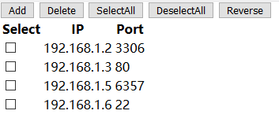

# javascript introduction

- [javascript introduction](#javascript-introduction)
  - [js datatype](#js-datatype)
  - [js function](#js-function)
  - [condition sentence](#condition-sentence)
  - [js Scope](#js-scope)
  - [js component](#js-component)
    - [DOM(Document Object Model)](#domdocument-object-model)
    - [`NaN`, `isNaN`](#nan-isnan)
  - [timer](#timer)
  - [Function Closures](#function-closures)
  - [closure](#closure)
  - [some bulit-ins](#some-bulit-ins)
    - [`document`](#document)
    - [`location`](#location)
    - [`Math`](#math)
  - [js oop(not important)](#js-oopnot-important)
    - [js single object](#js-single-object)
    - [js factory mode](#js-factory-mode)
    - [js constructor mode](#js-constructor-mode)
  - [js Object Prototypes](#js-object-prototypes)
    - [inherit](#inherit)
  - [js new selector](#js-new-selector)

浏览器本身就是一个JavaScript解释器

写JavaScript代码的位置:
- F12/Console
- html文件中`<script>`

因为V8和AJAX导致javascript飞速发展；
- V8: 解析js
- AJAX: 从后台通过接口读过来放到页面上，实现局部刷新；

前端脚本语言：
- JavaScript
- TypeScript(Microsoft for IE)
- ActionScript(Adobe, 用于视频交互，弹广告、会员)

一般都是直接用JavaScript的库JQuery, 而不是自己原生地写(面试喜欢这么干)；JQuery是一个前后台都通的js库；

前端三大块：
- HTML: **页面的内容**
- CSS: **页面的表现**。元素大小、颜色、位置、隐藏、部分动画...
- JS: **页面行为**。部分动画、用户与页面交互(弹窗...)、页面功能(在线图片转换...)...

js做动画的原理： 本质上是用js来改变css, 可以比css本身的动画更加复杂；

js的运行环境是浏览器，嵌入到HTML中运行的，嵌入方式有3种：
- 行内事件
- 嵌入方式
- 外部引入

> 如果是远程的js文件(比如`https://code.jquery.com/jquery-3.3.1.min.js`)，并且`<script>`在html文件的头部，那么如果js文件没有下载完，网页一直刷不出来；所以一般讲`<script>`放在`<body>`内部的的最下边

```bash
./
    index.html
    js
        hello.js
```

```html
<!-- index.html -->

<!DOCTYPE html>
<html lang="en">
<head>
    <meta charset="UTF-8">
    <title>Document</title>
    <!-- method2: 嵌入式 -->
    <script>
        // 刷新页面直接运行
        alert('Hello, again!');
    </script>
    <!-- method3: 外部引入 -->
    <script src="js/hello.js"></script>
    <!-- 代码从上往下，先运行method2, 然后method3 -->
</head>
<body>
    <!-- method1: 行间事件，不推荐 -->
    <input type="button" value="ClickMe!" onclick="alert('Hello!')">
</body>
</html>
```

```js
//hello.js

alert('hello, third times!');
```

example: get data

```html
<body>
    <input type="text" name="" id="username">
    <input type="button" value="ClickMe!" onclick="GetData();">
    <script>
        function GetData() {
            var i=document.getElementById('username');
            alert(i.value);
        }
    </script>
</body>
```

## js datatype

```js
// number
var a = 100;
// string
var b = 'abc';
// boolean: true, false; 小写，与python不同
var c = true;
// undefined
var d;
// 后面再去学习null, object类型
// null
// object

//array
arr=[1, 2, 3, 4]
console.log(arr[0])
//dict, 本质是object
dictionary={'k1':'v1', 'k2':'v2'}
console.log(dictionary['k1'])

alert(a);
// 弱类型
a = 'grey';
alert(a);
```

example: 定时执行

```html
<body>
    <script>
        function print() {
            console.log(Math.random()*10);
        }
        setInterval(print, 1000);
    </script>
</body>
```

example: setInterval banner

```html
<body>
    <div id="banner">Happy New Year </div>
    <script>
        tag = document.getElementById('banner');
        setInterval(() => {
            var txt=tag.innerHTML; //因为innerText会忽略空格，所以用innerHTML
            var f = txt.charAt(0);
            console.log(f, txt.charCodeAt(0))
            var l = txt.substring(1, txt.length);
            tag.innerText = l + f;
        }, 1000);
    </script>
</body>
```

example: array & dictionary example

```js
a = [1, 2, 3, 4, 5]
// splice(start, deleteCount, value)
// operation1: replace
a.splice(1, 1, 22)
console.log(a) //[1, 22, 3, 4, 5]
// operation2: delete
a.splice(1, 1)
console.log(a) //[1, 3, 4, 5]
// operation3: insert
a.splice(1, 0, 222)
console.log(a) //[1, 222, 3, 4, 5]

// join，该方法属于数组，而python中是属于字符串
console.log(a.join('#')) //1#222#3#4#5
```

example: loop

```js
//// loop type1
// array loop
a = [11, 22, 33, 44, 55]
for (var index in a) {
    console.log(index, a[index]);
}
//dict loop
dict = {
    'k1': 'v1',
    'k2': 'v2'
}
for (var key in dict) {
    console.log(key, dict[key])
}

//// loop type2: 不支持dictionary
for (var i = 0; i < a.length; i++) {
    console.log(a[i]);
}
```

example: condition sequence

```js
for(var i=0; i<6; i++){
    if (i==3) {
        console.log('hehe');
    } else {
        console.log(i**2);
    }
}
```

`==` vs `===`:

- == 和 != 比较若类型不同，先偿试转换类型，再作值比较，最后返回值比较结果
- === 和 !== 只有在相同类型下,才会比较其值。

example: compare

```js
console.log(1 == '1') //true
console.log(1 != '1') //false
console.log(1 === '1') //false
console.log(1 !== '1') //true

// and
if (1=='1' && 1===1) {
    console.log('haha')
}

// or
if (1=='1'||1==='1'){
    console.log('hehe')
}
```


用js获取html文档元素的属性并修改

```html
<!DOCTYPE html>
<html lang="en">

<head>
    <meta charset="UTF-8">
    <title>Document</title>
    <!-- <script>
        // 用document对象来获取div
        // 因为html是从上往下执行，现在还没有执行div1, 所以报错
        // 放到div1的下面就行了
        document.getElementById('div1').title = 'changed float tips!';
    </script> -->

</head>

<body>
    <div id="div1" title="float tips">
        This is a test!
    </div>
    <script>
        document.getElementById('div1').title = 'changed float tips!';
    </script>
</body>

</html>
```

```html
<!-- 强行然script放在前面 -->

<!DOCTYPE html>
<html lang="en">

<head>
    <meta charset="UTF-8">
    <title>Document</title>
    <script>
        // 整个文档加载完成之后，执行一个lambda
        window.onload=function(){
            document.getElementById('div1').title='changed float tips';

            var oA=document.getElementById('link1');
            // 读取属性
            alert(oA.id)
            // 写入属性
            oA.href='https://www.baidu.com';
            oA.title='goto baidu';
        }
    </script>
</head>

<body>
    <div id="div1" title="float tips">
        This is a test!
    </div>
    <a href="" id="link1">Link test</a>
</body>

</html>
```

换肤例子:

```bash
./
    css
        1.css
        2.css
    index.html
```

```html
<!-- index.html -->

<!DOCTYPE html>
<html lang="en">

<head>
    <meta charset="UTF-8">
    <title>Document</title>
    <link rel="stylesheet" href="css/1.css" id="link1">
    <script>
        window.onload=function(){
            document.getElementById('link1').href='css/2.css'
        }
    </script>
</head>

<body>
    <div class="box1"></div>
    <div class="box2"></div>
</body>

</html>
```

```css
/* 1.css */

.box1{
    width: 200px;
    height: 200px;
    background-color: gold;
    float: left;
}
.box2{
    width: 200px;
    height: 200px;
    background-color: cyan;
    float: left;
}
```

```css
/* 2.css */

.box1{
    width: 200px;
    height: 200px;
    background-color: red;
    float: left;
}
.box2{
    width: 200px;
    height: 200px;
    background-color: yellowgreen;
    float: left;
}
```

操作属性的方法：`.`, `[]`; `.`后面接属性名， `[]`里面写属性的字符串；推荐用`.`, 因为智能提示

`.`操作属性，属性写法：

- js属性写法与html的属性写法一致
- “style” 属性里面的属性，有横杠的改成驼峰式
- “class” 属性写成 “className”

```html
<!DOCTYPE html>
<html lang="en">

<head>
    <meta charset="UTF-8">
    <title>Document</title>
    <script>
        window.onload=function(){
            var oDiv=document.getElementById('box1');
            // 修改文字前景色，html嵌在tag里面的写法一致
            oDiv.style.color='red';
            // 带有-的属性要用驼峰写
            // oDiv.style.font-size
            oDiv.style.fontSize='24px';
        }
    </script>
</head>

<body>
    <div id="box1" style="color: blue">box1</div>
</body>

</html>
```

```html
<!DOCTYPE html>
<html lang="en">
<head>
    <meta charset="UTF-8">
    <title>Document</title>
    <style>
        .box1{
            width: 200px;
            height: 200px;
            background-color: gold;
        }
        .box2{
            width: 300px;
            height: 300px;
            background-color: red;
        }
    </style>
    <script>
        window.onload=function () {
            var oDiv=document.getElementById('div1');
            // 改变class的值需要用className
            oDiv.className='box2';
        }
    </script>
</head>
<body>
    <div class="box1" id="div1"></div>
</body>
</html>
```

`[]`操作属性的写法：

```html
<!DOCTYPE html>
<html lang="en">
<head>
    <meta charset="UTF-8">
    <title>Document</title>
    <style>
        .box1{
            width: 200px;
            height: 200px;
            background-color: gold;
        }
    </style>
    <script>
        window.onload=function () {
            var oDiv=document.getElementById('div1');
            var attr='color';
            // 错误写法, 因为'color'不是变量，所以用.出错
            // oDiv.style.attr='red';
            oDiv.style[attr]='red';
            // 甚至可以这样
            oDiv['style']['fontSize']='24px';
        }
    </script>
</head>
<body>
    <div class="box1" id="div1">box1</div>
</body>
</html>
```

`innerHTML`的读写：

- 读取标签包裹的元素
- 

```html
<!-- innerHTML的读、写 -->

<!DOCTYPE html>
<html lang="en">
<head>
    <meta charset="UTF-8">
    <title>Document</title>
    <style>
        .box1{
            width: 200px;
            height: 200px;
            background-color: gold;
        }
    </style>
    <script>
        window.onload=function () {
            var oDiv=document.getElementById('div1');
            // 读取div1包裹的东西
            alert(oDiv.innerHTML);
            // 弹出框显示的是box1

            // 写东西到空div
            var oDiv2=document.getElementById('div2');
            // 只能有一个
            oDiv2.innerHTML='<a href="https://www.baidu.com">baidu</a>';
        }
    </script>
</head>
<body>
    <div class="box1" id="div1">box1</div>
    <div id="div2"></div>
</body>
</html>
```

## js function

js函数分类:
- 普通函数: `function func(){}`
- 匿名函数: `let func = function (){}` 或者lambda: `let func = (a, b)=>{return a+b;}`
- 自执行函数: `(function(arg){...})(666)`, 创建函数并且自动执行。一般引用其他人的js库，最外部的函数就是这样写的。

```html
<!-- simple example -->

<!DOCTYPE html>
<html lang="en">
<head>
    <meta charset="UTF-8">
    <title>Document</title>
    <script>
        function func1() {
            alert('hello');
        }
        // 加载的时候调用，一般用于交互式才调用，所以放在onclick
        // func1()
    </script>
</head>
<body>
    <input type="button" value="ClickMe" onclick="func1()">
</body>
</html>
```


```html
<!-- 点击换肤 -->

<!DOCTYPE html>
<html lang="en">
<head>
    <meta charset="UTF-8">
    <title>Document</title>
    <link rel="stylesheet" href="css/1.css" id="link1">
    <script>
        function skin01() {
            var oLink=document.getElementById('link1');
            oLink.href='css/1.css';            
        }
        function skin02() {
            var oLink=document.getElementById('link1');
            oLink.href='css/2.css';
        }
    </script>
</head>
<body>
    <input type="button" value="皮肤1" onclick="skin01()">
    <input type="button" value="皮肤2" onclick="skin02()">
    <br>
    <div class="box1"></div>
    <div class="box2"></div>
</body>
</html>
```

```html
<!-- 换肤，并且进行代码分离 -->

<!DOCTYPE html>
<html lang="en">
<head>
    <meta charset="UTF-8">
    <title>Document</title>
    <link rel="stylesheet" href="css/1.css" id="link1">
    <script>
        function skin01() {
            var oLink=document.getElementById('link1');
            oLink.href='css/1.css';            
        }
        function skin02() {
            var oLink=document.getElementById('link1');
            oLink.href='css/2.css';
        }
        // 把onclick搬到上面来，进行代码分离
        window.onload=function(){
            var oBtn01=document.getElementById('btn01');
            var oBtn02=document.getElementById('btn02');
            // 写法有些不同，直接写函数名就可以了
            oBtn01.onclick=skin01;
            oBtn02.onclick=skin02;
        }
    </script>
</head>
<body>
    <input type="button" value="皮肤1" id='btn01'>
    <input type="button" value="皮肤2" id='btn02'>
    <br>
    <div class="box1"></div>
    <div class="box2"></div>
</body>
</html>
```

变量与函数预解析：JavaScript解析过程分为两个阶段，先是编译阶段，然后执行阶段，在编译阶段会将function定义的函数提前，并且将var定义的变量声明提前，将它赋值为undefined。

```html
<!DOCTYPE html>
<html lang="en">
<head>
    <meta charset="UTF-8">
    <title>Document</title>
    <script>
        // js的预解析;
        // 编译的时候将函数的声明和定义提前，将变量的声明提前(而不是赋值提前，所以是undefined)
        //undefined指的是值未定义，而变量是被定义了得
        func1();// hello
        alert(a);//undefined
        alert(b);//因为c完全没有定义，所以F12, console里面会出错；

        function func1() {
            alert('hello!');
        }
        var a=100;
    </script>
</head>
<body></body>
</html>
```

example: js function with params

```html
<!DOCTYPE html>
<html lang="en">
<head>
    <meta charset="UTF-8">
    <title>Document</title>
    <script>
        // 给onload的事件绑定了匿名函数
        window.onload=function(){
            var oDiv=document.getElementById('div1');
            oDiv.onclick=function(){
                changeStyle('color', 'red');
                changeStyle('background-color', 'gold');
                changeStyle('font-size','24px');
            }

            // 一般把用到的函数放在后面，方便理解逻辑
            function changeStyle(styl, val) {
                oDiv.style[styl]=val;
            }
        }
    </script>
</head>
<body>
    <div id="div1">Box1</div>
</body>
</html>
```

example: js anonymous function

```html
<!DOCTYPE html>
<html lang="en">
<head>
    <meta charset="UTF-8">
    <title>Document</title>
    <script>
        // 给onload的事件绑定了匿名函数
        window.onload=function(){
            var oBtn=document.getElementById('btn1');
            // 给onclick事件绑定匿名函数，所以不需要函数名称
            oBtn.onclick=function(){
                alert('hello!');
            }
        }
    </script>
</head>
<body>
    <input type="button" value="ClickMe" id="btn1">
</body>
</html>
```

```html
<!-- 简单加法运算器 -->

<!DOCTYPE html>
<html lang="en">
<head>
    <meta charset="UTF-8">
    <title>Document</title>
    <script>
        window.onload=function(){
            var oInput1=document.getElementById('input1');
            var oInput2=document.getElementById('input2');
            var oBtn=document.getElementById('btn1');

            oBtn.onclick=function(){
                var val1=eval(oInput1.value);
                var val2=eval(oInput2.value);
                // 直接+是字符串相加；可以直接相减
                // js lamda
                var add=(a, b)=>{return a+b;}
                alert(add(val1, val2));
            }
        }
    </script>
</head>
<body>
    <input type="text" name="" id="input1">
    <input type="text" name="" id="input2">
    <input type="button" value="GetRes" id="btn1">
</body>
</html>
```

函数中'return'关键字的作用：

- 返回函数执行的结果
- 结束函数的运行
- 阻止默认行为：提交表单的时候，不想让它提交而是自己用Ajax提交

## condition sentence

```html
<!-- 显示、隐藏切换 -->
<!DOCTYPE html>
<html lang="en">
<head>
    <meta charset="UTF-8">
    <title>Document</title>
    <style>
        .box1{
            width: 300px;
            height: 300px;
            background-color: gold;
        }
    </style>
    <script>
        window.onload=function(){
            var oBtn=document.getElementById('input1');
            var oDiv=document.getElementById('div1');

            oBtn.onclick=function(){
                if (oDiv.style.display=='none') {
                    oDiv.style.display='block';
                } else {
                    oDiv.style.display='none';
                }
            }
        }
    </script>
</head>
<body>
    <input type="button" value="切换" id="input1">
    <div class="box1" id="div1"></div>
</body>
</html>
```

```html
<!-- for vs foreach -->

<!DOCTYPE html>
<html lang="en">
<head>
    <meta charset="UTF-8">
    <title>Document</title>
    <script>
        window.onload=()=>{
            var oLi1=document.getElementById('list1');
            var oLi2=document.getElementById('list2');
            var oLi3=document.getElementById('list3');
            // ali01, ali02都是HTMLCollection(是一个选择集)
            ali01=oLi1.getElementsByTagName('li');
            ali02=oLi2.getElementsByTagName('li');
            ali03=oLi3.getElementsByTagName('li');
            
            // ali01
            console.log(ali01.length)
            ali01[2].style.color='red';
            
            // ali02
            //convert to arry
            arr02=Array.from(ali02)
            arr02.forEach(element => {
                element.style.color='gold';
            });
            
            // ali03
            //no need for convert
            for(var i=0;i<ali03.length;i++){
                if (i%2===0) {
                    ali03[i].style.color='yellowgreen';
                }
            }
            // while循环用的比较少
        }
    </script>
</head>
<body>
    <ul id="list1">
        <li>0</li>
        <li>1</li>
        <li>2</li>
    </ul>
    <ul id="list2">
        <li>a</li>
        <li>b</li>
        <li>c</li>
        <li>d</li>
    </ul>
    <ul id="list3">
        <li>aa</li>
        <li>bb</li>
        <li>cc</li>
        <li>dd</li>
        <li>ee</li>
        <li>ff</li>
    </ul>
</body>
</html>
```

```js
// 数组去重复

window.onload=()=>{
    var arr1=[1,2,3,4,1,2,3,4,5];
    var arr2=[];
    for (var i = 0; i < arr1.length; i++) {
        if (arr1.indexOf(arr1[i])==i) {
            arr2.push(arr1[i]);
        }
    }
    console.log(arr2);
}
```

## js Scope

JavaScript中作用域是最重要的；

其他语言(C/C++, C#, Java)是以`{}`为作用域，即以代码块为作用域；Python以函数为作用域；

```c#
// C#以代码块为作用域
static void func()
{
    if (1==1)
    {
        var name = "C#";
    }
    // name在作用域之外，编译通不过，报错
    Console.WriteLine(name);
}
```

```python
# Python以函数为作用域
def func():
    if True:
        name = 'Python'
    # Python作用域可以到这里
    print(name)

func() # Python
print(name) # 作用不到这里来
```

JS中带`var`表示局部变量，不带`var`表示全局变量; 而且`var`也可以放在全局的位置[Details](https://www.jianshu.com/p/34c96c75dc8c)


JS作用域特点：
- JS默认以函数为作用域，ES6引入`let`之后，`let`以代码块为作用域；
- 函数未被调用的时候，作用域已经创建；
- 函数的作用域链(函数套函数)的作用域，也是在被调用前已经创建；
- JS的局部变量会提前声明；

```js
function func() {
    if (true) {
        var name = 'JavaScript';
    }
    console.log(name);
}
func(); // JavaScript
```

```js
// let以代码块为作用域
function func() {
    if (true) {
        let name = 'JavaScript';
    }
    console.log(name);
}
func(); // 没有输出
```

```js
name = 'Alpha';

function func() {
    var name = 'Grey';
    function innerFunc() {
        // var name = 'Chris';
        console.log(name); // 作用域链，如果内层没有，就往上一层找
    }
    return innerFunc;
}

var res1=func();
res1(); // Grey，因为作用域链先于调用而创建；
```

```js
name = 'Alpha';

function func() {
    var name = 'Grey';

    function innerFunc() {
        console.log(name);
    }
    var name = 'Moris'
    return innerFunc;
}

var res1 = func();
res1(); // Moris，因为innerFunc代码并不执行，只是创建了作用域，所以后面的Moris覆盖了前面的Grey
```

```js
// Interpreter解释的时候，先找到所有的var，并且让其等于undefined;
var a; // 只是声明，默认就是undefined
function func() {
    console.log(name); // var 提前声明
    var name = 'Grey';
}
func(); //undefined
```

```js
function func() {
    console.log(name); 
    let name = 'Grey';
}
func(); // 使用let直接报错
```

## js component

Javascript组成:

- ECMAscript javascript的语法（变量、函数、循环语句等语法）
- DOM(Document Object Model) 文档对象模型 操作html和css的方法
- BOM(browser object model) 浏览器对象模型 操作浏览器的一些方法

ActionScript也是遵循ECMAscript语法规范；

DOM: 比如`document.getElementById`就来自DOM

BOM: 比如`widnow.onload`, `alert()`这些行为来自于浏览器，也就是来自BOM；如果要统一所有浏览器的弹出框，需要自己做；

调试js程序的方法：

- `alert()`
- `console.log()`: 最常用
- `document.title()`

```js
window.onload=()=>{
    // +
    var name='grey';
    var age=12.5;
    console.log(name+' '+age);//grey 12.5
    
    // +
    var num1=12;
    var num2=34;
    var str1='34';
    console.log(num1+num2);//46
    console.log(num1+str1);//1234
    
    // parseInt
    var str2='123abc';
    var str3='abc123';
    console.log(parseInt(str2));//123
    console.log(parseInt(str3));//NaN
    
    //javascript bug
    console.log(0.1+0.2)//0.30000000000000004
    console.log(0.2+0.2)//0.4
    //解决办法
    var float1=0.1;
    var float2=0.2;
    console.log((float1*100+float2*100)/100);//0.3

    // split()
    var dateStr='12-05-2018';
    var dateLi1=dateStr.split('-');
    var dateLi2=dateStr.split('');
    document.title=dateLi1;//["12", "05", "2018"]
    console.log(dateLi2);//["1", "2", "-", "0", "5", "-", "2", "0", "1", "8"]

    //charAt()
    var str4='#div1';
    if (str4.charAt(0)==="#") {
        console.log('id selctor');
    }

    //indexOf()
    if (str4.indexOf('#')===0) {
        console.log('id selector');
    }
    str5='Microsoft Yahei';
    if (str5.indexOf('Yahei')!==-1) {
        console.log('Microsoft Yahei exists');
    }

    // substring(start, end);截取字符串，不包括end
    var str6='hello,world';
    console.log(str6.substring(0,str6.length))//hello, world
    // 一个参数的时候直接截取到末尾
    console.log(str6.substring(2))//llo,world

    //toUppeCase, toLowerCase
    var str7='Hello,Grey';
    console.log(str7.toUpperCase());//HELLO,GREY
    console.log(str7.toLocaleLowerCase())//hello,grey

    //字符串反转
    var str8=str7.split('').reverse().join('');
    console.log(str8);//yerG,olleH
}
```

### DOM(Document Object Model)

整个页面就是一个document对象, document中包含各种tag对象; 对这些对象可以进行CRUD操作；

DOM Operation:
- find the tag: 选择器
- operate the tag: 修改

```js
// 直接选择器
document.getElementById //根据ID获取一个标签
document.getElementsByName //根据name属性获取标签集合
document.getElementsByClassName //根据class属性获取标签集合
document.getElementsByTagName //根据标签名获取标签集合
```

```js
// 间接选择器
parentElement           // 父节点标签元素
children                // 所有子标签
firstElementChild       // 第一个子标签元素
lastElementChild        // 最后一个子标签元素
nextElementtSibling     // 下一个兄弟标签元素
previousElementSibling  // 上一个兄弟标签元素

parentNode          // 父节点
childNodes          // 所有子节点
firstChild          // 第一个子节点
lastChild           // 最后一个子节点
nextSibling         // 下一个兄弟节点
previousSibling     // 上一个兄弟节点
```

```js
// class Operation: 常用于修改样式，粒度大
tag=document.getElementById('banner')
console.log(tag.classList)
console.log(tag.className) // c1 c2
tag.className='cx'
console.log(tag.className) //cx
tag.classList.add('cy')
console.log(tag.className) // cx cy
tag.classList.remove('cx')
console.log(tag.className) // cy

// 直接修改style, 粒度更细
let box1 = document.getElementById('box1');
box1.style.color = 'red';
box1.style.backgroundColor = 'yellow';
```

example: js attributes

```html
<body>
    <div id="box1">Happy New Year!</div>
    <script>
        let box1 = document.getElementById('box1');
        box1.setAttribute('k1', 'v1');
        console.log(box1.attributes); //{0: id, 1: k1}
        box1.removeAttribute('k1')
    </script>
</body>
```

example: js create tag

```html
<body>
    <input type="button" value="Add: method1" onclick="AddEle1();">
    <input type="button" value="Add: method2" onclick="AddEle2();">
    <div id="box1">
        <p><input type="text"></p>
    </div>
    <script>
        // method1
        function AddEle1() {
            let tag = '<p><input type="text"></p>';
            // beforeEnd, afterEnd, beforeBegin, afterBegin
            document.getElementById('box1').insertAdjacentHTML('beforeEnd', tag);
        }
        // method2
        function AddEle2() {
            let p_tag = document.createElement('p');
            let input_tag = document.createElement('input');
            input_tag.setAttribute('type', 'radio');
            p_tag.appendChild(input_tag);
            document.getElementById('box1').appendChild(p_tag);
        }
    </script>
</body>
```

example: js get text or value

```html
<body>
    <!-- innerText, innerHTML -->
    <div id="box1">Box1<a href="">Face<span>book</a></div>
    <!-- value -->
    <input type="text" name="" id="t1">
    <select id="s1">
        <option value="11">Opt1</option>
        <option value="22" selected="selected">Opt2</option>
        <option value="33">Opt3</option>
    </select>
    <textarea name="" id="t2" cols="30" rows="10"></textarea>
    <script>
        let box1 = document.getElementById('box1');
        console.log(box1.innerText); // Box1 Facebook
        console.log(box1.innerHTML); // Box1<a href="">Face<span>book</span></a>
        box1.innerText = '<a href="">Face<span>book</span></a>';
        // outerHTML变成了
        // <div id="box1">&lt;a href=""&gt;Face&lt;span&gt;book&lt;/span&gt;&lt;/a&gt;</div>

        let t1 = document.getElementById('t1');
        console.log(t1.value);

        let s1 = document.getElementById('s1');
        console.log(s1.value); //22
        console.log(s1.selectedIndex); //1

        let t2=document.getElementById('t2');
        console.log(t2.value);
    </script>
</body>
```

example: placeholder
> 可以直接`<input type="text" placeholder="Type to search...">`, 但不能定制，现在一般是用的js，可以智能提示；

```html
<body>
    <div style="width:600px; margin:0 auto;">
        <input onfocus="Focus();" onblur="Blur();" type="text" name="" id="search" value="Type to search...">
    </div>
    <script>
        function Focus() {
            // Focus
            let searchbox = document.getElementById('search');
            let v = searchbox.value;
            if (v == "Type to search...") {
                searchbox.value = '';
            }
        }

        function Blur() {
            // Defocus
            let searchbox = document.getElementById('search');
            let v = searchbox.value;
            if (v.length == 0) {
                searchbox.value = "Type to search...";
            }
        }
    </script>
</body>
```

example: js submit

```html
<body>
    <!-- method1 -->
    <form action="https://www.baidu.com/s" method="get">
        <input type="text" name="wd">
        <input type="submit" value="Submit">
    </form>
    <!-- method2 -->
    <form id="f2" action="https://www.baidu.com/s" method="get">
        <input type="text" name="wd">
        <span onclick="submitForm();">ClickMe!</span>
    </form>
    <script>
        function submitForm() {
            document.getElementById('f2').submit();
        }
    </script>
</body>
```

example: js dialog

```js
<body>
    <div id="box1">
        <input type="text" id="t1">
        <input type="button" value="Clear" onclick="Clear();">
    </div>
    <script>
        function Clear() {
            let t1 = document.getElementById('t1');
            alert('now value is: ', t1.value);
            let result = confirm('Clear the input?');
            if (result) {
                document.getElementById('t1').value = '';
            }
        }
    </script>
</body>
```

example: `location`

```js
console.log(location);
console.log(location.href); //http://127.0.0.1:5500/test.html
console.log(location.host); // 127.0.0.1:5500
console.log(location.hostname); // 127.0.0.1
console.log(location.origin); // http://127.0.0.1:5500
// redirect
location.href='https://www.baidu.com';
```

example: interval & timeout

```js
// setInterval一直执行
let obj = setInterval(() => {
    console.log(666);
    clearInterval(obj);
}, 1000);
// clearInterval(obj); // 放在这里，一次也不会执行

console.log(555); // 这一句最先执行

// setTimeout只执行一次
setTimeout(() => {
    console.log(999);
}, 3000);
```

example: DOM operation
> 

```html
<body style="margin:0;">
    <!-- Pannel -->
    <div>
        <input type="button" value="Add" onclick="ShowModal();">
        <input type="button" value="Delete" onclick="Delete();">
        <input type="button" value="SelectAll" onclick="SelectAll();">
        <input type="button" value="DeselectAll" onclick="DeselectAll();">
        <input type="button" value="Reverse" onclick="ReverseAll();">
        <table>
            <thead>
                <th>Select</th>
                <th>IP</th>
                <th>Port</th>
            </thead>
            <tbody id="tb">
                <tr>
                    <td><input class="cb" type="checkbox"></td>
                    <td>192.168.1.2</td>
                    <td>3306</td>
                </tr>
                <tr>
                    <td><input class="cb" type="checkbox"></td>
                    <td>192.168.1.3</td>
                    <td>80</td>
                </tr>
                <tr>
                    <td><input class="cb" type="checkbox"></td>
                    <td>192.168.1.5</td>
                    <td>6357</td>
                </tr>
                <tr>
                    <td><input class="cb" type="checkbox"></td>
                    <td>192.168.1.6</td>
                    <td>22</td>
                </tr>
            </tbody>
        </table>
    </div>

    <!-- Mask -->
    <div id='mask' class="mask hide"></div>

    <!-- Modal -->
    <div id="modal" class="modal hide">
        <p>IP:<input type="text" name="" id="ip"></p>
        <p>Port:<input type="text" name="" id="port"></p>
        <p>
            <input type="button" value="Cancel" onclick="HideModal();">
            <input type="button" value="OK" onclick="Addline();">
        </p>
    </div>

    <style>
        .hide {
            display: none;
        }

        .mask {
            z-index: 9;
            position: fixed;
            left: 0;
            right: 0;
            top: 0;
            bottom: 0;
            background-color: #000;
            opacity: 0.3;
        }

        .modal {
            z-index: 99;
            position: fixed;
            left: 50%;
            top: 50%;
            margin-left: -200px;
            margin-top: -150px;

            width: 400px;
            height: 300px;
            background-color: #fff;
        }
    </style>

    <script>
        function ShowModal() {
            document.getElementById('mask').classList.remove('hide');
            document.getElementById('modal').classList.remove('hide');
        }

        function HideModal() {
            document.getElementById('mask').classList.add('hide');
            document.getElementById('modal').classList.add('hide');
        }

        function Addline() {
            var ip = document.getElementById('ip').value;
            var port = document.getElementById('port').value;
            var str =
                `
                <td><input class="cb" type="checkbox"></td>
                <td>${ip}</td>
                <td>${port}</td>
                `;
            var tr = document.createElement('tr')
            tr.innerHTML = str;
            document.getElementById('tb').appendChild(tr);
            HideModal();
        }

        function Delete() {
            //cbs变化时会实时更新, 正向iter会错误
            // 或者使用深拷贝[...collection]
            // trick: count in reverse order
            var cbs = document.getElementsByClassName('cb');
            for (var i = cbs.length - 1; i >= 0; i--) {
                var cb = cbs[i]
                if (cb.checked) {
                    cb.parentElement.parentElement.remove(cb)
                }
            }
        }

        function SelectAll() {
            var checkboxs = document.getElementsByClassName('cb');
            for (var index in checkboxs) {
                var cb = checkboxs[index];
                cb.checked = true;
            }
        }

        function DeselectAll() {
            var checkboxs = document.getElementsByClassName('cb');
            for (var index in checkboxs) {
                var cb = checkboxs[index];
                cb.checked = false;
            }
        }

        function ReverseAll() {
            var checkboxs = document.getElementsByClassName('cb');
            for (var index in checkboxs) {
                var cb = checkboxs[index];
                if (cb.checked) {
                    cb.checked = false;
                } else {
                    cb.checked = true;
                }
            }
        }
    </script>
</body>
```

`var`, `let`, `const`:
- 使用var声明的变量，其作用域为该语句所在的函数内，且存在变量提升现象；
- 使用let声明的变量，其作用域为该语句所在的代码块内，不存在变量提升；
- 使用const声明的是常量，在后面出现的代码中不能再修改该常量的值。

example: click to activate menu
> 

```html
<body>
    <div class="container" style="margin:0 auto;width:300px;">
        <div class="item">
            <div class="header" id="i1" onclick="activate('i1');">Header1</div>
            <div class="content">
                <div>Content11</div>
                <div>Content12</div>
                <div>Content13</div>
            </div>
        </div>
        <div class="item">
            <div class="header" id="i2" onclick="activate('i2');">Header2</div>
            <div class="content hide">
                <div>Content21</div>
                <div>Content22</div>
                <div>Content23</div>
            </div>
        </div>
        <div class="item">
            <div class="header" id="i3" onclick="activate('i3');">Header3</div>
            <div class="content hide">
                <div>Content31</div>
                <div>Content32</div>
                <div>Content33</div>
            </div>
        </div>
    </div>

    <style>
        .hide {
            display: none;
        }

        .header {
            height: 35px;
            background-color: #2459a2;
            color: white;
            line-height: 35px;
        }
    </style>

    <script>
        function activate(params) {
            let current_header = document.getElementById(params);
            let current_item = current_header.parentElement;
            let container = current_item.parentElement;
            // method1:
            // display this menu
            current_header.nextElementSibling.classList.remove('hide');
            // hide other menus
            const items = [...container.children]; //深拷贝
            let siblings = items.filter(e => e !== current_item);
            for (const key in siblings) {
                const item = siblings[key];
                item.lastElementChild.classList.add('hide');
            }
            //method2: 先全部都hide, 然后将nextElementSibling.classList.remove('hide');
        }
    </script>
</body>
```

example: simple calculator

```html
<!-- indexl.html -->

<!DOCTYPE html>
<html lang="en">
<head>
    <meta charset="UTF-8">
    <title>Document</title>
    <script src="js/hello.js"></script>
</head>
<body>
    <h1>Calculator</h1>
    <input type="text" name="" id="input1">
    <select name="" id="select1">
        <option value="0">+</option>
        <option value="1">-</option>
        <option value="2">*</option>
        <option value="3">/</option>
        <option value="4">mod</option>
    </select>
    <input type="text" name="" id="input2">
    <input type="button" value="calc" id="btn1">
</body>
</html>
```

```js
// hello.js

window.onload=()=>{
    //get element
    var oInput1=document.getElementById('input1');
    var oInput2=document.getElementById('input2');
    var oSelect=document.getElementById('select1');
    var oBtn=document.getElementById('btn1');

    oBtn.onclick=()=>{
        var op=eval(oSelect.value);
        var input1=oInput1.value;
        var input2=oInput2.value;
        if (input1===''||input2==='') {
            alert('inputbox cannot be empty!');
            return;
        }
        // 最好是用regex来判断input1, input2是否是数字
        if (isNaN(input1)||isNaN(input2)) {
            alert('NaN')
            return;
        }
        // console.log(input1,input2)
        var val1=eval(input1);
        var val2=eval(input2);

        switch (op) {
            case 0:
                console.log((100*val1+100*val2)/100);
                break;
            case 1:
                console.log((100*val1-100*val2)/100);
                break;
            case 2:
                console.log((100*val1*100*val2)/10000);
                break;
            case 3:
                console.log(val1/val2);
                break;
            case 4:
                console.log(val1%val2);
                break;
            default:
                break;
        }
    }
}
```

### `NaN`, `isNaN`

```js
window.onload=()=>{
    console.log(NaN==NaN);//false
    console.log(NaN===NaN);//false

    var str1='abc123';
    console.log(isNaN(str1));//true
    var val1=parseInt(str1);
    console.log(val1,isNaN(val1));//NaN true
    var val2=parseInt('123abc');
    console.log(val2,isNaN(val2));//123 false

    console.log(isNaN(123),isNaN(123.45));//false false
    console.log(isNaN('123'),isNaN('123.45'));//false false
}
```

## timer

定时器是BOM里面的东西；

定时器在javascript中的作用：

- 制作动画
- 异步操作
- 函数缓冲与节流

定时器种类：

- setTimeout: 只用一次的定时器
- setInterval: 反复执行的定时器，用于动画

```js
//setTimeout(myFunc,timeInterval)
window.onload=()=>{
    setTimeout(() => {
        console.log('Hello,world!');
    }, 3000);
}
```

定时器弹框：


```js
//hello.js

window.onload=()=>{
    var oPop=document.getElementById('pop1');
    var oClose1=document.getElementById('close1');
    var oClose2=document.getElementById('close2');

    setTimeout(() => {
        oPop.style.display='block';
    }, 2000);

    oClose1.onclick=()=>{
        oPop.style.display='none';
    }
    oClose2.onclick=()=>{
        oPop.style.display='none';
    }
}
```

```html
<!DOCTYPE html>
<html lang="en">
<head>
    <meta charset="UTF-8">
    <title>Document</title>
    <style>
        .pop_con{
            /* 默认不显示 */
            display: none;
        }
        .pop{
            width: 400px;
            height: 300px;
            background-color: #fff;
            border: 1px solid #333;
            
            /* fixed是相对于浏览器 */
            /* 如果改成absolute就是相对于body */
            position: fixed;
            left: 50%;
            top: 50%;
            margin-left: -200px;
            margin-top: -150px;
            
            z-index: 9999;
        }
        .mask{
            position: fixed;   
            width: 100%;
            height: 100%;
            background-color: rgba(0, 0, 0, 0.5);
            left: 0;
            top: 0;

            z-index: 9990;
        }
    </style>
    <script src="js/hello.js"></script>
</head>
<body>
    <h1>Header1</h1>
    <p>This is a paragraph!</p>

    <!-- custom pop window -->
    <div class="pop_con" id="pop1">
        <div class="pop">
            <h3>Message:</h3>
            <input type="button" value="Close" id="close1">
            <a href="" id="close2">AnotherClose</a>
        </div>
        <div class="mask"></div>
    </div>
</body>
</html>
```

```js
//clear timeout
var timer1=setTimeout(() => {
    oPop.style.display='block';
}, 2000);

clearTimeout(timer1);
```

```js
//clear interval
var timer1=setInterval(() => {
    oPop.style.display='block';
}, 2000);

clearInterval(timer1);
```

做动画：

- 原生做动画，用的是一些写好的原生的框架
- 一般都是用的JQuery封装好的成熟框架

```html
<!-- simple movement animation -->

<!DOCTYPE html>
<html lang="en">
<head>
    <meta charset="UTF-8">
    <title>Document</title>
    <style>
        .box{
            width: 100px;
            height: 100px;
            background-color: gold;
            position: fixed;
            left: 0;
            top: 0;
        }
    </style>
    <script>
        window.onload=()=>{
            var oBox=document.getElementById('box1');

            var left=0;
            var timer1=setInterval(()=>{
                left++;
                oBox.style.left=left+'px';

                // stop
                if (left>500) {
                    clearInterval(timer1);
                }
            }, 50)
        }
    </script>
</head>
<body>
    <div class="box" id="box1"></div>
</body>
</html>
```

```html
<!-- clock example -->

<!DOCTYPE html>
<html lang="en">
<head>
    <meta charset="UTF-8">
    <title>Document</title>
    <script>
        window.onload=()=>{
            var oBox=document.getElementById('box1');
            tickFunc()
            // 为了防止之前500ms显示，添加上面这一行
            setInterval(tickFunc,500)

            function tickFunc(){
                var now=new Date();
                // console.log(now)//Sat Apr 28 2018 23:10:25 GMT+0800 (China Standard Time)
                var year=now.getFullYear();
                var month=now.getMonth()+1;
                var date=now.getDate();
                // day=0表示星期天, 用switch来返回 星期X 的中文大写
                var day=now.getDay();
                console.log(year, month, date);
                var hour=now.getHours();
                var minute=now.getMinutes();
                var second=now.getSeconds();
                console.log(hour,minute,second)
                
                var date_str=year+'-'+myFormat(month)+'-'+myFormat(date)+'|'+myFormat(day)+'|'+myFormat(hour)+':'+myFormat(minute)+':'+myFormat(second);
                oBox.innerHTML=date_str;

                //function居然可以放在里面
                function myFormat(params) {
                    if (params<10) {
                        return '0'+params;
                    } else {
                        return params;
                    }
                }
            }
        }
    </script>
</head>
<body>
    <div class="box" id="box1"></div>
</body>
</html>
```

```html
<!-- 倒计时：要定义两个时间 -->

<!DOCTYPE html>
<html lang="en">
<head>
    <meta charset="UTF-8">
    <title>Document</title>
    <script>
        window.onload=()=>{
            var oDiv=document.getElementById('box1');
            timeTick();
            setInterval(timeTick,1000);
            
            function timeTick(){
                //这个要用服务器的时间，否则用客户端，可以被用户轻易利用,
                //method1:一般都是把服务器的时间打到页面并隐藏起来，然后利用这个变量；
                //method2:或者利用Ajax取后台时间
                var now=new Date();
                // 一个坑，因为month-1
                var future=new Date(2018,5-1,4,24,0,0)
                // console.log(future-now);//ms
                var lefts=parseInt((future-now)/1000);//换成单位s
                var seconds=lefts%60;
                var minutes=(lefts-seconds)/60%60;
                var hours=(lefts-seconds-minutes*60)/3600%24;
                // var days=(lefts-seconds-minutes*60-hours*3600)/3600/24;
                var days=parseInt(lefts/86400);
                console.log(days,hours,minutes,seconds);

                //当出现负值的时候，页面下线
                //要么跳转到首页
                //或者从服务器撤掉这个活动倒计时页面
                if (lefts===0) {
                    window.location.href='https://www.baidu.com';
                    //活动完成之后，将上面这句话放到 window.onloa(){}的第一句，直接下线
                }
            }
        }
    </script>
</head>
<body></body>
</html>
```

## Function Closures

封闭函数，匿名函数的另外一种写法

因为函数有名字，可能与同名的变量冲突；

末尾该有`;`的通通加上；

```js
// set_root.js

(function(){
	var calc = function(){
		//获取html标签
        var docElement = document.documentElement;
		var clientWidthValue = docElement.clientWidth > 750 ? 750 : docElement.clientWidth;
		docElement.style.fontSize = 20*(clientWidthValue/375) + 'px';
	}
	calc();
    //事件
	window.addEventListener('resize',calc);
})();
```

对于闭包，因为可能涉及js代码压缩，规范的写法甚至在前面也加`;`

```js
;(function(){
	var calc = function(){
		//获取html标签
        var docElement = document.documentElement;
		var clientWidthValue = docElement.clientWidth > 750 ? 750 : docElement.clientWidth;
		docElement.style.fontSize = 20*(clientWidthValue/375) + 'px';
	}
	calc();
    //事件
	window.addEventListener('resize',calc);
})();
```

```html
<!DOCTYPE html>
<html lang="en">
<head>
    <meta charset="UTF-8">
    <title>Document</title>
    <script>
        // function closures
        (function(){
            console.log('hello');
        })();//hello
        //
        var func1=function(){
            console.log('world');
        };
        //这种方式定义的函数
        // func1必须放在var func1=...之后
        func1();//world

        //奇葩写法
        !function () {
            console.log('moris');
        }();//moris
        ~function () {
            console.log('moris');
        }();//moris
        
        // 现在主流lambda
        (()=>{
            console.log('grey');
        })();//grey
        var func2=()=>{
            console.log('james');
        };
        //这种方式定义的函数
        // func2必须放在var func2=...之后
        func2();//james
        // 最常用的套路是将封闭函数放到js文件中调用，然后内部定义函数
        //就不会和外部冲突了
        (()=>{
            var res=calc(200);
            console.log(res)
            
            function calc(params) {
                var a=100;
                return a+params;
            }
        })();//300
    </script>
</head>
<body></body>
</html>
```

## closure

闭包：函数包装函数, 内部函数可以引用外部函数的参数和变量

闭包放在内存中无法释放，所以是内存泄漏；可以少量的使用；

```js
function makeFunc(age) {
    var name = "james";
    function displayName() {
        alert(name,age);
    }
    // 关键就是这个return
    return displayName;
}

var myFunc = makeFunc(26);
myFunc();//james 26
```

```js
//or 
var myFunc=(function(){
    var name='grey';
    function displayName(){
        alert(name,age);
    }
    return displayName;
})(23);
myFunc();//grey 23
```

其中myFunc是全局的，不会被GC回收；所以闭包用处：

- 变量常驻内存，用于循环中存索引值
- 私有变量计数器，避免全局变量污染

```html
<!-- 无法保存循环计数 -->

<!DOCTYPE html>
<html lang="en">
<head>
    <meta charset="UTF-8">
    <title>Document</title>
    <script>
        window.onload=()=>{
            var oLiCollection=document.getElementsByTagName('li');
            console.log(oLiCollection.length, oLiCollection);
            for (var i = 0; i < oLiCollection.length; i++) {
                oLiCollection[i].onclick=()=>{
                    //循环索引无法保存，所以每次点击都是7
                    console.log(i);
                };
            }
        };
    </script>
</head>
<body>
    <ul>
        <li>0</li>
        <li>1</li>
        <li>2</li>
        <li>3</li>
        <li>4</li>
        <li>5</li>
        <li>6</li>
    </ul>
</body>
</html>
```

```js
// 闭包，保存循环计数

window.onload=()=>{
    var oLiCollection=document.getElementsByTagName('li');
    console.log(oLiCollection.length, oLiCollection);
    for (var i = 0; i < oLiCollection.length; i++) {
        // 因为将变量i放入了函数堆栈中
        ((i)=>{
            oLiCollection[i].onclick=()=>{
            //循环索引无法保存，所以每次点击都是7
            console.log(i);
            };
        })(i);
    }
};
```

```js
// 闭包，私有变量计数器

window.onload=()=>{
    var count=(()=>{
        var initialNum=0;
        function increase() {
            initialNum++;
            return initialNum;
        }
        return increase;
    })();
    count();
    count();
    count();
    console.log(count());//4
};
```

用闭包做选项卡(用JQuery更加方便, 一句话搞定)


```html
<!DOCTYPE html>
<html lang="en">
<head>
    <meta charset="UTF-8">
    <title>Document</title>
    <style>
        .btns{
            width: 500px;
            height: 50px;
        }
        .btns input{
            width: 100px;
            height: 50px;
            background-color: #ddd;
            color: #666;
            border: 0;
        }
        .btns input.cur{
            background-color: gold;
        }
        .contents div{
            width: 500px;
            height: 300px;
            background-color: gold;
            display: none;

            line-height: 300px;
            text-align: center;
        }
        .contents div.active{
            display: block;
        }
    </style>
    <script>
        window.onload=()=>{
            var aBtn=document.getElementById('btns').getElementsByTagName('input');
            var aCon=document.getElementById('contents').getElementsByTagName('div');
            for (var i = 0; i < aBtn.length; i++) {
                ((index)=>{
                    // 这个地方不能用=>因为有bug
                    aBtn[index].onclick=function(){
                        //清除所有cur
                        for (var j = 0; j < aBtn.length; j++) {
                            aBtn[j].className='';
                            aCon[j].className='';
                        }
                        //点击激活
                        this.className='cur';
                        // 必须要用闭包才能使用存下来的index
                        aCon[index].className='active';
                    };
                })(i);
            }
            
        }
    </script>
</head>
<body>
    <div class="btns" id="btns">
        <input type="button" value="tab01" class="cur">
        <input type="button" value="tab02">
        <input type="button" value="tab03   ">
    </div>
    <div class="contents" id="contents">
        <div class="active">tab1 contents</div>
        <div>tab2 contents</div>
        <div>tab3 contents</div>
    </div>
</body>
</html>
```


## some bulit-ins

example: serialization

```js
let li1 = [1, 2, 3, 4, 5];
// object 2 string
let li1_str = JSON.stringify(li1);
console.log(li1_str, typeof li1_str); //"[1,2,3,4,5]" string

// string 2 object
let li2 = JSON.parse(li1_str);
console.log(li2, typeof li2); //[1, 2, 3, 4, 5] object
```

example: encodeURI & decodeURI

```js
// encode
let url='https://www.sogou.com/web?query=你好'
let new_url=encodeURI(url)
console.log(new_url) //"https://www.sogou.com/web?query=%E4%BD%A0%E5%A5%BD"
console.log(decodeURI(new_url))//'https://www.sogou.com/web?query=你好'
```

example: eval

python:
- `eval(表达式)`
- `exec(代码)`

JavaScript的`eval()`是python两个函数的合并，既可以执行表达式，也可以执行代码

```js
let expr1 = '1+9';
let expr2 = '8*9';
console.log(eval(expr1)); //10
console.log(eval(expr2)); //72

let res = eval('for(let i=0;i<5;i++){console.log(i);}')
console.log(res); // undefined
```

example: time

```js
let d = new Date();
console.log(d);
console.log(d.getDate());

// get & set
console.log(d.getHours()); //9
let new_d = d.getHours() + 1
d.setHours(new_d)
console.log(d.getHours()); //10
```

### `document`

先是在首页，然后点击登录，登录成功之后要跳回首页；或者在商品详情页，点击购买，跳到登录页，登录成功之后跳回商品详情页；需要用到`document.referrer`, 需要服务器环境；

```html
<!DOCTYPE html>
<html lang="en">
<head>
    <meta charset="UTF-8">
    <title>Document</title>
    <script>

    </script>
</head>
<body>
    <a href="http://127.0.0.1:5500/rem/index.html">ToRemExample</a>
</body>
</html>
```

点击链接跳转到`http://127.0.0.1:5500/rem/index.html`, 然后再F12/console输入`document.referrer`, 会显示`"http://127.0.0.1:5500/js_test/index.html"`

```html
<!-- 一个简单的登录页逻辑 -->

<!DOCTYPE html>
<html lang="en">
<head>
    <meta charset="UTF-8">
    <title>Document</title>
    <script>
        //存在跳转过来的页面(比如首页)
        var backurl=document.referrer;

        //在登录页，填写用户名、密码，服务器返回OK
        
        //从登录页，跳回原来的页面(首页)
        window.location.href=backurl;
    </script>
</head>
<body>
    <a href="http://127.0.0.1:5500/rem/index.html">ToRemExample</a>
</body>
</html>
```

### `location`

```html
<!DOCTYPE html>
<html lang="en">
<head>
    <meta charset="UTF-8">
    <title>Document</title>
    <script>
        var locationAddr=window.location.search;
        console.log(locationAddr);
        //比如之前的地址栏为http://127.0.0.1:5500/js_test/index.html
        //表单提交的时候也是这样
        //在后面添加?aa=123成为http://127.0.0.1:5500/js_test/index.html?aa=123
        //Enter
        //console.log得到的结果为?aa=123
    </script>
</head>
<body>
    <a href="http://127.0.0.1:5500/rem/index.html">ToRemExample</a>
</body>
</html>
```

```html
<!-- 类似获取表单的结果 -->

<!DOCTYPE html>
<html lang="en">
<head>
    <meta charset="UTF-8">
    <title>Document</title>
    <script>
        window.onload=()=>{
            //地址栏填入
            //http://127.0.0.1:5500/js_test/index.html?aa=张三#123
            var oSpan=document.getElementById('span01');
            var Dat=window.location.search;
            var hash=window.location.hash;
            console.log(Dat);//?aa=%E5%BC%A0%E4%B8%89
            console.log(hash);//#123
            // decode
            // console.log(decodeURI(Dat));
            dat_str=decodeURI(Dat);
            
            var arr=dat_str.split('=');
            var name=arr[1];
            // 应用1：将地址栏参数放到页面
            // 应用2：根据地址栏参数条件页面的状态
            oSpan.innerHTML=name;
        };
    </script>
    <style>
        #span01{
            color: gold;
        }
    </style>
</head>
<body>
    <div>
        welcome <span id="span01"></span> visit grey's site
    </div>
</body>
</html>
```

### `Math`

```html
<!DOCTYPE html>
<html lang="en">
<head>
    <meta charset="UTF-8">
    <title>Document</title>
    <script>
        window.onload=()=>{
            //0-1 random float numer
            var num1=Math.random();
            console.log(num1);

            //10-30 random float number
            var num2=Math.random()*(30-10)+10;
            console.log(num2);
            
            //
            var num3=28.56;
            console.log(Math.floor(num3));//28
            console.log(Math.ceil(num3));//29
            console.log(Math.round(num3));//29
        };
    </script>
</head>
<body>
</body>
</html>
```

## js oop(not important)

js中没有**类**的概念，js的类是通过函数来是实现的；

将相关的变量和函数组合成一个整体，这个整体叫做对象，对象中的变量叫做属性，变量中的函数叫做方法。javascript中的对象类似字典

### js single object

直接创建对象，一次一个；

```html
<!DOCTYPE html>
<html lang="en">
<head>
    <meta charset="UTF-8">
    <title>Document</title>
    <script>
        window.onload=()=>{
            var Tom={
                name:'tom',
                age:26,
                // 不能用()=>{}
                showName:function(){
                    console.log('my name is:'+this.name);
                },
                showAge:function(){
                    console.log('my age is:'+this.age);
                }
            };
            console.log(Tom.name,Tom.age);
            Tom.showName();
            Tom.showAge();
        };
    </script>
</head>
<body>
</body>
</html>
```

### js factory mode

用工厂模式创建对象

```html
<!DOCTYPE html>
<html lang="en">
<head>
    <meta charset="UTF-8">
    <title>Document</title>
    <script>
        window.onload=()=>{
            function Person(name, age) {
                // var o=new Object();
                //简化写法
                var o={};
                o.name=name;
                o.age=age;
                o.showName=function(){
                    console.log('my name is:'+this.name);
                };
                o.showAge=function(){
                    console.log('my age is:'+this.age);
                };
                return o;
            }

            //工厂模式
            var Tom=Person('tom',26);
            var James=Person('james',22);
            
            console.log(James.name);
            James.showName();
            James.showAge();
        };
    </script>
</head>
<body>
</body>
</html>
```

### js constructor mode

用构造函数的模式创建对象, 类似**类**

```html
<!DOCTYPE html>
<html lang="en">
<head>
    <meta charset="UTF-8">
    <title>Document</title>
    <script>
        window.onload=()=>{
            function Person(name, age) {
                this.name=name;
                this.age=age;
                this.showName=function(){
                    console.log('my name is:'+this.name);
                };
                this.showAge=function(){
                    console.log('my age is:'+this.age);
                };
            }

            //构造器模式，需要增加new
            //new的本质是和上面的工厂模式是一样的，现在头部创建一个空对象，然后最后的时候返回
            //缺点：每一个对象都独有showName, showAge方法，而且不是公用的
            //比工厂模式浪费资源
            var Tom=new Person('tom',26);
            var James=new Person('james',22);
            
            console.log(James.name);
            James.showName();
            James.showAge();
            console.log(Tom.showName==James.showName);//false
        };
    </script>
</head>
<body>
</body>
</html>
```

## js Object Prototypes

constructor mode中，创建一个object，该ojbect不仅保存了字段，还会保存内部的方法；大量的object创建后，每一个object都保存了自己的方法，浪费内存；这些方法应该公用，所以需要prototypes(原型模式)来优化；

js的function本质是object, 公有一个属性`prototye`,通过这个属性可以实现所有对象公用一个方法，比构造器模式节约资源；

```html
<!DOCTYPE html>
<html lang="en">
<head>
    <meta charset="UTF-8">
    <title>Document</title>
    <script>
        window.onload=()=>{
            function Person(name, age) {
                this.name=name;
                this.age=age;
                Person.prototype.showName=function(){
                    console.log('my name is:'+this.name);
                };
                Person.prototype.showAge=function(){
                    console.log('my age is:'+this.age);
                };
            }

            //构造器模式，需要增加new
            var Tom=new Person('tom',26);
            var James=new Person('james',22);
            
            console.log(James.name);
            James.showName();
            James.showAge();
            console.log(Tom.showAge==James.showAge);//true
        };
    </script>
</head>
<body>
</body>
</html>
```

```html
<!-- 放在外部绑定原型的函数 -->

<!DOCTYPE html>
<html lang="en">
<head>
    <meta charset="UTF-8">
    <title>Document</title>
    <script>
        window.onload=()=>{
            function Person(name, age) {
                this.name=name;
                this.age=age;
            }
            //函数的绑定也可以放在外部
            Person.prototype.showName=function(){
                console.log('my name is:'+this.name);
            };
            Person.prototype.showAge=function(){
                console.log('my age is:'+this.age);
            };

            //构造器模式，需要增加new
            var Tom=new Person('tom',26);
            var James=new Person('james',22);
            
            console.log(James.name);
            James.showName();
            James.showAge();
            console.log(Tom.showAge==James.showAge);//true

            //后面写的进行覆盖
            Tom.showAge=function(){
                console.log('tom age is:'+this.age);
            };
            console.log(Tom.showAge==James.showAge);//false
        };
    </script>
</head>
<body>
</body>
</html>
```

```js
// 另一种写法
function Person(name, age) {
    this.name = name;
    this.age = age;
}
Person.prototype = {
    'sayName': function () {
        console.log(this.name);
    },
    'sayAge': function () {
        console.log(this.age);
    }
}

let p1 = new Person('grey', 22);
p1.sayName(); // grey
p1.sayAge(); // 22
```

### inherit

一般都是原型模式创建所谓的**类**，然后用下面的东西来所谓的**继承**

`call` vs `apply`

```html
<!DOCTYPE html>
<html lang="en">
<head>
    <meta charset="UTF-8">
    <title>Document</title>
    <script>
        function ClassA(a, b){
            console.log('this='+this+'|a='+a+'|b='+b);
        }
        ClassA(1,2);//this=[object Window]|a=1|b=2
        //call, apply都可改变当前函数里面的this指针指向
        ClassA.call('Hello',1,2);//this=Hello|a=1|b=2
        ClassA.apply('world',[1,2]);//this=world|a=1|b=2
    </script>
</head>
<body>
</body>
</html>
```

继承

```html
<!DOCTYPE html>
<html lang="en">
<head>
    <meta charset="UTF-8">
    <title>Document</title>
    <script>
        window.onload=()=>{
            function Person(name, age) {
                this.name=name;
                this.age=age;
            }
            Person.prototype.showName=function(){
                console.log('my name is:'+this.name);
            };
            Person.prototype.showAge=function(){
                console.log('my age is:'+this.age);
            };

            //继承
            // 属性用call or apply继承
            function Student(name, age, score){
                //call改变this对象，也就是改变指针
                //从调用call的Person,改变到了this所在的Student
                Person.call(this, name, age);
                this.score=score;
            }
            // 方法继承：父类的实例赋值给子类的原型
            Student.prototype=new Person();
            
            //自己的方法另外写
            Student.prototype.showScore=function(){
                console.log('score='+this.score);
            }

            var Tom=new Person('tom',26);
            var James=new Student('james',22, 99);
            
            console.log(James.name);
            James.showName();
            James.showAge();
            console.log(Tom.showAge==James.showAge);//true
        };
    </script>
</head>
<body>
</body>
</html>
```

后台可以用Java, Php, python来做；

实际开发，一般都是用的JQuery库，或者公司自己开发的Js库，没有原生来自己写的；

## js new selector

抄袭JQuery的两个选择器：

- `document.querySlector()`
- `document.querySlectorAll()`

```html
<!DOCTYPE html>
<html lang="en">
<head>
    <meta charset="UTF-8">
    <title>Document</title>
    <script>
        window.onload=()=>{
            // 根据样式来写参数字符串
            var oDiv=document.querySelector('#div1');
            console.log(oDiv);//<div id="div1">this is div</div>
            // alert(oDiv);//[object HTMLDivElement]

            var aLi=document.querySelectorAll('.list1 li');
            console.log(aLi);//NodeList(7) [li, li, li, li, li, li, li]
            aLi.forEach(element => {
                element.style.color='red';
            });
        };
    </script>
</head>
<body>
    <div id="div1">this is div</div>
    <ul class="list1">
        <li>0</li>
        <li>1</li>
        <li>2</li>
        <li>3</li>
        <li>4</li>
        <li>5</li>
        <li>6</li>
    </ul>
</body>
</html>
```

```bash
作业：
    1、登录、注册，练习：position
    2、后台管理页面
        - 左侧菜单
        - 右边表格，全选反向，模态框，返回顶部
    3、商城页面: https://github.com/sky-gg/www.meilele.com
```

Tips:
- 参照模板: [moban](http://www.cssmoban.com/)
- [Bootstrap](http://www.bootcss.com/)网站示例