# JQuery

- [JQuery](#jquery)
    - [Introduction](#introduction)
    - [JQuery Selector](#jquery-selector)
        - [traversing](#traversing)
        - [`end()`](#end)
        - [`siblings()`](#siblings)
    - [`.css()`](#css)
        - [`toggleClass()` and `.click()`](#toggleclass-and-click)
    - [attributes Operation](#attributes-operation)
    - [Effects](#effects)
    - [animate](#animate)
        - [jquery loop](#jquery-loop)
        - [JQuery size and scroll](#jquery-size-and-scroll)
        - [JQuery slide](#jquery-slide)
    - [JQuery Event](#jquery-event)
        - [mouseover mouseout mouseenter mouseleave hover](#mouseover-mouseout-mouseenter-mouseleave-hover)
        - [blur focus change](#blur-focus-change)
        - [mouseup mousedown mousemove](#mouseup-mousedown-mousemove)
        - [keyup keydown keypress](#keyup-keydown-keypress)
        - [load ready](#load-ready)
        - [resize scroll select](#resize-scroll-select)
        - [submit toggle unload](#submit-toggle-unload)
        - [bind](#bind)

## Introduction

jQuery是目前使用最广泛的javascript函数库

后台用的是JQuery, 所以为了衔接前端，也是需要JQuery;

可以远程引用JQuery

```html
<script
    src="https://code.jquery.com/jquery-3.3.1.js"
    integrity="sha256-2Kok7MbOyxpgUVvAk/HJ2jigOSYS2auK4Pfzbm7uH60="
    crossorigin="anonymous">
</script>
```

也可以下载到本地之后使用；
为了性能，实际开发都是用**压缩版的JQuery**, 查看的时候用**未压缩版的JQuery**

[JQuery1.x chm](http://hemin.cn/jq/)

```html
<!DOCTYPE html>
<html lang="en">
<head>
    <meta charset="UTF-8">
    <meta name="viewport" content="width=device-width, initial-scale=1.0">
    <meta http-equiv="X-UA-Compatible" content="ie=edge">
    <title>Document</title>
    <script src="js/jquery-3.3.1.min.js"></script>
    <!-- 先引入JQuery, 然后再使用 -->
    <script>
        //test, 如果有返回说明JQuery引入进来了
        console.log($);//ƒ (e,t){return new w.fn.init(e,t)}

        //原生获取元素
        window.onload=()=>{
            var oDiv=document.getElementById('div1');
            console.log(oDiv.innerHTML);//This is div01
        };

        //JQuery获取元素, 比onload要快，先显示这个结果
        //因为onload是页面完全渲染完毕之后发生的事件；
        //ready是页面所有的节点加载完毕之后发生的事件，不用等待渲染；
        $(document).ready(()=>{
            var $Div=$('#div1');
            console.log($Div.html()+' by jquery');//This is div01 by jquery
        }); 

        //JQuery简写上面的
        $(function () {
            var $Div=$('#div1');
            console.log($Div.html()+' simplified!');//This is div01 simplified!
        });
    </script>
</head>
<body>
    <div id="div1">This is div01</div>
</body>
</html>
```

## JQuery Selector

```html
<!DOCTYPE html>
<html lang="en">
<head>
    <meta charset="UTF-8">
    <meta name="viewport" content="width=device-width, initial-scale=1.0">
    <meta http-equiv="X-UA-Compatible" content="ie=edge">
    <title>Document</title>
    <script src="js/jquery-3.3.1.min.js"></script>
    <script>
        $(function () {
            //JQuery的选择器和style差不多, 几乎没有学习成本
            $('#div1').css({color:'pink'});
            $('.box2').css({fontSize: '24px',color:"#ddd"});
            // 原生里面必须要用到循环，这里可以一次性设置
            $('.list1 li').css({backgroundColor: "yellow"});
        });
    </script>
    <style>
        #div1{
            color: red;
        }
        .box2{
            color: greenyellow;
        }
        .list1 li{
            background-color: gold;
            margin-bottom: 10px;
        }
    </style>
</head>
<body>
    <div id="div1">This is div01</div>
    <div class="box2">This is box2</div>
    <ul class="list1">
        <li>0</li>
        <li>1</li>
        <li>2</li>
        <li>3</li>
        <li>4</li>
    </ul>
</body>
</html>
```

### traversing

选择集转移

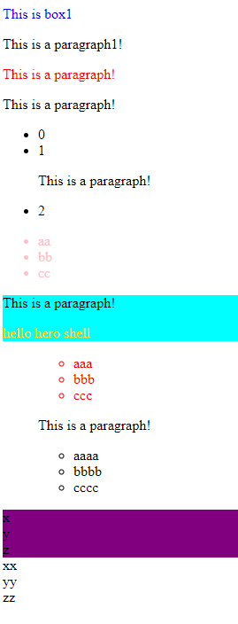

```html
<!DOCTYPE html>
<html lang="en">
<head>
    <meta charset="UTF-8">
    <meta name="viewport" content="width=device-width, initial-scale=1.0">
    <meta http-equiv="X-UA-Compatible" content="ie=edge">
    <title>Document</title>
    <script src="js/jquery-3.3.1.min.js"></script>
    <script>
        $(function () {
            // p1的后面一个变红
            $('.p1').prev().css({color:'blue'});
            // 同级的下一个元素；如果是同级下面所有元素，用nextAll('p')
            $('.p1').next().css({color:'red'});

            $('.p2').parent().css({backgroundColor:'cyan'});
            $('.menu2').children().css({color:'pink'});
            // siblings, 同级除了自己
            $('.box2 p').siblings().css({color:'gold'});
            // 最靠近item1的父级ul，多层的时候用closet; 也可以用多个parent().parnt()，比较麻烦
            $('.item1').closest('ul').css({color:'red'});

            //find
            $('div').find('.boxx').css({backgroundColor:'purple'});

        });
    </script>
</head>
<body>
    <div class="box1">This is box1</div>
    <p class="p1">This is a paragraph1!</p>
    <p>This is a paragraph!</p>
    <p>This is a paragraph!</p>
    <ul class="menu1">
        <li>0</li>
        <li>1</li>
        <p>This is a paragraph!</p>
        <li>2</li>
    </ul>
    <ul class="menu2">
        <li>aa</li>
        <li>bb</li>
        <li>cc</li>
    </ul>
    <div class="box2">
        <p class="p2">This is a paragraph!</p>
        <span>hello</span>
        <span>hero</span>
        <span>shell</span>
    </div>
    <div>
        <ul>
            <ul>
                <li class="item1">aaa</li>
                <li>bbb</li>
                <li>ccc</li>
            </ul>
            <p>This is a paragraph!</p>
            <ul>
                <li>aaaa</li>
                <li>bbbb</li>
                <li>cccc</li>
            </ul>
        </ul>
    </div>

    <div>
        <div>
            <div class="boxx">x</div>
            <div class="boxx">y</div>
            <div class="boxx">z</div>
        </div>
        <div>
            <div>xx</div>
            <div>yy</div>
            <div>zz</div>
        </div>
    </div>
</body>
</html>
```

### `end()`

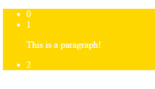

```html
<!DOCTYPE html>
<html lang="en">
<head>
    <meta charset="UTF-8">
    <meta name="viewport" content="width=device-width, initial-scale=1.0">
    <meta http-equiv="X-UA-Compatible" content="ie=edge">
    <title>Document</title>
    <script src="js/jquery-3.3.1.min.js"></script>
    <script>
        $(function () {
            $('.menu1').children().css({color:'#fff'})
            // .end()从children返回 $('.menu1')
            // 而$('.menu1 li')回不了父级
            .end().css({backgroundColor:'gold'});
        });
    </script>
</head>
<body>
    <ul class="menu1">
        <li>0</li>
        <li>1</li>
        <p>This is a paragraph!</p>
        <li>2</li>
    </ul>
</body>
</html>
```

### `siblings()`

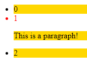

```html
<!DOCTYPE html>
<html lang="en">
<head>
    <meta charset="UTF-8">
    <meta name="viewport" content="width=device-width, initial-scale=1.0">
    <meta http-equiv="X-UA-Compatible" content="ie=edge">
    <title>Document</title>
    <script src="js/jquery-3.3.1.min.js"></script>
    <script>
        $(function () {
            $('.menu1 li:nth-child(2)').css({color:'red'})
            .siblings().css({backgroundColor:'gold'});
        });
    </script>
</head>
<body>
    <ul class="menu1">
        <li>0</li>
        <li>1</li>
        <p>This is a paragraph!</p>
        <li>2</li>
    </ul>
</body>
</html>
```

## `.css()`

读写样式

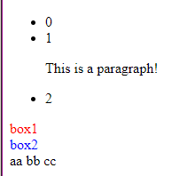

```html
<!DOCTYPE html>
<html lang="en">
<head>
    <meta charset="UTF-8">
    <meta name="viewport" content="width=device-width, initial-scale=1.0">
    <meta http-equiv="X-UA-Compatible" content="ie=edge">
    <title>Document</title>
    <script src="js/jquery-3.3.1.min.js"></script>
    <style>
        .box1{
            color: red;
        }
        .box2{
            color: blue;
        }
    </style>
    <script>
        $(function () {
            //读取一个元素的样式
            var size=$('.menu1 p').css('fontSize');
            console.log(size);//16px

            // 选择器获取的多个元素，获取的是第一个元素的css
            var text=$('div').css('color');
            console.log(text);//rgb(255, 0, 0)

            //addClass, removeClass, toggleClass
            //用F12查看
            $('div span').addClass('span');
            
            //// remove one class
            // $('div a').removeClass('link0');
            $('div a').removeClass('link0 link1');
            //// remove all class
            // $('div a').removeClass();
        });
    </script>
</head>
<body>
    <ul class="menu1">
        <li>0</li>
        <li>1</li>
        <p>This is a paragraph!</p>
        <li>2</li>
    </ul>
    <div class="box1">box1</div>
    <div class="box2">box2</div>
    <div>
        <span>aa</span>
        <span>bb</span>
        <span>cc</span>
    </div>
    <div>
        <a class='link2' href=""></a>
        <a class='link1' href=""></a>
        <a class='link0' href=""></a>
    </div>
</body>
</html>
```

### `toggleClass()` and `.click()`

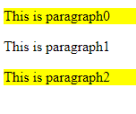

```html
<!DOCTYPE html>
<html lang="en">
<head>
    <meta charset="UTF-8">
    <meta name="viewport" content="width=device-width, initial-scale=1.0">
    <meta http-equiv="X-UA-Compatible" content="ie=edge">
    <title>Document</title>
    <script src="js/jquery-3.3.1.min.js"></script>
    <script>
        $(function () {
            $('p').click(function () {
                $(this).toggleClass('highlight');
            })
        });
    </script>
    <style>
        .highlight{
            background-color: yellow;
        }
    </style>
</head>
<body>
    <p>This is paragraph0</p>
    <p>This is paragraph1</p>
    <p>This is paragraph2</p>
</body>
</html>
```

选项卡例子:

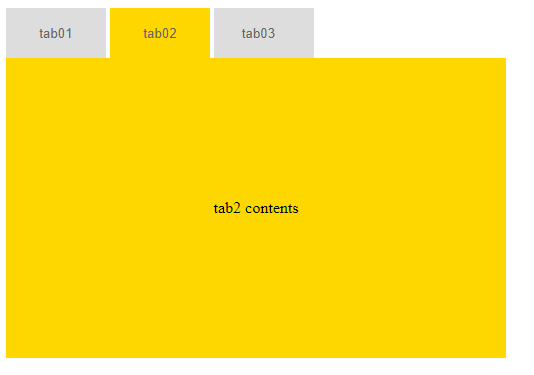

```html
<!DOCTYPE html>
<html lang="en">
<head>
    <meta charset="UTF-8">
    <meta name="viewport" content="width=device-width, initial-scale=1.0">
    <meta http-equiv="X-UA-Compatible" content="ie=edge">
    <title>Document</title>
    <script src="js/jquery-3.3.1.min.js"></script>
    <script>
        $(function () {
            $('#btns input').click(function () {
                //this是原生的对象
                //$(this)才是JQuery的当前对象input
                $(this).addClass('cur').siblings().removeClass('cur');
                //JQuery会帮助存储当前点击的对象索引值
                console.log($(this).index())
                $('#contents div').eq($(this).index()).addClass('active').siblings().removeClass('active');
            })
        });
    </script>
    <style>
        .btns{
            width: 500px;
            height: 50px;
        }
        .btns input{
            width: 100px;
            height: 50px;
            background-color: #ddd;
            color: #666;
            border: 0;
        }
        .btns input.cur{
            background-color: gold;
        }
        .contents div{
            width: 500px;
            height: 300px;
            background-color: gold;
            display: none;
            line-height: 300px;
            text-align: center;
        }
        .contents div.active{
            display: block;
        }
    </style>
</head>
<body>
    <div class="btns" id="btns">
        <input type="button" value="tab01" class="cur">
        <input type="button" value="tab02">
        <input type="button" value="tab03   ">
    </div>
    <div class="contents" id="contents">
        <div class="active">tab1 contents</div>
        <div>tab2 contents</div>
        <div>tab3 contents</div>
    </div>
</body>
</html>
```

## attributes Operation

读写属性值

- `.html()`
- `.text()`
- `.attr()`

```js
var $htm = $('#div1').html();
$('#div1').html('<span>添加文字</span>');


var $htm = $('#div1').text();
$('#div1').text('<span>添加文字</span>');

var $src = $('#img1').attr('src');
// attr无法读取checked的属性，要用prop
$('#img1').attr({ src: "test.jpg", alt: "Test Image" });
```

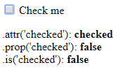

```html
<!DOCTYPE html>
<html lang="en">
<head>
    <meta charset="UTF-8">
    <meta name="viewport" content="width=device-width, initial-scale=1.0">
    <meta http-equiv="X-UA-Compatible" content="ie=edge">
    <title>Document</title>
    <script src="js/jquery-3.3.1.min.js"></script>
    <script>
        $(function () {
            $("input").change(function() {
                $("p").html(
                    ".attr('checked'): <b>" + $(this).attr('checked') + "</b><br>" +
                    ".prop('checked'): <b>" + $(this).prop('checked') + "</b><br>" +
                    ".is('checked'): <b>" + $(this).is(':checked') + "</b>" );
            }).change();//前一个change是挂载一个function, 后面的change()是触发一个change();
        });
    </script>
</head>
<body>
    <input id="check1" type="checkbox" checked="checked">
    <label for="check1">Check me</label>
    <p></p>
</body>
</html>
```

```js
$(function () {
    // 设置属性值
    $('#check1').prop({checked: true});
});
```

## Effects

```html
<!DOCTYPE html>
<html lang="en">
<head>
    <meta charset="UTF-8">
    <meta name="viewport" content="width=device-width, initial-scale=1.0">
    <meta http-equiv="X-UA-Compatible" content="ie=edge">
    <title>Document</title>
    <script src="js/jquery-3.3.1.min.js"></script>
    <script>
        $(function () {
            $('#btn1').click(function () {
                $('.box1').fadeOut();
                // $('.box1').fadeIn();
            });
            $('#btn2').click(function () {
                $('.box2').fadeToggle();
            });
            $('#btn3').click(function () {
                $('.box3').hide();
                // $('.box3').show();
            });
            $('#btn4').click(function () {
                $('.box4').toggle();                
            });
            $('#btn5').click(function () {
                $('.box5').slideDown();                
                // $('.box5').slideUp();                
            });
            $('#btn6').click(function () {
                $('.box6').slideToggle();                
            });
        });
    </script>
    <style>
        div div{
            width: 200px;
            height: 200px;
            background-color: gold;
            border: 1px solid #333;
        }
        .fl{
            float: left;
        }
    </style>
</head>
<body>
    <div class="fl">
        <input type="button" value="Effect" id="btn1">
        <div class="box1"></div>
    </div>
    <div class="fl">
        <input type="button" value="Effect" id="btn2">
        <div class="box2"></div>
    </div>
    <div class="fl">
        <input type="button" value="Effect" id="btn3">
        <div class="box3"></div>
    </div>
    <div class="fl">
        <input type="button" value="Effect" id="btn4">
        <div class="box4"></div>
    </div>
    <div class="fl">
        <input type="button" value="Effect" id="btn5">
        <div class="box5"></div>
    </div>
    <div class="fl">
        <input type="button" value="Effect" id="btn6">
        <div class="box6"></div>
    </div>
</body>
</html>
```

其中效果还可以增加回掉函数

```js
$btn.click(function(){
    $('#div1').fadeIn(1000,'swing',function(){
        alert('done!');
    });
});
```

```js
$('#btn6').click(function () {
    $('.box6').slideToggle(function () { alert('done!') });                
});
```

JQuery的链式调用，前面已经大量用到了，链条越长，JQuery技能越高；性能更高；

层级菜单例子

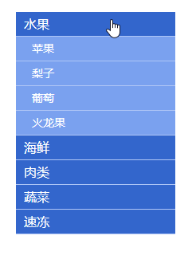

```html
<!DOCTYPE html>
<html lang="en">
<head>
    <meta charset="UTF-8">
    <meta name="viewport" content="width=device-width, initial-scale=1.0">
    <meta http-equiv="X-UA-Compatible" content="ie=edge">
    <title>Document</title>
    <script src="js/jquery-3.3.1.min.js"></script>
    <script>
        $(function () {
            $('.level1').click(function (e) { 
                e.preventDefault();
                $(this).next().slideDown()
                .parent().siblings().children('ul').slideUp();
            });
        });
    </script>
    <style type="text/css">
		body{font-family: 'Microsoft Yahei';}
		body,ul{
			margin:0px;
			padding:0px;
		}
		ul{list-style:none;}
        
        /* menu */
		.menu{
			width:200px;
			margin:20px auto 0;
		}
		.menu .level1,.menu li ul a{
			display:block;
			width:200px;
			height:30px;
			line-height:30px;
			text-decoration:none;
			background-color:#3366cc;
			color:#fff;
			font-size:16px;
			text-indent:10px;			
		}
		.menu .level1{
			border-bottom:1px solid #afc6f6;
		}
		.menu li ul a{
			font-size:14px;
			text-indent:20px;
			background-color:#7aa1ef;
		}
		.menu li ul li{
			border-bottom:1px solid #afc6f6;
		}
		.menu li ul{
			display:none;
		}
		.menu li ul.current{
			display:block;
		}
		.menu li ul li a:hover{
			background-color:#f6b544;
		}
	</style>
</head>
<body>
    <ul class="menu">
		<li>
			<a href="#" class="level1">水果</a>
			<ul class="current">
				<li><a href="#">苹果</a></li>
				<li><a href="#">梨子</a></li>
				<li><a href="#">葡萄</a></li>
				<li><a href="#">火龙果</a></li>
			</ul>
		</li>
		<li>
			<a href="#" class="level1">海鲜</a>
			<ul>
				<li><a href="#">蛏子</a></li>
				<li><a href="#">扇贝</a></li>
				<li><a href="#">龙虾</a></li>
				<li><a href="#">象拔蚌</a></li>
			</ul>
		</li>
		<li>
			<a href="#" class="level1">肉类</a>
			<ul>
				<li><a href="#">内蒙古羊肉</a></li>
				<li><a href="#">进口牛肉</a></li>
				<li><a href="#">野猪肉</a></li>				
			</ul>
		</li>
		<li>
			<a href="#" class="level1">蔬菜</a>
			<ul>
				<li><a href="#">娃娃菜</a></li>
				<li><a href="#">西红柿</a></li>
				<li><a href="#">西芹</a></li>
				<li><a href="#">胡萝卜</a></li>
			</ul>
		</li>
		<li>
			<a href="#" class="level1">速冻</a>
			<ul>
				<li><a href="#">冰淇淋</a></li>
				<li><a href="#">湾仔码头</a></li>
				<li><a href="#">海参</a></li>
				<li><a href="#">牛肉丸</a></li>
			</ul>
		</li>
	</ul>
</body>
</html>
```

## animate

为了更加方便，一般一个标签中的`id`给`<script></script>`用，`class`给`<style></style>`用；

- `fadeOut`, `fadeIn`本质是改变透明度；
- `hide`, `show`本质是改变`display`
- `slideDown`, `slideUp`本质是改变`height`

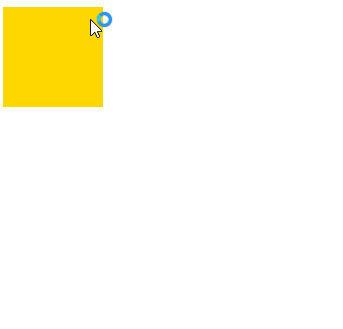

```html
<!DOCTYPE html>
<html lang="en">
<head>
    <meta charset="UTF-8">
    <meta name="viewport" content="width=device-width, initial-scale=1.0">
    <meta http-equiv="X-UA-Compatible" content="ie=edge">
    <title>Document</title>
    <script src="js/jquery-3.3.1.min.js"></script>
    <script src="js/jquery-ui.min.js"></script>
    <script>
        $(function () {
            // 更加丰富的动画曲线来自JQueryUI
            // JQuery只有两种动画曲线: swing(默认值，类似之前的ease),linear
            $('#div1').animate({width:200, height:200},1000, 'swing', function () {
                //// 回掉函数
                // alert('done!');
                // 可以接着动, 但是颜色的改变必须要引入JQueryUI
                $(this).animate({backgroundColor:'green'},1000, function () {
                    $(this).animate({marginTop:100}, function () {
                        $(this).animate({marginLeft:100});
                    })
                })
            })
        });
    </script>
    <style>
        .box1{
            width: 100px;
            height: 100px;
            background-color: gold;
        }
    </style>
</head>
<body>
    <div id="div1" class="box1"></div>
</body>
</html>
```

```js
// 居然可以这么操作
//　没有单位px
$('#div1').animate({width:200, height:'+=200'})
```

### jquery loop

对于选择器选中的每一个进行不同的操作，就需要JQuery的循环；

```html
<!-- simple example -->

<!DOCTYPE html>
<html lang="en">
<head>
    <meta charset="UTF-8">
    <meta name="viewport" content="width=device-width, initial-scale=1.0">
    <meta http-equiv="X-UA-Compatible" content="ie=edge">
    <title>Document</title>
    <script src="js/jquery-3.3.1.min.js"></script>
    <script>
        $(function () {
            $('.menu li').each(function (index) {
                // 这句话会执行5次，对选择的元素每一个单独操作
               $(this).html(index);
            });
        });
    </script>
</head>
<body>
    <ul class="menu">
        <li></li>
        <li></li>
        <li></li>
        <li></li>
        <li></li>
    </ul>
</body>
</html>
```

手风琴例子


```html
<!DOCTYPE html>
<html lang="en">
<head>
    <meta charset="UTF-8">
    <meta name="viewport" content="width=device-width, initial-scale=1.0">
    <meta http-equiv="X-UA-Compatible" content="ie=edge">
    <title>Document</title>
    <script src="js/jquery-3.3.1.min.js"></script>
    <script>
        $(function () {
            $('#accordion li').click(function () {
                // 自己移动
                $(this).animate({left:$(this).index()*20},500);
                // 前面的移动
                $(this).prevAll().each(function () {
                    $(this).animate({left:$(this).index()*20},500);
                });
                //后面的移动
                $(this).nextAll().each(function () {
                    $(this).animate({left:800+$(this).index()*20},500);
                })
            });
        });
    </script>
    <style>
        *{margin: 0;padding: 0;}
        #accordion{
            width: 900px;
            height: 450px;
            margin: 50px auto;
            position: relative;
            overflow: hidden;
            border: 1px solid #ccc;
        }
        #accordion ul{list-style: none;}
        #accordion li{
            position: absolute;
            width: 820px;
        }
        .bar01{left:0px;}
        .bar02{left:820px;}
        .bar03{left:840px;}
        .bar04{left:860px;}
        .bar05{left:880px;}

        /* li img */
        #accordion li img{
            float: right;
            width: 800px;
        }
        /* li span */
        #accordion li span{
            float: left;
            width: 20px;
            height: 450px;
            text-align: center;
            color: #fff;
            cursor: pointer;
        }
        .bar01 span{background:#09E0B5;}
        .bar02 span{background:#3D7FBB;}
        .bar03 span{background:#5CA716;}
        .bar04 span{background:#F28B24;}
        .bar05 span{background:#7C0070;}
    </style>
</head>
<body>
    <div id="accordion">
        <ul>
            <li class="bar01">
                <span>图片01</span>
                </li>
            <li class="bar02">
                <span>图片02</span>
                </li>
            <li class="bar03">
                <span>图片03</span>
                </li>
            <li class="bar04">
                <span>图片04</span>
                </li>
            <li class="bar05">
                <span>图片05</span>
                </li>
        </ul>
    </div>
</body>
</html>
```

### JQuery size and scroll

- width()、height()    获取元素width和height  
- innerWidth()、innerHeight()  包括padding的width和height  
- outerWidth()、outerHeight()  包括padding和border的width和height  
- outerWidth(true)、outerHeight(true)   包括padding和border以及margin的width和height

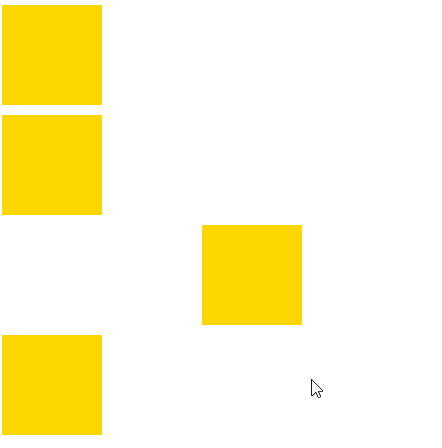

```html
<!DOCTYPE html>
<html lang="en">
<head>
    <meta charset="UTF-8">
    <meta name="viewport" content="width=device-width, initial-scale=1.0">
    <meta http-equiv="X-UA-Compatible" content="ie=edge">
    <title>Document</title>
    <script src="js/jquery-3.3.1.min.js"></script>
    <script>
        $(function () {
            // 相对浏览器的offset
            var position=$('div').eq(2).offset();
            // console.log(position.left, position.top);//208 228
            var w=$('.pos').outerWidth();
            var h=$('.pos').outerHeight();
            $('.pop').css({left:position.left+w,top:position.top});

            $('.pos').mouseover(function () { 
                $('.pop').fadeIn();
            });
            $('.pos').mouseout(function () { 
                $('.pop').fadeOut();
            });
        });
    </script>
    <style>
        .box{
            width: 100px;
            height: 100px;
            background-color: gold;
            margin-bottom: 10px;
        }
        .pos{
            margin-left: 200px;
        }
        .pop{
            position: fixed;
            left: 0;
            top: 0;
            width: 100px;
            height: 100px;
            background-color: pink;
            display: none;
        }
    </style>
</head>
<body>
    <div class="box"></div>
    <div class="box"></div>
    <div class="box pos"></div>
    <div class="box"></div>
    <!-- 后来补充的提示信息, 对原来的结构没有影响 -->
    <div class="pop">Some Msg!</div>
</body>
</html>
```

scrollTop

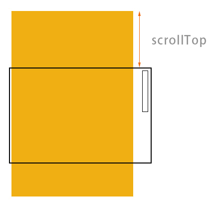

置顶菜单例子

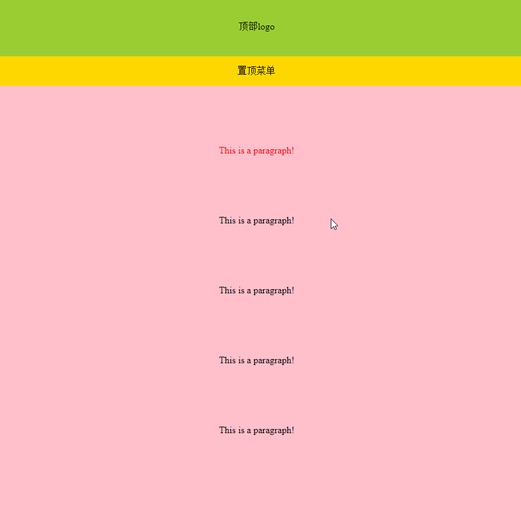

```html
<!DOCTYPE html>
<html lang="en">
<head>
    <meta charset="UTF-8">
    <meta name="viewport" content="width=device-width, initial-scale=1.0">
    <meta http-equiv="X-UA-Compatible" content="ie=edge">
    <title>Document</title>
    <script src="js/jquery-3.3.1.min.js"></script>
    <script>
        $(function () {
            $(window).scroll(function () {
                var nowTop=$(document).scrollTop();
                console.log(nowTop);
                if (nowTop>100) {
                    $('.menu').css({
                        position:'fixed',
                        left:'50%',
                        top:0,
                        marginLeft:'-480px',
                    });
                    // 因为定位的时候，菜单飘出去了，需要有替身占到原来的位置
                    $('.menu_pos').show();
                    //显示 totop
                    $('.totop').fadeIn();
                }else{
                    $('.menu').css({
                        // 变成默认值static
                        position:'',
                        marginLeft:'auto',
                    });
                    $('.menu_pos').hide();
                    $('.totop').fadeOut();
                }
            });

            // 回到页面头部, 固定写法
            $('.totop').click(function (e) { 
                e.preventDefault();
                $('html, body').animate({'scrollTop':0});
            });
        });
    </script>
    <style>
        body{margin: 0;}
        .logo_bar{
            width: 960px;
            height: 100px;
            margin: 0 auto;
            background-color: yellowgreen;

            text-align: center;
            line-height: 100px;
        }
        .menu, .menu_pos{
            width: 960px;
            height: 50px;
            margin: 0 auto;
            background-color: gold;
            
            text-align: center;
            line-height: 50px;
        }
        .menu_pos{display: none;}
        .down_con{
            width: 960px;
            height: 2000px;
            margin: 0 auto;
            background-color: pink;

            /* 解决margin-top塌陷 */
            overflow: hidden;
        }
        .down_con p{
            margin: 100px auto;
            text-align: center;
        }
        .totop{
            position: fixed;
            bottom: 50px;
            right: 50px;
            width: 50px;
            height: 50px;
            background: url(../images/up.png) center center no-repeat #000;
            border-radius: 50%;
            display: none;
        }
    </style>
</head>
<body>
    <div class="logo_bar">顶部logo</div>
    <div class="menu">置顶菜单</div>
    <div class="menu_pos"></div>
    <div class="down_con">
        <p style="color:red">This is a paragraph!</p>
        <p>This is a paragraph!</p>
        <p>This is a paragraph!</p>
        <p>This is a paragraph!</p>
        <p>This is a paragraph!</p>
    </div>
    <!-- 返回头部 -->
    <a href="javascript:;" class="totop"></a>
</body>
</html>
```

### JQuery slide

无缝滚动例子： 用animate不太好做，用定时器就行了；因为animate有一个终点的值，而不停的滚动没有终点值；

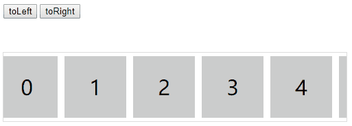

```html
<!DOCTYPE html>
<html lang="en">
<head>
    <meta charset="UTF-8">
    <meta name="viewport" content="width=device-width, initial-scale=1.0">
    <meta http-equiv="X-UA-Compatible" content="ie=edge">
    <title>Document</title>
    <script src="js/jquery-3.3.1.min.js"></script>
    <script>
        $(function () {
            var $ul=$('#slide1 ul');
            var myLeft=0;
            // 无缝滚动的原理：设置两份，当滚动到第二份的时候，跳到第一份
            // 方向和速度
            var direction=2;
            $ul.html($ul.html()+$ul.html());
            var timer1=setInterval(myMove,30);//30ms是经验值
            
            function myMove() {
                myLeft-=direction;
                if (myLeft<-500) {
                    myLeft=0;
                }
                if (myLeft>0) {
                    myLeft=-500;
                }
                $ul.css({left:myLeft});
            }
            // change speed&direction by button
            $('#btn1').click(function () {
                direction=2;
            });
            $('#btn2').click(function () {
                direction=-2;
            });
            // hover to pause
            // 直接清除timer1, 然而ul会保留移动的位置
            $('#slide1').mouseover(function () {
                clearInterval(timer1);
            });
            $('#slide1').mouseout(function () {
                timer1=setInterval(myMove,30);
            });
            
        });
    </script>
    <style>
        body,ul,li{margin: 0;padding: 0;}
        ul{list-style: none;}
        .slide{
            width: 500px;
            height: 100px;
            border: 1px solid #ddd;
            margin: 20px auto;
            position: relative;
            overflow: hidden;
        }
        .slide ul{
            position: absolute;
            /* 连续滚动需要宽度大一倍 */
            width: 1000px;
            height: 100px;
            left: 0;
            top: 0;
        }
        .slide ul li{
            float: left;
            width: 90px;
            height: 90px;
            margin: 5px;
            background-color: #ccc;
            text-align: center;
            font: 30px/90px 'Microsoft Yahei';
        }
        .btns{
            width: 500px;
            height: 50px;
            margin: 10px auto;
        }
    </style>
</head>
<body>
    <div class="btns">
        <input type="button" value="toLeft" id="btn1">
        <input type="button" value="toRight" id="btn2">
    </div>
    <div class="slide" id="slide1">
        <ul>
            <li>0</li>
            <li>1</li>
            <li>2</li>
            <li>3</li>
            <li>4</li>
        </ul>
    </div>
    
</body>
</html>
```

## JQuery Event

### mouseover mouseout mouseenter mouseleave hover

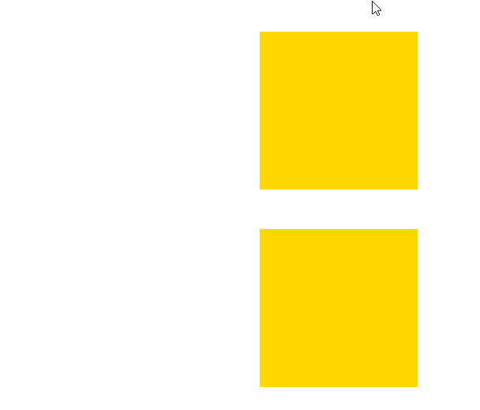

```html
<!DOCTYPE html>
<html lang="en">
<head>
    <meta charset="UTF-8">
    <meta name="viewport" content="width=device-width, initial-scale=1.0">
    <meta http-equiv="X-UA-Compatible" content="ie=edge">
    <title>Document</title>
    <script src="js/jquery-3.3.1.min.js"></script>
    <script>
        $(function () {
            // 小bug, 鼠标移进移出，需要做完了才会停
            $('#div1').mouseover(function () {
                $(this).animate({marginLeft:50});
            });
            $('#div1').mouseout(function () {
                $(this).animate({marginLeft:100});
            });
            // 解决小bug， 用stop
            $('#div2').mouseover(function () {
                // 先把上次的给stop(),再进行这一次的
                $(this).stop().animate({marginLeft:50});
            });
            $('#div2').mouseout(function () {
                $(this).stop().animate({marginLeft:100});
            });

        });
    </script>
    <style>
        .box1,.box2{
            width: 200px;
            height: 200px;
            background-color: gold;
            margin: 50px auto;
        }
    </style>
</head>
<body>
    <div class="box1" id="div1"></div>
    <div class="box2" id="div2"></div>
</body>
</html>
```

- mouseover() 鼠标进入（进入子元素也触发，触发多次, 因为事件冒泡）
- mouseout() 鼠标离开（离开子元素也触发）
- mouseenter() 鼠标进入（进入子元素不触发）
- mouseleave() 鼠标离开（离开子元素不触发）

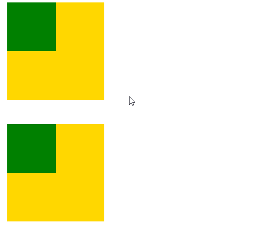

```html
<!DOCTYPE html>
<html lang="en">
<head>
    <meta charset="UTF-8">
    <meta name="viewport" content="width=device-width, initial-scale=1.0">
    <meta http-equiv="X-UA-Compatible" content="ie=edge">
    <title>Document</title>
    <script src="js/jquery-3.3.1.min.js"></script>
    <script>
        $(function () {
            //mouse over&out
            $('#div1').mouseover(function () {
                $(this).animate({marginLeft:100});
            });
            $('#div1').mouseout(function () {
                $(this).animate({marginLeft:20});
            });
            //mouse enter&leave
            //只是取消了事件冒泡
            $('#div2').mouseenter(function () {
                $(this).animate({marginLeft:100});
            });
            $('#div2').mouseleave(function () {
                $(this).animate({marginLeft:20});
            });

        });
    </script>
    <style>
        .box1,.box2{
            width: 200px;
            height: 200px;
            background-color: gold;
            margin-left: 20px;
            margin-bottom: 50px;
        }
        .son{
            width: 100px;
            height: 100px;
            background-color: green;
        }
    </style>
</head>
<body>
    <div class="box1" id="div1">
        <div class="son"></div>
    </div>
    <div class="box2" id="div2">
        <div class="son"></div>
    </div>
</body>
</html>
```

```js
//hover代替mouseenter, mouseleave
$('#div2').hover(function () {
    $(this).animate({marginLeft:100});
},function () {
    $(this).animate({marginLeft:20});
})
```

### blur focus change

选项卡点击tab的时候，会显示一个蓝色的框，消除这个框

```js
$(function () {
    $('#btns input').click(function () {
        $(this).blur();
        //this是原生的对象
        //$(this)才是JQuery的当前对象input
        $(this).addClass('cur').siblings().removeClass('cur');
        //JQuery会帮助存储当前点击的对象索引值
        console.log($(this).index())
        $('#contents div').eq($(this).index()).addClass('active').siblings().removeClass('active');
    })
});
```

经常在input上面使用blur, focus, change

### mouseup mousedown mousemove

用于鼠标拖动

### keyup keydown keypress

keydown, keypress不常用，keyup常用；input框松开的时候

```js
$(function () {
    //松开键触发
    // keyup常用于注册的时候检测此用户名已经存在
    $('#txt1').keyup(function () {
        console.log('key up');
    });
    //失去焦点的时候触发
    $('#txt1').change(function () {
        console.log('changed text!');
    });
});
```

### load ready

```js
$(window).load(function(){

});
```

```js
// 等价于这个
window.onload=function(){

};
```

```js
$(document).read(function(){

});
```

```js
// 简写
$(function () {
            
});
```

### resize scroll select

```js
$(window).resize(function () {
    console.log('resized!');
});
```

```js
$(window).scroll(function(){

});
```

```js
on () {
   $('#txt1').select(function () {
       console.log('selected!');
   }) 
});
```

### submit toggle unload

```js
// animate里面也涌动了toggle, fadeIn...
$( "#target" ).toggle(function() {
  alert( "1st called" );
}, function() {
  alert( "2nd called" );
});
```

- submit() 用户递交表单
- toggle() 根据鼠标点击的次数，依次运行多个函数
- unload() 用户离开页面

### bind

绑定事件的另一种方式，一个event绑定多个function

```html
<!DOCTYPE html>
<html lang="en">
<head>
    <meta charset="UTF-8">
    <meta name="viewport" content="width=device-width, initial-scale=1.0">
    <meta http-equiv="X-UA-Compatible" content="ie=edge">
    <title>Document</title>
    <script src="js/jquery-3.3.1.min.js"></script>
    <script>
        $(function () {
            // 采用bind的好处在于，可以自定义事件
            //bind('myEvent', function(){})
            //自定义事件本质：类似于自定义函数，把这个函数当作事件来用
           $('#btn1').bind('click mouseover',function () {
               console.log('another method');
               // 取消一个, 那么第一次的会出发mouseover, 后面都不会了
               $(this).unbind('mouseover');
           });
           $('#btn2').bind({
               click:function () {
                   console.log('clcked!');
               },
               mouseover: function () {
                   console.log('hovered!')
               },
           });
        });
    </script>
</head>
<body>
    <input type="button" value="Button01" id="btn1">
    <input type="button" value="Button02" id="btn2">
</body>
</html>
```

自定义事件：

```html
<!DOCTYPE html>
<html lang="en">
<head>
    <meta charset="UTF-8">
    <meta name="viewport" content="width=device-width, initial-scale=1.0">
    <meta http-equiv="X-UA-Compatible" content="ie=edge">
    <title>Document</title>
    <script src="js/jquery-3.3.1.min.js"></script>
    <script>
        $(function () {
            $('#btn1').bind('hello',function () {
                console.log('hello!');
            });
            $('#btn1').bind('click',function () {
                console.log('clicked!');
            })
            $('#btn2').click(function () {
                // btn2点击的时候触发btn1的hello事件
                $('#btn1').trigger('hello');
                $('#btn1').trigger('click');
            })
        });
    </script>
</head>
<body>
    <input type="button" value="Button01" id="btn1">
    <input type="button" value="Button02" id="btn2">
</body>
</html>
```