# JQuery Advanced

<!-- TOC -->

- [JQuery Advanced](#jquery-advanced)
  - [event bubble](#event-bubble)
  - [event delegate](#event-delegate)
  - [JQuery element operation](#jquery-element-operation)
  - [mousewheel & throttle](#mousewheel--throttle)
    - [slide example](#slide-example)
  - [json](#json)
  - [ajax & jsonp](#ajax--jsonp)
  - [JQuery Regex](#jquery-regex)
  - [local Storage](#local-storage)
    - [cookie](#cookie)
    - [localStorage](#localstorage)
    - [sessionStorage](#sessionstorage)
  - [JQueryUI](#jqueryui)

<!-- /TOC -->

## event bubble

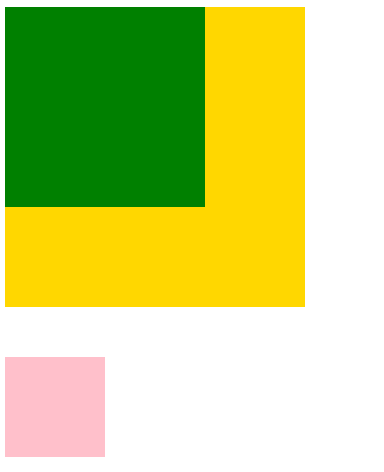

```html
<!DOCTYPE html>
<html lang="en">
<head>
    <meta charset="UTF-8">
    <title>Document</title>
    <script src="js/jquery-3.3.1.min.js"></script>
    <script>
        $(function () {
            $('.grand_father').click(function () {
                console.log(0);
            });
            $('.father').click(function () {
                console.log(1);
            });
            //点击son的时候会出现2 1 0, 即便son在外部
            $('.son').click(function () {
                console.log(2);
            });
            $('body').click(function (e) { 
                //到了body之后，阻止向上传递
                e.stopPropagation();
                console.log(e, 'stopped by body');
                // 获取点击的位置
                console.log('you click at ('+e.clientX+','+e.clientY+')');
            });
            // 阻止弹出右键菜单
            $(document).contextmenu(function (e) {
                e.preventDefault();
                //可以自定义菜单
            });
        });
    </script>
    <style>
        .grand_father{
            width: 300px;
            height: 300px;
            background-color: gold;
            position: relative;
        }
        .father{
            width: 200px;
            height: 200px;
            background-color: green;
        }
        .son{
            width: 100px;
            height: 100px;
            background-color: pink;
            position: absolute;
            left: 0;
            top: 350px;
        }
    </style>
</head>
<body>
    <div class="grand_father">
        <div class="father">
            <div class="son"></div>
        </div>
    </div>
</body>
</html>
```

```js
// event.stopPropagation();
// event.preventDefault();

// 合并写法：
return false;
```

页面弹框例子：在定时器弹框的基础上修改

```html
<!DOCTYPE html>
<html lang="en">
<head>
    <meta charset="UTF-8">
    <title>Document</title>
    <script src="js/jquery-3.3.1.min.js"></script>
    <script>
        $(function () {
            $('#btn').click(function () { 
                $('#pop').show();
                return false;
            });
            $('#shutoff').click(function () {
                $('#pop').hide();
            });
            //点击弹出框外部，让弹框消失
            $(document).click(function () {
                //// 如果btn没有阻止冒泡，那么开始点击的时候不会弹框
                //// 下面例子是点击btn之后，等待2s，
                //// 弹框被document弄消失，证明bubble存在的影响
                // setTimeout(() => {
                //     $('#pop').hide();
                // }, 2000);
                $('#pop').hide();
            });
            //点击弹出框内部，阻止冒泡
            $('.pop').click(function () {
                return false;
            });
        });
    </script>
    <style>
        .pop_con{
			display:none;
		}
		.pop{
			width:400px;
			height:300px;
			background-color:#fff;
			border:1px solid #000;
			position:fixed;
			left:50%;
			top:50%;
			margin-left:-200px;
			margin-top:-150px;
			z-index:9999;
		}
		.mask{
			position:fixed;
			width:100%;
			height:100%;
			background-color:#000;
			left:0;
			top:0;
			opacity:0.3;
			filter:alpha(opacity=30);
			z-index:9990;		
		}
    </style>
</head>
<body>
    <h1>首页标题</h1>
	<p>页面内容</p>
    <input type="button" name="" value="弹出" id="btn">
    
	<div class="pop_con" id="pop">
		<div class="pop">
			<h3>提示信息！</h3>
			<a href="#" id="shutoff">关闭</a>
			<input type="text" name="">
		</div>
		<div class="mask"></div>
	</div>
</body>
</html>
```

## event delegate

当bubble不利于逻辑的时候要阻止冒泡；但是bubble有利于性能；

事件委托：利用事件冒泡，将事件处理器放到父级，根据事件的来源，进行不同的操作；

```html
<!DOCTYPE html>
<html lang="en">
<head>
    <meta charset="UTF-8">
    <title>Document</title>
    <script src="js/jquery-3.3.1.min.js"></script>
    <script>
        $(function () {
            //// 一般绑定事件写法
            //// 性能不高，因为有100个li就要绑定100次
            // var $ali = $('#list1 li');
            // $ali.click(function () {
            //     $(this).css({backgroundColor:'red'});
            // })
            // 利用委托的写法，减少绑定次数
            $('#list1').delegate('li', 'click', function () {
                $(this).css({backgroundColor:'pink'});
                // // 第一次的时候委托，然后点击之后，取消了委托，后面就没有反应了
                // $('#list1').undelegate()
            });

        });
    </script>
    <style>
        #list1 li{
            height: 30px;
            margin-bottom: 10px;
            background-color: gold;
        }
    </style>
</head>
<body>
    <div>
        <ul id="list1">
            <li>0</li>
            <li>1</li>
            <li>2</li>
            <li>3</li>
            <li>4</li>
        </ul>
    </div>
</body>
</html>
```

## JQuery element operation

原生的方法新增标签比较困难，JQuery比较容易；

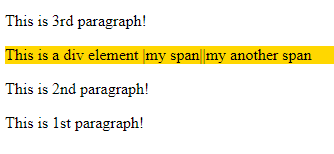

```html
<!DOCTYPE html>
<html lang="en">
<head>
    <meta charset="UTF-8">
    <title>Document</title>
    <script src="js/jquery-3.3.1.min.js"></script>
    <script>
        $(function () {
            //create a element
            var $span1=$('<span>|my span|</span>');
            var $span2=$('<span>|my another span</span>|');
            //// 标签内部插入元素
            // append vs appendTo
           $('#div1').append($span1)
           $span2.appendTo('#div1');
           // prepend vs prependTo
           
           //// 标签外部插入元素
           // after vs insertAfter
            var $p1=$('<p>This is 1st paragraph!</p>');
            var $p2=$('<p>This is 2nd paragraph!</p>');
            var $p3=$('<p>This is 3rd paragraph!</p>');
            $('#div1').after($p1);
            $p2.insertAfter('#div1');
            // before vs insertBefore
            $p3.insertBefore('#div1');
            // 删除element
            // $p3.remove();
        });
    </script>
    <style>
        #div1{
            background-color: gold;
        }
    </style>
</head>
<body>
    <div id="div1">This is a div element </div>
</body>
</html>
```

todolist(计划列表)实例

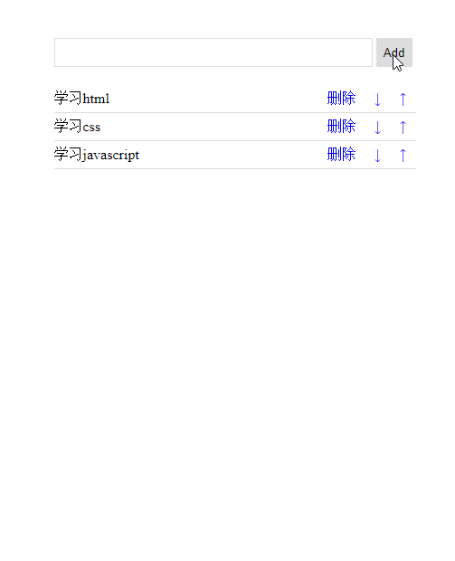

```html
<!DOCTYPE html>
<html lang="en">
<head>
    <meta charset="UTF-8">
    <title>Document</title>
    <script src="js/jquery-3.3.1.min.js"></script>
    <script>
        $(function () {
            // button add
            $('#btn1').click(function () {
                var txt=$('#txt1').val();
                $('#txt1').val('');
                // 空字符串不添加
                if (txt==='') {
                    alert('inputbox cannot be empty!');
                    return;
                }
                // 非空情况添加
                var $li=$('<li><span>'+ txt +'</span><a href="javascript:;" class="up"> ↑ </a><a href="javascript:;" class="down"> ↓ </a><a href="javascript:;" class="del">删除</a></li>');
                $li.appendTo('#list');
            });
            // 按Enter提交
            // Trigger a Button Click on Enter
            $('#txt1').bind('enterKey', function () {
                $('#btn1').click();
            })
            $('#txt1').keyup(function (e) {
                if (e.keyCode==13) {
                    $(this).trigger('enterKey');
                }
            })
            // delegate
            $('#list').delegate('a','click',function () {
                var handler=$(this).attr('class');
                switch (handler) {
                    case 'del':
                        $(this).parent().remove();
                        break;
                    case 'up':
                        if ($(this).parent().prev().length===0) {
                            alert('到顶了');
                            return;
                        }
                        $(this).parent().insertBefore($(this).parent().prev());
                        break;
                    case 'down':
                        if ($(this).parent().next().length===0) {
                            alert('到底了');
                            return;
                        }
                        $(this).parent().insertAfter($(this).parent().next());
                        break;
                    default:
                        break;
                }
            })
        });
    </script>
    <style>
        .list_con{
            width: 400px;
            margin: 50px auto 0;
        }
        .text1{
            width: 350px;
            height: 30px;
            border: 1px solid #ddd;
            padding: 0;
            text-indent: 10px;
        }
        .btn_add{
            width: 40px;
            height: 32px;
            padding: 0;
            border: 1px solid #ddd;
        }
        .list{
            margin: 0;
            padding: 0;
            list-style: none;
            margin-top: 20px;
        }
        .list li{
            height: 30px;
            line-height: 30px;
            border-bottom: 1px solid #ddd;
        }
        .list li span{
            float: left;
        }
        .list li a{
            float: right;
            text-decoration: none;
            margin: 0 10px;
        }
    </style>
</head>
<body>
    <div class="list_con">
        <input type="text" name="" id="txt1" class="text1">
        <input type="button" value="Add" id="btn1" class="btn_add">
        <ul id="list" class="list">
            <li>
                <span>学习html</span>
                <a href="javascript:;" class="up"> ↑ </a>
                <a href="javascript:;" class="down"> ↓ </a>
                <a href="javascript:;" class="del">删除</a>
            </li>
            <li>
                <span>学习css</span>
                <a href="javascript:;" class="up"> ↑ </a>
                <a href="javascript:;" class="down"> ↓ </a>
                <a href="javascript:;" class="del">删除</a>
            </li>
            <li>
                <span>学习javascript</span>
                <a href="javascript:;" class="up"> ↑ </a>
                <a href="javascript:;" class="down"> ↓ </a>
                <a href="javascript:;" class="del">删除</a>
            </li>
        </ul>
    </div>
</body>
</html>
```

## mousewheel & throttle

滚轮事件和函数节流

使用jquery的滚轮事件插件**jquery.mousewheel.js**


```html
<!DOCTYPE html>
<html lang="en">
<head>
    <meta charset="UTF-8">
    <title>Document</title>
    <script src="js/jquery-3.3.1.min.js"></script>
    <script src="js/jquery.mousewheel.min.js"></script>
    <script>
        $(function () {
            // change height according to browser
            var $h=$(window).height();
            $('.pages').css({height:$h});

            // first screen
            var screen_nums=$('.pages').length;
            var now_screen=0;
            // add moving class
            $('.pages').eq(0).addClass('moving');

            var $points=$('.points li');

            $(window).mousewheel(function (event, dat) {
                // // 向下滚是-1; 向上滚是1
                // console.log(dat);
                if (dat===-1) {
                    now_screen++;
                    if (now_screen>screen_nums-1) {
                        now_screen=screen_nums-1;
                    }
                }else{
                    now_screen--;
                    if (now_screen<0) {
                        now_screen  =0;
                    }
                }
                // change pages
                // 本质是动top值
                // 而且transition里面设置了延迟来更好衔接动画
                $('.pages_con').animate({top:-$h*now_screen},300);
                // change points
                $points.eq(now_screen).addClass('active').siblings().removeClass('active');
                // change moving
                // 为了让每次滚动都有动画，需要将其他screen的去掉
                $('.pages').eq(now_screen).addClass('moving').siblings().removeClass('moving');
            })
        });
    </script>
    <style>
        body, ul{margin: 0;padding: 0}
        ul{list-style: none;}
        
        /* every page */
        .pages_con{
            position: fixed;
            left: 0;
            top: 0;
            width: 100%;
            /* 解决margin-top */
            overflow: hidden;
        }
        .pages{
            /* 预设高度600px, 然后根据jquery动态修改 */
            height: 600px;
            position: relative;
        }
        .page1{	background-color:orange;}
        .page2{	background-color:lightgreen;}
        .page3{	background-color:cyan;}
        .page4{	background-color:pink;}
        .page5{	background-color:lightblue;}
        
        /* right points */
        .points{
        	width:16px;
        	height:176px;
        	position:fixed;
        	right:20px;
        	top:50%;
        	margin-top:-88px;
        }
        .points li{
        	width:13px;
        	height:13px;
        	margin:16px 0;
        	border-radius:50%;
        	border:1px solid #666;
        	cursor:pointer;
        }
        .points li.active{background-color: #666;}
        /* main area */
        .main_con{
            width: 900px;
            height: 400px;
            position: absolute;
            left: 50%;
            top: 50%;
            margin-left: -450px;
            margin-top: -200px;
        }
        /* left_img & right_info */
        .main_con .left_img{
            float: left;
            width: 363px;
            height: 400px;
            position: relative;
            left: -50px;
            opacity: 0;
            filter: alpha(opacity=0);
            transition: all 1000ms ease 300ms;
        }
        .main_con .right_info{
            width: 500px;
            height: 300px;
            margin-top: 50px;
            float: right;
            font: 20px/50px 'Microsoft Yahei';
            color: #666;
            text-indent: 2em;
            text-align:center;
            position: relative;
            right: -50px;
            opacity: 0;
            filter: alpha(opacity=0);
            transition: all 1000ms ease 300ms;
        }
        .moving .main_con .left_img{
            left: 0;
            opacity: 1;
            filter: alpha(opacity=100);filter: alpha(opacity=0);
        }
        .moving .main_con .right_info{
            right: 0;
            opacity: 1;
            filter: alpha(opacity=100);            
        }
        /* right_img & left_info */
        .main_con .right_img{
            float: right;
            width: 522px;
            height: 400px;
            position: relative;
            top: -50px;
            opacity: 0;
            filter: alpha(opacity=0);
            transition: all 1000ms ease 300ms;
        }
        .main_con .left_info{
            width: 350px;
            height: 300px;
            margin-top: 50px;
            float: left;
            font: 20px/50px 'Microsoft Yahei';
            color: #666;
            text-indent: 2em;
            text-align:center;
            position: relative;
            bottom: -50px;
            opacity: 0;
            filter: alpha(opacity=0);
            transition: all 1000ms ease 300ms;
        }
        .moving .main_con .right_img{
            top: 0;
            opacity: 1;
            filter: alpha(opacity=100);filter: alpha(opacity=0);
        }
        .moving .main_con .left_info{
            bottom: 0;
            opacity: 1;
            filter: alpha(opacity=100);            
        }
        /* center img */
        .main_con .center_img{
            width: 611px;
            height: 337px;
            position: absolute;
            left: 50%;
            margin-left: -305px;
            bottom: -50px;
            opacity: 0;
            filter: alpha(opacity=0);
            transition: all 1000ms ease 300ms;
        }
        .moving .main_con .center_img{
            bottom: 0;
            opacity: 1;
            filter: alpha(opacity=100);
        }
    </style>
</head>
<body>
    <div class="pages_con">
            <div class="pages page1">
                <div class="main_con">
                    <div class="left_img"></div>
                    <div class="right_info">
                        Web前端开发是从网页制作演变而来的，名称上有很明显的时代特征。在互联网的演化进程中，网页制作是Web1.0时代的产物，那时网站的主要内容都是静态的，用户使用网站的行为也以浏览为主。
                    </div>
                </div>
            </div>

            <div class="pages page2">
                <div class="main_con">
                    <div class="right_img"></div>
                    <div class="left_info">
                        2005年以后，互联网进入Web2.0时代，各种类似桌面软件的Web应用大量涌现，网站的前端由此发生了翻天覆地的变化。网页不再只是承载单一的文字和图片，各种富媒体让网页的内容更加生动，网页上软件化的交互形式为用户提供了更好的使用体验，这些都是基于前端技术实现的。
                    </div>
                </div>

            </div>

            <div class="pages page3">
                <div class="main_con">
                    <div class="left_img"></div>
                    <div class="right_info">
                        以前会Photoshop和Dreamweaver就可以制作网页，现在只掌握这些已经远远不够了。无论是开发难度上，还是开发方式上，现在的网页制作都更接近传统的网站后台开发，所以现在不再叫网页制作，而是叫Web前端开发。
                    </div>
                </div>			
            </div>

            <div class="pages page4">
                <div class="main_con">
                    <div class="left_img"></div>
                    <div class="right_info">
                        Web前端开发在产品开发环节中的作用变得越来越重要，而且需要专业的前端工程师才能做好，这方面的专业人才近几年来备受青睐。Web前端开发是一项很特殊的工作，涵盖的知识面非常广，既有具体的技术，又有抽象的理念。简单地说，它的主要职能就是把网站的界面更好地呈现给用户。
                    </div>
                </div>			
            </div>

            <div class="pages page5">
                <div class="main_con">
                    <div class="center_img"></div>		
                </div>
            </div>
        </div>
        <ul class="points">
            <li class="active"></li>
            <li></li>
            <li></li>
            <li></li>
            <li></li>
        </ul>        
</body>
</html>
```

缺陷，猛的滚动一下会滚动好几屏，需要用到**函数节流**

javascript中有些事件的触发频率非常高, 所以会出现上面的问题；要用**定时器**来做**函数节流**

```html
<script>
    $(function () {
        // change height according to browser
        var $h=$(window).height();
        $('.pages').css({height:$h});
    
        // first screen
        var screen_nums=$('.pages').length;
        var now_screen=0;
        // add moving class
        $('.pages').eq(0).addClass('moving');
    
        var $points=$('.points li');
        var $pages=$('.pages');
    
        //定时器做函数节流, 全局变量占位
        var timer1=null;

        $(window).mousewheel(function (event, dat) {
            // // 向下滚是-1; 向上滚是1
            // console.log(dat);
            
            // 必须要开始的时候清除定时器,使得猛的滚动，最后一次有效
            // 间隔了200ms
            clearTimeout(timer1);
            //
            timer1=setTimeout(function () {
                if (dat===-1) {
                    now_screen++;
                    if (now_screen>screen_nums-1) {
                        now_screen=screen_nums-1;
                    }
                }else{
                    now_screen--;
                    if (now_screen<0) {
                        now_screen  =0;
                    }
                }
                // change pages
                // 本质是动top值
                // 而且transition里面设置了延迟来更好衔接动画
                $('.pages_con').animate({top:-$h*now_screen},300);
                // change points
                $points.eq(now_screen).addClass('active').siblings().removeClass('active');
                // change moving
                // 为了让每次滚动都有动画，需要将其他screen的去掉
                $('.pages').eq(now_screen).addClass('moving').siblings().removeClass('moving');
            },200);
        });
        // click point to scroll
        $points.click(function() {
			var nowindex = $(this).index();
			$('.pages_con').animate({top:-nowindex*$h},300);
			$pages.eq(nowindex).addClass('moving').siblings().removeClass('moving');
			$points.eq(nowindex).addClass('active').siblings().removeClass('active');
		});
    });
</script>
```

### slide example

幻灯片例子原理：把1放在一堆，2,3,4放在一堆；左边是主，如果目标slide比主大，从右边过来；如果目标slide比主小，从左边过来(自动移动定位);加上左右的箭头这两种极端的情况，一共四种情况；

传统的做法：多张图片拼成一个长条，然后进行类似之前的移动；缺点是如果从1到3，必须要进过2；现在不用了；

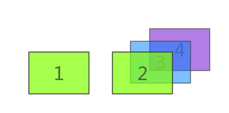

```bash
SlideExample/
    images/
    js/
        slide.js
    css/
    index.html
    register.html
```


```js
$(function () {
	var $li=$('.slide_pics li')
	var slide_nums=$li.length;
	// 除了第一个，其他都扔到右边
	$li.not(':first').css({left:760});

	// 将要过来的li
	var now_li=0;
	//当前要离开的li
	var pre_li=0;

	//创建下面的点
	$li.each(function (index) {
		//创建li
		var $sli=$('<li>');
		if (index===0) {
			$sli.addClass('active');
		}
		$sli.appendTo('.points')
	});
	var $points=$('.points li');
	$points.click(function () {
		now_li=$(this).index();
		// 处理pre_li===now_li
		if (now_li===pre_li) {
			return;
		}
		move();
		$(this).addClass('active').siblings().removeClass('active');
	})

	
	//左右箭头点击的切换
	$('.prev').click(function () {
		now_li--;
		move();
		$points.eq(now_li).addClass('active').siblings().removeClass('active');
	});
	$('.next').click(function () {
		now_li++;
		move();
		$points.eq(now_li).addClass('active').siblings().removeClass('active');
	});

	// 自动播放
	var timer1=setInterval(autoplay, 4000);
	function autoplay() {
		now_li++;
		move();
		$points.eq(now_li).addClass('active').siblings().removeClass('active');
	}

	// 鼠标悬浮暂停
	$('.slide').mouseenter(function () {
		clearInterval(timer1);
	});
	$('.slide').mouseleave(function () {
		timer1=setInterval(autoplay, 3000);
	})

	//处理所有的运动
	function move() {
		// 点击太快会出现错误，因为animate有时间差，需要用到stop
		// 结束前面的动画

		// 处理极端情况
		if (now_li<0) {
			now_li=slide_nums-1;
			pre_li=0;
			// 从左边过来
			$li.eq(now_li).css({left:-760});
			$li.eq(pre_li).stop().animate({left:760});
			$li.eq(now_li).stop().animate({left:0});
			pre_li=now_li;
			return;
		}
		if (now_li>slide_nums-1) {
			now_li=0;
			pre_li=slide_nums-1;
			// 从右边过来
			$li.eq(now_li).css({left:760}); 
			$li.eq(pre_li).stop().animate({left:-760});
			$li.eq(now_li).stop().animate({left:0});
			pre_li=now_li;
			return;
		}
		// 处理一般情况
		if (pre_li<now_li) {
			$li.eq(now_li).css({left:760}); 
			$li.eq(pre_li).stop().animate({left:-760});
		} else {
			$li.eq(now_li).css({left:-760});
			$li.eq(pre_li).stop().animate({left:760});
		}
		$li.eq(now_li).stop().animate({left:0});
		pre_li=now_li;
	};
});
```

## json

json是 JavaScript Object Notation 的首字母缩写，单词的意思是javascript对象表示法，这里说的json指的是类似于javascript对象的一种数据格式

```js
// javascript object
var tom = {
    name:'tom',
    age:18
}
```

json的key必须用双引号, 字符串数据必须用双引号

```json
{
    "name":"tom",
    "age":26,
    "info":["male","enigneer",10000]
}
```

## ajax & jsonp

ajax的本质是让javascript发送http请求；

nodeJS功能类似python, 是一个后台语言；但是语法和javascript一样的，也就是说跑在后台的javascipt语言；nodeJS并发性能高；

让**本文件夹**变成**服务器文件夹**，用node跑文件夹中的`server.js`; 但是我用的是**liveserver**所以没有必要；如果不是服务器文件夹，那么会出现

可以用316的电脑访问3055的liveserver(`http://10.128.160.66:5500/SlideExample/`)

```bash
# 特征错误，表示只能请求同一个域的资源；
# 跨域请求要用jsonp
Cross origin requests are only supported for protocol schemes
```

```bash
# 运行服务器，是http://localhost:8888
node server.js
```

```js
// server.js

/*
NodeJS Static Http Server - http://github.com/thedigitalself/node-static-http-server/
By James Wanga - The Digital Self
Licensed under a Creative Commons Attribution 3.0 Unported License.

A simple, nodeJS, http development server that trivializes serving static files.

This server is HEAVILY based on work done by Ryan Florence(https://github.com/rpflorence) (https://gist.github.com/701407). I merged this code with suggestions on handling varied MIME types found at Stackoverflow (http://stackoverflow.com/questions/7268033/basic-static-file-server-in-nodejs).

To run the server simply place the server.js file in the root of your web application and issue the command 
$ node server.js 
or 
$ node server.js 1234 
with "1234" being a custom port number"

Your web application will be served at http://localhost:8888 by default or http://localhost:1234 with "1234" being the custom port you passed.

Mime Types:
You can add to the mimeTypes has to serve more file types.

Virtual Directories:
Add to the virtualDirectories hash if you have resources that are not children of the root directory

*/
var http = require("http"),
    url = require("url"),
    path = require("path"),
    fs = require("fs")
    port = process.argv[2] || 8888;

var mimeTypes = {
    "htm": "text/html",
    "html": "text/html",
    "jpeg": "image/jpeg",
    "jpg": "image/jpeg",
    "png": "image/png",
    "gif": "image/gif",
    "js": "text/javascript",
    "css": "text/css"};

var virtualDirectories = {
    //"images": "../images/"
  };

http.createServer(function(request, response) {

  var uri = url.parse(request.url).pathname
    , filename = path.join(process.cwd(), uri)
    , root = uri.split("/")[1]
    , virtualDirectory;
  
  virtualDirectory = virtualDirectories[root];
  if(virtualDirectory){
    uri = uri.slice(root.length + 1, uri.length);
    filename = path.join(virtualDirectory ,uri);
  }

  fs.exists(filename, function(exists) {
    if(!exists) {
      response.writeHead(404, {"Content-Type": "text/plain"});
      response.write("404 Not Found\n");
      response.end();
      console.error('404: ' + filename);
      return;
    }

	if (fs.statSync(filename).isDirectory()) filename += '/index.html';

    fs.readFile(filename, "binary", function(err, file) {
      if(err) {        
        response.writeHead(500, {"Content-Type": "text/plain"});
        response.write(err + "\n");
        response.end();
        console.error('500: ' + filename);
        return;
      }

      var mimeType = mimeTypes[path.extname(filename).split(".")[1]];
      response.writeHead(200, {"Content-Type": mimeType});
      response.write(file, "binary");
      response.end();
      console.log('200: ' + filename + ' as ' + mimeType);
    });
  });
}).listen(parseInt(port, 10));

console.log("Static file server running at\n  => http://localhost:" + port + "/\nCTRL + C to shutdown");
```

ajax例子

```bash
./
    js/
        jquery.js 
    data.json
    index.html
```

```json
{
    "name":"tom",
    "age":26,
    "info":["male","enigneer",10000]
}
```

```html
<!DOCTYPE html>
<html lang="en">
<head>
    <meta charset="UTF-8">
    <title>Document</title>
    <script src="js/jquery-3.3.1.min.js"></script>
    <script>
        $.ajax({
            type: "get",
            // url一般是一个接口地址，后台约定好的；还有接口文档
            url: "data.json",
            ////下面这个是请求服务器的第几页数据，这里不写
            // data: "data",
            dataType: "json",
        }).done(function (dat) {
            console.log(dat);//data.json内容
            console.log(dat.name);//tom
        }).fail(function () {
            console.log('error!')
        });
        
    </script>
</head>
<body> 
</body>
</html>
```

状态栏的登录信息：

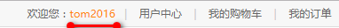

商品信息也是通过ajax塞到页面上的，原理是一样的；剩下的就是拼数据塞到页面上；

```bash
SlideExample/
    js/
        data.json
    index.html
```

```json
{
	"code":1,
	"data":{
		"name":"tom2016",
		"age":18
	}
}
```

```html
<script type="text/javascript">
	$.ajax({
		url: 'js/data.json',
		// 小型数据用get; 大型的安全的数据用post
		type: 'get',
		dataType: 'json'
	})
	.done(function(data) {
		if(data.code==1){
			$('.login_info em').html(data.data.name);
			$('.login_info').show();
			$('.login_btn').hide();
		}
	})
	.fail(function() {
		alert('链接超时，请重试！');
	})
</script>

<div class="header">
	<div class="welcome fl">欢迎来到天天生鲜!</div>
	<div class="fr">
		<div class="login_info fl">
			欢迎您：<em>张 山</em>
		</div>
		<div class="login_btn fl">
			<a href="login.html">登录</a>
			<span>|</span>
			<a href="register.html">注册</a>
		</div>
		<div class="user_link fl">
			<span>|</span>
			<a href="user_center_info.html">用户中心</a>
			<span>|</span>
			<a href="cart.html">我的购物车</a>
			<span>|</span>
			<a href="user_center_order.html">我的订单</a>
		</div>
	</div>
</div>
```

跨域请求：登陆论坛的时候，用QQ账号登录，这就是跨域请求; 请求别人服务器上的数据

jsonp跨域请求的原理：主要是利用了script标签可以跨域链接资源的特性(就是`src=xxx/xxx.js`可以是其他网站资源)

比如12306引用了国外网站的js, 导致国外网站变得很慢；

一般都是引用国内的镜像上的js: `<script type="text/javascript" src="https://cdn.bootcss.com/jquery/3.3.1/jquery.min.js"></script>`

```bash
# 原生跨域
./
    js/
        dat.js
    index.html
```

```js
// dat.js

aa({"name":"tom"})
```

```html
<!DOCTYPE html>
<html lang="en">
<head>
    <meta charset="UTF-8">
    <title>Document</title>
    <!-- 跨域请求 -->
    <script>
        function aa(myData) {
            console.log(myData);//{name: "tom"}
            console.log(myData.name);//tom
        }
        </script>
    <script src="js/dat.js"></script>
</head>
<body>
    
</body>
</html>
```

JQuery的jsonp跨域

```bash
./
    js/
        jquery.js
        dat.js
    index.html
```

```html
<!DOCTYPE html>
<html lang="en">
<head>
    <meta charset="UTF-8">
    <title>Document</title>
    <script src="js/jquery-3.3.1.min.js"></script>
    <script>
        $.ajax({
            type: "get",
            url: "js/dat.js",
            dataType: "jsonp",
            // jsonpCallback很重要
            jsonpCallback: "aa"
        })
        .done(function (myData) {
            console.log(myData);//{name: "tom"}
            console.log(myData.name);//tom
        })
        .fail(function () {
            console.log(error);
        });
    </script>
</head>
<body>
    
</body>
</html>
```

利用的360接口

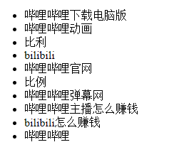

```html
<!DOCTYPE html>
<html lang="en">
<head>
    <meta charset="UTF-8">
    <title>Document</title>
    <script src="js/jquery-1.12.4.min.js"></script>
    <script>
        // so.com, 输入bili, 然后F12看它的Network/js
        // https://sug.so.360.cn/suggest?callback=suggest_so&encodein=utf-8&encodeout=utf-8&format=json&fields=word&word=bili
        // 可以现在open in newtab中试一试
        // &后面的都是ajax生成的
        $.ajax({
            url: "https://sug.so.360.cn/suggest?",
            type: "get",
            dataType: "jsonp",
            data: {word:"bili"},
            jsonpCallback:"suggest_so"
        })
        .done(function (myData) {
            console.log(myData);
            console.log(myData.s.length);

            for (var i = 0; i < myData.s.length; i++) {
                var $li=$('<li>'+myData.s[i]+'</li>');
                $li.prependTo('.list');
            }
        })
        .fail(function () {
            console.log('error');
        });
    </script>
</head>
<body>
    <ul class="list"></ul>
</body>
</html>
```

利用接口，自动联想，但是有可能被服务器拒绝；

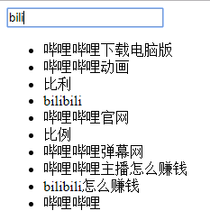

```html
<!DOCTYPE html>
<html lang="en">
<head>
    <meta charset="UTF-8">
    <title>Document</title>
    <script src="js/jquery-1.12.4.min.js"></script>
    <script>
        $(function () {
            $('#txt01').keyup(function () {
                var val=$(this).val();
                $.ajax({
                    url: "https://sug.so.360.cn/suggest?",
                    type: "get",
                    dataType: "jsonp",
                    data: {word:val},
                    jsonpCallback:"suggest_so"
                })
                .done(function (myData) {
                    $('.list').empty();
                    for (var i = 0; i < myData.s.length; i++) {
                        var $li=$('<li>'+myData.s[i]+'</li>');
                        $li.prependTo('.list');
                    }
                })
                .fail(function () {
                    console.log('error');
                });
            })
        })
    </script>
</head>
<body>
    <input type="text" id="txt01">
    <ul class="list"></ul>
</body>
</html>
```

## JQuery Regex

因为数据直接从后台用ajax传递当前端，后台一般用regex把数据处理好了，所以前端用regex的几率不大；即便是用也是简单的处理-**表单验证**

JS Regex:
- `.test()`: 判断匹配
- `.exec()`: 提取字符串

```js
// 不需要JQuery
let s1 = 'abc123';
let s2 = '123abc';
let s3 = '123abc456';

// i: ignore case; g: 全局匹配
let r1 = new RegExp('\\d+'); // not recommended
let r2 = new RegExp('a', 'ig'); // not recommended
let r3 = /\d+/; // same as r1
let r4 = /a/ig; // same as r2
let r5 = /^\d+/;
// test: 默认就是全局匹配
r1.test(s1);// true
r1.test(s2);// true

r2.test(s1);// true
r2.test(s2);// true

r5.test(s1);// false
r5.test(s2);// true

// exec: 默认匹配第一个
// find first one
r1.exec(s1); // ["123"]
r1.exec(s3); // ["123"]
// 类似finditer: 获得一个iter
let r6 = /\d+/g;
r6.exec(s1); // ["123"]
r6.exec(s1); // null
while (res1 = r6.exec(s3)) {
    console.log(res1);
}; // ["123"], ["456"]


// group
let s4 = 'JavaScript is different with TypeScript';
let r7 = /(\w+)Script/;
let r8 = /(\w+)Script/g;
r7.exec(s4);// ["JavaScript", "Java"]
while (res2 = r8.exec(s4)) {
    console.log(res2);
}; // ["JavaScript", "Java"], ["TypeScript", "Type"]

// multiline
let s5 = 'JavaScript is different with \nJava;\nand Javabean!';
let r9 = /Java(\w*)/g;
let r10 = /^Java(\w*)/g;
let r11 = /^Java(\w*)/gm;
while (res3 = r9.exec(s5)) {
    console.log(res3);
}; // ["JavaScript", "Java"],["Java", ""], ["Javabean", "bean"]

while (res4 = r10.exec(s5)) {
    console.log(res4);
}; // ["JavaScript", "Java"]

while (res5 = r11.exec(s5)) {
    console.log(res5);
}; // ["JavaScript", "Java"],["Java", ""]
```

`search`只是搜索pattern在字符串中的位置, 一般用`IndexOf`代替; `replace`替换字符串, 一般用来做过滤敏感词;

表单验证例子：数据提交到服务器之前进行验证，减轻服务器压力；而且前端去验证，速度更快；

只要会写 用户名、密码、邮箱的正则就可以了；

```bash
SlideExample/
    js/
        register.js
    register.html
```

```html
<!-- register -->

<script type="text/javascript" src="js/register.js"></script>
```

```js
// register.js

$(function(){
	var error_name = false;
	var error_password = false;
	var error_check_password = false;
	var error_email = false;
	var error_check = false;//是否同意协议

	$('#user_name').blur(function() {
        // 失去焦点的时候
		check_user_name();
	});

	$('#user_name').focus(function() {
		// 输入的时候隐藏提示信息
		$(this).next().hide();
	});

	$('#pwd').blur(function() {
		check_pwd();
	});

	$('#pwd').focus(function() {
		$(this).next().hide();
	});

	$('#cpwd').blur(function() {
		check_cpwd();
	});

	$('#cpwd').focus(function() {
		$(this).next().hide();
	});

	$('#email').blur(function() {
		check_email();
	});

	$('#email').focus(function() {
		$(this).next().hide();
	});

	$('#allow').click(function() {
        //$(this).prop('checked')
		if($(this).is(':checked'))
		{
			error_check = false;
			$(this).siblings('span').hide();
		}
		else
		{
			error_check = true;
			$(this).siblings('span').html('请勾选同意');
			$(this).siblings('span').show();
		}
	});


	function check_user_name(){
		//数字字母或下划线
		var reg = /^\w{5,15}$/;
		// var reg = /^[a-z0-9_]{5,15}$/i;
		var val = $('#user_name').val();

		if(val==''){
			$('#user_name').next().html('用户名不能为空！')
			$('#user_name').next().show();
			error_name = true;
			return;
		}

		if(reg.test(val))
		{
			$('#user_name').next().hide();
			error_name = false;
		}
		else
		{
			$('#user_name').next().html('用户名是5到15个英文或数字，还可包含“_”')
			$('#user_name').next().show();
			error_name = true;
		}
	}


	function check_pwd(){
        // 字母数字加一些特殊字符
		var reg = /^[A-Za-z0-9\@\!\#\$\%\^\&\*\.\~]{6,22}$/;
		var val = $('#pwd').val();

		if(val==''){
			$('#pwd').next().html('密码不能为空！')
			$('#pwd').next().show();
			error_password = true;
			return;
		}

		if(reg.test(val))
		{
			$('#pwd').next().hide();
			error_password = false;
		}
		else
		{
			$('#pwd').next().html('密码是6到15位字母、数字，还可包含@!#$%^&*.~字符')
			$('#pwd').next().show();
			error_password = true;
		}		
	}


	function check_cpwd(){
		var pass = $('#pwd').val();
		var cpass = $('#cpwd').val();

		if(pass!=cpass)
		{
			$('#cpwd').next().html('两次输入的密码不一致')
			$('#cpwd').next().show();
			error_check_password = true;
		}
		else
		{
			$('#cpwd').next().hide();
			error_check_password = false;
		}		
		
	}

	function check_email(){
		var re = /^[a-z0-9][\w\.\-]*@[a-z0-9\-]+(\.[a-z]{2,5}){1,2}$/;
		var val = $('#email').val();

		if(val==''){
			$('#email').next().html('邮箱不能为空！')
			$('#email').next().show();
			error_email = true;
			return;
		}

		if(re.test(val))
		{
			$('#email').next().hide();
			error_email = false;
		}
		else
		{
			$('#email').next().html('你输入的邮箱格式不正确')
			$('#email').next().show();
			error_email = true;
		}
	}

	// 最后的提交的时候，会自动清空
	$('.reg_form').submit(function() {
		check_user_name();
		check_pwd();
		check_cpwd();
		check_email();

		if(error_name == false && error_password == false && error_check_password == false && error_email == false && error_check == false)
		{
			return true;
		}
		else
		{
			return false;
		}
	});
})
```

## local Storage

客户端需要在本地存储数据，存储方式有三种：

- cookie
- localStorage: H5新增
- sessionStorage: H5新增

共同点：都是保存在浏览器端，且同源的。

### cookie

数据形式是: key-value对;

cookie数据始终在同源的http请求中携带（即使不需要），即cookie在浏览器和服务器间来回传递；cookie数据还有路径（path）的概念，可以限制cookie只属于某个路径下。存储大小限制也不同，cookie数据不能超过4k，同时因为每次http请求都会携带cookie，所以cookie只适合保存很小的数据，如会话标识、身份标识；存储还有时间限制；

损耗带宽采用性能优化: 图片或者CSS静态资源放到另一个域里面，节省带宽;

在F12/Application中查看:

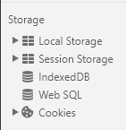

```html
<!DOCTYPE html>
<html lang="en">
<head>
    <meta charset="UTF-8">
    <title>Document</title>
    <script src="js/jquery-1.12.4.min.js"></script>
    <script src="js/jquery.cookie.js"></script>
    <script>
        // cookie的读写需要在服务器环境下
        //设置cookie: key-value; 7天过期,存在根目录下
        $.cookie('myCookie', 'myValue', {expires:7,path:'/'})
        //读取cookie
        alert($.cookie('myCookie'))
        // cookie的用途: 存用户名
    </script>
</head>
<body>
</body>
</html>
```

pop-once: 用cookie记录，这次弹窗确认之后，下次不再弹窗;

```bash
js/
    jquery.cookie.js
    jquery-1.12.4.min.js
popOnce.html
```

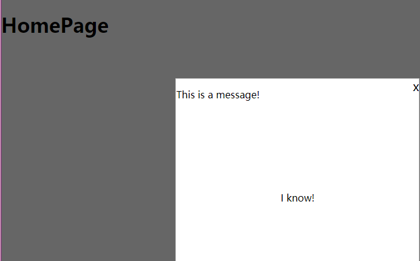

```html
<!-- popOnce.html -->
<!DOCTYPE html>
<html lang="en">
<head>
    <meta charset="UTF-8">
    <title>Document</title>
    <style>
        body{
            margin: 0;
        }
        .pop_con{
            display: none;
        }
        .pop{
            width: 400px;
            height: 300px;
            background-color: #fff;
            border: 1px solid #ccc;
            position: fixed;
            left: 30%;
            top: 30%;
            z-index: 9999;
            opacity: 0;
            margin-top: -250px;
        }
        .pop span{
            float: right;
            font-size: 20px;
            cursor: pointer;
        }
        .mask{
            width: 100%;
            height: 100%;
            background-color: rgba(0, 0, 0, 0.6);
            position: fixed;
            z-index: 9990;
            top: 0;
        }
        .hasknow{
            cursor: pointer;
            text-align: center;
            margin-top: 150px;
        }
    </style>
    <script src="js/jquery-1.12.4.min.js"></script>
    <script src="js/jquery.cookie.js"></script>
    <script>
        $(function () {
            var read=$.cookie('hasread');
            if (read==undefined) {
                $('.pop_con').show();
                $('.pop').animate({marginTop:-150, opacity:1});
            }
            
            $('.hasknow').click(function () {
                $.cookie('hasread', 'ok', {expires:7,path:'/'});
                $('.pop_con').hide();
            })

        })
    </script>
</head>
<body>
    <div class="pop_con">
        <div class="pop">
            <span>x</span>
            <p>This is a message!</p>
            <p class="hasknow">I know!</p>
        </div>
        <div class="mask"></div>
    </div>

    <h1>HomePage</h1>
</body>
</html>
```

### localStorage

sessionStorage和localStorage不会自动把数据发给服务器，仅在本地保存。sessionStorage和localStorage 虽然也有存储大小的限制，但比cookie大得多，可以达到5M或更大；用于浏览器端缓存数据

```html
<!DOCTYPE html>
<html lang="en">
<head>
    <meta charset="UTF-8">
    <title>Document</title>
    <script>
        // 原生的不需要JQuery
        // 也是key-value, 因为有5M可以存大的json数据
        // 不需要服务器环境
        localStorage.setItem('key1', '111')
        localStorage.setItem('myStorage', 'Ok')
        localStorage.myStorage='thx'

        alert(localStorage.getItem('myStorage')) //thx
        alert(localStorage.myStorage) //thx
        
        localStorage.removeItem('key1')
    </script>
</head>
<body>
    
</body>
</html>
```

用F12/Application查看结果

### sessionStorage

容量为5M或者更大，不会在请求时候携带传递，在同源的当前窗口关闭前有效(窗口关闭之后就删除了)

操作和localStorage一样

```html
<!DOCTYPE html>
<html lang="en">
<head>
    <meta charset="UTF-8">
    <title>Document</title>
    <script>
        sessionStorage.setItem('key1', '111')
        sessionStorage.setItem('myStorage', 'Ok')
        sessionStorage.myStorage='thx'

        alert(sessionStorage.getItem('myStorage')) //thx
        alert(sessionStorage.myStorage) //thx
        
        sessionStorage.removeItem('key1')
    </script>
</head>
<body>
    
</body>
</html>
```

localStorage vs sessionStorage

- 数据有效期不同:
    - sessionStorage：仅在当前浏览器窗口关闭前有效，自然也就不可能持久保持；localStorage：始终有效，窗口或浏览器关闭也一直保存，因此用作持久数据；cookie只在设置的cookie过期时间之前一直有效，即使窗口或浏览器关闭。

- 作用域不同:
    - sessionStorage不在不同的浏览器窗口中共享，即使是同一个页面；localStorage 在所有同源窗口中都是共享的；cookie也是在所有同源窗口中都是共享的。Web Storage 支持事件通知机制，可以将数据更新的通知发送给监听者。Web Storage 的 api 接口使用更方便

localStorage 和 sessionStorage 合称为Web Storage , Web Storage支持事件通知机制，可以将数据更新的通知监听者，Web Storage的api接口使用更方便

iPhone的无痕浏览不支持Web Storage，只能用cookie。

## JQueryUI

[JQueryUI](https://jqueryui.com/)是JQuery的一个插件，包含底层用户交互、动画、特效和可更换主题的可视控件。我们可以直接用它来构建具有很好交互性的web应用程序。

其中有搜索框联想词: 可以用JQueryUI的[autocomplete](https://jqueryui.com/autocomplete/), 要么自己建库，要么用别人的联想库

常用就是[Draggable](http://api.jqueryui.com/draggable/)

Example1: 没有参数限制的draggable(可以随便到处拖动)

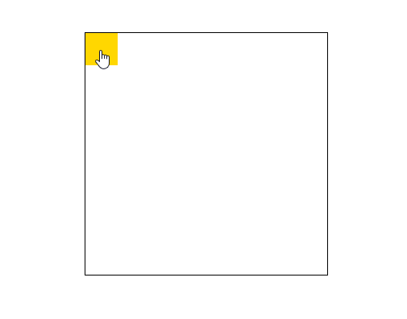

```html
<!DOCTYPE html>
<html lang="en">
<head>
    <meta charset="UTF-8">
    <title>Document</title>
    <style>
        .con{
            width: 300px;
            height: 300px;
            border: 1px solid #000;
            margin: 50px auto 0;
        }
        .box{
            width: 40px;
            height: 40px;
            background-color: gold;
            cursor: pointer;
        }
    </style>
    <script src="js/jquery-1.12.4.min.js"></script>
    <script src="js/jquery-ui.min.js"></script>
    <script>
        $(function () {
            $('.box').draggable()
        })
    </script>
</head>
<body>
    <div class="con">
        <div class="box"></div>
    </div>
</body>
</html>
```

Example2: 带限制的draggable

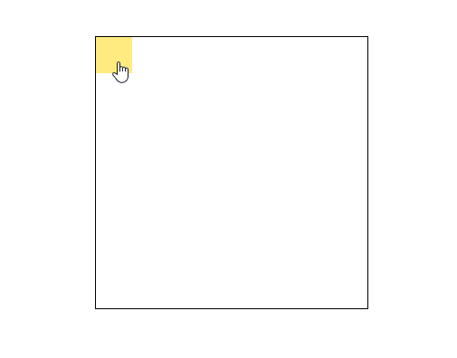

```html
<!DOCTYPE html>
<html lang="en">
<head>
    <meta charset="UTF-8">
    <title>Document</title>
    <style>
        .con{
            width: 300px;
            height: 300px;
            border: 1px solid #000;
            margin: 50px auto 0;
        }
        .box{
            width: 40px;
            height: 40px;
            background-color: gold;
            cursor: pointer;
            opacity: 0.5;
        }
    </style>
    <script src="js/jquery-1.12.4.min.js"></script>
    <script src="js/jquery-ui.min.js"></script>
    <script>
        $(function () {
            $('.box').draggable({
                // 更多的用法查看API
                containment: 'parent',//只能在父容器里面drag
                axis: 'x',//x方向
                opacity: 0.8,
                // ev表示事件对象
                drag: function (ev, ui) {
                    // console.log(ui); // ui是一个json数据
                    console.log(ui.position.left);
                }
            })
        })
    </script>
</head>
<body>
    <div class="con">
        <div class="box"></div>
    </div>
</body>
</html>
```

Example3: Dragbar

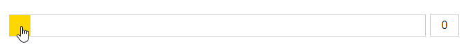

```html
<!DOCTYPE html>
<html lang="en">
<head>
    <meta charset="UTF-8">
    <title>Document</title>
    <style>
        .slidebar_con{
            width: 650px;
            height: 32px;
            margin: 50px auto 0;
        }
        .slidebar{
            width: 600px;
            height: 30px;
            border: 1px solid #ccc;
            float: left;
            position: relative;
        }
        .slidebar .progress{
            width: 0;
            height: 30px;
            background-color: #f0f0f0;
            position: absolute;
            left: 0;
            top: 0;
        }
        .slidebar .dragbar{
            width: 30px;
            height: 30px;
            background-color: gold;
            cursor: pointer;
            position: absolute;
            left: 0;
            top: 0;
        }
        .slide_count{
            padding: 0;
            float: right;
            width: 40px;
            height: 30px;
            border: 1px solid #ccc;
            text-align: center;
            font-size: 16px;
        }
    </style>
    <script src="js/jquery-1.12.4.min.js"></script>
    <script src="js/jquery-ui.min.js"></script>
    <script>
        $(function () {
            $('.dragbar').draggable({
                containment: 'parent',
                axis: 'x',
                opacity: 0.6,
                drag: function (ev, ui) {
                    var nowleft = ui.position.left;
					$('.progress').css({width:nowleft,});
					$('.slide_count').val(parseInt(nowleft*100/570));
                },
            });
        });
        // 最后的时候，input框的表单，然后后面直接读取就可以了
    </script>
</head>
<body>
    <div class="slidebar_con">
        <div class="slidebar">
            <div class="progress"></div>
            <div class="dragbar"></div>
        </div>
        <input type="text" name="" id="" value="0" class="slide_count">
    </div>
</body>
</html>
```

Example4: custom scrollbar

因为系统再带的滚动条太难看, 下面这个例子只能拖拽scrollbar, 不能鼠标滚动;

```html
<!DOCTYPE html>
<html lang="en">
<head>
    <meta charset="UTF-8">
    <title>Document</title>
    <style>
        /* to show system scrollbar */
        .con{
            width: 400px;
            height: 500px;
            border: 1px solid #000;
            margin: 50px auto 0;
            /* 自动现在滚动条 */
            overflow: auto; 
        }
        .box{
            width: 300px;
            height: 1000px;
            background-color: gold;
        }
        /* to show custom scrollbar */
        .scroll_con{
            width: 400px;
            height: 500px;
            border: 1px solid #000;
            margin: 50px auto 0;
            position: relative;
            overflow: hidden;
        }
        .scroll_con .content{
            position: absolute;
            left: 0;
            top: 0;

            width: 300px;
            height: 1000px;
            background-color: green;
            font: 16px/32px 'Microsoft Yahei';
            text-indent: 2em;
            padding: 10px 20px;
        }
        .scrollbar_con{
            width: 10px;
            height: 490px;
            position: absolute;
            right: 5px;
            top: 5px;
        }
        .scrollbar{
            width: 10px;
            height: 200px;
            background-color: #ccc;
            position: absolute;
            left: 0;
            right: 0;
            cursor: pointer;
            border-radius: 5px;
        }
    </style>
    <script src="js/jquery-1.12.4.min.js"></script>
    <script src="js/jquery-ui.min.js"></script>
    <script>
        $(function () {
            // 包含padding, boder的height
            var h=$('.content').outerHeight();
            var hide=h-500;
            $('.scrollbar').draggable({
                axis: 'y',
                containment: 'parent',
                opacity: 0.6,
                drag: function (ev, ui) {
                    var nowTop=ui.position.top;
                    var nowScroll=parseInt(nowTop/290*hide);
                    $('.content').css({top: -nowScroll});
                }
            });
        })
    </script>
</head>
<body>
    <!-- 系统滚动条 -->
    <div class="con">
        <div class="box"></div>
    </div>
    <!-- custom scrollbar -->
    <div class="scroll_con">
        <div class="content">
            Smack in the middle of Grier Brunson’s family’s ranch, a patch of West Texas dirt that sprawls across 45 square miles, sits a lush, green dip in the land that the family calls “the draw.”

            Thousands of years ago, ¬Pueblos built rocky settlements here. Hundreds of years ago, Comanches thundered on horseback across this plain. Today, the natural bounty in and around the draw is producing a rather more modern stampede.
            
            On the rim of the draw, amid the mesquite trees and the sagebrush, oil rigs loom like rockets at launch, and a team fracking a well shoots untold thousands of gallons of water and hundreds of truckloads of sand down into the earth, using huge hydraulic pumps that emit a dull, constant roar. For the Brunson family, these are the sights and sounds of money: Two miles underground, oil—thousands of barrels of it every day, worth millions of dollars—is being cracked loose from the rock and pulled up through carefully engineered holes. 
        </div>
        <div class="scrollbar_con">
            <div class="scrollbar"></div>
        </div>
    </div>
</body>
</html>
```