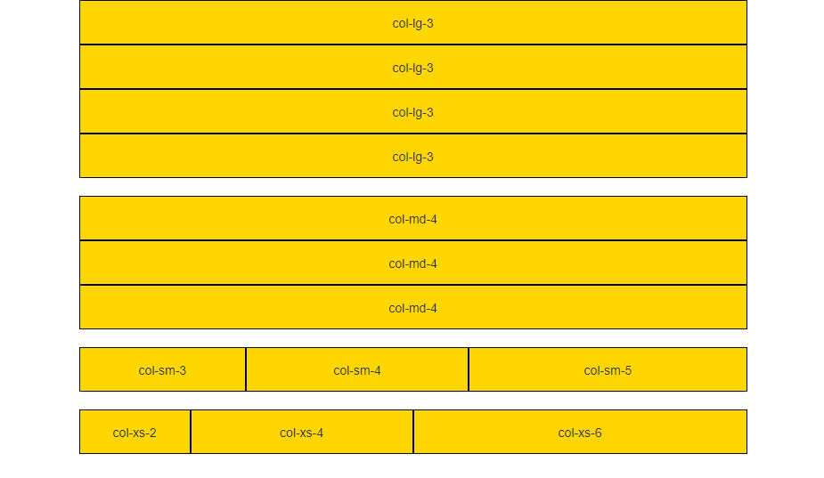
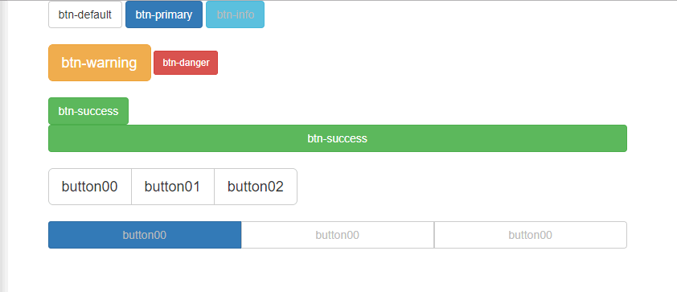

# Mobile framework & lib

<!-- TOC -->

- [Mobile framework & lib](#mobile-framework--lib)
  - [zeptojs](#zeptojs)
  - [swiper](#swiper)
  - [Bootstrap framework](#bootstrap-framework)
    - [bootstrap **grid system**](#bootstrap-grid-system)
      - [grid nested](#grid-nested)
      - [grid offset](#grid-offset)
    - [bootstra button](#bootstra-button)
    - [bootstrap form](#bootstrap-form)
    - [form control group](#form-control-group)
    - [bootstrap image](#bootstrap-image)
    - [bootstrap navigation bar](#bootstrap-navigation-bar)
    - [bootstrap directory navi](#bootstrap-directory-navi)
    - [bootstrap jumbotron](#bootstrap-jumbotron)
    - [bootstrap modal](#bootstrap-modal)
    - [bootstrap dropmenu](#bootstrap-dropmenu)
    - [bootstrap hidden](#bootstrap-hidden)
    - [bootstrap slide](#bootstrap-slide)
  - [JQuery easyUI](#jquery-easyui)

<!-- /TOC -->

移动端的框架和库: 主要是bootstrap

touch事件包括如下几个事件：

- touchstart: //手指放到屏幕上时触发
- touchmove: //手指在屏幕上滑动式触发
- touchend: //手指离开屏幕时触发
- touchcancel: //系统取消touch事件的时候触发，比较少用

移动端一般有三种操作，点击、滑动、拖动，这三种操作一般是组合使用上面的几个事件来完成的，所有上面的4个事件一般很少单独使用，一般是封装使用来实现这三种操作，可以使用封装成熟的js库。

- 点击: touchstart + touchend
- 滑动: touchstart + touchmove + touchend
- 拖动: touchstart + touchend

## zeptojs

[zeptojs](http://zeptojs.com)与jquery的api类似，但是比jquery轻量，可以看作是移动端的jquery；由于手机性能提高，直接用jquery也行；

zeptojs可以定制: 可以选择自己想要的模块; [zepto builder](http://github.e-sites.nl/zeptobuilder/)

touch模块封装了针对移动端常用的事件，可使用此模块进行移动端特定效果开发，这些事件有：

- tap 元素tap的时候触发，此事件类似click，但是比click快300ms。
- longTap 当一个元素被按住超过750ms触发。
- swipe, swipeLeft, swipeRight, swipeUp, swipeDown 当元素被划过时触发。(可选择给定的方向)

Example1: Basic Application

```html
<!DOCTYPE html>
<html lang="en">
<head>
    <meta charset="UTF-8">
    <meta name="viewport" content="width=device-width, initial-scale=1.0">
    <meta http-equiv="X-UA-Compatible" content="ie=edge">
    <title>Document</title>
    <script src="js/zepto.min.js"></script>
    <style>
        .box{
            width: 300px;
            height: 300px;
            background-color: gold;
        }
    </style>
    <script>
        $(function () {
            // click or tap
            $('.box').click(function () {
                console.log('clicked');
            })
            $('.box').tap(function () {
                console.log('tapped');
            });
            $('.box').longTap(function () {
                console.log('long tapped');
            });
            // swipe
            $('.box').swipe(function () {
                console.log('swiped');
            });
            $('.box').swipeLeft(function () {
                console.log('swiped ←');
            });
            $('.box').swipeRight(function () {
                console.log('swiped →');
            });
            $('.box').swipeUp(function () {
                console.log('swiped ↑');
            });
            $('.box').swipeDown(function () {
                console.log('swiped ↓');
            });
        });
    </script>
</head>
<body>
    <div class="box"></div>
</body>
</html>
```

Example2: 手机滑动删除


```html
<!DOCTYPE html>
<html lang="en">
<head>
    <meta charset="UTF-8">
    <meta name="viewport" content="width=device-width, initial-scale=1.0">
    <meta http-equiv="X-UA-Compatible" content="ie=edge">
    <title>Document</title>
    <style>
        body, ul{margin: 0; padding: 0}
        .list{
            list-style: none;
            width: 90%;
            margin: 20px auto 0;
        }
        .list li{
            height: 40px;
            line-height: 40px;
            border-bottom: 1px solid #ddd;
            position: relative;
            overflow: hidden;
        }
        .list li a{
            text-decoration: none;
            color: #333;
            position: absolute;
            left: 0;
        }
        .list li span{
            position: absolute;
            right: -70px;
            background-color: red;
            padding: 0 10px;
            color: #fff;
        }
    </style>
    <script src="js/zepto.min.js"></script>
    <script>
        $(function () {
           $('.list li').swipeLeft(function () {
              $(this).children('a').animate({left: -70});
              $(this).children('span').animate({right: 0});
           });
           $('.list li').swipeRight(function () {
              $(this).children('a').animate({left: 0});
              $(this).children('span').animate({right: -70});
           });
           $('.list span').click(function () {
               $(this).parent().animate({height: 0,}, function () {
                   $(this).remove();
               });
           })
        });
    </script>
</head>
<body>
    <ul class="list">
        <li><a href="">This is Item 0</a><span>Delete</span></li>
        <li><a href="">This is Item 1</a><span>Delete</span></li>
        <li><a href="">This is Item 2</a><span>Delete</span></li>
        <li><a href="">This is Item 3</a><span>Delete</span></li>
        <li><a href="">This is Item 4</a><span>Delete</span></li>
    </ul>
</body>
</html>
```

## swiper

[swiper.js](http://www.swiper.com.cn/)是一款成熟稳定的应用于PC端和移动端的滑动效果插件，一般用来触屏焦点图、触屏整屏滚动等效果。

[Demos](http://www.swiper.com.cn/demo/index.html) & [Tutorial](http://www.swiper.com.cn/usage/index.html)

一般建议把js页面底部，css放在顶部: 为了性能(因为js会出现阻塞加载)；然而实际都是放在头部，因为实际是吧头部拿出去，其他页面都引用这个头部；

对于swiper3, 如果没有引入`JQuery`或者`Zepto`, 那么可以直接引入`swiper.min.js`和`swiper.min.css`; 反之，引入`swiper.jquery.min.js`和`swiper.min.css`, 具体如[使用方法](http://3.swiper.com.cn/usage/index.html)

对于swiper4, [使用方法](http://www.swiper.com.cn/usage/index.html)

Example1: mobile swiper


```bash
images/
css/
    index.css
    reset.css
    swiper.min.css
js/
    set_root.js
    swiper.min.js
index.html
```

只是修改了`index.css`, `index.html`

```css
/* index.css主要修改的地方 */
/* 必须规定slide的高度或者宽度 */
.slide{
    width: 100%;
    height: 7rem;
}
.slide img{
    width: 100%;
}
```

```html
<!-- index.html主要修改的地方 -->
<!DOCTYPE html>
<html lang="en">
<head>
    <meta charset="UTF-8">
    <meta name="viewport" content="width=device-width, initial-scale=1.0">
    <meta http-equiv="X-UA-Compatible" content="ie=edge">
    <!-- for slide -->
    <link rel="stylesheet" href="css/swiper.min.css">
    <!-- swipe放在上面是为了让index.css可以覆盖它的修改 -->
    <link rel="stylesheet" href="css/reset.css">
    <link rel="stylesheet" href="css/index.css">
    <script src="js/set_root.js"></script>
    <!-- for slide -->
    <script src="js/swiper.min.js"></script>
    <!--  -->
    <title>天天生鲜-首页</title>
    <!-- add script for slide -->
    <script>
        // 因为没有引入JQuery, 所以不能用ready; 而采用window.onload
        window.onload=function () {
            var swiper = new Swiper('.swiper-container', {
				pagination: '.swiper-pagination',
				prevButton: '.swiper-button-prev',
				nextButton: '.swiper-button-next',
				initialSlide :0,
				paginationClickable: true,
				loop: true,
				autoplay:3000,
				autoplayDisableOnInteraction:false
			});
        }
    </script>
</head>
```

```html
<!-- index.html另外修改的地方 -->
<!-- slide -->
<div class="slide">
    <div class="swiper-container">
        <!-- 幻灯片 -->
        <div class="swiper-wrapper">
            <div class="swiper-slide"></div>
            <div class="swiper-slide"></div>
            <div class="swiper-slide"></div>
        </div>
        <!-- 左右和小圆点 -->
        <div class="swiper-pagination"></div>
        <div class="swiper-button-prev"></div>
        <div class="swiper-button-next"></div>
    </div>
</div>
```

如果swiper-button-prev, swiper-button-next尺寸不合适，在F12中复制出来；在`index.css`中添加

```css
/* 修改左右箭头的大小 */
.swiper-button-next,.swiper-button-prev {
    width: 13px;
    height: 22px;
    margin-top: -11px;

    -moz-background-size: 13px 22px;
    -webkit-background-size: 13px 22px;
    background-size: 13px 22px;
}

/* 修改小圆点active的颜色 */
.swiper-pagination-bullet-active {
    background: gold;
}
```

swiper可以做纵向的滑动，也就是手机上的整屏滑动；

Example2: 手机整屏滑动


```bash
images/
    arrow.png
css/
    main.css
    reset.css
    swiper.min.css
js/
    zepto.min.js
    swiper.jquery.min.js
index.html
```

```html
<!-- index.html -->
<!DOCTYPE html>
<html lang="en">
<head>
    <meta charset="UTF-8">
    <meta name="viewport" content="width=device-width, initial-scale=1.0">
    <meta http-equiv="X-UA-Compatible" content="ie=edge">
    <title>Document</title>
    <link rel="stylesheet" href="css/swiper.min.css">
    <link rel="stylesheet" href="css/reset.css">
    <link rel="stylesheet" href="css/main.css">
    <script src="js/zepto.min.js"></script>
    <script src="js/swiper.jquery.min.js"></script>
    <script>
        $(function(){
            // 稍微缓冲函数的执行，虽然给的是0ms，让第一个slide有动画
            setTimeout(function(){		
                $('.p1').addClass('moving');
            },0);

            var myswiper = new Swiper('.swiper-container',{
                direction: 'vertical',   
                pagination: '.swiper-pagination',
                // 回掉函数，一slide滚动完成之后
                onSlideChangeEnd:function(swiper){
                    // console.log(swiper);
                    var index = swiper.activeIndex;
                    $('.swiper-slide').removeClass('moving').eq(index).addClass('moving');
                }
            })
        });
    </script>
</head>
<body>
    <div class="swiper-container">
        <div class="swiper-wrapper">
            <div class="swiper-slide p1">
                <h1>页面标题一</h1>
                <p>页面内容</p>
            </div>
            <div class="swiper-slide p2">
                <h1>页面标题二</h1>
                <p>页面内容</p>
            </div>
            <div class="swiper-slide p3">
                <h1>页面标题三</h1>
                <p>页面内容</p>
            </div>
            <div class="swiper-slide p4">
                <h1>页面标题四</h1>
                <p>页面内容</p>
            </div>
        </div>    
        <div class="swiper-pagination"></div>
    </div>
    <div class="up_icon"></div>
</body>
</html>
```

```css
/* main.css */
html,body { width:100%; height:100%;}
.swiper-container { width: 100%; height: 100%;} 
 
.p1 { background-color:#f6de9e;} 

.p1 h1,.p1 p,.p2 h1,.p2 p,.p3 h1,.p3 p,.p4 h1,.p4 p{
    text-align:center;
    position:absolute;
    top:30%;
    width:100%;
    color:#dc6835; 
    transition: all 500ms cubic-bezier(0.260, -0.600, 0.345, 1.560);
}

.p1 p,.p2 p,.p3 p,.p4 p{top:40%;font-size:20px;}

.p1 h1{
	transform:rotate(-90deg);
	transform-origin:80px center;
	opacity: 0;
}

.p1 p{
	transform:translateY(200px);
	opacity: 0;
}

.p1.moving h1{
	transform:rotate(0deg);
	transform-origin:80px center;
	opacity: 1;
}

.p1.moving p{
	transform:translateY(0px);
	opacity: 1;
}


.p2 { background-color:#92d5ea;} 
.p2 h1,.p2 p{color:#9e57e6}


.p2 h1{
	transform:scale(0.3,0.3);	
	opacity: 0;
}

.p2 p{
	transform:translateY(200px);
	opacity: 0;
}

.p2.moving h1{
	transform:scale(1,1);
	opacity: 1;
}

.p2.moving p{
	transform:translateY(0px);
	opacity: 1;
}


.p3 { background-color:#e28cd7;}
.p3 h1,.p3 p{color:#dcda35}


.p3 h1{
	transform:rotate(-90deg);
	transform-origin:80px center;
	opacity: 0;
}

.p3 p{
	transform:translateY(200px);
	opacity: 0;
}

.p3.moving h1{
	transform:rotate(0deg);
	transform-origin:80px center;
	opacity: 1;
}

.p3.moving p{
	transform:translateY(0px);
	opacity: 1;
}

.p4 { background-color:#18c195;}
.p4 h1,.p4 p{color:#b3dc35}


.p4 h1{
	transform:rotate(-90deg);
	transform-origin:80px center;
	opacity: 0;
}

.p4 p{
	transform:translateY(200px);
	opacity: 0;
}

.p4.moving h1{
	transform:rotate(0deg);
	transform-origin:80px center;
	opacity: 1;
}

.p4.moving p{
	transform:translateY(0px);
	opacity: 1;
} 


.up_icon{
	width:24px;
	height:20px;
	position:absolute;
	left:50%;
	margin-left:-12px;
	bottom:20px;
	background:url(../images/arrow.png) no-repeat;
	background-size:100% 100%;
	z-index: 900;
	animation-name:upup;
	animation-duration:1300ms;
	animation-iteration-count:infinite;
}


@keyframes upup{
	0%{
		transform:translateY(0px);
		opacity:1;
	}
	50%{
		transform:translateY(-15px);
		opacity:1
	}
	100%{
		transform:translateY(-30px);
		opacity:0
	}
}
```

```css
/* reset.css */
/* 去掉标签默认的内边距和外边距 */
body,p,h1,h2,h3,h4,h5,h6,ul,dl,dd,input,select{margin:0;padding:0}

/* 去掉列表的项目符号 */
ul{list-style:none;}

em{font-style:normal;}

/* 去掉默认的下划线 */
a{text-decoration:none;}

/* 去掉图片在加链接时的边框 */
img{border:0;}

.clearfix:before,.clearfix:after{
	content:'';
	display:table;
}

.clearfix:after{
	clear:both;
}

.clearfix{zoom:1}

.fl{float:left;}
.fr{float:right;}
```

## Bootstrap framework

库vs框架: 比如JQuery库里面只有js的效果，所以是一个库； 而bootstrap有js也有css是一套综合的东西，类似一套规范，所以是框架；

[bootstrap](http://www.bootcss.com/)是前端框架, 适合不懂前端的后台; 里面有一套HTML, CSS, JS结合，并且可以是响应式的；

适合专题页面(搞活动，挂几天下线的页面)，一套页面在PC, mobile都可以好看

bootstrap动画依赖jQuery, 所以要先引入JQuery

学bootstrap: 学样式的使用(背样式名)

```html
<!-- 固定宽度的容器：container -->
<!-- 100%宽度的容器(流体容器): containter-fluid -->
<!DOCTYPE html>
<html lang="en">
<head>
    <meta charset="UTF-8">
    <meta name="viewport" content="width=device-width, initial-scale=1.0">
    <meta http-equiv="X-UA-Compatible" content="ie=edge">
    <title>Document</title>
    <script src="js/jquery-1.12.4.min.js"></script>
    <script src="js/bootstrap.min.js"></script>
    <link rel="stylesheet" href="css/bootstrap.min.css">
</head>
<body>
    <!-- 1170 970 750 100% -->
    <div class="container" style="background: gold">This is container</div>
    <!-- 始终100% -->
    <div class="container-fluid" style="background: greenyellow">This is container-fluid</div>
    <!-- container, container-fluid左右都有15px的padding -->
</body>
</html>
```

### bootstrap **grid system**

bootstrap响应式查询区间：

- 其他: 取100%
- 大于等于768: 取750
- 大于等于992: 取970
- 大于等于1200: 取1170

bootstrap将页面横向分为12等分，按照12等分定义了适应不同宽度等分的样式类，这些样式类组成了一套响应式、移动设备优先的流式栅格系统：

- `col-lg-` : >1200, 排列成一行; <1200,每一个占一行
- `col-md-` : 
- `col-sm-` : 
- `col-xs-` : 

Example2: grid system



```html
<!DOCTYPE html>
<html lang="en">
<head>
    <meta charset="UTF-8">
    <meta name="viewport" content="width=device-width, initial-scale=1.0">
    <meta http-equiv="X-UA-Compatible" content="ie=edge">
    <title>Document</title>
    <script src="js/jquery-1.12.4.min.js"></script>
    <script src="js/bootstrap.min.js"></script>
    <link rel="stylesheet" href="css/bootstrap.min.css">
    <style>
        div[class*='col-']{
            height: 50px;
            border: 1px solid #000;
            background-color: gold;
            text-align: center;
            line-height: 50px;
        }
    </style>
</head>
<body>
    <div class="container">
        <div class="row">
            <!-- 平分成12份，每一分是3那么需要4个 -->
            <div class="col-lg-3">col-lg-3</div>
            <div class="col-lg-3">col-lg-3</div>
            <div class="col-lg-3">col-lg-3</div>
            <div class="col-lg-3">col-lg-3</div>
        </div>
        <br>
        <div class="row">
            <div class="col-md-4">col-md-4</div>
            <div class="col-md-4">col-md-4</div>
            <div class="col-md-4">col-md-4</div>
        </div>
        <br>
        <div class="row">
            <!-- 加和为12就行 -->
            <div class="col-sm-3">col-sm-3</div>
            <div class="col-sm-4">col-sm-4</div>
            <div class="col-sm-5">col-sm-5</div>
        </div>
        <br>
        <div class="row">
            <!-- 无论怎样都是一行排列 -->
            <div class="col-xs-2">col-xs-2</div>
            <div class="col-xs-4">col-xs-4</div>
            <div class="col-xs-6">col-xs-6</div>
        </div>
    </div>
</body>
</html>
```

注意: 
container有`padding-left: 15px; padding-right: 15px;`; 
`col-`也有`padding-left: 15px;padding-right: 15px;`
然而显示的效果确不不是30px: 
因为`row`的`margin-left: -15px; margin-right: -15px;`

bootstrap Example03: 

```html
<!DOCTYPE html>
<html lang="en">
<head>
    <meta charset="UTF-8">
    <meta name="viewport" content="width=device-width, initial-scale=1.0">
    <meta http-equiv="X-UA-Compatible" content="ie=edge">
    <title>Document</title>
    <script src="js/jquery-1.12.4.min.js"></script>
    <script src="js/bootstrap.min.js"></script>
    <link rel="stylesheet" href="css/bootstrap.min.css">
    <style>
        .pic{
            height: 200px;
            /* 宽度可以到父级的100%, 但是始终不超过300px */
            max-width: 300px; 
            background-color: gold;
            border: 1px solid #000;
            margin: 15px auto;
        }
        div[class*='col-']{
            background-color: yellowgreen;
            border: 1px solid red;
        }
    </style>
</head>
<body>
    <div class="container">
        <div class="row">
            <div class="col-lg-3 col-md-4 col-sm-6"><div class="pic"></div></div>
            <div class="col-lg-3 col-md-4 col-sm-6"><div class="pic"></div></div>
            <div class="col-lg-3 col-md-4 col-sm-6"><div class="pic"></div></div>
            <div class="col-lg-3 col-md-4 col-sm-6"><div class="pic"></div></div>
            <div class="col-lg-3 col-md-4 col-sm-6"><div class="pic"></div></div>
            <div class="col-lg-3 col-md-4 col-sm-6"><div class="pic"></div></div>
            <div class="col-lg-3 col-md-4 col-sm-6"><div class="pic"></div></div>
            <div class="col-lg-3 col-md-4 col-sm-6"><div class="pic"></div></div>
        </div>
    </div>
</body>
</html>
```

#### grid nested

栅格系统里面嵌套栅格系统

```html
<!DOCTYPE html>
<html lang="en">
<head>
    <meta charset="UTF-8">
    <meta name="viewport" content="width=device-width, initial-scale=1.0">
    <meta http-equiv="X-UA-Compatible" content="ie=edge">
    <title>Document</title>
    <script src="js/jquery-1.12.4.min.js"></script>
    <script src="js/bootstrap.min.js"></script>
    <link rel="stylesheet" href="css/bootstrap.min.css">
    <style>
        div[class*='col-']{
            background-color: yellowgreen;
            border: 1px solid red;
            height: 50px;
        }
    </style>
</head>
<body>
    <div class="container">
        <div class="row">
            <div class="col-lg-4">
                <div class="row">
                    <div class="col-sm-3">1-1</div>
                    <div class="col-sm-3">1-2</div>
                    <div class="col-sm-3">1-3</div>
                    <div class="col-sm-3">1-4</div>
                </div>
            </div>
            <div class="col-lg-4">2</div>
            <div class="col-lg-4">3</div>
        </div>
    </div>
</body>
</html>
```

#### grid offset


```html
<!DOCTYPE html>
<html lang="en">
<head>
    <meta charset="UTF-8">
    <meta name="viewport" content="width=device-width, initial-scale=1.0">
    <meta http-equiv="X-UA-Compatible" content="ie=edge">
    <title>Document</title>
    <script src="js/jquery-1.12.4.min.js"></script>
    <script src="js/bootstrap.min.js"></script>
    <link rel="stylesheet" href="css/bootstrap.min.css">
    <style>
        div[class*='col-']{
            background-color: yellowgreen;
            border: 1px solid red;
            height: 50px;
        }
    </style>
</head>
<body>
    <div class="container">
        <div class="row">
            <!-- 不够12, 可以偏移来间隔 -->
            <!-- 还可以实现奇数个 -->
            <div class="col-md-2 col-sm-2">1</div>
            <div class="col-md-2 col-md-offset-3 col-sm-2 col-sm-offset-3">2</div>
            <div class="col-md-2 col-md-offset-3 col-sm-2 col-sm-offset-3">3</div>
        </div>
    </div>
</body>
</html>
```

### bootstra button



```html
<!DOCTYPE html>
<html lang="en">
<head>
    <meta charset="UTF-8">
    <meta name="viewport" content="width=device-width, initial-scale=1.0">
    <meta http-equiv="X-UA-Compatible" content="ie=edge">
    <title>Document</title>
    <script src="js/jquery-1.12.4.min.js"></script>
    <script src="js/bootstrap.min.js"></script>
    <link rel="stylesheet" href="css/bootstrap.min.css">
    <style>
        
    </style>
</head>
<body>
    <div class="container">
        <!-- button可以用button, input, a标签来实现 -->
        <!-- 有很多种类型的button, 具体查看api -->
        <button class="btn btn-default">btn-default</button>
        <input class="btn btn-primary" type="button" value="btn-primary">
        <a class="btn btn-info" href="">btn-info</a>
        <br>
        <br>
        <!-- 可以设置不同大小button -->
        <button class="btn btn-warning btn-lg">btn-warning</button>
        <button class="btn btn-danger btn-sm">btn-danger</button>
    </div>
    <br>
    <div class="container">
        <button class="btn btn-success">btn-success</button>
        <!-- 100% button -->
        <button class="btn btn-success btn-block">btn-success</button>
    </div>
    <br>
    <!-- btn group -->
    <div class="container">
        <div class="btn-group btn-group-lg">
            <button class="btn btn-default">button00</button>
            <button class="btn btn-default">button01</button>
            <button class="btn btn-default">button02</button>
        </div>
        <br>
        <br>
        <div class="btn-group btn-group-justified">
            <a href="" class="btn btn-primary">button00</a>
            <a href="" class="btn btn-default">button00</a>
            <a href="" class="btn btn-default">button00</a>
        </div>
    </div>
</body>
</html>
```

```html
<!DOCTYPE html>
<html lang="en">
<head>
    <meta charset="UTF-8">
    <meta name="viewport" content="width=device-width, initial-scale=1.0">
    <meta http-equiv="X-UA-Compatible" content="ie=edge">
    <title>Document</title>
    <script src="js/jquery-1.12.4.min.js"></script>
    <script src="js/bootstrap.min.js"></script>
    <link rel="stylesheet" href="css/bootstrap.min.css">
</head>
<body>
    <div class="containter">
        <div class="btn-group btn-group-justified">
            <!-- btn-group的一个坑：btn-group不能用input, button来做，只能a标签来做 -->
            <input type="button" value="button00" class="btn btn-primary">
            <input type="button" value="button00" class="btn btn-default">
            <input type="button" value="button00" class="btn btn-default">
            <br>
            <br>
            <button class="btn btn-default">button01</button>
            <button class="btn btn-default">button01</button>
            <button class="btn btn-default">button01</button>
        </div>
        <br>
        <br>
        <!-- 外面还要包一个btn-group -->
        <div class="btn-group btn-group-justified">
            <div class="btn-group">
                <input type="button" value="button" class="btn btn-primary">
            </div>
            <div class="btn-group">
                <input type="button" value="button" class="btn btn-default">
            </div>
            <div class="btn-group">
                <input type="button" value="button" class="btn btn-default">
            </div>
        </div>
    </div>
</body>
</html>
```

### bootstrap form

```html
<!DOCTYPE html>
<html lang="en">
<head>
    <meta charset="UTF-8">
    <meta name="viewport" content="width=device-width, initial-scale=1.0">
    <meta http-equiv="X-UA-Compatible" content="ie=edge">
    <title>Document</title>
    <script src="js/jquery-1.12.4.min.js"></script>
    <script src="js/bootstrap.min.js"></script>
    <link rel="stylesheet" href="css/bootstrap.min.css">
    <style>
        
    </style>
</head>
<body>
    <div class="container">
        <div class="form">
            <!-- 其他的参见api -->
            <div class="form-group">
                <label for="">Name:</label>
                <input type="text" name="" id="" class="form-control">
            </div>
            <div class="form-group">
                <label for="">Age:</label>
                <input type="text" name="" id="" class="form-control">
            </div>
            <div class="form-group">
                <label for="">Phone:</label>
                <input type="text" name="" id="" class="form-control">
            </div>
        </div>
    </div>
</body>
</html>
```

注意: 如果不使用bootstrap里面的动态效果(比如切换的效果)，不需要引用`bootstrap.min.js`，只需要`bootstrap.min.css`；如果需要用到各种弹框、下拉菜单、折叠菜单，那么需要引用`bootstrap.min.js`和`bootstrap.min.css`，而`bootstrap.mn.js`又依赖jquery, 所以还需要引入jquery

快捷键: `.box{box_content}*3`


```html
<!DOCTYPE html>
<html lang="en">

<head>
  <meta charset="UTF-8">
  <meta name="viewport" content="width=device-width, initial-scale=1.0">
  <meta http-equiv="X-UA-Compatible" content="ie=edge">
  <title>Document</title>
  <script src="js/jquery-1.12.4.min.js"></script>
  <script src="js/bootstrap.min.js"></script>
  <link rel="stylesheet" href="css/bootstrap.min.css">
</head>

<body>
  <div class="container">
    <!-- normal form -->
    <form>
      <div class="form-group">
        <label for="exampleInputEmail1">Email address</label>
        <input type="email" class="form-control" id="exampleInputEmail1" placeholder="Email">
      </div>
      <div class="form-group">
        <label for="exampleInputPassword1">Password</label>
        <input type="password" class="form-control" id="exampleInputPassword1" placeholder="Password">
      </div>
      <div class="form-group">
        <label for="exampleInputFile">File input</label>
        <input type="file" id="exampleInputFile">
        <p class="help-block">Example block-level help text here.</p>
      </div>
      <div class="checkbox">
        <label>
          <input type="checkbox"> Check me out
        </label>
      </div>
      <button type="submit" class="btn btn-default">Submit</button>
    </form>
    <br><br>
    <!-- inline form -->
    <div class="form-inline">
      <div class="form-group">
        <label for="exampleInputEmail1">Email address</label>
        <input type="email" class="form-control" id="exampleInputEmail1" placeholder="Email">
      </div>
      <div class="form-group">
        <label for="exampleInputPassword1">Password</label>
        <input type="password" class="form-control" id="exampleInputPassword1" placeholder="Password">
      </div>
      <div class="form-group">
        <label for="exampleInputFile">File input</label>
        <input type="file" id="exampleInputFile">
        <p class="help-block">Example block-level help text here.</p>
      </div>
      <div class="checkbox">
        <label>
          <input type="checkbox"> Check me out
        </label>
      </div>
      <button type="submit" class="btn btn-default">Submit</button>
    </div>
    <br><br>
    <!-- form-horizontal -->
    <form class="form-horizontal">
        <div class="form-group">
          <label for="inputEmail3" class="col-sm-2 control-label">Email</label>
          <div class="col-sm-10">
            <input type="email" class="form-control" id="inputEmail3" placeholder="Email">
          </div>
        </div>
        <div class="form-group">
          <label for="inputPassword3" class="col-sm-2 control-label">Password</label>
          <div class="col-sm-10">
            <input type="password" class="form-control" id="inputPassword3" placeholder="Password">
          </div>
        </div>
        <div class="form-group">
          <div class="col-sm-offset-2 col-sm-10">
            <div class="checkbox">
              <label>
                <input type="checkbox"> Remember me
              </label>
            </div>
          </div>
        </div>
        <div class="form-group">
          <div class="col-sm-offset-2 col-sm-10">
            <button type="submit" class="btn btn-default">Sign in</button>
          </div>
        </div>
      </form>
  </div>
</body>

</html>
```

### form control group


字体图标见[tutorial](https://v3.bootcss.com/components/)

```bash
css/
    bootstrap.min.css
fonts/
    # 下面四个是字体图标会用到的, 并且与css文件夹同一目录
    glyphicons-halflings-regular.eot
    glyphicons-halflings-regular.svg
    glyphicons-halflings-regular.ttf
    glyphicons-halflings-regular.woff
js/
    bootstrap.min.js
    jquery-1.12.4.min.js
index.html
```

```html
<!-- index.html -->
<!DOCTYPE html>
<html lang="en">

<head>
  <meta charset="UTF-8">
  <meta name="viewport" content="width=device-width, initial-scale=1.0">
  <meta http-equiv="X-UA-Compatible" content="ie=edge">
  <title>Document</title>
  <script src="js/jquery-1.12.4.min.js"></script>
  <script src="js/bootstrap.min.js"></script>
  <link rel="stylesheet" href="css/bootstrap.min.css">
</head>

<body>
  <div class="container">
    <div class="input-group">
      <input type="text" name="" id="" class="form-control">
      <span class="input-group-addon">@</span>
    </div>
    <br>
    <br>
    <div class="input-group">
      <div class="input-group">
        <input type="text" name="" id="" class="form-control">
        <span class="input-group-btn">
          <button class="btn btn-primary">Go</button>
        </span>
      </div>
    </div>
    <br>
    <br>
    <div class="input-group">
      <div class="input-group">
        <input type="text" name="" id="" class="form-control">
        <span class="input-group-btn">
          <button class="btn btn-primary">
            <span class="glyphicon glyphicon-search" aria-hidden="true"></span>
          </button>
        </span>
      </div>
    </div>
    <br>
    <br>
  </div>
</body>

</html>
```


```html
<!DOCTYPE html>
<html lang="en">

<head>
  <meta charset="UTF-8">
  <meta name="viewport" content="width=device-width, initial-scale=1.0">
  <meta http-equiv="X-UA-Compatible" content="ie=edge">
  <title>Document</title>
  <script src="js/jquery-1.12.4.min.js"></script>
  <script src="js/bootstrap.min.js"></script>
  <link rel="stylesheet" href="css/bootstrap.min.css">
  <style>
    .glyphicon-music {
      /* 字体图标当作是字来修改css */
      color: yellow;
      font-size: 16px;
    }

    .my_edit {
      /* 为了防止所有的样式都被修改，所以这么做 */
      color: red;
    }
  </style>
</head>

<body>
  <div class="container">
    <button class="btn btn-default">
      <span class="glyphicon glyphicon-music"></span>
      Music
    </button>
    <button class="btn btn-warning">
      warning
      <span class="glyphicon glyphicon-info-sign"></span>
    </button>
    <br>
    <br>
    <p>
      <span class="glyphicon glyphicon-pencil my_edit"></span>
      This is a paragraph!
    </p>
  </div>
</body>

</html>
```

### bootstrap image

响应式的图片

```html
<!DOCTYPE html>
<html lang="en">

<head>
  <meta charset="UTF-8">
  <meta name="viewport" content="width=device-width, initial-scale=1.0">
  <meta http-equiv="X-UA-Compatible" content="ie=edge">
  <title>Document</title>
  <script src="js/jquery-1.12.4.min.js"></script>
  <script src="js/bootstrap.min.js"></script>
  <link rel="stylesheet" href="css/bootstrap.min.css">
  <style>
    div[class*='col-'] {
      border: 1px solid #000;
    }
  </style>
</head>

<body>
  <div class="container">
    <div class="row">
      <div class="col-md-3">
        <!-- img-responsive最大宽度是它自己 -->
        <!-- 其他时候按照父级的宽度来， 还会减去padding-left, padding-right -->
        
      </div>
      <div class="col-md-9">Right</div>
    </div>
    <br><br>
    <!-- img会被转换为block；周围变成圆的了 -->
    
  </div>
</body>

</html>
```

### bootstrap navigation bar

要用导航条把容器包起来；


```html
<!DOCTYPE html>
<html lang="en">

<head>
  <meta charset="UTF-8">
  <meta name="viewport" content="width=device-width, initial-scale=1.0">
  <meta http-equiv="X-UA-Compatible" content="ie=edge">
  <title>Document</title>
  <script src="js/jquery-1.12.4.min.js"></script>
  <script src="js/bootstrap.min.js"></script>
  <link rel="stylesheet" href="css/bootstrap.min.css">
</head>

<body>
  <div class="navbar navbar-default">
    <div class="container">
      <div class="navbar-header">
        <a href="" class="navbar-brand">LOGO</a>
      </div>
      <ul class="nav navbar-nav">
        <!-- 必须用a标签 -->
        <li class="active">
          <a href="">Home</a>
        </li>
        <li>
          <a href="">News</a>
        </li>
        <li>
          <a href="">Employment</a>
        </li>
        <li>
          <a href="">Contact</a>
        </li>
        <li>
          <a href="">About</a>
        </li>
      </ul>
    </div>
  </div>
  <br>
  <br>
  <!-- navbar-inverse表示颜色反转 -->
  <!-- navbar-static-top去掉圆角 -->
  <div class="navbar navbar-inverse navbar-static-top">
    <div class="container">
      <div class="navbar-header">
        <a href="" class="navbar-brand">LOGO</a>
      </div>
      <ul class="nav navbar-nav">
        <!-- 必须用a标签 -->
        <li class="active">
          <a href="">Home</a>
        </li>
        <li>
          <a href="">News</a>
        </li>
        <li>
          <a href="">Employment</a>
        </li>
        <li>
          <a href="">Contact</a>
        </li>
        <li>
          <a href="">About</a>
        </li>
      </ul>
      <!-- 导航栏加button -->
      <button class="btn btn-default navbar-btn navbar-right">Button</button>
      <!-- 导航栏加搜索框 -->
      <form action="" class="navbar-form navbar-right">
        <div class="form-group">
          <input type="text" name="" id="" class="form-control" placeholder="Search">
        </div>
      </form>
    </div>
  </div>
</body>

</html>
```

Example: better 

```html
<!DOCTYPE html>
<html lang="en">

<head>
  <meta charset="UTF-8">
  <meta name="viewport" content="width=device-width, initial-scale=1.0">
  <meta http-equiv="X-UA-Compatible" content="ie=edge">
  <title>Document</title>
  <script src="js/jquery-1.12.4.min.js"></script>
  <script src="js/bootstrap.min.js"></script>
  <link rel="stylesheet" href="css/bootstrap.min.css">
</head>

<body>
  <div class="navbar navbar-inverse navbar-static-top">
    <div class="container">
      <div class="navbar-header">
        <!-- 补充一个切换不同类型菜单的button; 必须放在header里面 -->
        <!-- data-target选择下面的那个id -->
        <div class="navbar-toggle" data-toggle="collapse" data-target="#mymenu">
          <!-- 三个横条 -->
          <span class="icon-bar"></span>
          <span class="icon-bar"></span>
          <span class="icon-bar"></span>
        </div>

        <a href="" class="navbar-brand">LOGO</a>
      </div>

      <!-- 用下面的将菜单和form包起来 -->
      <div class="collapse navbar-collapse" id="mymenu">
        <ul class="nav navbar-nav">
          <!-- 必须用a标签 -->
          <li class="active">
            <a href="">Home</a>
          </li>
          <li>
            <a href="">News</a>
          </li>
          <li>
            <a href="">Employment</a>
          </li>
          <li>
            <a href="">Contact</a>
          </li>
          <li>
            <a href="">About</a>
          </li>
        </ul>
        <form action="" class="navbar-form navbar-right">
          <div class="form-group">
            <div class="input-group">
              <input type="text" name="" id="" class="form-control">
              <span class="input-group-btn">
                <button class="btn btn-default">
                  <span class="glyphicon glyphicon-search" aria-hidden="true"></span>
                </button>
              </span>
            </div>
          </div>
        </form>
      </div>
    </div>
  </div>
</body>

</html>
```

### bootstrap directory navi


在上面的例子中的`<body></body>`里面添加

```html
  <!-- 路径导航，对于SEO很重要 -->
  <ol class="breadcrumb">
    <li><a href="">Home</a></li>
    <li><a href="">Library</a></li>
    <li class="active">Data</li>
  </ol>
```

### bootstrap jumbotron

巨幕(jumbotron)也是通栏，也就是banner，所以需要包住`container`

```html
<!DOCTYPE html>
<html lang="en">

<head>
  <meta charset="UTF-8">
  <meta name="viewport" content="width=device-width, initial-scale=1.0">
  <meta http-equiv="X-UA-Compatible" content="ie=edge">
  <title>Document</title>
  <script src="js/jquery-1.12.4.min.js"></script>
  <script src="js/bootstrap.min.js"></script>
  <link rel="stylesheet" href="css/bootstrap.min.css">
</head>

<body>
  <div class="jumbotron">
    <div class="container">
      <h1>Welcoome</h1>
      <p>This is a paragraph</p>
    </div>
  </div>
</body>

</html>
```

### bootstrap modal

弹出框(模态框)，用户的响应与交互；


```html
<!DOCTYPE html>
<html lang="en">

<head>
  <meta charset="UTF-8">
  <meta name="viewport" content="width=device-width, initial-scale=1.0">
  <meta http-equiv="X-UA-Compatible" content="ie=edge">
  <title>Document</title>
  <script src="js/jquery-1.12.4.min.js"></script>
  <script src="js/bootstrap.min.js"></script>
  <link rel="stylesheet" href="css/bootstrap.min.css">
  <script>
    $(function () {
      $('#mybtn1').click(function () {
        $('#mymodal2').modal('show');
      })
    })
  </script>
</head>

<body>
  <div class="container">
    <!-- 自己用js逻辑控制弹框 -->
    <button class="btn btn-success" id="mybtn1">JScontrolModal</button>
    <!-- 写data-xxx的一般是js控制的，有js效果 -->
    <button class="btn btn-primary" data-toggle="modal" data-target="#mymodal0">BigModal</button>
    <button class="btn btn-primary" data-toggle="modal" data-target="#mymodal1">MiddleModal</button>
    <button class="btn btn-primary" data-toggle="modal" data-target="#mymodal2">SmallModal</button>
  </div>

  <!-- 默认情况不出来, 点击的时候才弹出 -->
  <!-- 三层，modal, modal-dialog, modal-content -->
  <!-- fade是为了弹出的时候有过渡效果 -->
  <div class="modal fade" id="mymodal0">
    <div class="modal-dialog modal-lg">
      <div class="modal-content">
        <div class="modal-header">
          This is header
        </div>
        <div class="modal-body">
          This is body
        </div>
        <div class="modal-footer">
          <button class="btn btn-default" data-dismiss="modal">Close</button>
          <button class="btn btn-primary">OK</button>
        </div>
      </div>
    </div>
  </div>
  <div class="modal fade" id="mymodal1">
    <div class="modal-dialog">
      <div class="modal-content">
        <div class="modal-header">
          This is header
        </div>
        <div class="modal-body">
          This is body
        </div>
        <div class="modal-footer">
          <button class="btn btn-default" data-dismiss="modal">Close</button>
          <button class="btn btn-primary">OK</button>
        </div>
      </div>
    </div>
  </div>
  <div class="modal fade" id="mymodal2">
    <div class="modal-dialog modal-sm">
      <div class="modal-content">
        <div class="modal-header">
          This is header
          <button class="close" data-dismiss="modal">
            &times;
          </button>
        </div>
        <div class="modal-body">
          This is body
        </div>
        <div class="modal-footer">
          <button class="btn btn-default" data-dismiss="modal">Close</button>
          <button class="btn btn-primary">OK</button>
        </div>
      </div>
    </div>
  </div>
</body>

</html>
```

### bootstrap dropmenu


```html
<!DOCTYPE html>
<html lang="en">

<head>
  <meta charset="UTF-8">
  <meta name="viewport" content="width=device-width, initial-scale=1.0">
  <meta http-equiv="X-UA-Compatible" content="ie=edge">
  <title>Document</title>
  <script src="js/jquery-1.12.4.min.js"></script>
  <script src="js/bootstrap.min.js"></script>
  <link rel="stylesheet" href="css/bootstrap.min.css">
</head>

<body>
  <div class="container">
    <div class="dropdown">
      <!-- data-toggle关联父级dropdown -->
      <div class="btn btn-primary" data-toggle="dropdown">
        dropdown
        <span class="caret"></span>
        <!-- caret是用来做小三角的 -->
      </div>
      <ul class="dropdown-menu">
        <li>
          <a href="">menu0</a>
        </li>
        <li>
          <a href="">menu1</a>
        </li>
        <li>
          <a href="">menu2</a>
        </li>
      </ul>
    </div>
  </div>
</body>

</html>
```

### bootstrap hidden

比如有些装饰性的图片，响应的时候，缩小尺寸没有必要显示图片，采用hidden;

```html
<!DOCTYPE html>
<html lang="en">

<head>
  <meta charset="UTF-8">
  <meta name="viewport" content="width=device-width, initial-scale=1.0">
  <meta http-equiv="X-UA-Compatible" content="ie=edge">
  <title>Document</title>
  <script src="js/jquery-1.12.4.min.js"></script>
  <script src="js/bootstrap.min.js"></script>
  <link rel="stylesheet" href="css/bootstrap.min.css">
  <style>
    div[class*='col-'] {
      background-color: gold;
      border: 1px solid #000;
      height: 50px;
    }
  </style>
</head>

<body>
  <div class="container">
    <div class="col-lg-3">1</div>
    <div class="col-lg-3">2</div>
    <div class="col-lg-3">3</div>
    <!-- 最大的时候会显示；中等尺寸会隐藏；小尺寸会显示 -->
    <div class="col-lg-3 hidden-md">4</div>
    <!-- 小尺寸有隐藏 -->
    <!-- <div class="col-lg-3 hidden-md hidden-sm hidden-xs">4</div> -->
  </div>
</body>

</html>
```

### bootstrap slide

bootstrap [slide](https://v3.bootcss.com/javascript/#carousel)比较差，不好用；

## JQuery easyUI

[easyUI](http://www.jeasyui.com/documentation/)和BootStrap, jQueryUI都是一些常用的组件

这些组件包含css, js 需要按照它们对应的规则来写；

然后就是web框架：
- django: 最全
- tornado
- 