# Django Introduction

- [Django Introduction](#django-introduction)
  - [Framework](#framework)
    - [MVC](#mvc)
    - [MTV](#mtv)
  - [Django on Windows](#django-on-windows)
  - [Django `__`](#django)
  - [Ajax](#ajax)
  - [many to many](#many-to-many)
  - [Django Summary](#django-summary)
  - [Templates inheritance](#templates-inheritance)
  - [templates filter & simple_tag](#templates-filter--simpletag)
  - [Pagination](#pagination)
  - [Cookie & Session](#cookie--session)
  - [FBV, CBV with decorator](#fbv-cbv-with-decorator)
  - [Session](#session)
  - [session configuration](#session-configuration)
  - [CSRF](#csrf)
  - [Middleware](#middleware)
  - [cache](#cache)
  - [signal](#signal)
  - [Form](#form)
  - [Ajax Adv](#ajax-adv)
  - [KindEditor](#kindeditor)
  - [combo query](#combo-query)

## Framework

example: 所有的web请求本质是socket; 所有web框架的本质是如下的程序;

```python
# DIY socket service
import socket

def handle_request(client):
    buf = client.recv(1024).decode('utf8')
    client.send("HTTP/1.1 200 OK\r\n\r\n".encode('utf8'))
    client.send(f"Hello, Grey\n{buf}".encode('utf8'))

if __name__ == '__main__':
    server = socket.socket()
    server.bind(('', 9999))
    server.listen(5)

    while True:
        connection, addr = server.accept()
        handle_request(connection)
        connection.close()
```

```python
# 只是简化上面的过程
from wsgiref.simple_server import make_server

def simple_app(environ, start_response):
    start_response('200 OK', [('Content-type', 'text/html')])
    # environ.items()客户端传递过来的所有东西
    return [f'Hello, Grey'.encode('utf8'), ]

with make_server('', 9999, simple_app) as httpd:
    httpd.serve_forever()
```

example: DIY web MVC framework
> MVC: Models, Views, Controllers

```bash
Models/
    # get data from DB
Views/
    test.html
Controllers/
    handle.py
test.py
```

```python
# test.py
from wsgiref.simple_server import make_server
from Controllers import handle

URL_DICT = {
    '/index': handle.handle_index,
    '/register': handle.handle_register,
}

def simple_app(environ, start_response):
    start_response('200 OK', [('Content-type', 'text/html')])
    path = environ['PATH_INFO']

    data = b'404'
    if path in URL_DICT:
        func = URL_DICT[path]
        data = func()

    return [data, ]

with make_server('', 9999, simple_app) as httpd:
    httpd.serve_forever()

```

```python
# handle.py
def handle_index():
    return b'index'

def handle_register():
    with open('Views/test.html', 'rb') as file:
        return file.read()
```

python的web框架有:
- flask:小型应用
- django: 大型应用
- tornado

[the Django book](http://djangobook.py3k.cn/)

### MVC

MVC框架的核心思想：**解耦**; 降低各功能模块之间的耦合性，方便变更，更容易重构代码，最大程度上实现代码的重用；根本目的是实现高可扩展性，向后兼容；
> 
- m表示model，主要用于对数据库层的封装
- v表示view，用于向用户展示结果
- c表示controller，是核心，用于处理请求、获取数据、返回结果

### MTV

Django是python web框架, 属于MTV框架，本质和MVC一样，只是没有严格按照MVC的结构来写;
> 
- m表示model，负责与数据库交互; 要么操作object, 要么操作list
- t表示template，负责呈现内容到浏览器
- v表示view，是核心，负责接收请求(request)、逻辑处理、获取数据、返回响应结果(response)

model中一般规范不让编写sql语句；model中维护的是一个object与Database中的一行对应；对于python, 一个list与Database的一个table对应；model直接将代码转换为sql语句(也就是ORM)

> Django生命周期：路由系统(urlpatterns)→views.py→拿数据拿模板，揉和，返回字符串

## Django on Windows

```bash
# Anaconda Prompt
# Create a environment
(base) C:\Users\Administrator>conda create --name Test
(base) C:\Users\Administrator>activate Test
(Test) C:\Users\Administrator>python --version
Python 3.6.7 :: Anaconda, Inc.
(Test) C:\Users\Administrator>conda list
# nothing

(Test) C:\Users\Administrator>conda install django
# Anaconda3\envs\Test\Scripts目录下会出现django-admin.exe，将该目录添加进入environments

(Test) C:\Users\Administrator>pip list
Package      Version
------------ ----------
certifi      2018.11.29
Django       2.1.5
pip          18.1
pytz         2018.7
setuptools   40.6.3
wheel        0.32.3
wincertstore 0.2

(Test) C:\Users\Administrator>pip freeze
certifi==2018.11.29
Django==2.1.5
pytz==2018.7
wincertstore==0.2

# start project
(Test) C:\Users\Administrator>django-admin startproject mysite
(Test) C:\Users\Administrator>tree /f mysite
C:\USERS\ADMINISTRATOR\MYSITE
│  manage.py
└─mysite
        settings.py
        urls.py
        wsgi.py
        __init__.py

# running server
(Test) C:\Users\Administrator>cd mysite
(Test) C:\Users\Administrator\mysite>python manage.py runserver
Django version 2.1.5, using settings 'mysite.settings'
Starting development server at http://127.0.0.1:8000/
Quit the server with CTRL-BREAK.
```

example: simple modify easy mysite project

```bash
│ manage.py
| Views
|       v1.py
└─mysite
        settings.py
        urls.py
        wsgi.py
        __init__.py
```

```python
# v1.py
from django.shortcuts import HttpResponse

def index(request):
    return HttpResponse('Hello')
```

```python
# urls.py
from django.contrib import admin
from django.urls import path

from Views import v1

urlpatterns = [
    path('admin/', admin.site.urls),
    path('index/', v1.index),
]
```

explain Django directory

```bash
C:\USERS\ADMINISTRATOR\MYSITE
│  manage.py            # 管理django程序
└─mysite                # 对整个程序进行配置
        settings.py     # 缓存配置、数据库连接、静态文件处理、模板配置、加密(加盐)
        urls.py         # url与处理函数的对应关系
        wsgi.py         # django只是web框架，依赖于wsgi创建的socket
        __init__.py
```

> PyCharm默认会将`C:\USERS\ADMINISTRATOR\MYSITE`加入它的环境变量，常常出现`import`过程中的飘红现象

遵循wsgi规则的模块是用来创建socket的，Django依赖于其他模块创建的socket。`wsgi.py`中默认使用的就是python自带的模块`wsgiref`，只是改了一个名字为`from django.core.wsgi import get_wsgi_application`。所以wsgi模块是可以更改的，一般部署的时候使用的是`uwsgi`模块，配合nginx就可以将程序跑起来了

与`manage.py`相关的命令:
- `python manage.py runserver`
- `python manage.py startapp cmdb`
- `python manage.py makemigrations`
- `python manage.py migrate`

example: PyCharm add Apps

```bash
# in Terminal
python manage.py startapp cmdb
python manage.py startapp openstack

tree /f DjangProj1
D:\PYCHARMPROJECTS\DJANGPROJ1
│  db.sqlite3
│  manage.py
├─cmdb
│  │  admin.py          # django自带的后台管理
│  │  apps.py           # 配置当前的app
│  │  models.py         # ORM, 用于创建数据库Table
│  │  tests.py          # unit test
│  │  views.py          # 各种业务逻辑代码
│  │  __init__.py
│  │
│  ├─migrations
│         __init__.py
│
├─DjangProj1
│  │  settings.py
│  │  urls.py
│  │  wsgi.py
│  │  __init__.py
│
├─openstack
│  │  admin.py
│  │  apps.py
│  │  models.py
│  │  tests.py
│  │  views.py
│  │  __init__.py
│  │
│  ├─migrations
│  │      __init__.py
│
└─templates
```

```python
# cmdb/views.py
from django.shortcuts import render, HttpResponse

def sayHi(request):
    return HttpResponse('Hi, CMDB')
```

```python
# openstakc/views.py
from django.shortcuts import render, HttpResponse

def say_hello(request):
    return HttpResponse('Hello, OpenStack')
```

sqlalchemy模块，无法修改table结构；django的ORM可以修改table结构，`migrations`文件夹记录了每次修改表结构操作，并不记录`insert`之类的操作

example: django默认后台管理程序

```python
# cmdb/models.py
from django.db import models

class UserType(models.Model):
    name = models.CharField(max_length=32)

class UserInfo(models.Model):
    username = models.CharField(max_length=32)
    pwd = models.CharField(max_length=32)
    email = models.CharField(max_length=32)
    # on_delete在2.0版本之后必须有
    usr_type = models.ForeignKey(UserType, on_delete=models.CASCADE)
```

```python
#  cmdb/admin.py
from django.contrib import admin
from cmdb import models

# Register your models here.
admin.site.register(models.UserInfo)
admin.site.register(models.UserType)
```

```python
# setting.py
INSTALLED_APPS = [
    'django.contrib.admin',
    'django.contrib.auth',
    'django.contrib.contenttypes',
    'django.contrib.sessions',
    'django.contrib.messages',
    'django.contrib.staticfiles',
    'cmdb',
    'openstack',
]
```

```bash
# in terminal
python manage.py makemigrations
python manage.py migrate

python manage.py createsuperuser
python manage.py runserver
```

example: vscode django "login page"
> [vscode with django](https://code.visualstudio.com/docs/python/tutorial-django)

```bash
tree /f mysite
C:.
│  db.sqlite3
│  manage.py
├─cmdb
│  │  admin.py
│  │  apps.py
│  │  models.py
│  │  tests.py
│  │  views.py
│  │  __init__.py
│  │
│  ├─migrations
│  │  │  __init__.py
│  │
│  ├─templates
│  │      login.html
│  │
└─mysite
    │  settings.py
    │  urls.py
    │  wsgi.py
    │  __init__.py
```

```html
<!-- cmdb/templates/login.html -->
<body>
    <form action="/login" method="post">
        <p>
            <label for="username">Username</label>
            <input type="text" name="uname" id="username">
        </p>
        <p>
            <label for="pwd">Pasword</label>
            <input type="password" name="pwd" id="pwd">
        </p>
        <input type="submit" value="Submit">
    </form>
    <style>
        label{
            display: inline-block;
            width: 100px;
            text-align: right;
        }
    </style>
</body>
```

```python
# setting.py
INSTALLED_APPS = [
    'django.contrib.admin',
    'django.contrib.auth',
    'django.contrib.contenttypes',
    'django.contrib.sessions',
    'django.contrib.messages',
    'django.contrib.staticfiles',
    'cmdb',
]
```

```python
# urls.py
from django.contrib import admin
from django.urls import path

from cmdb.views import login

urlpatterns = [
    path('admin/', admin.site.urls),
    path('login/', login),
]
```

```python
# cmdb/views.py
from django.shortcuts import render, HttpResponse

# # method1
# def login(request):
#     with open('cmdb/templates/login.html') as file:
#         return HttpResponse(file.read())

# method2
def login(request):
    return render(request, 'login.html')
```

example: django static file
> js, css, picture

```python
# setting.py
STATIC_URL = '/static/'
STATICFILES_DIRS = [
    os.path.join(BASE_DIR, 'static'),
]
```

```html
<!-- cmdb/templates/login.html -->
<head>
    <meta charset="UTF-8">
    <title>Document</title>
    <link rel="stylesheet" href="/static/cmdb/style.css">
</head>
```

```css
/* static/cmdb/style.css */
label{
    display: inline-block;
    width: 100px;
    text-align: right;
}
```

Django配置`setting.py`步骤:
1. 配置app: `INSTALLED_APPS`
1. 配置templates目录: `TEMPLATES` 
1. 配置staitic目录: `STATICFILES_DIRS`
1. 配置CSRF

example: django submit

```python
# settings.py
MIDDLEWARE = [
    'django.middleware.security.SecurityMiddleware',
    'django.contrib.sessions.middleware.SessionMiddleware',
    'django.middleware.common.CommonMiddleware',
    # 'django.middleware.csrf.CsrfViewMiddleware',
    'django.contrib.auth.middleware.AuthenticationMiddleware',
    'django.contrib.messages.middleware.MessageMiddleware',
    'django.middleware.clickjacking.XFrameOptionsMiddleware',
]
```

```html
<!-- cmdb/templates/login.html -->
<!DOCTYPE html>
<html lang="en">

<head>
    <meta charset="UTF-8">
    <title>Document</title>
    <link rel="stylesheet" href="/static/cmdb/style.css">
</head>

<body>
    <!-- Django特殊: 对于POST，login/要与urls.py中一致 -->
    <form action="/login/" method="post">
        <p>
            <label for="username">Username</label>
            <input type="text" name="uname" id="username">
        </p>
        <p>
            <label for="pwd">Pasword</label>
            <input type="password" name="pwd" id="pwd">
        </p>
        <input type="submit" value="Submit">
        <span style="color:red;">{{err_msg}}</span>
    </form>
</body>

</html>
```

```py
# urls.py
from django.contrib import admin
from django.urls import path

from cmdb.views import login

urlpatterns = [
    path('admin/', admin.site.urls),
    path('login/', login),
]
```

```py
# cmdb/views.py
from django.shortcuts import render, redirect

def login(request):
    # request包含了用户提交的所有信息
    err_msg=''
    # POST
    if request.method=='POST':
        # request.POST is dict
        uname=request.POST.get('uname', None)
        pwd=request.POST.get('pwd', None)
        if uname=='root' and pwd=='112233':
            return redirect('https://www.baidu.com')
        else:
            err_msg='wrong username or password!'
    # GET
    # 将templates文件和数据库内容合在一起，渲染；给Browser的永远是标准的html
    return render(request, 'login.html', {'err_msg':err_msg})
```

example: 在上一个例子基础上增加简单的后台管理
> 

```py
# urls.py
from django.contrib import admin
from django.urls import path

from cmdb import views

urlpatterns = [
    path('admin/', admin.site.urls),
    path('login/', views.login),
    path('home/', views.home),
]
```

```py
# cmdb/views.py
from django.shortcuts import render, redirect


def login(request):
    # request包含了用户提交的所有信息
    err_msg = ''
    # POST
    if request.method == 'POST':
        # request.POST is dict
        uname = request.POST.get('uname', None)
        pwd = request.POST.get('pwd', None)
        if uname == 'root' and pwd == '112233':
            # redirect只能填url不能templates文件
            return redirect('/home')
        else:
            err_msg = 'wrong username or password!'
    # GET
    return render(request, 'login.html', {'err_msg': err_msg})

# 用全局变量代替数据库
g_list = []
for i in range(6):
    temp = {'Name': f'Person{i+1}', 'Gender': 'F', 'Age': 22}
    g_list.append(temp)

def home(request):
    if request.method=='POST':
        name=request.POST.get('name')
        gender=request.POST.get('gender')
        age=request.POST.get('age')
        g_list.append({'Name':name, 'Gender':gender, 'Age':age})
    return render(request, 'home.html', {'user_list': g_list})
```

```html
<!-- cmdb/templates/home.html -->
<body>
    <form action="/home/" method="post">
        <input type="text" name="name" id="name" placeholder="Name">
        <input type="text" name="gender" id="gender" placeholder="Gender">
        <input type="text" name="age" id="age" placeholder="Age">
        <input type="submit" value="Add">
    </form>
    <table>
        <thead>
            <th>Name</th>
            <th>Gender</th>
            <th>Age</th>
        </thead>
        <tbody>
            
            <tr>
                <td>{{row.Name}}</td>
                <td>{{row.Gender}}</td>
                <td>{{row.Age}}</td>
            </tr>
            
        </tbody>
    </table>
    <style>
        input{
            width: 80px;
        }
    </style>
</body>
```

example: `request.POST.get()` & `request.POST.getlist()`

```html
<!-- app1/templates/register.html -->
<body>
    <form action="/register/" method="post">
        <p>
            <!-- text: get() -->
            <input type="text" name="uname" placeholder="username">
            <input type="password" name="pwd" placeholder="password">
        </p>
        <p>
            <!-- radio: get() -->
            Female:<input type="radio" name="gender" value="0">
            Male:<input type="radio" name="gender" value="1">
        </p>
        <p>
            <!-- checkbox: getlist() -->
            Basketball:<input type="checkbox" name="hobby" value='0'>
            Football:<input type="checkbox" name="hobby" value='1'>
            Babmintoon:<input type="checkbox" name="hobby" value='2'>
        </p>
        <p>
            <!-- single select: get() -->
            <select name="city">
                <option value="0">Beijing</option>
                <option value="1">Shanghai</option>
                <option value="2">Guangzhou</option>
            </select>
        </p>
        <p>
            <!-- multi select: getlist() -->
            <select name="province" multiple>
                <option value="10">Hubei</option>
                <option value="11">Hunan</option>
                <option value="12">Jiangsu</option>
            </select>
        </p>

        <input type="submit" value="Submit">
    </form>
</body>
```

```py
# app1/view.py
from django.shortcuts import render, redirect

def register(request):
    if request.method=='GET':
        return render(request, 'register.html')
    elif request.method=='POST':
        # get
        uname=request.POST.get('uname')
        pwd=request.POST.get('pwd')
        gender=request.POST.get('gender')
        city=request.POST.get('city')
        # getlist
        hobby=request.POST.getlist('hobby')
        province=request.POST.getlist('province')

        return render(request, 'register.html')
    else:
        # PUT, DELETE, HEAD, OPTION.....
        return redirect('/register/')
```

example: form file upload

```html
<!-- app1/templates/register.html -->
<body>
    <!-- 没有enctype，post的只是字符串 -->
    <!-- 有enctype，将input:text放到POST中，将input:file放到FILES -->
    <form action="/register/" method="post" enctype="multipart/form-data">
        <input type="text" name="uname" placeholder="username"><br>
        <input type="file" name="head_img"><br>
        <input type="submit" value="Submit">
    </form>
</body>
```

```py
# app1/views.py
from django.shortcuts import render, redirect

def register(request):
    if request.method == 'GET':
        return render(request, 'register.html')
    elif request.method == 'POST':
        # POST.get()只是request.FILES的一个特殊值
        # filename = request.POST.get('head_img')
        obj = request.FILES.get('head_img')
        print(type(obj), obj.name)

        with open(f'upload/{obj.name}', 'wb') as file:
            for c in obj.chunks(): # chunks() is iter
                file.write(c)

        return render(request, 'register.html')
    else:
        # PUT, DELETE, HEAD, OPTION.....
        return redirect('/register/')
```

FBV vs CBV: Django 支持两种方式，没有优劣之分
- FBV: Functin Based View
- CBV: Class Based View

```py
# urls.py
from django.contrib import admin
from django.urls import path

from app1 import views

urlpatterns = [
    path('admin/', admin.site.urls),
    # FBV
    path('register/', views.register),
    # CBV: .as_view()
    path('cregister/', views.Register.as_view()),
]
```

```html
<!-- app1/templates/cregister.html -->
<body>
    <form action="/cregister/" method="post">
        <input type="text" name="uname" placeholder="username"><br>
        <input type="submit" value="Submit">
    </form>
</body>
```

```py
# app1/view.py
from django.shortcuts import render, redirect
from django import views

def register(request):
    pass

class Register(views.View):
    # override get, post | put delete, head, option.....
    # 基于Reflection来找到下面的两个方法: hasattr, getattr
    def get(self, request):
        return render(request, 'cregister.html')
    def post(self, request):
        uname=request.POST.get('uname')
        print(uname)
        return render(request, 'cregister.html')
```

example: CBV details
> `Register`继承了`views.View`的`dispatch`方法，该方法使用Reflection的方法进而调用`get(self, request)`和`post(self, request)`方法

```py
# simple modify app1/views.py
class Register(views.View):
    def dispatch(self, request, *args, **kwargs):
        print(f'before {request.method}')
        res = super().dispatch(request, *args, **kwargs)
        print(f'after {request.method}')
        return res

    def get(self, request):
        return render(request, 'cregister.html')

    def post(self, request):
        uname = request.POST.get('uname')
        print(uname)
        return render(request, 'cregister.html')
```

example: django template loop for dictionary

```html
<!-- app1/templates/index.html -->
<body>
    <ul>
        <!-- for dictionary -->
        
        <li>{{k}}===>{{v}}</li>
        
    </ul>
    <ul>
        <!-- for list -->
        
        <li>{{row}}</li>
        
    </ul>
</body>
```

```py
# app1/views.py
from django.shortcuts import render

g_dict = {
    '0': {'name': 'grey', 'gender': 'M', 'age': 22},
    '1': {'name': 'chris', 'gender': 'F', 'age': 32},
    '2': {'name': 'james', 'gender': 'M', 'age': 12},
}

g_list = [
    {'name': 'grey', 'gender': 'M', 'age': 22},
    {'name': 'chris', 'gender': 'F', 'age': 32},
    {'name': 'james', 'gender': 'M', 'age': 12},
]

def index(request):
    return render(request, 'index.html', {'user_dict': g_dict, 'user_list': g_list})
```

example: click in details

```html
<!-- app1/templates/index.html -->
<body>
    <label>Method1: 权重低</label>
    <ul>
        
        <!-- SEO网站权重不高，因为当作是同一个site -->
        <li><a target='_blank' href="/detail/?nid={{k}}">{{v.name}}</a></li>
        
    </ul>
    <label>Method2: Better</label>
    <ul>
        
        <li><a target='_blank' href="/detail-{{k}}.html">{{v.name}}</a></li>
        
    </ul>
    <label>Method3: Best</label>
    <ul>
        
        <li><a target='_blank' href="/detail-{{k}}-0.html">{{v.name}}</a></li>
        
    </ul>
</body>
```

```html
<!-- app1/templates/detail.html -->
<body>
    {{detail_info}}    
</body>
```

```py

from django.contrib import admin
from django.urls import path, re_path

from app1 import views

urlpatterns = [
    path('admin/', admin.site.urls),
    path('index/', views.index),
    path('detail/', views.detail1),
    re_path(r'detail-(\d+).html', views.detail2),
    re_path(r'detail-(?P<nid>\d+)-(?P<uid>\d+).html', views.detail3),
]
```

> Django re_path支持regex分组: `r'detail-(?P<nid>\d+)-(?P<uid>\d+).html'`, 那么`def detail3(request, uid, nid):`和`def detail3(request, nid, uid):`都行；  
> 简化做法`def detaile(request, *args, **kwargs)`，不分组就会采用`*args`，分组了之后因为有组名，就会采用`**kwargs`

```py
# app1/views.py
from django.shortcuts import render

g_dict = {
    '0': {'name': 'grey', 'gender': 'M', 'age': 22},
    '1': {'name': 'chris', 'gender': 'F', 'age': 32},
    '2': {'name': 'james', 'gender': 'M', 'age': 12},
}

def index(request):
    return render(request, 'index.html', {'user_dict': g_dict})

def detail1(request):
    nid = request.GET.get('nid')
    return render(request, 'detail.html', {'detail_info': g_dict.get(nid)})

def detail2(request, nid):
    return render(request, 'detail.html', {'detail_info': g_dict.get(nid)})

def detail3(request, *args, **kwargs):
    nid=kwargs.get('nid')
    return render(request, 'detail.html', {'detail_info': g_dict.get(nid)})
```

```py
# summary: views.py获取url的参数

# situation1: re_path(r'detail-(\d+)-(\d+).html', views.xxx)
def xxx(request, nid, uid): pass
def xxx(request, *args):
    nid, uid = args
def xxx(request, *args, **kwargs): pass

# situation2: re_path(r'detail-(?P<nid>\d+)-(?P<uid>\d+).html', views.yyy)
def yyy(request, nid, uid):pass
def yyy(request, uid, nid):pass # 参数位置不影响传值
def yyy(request, **kwargs):pass
def yyy(request, *args, **kwargs):pass
```

example: submit to current url

```py
# app1/views.py
def index(request):
    print(request.path_info)
    # request也被传递给了index.html
    return render(request, 'index.html', {'user_dict': g_dict})
```

```html
<!-- submit to current url -->
<!--  -->
<form action="{{request.path_info}}" method="post">
    <input type="text" name="uname" placeholder="Name">
    <input type="password" name="pwd" placeholder="Password">
    <input type="submit" value="Submit">
</form>
```

example: `path()`的`name`参数用于动态生成url

```py
# urls.py
from django.contrib import admin
from django.urls import path, re_path

from app1 import views

urlpatterns = [
    path('admin/', admin.site.urls),
    path('indexxxxxxxxxxxxxxxx/', views.index, name='index'),
    path('detail/', views.detail1, name='detail'),
    re_path(r'detail-(\d+).html', views.detail2, name='haha'),
    re_path(r'detail-(?P<nid>\d+)-(?P<uid>\d+).html', views.detail3),
]
```

```html
<!-- app1/templates/index.html -->
<form action="" method="post">
    <input type="text" name="uname" placeholder="Name">
    <input type="password" name="pwd" placeholder="Password">
    <input type="submit" value="Submit">
</form>
```

example: 动态生成url
> 可以直接写url, 也可以动态生成; 动态生成时django的特色

```py
# view.py中动态生成url
# situation1: path('abcdefg/', views.index, name='indexx'),
from django.urls import reverse
def index(request, *args, **kwargs):
    url1=reverse('indexx')
    print(url1)

# situation2: re_path(r'abcdefg/(\d+)/(\d+)', views.index, name='indexx'),
def index(request, *args, **kwargs):
    url2=reverse('indexx', args=(10,20,))

# situation3: re_path(r'abcdefg/(?P<nid>\d+)/(?P<uid>\d+)', views.index, name='indexx'),
def index(request, *args, **kwargs):
    url3=reverse('indexx', kwargs={'nid':10, 'uid': 110})
```

```django
<!-- templates的模板中动态生成url -->
<!-- situation1: path('uvwxyz/', views.detail, name='det'), -->

<!-- situation2: re_path(r'uvwxyz/(\d+)/(\d+)', views.detail, name='det'), -->

<!-- situation3: re_path(r'uvwxyz/(?P<nid>\d+)/(?P<uid>\d+)', views.detail, name='det'), -->

```

example: `include` urls

```bash
# urls.py
from django.contrib import admin
from django.urls import path, include

urlpatterns = [
    path('admin/', admin.site.urls),
    path('app1/', include('app1.urls')),
    path('app2/', include('app2.urls')),
]
```

```py
# app1/urls.py
from django.urls import path, re_path
from . import views

urlpatterns = [
    path('login/', views.login),
]
```

```py
# app2/urls.py
from django.urls import path, re_path
from . import views

urlpatterns = [

]
```

ORM 分类
- DB-first ORM: 先创建DB(自己登陆，写sql)，然后使用IDE之类的工具生成一些`class`，然后根据类来操作数据库
- code-first ORM(mainstream): 先写一些`class`，然后工具帮助生成各种数据库Table，然后根据类来操作数据库

操作步骤:
- `INSTALLED_APPS`添加app
- `DATABASES`修改为对应的DB
- `models.py`中写class
- `python manage.py makemigrations`, `python manage.py migrate`

```py
# settings.py
# method1: 使用mysqlclient
# 对于MySQL需要首先 conda install mysqlclient
DATABASES = {
    'default': {
        'ENGINE': 'django.db.backends.mysql',
        'NAME': 'test', # create by myself
        'USER': 'grey',
        'PASSWORD': '123456',
        'HOST': 'xx.xx.xx.xx',
        'PORT': '3306',
    }
}
```

```py
# method2: 使用pymysql
# 对于MySQL，在settings.py同一级的__init__.py
import pymysql
pymysql.install_as_MySQLdb()
```

```py
# app/models.py
from django.db import models

class UserInfo(models.Model):
    username=models.CharField(max_length=32)
    password=models.CharField(max_length=64)
```

example: DB add data
> 访问`http://127.0.0.1:8000/app2/adduser/`即可添加数据

```py
# app2/urls.py
from django.urls import path, re_path
from . import views

urlpatterns = [
    path('adduser/', views.adduser),
]
```

```py
# app2/views.py
from django.shortcuts import HttpResponse
from models import UserInfo

def adduser(request, *args, **kwargs):
    # # Insert Data
    # method1:
    UserInfo.objects.create(username='Grey', password='123')

    # method2:
    user = {'username': 'moris', 'password': '456'}
    UserInfo.objects.create(**user)

    # method3:
    user = UserInfo(username='James', password='789')
    user.save()

    # # Query
    # select * from app2_userinfo;
    for u in UserInfo.objects.all():
        print(u.id, u.username, u.password)

    # select * from app2_userinfo where username='Grey';
    for u in UserInfo.objects.filter(username='Grey'):
        print(u.id, u.username, u.password)

    # # Delete
    # delete from app2_userinfo where id=2;
    UserInfo.objects.filter(id=2).delete()

    # # Update
    # update app2_userinfo set password='666' where username='Grey';
    UserInfo.objects.filter(username='Grey').update(password='666')

    return HttpResponse('OK')
```

example: login & CRUD
> 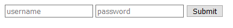  
> 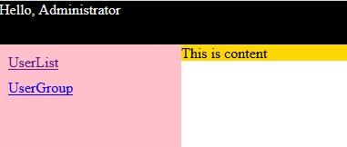  
> 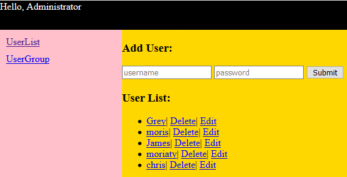  
> 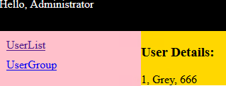  
> 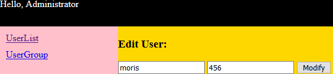  

```bash
app2/
    models.py
    urls.py
    views.py
    templates/
        app2/
            login.html
            index.html
            info.html
            detail.html
            edit.html
```

```py
# app2/models.py
from django.db import models

class UserInfo(models.Model):
    username=models.CharField(max_length=32)
    password=models.CharField(max_length=64)
```

```py
# app2/urls.py
from django.urls import path, re_path
from . import views

urlpatterns = [
    path('adduser/', views.adduser),
    path('login/', views.login),
    path('index/', views.index),
    path('userinfo/', views.user_info),
    path('usergroup/', views.user_group),
    re_path(r'detail-(?P<nid>\d+)/', views.user_detail),
    re_path(r'deluser-(?P<nid>\d+)/', views.user_del),
    re_path(r'edituser-(?P<nid>\d+)/', views.user_edit),
]
```

```py
# app2/views.py
from django.shortcuts import render, HttpResponse, redirect
from .models import UserInfo

def login(request, *args, **kwargs):
    msg = ''
    if request.method == 'POST':
        u = request.POST.get('uname')
        p = request.POST.get('pwd')
        obj = UserInfo.objects.filter(username=u, password=p).first()
        if not obj:
            msg = 'error username or password'
        else:
            print(obj.username, obj.password)
            return redirect(f'/app2/index/')
    return render(request, 'app2/login.html', {'msg': msg})


def index(request, *args, **kwargs):
    return render(request, 'app2/index.html')


def user_info(request, *args, **kwargs):
    if request.method == 'GET':
        userlist = UserInfo.objects.all()
        return render(request, 'app2/info.html', {'userlist': userlist})
    elif request.method == 'POST':
        uname = request.POST.get('uname')
        pwd = request.POST.get('pwd')
        UserInfo.objects.create(username=uname, password=pwd)
        return redirect(f'/app2/userinfo/')


def user_group(request, *args, **kwargs): pass


def user_detail(request, *args, **kwargs):
    nid = kwargs.get('nid')
    obj = UserInfo.objects.filter(id=nid).first()
    if obj:
        print(obj.id, obj.username, obj.password)
        return render(request, 'app2/detail.html', {'obj': obj})


def user_del(request, *args, **kwargs):
    nid = kwargs.get('nid')
    UserInfo.objects.filter(id=nid).delete()
    return redirect('/app2/userinfo/')


def user_edit(request, *args, **kwargs):
    if request.method == 'GET':
        nid = kwargs.get('nid')
        obj = UserInfo.objects.filter(id=nid).first()
        if obj:
            return render(request, 'app2/edit.html', {'obj': obj})
    elif request.method == 'POST':
        nid = request.POST.get('id')
        uname = request.POST.get('uname')
        pwd = request.POST.get('pwd')
        UserInfo.objects.filter(id=nid).update(username=uname, password=pwd)
        return redirect('/app2/userinfo/')


def adduser(request, *args, **kwargs):
    # # Insert Data
    # method1:
    UserInfo.objects.create(username='Grey', password='123')

    # method2:
    user = {'username': 'moris', 'password': '456'}
    UserInfo.objects.create(**user)

    # method3:
    user = UserInfo(username='James', password='789')
    user.save()

    # # Query
    # select * from app2_userinfo;
    for u in UserInfo.objects.all():
        print(u.id, u.username, u.password)

    # select * from app2_userinfo where username='Grey';
    for u in UserInfo.objects.filter(username='Grey'):
        print(u.id, u.username, u.password)

    # # Delete
    # delete from app2_userinfo where id=2;
    UserInfo.objects.filter(id=2).delete()

    # # Update
    # update app2_userinfo set password='666' where username='Grey';
    UserInfo.objects.filter(username='Grey').update(password='666')

    return HttpResponse('OK')
```

```html
<!-- app2/templates/app2/login.html -->
<body>
    <form action="{{request.path_info}}" method="post">
        <input type="text" name="uname" placeholder="username">
        <input type="password" name="pwd" placeholder="password">
        <input type="submit" value="Submit">
    </form>
    <span>{{msg}}</span>
</body>
```

```html
<!-- app2/templates/app2/index.html -->
<body>
    <div class="pg-header">
        Hello, Administrator
    </div>
    <div class="pg-container">
        <div class="pg-menu">
            <a href="/app2/userinfo/" class="menu">UserList</a>
            <a href="/app2/usergroup/" class="menu">UserGroup</a>
        </div>
        <div class="pg-content">
            This is content
        </div>
    </div>
    <style>
        body{
            margin: 0;
        }
        .pg-header{
            height: 48px;
            background-color: #000;
            color: #fff;
        }
        .pg-menu{
            position: absolute;
            top: 48px;
            bottom: 0;
            left: 0;
            width: 200px;
            background-color: pink;
        }
        .menu{
            display: block;
            margin: 10px;
        }
        .pg-content{
            position: absolute;
            top: 48px;
            left: 200px;
            right: 0;
            background-color: gold;
            overflow: auto;
        }
    </style>
</body>
```

```html
<!-- app2/templates/app2/info.html -->
<body>
    <div class="pg-header">
        Hello, Administrator
    </div>
    <div class="pg-container">
        <div class="pg-menu">
            <a href="/app2/userinfo/" class="menu">UserList</a>
            <a href="/app2/usergroup/" class="menu">UserGroup</a>
        </div>
        <div class="pg-content">
            <h3>Add User:</h3>
            <form action="/app2/userinfo/" method="post">
                <input type="text" name="uname" placeholder="username">
                <input type="password" name="pwd" placeholder="password">
                <input type="submit" value="Submit">
            </form>
            <h3>User List:</h3>
            <ul>
                
                <li>
                    <a href="/app2/detail-{{row.id}}">{{row.username}}</a>|
                    <a href="/app2/deluser-{{row.id}}">Delete</a>|
                    <a href="/app2/edituser-{{row.id}}">Edit</a>
                </li>
                
            </ul>
        </div>
    </div>
    <style>
        /* same as index.html style */
    </style>
</body>
```

```html
<!-- app2/templates/app2/detail.html -->
<body>
    <div class="pg-header">
        Hello, Administrator
    </div>
    <div class="pg-container">
        <div class="pg-menu">
            <a href="/app2/userinfo/" class="menu">UserList</a>
            <a href="/app2/usergroup/" class="menu">UserGroup</a>
        </div>
        <div class="pg-content">
            <h3>User Details:</h3>
            {{obj.id}}, {{obj.username}}, {{obj.password}}
        </div>
    </div>
    <style>
        /* same as index.html style */
    </style>
</body>
```

```html
<!-- app2/templates/app2/edit.html -->
<body>
    <div class="pg-header">
        Hello, Administrator
    </div>
    <div class="pg-container">
        <div class="pg-menu">
            <a href="/app2/userinfo/" class="menu">UserList</a>
            <a href="/app2/usergroup/" class="menu">UserGroup</a>
        </div>
        <div class="pg-content">
            <h3>Edit User:</h3>
            <form action="/app2/edituser-{{obj.id}}/" method="post">
                <input style="display:none;" type="text" name="id" value="{{obj.id}}">
                <input type="text" name="uname" value="{{obj.username}}">
                <input type="text" name="pwd" value="{{obj.password}}">
                <input type="submit" value="Modify">
            </form>
        </div>
    </div>
    <style>
        /* same as index.html style */
    </style>
</body>
```

`models.py`注意事项:
- 修改了字段的`max_length`等属性，需要`python manage.py makemigrations`, `python manage.py migrate`
- 增加一个`not NULL`字段，`python manage.py makemigrations`，会提示输入一个值，将之前的所有记录都增加这个字段的默认值，`python manage.py migrate`即可
- 增加一个`null=True`字段，`python manage.py makemigrations`, `python manage.py migrate`会将之前的记录的该字段设置为`NULL`
- 删除一个字段，需要`python manage.py makemigrations`, `python manage.py migrate`

`models.EmailField`, `models.URLField`本质就是`models.CharField`，只不过是用于`127.0.0.1:8000/admin/`；如果不用`/admin/`那么这些Field没用。

`models.py`中的class有一个隐含的默认的`id`字段，并且是primary_key；也可以自定义id字段`uid=models.AutoField(primary_key=True)`而不使用默认的`id`字段(AutoField必须是primary_key)

`models.py`生成的table名字为`appname_classname`

django字段类型分类:
- string
- number
- time
- binary

```bash
# 字段参数
null                # 是否为空
default             # 默认值
primary_key         # 主键
db_column           # 列名
db_index            # 索引
unique              # 唯一索引
unique_for_date     # 只对date做index
unique_for_month
unique_for_year
auto_now_add        # 创建时，自动生成时间
auto_now            # 更新时，自动更新为当前时间
    # method1调用, auto_now无效
    # obj = UserGroup.objects.filter(id=1).update(caption='CEO')
    
    # method2调用，auto_now有效
    # obj = UserGroup.objects.filter(id=1).first()
    # obj.caption = "CEO"
    # obj.save()

choices             # django admin中显示下拉选项；避免连表查询，提升性能
blank               # django admin是否为空: blank=True
verbose_name        # django admin显示字段中文: verbose_name='用户名'
editable            # django admin是否可编辑
error_messages      # django admin错误信息 error_messages={'required': '请输入'}
help_text           # django admin提示
validators          # django form ,自定义验证
```

```py
# choice使用场景: 学生表中的class_id和班级表中id需要连表(foreign_key是class_id)，然而班级就那么几个，而连表性能低，班级表变动少，所以一般使用内存中的数据；那么就会涉及choices；choices是在内存中的数据
# models.py
from django.db import models

class UserInfo(models.Model):
    username=models.CharField(max_length=32)
    password=models.CharField(max_length=64)

    user_type=(
        (1, 'superuser'),
        (2, 'normaluser'),
        (3, 'banneduser'),
    )

    user_type_id=models.IntegerField(choices=user_type, default=1)
```

example: `ForeignKey`

```py
# models.py
from django.db import models

class UserGroup(models.Model):
    uid = models.AutoField(primary_key=True)
    groupname = models.CharField(max_length=32)

class UserInfo(models.Model):
    username = models.CharField(max_length=32)
    password = models.CharField(max_length=64)
    # to_field默认是primary_key; on_delete必须要有
    # DB中字段名为user_group_id
    # user_group是一个对象，方便连表查询
    user_group = models.ForeignKey(
        'UserGroup',
        to_field='uid',
        on_delete=models.CASCADE,
        default=1
    )
```

```py
# 连表查询: 可以一层一层连接表

user_list=UserInfo.objects.all()
for row in user_list:
    # 存在的字段查询
    print(row.id, row.username, row.password, row.user_group_id)
    # 连表查询
    print(row.user_group.uid, row.user_group.groupname)
```

```py
# 连表增加数据

# method1: recommended
def adduser(request, *args, **kwargs):
    UserInfo.objects.create(
        username='Jack', 
        password='123', 
        user_group_id=2
    )

# method2: not recommended
def adduser(request, *args, **kwargs):
    UserInfo.objects.create(
        username='Jack', 
        password='123', 
        user_group=UserGroup.objects.filter(id=1).first()
    )
```

example: UserInfo & UserGroup
>   
>   
> 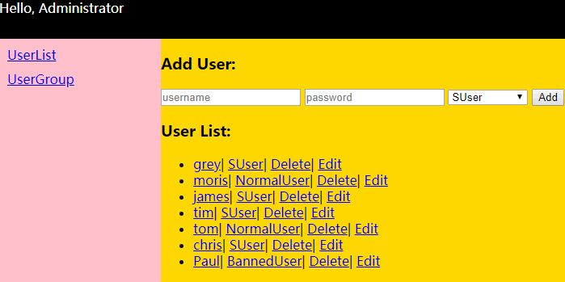  
> 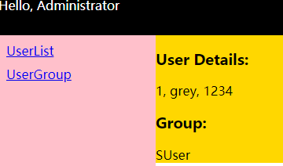  
> 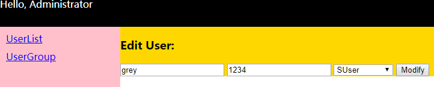  
> 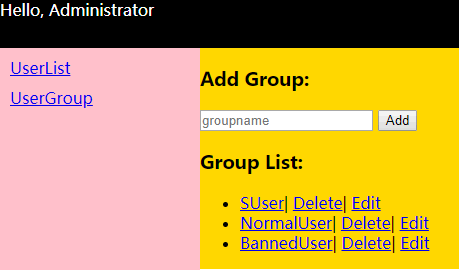  
> 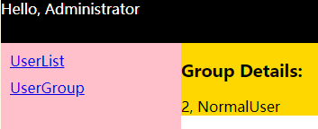  
> 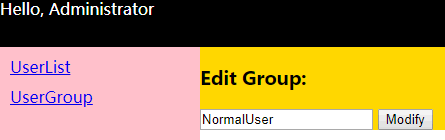  

```bash
app2/
    models.py
    urls.py
    views.py
    templates/
        app2/
            login.html
            index.html
            info.html
            detail.html
            edit.html
            
            groupinfo.html
            gpdetail.html
            gpedit.html
```

```py
# app2/models.py
from django.db import models

class UserGroup(models.Model):
    uid = models.AutoField(primary_key=True)
    groupname = models.CharField(max_length=32)


class UserInfo(models.Model):
    username = models.CharField(max_length=32)
    password = models.CharField(max_length=64)
    user_group = models.ForeignKey(
        'UserGroup',
        to_field='uid',
        on_delete=models.CASCADE,
        default=1
    )
```

```py
# app2/urls.py
from django.urls import path, re_path
from . import views

urlpatterns = [
    # user operation
    path('adduser/', views.adduser),
    path('login/', views.login),
    path('index/', views.index),
    path('userinfo/', views.user_info),
    re_path(r'^detail-(?P<nid>\d+)/', views.user_detail),
    re_path(r'deluser-(?P<nid>\d+)/', views.user_del),
    re_path(r'edituser-(?P<nid>\d+)/', views.user_edit),
    # group operation
    path('usergroup/', views.user_group),
    # ^必须要有，否则url会与detail那条匹配
    re_path(r'^gpdetail-(?P<gid>\d+)/', views.gp_detail),
    re_path(r'delgroup-(?P<gid>\d+)/', views.gp_del),
    re_path(r'editgroup-(?P<gid>\d+)/', views.gp_edit),
]
```

```py
# app2/views.py
from django.shortcuts import render, HttpResponse, redirect
from .models import *


def login(request, *args, **kwargs):
    msg = ''
    if request.method == 'POST':
        u = request.POST.get('uname')
        p = request.POST.get('pwd')
        obj = UserInfo.objects.filter(username=u, password=p).first()
        if not obj:
            msg = 'error username or password'
        else:
            print(obj.username, obj.password)
            return redirect(f'/app2/index/')
    return render(request, 'app2/login.html', {'msg': msg})


def index(request, *args, **kwargs):
    return render(request, 'app2/index.html')


def user_info(request, *args, **kwargs):
    if request.method == 'GET':
        userlist = UserInfo.objects.all()
        grouplist = UserGroup.objects.all()
        return render(request, 'app2/info.html', {'userlist': userlist, 'grouplist': grouplist})
    elif request.method == 'POST':
        uname = request.POST.get('uname')
        pwd = request.POST.get('pwd')
        gp_id = request.POST.get('gp_id')
        UserInfo.objects.create(
            username=uname,
            password=pwd,
            user_group_id=gp_id,
        )
        return redirect('/app2/userinfo/')


def user_detail(request, *args, **kwargs):
    nid = kwargs.get('nid')
    obj = UserInfo.objects.filter(id=nid).first()
    if obj:
        print(obj.id, obj.username, obj.password)
        return render(request, 'app2/detail.html', {'obj': obj})


def user_del(request, *args, **kwargs):
    nid = kwargs.get('nid')
    UserInfo.objects.filter(id=nid).delete()
    return redirect('/app2/userinfo/')


def user_edit(request, *args, **kwargs):
    if request.method == 'GET':
        nid = kwargs.get('nid')
        obj = UserInfo.objects.filter(id=nid).first()
        grouplist = UserGroup.objects.all()
        if obj:
            return render(request, 'app2/edit.html', {'obj': obj, 'grouplist': grouplist})
    elif request.method == 'POST':
        nid = request.POST.get('id')
        uname = request.POST.get('uname')
        pwd = request.POST.get('pwd')
        gp_id = request.POST.get('gp_id')
        UserInfo.objects.filter(id=nid).update(
            username=uname,
            password=pwd,
            user_group_id=gp_id
        )
        return redirect('/app2/userinfo/')


def adduser(request, *args, **kwargs):
    # # Insert Data
    # method1:
    UserInfo.objects.create(username='Grey', password='123')

    # method2:
    user = {'username': 'moris', 'password': '456'}
    UserInfo.objects.create(**user)

    # method3:
    user = UserInfo(username='James', password='789')
    user.save()

    # # Query
    # select * from app2_userinfo;
    for u in UserInfo.objects.all():
        print(u.id, u.username, u.password)

    # select * from app2_userinfo where username='Grey';
    for u in UserInfo.objects.filter(username='Grey'):
        print(u.id, u.username, u.password)

    # # Delete
    # delete from app2_userinfo where id=2;
    UserInfo.objects.filter(id=2).delete()

    # # Update
    # update app2_userinfo set password='666' where username='Grey';
    UserInfo.objects.filter(username='Grey').update(password='666')

    return HttpResponse('OK')


def user_group(request, *args, **kwargs):
    if request.method == 'GET':
        grouplist = UserGroup.objects.all()
        return render(request, 'app2/groupinfo.html', {'grouplist': grouplist})
    elif request.method == 'POST':
        gpname = request.POST.get('gpname')
        UserGroup.objects.create(groupname=gpname)
        return redirect('/app2/usergroup')


def gp_detail(request, *args, **kwargs):
    gid = kwargs.get('gid')
    obj = UserGroup.objects.filter(uid=gid).first()
    if obj:
        return render(request, 'app2/gpdetail.html', {'obj': obj})


def gp_del(request, *args, **kwargs):
    gid = kwargs.get('gid')
    UserGroup.objects.filter(uid=gid).delete()
    return redirect('/app2/usergroup')


def gp_edit(request, *args, **kwargs):
    if request.method == 'GET':
        gid = kwargs.get('gid')
        obj = UserGroup.objects.filter(uid=gid).first()
        if obj:
            print(gid)
            return render(request, 'app2/gpedit.html', {'obj': obj})
    elif request.method == 'POST':
        gid = request.POST.get('uid')
        gpname = request.POST.get('gpname')
        UserGroup.objects.filter(uid=gid).update(groupname=gpname)
        return redirect('/app2/usergroup')
```

```html
<!-- app2/templates/login.html -->
<body>
    <form action="{{request.path_info}}" method="post">
        <input type="text" name="uname" placeholder="username">
        <input type="password" name="pwd" placeholder="password">
        <input type="submit" value="Submit">
    </form>
    <span>{{msg}}</span>
</body>
```

```html
<!-- app2/templates/index.html -->
<body>
    <div class="pg-header">
        Hello, Administrator
    </div>
    <div class="pg-container">
        <div class="pg-menu">
            <a href="/app2/userinfo/" class="menu">UserList</a>
            <a href="/app2/usergroup/" class="menu">UserGroup</a>
        </div>
        <div class="pg-content">
            This is content
        </div>
    </div>
    <style>
        body{
            margin: 0;
        }
        .pg-header{
            height: 48px;
            background-color: #000;
            color: #fff;
        }
        .pg-menu{
            position: absolute;
            top: 48px;
            bottom: 0;
            left: 0;
            width: 200px;
            background-color: pink;
        }
        .menu{
            display: block;
            margin: 10px;
        }
        .pg-content{
            position: absolute;
            top: 48px;
            left: 200px;
            right: 0;
            background-color: gold;
            overflow: auto;
        }
    </style>
</body>
```

```html
<!-- app2/templates/info.html -->
<body>
    <div class="pg-header">
        Hello, Administrator
    </div>
    <div class="pg-container">
        <div class="pg-menu">
            <a href="/app2/userinfo/" class="menu">UserList</a>
            <a href="/app2/usergroup/" class="menu">UserGroup</a>
        </div>
        <div class="pg-content">
            <h3>Add User:</h3>
            <form action="/app2/userinfo/" method="post">
                <input type="text" name="uname" placeholder="username">
                <input type="password" name="pwd" placeholder="password">
                <select name="gp_id">
                    
                        <option value="{{ row.uid }}">{{ row.groupname }}</option>
                    
                </select>
                <input type="submit" value="Add">
            </form>
            <h3>User List:</h3>
            <ul>
                
                <li>
                    <a href="/app2/detail-{{row.id}}">{{row.username}}</a>|
                    <a href="/app2/gpdetail-{{ row.user_group.uid }}">{{row.user_group.groupname}}</a>|
                    <a href="/app2/deluser-{{row.id}}">Delete</a>|
                    <a href="/app2/edituser-{{row.id}}">Edit</a>
                </li>
                
            </ul>
        </div>
    </div>
    <style>
        /* same as index.html style */
    </style>
</body>
```

```html
<!-- app2/templates/detail.html -->
<body>
    <div class="pg-header">
        Hello, Administrator
    </div>
    <div class="pg-container">
        <div class="pg-menu">
            <a href="/app2/userinfo/" class="menu">UserList</a>
            <a href="/app2/usergroup/" class="menu">UserGroup</a>
        </div>
        <div class="pg-content">
            <h3>User Details:</h3>
            {{obj.id}}, {{obj.username}}, {{obj.password}}
            <h3>Group:</h3>
            {{ obj.user_group.groupname }}
        </div>
    </div>
    <style>
        /* same as index.html style */
    </style>
</body>
```

```html
<!-- app2/templates/edit.html -->
<body>
    <div class="pg-header">
        Hello, Administrator
    </div>
    <div class="pg-container">
        <div class="pg-menu">
            <a href="/app2/userinfo/" class="menu">UserList</a>
            <a href="/app2/usergroup/" class="menu">UserGroup</a>
        </div>
        <div class="pg-content">
            <h3>Edit User:</h3>
            <form action="/app2/edituser-{{obj.id}}/" method="post">
                <input style="display:none;" type="text" name="id" value="{{obj.id}}">
                <input type="text" name="uname" value="{{obj.username}}">
                <input type="text" name="pwd" value="{{obj.password}}">
                <select name="gp_id">
                    
                        
                            <option value="{{ row.uid }}" selected>{{ row.groupname }}</option>
                        
                            <option value="{{ row.uid }}">{{ row.groupname }}</option>
                        
                    
                </select>
                <input type="submit" value="Modify">
            </form>
        </div>
    </div>
    <style>
        /* same as index.html style */
    </style>
</body>
```

```html
<!-- app2/templates/groupinfo.html -->
<body>
    <div class="pg-header">
        Hello, Administrator
    </div>
    <div class="pg-container">
        <div class="pg-menu">
            <a href="/app2/userinfo/" class="menu">UserList</a>
            <a href="/app2/usergroup/" class="menu">UserGroup</a>
        </div>
        <div class="pg-content">
            <h3>Add Group:</h3>
            <form action="/app2/usergroup/" method="post">
                <input type="text" name="gpname" placeholder="groupname">
                <input type="submit" value="Add">
            </form>
            <h3>Group List:</h3>
            <ul>
                
                <li>
                    <a href="/app2/gpdetail-{{row.uid}}">{{row.groupname}}</a>|
                    <a href="/app2/delgroup-{{row.uid}}">Delete</a>|
                    <a href="/app2/editgroup-{{row.uid}}">Edit</a>
                </li>
                
            </ul>
        </div>
    </div>
    <style>
        /* same as index.html style */
    </style>
</body>
```

```html
<!-- app2/templates/gpdetail.html -->
<body>
    <div class="pg-header">
        Hello, Administrator
    </div>
    <div class="pg-container">
        <div class="pg-menu">
            <a href="/app2/userinfo/" class="menu">UserList</a>
            <a href="/app2/usergroup/" class="menu">UserGroup</a>
        </div>
        <div class="pg-content">
            <h3>Group Details:</h3>
            {{obj.uid}}, {{obj.groupname}}
        </div>
    </div>
    <style>
        /* same as index.html style */
    </style>
</body>
```

```html
<!-- app2/templates/gpedit.html -->
<body>
    <div class="pg-header">
        Hello, Administrator
    </div>
    <div class="pg-container">
        <div class="pg-menu">
            <a href="/app2/userinfo/" class="menu">UserList</a>
            <a href="/app2/usergroup/" class="menu">UserGroup</a>
        </div>
        <div class="pg-content">
            <h3>Edit Group:</h3>
            <form action="/app2/editgroup-{{obj.uid}}/" method="post">
                <input style="display:none;" type="text" name="uid" value="{{obj.uid}}">
                <input type="text" name="gpname" value="{{obj.groupname}}">
                <input type="submit" value="Modify">
            </form>
        </div>
    </div>
    <style>
        /* same as index.html style */
    </style>
</body>
```

Django有两个精华的东西:
- `__`
- `_set`

## Django `__`

```bash
app1/
    models.py
    urls.py
    views.py
    templates/
        app1/
            business.html
            host.html
```

```py
# app1/models.py
from django.db import models

class Business(models.Model):
    name = models.CharField(max_length=32)

class Host(models.Model):
    hostname = models.CharField(max_length=32, db_index=True)
    ip = models.GenericIPAddressField(db_index=True)
    port = models.IntegerField()
    business = models.ForeignKey('Business', on_delete=models.CASCADE)
```

```py
# app1/urls.py
from django.urls import path, re_path
from . import views

urlpatterns = [
    path('business/', views.business),
    path('host/', views.host)
]
```

```py
# app1/views.py
from django.shortcuts import render, redirect, HttpResponse
from .models import *

def business(request, *args, **kwargs):
    v1 = Business.objects.all()
    v2 = Business.objects.all().values('name', 'id')
    v3 = Business.objects.all().values_list('name', 'id')
    print(v1)  # object list
    print(v2)  # dictionary
    print(v3)  # tuple
    return render(request, 'app1/business.html', {'v1': v1, 'v2': v2, 'v3': v3})

def host(request, *args, **kwargs):
    v1 = Host.objects.filter(id__gt=2)
    # 字符串中需要用 __ 来跨表查询
    v2 = Host.objects.filter(id__lt=5).values('id', 'hostname', 'business_id', 'business__name')  # __跨表
    v3 = Host.objects.all().values_list('id', 'hostname', 'business_id', 'business__name')  # __跨表
    print(v1)  # object list
    print(v2)  # dictionary
    print(v3)  # tuple
    # v1是QuerySet内部类型是object, 使用 . 来获取值
    for row in v1:
        print(row.id, row.hostname, row.business_id, row.business.name)
    # v2是QuerySet,内部类型是dictionary，使用[] 来获取值
    for row in v2:
        print(row['id'], row['hostname'], row['business_id'], row['business__name'])
    # v3是QuerySet, 内部类型是tuple， 使用[]来获取值
    for row in v3:
        print(row[0], row[1], row[2], row[3])
    return render(request, 'app1/host.html', {'v1': v1, 'v2': v2, 'v3': v3})
```

```django
<!-- app1/templates/app1/business.html -->
<body>
<h3>method1: by objects</h3>
<ul>
    
        <li>{{ row.id }}------{{ row.name }}</li>
    
</ul>
<h3>method2: by dictionary</h3>
<ul>
    
        <li>{{ row.id }}------{{ row.name }}</li>
    
</ul>
<ul>
    
        <li>
            
                {{ v }}
            
        </li>
    
</ul>
<h3>method3: by tuple</h3>
<ul>
    
        <li>{{ row.1 }}------{{ row.0 }}</li>
    
</ul>
</body>
```

```django
<!-- app1/tempates/host.html -->
<body>
<h3>Table 1: by object</h3>
<table border="1">
    <thead>
    <th>HostName</th>
    <th>IP</th>
    <th>Port</th>
    <th>Business_Name</th>
    </thead>
    <tbody>
    
        <tr host_id="{{ row.id }}" bid="{{ row.business_id }}">
            <td>{{ row.hostname }}</td>
            <td>{{ row.ip }}</td>
            <td>{{ row.port }}</td>
            <td>{{ row.business.name }}</td>
        </tr>
    
    </tbody>
</table>
<h3>Table 2: by dictionary</h3>
<table border="1">
    <thead>
    <th>HostName</th>
    <th>Business_Name</th>
    </thead>
    <tbody>
    
        <tr host_id="{{ row.id }}" bid="{{ row.business_id }}">
            <td>{{ row.hostname }}</td>
            <td>{{ row.business__name }}</td>
        </tr>
    
    </tbody>
</table>
<h3>Table 3: by tuple</h3>
<table border="1">
    <thead>
    <th>HostName</th>
    <th>Business_Name</th>
    </thead>
    <tbody>
    
        <tr host_id="{{ row.0 }}" bid="{{ row.2 }}">
            <td>{{ row.1 }}</td>
            <td>{{ row.3 }}</td>
        </tr>
    
    </tbody>
</table>
</body>
```

example: add Data by modal

```py
# app1/views.py
from django.shortcuts import render, redirect, HttpResponse
from .models import *

def business(request, *args, **kwargs):
    v1 = Business.objects.all()
    return render(request, 'app1/business.html', {'v1': v1})

def host(request, *args, **kwargs):
    if request.method == 'GET':
        v1 = Host.objects.all()
        v2 = Business.objects.all()
        return render(request, 'app1/host.html', {'v1': v1, 'v2': v2})
    elif request.method == 'POST':
        h = request.POST.get('hostname')
        i = request.POST.get('ip')
        p = request.POST.get('port')
        b_id = request.POST.get('business_id')
        Host.objects.create(
            hostname=h,
            ip=i,
            port=p,
            business_id=b_id
        )
        # trick
        return redirect('/app1/host/')
```

```django
<!-- app1/templates/app1/host.html -->
<body>
<div class="mask hide"></div>
<div class="modal hide">
    <form action="/app1/host/" method="post">
        <input type="text" name="hostname" placeholder="HostName">
        <input type="text" name="ip" placeholder="IP Address">
        <input type="text" name="port" placeholder="Port">
        <select name="business_id">
            
                <option value="{{ row.id }}">{{ row.name }}</option>
            
        </select>
        <p>
            <input type="submit" value="Submit">
            <input type="button" value="Cancel" id="btnCancel">
        </p>
    </form>
</div>
<div>
    <input type="button" value="Add" id="btnAddHost">
</div>
<table border="1">
    <thead>
    <th>N.O.</th>
    <th>HostName</th>
    <th>IP</th>
    <th>Port</th>
    <th>BusinessName</th>
    </thead>
    <tbody>
    
        <tr hid="{{ row.id }}" bid="{{ row.business_id }}">
            <!-- couter, counter0, revcounter, revcounter0 -->
            <!-- first, last -->
            <!-- parentloop: 多层循环嵌套的时候，上层循环的以上6个变量 -->
            <td>{{ forloop.counter }}</td>
            <td>{{ row.hostname }}</td>
            <td>{{ row.ip }}</td>
            <td>{{ row.port }}</td>
            <td>{{ row.business.name }}</td>
        </tr>
    
    </tbody>
</table>
<style>
    .hide {
        display: none;
    }

    .mask {
        position: fixed;
        left: 0;
        top: 0;
        right: 0;
        bottom: 0;
        background-color: #000;
        opacity: 0.5;
    }

    .modal {
        position: fixed;
        left: 50%;
        top: 30%;
        width: 400px;
        height: 300px;
        background-color: #fff;
        margin-left: -200px;
    }

    form > input {
        display: block;
    }
</style>
<script src="https://code.jquery.com/jquery-3.3.1.slim.min.js"></script>
<script>
    $(function () {
        $('#btnAddHost').click(function () {
            $('.mask, .modal').removeClass('hide');
        });
        $('#btnCancel').click(function () {
            $('.mask, .modal').addClass('hide');
            <!-- clear input -->
            $('form > input').val('')
        });
    })
</script>
</body>
```

## Ajax

Ajax本质: 悄悄地Submit
> `form` submit的时候，要么是`render()`返回template, 要么`redirect()`到其他页面  
> `ajax` submit的时候，只是为了获取从后台传递过来的数据，为了方便`JSON.parse()`，只需要`HttpResponse()`不需要`render()`；从后台得到数据之后才跳转，需要在`<scrip></script>`中使用`location.reload()`和`location.href='https://www.baidu.com'`，所以views.py中不需要`redirect()`函数

example: test ajax

```bash
app1/
    urls.py
    views.py
    templates/
        test.html

# 访问 http://127.0.0.1:8000/app1/test/，然后click
```

```py
# app1/urls.py
from django.urls import path
from . import views

urlpatterns = [
    path('test/', views.test),
    path('test_ajax/', views.test_ajax),
]
```

```py
# app1/views.py
from django.shortcuts import render, HttpResponse

def test(request, *args, **kwargs):
    return render(request, 'app1/test.html')

def test_ajax(request, *args, **kwargs):
    import time
    if request.method == 'GET':
        u = request.GET.get('user')
        p = request.GET.get('pwd')
        print(u, p)
        # 默认都是async的
        time.sleep(5)
        return HttpResponse('OK')
```

```django
<!-- app1/templates/app1/test.html -->
<body>
<input type="button" value="Ajax Submit" id="btnAjax">
<script src="https://code.jquery.com/jquery-3.3.1.min.js"></script>
<script>
    $(function () {
        $('#btnAjax').click(function () {
            // method1: success, deprecated
            // $.ajax({
            //     url: "/app1/test_ajax/",
            //     type: "GET",
            //     data: {'user': "John", 'pwd': "666666"},
            //     success: function(data){
            //         alert(data);
            //     }
            // })

            // method2: done, jQuery 3.0+
            $.ajax({
                url: "/app1/test_ajax/",
                type: "GET",
                data: {'user': "John", 'pwd': "666666"},
            }).done(function (data) {
                // 当test_ajax return 的时候才会被调用，是async的
                alert(data); // 就是后台返回的"OK"
            });
        });
    });
</script>
</body>
```

```django
<script>
    $.ajax({
            url: "/app1/test_ajax/",
            type: "GET",
            // ajax传递数据的形式
            data: {'k1': "John", 'k2': [1, 2, 3], 'k3': JSON.stringify({'k11':'v11', 'k22': 'v22'})},
        })
</script>
```

example: ajax submit

```bash
app1/
    urls.py
    views.py
    templates/
        business.html
        host.html
```

```py
# app1/views.py
from django.shortcuts import HttpResponse
from .models import *

def host(request, *args, **kwargs):
    if request.method == 'GET':
        v1 = Host.objects.all()
        v2 = Business.objects.all()
        return render(request, 'app1/host.html', {'v1': v1, 'v2': v2})
    elif request.method == 'POST':
        ret = {'status': True, 'error': None, 'data': None}
        try:
            h = request.POST.get('hostname')
            i = request.POST.get('ip')
            p = request.POST.get('port')
            b_id = request.POST.get('business_id')

            # verify hostname
            if h and len(h) > 5:
                Host.objects.create(
                    hostname=h,
                    ip=i,
                    port=p,
                    business_id=b_id
                )
                ret['data'] = 'OK'
            else:
                ret['status'] = False
                ret['error'] = 'host name too short'
        except Exception as e:
            ret['status'] = False
            # 因为格式不正确导致无法写入数据库造成的错误
            ret['error'] = str(e)
        import json
        return HttpResponse(json.dumps(ret))
```

```django
<!-- app1/templates/app1/host.html -->
<body>
<div class="mask hide"></div>
<div class="modal hide">
    <form action="/app1/host/" method="post">
        <input type="text" name="hostname" placeholder="HostName" id="hostname">
        <input type="text" name="ip" placeholder="IP Address" id="ip">
        <input type="text" name="port" placeholder="Port" id="port">
        <select name="business_id" id="business_id">
            
                <option value="{{ row.id }}">{{ row.name }}</option>
            
        </select>
        <p>
            <input type="button" value="AjaxSubmit" id="btnAjax">
            <input type="button" value="Cancel" id="btnCancel">
            <span id="err_msg" style="color: red"></span>
        </p>
    </form>
</div>
<div>
    <input type="button" value="Add" id="btnAddHost">
</div>
<table border="1">
    <thead>
    <th>N.O.</th>
    <th>HostName</th>
    <th>IP</th>
    <th>Port</th>
    <th>BusinessName</th>
    </thead>
    <tbody>
    
        <tr hid="{{ row.id }}" bid="{{ row.business_id }}">
            <td>{{ forloop.counter }}</td>
            <td>{{ row.hostname }}</td>
            <td>{{ row.ip }}</td>
            <td>{{ row.port }}</td>
            <td>{{ row.business.name }}</td>
        </tr>
    
    </tbody>
</table>
<style>
    .hide {
        display: none;
    }

    .mask {
        position: fixed;
        left: 0;
        top: 0;
        right: 0;
        bottom: 0;
        background-color: #000;
        opacity: 0.5;
    }

    .modal {
        position: fixed;
        left: 50%;
        top: 30%;
        width: 400px;
        height: 300px;
        background-color: #fff;
        margin-left: -200px;
    }

    form > input {
        display: block;
    }
</style>
<script src="https://code.jquery.com/jquery-3.3.1.min.js"></script>
<script>
    $(function () {
        $('#btnAddHost').click(function () {
            $('.mask, .modal').removeClass('hide');
        });
        $('#btnCancel').click(function () {
            $('.mask, .modal').addClass('hide');
            // clear input
            $('form > input').val('');
            // clear err_msg
            $('#err_msg').text('');
        });
        // ajax
        $('#btnAjax').click(function () {
            $.ajax({
                method: 'POST',
                url: '/app1/host/',
                data: {
                    'hostname': $('#hostname').val(),
                    'ip': $('#ip').val(),
                    'port': $('#port').val(),
                    'business_id': $('#business_id').val()
                },
            }).done(function (data) {
                let d = JSON.parse(data); // from string to object
                if (d.status) {
                    // reload page
                    location.reload();
                } else {
                    $('#err_msg').text(d.error);
                }
            });
        });
    })
</script>
</body>
```

example: modal delete data

实现方式:
- method1: 在modal中submit host的id来删除数据
- method2: 在ajax中submit host的id来删除数据
- method3: 利用`confirm` dialog配合ajax来删除数据

method1: delete by `form` submit

```py
# app1/urls.py
from django.urls import path, re_path
from . import views

urlpatterns = [
    path('business/', views.business),
    path('host/', views.host),
    path('delhost/', views.delhost),
]
```

```py
# app1/views.py
def delhost(request, *args, **kwargs):
    hid = request.POST.get('hid')
    Host.objects.filter(id=hid).delete()
    return redirect('/app1/host')
```

```django
<!-- app1/templates/app1/host.html -->
<body>
<div class="mask hide"></div>
<!-- add data modal -->
<div class="modal hide">
    <form action="/app1/host/" method="post">
        <input type="text" name="hostname" placeholder="HostName" id="hostname">
        <input type="text" name="ip" placeholder="IP Address" id="ip">
        <input type="text" name="port" placeholder="Port" id="port">
        <select name="business_id" id="business_id">
            
                <option value="{{ row.id }}">{{ row.name }}</option>
            
        </select>
        <p>
            <input type="button" value="AjaxSubmit" id="btnAjax">
            <input type="button" value="Cancel" id="btnCancel">
            <span id="err_msg" style="color: red"></span>
        </p>
    </form>
</div>
<!-- delete date modal -->
<div class="delModal hide">
    <form action="/app1/delhost/" method="post">
        <p>
            <input type="hidden" name="hid">
            <input type="button" value="Cancel" id="btnDelCancel">
            <input type="submit" value="OK" id="btnDelOK">
        </p>
    </form>
</div>
<div>
    <input type="button" value="Add" id="btnAddHost">
</div>
<!-- hosts table -->
<table border="1">
    <thead>
    <th>N.O.</th>
    <th>HostName</th>
    <th>IP</th>
    <th>Port</th>
    <th>BusinessName</th>
    <th>Edit</th>
    <th>Delete</th>
    </thead>
    <tbody>
    
        <tr hid="{{ row.id }}" bid="{{ row.business_id }}">
            <td>{{ forloop.counter }}</td>
            <td>{{ row.hostname }}</td>
            <td>{{ row.ip }}</td>
            <td>{{ row.port }}</td>
            <td>{{ row.business.name }}</td>
            <td><a class="edit">Edit</a></td>
            <td><a class="del">Delete</a></td>
        </tr>
    
    </tbody>
</table>
<style>
    .hide {
        display: none;
    }

    .mask {
        position: fixed;
        left: 0;
        top: 0;
        right: 0;
        bottom: 0;
        background-color: #000;
        opacity: 0.5;
    }

    .modal, .delModal {
        position: fixed;
        left: 50%;
        top: 30%;
        width: 400px;
        height: 300px;
        background-color: #fff;
        margin-left: -200px;
    }

    form > input {
        display: block;
    }
</style>
<script src="https://code.jquery.com/jquery-3.3.1.min.js"></script>
<script>
    $(function () {
        // AddHost
        $('#btnAddHost').click(function () {
            $('.mask, .modal').removeClass('hide');
        });
        // modal cancel
        $('#btnCancel').click(function () {
            $('.mask, .modal').addClass('hide');
            // clear input
            $('form > input').val('');
            // clear err_msg
            $('#err_msg').text('');
        });
        // modal ajax submit
        $('#btnAjax').click(function () {
            $.ajax({
                method: 'POST',
                url: '/app1/host/',
                data: {
                    'hostname': $('#hostname').val(),
                    'ip': $('#ip').val(),
                    'port': $('#port').val(),
                    'business_id': $('#business_id').val()
                },
            }).done(function (data) {
                let d = JSON.parse(data); // from string to object
                if (d.status) {
                    // reload page
                    location.reload();
                } else {
                    $('#err_msg').text(d.error);
                }
            });
        });
        // delete record
        $('.del').click(function () {
            $('.mask, .delModal').removeClass('hide');
            let hid = $(this).parent().parent().attr('hid')
            $('input:hidden').val(hid)
        });
        // delete cancel
        $('#btnDelCancel').click(function () {
            $('.mask, .delModal').addClass('hide');
        });
    })
</script>
</body>
```

method2: delete by ajax

```py
# app1/views.py
def delhost(request, *args, **kwargs):
    hid = request.POST.get('hid')
    Host.objects.filter(id=hid).delete()
    return HttpResponse('OK')
```

```django
<!-- app1/templates/app1/host.html -->
<body>
<div class="mask hide"></div>
<!-- add data modal -->
<div class="modal hide">
    <form>
        <input type="text" name="hostname" placeholder="HostName" id="hostname">
        <input type="text" name="ip" placeholder="IP Address" id="ip">
        <input type="text" name="port" placeholder="Port" id="port">
        <select name="business_id" id="business_id">
            
                <option value="{{ row.id }}">{{ row.name }}</option>
            
        </select>
        <p>
            <input type="button" value="AjaxSubmit" id="btnAjax">
            <input type="button" value="Cancel" id="btnCancel">
            <span id="err_msg" style="color: red"></span>
        </p>
    </form>
</div>
<!-- delete data modal -->
<div class="delModal hide">
    <p>
        <input type="hidden" name="hid">
        <input type="button" value="Cancel" id="btnDelCancel">
        <input type="button" value="OK" id="btnDelOK">
    </p>
</div>
<div>
    <input type="button" value="Add" id="btnAddHost">
</div>
<table border="1">
    <thead>
    <th>N.O.</th>
    <th>HostName</th>
    <th>IP</th>
    <th>Port</th>
    <th>BusinessName</th>
    <th>Edit</th>
    <th>Delete</th>
    </thead>
    <tbody>
    
        <tr hid="{{ row.id }}" bid="{{ row.business_id }}">
            <td>{{ forloop.counter }}</td>
            <td>{{ row.hostname }}</td>
            <td>{{ row.ip }}</td>
            <td>{{ row.port }}</td>
            <td>{{ row.business.name }}</td>
            <td><a class="edit">Edit</a></td>
            <td><a class="del">Delete</a></td>
        </tr>
    
    </tbody>
</table>
<style>
    .hide {
        display: none;
    }

    .mask {
        position: fixed;
        left: 0;
        top: 0;
        right: 0;
        bottom: 0;
        background-color: #000;
        opacity: 0.5;
    }

    .modal, .delModal {
        position: fixed;
        left: 50%;
        top: 30%;
        width: 400px;
        height: 300px;
        background-color: #fff;
        margin-left: -200px;
    }

    form > input {
        display: block;
    }
</style>
<script src="https://code.jquery.com/jquery-3.3.1.min.js"></script>
<script>
    $(function () {
        // AddHost
        $('#btnAddHost').click(function () {
            $('.mask, .modal').removeClass('hide');
        });
        // modal cancel
        $('#btnCancel').click(function () {
            $('.mask, .modal').addClass('hide');
            // clear input
            $('form > input').val('');
            // clear err_msg
            $('#err_msg').text('');
        });
        // modal ajax submit
        $('#btnAjax').click(function () {
            $.ajax({
                method: 'POST',
                url: '/app1/host/',
                data: {
                    'hostname': $('#hostname').val(),
                    'ip': $('#ip').val(),
                    'port': $('#port').val(),
                    'business_id': $('#business_id').val()
                },
            }).done(function (data) {
                let d = JSON.parse(data); // from string to object
                if (d.status) {
                    // reload page
                    location.reload();
                } else {
                    $('#err_msg').text(d.error);
                }
            });
        });
        // delete record
        $('.del').click(function () {
            $('.mask, .delModal').removeClass('hide');
            let hid = $(this).parent().parent().attr('hid');
            $('input:hidden').val(hid)
        });
        // delete cancel
        $('#btnDelCancel').click(function () {
            $('.mask, .delModal').addClass('hide');
        });
        // delete ok
        $('#btnDelOK').click(function () {
            let v = $('input:hidden').val();
            $.ajax({
                method: 'POST',
                url: '/app1/delhost/',
                data: {'hid': v}
            }).done(function (data) {
                if (data == 'OK') {
                    // method1: reload()
                    // location.reload();

                    // method2: remove()掉元素，反正数据库里面已经删了，避免刷新
                    $(`tr[hid=${v}]`).remove();
                    $('#btnDelCancel').click();
                }
            });
        });
    })
</script>
</body>
```

method3: delete data by `confirm` dialog

```py
# app1/views.py
def delhost(request, *args, **kwargs):
    hid = request.POST.get('hid')
    Host.objects.filter(id=hid).delete()
    return HttpResponse('OK')
```

```django
<!-- app1/templates/app1/host.html -->
<body>
<div class="mask hide"></div>
<!-- add data modal -->
<div class="modal hide">
    <form>
        <input type="text" name="hostname" placeholder="HostName" id="hostname">
        <input type="text" name="ip" placeholder="IP Address" id="ip">
        <input type="text" name="port" placeholder="Port" id="port">
        <select name="business_id" id="business_id">
            
                <option value="{{ row.id }}">{{ row.name }}</option>
            
        </select>
        <p>
            <input type="button" value="AjaxSubmit" id="btnAjax">
            <input type="button" value="Cancel" id="btnCancel">
            <span id="err_msg" style="color: red"></span>
        </p>
    </form>
</div>
<div>
    <input type="button" value="Add" id="btnAddHost">
</div>
<table border="1">
    <thead>
    <th>N.O.</th>
    <th>HostName</th>
    <th>IP</th>
    <th>Port</th>
    <th>BusinessName</th>
    <th>Edit</th>
    <th>Delete</th>
    </thead>
    <tbody>
    
        <tr hid="{{ row.id }}" bid="{{ row.business_id }}">
            <td>{{ forloop.counter }}</td>
            <td>{{ row.hostname }}</td>
            <td>{{ row.ip }}</td>
            <td>{{ row.port }}</td>
            <td>{{ row.business.name }}</td>
            <td><a class="edit">Edit</a></td>
            <td><a class="del">Delete</a></td>
        </tr>
    
    </tbody>
</table>
<style>
    .hide {
        display: none;
    }

    .mask {
        position: fixed;
        left: 0;
        top: 0;
        right: 0;
        bottom: 0;
        background-color: #000;
        opacity: 0.5;
    }

    .modal {
        position: fixed;
        left: 50%;
        top: 30%;
        width: 400px;
        height: 300px;
        background-color: #fff;
        margin-left: -200px;
    }

    form > input {
        display: block;
    }
</style>
<script src="https://code.jquery.com/jquery-3.3.1.min.js"></script>
<script>
    $(function () {
        // AddHost
        $('#btnAddHost').click(function () {
            $('.mask, .modal').removeClass('hide');
        });
        // modal cancel
        $('#btnCancel').click(function () {
            $('.mask, .modal').addClass('hide');
            // clear input
            $('form > input').val('');
            // clear err_msg
            $('#err_msg').text('');
        });
        // modal ajax submit
        $('#btnAjax').click(function () {
            $.ajax({
                method: 'POST',
                url: '/app1/host/',
                data: {
                    'hostname': $('#hostname').val(),
                    'ip': $('#ip').val(),
                    'port': $('#port').val(),
                    'business_id': $('#business_id').val()
                },
            }).done(function (data) {
                let d = JSON.parse(data); // from string to object
                if (d.status) {
                    // reload page
                    location.reload();
                } else {
                    $('#err_msg').text(d.error);
                }
            });
        });
        // delete record
        $('.del').click(function () {
            let hostname = $(this).parent().parent().find('td:eq(1)').text();
            let hid = $(this).parent().parent().attr('hid');
            let res = confirm(`Delete record? ${hostname}`);
            if (res == true) {
                $.ajax({
                    method: 'POST',
                    url: '/app1/delhost/',
                    data: {'hid': hid},
                }).done(function (data) {
                    if (data == 'OK') {
                        $(`tr[hid=${hid}]`).remove();
                    }
                });
            }
        });
    })
</script>
</body>
```

example: modal edit data

```bash
app1/
    urls.py
    views.py
    templates/
        app1/
            host.html
```

```py
# app1/urls.py
from django.urls import path, re_path
from . import views

urlpatterns = [
    path('business/', views.business),
    path('host/', views.host),
    path('delhost/', views.delhost),
    path('edithost/', views.edithost),
]
```

```py
# app1/views.py
from django.shortcuts import render, redirect, HttpResponse
from .models import *


def business(request, *args, **kwargs):
    v1 = Business.objects.all()
    return render(request, 'app1/business.html', {'v1': v1})


def host(request, *args, **kwargs):
    if request.method == 'GET':
        v1 = Host.objects.all()
        v2 = Business.objects.all()
        return render(request, 'app1/host.html', {'v1': v1, 'v2': v2})
    elif request.method == 'POST':
        ret = {'status': True, 'error': None, 'data': None}
        try:
            h = request.POST.get('hostname')
            i = request.POST.get('ip')
            p = request.POST.get('port')
            b_id = request.POST.get('business_id')

            # verify hostname
            if h and len(h) > 5:
                Host.objects.create(
                    hostname=h,
                    ip=i,
                    port=p,
                    business_id=b_id
                )
                ret['data'] = 'OK'
            else:
                ret['status'] = False
                ret['error'] = 'host name too short'
        except Exception as e:
            ret['status'] = False
            # 因为格式不正确导致无法写入数据库造成的错误
            ret['error'] = str(e)
        import json
        return HttpResponse(json.dumps(ret))


def delhost(request, *args, **kwargs):
    hid = request.POST.get('hid')
    Host.objects.filter(id=hid).delete()
    return HttpResponse('OK')


def edithost(request, *arg, **kwargs):
    ret = {'status': True, 'error': None, 'data': None}
    try:
        h_id = request.POST.get('hid')
        h = request.POST.get('hostname')
        i = request.POST.get('ip')
        p = request.POST.get('port')
        b_id = request.POST.get('business_id')

        Host.objects.filter(id=h_id).update(
            hostname=h,
            ip=i,
            port=p,
            business_id=b_id,
        )
    except Exception as e:
        ret['status'] = False
        ret['error'] = str(e)
    import json
    return HttpResponse(json.dumps(ret))
```

```django
<!-- app1/templates/app1/host.html -->
<body>
<div class="mask hide"></div>
<!-- add data modal -->
<div class="modal hide">
    <form id="addForm">
        <input type="text" name="hostname" placeholder="HostName">
        <input type="text" name="ip" placeholder="IP Address">
        <input type="text" name="port" placeholder="Port">
        <select name="business_id">
            
                <option value="{{ row.id }}">{{ row.name }}</option>
            
        </select>
        <p>
            <input type="button" value="AjaxSubmit" id="btnAjax">
            <input type="button" value="Cancel" id="btnCancel">
            <span class="err_msg" style="color: red"></span>
        </p>
    </form>
</div>
<!-- edit data modal -->
<div class="editModal hide">
    <form id="editForm">
        <input type="hidden" name="hid">
        <input type="text" name="hostname">
        <input type="text" name="ip">
        <input type="text" name="port">
        <select name="business_id">
            
                <option value="{{ row.id }}">{{ row.name }}</option>
            
        </select>
        <p>
            <input type="button" value="OK" id="btnEditOK">
            <input type="button" value="Cancel" id="btnEditCancel">
            <span class="err_msg" style="color: red"></span>
        </p>
    </form>
</div>
<div>
    <input type="button" value="Add" id="btnAddHost">
</div>
<table border="1">
    <thead>
    <th>N.O.</th>
    <th>HostName</th>
    <th>IP</th>
    <th>Port</th>
    <th>BusinessName</th>
    <th>Edit</th>
    <th>Delete</th>
    </thead>
    <tbody>
    
        <tr hid="{{ row.id }}" bid="{{ row.business_id }}">
            <td>{{ forloop.counter }}</td>
            <td>{{ row.hostname }}</td>
            <td>{{ row.ip }}</td>
            <td>{{ row.port }}</td>
            <td>{{ row.business.name }}</td>
            <td><a class="edit">Edit</a></td>
            <td><a class="del">Delete</a></td>
        </tr>
    
    </tbody>
</table>
<style>
    .hide {
        display: none;
    }

    .mask {
        position: fixed;
        left: 0;
        top: 0;
        right: 0;
        bottom: 0;
        background-color: #000;
        opacity: 0.5;
    }

    .modal, .editModal {
        position: fixed;
        left: 50%;
        top: 30%;
        width: 400px;
        height: 300px;
        background-color: #fff;
        margin-left: -200px;
    }

    form > input {
        display: block;
    }
</style>
<script src="https://code.jquery.com/jquery-3.3.1.min.js"></script>
<script>
    $(function () {
        // AddHost
        $('#btnAddHost').click(function () {
            $('.mask, .modal').removeClass('hide');
        });
        // modal cancel
        $('#btnCancel').click(function () {
            $('.mask, .modal').addClass('hide');
            // clear input
            $('form > input').val('');
            // clear err_msg
            $('.err_msg').text('');
        });
        // modal ajax submit
        $('#btnAjax').click(function () {
            $.ajax({
                method: 'POST',
                url: '/app1/host/',
                data: $('#addForm').serialize(),
            }).done(function (data) {
                let d = JSON.parse(data); // from string to object
                if (d.status) {
                    // reload page
                    location.reload();
                } else {
                    $('.err_msg').text(d.error);
                }
            });
        });
        // delete record
        $('.del').click(function () {
            let hostname = $(this).parent().parent().find('td:eq(1)').text();
            let hid = $(this).parent().parent().attr('hid');
            let res = confirm(`Delete record? ${hostname}`);
            if (res == true) {
                $.ajax({
                    method: 'POST',
                    url: '/app1/delhost/',
                    data: {'hid': hid},
                }).done(function (data) {
                    if (data == 'OK') {
                        $(`tr[hid=${hid}]`).remove();
                    }
                });
            }
        });
        // edit record
        $('.edit').click(function () {
            $('.mask, .editModal').removeClass('hide');
            let tr = $(this).parent().parent();
            let hostname = tr.find('td:eq(1)').text();
            let ip = tr.find('td:eq(2)').text();
            let port = tr.find('td:eq(3)').text();
            let hid = tr.attr('hid');
            let bid = tr.attr('bid');

            $('#editForm').find('input:eq(0)').val(hid)
            $('#editForm').find('input:eq(1)').val(hostname);
            $('#editForm').find('input:eq(2)').val(ip);
            $('#editForm').find('input:eq(3)').val(port);
            $('#editForm').find('select').val(bid);
        });
        // edit cancel
        $('#btnEditCancel').click(function () {
            $('.mask, .editModal').addClass('hide');
            $('.err_msg').text('');
        });
        // edit ok
        $('#btnEditOK').click(function () {
            $.ajax({
                method: 'POST',
                url: '/app1/edithost/',
                // trick, 获得所有的 name: val 对
                data: $('#editForm').serialize(),
                // trick, 不需要每次都JSON.parse(data)
                dataTyep: 'JSON',
            }).done(function (d) { // d是已经经过JSON.parse的对象
                if (d.status) {
                    location.reload();
                } else {
                    $('.err_msg').text(d.error);
                }
            });
        });
    })
</script>
</body>
```

## many to many

django构造多对多的关联表:
- method1: 自定义第三张表来将两者关联，第三张表还可以添加其他Field
- method2: `ManyToManyField`自动生成第三张表

```py
# method1: DIY relationship table
from django.db import models

class Host(models.Model):
    hostname = models.CharField(max_length=32, db_index=True)
    ip = models.GenericIPAddressField(db_index=True)
    port = models.IntegerField()

class Application(models.Model):
    name = models.CharField(max_length=32)

class Host2App(models.Model):
    hobj = models.ForeignKey('Host', on_delete=models.CASCADE)
    aobj = models.ForeignKey('Application', on_delete=models.CASCADE)
```

```py
# method1的第三张表直接进行CRUD
# 第三张表的Fields: id, hobj_id, aobj_id
Host2App.objects.create(hobj_id=1, aobj_id=1)
Host2App.objects.all()
Host2App.objects.filter(id=1).update(hobj_id=1, aobj_id=22)
Host2App.objects.filter(id=2).delete()
```

```py
# method2: ManyToManyField
from django.db import models

class Host(models.Model):
    hostname = models.CharField(max_length=32, db_index=True)
    ip = models.GenericIPAddressField(db_index=True)
    port = models.IntegerField()

class Application(models.Model):
    name = models.CharField(max_length=32)
    hobjs = models.ManyToManyField('Host')
```

```py
# method2只能间接地对第三张表CRUD
# 第三张表的Fields: id, application_id, host_id
app=Application.objects.filter(id=1).first()

app.hobjs.add(1)
app.hobjs.add(2, 3) # 增加appliation_id = 1,host_id=2;appliation_id = 1, host_id=3;
alist=[4, 5, 6]
app.hobjs.add(*alist)

app.hobjs.all() # 拿到的是Host的QuerySet对象
app.hobjs.filter(id__gt=2) # 这里的id是host的id

app.hobjs.set([3, 5, 7]) # 只剩下 1, 3; 1, 5; 1, 7

app.hobjs.remove(2, 3)
app.hobjs.clear() # 清除application_id=1的所有record
```

example: ManyToMany Add data by `form` submit
> 可以通过`form`来submit, 也可以通过`ajax`来submit

```bash
app1/
    models.py
    urls.py
    views.py
    templates/
        app1/
            app.html
```

```py
# app1/models.py
from django.db import models

class Host(models.Model):
    hostname = models.CharField(max_length=32, db_index=True)
    ip = models.GenericIPAddressField(db_index=True)
    port = models.IntegerField()

class Application(models.Model):
    name = models.CharField(max_length=32)
    hobjs = models.ManyToManyField('Host')
```

```py
# app1/urls.py
from django.urls import path, re_path
from . import views

urlpatterns = [
    path('app/', views.app),
]
```

```py
# app1/views.py
from django.shortcuts import render, redirect, HttpResponse
from .models import *


def app(request, *args, **kwargs):
    if request.method == 'GET':
        app_list = Application.objects.all()
        host_list = Host.objects.all()

        # # print data
        # for app in app_list:
        #     # print(app.name, app.hobjs.all())
        #     print(app.name, end=':')
        #     for host in app.hobjs.all():
        #         print(host.hostname, end=', ')
        #     print()

        return render(request, 'app1/app.html', {'app_list': app_list, 'host_list': host_list})
    elif request.method == 'POST':
        app_name = request.POST.get('appname')
        hosts = request.POST.getlist('hosts')
        app = Application.objects.create(name=app_name)
        app.hobjs.add(*hosts)
        return redirect('/app1/app/')
```

```django
<!-- app1/templates/app1/app.html -->
<body>
<input type="button" value="Add" id="btnAddApp">
<div class="mask hide"></div>
<!-- add app modal -->
<div class="addModal hide">
    <form action="/app1/app/" method="post">
        <input type="text" name="appname" style="display: block;" placeholder="Application Name">
        <select name="hosts" multiple>
            
                <option value="{{ host.id }}">{{ host.hostname }}</option>
            
        </select>
        <p>
            <input type="button" value="Cancel" id="btnAddCancel">
            <input type="submit" value="OK">
        </p>
    </form>
</div>
<table border="1">
    <thead>
    <tr>
        <th>Application</th>
        <th>Hosts</th>
    </tr>
    </thead>
    <tbody>
    
        <tr>
            <td>{{ app.name }}</td>
            <td>
                
                    <span>{{ host.hostname }}</span>
                
            </td>
        </tr>
    
    </tbody>
</table>
<style>
    .hide {
        display: none;
    }

    .mask {
        position: fixed;
        left: 0;
        top: 0;
        right: 0;
        bottom: 0;
        background-color: #000;
        opacity: 0.5;
    }

    .addModal {
        position: fixed;
        left: 50%;
        top: 20%;
        width: 400px;
        height: 300px;
        margin-left: -200px;
        background-color: #fff;
    }

    span {
        display: inline-block;
        background-color: pink;
        border: 1px solid red;
        padding: 3px;
    }
</style>
<script src="https://code.jquery.com/jquery-3.3.1.min.js"></script>
<script>
    $('#btnAddApp').click(function () {
        $('.mask, .addModal').removeClass('hide');
    });
    $('#btnAddCancel').click(function () {
        $('.mask, .addModal').addClass('hide');
        $('.addModal > input').val('')
    });
</script>
</body>
```

example: ManyToMany Add data by `ajax` submit

```py
# app1/urls.py
from django.urls import path, re_path
from . import views

urlpatterns = [
    path('app/', views.app),
    path('ajax_addapp/', views.ajax_addapp),
]
```

```py
# app1/views.py
def ajax_addapp(request, *args, **kwargs):
    ret = {'status': True, 'error': None, 'data': None}
    if request.method == 'POST':
        app_name = request.POST.get('appname')
        hosts = request.POST.getlist('hosts')
        app = Application.objects.create(name=app_name)
        app.hobjs.add(*hosts)

        import json
        return HttpResponse(json.dumps(ret))
```

```django
<!-- app1/templates/app1/app.html -->
<body>
<input type="button" value="Add" id="btnAddApp">
<div class="mask hide"></div>
<!-- add app modal -->
<div class="addModal hide">
    <form id="addForm">
        <input type="text" name="appname" style="display: block;" placeholder="Application Name">
        <select name="hosts" multiple>
            
                <option value="{{ host.id }}">{{ host.hostname }}</option>
            
        </select>
        <p>
            <input type="button" value="Cancel" id="btnAddCancel">
            <input type="button" value="OK" id="btnAddOK">
        </p>
    </form>
</div>
<table border="1">
    <thead>
    <tr>
        <th>Application</th>
        <th>Hosts</th>
    </tr>
    </thead>
    <tbody>
    
        <tr>
            <td>{{ app.name }}</td>
            <td>
                
                    <span>{{ host.hostname }}</span>
                
            </td>
        </tr>
    
    </tbody>
</table>
<style>
    .hide {
        display: none;
    }

    .mask {
        position: fixed;
        left: 0;
        top: 0;
        right: 0;
        bottom: 0;
        background-color: #000;
        opacity: 0.5;
    }

    .addModal {
        position: fixed;
        left: 50%;
        top: 20%;
        width: 400px;
        height: 300px;
        margin-left: -200px;
        background-color: #fff;
    }

    span {
        display: inline-block;
        background-color: pink;
        border: 1px solid red;
        padding: 3px;
    }
</style>
<script src="https://code.jquery.com/jquery-3.3.1.min.js"></script>
<script>
    $('#btnAddApp').click(function () {
        $('.mask, .addModal').removeClass('hide');
    });
    $('#btnAddCancel').click(function () {
        $('.mask, .addModal').addClass('hide');
        $('.addModal > input').val('')
    });
    $('#btnAddOK').click(function () {
        $.ajax({
            method: 'POST',
            url: '/app1/ajax_addapp/',
            //// method1: traditional serialize
            //data: {'appname': $('input[name="appname"]').val(), 'hosts': $('select[name="hosts"]').val()},
            //traditional: true,

            // method2: serialize()
            data: $('#addForm').serialize(),
            dataType: 'JSON',
        }).done(function (obj) {
            if (obj.status) {
                console.log(obj);
                $('#btnAddCancel').click();
            }
        }).fail(function () {

        });
    });
</script>
</body>
```

模态框中CRUD vs 新url中CRUD
- 模态框适合于较少数据量submit的情形
- 新url适合于较大数据量submit的情形

example: ManyToMany delete & edit data by `ajax` submit

```py
# app1/urls.py
from django.urls import path
from . import views

urlpatterns = [
    path('app/', views.app),
    path('ajax_addapp/', views.ajax_addapp),
    path('ajax_delapp/', views.ajax_delapp),
    path('ajax_editapp/', views.ajax_editapp),
]
```

```py
# app1/views.py
from django.shortcuts import render, redirect, HttpResponse
from .models import *

def app(request, *args, **kwargs):
    if request.method == 'GET':
        app_list = Application.objects.all()
        host_list = Host.objects.all()
        return render(request, 'app1/app.html', {'app_list': app_list, 'host_list': host_list})
    elif request.method == 'POST':
        app_name = request.POST.get('appname')
        hosts = request.POST.getlist('hosts')
        app = Application.objects.create(name=app_name)
        app.hobjs.add(*hosts)
        return redirect('/app1/app/')

def ajax_addapp(request, *args, **kwargs):
    ret = {'status': True, 'error': None, 'data': None}
    if request.method == 'POST':
        app_name = request.POST.get('appname')
        hosts = request.POST.getlist('hosts')
        app = Application.objects.create(name=app_name)
        app.hobjs.add(*hosts)

        import json
        return HttpResponse(json.dumps(ret))

def ajax_delapp(request, *args, **kwargs):
    aid = request.POST.get('aid')
    hid = request.POST.get('hid')
    app = Application.objects.filter(id=aid).first()
    app.hobjs.remove(hid)
    return HttpResponse('OK')

def ajax_editapp(request, *arg, **kwargs):
    aid = request.POST.get('aid')
    app_name = request.POST.get('appname')
    hosts = request.POST.getlist('hosts')
    app = Application.objects.filter(id=aid)
    app.update(name=app_name)
    app.first().hobjs.set(hosts)

    return HttpResponse('OK')
```

```django
<!-- app1/templates/app1/app.html -->
<body>
<input type="button" value="Add" id="btnAddApp">
<div class="mask hide"></div>
<!-- add app modal -->
<div class="addModal hide">
    <form id="addForm">
        <input type="text" name="appname" style="display: block;" placeholder="Application Name">
        <select name="hosts" multiple>
            
                <option value="{{ host.id }}">{{ host.hostname }}</option>
            
        </select>
        <p>
            <input type="button" value="Cancel" id="btnAddCancel">
            <input type="button" value="OK" id="btnAddOK">
        </p>
    </form>
</div>
<!-- edit app modal -->
<div class="editModal hide">
    <form id="editForm">
        <input type="hidden" name="aid">
        <input type="text" name="appname" style="display: block;">
        <select name="hosts" multiple>
            
                <option value="{{ host.id }}">{{ host.hostname }}</option>
            
        </select>
        <p>
            <input type="button" value="Cancel" id="btnEditCancel">
            <input type="button" value="ConfirmEdit" id="btnEditOK">
        </p>
    </form>
</div>
<table border="1">
    <thead>
    <tr>
        <th>Application</th>
        <th>Hosts</th>
        <th>Edit</th>
    </tr>
    </thead>
    <tbody>
    
        <tr aid="{{ app.id }}">
            <td>{{ app.name }}</td>
            <td>
                
                    <span hid="{{ host.id }}">{{ host.hostname }}</span><a class="del">
                    x</a> <!-- 这种方式可以删除inline-block之间的空白-->
                
            </td>
            <td><a class="edit">Edit</a></td>
        </tr>
    
    </tbody>
</table>
<style>
    .hide {
        display: none;
    }

    .mask {
        position: fixed;
        left: 0;
        top: 0;
        right: 0;
        bottom: 0;
        background-color: #000;
        opacity: 0.5;
    }

    .addModal, .editModal {
        position: fixed;
        left: 50%;
        top: 20%;
        width: 400px;
        height: 300px;
        margin-left: -200px;
        background-color: #fff;
    }

    span, a {
        display: inline-block;
        background-color: pink;
        border: 1px solid red;
        padding: 3px;
        margin-left: -1px;
    }
</style>
<script src="https://code.jquery.com/jquery-3.3.1.min.js"></script>
<script>
    // add record
    $('#btnAddApp').click(function () {
        $('.mask, .addModal').removeClass('hide');
    });
    $('#btnAddCancel').click(function () {
        $('.mask, .addModal').addClass('hide');
        $('.addModal > input').val('')
    });
    $('#btnAddOK').click(function () {
        $.ajax({
            method: 'POST',
            url: '/app1/ajax_addapp/',
            data: $('#addForm').serialize(),
            dataType: 'JSON',
        }).done(function (obj) {
            if (obj.status) {
                console.log(obj);
                $('#btnAddCancel').click();
            }
        }).fail(function () {

        });
    });
    // delete record
    $('.del').click(function () {
        let tr = $(this).parent().parent();
        let aid = tr.attr('aid');

        let sp = $(this).prev();
        let hostname = sp.text();
        let hid = sp.attr('hid');

        let res = confirm(`Delete host ${hostname}`);
        if (res) {
            $.ajax({
                method: 'POST',
                url: '/app1/ajax_delapp/',
                data: {'aid': aid, 'hid': hid},
            }).done(function (data) {
                if (data == 'OK') {
                    sp.next().remove();
                    sp.remove();
                }
            })
        }
    });
    // edit record
    $('.edit').click(function () {
        $('.mask, .editModal').removeClass('hide');

        let tr = $(this).parent().parent();
        let aid = tr.attr('aid');
        let appname = tr.find('td:eq(0)').text();
        let host_list = [];

        tr.find('td:eq(1) span').each(function () {
            host_list.push($(this).attr('hid'));
        });

        $('input:hidden').val(aid);
        $('input[name="appname"]').val(appname);
        $('select[name="hosts"]').val(host_list);
    });

    $('#btnEditCancel').click(function () {
        $('.mask, .editModal').addClass('hide');
    });
    $('#btnEditOK').click(function () {
        $.ajax({
            method: 'POST',
            url: '/app1/ajax_editapp/',
            data: $('#editForm').serialize(),
        }).done(function (data) {
            if (data == 'OK') {
                location.reload();
            }
        });
    });
</script>
</body>
```

example: ManyToMany delete & edit data by **newurl** submit

```py
# app1/urls.py
from django.urls import path, re_path
from . import views

urlpatterns = [
    path('app/', views.app),
    path('ajax_addapp/', views.ajax_addapp),
    path('ajax_delapp/', views.ajax_delapp),
    path('ajax_editapp/', views.ajax_editapp),
    re_path(r'url_editapp/(?P<aid>\d+)/', views.url_editapp),
]
```

```py
# app1/views.py
from django.shortcuts import render, redirect, HttpResponse
from .models import *


def app(request, *args, **kwargs):
    pass


def ajax_addapp(request, *args, **kwargs):
    pass


def ajax_delapp(request, *args, **kwargs):
    pass


def ajax_editapp(request, *arg, **kwargs):
    pass


def url_editapp(request, *args, **kwargs):
    aid = kwargs.get('aid')
    if request.method == 'GET':
        host_list = Host.objects.all()
        app = Application.objects.filter(id=aid).first()
        hosts = app.hobjs.all().values_list('id')
        selected_hosts = list(*zip(*hosts))
        return render(request, 'app1/edit.html', {'hostlist': host_list, 'app': app, 'selected_hosts': selected_hosts})
    elif request.method == 'POST':
        app_name = request.POST.get('appname')
        hosts = request.POST.getlist('hosts')
        app = Application.objects.filter(id=aid)
        app.update(name=app_name)
        app.first().hobjs.set(hosts)
        return redirect('/app1/app/')
```

```django
<!-- app1/templates/app1/app.html -->
<body>
<input type="button" value="Add" id="btnAddApp">
<div class="mask hide"></div>
<!-- add app modal -->
<div class="addModal hide">
    <form id="addForm">
        <input type="text" name="appname" style="display: block;" placeholder="Application Name">
        <select name="hosts" multiple>
            
                <option value="{{ host.id }}">{{ host.hostname }}</option>
            
        </select>
        <p>
            <input type="button" value="Cancel" id="btnAddCancel">
            <input type="button" value="OK" id="btnAddOK">
        </p>
    </form>
</div>
<table border="1">
    <thead>
    <tr>
        <th>Application</th>
        <th>Hosts</th>
        <th>Edit</th>
    </tr>
    </thead>
    <tbody>
    
        <tr aid="{{ app.id }}">
            <td>{{ app.name }}</td>
            <td>
                
                    <span hid="{{ host.id }}">{{ host.hostname }}</span><a class="del">
                    x</a> <!-- 这种方式可以删除inline-block之间的空白-->
                
            </td>
            <td><a class="edit" href="/app1/url_editapp/{{ app.id }}/">Edit</a></td>
        </tr>
    
    </tbody>
</table>
<style>
    /** same as previous **/
</style>
<script src="https://code.jquery.com/jquery-3.3.1.min.js"></script>
<script>
    // add record
    $('#btnAddApp').click(function () {
        $('.mask, .addModal').removeClass('hide');
    });
    $('#btnAddCancel').click(function () {
        $('.mask, .addModal').addClass('hide');
        $('.addModal > input').val('')
    });
    $('#btnAddOK').click(function () {
        $.ajax({
            method: 'POST',
            url: '/app1/ajax_addapp/',
            data: $('#addForm').serialize(),
            dataType: 'JSON',
        }).done(function (obj) {
            if (obj.status) {
                console.log(obj);
                $('#btnAddCancel').click();
            }
        }).fail(function () {

        });
    });
    // delete record
    $('.del').click(function () {
        let tr = $(this).parent().parent();
        let aid = tr.attr('aid');

        let sp = $(this).prev();
        let hostname = sp.text();
        let hid = sp.attr('hid');

        let res = confirm(`Delete host ${hostname}`);
        if (res) {
            $.ajax({
                method: 'POST',
                url: '/app1/ajax_delapp/',
                data: {'aid': aid, 'hid': hid},
            }).done(function (data) {
                if (data == 'OK') {
                    sp.next().remove();
                    sp.remove();
                }
            })
        }
    });
</script>
</body>
```

```django
<!-- app1/templates/app1/edit.html -->
<body>
<form action="/app1/url_editapp/{{ app.id }}/" method="post">
    Application:
    <input type="text" name="appname" value="{{ app.name }}"><br>
    HostList:
    <select name="hosts" multiple>
        
            
                <option value="{{ host.id }}" selected>{{ host.hostname }}</option>
            
                <option value="{{ host.id }}">{{ host.hostname }}</option>
            
        
    </select>
    <p>
        <input type="button" value="Cancel" onclick="history.go(-1); return false;">
        <input type="submit" value="ConfirmModify">
    </p>
</form>
</body>
```

## Django Summary

> Django生命周期：路由系统(urlpatterns)→views.py→拿数据拿模板，揉和，返回字符串

路由系统:
- `re_path` with regex parameters, `path`
- 后台python `reverse()`利用`path`、`re_path`中的`name`参数自动生成url; template语言中自动生成url ``
- `include('app1.urls')`路由分发
- default value for `re_path` or `path`
- `include` parameter:  `namespace`

example: default value for `re_path` or `path`

```py
# appx/urls.py
from django.urls import path, re_path
from . import views

urlpatterns = [
    path('index/', views.index, {'user': 'grey'}),
]
```

```py
# appx/views.py
def index(request, *args, **kwargs):
    print(kwargs)  # {'user': 'grey'}
    return HttpResponse('OK')
```

example: `include` parameter:  `namespace`
> 两个前缀使用同一个views.py

```bash
mysite/
    urls.py
app1/
    urls.py
    views.py
```

```py
# mysite/urls.py
from django.contrib import admin
from django.urls import path, include

urlpatterns = [
    path('admin/', admin.site.urls),
    path('ap1/', include('app1.urls', namespace='a1')),
    path('ap2/', include('app1.urls', namespace='a2')),
]
```

```py
# app1/urls.py
from django.urls import path, re_path
from . import views

app_name = 'app1' # 这个必须有

urlpatterns = [
    path('testnamespace/', views.test_namespace, name='ttt'),
]
```

```py
# app1/views.py
def test_namespace(request, *args, **kwargs):
    if request.path_info == reverse('a1:ttt'): # /ap1/testnamespace/
        return render(request, 'app1/index1.html')
    elif request.path_info == reverse('a2:ttt'): # /ap2/testnamespace/
        return render(request, 'app1/index2.html')
```

```django
<!-- template语言中使用namespace -->

```

example: `requests.environ`

```py
# views.py
def index(request, *args, **kwargs):
    print(type(request))  # django.core.handlers.wsgi.WSGIRequest
    # 查看WSGIRequest的 reference
    # from django.core.handlers.wsgi import WSGIRequest
    # 所有的信息都在environ中
    print(request.environ)
    return HttpResponse('OK')
```

## Templates inheritance

example: `extends` & `include`

```bash
untitled3/
    settings.py
    urls.py
app1/
    templates/
        app1/
            parent.html
            p1.html
            p2.html
            form1.html    
            form2.html    
    urls.py
    views.py
static/
    common.css
```

```css
/* static/common.css */
.pg-header {
    height: 48px;
    background-color: #000;
    color: #fff;
}

.pg-footer{
    height: 48px;
    background-color: #000;
    color: #fff;
}
```

```py
# untitled3/settings.py
STATIC_URL = '/static/'
STATICFILES_DIRS = [
    os.path.join(BASE_DIR, 'static'),
]
```

```py
# untitled3/urls.py
from django.contrib import admin
from django.urls import path, include

urlpatterns = [
    path('admin/', admin.site.urls),
    path('app1/', include('app1.urls'))
]
```

```django
<!-- app1/templates/app1/parent.html -->
<!DOCTYPE html>
<html lang="en">
<head>
    <meta charset="UTF-8">
    <link rel="stylesheet" href="/static/common.css"/>

    <title></title>
    
</head>
<body>
<div class="pg-header">This is Header</div>



<div class="pg-footer">This is Footer</div>


</body>
</html>
```

```django
<!-- app1/templates/app1/p1.html -->



    Page1



    This is page1
    
        
    



    <style>
        body {
            background-color: green;
        }
    </style>

```

```django
<!-- app1/templates/app1/p2.html -->



    Page2



    This is page2
    
        
    

```

```py
# app1/urls.py
from django.urls import path
from . import views

urlpatterns = [
    path('page1/', views.p1),
    path('page2/', views.p2),
]
```

```py
# app1/views.py
from django.shortcuts import render

def p1(request,*args, **kwargs):
    return render(request,'app1/p1.html', {'N': [11, 22, 33]})

def p2(request,*args, **kwargs):
    return render(request,'app1/p2.html', {'N': [1, 2, 3]})
```

```django
<!-- app1/templates/app1/form1.html -->
<form>
    {{ i }}
    <input type="text">
    <input type="submit" value="OK">
</form>
```

```django
<!-- app1/templates/app1/form2.html -->
<form>
    {{ N }}
    <input type="text">
    <input type="submit" value="OK">
</form>
```

## templates filter & simple_tag

example: built-in filters `upper`, `lower`, `first`

```django
<!-- app1/templates/app1/index.html -->
<!DOCTYPE html>
<html lang="en">
<head>
    <meta charset="UTF-8">
    <title>Title</title>
</head>
<body>
    {{ name|upper }},{{ name|first|upper }}
</body>
</html>
```

```py
# app1/urls.py
from django.urls import path
from . import views

urlpatterns = [
    path('index/', views.index),
]
```

```py
# app1/views.py
def index(request,*args, **kwargs):
    return render(request,'app1/index.html', {'name': 'grey'})
```

example: custom filter & simple_tag
- `settings.py`中`INSTALLED_APPS`
- app目录创建`templatetags`目录
- 模板html中``。如果有``，则``在其下面

```bash
app1/
    templatetags/
        filter1.py
    templates/
        app1/
            index.html
    urls.py
    views.py
```

```django
<!-- app1/templates/app1/index.html -->


<!DOCTYPE html>
<html lang="en">
<head>
    <meta charset="UTF-8">
    <title>Title</title>
</head>
<body>
    {{ name|upper }},
    {{ name|first|upper }},
    ,
    ,
    <!-- :后面没有空格 -->
    {{ 'James'|func3:' Alpha' }},
    {{ name|func3:' Alpha' }},
    {{ name|func4 }},
    {{ name|func5:'chris,tom,moris' }}
</body>
</html>
<!-- results: -->
<!-- GREY, G, 123, 30, James Alpha, grey Alpha, GREY, greychris tom moris -->
```

```py
# app1/templatetags/filter1.py
from django import template

register = template.Library()

@register.simple_tag
def func1():
    return 123

@register.simple_tag
def func2(a, b):
    return a + b

# filter常用于中
@register.filter
def func3(a, b):
    return a + b

@register.filter
def func4(a):
    return a.upper()

@register.filter
def func5(a, b):
    # 最多只能2个参数; 多个参数的trick
    args = b.split(',')
    return a + ' '.join(args)
```

||优点|缺点
---|---|---
`filter`|可以作为``条件|传入的参数最多2个
`simple_tag`|传入的参数个数没有限制|不可以作为``条件

## Pagination

xss攻击: 论坛评论`<script>aler(666)</script>`之后，会显示给其他人，那么之后的所有人都会弹窗; 所以后端默认会对`<script>aler(666)</script>`进行转义，防止xss攻击
> xss攻击举例: 银行网站遭到xss攻击，用户A访问银行网站的时候cookie被拿走，攻击者B利用该cookie登录

example: safe html by template

```py
# app1/urls.py
from django.urls import path
from . import views

urlpatterns = [
    path('home/', views.home),
]
```

```py
# app1/views.py
def home(request,*args, **kwargs):
    html = '<li>hello</li>'
    return render(request,'app1/home.html', {'datastr': html})
```

```django
<!-- app1/templates/app1/home.html -->
<!DOCTYPE html>
<html lang="en">
<head>
    <meta charset="UTF-8">
    <title>Title</title>
</head>
<body>
    {{ datastr|safe }}
</body>
</html>
```

example: safe html by python

```py
# app1/views.py
def home(request,*args, **kwargs):
    from django.utils.safestring import mark_safe
    html = '<li>hello</li>'
    html = mark_safe(html)
    return render(request,'app1/home.html', {'datastr': html})
```

```django
<!-- app1/templates/app1/home.html -->
<!DOCTYPE html>
<html lang="en">
<head>
    <meta charset="UTF-8">
    <title>Title</title>
</head>
<body>
    {{ datastr }}
</body>
</html>
```

example: pagination by templates

```py
# app1/urls.py
from django.urls import path
from . import views

urlpatterns = [
    path('users/', views.users),
]
```

```py
# app1/views.py
N = 109
count_per_page = 10
USERS = [i for i in range(N)]
page_numbers = (N - 1) // count_per_page + 1

def users(request,*args, **kwargs):
    if requests.method == 'GET':
        current_page = int(requests.GET.get('p', 1))
        start_page = (current_page - 1) * count_per_page
        end_page = current_page * count_per_page
        data = USERS[start_page:end_page]
        return render(request,'app1/users.html', {'data': data, 'pnum': range(1, page_numbers+1), 'current': current_page})
```

```django
<!-- app1/templates/app1/users.html -->
<!DOCTYPE html>
<html lang="en">
<head>
    <meta charset="UTF-8">
    <title>Title</title>
    <style>
        .paginator {
            display: inline-block;
            padding: 5px;
            background-color: cyan;
            margin-left: 10px;
        }

        .active {
            background-color: brown;
            color: #fff;
        }
    </style>
</head>
<body>

    <li>{{ i }}</li>


    
        <a class="paginator active" href="/app1/users/?p={{ p }}">{{ p }}</a>
    
        <a class="paginator" href="/app1/users/?p={{ p }}">{{ p }}</a>
    

</body>
</html>
```

example: pagination by python

```py
# app1/views.py
N = 109
count_per_page = 10
USERS = [i for i in range(N)]
page_numbers = (N - 1) // count_per_page + 1

def users(request,*args, **kwargs):
    if requests.method == 'GET':
        current_page = int(requests.GET.get('p', 1))
        start_page = (current_page - 1) * count_per_page
        end_page = current_page * count_per_page
        data = USERS[start_page:end_page]

        page_list = []
        for i in range(1, page_numbers+1):
            if i == current_page:
                temp = f'<a class="paginator active" href="/app1/users/?p={i}">{i}</a>'
            else:
                temp = f'<a class="paginator" href="/app1/users/?p={i}">{i}</a>'
            page_list.append(temp)
        pagination = ''.join(page_list)
        return render(request,'app1/users.html', {'data': data, 'pagination': pagination})
```

```django
<!-- app1/templates/app1/users.html -->
<head>
    <meta charset="UTF-8">
    <title>Title</title>
    <style>
        .paginator {
            display: inline-block;
            padding: 5px;
            background-color: cyan;
            margin-left: 10px;
        }

        .active {
            background-color: brown;
            color: #fff;
        }
    </style>
</head>
<body>

    <li>{{ i }}</li>


{{ pagination|safe }}
</body>
```

examle: pagination complete

```django
<!-- app1/templates/app1/users.html -->
<!-- same as above -->
```

```py
# app1/views.py
class Pagination:
    def __init__(self, item_count, current_p, count_per_pg=10, paginator_number=9):
        self.pg_count = (item_count - 1) // count_per_pg + 1
        self.current_p = current_p
        self.count_per_pg = count_per_pg
        self.paginator_number = paginator_number

    @property
    def item_start(self):
        return (self.current_p - 1) * self.count_per_pg

    @property
    def item_end(self):
        return self.current_p * self.count_per_pg

    def pagination_str(self, base_url):
        # first, last, previous, next, goto paginators
        first_pgi = f'<a class="paginator" href="{base_url}/?p=1">First</a>'
        last_pgi = f'<a class="paginator" href="{base_url}/?p={self.pg_count}">Last</a>'
        prev_pgi = f'<a class="paginator" href="{base_url}/?p={self.current_p - 1}">Prev</a>'
        next_pgi = f'<a class="paginator" href="{base_url}/?p={self.current_p + 1}">Next</a>'
        if self.current_p == 1:
            # href=''或者href='#'会刷新页面，用javascript:void(0)效果更好
            prev_pgi = f'<a class="paginator" href="javascript:void(0)">Prev</a>'
        elif self.current_p == self.pg_count:
            next_pgi = f'<a class="paginator" href="javascript:void(0)">Next</a>'

        goto_pgi = '''
        <input type="text">
        <button onclick="jumpTo(this);">GoTo</button>
        <script>
            function jumpTo(t) {
                let v = t.previousElementSibling.value;
                if (v) {
                    location.href = '%s/?p=' + v;
                }
            }
        </script>
        ''' % base_url

        # number paginators
        side_number = (self.paginator_number - 1) // 2
        center_number = (self.paginator_number + 1) // 2
        if self.pg_count < self.paginator_number:
            start_index = 1
            end_index = self.pg_count
        elif self.current_p <= center_number:
            start_index = 1
            end_index = self.paginator_number
        elif self.current_p > self.pg_count - side_number:
            end_index = self.pg_count
            start_index = self.pg_count - self.paginator_number + 1
        else:
            start_index = self.current_p - side_number
            end_index = self.current_p + side_number

        pg_list = [first_pgi, prev_pgi]
        for i in range(start_index, end_index + 1):
            if i == self.current_p:
                temp = f'<a class="paginator active" href="{base_url}/?p={i}">{i}</a>'
            else:
                temp = f'<a class="paginator" href="{base_url}/?p={i}">{i}</a>'
            pg_list.append(temp)
        pg_list.append(next_pgi)
        pg_list.append(last_pgi)
        pg_list.append(goto_pgi)
        return ''.join(pg_list)


N = 309
USERS = [i for i in range(N)]


def users(request,*args, **kwargs):
    if requests.method == 'GET':
        current_p = int(requests.GET.get('p', 1))
        pagination = Pagination(N, current_p)

        if current_p > pagination.pg_count or current_p < 1:
            return HttpResponse('Request Error!')

        data = USERS[pagination.item_start:pagination.item_end]

        return render(request,'app1/users.html',
                      {'data': data, 'pagination': pagination.pagination_str(base_url='/app1/users')})
```

## Cookie & Session

所有网站的验证机制：浏览器第一次输入用户名密码并发送给服务器端，服务器端验证，验证成功后给浏览器发key-value字符串，浏览器保存该key-value字符串到文件；浏览器第二次访问该网站，会携带key-value字符串并发送给服务器端。
> 禁用cookie之后，任何网站都无法登陆  
> 注销的本质就是清除cookie  
> cookie在服务器端和客户端都是readable, writable

example: simple login with cookie

```py
# app1/urls.py
from django.urls import path
from . import views

urlpatterns = [
    path('index/', views.index),
    path('login/', views.login)
]
```

```py
# app1/views.py
from django.shortcuts import render, redirect, HttpResponse

def index(request,*args, **kwargs):
    v = requests.COOKIES.get('Name')
    if not v:
        # 第一次登录没有cookie
        return redirect('/app1/login')
    else:
        return render(request,'app1/index.html', {'uname': v})

USERS = {
    'grey': '123',
    'jack': '456'
}

def login(request,*args, **kwargs):
    info = ''
    if requests.method == 'GET':
        return render(request,'app1/login.html', {'info': info})
    elif requests.method == 'POST':
        uname = requests.POST.get('uname')
        pwd = requests.POST.get('pwd')
        p = USERS.get(uname)
        if not p:
            info = 'no such user'
            return render(request,'app1/login.html', {'info': info})

        if p == pwd:
            res = redirect('/app1/index')
            # 默认关闭Browser, cookie失效
            res.set_cookie('Name', uname)
            return res
        else:
            return redirect('/app1/login')
```

```django
<!-- app1/templates/app1/index.html -->
<body>
Welcome {{ uname }}
</body>
```

```django
<!-- app1/templates/app1/login.html -->
<body>
<span>{{ info }}</span>
<form action="/app1/login/" method="post">
    <input type="text" name="uname" placeholder="UserName">
    <input type="password" name="pwd" placeholder="Password">
    <input type="submit" value="Login">
</form>
</body>
```

cookie参数:`set_cookie(self, key, value='', max_age=None, expires=None, path='/',domain=None, secure=False, httponly=False, samesite=None)`
- max_age: 以second为单位
- expires: 直接过期的时间节点
- path: Cookie生效的路径, 默认是当前page
- domain: Cookie生效的域名，只能是当前域名及其二级域名
- secure: https传输
- httponly: 无法在console中使用JS代码`document.cookie`获取（不是绝对，底层抓包可以获取到也可以被覆盖）

```py
# set expire time
if p == pwd:
    res = redirect('/app1/index')
    # method1: by max_age
    res.set_cookie('Name', uname, max_age=30)

    # # method2: by expires
    # import datetime
    # expiry_time = datetime.datetime.now() + datetime.timedelta(seconds=30)
    # res.set_cookie('Name', uname, expires=expiry_time)
    return res
```

> 清除Cookie的Trick: 设置超时时间为当前时间，就相当于清除掉了

example: pagination & count_per_page with cookie
> 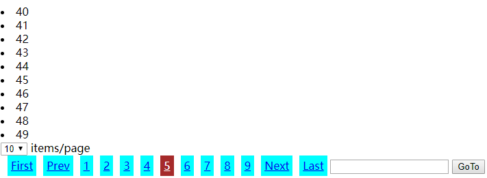

```py
# app1/urls.py
from django.urls import path
from . import views

urlpatterns = [
    path('users/', views.users),
]
```

```py
# app1.views.py
class Pagination:
    pass

N = 309
USERS = [i for i in range(N)]

def users(request,*args, **kwargs):
    if requests.method == 'GET':
        current_p = int(requests.GET.get('p', 1))

        n = int(requests.COOKIES.get('count_per_pg', 10))
        pagination = Pagination(N, current_p, count_per_pg=n)

        if current_p > pagination.pg_count or current_p < 1:
            return HttpResponse('Request Error!')

        data = USERS[pagination.item_start:pagination.item_end]

        return render(request,'app1/users.html',
                      {'data': data, 'pagination': pagination.pagination_str(base_url='/app1/users')})
```

```django
<!-- app1/templates/app1/users.html -->
<head>
    <meta charset="UTF-8">
    <title>Title</title>
    <style>
        .paginator {
            display: inline-block;
            padding: 5px;
            background-color: cyan;
            margin-left: 10px;
        }

        .active {
            background-color: brown;
            color: #fff;
        }
    </style>
</head>
<body>

    <li>{{ i }}</li>

<div>
    <select onchange="ChangeCountPerPage(this);">
        <option>10</option>
        <option>30</option>
        <option>50</option>
    </select> items/page
</div>
{{ pagination|safe }}
<script>
    // ready event
    document.addEventListener("DOMContentLoaded", function () {
        let v = document.cookie.match('count_per_pg' + '=(\\d+)')[1];
        document.querySelector('select').value = v;
    });

    function ChangeCountPerPage(t) {
        let v = t.value;
        document.cookie = `count_per_pg=${v};`;
        location.reload();
    }
</script>
</body>
```

example: cookie with salt

```py
# app1/views.py
def index(request, *args, **kwargs):
    v = request.get_signed_cookie('Name', default=False, salt='666666')
    if not v:
        # 第一次登录没有cookie
        return redirect('/app1/login')
    else:
        return render(request, 'app1/index.html', {'uname': v})

def login(request, *args, **kwargs):
    # ...
        if p == pwd:
        res = redirect('/app1/index')
        res.set_signed_cookie('Name', uname, salt='666666')
        return res
    #...
```

## FBV, CBV with decorator

example: FBV with decorator

```py
# app1/views.py
def auth(func):
    def inner(request, *args, **kwargs):
        v = request.COOKIES.get('Name')
        if not v:
            return redirect('/app1/login')
        else:
            return func(request, *args, **kwargs)

    return inner


@auth
def index(request, *args, **kwargs):
    v = request.COOKIES.get('Name')
    return render(request, 'app1/index.html', {'uname': v})
```

example: DBV with decorator

```py
# app1/urls.py
from django.urls import path
from . import views

urlpatterns = [
    path('order/', views.Order.as_view()),
    path('login/', views.login)
]
```

```py
# app1/views.py
from django import views
from django.utils.decorators import method_decorator

def auth(func):
    pass

class Order(views.View):
    # 只装饰一个method
    @method_decorator(auth)
    def get(self, request):
        v = request.COOKIES.get('Name')
        return render(request, 'app1/index.html', {'uname', v})
```

```py
# app1/views.py
# 所有的request方式都装饰method1
from django import views
from django.utils.decorators import method_decorator

def auth(func):
    pass

class Order(views.View):
    @method_decorator(auth)
    def dispatch(self, request, *args, **kwargs):
        return super().dispatch(request, *args, **kwargs)

    def get(self, request):
        v = request.COOKIES.get('Name')
        return render(request, 'app1/index.html', {'uname', v})
```

```py
# app1/views.py
# 所有的request方式都装饰method2
@method_decorator(auth, name='dispatch')
class Order(views.View):
    def get(self, request):
        v = request.COOKIES.get('Name')
        return render(request, 'app1/index.html', {'uname', v})
```

example: request.META & request.body

```bash
# request报文分成4部分: request line, request headers, blank line,request body
GET /app1/index/ HTTP/1.1 # request line
Accept: text/html,application/xhtml+xml,application/xml;q=0.9,image/webp,image/apng,*/*;q=0.8
Accept-Encoding: gzip, deflate, br
Accept-Language: en-US,en;q=0.9,zh-CN;q=0.8,zh;q=0.7,ja;q=0.6,zh-TW;q=0.5
Cache-Control: max-age=0
Connection: keep-alive
Cookie: Name=grey
Host: 127.0.0.1:8000
Referer: http://127.0.0.1:8000/app1/login/
Upgrade-Insecure-Requests: 1
User-Agent: Mozilla/5.0 (Windows NT 10.0; Win64; x64) AppleWebKit/537.36 (KHTML, like Gecko) Chrome/71.0.3578.98 Safari/537.36\r\n
\r\n # blank line, 每一个header都以\r\n结尾，所以最后一个header看起来是\r\n\r\n
uname=grey&pwd=123 # body data: e.g. post data
```

`request.META`对应着request line和request headers, 其中的数据被提取到如下变量:
- `request.GET`
- `request.path_info`
- `request.method`
- `request.COOKIES`

`request.body`对应着body, 其中的数据被提取到如下变量:
- `request.POST`
- `request.FILES`
- 当`request.method`是PUT的时候，并没有`request.PUT`，那么需要自己从`request.body`提取数据

```bash
# response报文包含4部分status line, response headers, blank link, response body
HTTP/1.1 200 OK # status line
Content-Length: 137
Content-Type: text/html; charset=utf-8
Date: Tue, 19 Feb 2019 15:49:28 GMT
Server: WSGIServer/0.2 CPython/3.7.2
X-Frame-Options: SAMEORIGIN\r\n
\r\n # blank line
<!DOCTYPE html>
<html lang="en">
<head>
    <meta charset="UTF-8">
    <title>Title</title>
</head>
<body>
Welcome {{ uname }}
</body>
</html>
```

```py
if p == pwd:
    response = redirect('/app1/index')
    response.set_cookie('Name', uname) # cookie写入response headers中然后传给客户端，客户端也将cookie放在request headers中然后传递给服务器端
    return response
```

```py
# 设置响应头
response=HttpResponse('ok')
response['hhh']='666' # 这个会以key-value出现在response headers中
```

## Session

Definition:
- cookie: 保存在浏览器的key-value对
- session: 保存在服务器的key-value对

基于cookie做用户认证，敏感信息不适合放在cookie中；那么将敏感信息保存在服务器的session中
> 认证流程: 第一次输入密码，服务器端验证，验证通过之后发送随机字符串给浏览器，浏览器保存随机字符串到cookie；浏览器第二次带着cookie访问，根据该随机字符串在session中找到`is_login`，决定是否通过验证。所以session的验证依赖cookie

cookie的缺点:
- cookie在客户端可以被js修改，进而可能获取root权限
- cookie可以复制到其他客户端，进而登录(不算缺点)

cookie的优点: cookie是本地文件，对服务器压力小

```py
# session本质是一个字典, request.session只是其中的一条数据
session={
    # A用户的某次会话
    # key 随机字符串; value 敏感信息，print(request.sesson)就是该value
    'll3aax4mdnzts0u8yjpf6zb52edqwyz7':{
        'is_login' : True,
        'Name' : 'grey',
    },
    # A用户的另一次会话
    'hkwzazdhvwyhi2b7cxoc1jmntian767b':{
        'is_login' : True,
        'Name' : 'grey',
    },
    # B用户的某一次会话
    'adsadhgahje':{
        'is_login': True, 
        'Name':'jack',
    }
}
# 保存在浏览器中的cookie
# 'sessionid':'ll3aax4mdnzts0u8yjpf6zb52edqwyz7'
```

django中默认session保存在`django_session`数据库表中(也可以像cookie一样保存在文件中，也可以缓存中，内存中)，内存中的`request.session`本质是字典
session_key|session_data|expire_date|
---|---|---
ll3aax4mdnzts0u8yjpf6zb52edqwyz7|YTJmMjcwOTk4M2JmNTg1MDhiZWYz|2019-03-06 02:20:58.832349
hkwzazdhvwyhi2b7cxoc1jmntian767b|YTdxjahteheahtejahe1MDhiZWYz|2019-03-06 02:34:03.446261
> `session_data`本质是对内存中的敏感信息value进行了加密  
> `expire_date`：如果一个用户删了cookie随机字符串，那么需要重新登录，就会又生成一条record，那么之前的record就是脏数据，`python manage.py clearsessions`会自动清理`expire_date`到期的脏数据。也可以手动删除脏数据`request.session.clear_expired()`

example: login with session
> 使用session需要`python manage.py makemigrations`, `python manage.py migrate`

```bash
app1/
    templates/
        app1/
            index.html
            login.html
    urls.py
    views.py
```

```py
# app1/urls.py
from django.urls import path
from . import views

urlpatterns = [
    path('index/', views.index),
    path('login/', views.login),
]
```

```py
# app1/views.py
from django.shortcuts import render, redirect

USERS = {
    'grey': '123',
    'jack': '456',
}

def login(request, *args, **kwargs):
    if request.method == 'GET':
        return render(request, 'app1/login.html')
    elif request.method == 'POST':
        uname = request.POST.get('uname')
        pwd = request.POST.get('pwd')
        p = USERS.get(uname)
        if not p:
            return redirect('/app1/login')

        if pwd == p:
            # request.session设置值进行的操作:
            # 1. 生成随机字符串，并写入response headers的cookie
            # 2. 保存随机字符串到session中，其中key为随机字符串，value为敏感信息
            request.session['Name'] = uname
            request.session['is_login'] = True
            return redirect('/app1/index')
        else:
            return redirect('/app1/login')


def index(request, *args, **kwargs):
    # request.session获取值进行的操作
    # 1. 获取cookie中的随机字符串
    # 2. 根据随机字符串到数据库中找到对应的信息
    if request.session.get('is_login'):
        name = request.session['Name']
        return render(request, 'app1/index.html', {'name': name})
    else:
        return redirect('/app1/login')
```

```django
<!-- app1/templates/app1/login.html -->
<body>
<form action="/app1/login/" method="post">
    <input type="text" name="uname" placeholder="UserName">
    <input type="password" name="pwd" placeholder="Password">
    <input type="submit" value="Submit">
</form>
</body>
```

```django
<!-- app1/tempaltes/app1/index.html -->
<body>
Welcome: {{ name }}
</body>
```

```py
# 删除某个session敏感信息中的一条
del request.session['Name']
# 删除session_key对应的session
request.session.delete("session_key")
# 删除当前session: 主要用于注销
request.session.clear() # 相当于request.session.delete(request.session.session_key)

# django中session默认的保质期是2周
request.session.set_expiry(value)
# 如果value是个整数，session会在些秒数后失效。
# 如果value是个datatime或timedelta，session就会在这个时间后失效。
# 如果value是0,用户关闭浏览器session就会失效。
# 如果value是None,session会依赖全局session失效策略。
```

example: logout by session

```py
# app1/urls.py
urlpatterns = [
    path('index/', views.index),
    path('login/', views.login),
    path('logout/', views.logout),
]
```

```py
# app1/views.py
def login(request, *args, **kwargs):
    pass


def index(request, *args, **kwargs):
    if request.session.get('is_login'):
        return render(request, 'app1/index.html') # 默认request已经传递给index.html，不需要另外传递
    else:
        return redirect('/app1/login')


def logout(request, *args, **kwargs):
    request.session.clear() # 注销清除session
    return redirect('/app1/login')
```

```django
<!-- app1/templates/app1/index.html -->
<body>
Welcome: {{ request.session.Name }}
<a href="/app1/logout">Logout</a>
</body>
```

example: remember 5 seconds
> 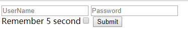

```django
<!-- app1/tempaltes/app1/login.html -->
<form action="/app1/login/" method="post">
    <input type="text" name="uname" placeholder="UserName">
    <input type="password" name="pwd" placeholder="Password">
    <br>Remember 5 second<input type="checkbox" name="remember5s" value="1">
    <input type="submit" value="Submit">
</form>
```

```py
# app1/views.py
def login(request, *args, **kwargs):
    # ...some code...
    if pwd == p:
        request.session['Name'] = uname
        request.session['is_login'] = True
        if request.POST.get('remember5s') == '1':
            request.session.set_expiry(5) # 5s超时，既给浏览器设置，也给服务器端设置
        return redirect('/app1/index')
    else:
        return redirect('/app1/login')
```

session默认两周超时可以在`settings.py`中设置， `set_expiry()`的优先级更高

## session configuration

```py
# settings.py对session的默认设置
SESSION_COOKIE_NAME ＝ "sessionid"      # Session的cookie保存在浏览器上时的key，即：sessionid＝随机字符串
SESSION_COOKIE_PATH ＝ "/"              # Session的cookie保存的路径
SESSION_COOKIE_DOMAIN = None            # Session的cookie保存的域名
SESSION_COOKIE_SECURE = False           # 是否Https传输cookie
SESSION_COOKIE_HTTPONLY = True          # 是否Session的cookie只支持http传输
SESSION_COOKIE_AGE = 1209600            # Session的cookie失效日期（2周）
SESSION_EXPIRE_AT_BROWSER_CLOSE = False # 是否关闭浏览器使得Session过期
# 默认第一次访问才保存session，后面的不保存session到数据库
# 设置为True之后，每次请求都会重新保存session，那么超时时间可以往后推迟
SESSION_SAVE_EVERY_REQUEST = False      # 是否每次请求都保存Session，默认修改之后才保存
```

```py
# settings.py中设置session保存的位置
# 1.数据库，默认，优势不大
SESSION_ENGINE = 'django.contrib.sessions.backends.db' # 引擎（默认）

# 2.缓存
SESSION_ENGINE = 'django.contrib.sessions.backends.cache' # 引擎
SESSION_CACHE_ALIAS = 'default' # 使用的缓存别名（默认内存缓存，也可以是memcache），此处别名依赖缓存的设置
CACHES = {
    "default": {
        "BACKEND": "django_redis.cache.RedisCache",
        "LOCATION": "redis://127.0.0.1:6379",
        "OPTIONS": {
            "CLIENT_CLASS": "django_redis.client.DefaultClient",
            "CONNECTION_POOL_KWARGS": {"max_connections": 100}
            # "PASSWORD": "密码",
        }
    }
}

# 3.文件
SESSION_ENGINE = 'django.contrib.sessions.backends.file' # 引擎
SESSION_FILE_PATH = os.path.join(BASE_DIR, 'cache') # 缓存文件路径，如果为None，则使用tempfile模块获取一个临时地址tempfile.gettempdir()

# 4.缓存+数据库Session： 数据库用于做持久化，缓存用于提高效率
# 先去缓存中拿，没有再去数据库中拿
SESSION_ENGINE = 'django.contrib.sessions.backends.cached_db'

# 5. 加密cookie session
# 全都写在cookie中，只是加了个密；并不是保存在服务器端，保存在客户端
SESSION_ENGINE = 'django.contrib.sessions.backends.signed_cookies'
```

## CSRF

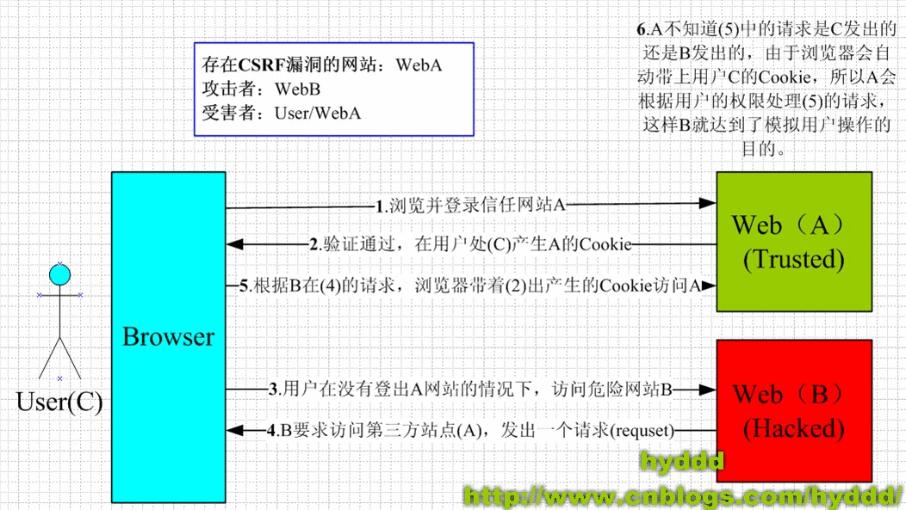
> 

防御CSRF, `post`才需要防御, `get`不需要:
- recaptcha
- Referer
- csrf token: 浏览器第一次get请求的时候，服务器发送一个随机字符串给浏览器，并写入浏览器的cookie；然后浏览器post请求需要带着该随机字符串+cookie，没有该字符串或者字符串错误(利用cookie中的value运算结果与随机字符串比较)，就会被服务器Forbidden

example: Form post protected by `csrf_token`
> 不要注释settings.py中的`'django.middleware.csrf.CsrfViewMiddleware'`

```django
<!-- app1/templates/app1/login.html -->
<form action="/app1/login/" method="post">
    {{ csrf_token }}
    
    <input type="text" name="uname" placeholder="UserName">
    <input type="password" name="pwd" placeholder="Password">
    <br>Remember 5 second<input type="checkbox" name="remember5s" value="1">
    <input type="submit" value="Submit">
</form>
```

```html
<!-- F12 Element查看的Form -->
<form action="/app1/login/" method="post">
    <!-- {{csrf_token}} 也可以当变量使用 -->
    "K0Ot6i1KjpVeTPnAxsBCKSUoqjGbxnDETG8qorOetPEauygx4Y2oocLCo8oZpp4j"
    <!--  生成的随机字符串 -->
    <input type="hidden" name="csrfmiddlewaretoken" value="K0Ot6i1KjpVeTPnAxsBCKSUoqjGbxnDETG8qorOetPEauygx4Y2oocLCo8oZpp4j">
    <input type="text" name="uname" placeholder="UserName">
    <input type="password" name="pwd" placeholder="Password">
    <br>Remember 5 second<input type="checkbox" name="remember5s" value="1">
    <input type="submit" value="Submit">
</form>
<!-- F12 Network查看cookie, 与上面的value不同 -->
csrftoken: SUWGv5irLMu2FNvhareoPwbLmQWWhR58JpmGDNG19Mp4gnpPXIVrkWDPFcujb1Ag	
```


example: Ajax post protected by cookie key `csrftoken`

method1: 在每个ajax请求中设置header

```django
<!-- app1/templates/app1/login.html -->
<body>
<form action="/app1/login/" method="post">
    
    <input type="text" name="uname" placeholder="UserName">
    <input type="password" name="pwd" placeholder="Password">
    <br>Remember 5 second<input type="checkbox" name="remember5s" value="1">
    <input type="submit" value="Submit">
    <input id="btn" type="button" value="AjaxSubmit">
</form>
<script src="https://code.jquery.com/jquery-3.3.1.min.js"></script>
<script>
    $(function () {
        let t = document.cookie.match('csrftoken' + '=(\\w+)')[1];
        $('#btn').click(function () {
            $.ajax({
                url: "/app1/login/",
                type: "POST",
                data: {'user': "grey", 'pwd': "123"},
                // 必须要将cookie中的csrftoken补发过去
                headers: {'X-CSRFtoken': t},
            }).done(function (data) {

            });
        });
    })
</script>
</body>
```

method2: 全局设置ajax请求header

```django
<!-- app1/templates/app1/login.html -->
<script>
    $(function () {
        let t = document.cookie.match('csrftoken' + '=(\\w+)')[1];

        // 对整个页面所有ajax的请求进行配置
        // 不管是post还是get都会加这个header
        $.ajaxSetup({
            beforeSend: function (xhr, settins) {
                // xhr: xml http request对象，是所有ajax的底层
                xhr.setRequestHeader('X-CSRFtoken', t);
            }
        });


        $('#btn').click(function () {
            $.ajax({
                url: "/app1/login/",
                type: "POST",
                data: {'user': "grey", 'pwd': "123"},
            }).done(function (data) {

            });
        });
    })
</script>
```

```django
<script>
    let t = document.cookie.match('csrftoken' + '=(\\w+)')[1];

    function csrfSafeMethod(method) {
        // 用regex规定不需要进行csrf保护的method
        // 也就是不加X-CSRFToken这个header
        return (/^(GET|HEAD|OPTIONS|TRACE)$/.test(method));
    }
    
    $.ajaxSetup({
        beforeSend: function(xhr, settings) {
            if (!csrfSafeMethod(settings.type) && !this.crossDomain) {
                xhr.setRequestHeader("X-CSRFToken", t);
            }
        }
    });
</script>
```

example: `csrf_protect` & `csrf_exempt`

```py
# situation1: 100个网页中两个不需要csrf保护，其他都需要
# settings.py
MIDDLEWARE = [
    'django.middleware.csrf.CsrfViewMiddleware',
]

# app1/views.py
from django.views.decorators.csrf import csrf_exempt,csrf_protect
@csrf_exempt
def login1(request, *args, **kwargs):
    pass

@csrf_exempt
def login2(request, *args, **kwargs):
    pass

.......

def login100(request, *args, **kwargs):
    pass
```

```py
# situation2: 100个网页中两个需要csrf保护，其他都不需要
# settings.py
MIDDLEWARE = [
    # 'django.middleware.csrf.CsrfViewMiddleware',
]

# app1/views.py
from django.views.decorators.csrf import csrf_exempt,csrf_protect
@csrf_protect
def login1(request, *args, **kwargs):
    pass

@csrf_protect
def login2(request, *args, **kwargs):
    pass

.......

def login100(request, *args, **kwargs):
    pass
```

## Middleware

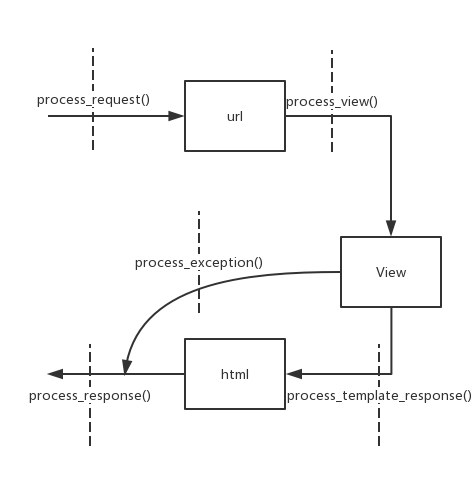

example: how to write middleware

```py
# csrf.py
class CsrfViewMiddleware(MiddlewareMixin):
    pass
    # 自定义中间件需要继承MiddlewwareMixin
```

```py
# deprecation.py
class MiddlewareMixin:
    def __init__(self, get_response=None):
        self.get_response = get_response
        super().__init__()

    def __call__(self, request):
        response = None

        # Middleware的本质就是要进行process_reques, process_response
        if hasattr(self, 'process_request'):
            response = self.process_request(request)
        response = response or self.get_response(request)
        if hasattr(self, 'process_response'):
            response = self.process_response(request, response)
        return response
```

example: DIY middleware

```bash
app1/
    urls.py
    views.py
middles/
    DIYmiddle.py
```

```py
# settings.py
MIDDLEWARE = [
    'django.middleware.security.SecurityMiddleware',
    'django.contrib.sessions.middleware.SessionMiddleware',
    'django.middleware.common.CommonMiddleware',
    'django.middleware.csrf.CsrfViewMiddleware',
    'django.contrib.auth.middleware.AuthenticationMiddleware',
    'django.contrib.messages.middleware.MessageMiddleware',
    'django.middleware.clickjacking.XFrameOptionsMiddleware',

    'middles.DIYmiddle.M1',
    'middles.DIYmiddle.M2',
    'middles.DIYmiddle.M3',
]
```
> 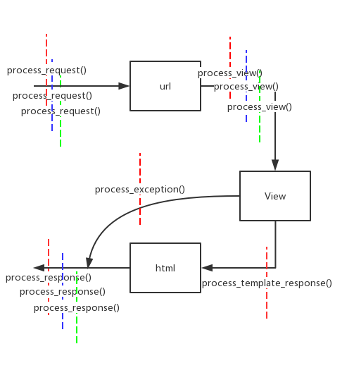  
> 红色: M1; 蓝色: M2; 绿色: M3

```py
# app1/urls.py
from django.urls import path
from . import views

urlpatterns = [
    path('test/', views.test)
]
```

```py
# situation1: 测试process_exception
# middles/DIYmiddle.py
from django.utils.deprecation import MiddlewareMixin
from django.shortcuts import HttpResponse

class M1(MiddlewareMixin):
    def process_request(self, request):
        print('M1 process_request')

    def process_view(selfs, request, view_func, view_func_args, view_func_kwargs):
        # request, view_func, view_func_args, view_func_kwargs
        # 分别对应view_func(request, *args, **kwargs)
        print('M1 process_view')

    def process_template_response(self, request, response):
        # view_func中具有render()，那么就会被执行
        print('M1 process_template_response')
        return response

    def process_response(self, request, response):
        print('M1 process_response')
        return response

    def process_exception(self, request, exception):
        # view_func出错会执行这里
        print('view_func error')
        if isinstance(exception, ValueError):
            return HttpResponse('view_func ValueError')

class M2(MiddlewareMixin):
    def process_request(self, request):
        print('M2 process_request')
        # return HttpResponse('GUN')  # 有return, 那么M3不起作用了

    def process_view(selfs, request, view_func, view_func_args, view_func_kwargs):
        print('M2 process_view')

    def process_response(self, request, response):
        print('M2 process_response')
        return response


class M3(MiddlewareMixin):
    def process_request(self, request):
        print('M3 process_request')

    def process_view(selfs, request, view_func, view_func_args, view_func_kwargs):
        print('M3 process_view')

    def process_response(self, request, response):
        print('M3 process_response')
        return response

# app1/view.py
def test(request, *args, **kwargs):
    # 测试process_exception
    int('abc')
    return HttpResponse('no money')

# # terminal result
# M1 process_request
# M2 process_request
# M3 process_request
# M1 process_view
# M2 process_view
# M3 process_view
# view_func error
# M3 process_response
# M2 process_response
# M1 process_response
```

```py
# situation2: 测试process_template_response
# app1/views.py
class Foo:
    # 这里是为了懒得写test.html,所以这么干
    def render(self):
        return HttpResponse('no money')

def test(request, *args, **kwargs):
    return Foo()

# 标准做法
def test(request, *args, **kwargs):
    return render(request, 'app1/test.html')

# # terminal result
# M1 process_request
# M2 process_request
# M3 process_request
# M1 process_view
# M2 process_view
# M3 process_view
# M1 process_template_response
# M3 process_response
# M2 process_response
# M1 process_response
```

```py
# situation3: 测试process_request有return
# middles/DIYmiddle.py
class M2(MiddlewareMixin):
    def process_request(self, request):
        print('M2 process_request')
        return HttpResponse('GUN')  # 有return, 那么M3不起作用了

# app1/views.py
def test(request, *args, **kwargs):
    return HttpResponse('no money')

# # terminal result
# M1 process_request
# M2 process_request
# M2 process_response
# M1 process_response
```

## cache

将views中渲染完的字符串进行缓存，如果一段时间内有相同的请求，那么直接从缓存中将渲染完的字符串传递给用户
> 除了django其他的web框架都没有缓存

django cache方式:
- 开发测试: 本质上并没有使用缓存
- 内存: 内存中的大字典
- 文件: 文件保存渲染完毕的字符串
- 数据库: 数据库保存渲染完毕的字符串，并且会自动设置超时时间
- Memcache缓存(python-memcached模块)
- Memcache缓存(pylibmc模块): 两者的区别在于连接Memcache的方式不同
- Redis缓存

```py
# method1: 开发测试, 本质上并没有使用缓存
# settings.py
CACHES = {
    'default': {
        'BACKEND': 'django.core.cache.backends.dummy.DummyCache',# 引擎
        'TIMEOUT': 300,                                          # 缓存超时时间（默认300，None表示永不过期，0表示立即过期）
        'OPTIONS':{
            'MAX_ENTRIES': 300,                                  # 最大缓存个数（默认300）
            'CULL_FREQUENCY': 3,                                 # 缓存到达最大个数之后，剔除缓存个数的比例，即：1/CULL_FREQUENCY（默认3）
        },
        'KEY_PREFIX': '',                                        # 缓存key的前缀（默认空）
        'VERSION': 1,                                            # 缓存key的版本（默认1）
        # 'KEY_FUNCTION': 函数名                                  # 生成key的函数（默认函数会生成为：【前缀:版本:key】）
    }
}
```

```py
# 生成key的默认函数
def default_key_func(key, key_prefix, version):
    """
    Default function to generate keys.

    Constructs the key used by all other methods. By default it prepends
    the `key_prefix'. KEY_FUNCTION can be used to specify an alternate
    function with custom key making behavior.
    """
    return '%s:%s:%s' % (key_prefix, version, key)
```

```py
# method2: 内存
CACHES = {
    'default': {
        'BACKEND': 'django.core.cache.backends.locmem.LocMemCache',
        'LOCATION': 'unique-snowflake', # 内存大字典的变量名，必须唯一
    }
}
```

```py
# method3: 文件
CACHES = {
    'default': {
        'BACKEND': 'django.core.cache.backends.filebased.FileBasedCache',
        'LOCATION': '/var/tmp/django_cache',
    }
}
```

```py
# method4: 数据库
CACHES = {
    'default': {
        'BACKEND': 'django.core.cache.backends.db.DatabaseCache',
        'LOCATION': 'my_cache_table', # 数据库表
    }
}

# 设置完settings.py需要python manage.py createcachetable
```

```py
# method5: Memcache缓存(python-memcached模块)
# 简单的方式
CACHES = {
    'default': {
        'BACKEND': 'django.core.cache.backends.memcached.MemcachedCache',
        'LOCATION': '127.0.0.1:11211',
    }
}
# 本地文件的方式
CACHES = {
    'default': {
        'BACKEND': 'django.core.cache.backends.memcached.MemcachedCache',
        'LOCATION': 'unix:/tmp/memcached.sock',
    }
}

# 集群的方式: 假设集群数目为N, python-memcached模块先将请求的url转换为数字d, 然后判断 d%N 进行均匀分配
CACHES = {
    'default': {
        'BACKEND': 'django.core.cache.backends.memcached.MemcachedCache',
        'LOCATION': [
            '172.19.26.240:11211',
            '172.19.26.242:11211',
        ]
    }
}

# 集群的方式并且加权重: 判断 d%25 < 10即可，类似一致性hash
CACHES = {
    'default': {
        'BACKEND': 'django.core.cache.backends.memcached.MemcachedCache',
        'LOCATION': [
            ('172.19.26.240:11211', 10),
            ('172.19.26.242:11211', 15),
        ]
    }
}
```

```py
# method6: Memcache缓存(pylibmc模块)
CACHES = {
    'default': {
        'BACKEND': 'django.core.cache.backends.memcached.PyLibMCCache',
        'LOCATION': '127.0.0.1:11211',
    }
}
CACHES = {
    'default': {
        'BACKEND': 'django.core.cache.backends.memcached.PyLibMCCache',
        'LOCATION': '/tmp/memcached.sock',
    }
}   
CACHES = {
    'default': {
        'BACKEND': 'django.core.cache.backends.memcached.PyLibMCCache',
        'LOCATION': [
            '172.19.26.240:11211',
            '172.19.26.242:11211',
        ]
    }
}
```

```py
# method7: redis, pip3 install django-redis
CACHES = {
    "default": {
        "BACKEND": "django_redis.cache.RedisCache",
        "LOCATION": "redis://127.0.0.1:6379",
        "OPTIONS": {
            "CLIENT_CLASS": "django_redis.client.DefaultClient",
            "CONNECTION_POOL_KWARGS": {"max_connections": 100}
            # "PASSWORD": "密码",
        }
    }
}
```

example: 整个页面缓存

```bash
cache/
app1/
    templates/
        cache.html
    urls.py
    views.py
```

```py
# settings.py
# 文件缓存
CACHES = {
    'default': {
        'BACKEND': 'django.core.cache.backends.filebased.FileBasedCache',
        'LOCATION': os.path.join(BASE_DIR, 'cache'),
    }
}
```

```py
# app1/urls.py
from django.urls import path
from . import views

urlpatterns = [
    path('cache/', views.cache),
]
```

```py
# app1/views.py
from django.views.decorators.cache import cache_page

# 10 second, 优先级比那个默认300s的高
# 10s内刷新，页面不变
@cache_page(10)
def cache(request, *args, **kwargs):
    import time
    return render(request, 'app1/cache.html', {'cache_time': time.time()})
```

```django
<!-- app1/templates/app1/cache.html -->
<body>
{{ cache_time }}
</body>
```

example: 页面局部缓存
> 不变的数据就缓存，经常变化的就不缓存。比如商品详情就缓存，商品评论就不缓存

```py
# app1/views.py
def cache(request, *args, **kwargs):
    import time
    return render(request, 'app1/cache.html', {'cache_time': time.time()})
```

```django
<!-- app1/templates/app1/cache.html -->


<body>
{{ cache_time }}
{{ cache_time }}
<!-- 只有最后一条缓存 -->

    {{ cache_time }}

</body>
```

example: 全栈缓存
> 每一个url, 每一个request都缓存。比如blog  
> 采用Middleware来实现  
> 中间件缓存的优先级最高，可以根据整个请求生命周期来分析；因为有中间件，第二次请求的时候，views就不会执行了

```py
# settings.py
MIDDLEWARE = [
    # 顺序很重要
    'django.middleware.cache.UpdateCacheMiddleware',  # 只有process_response
    # 其他middleware
    'django.middleware.cache.FetchFromCacheMiddleware',  # 只有process_view
]

CACHE_MIDDLEWARE_ALIAS = ""
CACHE_MIDDLEWARE_SECONDS = ""
CACHE_MIDDLEWARE_KEY_PREFIX = ""
```
> 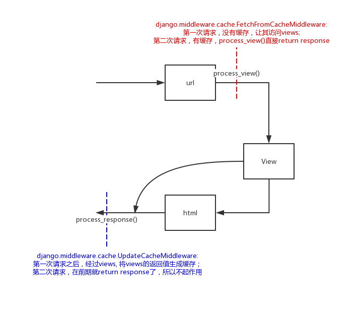

```django
<!-- app1/templates/app1/cache.html -->
<body>
{{ cache_time }}
</body>
```

```py
# app1/views.py
def cache(request, *args, **kwargs):
    import time
    return render(request, 'app1/cache.html', {'cache_time': time.time()})
```

## signal

Django中提供了“信号调度”，用于在框架执行操作时解耦。

example: 每一次数据库保存操作，都进行一个记录

```py
# base.py
def save_base(self, raw=False, force_insert=False,force_update=False, using=None, update_fields=None):
    # Signal that the save is complete
    if not meta.auto_created:
        # 当obj.save()的时候触发信号
        # 本质就是：post_save提前register了一些函数，当save执行的时候，会将post_save注册的函数挨个执行一遍
        signals.post_save.send(
            sender=origin, instance=self, created=(not updated),
            update_fields=update_fields, raw=raw, using=using,
        )
```
> 所以将**记录函数**register进入signals, 每一次数据库操作都会执行registered的**记录函数**

```py
# django支持的信号
Model signals
    pre_init              # django的modal执行其构造方法前，自动触发；UserInfo.objects.create(name='Grey')执行前触发
    post_init             # django的modal执行其构造方法后，自动触发
    pre_save              # django的modal对象保存前，自动触发
    post_save             # django的modal对象保存后，自动触发
    pre_delete            # django的modal对象删除前，自动触发
    post_delete           # django的modal对象删除后，自动触发
    m2m_changed           # django的modal中使用m2m字段操作第三张表（add,remove,clear）前后，自动触发
    class_prepared        # 程序启动时，检测已注册的app中modal类，对于每一个类，自动触发

Management signals
    pre_migrate           # 执行migrate命令前，自动触发
    post_migrate          # 执行migrate命令后，自动触发

Request/response signals
    request_started       # 请求到来前，自动触发
    request_finished      # 请求结束后，自动触发
    got_request_exception # 请求异常后，自动触发

Test signals
    setting_changed       # 使用test测试修改配置文件时，自动触发
    template_rendered     # 使用test测试渲染模板时，自动触发

Database Wrappers
    connection_created    # 创建数据库连接时，自动触发
```

example: log everytime when DB save event happens

```bash
xxx/
    app1/
        urls.py
        views.py
    xxx/
        __init__.py
        settings.py
    mysignals.py
```

```py
# xxx/mysignals.py
from django.core.signals import request_finished
from django.core.signals import request_started
from django.core.signals import got_request_exception

from django.db.models.signals import class_prepared
from django.db.models.signals import pre_init, post_init
from django.db.models.signals import pre_save, post_save
from django.db.models.signals import pre_delete, post_delete
from django.db.models.signals import m2m_changed
from django.db.models.signals import pre_migrate, post_migrate

from django.test.signals import setting_changed
from django.test.signals import template_rendered

from django.db.backends.signals import connection_created

def log_func1(sender, **kwargs):
    print('log func1')
    # print(sender, kwargs)


def log_func2(sender, **kwargs):
    print('log func2')


# 可以注册多个回掉函数，按照顺序执行
post_save.connect(log_func1)
post_save.connect(log_func2)
```

```py
# xxx/xxx/__init__.py
# 程序每次启动会执行该文件
import mysignals
```

```py
# app1/views.py
def signal(request, *args, **kwargs):
    obj1 = UserInfo(name='moris')
    obj1.save()
    print('*' * 30)

    obj2 = UserInfo(name='chris')
    obj2.save()

    return HttpResponse('ok')

# # result
# log func1
# log func2
# ******************************
# log func1
# log func2
```

example: custom signal
> 需要创建信号，触发信号，自定义回掉函数(register function)

```py
# mysignals.py

# 1. 创建信号
import django.dispatch
# pizza_done是信号名
# 触发信号的时候必须提供后两个参数: toppings, size
pizza_done = django.dispatch.Signal(providing_args=["toppings", "size"])

# 2. 注册信号回掉函数
def callback(sender, **kwargs):
    print("callback")
    print(sender,kwargs)
 
pizza_done.connect(callback)
```

```py
# app1/views.py
def signal(request, *args, **kwargs):
    # 触发信号
    from mysignals import pizza_done
    # 一般是在一定条件下才触发信号
    # 信号的一个好处在于可以解耦，mysignals.py可以随便改，不影响views.py
    pizza_done.send(sender='grey', toppings=123, size='M')

    return HttpResponse('ok')

# # terminal result
# callback
# grey {'signal': <django.dispatch.dispatcher.Signal object at 0x00000289B7D9F898>, 'toppings': 123, 'size': 'M'}
```

## Form

example: form 验证功能

```bash
/app1
    templates/
        fm.html
    urls.py
    views.py
    models.py
```

```django
<!-- app1/templates/app1/fm.html -->
<body>
    <form action="/app1/fm/" method="post">
        
        <input type="text" name="uname" placeholder="Name">
        <input type="password" name="pwd" placeholder="Password">
        <input type="text" name="email" placeholder="Email">
        <input type="submit" value="OK">
    </form>
</body>
```

```py
# app1/views.py
from django import forms


class FM(forms.Form):
    # 变量名必须与<form>里面的name对应
    uname = forms.CharField(error_messages={'required': '用户名不为空'})
    pwd = forms.CharField(
        min_length=6,
        max_length=11,
        error_messages={'required': '密码不为空', 'min_length': '密码太短', 'max_length': '密码太长'}
    )
    email = forms.EmailField(error_messages={'required': '邮箱不为空', 'invalid': '格式错误'})


def fm(request, *args, **kwargs):
    if request.method == 'GET':
        return render(request, 'app1/fm.html')
    elif request.method == 'POST':
        obj = FM(request.POST)
        if obj.is_valid(): # 验证post的内容
            # print(obj.cleaned_data)  # dict
            return HttpResponse('ok')
        else:
            # print(obj.errors) # html
            # print(obj.errors.as_json())  # dict
            return HttpResponse(f'{obj.errors}')
```

example: form验证+error message

```django
<!-- app1/templates/app1/fm.html -->
<body>
<form action="/app1/fm/" method="post">
    
    <p>
        <input type="text" name="uname" placeholder="Name">
        {{ obj.errors.uname.0 }}
    </p>
    <p>
        <input type="password" name="pwd" placeholder="Password">
        {{ obj.errors.pwd.0 }}
    </p>
    <p>
        <input type="text" name="email" placeholder="Email">
        {{ obj.errors.email.0 }}
    </p>
    <input type="submit" value="OK">
</form>
</body>
```

```py
# app1/views.py
from django import forms

class FM(forms.Form):
    pass

def fm(request, *args, **kwargs):
    if request.method == 'GET':
        return render(request, 'app1/fm.html')
    elif request.method == 'POST':
        obj = FM(request.POST)
        if obj.is_valid():
            print(obj.cleaned_data)  # dict
            return HttpResponse('ok')
        else:
            # obj.erros类型是ErrorDict; 用as_json()可以看到ErrorDict的结构
            return render(request, 'app1/fm.html', {'obj': obj})
```

example: form验证+生成html+保留上一次post的数据避免重复输入

```py
# app1/models.py
class UserInfo(models.Model):
    uname = models.CharField(max_length=64)
    pwd = models.CharField(max_length=64)
    email = models.EmailField()
```

```django
<!-- app1/templates/app1/fm.html -->
<body>
<form action="/app1/fm/" method="post">
    
    <p>
        {{ obj.uname }}
        {{ obj.errors.uname.0 }}
    </p>
    <p>
        {{ obj.pwd }}
        {{ obj.errors.pwd.0 }}
    </p>
    <p>
        {{ obj.email }}
        {{ obj.errors.email.0 }}
    </p>
    <input type="submit" value="OK">
</form>
</body>
```

```py
# app1/views.py
from django import forms

class FM(forms.Form):
    pass

def fm(request, *args, **kwargs):
    if request.method == 'GET':
        obj = FM()
        return render(request, 'app1/fm.html', {'obj': obj})
    elif request.method == 'POST':
        obj = FM(request.POST)
        if obj.is_valid():
            # 直接写入数据库
            UserInfo.objects.create(**obj.cleaned_data)
            return HttpResponse('ok')
        else:
            return render(request, 'app1/fm.html', {'obj': obj})
```

example: `<form>`几乎全自动生成, 不适合定制
> 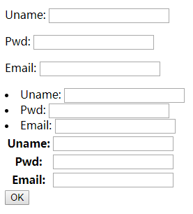

```django
<!-- app1/templates/app1/fm.html -->
<form action="/app1/fm/" method="post">
    
    {{ obj.as_p }}
    {{ obj.as_ul }}
    <table>
        {{ obj.as_table }}
    </table>
    <input type="submit" value="OK">
</form>
```

[Django Forms](http://www.cnblogs.com/wupeiqi/articles/6144178.html)

```py
Field
    required=True,            # 是否允许为空
    widget=None,              # HTML插件
    label=None,               # 用于生成Label标签或显示内容
    initial=None,             # 初始值
    help_text='',             # 帮助信息(在标签旁边显示)
    error_messages=None,      # 错误信息 {'required': '不能为空', 'invalid': '格式错误'}
    show_hidden_initial=False,# 是否在当前插件后面再加一个隐藏的且具有默认值的插件（可用于检验两次输入是否一直）
    validators=[],            # 自定义regex验证规则
    localize=False,           # 是否支持本地化
    disabled=False,           # 是否可以编辑
    label_suffix=None         # Label内容后缀, 用于{{obj.as_table}}中的label后缀冒号

CharField(Field)
    max_length=None,          # 最大长度
    min_length=None,          # 最小长度
    strip=True                # 是否移除用户输入空白

IntegerField(Field)
    max_value=None,           # 最大值
    min_value=None,           # 最小值

DecimalField(IntegerField)
    max_value=None,           # 最大值
    min_value=None,           # 最小值
    max_digits=None,          # 总长度
    decimal_places=None,      # 小数位长度

RegexField(CharField)
    # 相当于CharField+validators
    regex,                    # 自定制正则表达式
    max_length=None,          # 最大长度
    min_length=None,          # 最小长度
    error_message=None,       # 忽略，错误信息使用 error_messages={'invalid': '...'}

EmailField(CharField)
    ...

FileField(Field)
    allow_empty_file=False   # 是否允许空文件
 
ImageField(FileField)      
    ...
    # 注：需要PIL模块，pip3 install Pillow
    # 以上两个字典使用时，需要注意两点：
    #     - form表单中 enctype="multipart/form-data"
    #     - view函数中 obj = MyForm(request.POST, request.FILES)
```

example: form with some parameters

```django
<!-- app1/templates/app1/fm.html -->
<body>
<!-- novalidate是为了让浏览器自带的error_message禁用 -->
<form action="/app1/fm/" method="post" novalidate>
    
    <p>
        {{ obj.uname.label_tag }}
        {{ obj.uname }}
        {{ obj.errors.uname.0 }}
    </p>
    <p>
        {{ obj.pwd.label }}
        {{ obj.pwd }}
        {{ obj.errors.pwd.0 }}
    </p>
    <p>
        {{ obj.email.label }}
        {{ obj.email }}
        {{ obj.errors.email.0 }}
    </p>
    <input type="submit" value="OK">
</form>
<style>
    .c1{
        color: red;
    }
</style>
</body>
```

```py
# app1/views.py
from django import forms
from django.forms import fields
from django.forms import widgets
from django.core.validators import RegexValidator


class FM(forms.Form):
    uname = fields.CharField(
        error_messages={'required': '用户名不为空'},
        # widgets专门生成html;fields专门用于验证
        # 可以修改widget，进而还可以修改css
        # CharField默认的widget=widget.TextInput
        widget=widgets.Textarea(attrs={'class': 'c1', 'placeholder': 'Name'}),
        label='用户名:',
        initial='root',
        validators=[RegexValidator(r'^\w+$', '输入字母数字下划线'), ],
    )
    pwd = fields.CharField(
        min_length=6,
        max_length=11,
        error_messages={'required': '密码不为空', 'min_length': '密码太短', 'max_length': '密码太长'},
        widget=widgets.PasswordInput(attrs={'placeholder': 'Password'}),
        label='密码:',
    )
    email = fields.EmailField(
        error_messages={'required': '邮箱不为空', 'invalid': '格式错误'},
        widget=widgets.TextInput(attrs={'placeholder': 'Email'}),
        label='邮箱:',
        required=False,
    )

def fm(request, *args, **kwargs):
    if request.method == 'GET':
        obj = FM()
        return render(request, 'app1/fm.html', {'obj': obj})
    elif request.method == 'POST':
        obj = FM(request.POST)
        if obj.is_valid():  # 对所有的Field都验证
            return HttpResponse('ok')
        else:
            return render(request, 'app1/fm.html', {'obj': obj})
```

example: forms with file upload
> form表单中 enctype="multipart/form-data"  
> view函数中 obj = FM(request.POST, request.FILES)

```django
<!-- app1/templates/app1/fm.html -->
<body>
<form action="/app1/fm/" method="post" enctype="multipart/form-data" novalidate>
    
    <p>
        {{ obj.file }}
    </p>
    <input type="submit" value="OK">
</form>
</body>
```

```py
# app1/views.py
from django import forms
from django.forms import fields
from django.forms import widgets
from django.core.validators import RegexValidator


class FM(forms.Form):
    # 上传的文件也在obj.clean_data中，然后自己拿出来保存
    file = fields.FileField(required=False)


def fm(request, *args, **kwargs):
    if request.method == 'GET':
        obj = FM()
        return render(request, 'app1/fm.html', {'obj': obj})
    elif request.method == 'POST':
        obj = FM(request.POST, request.FILES)
        if obj.is_valid():
            print(obj.cleaned_data)
            # {'uname': 'root', 'pwd': '1234568', 'email': 'aj@qq.com', 'file': <InMemoryUploadedFile: hayns1978.pdf (application/pdf)>}
            file_obj = obj.cleaned_data.get('file')
            with open(f'upload/{file_obj.name}', 'wb') as file:
                for c in file_obj.chunks():  # chunks() is iter
                    file.write(c)
            return HttpResponse('ok')
        else:
            return render(request, 'app1/fm.html', {'obj': obj})
```

```py
ComboField(Field)
    fields=()                # 使用多个验证，如下：即验证最大长度20，又验证邮箱格式；fields.ComboField(fields=[fields.CharField(max_length=20), fields.EmailField(),])
 
MultiValueField(Field)
    # 抽象类，只能被继承，子类中可以实现聚合多个字典去匹配一个值，要配合MultiWidget使用
    # 实现一个field对应多个input框: 国家-省-市

# 下面本质上就是django已经写好regex的CharField
SplitDateTimeField(MultiValueField)
    input_date_formats=None, # 格式列表：['%Y--%m--%d', '%m%d/%Y', '%m/%d/%y']
    input_time_formats=None  # 格式列表：['%H:%M:%S', '%H:%M:%S.%f', '%H:%M']
 
FilePathField(ChoiceField)   # 文件选项，目录下文件显示在页面中
    path,                    # 文件夹路径
    match=None,              # 正则匹配
    recursive=False,         # 递归下面的文件夹
    allow_files=True,        # 允许文件
    allow_folders=False,     # 允许文件夹
    required=True,
    widget=None,
    label=None,
    initial=None,
    help_text=''
 
GenericIPAddressField
    protocol='both',         # both,ipv4,ipv6支持的IP格式
    unpack_ipv4=False        # 解析ipv4地址，如果是::ffff:192.0.2.1时候，可解析为192.0.2.1， PS：protocol必须为both才能启用
 
SlugField(CharField)         
    # 数字，字母，下划线，减号（连字符）
 
UUIDField(CharField)         
    # uuid类型
    # UUID是根据MAC以及当前时间等创建的不重复的随机字符串
```

example: `FilePathField(ChoiceField)`

```django
<!-- app1/templates/app1/fm.html -->
<p>
    {{ obj.p }}
</p>
<input type="submit" value="OK">
```

```py
# app1/views.py
class FM(forms.Form):
    p = fields.FilePathField(path='untitled3')
```

```py
ChoiceField(Field)
    choices=(),     # 选项，如：choices = ((0,'上海'),(1,'北京'),)
    required=True,  # 是否必填
    widget=None,    # 插件，默认select插件
    label=None,     # Label内容
    initial=None,   # 初始值
    help_text='',   # 帮助提示

MultipleChoiceField(ChoiceField)
    # 多选

ModelChoiceField(ChoiceField)
    # django.forms.models.ModelChoiceField
    queryset,                  # 查询数据库中的数据
    empty_label="---------",   # 默认空显示内容
    to_field_name=None,        # HTML中value的值对应的字段
    limit_choices_to=None      # ModelForm中对queryset二次筛选
     
ModelMultipleChoiceField(ModelChoiceField)
    # django.forms.models.ModelMultipleChoiceField
     
TypedChoiceField(ChoiceField)
    coerce = lambda val: val   # 对选中的值进行一次转换
    empty_value= ''            # 空值的默认值
 
TypedMultipleChoiceField(MultipleChoiceField)
    coerce = lambda val: val   # 对选中的每一个值进行一次转换
    empty_value= ''            # 空值的默认值
```

example: select & multiselect

```django
<!-- app1/templates/app1/fm.html -->
<form action="/app1/fm/" method="post" novalidate>
    
    <p>
        {{ obj.city }}
        {{ obj.hobby }}
        {{ obj.gender }}
        {{ obj.position }}
        {{ obj.married }}
    </p>
    <input type="submit" value="OK">
</form>
```

```py
# app1/views.py
from django import forms
from django.forms import fields
from django.forms import widgets


class FM(forms.Form):
    # 单选
    city = fields.ChoiceField(
        choices=[(0, 'beijing'), (1, 'shanghai'), (2, 'hongkong')]
    )
    # 多选，返回list
    hobby = fields.MultipleChoiceField(
        choices=[(0, 'badminton'), (1, 'football'), (2, 'basketball')]
    )
    # radio单选
    gender = fields.ChoiceField(
        choices=[(0, 'Female'), (1, 'Male')],
        initial=1,
        widget=widgets.RadioSelect
    )
    # checkbox多选，返回list
    position = fields.ChoiceField(
        choices=((0, 'student'), (1, 'teacher')),
        widget=widgets.CheckboxSelectMultiple
    )
    # checkbox单选
    married = fields.CharField(
        initial=1,
        widget=widgets.CheckboxInput
    )
```

```py
# some widgets
TextInput(Input)
NumberInput(TextInput)
EmailInput(TextInput)
URLInput(TextInput)
PasswordInput(TextInput)
HiddenInput(TextInput)
Textarea(Widget)
DateInput(DateTimeBaseInput)
DateTimeInput(DateTimeBaseInput)
TimeInput(DateTimeBaseInput)
CheckboxInput
Select
NullBooleanSelect
SelectMultiple
RadioSelect
CheckboxSelectMultiple
FileInput
ClearableFileInput
MultipleHiddenInput
SplitDateTimeWidget
SplitHiddenDateTimeWidget
SelectDateWidget
```

example: 将数据传递给新url

```django
<!-- app1/templates/app1/fm.html -->
<body>
<form action="/app1/fm/" method="post" novalidate>
    
    <p>
        {{ obj.uname.label_tag }}
        {{ obj.uname }}
        {{ obj.errors.uname.0 }}
    </p>
    <p>
        {{ obj.pwd.label }}
        {{ obj.pwd }}
        {{ obj.errors.pwd.0 }}
    </p>
    <p>
        {{ obj.email.label }}
        {{ obj.email }}
        {{ obj.errors.email.0 }}
    </p>
    <p>
        {{ obj.city }}
        {{ obj.hobby }}
    </p>
    <input type="submit" value="OK">
</form>
<style>
    .c1 {
        color: red;
    }
</style>
</body>
```

```py
# app1/views.py
class FM(forms.Form):
    uname = fields.CharField(
        error_messages={'required': '用户名不为空'},
        widget=widgets.Textarea(attrs={'class': 'c1', 'placeholder': 'Name'}),
        label='用户名:',
        initial='root',
        validators=[RegexValidator(r'^\w+$', '输入字母数字下划线'), ],
    )
    pwd = fields.CharField(
        min_length=6,
        max_length=11,
        error_messages={'required': '密码不为空', 'min_length': '密码太短', 'max_length': '密码太长'},
        widget=widgets.PasswordInput(attrs={'placeholder': 'Password'}),
        label='密码:',
    )
    email = fields.EmailField(
        error_messages={'required': '邮箱不为空', 'invalid': '格式错误'},
        widget=widgets.TextInput(attrs={'placeholder': 'Email'}),
        label='邮箱:',
        required=False,
    )
    # 单选
    city = fields.ChoiceField(
        choices=[(0, 'beijing'), (1, 'shanghai'), (2, 'hongkong')]
    )
    # 多选，返回list
    hobby = fields.MultipleChoiceField(
        choices=[(0, 'badminton'), (1, 'football'), (2, 'basketball')]
    )


USERS = {
    '1': {'uname': 'grey', 'pwd': '123456', 'email': 'ge@qq.com', 'city': 2, 'hobby': [0, 2]},
    '2': {'uname': 'jack', 'pwd': '123456', 'email': 'jack@qq.com', 'city': 1, 'hobby': [1, 2]}
}


def fm(request, *args, **kwargs):
    if request.method == 'GET':
        # http://127.0.0.1:8000/app1/fm/?uid=1
        uid = request.GET.get('uid')
        # 也可以query数据库，这里为了方便直接用dict
        u_dict = USERS.get(uid)
        obj = FM(initial=u_dict)
        return render(request, 'app1/fm.html', {'obj': obj})
    elif request.method == 'POST':
        obj = FM(request.POST)
        if obj.is_valid():  # 对所有的Field都验证
            # USERS添加数据
            return HttpResponse('ok')
        else:
            return render(request, 'app1/fm.html', {'obj': obj})
```

example: 传递数据到新url+DataBase
- `models.py`中`Field`无法限定存数据的格式，可以用`clean()`做简单的验证
- `views.py`中的`fields`才能用于regex验证
- `views.py`中的`widget`用于生成html

实现方式:
- 将多选的结果转成字符串，存进数据库；查询的时候，再将字符串序列化
- 使用`ManyToMany`: 略

```django
<!-- app1/templates -->
<!-- same as above -->
```

```py
# app1/models.py
from django.db import models

class UserInfo(models.Model):
    uname = models.CharField(max_length=32)
    pwd = models.CharField(max_length=64)
    # models.EmailField并不能进行regex验证，本质是CharField
    # regex验证发生在views.py的fields.EmailField()中
    email = models.EmailField()
    city = models.CharField(max_length=32)
    # 将多选结果用','.jon组成字符串存进来
    hobby = models.CharField(max_length=64)
```

```py
# app1/views.py
from django.shortcuts import render, redirect, HttpResponse
from .models import *

from django import forms
from django.forms import fields
from django.forms import widgets
from django.core.validators import RegexValidator


class FM(forms.Form):
    # same as above


def fm(request, *args, **kwargs):
    if request.method == 'GET':
        uid = request.GET.get('uid')
        u = UserInfo.objects.filter(id=uid).values('uname', 'pwd', 'email', 'city', 'hobby').first()
        if u:
            # 将数据库中的字符串变成list
            u['hobby'] = u.get('hobby').split(',')
            obj = FM(initial=u)
        else:
            obj = FM()
        return render(request, 'app1/fm.html', {'obj': obj})
    elif request.method == 'POST':
        obj = FM(request.POST)
        if obj.is_valid():
            # 将多选的list组合成字符串，存进数据库
            obj.cleaned_data['hobby'] = ','.join(obj.cleaned_data.get('hobby'))
            UserInfo.objects.create(**obj.cleaned_data)
            return HttpResponse('ok')
        else:
            return render(request, 'app1/fm.html', {'obj': obj})
```

Form vs ModelForm
- 简单的应用: ModelForm，耦合太严重，不方便后期修改; 同时具有验证+生成html+数据库操作功能
- 复杂的应用: Model和Form分离；

example: `forms` with ForeignKey

```django
<!-- app1/templates/app1/index.html -->
<body>
<form action="/app1/index/" method="post" novalidate>
    
    {{ obj.as_p }}
    <input type="submit" value="Submit">
</form>
</body>
```

```py
# app1/models.py
from django.db import models

class Group(models.Model):
    caption = models.CharField(max_length=32)

class UserInfo(models.Model):
    uname = models.CharField(max_length=32)
    email = models.EmailField()
    group = models.ForeignKey('Group', on_delete=models.CASCADE)
```

```py
# app1/views.py
from django.shortcuts import render, HttpResponse, redirect
from django import forms
from django.forms import fields
from .models import *


class UserInfoForm(forms.Form):
    uname = fields.CharField(max_length=32)
    email = fields.EmailField()
    group_id = fields.ChoiceField(
        choices=Group.objects.values_list('id', 'caption')
    )

    # 每次刷新页面会更新下拉框的choices
    def __init__(self, *args, **kwargs):
        super().__init__(*args, **kwargs)
        self.fields['group_id'].choices = Group.objects.values_list('id', 'caption')


def index(request, *args, **kwargs):
    if request.method == 'GET':
        obj = UserInfoForm()
        return render(request, 'app1/index.html', {'obj': obj})
    elif request.method == 'POST':
        obj = UserInfoForm(request.POST)
        if obj.is_valid():
            UserInfo.objects.create(**obj.cleaned_data)
            return HttpResponse('ok')
        else:
            return render(request, 'app1/index.html', {'obj': obj})
```

example: `ModelForm`　with ForeignKey

```django
<!-- app1/templates/app1/index.html -->
<!-- same as above -->
```

```py
# app1/models.py
from django.db import models

class Group(models.Model):
    caption = models.CharField(max_length=32)

    def __str__(self):
        return self.caption

class UserInfo(models.Model):
    uname = models.CharField(max_length=32, verbose_name='用户名')
    email = models.EmailField()
    group = models.ForeignKey('Group', on_delete=models.CASCADE)
```

```py
# app1/views.py
from django.shortcuts import render, HttpResponse
from django import forms
from django.forms import fields as F
from .models import *
from django.forms import widgets as wg

class UserInfoModelForm(forms.ModelForm):
    class Meta:
        model = UserInfo
        fields = '__all__'  # 等价于fields = ['uname', 'email', 'group']
        # fields = ['uname', 'email'] 等价于 exclude = ['group']
        labels = {'email': '邮箱', }
        widgets = {
            'uname': wg.TextInput(attrs={'placeholder': 'Name'}),
            'email': wg.TextInput(attrs={'placeholder': 'Email'})
        }
        error_messages = {
            'uname': {'required': 'must enter'},
            'email': {'required': 'must enter', 'invalid': 'format error'}
        }
        # field_classes = {
        #     # 将uname原始的CharField变成URLField
        #     'uname': F.URLField
        # }

def index(request, *args, **kwargs):
    if request.method == 'GET':
        obj = UserInfoModelForm()
        return render(request, 'app1/index.html', {'obj': obj})
    elif request.method == 'POST':
        obj = UserInfoModelForm(request.POST)
        if obj.is_valid():
            # method1: UserInfo.objects.create(**obj.cleaned_data)
            # method2: 只是对于ModelForm
            obj.save()
            return HttpResponse('ok')
        else:
            return render(request, 'app1/index.html', {'obj': obj})
```

example: `ModelForm`　with ManyToMany

```django
<!-- app1/templates/app1/index.html -->
<!-- same as above -->
```

```py
# app1/models.py
from django.db import models


class Group(models.Model):
    caption = models.CharField(max_length=32)

    def __str__(self):
        return self.caption


class Hobby(models.Model):
    name = models.CharField(max_length=32)

    def __str__(self):
        return self.name


class UserInfo(models.Model):
    uname = models.CharField(max_length=32, verbose_name='用户名')
    email = models.EmailField()
    group = models.ForeignKey('Group', on_delete=models.CASCADE)
    hobby = models.ManyToManyField(Hobby)

# python manage.py makemigratons, python manage.py migrate 生成4个table
# app1_userinfo, app1_hobby, app1_group, app1_userinfo_hobby
# app1_userinfo_hobby就是多对多关系表
```

```py
# app1/views.py
# same as above
# obj.save()功能强大，可以保存ManyToMany关系，不需要另外修改views.py中的代码
```

```py
# forms.py source code
    def save(self, commit=True):
        if commit:
            # If committing, save the instance and the m2m data immediately.
            # 会保存ManyToMany的关系到两个
            self.instance.save()
            self._save_m2m()
        else:
            # If not committing, add a method to the form to allow deferred
            # saving of m2m data.
            self.save_m2m = self._save_m2m
        return self.instance
```

```py
# 基于form.py source code的分析，修改views.py
if obj.is_valid():
    instance=obj.save(commit=False):
    instance.save() # 这里只是保存到了app1_userinfo表，并没有保存到app1_userinfo_hobby表
```

```py
if obj.is_valid():
    # 下面等价于obj.save()，只是拆成了3步
    instance=obj.save(commit=False):
    instance.save()
    obj.save_m2m()
```

example: `ModelForm` newurl edit user
> 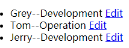  
> 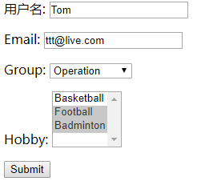

```bash
app1/
    templates/
        users.html
        edit.html
    urls.py
    views.py
    models.py
```

```py
# app1/urls.py
from django.urls import path, re_path
from . import views

urlpatterns = [
    path('users/', views.users),
    re_path(r'edit-(?P<nid>\d+)', views.edit)
]
```

```py
# app1/models.py
from django.db import models

class Group(models.Model):
    caption = models.CharField(max_length=32)

    def __str__(self):
        return self.caption

class Hobby(models.Model):
    name = models.CharField(max_length=32)

    def __str__(self):
        return self.name

class UserInfo(models.Model):
    uname = models.CharField(max_length=32, verbose_name='用户名')
    email = models.EmailField()
    group = models.ForeignKey('Group', on_delete=models.CASCADE)
    hobby = models.ManyToManyField(Hobby)
```

```py
# app1/views.py
from django.shortcuts import render, redirect, HttpResponse
from django import forms
from .models import *
from django.forms import widgets as wg


class UserInfoModelForm(forms.ModelForm):
    class Meta:
        model = UserInfo
        fields = '__all__'
        widgets = {
            'uname': wg.TextInput(attrs={'placeholder': 'Name'}),
            'email': wg.TextInput(attrs={'placeholder': 'Email'})
        }


def users(request, *args, **kwargs):
    users = UserInfo.objects.select_related('group').all()
    if request.method == 'GET':
        return render(request, 'app1/users.html', {'users': users})


def edit(request, *args, **kwargs):
    nid = kwargs.get('nid')
    if request.method == 'GET':
        u = UserInfo.objects.filter(id=nid).first()
        obj = UserInfoModelForm(instance=u)
        return render(request, 'app1/edit.html', {'obj': obj, 'nid': nid})
    elif request.method == 'POST':
        u = UserInfo.objects.filter(id=nid).first()
        # 如果没有instance=u, 那么DB create一个record
        # 如果有instance=u, 那么DB modify一个record
        obj = UserInfoModelForm(request.POST, instance=u)
        if obj.is_valid():
            obj.save()
            return redirect('/app1/users/')
        else:
            return render(request, 'app1/edit.html', {'obj': obj})
```

```django
<!-- app1/templates/app1/users.html -->
<body>
<ul>
    
        <li>
            {{ row.uname }}--{{ row.group }}
            <a href="/app1/edit-{{ row.id }}">Edit</a>
        </li>
    
</ul>
</body>
```

```django
<!-- app1/templates/app1/edit.html -->
<body>
<form action="/app1/edit-{{ nid }}" method="post">
    
    {{ obj.as_p }}
    <input type="submit" value="Submit">
</form>
</body>
```

example: `ModelForm` with hook

```py
# views.py
class UserInfoModelForm(forms.ModelForm):
    class Meta:
        model = UserInfo
        fields = '__all__'
        widgets = {
            'uname': wg.TextInput(attrs={'placeholder': 'Name'}),
            'email': wg.TextInput(attrs={'placeholder': 'Email'})
        }

    def clean_uname(self):
        # 对uname进行自定义验证，然后返回
        old = self.cleaned_data['uname']
        return old.upper()
```

example: `ModelForm` with session

```bash
app1/
    templates/
        app1/
            index.html
            login.html
    urls.py
    models.py
    views.py
```

```py
# app1/models.py
from django.db import models

class UserInfo(models.Model):
    uname = models.CharField(max_length=32)
    pwd = models.CharField(max_length=64)
```

```django
<!-- app1/templates/app1/index.html -->
<body>
welcome: {{ uname }}
</body>
```

```django
<!-- app1/templates/app1/login.html -->
<body>
<form action="/app1/login/" method="post" novalidate>
    
    {{ obj.as_p }}
    <input type="submit" value="Submit">
</form>
</body>
```

```py
# app1/urls.py
from django.urls import path
from . import views

urlpatterns = [
    path('index/', views.index),
    path('login/', views.login),
]
```

```py
# app1/views.py
from django.shortcuts import render, redirect
from django import forms
from django.forms import fields as F
from django.forms import widgets as wg
from .models import *


class UserInfoModelForm(forms.ModelForm):
    class Meta:
        model = UserInfo
        fields = '__all__'
        widgets = {
            'uname': wg.TextInput(attrs={'placeholder': 'Name'}),
            'pwd': wg.PasswordInput(attrs={'placeholder': 'Password'})
        }

    # 额外的字段，不写入数据库的
    # is_remember配合session或者cookie
    is_remember = F.CharField(
        widget=wg.CheckboxInput()
    )


def index(request, *args, **kwargs):
    if request.session.get('is_login'):
        name = request.session.get('Name')
        return render(request, 'app1/index.html', {'uname': name})
    else:
        return redirect('/app1/login')


def login(request, *args, **kwargs):
    if request.method == 'GET':
        obj = UserInfoModelForm()
        return render(request, 'app1/login.html', {'obj': obj})
    else:
        obj = UserInfoModelForm(request.POST)
        if obj.is_valid():
            uname = obj.cleaned_data.get('uname')
            pwd = obj.cleaned_data.get('pwd')
            u = UserInfo.objects.filter(uname=uname).first()
            if u.pwd == pwd:
                request.session['is_login'] = True
                request.session['Name'] = uname
                if obj.cleaned_data.get('is_remember') == 'True':
                    # expire in minute
                    request.session.set_expiry(60)
                else:
                    # 要用ie测试；firefox, chrome会自己保持session
                    # expire when close
                    request.session.set_expiry(0)
                return redirect('/app1/index')
            else:
                return render(request, 'app1/login.html', {'obj': obj})
        else:
            return render(request, 'app1/login.html', {'obj': obj})
```

`select_related()` vs `prefetch_related()`:
> `select_related`数据库查询1次；`prefetch_related`数据库查询2次  
> 前者join发生在数据库，数据库压力大；后者join发生在python，python压力大  
> [difference between select_related and prefetch_related](https://stackoverflow.com/a/31237071/7951943)
- `select_related("parameter")`: parameter是`ForeignKey`, `OneToOne`, `ManyToMany`的变量名；`objs=UserInfo.objects.all().select_related('group')`操作会在Database中进行两个表的`JOIN`得到返回值，那么之后不需要跨表查询；适合两个表`JOIN`之后的表不是太大的情况
- `prefetch_related("parameter")`: 先在第一个modeld的Database中query遍历所有的`foreignkey_id`，然后`WHERE IN(id1, id2,....idN)`减少join的次数；适合两个表在Database中`JOIN`之后的表太大的情况，也适用于多表联表查询的时候

## Ajax Adv

[Ajax Tutorial](https://www.cnblogs.com/wupeiqi/articles/5703697.html)
> Chrome, Firefox的Ajax操作主要是使用了xhr Object；IE6~8主要是使用了ActiveXObject;   
> jQuery 1.x支持ActiveXObject和xhr Object，所以IE6~8可以进行ajax操作；  
> jQuery 2.x, 3.x仅仅支持xhr Object， 所以IE6~8无法ajax操作；

example: native Ajax with `GET`

```bash
app1/
    templates/
        app1/
            nativeAjax.html
    urls.py
    views.py
```

```py
# app1/urls.py
from django.urls import path
from . import views

urlpatterns = [
    path('navtiveAjax/', views.navtiveAjax),
    path('json_ajax/', views.json_ajax),
]
```

```py
# app1/views.py
def navtiveAjax(request, *args, **kwargs):
    return render(request, 'app1/nativeAjax.html')

def json_ajax(request, *args, **kwargs):
    import json
    ret = {'status': True, 'data': None}
    if request.method == 'GET':
        print(request.GET.get('name'), request.GET.get('pwd'))
        # 状态码太少，一般不这么用，而是用上面的json数据
        # return HttpResponse(json.dumps(ret), status=404, reason='Not Found')
        return HttpResponse(json.dumps(ret))
    elif request.method == 'POST':
        pass
```

```django
<!-- app1/templates/app1/nativeAjax.html -->
<body>
<input type="button" value="NativeAjax" onclick="ajax1();">
<script>
    function ajax1() {
        let xhr = new XMLHttpRequest();
        xhr.open('GET', '/app1/json_ajax/?name=root&pwd=666', true);
        // bind callback func
        xhr.onreadystatechange = function () {
            if (xhr.readyState === 4) {
                // received response
                let obj = JSON.parse(xhr.responseText);
                console.log(obj, xhr.responseText)
            }
        };
        xhr.send()
    }
</script>
</body>
```

```js
// xhr methods and properties
void open(String method,String url,Boolean async) // async: 是否异步
void send(String body) 
void setRequestHeader(String header,String value) //{header:value}
String getAllResponseHeaders()
String getResponseHeader(String header)
void abort()

//xhr properties
Number readyState
    // 0-未初始化，尚未调用open()方法；
    // 1-启动，调用了open()方法，未调用send()方法；
    // 2-发送，已经调用了send()方法，未接收到响应；
    // 3-接收，已经接收到部分响应数据；
    // 4-完成，已经接收到全部响应数据；
Function onreadystatechange
String responseText // 服务器返回字符串
XMLDocument responseXML // 服务器返回xml对象
Number states   // 200, 404, 5000
String statesText // OK, NotFound, ...
```

example: native Ajax with `POST`

```py
# app1/views.py
def navtiveAjax(request, *args, **kwargs):
    return render(request, 'app1/nativeAjax.html')

def json_ajax(request, *args, **kwargs):
    import json
    ret = {'status': True, 'data': None}
    if request.method == 'GET':
        print(request.GET.get('name'), request.GET.get('pwd'))
        return HttpResponse(json.dumps(ret))
    elif request.method == 'POST':
        ret['data'] = 'Hello Post'
        print(request.POST.get('name'), request.POST.get('pwd'))
        return HttpResponse(json.dumps(ret))
```

```django
<!-- app1/templates/app1/nativeAjax.html -->
<body>
<input type="button" value="NativeAjax" onclick="ajax1();">
<script>
    function ajax1() {
        let xhr = new XMLHttpRequest();
        xhr.open('POST', '/app1/json_ajax/', true);
        // bind callback func
        xhr.onreadystatechange = function () {
            if (xhr.readyState === 4) {
                // received response
                let obj = JSON.parse(xhr.responseText);
                console.log(obj, xhr.responseText);
            }
        };
        let t = document.cookie.match('csrftoken' + '=(\\w+)')[1];
        xhr.setRequestHeader('Content-Type', 'application/x-www-form-urlencoded; charset-UTF-8');
        xhr.setRequestHeader('X-CSRFtoken', t);
        xhr.send('name=grey;pwd=888');
    }
</script>
</body>
```

example: compatible with IE

```django
<!-- app1/templates/app1/nativeAjax.html -->
<body>
<input type="button" value="NativeAjax" onclick="ajax1();">
<script>
    function GetXHR() {
        var xhr = null;
        if (XMLHttpRequest) {
            xhr = new XMLHttpRequest();
        } else {
            xhr = new ActiveXObject("Microsoft.XMLHTTP");
        }
        return xhr;

    }

    function ajax1() {
        let xhr = GetXHR();
        xhr.open('POST', '/app1/json_ajax/', true);
        // bind callback func
        xhr.onreadystatechange = function () {
            if (xhr.readyState === 4) {
                // received response
                let obj = JSON.parse(xhr.responseText);
                console.log(obj, xhr.responseText);
            }
        };
        let t = document.cookie.match('csrftoken' + '=(\\w+)')[1];
        xhr.setRequestHeader('Content-Type', 'application/x-www-form-urlencoded; charset-UTF-8');
        xhr.setRequestHeader('X-CSRFtoken', t);
        xhr.send('name=grey;pwd=888');
    }
</script>
</body>
```

example: iframe 伪ajax
> 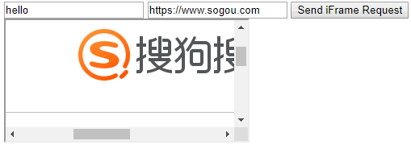  
> 修改url，然后点击button，前面的input框内容不变，证明是偷偷发请求的伪ajax

```django
<!-- app1/templates/app1/nativeAjax.html -->
<body>
<input type="text">
<input type="text" id="url">
<input type="button" id="btn" value="Send iFrame Request" onclick="iframe_request();"><br>
<iframe id="ifm" src="http://www.baidu.com/"></iframe>
<script src="https://code.jquery.com/jquery-3.3.1.min.js"></script>
<script>
    $(function () {
        $('#btn').click(function () {
            let url = $('#url').val();
            $('#ifm').attr('src', url);
        });
    });
</script>
</body>
```

example: iframe get response
> 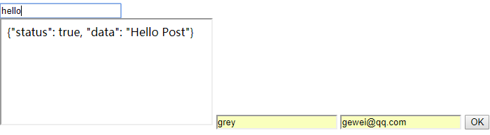

```django
<!-- app1/templates/app1/nativeAjax.html -->
<body>
<input type="text">
<form action="/app1/json_ajax/" method="post" target="ifm">
    
    <iframe name="ifm" id="ifm1"></iframe>
    <input type="text" name="uname">
    <input type="email" name="email">
    <input type="submit" value="OK" onclick="submit_form();">
</form>
<script>
    function submit_form() {
        document.getElementById('ifm1').onload = function () {
            let t = document.getElementById('ifm1').contentWindow.document.body.innerHTML;
            let obj = JSON.parse(t);
            console.log(obj); // {status: true, data: "Hello Post"}
        }
    }
</script>
</body>
```

example: upload by native ajax & jQuery

```bash
app1/
    templates/
        app1/
            upload.html
    urls.py
    views.py
```

```py
# app1/urls.py
urlpatterns = [
    path('upload/', views.upload),
    path('files/', views.files)
]
```

```py
# app1/views.py
def upload(request, *args, **kwargs):
    return render(request, 'app1/upload.html')

def files(request, *args, **kwargs):
    ret = {'status': True, 'data': None}
    if request.method == 'POST':
        name = request.POST.get('name')
        obj = request.FILES.get('file')
        print(name)
        with open(f'uploaded/{obj.name}', 'wb') as file:
            for c in obj.chunks():
                file.write(c)
        return HttpResponse(json.dumps(ret))
```

```django
<!-- app1/templates/app1/upload.html -->
<body>
<input type="file" id="file1"><br>
<input type="button" value="NativeUpload" onclick="native_upload();">
<input type="button" value="jQueryUpload" onclick="jquery_upload();">
<script src="https://code.jquery.com/jquery-3.3.1.min.js"></script>
<script>
    function native_upload() {
        let file_obj = document.querySelector('#file1').files[0];

        // form data
        let fd = new FormData();
        fd.append('name', 'grey');
        fd.append('file', file_obj);

        let xhr = new XMLHttpRequest();
        xhr.open('POST', '/app1/files/', true);
        xhr.onreadystatechange = function () {
            if (xhr.readyState === 4) {
                // received
                let obj = JSON.parse(xhr.responseText);
                console.log(obj);
            }
        };
        // csrf token
        let t = document.cookie.match('csrftoken' + '=(\\w+)')[1];
        xhr.setRequestHeader('X-CSRFtoken', t);

        xhr.send(fd)
    }

    function jquery_upload() {
        let t = document.cookie.match('csrftoken' + '=(\\w+)')[1];
        let file_obj = $('#file1').prop('files')[0];

        let fd = new FormData();
        fd.append('name', 'grey');
        fd.append('file', file_obj);

        $.ajax({
            url: '/app1/files/',
            type: 'POST',
            data: fd,
            processData: false,  // tell jQuery not to process the data
            contentType: false,  // tell jQuery not to set contentType
            headers: {'X-CSRFtoken': t},
        }).done(function (data, arg2, arg3) {
            console.log(data); // {"status": true, "data": null}
            console.log(arg2); // success 
            console.log(arg3); // xhr object
        })
    }
</script>
</body>
```

example: upload by iframe
> 适合所有浏览器，兼容性很高，一般上传头像和图片都是这么做的

```django
<!-- app1/templates/app1/upload.html -->
<body>
<form action="/app1/files/" method="post" target="ifm" enctype="multipart/form-data">
    
    <iframe name="ifm" id="ifm1"></iframe>
    <br>
    <input type="text" name="name">
    <input type="file" name="file">
    <input type="submit" value="iFrameUpload" onclick="iframe_upload();">
</form>
<script>
    function iframe_upload() {
        document.getElementById('ifm1').onload = function () {
            let t = document.getElementById('ifm1').contentWindow.document.body.innerHTML;
            let obj = JSON.parse(t);
            console.log(obj); // {status: true, data: null}
        }
    }
</script>
</body>
```

example: goodlooking upload button

```html
<head>
    <meta charset="UTF-8">
    <title>Title</title>
    <style>
        .container {
            position: relative;
            width: 100px;
            height: 50px;
        }

        .container > div {
            position: absolute;
            top: 0;
            bottom: 0;
            right: 0;
            left: 0;

            text-align: center;
            line-height: 50px;
            color: #fff;
            background-color: #2459A2;

            z-index: 1;
        }

        .container > input {
            position: absolute;
            top: 0;
            bottom: 0;
            right: 0;
            left: 0;
            opacity: 0;
            z-index: 11;
        }
    </style>
</head>
<body>
<div class="container">
    <input type="file" name="file"/>
    <div>Upload</div>
</div>
</body>
```

Ajax选用时机:
- 普通json数据: jQuery > native ajax > iframe
- 上传文件: iframe > jQuery > native ajax

example: iframe with preview

```py
# app1/views.py
def upload(request, *args, **kwargs):
    return render(request, 'app1/upload.html')

def files(request, *args, **kwargs):
    ret = {'status': True, 'data': None}
    if request.method == 'POST':
        name = request.POST.get('name')
        obj = request.FILES.get('file')
        print(name)
        img_path = f'static/images/{obj.name}'
        ret['data'] = img_path
        with open(img_path, 'wb') as file:
            for c in obj.chunks():
                file.write(c)
        return HttpResponse(json.dumps(ret))
```

```django
<!-- app1/templates/app1/upload.html -->
<body>
<div id="preview"></div>
<form action="/app1/files/" method="post" target="ifm" enctype="multipart/form-data">
    
    <iframe name="ifm" id="ifm1" style="display: none;"></iframe>
    <input type="text" name="name">
    <input type="file" name="file" onchange="iframe_upload();">
</form>
<script>
    function iframe_upload() {
        document.getElementById('ifm1').onload = function () {
            let t = document.getElementById('ifm1').contentWindow.document.body.innerHTML;
            let obj = JSON.parse(t);

            let img_tag = document.createElement('img');
            img_tag.src = `/${obj['data']}`;
            let p = document.querySelector('#preview');
            p.innerHTML = ''; // clear previous image
            p.append(img_tag);
        };
        // submit by js
        document.querySelector('form').submit();
    }
</script>
</body>
```

example: captcha with session

```bash
app1/
    templates/
        app1/
            captcha.html
    urls.py
    views.py
utls/
    captcha.py
Monaco.ttf
```

```py
# app1/urls.py
from django.urls import path
from . import views

urlpatterns = [
    path('login/', views.login),
    path('check_code/', views.check_code),
]
```

```py
# app1/views.py
from django.shortcuts import render, redirect, HttpResponse
import io
from utils import captcha


def login(request, *args, **kwargs):
    if request.method == 'GET':
        return render(request, 'app1/captcha.html')
    elif request.method == 'POST':
        if request.session['check_code'].upper() == request.POST.get('captcha_code').upper():
            return HttpResponse('verifying pass')
        else:
            return redirect('/app1/login/')


def check_code(request, *args, **kwargs):
    stream = io.BytesIO()
    img, code = captcha.create_captcha()
    img.save(stream, 'PNG')  # 存入内存
    request.session['check_code'] = code
    return HttpResponse(stream.getvalue())  # trick返回内存的数据
```

```django
<!-- app1/templates/app1/captcha.html -->
<body>
<form action="/app1/login/" method="post">
    
    <p><input type="text" name="uname" placeholder="Name"></p>
    <p><input type="text" name="pwd" placeholder="Pawword"></p>
    <p>
        <input type="text" name="captcha_code">
        <!-- trick1: img没有使用staic的文件(写入，然后读取)，而使用BytesIO(写入然后读取)-->
        <!-- trick2: 使用onclick事件动态改变验证码 -->
        
    </p>
    <input type="submit" value="OK">
</form>
<script>
    function change_code(ths) {
        // 每次url必须不同才能刷新src
        ths.src+='?';
    }
</script>
</body>
```

```py
# utls/captcha.py
import random
from PIL import Image, ImageDraw, ImageFont, ImageFilter

_letter_cases = "abcdefghjkmnpqrstuvwxy"  # 小写字母，去除可能干扰的i，l，o，z
_upper_cases = _letter_cases.upper()  # 大写字母
_numbers = ''.join(map(str, range(3, 10)))  # 数字，去除可能干扰的0, 1, 2
init_chars = ''.join((_letter_cases, _upper_cases, _numbers))


def create_captcha(size=(120, 30),
                   chars=init_chars,
                   mode="RGB",
                   bg_color=(255, 255, 255),
                   fg_color=(0, 0, 255),
                   font_size=18,
                   font_type="Monaco.ttf",
                   length=4,
                   draw_lines=True,
                   n_line=(1, 2),
                   draw_points=True,
                   point_chance=2):
    """
    @todo: 生成验证码图片
    @param size: 图片的大小，格式（宽，高），默认为(120, 30)
    @param chars: 允许的字符集合，格式字符串
    @param mode: 图片模式，默认为RGB
    @param bg_color: 背景颜色，默认为白色
    @param fg_color: 前景色，验证码字符颜色，默认为蓝色#0000FF
    @param font_size: 验证码字体大小
    @param font_type: 验证码字体，默认为 ae_AlArabiya.ttf
    @param length: 验证码字符个数
    @param draw_lines: 是否划干扰线
    @param n_line: 干扰线的条数范围，格式元组，默认为(1, 2)，只有draw_lines为True时有效
    @param draw_points: 是否画干扰点
    @param point_chance: 干扰点出现的概率，大小范围[0, 100]
    @return: [0]: PIL Image实例
    @return: [1]: 验证码图片中的字符串
    """

    width, height = size
    img = Image.new(mode, size, bg_color)
    draw = ImageDraw.Draw(img)

    def create_lines():
        """绘制干扰线"""
        line_num = random.randint(*n_line)  # 干扰线条数

        for i in range(line_num):
            # 起始点
            begin = (random.randint(0, size[0]), random.randint(0, size[1]))
            # 结束点
            end = (random.randint(0, size[0]), random.randint(0, size[1]))
            draw.line([begin, end], fill=(0, 0, 0))

    def create_points():
        """绘制干扰点"""
        chance = min(100, max(0, int(point_chance)))  # 大小限制在[0, 100]

        for w in range(width):
            for h in range(height):
                tmp = random.randint(0, 100)
                if tmp > 100 - chance:
                    draw.point((w, h), fill=(0, 0, 0))

    def create_strs():
        """绘制验证码字符"""
        c_chars = random.sample(chars, length)
        strs = ' %s ' % ' '.join(c_chars)  # 每个字符前后以空格隔开

        font = ImageFont.truetype(font_type, font_size)
        font_width, font_height = font.getsize(strs)

        draw.text(((width - font_width) / 3, (height - font_height) / 3), strs, font=font, fill=fg_color)

        return ''.join(c_chars)

    if draw_lines:
        create_lines()
    if draw_points:
        create_points()
    strs = create_strs()

    # 图形扭曲参数
    params = [1 - float(random.randint(1, 2)) / 100,
              0,
              0,
              0,
              1 - float(random.randint(1, 10)) / 100,
              float(random.randint(1, 2)) / 500,
              0.001,
              float(random.randint(1, 2)) / 500
              ]
    img = img.transform(size, Image.PERSPECTIVE, params)  # 创建扭曲

    img = img.filter(ImageFilter.EDGE_ENHANCE_MORE)  # 滤镜，边界加强（阈值更大）

    return img, strs
```

## KindEditor

[KindEditor Official](http://kindeditor.net/demo.php)

example: kindeditor usage

```bash
app1/
    templates/
        app1/
            kind.html
    urls.py
    views.py
static/
    kindeditor # download from official site
```

```py
# app1/urls.py
from django.urls import path
from . import views

urlpatterns = [
    path('kind/', views.kind),
]
```

```py
# app1/views.py
def kind(request, *args, **kwargs):
    return render(request, 'app1/kind.html')
```

```django
<!-- app1/templates/app1/kind.html -->
<body>
<div class="container" style="width:800px;margin: 0 auto;">
    <textarea id="content"></textarea>
</div>
<script src="/static/kindeditor/kindeditor-all-min.js"></script>
<script src="https://code.jquery.com/jquery-3.3.1.min.js"></script>
<script>
    $(function () {
        let kind = KindEditor.create('#content', {
            width:'100%',
            height: '500px',
        });
    })
</script>
</body>
```

example: kindeditor upload image & preview

```bash
app1/
    templates/
        app1/
            kind.html
    urls.py
    views.py
static
    uploaded
    kindeditor
```

```py
# app1/urls.py
from django.urls import path
from . import views

urlpatterns = [
    path('kind/', views.kind),
    path('upload/', views.upload),
]
```

```py
# app1/views.py
def kind(request, *args, **kwargs):
    return render(request, 'app1/kind.html')

def upload(request, *args, **kwargs):
    if request.method == 'POST':
        file_obj = request.FILES.get('imgFile')
        path = f'static/uploaded/{file_obj.name}'
        with open(path, 'wb') as file:
            for c in file_obj.chunks():  # chunks() is iter
                file.write(c)

        dic = {
            'error': 0,
            'url': f'/{path}',
            'message': 'upload error!!!',
        }
        # 内部原理就是iframe+form
        return HttpResponse(json.dumps(dic))
```

```django
<!-- app1/templates/app1/kind.html -->
<body>
<div class="container" style="width:800px;margin: 0 auto;">
    <textarea id="content"></textarea>
</div>
<script src="/static/kindeditor/kindeditor-all-min.js"></script>
<script src="https://code.jquery.com/jquery-3.3.1.min.js"></script>
<script>
    $(function () {
        let kind = KindEditor.create('#content', {
            width: '100%',
            height: '500px',
            uploadJson: '/app1/upload/',
            extraFileUploadParams: {
                csrfmiddlewaretoken: '{{ csrf_token }}',
            }
        });
    })
</script>
</body>
```

example: kindeditor with FileManger
> 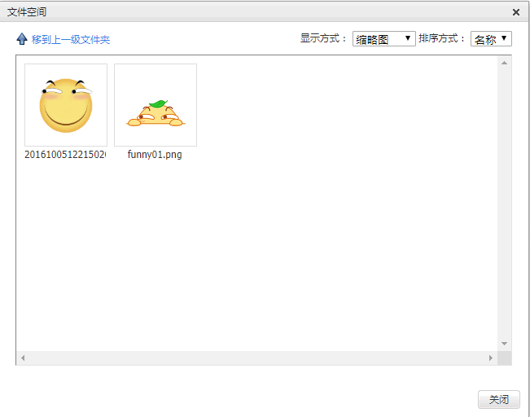

```bash
app1/
    templates/
        app1/
            kind.html
    urls.py
    views.py
static
    uploaded
    kindeditor
```

```py
# app1/urls.py
from django.urls import path
from . import views

urlpatterns = [
    path('kind/', views.kind),
    path('upload/', views.upload),
    path('filemanager/', views.file_manager),
]
```

```django
<!-- app1/templates/app1/kind.html -->
<body>
<div class="container" style="width:800px;margin: 0 auto;">
    <textarea id="content"></textarea>
</div>
<script src="/static/kindeditor/kindeditor-all-min.js"></script>
<script src="https://code.jquery.com/jquery-3.3.1.min.js"></script>
<script>
    $(function () {
        let kind = KindEditor.create('#content', {
            width: '100%',
            height: '500px',
            uploadJson: '/app1/upload/',
            extraFileUploadParams: {
                csrfmiddlewaretoken: '{{ csrf_token }}',
            },
            allowFileManager: true,
            fileManagerJson: '/app1/filemanager/',
        });
    })
</script>
</body>
```

```py
# app1/views.py
def kind(request, *args, **kwargs):
    return render(request, 'app1/kind.html')

def upload(request, *args, **kwargs):
    dic = {}
    if request.method == 'POST':
        if request.GET.get('dir') == 'image':
            file_obj = request.FILES.get('imgFile')
            path = f'static/uploaded/{file_obj.name}'
            print(request.FILES)
            print(path)
            with open(path, 'wb') as file:
                for c in file_obj.chunks():  # chunks() is iter
                    file.write(c)

            dic = {
                'error': 0,
                'url': f'/{path}',
                'message': 'upload error!!!',
            }
        # 内部原理就是iframe+form
        return HttpResponse(json.dumps(dic))


def file_manager(request, *args, **kwargs):
    dic = {}
    root_path = r'D:\ProgrammingTools\JetBrains\PyCharm\PycharmProjects\untitled5\static'
    static_root_path = '/static/'
    request_path = request.GET.get('path')
    if request_path:
        abs_current_dir_path = os.path.join(root_path, request_path)
        move_up_dir_path = os.path.dirname(request_path.rstrip('/'))
        dic['moveup_dir_path'] = move_up_dir_path + '/' if move_up_dir_path else move_up_dir_path

    else:
        abs_current_dir_path = root_path
        dic['moveup_dir_path'] = ''

    dic['current_dir_path'] = request_path
    dic['current_url'] = os.path.join(static_root_path, request_path)

    file_list = []
    for item in os.listdir(abs_current_dir_path):
        abs_item_path = os.path.join(abs_current_dir_path, item)
        a, exts = os.path.splitext(item)
        is_dir = os.path.isdir(abs_item_path)
        if is_dir:
            temp = {
                'is_dir': True,
                'has_file': True,
                'filesize': 0,
                'dir_path': '',
                'is_photo': False,
                'filetype': '',
                'filename': item,
                'datetime': time.strftime('%Y-%m-%d %H:%M:%S', time.gmtime(os.path.getctime(abs_item_path)))
            }
        else:
            temp = {
                'is_dir': False,
                'has_file': False,
                'filesize': os.stat(abs_item_path).st_size,
                'dir_path': '',
                'is_photo': True if exts.lower() in ['.jpg', '.png', '.jpeg'] else False,
                'filetype': exts.lower().strip('.'),
                'filename': item,
                'datetime': time.strftime('%Y-%m-%d %H:%M:%S', time.gmtime(os.path.getctime(abs_item_path)))
            }

        file_list.append(temp)
    dic['file_list'] = file_list
    return HttpResponse(json.dumps(dic))
```

## combo query

example: simple combo query
> 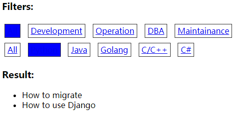

```bash
app1/
    templates/
        app1/
            article.html
    urls.py
    views.py
    models.py
```

```py
# app1/models.py
from django.db import models

class Category(models.Model):
    name = models.CharField(max_length=16)

class Article_Type(models.Model):
    name = models.CharField(max_length=16)

class Article(models.Model):
    title = models.CharField(max_length=32)
    content = models.CharField(max_length=255)

    category = models.ForeignKey(to='Category', on_delete=models.CASCADE)
    article_type = models.ForeignKey(to='Article_Type', on_delete=models.CASCADE)
```

```py
# app1/urls.py
from django.urls import path, re_path
from . import views

urlpatterns = [
    re_path(r'article/(?P<category_id>\d+)-(?P<article_type_id>\d+)', views.article, name='article_path'),
    path('article/', views.article),
]
```

```py
# app1/views.py
from django.shortcuts import render
from .models import *

def article(request, *args, **kwargs):
    kwargs = kwargs or {'category_id': '0', 'article_type_id': '0'}
    article_types = Article_Type.objects.all()
    categories = Category.objects.all()

    # 组合搜索
    condition = {}
    for k, v in kwargs.items():
        if v == '0':
            # query All
            pass
        else:
            condition[k] = v
        # parse value to int
        kwargs[k] = int(v)

    articles = Article.objects.filter(**condition)
    return render(request,
                  'app1/article.html',
                  {
                      'articles': articles,
                      'article_types': article_types,
                      'categories': categories,
                      # trick
                      'arg_dict': kwargs,
                  })
```

```django
<!-- app1/templates/app1/article.html -->
<head>
    <meta charset="UTF-8">
    <title>Title</title>
    <style>
        div a {
            display: inline-block;
            padding: 3px 5px;
            border: 1px solid #333;
            margin: 5px;
        }

        a.active {
            background-color: blue;
        }
    </style>
</head>
<body>
<h3>Filters:</h3>
<div>
    
        <a class="active" href="/app1/article/0-{{ arg_dict.article_type_id }}">All</a>
    
        <a href="/app1/article/0-{{ arg_dict.article_type_id }}">All</a>
    

    
        
            <a class="active" href="/app1/article/{{ c.id }}-{{ arg_dict.article_type_id }}">{{ c.name }}</a>
        
            <a href="/app1/article/{{ c.id }}-{{ arg_dict.article_type_id }}">{{ c.name }}</a>
        

    
</div>

<div>
    
        <a class="active" href="/app1/article/{{ arg_dict.category_id }}-0">All</a>
    
        <a href="/app1/article/{{ arg_dict.category_id }}-0">All</a>
    

    
        
            <a class="active" href="/app1/article/{{ arg_dict.category_id }}-{{ t.id }}">{{ t.name }}</a>
        
            <a href="/app1/article/{{ arg_dict.category_id }}-{{ t.id }}">{{ t.name }}</a>
        

    
</div>
<h3>Result:</h3>
<ul>
    
        <li>{{ a.title }}</li>
    
</ul>
</body>
```