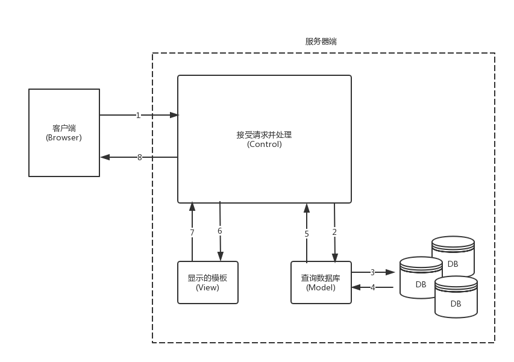
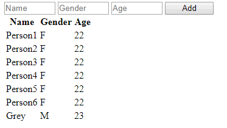

# Django Introduction

- [Django Introduction](#django-introduction)
  - [Framework](#framework)
    - [MVC](#mvc)
    - [MTV](#mtv)
  - [Django on Windows](#django-on-windows)

## Framework

example: 所有的web请求本质是socket; 所有web框架的本质是如下的程序;

```python
# DIY socket service
import socket

def handle_request(client):
    buf = client.recv(1024).decode('utf8')
    client.send("HTTP/1.1 200 OK\r\n\r\n".encode('utf8'))
    client.send(f"Hello, Grey\n{buf}".encode('utf8'))

if __name__ == '__main__':
    server = socket.socket()
    server.bind(('', 9999))
    server.listen(5)

    while True:
        connection, addr = server.accept()
        handle_request(connection)
        connection.close()
```

```python
# 只是简化上面的过程
from wsgiref.simple_server import make_server

def simple_app(environ, start_response):
    start_response('200 OK', [('Content-type', 'text/html')])
    # environ.items()客户端传递过来的所有东西
    return [f'Hello, Grey'.encode('utf8'), ]

with make_server('', 9999, simple_app) as httpd:
    httpd.serve_forever()
```

example: DIY web MVC framework
> MVC: Models, Views, Controllers

```bash
Models/
    # get data from DB
Views/
    test.html
Controllers/
    handle.py
test.py
```

```python
# test.py
from wsgiref.simple_server import make_server
from Controllers import handle

URL_DICT = {
    '/index': handle.handle_index,
    '/register': handle.handle_register,
}

def simple_app(environ, start_response):
    start_response('200 OK', [('Content-type', 'text/html')])
    path = environ['PATH_INFO']

    data = b'404'
    if path in URL_DICT:
        func = URL_DICT[path]
        data = func()

    return [data, ]

with make_server('', 9999, simple_app) as httpd:
    httpd.serve_forever()

```

```python
# handle.py
def handle_index():
    return b'index'

def handle_register():
    with open('Views/test.html', 'rb') as file:
        return file.read()
```

python的web框架有:
- flask:小型应用
- django: 大型应用
- tornado

[the Django book](http://djangobook.py3k.cn/)

### MVC

MVC框架的核心思想：**解耦**; 降低各功能模块之间的耦合性，方便变更，更容易重构代码，最大程度上实现代码的重用；根本目的是实现高可扩展性，向后兼容；
> 
- m表示model，主要用于对数据库层的封装
- v表示view，用于向用户展示结果
- c表示controller，是核心，用于处理请求、获取数据、返回结果

### MTV

Django是python web框架, 属于MTV框架，本质和MVC一样，只是没有严格按照MVC的结构来写;
> 
- m表示model，负责与数据库交互; 要么操作object, 要么操作list
- t表示template，负责呈现内容到浏览器
- v表示view，是核心，负责接收请求(request)、逻辑处理、获取数据、返回响应结果(response)

model中一般规范不让编写sql语句；model中维护的是一个object与Database中的一行对应；对于python, 一个list与Database的一个table对应；model直接将代码转换为sql语句(也就是ORM)

## Django on Windows

```bash
# Anaconda Prompt
# Create a environment
(base) C:\Users\Administrator>conda create --name Test
(base) C:\Users\Administrator>activate Test
(Test) C:\Users\Administrator>python --version
Python 3.6.7 :: Anaconda, Inc.
(Test) C:\Users\Administrator>conda list
# nothing

(Test) C:\Users\Administrator>conda install django
# Anaconda3\envs\Test\Scripts目录下会出现django-admin.exe，将该目录添加进入environments

(Test) C:\Users\Administrator>pip list
Package      Version
------------ ----------
certifi      2018.11.29
Django       2.1.5
pip          18.1
pytz         2018.7
setuptools   40.6.3
wheel        0.32.3
wincertstore 0.2

(Test) C:\Users\Administrator>pip freeze
certifi==2018.11.29
Django==2.1.5
pytz==2018.7
wincertstore==0.2

# start project
(Test) C:\Users\Administrator>django-admin startproject mysite
(Test) C:\Users\Administrator>tree /f mysite
C:\USERS\ADMINISTRATOR\MYSITE
│  manage.py
└─mysite
        settings.py
        urls.py
        wsgi.py
        __init__.py

# running server
(Test) C:\Users\Administrator>cd mysite
(Test) C:\Users\Administrator\mysite>python manage.py runserver
Django version 2.1.5, using settings 'mysite.settings'
Starting development server at http://127.0.0.1:8000/
Quit the server with CTRL-BREAK.
```

example: simple modify easy mysite project

```bash
│ manage.py
| Views
|       v1.py
└─mysite
        settings.py
        urls.py
        wsgi.py
        __init__.py
```

```python
# v1.py
from django.shortcuts import HttpResponse

def index(request):
    return HttpResponse('Hello')
```

```python
# urls.py
from django.contrib import admin
from django.urls import path

from Views import v1

urlpatterns = [
    path('admin/', admin.site.urls),
    path('index/', v1.index),
]
```

explain Django directory

```bash
C:\USERS\ADMINISTRATOR\MYSITE
│  manage.py            # 管理django程序
└─mysite                # 对整个程序进行配置
        settings.py     # 缓存配置、数据库连接、静态文件处理、模板配置、加密(加盐)
        urls.py         # url与处理函数的对应关系
        wsgi.py         # django只是web框架，依赖于wsgi创建的socket
        __init__.py
```

> PyCharm默认会将`C:\USERS\ADMINISTRATOR\MYSITE`加入它的环境变量，常常出现`import`过程中的飘红现象

遵循wsgi规则的模块是用来创建socket的，Django依赖于其他模块创建的socket。`wsgi.py`中默认使用的就是python自带的模块`wsgiref`，只是改了一个名字为`from django.core.wsgi import get_wsgi_application`。所以wsgi模块是可以更改的，一般部署的时候使用的是`uwsgi`模块，配合nginx就可以将程序跑起来了

与`manage.py`相关的命令:
- `python manage.py runserver`
- `python manage.py startapp cmdb`
- `python manage.py makemigrations`
- `python manage.py migrate`

example: PyCharm add Apps

```bash
# in Terminal
python manage.py startapp cmdb
python manage.py startapp openstack

tree /f DjangProj1
D:\PYCHARMPROJECTS\DJANGPROJ1
│  db.sqlite3
│  manage.py
├─cmdb
│  │  admin.py          # django自带的后台管理
│  │  apps.py           # 配置当前的app
│  │  models.py         # ORM, 用于创建数据库Table
│  │  tests.py          # unit test
│  │  views.py          # 各种业务逻辑代码
│  │  __init__.py
│  │
│  ├─migrations
│         __init__.py
│
├─DjangProj1
│  │  settings.py
│  │  urls.py
│  │  wsgi.py
│  │  __init__.py
│
├─openstack
│  │  admin.py
│  │  apps.py
│  │  models.py
│  │  tests.py
│  │  views.py
│  │  __init__.py
│  │
│  ├─migrations
│  │      __init__.py
│
└─templates
```

```python
# cmdb/views.py
from django.shortcuts import render, HttpResponse

def sayHi(request):
    return HttpResponse('Hi, CMDB')
```

```python
# openstakc/views.py
from django.shortcuts import render, HttpResponse

def say_hello(request):
    return HttpResponse('Hello, OpenStack')
```

sqlalchemy模块，无法修改table结构；django的ORM可以修改table结构，`migrations`文件夹记录了每次修改表结构操作，并不记录`insert`之类的操作

example: django默认后台管理程序

```python
# cmdb/models.py
from django.db import models

class UserType(models.Model):
    name = models.CharField(max_length=32)

class UserInfo(models.Model):
    username = models.CharField(max_length=32)
    pwd = models.CharField(max_length=32)
    email = models.CharField(max_length=32)
    # on_delete在2.0版本之后必须有
    usr_type = models.ForeignKey(UserType, on_delete=models.CASCADE)
```

```python
#  cmdb/admin.py
from django.contrib import admin
from cmdb import models

# Register your models here.
admin.site.register(models.UserInfo)
admin.site.register(models.UserType)
```

```python
# setting.py
INSTALLED_APPS = [
    'django.contrib.admin',
    'django.contrib.auth',
    'django.contrib.contenttypes',
    'django.contrib.sessions',
    'django.contrib.messages',
    'django.contrib.staticfiles',
    'cmdb',
    'openstack',
]
```

```bash
# in terminal
python manage.py makemigrations
python manage.py migrate

python manage.py createsuperuser
python manage.py runserver
```

example: vscode django "login page"
> [vscode with django](https://code.visualstudio.com/docs/python/tutorial-django)

```bash
tree /f mysite
C:.
│  db.sqlite3
│  manage.py
├─cmdb
│  │  admin.py
│  │  apps.py
│  │  models.py
│  │  tests.py
│  │  views.py
│  │  __init__.py
│  │
│  ├─migrations
│  │  │  __init__.py
│  │
│  ├─templates
│  │      login.html
│  │
└─mysite
    │  settings.py
    │  urls.py
    │  wsgi.py
    │  __init__.py
```

```html
<!-- cmdb/templates/login.html -->
<body>
    <form action="/login" method="post">
        <p>
            <label for="username">Username</label>
            <input type="text" name="uname" id="username">
        </p>
        <p>
            <label for="pwd">Pasword</label>
            <input type="password" name="pwd" id="pwd">
        </p>
        <input type="submit" value="Submit">
    </form>
    <style>
        label{
            display: inline-block;
            width: 100px;
            text-align: right;
        }
    </style>
</body>
```

```python
# setting.py
INSTALLED_APPS = [
    'django.contrib.admin',
    'django.contrib.auth',
    'django.contrib.contenttypes',
    'django.contrib.sessions',
    'django.contrib.messages',
    'django.contrib.staticfiles',
    'cmdb',
]
```

```python
# urls.py
from django.contrib import admin
from django.urls import path

from cmdb.views import login

urlpatterns = [
    path('admin/', admin.site.urls),
    path('login/', login),
]
```

```python
# cmdb/views.py
from django.shortcuts import render, HttpResponse

# # method1
# def login(request):
#     with open('cmdb/templates/login.html') as file:
#         return HttpResponse(file.read())

# method2
def login(request):
    return render(request, 'login.html')
```

example: django static file
> js, css, picture

```python
# setting.py
STATIC_URL = '/static/'
STATICFILES_DIRS = [
    os.path.join(BASE_DIR, 'static'),
]
```

```html
<!-- cmdb/templates/login.html -->
<head>
    <meta charset="UTF-8">
    <title>Document</title>
    <link rel="stylesheet" href="/static/cmdb/style.css">
</head>
```

```css
/* static/cmdb/style.css */
label{
    display: inline-block;
    width: 100px;
    text-align: right;
}
```

Django配置`setting.py`步骤:
1. 配置app: `INSTALLED_APPS`
1. 配置templates目录: `TEMPLATES` 
1. 配置staitic目录: `STATICFILES_DIRS`
1. 配置CSRF

example: django submit

```python
# settings.py
MIDDLEWARE = [
    'django.middleware.security.SecurityMiddleware',
    'django.contrib.sessions.middleware.SessionMiddleware',
    'django.middleware.common.CommonMiddleware',
    # 'django.middleware.csrf.CsrfViewMiddleware',
    'django.contrib.auth.middleware.AuthenticationMiddleware',
    'django.contrib.messages.middleware.MessageMiddleware',
    'django.middleware.clickjacking.XFrameOptionsMiddleware',
]
```

```html
<!-- cmdb/templates/login.html -->
<!DOCTYPE html>
<html lang="en">

<head>
    <meta charset="UTF-8">
    <title>Document</title>
    <link rel="stylesheet" href="/static/cmdb/style.css">
</head>

<body>
    <!-- Django特殊: 对于POST，login/要与urls.py中一致 -->
    <form action="/login/" method="post">
        <p>
            <label for="username">Username</label>
            <input type="text" name="uname" id="username">
        </p>
        <p>
            <label for="pwd">Pasword</label>
            <input type="password" name="pwd" id="pwd">
        </p>
        <input type="submit" value="Submit">
        <span style="color:red;">{{err_msg}}</span>
    </form>
</body>

</html>
```

```py
# urls.py
from django.contrib import admin
from django.urls import path

from cmdb.views import login

urlpatterns = [
    path('admin/', admin.site.urls),
    path('login/', login),
]
```

```py
# cmdb/views.py
from django.shortcuts import render, redirect

def login(request):
    # request包含了用户提交的所有信息
    err_msg=''
    # POST
    if request.method=='POST':
        # request.POST is dict
        uname=request.POST.get('uname', None)
        pwd=request.POST.get('pwd', None)
        if uname=='root' and pwd=='112233':
            return redirect('https://www.baidu.com')
        else:
            err_msg='wrong username or password!'
    # GET
    # 将templates文件和数据库内容合在一起，渲染；给Browser的永远是标准的html
    return render(request, 'login.html', {'err_msg':err_msg})
```

example: 在上一个例子基础上增加简单的后台管理
> 

```py
# urls.py
from django.contrib import admin
from django.urls import path

from cmdb import views

urlpatterns = [
    path('admin/', admin.site.urls),
    path('login/', views.login),
    path('home/', views.home),
]
```

```py
# cmdb/views.py
from django.shortcuts import render, redirect


def login(request):
    # request包含了用户提交的所有信息
    err_msg = ''
    # POST
    if request.method == 'POST':
        # request.POST is dict
        uname = request.POST.get('uname', None)
        pwd = request.POST.get('pwd', None)
        if uname == 'root' and pwd == '112233':
            # redirect只能填url不能templates文件
            return redirect('/home')
        else:
            err_msg = 'wrong username or password!'
    # GET
    return render(request, 'login.html', {'err_msg': err_msg})

# 用全局变量代替数据库
g_list = []
for i in range(6):
    temp = {'Name': f'Person{i+1}', 'Gender': 'F', 'Age': 22}
    g_list.append(temp)

def home(request):
    if request.method=='POST':
        name=request.POST.get('name')
        gender=request.POST.get('gender')
        age=request.POST.get('age')
        g_list.append({'Name':name, 'Gender':gender, 'Age':age})
    return render(request, 'home.html', {'user_list': g_list})
```

```html
<!-- cmdb/templates/home.html -->
<body>
    <form action="/home/" method="post">
        <input type="text" name="name" id="name" placeholder="Name">
        <input type="text" name="gender" id="gender" placeholder="Gender">
        <input type="text" name="age" id="age" placeholder="Age">
        <input type="submit" value="Add">
    </form>
    <table>
        <thead>
            <th>Name</th>
            <th>Gender</th>
            <th>Age</th>
        </thead>
        <tbody>
            
            <tr>
                <td>{{row.Name}}</td>
                <td>{{row.Gender}}</td>
                <td>{{row.Age}}</td>
            </tr>
            
        </tbody>
    </table>
    <style>
        input{
            width: 80px;
        }
    </style>
</body>
```

example: `request.POST.get()` & `request.POST.getlist()`

```html
<!-- app1/templates/register.html -->
<body>
    <form action="/register/" method="post">
        <p>
            <!-- text: get() -->
            <input type="text" name="uname" placeholder="username">
            <input type="password" name="pwd" placeholder="password">
        </p>
        <p>
            <!-- radio: get() -->
            Female:<input type="radio" name="gender" value="0">
            Male:<input type="radio" name="gender" value="1">
        </p>
        <p>
            <!-- checkbox: getlist() -->
            Basketball:<input type="checkbox" name="hobby" value='0'>
            Football:<input type="checkbox" name="hobby" value='1'>
            Babmintoon:<input type="checkbox" name="hobby" value='2'>
        </p>
        <p>
            <!-- single select: get() -->
            <select name="city">
                <option value="0">Beijing</option>
                <option value="1">Shanghai</option>
                <option value="2">Guangzhou</option>
            </select>
        </p>
        <p>
            <!-- multi select: getlist() -->
            <select name="province" multiple>
                <option value="10">Hubei</option>
                <option value="11">Hunan</option>
                <option value="12">Jiangsu</option>
            </select>
        </p>

        <input type="submit" value="Submit">
    </form>
</body>
```

```py
# app1/view.py
from django.shortcuts import render, redirect

def register(request):
    if request.method=='GET':
        return render(request, 'register.html')
    elif request.method=='POST':
        # get
        uname=request.POST.get('uname')
        pwd=request.POST.get('pwd')
        gender=request.POST.get('gender')
        city=request.POST.get('city')
        # getlist
        hobby=request.POST.getlist('hobby')
        province=request.POST.getlist('province')

        return render(request, 'register.html')
    else:
        # PUT, DELETE, HEAD, OPTION.....
        return redirect('/register/')
```

example: form file upload

```html
<!-- app1/templates/register.html -->
<body>
    <!-- 没有enctype，post的只是字符串 -->
    <!-- 有enctype，将input:text放到POST中，将input:file放到FILES -->
    <form action="/register/" method="post" enctype="multipart/form-data">
        <input type="text" name="uname" placeholder="username"><br>
        <input type="file" name="head_img"><br>
        <input type="submit" value="Submit">
    </form>
</body>
```

```py
# app1/views.py
from django.shortcuts import render, redirect

def register(request):
    if request.method == 'GET':
        return render(request, 'register.html')
    elif request.method == 'POST':
        # POST.get()只是request.FILES的一个特殊值
        # filename = request.POST.get('head_img')
        obj = request.FILES.get('head_img')
        print(type(obj), obj.name)

        with open(f'upload/{obj.name}', 'wb') as file:
            for c in obj.chunks(): # chunks() is iter
                file.write(c)

        return render(request, 'register.html')
    else:
        # PUT, DELETE, HEAD, OPTION.....
        return redirect('/register/')
```

FBV vs CBV: Django 支持两种方式，没有优劣之分
- FBV: Functin Based View
- CBV: Class Based View

```py
# urls.py
from django.contrib import admin
from django.urls import path

from app1 import views

urlpatterns = [
    path('admin/', admin.site.urls),
    # FBV
    path('register/', views.register),
    # CBV: .as_view()
    path('cregister/', views.Register.as_view()),
]
```

```html
<!-- app1/templates/cregister.html -->
<body>
    <form action="/cregister/" method="post">
        <input type="text" name="uname" placeholder="username"><br>
        <input type="submit" value="Submit">
    </form>
</body>
```

```py
# app1/view.py
from django.shortcuts import render, redirect
from django import views

def register(request):
    pass

class Register(views.View):
    # override get, post | put delete, head, option.....
    # 基于Reflection来找到下面的两个方法: hasattr, getattr
    def get(self, request):
        return render(request, 'cregister.html')
    def post(self, request):
        uname=request.POST.get('uname')
        print(uname)
        return render(request, 'cregister.html')
```

example: CBV details
> `Register`继承了`views.View`的`dispatch`方法，该方法使用Reflection的方法进而调用`get(self, request)`和`post(self, request)`方法

```py
# simple modify app1/views.py
class Register(views.View):
    def dispatch(self, request, *args, **kwargs):
        print(f'before {request.method}')
        res = super().dispatch(request, *args, **kwargs)
        print(f'after {request.method}')
        return res

    def get(self, request):
        return render(request, 'cregister.html')

    def post(self, request):
        uname = request.POST.get('uname')
        print(uname)
        return render(request, 'cregister.html')
```

example: django template loop for dictionary

```html
<!-- app1/templates/index.html -->
<body>
    <ul>
        <!-- for dictionary -->
        
        <li>{{k}}===>{{v}}</li>
        
    </ul>
    <ul>
        <!-- for list -->
        
        <li>{{row}}</li>
        
    </ul>
</body>
```

```py
# app1/views.py
from django.shortcuts import render

g_dict = {
    '0': {'name': 'grey', 'gender': 'M', 'age': 22},
    '1': {'name': 'chris', 'gender': 'F', 'age': 32},
    '2': {'name': 'james', 'gender': 'M', 'age': 12},
}

g_list = [
    {'name': 'grey', 'gender': 'M', 'age': 22},
    {'name': 'chris', 'gender': 'F', 'age': 32},
    {'name': 'james', 'gender': 'M', 'age': 12},
]

def index(request):
    return render(request, 'index.html', {'user_dict': g_dict, 'user_list': g_list})
```

example: click in details

```html
<!-- app1/templates/index.html -->
<body>
    <label>Method1: 权重低</label>
    <ul>
        
        <!-- SEO网站权重不高，因为当作是同一个site -->
        <li><a target='_blank' href="/detail/?nid={{k}}">{{v.name}}</a></li>
        
    </ul>
    <label>Method2: Better</label>
    <ul>
        
        <li><a target='_blank' href="/detail-{{k}}.html">{{v.name}}</a></li>
        
    </ul>
    <label>Method3: Best</label>
    <ul>
        
        <li><a target='_blank' href="/detail-{{k}}-0.html">{{v.name}}</a></li>
        
    </ul>
</body>
```

```html
<!-- app1/templates/detail.html -->
<body>
    {{detail_info}}    
</body>
```

```py

from django.contrib import admin
from django.urls import path, re_path

from app1 import views

urlpatterns = [
    path('admin/', admin.site.urls),
    path('index/', views.index),
    path('detail/', views.detail1),
    re_path(r'detail-(\d+).html', views.detail2),
    re_path(r'detail-(?P<nid>\d+)-(?P<uid>\d+).html', views.detail3),
]
```

> Django re_path支持regex分组: `r'detail-(?P<nid>\d+)-(?P<uid>\d+).html'`, 那么`def detail3(request, uid, nid):`和`def detail3(request, nid, uid):`都行；  
> 简化做法`def detaile(request, *args, **kwargs)`，不分组就会采用`*args`，分组了之后因为有组名，就会采用`**kwargs`

```py
# app1/views.py
from django.shortcuts import render

g_dict = {
    '0': {'name': 'grey', 'gender': 'M', 'age': 22},
    '1': {'name': 'chris', 'gender': 'F', 'age': 32},
    '2': {'name': 'james', 'gender': 'M', 'age': 12},
}

def index(request):
    return render(request, 'index.html', {'user_dict': g_dict})

def detail1(request):
    nid = request.GET.get('nid')
    return render(request, 'detail.html', {'detail_info': g_dict.get(nid)})

def detail2(request, nid):
    return render(request, 'detail.html', {'detail_info': g_dict.get(nid)})

def detail3(request, *args, **kwargs):
    nid=kwargs.get('nid')
    return render(request, 'detail.html', {'detail_info': g_dict.get(nid)})
```

```py
# summary: views.py获取url的参数

# situation1: re_path(r'detail-(\d+)-(\d+).html', views.xxx)
def xxx(request, nid, uid): pass
def xxx(request, *args):
    nid, uid = args
def xxx(request, *args, **kwargs): pass

# situation2: re_path(r'detail-(?P<nid>\d+)-(?P<uid>\d+).html', views.yyy)
def yyy(request, nid, uid):pass
def yyy(request, uid, nid):pass # 参数位置不影响传值
def yyy(request, **kwargs):pass
def yyy(request, *args, **kwargs):pass
```

example: submit to current url

```py
# app1/views.py
def index(request):
    print(request.path_info)
    # request也被传递给了index.html
    return render(request, 'index.html', {'user_dict': g_dict})
```

```html
<!-- submit to current url -->
<!--  -->
<form action="{{request.path_info}}" method="post">
    <input type="text" name="uname" placeholder="Name">
    <input type="password" name="pwd" placeholder="Password">
    <input type="submit" value="Submit">
</form>
```

example: `path()`的`name`参数用于动态生成url

```py
# urls.py
from django.contrib import admin
from django.urls import path, re_path

from app1 import views

urlpatterns = [
    path('admin/', admin.site.urls),
    path('indexxxxxxxxxxxxxxxx/', views.index, name='index'),
    path('detail/', views.detail1, name='detail'),
    re_path(r'detail-(\d+).html', views.detail2, name='haha'),
    re_path(r'detail-(?P<nid>\d+)-(?P<uid>\d+).html', views.detail3),
]
```

```html
<!-- app1/templates/index.html -->
<form action="" method="post">
    <input type="text" name="uname" placeholder="Name">
    <input type="password" name="pwd" placeholder="Password">
    <input type="submit" value="Submit">
</form>
```

example: 动态生成url
> 可以直接写url, 也可以动态生成; 动态生成时django的特色

```py
# view.py中动态生成url
# situation1: path('abcdefg/', views.index, name='indexx'),
from django.urls import reverse
def index(request, *args, **kwargs):
    url1=reverse('indexx')
    print(url1)

# situation2: re_path(r'abcdefg/(\d+)/(\d+)', views.index, name='indexx'),
def index(request, *args, **kwargs):
    url2=reverse('indexx', args=(10,20,))

# situation3: re_path(r'abcdefg/(?P<nid>\d+)/(?P<uid>\d+)', views.index, name='indexx'),
def index(request, *args, **kwargs):
    url3=reverse('indexx', kwargs={'nid':10, 'uid': 110})
```

```django
<!-- templates的模板中动态生成url -->
<!-- situation1: path('uvwxyz/', views.detail, name='det'), -->

<!-- situation2: re_path(r'uvwxyz/(\d+)/(\d+)', views.detail, name='det'), -->

<!-- situation3: re_path(r'uvwxyz/(?P<nid>\d+)/(?P<uid>\d+)', views.detail, name='det'), -->

```

example: `include` urls

```bash
# urls.py
from django.contrib import admin
from django.urls import path, include

urlpatterns = [
    path('admin/', admin.site.urls),
    path('app1/', include('app1.urls')),
    path('app2/', include('app2.urls')),
]
```

```py
# app1/urls.py
from django.urls import path, re_path
from . import views

urlpatterns = [
    path('login/', views.login),
]
```

```py
# app2/urls.py
from django.urls import path, re_path
from . import views

urlpatterns = [

]
```

ORM 分类
- DB-first ORM: 先创建DB(自己登陆，写sql)，然后使用IDE之类的工具生成一些`class`，然后根据类来操作数据库
- code-first ORM(mainstream): 先写一些`class`，然后工具帮助生成各种数据库Table，然后根据类来操作数据库

操作步骤:
- `INSTALLED_APPS`添加app
- `DATABASES`修改为对应的DB
- `models.py`中写class
- `python manage.py makemigrations`, `python manage.py migrate`

```py
# settings.py
# method1: 使用mysqlclient
# 对于MySQL需要首先 conda install mysqlclient
DATABASES = {
    'default': {
        'ENGINE': 'django.db.backends.mysql',
        'NAME': 'test', # create by myself
        'USER': 'grey',
        'PASSWORD': '123456',
        'HOST': 'xx.xx.xx.xx',
        'PORT': '3306',
    }
}
```

```py
# method2: 使用pymysql
# 对于MySQL，在settings.py同一级的__init__.py
import pymysql
pymysql.install_as_MySQLdb()
```

```py
# app/models.py
from django.db import models

class UserInfo(models.Model):
    username=models.CharField(max_length=32)
    password=models.CharField(max_length=64)
```

example: DB add data
> 访问`http://127.0.0.1:8000/app2/adduser/`即可添加数据

```py
# app2/urls.py
from django.urls import path, re_path
from . import views

urlpatterns = [
    path('adduser/', views.adduser),
]
```

```py
# app2/views.py
from django.shortcuts import HttpResponse
from models import UserInfo

def adduser(request, *args, **kwargs):
    # # Insert Data
    # method1:
    UserInfo.objects.create(username='Grey', password='123')

    # method2:
    user = {'username': 'moris', 'password': '456'}
    UserInfo.objects.create(**user)

    # method3:
    user = UserInfo(username='James', password='789')
    user.save()

    # # Query
    # select * from app2_userinfo;
    for u in UserInfo.objects.all():
        print(u.id, u.username, u.password)

    # select * from app2_userinfo where username='Grey';
    for u in UserInfo.objects.filter(username='Grey'):
        print(u.id, u.username, u.password)

    # # Delete
    # delete from app2_userinfo where id=2;
    UserInfo.objects.filter(id=2).delete()

    # # Update
    # update app2_userinfo set password='666' where username='Grey';
    UserInfo.objects.filter(username='Grey').update(password='666')

    return HttpResponse('OK')
```

example: login & CRUD

```bash
app2/
    models.py
    urls.py
    views.py
    templates/
        app2/
            login.html
            index.html
            info.html
            detail.html
            edit.html
```

```py
# app2/models.py
from django.db import models

class UserInfo(models.Model):
    username=models.CharField(max_length=32)
    password=models.CharField(max_length=64)
```

```py
# app2/urls.py
from django.urls import path, re_path
from . import views

urlpatterns = [
    path('adduser/', views.adduser),
    path('login/', views.login),
    path('index/', views.index),
    path('userinfo/', views.user_info),
    path('usergroup/', views.user_group),
    re_path(r'detail-(?P<nid>\d+)/', views.user_detail),
    re_path(r'deluser-(?P<nid>\d+)/', views.user_del),
    re_path(r'edituser-(?P<nid>\d+)/', views.user_edit),
]
```

```py
# app2/views.py
from django.shortcuts import render, HttpResponse, redirect
from .models import UserInfo

def login(request, *args, **kwargs):
    msg = ''
    if request.method == 'POST':
        u = request.POST.get('uname')
        p = request.POST.get('pwd')
        obj = UserInfo.objects.filter(username=u, password=p).first()
        if not obj:
            msg = 'error username or password'
        else:
            print(obj.username, obj.password)
            return redirect(f'/app2/index/')
    return render(request, 'app2/login.html', {'msg': msg})


def index(request, *args, **kwargs):
    return render(request, 'app2/index.html')


def user_info(request, *args, **kwargs):
    if request.method == 'GET':
        userlist = UserInfo.objects.all()
        return render(request, 'app2/info.html', {'userlist': userlist})
    elif request.method == 'POST':
        uname = request.POST.get('uname')
        pwd = request.POST.get('pwd')
        UserInfo.objects.create(username=uname, password=pwd)
        return redirect(f'/app2/userinfo/')


def user_group(request, *args, **kwargs): pass


def user_detail(request, *args, **kwargs):
    nid = kwargs.get('nid')
    obj = UserInfo.objects.filter(id=nid).first()
    if obj:
        print(obj.id, obj.username, obj.password)
        return render(request, 'app2/detail.html', {'obj': obj})


def user_del(request, *args, **kwargs):
    nid = kwargs.get('nid')
    UserInfo.objects.filter(id=nid).delete()
    return redirect('/app2/userinfo/')


def user_edit(request, *args, **kwargs):
    if request.method == 'GET':
        nid = kwargs.get('nid')
        obj = UserInfo.objects.filter(id=nid).first()
        if obj:
            return render(request, 'app2/edit.html', {'obj': obj})
    elif request.method == 'POST':
        nid = request.POST.get('id')
        uname = request.POST.get('uname')
        pwd = request.POST.get('pwd')
        UserInfo.objects.filter(id=nid).update(username=uname, password=pwd)
        return redirect('/app2/userinfo/')


def adduser(request, *args, **kwargs):
    # # Insert Data
    # method1:
    UserInfo.objects.create(username='Grey', password='123')

    # method2:
    user = {'username': 'moris', 'password': '456'}
    UserInfo.objects.create(**user)

    # method3:
    user = UserInfo(username='James', password='789')
    user.save()

    # # Query
    # select * from app2_userinfo;
    for u in UserInfo.objects.all():
        print(u.id, u.username, u.password)

    # select * from app2_userinfo where username='Grey';
    for u in UserInfo.objects.filter(username='Grey'):
        print(u.id, u.username, u.password)

    # # Delete
    # delete from app2_userinfo where id=2;
    UserInfo.objects.filter(id=2).delete()

    # # Update
    # update app2_userinfo set password='666' where username='Grey';
    UserInfo.objects.filter(username='Grey').update(password='666')

    return HttpResponse('OK')
```

```html
<!-- app2/templates/app2/login.html -->
<body>
    <form action="{{request.path_info}}" method="post">
        <input type="text" name="uname" placeholder="username">
        <input type="password" name="pwd" placeholder="password">
        <input type="submit" value="Submit">
    </form>
    <span>{{msg}}</span>
</body>
```

```html
<!-- app2/templates/app2/index.html -->
<body>
    <div class="pg-header">
        Hello, Administrator
    </div>
    <div class="pg-container">
        <div class="pg-menu">
            <a href="/app2/userinfo/" class="menu">UserList</a>
            <a href="/app2/usergroup/" class="menu">UserGroup</a>
        </div>
        <div class="pg-content">
            This is content
        </div>
    </div>
    <style>
        body{
            margin: 0;
        }
        .pg-header{
            height: 48px;
            background-color: #000;
            color: #fff;
        }
        .pg-menu{
            position: absolute;
            top: 48px;
            bottom: 0;
            left: 0;
            width: 200px;
            background-color: pink;
        }
        .menu{
            display: block;
            margin: 10px;
        }
        .pg-content{
            position: absolute;
            top: 48px;
            left: 200px;
            right: 0;
            background-color: gold;
            overflow: auto;
        }
    </style>
</body>
```

```html
<!-- app2/templates/app2/info.html -->
<body>
    <div class="pg-header">
        Hello, Administrator
    </div>
    <div class="pg-container">
        <div class="pg-menu">
            <a href="/app2/userinfo/" class="menu">UserList</a>
            <a href="/app2/usergroup/" class="menu">UserGroup</a>
        </div>
        <div class="pg-content">
            <h3>Add User:</h3>
            <form action="/app2/userinfo/" method="post">
                <input type="text" name="uname" placeholder="username">
                <input type="password" name="pwd" placeholder="password">
                <input type="submit" value="Submit">
            </form>
            <h3>User List:</h3>
            <ul>
                
                <li>
                    <a href="/app2/detail-{{row.id}}">{{row.username}}</a>|
                    <a href="/app2/deluser-{{row.id}}">Delete</a>|
                    <a href="/app2/edituser-{{row.id}}">Edit</a>
                </li>
                
            </ul>
        </div>
    </div>
    <style>
        /* same as index.html style */
    </style>
</body>
```

```html
<!-- app2/templates/app2/detail.html -->
<body>
    <div class="pg-header">
        Hello, Administrator
    </div>
    <div class="pg-container">
        <div class="pg-menu">
            <a href="/app2/userinfo/" class="menu">UserList</a>
            <a href="/app2/usergroup/" class="menu">UserGroup</a>
        </div>
        <div class="pg-content">
            <h3>User Details:</h3>
            {{obj.id}}, {{obj.username}}, {{obj.password}}
        </div>
    </div>
    <style>
        /* same as index.html style */
    </style>
</body>
```

```html
<!-- app2/templates/app2/edit.html -->
<body>
    <div class="pg-header">
        Hello, Administrator
    </div>
    <div class="pg-container">
        <div class="pg-menu">
            <a href="/app2/userinfo/" class="menu">UserList</a>
            <a href="/app2/usergroup/" class="menu">UserGroup</a>
        </div>
        <div class="pg-content">
            <h3>Edit User:</h3>
            <form action="/app2/edituser-{{obj.id}}/" method="post">
                <input style="display:none;" type="text" name="id" value="{{obj.id}}">
                <input type="text" name="uname" value="{{obj.username}}">
                <input type="text" name="pwd" value="{{obj.password}}">
                <input type="submit" value="Modify">
            </form>
        </div>
    </div>
    <style>
        /* same as index.html style */
    </style>
</body>
```

`models.py`注意事项:
- 修改了字段的`max_length`等属性，需要`python manage.py makemigrations`, `python manage.py migrate`
- 增加一个`not NULL`字段，`python manage.py makemigrations`，会提示输入一个值，将之前的所有记录都增加这个字段的默认值，`python manage.py migrate`即可
- 增加一个`null=True`字段，`python manage.py makemigrations`, `python manage.py migrate`会将之前的记录的该字段设置为`NULL`
- 删除一个字段，需要`python manage.py makemigrations`, `python manage.py migrate`

`models.EmailField`, `models.URLField`本质就是`models.CharField`，只不过是用于`127.0.0.1:8000/admin/`；如果不用`/admin/`那么这些Field没用。

`models.py`中的class有一个隐含的默认的`id`字段，并且是primary_key；也可以自定义id字段`uid=models.AutoField(primary_key=True)`而不使用默认的`id`字段(AutoField必须是primary_key)

`models.py`生成的table名字为`appname_classname`

django字段类型分类:
- string
- number
- time
- binary

```bash
# 字段参数
null                # 是否为空
default             # 默认值
primary_key         # 主键
db_column           # 列名
db_index            # 索引
unique              # 唯一索引
unique_for_date     # 只对date做index
unique_for_month
unique_for_year
auto_now_add        # 创建时，自动生成时间
auto_now            # 更新时，自动更新为当前时间
    # method1调用, auto_now无效
    # obj = UserGroup.objects.filter(id=1).update(caption='CEO')
    
    # method2调用，auto_now有效
    # obj = UserGroup.objects.filter(id=1).first()
    # obj.caption = "CEO"
    # obj.save()

choices             # django admin中显示下拉选项；避免连表查询，提升性能
blank               # django admin是否为空: blank=True
verbose_name        # django admin显示字段中文: verbose_name='用户名'
editable            # django admin是否可编辑
error_messages      # django admin错误信息 error_messages={'required': '请输入'}
help_text           # django admin提示
validators          # django form ,自定义验证
```

```py
# choice使用场景: 学生表中的class_id和班级表中id需要连表(foreign_key是class_id)，然而班级就那么几个，而连表性能低，所以一般使用内存中的数据；那么就会涉及choices；choices是在内存中的数据
# models.py
from django.db import models

class UserInfo(models.Model):
    username=models.CharField(max_length=32)
    password=models.CharField(max_length=64)

    user_type=(
        (1, 'superuser'),
        (2, 'normaluser'),
        (3, 'banneduser'),
    )

    user_type_id=models.IntegerField(choices=user_type, default=1)
```