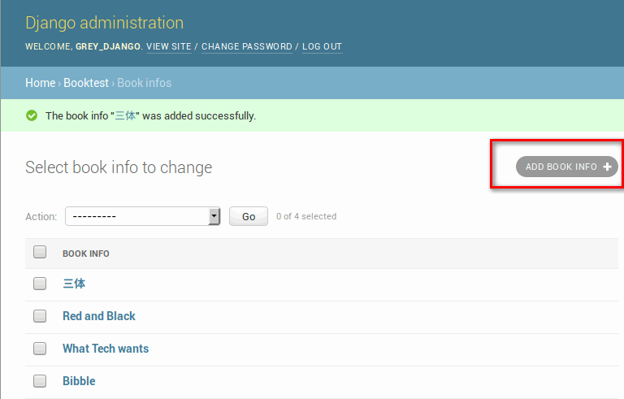
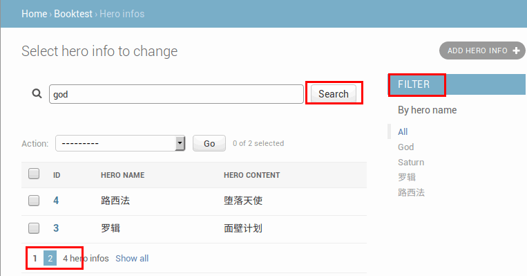
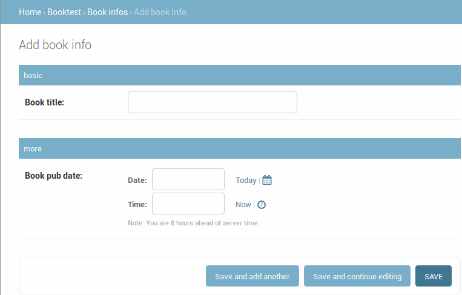
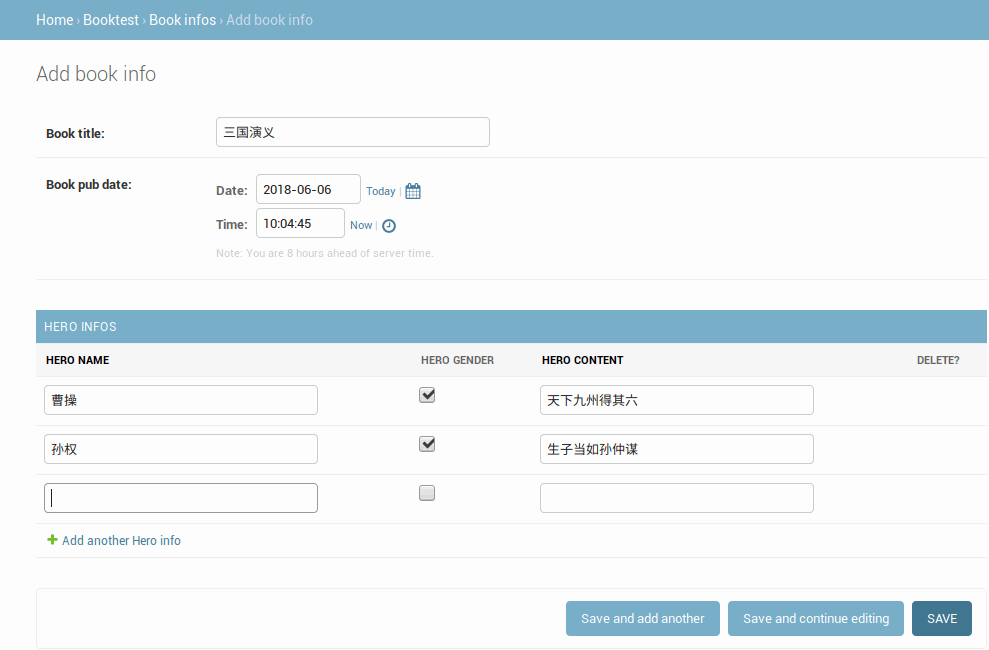
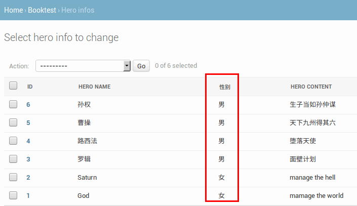
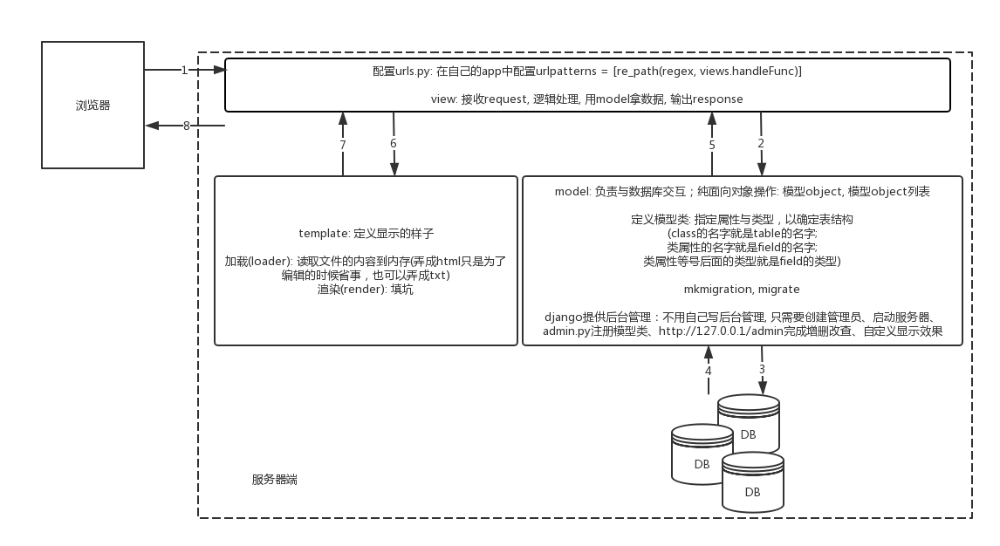

# Django Procedure

<!-- TOC -->

- [Django Procedure](#django-procedure)
  - [Introduction](#introduction)
    - [MVC](#mvc)
    - [MTV](#mtv)
  - [mkvirtualenv](#mkvirtualenv)
    - [how to install](#how-to-install)
    - [how to use](#how-to-use)
  - [Django Model](#django-model)
    - [create apps](#create-apps)
    - [create models](#create-models)
    - [makemigrations & migrate](#makemigrations--migrate)
    - [add data to DB](#add-data-to-db)
  - [server manage](#server-manage)
    - [use django management](#use-django-management)
    - [management some setting](#management-some-setting)
    - [custom background console](#custom-background-console)
    - [register several objects](#register-several-objects)
    - [bool value display](#bool-value-display)
  - [View](#view)
  - [Template](#template)
    - [template without data](#template-without-data)
    - [template with data](#template-with-data)
      - [将数据传递给template](#%E5%B0%86%E6%95%B0%E6%8D%AE%E4%BC%A0%E9%80%92%E7%BB%99template)
      - [用model拿数据](#%E7%94%A8model%E6%8B%BF%E6%95%B0%E6%8D%AE)
    - [带有`<a></a>`的project](#%E5%B8%A6%E6%9C%89aa%E7%9A%84project)

<!-- /TOC -->

## Introduction

example: 所有的web请求本质是socket; 所有web框架的本质是如下的程序;

```python
# DIY socket service
import socket

def handle_request(client):
    buf = client.recv(1024).decode('utf8')
    client.send("HTTP/1.1 200 OK\r\n\r\n".encode('utf8'))
    client.send(f"Hello, Grey\n{buf}".encode('utf8'))

if __name__ == '__main__':
    server = socket.socket()
    server.bind(('', 9999))
    server.listen(5)

    while True:
        connection, addr = server.accept()
        handle_request(connection)
        connection.close()
```

```python
# 只是简化上面的过程
from wsgiref.simple_server import make_server

def simple_app(environ, start_response):
    start_response('200 OK', [('Content-type', 'text/html')])
    # environ.items()客户端传递过来的所有东西
    return [f'Hello, Grey'.encode('utf8'), ]

with make_server('', 9999, simple_app) as httpd:
    httpd.serve_forever()
```

example: DIY web MVC framework
> MVC: Models, Views, Controllers

```bash
Models/
    # get data from DB
Views/
    test.html
Controllers/
    handle.py
test.py
```

```python
# test.py
from wsgiref.simple_server import make_server
from Controllers import handle

URL_DICT = {
    '/index': handle.handle_index,
    '/register': handle.handle_register,
}

def simple_app(environ, start_response):
    start_response('200 OK', [('Content-type', 'text/html')])
    path = environ['PATH_INFO']

    data = b'404'
    if path in URL_DICT:
        func = URL_DICT[path]
        data = func()

    return [data, ]

with make_server('', 9999, simple_app) as httpd:
    httpd.serve_forever()

```

```python
# handle.py
def handle_index():
    return b'index'

def handle_register():
    with open('Views/test.html', 'rb') as file:
        return file.read()
```

python的web框架有:
- flask:小型应用
- django: 大型应用
- tornado

[the Django book](http://djangobook.py3k.cn/)

### MVC

MVC框架的核心思想是：**解耦**; 降低各功能模块之间的耦合性，方便变更，更容易重构代码，最大程度上实现代码的重用；根本目的是实现高可扩展性，向后兼容；

- m表示model，主要用于对数据库层的封装
- v表示view，用于向用户展示结果
- c表示controller，是核心，用于处理请求、获取数据、返回结果


### MTV

Django是一款python的web开发框架; 与MVC有所不同，属于MVT框架(仅限于Django framework)

- m表示model，负责与数据库交互; 要么操作object, 要么操作list
- v表示view，是核心，负责接收请求(request)、逻辑处理、获取数据、返回响应结果(response)
- t表示template，负责呈现内容到浏览器

Django走的是MVC的思想，没有严格按照MVC的结构来写

model中一般规范不让编写sql语句；model中维护的是一个object与Database中的一行对应；对于python, 一个list与Database的一个table对应；model直接将代码转换为sql语句(也就是ORM)

处理是在view中进行的；

然后找一个模板(各种html挑一个), 返回给view, 最后view将结果返回给客户端(http报文...)；

客户端渲染得到结果；


## mkvirtualenv

### how to install

[Installation](https://virtualenvwrapper.readthedocs.io/en/latest/install.html#basic-installation)

```bash
# pip3安装virtualenvwrapper,会自动安装virtualenv
# 如果是sudo apt install virtualenvwrapper; 那么默认是python2环境;一堆坑
sudo pip3 install virtualenvwrapper

# 找到virtualenvwrapper安装的位置
find / -name virtualenvwrapper.sh

# 根据找到的位置，add 3 lines to .bashrc
vim .bashrc

# 3 lines
export WORKON_HOME=$HOME/.virtualenvs
export PROJECT_HOME=$HOME/Devel
export VIRTUALENVWRAPPER_PYTHON=`which python3`
source /usr/local/bin/virtualenvwrapper.sh

# load
source ~/.bashrc
```

### how to use

```bash
# create new virtual env
grey@ubuntu:~$ mkvirtualenv Test
Using base prefix '/usr'
New python executable in /home/grey/.virtualenvs/Test/bin/python3
Also creating executable in /home/grey/.virtualenvs/Test/bin/python
Installing setuptools, pip, wheel...done.

# begin
(Test) grey@ubuntu:~$ python --version
Python 3.6.5
(Test) grey@ubuntu:~$ pip --version
pip 10.0.1 from /home/grey/.virtualenvs/Test/lib/python3.6/site-packages/pip (python 3.6)
(Test) grey@ubuntu:~$ pip install django
# (Test) grey@ubuntu:~$ pip install django==1.8.2
(Test) grey@ubuntu:~$ pip list
Package    Version
---------- -------
Django     2.0.6  
pip        10.0.1 
pytz       2018.4 
setuptools 39.2.0 
wheel      0.31.1 
# 列出额外安装的包
# 并且后期可以指定版本来部署，用这个(==)的格式导出来
(Test) grey@ubuntu:~$ pip freeze
Django==2.0.6
pytz==2018.4
# 以后的package默认安装到了
# ~/.virtualenvs/Test/lib/python3.6/site-packages

# quit
(Test) grey@ubuntu:~$ deactivate
# remove env
grey@ubuntu:~$ rmvirtualenv Test

# 重新进入
grey@ubuntu:~$ workon Test
(Test) grey@ubuntu:~$ 

# new Project
(Test) grey@ubuntu:~$ django-admin startproject MyProject
(Test) grey@ubuntu:~$ cd MyProject/
(Test) grey@ubuntu:~/MyProject$ tree
.
├── manage.py
└── MyProject
    ├── __init__.py
    ├── settings.py
    ├── urls.py
    └── wsgi.py
```

- manage.py：一个命令行工具，可以使你用多种方式对Django项目进行交互

内层的目录：项目的真正的Python包
- _init _.py：一个空文件，它告诉Python这个目录应该被看做一个Python包
- settings.py：项目的配置
- urls.py：项目的URL声明
- wsgi.py：项目与WSGI兼容的Web服务器入口, 用于部署的时候

## Django Model

Model: 完成和数据库的交互

用pycharm打开刚才MyProject: 选择刚才的interpreter(`~/.virtualenvs/Test/bin/python`)；或者直接新建一个

用vscode打开刚才的MyProject: 配置`"pythonPath": "~/.virtualenvs/Test/bin/python",`

这里，换了一个virtualenv为`(DjangoEnv)`

```bash
(DjangoEnv) grey@ubuntu:~/PycharmProjects/MyProject$ tree
.
├── manage.py
├── MyProject
│   ├── __init__.py
│   ├── settings.py
│   ├── urls.py
│   └── wsgi.py
└── templates
```

### create apps

`settings.py`：通过DATABASES项进行数据库设置(django支持的数据库包括：sqlite、mysql等主流数据库;Django默认使用SQLite数据库); 暂时为sqlite

```bash
## 添加应用BookTest
(DjangoEnv) grey@ubuntu:~/PycharmProjects/MyProject$ python manage.py startapp BookTest
(DjangoEnv) grey@ubuntu:~/PycharmProjects/MyProject$ tree
.
├── BookTest
│   ├── admin.py
│   ├── apps.py
│   ├── __init__.py
        # migrations根据项目中的模型去genrate'生成sql语句的py脚本'，并将sql映射到数据库中去
│   ├── migrations
│   │   └── __init__.py
│   ├── models.py
│   ├── tests.py
│   └── views.py
        # 这里没有template, 因为没有确定有哪些view
├── manage.py
├── MyProject
│   ├── __init__.py
│   ├── __pycache__
│   │   ├── __init__.cpython-36.pyc
│   │   └── settings.cpython-36.pyc
│   ├── settings.py
│   ├── urls.py
│   └── wsgi.py
└── templates
```

### create models

`models.py`编写models: 

- 能够根据models生成sql语句并创建table; 所以django中不需要写sql语句;
- 能够创建object，然后对object进行各种操作

```python
# models.py
from django.db import models


# Create your models here.
class BookInfo(models.Model):
    book_title = models.CharField(max_length=20)
    book_pub_date = models.DateTimeField()

    def __str__(self):
        # return primary key
        return f'{self.pk}'


class HeroInfo(models.Model):
    hero_name = models.CharField(max_length=20)
    hero_gender = models.BooleanField()
    hero_content = models.CharField(max_length=100)
    # on_delete是django 2.0之后必须有的
    hero_book = models.ForeignKey('BookInfo', on_delete=models.CASCADE)

    def __str__(self):
        return f'{self.pk}'
```

```python
# setting.py
# 将BookTest添加到INSTALLED_APPS
INSTALLED_APPS = [
    'django.contrib.admin',
    'django.contrib.auth',
    'django.contrib.contenttypes',
    'django.contrib.sessions',
    'django.contrib.messages',
    'django.contrib.staticfiles',
    'BookTest',
]
```

### makemigrations & migrate

```bash
# 先要migration
# 1. 生成sql语句(生成迁移)
(DjangoEnv) grey@ubuntu:~/PycharmProjects/MyProject$ python manage.py makemigrations
Migrations for 'BookTest':
  BookTest/migrations/0001_initial.py
    - Create model BookInfo
    - Create model HeroInfo
# result
(DjangoEnv) grey@ubuntu:~/PycharmProjects/MyProject$ tree BookTest/
BookTest/
├── admin.py
├── apps.py
├── __init__.py
├── migrations
        # 0001_initial.py有详细的东西
│   ├── 0001_initial.py
│   ├── __init__.py
│   └── __pycache__
│       └── __init__.cpython-36.pyc
├── models.py
├── __pycache__
│   ├── admin.cpython-36.pyc
│   ├── __init__.cpython-36.pyc
│   └── models.cpython-36.pyc
├── tests.py
└── views.py
```

```python
# 0001_initial.py
# Generated by Django 2.0.6 on 2018-06-16 07:44

from django.db import migrations, models
import django.db.models.deletion


class Migration(migrations.Migration):

    initial = True

    dependencies = [
    ]

    operations = [
        migrations.CreateModel(
            name='BookInfo',
            fields=[
                ('id', models.AutoField(auto_created=True, primary_key=True, serialize=False, verbose_name='ID')),
                ('book_title', models.CharField(max_length=20)),
                ('book_pub_date', models.DateTimeField()),
            ],
        ),
        migrations.CreateModel(
            name='HeroInfo',
            fields=[
                ('id', models.AutoField(auto_created=True, primary_key=True, serialize=False, verbose_name='ID')),
                ('hero_name', models.CharField(max_length=20)),
                ('hero_gender', models.BooleanField()),
                ('hero_content', models.CharField(max_length=100)),
                ('hero_book', models.ForeignKey(on_delete=django.db.models.deletion.CASCADE, to='BookTest.BookInfo')),
            ],
        ),
    ]
```

这里生成migration文件(`0001_initial.py`)的只适合于**关系型数据库**， 然而并不针对特定类型的数据库；migrate之后才是针对特定类型的数据库

```bash
# 2. 根据sql语句生成table...(执行迁移)
(DjangoEnv) grey@ubuntu:~/PycharmProjects/MyProject$ python manage.py migrate
Operations to perform:
  # 各种应用被apply
  Apply all migrations: BookTest, admin, auth, contenttypes, sessions
Running migrations:
  Applying BookTest.0001_initial... OK
  Applying contenttypes.0001_initial... OK
  Applying auth.0001_initial... OK
  Applying admin.0001_initial... OK
  Applying admin.0002_logentry_remove_auto_add... OK
  Applying contenttypes.0002_remove_content_type_name... OK
  Applying auth.0002_alter_permission_name_max_length... OK
  Applying auth.0003_alter_user_email_max_length... OK
  Applying auth.0004_alter_user_username_opts... OK
  Applying auth.0005_alter_user_last_login_null... OK
  Applying auth.0006_require_contenttypes_0002... OK
  Applying auth.0007_alter_validators_add_error_messages... OK
  Applying auth.0008_alter_user_username_max_length... OK
  Applying auth.0009_alter_user_last_name_max_length... OK
  Applying sessions.0001_initial... OK
```

```bash
# 运行服务试试; 严格格式
# python manage.py runserver ip:port
python manage.py runserver

# 如果修改文件不需要重启服务器，如果增删文件需要重启服务器
```

### add data to DB

```bash
(DjangoEnv) grey@ubuntu:~/PycharmProjects/MyProject$ python manage.py shell
Python 3.6.5 (default, Apr  1 2018, 05:46:30) 
[GCC 7.3.0] on linux
Type "help", "copyright", "credits" or "license" for more information.
(InteractiveConsole)
>>> from BookTest.models import *
>>> b1=BookInfo()
# 通过对象是调用不到类属性book_title; 但是可以动态添加的book_title的实例属性
# 那么models.py中的book_title类属性，只是为了映射DB的表结构
# 这里同名的原因是为了让最后的数据对应到表的book_title字段
>>> b1.book_title='Bibble'
>>> from datetime import datetime
>>> b1.book_pub_date=datetime(year=2018, month=6, day=12)
# 这里的save; 意味着映射到DB的BookInfo表; b1.book_title意味着映射到DB的book_title字段
>>> b1.save()
# 可能会报timezone的warning, 不用修改

# 类属性objects指向的是一个Manage对象，Manage对象里面有all()方法等一堆方法
>>> BookInfo.objects.all()
# 下面的1 其实是__str__方法的primary key
<QuerySet [<BookInfo: 1>]>
```

在`models.py`中修改`return f'{self.book_title}'`然后`python manage.py shell`

```bash
>>> from BookTest.models import *
>>> BookInfo.objects.all()
<QuerySet [<BookInfo: Bibble>]>
>>> b2=BookInfo()
>>> b2.book_title='Faded'
>>> from datetime import datetime
>>> b2.book_pub_date=datetime(year=1996, month=5, day=12)
>>> b2.save()
>>> BookInfo.objects.all()
<QuerySet [<BookInfo: Bibble>, <BookInfo: Faded>]>

# some operation
>>> b3=BookInfo.objects.get(pk=2)
# read
>>> b3.book_title
'Faded'
# modify
>>> b3.book_title='Faded again'
# update
>>> b3.save()
>>> BookInfo.objects.all()
<QuerySet [<BookInfo: Bibble>, <BookInfo: Faded again>]>

# delete; 本质是一个object, 只是调用method的时候会转换成sql语句; 这个object与DB没有一点关系
b3.delete()
(1, {'BookTest.HeroInfo': 0, 'BookTest.BookInfo': 1})
>>> BookInfo.objects.all()
<QuerySet [<BookInfo: Bibble>]>
```

```bash
# add hero
>>> h1=HeroInfo()
>>> h1.hero_name='God'
>>> h1.hero_gender=0
>>> h1.hero_content='mamage the world'

>>> b1=BookInfo.objects.get(pk=1)
>>> h1.hero_book=b1
>>> h1.save()
>>> b1.heroinfo_set.all()
<QuerySet [<HeroInfo: God>]>
>>> h2=b1.heroinfo_set.create(hero_name='Saturn', hero_gender=False, hero_content='manage the hell')
>>> h2
<HeroInfo: Saturn>
>>> b1.heroinfo_set.all()
<QuerySet [<HeroInfo: God>, <HeroInfo: Saturn>]>
```

## server manage

站点分为**内容发布**和**公共访问**两部分

“内容发布”的部分负责添加、修改、删除内容，开发这些重复的功能是一件单调乏味、缺乏创造力的工作。为此，Django会根据定义的模型类完全自动地生成管理模块

django默认是用的sqlite3的数据库，并没有密码；可以用Navicat来打开数据库添加文件，不用这么麻烦；

### use django management

```bash
# create superuser & run
(DjangoEnv) grey@ubuntu:~/PycharmProjects/MyProject$ python manage.py createsuperuser
Username (leave blank to use 'grey'): grey_django
Email address: vip.gewei@foxmail.com
Password: 
Password (again): 
Superuser created successfully.
(DjangoEnv) grey@ubuntu:~/PycharmProjects/MyProject$ python manage.py runserver
```

然后再`http://127.0.0.1:8000/admin/`用上面填写的username, password登陆

### management some setting

`setting.py`修改codecs, timezone:

```python
# 修改文件不需要重启服务器
LANGUAGE_CODE = 'zh-Hans'
TIME_ZONE = 'Asia/Shanghai'
```

向admin添加`BookTest`的models

```python
# BookTest/admin.py
from django.contrib import admin

# Register your models here.
# python2:from models import BookInfo
# python3:from .models import BookInfo
from .models import *
admin.site.register(BookInfo)
admin.site.register(HeroInfo)
```

刷新管理页面，可以对BookInfo的数据进行增删改查操作



问题：如果在str方法中返回中文，在修改和添加时会报ascii的错误(django2.0中没有出现)
解决：在`__str__`方法中，将字符串末尾添加“.encode('utf-8')”

### custom background console

修改后的显示页面



修改后的添加修改页面




```python
# BookTest/admin.py
from django.contrib import admin
from .models import *


# Register your models here.
class BookInfoAdmin(admin.ModelAdmin):
    list_display = ['id', 'book_title', 'book_pub_date']
    # 调整顺序
    # fields = ['book_pub_date', 'book_title']
    # 分组
    fieldsets = [
        ('basic', {'fields': ['book_title']}),
        ('more', {'fields': ['book_pub_date']}),
    ]


class HeroInfoAdmin(admin.ModelAdmin):
    # list yemian
    list_display = ['id', 'hero_name', 'hero_content']
    list_filter = ['hero_name', ]
    search_fields = ['hero_name', ]
    list_per_page = 2


admin.site.register(BookInfo, BookInfoAdmin)
admin.site.register(HeroInfo, HeroInfoAdmin)
```

```python
# admin.py
# 或者用decorator
@admin.register(HeroInfo)
class HeroAdmin(admin.ModelAdmin):
    pass
```

### register several objects

对于HeroInfo模型类，有两种注册方式

- 方式一：与BookInfo模型类相同
- 方式二：关联注册

关联对象的添加：一本book同时添加多个Hero



```python
# BookTest/admin.py
from django.contrib import admin
from .models import *


# class HeroInfoInline(admin.StackedInline):
class HeroInfoInline(admin.TabularInline):
    model = HeroInfo
    extra = 3


# Register your models here.
class BookInfoAdmin(admin.ModelAdmin):
    # 将HeroInfo嵌入BookInfo, 显示的3行的TabularInline或者StackedInline
    inlines = [HeroInfoInline]


admin.site.register(BookInfo, BookInfoAdmin)
admin.site.register(HeroInfo)
```

### bool value display



```python
# models.py
from django.db import models


# Create your models here.
class BookInfo(models.Model):
    book_title = models.CharField(max_length=20)
    book_pub_date = models.DateTimeField()

    def __str__(self):
        return f'{self.book_title}'


class HeroInfo(models.Model):
    hero_name = models.CharField(max_length=20)
    hero_gender = models.BooleanField()
    hero_content = models.CharField(max_length=100)
    hero_book = models.ForeignKey('BookInfo', on_delete=models.CASCADE)

    def __str__(self):
        return f'{self.hero_name}'

    def gender(self):
        if self.hero_gender:
            return '男'
        else:
            return '女'

    gender.short_description = '性别'
```

```python
# admin.py
from django.contrib import admin
from .models import *


class HeroInfoInline(admin.TabularInline):
    model = HeroInfo
    extra = 3


# Register your models here.
class BookInfoAdmin(admin.ModelAdmin):
    inlines = [HeroInfoInline]


class HeroInfoAdmin(admin.ModelAdmin):
    list_display = ['id', 'hero_name', 'gender', 'hero_content']


admin.site.register(BookInfo, BookInfoAdmin)
admin.site.register(HeroInfo, HeroInfoAdmin)
```

## View

view的本质就是一个函数

```python
# BookTest/views.py
from django.http import HttpResponse


# Create your views here.
def index(request):
   return HttpResponse('hello')
```

```python
# setting.py
ROOT_URLCONF = 'MyProject.urls'
# 表明在urls.py文件中的配置
```

```python
# MyProject/urls.py
from django.contrib import admin
from django.urls import path, re_path

from BookTest import views

urlpatterns = [
    # 网址127.0.0.1:8000/admin的处理请求
    path('admin/', admin.site.urls),

    # 网址是127.0.0.1:8000采用views.index函数来处理
    # 可以正则请求，也可以普通的请求
    # path('', views.index),
    re_path(r'^$', views.index),
]
```

一般为了不让`MyProject/urls.py`里面写得太多，会在新建`BookTest/urls.py`

```python
# MyProject/urls.py
from django.contrib import admin
from django.urls import path, include

urlpatterns = [
    path('admin/', admin.site.urls),
    path('', include('BookTest.urls'))
]
```

```python
# BookTest/urls.py
from django.urls import path
from . import views

urlpatterns = [
    path('', views.index),
    path('index/', view.index)
]
```

最终的效果：网址输入`http://127.0.0.1:8000/`或者`http://127.0.0.1:8000/index/`; 会显示`hello`

为了显示更加复杂的显示页面，需要用`template`写好html, 让`view`来使用

## Template

template是html页面，可以根据view中传递的数据填充值

```bash
(DjangoEnv) grey@ubuntu:~/PycharmProjects/MyProject$ tree
.
├── BookTest
│   ├── admin.py
│   ├── apps.py
│   ├── __init__.py
│   ├── migrations
│   │   ├── 0001_initial.py
│   │   ├── __init__.py
│   │   └── __pycache__
│   │       ├── 0001_initial.cpython-36.pyc
│   │       └── __init__.cpython-36.pyc
│   ├── models.py
│   ├── tests.py
│   ├── urls.py
│   └── views.py
├── db.sqlite3
├── manage.py
├── MyProject
│   ├── __init__.py
│   ├── settings.py
│   ├── urls.py
│   └── wsgi.py
    # 新建templates目录
└── templates
    └── BookTest
        └── index.html
```

### template without data

```html
<!-- index.html -->
<!DOCTYPE html>
<html lang="en">
<head>
    <meta charset="UTF-8">
    <title>Title</title>
</head>
<body>
    <h1>Hello, world</h1>
</body>
</html>
```

```python
# 先要配置template的位置
# settings.py中的TEMPLATES
TEMPLATES = [
    {
        'BACKEND': 'django.template.backends.django.DjangoTemplates',
        # 修改为上面的新建的template目录
        'DIRS': [os.path.join(BASE_DIR, 'templates')]
        ,
        'APP_DIRS': True,
        'OPTIONS': {
            'context_processors': [
                'django.template.context_processors.debug',
                'django.template.context_processors.request',
                'django.contrib.auth.context_processors.auth',
                'django.contrib.messages.context_processors.messages',
            ],
        },
    },
]
```

```python
# views.py
from django.http import HttpResponse
from django.template import loader


# Create your views here.
def index(request):
    # index.html相对templates/所在的目录
    temp = loader.get_template('BookTest/index.html')
    return HttpResponse(temp.render())
```

```python
# views.py简化写法
from django.shortcuts import render


def index(request):
    # render返回了response, 所以浏览器才能看
    return render(request, 'BookTest/index.html')
```

### template with data

需要在view中用model去拿数据;需要在view中将数据传递给template;然后将最终的组装好的给客户端

#### 将数据传递给template

```python
# views.py
from django.shortcuts import render


def index(request):
    # render的第三个参数就是为了传递数据
    # 通过dict来传递数据
    context = {'header1': 'Hello, Header1'}
    return render(request, 'BookTest/index.html', context)
```

```html
<!-- templates/BookTest/index.html -->
<!DOCTYPE html>
<html lang="en">
<head>
    <meta charset="UTF-8">
    <title>Title</title>
</head>
<body>
    <!-- {{}}实现挖坑 -->
    <h1>{{ header1 }}</h1>
</body>
</html>
```

#### 用model拿数据

```python
from django.shortcuts import render
from .models import *


def index(request):
    book_list = BookInfo.objects.all()
    context = {'book_list': book_list}
    return render(request, 'BookTest/index.html', context)
```

```html
<!-- templates/BookTest/index.html -->
<!DOCTYPE html>
<html lang="en">
<head>
    <meta charset="UTF-8">
    <title>Title</title>
</head>
<body>
    <ul>
        <!-- 内部写python代码 -->
        
        <li>{{ book.book_title }}</li>
        
    </ul>
</body>
</html>
```

### 带有`<a></a>`的project

实现效果：点击**书名**链接，新链接显示**英雄**

```html
<!-- templates/BookTest/index.html -->
<!DOCTYPE html>
<html lang="en">
<head>
    <meta charset="UTF-8">
    <title>Title</title>
</head>
<body>
    <ul>
        
        <li><a href="{{ book.id }}">{{ book.book_title }}</a></li>
        
        <!-- 一旦点击，那么地址栏变成 site/book.id
        <!--http://127.0.0.1:8000/3 -->
    </ul>
</body>
</html>
```

那么需要解析地址`http://127.0.0.1:8000/3`

```python
# MyProject/BookTest/urls.py
from django.urls import path, re_path
from . import views

urlpatterns = [
    path('', views.index),
    re_path(r'^(\d+)$', views.show),
    # regex需要用(), 是为了将数据薅出来
    # 用的是views.show来处理
]
```

然后送到view中，view用models去拿数据

```python
# views.py
from django.shortcuts import render
from .models import *


def index(request):
    book_list = BookInfo.objects.all()
    context = {'book_list': book_list}
    return render(request, 'BookTest/index.html', context)


def show(request, book_id):
    # 需要另一个参数接收urls正则中的参数r'^(\d+)$', 也就是book.id
    book = BookInfo.objects.get(pk=book_id)
    hero_list = book.heroinfo_set.all()
    context = {'hero_list': hero_list}
    return render(request, 'BookTest/show.html', context)
```

view根据将templates的结果呈现

```html
<!-- templates/BookTest/show.html -->
<!DOCTYPE html>
<html lang="en">
<head>
    <meta charset="UTF-8">
    <title>Title</title>
</head>
<body>
    <ul>
        
        <li>{{ hero.hero_name }}</li>
        
    </ul>
</body>
</html>
```

Django开发流程: 设计models→管理站点→views→配置urls.py→templates



开发流程：
- step1:创建虚拟环境
- step2:安装django
- step3:创建项目
- step4:创建应用
- step5:在models.py中定义模型类
- step6:定义视图
- step7:配置url
- step8:创建模板

其中5-8是后期经常做的事情；1-4只用配置一次；