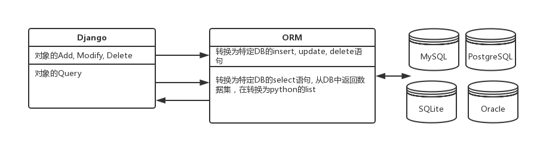
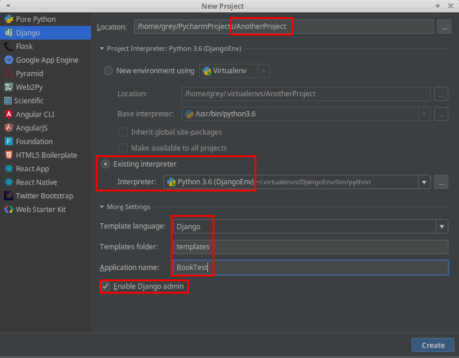
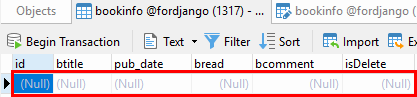
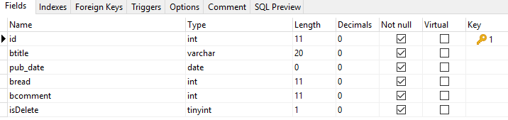
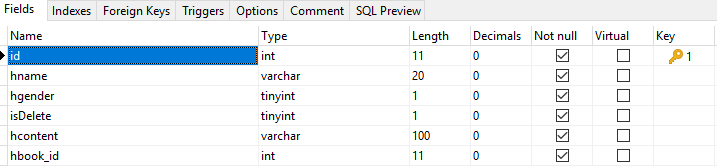
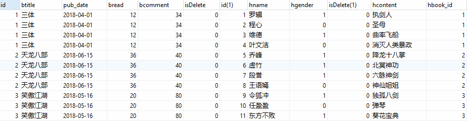
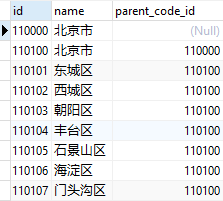
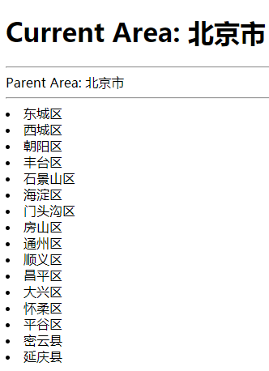

# Django Model

<!-- TOC -->

- [Django Model](#django-model)
    - [ORM(Object-Relationship-Map)](#ormobject-relationship-map)
    - [using MySQL](#using-mysql)
        - [property datatype](#property-datatype)
        - [Relationship](#relationship)
        - [class Meta](#class-meta)
        - [Model member](#model-member)
            - [类的属性](#类的属性)
            - [instance 属性](#instance-属性)
            - [instace method](#instace-method)
    - [Query](#query)
        - [查询集](#查询集)
        - [限制查询集(Limiting QuerySets)](#限制查询集limiting-querysets)
        - [QuerySets caching](#querysets-caching)
        - [Field lookups](#field-lookups)
            - [lookuptype](#lookuptype)
            - [filter example](#filter-example)
        - [`aggregate()`](#aggregate)
        - [`F()` expression](#f-expression)
        - [`Q()` expression](#q-expression)
    - [自连接](#自连接)
        - [self connect example](#self-connect-example)

<!-- /TOC -->

## ORM(Object-Relationship-Map)

ORM，它实现了数据模型与数据库的解耦，即数据模型的设计不需要依赖于特定的数据库，通过简单的配置就可以轻松更换数据库；ORM虽然会让执行过程变慢，但是解耦的作用是很明显的；

ORM作用：

- 根据对象的类型生成表结构
- 将对象、列表的操作，转换为sql语句
- 将sql查询到的结果转换为对象、列表



```bash
# ~/.virtualenvs/DjangoEnv/lib/python3.6/site-packages/django/db/backends/
# 列举了django支持的数据库mysql, postgresql, sqlite3, oracle
```

## using MySQL

```bash
# linux需要安装，window不需要
sudo apt install libmysqlclient-dev
```



```bash
(DjangoEnv) grey@ubuntu:~/PycharmProjects/AnotherProject$ pip install mysqlclient
(DjangoEnv) grey@ubuntu:~/PycharmProjects/AnotherProject$ pip list
Package     Version
----------- -------
Django      2.0.6  
mysqlclient 1.3.12 
pip         10.0.1 
pytz        2018.4 
setuptools  39.2.0 
wheel       0.31.1 
```

启动MySQL, 新建一个数据库`fordjango`

```python
# 修改setting.py中的DATABASES
DATABASES = {
    'default': {
        # 修改sqlite3为mysql
        'ENGINE': 'django.db.backends.mysql',
        'NAME': 'fordjango',
        'USER': 'root',
        'PASSWORD': '13810455459',
        'HOST': '222.29.69.149',
        'PORT': '3306',
    }
}
```

要么直接写models.py, 要么通过数据库生成models.py

```bash
# 通过数据库生产models.py
# 不推荐，因为这样做生成的不需要的class太多了
python manage.py inspectdb > booktest/models.py
```

django根据属性的类型确定以下信息：
- 当前选择的数据库支持字段的类型(最核心的功能)
- 渲染管理表单时使用的默认html控件(就是后台管理页面的控件样式)
- 在管理站点最低限度的验证(后台管理页面的简单验证，比如integrer不能填abc)

属性命名限制：
- 不能是python的保留关键字
- 由于django的查询方式(因为`__`是查询中的标识符)，不允许使用连续的下划线(eg. `a__b`是不允许的; `a_b`是允许的)

对于重要数据都做逻辑删除，不做物理删除，实现方法是定义`isDelete`属性，类型为`BooleanField`，默认值为False

### property datatype

属性的类型:

- AutoField
- BooleanField
- NullBooleanField
- CharField
- TextField
- IntegerField
- DecimalField
- FloatField
- DateField
- TimeField
- DateTimeField
- FileField: 二进制存储文件数据;
- ImageField: 二进制存储图片;

一般File和Image,  做法是将文件上传到磁盘中，然后将path记录存到databases中;而不是直接存文件;

字段选项
- 通过字段选项，可以实现对字段的约束
- null：如果为True，Django 将空值以NULL 存储到数据库中，默认值是 False
- blank：如果为True，则该字段允许为空白，默认值是 False(与null有区别)
- db_column：字段的名称，如果未指定，则使用属性的名称(这个只是修改数据库中field的名称，面向对象还是要操作属性名)
- db_index：若值为 True, 则在表中会为此字段创建索引
- default: 默认值，没什么作用
- primary_key：若为 True, 则该字段会成为模型的主键字段(配合AutoField使用)
- unique：如果为 True, 这个字段在表中必须有唯一值

关系的类型包括
- ForeignKey：一对多，将字段定义在**多**的端中
- ManyToManyField：多对多，将字段定义在**两端**中
- OneToOneField：一对一，将字段定义在**任意一端**中


### Relationship

一对多：

```python
# models.py
from django.db import models

# Create your models here.
class BookInfo(models.Model):
    book_title = models.CharField(max_length=20)
    book_pub_date = models.DateTimeField()

class HeroInfo(models.Model):
    hero_name = models.CharField(max_length=20)
    hero_gender = models.BooleanField()
    hero_content = models.CharField(max_length=100)
    # on_delete是django 2.0之后必须有的
    # 很明显: BookInfo是一，HeroInfo是多
    hero_book = models.ForeignKey('BookInfo', on_delete=models.CASCADE)
```

```python
# 多对一访问

# 已知book找到hero: 对象.模型类小写_set
book=BookInfo.objects.get(pk=1)
hero_list = book.heroinfo_set
hero_list.all()
# 已知hero找到book
book=hero.hero_book

# 获取hero存的hero_book的id
book_id=hero.hero_book.id
book_id=hero.hero_book_id
```

### class Meta

在**模型类**内部定义**Meta类**，用于设置如下元信息:

- 元信息db_table：定义数据表名称，推荐使用小写字母，数据表的默认名称是`AppName_ModelName`, 而且是小写: 比如(booktest_heroinfo)
- ordering：对象的默认排序字段，排序会增加数据库的开销

```python
# models.py
from django.db import models


# Create your models here.
class BookInfo(models.Model):
    btitle = models.CharField(max_length=20)
    bpub_date = models.DateField(db_column='pub_date')
    # default没有用，实测
    bread = models.IntegerField(default=0)
    bcomment = models.IntegerField(default=0)
    isDelete = models.BooleanField(default=False)

    class Meta:
        db_table = 'bookinfo'
        ordering = ['id', ]
        # 负号表示逆序
        # ordering = ['-id', ]


class HeroInfo(models.Model):
    hname = models.CharField(max_length=20)
    hgender = models.BooleanField(default=True)
    isDelete = models.BooleanField(default=False)
    hcontent = models.CharField(max_length=100)
    hbook = models.ForeignKey('BookInfo', on_delete=models.CASCADE)
```

```bash
# 不能是MySQL8, 出现了兼容问题
python manage.py makemigrations
python manage.py migrate
# 修改了类属性名称比如hcontent变成heroContent，需要重新Migration(有时甚至需要删除迁移文件`0001__init__.py`)
# 如果table里面有数据Migration经常会失败: 所以先要把数据export, 然后再import
```

在Navicat中 查看,证明上面的`default`设置是无效的



两个table的结构:



下面出现了`hbook_id`



如果已经`makemigration`, `migrate`; 那么就不要通过Navicat, workbench等客户端修改table的结构，但是可以添加数据

### Model member

#### 类的属性

Model中有一些成员，可以被继承来用;

`objects`: `Manager`类的对象(ORM的核心), 用于与DB交互

```python
# 可以自定义objects, 一般不这么做
class HeroInfo(models.Model):
    hname = models.CharField(max_length=20)
    hgender = models.BooleanField(default=True)
    isDelete = models.BooleanField(default=False)
    hcontent = models.CharField(max_length=100)
    hbook = models.ForeignKey('BookInfo', on_delete=models.CASCADE)
    # cutsom objects; 而且可以有多个；
    # 如果自定义了，那么默认objects管理器就失效了
    heros1 = models.Manager()
    # 管理类的instance是模型类的一个属性，用于对象与数据表mapping
    heros2 = models.Manager()
    # 使用的时候
    # HeroInfo.heros1.all()
    # HeroInfo.heros2.all()
```

自定义管理器类主要用于两种情况
- 情况1：修改管理器返回的原始查询集：重写`get_queryset()`方法
- 情况2：向管理器类中添加额外的方法：见下面“创建对象”中的方式2

```python
# 情况1
class BookInfoManager(models.Manager):
    def get_queryset(self):
        # 添加了后面的filter
        return super(BookInfoManager, self).get_queryset().filter(isDelete=False)
class BookInfo(models.Model):
    # 两个管理器，一个是filter的，一个是未filter的
    books = BookInfoManager()
    books_default=models.Manager()
    # 在python manage.py shell
    # BookInfo.books.all()
    # BookInfo.books_default.all()
```

快速创建对象：

- 当创建对象时，django不会对数据库进行读写操作；
- 调用`save()`方法才与数据库交互，将对象保存到数据库中；
- 使用关键字参数构造模型对象很麻烦，推荐使用下面的两种之式

创建对象的方法: 推荐使用方法2

- `__init__`方法已经在基类`models.Model`中使用，在自定义模型中无法使用; 所以在模型类中增加一个类方法
- 在自定义管理器中添加一个方法,

```python
# 方法1： 增加类方法
class BookInfo(models.Model):
    ...
    @classmethod
    def create(cls, title, pub_date):
        book = cls(btitle=title, bpub_date=pub_date)
        book.bread=0
        book.bcommet=0
        book.isDelete = False
        return book
    # # 复杂的写法
    # def create(cls, btitle, bpub_date):
    #     b=BookInfo()
    #     b.btitle=btitle
    #     b.bpub_date=bpub_date
    #     b.bread=0
    #     b.bcomment=0
    #     b.isDelete=0
    #     return b

# python manage.py shell使用
# b1=BookInfo.create('Faded', datetime(1994,2,6))
```

```python
# 方法2： 自定义管理器添加方法
class BookInfoManager(models.Manager):
    def create_book(self, title, pub_date):
        # self.model来得到它所属的模型类, ()表示是instance
        book = self.model()
        book.btitle = title
        book.bpub_date = pub_date
        book.bread=0
        book.bcommet=0
        book.isDelete = False
        return book
    # # another method
    # def create_book(self, titel, pub_date):
    #     b=BookInfo()
    #     b.btitle=btitle
    #     b.bpub_date=bpub_date
    #     b.bread=0
    #     b.bcomment=0
    #     b.isDelete=0
    #     return b

class BookInfo(models.Model):
    books = BookInfoManager()

# python manage.py shell中使用
# b2=BookInfo.books.create_book('China', datetime(1997,6,7))
```

```python
# 方法3： 本质是方法2的变形
class BookInfoManager(models.Manager):
    def create_book(self, title, pub_date):
        # 可以调用self.create()创建并保存对象，不需要再手动save();
        book = self.create(btitle = title,bpub_date = pub_date,bread=0,bcommet=0,isDelete = False)
        return book

class BookInfo(models.Model):
    books = BookInfoManager()
# python manage.py shell使用
# b3=Book.books.create_book("abc",datetime(1980,1,1))
# b3.pk
```

```python
# 方法4： 缺点是不能像方法3那样配置缺省参数
# python manage.py shell
from BookTest.models import *
from datetime import datetime
BookInfo.objects.create(book_title='China', book_pub_date=datetime(1994,5,21))
```

#### instance 属性

DoesNotExist：在进行单个查询时，模型的对象不存在时会引发此异常，结合try/except使用

#### instace method

用models创建的instance可以写的methods

- str (self)：此方法在将对象转换成字符串时会被调用
- save()：将模型对象保存到数据表中
- delete()：将模型对象从数据表中删除

## Query

从Sql的角度，查询集和select语句等价，过滤器像where和limit子句

### 查询集

在管理器上调用**过滤器**会返回查询集

查询集经过过滤器筛选后返回新的查询集，因此可以写成链式过滤

**过滤器**: 下面的方法都会调用管理器的`get_queryset()`
- all()
- filter(): `filter(key1=value1, key2=valu2)`或者`filter(key1=value1).filter(key2=value2)`
- exclude(): 与filter()相反
- order_by()
- values()：一个对象构成一个字典，所有对象构成一个列表返回: `BookInfo.objects.values()`

返回单个值的方法
- get()：返回单个满足条件的对象, `BookInfo.objects.get(pk=2)`
    - 如果未找到会引发"模型类.DoesNotExist"异常
    - 如果多条被返回，会引发"模型类.MultipleObjectsReturned"异常
- count()：返回当前查询的总条数, `BookInfo.objects.count()`
- first()：返回第一个对象
- last()：返回最后一个对象
- exists()：判断查询集中是否有数据，如果有则返回True

### 限制查询集(Limiting QuerySets)

查询集返回列表，可以使用下标的方式(**不支持负数索引**)进行限制，等同于sql中的limit和offset子句：`BookInfo.objects.all()[0:2]`

```bash
# old queryset
>>>old_list=BookInfo.objects.all()
# 使用下标后返回一个新的查询集，不会立即执行查询
# new queryset
>>>new_list=old_list[0:2]
# 这个时候才执行查询
>>>new_list
```

### QuerySets caching

**惰性执行**：创建查询集不会带来任何数据库的访问，直到调用数据时，才会访问数据库

何时对查询集求值：迭代(比如下面的`for`)，序列化，与if合用

序列化: 我们把变量从内存中变成可存储或传输的过程称之为序列化(用到了`import pickle`)

情况一：这构成了两个查询集，无法重用缓存，每次查询都会与数据库进行一次交互，增加了数据库的负载

```bash
# in python manage.py shell
print([e.headline for e in Entry.objects.all()])
print([e.pub_date for e in Entry.objects.all()])
```

情况二：两次循环使用同一个查询集，第二次使用缓存中的数据

```bash
queryset = Entry.objects.all()
print([p.headline for p in queryset]) # Evaluate the query set.
print([p.pub_date for p in queryset]) # Re-use the cache from the evaluation.
```

[When QuerySets are not cached](https://docs.djangoproject.com/en/2.0/topics/db/queries/)

```bash
# 情况一：
queryset = Entry.objects.all()
print(queryset[5]) # Queries the database
print(queryset[5]) # Queries the database again
```

```bash
# 情况二:
queryset = Entry.objects.all()
[entry for entry in queryset] # Queries the database
print(queryset[5]) # Uses cache
print(queryset[5]) # Uses cache
```

这个缓存的功能无所谓，可以自己用redis, mongodb缓存;

### Field lookups

实现where子名，作为方法filter()、exclude()、get()的参数

```python
# lookuptype表示比较运算符
field__lookuptype=value

# 对于foreign key可以访问id
field_id

# like不用转义，可以直接写
# where title like '%\%%'，表示查找标题中包含%的
filter(title__contains="%")
```

#### lookuptype

- exact: 默认就是这个，可以不写;`BookInfo.objects.filter(isDelete=True)`<=>`BookInfo.objects.filter(isDelete__exact=True)`
- contains:
- startswith, endswith:
- isnull, isnotnull
- iexact, icontains, istartswith, iendswith: ignore case
- in: `BookInfo.objects.filter(pk__in=[1,2,3,4,5])`
- gt, gte, lt, lte
- year, month, day, week_day, hour, minute, second: 用datetime的某一部分; `BookInfo.objects.filter(bpub_date__year=1994)`, `BookInfo.objects.filter(bpub_date__gt=date(1994,2,23))`

关联查询: 也就是sql语句中的`join`

语法：`模型类名__<属性名>__<比较>`
>注：可以没有`__<比较>`部分，表示等于，结果同`inner join`

```bash
# 根据hero过滤BookInfo

BookInfo.objects.filter(heroinfo__hcontent__contains='剑')
# 可以反向查找
HeroInfo.objects.filter(bookinfo_btitle_contains='八')
```

查询快捷方式: `BookInfo.objects.filter(pk__gt=6)`

#### filter example

```python
# AnotherProject/urls.py
from django.contrib import admin
from django.urls import path, include

urlpatterns = [
    path('admin/', admin.site.urls),
    path('', include('BookTest.urls'))
]
```

```python
# BookTest/urls.py
from django.urls import re_path, path
from BookTest import views

urlpatterns = [
    path('', views.index)
]
```

```python
# BookTest/views.py
from django.shortcuts import render
from .models import *


# Create your views here.
def index(request):
    # 关联查询book: book中的hero的hcontent含有'八'
    book_list = BookInfo.objects.filter(heroinfo__hcontent__contains='八')
    context = {'book_list': book_list}
    return render(request, 'BookTest/index.html', context)
```

```html
<!-- templates/BookTest/index.html -->
<!DOCTYPE html>
<html lang="en">
<head>
    <meta charset="UTF-8">
    <title>Title</title>
</head>
<body>
    
        <li>{{ book.btitle }}</li>
    
</body>
</html>
```

可以通过`select * from bookinfo inner join booktest_heroinfo on bookinfo.id=booktest_heroinfo.hbook_id`来确认结果



### `aggregate()`

很类似MongoDB里面的Aggregate

some function: `Avg, Count, Max, Min, Sum`

一般不用`Count`, 而用`BookInfo.objects.all().count()`

```python
# BookTest/views.py
from django.shortcuts import render
from .models import *
from django.db.models import Max


# Create your views here.
def index(request):
    # book_list = BookInfo.objects.aggregate(Max('id'))
    book_list = BookInfo.objects.aggregate(Max('bpub_date'))
    context = {'book_list': [book_list, ]}
    return render(request, 'BookTest/index.html', context)
```

```html
<!-- templates/BookTest/index.html -->
<!DOCTYPE html>
<html lang="en">
<head>
    <meta charset="UTF-8">
    <title>Title</title>
</head>
<body>
    
        <li>{{ book }}</li>
    
</body>
</html>
```

### `F()` expression

`from django.db.models import F`

一般的都是一个**Field**与一个**常量**比较; `F()`实现两个Field的比较

`BookInfo.objects.filter(bread__gte=F('bcommet'))`

还支持算术运算

`BookInfo.objects.filter(bread__gte=F('bcommet')*2)`

还可以写作`模型类__列名`进行关联查询

`BookInfo.objects.filter(isDelete=F('heroinfo__isDelete'))`

对于date/time字段，可与`timedelta()`进行运算

`BookInfo.objects.filter(bpub_date__lt=F('bpub_date') + timedelta(days=1))`

### `Q()` expression

`from django.db.models import Q`

过滤器的方法中关键字参数查询`.filter(key1=value1, key2=value2)`，会合并为`And`进行; 需要进行`and, or, not`查询，使用`Q()`对象

`Q()`对象用`&, |, ~`连接逻辑关系

```python
# 下面三者And关系等价
.filter(pk_lt=6).filter(bcomment__gt=10)
.filter(pk_lt=6, bcomment__gt=10)
.filter(Q(pk__lt=6) & Q(bcomment__gt=10))

# or
.filter(Q(pk__lt=6) | Q(bcomment__gt=10))

# ~
.filter(~Q(pk__lt=6))
```

## 自连接

对于地区信息，属于一对多关系，使用一张表，存储所有的信息；类似的表结构还应用于分类信息，可以实现无限级分类

```python
# models.py
from django.db import models


# Create your models here.
class AreaInfo(models.Model):
    name = models.CharField(max_length=20)
    parent_code = models.ForeignKey('self', null=True, blank=True, on_delete=models.CASCADE)
```

访问关联对象

```bash
# python manage.py shell
>>> from AreaTest.models import *
>>> a1=AreaInfo.objects.get(pk=110100)
>>> a1.parent_code
<AreaInfo: AreaInfo object (110000)>
>>> a1.areainfo_set.all()[0:5]
<QuerySet [<AreaInfo: AreaInfo object (110101)>, <AreaInfo: AreaInfo object (110102)>, <AreaInfo: AreaInfo object (110103)>, <AreaInfo: AreaInfo object (110104)>, <AreaInfo: AreaInfo object (110105)>]>
```



### self connect example



```python
# setting.py
DATABASES = {
    'default': {
        # 修改sqlite3为mysql
        'ENGINE': 'django.db.backends.mysql',
        'NAME': 'areadb',
        'USER': 'root',
        'PASSWORD': '13810455459',
        'HOST': '222.29.69.149',
        'PORT': '3306',
    }
}
```

```python
# AreaProject/urls.py
from django.contrib import admin
from django.urls import path, include

urlpatterns = [
    path('admin/', admin.site.urls),
    path('', include('AreaTest.urls'))
]
```

```python
# AreaTest/urls.py
from django.urls import path
from AreaTest import views

urlpatterns = [
    path('', views.index),
]
```

```python
# views.py
from django.shortcuts import render
from AreaTest.models import *


# Create your views here.
def index(request):
    beijing = AreaInfo.objects.get(pk=110100)
    context = {'beijing': beijing}
    return render(request, 'AreaTest/index.html', context)
```

```html
<!-- templates/AreaTest/index.html -->
<!DOCTYPE html>
<html lang="en">
<head>
    <meta charset="UTF-8">
    <title>Title</title>
</head>
<body>
    <h1>Current Area: {{ beijing.name }}</h1>
    <hr>
    <div class="parent">
        Parent Area: {{ beijing.parent_code.name }}
    </div>
    <hr>
    <div class="children">
        
            <li>{{ area.name }}</li>
        
    </div>
</body>
</html>
```