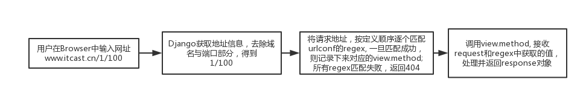
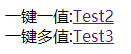
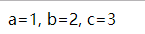
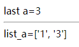
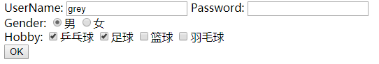
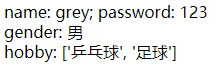
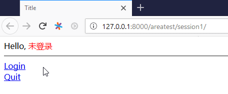
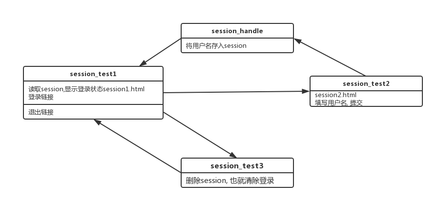
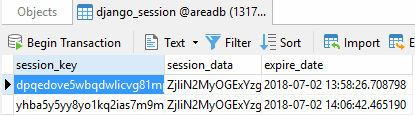

# Django View

<!-- TOC -->

- [Django View](#django-view)
  - [URLconf](#urlconf)
    - [incluse `namespace`, path `name`用于反向解析](#incluse-namespace-path-name%E7%94%A8%E4%BA%8E%E5%8F%8D%E5%90%91%E8%A7%A3%E6%9E%90)
  - [view method](#view-method)
    - [404 view](#404-view)
    - [500(server error) view](#500server-error-view)
    - [400(bad request) view](#400bad-request-view)
  - [Request](#request)
    - [QueryDict](#querydict)
    - [property `GET`](#property-get)
      - [关于网址](#%E5%85%B3%E4%BA%8E%E7%BD%91%E5%9D%80)
      - [`request.GET` example](#requestget-example)
    - [property `POST`](#property-post)
  - [Response](#response)
    - [Response子类`HttpResponseRedirect`](#response%E5%AD%90%E7%B1%BBhttpresponseredirect)
      - [反向解析](#%E5%8F%8D%E5%90%91%E8%A7%A3%E6%9E%90)
    - [HttpResponse子类JsonResponse](#httpresponse%E5%AD%90%E7%B1%BBjsonresponse)
  - [状态保持](#%E7%8A%B6%E6%80%81%E4%BF%9D%E6%8C%81)
    - [session example: login](#session-example-login)
    - [session expire](#session-expire)
    - [session storage](#session-storage)
      - [使用Redis缓存session](#%E4%BD%BF%E7%94%A8redis%E7%BC%93%E5%AD%98session)
    - [session原理](#session%E5%8E%9F%E7%90%86)

<!-- /TOC -->

## URLconf

view接收有个request, 返回一个response; response可以是html, 404, redirection



>注意: 进行匹配时不包括get或post请求的参数及域名
>`http://www.itcast.cn/python/1/?i=1&p=new，只匹配“/python/1/”部分`

```python
# setting.py 指定根级url的配置
# manage.py是程序入口，先调用setting.py, 然后有下面的，又会调用urls.py
ROOT_URLCONF = 'AreaProject.urls'
```

```python
# urls, regex指定参数
# r表示raw, 不进行转义
re_path(r'^(?P<p2>\d+)/(?P<p3>\d+)/(?P<p1>\d+)/$',views.detail),
```

```python
# views.py
def detail(request,p1,p2,p3):
    # 如果地址栏输入的是:xxxx/2017/10/12
    # 返回结果是: year: 12, month: 2017, day:  10
    return HttpResponse('year:%s,month:%s,day:%s'%(p1,p2,p3))
```

### incluse `namespace`, path `name`用于反向解析

view重定向的时候会用到；template的链接会用到

```python
# AreaProject/urls.py
from django.contrib import admin
from django.urls import path, include

urlpatterns = [
    path('admin/', admin.site.urls),
    path('areatest/', include('AreaTest.urls', namespace='areatest'))
]
```

```python
# AreaTest/urls.py
from django.urls import path
from AreaTest import views

urlpatterns = [
    path('', views.index, name='index'),
]
```

## view method

view的函数可以不放在`views.py`文件中, 不推荐这么做

```python
# views1.py
from django.http import HttpResponse

def index(request):
    return HttpResponse('hello 123')
```

```python
# views.py中需要引入views1.py
import views1
```

### 404 view

```python
# setting.py
DEBUG = False

ALLOWED_HOSTS = ['*']
```

```html
<!-- 添加templates/404.html -->
<!-- 也可以不添加，用django默认的 -->
<!DOCTYPE html>
<html lang="en">
<head>
    <meta charset="UTF-8">
    <title>Title</title>
</head>
<body>
    Page not found
    <hr>
    {{ request_path }}
</body>
</html>
```

### 500(server error) view

在视图代码中出现运行时错误

### 400(bad request) view

错误来自客户端的操作; 当用户进行的操作在安全方面可疑的时候，例如篡改会话cookie

## Request

服务器接收到http协议的请求后，会根据报文创建HttpRequest对象;

每一个报文包括: header, body

一个HttpRequest对象包含的属性(几乎都是readonly):

- path
- method
    - `GET`: 不隐藏，直接把内容体现在地址栏, 当然报文里面也有; 默认是`GET`
    - `POST`: 用于表单提交
- encoding: 这个是可写的
- `GET`: (重点)一个类似于字典的对象，包含get请求方式的所有参数
- `POST`: (重点)一个类似于字典的对象，包含post请求方式的所有参数
- FILES
- COOKIES
- session: 一个既可读又可写的类似于字典的对象

一个HttpRequest对象包含的方法:

- is_ajax()

### QueryDict

上文中类似字典的对象(比如`GET`, `POST`), 定义于`django.http.QueryDict`

与python字典不同，QueryDict类型的对象用来处理**同一个键带有多个值**的情况

- `.get('key', default)` or `['key']`: 只能获取键的一个值, 如果一个键同时拥有多个值，获取最后一个值: 比如`request.GET.get('key')`, `request.GET['key']`。比如标签input:text, input:password, input:radio
- `.getlist('key', default)`: 将键的值以列表返回，可以获取一个键的多个值; 如果没有那么返回默认值default。比如标签input:checkbox, select

### property `GET`

地址可以是`127.0.0.1:8000/areatest/?a=1&b=2&a=3`, 其中一个key可以带多个value, 所以可以有两个a

#### 关于网址

```bash
# structure
http://www.baidu.com
|
└── booktest
|    └── a.html
|    └── b.html
└── b.html
```

如果现在位于`http:www.baidu.com/booktest/a.html`; 

- `<a href="b.html">Test2</a>`表示`http:www.baidu.com/booktest/b.html`
- `<a href="/b.html">Test2</a>`表示`http:www.baidu.com/b.html`, 最前面的那个`/`表示的就是root

#### `request.GET` example

```python
# AreaProject/urls.py
from django.contrib import admin
from django.urls import path, include

urlpatterns = [
    path('admin/', admin.site.urls),
    path('areatest/', include('AreaTest.urls'))
]
```

```python
# AreaTest/urls.py
from django.urls import path
from AreaTest import views

urlpatterns = [
    path('', views.index),
    path('getTest1/', views.get_test1),
    path('getTest2/', views.get_test2),
    path('getTest3/', views.get_test3),
]
````

```python
# views.py
from django.shortcuts import render
from AreaTest.models import *


# Create your views here.
def index(request):
    beijing = AreaInfo.objects.get(pk=110100)
    context = {'beijing': beijing}
    return render(request, 'AreaTest/index.html', context)


# 测试首页，显示多个两个测试链接
def get_test1(request):
    return render(request, 'AreaTest/getTest1.html')


# 一键一值
def get_test2(request):
    context = {'a': request.GET.get('a'), 'b': request.GET['b'], 'c': request.GET['c']}
    return render(request, 'AreaTest/getTest2.html', context)


# 一键多值
def get_test3(request):
    # get last value
    last_a = request.GET['a']
    # get all value
    list_a = request.GET.getlist('a')
    context = {'last_a': last_a, 'list_a': list_a}
    return render(request, 'AreaTest/getTest3.html', context)
```

```html
<!-- templates/AreaTest/getTest1.html -->
<!DOCTYPE html>
<html lang="en">
<head>
    <meta charset="UTF-8">
    <title>Title</title>
</head>
<body>
    一键一值:<a href="/areatest/getTest2/?a=1&b=2&c=3">Test2</a>
    一键多值:<a href="/areatest/getTest3/?a=1&b=2&a=3">Test3</a>
</body>
</html>
```

```html
<!-- templates/AreaTest/getTest2.html -->
<!-- templates/AreaTest/getTest3.html -->
<!-- 只是为了显示数据，too easy -->
```

`http://127.0.0.1:8000/areatest/getTest1/`显示:



点击`Test2`得到:`http://127.0.0.1:8000/areatest/getTest2/?a=1&b=2&c=3`



点击`Test3`得到:`http://127.0.0.1:8000/areatest/getTest3/?a=1&b=2&a=3`



### property `POST`

post的时候, `.html`中`<input name="xxx" value="yyy">`的name作为key, value作为value; 所以也存在一个key对应多个value的情况; 

- 如果不写`name`, 那么提交的报文中没有key-value, 也就是不提交，可以用F12看下面的`<input type="submit" value="OK">`
- 如果不写`value`, 照样提交, 比如`<input type="text" name="uname">`

可以通过F12查看POST提交的内容;

```python
# views.py
from django.shortcuts import render
from AreaTest.models import *


# Create your views here.
def index(request):
    beijing = AreaInfo.objects.get(pk=110100)
    context = {'beijing': beijing}
    return render(request, 'AreaTest/index.html', context)


# 测试首页，显示多个两个测试链接
def get_test1(request):
    return render(request, 'AreaTest/getTest1.html')


# 一键一值
def get_test2(request):
    context = {'a': request.GET.get('a'), 'b': request.GET['b'], 'c': request.GET['c']}
    return render(request, 'AreaTest/getTest2.html', context)


# 一键多值
def get_test3(request):
    # get last value
    last_a = request.GET['a']
    list_a = request.GET.getlist('a')
    context = {'last_a': last_a, 'list_a': list_a}
    return render(request, 'AreaTest/getTest3.html', context)


# 展示form表单
def post_test1(request):
    return render(request, 'AreaTest/postTest1.html')


# 显示接受的form表单内容
def post_test2(request):
    uname = request.POST['uname']
    upwd = request.POST['upwd']
    ugender = request.POST['ugender']
    uhobby = request.POST.getlist('uhobby')
    context = {'uname': uname, 'upwd': upwd, 'ugender': ugender, 'uhobby': uhobby}
    return render(request, 'AreaTest/postTest2.html', context)
```

```python
# urls.py
from django.urls import path
from AreaTest import views

urlpatterns = [
    path('', views.index),
    path('getTest1/', views.get_test1),
    path('getTest2/', views.get_test2),
    path('getTest3/', views.get_test3),
    path('postTest1/', views.post_test1),
    path('postTest2/', views.post_test2),
]
```

```html
<!-- templats/areatest/postTest1.html -->
<!DOCTYPE html>
<html lang="en">
<head>
    <meta charset="UTF-8">
    <title>Title</title>
</head>
<body>
    <!--method表示提交的方法，action表示提交的位置-->
    <form method="post" action="/areatest/postTest2/">
        UserName: <input type="text" name="uname">
        Password: <input type="password" name="upwd">
        <br>
        Gender: <input type="radio" name="ugender" value="男" checked="checked">男
                <input type="radio" name="ugender" value="女">女
        <br>
        Hobby: <input type="checkbox" name="uhobby" value="乒乓球">乒乓球
               <input type="checkbox" name="uhobby" value="足球">足球
               <input type="checkbox" name="uhobby" value="篮球">篮球
               <input type="checkbox" name="uhobby" value="羽毛球">羽毛球
        <br>
        <input type="submit" value="OK">
    </form>
</body>
</html>
```

访问`http://127.0.0.1:8000/areatest/postTest1/`



提交后，报错`CSRF`, 注释掉

```python
# setting.py
MIDDLEWARE = [
    'django.middleware.security.SecurityMiddleware',
    'django.contrib.sessions.middleware.SessionMiddleware',
    'django.middleware.common.CommonMiddleware',
    # 'django.middleware.csrf.CsrfViewMiddleware',
    'django.contrib.auth.middleware.AuthenticationMiddleware',
    'django.contrib.messages.middleware.MessageMiddleware',
    'django.middleware.clickjacking.XFrameOptionsMiddleware',
]
```

刷新得到:`http://127.0.0.1:8000/areatest/postTest2/`



## Response

`HttpRequest`对象由Django自动创建，`HttpResponse`对象由程序员创建

templates的处理：加载template, 然后填坑并渲染生成最终html, 最后返回HttpRespone对象;

Response对象的属性:
- content：表示返回的内容，字符串类型; 也就是报文的body部分
- charset：表示response采用的编码字符集，字符串类型
- status_code：响应的HTTP响应状态码
- content-type：指定输出的MIME类型(表示不同文件类型, F12报文中可以看到`text/html`)

Response对象的method:
- init ：使用页内容实例化HttpResponse对象
- write(content)：以文件的方式写
- flush()：以文件的方式输出缓存区
- set_cookie(key, value='', max_age=None, expires=None)：设置Cookie
    - key、value都是字符串类型
    - max_age是一个整数，表示在指定秒数后过期
    - expires是一个datetime或timedelta对象，会话将在这个指定的日期/时间过期
    - max_age与expires二选一
    - 如果不指定过期时间，则两个星期后过期
- delete_cookie(key)：删除指定的key的Cookie，如果key不存在则什么也不发生

>Cookie实际上是一小段的文本信息。客户端请求服务器，如果服务器需要记录该用户状态，就使用response向客户端浏览器颁发一个Cookie。客户端浏览器会把Cookie保存起来。当浏览器再请求该网站时，浏览器把请求的网址连同该Cookie一同提交给服务器。服务器检查该Cookie，以此来辨认用户状态

```python
# cookie example
# views.py
from django.http import HttpResponse
from datetime import *

def index(request):
    response = HttpResponse()
    if request.COOKIES.has_key('h1'):
        response.write('<h1>' + request.COOKIES['h1'] + '</h1>')
    response.set_cookie('h1', '你好', 120)
    # response.set_cookie('h1', '你好', None, datetime(2019, 10, 31))
    return response
```

一个域名的cookie是不可能给被其他域名的网站读取的(浏览器的策略); 然而因为有的网站嵌入了其他网站(用的`iframe`)所以csdn中的淘宝`iframe`会获取之前搜索的cookie弹广告;

### Response子类`HttpResponseRedirect`

重定向: 填了一个网址，然后调到了另一个网址; 比如mdict登陆成功之后跳转到用户中心, google重定向到`google.com.hk`

```python
# urls.py
from django.urls import path
from AreaTest import views

urlpatterns = [
    path('redTest1/', views.red_test1),
    path('redTest2/', views.red_test2),
]
```

```python
# views.py
from django.http import HttpResponseRedirect, HttpResponse
from django.shortcuts import redirect

def red_test1(request):
    # return HttpResponseRedirect('/areatest/redTest2/')
    return redirect('/areatest/redTest2/')


def red_test2(request):
    return HttpResponse('这是转过来的page')
```

网址输入`http://127.0.0.1:8000/areatest/redTest1/`自动跳转到`http://127.0.0.1:8000/areatest/redTest2/`

#### 反向解析

### HttpResponse子类JsonResponse

## 状态保持

http协议是无状态的, 每次请求都是一次新的请求，不会记得之前通信的状态; 比如**登陆页面**和**首页**是没有关联的，**首页**不知道是否登陆成功;

实现状态保持的方式：在客户端或服务器端存储与会话有关的数据; (记录曾经干过什么)
- 方法1:将不敏感的信息用cookie存在本地, 
- 方法2:将敏感的信息是存在服务器上, 也就是session; 

>推荐使用sesison方式，所有数据存储在服务器端，在客户端cookie中存储session_id

```python
# setting.py默认已经安装了这个app
INSTALLED_APPS = [
    'django.contrib.sessions',
]
```

session是一个既可读又可写的类似于字典的对象；是HttpRequest对象的一个属性
- get(key, default=None)：根据键获取会话的值
- clear()：清除所有会话
- flush()：删除当前的会话数据并删除会话的Cookie
- del request.session['member_id']：删除会话

### session example: login

默认会将session存到数据库中，所以数据库要求是开着的;

> 已经迁移过的，不用再迁移，可以直接连接





```python
# urls.py
from django.urls import path
from AreaTest import views

urlpatterns = [
    path('session1/', views.session_test1),
    path('session2/', views.session_test2),
    path('session2_handle/', views.session_handle),
    path('session3/', views.session_test3),
]
```

```python
# views.py
def session_test1(request):
    # uname = request.session['myname']
    # 下面这个更好，没有myname, 返回None, 或者自定义
    # uname = request.session.get('myname')
    uname = request.session.get('myname', default='未登录')
    context = {'uname': uname}
    return render(request, 'AreaTest/session1.html', context)


def session_test2(request):
    return render(request, 'AreaTest/session2.html')


def session_handle(request):
    uname = request.POST['uname']
    request.session['myname'] = uname
    return redirect('/areatest/session1/')


def session_test3(request):
    # 删除session就可以清除登录了
    del request.session['myname']
    return redirect('/areatest/session1/')
```

```html
<!-- session1.html -->
<!DOCTYPE html>
<html lang="en">
<head>
    <meta charset="UTF-8">
    <title>Title</title>
    <style>
        span{
            color: red;
        }
    </style>
</head>
<body>
    Hello, <span>{{ uname }}</span>
    <hr>
    <a href="/areatest/session2">Login</a>
    <br>
    <a href="/areatest/session3">Quit</a>
</body>
</html>
```

```html
<!-- session2.html -->
<!DOCTYPE html>
<html lang="en">
<head>
    <meta charset="UTF-8">
    <title>Title</title>
</head>
<body>
    <form method="post" action="/areatest/session2_handle/">
        <input type="text" name="uname">
        <input type="submit" value="登录">
    </form>
</body>
</html>
```

### session expire

set_expiry(value)：设置会话的超时时间
- 如果没有指定，则两个星期后过期
- 如果value是一个整数，会话将在**values秒没有活动**后过期
- 若果value是一个timedelta对象，会话将在当前时间加上这个指定的日期/时间过期
- 如果value为0，那么用户会话的Cookie将在用户的**浏览器关闭时过期**
- 如果value为None，那么会话**永不过期**

```python
def session_handle(request):
    uname = request.POST['uname']
    request.session['myname'] = uname
    # here
    request.session.set_expiry(0)
    return redirect('/areatest/session1/')
```

### session storage

默认session存到数据库中; 由`setting.py`决定;

通过Navicat查看数据库的`django_session`表



其中那个session_key也会存在cookie中; 那个session_data是base64加密的(特征是以`=`或者`==`结尾的字符串);可以在线解码

```python
# setting.py; django的默认方式，存到django_session表中
SESSION_ENGINE='django.contrib.sessions.backends.db'
```

基于缓存的会话：只存在本地内存中，如果丢失则不能找回，比数据库的方式读写更快

```python
SESSION_ENGINE='django.contrib.sessions.backends.cache'
```

可以将缓存和数据库同时使用：优先从本地缓存中获取，如果没有则从数据库中获取

```python
SESSION_ENGINE='django.contrib.sessions.backends.cached_db'
```

#### 使用Redis缓存session

会话还支持文件、纯cookie、Memcached、Redis等方式存储，以redis为例

`pip install django-redis-sessions`, 然后`sudo systemctl start redis`

```python
# setting.py
# SESSION_ENGINE来自django-redis-sessions
SESSION_ENGINE = 'redis_sessions.session'
SESSION_REDIS = {
    'host': '222.29.69.242',
    'port': 6379,
    'db': 0,
    'password': '',
    'prefix': 'session',
    'socket_timeout': 1
}
```

```python
# app/urls.py
from django.urls import path
from . import views

urlpatterns = [
    path('sessionTest/', views.session_test)
]
```

```python
# views.py
from django.http import HttpResponse


# Create your views here.
def session_test(request):
    # 写入session
    request.session['myName'] = 'grey'
    return HttpResponse('Hello')
```

```bash
# redis client
redis-cli
127.0.0.1:6379> keys *
1) "session:cb6uqf214kukxow9qsfge9mgwxilatz2"
# 类似这样的结果 "session: ehxintehadhfefehdjifeinf"是一个session_key
127.0.0.1:6379> get "session:cb6uqf214kukxow9qsfge9mgwxilatz2"
# get得到的结果仍然是base64加密的结果
"ODczZjA1Yjg5Y2Y1ZGFhNWVjODQyMGJiZDVkM2FmM2NhNzliYTk5MDp7Im15TmFtZSI6ImdyZXkifQ=="
127.0.0.1:6379>
```

其中[base64解码](http://tool.oschina.net/encrypt?type=3)得到`873f05b89cf5daa5ec8420bbd5d3af3ca79ba990:{"myName":"grey"}`可以看到上面的session;

### session原理

`session_id`可以用F12查看cookie得到, `session_key`可以在数据库或者redis中看到

> session依赖于cookie, 客户端的cookie一般保存了`session_key`, 只是在cookie中换了一个名称叫做`sessionid`
> 为了区分服务器的数据库中不同用户的session, 所以要检查客户端的`sessionid`