# Django Template

<!-- TOC -->

- [Django Template](#django-template)
    - [Introduction](#introduction)
        - [template processing](#template-processing)
    - [DTL(Django Template Language)](#dtldjango-template-language)
        - [variable: `{{ }}`](#variable)
        - [tag ``](#tag)
            - [`for` tag](#for-tag)
            - [`if` tag](#if-tag)
            - [`comment` tag](#comment-tag)
            - [`include` tag](#include-tag)
            - [`url` tag](#url-tag)
            - [`csrf_token` tag](#csrftoken-tag)
            - [other tags](#other-tags)
            - [filter `|`](#filter)
    - [反向解析](#%E5%8F%8D%E5%90%91%E8%A7%A3%E6%9E%90)
    - [模板继承](#%E6%A8%A1%E6%9D%BF%E7%BB%A7%E6%89%BF)
    - [HTML escaping](#html-escaping)
    - [CSRF](#csrf)
        - [`csrf_exempt`](#csrfexempt)
    - [verify code](#verify-code)

<!-- /TOC -->

## Introduction

Template包含
- HTML的静态部分: HTML, CSS, JS
- 动态插入内容部分: 用的是Django模板语言(DTL)，定义在django.template包中

`setting.py`中两个常量: `DIRS`, `APP_DIRS`

```python
# setting.py
# DIRS定义了一个目录列表，模板引擎按列表顺序搜索这些目录以查找模板源文件
# APP_DIRS告诉模板引擎是否应该在每个已安装的app中的templates目录查找模板；比如/admin页面的显示就是用的已安装的app的templates; 方便移植;

TEMPLATES = [
    {
        'BACKEND': 'django.template.backends.django.DjangoTemplates',
        'DIRS': [os.path.join(BASE_DIR, 'templates')]
        ,
        'APP_DIRS': True,
        'OPTIONS': {
            'context_processors': [
                'django.template.context_processors.debug',
                'django.template.context_processors.request',
                'django.contrib.auth.context_processors.auth',
                'django.contrib.messages.context_processors.messages',
            ],
        },
    },
]
```

templates可以放在project的目录下，也可以放在app的目录下;

pycharm下面，按照之前的方式new project, 如果在app中新建一个`templates`文件夹;而且在views.py中render()的时候，自动识别app/templates内部的html...

```bash
# 推荐放在app的目录下面, 方便移植; 
AreaProject/
    AreaProject/
    AreaTest/
        templates
    templates
    manage.py
```

### template processing

先`loader.get_template('index.html')`返回一个Template对象(本质是进行IO操作, 结果包含html, DTL的东西); 对于DTL的东西, 使用Context数据进行插入, `.render()`生成最终的html字符串; 将纯html的内容交给response对象返回给浏览器;

## DTL(Django Template Language)

模板语言包括
- 变量: `{{ variable }}`
- 标签: ``
- 过滤器: `|`
- 注释: `{# comment #}`

### variable: `{{ }}`

变量名必须由字母、数字、下划线（不能以下划线开头）和点组成

当模版引擎遇到点(".")，会按照下列顺序查询，解析失败就往下走：
- 字典查询，例如：foo["bar"]
- 属性或方法查询，例如：foo.bar
- 数字索引查询，例如：foo[bar]

比如`{{book.id}}`:
- 先按照`book['id']`去解析, 失败
- 按照`book.id`的属性去解析, 失败
- 按照`book.id`的method去解析, 失败; templates中不允许method有`()`, 所以不能传递参数
- 按照`book[id]`当作list, tuple来解析, 失败
- 变量不存在, 那个地方放`""`空字符串

如果已经有了一个数据库，只需要按照数据库的结构写`models.py`，不需要`makemigrations`和`migrate`

Example: 按照method来解析

```python
# models.py
from django.db import models


# Create your models here.
class BookInfo(models.Model):
    book_title = models.CharField(max_length=20)
    book_pub_date = models.DateTimeField()


class HeroInfo(models.Model):
    hero_name = models.CharField(max_length=20)
    hero_gender = models.BooleanField()
    hero_content = models.CharField(max_length=100)
    hero_book = models.ForeignKey('BookInfo', on_delete=models.CASCADE)
    
    # 没有migration, 直接新建一个函数
    def show_name(self):
        return f'Hero Name: {self.hero_name}'
```

```django
<!-- 放在app中的templates, 而不是放在project中 -->
<!-- BookTest/templates/index.html -->
<!DOCTYPE html>
<html lang="en">
<head>
    <meta charset="UTF-8">
    <title>Title</title>
</head>
<body>
    {{ hero.show_name }}
</body>
</html>
```

### tag ``

#### `for` tag

```django

{# 如果collection有数据，走这个分支#}
...

{# 如果collection是空的，走这个分支#}
...

```

Example:

```python
# views.py
from django.shortcuts import render
from BookTest.models import *


# Create your views here.
def index(request):
    hero_list = HeroInfo.objects.filter(pk__gt=10)
    context = {'hero_list': hero_list}
    return render(request, 'index.html', context)
```

```django
<!-- BookTest/templates/index.html -->
<!DOCTYPE html>
<html lang="en">
<head>
    <meta charset="UTF-8">
    <title>Title</title>
</head>
<body>
    
        <li>{{ hero.show_name }}</li>
        
        nothing found
    
</body>
</html>
```

trick: 获取循环第几次`{{forloop.counter}}`

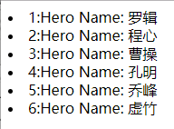

```django
<!DOCTYPE html>
<html lang="en">
<head>
    <meta charset="UTF-8">
    <title>Title</title>
</head>
<body>
    
        <li>{{ forloop.counter }}:{{ hero.show_name }}</li>
        
        nothing found
    
</body>
</html>
```

#### `if` tag

```django







```

Example:

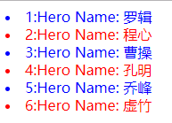

```django
<!DOCTYPE html>
<html lang="en">
<head>
    <meta charset="UTF-8">
    <title>Title</title>
</head>
<body>

    <!-- 这里运算用到了过滤器 | -->
    <!-- 过滤器的本质是为了支持运算 -->
    
        <li style="color: red">{{ forloop.counter }}:{{ hero.show_name }}</li>
    
        <li style="color: blue">{{ forloop.counter }}:{{ hero.show_name }}</li>
    

</body>
</html>
```

#### `comment` tag

```django

多行注释


<!-- html注释 -->

{# 这也是注释#}
```

#### `include` tag

```django
{ %include "foo/bar.html" % }
```

进行template的包含、继承；一般用继承，不用包含

#### `url` tag

反向解析

#### `csrf_token` tag

防跨站攻击

#### other tags

`and`, `or`, `block`, `extends`, `autoscape`

#### filter `|`

`{ { 变量|过滤器 }}`: 将变量用过滤器运算

## 反向解析

`<a href="/233">go to show</a>`希望`href`是根据`urls.py`的规则生成的，需要用到反向解析；避免每一次修改project中的`urls.py`造成大片的`href`要修改;

正向解析vs反向解析:
- 正向解析: 写了一个地址, 在`urls.py`中去用regex匹配url
- 反向解析: 根据`urls.py`生成一个地址

反向解析的方法:
- 视图：使用`reverse()`函数
- 模板：使用`url`模板标签

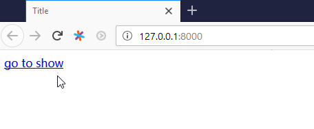

Example1: 传统做法

```python
# Project/urls.py
from django.contrib import admin
from django.urls import path, include

urlpatterns = [
    path('admin/', admin.site.urls),
    # path('', include('BookTest.urls')),
    # 随意修改path的内容，用的时候只需要修改浏览器地址栏的地址
    path('booktest/', include('BookTest.urls')),
]
```

```python
# app/urls.py
from django.urls import path, re_path
from BookTest import views

# 这里的app_name代替了django1.x中的namespace
app_name = 'book_test'

urlpatterns = [
    path('', views.index, name='index'),
    re_path(r'^(\d+)/(\d+)$', views.show, name='show')
]
```

```python
# views.py
from django.shortcuts import render
from BookTest.models import *


# Create your views here.
def index(request):
    hero_list = HeroInfo.objects.all()
    context = {'hero_list': hero_list}
    return render(request, 'index.html', context)


def show(request, *ids):
    context = {'ids': ids}
    return render(request, 'show.html', context)
```

```django
<!-- app/templates/index.html -->
<!DOCTYPE html>
<html lang="en">
<head>
    <meta charset="UTF-8">
    <title>Title</title>
</head>
<body>
    <!--只要是数字就可以匹配到urls中的show-->
    <!-- 并且可以传递参数 '233' '666' -->
    <a href="">go to show</a>
</body>
</html>
```

```django
<!-- app/templates/show.html -->
<!DOCTYPE html>
<html lang="en">
<head>
    <meta charset="UTF-8">
    <title>Title</title>
</head>
<body>
    
        <li>id={{ id }}</li>
    
</body>
</html>
```

Example2: 简化版(django2.x), 因为可以自动识别`include`中的app_name

```python
# app/urls.py
from django.urls import path, re_path
from BookTest import views

urlpatterns = [
    path('', views.index, name='index'),
    re_path(r'^(\d+)/(\d+)$', views.show, name='show')
]
```

```django
<!-- app/templates/show.html -->
<!DOCTYPE html>
<html lang="en">
<head>
    <meta charset="UTF-8">
    <title>Title</title>
</head>
<body>
    <!--简化的写法-->
    <a href="">go to show</a>
</body>
</html>
```

Example3: `views.py`使用`reverse()`

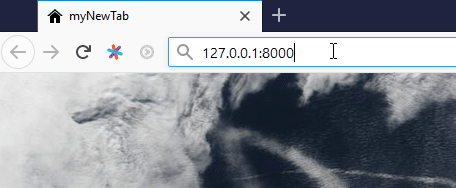

```python
# app/urls.py
from django.urls import path, re_path
from BookTest import views

urlpatterns = [
    path('', views.index),
    path('index/', views.index2, name='index2'),
    re_path(r'^(\d+)/(\d+)$', views.show, name='show')
]
```

```python
# views.py
from django.shortcuts import render, redirect
from BookTest.models import *
from django.urls import reverse


# Create your views here.
def index(request):
    return redirect(reverse('index2'))


def show(request, *ids):
    context = {'ids': ids}
    return render(request, 'show.html', context)


def index2(request):
    hero_list = HeroInfo.objects.all()
    context = {'hero_list': hero_list}
    return render(request, 'index.html', context)
```

## 模板继承

每个页面都有一些公用的部分(hearder, footer)

模板继承的办法:
- `block` tag: 在父模板预留坑，在子模板中填充
- `extends` tag: 继承，写在模板文件第一行

Example1:

```python
# app/urls.py
from django.urls import path, re_path
from BookTest import views

urlpatterns = [
    path('', views.index, name='index'),
    re_path(r'(\d+)', views.show, name='show'),
]
```

```python
# views.py
from django.shortcuts import render


# Create your views here.
def index(request):
    return render(request, 'index.html')


def show(request, id):
    context = {'id': id}
    return render(request, 'show.html', context)
```

```django
<!-- app/templates/base.html -->
<!DOCTYPE html>
<html lang="en">
<head>
    <meta charset="UTF-8">
    <title>Title</title>
    
</head>
<body>
    ===This is header===
    <hr>
        
            <h1>default string</h1>
        
    <hr>
    ===This is footer===
</body>
</html>
```

```django
<!-- app/templates/index.html -->

```

```django
<!-- app/templates/show.html -->



    This is show.html
    <br>
    id={{ id }}

```

一般情况都是三层的继承结构

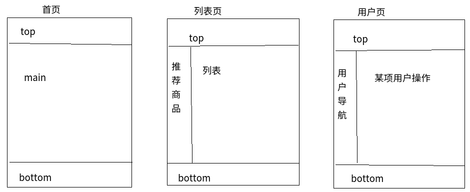

Example:

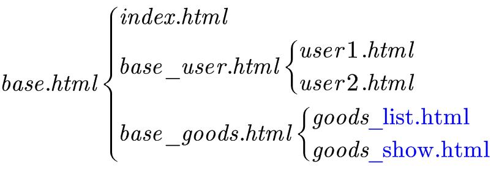

```python
# app/urls.py
from django.urls import path
from BookTest import views

urlpatterns = [
    path('', views.index, name='index'),
    path('usr1/', views.usr1, name='usr1'),
    path('usr2/', views.usr2, name='usr2'),
]
```

```python
# views.py
from django.shortcuts import render


# Create your views here.
def index(request):
    return render(request, 'index.html')


def usr1(request):
    context = {'userName': 'Grey'}
    return render(request, 'user1.html', context)


def usr2(request):
    return render(request, 'user2.html')
```

```django
<!-- app/templates/base.html -->
<!DOCTYPE html>
<html lang="en">
<head>
    <meta charset="UTF-8">
    <title>Title</title>
    
</head>
<body>
    ===This is header===
    <hr>
        
            <h1>default string</h1>
        
    <hr>
    ===This is footer===
</body>
</html>
```

```django
<!-- app/templates/base_user.html -->



    <table border="1">
    <tr>
        <td height="300">User<br>Navigation</td>
        <td></td>
    </tr>
    </table>

```

```django
<!-- app/templates/base_goods.html -->

```

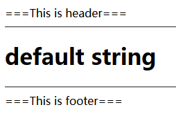

```django
<!-- app/templates/index.html -->

```

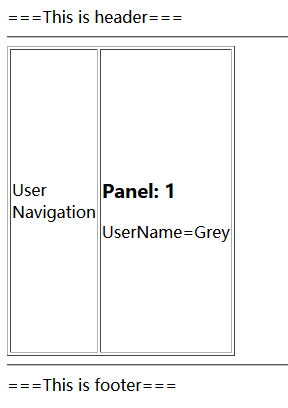

```django
<!-- app/templates/user1.html -->



    <h3>Panel: 1</h3>
    UserName={{ userName }}

```

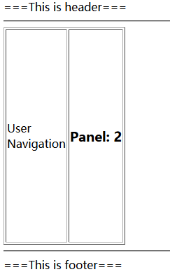

```django
<!-- app/templates/user2.html -->


{#跨越base_user来填坑#}
{#只要是没有填的坑，都是可以填的；#}
{#填坑的同时还可以挖坑#}

    <script>
        alert('hello')
    </script>



    <h3>Panel: 2</h3>

```

## HTML escaping

html转义，就是将包含的html标签输出，而不被解释执行，原因是当显示用户提交字符串时，可能包含一些攻击性的代码，如js脚本

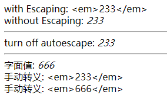

```python
# views.py
from django.shortcuts import render

def html_test(request):
    context = {'data': '<em>233</em>'}
    return render(request, 'htmlTest.html', context)
```

```django
<!-- app/templates/htmlTest.html -->
<!DOCTYPE html>
<html lang="en">
<head>
    <meta charset="UTF-8">
    <title>Title</title>
</head>
<body>
    {#从views传入的变量默认是转义的#}
    {#with Escaping: {{ data|escape }}#}
    {#与下面等价#}
    with Escaping: {{ data }}
    <br>
    without Escaping: {{ data|safe }}
    <hr>
    
        turn off autoescape: {{ data }}
    
    <hr>

    {#  字面值，默认不转义  #}
    {#  data2不存在，那么用default的值;#}
    字面值: {{ data2|default:'<em>666</em>' }}
    <br>
    {#  手动转义 #}
    {#  data存在， 用传入的值  #}
    手动转义: {{ data|default:"&lt;em&gt;666&lt;/em&gt;" }}
    {#  data2不存在， 用default的值  #}
    手动转义: {{ data2|default:"&lt;em&gt;666&lt;/em&gt;" }}
</body>
</html>
```

## CSRF

Cross Site Request Forgery: 跨站请求伪造

某些网站利用链接、表单按钮或者JavaScript，它们会利用登录过的用户在浏览器中的认证信息试图在你的网站上完成某些操作，这就是跨站攻击:[detail](https://blog.csdn.net/qq_32657025/article/details/79476452)

Example: 制造CSRF

```python
# app/urls.py
from django.urls import path
from BookTest import views

urlpatterns = [
    path('csrf1/', views.csrf1, name='csrf1'),
    path('csrf2/', views.csrf2, name='csrf2'),
]
```

```python
# views.py
from django.shortcuts import render
from django.http import HttpResponse


# Create your views here.
def csrf1(request):
    # 通过csrf1.html这个页面提交form
    return render(request, 'csrf1.html')


def csrf2(request):
    # 接收请求过来的form
    uname = request.POST['uname']
    str1 = f'This is csrf2: {uname}'
    return HttpResponse(str1)
```

```django
<!-- app/templates/csrf1.html -->
<!DOCTYPE html>
<html lang="en">
<head>
    <meta charset="UTF-8">
    <title>Title</title>
</head>
<body>
    <!-- 如果method='get', 就没有csrf的事情了-->
    <form action="/csrf2/" method="post">
        <input type="text" name="uname">
        <input type="submit" value="提交">
    </form>
</body>
</html>
```

```python
# setting.py
# 之前的做法是注释掉'django.middleware.csrf.CsrfViewMiddleware',
# 也就是关掉了csrf防御，可以随意跨域请求
ALLOWED_HOSTS = ['10.128.160.66']

MIDDLEWARE = [
    'django.middleware.security.SecurityMiddleware',
    'django.contrib.sessions.middleware.SessionMiddleware',
    'django.middleware.common.CommonMiddleware',
    # 'django.middleware.csrf.CsrfViewMiddleware',
    'django.contrib.auth.middleware.AuthenticationMiddleware',
    'django.contrib.messages.middleware.MessageMiddleware',
    'django.middleware.clickjacking.XFrameOptionsMiddleware',
]
```

然后`python manage.py runserver 10.128.160.66:8000`; 本地或者远程的浏览器输入`http://10.128.160.66:8000/csrf1/`可以实现访问;

然后复制出`csrf1.html`, 并修改为`a.html`

```html
<!-- a.html -->
<!DOCTYPE html>
<html lang="en">
<head>
    <meta charset="UTF-8">
    <title>Title</title>
</head>
<body>
    <form action="http://10.128.160.66:8000/csrf2/" method="post">
        <input type="text" name="uname">
        <input type="submit" value="提交">
    </form>
</body>
</html>
```

将修改后的`a.html`放到自己的服务器上(假设前文的是别人的服务器); 并访问`http://localhost:5500/a.html`, 照样可以在`http://localhost:5500/a.html`上面进行各种请求，比如疯狂往数据库灌入数据;

所以为了防止被`CSRF`， 不能注释`'django.middleware.csrf.CsrfViewMiddleware'`, 并且需要为`csrf1.html`添加``

```django
<!-- app/templates/csrf1.html -->
<!DOCTYPE html>
<html lang="en">
<head>
    <meta charset="UTF-8">
    <title>Title</title>
</head>
<body>
    <form action="/csrf2/" method="post">
        
        <input type="text" name="uname">
        <input type="submit" value="提交">
    </form>
</body>
</html>
```

``本质是添加一个`<input type="hidden" name="csrfmiddlewaretoken" value="5gVPbvw1LdajDxPyTJeSdD482eFEPZQyGB4ZgCsERh4aOGt1VF8KqQtAFk3RKzhu">`, 可以用F12查看;

django的CSRF防御原理: 
>启用`'django.middleware.csrf.CsrfViewMiddleware'`就会向cookie写入`csrftoken: xxxxx`，而``只是添加一个`<input type='hidden'>`;
即便`a.html`增加了`<input type="hidden" name="csrfmiddlewaretoken" value="5gVP....">`, 因为没有写入过cookie，所以被拒绝;

### `csrf_exempt`

如果某些视图不需要保护，可以使用装饰器`csrf_exempt`，模板中也不需要写标签，修改csrf2的视图如下

```python
# views.py
@csrf_exempt
def csrf2(request):
    # 接收请求过来的form
    uname = request.POST['uname']
    str1 = f'This is csrf2: {uname}'
    return HttpResponse(str1)
```

django默认的csrf防御效果不是很好，最好CSRf防御的办法还是用**验证码**

## verify code

一般用的第三方api(比如[captcha](http://django-simple-captcha.readthedocs.io/en/latest/)), 这里只是为了演示

安装[Pillow](https://pillow.readthedocs.io/en/5.1.x/), `pip install pillow`

Example: 验证码

核心思路：在服务器中存一个信息(session), 然后与用户`POST`的进行比较

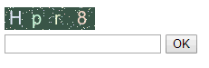

```python
# app/urls.py
from django.urls import path
from BookTest import views

urlpatterns = [
    path('verifycode/', views.verify_code, name='verify_code'),
    path('verifytest/', views.verify_test, name='verify_test'),
    path('verifyres/', views.verify_result, name='verify_result'),
]
```

```python
# views.py
from django.shortcuts import render
from django.http import HttpResponse


def verify_code(request):
    import random
    from io import BytesIO
    # pip install pillow, 绘图
    from PIL import Image, ImageDraw, ImageFont
    # pip install rstr, 根据regex随机生成string
    from rstr import xeger

    # width, height
    width, height = 100, 25
    # create bg color, 背景色深一点，所以50-100
    bg_color = (random.randrange(50, 100), random.randrange(50, 100), random.randrange(50, 100))
    # create画布+画笔
    img = Image.new('RGB', (width, height), bg_color)
    img_draw = ImageDraw.Draw(img)
    # windows下面自动去C:/windows/font中去找，linux需要指定路径
    img_font = ImageFont.truetype("arial.ttf", 20)

    # draw text
    text_temp = ''
    for i in range(4):
        character = xeger(r'\w')
        text_temp += character
        img_draw.text(xy=(i * 25 + 5, 0), text=character,
                      fill=(random.randrange(200, 256), random.randrange(200, 256), random.randrange(200, 256)),
                      font=img_font)
    # code保存到session；存在cookie就会有安全性的问题，所以存到服务器端的session(用navicat查看)
    # 注意区别session, sessionStorage(用F12查看)
    request.session['pic_code'] = text_temp

    # draw points
    for i in range(100):
        img_draw.point(xy=(random.randrange(0, width + 1), random.randrange(0, height + 1)),
                       fill=(random.randrange(200, 256), random.randrange(200, 256), random.randrange(200, 256)), )

    # 保存到内存流中
    buf = BytesIO()
    # 释放画笔
    del img_draw
    img.save(buf, 'png')
    # MIME type是image/png; 浏览器会对应地进行渲染
    return HttpResponse(buf.getvalue(), 'image/png')


def verify_test(request):
    return render(request, 'verify.html')


def verify_result(request):
    text_code = request.POST['text_code']
    pic_code = request.session['pic_code']
    if text_code.upper() == pic_code.upper():
        return HttpResponse('OK')
    else:
        return HttpResponse('NO')
```

```django
<!-- app/templates/verify.html -->
<!DOCTYPE html>
<html lang="en">
<head>
    <meta charset="UTF-8">
    <title>Title</title>
</head>
<body>
<form action="/verifyres/" method="post">
    
    
    <br>
    <input type="text" name="text_code">
    <input type="submit" value="OK">
</form>
</body>
</html>
```

Example: 看不清

其中的JQuery也可以使用本地的,需要在`setting.py`中修改`STATIC_URL = '/static/'`并新建目录，放js, css等等到里面，然后`<script src="/static/jquery-1.12.4.min.js"></script>`

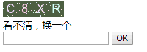

```django
<!-- app/templates/verify.html -->
<!DOCTYPE html>
<html lang="en">
<head>
    <meta charset="UTF-8">
    <title>Title</title>
    <script src="https://code.jquery.com/jquery-1.12.4.min.js"></script>
    <script>
        $(function () {
            $('#change_code').css('cursor', 'pointer').click(function () {
                $('#verify_img').attr('src', $('#verify_img').attr('src') + 1)
            });
        });
    </script>
</head>
<body>
<form action="/verifyres/" method="post">
    
    
    <br>
    <span id="change_code">看不清，换一个</span>
    <br>
    <input type="text" name="text_code">
    <input type="submit" value="OK">
</form>
</body>
</html>
```