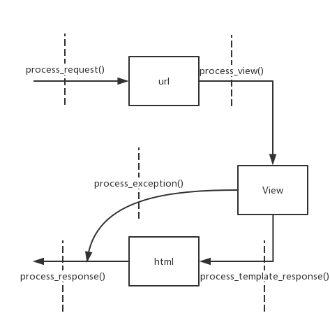

# Django Advanced

<!-- TOC -->

- [Django Advanced](#django-advanced)
    - [STATIC FILES](#static-files)
    - [middleware](#middleware)
    - [upload picture](#upload-picture)
    - [`/admin` site](#admin-site)
    - [paginator(分页)](#paginator%E5%88%86%E9%A1%B5)
    - [JQuery with Ajax](#jquery-with-ajax)

<!-- /TOC -->


## STATIC FILES

项目中的CSS、图片、js都是静态文件; 静态文件不用`urls.py`中进行regex匹配，直接加载, 根据就不会进入django;

Example: 放在app目录下，方便移植

```bash
# path
TempProject/
    BookTest/
        migrations/
        # static放在app的目录下
        static/
            jquery-1.12.4.min.js
        tempaltes/
            verify.html
        .....
    TempProject/
    manage.py
```

```django
<!-- app/templates/verify.html -->
<!DOCTYPE html>
<html lang="en">
<head>
    <meta charset="UTF-8">
    <title>Title</title>
    <!-- 使用软编码, 那么可以随便写setting.py里面的STATIC_URL的值 -->
    <!-- STATIC_URL='/abc/', 那么最终得到src="/abc/jquery-1.12.4.min.js" -->
    <!-- 也就是说/abc/是一个虚拟的地址，映射到物理地址app/static/上面，可以用了隐藏物理磁盘 -->
    
    <script src=""></script>
    <!-- 使用硬编码 -->
    <!-- <script src="/static/jquery-1.12.4.min.js"></script> -->

    <script>
        $(function () {
            $('#change_code').css('cursor', 'pointer').click(function () {
                $('#verify_img').attr('src', $('#verify_img').attr('src') + 1)
            });
        });
    </script>
</head>
<body>
<form action="/verifyres/" method="post">
    
    
    <br>
    <span id="change_code">看不清，换一个</span>
    <br>
    <input type="text" name="text_code">
    <input type="submit" value="OK">
</form>
</body>
</html>
```

Example: 放在project目录下

```python
# setting.py
# 逻辑路径，虚拟的
STATIC_URL = '/static/'
# 需要在project目录下新建static
# 磁盘路径
STATICFILES_DIRS = [
    os.path.join(BASE_DIR, 'static'),
]
# 逻辑路径和磁盘路径可以不一样，一般让它们一样都是static
```

浏览器第一次请求一个链接之后返回html, 如果返回的html有其他的link(比如image, js, css), 会向服务器发所有链接的请求;

## middleware

中间件: 是一个轻量级、底层的插件系统，可以介入Django的请求和响应处理过程，修改Django的输入或输出; 类似面向切面编程(Aspect Oriented Programming(AOP))

AOP: 定义了处理的完整过程，又提供了干预中间过程的方法，就像做切面一样。Django中提供的就是middleware(**本质是一个python类**), 其他MVC中提供的比如IoC/DI



custom middleware: 将自己的middleware class添加到`MIDDLEWARE`中;

```python
# app/MyMiddleware.py
from django.http import HttpResponse

# 参加了middleware document
class MyException:
    def __init__(self, get_response):
        self.get_response = get_response

    def __call__(self, request):
        response = self.get_response(request)
        return response

    def process_exception(self, request, exception):
        # 用类的对象去掉这个方法
        return HttpResponse(exception)
    def process_request(self, request):
        pass
    def process_view(self, request, view_func, view_args, view_kwargs):
        pass
    def process_templates_response(self, request, response):
        pass
    def process_response(self, request, response):
        pass
```

其中`__init__`只执行一次, view出现exception时执行`process_exception()`(404错误都没有到view, 所以`process_exception()`处理不了404错误), 其他方法每次都会执行;

然后注册到`MIDDLEWARE`中:

```python
# setting.py
MIDDLEWARE = [
    'django.middleware.security.SecurityMiddleware',
    'django.contrib.sessions.middleware.SessionMiddleware',
    'django.middleware.common.CommonMiddleware',
    'django.middleware.csrf.CsrfViewMiddleware',
    'django.contrib.auth.middleware.AuthenticationMiddleware',
    'django.contrib.messages.middleware.MessageMiddleware',
    'django.middleware.clickjacking.XFrameOptionsMiddleware',
    'BookTest.MyMiddleware.MyException'
]
```

```python
# views.py
def my_exp(request):
    # 这个肯定出exception
    num = int('abc')
    return HttpResponse('hello')
```

```python
# app/urls.py
from django.urls import path
from BookTest import views

urlpatterns = [
    path('myexp/', views.my_exp),
]
```

## upload picture

上传图片:
- 在`form`中上传图片
- 在`/admin`上传图片，需要在models里面添加`pic=models.ImageField(upload_to='dir/')`, 并且需要`pip install pillow`

当Django在处理文件上传的时候，文件数据被保存在`request.FILES`

Example: `form`上传

```python
# app/urls.py
from django.urls import path
from BookTest import views

urlpatterns = [
    path('uploadpic/', views.upload_pic),
    path('uploadHandle/', views.upload_handle),
]
```

```python
# veiws.py
from django.shortcuts import render
from django.http import HttpResponse

def upload_pic(request):
    return render(request, 'uploadpic.html')


def upload_handle(request):
    import os
    if request.method == 'POST':
        MEDIA_DIR = os.path.join(os.path.dirname(os.path.abspath(__file__)), 'static/media')
        # 用POST传的，用FILES来接收
        pic = request.FILES['pic']
        file_name = f'{MEDIA_DIR}/{pic.name}'
        # 写入静态文件目录static/media
        with open(file_name, 'wb') as my_pic:
            for c in pic.chunks():
                my_pic.write(c)
        return HttpResponse(f'')
    else:
        return HttpResponse('failed')
```

```django
<!-- app/templates/uploadpic.html -->
<!DOCTYPE html>
<html lang="en">
<head>
    <meta charset="UTF-8">
    <title>Title</title>
</head>
<body>
<!-- 必须是POST, 写enctype -->
<form action="/uploadHandle/" method="post" enctype="multipart/form-data">
    
    <input type="file" name="pic">
    <br>
    <input type="submit" value="upload">
</form>
</body>
</html>
```

## `/admin` site

`admin`一定有一个templates(html)等等之类的东西，根据`setting.py`, 可以找到`admin`这个app的目录`django_venv\Lib\site-packages\django\contrib\admin`

```python
# setting.py
INSTALLED_APPS = [
    'django.contrib.admin',
]
```

如果觉得默认的`admin`app, 不好看，可以参照上面的目录，diy各种html;

微调的方法: 将上面目录里面的html复制到`project/admin/`下, 自己修改修改html; 因为优先从project的目录去找，找不到才会到`django_venv\Lib\site-packages\django\contrib\admin`里面去找;

总结: 找templates的优先级: app目录>project目录>python package目录

## paginator(分页)

管理paginator的class在`django_venv\Lib\site-packages\django\core\paginator.py`中

两个class:
- `Paginator`对象
- `Page`对象


```python
# app/urls.py
from django.urls import re_path
from BookTest import views

urlpatterns = [
    re_path(r'herolist/(\d*)', views.hero_list)
]
```

```python
# views.py
from django.shortcuts import render
from .models import *
from django.core.paginator import *


def hero_list(requtest, page_index):
    if page_index == '':
        page_index = '1'
    h_list = HeroInfo.objects.all()
    h_paginator = Paginator(h_list, 5)
    page = h_paginator.page(eval(page_index))
    context = {'page': page}
    return render(requtest, 'herolist.html', context)
```

```django
<!-- app/templates/herolist.html -->
<!DOCTYPE html>
<html lang="en">
<head>
    <meta charset="UTF-8">
    <title>Title</title>
</head>
<body>
<ul>
    
        <li>{{ hero.hero_name }}</li>
    
</ul>
<hr>

    {# 当前链接不显示下划线#}
    {# == 前后必须要有空格   #}
    
        {{ index }}
    
        <a href="/herolist/{{ index }}">{{ index }}</a>
    

</body>
</html>
```

## JQuery with Ajax

主要用到jquery中的[ajax](http://hemin.cn/jq/)部分;

常用`$.get(url,[data],[callback],[type])`, `$.post()`
- url:除去域名的部分的url
- data:待发送 Key/value 参数。
- callback:views处理返回response之后, 会调用的函数
- type:返回内容格式，xml, html, script, json, text, _default

Example: 只显示省份

`http://127.0.0.1:8000/areatest/`和`http://127.0.0.1:8000/area/0/`来测试


```python
# setting.py
DATABASES = {
    'default': {
        'ENGINE': 'django.db.backends.mysql',
        'NAME': 'areadb',
        'USER': 'root',
        'PASSWORD': '13810455459',
        'HOST': '222.29.69.149',
        'PORT': '3306',
    }
}
```

```python
# models.py
from django.db import models


# Create your models here.
class AreaInfo(models.Model):
    name = models.CharField(max_length=20)
    parent_code = models.ForeignKey('self', null=True, blank=True, on_delete=models.CASCADE)
```

```python
# app/urls.py
from django.urls import path, re_path
from . import views

urlpatterns = [
    path('areatest/', views.area_test),
    re_path(r'area/(\d+)/', views.query_province)
]
```

```python
# views.py
from django.shortcuts import render
from .models import *


# Create your views here.
def area_test(requtest):
    # 这个只是显示三个下拉框
    return render(requtest, 'area.html')


def query_province(request, id):
    # 只需要返回json数据，不需要返回渲染的template; 然后jquery将数据呈现出来
    # JsonResponse是HttpResponse的子类
    from django.http import JsonResponse

    if id == '0':
        # 0表示是省份, values()返回一个list, 这个list里面全部都是dict
        # 这个会返回所有的field
        # data = AreaInfo.objects.filter(parent_code_id__isnull=True).values()
        data = AreaInfo.objects.filter(parent_code_id__isnull=True).values('id', 'name')
        # <QuerySet [{'id': 130000, 'name': '河北省'}, {'id': 140000, 'name': '山西省'},...]>要转换为list
    else:
        data = [{}]
    return JsonResponse(list(data), safe=False)
```

```django
<!-- app/templates/area.html -->
<!DOCTYPE html>
<html lang="en">
<head>
    <meta charset="UTF-8">
    <title>Title</title>
    
    <script src=""></script>
    <script>
        $(function () {
            //加载省份的时候，当html加载完毕之后直接ajax加载，加载市、区的时候才会根据前面的进行加载
            // 0代表查省份, 因为已经表示了省份，所以没有必要用第二个参数
            province = $('#province_select')
            $.get('/area/0/', function (data) {
                // 页面加载完毕，发请求/area/0/去查询，获得json, 然后进行下面的处理
                //接受的data就是[{},{},{},{},]
                // 区分$('li').each(function...)与$.each(object, function...)
                $.each(data, function (index, item) {
                    {#本质是替换 <option value="">选择省</option> 其中的value和中间的文本#}
                    province.append('<option value="' + item['id'] + '">' + item['name'] + '</option>')
                });
            });
        });
    </script>
</head>
<body>
<select id="province_select">
    <option value="">选择省</option>
</select>
<select id="city_select">
    <option value="">选择市</option>
</select>
<select id="district_select">
    <option value="">选择区</option>
</select>
</body>
</html>
```

网页调试:
- firefox: F12, 在debugger里面选择要调试的html, 然后断点; 刷新页面;如果要查看变量, 用console页面的`>>variable`
- chrome: F12, 在source里面选择要调试的html, 然后断点; 刷新页面;, 用console页面的`>>variable`

Example: 完善优化结果


```python
# app/urls.py
from django.urls import path, re_path
from . import views

urlpatterns = [
    # 这里可以进一步优化，为了明显区分不同的行政区划，不做优化了
    path('areatest/', views.area_test),
    re_path(r'province/(\d+)/', views.query_area),
    re_path(r'city/(\d+)/', views.query_area),
    re_path(r'district/(\d+)/', views.query_area),
    re_path(r'governDistrict/(\d+)/', views.query_area),
]
```

```python
# views.py
from django.shortcuts import render
from .models import *
from django.http import JsonResponse


# Create your views here.
def area_test(requtest):
    return render(requtest, 'area.html')


def query_area(request, parent_id):
    # 只需要返回json数据，不需要返回渲染的template; 然后jquery将数据呈现出来
    # JsonResponse是HttpResponse的子类
    if parent_id == '0':
        # 0表示是省份, values()返回一个list, 这个list里面全部都是dict
        # 这个会返回所有的field
        # data = AreaInfo.objects.filter(parent_code_id__isnull=True).values()
        data = AreaInfo.objects.filter(parent_code_id__isnull=True).values('id', 'name')
        # <QuerySet [{'id': 130000, 'name': '河北省'}, {'id': 140000, 'name': '山西省'},...]>要转换为list
    else:
        # 注意区别parent_code__id与parent_code_id
        # 双下划线: 表示这个属性对象的id属性; 单下划线: 表示该表中的一个field; 建议用单下划线
        data = AreaInfo.objects.filter(parent_code_id=parent_id).values('id', 'name')
        # 因为市、区几乎一样，不用重新写了
    return JsonResponse(list(data), safe=False)
```

```django
<!-- app/templates/area.html -->
<!DOCTYPE html>
<html lang="en">
<head>
    <meta charset="UTF-8">
    <title>Title</title>
    
    <script src=""></script>
    <script>
        $(function () {
            //加载省份的时候，当html加载完毕之后直接ajax加载，加载市、区的时候才会根据前面的进行加载
            // 0代表查省份, 因为已经表示了省份，所以没有必要用第二个参数
            province = $('#province_select')
            city = $('#city_select')
            district = $('#district_select')

            $.get('/province/0/', function (data) {
                // 页面加载完毕，发请求/area/0/去查询，获得json, 然后进行下面的处理
                //接受的data就是[{},{},{},{},]
                // 区分$('li').each(function...)与$.each(object, function...)

                $.each(data, function (index, item) {
                    {#本质是替换 <option value="">选择省</option> 其中的value和中间的文本#}
                    {#province.append('<option value="' + item['id'] + '">' + item['name'] + '</option>')#}
                    {#DTL中dict也可以用的点号来查询#}
                    province.append('<option value="' + item.id + '">' + item.name + '</option>')
                });
            });

            //query city, 给province的select一个event
            province.change(function () {
                // select选中后的value就是选中的option的value: $(this).val()
                $.get('/city/' + $(this).val(), function (data) {
                    city.empty().append('<option value="">选择市</option>')
                    district.empty().append('<option value="">选择区</option>')
                    $.each(data, function (index, item) {
                        city.append('<option value="' + item.id + '">' + item.name + '</option>')
                    });
                });
            });

            //query district, 给city的select一个event
            city.change(function () {
                $.get('/district/' + $(this).val(), function (data) {
                    district.empty().append('<option value="">选择区</option>')
                    $.each(data, function (index, item) {
                        if (item.name === '市辖区') {
                            $.get('/governDistrict/' + item.id, function (data) {
                                $.each(data, function (index, item) {
                                    district.append('<option value="' + item.id + '">' + item.name + '</option>')
                                })
                            })
                        } else {
                            district.append('<option value="' + item.id + '">' + item.name + '</option>')
                        }
                    })
                });
            });
        });
    </script>
</head>
<body>
<select id="province_select">
    <option value="">选择省</option>
</select>
<select id="city_select">
    <option value="">选择市</option>
</select>
<select id="district_select">
    <option value="">选择区</option>
</select>
</body>
</html>
```