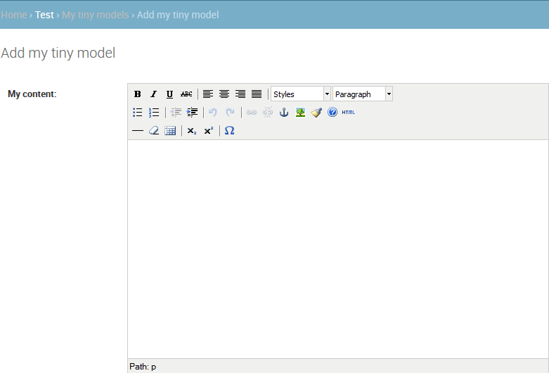
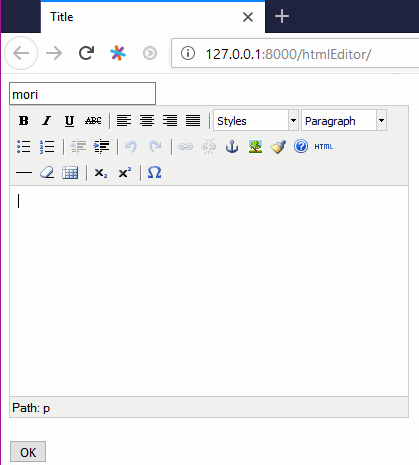
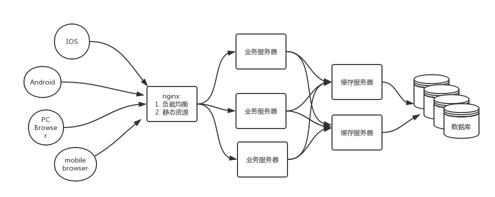
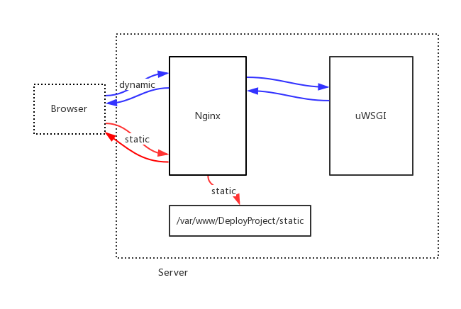

# Django 3rd Extends

- [Django 3rd Extends](#django-3rd-extends)
  - [RichText Editor](#richtext-editor)
    - [自定义Form使用上面的Richtext Editor](#%e8%87%aa%e5%ae%9a%e4%b9%89form%e4%bd%bf%e7%94%a8%e4%b8%8a%e9%9d%a2%e7%9a%84richtext-editor)
  - [cache](#cache)
    - [cache setting](#cache-setting)
    - [cache to redis](#cache-to-redis)
      - [缓存view](#%e7%bc%93%e5%ad%98view)
      - [缓存template或者template的block](#%e7%bc%93%e5%ad%98template%e6%88%96%e8%80%85template%e7%9a%84block)
      - [缓存数据](#%e7%bc%93%e5%ad%98%e6%95%b0%e6%8d%ae)
  - [full search(全文检索)](#full-search%e5%85%a8%e6%96%87%e6%a3%80%e7%b4%a2)
  - [celery](#celery)
  - [deployment(部署)](#deployment%e9%83%a8%e7%bd%b2)
    - [备份安装的package:](#%e5%a4%87%e4%bb%bd%e5%ae%89%e8%a3%85%e7%9a%84package)
    - [WSGI](#wsgi)
    - [uWSGI](#uwsgi)
    - [nginx](#nginx)
      - [use nginx](#use-nginx)

## RichText Editor

`pip install django-tinymce`, 所见即所得的添加有格式的数据;本质就是存了一个html

```python
# setting.py中添加app
INSTALLED_APPS = [
    'tinymce',
]

# 添加默认设置, 一般是给admin用的
TINYMCE_DEFAULT_CONFIG = {
    'theme': 'advanced',
    'width': 600,
    'height': 400,
}
```

```python
# project/urls.py
urlpatterns = [
    path('admin/', admin.site.urls),
    path('tinymce/', include('tinymce.urls')),
    path('', include('Test.urls')),
]
```

```python
# models.py
from django.db import models
from tinymce.models import HTMLField


# Create your models here.
class MyTinyModel(models.Model):
    my_content = HTMLField()
```

```python
# admin.py
from django.contrib import admin
from .models import *

# Register your models here.
admin.site.register(MyTinyModel)
```

然后在`127.0.0.1:8000/admin`登录添加数据就可以看到;



### 自定义Form使用上面的Richtext Editor



```python
# app/urls.py
from django.urls import path
from . import views

urlpatterns = [
    path('htmlEditor/', views.html_editor),
    path('htmlHandle/', views.html_handle),
]
```

```python
# views.py
from django.shortcuts import render
from .models import *


# Create your views here.
def html_editor(request):
    return render(request, 'htmlEditor.html')


def html_handle(request):
    htm_content = request.POST['my_content']
    # 修改数据库数据
    # test1 = MyTinyModel.objects.get(pk=1)
    # test1.my_content = htm_content
    # test1.save()

    # 往数据库添加数据, 或者麻烦一点，自定义构造函数
    # 具体参见前面的笔记
    text2 = MyTinyModel()
    text2.my_content = htm_content
    text2.save()

    context = {'content': htm_content}
    return render(request, 'htmlShow.html', context)
```

```django
<!-- app/templates/htmlEditor.html -->
<!DOCTYPE html>
<html lang="en">
<head>
    <meta charset="UTF-8">
    <title>Title</title>
    
    {#默认回去tiny_mce的安装目录找#}
    <script src=''></script>
    <script>
        tinyMCE.init({
            'mode': 'textareas',
            'theme': 'advanced',
            'width': 400,
            'height': 300
        });
    </script>
</head>
<body>
<form method="post" action="/htmlHandle/">
    
    <input type="text" name="my_name">
    <br>
    {#本质是让textarea外观其变成了富文本编辑器#}
    {#但是提交的时候还是按照textarea的key/value来提交的#}
    <textarea name="my_content"></textarea>
    <br>
    <input type="submit" value="OK">
</form>
</body>
</html>
```

```django
<!-- app/templates/htmlHandle.html -->
<!DOCTYPE html>
<html lang="en">
<head>
    <meta charset="UTF-8">
    <title>Title</title>
</head>
<body>
{{ content|safe }}
</body>
</html>
```

## cache

Django自带了一个健壮的缓存系统来保存动态页面，避免对于每次请求都重新计算; 节省用户等待时间，节省服务器的计算;

Django提供了不同级别的缓存粒度：
- 可以缓存view
- 可以缓存templates的某个片段, 甚至扩大到某个template
- 可以缓存某个数据

### cache setting

通过`setting.py`中的`CACHES`可以设置缓存到:
- 数据库中(比如redis)
- 文件系统中
- 内存中

```python
# setting.py, 这是默认的缓存方式
CACHES={
    'default': {
        'BACKEND': 'django.core.cache.backends.locmem.LocMemCache',
        'TIMEOUT': 60,
    }
}
```

### cache to redis

`pip install django-redis-cache`

可以将cache存到redis中，默认采用`1`数据库(redis有16个数据库，默认用的是`0`)

其中`TIMEOUT`默认值是300s, `TIMEOUT=None`表示永不过期; `TIMEOUT=0`表示立即失效;

```python
# setting.py增加
CACHES = {
    "default": {
        "BACKEND": "redis_cache.cache.RedisCache",
        "LOCATION": "222.29.69.242:6379",
        'TIMEOUT': 600,
    },
}
```

```bash
# redis的操作
redis-cli
127.0.0.1:6379> select 1
127.0.0.1:6379> keys *
127.0.0.1:6379> get key1
```


```python
# app/urls.py
from django.urls import path
from . import views

urlpatterns = [
    path('cacheTest/', views.cache_test)
]
```

#### 缓存view

view缓存与URL无关，如果多个URL指向同一视图，每个URL将会分别缓存

```python
# views.py
from django.http import HttpResponse
from django.views.decorators.cache import cache_page


@cache_page(timeout=600)
def cache_test(request):
    return HttpResponse('hello! worlds=')
```

然后可以在`http://127.0.0.1:8000/cacheTest/`测试; 同时在redis中查看

```bash
127.0.0.1:6379[1]> keys *
1) ":1:views.decorators.cache.cache_page..GET.6595cec83fb0fa45c18ef60cce85176e.d41d8cd98f00b204e9800998ecf8427e.en-us.UTC"
2) ":1:views.decorators.cache.cache_header..6595cec83fb0fa45c18ef60cce85176e.en-us.UTC"
127.0.0.1:6379[1]> get 2
(nil)
127.0.0.1:6379[1]> get ":1:views.decorators.cache.cache_header..6595cec83fb0fa45c18ef60cce85176e.en-us.UTC"
"\x80\x04\x95\x03\x00\x00\x00\x00\x00\x00\x00]\x94."
127.0.0.1:6379[1]> get ":1:views.decorators.cache.cache_page..GET.6595cec83fb0fa45c18ef60cce85176e.d41d8cd98f00b204e9800998ecf8427e.en-us.UTC"
"\x80\x04\x95w\x01\x00\x00\x00\x00\x00\x00\x8c\x14django.http.response\x94\x8c\x0cHttpResponse\x94\x93\x94)\x81\x94}\x94(\x8c\b_headers\x94}\x94(\x8c\x0ccontent-type\x94\x8c\x0cContent-Type\x94\x8c\x18text/html; charset=utf-8\x94\x86\x94\x8c\aexpires\x94\x8c\aExpires\x94\x8c\x1dFri, 29 Jun 2018 04:01:24 GMT\x94\x86\x94\x8c\rcache-control\x94\x8c\rCache-Control\x94\x8c\x0bmax-age=600\x94\x86\x94u\x8c\x11_closable_objects\x94]\x94\x8c\x0e_handler_class\x94N\x8c\acookies\x94\x8c\x0chttp.cookies\x94\x8c\x0cSimpleCookie\x94\x93\x94)\x81\x94\x8c\x06closed\x94\x89\x8c\x0e_reason_phrase\x94N\x8c\b_charset\x94N\x8c\n_container\x94]\x94C\x06hello!\x94aub."
```

即便是将`return HttpResponse('hello!')`修改为`return HttpResponse('hello! world')`, 显示的仍然是`hello!`需要过600s才会变成`hello!world`

一般情况下**首页**需要缓存整个view

#### 缓存template或者template的block

比如列表页: 推荐商品缓存， 分页商品不缓存; 或者header, footer

```bash
# redis清空
flushall
# 或者del key1
```

```python
# views.py
from django.shortcuts import render


def cache_test(request):
    return render(request, 'cacheTest.html')
```

```django
<!-- app/templates/cacheTest.html -->


<!DOCTYPE html>
<html lang="en">
<head>
    <meta charset="UTF-8">
    <title>Title</title>
</head>
<body>

    <!--既可以缓存dtl,也可以缓存html-->
    <h3>This is cached block</h3>

</body>
</html>
```

```bash
# redis结果
127.0.0.1:6379[1]> keys *
1) ":1:template.cache.cache_name.d41d8cd98f00b204e9800998ecf8427e"
127.0.0.1:6379[1]> get ":1:template.cache.cache_name.d41d8cd98f00b204e9800998ecf8427e"
"\x80\x04\x95\x84\x00\x00\x00\x00\x00\x00\x00\x8c\x17django.utils.safestring\x94\x8c\bSafeText\x94\x93\x94\x8cU\n    <!--\xe6\x97\xa2\xe5\x8f\xaf\xe4\xbb\xa5\xe7\xbc\x93\xe5\xad\x98dtl,\xe4\xb9\x9f\xe5\x8f\xaf\xe4\xbb\xa5\xe7\xbc\x93\xe5\xad\x98html-->\n    <h3>This is cached block</h3>\n\x94\x85\x94\x81\x94."
```

#### 缓存数据

```bash
# 常用api
cache.set('key', 'value', timeout)
cache.get('key')
cache.delete('key')
cache.clear()
```

```python
# views.py
from django.http import HttpResponse
from django.core.cache import cache


def cache_test(request):
    # 10min
    cache.set('key1', 'value1', 600)
    cache_data = cache.get('key1')
    return HttpResponse(cache_data)
```


```bash
# redis中的数据
127.0.0.1:6379[1]> keys *
1) ":1:key1"
127.0.0.1:6379[1]> get ":1:key1"
"\x80\x04\x95\n\x00\x00\x00\x00\x00\x00\x00\x8c\x06value1\x94."
```

## full search(全文检索)

全文检索不同于特定字段的模糊查询，使用全文检索的效率更高，并且能够对于中文进行分词处理

英文只要是有空格就是一个词语, 而中文不好判断，需要分词(当然也就需要分词的包, 比如`jieba`中文分词包);

`haystack`：django的一个包,属于一种全文检索的框架,支持`whoosh,solr,Xapian,Elasticsearc`四种全文检索引擎; django无法和这4个搜索引擎交互，需要通过`haystack`，最终把结果返回来；

用`haystack`+`whoosh`实现, `whoosh`是纯python写的, 对于小型的站点，whoosh已经足够使用


```bash
# in virtual env
pip install django-haystack
pip install whoosh
pip install jieba
```

```python
# \site-packages\haystack\backends下面增加ChineseAnalyzer.py
# 这个来自jieba的tutorial
import jieba
from whoosh.analysis import Tokenizer, Token


class ChineseTokenizer(Tokenizer):
    def __call__(self, value, positions=False, chars=False,
                 keeporiginal=False, removestops=True,
                 start_pos=0, start_char=0, mode='', **kwargs):
        t = Token(positions, chars, removestops=removestops, mode=mode,
                  **kwargs)
        seglist = jieba.cut(value, cut_all=True)
        for w in seglist:
            t.original = t.text = w
            t.boost = 1.0
            if positions:
                t.pos = start_pos + value.find(w)
            if chars:
                t.startchar = start_char + value.find(w)
                t.endchar = start_char + value.find(w) + len(w)
            yield t


def ChineseAnalyzer():
    return ChineseTokenizer()
```

```python
# \site-packages\haystack\backends下面复制whoosh_backend.py为whoosh_cn_backend.py
from .ChineseAnalyzer import ChineseAnalyzer 

#修改analyzer=StemmingAnalyzer()为
analyzer=ChineseAnalyzer()
```

```python
# setting.py中添加app
INSTALLED_APPS = [
    'haystack',
]

HAYSTACK_CONNECTIONS = {
    'default': {
        # 这里用到的就是上面修改的whoosh_cn_backend
        'ENGINE': 'haystack.backends.whoosh_cn_backend.WhooshEngine',
        # 索引保存的位置，运行之后会自动建立
        'PATH': os.path.join(BASE_DIR, 'whoosh_index'),
    }
}

# crud之后自动生成索引，也就是自动更新whoosh_index
HAYSTACK_SIGNAL_PROCESSOR = 'haystack.signals.RealtimeSignalProcessor'
```

```python
# models.py, 然后migration, 添加数据
from django.db import models


# Create your models here.
class BookInfo(models.Model):
    book_title = models.TextField()
```

```python
# project/urls.py
from django.contrib import admin
from django.urls import path, include

urlpatterns = [
    path('admin/', admin.site.urls),
    path('search/', include('haystack.urls')),
    path('', include('BookTest.urls'))
]
```

```python
# app/目录下新建search_indexes.py
from haystack import indexes
from .models import *

# 按照对应的修改下面的模型类
# 也就是对应哪个table的数据进行query(因为model就是对应一个table)
class BookInfoIndex(indexes.SearchIndex, indexes.Indexable):
    text = indexes.CharField(document=True, use_template=True)

    def get_model(self):
        return BookInfo

    def index_queryset(self, using=None):
        # 这个地方可以自定义filter()
        # 表明query的原始数据，也就是基于哪些数据进行query
        return self.get_model().objects.all()
```

```bash
# project/templates/结构, 这个是haystack的要求
# 这个templates也可以是在app的目录下
templates/
    mysearch.html
    search/
        search.html
        indexes/
            # 这个地方是App_Name
            BookTest/
                # 这个地方是ModelClass_Name_text.txt
                BookInfo_text.txt
```

```bash
# project/templates/search/indexes/BookTest/BookInfo_text.txt
# 表明query这个模型类table的哪些fields
{{object.book_title}}
# 可以有多个,直接这么添加
# {{object.id}}
```

```django
<!-- project/templates/search/search.html -->
<!-- 这个是用来表示query的结果, 可以定制 -->
<!DOCTYPE html>
<html lang="en">
<head>
    <meta charset="UTF-8">
    <title>Title</title>
</head>
<body>
<!-- 传递数据是从haystack包里面的views.py传递过来的 -->
<!-- 传递过来的是query对象和page对象 -->
<!-- 同样的可以通过page.paginator来得到paginator对象 -->

    <h3>搜索结果如下：</h3>
    
        <!-- 这个地方注意object.book_title, 是模型类的要搜的field -->
        <a href="/{{ result.object.id }}/">{{ result.object.book_title }}</a><br/>
        <hr>
    
        <p>啥也没找到</p>
    

    
        <div>
            
                <a href="?q={{ query }}&amp;page={{ page.previous_page_number }}">&laquo; 上一页
            </a>
            |
            <a href="?q={{ query }}&amp;page={{ page.next_page_number }}">下一页 &raquo;
            </a>
        </div>
    

</body>
</html>
```

```python
# app/urls.py
from django.urls import path
from . import views

urlpatterns = [
    path('mySearch/', views.mysearch)
]
```

```python
# views.py
from django.shortcuts import render


# Create your views here.
def mysearch(request):
    return render(request, 'mysearch.html')
```

```django
<!-- project/mysearch.html -->
<!DOCTYPE html>
<html lang="en">
<head>
    <meta charset="UTF-8">
    <title>Title</title>
</head>
<body>
<form method='get' action="/search/" target="_blank">
    <!-- 这里的name必须是q -->
    <input type="text" name="q">
    <input type="submit" value="查询">
</form>
</body>
</html>
```

```bash
# 初始化index
python manage.py rebuild_index
python manage.py runserver
```

必须是分词词库里面有的，才能被搜索出来;

haystack: 可以做高亮显示, 根据词的热度来搜, 

## celery

[celery docs](http://docs.celeryproject.org/en/latest/)

只要是request与response之间时间很长的，都可以用celery来异步;

耗时操作: 耗时的计算, 发邮件, 发短信...

celery名词:
- task：就是一个Python函数, 包含的就是耗时的操作;
- queue：一堆task构成的队列
- worker：在一个新进程中，负责执行队列中的任务
- broker：负责调度，将需要执行的任务加入到队列中，在部署环境中使用redis

`pip install django-celery`, `pip install celery-with-redis`

```python
# setting.py
INSTALLED_APPS = [
    'djcelery',
]

import djcelery
# 初始化所有的task
djcelery.setup_loader()

# 选择数据库0
BROKER_URL = 'redis://222.29.69.242:6379/0'
CELERY_RESULT_BACKEND = 'redis://222.29.69.242:6379/0'
CELERY_IMPORTS = ('BookTest.tasks',)
```

```python
# app/tasks.py
import time
from celery import task

# 一个耗时操作
@task
def my_task():
    print('hello')
    time.sleep(5)
    print('world...')
```

`python manage.py migrate`, `sudo systemctl start redis`

启动worker: `python manage.py celery worker -l info`, 提示`[2018-06-29 17:15:06,991: WARNING/MainProcess] celery@PC20180310 ready.`表示成功;

```python
# app/urls.py
from django.urls import path
from . import views

urlpatterns = [
    path('celeryTest/', views.celery_test)
]
```

```python
# views.py
from django.http import HttpResponse
from .tasks import *


# Create your views here.
def celery_test(request):
    # 如果直接调用，就是下面， 等待5s才输出Hello
    # my_task()
    # 采用celery 异步
    my_task.delay()
    return HttpResponse('Hello')
```

新开一个窗口`python manage.py runserver`, 分别测试有无`.delay()`时`http://127.0.0.1:8000/celeryTest/`的反应, 同时注意两个console的结果输出;

总结: celery处理耗时的task, 配合缓存，效果更佳;

## deployment(部署)

django开发阶段用的简易服务器: `python manage.py runserver`不能用于生产环境, 效率低, 允许的请求数少; 需要强大服务器**接收请求**(监听端口), **运行开发的代码**

从uwsgi、nginx、静态文件三个方面处理

### 备份安装的package:

```bash
# backup
pip freeze>requirements.txt
# 然后把requirements.txt用MobaXterm传到服务器上; 然后新建虚拟空间
# restore
pip install -r requirements.txt
```

```bash
# 创建project, app
# 然后生产环境下修改settting.py
DEBUG = False
# DEBUG=False会导致静态文件无法加载
# 允许所有主机访问
ALLOWED_HOSTS = ['*',]
```

添加各种目录(`templates`, `static`,...), 不再使用`python manage.py runserver`, 而是使用uwsgi、nginx来deploy;

### WSGI

WSGI: 服务器端运行python代码的容器所遵循的协议; 要用到`wsgi.py`确定settings、application对象;

```python
# wsgi.py
import os
from django.core.wsgi import get_wsgi_application

os.environ.setdefault("DJANGO_SETTINGS_MODULE", "DeployProject.settings")
application = get_wsgi_application()
```

基于wsgi协议的编写的软件(uwsgi), 可以作为容器运行django的代码; uwsgi的任务就是把网卡的数据包拿过来给django; django执行完毕之后再给uwsgi发出去;

每种语言都有在web上运行的容器: 比如java的tomcat; php的apache; python的uwsgi

`pip install uwsgi`, uWSGI代码完全用C编写, windows下安装uwsgi各种麻烦, 在linux下安装;

### uWSGI

```bash
DeployProject/
    BookTest/
    DeployProject/
        setting.py
        urls.py
        wsgi.py
    manage.py
    # uwsgi配置
    uwsgi.ini
```

```ini
[uwsgi]
; 使用nginx连接时，使用socket
; socket=127.0.0.1:8000

; 直接做web服务器，使用http
; http=127.0.0.1:8000
http=222.29.69.242:8000

; 项目根目录
chdir=/home/moris/DeployProject
; wsgi.py的相对目录
wsgi-file=DeployProject/wsgi.py

; 进程与线程
processes=4
threads=2

; 作为主机运行 
master=True
pidfile=uwsgi.pid
daemonize=uwsgi.log
```

```bash
# 启动uwsgi
uwsgi --ini uwsgi.ini
# 查看
ps -e|grep uwsgi

# stop uwsgi
uwsgi --stop uwsgi.pid

# restart uwsgi
uwsgi --reload uwsgi.pid
```

`222.29.69.242:8000`, 静态文件仍然无法加载

### nginx



全栈本质:
- 数据收集
- 数据分析、挖掘: Hadoop(java), mapreduce(c/c++)
- 数据存储: 数据库, 分布式文件存储系统(TDFS, FASTDFS, GDFS)

nginx的作用
- 负载均衡：多台服务器轮流处理请求
- 反射代理：不直接请求真实服务器,而是请求nginx服务器,然后nginx转向真实服务器; 隐藏真实服务器; 
- 静态资源服务器

实现构架：浏览器发请求给nginx，再由nginx请求uwsgi，运行django框架下的python代码

nginx+uwsgi也可以用于其它框架的python web代码，不限于django

taobao版nginx[tengine](http://tengine.taobao.org/book/)

安装c源程序流程:
1. ./configure
2. make
3. sudo make install

```bash
# Install nginx
# Method1: reommended
sudo apt install nginx
# 配置文件在/etc/nginx/sites-available/default， 通过下面找到
sudo find / -name nginx.conf
vim /etc/nginx/nginx.conf


# Method2: source code install
wget http://nginx.org/download/nginx-1.15.0.tar.gz
tar zxvf nginx-1.15.0.tar.gz
cd nginx-1.15.0
./configure
make
sudo make install
# 默认安装到/usr/local/nginx下
# 配置文件位于/usr/local/nginx/conf/nginx.conf
```


```bash
nginx -v
# stop nginx
sudo nginx -s stop
# start nginx
sudo nginx
# restart nginx
sudo nginx -s reload
# see
ps -e|grep nginx
```

```bash
# 一个ip, 多个站点;

# 如果是Method1安装: 根据/etc/nginx/nginx.conf的include找到实际使用的conf
server{
    listen 80 www.siteA.com;
}
server{
    listen 80 www.siteB.com;
}

# 如果是Method2安装: /usr/local/nginx/conf/nginx.conf
http{
    server{
        listen 80;
        server_name www.siteA.com;
    }
    server{
        listen 80;
        server_name www.siteB.com;
    }
}
```

#### use nginx

以`sudo apt install nginx`的为例

```ini
; DeployProject/uwsgi.ini
[uwsgi]
; 这个时候就要禁用http, 采用socket
socket=222.29.69.242:8000
;http=222.29.69.242:8000
chdir=/home/moris/DeployProject
wsgi-file=DeployProject/wsgi.py
processes=4
threads=2
master=True
pidfile=uwsgi.pid
daemonize=uwsgi.log
```

```python
# setting.py添加STATIC_ROOT用于后面的static收集
STATIC_ROOT='/var/www/DeployProject/static'
```

```bash
# 创建/var/www/DeployProject/static，并增加权限
cd /var/www/
sudo mkdir DeployProject
sudo chmod 777 DeployProject/
mkdir static
```

搜集static(将staic目录里面的所有东西复制到nginx的var目录): `python manage.py collectstatic`

```bash
# 复制多个server{}进行配置，实现多个节点
# 浏览器输入网址，默认port为80, 不用输入
server {
	listen 80 default_server;
	listen [::]:80 default_server;

	server_name _;

	location / {

	}
}
```

```bash
# 配置/etc/nginx/sites-available/default

# listen 80 default_server;
listen 222.29.69.242:80 default_server;

location / {
        # First attempt to serve request as file, then
        # as directory, then fall back to displaying a 404.
        # try_files $uri $uri/ =404;
        
        # uwsgi_params是同目录的一个文件
        include uwsgi_params;
        uwsgi_pass 222.29.69.242:8000;
}

location /static {
        alias /var/www/DeployProject/static;
}
```

```bash
# 先启动uwsgi, 然后启动nginx;
# uwsgi必须在(virtual_env)中启动
(django_env) moris@ubuntu:~/DeployProject$ uwsgi --ini uwsgi.ini
(django_env) moris@ubuntu:~/DeployProject$ sudo nginx

ps -e|grep uwsgi
ps -e|grep nginx
```

测试`222.29.69.242`就ok了, 会显示静态文件的网页; 然后再北大校园网内都可以访问这个站点;

所有的静态文件都会由nginx处理，不会将请求转到uwsgi; 因为静态文件不需要交给python去执行; 而且uWSGI与nginx之间是通过socket通信的，所以`uwsgi.ini`中要用`socket=222.29.69.242:8000`

