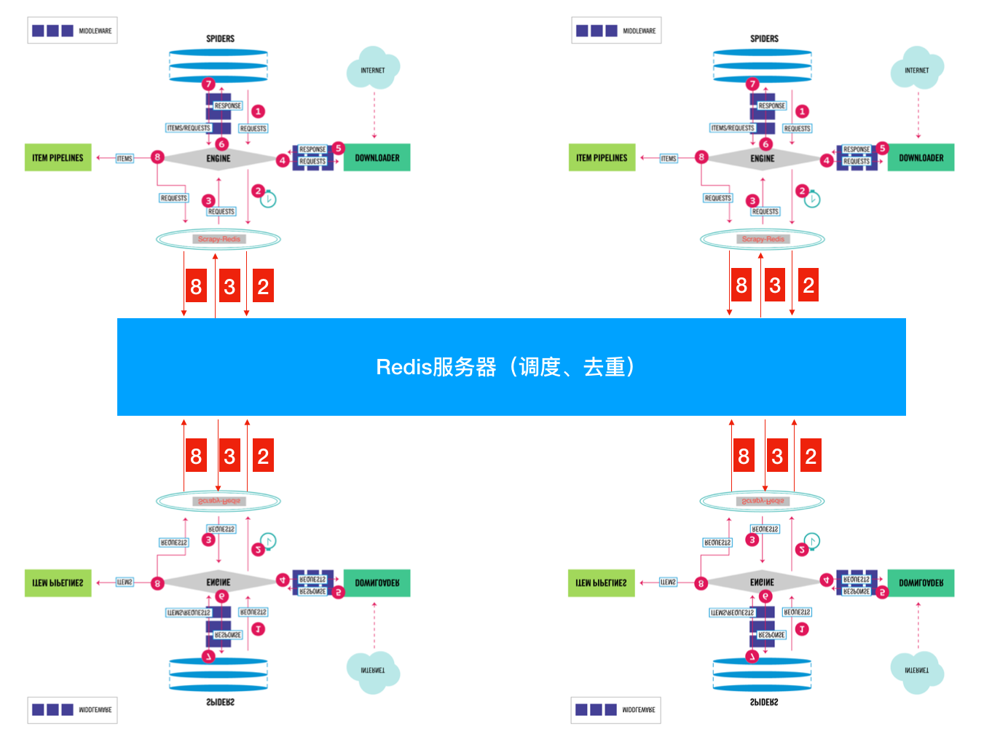

# Scrapy-Redis

- [Scrapy-Redis](#scrapy-redis)
  - [Introduction](#introduction)

## Introduction

scrapy-redis与scrapy的不同
- 存item数据: 对应redis数据库中`spider_name:items`
- 存request: 对应redis数据库中`spider_name:requests`
- 存request的指纹(hash value): 对应redis数据库中`spdier_name:dupefilter`

通过redis的subscribe-publish实现多个客户端之间的通信
> 

`pip install scrapy-redis`, scrapy-redis 四个组件
- Scheduler: 通过subscribe-publish和redis队列来实现数据的采集，调度
- Duplication Filter: 通过redis的set实现
- Item Pipeline: 如果有优先级，是通过zset实现
- Base Spiders.

分布式使用流程:
- Master只用启动redis-server即可，并提供ip,port
- 一套代码复制到多台机器slave。多个slave端只要有python, scrapy, scrapy-redis并配置ip, port，然后启动爬虫
- 随便一台机器连接redis-server发送给命令: `lpush myspider:start_urls http://www.dmoz.org/`

scrapy-reids实现分布式的两个class: `RedisSpider`, `RedisCrawlSpider`

example: scrapy redis [example](https://github.com/rmax/scrapy-redis/blob/master/example-project/example/spiders/dmoz.py)
>   
> settings.py中设置redis的ip, port即可使用，但并没有继承scrapy-redis的类，所以只是为了演示scrapy能够连接redis: `scrapy crawl dmoz`;  
> 并且项目停止之后，指纹仍然保存在redis中，下次重新启动爬虫，爬虫从上次的位置开始继续爬取，也就是`SCHEDULER_PERSIST=True`

```py
# settings.py
SPIDER_MODULES = ['example.spiders']
NEWSPIDER_MODULE = 'example.spiders'

DUPEFILTER_CLASS = "scrapy_redis.dupefilter.RFPDupeFilter"
SCHEDULER = "scrapy_redis.scheduler.Scheduler"


# True停止爬虫(比如加个新功能)，再重启爬虫，爬虫继续爬; False爬虫重新爬
SCHEDULER_PERSIST = True

#SCHEDULER_QUEUE_CLASS = "scrapy_redis.queue.SpiderPriorityQueue"
#SCHEDULER_QUEUE_CLASS = "scrapy_redis.queue.SpiderQueue"
#SCHEDULER_QUEUE_CLASS = "scrapy_redis.queue.SpiderStack"

ITEM_PIPELINES = {
    # 加时间戳的优先级300比进入redis数据库的优先级400要高
    # 这两个不要动
    'example.pipelines.ExamplePipeline': 300,
    # 处理item可以使用scrapy_redis的pipeline
    # 如果item数据都放在redis上，会增加redis压力；而且每个slave还得把item通过网络传递给redis, 会降低效率；所以一般slave机器分别保存自己的item到本地的mongodb上，所以一般注释掉下面这行
    'scrapy_redis.pipelines.RedisPipeline': 400,
}

# 这两个不写就是localhost
REDIS_HOST='192.168.1.10'
REDIS_PORT=6379
# REDIS_URL更好用，可以配置redis密码
```

```py
# pipelines.py
# 只是redis处理数据之前，先加入时间戳和name
from datetime import datetime

class ExamplePipeline(object):
    def process_item(self, item, spider):
        item["crawled"] = datetime.utcnow()
        item["spider"] = spider.name
        return item
```

```py
from scrapy.linkextractors import LinkExtractor
from scrapy.spiders import CrawlSpider, Rule

class DmozSpider(CrawlSpider):
    """Follow categories and extract links."""
    name = 'dmoz'
    allowed_domains = ['dmoz.org']
    start_urls = ['http://www.dmoz.org/']

    rules = [
        Rule(LinkExtractor(
            restrict_css=('.top-cat', '.sub-cat', '.cat-item')
        ), callback='parse_directory', follow=True),
    ]

    def parse_directory(self, response):
        for div in response.css('.title-and-desc'):
            yield {
                'name': div.css('.site-title::text').extract_first(),
                'description': div.css('.site-descr::text').extract_first().strip(),
                'link': div.css('a::attr(href)').extract_first(),
            }
```

example: scrapy redis [RedisSpider example](https://github.com/rmax/scrapy-redis/blob/master/example-project/example/spiders/myspider_redis.py)
>   
> 这个RedisSpider例子可以演示分布式: `scrapy runspider myspider_redis.py`; `lpush`一个url, 程序爬一次， 要爬取多次也需要构造通过`yield scrapy.Request()`, 或者写一个redis client循环lpush url到redis

```py
from scrapy_redis.spiders import RedisSpider

class MySpider(RedisSpider):
    """Spider that reads urls from redis queue (myspider:start_urls)."""
    name = 'myspider_redis'
    redis_key = 'myspider:start_urls' # 启动Slave端爬虫的key

    # 要么采用如下的方式，要么采用下面方式通过url动态获取域名，两种方式没有本质区别
    # allowed_domains = ['wz.sun0769.com']

    def __init__(self, *args, **kwargs):
        # Dynamically define the allowed domains list.
        domain = kwargs.pop('domain', '')
        self.allowed_domains = filter(None, domain.split(','))
        super(MySpider, self).__init__(*args, **kwargs)

    def parse(self, response):
        return {
            'name': response.css('title::text').extract_first(),
            'url': response.url,
        }
```

```py
# main.py和items.py同一层
from scrapy import cmdline

cmdline.execute('scrapy runspider myspider_redis.py'.split())
```

example: `RedisCrawlSpider`
>   
> 这个RedisSpider例子可以演示分布式: `scrapy runspider mycrawler_redis.py`

```py
from scrapy.spiders import Rule
from scrapy.linkextractors import LinkExtractor
from scrapy_redis.spiders import RedisCrawlSpider

class MyCrawler(RedisCrawlSpider):
    """Spider that reads urls from redis queue (myspider:start_urls)."""
    name = 'mycrawler_redis'
    redis_key = 'mycrawler:start_urls'

    rules = (
        # follow all links
        Rule(LinkExtractor(), callback='parse_page', follow=True),
    )

    def __init__(self, *args, **kwargs):
        # Dynamically define the allowed domains list.
        domain = kwargs.pop('domain', '')
        self.allowed_domains = filter(None, domain.split(','))
        super(MyCrawler, self).__init__(*args, **kwargs)

    def parse_page(self, response):
        return {
            'name': response.css('title::text').extract_first(),
            'url': response.url,
        }
```

tips: 如果slave机器不多，可以每台机器用git同步代码；如果slave机器太多，就需要用到[scrapyd](https://scrapyd.readthedocs.io/en/latest/) or [python-scrapyd-api](https://python-scrapyd-api.readthedocs.io/en/latest/)来部署(deployment)

tip: put file from local to remote

```bash
# in localmachine
tar -cvf your_folder.tar your_foler
# tar and zip: tar -zcvf your_folder.tar.gz your_foler

sftp username@192.168.1.111 # then enter your password
sftp> ls # list remote directory
sftp> lls # local list directory
sftp> put your_folder.tar

# in remote machine
tar -xvf your_foler.tar
# unzip: tar -zxvf your_foler.tar.gz
```

