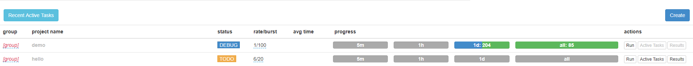

# PySpider Framework

`pip install pyspider`
> python <3.7, 不需要修改源码  
> python>=3.7, 需要修改pyspider的源码(因为async是python3.7的keyword)，将async替换为其他名称  
- 配置phantomjs到环境变量，可以渲染js
- 不配置phantomjs，直接请求

[PySpider](https://github.com/binux/pyspider) Features:
- 多进程处理
- 去重处理
- pyquery提取
- 结果监控
- 错误重试
- WebUI管理(scrapy没有)
- JS渲染(scrapy没有): 通过phantomjs添加入环境变量来实现
- 代码简洁

example: lsm by pyspider
1. `pyspider all` or `pyspider`
2. 浏览器访问`localhost:5000`
3. 浏览器GUI, create a project
4. 通过gui以及手动添加内容, save
5. 在GUI界面STATUS修改为DEBUG或者RUNNING, 然后run

```py
#!/usr/bin/env python
# -*- encoding: utf-8 -*-
# Created on 2020-01-09 13:05:40
# Project: demo

from pyspider.libs.base_handler import *
import pymongo

class Handler(BaseHandler):
    crawl_config = {
        # global setting
        'User-Agent': 'Mozilla/5.0 (Windows NT 10.0; Win64; x64; rv:72.0) Gecko/20100101 Firefox/72.0',
    }
    
    # add by user
    client=pymongo.MongoClient("mongodb://grey:pwd@ip:27017")
    db=client['test']

    @every(minutes=24 * 60)
    def on_start(self):
        self.crawl('https://www.lsmpx.com/', callback=self.index_page)

    @config(age=10 * 24 * 60 * 60)
    def index_page(self, response):
        for each in response.doc('h2 > a').items():
            self.crawl(each.attr.href, callback=self.detail_page)
        
        # add by user
        next=response.doc('.pg a:last-child').attr.href
        self.crawl(next, callback=self.index_page)
        
    @config(priority=2)
    def detail_page(self, response):
        data= {
            "url": response.url,
            "date": response.doc('#thread-title > em').text(),
            "source":response.doc('#thread-title > a').text(),
            "views":response.doc('#thread-title > span').eq(0).text(),
            "comments":response.doc('#thread-title > span:nth-child(5)').text(),
        }
    
        return data
    
    # add by user
    def on_result(self, result):
        if result:
            self.save_to_mongo(result)
    
    # add by user
    def save_to_mongo(self, result):
        # 第一个参数是query用于定位
        # 第二个参数是用于update的数据
        # upsert: insert a new document if a matching document does not exist.
        if self.db['lsm'].update({'url': result['url']}, {'$set': result}, upsert=True):
            print('save to mongodb')
```

tip: GUI中的rate表示每秒发送多少request, burst是令牌桶的数量, 后面几个progressbar是统计信息
> 

example: pyspider with douban json

```py
from pyspider.libs.base_handler import *

class Handler(BaseHandler):
    def on_start(self):
        self.crawl('http://movie.douban.com/j/search_subjects?type=movie&tag=%E7%83%AD%E9%97%A8&sort=recommend&page_limit=20&page_start=0',
                   callback=self.json_parser)

    def json_parser(self, response):
        return [{
            "title": x['title'],
            "rate": x['rate'],
            "url": x['url']
        } for x in response.json['subjects']]
```

example: pyspider with pagination

```py
from pyspider.libs.base_handler import *

class Handler(BaseHandler):
    @every(minutes=24 * 60)
    def on_start(self):
        pg=1
        while pg <= 30:
            url = f'https://mm.taobao.com/json/request_top_list.htm?page={pg}'
            self.crawl(url, callback=self.index_page)
            pg += 1

    @config(age=10 * 24 * 60 * 60)
    def index_page(self, response):
        for each in response.doc('a[href^="http"]').items():
            self.crawl(each.attr.href, callback=self.detail_page)

    @config(priority=2)
    def detail_page(self, response):
        return {
            "url": response.url,
            "title": response.doc('title').text(),
        }
```