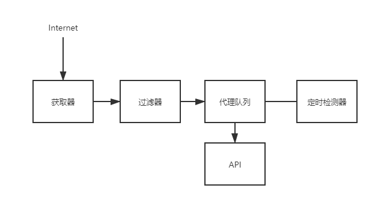

# Scraper Pool

- [Scraper Pool](#scraper-pool)
  - [Flask-Redis supported proxy pool](#flask-redis-supported-proxy-pool)

## Flask-Redis supported proxy pool

代理池需要定期检查、更新，其中Redis提供队列存储，Flask提供API返回代理.架构图如下
> 

其中定时更新器的原理: 从Redis的list的左侧取出proxy，去请求baidu，如果有效添加回Redis的list右侧，无效就抛弃；

[ProxyPool](https://github.com/Python3WebSpider/ProxyPool)

