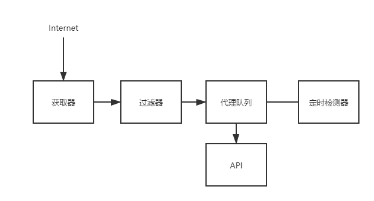

# Scraper Pool

- [Scraper Pool](#scraper-pool)
  - [Flask-Redis supported proxy pool](#flask-redis-supported-proxy-pool)
  - [Operation Automation](#operation-automation)
  - [scrapy-splash](#scrapy-splash)
  - [scrapyd](#scrapyd)

## Flask-Redis supported proxy pool

代理池需要定期检查、更新，其中Redis提供队列存储，Flask提供API返回代理.架构图如下
> 

其中定时更新器的原理: 从Redis的list的左侧取出proxy，去请求baidu，如果有效添加回Redis的list右侧，无效就抛弃；

[ProxyPool](https://github.com/Python3WebSpider/ProxyPool)

[CookiePool](https://github.com/Germey/CookiesPool)

example: simple flask server

```py
from flask import Flask
app = Flask(__name__)


@app.route("/")
def home():
    return "Hello, Flask!"

@app.route("/index")
def index():
    return "Hello, Index!"

if __name__ == "__main__":
    app.run()
```

example: flask with graph(pyecharts)

```
.
|-- templates
|   `-- pyecharts.html
`-- app.py
```

```html
<!-- pyecharts.html -->
<!DOCTYPE html>
<html>
  <head>
    <meta charset="utf-8" />
    <title>My Graph</title>
    
    <script src="{host}{js_name}"></script>
    
  </head>

  <body>
    {{myechart|safe}}
    <br />
  </body>
</html>
```

```py
# app.py
from flask import Flask, render_template

import random
from pyecharts import options as opts
from pyecharts.charts import Bar3D
from pyecharts.faker import Faker

app = Flask(__name__)

def bar3d_base() -> Bar3D:
    data = [(i, j, random.randint(0, 12)) for i in range(6) for j in range(24)]
    c = (
        Bar3D()
        .add(
            "",
            [[d[1], d[0], d[2]] for d in data],
            xaxis3d_opts=opts.Axis3DOpts(Faker.clock, type_="category"),
            yaxis3d_opts=opts.Axis3DOpts(Faker.week_en, type_="category"),
            zaxis3d_opts=opts.Axis3DOpts(type_="value"),
        )
        .set_global_opts(
            visualmap_opts=opts.VisualMapOpts(max_=20),
            title_opts=opts.TitleOpts(title="Bar3D-基本示例"),
        )
    )
    return c


@app.route("/index")
def index():
    obj = bar3d_base()
    js_host=obj.js_host
    js_list=obj.js_dependencies.items
    graph_html=obj.render_embed()
    return render_template('pyecharts.html', js_list=js_list, host=js_host, myechart=graph_html)


if __name__ == "__main__":
    app.run()
```

## Operation Automation

`conda install psutil`

```py
import psutil
from datetime import datetime

# cpu
print(psutil.cpu_times())
# 逻辑核心
print(psutil.cpu_count())
# 物理核心
print(psutil.cpu_count(logical=False))

# memory
print(psutil.virtual_memory())
print(psutil.virtual_memory().percent)
print(psutil.swap_memory())

# disk
print(psutil.disk_partitions())
print(psutil.disk_usage('c:\\'))
print(psutil.disk_io_counters())

# network
print(psutil.net_io_counters())
print(psutil.net_io_counters(pernic=True)) # every net card

# system
print(psutil.users())
print(psutil.boot_time()) # 开机时间
print(datetime.fromtimestamp(psutil.boot_time()))

# process
print(psutil.pids())
p=psutil.Process(pid=220)
print(p.name())
print(p.exe())
print(p.status())
print(datetime.fromtimestamp(p.create_time()))
print(p.memory_full_info())
print(p.memory_info())
print(p.environ())
print(p.io_counters())
print(p.username())

# run process
p1=psutil.Popen('calc')
print(p1.name())
print(p1.username())
p2=psutil.Popen(['ping', 'www.baidu.com'])
print(p2.name())
print(p2.cpu_times())
```

`pip install IPy`

```py
from IPy import IP

ip1=IP('192.168.1.4')
print(ip1.broadcast())
print(ip1.version()) # ipv4
print(ip1.net())
print(ip1.netmask())
print(ip1.reverseNames())
print(ip1.iptype()) # PIRVATE

IP('2607:f0d0:1002:51::4').version() # ipv6
print(IP('::1').version()) # ipv6

ip2=IP('192.168.0.0/16')
print(ip2.broadcast())
print(ip2.version()) # ipv4
print(ip2.net())
print(ip2.netmask())
print(ip2.reverseNames())
print(ip2.iptype()) # PIRVATE

ip3=IP('192.168.1.0/24') # 24代表子网掩码有24个1，也就是255.255.255.0
print(ip3.strNormal(0)) # 起始ip
print(ip3.strNormal(1)) # name
print(ip3.strNormal(2)) # 起始ip/子网掩码
print(ip3.strNormal(3)) # 起始ip~结尾ip: 网段

print(ip3.broadcast())
print(ip3.version()) # ipv4
print(ip3.net())
print(ip3.netmask())
print(ip3.reverseNames())
print(ip3.iptype()) # PIRVATE

for ip in IP('192.168.1.0/24'):
    print(ip)

# make net
IP('192.168.1.0-192.168.1.255') # IP('192.168.1.0/24')
IP('192.168.0.0-192.168.255.255') # IP('192.168.0.0/16')
```

`pip install dnspython`

```py
from dns import resolver

# A记录: 主机转换为ip
A=resolver.query('taobao.com', 'A')
for i in A.response.answer:
    for j in i.items:
        print(j)

MX=resolver.query('qq.com', 'MX')
# 根据域名得到邮箱的域名
for i in MX:
    print(i)

CNAME1=resolver.query('www.baidu.cn', 'CNAME')
CNAME2=resolver.query('www.baidu.com', 'CNAME')
# 域名的别名
for i, j in zip(CNAME1, CNAME2):
    print(i, j)

NS=resolver.query('baidu.com', 'NS')
# 域名下的子域名
for i in NS:
    print(i)
```

## scrapy-splash

scrapy-splash 作为scrapy的中间件来进行js渲染

- install docker
  - `sudo apt install docker.io`
  - `sudo systemctl start docker`
  - `sudo systemctl enable docker`
  - `docker -v`
  - `sudo docker info`
  - `sudo docker images`
- docker remove images
  - `sudo docker ps -a`
  - `sudo docker stop a7638d7e`
  - `sudo docker rm a7638d7e`
  - `sudo docker rmi a7638d7e`
- get docker image and run
  - `sudo docker pull scrapinghub/splash`
  - `docker run -p 8050:8050 scrapinghub/splash`, 提供服务
- begin scrapy project
  - `pip install scrapy-splash`

tip: [docker pull too slow](https://www.cnblogs.com/BillyYoung/p/11113914.html)

example: scrapy-splash

```
│  scrapy.cfg
└─hello
    │  items.py
    │  middlewares.py
    │  pipelines.py
    │  settings.py
    │
    └─spiders
            zhejiang.py
```

```py
# settings.py
BOT_NAME = 'hello'

SPIDER_MODULES = ['hello.spiders']
NEWSPIDER_MODULE = 'hello.spiders'

ROBOTSTXT_OBEY = False

DEFAULT_REQUEST_HEADERS = {
    'Accept': 'text/html,application/xhtml+xml,application/xml;q=0.9,*/*;q=0.8',
    'User-Agent': 'Mozilla/5.0 (Windows NT 10.0; Win64; x64; rv:71.0) Gecko/20100101 Firefox/71.0',
}
FEED_EXPORT_ENCODING = 'utf8'

# custom setting
# remote url or localhost
# SPLASH_URL = 'http://xx.xx.xx.xx:8050'
SPLASH_URL = 'http://127.0.0.1:8050'

DOWNLOADER_MIDDLEWARES = {
    'scrapy_splash.SplashCookiesMiddleware': 723,
    'scrapy_splash.SplashMiddleware': 725,
    'scrapy.downloadermiddlewares.httpcompression.HttpCompressionMiddleware': 810,
}
SPIDER_MIDDLEWARES = {
    'scrapy_splash.SplashDeduplicateArgsMiddleware': 100,
}
DUPEFILTER_CLASS = 'scrapy_splash.SplashAwareDupeFilter'
HTTPCACHE_STORAGE = 'scrapy_splash.SplashAwareFSCacheStorage'
```

```py
# zhejiang.py
import scrapy
from scrapy_splash import SplashRequest

class ZhejiangSpider(scrapy.Spider):
    name = 'zhejiang'
    allowed_domains = ['zfcg.czt.zj.gov.cn']
    start_urls = ['http://zfcg.czt.zj.gov.cn/purchaseNotice/index.html?categoryId=40']

    def start_requests(self):
        for url in self.start_urls:
            yield SplashRequest(url, self.parse, args={'wait': 0.5})

    def parse(self, response):
        titles = response.xpath("//span[@class='underline']/text()").extract()
        for title in titles:
            yield {'title': title}
```

## scrapyd

tips: 如果slave机器不多，可以每台机器用git同步代码；如果slave机器太多，就需要用到[scrapyd](https://scrapyd.readthedocs.io/en/latest/) or [python-scrapyd-api](https://python-scrapyd-api.readthedocs.io/en/latest/)来部署(deployment)

scrapyd installation:
- `pip install Twisted==18.9.0`
- `pip install scrapyd`
- run `scrapyd` in server
- in browser: `127.0.0.1:6800`

```bash
# /etc/scrapyd/scrapyd.conf
[scrapyd]
eggs_dir    = eggs
logs_dir    = logs
items_dir   =
jobs_to_keep = 5
dbs_dir     = dbs
max_proc    = 0
max_proc_per_cpu = 4
finished_to_keep = 100
poll_interval = 5.0

# 为了远程访问
bind_address = 0.0.0.0
http_port   = 6800
debug       = off
runner      = scrapyd.runner
application = scrapyd.app.application
launcher    = scrapyd.launcher.Launcher
webroot     = scrapyd.website.Root

[services]
schedule.json     = scrapyd.webservice.Schedule
cancel.json       = scrapyd.webservice.Cancel
addversion.json   = scrapyd.webservice.AddVersion
listprojects.json = scrapyd.webservice.ListProjects
listversions.json = scrapyd.webservice.ListVersions
listspiders.json  = scrapyd.webservice.ListSpiders
delproject.json   = scrapyd.webservice.DeleteProject
delversion.json   = scrapyd.webservice.DeleteVersion
listjobs.json     = scrapyd.webservice.ListJobs
daemonstatus.json = scrapyd.webservice.DaemonStatus
```